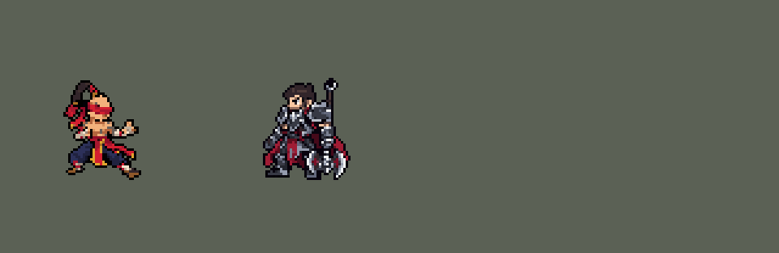
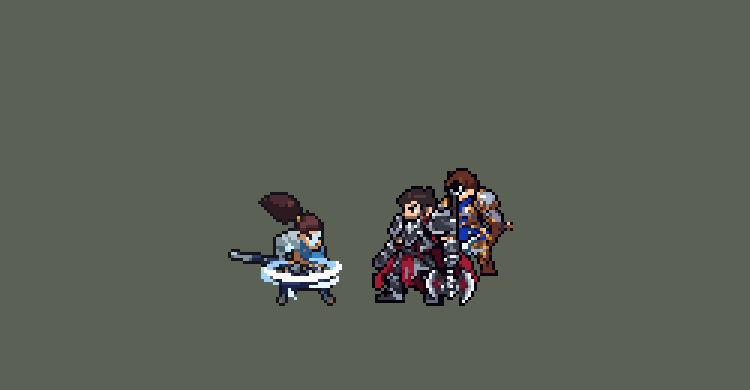
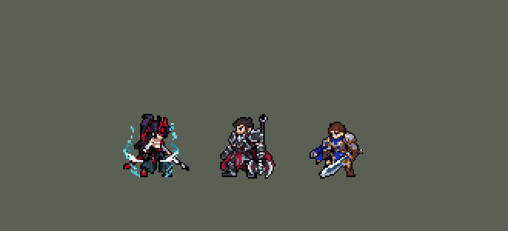
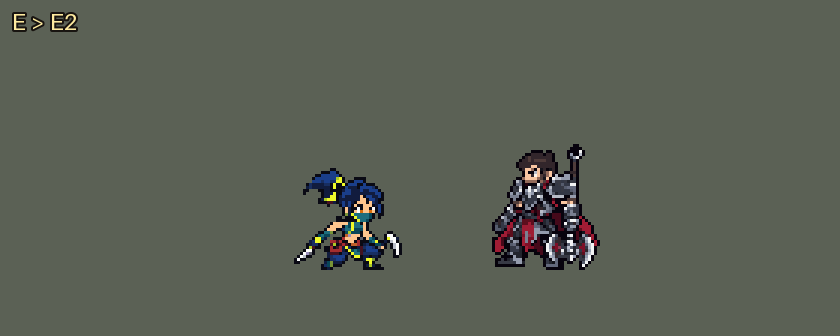
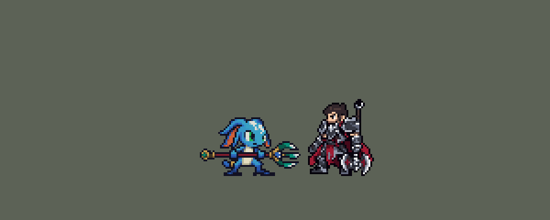

# TFM2-League-Heroes

团战经理2（Teamfight Manager 2）的英雄联盟英雄 Mod，mod_id 是 `league`。纯数据 mod：不改游戏本体，不需要编译。

英雄：盖伦（`league_garen`）、艾希（`league_ashe`）、拉克丝（`league_lux`）、李青（`league_leesin`）、索拉卡（`league_soraka`）、德莱厄斯（`league_darius`）、阿木木（`league_amumu`）、亚索（`league_yasuo`）、金克丝（`league_jinx`）、蕾欧娜（`league_leona`）、提莫（`league_teemo`）、易（`league_masteryi`）、安妮（`league_annie`）、厄运小姐（`league_missfortune`）、迦娜（`league_janna`）、墨菲特（`league_malphite`）、艾克（`league_ekko`）、永恩（`league_yone`）、伊泽瑞尔（`league_ezreal`）、锤石（`league_thresh`）、凯尔（`league_kayle`）、费德提克（`league_fiddlesticks`）、阿狸（`league_ahri`）、卢锡安（`league_lucian`）、莫甘娜（`league_morgana`）、锐雯（`league_riven`）、贝蕾亚（`league_briar`）、阿卡丽（`league_akali`）、薇恩（`league_vayne`）、娜美（`league_nami`）、贾克斯（`league_jax`）、黛安娜（`league_diana`）、维迦（`league_veigar`）、塔里克（`league_taric`）、崔丝塔娜（`league_tristana`）、菲奥娜（`league_fiora`）、菲兹（`league_fizz`）、萨科（`league_shaco`）、凯特琳（`league_caitlyn`）、魔腾（`league_nocturne`）、布里茨（`league_blitzcrank`）、卡蜜尔（`league_camille`）、乐芙兰（`league_leblanc`）、卡莎（`league_kaisa`）、娑娜（`league_sona`）、凯南（`league_kennen`）、蔚（`league_vi`）、瑞兹（`league_ryze`）。每组上单、打野、中单、ADC、辅助各一：第一组盖伦、李青、拉克丝、艾希、索拉卡，第二组德莱厄斯、阿木木、亚索、金克丝、蕾欧娜，第三组提莫、易（无极剑圣）、安妮、厄运小姐、迦娜，第四组墨菲特、艾克、永恩、伊泽瑞尔、锤石，第五组有上单凯尔、打野费德提克、中单阿狸、ADC 卢锡安、辅助莫甘娜，第六组有上单锐雯、打野贝蕾亚、中单阿卡丽、ADC 薇恩、辅助娜美，第七组有上单贾克斯、中单维迦、ADC 崔丝塔娜、辅助塔里克，第八组有上单菲奥娜（剑姬，排在原定凯南的位置，凯南延后）、中单菲兹、ADC 凯特琳、辅助布里茨，第九组有上单卡蜜尔（青钢影）、打野魔腾、中单乐芙兰、ADC 卡莎、辅助娑娜。按用户 10 月 2 日排的顺序，打野黛安娜是第七组的，萨科是第八组的。第十组有上单凯南、打野蔚、中单瑞兹。

对敌人放的小技能，施放目标是「敌人（不含防御塔）」，清线、打野时也会放；只有大招、德莱厄斯的 E（拉人）、阿木木的 Q（绷带）、锤石的 Q（钩子）、阿狸的 E（魅惑）、薇恩的 E（恶魔审判）、维迦的 E（扭曲空间）、凯特琳的 W（约德尔诱捕器）和卡莎的 W（虚空索敌）只对英雄放（莫甘娜的 Q 对什么都放，但射程内有敌方英雄时朝英雄射；贝蕾亚的 Q 也一样，射程内有敌方英雄时扑英雄；娜美的 W、Q 也是，射程内有敌方英雄时打英雄；黛安娜的 Q 也一样，射程内有敌方英雄时朝英雄射，E 带着月光再冲的第二下也先找英雄；菲奥娜的 Q、W 也一样，射程内有敌方英雄时冲向、刺向英雄；凯特琳的 Q 也一样，射程内有敌方英雄时朝英雄射；凯南的 Q 也一样，射程内有敌方英雄时锁定英雄射）；提莫的 W 是给自己加速和伪装，也只在敌方英雄靠近时放。最早几个英雄的小技能只对英雄放，打野时一直平 A 野怪，按玩家反馈改了。

















## 英雄：盖伦

技能按创意工坊 *League of Legends Reborn* 的做法处理。团战经理2 只有「技能1、技能2、大招」三个技能位，所以大招放 R，两个技能位放最有代表性的两个小技能，剩下的小技能和被动合并进去。

| 部分 | 内容 |
|---|---|
| 技能1 | Q「致命打击」：加速；下一次普攻变成跃起重击并沉默目标。合并 W「勇气」：减伤、韧性、60 + 50% 攻击力的护盾（原来写的"最大生命值加成"字段游戏不读，护盾一直只有 60） |
| 技能2 | E「审判」：旋转 3 秒，边转边走向身边的敌人（贴身的英雄优先），共 7 次伤害，每次对半径 40000 内的敌人造成 25 + 55% 攻击力，追着的目标每次多受 25%（6 + 14% 攻击力），最后一次降低护甲 25%，6 秒。被动「坚韧」：高生命回复。每次伤害原来只有 12 + 32% 攻击力（英雄联盟每圈的数值），一次 E 的伤害还不如同样时间里平 A，玩家以为 E 不造成伤害。改成 25 + 55% 后玩家仍觉得 E 鸡肋：模拟里 E 占盖伦约 70% 的伤害，但他打上路对原版上单时，队伍每 10 分钟少约 3 个击杀。原因是旋转半径只有 30000：AI 在目标离他约 45 px 时就开始放 E（施法距离按两边的边缘算），站在边上的敌人扫不到，而英雄联盟里 E 的半径约是普攻距离的 1.9 倍。半径改成 40000，加上英雄联盟的「最近的敌人多受 25%」和 6 秒破甲后，和原版上单打平（击杀差 −3.0 → 0.0，各 240 局），剑风特效跟着放大到约 80 px 宽。转圈时怎么移动（玩家万华，2026-10-03：「自动吸附敌方英雄有点容易送了，而且清兵的时候不会动，也很呆」）：原来每一圈都以比走路快的速度冲向 60000 内随机的一个敌方英雄（常常是前排后面的、塔下的），附近没有英雄就原地转。现在每一圈按圈层找：贴身（25000 内）的英雄 → 30000 内的任何敌人（小兵、野怪、英雄）→ 45000 内的任何敌人，用他自己的移速（1000）走过去，+25% 打在他走向的那个敌人身上（`tools/kit/garen_spin.py`）。模拟 432 局（上路对原版 fighter / knight / executioner）：清兵、打野时原地不动的 E 73% → 6%，转完身边 40000 内没有队友 44% → 40%，每局死亡 4.29 → 4.25，击杀差 −0.98 → −1.47（误差约 0.35）；完全不优先英雄的版本转完落单只有 34%，但打不中正在打的英雄，击杀差 −2.08，没用 |
| 大招 | R「德玛西亚正义」：巨剑从天而降，造成真实伤害 |
| 精灵图 | 9 个动作 56 帧：待机、走路、普攻、Q 跃斩、战吼、E 旋转、R 施放、受击、死亡。身高约 36 px（原版人类英雄约 31 px），和原版一样是 Q 版大头（头约占身高 1/3），脸和眼睛在游戏里看得清。全部是正面 3/4 朝右，同一套造型和大小；除战吼和受击外，都按英雄联盟原版动作重画 |
| 特效 | 命中火花、Q 重击与沉默、Q 强化光环、W 护盾、E 剑风、R 天降巨剑 |
| 图标 | 官方技能图标（Q / E / R），从本地客户端提取，缩到 64×64 |
| 音频 | 从本地客户端提取的 9 条技能音效和 4 条中文语音。版权属于 Riot Games，**不提交到仓库**，按下面的命令在本地生成 |

### 从本地英雄联盟提取音频和图标

```bash
python tools/lol/extract_garen.py --lol "D:\WeGameApps\lol" --vgmstream "<vgmstream-cli.exe 路径>"
```

- 需要 Python 3.14（自带 zstd 解压），以及 `pip install pillow numpy`。
- `.wem` 音频要用 [vgmstream](https://github.com/vgmstream/vgmstream) 解码。
- 中文语音来自国服（WeGame）客户端的 `Garen.zh_CN.wad.client`。
- 只读取游戏文件，不修改。

`tools/lol/pose_ref.py` 从客户端读取英雄的模型、骨骼和动画，渲染真实动作的关键帧（3/4 视角朝右），作为 GPT 生图时的姿势参考。渲染图是 Riot 的模型，只在本地用，不入库。

`tools/lol/riot.py` 负责：
- 读取 WAD 包。
- 解析 Wwise 音频包。
- 把 `Play_sfx_Garen_...` 这类事件名对应到具体的音频文件。

以后做别的英雄也能直接用。

### 美术：GPT 生成，再导入成像素图

原图在 [`assets/source/garen/`](assets/source/garen/)。角色图是和艾希同一批的 Q 版重画，提示词见 [`CHIBI_REDRAW.md`](assets/source/CHIBI_REDRAW.md)，生成记录在 [`assets/source/chibi/`](assets/source/chibi/)；特效图和之前几轮的提示词见 [`PROMPTS.md`](assets/source/garen/PROMPTS.md)。

```bash
pip install pillow numpy
python tools/art/import_garen.py          # 写出 league/champions 和 league/effects 里的精灵图
python tools/art/preview_garen.py         # 写出 docs/preview 里的预览图和演示动图
```

导入脚本做这些事：
- 切帧：按空白列切开，连在一起的剑、光效整块归到同一帧。
- 缩放：每张图单独缩放，保证头一样大（GPT 每张图的头身比略有出入，按身高对齐会让头忽大忽小）。
- 对齐：脚底统一放在帧中心下方 11.5 px（和原版一致）。待机、战吼、受击按腿部和待机第一帧对齐；照英雄联盟动作画的走路、普攻、Q、R、死亡，按原版骨骼里头部的位置摆放（`pose_ref.py --track`）；普攻、Q、R 的前冲保留约 70%，免得收招时弹回待机太明显；E 旋转按两脚中点固定。
- 像素化：硬边、共享 64 色调色板、1 px 黑描边。
- 头像截取点（`champion_view` 的 `face`）用 `tfm2_ase.py face` 按原版英雄的规律定在头顶，`lint_mod.py` 会检查。

通用部分在 skill 的 `scripts/strips.py`，以后做别的英雄可以直接用。

逐帧预览：[`docs/preview/league_garen_frames.png`](docs/preview/league_garen_frames.png)，特效：[`docs/preview/league_garen_effects.png`](docs/preview/league_garen_effects.png)。

## 英雄：艾希

| 部分 | 内容 |
|---|---|
| 普攻 | 冰霜箭。被动「冰霜射击」：普攻减速 |
| 技能1 | Q「射手的专注」：4 秒内攻速提高；期间普攻换成英雄联盟里 Q 的连射姿势，伤害更高、减速更强 |
| 技能2 | W「万箭齐发」：向目标方向扇形射出 13 支冰霜箭（英雄联盟是 9 支），范围内每个敌人受到一次伤害并减速。数据里没有扇形判定，用的是线形范围技能（`LineRangeProjectile`，长 80、宽 45），画面上是扇形箭雨。SDK 模拟实测：宽度是离中线的距离，两头是圆的，单位中心离「艾希 → 前方 80 像素」这段线 60 像素以内都会被打中（45 + 约 15），身旁、身后也算 |
| 大招 | R「魔法水晶箭」：远距离直线飞行，眩晕第一个命中的敌方英雄，并在命中处炸开，减速周围敌人 |
| 修正（0.10.0） | W 之前在箭雨出现 2 tick 后就结算，箭还没飞出去；现在在箭雨飞到位的第 13 tick 结算，280 ms 的箭雨画面也不再在第 13 tick 被截断。SDK 对战模拟（对原版射手，两边各 36 局）团队击杀差 +2.45 → +1.43 |
| 修正（W 加宽） | 玩家觉得 W 窄。箭雨从 9 支、±28° 改成 13 支、±42°（间隔还是 7°），最后一帧箭尖从左右 35 像素展开到 50 像素，和实际打中的范围（中线左右 60 像素）对得上。判定和伤害都没改，击杀差不变。也试了加宽判定（SDK 模拟，对原版射手 gunner、soldier、archer、gambler）：宽 45000 / 55000 / 60000 / 70000 时，每次 W 命中英雄 0.68 / 0.76 / 0.84 / 0.92 个（每档 72 局），艾希伤害 11307 / 11576 / 11694 / 11951，团队击杀差 +2.40 / +2.58 / +2.26 / +2.03（每档 576 局；同一套数据两批种子差 0.9，都在噪声里）。判定本来就比画面宽，所以没加 |
| 去掉 | E「鹰击长空」：侦察视野，团战经理2 没有战争迷雾 |
| 精灵图 | 9 个动作 56 帧：待机、跑步、普攻、Q 连射、Q 发动、W、R、受击、死亡。身高 34 px（含兜帽），和原版一样是 Q 版大头，兜帽不遮脸，蓝眼睛在游戏里看得见。全部正面 3/4 朝右，同一套造型；除受击外，每个动作都按英雄联盟原版动画的时间点渲染姿势参考后生成，首尾帧是原版「待机 ↔ 动作」的过渡姿势。之后按游戏原尺寸重画了一次（18 色，见[下文](#按游戏原尺寸重画拉克丝艾希)） |
| 特效 | 冰霜箭、W 扇形箭雨（用冰霜箭按 13 个角度拼成，±42°；最初是 9 个角度、±28°，玩家觉得窄；GPT 画的扇形只有 8 支箭、箭长不一，没采用）、Q 连射、命中冰花、Q 专注光环、R 水晶箭、R 命中冰冻 |
| 图标 | 官方技能图标（Q / W / R），从本地客户端提取，缩到 64×64 |
| 音频 | 从本地客户端提取的 9 条技能音效和 2 条中文语音（Q、W；国服语音包里 R 没有语音）。不提交到仓库，按下面的命令在本地生成 |

```bash
python tools/lol/extract_ashe.py --lol "D:\WeGameApps\lol" --vgmstream "<vgmstream-cli.exe 路径>"
python tools/art/import_ashe.py           # 特效：原图在 assets/source/ashe/，提示词见 ashe/PROMPTS.md
python tools/art/import_native.py --hero ashe   # 角色图：按游戏原尺寸重画的版本，在 assets/source/native/
python tools/art/preview_ashe.py
```

第一轮的角色图（提示词见 [`CHIBI_REDRAW.md`](assets/source/CHIBI_REDRAW.md)）细节很多：细长的冰晶弓、黑兜帽上的白发。按面积平均缩小会糊成一片土黄色，所以当时每个游戏像素只从共享调色板里选一个颜色：覆盖面积最大的那个，冰蓝、白发、肤色、金色的权重加大（`strips.render_vote`）。即便这样，游戏里还是碎成杂色点，后来按游戏原尺寸重画了（见下文）。`import_ashe.py --body` 仍能写出第一轮的角色图。

待机的呼吸（0.27.0 修正）：Codex 重画的造型披风垂到站位点下 8 行，靴子只剩最下面 4 行。呼吸的接缝原来在站位点下 6 行，正好切在披风最后一行和大腿的连接处，下沉时那一行被盖掉，靴子像和身体分开了（用户：腿像分开了一样）。接缝挪到站位点下 9 行的靴筒里：第 3–5 帧除鞋底那一行外整个人（披风、大腿、靴子上半截）一起下沉一格，轮廓不变，只有 6 格颜色不同。

逐帧预览：[`docs/preview/league_ashe_frames.png`](docs/preview/league_ashe_frames.png)，特效：[`docs/preview/league_ashe_effects.png`](docs/preview/league_ashe_effects.png)。

## 英雄：拉克丝

| 部分 | 内容 |
|---|---|
| 数值 | 照搬创意工坊 *League of Legends Reborn* 的拉克丝：属性、伤害、射程、冷却、光球和光圈的大小、激光的长宽。技能效果一样，数值就不另调了，由玩家自己选。只有大招仍然只对英雄放 |
| 普攻 | 法杖射出光弹。被动「光芒四射」：技能命中敌人后 5 秒内，下一次普攻引爆光芒，追加魔法伤害。团战经理2 只能判断施法者自己身上的状态，所以引爆的是下一个被普攻的敌人；敌人身上的光芒标记是命中时播放的特效 |
| 技能1 | Q「光之束缚」：直线光球，路径上的敌人受到魔法伤害并被禁锢 1.5 秒（英雄联盟里最多命中 2 个，数据里的直线投射物只有「穿透 / 不穿透」，没有命中数量）。合并 W「曲光屏障」：施放时拉克丝和身边的友方英雄获得护盾 |
| 技能2 | E「透光奇点」：抛出光球，落地后形成光圈，圈内敌人减速 20%，1 秒后自动引爆（AI 不会手动二次引爆） |
| 大招 | R「终极闪光」：跃起悬空，法杖浮在身前蓄力，约 0.5 秒后发射长 340、宽 40 的激光，直线上所有敌人受到魔法伤害 |
| 修正（0.10.0） | R 的伤害之前比激光早 0.43 秒结算（光束还没出现就扣血），现在在激光出现、放出光束音效的第 28 tick 结算。SDK 对战模拟（对原版中单，两边各 36 局）团队击杀差 +1.44 → +2.28 |
| 精灵图 | 8 个动作 51 帧：待机、跑步、普攻、Q、E、R、受击、死亡。身高 34 px，Q 版大头（头约占身高 1/3），蓝眼睛在游戏里看得清。全部正面 3/4 朝右；除受击外，每个动作都按英雄联盟原版动画的时间点渲染大头姿势参考后生成：R 里法杖离手悬在身前、发射后空中蜷身再落地，死亡被击飞后仰面倒地。之后按游戏原尺寸重画了一次（19 色，见[下文](#按游戏原尺寸重画拉克丝艾希)） |
| 特效 | 光弹、命中、Q 光球和定身光环、W 彩虹护盾、E 光球和地面光圈（引爆）、R 激光（预警线、蓄力、光束、消散）、光芒标记和引爆 |
| 图标 | 官方技能图标（Q / E / R），从本地客户端提取，64×64 |
| 音频 | 从本地客户端提取的 11 条技能音效和 3 条中文语音（Q、E、R）。不提交到仓库，按下面的命令在本地生成 |

```bash
python tools/lol/extract_lux.py --lol "D:\WeGameApps\lol" --vgmstream "<vgmstream-cli.exe 路径>"
python tools/art/import_lux.py            # 特效：原图和提示词在 assets/source/lux/
python tools/art/import_native.py --hero lux    # 角色图：按游戏原尺寸重画的版本，在 assets/source/native/
python tools/art/preview_lux.py
```

拉克丝从第一轮就按 Q 版比例生成：造型图附本包的盖伦、艾希和原版法系英雄对照图，姿势参考图本身就是大头比例，造型图检查通过后才批量生成动作。第一轮导入时：
- 每张动作图按头的大小缩放：待机的头在各帧上按不同比例做相关匹配，同一张图里可靠的匹配相差不到 3%。
- R 的法杖离手后越过了等宽格子的边界，按连通块切帧：含深蓝紧身衣的块是身体，其他块（法杖、光芒）归给左边最近的身体。
- 原地播放的特效按格子中心对齐（GPT 把每帧画在等宽格子的正中，偏差不超过 8 px）。
- 激光按判定长度缩放（原来 240 px，照搬 LoL Reborn 的数值后是 340 px；最亮的一帧粗 35 px，判定宽 40 px），从拉克丝身前 6 px 开始。E 的光圈同样跟着判定半径从 60 px 缩到 53 px（半径 26500），调色板仍按原来的大小取色，其他特效的颜色不变。游戏把激光画在单位中心的高度，R 里悬浮的法杖离地约 14 px，正好在光束里。

后来角色图按游戏原尺寸重画了（见下文），每帧的位置沿用第一轮，所以法杖仍在光束里。`import_lux.py --body` 仍能写出第一轮的角色图。

跑步第 4、5、7、8 帧的下半身像变了形：英雄联盟里拉克丝跑到后半段把法杖竖在身后，杖尾垂到后脚边，游戏尺寸下金白色的杖尾和后腿粘在一起，看起来像一只金色的脚。这四帧的杖尾改画成和其他帧一样的深色靴子（杖尾算作被腿挡住），逐像素记在 [`native/lux_retouch.json`](assets/source/native/lux_retouch.json)，导入时套用。

待机的法杖看起来是歪的：法杖从她身后斜穿过去，露出的两截不在一条直线上。脚边金球到左腿那截画成 45°，右手到右上金球那截约 30°，顺着下面那截看，会从手上方 6 格处穿过。6 帧待机的这一截都按"金球—右手—金球"这条直线重画（每 3 格升 2 格，中间一格棕色，放到深色卡片背景上也看得出方向），每帧改 8～9 个像素，同样记在 `lux_retouch.json` 里。受击两帧的杖身本来就在直线上，没有改。

逐帧预览：[`docs/preview/league_lux_frames.png`](docs/preview/league_lux_frames.png)，特效：[`docs/preview/league_lux_effects.png`](docs/preview/league_lux_effects.png)。

## 英雄：李青

| 部分 | 内容 |
|---|---|
| 定位 | 刺客（Assassin），第一组里的打野 |
| 普攻 | 出拳。被动「疾风骤雨」：每次施放技能后，3 秒内接下来 2 次普攻攻速 +40%（两个 buff 计数，模板里"第 N 次普攻"的写法） |
| 技能1 | Q「天音波 / 回音击」：音波命中第一个敌人，造成物理伤害并留下印记；0.2 秒后李青自动飞踢冲到它身边再打一次。英雄联盟里二段是手动的，还按已损失生命加伤；这里自动冲、固定数值 |
| 技能2 | E「天雷破 / 摧筋断骨」：跃起捶地，周围敌人受到物理伤害并减速 40%。合并 W「金钟罩 / 铁布衫」：李青和身边的友方英雄获得护盾，李青获得 20% 吸血。W 原本要冲向友方，这里取消冲刺，免得 AI 被拉离战斗 |
| 大招 | R「猛龙摆尾」：按情况选踢法（0.27.0，用户要求）。出手时朝目标射一发看不见的探测弹，数这条线上的敌方英雄：目标身后还有人，就冲到目标面前正面踢，把它踢进身后的人群；身后没人，就跃过目标落到它身后回旋踢，把它踢回李青的队友那边。踢击 120 + 130% 攻击力的物理伤害，把目标踢飞约 54 px；一条金龙跟在它后面（正面踢时同速紧跟，回旋踢时晚 4 tick），沿途撞到的敌人受到 80 + 80% 攻击力的物理伤害并被击飞 0.75 秒。射程 30000，冷却 50 秒。模拟里约 13% 的大招是正面踢，每次平均撞飞约 1.9 个英雄（回旋踢 0.36 个）；打野对 5 个原版打野 +0.79 / +0.87（只回旋踢 +0.53 / +0.86） |
| 连招 | 用户要求（0.42.5）：「盲僧我们加点绝招 比如QRQ 回旋踢 QQAE RQQ……因为现在不能摸眼瞬移」。AI 一次只放一个技能，所以每个连招由被用掉的那个技能自己打出来：**QQAE**——回音击落到敌方英雄身边后 2.5 秒内放 E，先出一拳（100% 攻击力）再捶地；**QRQ（回旋踢）**——Q 还在冷却（6 秒内扔过 Q）时放 R，踢中后摆出回音击的飞踢姿势追上被踢飞的人（每 tick 7000，对方每 tick 飞 3000），再打 30 + 60% 攻击力；**RQQ**——Q 好着时放 R，踢中后立刻出掌（新加的 `q_throw`：Q1 推掌的后 4 帧），天音波追着被踢飞的人，在空中命中（50 + 90%），8 tick 后回音击冲过去（50 + 100%）。所以每次大招后面都接 QRQ 或 RQQ，正面踢、回旋踢照旧按身后有没有人选。不锁技能栏：第一版让连招用掉的技能挂一个冷却标记、技能栏等标记结束，模拟里 AI 照样放被锁的 E 和 R（打团和打野时都有），空放一个动作还吃掉真冷却；现在连招不消耗别的技能的冷却，RQQ 的天音波也不让 Q 进冷却，E 3 级、R 5 级解锁照旧。模拟 12 局（每局 15 分钟）：QQAE 18 次、QRQ 48 次（追击全中，平均 7 tick 追上）、RQQ 15 次（13 次天音波在对方落地前命中，12 次冲过去打中）。打野对 5 个原版打野（两边、三套队友阵容，两批各 720 局）：旧版 +0.79 / +0.87，连招版 +0.58 / +1.21，造成的伤害多约 10%，强度在误差范围内不变。 |
| 精灵图 | 10 个动作 62 帧：待机、跑步、普攻、Q1 推掌、Q2 飞踢、E 捶地、R 回旋踢、受击、死亡，加上连招用的出掌（`q_throw`：Q1 推掌的后 4 帧，`leesin_throw_tag.py` 从 Q1 的动作条里切出来，像素和时长都和 Q1 一样）。身高 31 px（光头头顶到脚底，辫子另算；腿缩短 3 行之前 34 px），16 色；红色蒙眼布横过脸，盲僧不画眼睛。全部正面 3/4 朝右，按英雄联盟原版动作的时间点画：战斗待机每 0.75 秒下沉弹跳一次，跑步是大步腾跃（双脚离地约一半时间），一圈 0.92 秒 |
| 特效 | 普攻命中、音波、音波印记、回音击命中、天雷破震波、金钟罩护盾、猛龙摆尾踢击、金龙、撞击击飞 |
| 图标 | 官方技能图标（Q / E / R），从本地客户端提取，64×64 |
| 音频 | 从本地客户端提取的 11 条技能音效和 4 条中文语音（Q、Q2、E、R）。不提交到仓库，按下面的命令在本地生成 |

```bash
python tools/lol/extract_leesin.py --lol "D:\WeGameApps\lol" --vgmstream "<vgmstream-cli.exe 路径>"
python tools/lol/native_pose.py assets/source/leesin/poses.json --out <参考图文件夹>
python tools/art/fit_native.py --hero leesin --src assets/source/leesin/codex --refs <参考图文件夹> --scale run=1.4 --scale attack=1.4 --scale skill=1.4 --scale skill2=1.34 --scale ult=1.38 --scale hit=1.38 --scale dead=1.35 --scale q2=1,1,1,1,1,1.18,1.18
python tools/art/shorten_legs.py --hero leesin      # 腿缩短 3 行（从 legs_long/ 里 Codex 画的原图开始）
python tools/art/fix_leesin_head.py                # 跑步的头、嘴前的黑线 → leesin_retouch.json（动作条变了才要重跑）
python tools/art/leesin_throw_tag.py              # 连招的出掌 q_throw：Q1 推掌的后 4 帧（Q1 的动作条变了才要重跑）
python tools/art/import_native.py --hero leesin    # 角色图（套用 leesin_retouch.json）
python tools/art/import_leesin.py                  # 特效
python tools/kit/leesin_combos.py                  # 连招写进手写的技能数据（只跑一次，--check 查）
python tools/art/preview_leesin.py                 # 逐帧图、特效图、演示和连招演示
```

李青没有先画高清的第一轮，而是一开始就按游戏原尺寸画（提示词见 [`assets/source/leesin/PROMPTS.md`](assets/source/leesin/PROMPTS.md)）：
- `native_pose.py` 把英雄联盟客户端里的动作直接渲染成游戏尺寸的参考图（34 px，每个像素一个 8×8 方块），旁边配同一批帧的高清渲染。每帧的锚点和原版头部骨骼的位置记在 [`native/leesin_cells.json`](assets/source/native/leesin_cells.json)。
- 先画原尺寸造型图，确认后同一批画 9 张动作和 9 张特效；Codex 整理成严格的 8×8 纯色块（交接记录在 [`leesin/codex/`](assets/source/leesin/codex/)）。
- 交回的动作里，除了待机，GPT 都画大了约 1.4 倍，头比身体放得更多；直接导入的话，李青一出招就会变大。`fit_native.py` 按头的大小把每张动作缩回造型图的比例（按 16 色投票取色，仍是纯色像素），再把每帧的蒙眼布对到原版头部骨骼的位置，着地的帧脚底压在地面线上。待机是 Codex 用确认过的造型图分层重组的，原样使用。
- 结果：16 色，和右边像素同色的比例 37%（原版英雄 18%–46%）；头像截取点 (0, −31)（腿缩短前 (0, −34)）。
- 腿和步频（2026-10-01）：用户：“盲僧的腿太长 导致步频过慢 比较违和”。`shorten_legs.py` 在每帧裤腰到脚踝之间删 3 整行（裤腰是灯笼裤的深蓝色第一次铺满 3 格的那一行，删和上下行最像的行，不连着删），上半身整体下移、脚还踩在地面线上，不重画、不重采样；Q2 的空翻和飞踢、R 的空翻、死亡被打飞的那一帧删行会把身体压扁，改成整帧下移 3 行，躺在地上的帧不动。Codex 画的原图留在 [`legs_long/`](assets/source/leesin/legs_long/)。步频慢的主因是跑步的时长：英雄联盟的 `Run_Base.anm` 有 1.53 秒，但动画图按每拍 0.02 秒播（`anim_graph.py LeeSin --grep run`：一圈 0.920 秒），原来 8 帧 × 192 ms 用的是文件原长，比原版慢 1.7 倍；改成英雄联盟的 8 帧 × 115 ms。头像截取点 −34 → −31，选人卡片的 `banpick_center` −7 → −10（待机最高处从站位点上 32 px 变成 29 px，照 −39 − 最高处）。
- 腰线（2026-10-01）：用户：“盲僧改了一下缩短了腿 但是要和腿中间有一条黑线”（“要”是“腰”）。这条线是 Codex 原图里肚皮和红腰带之间的一行黑描边，腿短了以后更显眼。`shorten_legs.py` 删完行后再处理腰线：裤腰往上 6 行内，上面紧挨皮肤、下面紧挨腰带或裤子的一两格黑色，改成下面那块布的最深色（腰带的深红、裤子的深蓝）；横向要连着两格以上才算线，单独一格是手臂轮廓的末端，不动；外轮廓（四邻有透明格）不动。空中整帧下移的帧（贴着腿的是手和头）和 W 落地下巴贴着膝盖的那一帧不处理。改了 32 帧、每帧 2–8 格，待机每帧 8 格。
- 黑边（2026-10-01，用户：「盲僧也要清理」）：同样加进 `COMPLETE` 和 `CLEAN`：缺描边的浅色边外补一格（1413 格），外圈的两种近黑（`#010000`、`#030106`）统一成一种，双层描边的内鼓包 130 格、碎点 93 格、斜阶梯多出的一格 21 格；蒙眼布那一块的脸、辫子、腕带的红条纹不动。`metrics` 的描边 96% → 98%（剩下的是深蓝裤子、深红腰带自己当边）。
- 跑步时头上的残影（2026-10-01，用户：「盲僧走路时发现头上有残影」「这里不还是有残影？」）：Codex 在每个跑步帧都贴了造型图的脸（蒙眼布和它下面逐格一样），但没擦掉底下他自己画的那颗头，它大多偏一两格：脸前缘外面露出一条边——第 2、3、7 帧是一列皮肤、蒙眼布的红和第二层描边，第 1、4、6、8 帧是双层描边；后脑勺外面有一两格的描边和暗红碎点；蒙眼布上面 4 行光头也是每帧重画的（发髻的金扣忽左忽右、头顶冒黑点、头发盖到头顶）。每帧 115 ms 播起来，头的边缘一闪一闪像残影。`fix_leesin_head.py` 按每帧蒙眼布的位置：头顶换成待机的（头皮、轮廓和金扣，不含待机垂在身后的辫子），帧里自己画的第二个金扣改成辫子的深色头发；从头顶到下巴，待机头部前缘外面的格子清掉（最多 2 格宽）；后脑勺（8 帧共有的后缘）外面两列清掉。往后飘的辫子和下巴下面的肩膀不动。改完 8 帧的头从头顶到下巴逐格相同，也和待机的头一样，每帧仍是一整块。
- 嘴前的黑线（2026-10-01，用户：「嘴巴前面还有黑线？」）：造型图的脸在棕色的嘴前面、描边里面多一格近黑色（`#030106`），下巴前缘再一格，和描边连成两格宽的斜黑线（旧造型去掉过的那条脸前缘深色线，Codex 的脸上又有了）。这两格改成皮肤色：嘴前是亮皮肤 `#F3B27C`，下面是皮肤阴影 `#D79260`，和旁边一样；露脸的 50 帧（待机、跑步、普攻、Q、E、R、受击、倒地前两帧）都改，每帧只动这 2 格。两项都写进 [`native/leesin_retouch.json`](assets/source/native/leesin_retouch.json)（共 311 格：跑步每帧 24–33 格，其他每帧 2 格），导入时套用，在呼吸和描边之前（下一条旧造型改嘴和鼻子的那份 retouch 在换成 Codex 动作条时删了，现在这个文件只有这两项）。
- 进游戏看过后改了嘴和鼻子：造型图脸前缘那条深色竖线和下巴上的深色块去掉，换成蒙眼布下方两行处 2 格的嘴；头部直立的动作帧套用同一张下半脸。待机的头右侧原来是一条直边，在深色的英雄卡片上看起来像被切掉一半，改成了弧形轮廓（额头、蒙眼布、鼻尖外凸，嘴和下巴内收）。改动逐像素记在 [`native/leesin_retouch.json`](assets/source/native/leesin_retouch.json)，导入时套用。

逐帧预览：[`docs/preview/league_leesin_frames.png`](docs/preview/league_leesin_frames.png)，特效：[`docs/preview/league_leesin_effects.png`](docs/preview/league_leesin_effects.png)。

## 英雄：索拉卡

| 部分 | 内容 |
|---|---|
| 定位 | 辅助（Util），第一组里的辅助，也是本包第一个治疗 |
| 普攻 | 法杖射出星光弹，造成 100% 攻击力的物理伤害 |
| 技能1 | Q「流星坠落」：星星砸向敌人所在的位置，0.4 秒后落地，范围魔法伤害并减速 30%。命中敌方英雄时获得「活力焕发」：2.5 秒内持续回复 75 + 30% 法术强度的生命并加移速，每次施放只触发一次。合并 E「星体结界」：每 16 秒最多一次，星星落地后留下星之领域，沉默圈内敌人，1.5 秒后仍在圈里的被禁锢 1 秒并受到伤害。英雄联盟里 E 是单独的技能；这里没有第三个技能位，就跟着 Q 落下，用一个隐藏的冷却 buff 保留原版 8 秒 / 16 秒的节奏 |
| 技能2 | W「星之灌注」：扣自己 6% 最大生命，治疗一名其他友方英雄 200 + 50% 法术强度（射程 90000，冷却 4 秒）；带有活力焕发时不扣血，目标也获得活力焕发（持续回血和移速，和英雄联盟一样）。扣血前先加 3 tick 的不死 buff，不会把自己扣死。合并被动「拯救」：放完后 2 秒内移速 +30%（数据读不到移动方向和友方血量，近似成治疗后赶去支援） |
| 大招 | R「祈愿」：治疗全图所有友方英雄 220 + 60% 法术强度，包括自己。原版对生命低于 40% 的目标加成治疗，数据做不到，统一数值 |
| 修正（0.10.0） | 之前流星出现 0.15 秒就结算伤害和减速，画面上 0.4 秒才落地；星体结界挂在了引擎不读的字段上（`RangeProjectile` 没有 `end_effects`），从来没有出现过。现在流星在落地那一帧结算，星体结界在同一时刻出现在落点。SDK 对战模拟（对 `priest`、`bard`、`enchanter`、`monk`，两边各 36 局）团队击杀差 −0.55 → −0.93，在随机波动之内：结界生效了，但流星晚结算更容易被躲开 |
| 修正（0.15.0） | W 的扣血和 Q 的活力焕发写在 `WithSelf` 里，本意是"只给自己"；可引擎里动作目标是别的单位时，`WithSelf` 会给施法者一次、再给目标一次（见下面迦娜一节后的说明）。所以 W 扣自己 6% 最大生命的同时，被治疗的队友也扣了自己的 6%（1490 血的战士少了 89），Q 的活力焕发也挂到了被流星砸中的敌方英雄身上。现在这两处改成只对自己生效的范围效果（`RangeEffect` + `AllyOnlySelf`）。SDK 对战模拟（对 5 个原版辅助，两边、三套队友阵容各 16 局）团队击杀差 −0.45 → −0.12，在随机波动之内，数值不用调 |
| 生命 | 780，每级 +80，比原版的辅助都低（最低的 `priest` 900 / +80）。原来 880 / +95：用户觉得加强后她在下路太能赖线、对线无解，于是技能数值不动、只降生命和成长，团战里的治疗照旧。SDK 对战模拟（对 `priest`、`bard`、`enchanter`，两边各 60 局）：前 5 分钟她自己的死亡从 0.50 次升到 0.62 次，10 分钟的治疗量只少 2%，团队击杀差 +0.2 → −0.7（在随机波动之内） |
| 治疗给谁 | W 用 `AllyNotSelf`（除自己以外的友方英雄，不含小兵），R 用 `AllyChampion` 加全图范围。游戏 AI 给友方技能打分时，治疗的价值是"治疗量和目标缺失生命取小"，所以应该会先治疗掉血最多的友方，满血时价值为 0。这是从 mod SDK 的代码里读出来的；用 SDK 跑的对战模拟也对得上：单纯加大 W 的治疗量，实际治疗几乎不涨，加射程、缩冷却、把活力焕发传给队友才涨 |
| 精灵图 | 8 个动作 52 帧：待机、跑步、普攻、Q 召唤流星、W 举杖、R 祈愿鞠躬、受击、死亡。白发顶到蹄底 35 px，17 色，全部正面 3/4 朝右，按英雄联盟原版动作的时间点画：待机 1.5 秒呼吸一次，跑步是蹄子着地的蹦跳式跑 |
| 特效 | 普攻星光弹、命中、流星坠落、活力焕发、星体结界、定身光环、星之灌注、祈愿（头顶的星和落在每个友方身上的光柱） |
| 图标 | 官方技能图标（Q / W / R），64×64 |
| 音频 | 从本地客户端提取的 10 条技能音效和 2 条中文语音（Q 借一句攻击台词，R）。不提交到仓库，按下面的命令在本地生成 |

```bash
python tools/lol/extract_soraka.py --lol "D:\WeGameApps\lol" --vgmstream "<vgmstream-cli.exe 路径>"
python tools/lol/native_pose.py assets/source/soraka/poses.json --out <参考图文件夹>
python tools/art/import_native.py --hero soraka    # 角色图（套用 soraka_retouch.json）
python tools/art/import_soraka.py                  # 特效
python tools/art/preview_soraka.py
```

美术和李青一样直接按游戏原尺寸画（提示词见 [`assets/source/soraka/PROMPTS.md`](assets/source/soraka/PROMPTS.md)）：
- 她的角在模型里没有自己的蒙皮权重，是跟着头走的，头放大 2 倍时角也变成 2 倍、成了最高点。`native_pose.py` 的 `keep` 把角的顶点绑到 `horn` 骨骼上，让它保持原版长度；长马尾挂在胸部骨骼下，本来就不随头放大。
- 造型图 Codex 画了三版：第一版是没整理的模糊图，第二版变成正面站姿、眼睛像两块白斑，第三版通过；嘴去掉，眼睛由用户调亮。
- Codex 把造型图的头逐格贴进了每一帧，头的大小一致，待机和跑步不抖。交回后用户发现头发只盖住头顶和后脑，额头和右半边都是蓝色皮肤，脸显得很大：所有帧的头统一加了刘海和右侧一缕发丝。Q 第 2–3 帧法杖和手分开了，补上握杖的手臂，删掉 GPT 留下的碎块和闪光。
- 之后用户觉得眼睛和嘴还是丑。原因是两只眼睛左右画反了（宽的那只贴在远侧脸边），眼睛只有两行像眯着，眼下 5 行脸加一块深蓝阴影像大下巴。按用户从三个方案里选的：刘海再下移一行，眼睛换回近左远右、改成 3 行的金色大眼，阴影缩成下巴底下一行，加一格暗红小嘴（倒地两帧闭眼）。头部每帧 35 个像素，造型图同步。改动逐像素记在 [`native/soraka_retouch.json`](assets/source/native/soraka_retouch.json)，导入时套用。
- 还原（0.27.2）：Codex 按定稿重画过一版动作条（第二步，先用它精修过的脸，后来按用户的意思换回确认过的脸），用户说不要新的美术版本、还原成旧的：动作条、定稿、`soraka_retouch.json`、贴图、帧表、逐帧预览和导入工具的表都回到 ac94284 之前，重新导入的贴图和帧表与那时逐字节相同，展示动图重新渲染；头像截取点一直没变。
- 结果：17 色，和右边像素同色的比例 29%（原版英雄 18%–46%）；头像截取点 (5, −35)。
- 特效放大 2 倍后，流星落地环和星体结界约 60 px 宽，所以 Q、E 的半径定为 30000。

逐帧预览：[`docs/preview/league_soraka_frames.png`](docs/preview/league_soraka_frames.png)，特效：[`docs/preview/league_soraka_effects.png`](docs/preview/league_soraka_effects.png)。

## 英雄：德莱厄斯

| 部分 | 内容 |
|---|---|
| 定位 | 上单（Melee），第二组第一个 |
| 普攻 | 斧头下劈，100% 攻击力。被动「出血」：普攻和 Q 命中让目标流血 5 秒，每秒 3 + 4% 攻击力的物理伤害，每次命中单独叠一层 |
| 被动 | 5 秒内命中 5 次进入「诺克萨斯之力」：攻击力 +40%，持续 5 秒，身后燃起暗红火焰。英雄联盟里按目标身上的出血层数算；数据读不到别人身上的层数，改成德莱厄斯自己的命中计数 |
| 技能1 | Q「大杀四方」：蓄力后抡斧转一圈，半径 32000 内的敌人受到 60 + 110% 攻击力的物理伤害并流血；每命中一名敌方英雄回复 25 + 30% 攻击力的生命 |
| 技能2 | E「无情铁手」：斧钩扫过前方约 106° 的扇形（46000），把敌人拉到身边。合并 W「致残打击」：之后 4 秒内的下一次普攻换成贴地横扫，20 + 150% 攻击力，减速 90% 持续 1 秒 |
| 大招 | R「诺克萨斯断头台」：跳到目标身上砸下，100 + 100% 攻击力的真实伤害；命中计数每层 +20%，诺克萨斯之力时翻倍（200 + 200%） |
| 精灵图 | 9 个动作 59 帧：待机、跑步、普攻、Q 蓄力抡圈、W 贴地横扫、E 甩钩回拉、R 跳斩、受击、死亡。发尖到靴底 34 px，18 色，动作全部取自英雄联盟原版动画 |
| 特效 | 普攻命中、出血、Q 旋风、Q 回血、诺克萨斯之力、W 就绪（脚下）、W 命中、E 扇形斧钩、E 钩中、R 巨斧砸地 |
| 图标 | 官方技能图标（Q / E / R），64×64 |
| 音频 | 从本地客户端提取的 11 条技能音效和 4 条中文语音（Q、E、R、诺克萨斯之力）。不提交到仓库，按下面的命令在本地生成 |

```bash
python tools/lol/extract_darius.py --lol "D:\WeGameApps\lol" --vgmstream "<vgmstream-cli.exe 路径>"
python tools/lol/native_pose.py assets/source/darius/poses.json --out <渲染文件夹> --alpha --parts
python tools/art/restyle_native.py assets/source/darius/poses.json --renders <渲染文件夹>   # 角色图
python tools/art/import_native.py --hero darius
python tools/art/import_darius.py      # 特效
python tools/art/preview_darius.py
```

美术（提示词见 [`assets/source/darius/PROMPTS.md`](assets/source/darius/PROMPTS.md)）：
- 造型图：Codex 第一轮把大图缩小成 34 px，眼睛和斧头都糊了；第二轮直接在原尺寸格子上逐格改，眼睛、描边、盔甲通过。之后加宽了深红前摆，两腿后面露出披风，把心形斧刃照模型改成双月牙巨斧，按用户选择加一格暗红小嘴。
- 脸：后来用户觉得不像英雄联盟里的诺手。照模型同角度的脸出了几个方案，用户选的是三格粗眉、眉心一道皱纹、下巴一圈胡茬，保留原版游戏画法的两行眼（白眼 + 灰蓝瞳），嘴还在两眼之间的正下方。前一版把嘴往后挪了一格、眉毛没压在眼睛上，用户觉得嘴歪、眼睛怪。造型图改了 6 格，动作图重新生成，每帧只差脸上这几格。
- 动作图：Codex 交回的 9 张是在格子上用色块拼的，身体忽大忽小，披风是一块红色方块，动起来很怪。所以改成直接用英雄联盟的动画：`native_pose.py` 在游戏尺寸下渲染每一帧（透明背景，另出一张头 / 斧 / 身体的部位图），`restyle_native.py` 把每个 8×8 块投票成造型图的 18 色（斧头按亮度，身体按色相分成深红、古铜和钢甲），描边画在轮廓外，头换成造型图的头（仰面倒地时转 90°）。肩甲放大 1.4 倍，和造型图一样大。动作、前冲和跳跃都是原版的，每帧是同一个模型，身材不会跳。
- 修了一个工具 bug：`native_pose.py` 原来把整张图的最低点放在地面线上。德莱厄斯的斧尖比靴底低 5 格，所以参考图和照着画的图都浮空 5 格。现在锚点按靴底算，参考图不变。
- 特效用 Codex 画的，围着人画的放大 2 倍。Q 旋风放大后半径约 29 px，所以 Q 的范围定为 32000。
- 结果：18 色，和右边像素同色的比例 37%（原版英雄 18%–46%）；头像截取点 (0, −34)。`tfm2_ase.py face` 把斧尖当成了脚，建议值是 −37。

逐帧预览：[`docs/preview/league_darius_frames.png`](docs/preview/league_darius_frames.png)，特效：[`docs/preview/league_darius_effects.png`](docs/preview/league_darius_effects.png)。

## 英雄：阿木木

| 部分 | 内容 |
|---|---|
| 定位 | 打野（Melee / Tank），第二组第二个 |
| 普攻 | 跳起来往下砸，100% 攻击力。被动「诅咒之触」+「绝望光环」：普攻或放任何技能后哭 4 秒，每秒对周围 25000 内的敌人造成 10 + 10% 法术强度的魔法伤害（敌方英雄另受 1% 最大生命值的真实伤害），并施加诅咒：受到的伤害提高 10%。英雄联盟里 W 是开关，按最大生命值算的部分是魔法伤害；数据里没有开关，魔法伤害也没有按目标生命值算的字段，所以改成打起来自动开的光环，百分比部分做成真实伤害，只打英雄（免得秒大型野怪）。诅咒每秒重新给 1 秒，不会叠加 |
| 技能1 | Q「绷带牵引」：朝敌方英雄扔绷带（施放距离 75000，绷带飞 85000），穿过小兵和野怪，粘住第一个敌方英雄：80 + 70% 法术强度的魔法伤害，眩晕 1 秒，然后阿木木飞过去。玩家反映「Q 从来没触发过眩晕，贴脸 Q 也没有」：模拟器里绷带 6 局命中 38%、命中后对方原地 1 秒，正式版的情况在这里复现不了，于是把两处只有它这样写的地方改成稳的：绷带半径 5000 → 7000、每 tick 5000 → 6500（本包最细最慢的技能，莫甘娜 Q 的宽度、本体梦魇技能的速度），命中时伤害和眩晕立刻生效，冲过去和飞行姿势 2 tick 后再放（李青 Q2 在游戏里验证过的写法）；模拟 6 局命中 38% → 60%。玩家试过后说「的确有点难 Q 中人」，要宽一点、远一点：半径 7000 → 12000，施放距离 62000 → 75000、飞行 70000 → 85000，模拟 18 局命中 56% → 73%（半径 10000 时 67%），打野对原版打野 720 局击杀差 −0.52 → +0.01。只有 1 层充能（英雄联盟是 2 层，AI 会立刻连扔两次） |
| 技能2 | E「阿木木的愤怒」：跺脚，周围 28000 内的敌人受到 60 + 50% 法术强度的魔法伤害，冷却 4.5 秒。被动：受到的普攻伤害降低 10%。英雄联盟里被攻击时冷却缩短，数据里没有"受到攻击时"的触发 |
| 大招 | R「木乃伊之咒」：周围 42000 内的所有敌人受到 150 + 80% 法术强度的魔法伤害，眩晕 1.5 秒，诅咒 3 秒。冷却 60 秒 |
| 精灵图 | 9 个动作 57 帧：待机、跑步、普攻、Q 扔绷带、Q 飞过去、E 发脾气、R 蜷起后炸开、受击、死亡。头顶到脚底 34 px，10 色，动作全部取自英雄联盟原版动画 |
| 特效 | 普攻命中、飞出的绷带、Q 粘住、诅咒标记、绝望光环（脚下）、E 冲击环、R 绷带炸开、R 缠住 |
| 图标 | 官方技能图标（Q / E / R），64×64 |
| 音频 | 从本地客户端提取的 9 条技能音效和 2 条中文语音（Q 的语音；大招借用一句普攻台词）。不提交到仓库，按下面的命令在本地生成 |

```bash
python tools/lol/extract_amumu.py --lol "D:\WeGameApps\lol" --vgmstream "<vgmstream-cli.exe 路径>"
python tools/lol/native_pose.py assets/source/amumu/poses.json --out <渲染文件夹> --alpha --parts
python tools/art/restyle_native.py assets/source/amumu/poses.json --renders <渲染文件夹>   # 角色图
python tools/art/import_native.py --hero amumu
python tools/art/import_amumu.py      # 特效；--raw <Codex 的 generated 文件夹> 先把原始图转成原尺寸条
python tools/art/preview_amumu.py
```

美术（提示词见 [`assets/source/amumu/PROMPTS.md`](assets/source/amumu/PROMPTS.md)）：
- 比例和镜头：阿木木在英雄联盟里本来就是大头，原版比例时头已经占身高 63%，前几个英雄用的"头 2.0、腿 0.8"会让头占 91%，所以用原版比例。待机时他的头往右垂，yaw 55 下只看得到一只眼睛，改用 yaw 40；镜像让身后拖在地上的绷带露出来。原版的 `Spell2` 是被绷带拉过去时身体放平的飞行姿势，用作 `q_pull`。
- 造型图：Codex 的生图对不准网格（1254 px 画布，方块约 13.45 px，只有 29 格高），但画风是对的。Claude 照英雄联盟 34 格的轮廓和姿势逐格画：头上三种深浅的横向绷带条，深紫黑眼窝里一双琥珀色大眼睛（用户在四个选项里选了"大眼睛、不画嘴"），躯干、下巴下的小爪子、两只大圆脚和拖地的绷带各自描边，10 色。
- 动作图：Codex 交回的 9 张也是生图原始输出，头每帧都是重画的，眼睛只是小点，转成原尺寸后站着的身高在 32 到 47 格之间跳。用户看了并排对比，选了用英雄联盟动画重新上色：`restyle_native.py` 把每个 8×8 块投票成造型图的 10 色（全身按亮度分五个绿），头换成造型图的头，只有倒地的几帧把头转 90°（`restyle` 新加的按动作设置的 `turn`）。
- 特效用 Codex 画的：`import_amumu.py --raw` 把原始图（半透明、格子比例不对）转成 8×8 方块的原尺寸条，再按技能范围定大小：E 冲击环约 58 px（半径 28000），R 约 84 px（42000），绝望光环约 56 px（25000）。
- 出手时刻和动画对齐：普攻第 15 tick 砸中，Q 第 16 tick 出手，E 第 20 tick 跺地，R 第 18 tick 炸开。
- 结果：10 色，和右边像素同色的比例 62%（绷带是大块平涂；原版英雄 18%–46%）。头像截取点 (5, −26)：`tfm2_ase.py face` 按头顶建议 −34，但阿木木的眼睛在头顶往下十几格，往下移 8 格，让卡片露出眼睛。

逐帧预览：[`docs/preview/league_amumu_frames.png`](docs/preview/league_amumu_frames.png)，特效：[`docs/preview/league_amumu_effects.png`](docs/preview/league_amumu_effects.png)。

## 英雄：亚索

| 部分 | 内容 |
|---|---|
| 定位 | 中单（Melee / Fighter），第二组第三个 |
| 普攻 | 挥刀劈砍，100% 攻击力。被动「浪客之道」：20% 暴击几率（英雄联盟里暴击几率翻倍，这里直接给 20%）。「剑意」每 15 秒充满一次，充满后下一次出手（普攻、Q 或 E）获得 40 + 40% 攻击力的护盾（2 秒；0.15.0 之前是 12 秒、60 + 60%，见下面的修正）。英雄联盟的 W「风之障壁」没有做：游戏里没有能挡掉飞行物的效果，只画一面墙在这个游戏里显得奇怪，用户决定删掉 |
| 技能1 | Q「斩钢闪」：向前突刺（45000 × 12000 的长条），30 + 100% 攻击力，按普攻算、可以暴击；命中后叠一层，满 2 层时放出旋风（飞 80000），击飞直线上的敌人 1 秒。E 冲刺中施放改为环形斩（半径 25000），满层时是环形击飞。冷却 4 秒 |
| 技能2 | E「踏前斩」：冲刺穿过一名敌人（施放距离 40000），停在它身后 15000，40 + 60% 攻击力；6 秒内再冲一次伤害 +25%，最多 +50%。冷却 5 秒 |
| 大招 | R「狂风绝息斩」：闪到施放距离 100000 内一名被控制（击飞、眩晕、禁锢、拉拽等）的敌方英雄身边，附近被控制的敌方英雄再被击飞 1 秒，受到 150 + 150% 攻击力的物理伤害；之后 10 秒无视 30% 护甲，剑意立即充满。冷却 40 秒。要有控制才能放：对战模拟里 10 分钟平均放 0.5 次（队友是原版英雄）到 2.9 次（队友是德莱厄斯、阿木木、艾希、拉克丝），以后加入带击飞的英雄时再调 |
| 连招 | 用户要求（0.42.9）：「亚索也加点连招」「永恩也是」「小鱼人也顺便加一点连招」。和李青、阿卡丽一样，每个连招由用掉的那个技能自己打出来，不锁技能栏：**R Q**——狂风绝息斩斩击落地后（第 29 tick）接一记较轻的环状出剑（25000 内 15 + 50% 攻击力，是 Q 的一半，也不叠层）；**Q3 E Q**——Q3 的旋风击飞敌方英雄后 2.5 秒内放 E，冲刺第 10 tick 自动环状出剑（就是冲刺中放 Q 的效果，不用 Q：Q3 刚用掉）。两记环状出剑都不耗 Q，所以比 Q 轻：按 Q 的全额 30 + 100% 还叠层时，亚索中路击杀差从 +2.30 涨到 +3.16（720 局），伤害多约 5%。原来就有的 EQ / EQ3 不变。模拟 12 局：R Q 33 次（每次大招都接上），Q3 E Q 4 次。强度（中路对 5 个原版法师，两批各 720 局）：旧版 +2.30 / +3.16，连招版 +2.65 / +2.89，强度不变。 |
| 修正（0.15.0） | 剑意的护盾写在 `WithSelf` 里（见迦娜一节后的说明）：普攻和 E 是对敌人施放的，护盾也给了被打的敌人；Q 是方向施法，护盾谁也没给。改成只给自己后亚索明显变强：SDK 对战模拟（打中路，对 5 个原版中单，两边、三套队友阵容各 24 局）团队击杀差 +2.06 → +3.16；护盾降到 40 + 40%、剑意改成 15 秒充满后是 +2.30（只降护盾到 40 + 40% 是 +2.67，30 + 30% 是 +2.84） |
| 精灵图 | 10 个动作 68 帧：待机、跑步、普攻、Q 突刺、Q3 放旋风、EQ 环形斩、E 冲刺、R、受击、死亡。身体按头顶到脚底 30 px 画、头保持原来的大小（马尾另外往上翘），20 色，动作全部取自英雄联盟原版动画 |
| 特效 | 普攻命中、Q 突刺的风、Q 命中、旋风烈斩就绪、Q3 旋风、击飞、EQ 环形斩、EQ3 环形击飞、E 命中、剑意护盾、R 连斩 |
| 图标 | 官方技能图标（Q / E / R），64×64 |
| 音频 | 从本地客户端提取的 13 条技能音效和 4 条中文语音（Q、Q3、E、R）。不提交到仓库，按下面的命令在本地生成 |

```bash
python tools/lol/extract_yasuo.py --lol "D:\WeGameApps\lol" --vgmstream "<vgmstream-cli.exe 路径>"
python tools/lol/native_pose.py assets/source/yasuo/poses.json --out <渲染文件夹> --alpha --parts
python tools/art/restyle_native.py assets/source/yasuo/poses.json --renders <渲染文件夹>   # 角色图
python tools/art/import_native.py --hero yasuo     # 套用 yasuo_retouch.json
python tools/art/import_yasuo.py      # 特效；--raw <Codex 的交付文件夹> 先把原始图转成原尺寸条
python tools/kit/yasuo_combos.py   # 连招写进技能数据（只跑一次，--check 查）
python tools/art/preview_yasuo.py
```

美术（提示词见 [`assets/source/yasuo/PROMPTS.md`](assets/source/yasuo/PROMPTS.md)）：
- 比例和镜头：用户在三种头身比例里选了 C（头 2.0、腿 0.8），马尾按一半缩放（`hair 0.5`），保持原版的长度感。亚索的待机是深蹲，只有站直时的 80%，头顶到脚底仍按 34 px 算。后来用户觉得亚索比别的英雄大一圈，在三个方案（整体 80%、身体 80% 头不变、整体 88%）里选了身体 80% 头不变：`height` 30，`chibi.head` 2.4、马尾 0.417，头的像素大小和原来一样。待机时刀收在鞘里，腰上往后伸的是刀鞘；普攻和技能时手里是拔出来的银色刀，刀鞘还挂在腰上。
- 造型图：Codex 的两版生图对不准网格（1254 px 画布，方块 9.6–10.8 px），眼睛也不合规格。Claude 在英雄联盟 34 格的剪影上逐格画：先按材质自动投色，再手画肩甲的层叠羽片、刀鞘的银边、胸口的皮肤和斜挎皮带、金绳腰带和刀穗。脸在三个方案里，用户先选了原版游戏画法加小嘴，后来改成英雄联盟里的冷脸：三格粗眉、一行眼睛（白眼挨着黑瞳）、一格暗褐小嘴。身体缩小后脸看着像马脸、右边像被削平、嘴歪、远处的眼睛和头发连成一条像独眼，按用户的意见改了几版：E2 用刘海盖住额头、两只眼都画眼白、一格暗红小嘴放在正中，用户觉得一点都不像武士，还是喜欢缩小前的五官。最后选 F2：五官照缩小前（露额头、斜粗眉、细眼只有近眼有眼白、远眼一道暗缝、一格暗褐小嘴、下颌阴影），下巴用收短、收圆、描边的形状，下巴下面露出的脖子改成蓝色领巾。
- 动作图：用英雄联盟动画重新上色（`restyle_native.py`），这次加了三样：
  - 蓝布、深蓝裤子、金绳、皮肤、棕色皮革、钢铁按色相、饱和度、亮度分类投色（`materials`），原来只认深红布、皮肤和钢铁。原版的暗部很暗：胸口皮肤亮度只有 0.27、阴影里的金绳 0.13–0.36，所以皮肤从 0.1 算起，金色按色相认、不看亮度。
  - 马尾单独成一个部位（`native_pose.py` 的 `hair_part`），每帧跟着原版动画甩。
  - 头：第一版每帧贴待机时的造型头，跑步低头、EQ 转身、R、死亡躺下时头和身体对不上，用户指出后改成头也按原版逐帧取色（跟着身体转、低头、躺下），脸抹成造型图的两色平涂，再把造型图整块脸（额头、粗眉、眼睛、嘴，6×6 格）贴到每帧看得见的脸上：远眼贴着脸的前缘，朝左时镜像，背对镜头时不贴（`native_pose.py` 的 `face_track` 记下每帧脸的位置和朝向）。只贴眉眼几格时，刘海压住眉毛、嘴落到脸颊边上，用户觉得眼睛和嘴都怪。`features` 另有三项：`neck`（离脸两格内、眼睛以下的身体皮肤改成领巾色），`trim_front`（眼睛上方和下面三行里伸出脸前沿的那一列剪掉、重新描边：原版刘海在待机时从额头右上角凸出一块，待机第 3 帧下巴也鼓出一格，用户说身体一晃脸就怪；头发本来就盖在脸前的帧不剪，免得剪出缺口），`hair_above`（刘海上方露出的一条额头皮肤改成最深的发色，和头顶原有的边一致，不再在呼吸时闪出一条浅色）。待机时英雄联盟原版第 4、5 帧上身前倾 1 格、第 6 帧再回来，而且每帧的头都是重新取色的，呼吸时脸跟着左右摆、还会变形，用户觉得怪：`import_native.py` 的 `ORDER` 让待机 6 帧都用第 1 帧，新加的 `BOB` 在第 3–5 帧把腰带以上的上半身整体下移 1 格，脸始终是同一张。
  - 自动贴不好的 18 帧逐格手修（47 格）：普攻第 2 帧低头、死亡 2–4 帧画向下的眼线，死亡 6–7 帧躺平画闭眼，Q3 第 6–7 帧侧脸在前缘补暗褐色的嘴（第 7 帧脸转得太偏、整块贴不上，还补了眉和眼），待机 6 帧的金发箍统一成 2 格；大招收招和 E 冲刺收招的蹲姿（R 第 7–8 帧、E 第 7 帧）把下巴收进领巾：身体缩小后头伸出身体外，下半张脸像要从头上脱出来（用户说像“脱壳”）；跑步第 1 帧下巴线下面剩的一格皮肤改成领巾（看起来像张开的嘴）。记在 [`native/yasuo_retouch.json`](assets/source/native/yasuo_retouch.json)，导入时套用。
  - 跑步（0.10.0）：原版跑步时低着头，脸转成侧脸（朝向 0.25–0.36，嘴要 0.45 以上才画），脸块的下半截每帧贴得不一样，有几帧下巴线压在皮肤上像张开的嘴，用户说跑步时一会有嘴一会没嘴。改成跑步时头保持待机的朝向（`head_like`，蕾欧娜的跑步也是这样），8 帧都是和待机一样的脸，嘴一直在。身体和马尾还是原版的跑步动作，其他动作不变。
  - 死亡动画里拔出来的刀没有动画轨道，会竖在身边，死亡动作不画这把刀（`hide`）；腰绳的两根绳尾缩到 0.6 倍，跑动时不再甩出一大片金色。
- 特效用 Codex 画的 11 张：`import_yasuo.py --raw` 把原始图（半透明、格子比例不对）转成原尺寸条，再按技能范围定大小：Q 突刺 45 px 长，旋风 24 px 宽，EQ 的圈 50 px 宽（半径 25000，画一半大再放大 2 倍）。
- 风墙：先后试过 Codex 画的风柱（被看成龙卷风）和照英雄联盟地面青线画的风幕，最后用户觉得风墙在这个游戏里不合适，整个技能删掉了。
- 出手时刻和动画对齐：普攻第 11 tick 命中，Q 第 8 tick 命中，Q3 旋风每 tick 飞 2.5 px，R 第 24 tick 落刀。
- 还原（0.27.1）：Codex 按定稿重画过一版动作条（第二步，换成用户选的眼睛，头像点挪到 (1, −39)），之后又试了重画头和马尾，用户觉得亚索的脸越做越离谱，要回到没做新美术的这一版：动作条、定稿、贴图、帧表、头像点和导入工具的表都回到 9248421 之前，重新导入的贴图和帧表与那时逐字节相同；展示动图重新渲染（对手是现在的德莱厄斯和盖伦），李青的展示里也有亚索，一起重渲染。
- 结果：20 色，和右边像素同色的比例 46%（原版英雄 18%–46%）。头像截取点 (4, −33)：`tfm2_ase.py face` 按最高点把马尾尖当成了头顶，它和 lint 会再按脸的肤色找一次头，(4, −33) 就在头顶上（缩小前是 (5, −34)）。

逐帧预览：[`docs/preview/league_yasuo_frames.png`](docs/preview/league_yasuo_frames.png)，特效：[`docs/preview/league_yasuo_effects.png`](docs/preview/league_yasuo_effects.png)。

## 英雄：金克丝

| 部分 | 内容 |
|---|---|
| 定位 | ADC（Range），第二组第四个 |
| 普攻 | Q「枪炮交响曲！」：射程 52500 内有敌人时用轻机枪「砰砰」，100% 攻击力，每发叠一层「火力全开」：攻速 +15% / +30% / +45%，2.5 秒。附近没有敌人时换火箭发射器「鱼骨头」：射程 64500，打中目标和它周围 20000 内的敌人，110% 攻击力，拿火箭时攻速 −10%。换枪有音效，由随机选敌（`RandomTarget`）量距离决定。被动「罪恶快感」：亲手击杀敌方英雄（普攻、火箭、R）后 6 秒攻速 +25%，移速 +100%，2 秒后降到 +60%，4 秒后 +30%。击杀用一枚只打英雄的隐形子弹判断：命中时给金克丝挂标记，目标身上挂一个每 tick 清标记的短效果，目标死了效果随之消失，几 tick 后标记还在就是击杀（模拟器里 13 次普攻击杀、3 次火箭击杀全部认出，没有误判） |
| 技能1 | W「震荡电磁波！」：蓄力 0.4 秒（英雄联盟 0.6 秒），射出电磁波，打中第一个敌人：75 + 120% 攻击力的物理伤害，减速 25%，2 秒。射程 100000（LoL Reborn 150000，太远时会拿去打远处的小兵），冷却 6 秒 |
| 技能2 | E「嚼火者手雷！」：往敌方英雄脚下扔三只夹子（射程 80000，飞 0.4 秒），落地 0.25 秒后布好，最多留 5 秒。敌方英雄走进 15000 内时夹子咬合爆炸：禁锢 1.5 秒，80 + 100% 攻击力的物理伤害，然后夹子消失。游戏里没有"留在原地、踩到才触发一次"的效果，做成 20 段、每段 0.25 秒：每段显示夹子、查一次附近的敌方英雄，咬到人后这个夹子作废。最早是一段接一段由隐藏飞行物生成、靠挂在金克丝身上的锁停下：玩家反映「夹子反复触发」，是她死后锁挂不到死人身上，定住的英雄每段被咬一口（模拟 24 局有 2 次，各咬 8、18 口）；0.36.1 让死后的检查发不出来，但那只在模拟器里验证过，新版本又有玩家看到「被秒的英雄同时碰到了两个炸弹」。模拟里旧链条在她死后确实照样往下走（7 次死时有夹子，之后又出现 19 段）。现在照提莫蘑菇改成扁平写法：20 段都是这次施法自己的延迟效果，施法者死了排着的延迟效果就停（同样 6 次，0 段）；每个夹子咬一次就作废（夹子自己的标记）；被咬的人禁锢的 1.5 秒内别的夹子不咬他（共用锁）；从第三段起每段还要上一段留下的标记（死后什么都加不上，所以万一还往下走，也最多再咬一口）；两次投掷轮流用两套标记，冷却缩短时两个夹子互不干扰。模拟 12 局：放 E 176 次（改前 169）、咬中 69%（改前 63%），同一个英雄 1.5 秒内被咬两次、死后再咬都是 0。冷却 10 秒 |
| 大招 | R「超究极死神飞弹！」：飞越全图（速度 4500），穿过小兵和野怪，撞到第一个敌方英雄就爆炸：半径 62000 内的敌人受到 175 + 90% 攻击力 + 目标 10% 最大生命值的物理伤害。英雄联盟里伤害随飞行距离增加、按已损失生命加成，数据做不到，改成固定数值加最大生命值百分比。冷却 50 秒 |
| 数值 | 攻击 100（+20）、生命 900（+90）、护甲 20（+7）、魔抗 15（+3）、移速 900（+9），和原版射手一样。先照搬 LoL Reborn 的数值，模拟里伤害比原版射手低约 40%，用户说"加强吧"：换成原版射手的属性，W 蓄力缩短、伤害提高、射程缩短。加强后 10 分钟伤害约 8900（原来 6800），和德莱厄斯、阿木木、亚索、索拉卡一队时击杀领先 5.2（艾希 4.0）。亚索的大招只对被控制的英雄放，金克丝 E 的禁锢也算：队友里有金克丝时 10 分钟平均放 3.1 次（原版射手 2.5 次） |
| 精灵图 | 9 个动作 60 帧：待机、跑步、机枪普攻、火箭、W、E、R、受击、死亡。头顶到脚底 34 px，22 色，动作全部取自英雄联盟原版动画 |
| 特效 | 机枪子弹、机枪命中、鱼骨头火箭、火箭爆炸、电击枪蓄力、电磁波、电磁波命中和减速、扔出的夹子、夹子落地、布好的夹子、咬合爆炸、夹子消失、死神飞弹、飞弹大爆炸、罪恶快感 |
| 图标 | 官方技能图标（W / E / R），64×64 |
| 音频 | 从本地客户端提取的 15 条技能音效和 4 条中文语音（W、E、R，罪恶快感没有专门的台词，用她的笑声）。不提交到仓库，按下面的命令在本地生成 |

```bash
python tools/lol/extract_jinx.py --lol "D:\WeGameApps\lol" --vgmstream "<vgmstream-cli.exe 路径>"
python tools/lol/native_pose.py assets/source/jinx/poses.json --out <渲染文件夹> --alpha --parts
python tools/art/restyle_native.py assets/source/jinx/poses.json --renders <渲染文件夹>   # 角色图
python tools/art/import_native.py --hero jinx
python tools/art/import_jinx.py      # 特效；--raw <Codex 的交付文件夹> 先把原始图转成原尺寸条
python tools/art/preview_jinx.py
```

美术（提示词见 [`assets/source/jinx/PROMPTS.md`](assets/source/jinx/PROMPTS.md)）：
- 分工：从金克丝开始，角色图由 Claude 画，Codex 只画特效。
- 比例和镜头：头 2.0、腿 0.8、辫子 0.5，镜头 yaw 45，头顶到脚底 34 px；武器部位是轻机枪「砰砰」，火箭动作用原版 `Rlauncher_attack1`。
- 造型图：在英雄联盟 34 格的剪影上按材质自动投色（青色头发、粉色、红色、靛蓝、棕色皮革、皮肤、黑色），再逐格画脸。第一版的脸是空的，用户问"脸部五官也没有？"；按原版画法重画后，用户在几组方案里选了 B4：原版画法的眼睛，下巴正中一格她的唇色小嘴。20 色。
- 动作图：`restyle_native.py` 按造型图的颜色给英雄联盟动画逐帧投色，头按原版逐帧取色再贴造型图的脸块（和亚索同一套做法）；躺平的死亡第 6、8 帧贴不上脸，手画闭眼（近眼两格、远眼一格），记在 [`native/jinx_retouch.json`](assets/source/native/jinx_retouch.json)，导入时套用。
- 特效用 Codex 画的 15 张（生图原稿：半透明边、画布尺寸不对，这次帧距也不均匀）：`import_jinx.py --raw` 按画面之间最宽的空列切帧（夹子消失和罪恶快感自身有大空隙，写死切点），再按技能范围定大小：机枪一串 14 px，火箭 24 px，火箭爆炸约 37 px（溅射半径 20000），电磁波 30 px（半径 15000），扔出的夹子 18 px，三只夹子一排 32 px（判定半径 15000），死神飞弹 59 px（半径 28000），大爆炸约 97 px（半径 62000，画一半大再放大 2 倍）。夹子的三张图 Codex 画得大小不一（一排 589、635、504 px），各自缩到 32 px 宽，统一地面线和同一套颜色；两枚火箭每帧都用第一帧的弹体，只让火焰动（原稿的弹体每帧都有点变形）。
- 出手时刻和动画对齐：机枪第 7 tick 出膛，火箭第 11 tick（后坐那一帧），W 第 23 tick，E 第 12 tick 出手，R 第 17 tick（扛上肩的那一帧）。
- 结果：22 色，和右边像素同色的比例 32%（原版英雄 18%–46%）。头像截取点 (3, −35)。

逐帧预览：[`docs/preview/league_jinx_frames.png`](docs/preview/league_jinx_frames.png)，特效：[`docs/preview/league_jinx_effects.png`](docs/preview/league_jinx_effects.png)。

## 英雄：蕾欧娜

| 部分 | 内容 |
|---|---|
| 定位 | 辅助（Util），第二组的辅助，近战坦克和控制 |
| 普攻 | 剑击，100% 攻击力的物理伤害。被动「日光」：被蕾欧娜技能命中的敌人 1.5 秒内受到的伤害提高 10%。英雄联盟里是队友的下一次攻击引爆额外魔法伤害；数据只能给目标挂增伤，做成所有伤害都加 |
| 技能1 | Q「破晓之盾」：用盾猛击身边的一个敌人（射程 26000），100% 攻击力的物理伤害加 40 + 40% 法术强度的魔法伤害，眩晕 1 秒。英雄联盟里是强化下一次普攻，这里直接出手。冷却 5 秒 |
| 技能2 | E「天顶之刃」：掷出剑光，飞 65 px（每 tick 6 px，宽 7000），对直线上的敌人造成 60 + 40% 法术强度的魔法伤害；另一道只打英雄、不穿透的隐形剑光停在第一个敌方英雄身上，禁锢 0.5 秒，蕾欧娜冲到它身边。合并 W「日蚀」：出手时举盾，3 秒内受到的伤害降低 25%，随后盾牌爆发，对半径 35000 内的敌人造成 60 + 40% 法术强度的魔法伤害；打中敌人则减伤再持续 3 秒。蕾欧娜死了就不会爆发。只对英雄放，射程 60000，冷却 8 秒 |
| 大招 | R「日炎耀斑」：在敌方英雄所在处召唤一道阳光（射程 80000），0.62 秒后落下（英雄联盟 0.625 秒）：半径 36000 内的敌人受到 150 + 80% 法术强度的魔法伤害并减速 80%，中心半径 16000 内的敌人同时眩晕，都持续 1.75 秒。冷却 60 秒 |
| 数值 | 攻击 80（+6）、法术强度 20（+10）、生命 1100（+120）、护甲 40（+8）、魔抗 30（+5）、移速 1000（+10），和原版近战辅助 `monk` 相近。SDK 对战模拟（分别替换原版辅助 `monk`、`priest`、`bard`、`enchanter`、`taoist`，两边各 36 局）团队击杀差平均 +0.5，和原版辅助持平。亚索的大招只对被控制的英雄放，蕾欧娜的眩晕和禁锢都算：队友里有蕾欧娜时，亚索每 10 分钟放 3.7–4.0 次 R（辅助是原版 `priest` 时 2.7 次，本包阵容里是索拉卡时 2.9 次），没有改亚索 |
| 精灵图 | 9 个动作 51 帧：待机、跑步、普攻、Q 盾击、E 掷剑、E 冲刺、R、受击、死亡。头发到脚底 33 px，加上王冠 42 px，20 色，动作全部取自英雄联盟原版动画 |
| 特效 | 剑击、盾击和眩晕星、天顶之刃剑光、剑光命中、禁锢日印、日光印记、日蚀护罩、日蚀爆发、日炎耀斑（聚光、光柱、火环）、大招眩晕星 |
| 图标 | 官方技能图标（Q / E / R），64×64 |
| 音频 | 从本地客户端提取的 11 条技能音效和 3 条中文语音（Q、E、R）。不提交到仓库，按下面的命令在本地生成 |

```bash
python tools/lol/extract_leona.py --lol "D:\WeGameApps\lol" --vgmstream "<vgmstream-cli.exe 路径>"
python tools/lol/native_pose.py assets/source/leona/poses.json --out <渲染文件夹> --alpha --parts
python tools/art/restyle_native.py assets/source/leona/poses.json --renders <渲染文件夹>   # 角色图
python tools/art/import_native.py --hero leona
python tools/art/import_leona.py      # 特效；--raw <Codex 的交付文件夹> 先把原始图转成原尺寸条
python tools/art/preview_leona.py
```

美术（提示词见 [`assets/source/leona/PROMPTS.md`](assets/source/leona/PROMPTS.md)）：
- 分工：角色图由 Claude 画，Codex 只画特效。
- 比例和镜头：镜头 yaw 20、pitch 25，头 2.6、腿 0.8、头发 0.385，盾缩到 0.8 倍。王冠的尖角比头发高出 12 个单位，算进头顶会把其他部分都压小，所以按头发量头顶（`crown` 165），王冠像帽子一样立在上面。和原版骑士并排比时她头发到脚底只有 29 px，`height` 调到 39：头发到脚底 33 px，加上王冠 42 px。
- 造型图：待机第 1 帧按材质投色后画上脸。脸在三个方案里用户选了 C：原版画法的三行眼睛、上扬的眼线、一格暗红小嘴。20 色。
- 动作图：`restyle_native.py` 按造型图的颜色给英雄联盟动画逐帧投色。盾和布料单独成部件（`parts`），各按自己的材质投色，碰到盾的地方描边，不然盾会和盔甲糊成一片金色。她的脸小，被厚头发和王冠挡着，自动贴脸时投出的皮肤太少，加了三个选项：`profile`（朝向低于这个值时只贴脸块前四列）、`chin`（眼睛以下这么多行的脸块也可以盖住衣领）、`fallback`（皮肤太少时直接用跟踪到的远眼位置）。跑步时原版低头、脸藏到盾后面，用 `head_like` 保持待机时的头部朝向。待机 6 帧都用第 1 帧，第 3–5 帧上半身下移 1 格呼吸，分界在盾尖。
- 特效用 Codex 画的 10 张（生图原稿，和金克丝一样）：`import_leona.py --raw` 按画面之间最宽的空列切帧（日蚀爆发的火环几乎连在一起，写死切点），再按技能范围定大小：剑击 20 px，剑光 28 px 长（宽 7000），禁锢日印 26 px，日光印记 12 px，日蚀护罩从地面圈到顶 45 px（高过王冠），日蚀爆发的火环 70 px（半径 35000），日炎耀斑外圈 72 px（半径 36000，这两个画一半大再放大 2 倍），眩晕星 16 px。地面上的圈对准脚下；盾击的三帧星星从胸口移到头顶；大招的眩晕星播两遍，盖满 1.75 秒；日光印记在头顶上方，眩晕星在头顶，分开放，不会糊成一团。
- 出手时刻和动画对齐：普攻第 8 tick 命中，Q 第 11 tick，E 第 9 tick 掷出，R 第 12 tick 召唤；耀斑出现后第 37 tick（光柱那一帧）结算，1 秒的画面播完。
- 结果：20 色，和右边像素同色的比例 30%（原版英雄 18%–46%）。头像截取点 (3, −35)。

逐帧预览：[`docs/preview/league_leona_frames.png`](docs/preview/league_leona_frames.png)，特效：[`docs/preview/league_leona_effects.png`](docs/preview/league_leona_effects.png)。

## 英雄：提莫

| 部分 | 内容 |
|---|---|
| 定位 | 法师（Magician），第三组的上单，本包第二个法师 |
| 普攻 | 吹箭，100% 攻击力的物理伤害。被动 E「毒性射击」：命中时额外造成 20 + 30% 法术强度的魔法伤害，并让目标中毒 4 秒，每秒 10 + 10% 法术强度的魔法伤害（和英雄联盟的 E 一样是 4 秒、共 40% 法术强度）。英雄联盟里中毒不叠加、只刷新时间；数据里的持续伤害（`AddCasted`）每次命中各加一层、各自计时，数值按这个设计 |
| 技能1 | Q「致盲吹箭」：追踪飞镖，80 + 70% 法术强度的魔法伤害，致盲 1.5 秒（`BlockAttack`：目标不能普攻，游戏里显示缴械图标）。射程 65000，冷却 7 秒，也对小兵和野怪放 |
| 技能2 | W「小莫快跑」：敌方英雄靠近到 30000 以内时施放，移速提高 40%，持续 3 秒。合并被动「游击队军备」：同时伪装 1.5 秒（`CasterInvisible`：期间攻击也不会显形，敌人基本不再选他当目标），并获得「出奇制胜」，攻速提高 40%，持续 4.5 秒。英雄联盟里要站着不动才会隐身，引擎判断不了「静止」，改成随 W 触发。W 的被动加速算进了基础移速（1000，原版法师 900）。冷却 12 秒 |
| 大招 | R「种蘑菇」：往敌方英雄脚下扔蘑菇（射程 75000，0.33 秒落地），1 秒后布置好、藏进草里，最多潜伏 12 秒；敌人（英雄、小兵、野怪都算）走到 8000 以内就爆出毒云：半径 30000 内的敌人中毒 4 秒，共 100 + 48% 法术强度的魔法伤害，并减速 40%，持续 2 秒。3 层充能，每层 20 秒（英雄联盟满级 R 也是 20 秒一层）；AI 一般会在几秒内把 3 个蘑菇扔在不同的位置 |
| 蘑菇的做法 | 金克丝 E 的手雷是投射物一层套一层，JSON 已经嵌套 119 层，离 serde 的上限 128 层很近，撑不了 12 秒。提莫的蘑菇全部挂在大招本身的延时效果上（`Position` 施法的效果都落在施法点）：每个蘑菇一个每 tick 检测的触发区、一个每 2 tick 检测的伤害区，再加每 0.25 秒一段画面（潜伏的蘑菇，或爆开的毒云）。三个槽位各用自己的 buff，三个蘑菇可以同时潜伏。数据文件 292 KB，嵌套 19 层 |
| 数值 | 攻击 80（+6）、法术强度 40（+20）、生命 950（+100）、护甲 25（+7）、魔抗 25（+3）、移速 1000（+9）、射程 50000（原版法师 60000；英雄联盟里提莫的 500 也比拉克丝的 550 短）、攻击间隔 60 tick。LoL Reborn 里没有提莫，数值是自己设计的，用 SDK 对战模拟调：打上路、对 6 个原版上单（`fighter`、`executioner`、`lancer`、`pole_warrior`、`knight`、`berserker`），三套队友阵容平均团队击杀差 +1.0，和原版 `fighter`（+0.97）、本包德莱厄斯（+0.98）持平；初版（生命 900、攻击间隔 70、毒伤低一档）是 −2.1。提莫没有硬控（致盲和减速都不算亚索大招要的控制），亚索不用调 |
| 精灵图 | 8 个动作 42 帧：待机、跑步、普攻、Q、W、R、受击、死亡。帽顶到脚底 34 px（羽毛另算），24 色，动作全部取自英雄联盟原版动画 |
| 特效 | 毒镖、毒液命中、致盲飞镖、紫墨命中、致盲紫烟、起跑烟尘、伪装叶旋、中毒、飞在空中的蘑菇、蘑菇落地布置、潜伏的蘑菇、蘑菇毒云 |
| 图标 | 官方技能图标（Q / W / R），64×64 |
| 音频 | 从本地客户端提取的 10 条技能音效和 3 条中文语音（Q、W 借被动伪装的台词、R）。不提交到仓库，按下面的命令在本地生成 |

```bash
python tools/lol/extract_teemo.py --lol "D:\WeGameApps\lol" --vgmstream "<vgmstream-cli.exe 路径>"
python tools/lol/native_pose.py assets/source/teemo/poses.json --out <渲染文件夹> --alpha --parts
python tools/art/restyle_native.py assets/source/teemo/poses.json --renders <渲染文件夹>   # 角色图
python tools/art/import_native.py --hero teemo
python tools/art/import_teemo.py      # 特效；--raw <Codex 的交付文件夹> 先把原始图转成原尺寸条
python tools/art/preview_teemo.py
```

美术（提示词见 [`assets/source/teemo/PROMPTS.md`](assets/source/teemo/PROMPTS.md)）：
- 分工：角色图由 Claude 画，Codex 只画特效。
- 贴图：提莫的皮肤有三张颜色贴图（身体、口琴、蘑菇），按名字排序会先选中口琴那张，整个模型变成黄铜色。`pose_ref` 现在取皮肤 bin 里紧跟在网格后面的那张（其他英雄选到的贴图不变），`hide_submeshes` 去掉皮肤默认隐藏的蘑菇和口琴。
- 比例和镜头：镜头 yaw 55、pitch 25，镜像。约德尔人本身就是 Q 版：按英雄联盟原比例，头（含帽子和耳朵）占身高 56%（原版英雄约 36%，阿木木 63%），不再放大。羽毛缩到 0.6 倍、背包缩到 0.7 倍（原大在游戏里像一对翅膀）。按帽顶量头顶（`crown` 115），羽毛立在上面。
- 造型图：待机第 1 帧按材质投色，头部（帽子、护目镜、羽毛、耳朵、脸）逐格画。脸在三个方案里用户选了 A：英雄联盟原版的眯眼笑（两道弯眼）和一道暗红小嘴。
- 动作图：身体按英雄联盟动画投色；头部是造型图的头，贴在每一帧英雄联盟头部关节的位置（和阿木木、德莱厄斯一样），只在死亡躺下时转 90°。R 里原版有一个后仰翻身，挑帧时跳过；死亡时他被弹飞 320 个单位，用新的 `travel` 只保留 30% 的位移，也跳过了空中翻滚。待机 6 帧都用第 1 帧，第 3–5 帧膝盖以上下移 1 格呼吸。
- 跑步：英雄联盟的跑步是往前扑的冲刺，上身和脖子都往前探，腿往身后蹬，镜头俯视后脚离地 1–8 格；贴上去的头一直正立，用户在游戏里看到跑步时头和身体不像长在一起。三个方案里选了 B：跑步姿势往待机姿势混合 40%（`Run@t>Idle@0:0.4`），上身直起来，头坐在肩上；`flat` 让每帧的脚落回地面；为了头不晃，身子在头下的左右挪动也从最多 3 格降到 2 格。展示动图开头加了一段小跑入场。
- 死亡躺下的两帧，头起初贴到了脖子左上方 3 格、2 格的地方（`restyle_native` 在头转过去之后才按屏幕方向加 `dx` / `dy`），用户在动图里看出头和身体分开了；现在偏移在旋转前就折进关节位置。
- 特效用 Codex 画的 12 张（生图原稿）：`import_teemo.py --raw` 按交付的 manifest 切帧（毒云那张帧距不均），按技能范围定大小：毒镖 16 px，致盲飞镖 20 px，毒云的地面圈 60 px（半径 30000，画一半大再放大 2 倍），布置好的蘑菇 14 px 宽，潜伏的蘑菇和布置的最后一帧一样宽。紫墨和致盲紫烟在眼睛高度，烟尘、叶旋、中毒和蘑菇都落在脚下的地面线上，烟尘在身后。
- 出手时刻和动画对齐：普攻、Q 第 12 tick 吹出，R 第 15 tick（跳起扔出那一帧）扔出，R 动作 26 tick。
- 结果：24 色，和右边像素同色的比例 46%（原版英雄 18%–46%）。头像截取点 (0, −27)：头顶下 7 格，卡片上能看到眼睛。

逐帧预览：[`docs/preview/league_teemo_frames.png`](docs/preview/league_teemo_frames.png)，特效：[`docs/preview/league_teemo_effects.png`](docs/preview/league_teemo_effects.png)。

## 英雄：易（无极剑圣）

| 部分 | 内容 |
|---|---|
| 定位 | 刺客（Assassin），第三组的打野。包里此前只有李青一个刺客 |
| 普攻 | 剑击，100% 攻击力的物理伤害。被动「双重打击」：4 秒内连续的第 4 次普攻多砍一刀，造成 60% 攻击力的物理伤害（英雄联盟也是第 4 下，层数 4 秒） |
| 技能1 | Q「阿尔法突袭」：射程 50000，冷却 9 秒。瞬移到目标身上砍一刀（20 + 60% 攻击力），之后每 12 tick 随机闪到身边 35000 内的一个敌人再砍一刀（10 + 25% 攻击力），共 4 下，最后回到目标身边。可以重复砍同一个人：英雄联盟里重复砍同一目标只有 25% 伤害，数据分不出是不是同一个目标，所以后三下伤害较低。Q 期间（0.8 秒）隐身（`CasterInvisible`），同时有一个受到伤害降低 100%、免疫控制的 buff：贴身的敌人还能对他出手，但每下只掉 1 点血。最初是每一下之后给自己施加 11 tick 的放逐（`Banish`），敌人选不中他，但被放逐的单位不再给己方提供视野：他一个人在野区或敌群里时，周围的野怪和敌方英雄每一下都会掉进战争迷雾、从画面上消失（用户在游戏里发现）；只隐身又挡不住贴身的敌人。可以暴击，无极剑道期间每下附带 75% 的真实伤害。英雄联盟里普攻会减少 Q 的冷却，这里改成固定的短冷却（英雄联盟 18 秒）。小兵、野怪也会放 |
| 技能2 | E「无极剑道」合并 W「冥想」：近身有敌人时放（射程 26000），冷却 10 秒。先盘腿冥想 0.75 秒：1 秒内受到的伤害降低 40%，2 秒内回复 20 + 12% 攻击力的生命值；随后 5 秒内普攻附加 8 + 16% 攻击力的真实伤害（阿尔法突袭每击 6 + 12%），下一次普攻必定是双重打击。英雄联盟的冥想能引导 4 秒、按已损失生命加成治疗；这里 AI 不看血量（冷却一好就放，模拟里满血也放），所以改成开打时短暂冥想再接剑道 |
| 大招 | R「高原血统」：附近 40000 内有敌方英雄时放，冷却 50 秒。7 秒内攻击速度 +45%、移动速度 +45%，Q 和技能2 的冷却加快 40%，代替英雄联盟"击杀、助攻返还冷却"。免疫减速做不到（减速是 buff，引擎没有这个字段）；击杀延长持续时间也做不到 |
| 数值 | 攻击 105（+25）、生命 920（+85）、护甲 25（+7）、魔抗 15（+3）、移速 1100（+14），攻击间隔 0.8 秒，射程 25000。SDK 对战模拟（打野位，两边各 36 局）团队击杀差 −0.62（Q 用放逐时 −1.79）；原版刺客打野：`demon` +0.03、`circus_blade` −2.21、`hunter` −2.83、`inquisitor` −3.25、`ninja` −4.57，他在原版打野的中上。初版 +4.67，已下调 |
| 修正（0.15.0） | 冥想的治疗写在一个无目标（`None`）动作的 `WithSelf` 里（见迦娜一节后的说明），从来没有生效过。修好后易明显变强：SDK 对战模拟（打野位，对 5 个原版刺客打野，两边、三套队友阵容各 24 局）团队击杀差 +0.50 → +1.98。冥想治疗从 80 + 40% 降到 20 + 12% 是 +1.17（另一批种子 +1.13），再把无极剑道的真伤从 10 + 20% 降到 8 + 16%（阿尔法突袭每击 7 + 15% → 6 + 12%）是 +0.58，回到修正前的水平 |
| 精灵图 | 9 个动作 46 帧：待机、跑步、普攻、双重打击第二刀、Q 闪斩、冥想、R、受击、死亡。头盔顶到脚底 34 px（高举的剑另算），22 色，动作全部取自英雄联盟原版动画 |
| 特效 | 普攻斩光、双重打击 X 斩、无极剑道真伤金星、阿尔法突袭 X 闪斩和消失残影、无极剑道金色剑气、冥想莲花和上升光环、高原血统开启爆发和脚下加速光环 |
| 图标 | 官方技能图标（Q / E / R），64×64 |
| 音频 | 从本地客户端提取的 8 条技能音效和 3 条中文语音（Q、冥想、R；无极剑道没有语音）。不提交到仓库，按下面的命令在本地生成 |

```bash
python tools/lol/extract_masteryi.py --lol "D:\WeGameApps\lol" --vgmstream "<vgmstream-cli.exe 路径>"
python tools/lol/native_pose.py assets/source/masteryi/poses.json --out <渲染文件夹> --alpha --parts
python tools/art/restyle_native.py assets/source/masteryi/poses.json --renders <渲染文件夹>   # 角色图
python tools/art/import_native.py --hero masteryi
python tools/art/import_masteryi.py      # 特效；--raw <Codex 的交付文件夹> 先把原始图转成原尺寸条
python tools/art/preview_masteryi.py
```

美术（提示词见 [`assets/source/masteryi/PROMPTS.md`](assets/source/masteryi/PROMPTS.md)）：
- 分工：角色图由 Claude 画，Codex 只画特效。
- 比例和镜头：镜头 yaw 40、pitch 25、不镜像（普攻向右突刺），头 1.8（头盔占身高 38%，原版英雄约 36%）。头盔顶饰在英雄联盟里是 `Hair1-4` 骨骼，跟着头盔一起放大。腿上两把短剑在 34 px 里只会是杂点，不画。
- 头盔：2013 版的易整张脸都在头盔里。按材质投色时，头盔上的细金边和银色会变成每帧都不一样的碎块，所以照高清渲染逐格画了一个头盔，每帧贴到英雄联盟动画的头部位置（各帧头部倾角和待机相差多在 20° 以内）。死亡时他向前扑倒，头盔跟着转 90°（`restyle_native.py` 的新选项 `forward`）。脸在三个方案里用户选了 A：右下一簇绿色复眼镜片。下颚原来是一整条金色，在小尺寸下像一张黄嘴，改成只在前端留一个小金喙。
- 动作图：`restyle_native.py` 按材质给英雄联盟动画逐帧投色（暗蓝灰铠甲、深棕衣摆、金边、橙色宝石、黄绿长剑）。待机 6 帧都用第 1 帧，第 3–5 帧上半身下移 1 格呼吸，分界在枢轴下 1 行：他的后脚比前脚高 5 行，分界再低会把后脚也带着上下动。高举的剑是每一帧的最高处，找不到头部模板，跑步改按英雄联盟的头部关节对齐（`import_native.py` 的 `PASTED`）。
- 特效用 Codex 画的 9 张（生图原稿，和蕾欧娜一样）：`import_masteryi.py --raw` 按画面之间最宽的空列切帧（Q 闪斩第 3、4 帧连在一起，按等宽切），再按技能和身体定大小：斩光 20 px、X 斩 24 px、真伤金星 16 px、阿尔法突袭 34 px、消失残影 30 px；剑气、冥想和高原血统爆发按原稿里的空人形等于他的身高缩放，高原血统的地面光圈 22 px 宽。循环的剑气和加速光环按格子中心定位，逐帧不抖。
- 出手时刻和动画对齐：普攻第 12 tick 命中（挥剑落下那一帧），双重打击第二刀再过 8 tick；Q 每 12 tick 一下，每下重播 12 tick 的闪斩动作；技能2 的 45 tick 正好是 750 ms 的冥想动作。
- 结果：22 色，和右边像素同色的比例 38%（原版英雄 18%–46%）。头像截取点 (0, −35)：原来找头顶的规则会把剑尖当成头顶，现在最上面 12 行都很细时往下多看 20 行（其他英雄结果不变）。

逐帧预览：[`docs/preview/league_masteryi_frames.png`](docs/preview/league_masteryi_frames.png)，特效：[`docs/preview/league_masteryi_effects.png`](docs/preview/league_masteryi_effects.png)。

## 英雄：安妮

| 部分 | 内容 |
|---|---|
| 定位 | 法师（Magician），第三组的中单，本包第三个法师（拉克丝、提莫之后） |
| 普攻 | 扔出小火球，100% 攻击力的物理伤害 |
| 被动 | 「嗜火」：每施放 4 次技能，下一个伤害技能眩晕命中的英雄 0.75 秒（0.15.0 之前 1 秒），然后重新计数。Q、R 各算一次，技能2 是 W 加 E，算两次。攒满时身上绕着一圈白金色火光。用隐藏 buff 计数（和德莱厄斯的出血计数一样）。带不带眩晕在施法瞬间决定，所以第 4 次施法本身不眩晕，第 5 次才眩晕，和英雄联盟一样。眩晕由一个只对英雄生效的隐形"孪生"投射物或范围施加：AI 会拿 Q 清兵，打到小兵、野怪只造成普通伤害，眩晕留给英雄。出生和复活时自带眩晕：模拟器里看到死亡会清空 mod 加的 buff，每次出手先检查一个永久标记，没有就补上眩晕 |
| 技能1 | Q「碎裂之火」：指向火球，70 + 65% 法术强度的魔法伤害（0.15.0 之前 80 + 75%），射程 62500，冷却 4 秒，也对小兵和野怪放。英雄联盟里击杀返还法力和一半冷却；这里没有法力，引擎也没有重置冷却的效果，所以不做 |
| 技能2 | W「焚烧」：朝目标喷出 50° 扇形火焰（`Forward` + `DirDot`，和德莱厄斯 E 一样的锥形判定），半径 56000，60 + 65% 法术强度的魔法伤害（0.15.0 之前 80 + 85%），冷却 7 秒。合并 E「熔岩护盾」：给自己 60 + 40% 法术强度的护盾 3 秒，护盾存在时反弹 20% 所受伤害（普攻和技能都算，`WithShield` buff 随护盾破碎消失），移速 +30% 1.5 秒。英雄联盟里 E 可以给队友；这里只给自己 |
| 大招 | R「提伯斯之怒」：召唤提伯斯砸向一名敌方英雄（射程 62500），0.1 秒后落在他身边，以他为中心半径 30000 内 130 + 70% 法术强度的魔法伤害；嗜火攒满时眩晕范围内的英雄。之后提伯斯紧跟这名英雄 6 秒，每秒灼烧他周围的敌人 14 + 8% 法术强度，然后化成烟消失；这名英雄阵亡时提伯斯在下一秒化烟离场。冷却 60 秒。数据里的召唤物不能走路和普攻，提伯斯是挂在目标身上的一串特效和伤害：目标身上的持续效果（燃烧，目标显示燃烧图标）每秒播一段站立挥爪和脚下火圈（跟随目标），并用一帧抛物线投射物在目标脚下生成灼烧范围；目标死亡会清掉这个效果，提伯斯随之停下。安妮阵亡后提伯斯照样跟着目标，但死掉的施法者放不出投射物，这时只灼烧目标本人。画在单位下层、目标身后 9 px：熊比英雄高，从目标身后露出头和双臂，目标始终在他前面。0.13.0 的提伯斯落地后原地不动，目标走出火圈就烧不到 |
| 数值 | 攻击 80（+6）、法术强度 40（+20）、生命 900（+100）、护甲 20（+7）、魔抗 20（+3）、移速 900（+9），射程 60000，攻击间隔 1.5 秒，都是原版法师的标准。LoL Reborn 里没有安妮，数值是自己设计的，用 SDK 对战模拟调：打中路，对 5 个原版中单（`pyromancer`、`ice_mage`、`lightning_mage`、`wind_mage`、`white_mage`），两边、三套队友阵容各 24 局，团队击杀差 +1.49（0.13.0 原地不动的提伯斯）；0.13.1 提伯斯改为跟随目标，目标走不出火圈，灼烧保持英雄联盟 1 级光环的 20 + 12% 时是 +2.32；降到 14 + 8% 后两批各 720 局（1–24、25–48 号种子）是 +1.57 / +1.78，旧版同样两批是 +1.49 / +2.22（同一套技能换一批种子差 0.7，单批噪声约 ±0.35），平均输出新版高 2.6%；原版中单里最强的 `lightning_mage` 是 +1.19，拉克丝 +2.23。初版（眩晕 1.25 秒、Q 80%、反伤 30%、R 150 + 75%、灼烧 30 + 15%）是 +2.65。以上都是 0.15.0 之前的数字：那时熔岩护盾也给了被喷的敌人，修正后按下面"修正（0.15.0）"一行重新调过 |
| 修正（0.15.0） | W 的熔岩护盾写在 `WithSelf` 里（见迦娜一节后的说明）：W 是对敌方英雄施放的，护盾（连同 20% 反伤）也给了被喷的那个敌方英雄。改成只给自己后安妮明显变强：SDK 对战模拟（打中路，对 5 个原版中单，两边、三套队友阵容各 24 局）团队击杀差 +1.57 → +3.74（同一批种子）。只降 W 的伤害（60 + 65%）是 +3.47，Q、W 一起降是 +2.69，再把嗜火的眩晕从 1 秒缩到 0.75 秒是 +1.65 / +1.36（两批种子，修正前两批 +1.57 / +1.78），就用这一版；降护盾和反伤几乎没有影响（+3.74） |
| 亚索联动 | 眩晕算亚索大招要的控制。亚索打上路、安妮中路时，他每局放 R 2.19 次（队友换成带眩晕的 `lightning_mage` 2.73 次，`pyromancer` 0.67 次，拉克丝 1.04 次），在以往控制型队友的范围内，亚索不用调。0.13.1 提伯斯跟随目标后重测：新旧安妮同一批 48 局分别是 2.50 和 2.48 次，没有变化。0.15.0 嗜火眩晕缩到 0.75 秒后（亚索也换成 0.15.0 的数值）是 1.92 次，同一批里 1 秒眩晕的安妮 2.60 次，仍在控制型队友的范围内 |
| 精灵图 | 8 个动作 47 帧：待机、跑步、普攻、Q、W、R、受击、死亡。猫耳尖到脚底 32 px（腿缩短 2 行之前 34 px），30 色，动作全部取自英雄联盟原版动画 |
| 特效 | 普攻火球和命中、碎裂之火大火球和爆炸、焚烧扇形火、灼烧、熔岩护盾、嗜火火光、火焰眩晕星、提伯斯落地、站立挥爪、消失、脚下火圈 |
| 图标 | 官方技能图标（Q / W / R），64×64 |
| 音频 | 从本地客户端提取的 12 条技能音效和 2 条中文语音（Q、R；W、E 没有语音）。不提交到仓库，按下面的命令在本地生成 |

```bash
python tools/lol/extract_annie.py --lol "D:\WeGameApps\lol" --vgmstream "<vgmstream-cli.exe 路径>"
python tools/lol/native_pose.py assets/source/annie/poses.json --out <渲染文件夹> --alpha --parts
python tools/art/restyle_native.py assets/source/annie/poses.json --renders <渲染文件夹>   # 角色图
python tools/art/shorten_legs.py --hero annie       # 腿缩短 2 行（从 legs_long/ 里的原图开始）
python tools/art/import_native.py --hero annie
python tools/art/import_annie.py      # 特效；--raw <Codex 的交付文件夹> 先把原始图转成原尺寸条
python tools/art/preview_annie.py
```

美术（提示词见 [`assets/source/annie/PROMPTS.md`](assets/source/annie/PROMPTS.md)）：
- 分工：角色图由 Claude 画，Codex 只画特效。
- 模型：一张网格、一张贴图，皮肤里没有隐藏的子网格。小熊提伯斯是一根独立的根骨骼，渲染时当作"武器"部件（`"weapon": "^R_Teddy$"`），按亮度单独投成棕色并描边，不和她的衣服混在一起。
- 比例和镜头：镜头 yaw 35、pitch 25，镜像（看得到脸、背带裙和近手拎着的小熊）。按英雄联盟原比例头只占身高 29%；用户从 1.0 / 1.3 / 1.5 三个比例里选了 1.3（35%，原版英雄约 36%）。
- 造型图：头部逐格画：粉色猫耳发箍（两只尖耳朵）、洋红短发和刘海、绿眼睛按原版英雄的画法（睫毛 / 高光 + 瞳孔 / 眼白 + 虹膜，远眼一格宽）。三个脸部方案里用户选了 B：一格暗红小嘴。身体按英雄联盟动画投色。
- 动作图：头部贴在每一帧英雄联盟头部关节的位置。普攻和 Q 扔火球时英雄联盟会转身露出背包，这几帧朝镜头转 40–60°。R 举起小熊的第 4 帧起小熊消失（英雄联盟里小熊变成了提伯斯），死亡时把小熊甩出去；飞出格子的小熊或挡在脸上的小熊在小尺寸下都像杂物，用 `native_pose.py` 的新选项（逐帧 `hide`）去掉。死亡跳过英雄联盟里 1.5 秒背对镜头站着的部分，甩出小熊后直接倒下，头部用 `forward` 转 90°。待机 6 帧都用第 1 帧，第 3–5 帧小腿以上下移 1 格呼吸；跑步是 60% 英雄联盟的蹦跳跑加 40% 待机姿势，`flat` 让脚落回地面。
- 特效用 Codex 画的 13 张（生图原稿）：`import_annie.py --raw` 按交付的 manifest 切帧，按技能范围定大小：普攻火球 12 px、碎裂之火 20 px、爆炸 28 px、焚烧的扇形压成技能的 56 × 50 矩形（尖端在施法者身上）、熔岩护盾 42 px 高、火圈 60 px 宽（半径 30000）。提伯斯三张图里 Codex 画的熊大小不一（原稿里 235、218、约 270 px），各自缩放到耳朵到脚底 42 px，三张共用一套 20 色的色板，熊的颜色一致。提伯斯的参考图是他自己的模型：`pose_ref.py` 新增 `--wad`，召唤物放在英雄的 WAD 里（`--champ AnnieTibbers --wad Annie`）。
- 出手时刻和动画对齐：普攻、Q 第 12 tick 扔出，W 第 8 tick 喷火、第 12 tick 结算，R 第 12 tick 召唤、落地画面第 2 帧（再过 6 tick）结算。
- 结果：30 色，和右边像素同色的比例 37%（原版英雄 18%–46%）。头像截取点 (0, −26)（腿缩短前 (0, −28)）：猫耳尖下 6 格，卡片上能看到眼睛。
- 腿（2026-10-01）：用户：“安妮的腿也可以缩短一点 安妮的定位是小女孩”。`shorten_legs.py` 在每帧最低处往上 2–7 行（裙摆以下的腿）里删 2 整行（她腿上的颜色描边和裙子也用，找不到裙摆，按待机腿长从脚往上数），上半身下移、脚不动；死亡被抛起和落下的两帧整帧下移 2 行，躺下的三帧不动。待机呼吸的接缝还是站位点下第 6 行（上下两行只差 5 格）。原图留在 [`legs_long/`](assets/source/annie/legs_long/)。

逐帧预览：[`docs/preview/league_annie_frames.png`](docs/preview/league_annie_frames.png)，特效：[`docs/preview/league_annie_effects.png`](docs/preview/league_annie_effects.png)。

## 英雄：厄运小姐

| 部分 | 内容 |
|---|---|
| 定位 | ADC（Range），第三组第四个，本包第三个射手（艾希、金克丝之后） |
| 普攻 | 双枪射出子弹，100% 攻击力的物理伤害，射程 55000（英雄联盟 550，比艾希的 600 短一点） |
| 被动 | 「厄运的眷顾」：对新目标的第一枪额外造成 40% 攻击力的物理伤害，目标身上爆一颗红心。引擎读不出"这一枪和上一枪是不是同一个目标"（`SwitchByBuff` 只看施法者身上的 buff，在目标身上挂一个长时间的隐藏标记又一定会显示状态图标：`Bleed` 流血、`Fire` 燃烧、`Heal` 治疗、`Poison` 中毒，引擎只收这四种），所以近似为：她上一枪（或 Q 的第一发）打死了目标，或者 1.25 秒没开枪（新的一场战斗）。模拟里她换目标的 134 次里有 98 次是旧目标死了，其中 91 次是她自己补的刀；停火超过 1.25 秒后的普攻 87% 打的是新目标。漏掉的是 AI 在旧目标活着时主动换人。约一半的普攻带红心 |
| 技能1 | Q「一箭双雕」：一发子弹射向目标，打中的第一个敌人受到 20 + 100% 攻击力的物理伤害；再打中它身后的下一个敌人，造成 20 + 140% 攻击力（含被动）。第一发打死目标时，第二发暴击（×2），就是英雄联盟里补死小兵、暴击身后英雄的打法。英雄联盟的第二发在身后的扇形里弹射；引擎的随机选目标会把第一个目标再选一次，在子弹停下的地方放扇形也一样（范围效果按实体编号结算、英雄在前，不按远近，第一个目标总在扇形里）。所以同时射出两发同速（12000）的穿透子弹：看得见的窄子弹（半径 5000）只结算第一个敌人；看不见的宽子弹（半径 20000）在第一发命中后等 1 tick，之后 7 tick 内碰到的第一个敌人吃第二发（一次性的锁），不会再打回第一个目标。第一版只有窄子弹，身后的敌人要正好站在弹道上，游戏里几乎弹不到第二个英雄：同样 6 局模拟，第二发打到英雄 14 次（大多打在和第一个目标挤在一起的小兵上），现在 46 次，最远到第一个目标身后 88000。子弹速度 7000 时 AI 会侧身躲开约 15%，提到 12000 后每发都中。射程 60000，冷却 6 秒，也对小兵和野怪放 |
| 技能2 | E「枪林弹雨」：在目标区域下 2 秒弹雨（半径 30000），每 0.25 秒一波，每波 10 + 15% 攻击力的物理伤害（共 80 + 120%），减速 40%。英雄联盟的 E 是吃法强的法术伤害，她在这里没有法强，改成吃攻击力。合并 W「大步流星」：放完 E 后 4 秒攻速 +40%、移速 +20%。W 的被动（一段时间没受伤后加移速）引擎没有"未受伤"的触发，只保留主动部分。射程 70000，冷却 10 秒，也对小兵和野怪放 |
| 大招 | R「弹幕时间」：原地引导 3 秒，朝施放时锁定的方向（`Position` 施法）连射 12 波，每波对 50° 锥形（±25°，`Forward` + `DirDot`，长 100000）内的敌人造成 15 + 45% 攻击力的物理伤害，动作类型是普攻，所以每波都吃暴击率。模拟里眩晕打断不了已经排好的延时效果，所以每一波先找"自己身边 1 格内被控制的友方英雄"（就是她自己）：被眩晕、禁锢、击飞、击退、恐惧、魅惑时下一波起停止；她死了也停（每波检查引导 buff）。只对英雄放，冷却 50 秒。2026-10-01 加宽：原来是 40°（±20°），而且只管画面的矩形（`LineRangeProjectile` 100000 × 36000，没有效果）作用对象写的是敌人，AI 把它当成要躲的技能，每一波都往两边让、让出了锥形：下路 144 局里每次 R 打中英雄 4.75 次（每波 0.43 个，三分之二的波一个英雄都没打中），射程内敌方英雄偏离中线的中位角度从第 1 波的 5° 涨到第 12 波的 50°。只加宽锥形帮助不大（±25° 5.1 次、±30° 5.4 次、±35° 5.7 次），矩形改窄到 1000 宽、锥形 ±25° 是 6.6 次；现在锥形 ±25°，矩形只作用于友方（`applied_target: Ally`，大小和画面不变；敌人不再躲它，友方也没有去躲）：每次 R 7.1 次（每波 0.67 个）。击杀差两批 +3.34 / +2.78（改前 +2.77 / +3.09，在两批之间的波动以内），造成的伤害多 5% |
| 数值 | 攻击 100（+20）、生命 900（+90）、护甲 20（+7）、魔抗 15（+3）、移速 900（+9），攻击间隔 1 秒，和原版射手一样。没有其他 mod 做过她，数值是自己设计的，用 SDK 对战模拟调：打下路，三套队友阵容、两边各 36 局，团队击杀差 +4.41；原版射手 `gunner` +3.43、`soldier` +2.74、`archer` +2.43、`gambler` +1.91，本包艾希 +3.78、金克丝 +4.19。按美术定下的出手帧（普攻、Q、E、R 都在第 8 tick），初版（被动 60%、E 冷却 9 秒）是 +5.50，改成被动 40%、E 冷却 10 秒。再把 R 每波降到 40% 是 +4.47，没有差别，所以 R 保持 45%。Q 改成宽子弹找第二个目标后是 +4.39（同样的局，修前 +4.41），伤害略高，数值不用动 |
| 亚索联动 | 她只有减速，不算亚索大招要的控制，亚索不用调 |
| 精灵图 | 8 个动作 49 帧：待机、跑步、普攻、Q、E、R、受击、死亡。帽顶到脚底 36 px（原版戴帽子的赌徒 36、枪手 37 也把帽子算在内），23 色，动作全部取自英雄联盟原版动画 |
| 特效 | 普攻子弹、红心子弹、普攻命中、红心爆开、Q 子弹、Q 命中、弹射命中（带红心）、暴击爆炸、大步流星、弹雨区域、R 的扇形弹幕、R 命中火花 |
| 图标 | 官方技能图标（Q / E / R），64×64 |
| 音频 | 从本地客户端提取的 10 条技能音效和 3 条中文语音（Q、W、R；E 没有语音，E 的施放音带 W 的台词）。不提交到仓库，按下面的命令在本地生成 |

```bash
python tools/lol/extract_missfortune.py --lol "D:\WeGameApps\lol" --vgmstream "<vgmstream-cli.exe 路径>"
python tools/lol/native_pose.py assets/source/missfortune/poses.json --out <渲染文件夹> --alpha --parts
python tools/art/restyle_native.py assets/source/missfortune/poses.json --renders <渲染文件夹>   # 角色图
python tools/art/import_native.py --hero missfortune
python tools/art/import_missfortune.py      # 特效；--raw <Codex 的交付文件夹> 先把原始图转成原尺寸条
python tools/art/preview_missfortune.py
```

美术（提示词见 [`assets/source/missfortune/PROMPTS.md`](assets/source/missfortune/PROMPTS.md)）：
- 分工：角色图由 Claude 画，Codex 只画特效。
- 比例和镜头：镜头 yaw 35、pitch 25，不镜像（看得到脸和胸前，两把枪都在）。帽子是头部下面的 `Hat` 骨骼，放大头会连帽子一起放大：头 1.7 时三角帽占了 35 行里的 10 行、脸只有 4 行。改成头 2.1、帽子单独 0.75（`"scale": {"Hat": 0.75}`），脸大到能画三行的眼睛，帽子仍是三角帽；腿 0.65，头发 0.5，两把枪是武器部件（`^[lr]_weapon$`）。
- 造型图：先在英雄联盟 36 格的剪影上按材质整体投色（帽子、头发、皮肤、白袖子、深青色、深色），再逐格画头：更宽、两个尖角、金色帽带的三角帽，刘海，蓝眼睛，暗红唇，远侧的头发鼓出脸颊（竖直的一条边在深色卡片上像半个头）。三个脸里用户选了 C（三行眼、上挑眼线、红唇），又觉得眼睛上方那排纯黑睫毛紧贴刘海"一坨黑线太怪"；从三种改法里选了 C1：去掉上挑、睫毛改成暗红棕色。
- 动作图：头部贴在每一帧英雄联盟头部关节的位置，身体按造型图的颜色逐帧投色。死亡时两把枪脱手就隐藏（逐帧 `hide`），贴头不旋转（`"turn": {"dead": 180}`），停在 3.4 秒趴在地上抬着头的那一帧：再往后英雄联盟里她的腿翘到头顶上，转 90° 或竖着的头都会压在腿上。待机 6 帧都用第 1 帧，第 3–5 帧靴筒以上下移 1 格呼吸；跑步用待机时的头部朝向（`head_like`）。
- 特效用 Codex 画的 12 张（生图原稿，R 的一波是黑底）：`import_missfortune.py --raw` 按交付清单的 `source_rect` 切帧，黑底按亮度转透明，按技能范围定大小：普攻子弹 12 px、红心子弹 14 px、命中 14 px、红心爆开 18 px、Q 子弹 20 px、Q 命中 22 px、弹射 24 px、暴击 32 px、R 火花 10 px、大步流星的地圈 20 px、弹雨地圈 60 px 宽（半径 30000）。弹雨是在施法点播放的特效（`ViewEffect`），不随施法方向旋转：第一版把它做成弹雨区域（投射物）的画面，投射物画面会转向施法方向，在中路往左放时子弹往上飞。R 的一波压成 100 × 72 px（长 100000 的矩形，Codex 画的 ±20°），枪口固定在每一格的同一列，子弹逐帧往前飞；锥形加宽到 ±25° 后（2026-10-01），导入的第二步把七发子弹各自整颗往外挪到 1.3 倍远，成 100 × 93 px，子弹本身不缩放，最外两发落在新锥形的边上（演示动图跟着加高 12 px，免得最下面一发出画）。
- 出手时刻和动画对齐：普攻、Q、E、R 都在第 8 tick（普攻第 3 帧开枪、Q 第 3 帧、E 举枪朝天那一帧、R 蓄势后的第一发）。
- 结果：23 色，和右边像素同色的比例 35%（原版英雄 18%–46%）。头像截取点 (1, −34)：和赌徒一样在帽顶下 1 格。
- 黑边（2026-10-01，用户：「顺便帮我清理一下厄运小姐的黑边部分 干净一点」）：加进 `import_native.py` 的 `COMPLETE` 和 `CLEAN`。动作帧的外圈大多是另一种近黑（`#030203`，待机是 `#040213`），几处金色、发梢的边没描。现在缺描边的浅色边外补一格（582 格），外圈的近黑统一成待机那种，双层描边的内鼓包（96 格）和碎点（76 格）改成旁边的颜色，斜阶梯多出的一格去掉（42 格），眼睛周围的脸不动。第一版直接用菲奥娜的规则，逐帧审查（6 个审查代理看完四个英雄的每一帧）发现它把鞋底削成尖、把李青的黑辫子削细、把枪口、发梢、手腕红条纹这些深色像素直接涂黑、把画里第二种近黑画的内部分隔线当碎点改掉；现在用严格规则（`strips.clean_outline(strict=True)`，`import_native.py` 的 `STRICT`）：两种近黑都算描边，外圈只把近黑统一成一种，不把任何有颜色的像素涂黑，补描边新加的像素不改色，碎点只算周围一格内没有别的近黑的那种，阶梯外角只在斜阶梯处去掉（方角、直线、实心的深色块不动），找不到眼睛的帧（倒地、转身）整帧不改色。

逐帧预览：[`docs/preview/league_missfortune_frames.png`](docs/preview/league_missfortune_frames.png)，特效：[`docs/preview/league_missfortune_effects.png`](docs/preview/league_missfortune_effects.png)。

## 英雄：迦娜

| 部分 | 内容 |
|---|---|
| 定位 | 辅助（Util），第三组的辅助，本包第三个辅助（索拉卡、蕾欧娜之后） |
| 普攻 | 吹出一道风弹，100% 攻击力的物理伤害 |
| 被动 | 「顺风而行」：战斗中她和身边（半径 40000）的友方英雄移速 +8%。引擎没有常驻光环，做成和阿木木「绝望」一样的脉冲：她每次出手（普攻、Q、E）开始一串 4 秒的脉冲（正在进行就不重开），每秒给范围内的友方英雄挂 1 秒加速。英雄联盟里她的普攻还按额外移速附加魔法伤害，这里不做 |
| 技能1 | Q「飓风呼啸」：朝目标方向吹出龙卷风，0.57 秒沿直线走 85000（半径 10000），穿过的敌人受到 80 + 60% 法术强度的魔法伤害并被击飞 0.75 秒。射程 75000，冷却 9 秒，也对小兵和野怪放。英雄联盟里可以蓄力，蓄得越久吹得越远、击飞越久；这里不蓄力 |
| 技能2 | E「风暴之眼」：对一名敌方英雄（射程 90000）放出 W「和风守护」的风灵，造成 60 + 40% 法术强度的魔法伤害并减速 30%，持续 2 秒；同时给自己身边（半径 50000）一名其他友方英雄 150 + 75% 法术强度的护盾 4 秒，护盾存在时攻击力 +15%，身边没有队友时护住自己。冷却 5 秒。英雄联盟里 E 直接放在队友身上；可引擎给护盾估值时不看目标（期望值只算护盾量），放在队友身上的 E 会在没打架时一冷却好就放掉。改成对敌方英雄施放后，只有敌方英雄在 90000 内才放，护盾出现在交战时。W 的被动（加移速）不做 |
| 大招 | R「复苏季风」：把身边（半径 40000）的敌人往外吹开，然后原地引导 3 秒，每秒给范围内的友方英雄（包括自己）回复 130 + 50% 法术强度的生命，共 4 次。被眩晕、禁锢、击飞、击退、恐惧、魅惑或阵亡时中断（和厄运小姐的 R 一样，每次治疗前先检查自己是否被控制）。施放目标是身边的友方英雄，AI 按治疗量和对方缺的血估值，所以队友受伤时才放。冷却 50 秒 |
| 数值 | 攻击 80（+6）、法术强度 30（+15）、生命 900（+80）、护甲 20（+8）、魔抗 20（+4）、移速 1000（+10），射程 60000，攻击间隔 1.5 秒，和原版辅助 `priest` 完全一样。数值是自己设计的，用 SDK 对战模拟调：打辅助位，对 5 个原版辅助（`priest`、`bard`、`enchanter`、`monk`、`taoist`），两边、三套队友阵容各 24 局，团队击杀差 +0.11；同一批里索拉卡 −0.07、蕾欧娜 +0.78、原版 `priest` +1.10。把出手时刻对齐动画（普攻、Q 第 13 tick，E 第 11 tick，R 的击退从第 10 tick 挪到第 20 tick）之前是 +0.29，对齐后掉到 −0.42，于是护盾从 120 + 60% 提到 150 + 75%、每次治疗从 100 + 40% 提到 130 + 50%（只提护盾 −0.20，只提治疗 −0.15）。E 最初直接放在队友身上（冷却 7 秒）：AI 一冷却好就放，多半给了自己，团队击杀差 −1.32 |
| 亚索联动 | Q 的击飞和 R 的击退都算亚索大招要的控制。亚索打上路、迦娜在他队里打辅助时，他每局放 R 0.92 次；辅助换成蕾欧娜是 1.85 次，索拉卡 0.54 次，原版 `priest` 0.48 次。迦娜在没有硬控的辅助和蕾欧娜之间，亚索不用调 |
| 精灵图 | 9 个动作 52 帧：待机、跑步、普攻、Q、E、R 起手、R 引导、受击、死亡。一直浮在离地 3 px 的空中，发尖到脚底 33 px，27 色，动作全部取自英雄联盟原版动画 |
| 特效 | 普攻风弹和命中、飓风呼啸的龙卷风和击飞旋风、和风守护的风灵和命中、风暴之眼的护盾（成形、风暴、消散三段）、复苏季风的冲击环、地面风暴和治疗风 |
| 图标 | 官方技能图标（Q / E / R），64×64 |
| 音频 | 从本地客户端提取的 7 条技能音效和 1 条中文语音（R）。不提交到仓库，按下面的命令在本地生成 |

```bash
python tools/lol/extract_janna.py --lol "D:\WeGameApps\lol" --vgmstream "<vgmstream-cli.exe 路径>"
python tools/lol/native_pose.py assets/source/janna/poses.json --out <渲染文件夹> --alpha --parts
python tools/art/restyle_native.py assets/source/janna/poses.json --renders <渲染文件夹>   # 角色图
python tools/art/import_native.py --hero janna
python tools/art/import_janna.py      # 特效；--raw <Codex 的交付文件夹> 先把原始图转成原尺寸条
python tools/art/preview_janna.py
```

美术（提示词见 [`assets/source/janna/PROMPTS.md`](assets/source/janna/PROMPTS.md)）：
- 分工：角色图由 Claude 画，Codex 只画特效。
- 悬浮：英雄联盟里迦娜一直飘在空中，待机离地 12–39、跑步滑行时上下起伏 47、R 升到 64（英雄联盟单位）。离地 0 / 3 / 6 px 里用户选了 3 px（原版的幽灵约 6 px）：`native_pose.py` 新增 `"hover"`，锚点下移，每一帧都离地 3 px；跑步去掉起伏（`flat`），R 升起四成，死亡时逐帧落回地面（`"sink"`）。跑步最初保留七成英雄联盟的前倾滑行：身体前倾、腿拖在后面，每帧倾斜不同，而贴上去的头始终竖直，游戏里用户看到身体在头下面动、头像脱节了一样。往待机姿势混合 45% / 60% / 85% 的三版和原来并排做成循环动图，用户选了 85%：几乎是待机姿势飘着走，裙摆和腿轻轻往后飘，和原版的幽灵一样。
- 比例和镜头：镜头 yaw 45、pitch 25，镜像（不镜像时法杖挡在脸前）。四种比例里用户选了 D：头 2.0、头发 0.5、腿 0.8，英雄联盟的身体头顶到脚底 28 px。身材纤细，这个尺寸下手臂、腿和裙摆的布条只有一两个像素宽，每条都描边会把她切成一道道黑线（描边像素和身体像素一样多）。`restyle_native.py` 新增 `"cover": 0.3`（一个方块有 30% 被覆盖就算不透明）和 `"close": 1`（补上两个身体像素之间的空隙），裙摆成了一整块白色；`"weapon_materials"` 按色相把法杖上的橙色宝石和蓝色分开。
- 造型图：头 2.0 时英雄联盟的脸在头发下只有 4×3 格，所以头部逐格画：上扬的金色头发（英雄联盟的头在游戏尺寸上投色，再加三个发尖和发丝，免得像巫师帽）、原版风格的圆脸（6 格宽，原版眼睛配蓝色虹膜）、蓝色头饰和水晶、脑后的尖耳朵。三个脸里用户选了 B：一格暗红小嘴。
- 动作图：头部贴在每一帧英雄联盟头部关节的位置。死亡躺倒的两帧（−47°、−65°）头转 90°（`"turn": {"dead": 45, "*": 180}`）。用户看展示 GIF 时发现大招时头像脱离了身体、中间像一根管子：贴上去的头带着设计稿里待机姿势的两行脖子（中间还有一条黑线），R 的动作里英雄联盟又把身体侧过来，躯干只有 3 格宽。三个修法里用户选了"不要脖子、上身加宽"：头块只留到下巴下一行，这行涂成一整块皮肤（`"paint"`），头下移 2 格坐在肩上，下巴下 3 行身体补宽到 7、6、6 格（`restyle_native.py` 新增 `"shoulders"`）。
- 特效用 Codex 画的 11 张（生图原稿）：`import_janna.py --raw` 按交付的 manifest 切帧，按技能范围定大小：风弹 12 px、命中 16 px、风灵 14 px、风灵命中 18 px、龙卷风的旋涡 26 px（带尾迹 34 px）、击飞旋风和治疗风按 34 px 高的英雄、护盾风暴 36 px 高、复苏季风的冲击环 84 px 宽（半径 40000）、地面风暴压成 84 × 42（Codex 画成 1.47:1，地面上的椭圆是 2:1）。投射物的画面会随施放方向旋转，所以龙卷风要的是俯视的旋涡：漏斗形的龙卷风往左放时会倒着飞。护盾是三段式 buff 画面（`ThreePhase`）：风暴之眼成形、护盾存在时循环的风暴、成形倒放当作消散；三段引擎都要，少了 `remove_tag` 整个英雄读不出来。复苏季风的冲击环和地面风暴画在单位下层。
- 出手时刻和动画对齐：普攻、Q 第 13 tick，E 第 11 tick，R 第 20 tick 吹开敌人，第 35、95、155、215 tick 治疗。
- 0.21.0 重画（做凯尔时，用户说迦娜的模型不满意、脖子和身体看起来分离）：贴上去的头约 15 格宽，英雄联盟比例的身体只有 5 格宽，细脖子一连就像头浮在身体上。渲染时英雄联盟的头改成 1.6 倍（原来 2.0）、高度 30 px（原来 28），身体分到更多高度、粗了约两成，头重新坐到肩上；普攻、Q、E 的第 2–5 帧往待机混合 35%（英雄联盟在这几帧把她侧过身、腿甩到身后，身体挂在头的一角）。头部重画：两缕头发照英雄联盟往后上方扬起（不再是尖帽子），额饰加上 V 形；皮肤和白衣服的暗部调亮（深棕和石板灰在白衣服上像脏污）。
- 结果：32 色，和右边像素同色的比例 31%（原版英雄 18%–46%）。头像截取点 (−1, −33)。

逐帧预览：[`docs/preview/league_janna_frames.png`](docs/preview/league_janna_frames.png)，特效：[`docs/preview/league_janna_effects.png`](docs/preview/league_janna_effects.png)。

## 英雄：墨菲特

| 部分 | 内容 |
|---|---|
| 定位 | 上单（Melee），第四组第一个，本包第一个吃法强和生命值的坦克上单（盖伦、德莱厄斯吃攻击力，提莫是法师） |
| 普攻 | 岩石拳头猛砸，100% 攻击力的物理伤害，攻击间隔 1.17 秒 |
| 被动 | 「花岗岩护盾」：60 + 60% 法术强度的护盾，被打破 10 秒后重新长出来，出生和复活后的第一次行动就有。英雄联盟是 10 秒没挨打回盾、护盾值 10% 最大生命值；引擎没有"受到伤害"的触发，护盾也不能按最大生命值算（护盾只有固定值、攻击力、法强三种加成）。所以护盾挂一个跟着护盾存在的标记（`WithShield`），盾破了标记就没了，他的下一次行动开始计 10 秒，计完后的下一次行动重新套盾：长时间团战里大约每 10 秒回一次，比原版略强。60 + 60% 法强在 1–12 级约等于原版的 10% 最大生命值。合并 W「雷霆拍击」的被动：护甲 +10%，护盾在时 +20% |
| 技能1 | Q「地震碎片」：掷出一块碎石，造成 60 + 50% 法术强度的魔法伤害，减速 25% 持续 3 秒，他偷走这部分速度（移速 +25%，3 秒）。射程 60000，冷却 6 秒，也对小兵和野怪放 |
| 技能2 | E「大地震颤」：猛击地面，半径 36000 内的敌人受到 50 + 40% 法术强度 + 2% 自身最大生命值的魔法伤害，攻速降低 20% 持续 3 秒。原版 E 吃护甲，引擎的伤害读不到护甲，改成自身最大生命值（基础游戏的食人魔、LoL Reborn 的加里奥和赛恩也是这样）。合并 W「雷霆拍击」的主动：之后 4 秒普攻额外对前方扇形（`Forward` + `DirDot`）内的所有敌人造成 10 + 1% 最大生命值的物理伤害。冷却 7 秒，也对小兵和野怪放 |
| 大招 | R「势不可挡」：冲向一名敌方英雄（`MoveToTarget`），冲锋时免疫控制，落地砸出大坑，对周围半径 30000 的敌人造成 150 + 60% 法术强度 + 3% 最大生命值的魔法伤害并击飞 1.25 秒。英雄联盟是冲向一个地点，这里追着目标冲，保证击飞落在选中的英雄身上，他身边的人一起飞。只对英雄放，冷却 60 秒 |
| 数值 | 攻击 80（+6）、法强 30（+15）、生命 1100（+120）、护甲 40（+10）、魔抗 30（+5）、移速 1000（+10），和原版坦克一样。数值是自己设计的，用 SDK 对战模拟调：打上路，对 6 个原版上单（格斗家、处刑人、枪骑士、长柄战士、骑士、狂战士），三套队友阵容、两边各 24 局。初版 +4.38，每局只死 0.6 次；拆开测试，削坦度 −0.2、削伤害 −2.0、削控制 −1.6，所以伤害和控制一起削，坦度基本保留；R 击飞 1.5 秒是 +1.80，1.25 秒是 +1.01。按美术定下的出手帧重跑，两批种子 +1.31 / +1.63，再把 E 的生命值加成从 3% 降到 2%：+0.91 / +1.02，原版格斗家同样两批是 +0.93 / +1.08 |
| 亚索联动 | 击飞算控制。亚索中路、墨菲特上路时，亚索大招每局放 2.19 次，和同样带击飞大招的原版格斗家（2.15）一样（原版骑士 0.92），亚索不用调 |
| 精灵图 | 9 个动作 54 帧：待机、跑步、普攻、Q、E、R 冲锋、R 落地砸地、受击、死亡。背刺顶到脚底 45 px（原版食人魔 44），14 色，动作全部取自英雄联盟原版动画 |
| 特效 | 普攻命中、雷霆拍击命中、Q 碎石和碎裂、E 砸地冲击波和敌人脚下的震起、R 落地大坑和击飞的喷发石柱、花岗岩护盾的石片护圈、雷霆拍击的拳边电弧 |
| 图标 | 官方技能图标（Q / E / R），64×64 |
| 音频 | 从本地客户端提取的 11 条技能音效和 3 条中文语音。中文语音库里墨菲特没有技能台词：Q、E 用原版施法时的喊声，R 用一句攻击台词。不提交到仓库，按下面的命令在本地生成 |

```bash
python tools/lol/extract_malphite.py --lol "D:\WeGameApps\lol" --vgmstream "<vgmstream-cli.exe 路径>"
python tools/lol/native_pose.py assets/source/malphite/poses.json --out <渲染文件夹> --alpha --parts
python tools/art/restyle_native.py assets/source/malphite/poses.json --renders <渲染文件夹>   # 角色图
python tools/art/import_native.py --hero malphite
python tools/art/import_malphite.py      # 特效；--raw <Codex 的交付文件夹> 先把原始图转成原尺寸条
python tools/art/preview_malphite.py
```

美术（提示词见 [`assets/source/malphite/PROMPTS.md`](assets/source/malphite/PROMPTS.md)）：
- 分工：角色图由 Claude 画，Codex 只画特效。
- 比例和镜头：镜头 yaw 35、pitch 25，不镜像，腿 0.85，高度 26（从原版头顶量到脚底，加上背刺共 45 px，和原版食人魔 44 px 一样大）。
- 头部：原版的头很小，垂在胸前，游戏尺寸下只有 6 格宽；放大（1.6–2.6 倍）或按材质投色都和胸口的石头混成一团，所以头是逐格画的，再贴到每一帧上。第一轮三张圆脸（发光细眼、圆眼加暗红嘴、熔岩嘴）用户都不认可：像吉祥物，颜色浅得像贴纸，细角像耳朵。改成照原版的结构、参考 oppi 在 LoL Reborn 里画阿利斯塔和赛恩的方式：侧面的深色石头口鼻、从口鼻长出的粗大浅色石角（立在背刺前方的空白处）、眉骨下一只发黄光的眼睛，再加浅色岩板面和裂纹、角根的深色石环（V12a）。原版的头留在胸口按岩石色投色（`"under"`），手绘头下面就不会留洞。
- 贴头位置：一开始贴在原版头部关节上（离手绘头 19 行），原版的小脑袋一点头、一摆动，手绘头就和身体脱开，当时的 55 帧里有 9 帧（出拳蓄力、R 落地、倒地）。改成跟着两肩中点走（`native_pose.py` 的 `"anchor"`、`restyle_native.py` 的 `"head": {"anchor": true}`），倒地时按躯干倾斜把头一起放平，并逐帧统计头和身体的接触像素检查。
- 动作：R 冲锋用原版的 `RunUlt`，落地砸地借用暴击动作的下砸（原版 R 只有冲锋这一段）。跑步从原版、混合待机 40%、60% 三个循环动图里用户选了 40%：原版压低身子冲撞式跑，显得矮小；40% 还在跑，体型和待机一致。待机 6 帧都用第 1 帧，第 3–5 帧小腿以上下移 1 格呼吸。
- 特效用 Codex 画的 10 张（生图原稿，半透明边）：`import_malphite.py --raw` 按交付清单的 `rect` 切帧，每张 16 色、硬透明，按技能范围定大小，比例在画面上量：普攻命中 14 px、雷霆拍击 26 px、Q 碎石连尾迹 16 px、Q 碎裂 22 px、E 敌人脚下 14 px、E 冲击波 72 px 宽（半径 36000）、R 大坑 64 px 宽（半径 30000）、击飞石柱 32 px 高、护盾石圈 50 px（包住他 43 px 宽的身体）、拳边两道电弧相距 40 px。砸地冲击波和大坑是施法者身上播放的特效（不随方向旋转），画在人物下层。
- 出手时刻和动画对齐：普攻第 8 tick（第 3 帧拳头落下）、Q 第 12 tick（第 4 帧出手）、E 第 11 tick（第 4 帧双拳砸地）、R 落地后 4 tick（砸地那一帧）。
- 结果：14 色，和右边像素同色的比例 45%（原版英雄 18%–46%）。头像截取点 (4, −42)：在他头顶，头像框里能看到角和眼睛。

逐帧预览：[`docs/preview/league_malphite_frames.png`](docs/preview/league_malphite_frames.png)，特效：[`docs/preview/league_malphite_effects.png`](docs/preview/league_malphite_effects.png)。

## 英雄：艾克

| 部分 | 内容 |
|---|---|
| 定位 | 刺客（Assassin），第四组的打野，本包第三个刺客（李青、易之后），第一个吃法术强度的刺客 |
| 普攻 | 挥棒，100% 攻击力的物理伤害，射程 24000，攻击间隔 0.92 秒 |
| 被动 | 「Z型驱动共振」：普攻、Q 的去程和回程、E 的闪击各记一层，4 秒内的第 3 层额外造成 60 + 80% 法术强度的魔法伤害，减速 40% 持续 1.5 秒；这时附近 40000 内有敌方英雄，艾克移速 +40% 持续 2 秒。英雄联盟里要连续打中同一个目标 3 次，同一目标 5 秒内只触发一次。引擎分不出这一下和上一下是不是同一个目标（见厄运小姐一节），所以数的是他自己的命中：两个 4 秒的隐藏 buff 计数，第 3 下打在谁身上就在谁身上触发。Q 每一程只有第一个打中的单位计数（30 tick 的锁，和索拉卡"每次施放只一次"的写法一样） |
| 技能1 | Q「时间卷曲器」：朝目标方向掷出装置（半径 9000），穿过的敌人受到 70 + 50% 法术强度的魔法伤害；飞满 65000 后在尽头展开力场（半径 22000），力场里的敌人减速 40%，0.75 秒后装置飞回艾克身边（他走到哪里就飞到哪里），沿途再造成 50 + 60% 法术强度的魔法伤害。英雄联盟里装置碰到第一个英雄就停下展开力场；这里总是飞满全程。射程 55000，冷却 6 秒，也对小兵和野怪放 |
| 技能2 | E「相位俯冲」：冲到目标身边（射程 45000）闪击，60 + 60% 法术强度的魔法伤害。英雄联盟是先短距离位移、下一次普攻再闪到目标身上；这里合成一个动作：`MoveTo` 冲到目标所在的位置（引擎不按 `range` 截断冲刺距离），冲刺结束时闪击。冷却 7 秒，也对小兵和野怪放。合并 W「时光交错」（单独冷却 14 秒）：60000 内有敌方英雄时，在他脚下投出时间球，投出时地上出现成形中的光环，1.5 秒后成形，再持续 1.5 秒，球里（半径 40000）的敌人减速 40%；艾克在球里时时间球破裂，眩晕球内所有敌人 1 秒，艾克获得 80 + 80% 法术强度的护盾 2 秒。英雄联盟里 W 投向一个地点；这里投到敌方英雄脚下，只打野怪时不投，冷却留给英雄。刚用 E 冲到目标身边，模拟里 73% 的时间球会破裂，多数在成形的那一刻。W 的被动（对低血量目标的额外伤害）引擎读不到目标的血量，不做 |
| 大招 | R「时空断裂」：附近 30000 内有敌方英雄时放，冷却 60 秒。施放时在原地留下时间锚点和他的全息残影，4 秒后回到锚点：短暂无敌（20 tick 内受到伤害降低 100%、免疫控制），回复 150 + 80% 法术强度的生命值，并对落点周围半径 35000 的敌人造成 150 + 100% 法术强度的魔法伤害。英雄联盟是随时回到 4 秒前的位置，并按这 4 秒里受到的伤害加成治疗；引擎不记单位过去的位置，也读不到受到的伤害，所以改成施放时留锚点、4 秒后自动回来，治疗固定。锚点是一个射程 1 的直线投射物，它的结束效果记住施放位置，`Delayed` 239 tick 后 `Teleport` 回到那里（`y_offset` 5000 抵消直线投射物起点的偏移，永恩那边测出来的）。4 秒内阵亡就不回溯：阵亡会清空 buff，回溯前先检查一个 250 tick 的 buff |
| 数值 | 攻击 80（+10）、法术强度 50（+20）、生命 920（+90）、护甲 28（+7）、魔抗 20（+4）、移速 1100（+12）。数值是自己设计的，用 SDK 对战模拟调：打野位，对 5 个原版刺客打野（`demon`、`circus_blade`、`hunter`、`inquisitor`、`ninja`），两边、三套队友阵容各 24 局，一批 720 局。团队击杀差：初版 +0.33；时光交错的半径从 30000 放大到 40000（每局眩晕的英雄从 1.4 个到 2.3 个）是 +0.76；按美术定下的出手帧重跑（普攻第 10 tick、Q 第 11 tick、E 第 2 tick 起跳、R 加上落地动作）掉到 +0.05 / −0.12（两批种子）；共振从 40 + 70% 提到 60 + 80% 是 +0.50；再把 Q 去程从 60 + 40% 提到 70 + 50%、回程从 40 + 60% 提到 50 + 60%、E 闪击从 50 + 50% 提到 60 + 60%，两批是 +0.88 / +0.44，就用这一版。同一批（1–24 号种子）里易 +1.39、原版 `hunter` −0.35、李青 −0.96、阿木木 −1.15。大招的爆炸平均每次只打中约 0.3 个英雄（改射程、半径、延时都差不多），它的价值在治疗和脱身 |
| 亚索联动 | 时光交错的眩晕算亚索大招要的控制。亚索打上路、艾克打野时，亚索每局放 R 1.12 次；同一批 48 局里打野换成原版 `ninja` 是 0.65 次，李青 1.50 次，阿木木 1.69 次。艾克在它们之间，亚索不用调 |
| 精灵图 | 9 个动作 51 帧：待机、跑步、普攻、Q、E、R 起手、R 回溯落地、受击、死亡。发冠顶到脚底 34 px（头骨到脚底 28 px），40 色，动作全部取自英雄联盟原版动画 |
| 特效 | 普攻命中（Q 命中共用）、Z型驱动共振的时间环、Q 装置和尽头的力场、E 冲刺残影和闪击、时光交错成形中的光环、时间球、破裂、眩晕、护盾、R 的全息残影、消散、回溯落地的冲击环和命中 |
| 图标 | 官方技能图标（Q / E / R），64×64 |
| 音频 | 从本地客户端提取的 13 条技能音效和 3 条中文语音（Q、W、R）。不提交到仓库，按下面的命令在本地生成 |

```bash
python tools/lol/extract_ekko.py --lol "D:\WeGameApps\lol" --vgmstream "<vgmstream-cli.exe 路径>"
python tools/lol/native_pose.py assets/source/ekko/poses.json --out <渲染文件夹> --alpha --parts
python tools/art/restyle_native.py assets/source/ekko/poses.json --renders <渲染文件夹>   # 角色图
python tools/art/import_native.py --hero ekko
python tools/art/import_ekko.py      # 特效；--raw <Codex 的交付文件夹> 先把原始图转成原尺寸条
python tools/art/preview_ekko.py
```

美术（提示词见 [`assets/source/ekko/PROMPTS.md`](assets/source/ekko/PROMPTS.md)）：
- 分工：角色图由 Claude 画，Codex 只画特效。
- 比例和镜头：镜头 yaw 45、pitch 25，不镜像，头 2.0、腿 0.8。莫西干发挂在 `F_Mohawk1` / `B_Mohawk1` 骨骼上，头发的规则（`hair|braid|ponytail`）找不到，单独缩到 0.6（`"chibi": {"scale": ...}`），身高从头骨量起（`"crown": 181`）。英雄联盟里艾克待机时深蹲、球棒指向前方；四种姿势（深蹲、深蹲 90%、半直立、直立）里用户选了 B（深蹲 90%）：头骨到脚底 28 px，加上发冠 34 px。
- 肤色：带光照的渲染把他的深棕色皮肤照成了紫粉色；英雄联盟贴图里是 `#63383C`，投色的色阶改取贴图的颜色。
- 头部：第一轮三张从零画的脸（圆头、扁脸、像灰绿色头盔的帽子上立着白发冠、脸上的油彩被看成第三只眼）用户都不认可，觉得奇怪、质量低；按英雄联盟的头在游戏尺寸投色也糊成一团（高发冠下脸只有 9 px 宽）。最后照原版剑士的头部结构逐格画：3/4 朝右的白色尖发（12 格宽）、两色发丝、三行眼睛，发际线压到眉毛（脸五行），发冠像英雄联盟一样前倾，两侧剃短的头发用中间色加两道剃痕。三个脸里用户选了 B：一格暗红小嘴（英雄联盟脸上的白色油彩没画）。
- 动作图：头贴在每一帧英雄联盟头部关节的位置，每帧保持竖直（`"turn": 180`：死亡时他还站着就把头往后甩了 60° 以上）。背后的 Z型驱动装置是单独的部件（`^Weapon_Back`，蓝色和钢色）。跑步用英雄联盟原版的跑步动作 `PunkGenius_Run1`（动画图里 `Run` 在基础移速下播的 `run_base`，`flat`），按英雄联盟自己的节奏：8 帧 × 133 ms，一圈 1.07 秒。最初往待机的蹲姿混合 60%、一圈 1.06 秒，用户在游戏里看到像滑行、像僵尸步：那一版着地的脚几乎不动，身体是被平移过去的；之后不再混合，为了少打滑加快到 8 帧 × 80 ms（一圈 0.64 秒）；用户后来发现节奏和英雄联盟不一样，改回英雄联盟的一圈 1.07 秒（`python tools/lol/anim_graph.py Ekko --grep run` 读出来的）。待机 6 帧都用第 1 帧，第 3–5 帧小腿以上下移 1 格呼吸，靴子不动。E 用 `Spell3` 起跳接 `Spell3_Attack` 挥击，R 起手用 `Spell4`，回溯落地用 `Spell4_end` 的后半段（升起四成）；死亡从第 2 帧起隐藏球棒。
- 特效用 Codex 画的 14 张（生图原稿）：`import_ekko.py --raw` 按交付清单切帧，按技能范围定大小：普攻命中 14 px、共振 24 px、Q 装置 16 px、Q 力场 44 px 宽（半径 22000）、E 残影和闪击 28 px、时光交错的光环和时间球 80 px 宽（半径 40000）、破裂 90 px、眩晕 16 px、护盾 44 px、R 消散 32 px 高（和他的身体一样高）、回溯落地 70 px 宽（半径 35000）、R 命中 22 px。地面上的圆环按各帧最宽一行的中位数对齐地面，逐帧不抖。时间锚点的全息残影不是 Codex 画的：`import_ekko.py` 把他的待机图换成薄荷色（英雄联盟回溯时的颜色），隔行扫描线，第 3、6 帧错位闪烁，8 帧 × 500 ms 正好 4 秒。
- 出手时刻和动画对齐：普攻第 10 tick 命中（挥棒那一帧），Q 第 11 tick 掷出，E 第 2 tick 起跳并投出时间球、冲到目标身边时闪击，R 第 4 tick 留下锚点，239 tick 后回溯，落地动作 24 tick。
- 结果：40 色，和右边像素同色的比例 38%（原版英雄 18%–46%）。头像截取点 (10, −32)：他往前蹲，头在枢轴前方。

- 跑步重画（2026-09-30）：用户说"没有交叉步"——第二轮 Codex 重画的跑步 8 帧两条腿一直是同一个大跨步。Codex 照英雄联盟 `PunkGenius_Run1` 同样的 8 帧只重画腿和摆臂（头和上身逐格保留）：第 1–4 帧和第 5–8 帧交换支撑腿，第 3、7 帧是相反的两个大步，第 4、8 帧两腿收拢交叉，节奏仍是 8 × 133 ms；每帧照 `tidy_codex18.py` 的办法只留一圈描边（19–38 格），脚底线以下 0 格。

逐帧预览：[`docs/preview/league_ekko_frames.png`](docs/preview/league_ekko_frames.png)，特效：[`docs/preview/league_ekko_effects.png`](docs/preview/league_ekko_effects.png)。

## 英雄：永恩

| 部分 | 内容 |
|---|---|
| 定位 | 刺客（Assassin），第四组的中单，亚索的哥哥；本包第四个刺客（李青、易、艾克之后），和亚索一样吃攻击力、带暴击 |
| 普攻 | 挥刀，100% 攻击力的物理伤害，射程 25000，攻击间隔 0.92 秒 |
| 被动 | 「狩人之道」：暴击几率 20%。英雄联盟是暴击几率翻倍、暴击伤害降低；引擎的暴击固定 2 倍，几率也不能乘，和亚索一样直接给 20%。每第二次普攻换恶魔刀（单独的一段挥刀动作），造成 50% 攻击力的物理伤害和 40% 攻击力的真实伤害。英雄联盟里这一刀一半是魔法伤害；引擎的魔法伤害只按法术强度算，永恩没有法强，所以魔法那一半改成按攻击力算的真实伤害，比例打折（W、R 也这样处理） |
| 技能1 | Q「错玉切」：向前突刺，45000 × 12000 的直线，25 + 100% 攻击力的物理伤害，算普攻（能暴击）。命中后叠一层「风暴聚集」（一次施放只叠一层），10 秒内叠满 2 层时腰间起风，下一次 Q 改为向前冲刺 40000，带着旋风击飞路径上（半径 12000）的敌人 1 秒，伤害同上。射程 45000，冷却 4 秒，也对小兵和野怪放。英雄联盟里 Q 的冷却随攻速缩短，这里固定 |
| 技能2 | W「凛神斩」：向目标方向扇形顺劈（半径 45000、约 100°），15 + 25% 攻击力的物理伤害和 10 + 15% 攻击力的真实伤害，英雄另受 5% 最大生命值的伤害（3% 物理、2% 真实；只打英雄，免得几下打掉大龙）。每命中一名英雄获得 35 + 35% 攻击力的护盾 1.5 秒，命中几名就叠几层。冷却 7 秒，也对小兵和野怪放。合并 E「破障之锋」（单独冷却 15 秒）：50000 内有敌方英雄时，这次 W 先灵魂出窍：身体留在原地（英雄联盟的「身体停留」动作），灵体冲到一名敌方英雄身边再斩，4 秒内移速 +25%，4 秒后被拉回身体。灵体期间对英雄的每一击都在对方身上留下印记，拉回时印记引爆，以真实伤害重现那一击数值的 25%：引擎读不到造成了多少伤害，所以按每一击自己的数值算。拉回用艾克 R 的锚点（射程 1 的直线投射物记住位置，239 tick 后 `Teleport`）；他死了就不拉回也不引爆。目标跑进战争迷雾（永恩这边看不见）时，引爆的伤害不生效（模拟里测到的引擎行为） |
| 大招 | R「封尘绝念斩」：只对英雄放，射程 80000，冷却 50 秒。蓄力 15 tick 后沿直线斩出（90000 × 20000，从永恩穿过目标延伸到后面），线上所有敌人受到 70 + 50% 攻击力的物理伤害和 50 + 35% 攻击力的真实伤害并被击飞 0.75 秒，永恩冲到目标身后（`RushMoveToBack`）。英雄联盟里他停在最后一个被命中的英雄身后，还会把人往中间拉；这里停在选中的目标身后，不拉人 |
| 连招 | 用户要求（0.42.9）：「亚索也加点连招」「永恩也是」「小鱼人也顺便加一点连招」。和李青、阿卡丽一样，每个连招由用掉的那个技能自己打出来，不锁技能栏：**Q3 R**——Q3 击飞敌方英雄后 1.5 秒内放 R，不再蓄力 15 tick：摆 Q3 的冲刺姿势，第 8 tick 就斩出（同样的直线、伤害、击飞和冲到目标身后），趁他们还在空中；**R Q3**——R 斩中敌方英雄时给风暴聚集叠一层（一次施放一层），R 之后的 Q 更常是 Q3，腰间起风就是这一层。永恩的 Q 和 W 是本包最大的两棵技能树（游戏每 tick 整棵复制），所以连招只加在 R 上，Q 只多一个看不见的Q3 孪生投射物。模拟 6 局：快速 R 3 次（共 31 次 R；R 冷却 50 秒，Q3 命中英雄时 R 好着的只有约三分之一），R 后有风 15 次（改前 2 次）。强度（中路对 5 个原版法师，720 局）：旧版 +2.20，连招版 +2.20，强度不变。 |
| 数值 | 攻击 80（+18）、生命 850（+80）、护甲 25（+8）、魔抗 15（+4）、移速 1100（+12），暴击 20%。数值是自己设计的，用 SDK 对战模拟调：打中路，对 5 个原版中单（`pyromancer`、`ice_mage`、`lightning_mage`、`wind_mage`、`white_mage`），两边、三套队友阵容各 24 局，一批 720 局。团队击杀差：初版（攻击 110，各技能高一档）+6.65～+6.89，太强；拆开测试（每个候选只削一块）：属性 −4.0、真实伤害 −2.1、R −1.6、W −1.0，灵魂出窍几乎不影响（+0.1）；第二轮降攻击和真伤比例后 +3.7～+4.4；第三轮按美术定下的出手帧重跑（普攻第 10 tick、Q 第 9 tick、Q3 第 9 tick 起冲、W 第 9 tick、R 第 16 tick），攻击 80–95、R 和 W 再削，候选在 +1.6～+3.0（两批种子）。最后把恶魔刀从 50% 物理 + 25% 真实改成 50% + 40%（原来第二刀加起来比第一刀还低），W 的护盾只按命中的英雄给（文字才写得进游戏的长度上限），攻击 80，两批种子 +2.20 / +2.34，就用这一版（同一套数值在接上特效之前，第一批是 +1.98：印记 buff、扇形提前出现这些只影响画面的改动也会改变模拟里事件的先后，差别在一批的噪声以内）。原版最强的 `lightning_mage` 同样两批 +1.19 / +1.62；本包中单：安妮 +1.65 / +1.36、拉克丝约 +2.2、亚索 +2.30 |
| 亚索联动 | Q3 和 R 的击飞算亚索大招要的控制。亚索打上路、永恩打中路时，亚索每局放 R 2.15 次；同一批 48 局里中路换成原版 `lightning_mage` 是 3.19 次，`pyromancer` 0.65 次（之前测过安妮 2.19、拉克丝 1.04）。永恩和安妮差不多，亚索不用调 |
| 精灵图 | 12 个动作 75 帧：待机、移动（英雄联盟的走路动作）、普攻（钢刀）、普攻（恶魔刀）、Q、Q3 冲刺、W、E 灵体冲刺、R、灵魂出窍时留在原地的身体、受击、死亡。连角 41 px（不算角约 37 px），30 色，动作全部取自英雄联盟原版动画 |
| 特效 | 钢刀和恶魔刀的命中、Q 风之矛突刺和命中、风暴聚集（腰间的风）、Q3 冲刺旋风、击飞旋风、W 扇形顺劈和交叉斩痕、护盾、灵魂出窍的灵火、灵体光环、灵魂印记（留在敌人身上直到引爆）、印记引爆、拉回身体、R 直线斩（先出预警红线，再炸开） |
| 图标 | 官方技能图标（Q / W / R），64×64 |
| 音频 | 从本地客户端提取的 17 条技能音效和 6 条中文语音（Q、Q3、W、E、E 返回、R）。不提交到仓库，按下面的命令在本地生成 |

```bash
python tools/lol/extract_yone.py --lol "D:\WeGameApps\lol" --vgmstream "<vgmstream-cli.exe 路径>"
python tools/lol/native_pose.py assets/source/yone/poses.json --out <渲染文件夹> --alpha --parts
python tools/art/restyle_native.py assets/source/yone/poses.json --renders <渲染文件夹>   # 角色图
python tools/art/import_native.py --hero yone
python tools/art/import_yone.py      # 特效；--raw <Codex 的交付文件夹> 先把原始图转成原尺寸条
python tools/kit/yone_combos.py   # 连招写进技能数据（只跑一次，--check 查）
python tools/art/preview_yone.py
```

美术（提示词见 [`assets/source/yone/PROMPTS.md`](assets/source/yone/PROMPTS.md)）：
- 分工：角色图由 Claude 画，Codex 只画特效。
- 比例和镜头：镜头 yaw 35、pitch 25，镜像，头 2.0、腿 0.8、头发 0.5，高度 34。英雄联盟里永恩的皮肤带着基础造型看不到的子模型（亚扎卡纳、道具、刀光拖尾、刀鞘、内裙），两把刀用单独的贴图 `Swords_TX`。为此渲染工具加了两个可选项，不开时其他英雄的输出完全不变：`"hide_submeshes"` 写成名字列表时只隐藏这些子模型（`pose_ref.py --hide-submesh`），`"submesh_textures"` 给子模型指定贴图（`--submesh-texture Katana=Swords_TX`）。钢刀是武器（`^sword$`），红色的恶魔刀是单独的部件（`^ghostsword$`）。
- 头部：三个方案放大 12 倍给用户挑，选了 A（照英雄联盟原样）：红色 V 字面具盖住上半张脸，两根角一根往后斜、一根往上，面具下两只眼睛发紫光（近眼 2 格、远眼 1 格），黑色长发扎在后面、一绺垂在脸侧，下半张脸露出苍白的皮肤，不画嘴。连角 41 px，像素面积约 500，和原版剑士（472）、双刀（503）差不多，比亚索（602）小一圈。
- 动作图：头贴在每一帧英雄联盟头部关节的位置。Q 突刺、Q3 冲刺、W 和 R 蓄力蹲得很低，大头会把身体挡住，这几段往待机姿势混合 30%–40%；死亡第 2 帧头转了四分之一圈，保持竖直（`"turn": 180`）；W 的起跳抬高两成（`"rise"`）。移动用英雄联盟里永恩平时移动的动作：动画图里 `Run` 播的是 `run_base` = `Yone_Walk01`（走路；只有回城加速时换成 `run_homeguard`），8 帧 × 136 ms，一圈 1.09 秒（这段动作 1.267 秒，按每帧 1/35 秒播放，和英雄联盟的节奏一样）。最初用的是 `Yone_Run01` 快跑（动画图里的 `run_fast`，不是他平时的移动），8 帧 × 80 ms、一圈 0.64 秒；用户发现姿势和节奏都和英雄联盟不一样，改成了现在这样。待机 6 帧都用第 1 帧，第 3–5 帧整体下沉一格呼吸。第二刀用英雄联盟的 `Attack02`（恶魔刀），单独一个动作 `attack2`；灵魂出窍时留在原地的身体是 `Spell3_bodyLoop`（`e_body`，2 × 2000 ms）。
- 特效用 Codex 画的 16 张（生图原稿，近黑色不透明底，Q 突刺的 5 帧宽度不等）：`import_yone.py --raw` 按最亮通道去底（英雄联盟的深色墨迹 `#1E1648` 保留），每张 16 色、硬透明，按技能范围定大小：普攻命中 14 / 16 px、Q 风之矛 42 px（45000 长的判定，从他身前开始）、Q 命中 16 px、风暴聚集 36 px 宽（中间空出他的身体）、Q3 旋风 30 px（前沿在他身前 22 px，跟着他冲）、击飞旋风 28 px 高、W 扇形从尖端到弧 45 px（半径 45000）、交叉斩痕 16 px（R 线上每个敌人身上也用它）、护盾 46 px 高、出窍灵火 36 px 高、灵体光环 39 px 宽、印记 16 px、引爆 24 px、拉回的地环 30 px、R 斩 90 px 长。四个直线类画面（突刺、旋风、扇形、R 斩）上下镜像成严格对称，游戏朝左施放时整张转 180°；印记切成开头、循环、收尾三段，做成挂在敌人身上的 `ThreePhase` buff，持续到引爆那一刻。W 的扇形比出手早 5 tick 出现（出手时正好斩满），R 的预警线 250 ms 后炸开，正好是伤害那一刻。
- 结果：30 色，和右边像素同色的比例 29%（原版英雄 18%–46%）。头像截取点 (−1, −39)。

逐帧预览：[`docs/preview/league_yone_frames.png`](docs/preview/league_yone_frames.png)，特效：[`docs/preview/league_yone_effects.png`](docs/preview/league_yone_effects.png)。

## 英雄：伊泽瑞尔

| 部分 | 内容 |
|---|---|
| 定位 | ADC（Range），第四组的下路，本包第四个射手（艾希、金克丝、厄运小姐之后） |
| 普攻 | 手甲射出追踪光弹，100% 攻击力的物理伤害，射程 55000，攻击间隔 1 秒 |
| 被动 | 「咒能高涨」：技能每打中一个目标（Q、W 粘住、E；R 每次施放一层），攻速 +12%，6 秒，最多 5 层，再次打中时刷新。引擎的 buff 不能叠层也不能刷新时间，所以做成 5 个等级 buff：每次打中把当前等级换成下一级（重新加上就重新计时），满 5 层时身上出现光环 |
| 技能1 | Q「秘术射击」：向前射出能量箭（速度 8000，半径 6000，射程 120000），打中的第一个敌人受到 40 + 140% 攻击力的物理伤害，动作类型是普攻（能暴击）。命中后各技能的剩余冷却最多剩 2/3（英雄联盟是各技能减 1.5 秒）：给自己 2 tick 的 `skill_cooldown_mult` +50。做他时实测，这个属性不是加快冷却，而是每 tick 把剩余冷却压到 冷却时间 × 100 ÷ (100 + 值)，1 tick 的 buff 不生效，2 tick 才行（skill 文档已更正）。射程 100000，冷却 5 秒，也对小兵和野怪放。合并 W「精华跃动」（单独冷却 6 秒）：W 好了且 110000 内有敌方英雄时，这次 Q 先向随机一名敌方英雄扔出精华（穿过小兵和野怪），粘住第一个英雄 4 秒，紧跟的 Q 也只找英雄。精华粘住期间，他下一次打中敌方英雄（普攻、Q、E、R）就引爆，造成 90 + 90% 攻击力的物理伤害。引擎不能在目标身上挂隐藏标记，印记记在伊泽瑞尔身上，所以引爆打的是他接下来打中的那个英雄，通常就是被粘住的人。Q 的引爆靠一发只打英雄、看不见的“影子箭”：真正的 Q 打中英雄的那个 tick 在自己身上留 1 tick 的标记，影子箭同一 tick 打到同一人时才引爆，Q 被小兵挡住就不会隔着小兵引爆（实测：两发谁先生成都一样） |
| 技能2 | E「奥术跃迁」：交战中放（对我方刚打过的敌方英雄，90000 内），按情况闪现后向目标射出追踪魔法箭，造成 50 + 50% 攻击力的物理伤害，也会引爆精华：有敌方英雄贴近（40000 内）时朝远离他的方向后撤 40000，箭射向他；目标在普攻射程内时原地射箭；目标在普攻射程外（在逃）时朝他闪现，停在离他约 48000 处（普攻够得着），再射箭。英雄联盟的 E 是闪到玩家指定的点，可前可后；引擎里对着英雄往前的效果（`MoveTo`、`MoveToTarget`）都会一直冲到他身上，所以往前闪是朝目标射一发看不见、半径 45000 的投射物，它碰到第一个英雄前就停下，伊泽瑞尔传送到停下的地方。投射物飞出第一 tick 后才检查碰撞，太快会冲过头，所以速度只有 6000。冷却 14 秒。第一版只会往后撤（敌方英雄靠近时），用户问起追击时为什么不往前闪，改成现在这样 |
| 大招 | R「精准弹幕」：120000 内有敌方英雄时，蓄力约 1 秒后射出横贯全图的能量波（速度 3500，半径 18000，穿透）。两道同路的波：一道打所有敌方单位 125 + 65% 攻击力，另一道只打英雄再 125 + 65%，所以英雄受到 250 + 130%，小兵和野怪减半（英雄联盟也是对小兵和非史诗野怪 50%）。打中英雄叠一层被动、引爆精华。冷却 60 秒。英雄联盟的施放距离是全图；这里第一版也是，AI 常对着很远的英雄放、打空（6 次只中 2 个英雄），改成 120000 |
| 数值 | 攻击 100（+20）、生命 900（+90）、护甲 20（+7）、魔抗 15（+3）、移速 900（+9），攻击间隔 1 秒，和原版射手一样。数值是自己设计的，用 SDK 对战模拟调：打下路，对 4 个原版射手（`gunner`、`soldier`、`archer`、`gambler`），两边、三套队友阵容各 24 局。第一版约 +1，本包射手在 +2.4～+3.0：R 施放距离从全图改到 120000，E 触发距离 40000，W 之后的 Q 穿过小兵只找英雄，再把各技能数值提高约 25%，两批种子 +2.50 / +2.34。按美术定下的出手帧（普攻第 7 tick、Q 第 1 + 7 tick、W+Q 连招 W 第 1 + 10、Q 第 1 + 21 tick、E 第 3 tick 后撤、第 3 + 11 tick 射箭、R 第 2 + 56 tick 放出）重跑，+2.12 / +2.91；同批的厄运小姐 +2.77 / +3.09、金克丝 +2.99 / +2.92、艾希 +2.40 / +1.58，用了这一版。之后 E 加上追击时往前闪，E 每局从约 3.5 次增加到约 9 次，两批 +3.45 / +2.76，高于同包射手；冷却改成 16、18、20 秒几乎没有差别（E 次数只从 9 次降到 8 次，受限于交战时机而不是冷却），所以把 E 箭从 60 + 60% 降到 50 + 50%：两批 +2.96 / +2.47，就用这一版（45 + 45% 是 +1.91 / +3.29，同一套数值两批差 1.4，是单批的噪声） |
| 亚索联动 | 他没有控制，亚索不用调 |
| 精灵图 | 9 个动作 62 帧：待机、跑步、普攻、Q、W+Q 连招、E、R、受击、死亡。护目镜顶到脚底 34 px，40 色，动作全部取自英雄联盟原版动画 |
| 特效 | 普攻光弹和命中、Q 能量箭和命中、W 精华球、粘住、印记、引爆、E 闪走和落地的光柱、追踪箭和命中、R 蓄力、能量波和命中、咒能高涨满层的光环 |
| 图标 | 官方技能图标（Q / E / R），64×64 |
| 音频 | 从本地客户端提取的 13 条技能音效和 3 条中文语音（W、E、R）。普攻命中的声音不在任何音频包里，用 Q 的命中声降 10 dB、截 0.4 秒代替。不提交到仓库，按下面的命令在本地生成 |

```bash
python tools/lol/extract_ezreal.py --lol "D:\WeGameApps\lol" --vgmstream "<vgmstream-cli.exe 路径>"
python tools/lol/native_pose.py assets/source/ezreal/poses.json --out <渲染文件夹> --alpha --parts
python tools/art/restyle_native.py assets/source/ezreal/poses.json --renders <渲染文件夹>   # 角色图
python tools/art/import_native.py --hero ezreal
python tools/art/import_ezreal.py      # 特效；--raw <Codex 的交付文件夹> 先把原始图转成原尺寸条
python tools/art/preview_ezreal.py
```

美术（提示词见 [`assets/source/ezreal/PROMPTS.md`](assets/source/ezreal/PROMPTS.md)）：
- 分工：角色图由 Claude 画，Codex 只画特效。
- 比例和镜头：镜头 yaw 40、pitch 25，镜像，头 2.3、腿 0.75、头发 0.45，高度 34。左臂的手甲是武器部件（`^L_(Gauntlet|Elbow)$`），宝石按色相单独投色。
- 头部：三个方案里用户选了 C：额头上白框蓝镜片的护目镜、金色刘海、蓝眼睛，贴在每一帧英雄联盟头部关节的位置。
- 动作图：`restyle_native.py` 按造型图的颜色（围巾、皮肤、衬衫、牛仔裤、夹克、深色）给英雄联盟动画逐帧投色。待机 6 帧都用第 1 帧，第 3–5 帧小腿以上下移 1 格呼吸。普攻用 `Attack2`（手甲射击），Q 用 `spell1`；W+Q 连招是一段动作 `skill_w`：`spell2` 扔出精华，接 `spell1` 射出能量箭，由 `CasterAnimation` 在这次施放里播放；E 用 `Spell3` 闪现接 `spell1` 射箭；R 用 `spell4`，升起四成；死亡保留三成位移。
- 跑步：英雄联盟的 `Run` 在正常移速下播 `ezreal_run`（一圈 1 秒）。按原版节奏 8 帧 × 125 ms，头保持待机时的朝向（`head_like`），和本包的金克丝、厄运小姐、易一样。
- 特效用 Codex 画的 15 张（生图原稿，透明底，共 77 帧）：`import_ezreal.py --raw` 按交付清单切帧，每张 16 色以内、硬透明，按技能范围定大小：普攻光弹 12 px 长、命中 14 px，Q 能量箭 22 px 长、命中 22 px，W 精华球 16 px 高（半径 8000）、粘住 22 px、印记 18 px、引爆 40 px，追踪箭 16 px 长、命中 20 px，R 蓄力 26 px、能量波 36 px 高（半径 18000）、命中 26 px，E 闪光和被动光环按地上的光圈定大小（26 px、22 px）。飞行的画面上下镜像成严格对称（游戏按飞行方向转动，往左飞时整张翻过来），箭头固定在投射物位置；E 的闪光在起点正着播、在落点倒着播；R 的蓄力放在手甲前方（施法者身上的特效会跟着朝向镜像）；W 的印记每 15 tick 播一次 0.25 秒的循环，直到引爆。
- 结果：40 色，和右边像素同色的比例 28%（原版英雄 18%–46%）。头像截取点 (3, −35)。

逐帧预览：[`docs/preview/league_ezreal_frames.png`](docs/preview/league_ezreal_frames.png)，特效：[`docs/preview/league_ezreal_effects.png`](docs/preview/league_ezreal_effects.png)。

## 英雄：锤石

| 部分 | 内容 |
|---|---|
| 定位 | 辅助（Util），第四组的辅助，本包第四个辅助（索拉卡、蕾欧娜、迦娜之后），第一个钩子开团的辅助 |
| 普攻 | 甩出锁链，100% 攻击力的物理伤害，射程 48000，攻击间隔 1.5 秒 |
| 被动 | E「厄运钟摆」的被动：超过 2 秒没有普攻，下一次普攻换成强化的锁链，额外造成 40 + 50% 法术强度的魔法伤害（每次普攻重新挂一个 2 秒的标记，没有标记时这一下是强化的）。「地狱诅咒」：英雄联盟里靠收集灵魂成长护甲和法强；引擎里没有灵魂可捡，改成每级成长的护甲（+10）和法强（+18） |
| 技能1 | Q「死亡判决」：朝目标方向掷出镰刀（半径 6000，飞 72000），钩住直线上第一个敌方英雄（穿过小兵），造成 80 + 60% 法术强度的魔法伤害，眩晕 1 秒，同时把他一路拉到锤石身前（每 tick 1500）。英雄联盟里是再按一次 Q 飞过去；这里不飞，改成把人拉回来（眩晕和拉拽叠在同一个目标上时，他被眩晕着拖过来）。钩到带莫甘娜黑盾（免疫控制）的英雄时不眩晕、不拉回（模拟 48 局：23 次全挡住），锁链缠身的画面和 E 顺势往回拉的判定也只在真钩住时才有（放在一个看不见、只打"被控制中的英雄"的同路径孪生弹上）。射程 65000，冷却 8 秒，只对英雄放。合并 W「魂引之灯」（单独冷却 14 秒）：同时掷出灯笼，给自己和 50000 内一名随机友方英雄各 60 + 40% 法术强度的护盾，持续 2.5 秒。英雄联盟里队友点灯笼才会被拉过来；引擎做不了"点灯笼"，只保留护盾 |
| 技能2 | E「厄运钟摆」：挥动锁链横扫身边（半径 32000），造成 60 + 40% 法术强度的魔法伤害，减速 40% 持续 1 秒，并把敌人推开或拉近（每 tick 2500，12 tick，约 30 px）。英雄联盟里玩家自己选方向；这里由 AI 放，按规则选：钩中英雄后 2 秒内一律往里拉，把人拉过锤石身后（原版钩子接 E 的连招）；否则看命中那一刻有没有敌方英雄贴身（16000 内，算上对方的身体）：有就往外推（`Knockback`，把扑上来的人推开），没有就往里拉（`Pull`，把站在边缘的人拉进来，离得近的会被拉过他身后），清线、打野时也是拉，把兵和野怪聚到一起。贴身的判断用一个 `RandomTarget` 在命中前挂 2 tick 的标记，`SwitchByBuff` 读它。射程 30000，冷却 6 秒，也对小兵和野怪放 |
| 大招 | R「幽冥监牢」：30000 内有敌方英雄时放，冷却 60 秒。在脚下立起五面灵魂墙，持续 5 秒（半径 40000）：第一个碰到的敌方英雄受到 150 + 80% 法术强度的魔法伤害并减速 99% 持续 2 秒，之后碰到的敌方英雄不受伤害，只减速 1 秒，每个英雄只触发一次。英雄联盟里是五面单独的墙，撞碎的那面伤害最重，其余的墙只减速；引擎的直线形状用的是地图的绝对坐标，摆不出围着施法位置的墙，所以整圈做成一个区域（`ApplyInProjectile`，同一个投射物对每个单位只生效一次），"第一个"用施法者身上的标记记住。区域放在一个射程 1 的直线投射物的结束效果里，落在他站的地方；监牢的画面是施法时在他身上播放、不跟随的施法者特效（`CasterViewEffect`）。第一版把画面也放在那个结束效果里（坐标上的 `ViewEffect`，坐标就是他自己脚下），游戏里看不见（用户实测）；模拟里这个事件是有的，推测是画面层会把坐标上的画面转向"施法者到坐标"的方向，距离为 0 时方向算不出来 |
| 数值 | 攻击 75（+6）、法强 25（+18）、生命 1000（+110）、护甲 24（+10）、魔抗 25（+4）、移速 1000（+10）。数值是自己设计的，用 SDK 对战模拟调：打辅助，对 5 个原版辅助（`priest`、`bard`、`enchanter`、`monk`、`taoist`），两边、三套队友阵容各 24 局，一批 720 局。团队击杀差：初版（出手时刻还是估的：普攻第 13 tick、E 第 12 tick、R 第 14 tick）+0.04；按美术定下的出手帧重跑（普攻第 14 tick，E 第 8 tick 起扫、第 13 tick 命中，R 第 17 tick），两批种子 +0.39 / +0.34。游戏内测试后 E 改成推拉两种模式、位移从 15000 加到 30000：+0.80 / +0.34，仍在本包辅助中间，数值没再改。同样两批里：迦娜 +0.11 / +0.31、蕾欧娜 +0.78 / +1.23、索拉卡 −0.07 / −0.28，原版 `priest` +1.10 / +1.12。锤石每局放 Q 约 15 次、E 22 次（对英雄约 4 次，其余在清线、打野）、R 2.3 次 |
| 亚索联动 | Q 的眩晕算亚索大招要的控制（监牢的 99% 减速不算）。亚索打上路、锤石打辅助时，亚索每局放 R 0.92 次（E 改成推拉之前是 1.25；同一批 48 局里辅助换成蕾欧娜是 1.88 次，之前测过迦娜 0.92、索拉卡 0.54、原版 `priest` 0.48）。锤石和迦娜一样，亚索不用调 |
| 精灵图 | 8 个动作 55 帧：待机、移动（英雄联盟的走路动作）、普攻、Q、E、R、受击、死亡。连头上的锁链 39 px，35 色，动作全部取自英雄联盟原版动画 |
| 特效 | 普攻的锁链和命中、强化普攻的锁链和命中、Q 镰刀（锁链随飞行变长）、钩中后缠身的锁链、拉回时的镰刀（锁链随距离变短）、魂引之灯、灯笼护盾、E 横扫和命中、R 幽冥监牢（升起、立 5 秒、碎裂）、R 命中、减速时脚下的灵魂镣铐 |
| 图标 | 官方技能图标（Q / E / R），64×64 |
| 音频 | 从本地客户端提取的 12 条技能音效和 4 条中文语音（Q、W、E、R）。不提交到仓库，按下面的命令在本地生成 |

```bash
python tools/lol/extract_thresh.py --lol "D:\WeGameApps\lol" --vgmstream "<vgmstream-cli.exe 路径>"
python tools/lol/native_pose.py assets/source/thresh/poses.json --out <渲染文件夹> --alpha --parts
python tools/art/restyle_native.py assets/source/thresh/poses.json --renders <渲染文件夹>   # 角色图
python tools/art/import_native.py --hero thresh
python tools/art/import_thresh.py      # 特效；--raw <Codex 的交付文件夹> 先把原始图转成原尺寸条
python tools/art/preview_thresh.py
```

美术（提示词见 [`assets/source/thresh/PROMPTS.md`](assets/source/thresh/PROMPTS.md)）：
- 分工：角色图由 Claude 画，Codex 只画特效。
- 比例和镜头：镜头 yaw 45、pitch 25，镜像，头 2.0、腿 0.8、头发 0.5，高度 30（A / B / C 三种比例、30 / 34 两种高度里用户选了 C30）。灯笼是单独的部件（玻璃按色相投成黄绿色的魂火），腿是单独的部件（深紫色，走路时和长袍分得开），镰刀和锁链是武器。
- 头部：逐格手画后贴到每一帧英雄联盟头部关节的位置，每帧保持竖直（`"turn": 180`）。第一轮三张从零画的脸用户都不认可（"A 前面那张最帅"）；照英雄联盟的头按材质投色，游戏尺寸下糊成一团（"头部好模糊"），加细节也还是糊。最后照原版的结构逐格画了三版，用户选了 C：暗紫色骷髅，V 字怒眉下两只发光的绿眼，三颗尖牙（外侧两颗长），两股带青色骨节的锁链从头顶往后弯到钩子。
- 动作：移动用英雄联盟里锤石平时移动的动作：动画图里 `Run` 在基础移速下播的是 `run_base` = `Thresh_run`（走路，移速 375 以上才换成 `run_fast`；`python tools/lol/anim_graph.py Thresh --grep run`），2 秒的动作里是两遍相同的 1 秒循环。最初那一版看起来像在跑，用户要"一模一样在游戏里的走路姿势"，定了 8 帧 × 125 ms：一圈 1 秒，正是英雄联盟的节奏，不往待机混合。待机 6 帧都用第 1 帧，第 3–5 帧长袍下摆以上下移一格呼吸（靴子不动）。Q 用 `Spell1_in` 接 `Attack1_mid` 甩出镰刀、`Spell1_grab` 收链、`Spell1_out` 收尾，E 用 `Spell3` 横扫，R 用 `Spell4` 举灯。
- 特效用 Codex 画的 14 张（生图原稿，真透明）：`import_thresh.py --raw` 按交付清单的 `rect` 切帧，每张 16 色、硬透明，按技能范围定大小：普攻锁链 16 px、强化 22 px、命中 14 / 22 px、Q 镰刀 20 px 高、钩中的锁链 22 px 宽、灯笼 24 px、灯笼护盾 42 px 高（包住他 39 px 的身体）、E 横扫 66 px 宽（半径 32000）、E 命中 20 px、监牢 84 px 宽（半径 40000，墙立在圈上；地面从原稿的 1.6:1 压到接近游戏的 2:1）、R 命中 24 px、镣铐 24 px。
- 锁链：投射物的画面长度是固定的，Codex 画的 48 px 锁链刚出手时会从锤石背后穿出来。所以 Q 的锁链逐节重画（深铁色的链环，每 4 节一节发绿光，光往镰刀方向走）：镰刀每 tick 飞 5.5 px，每 2 tick 一帧，锁链长 11k − 3 px，末端正好在出手的地方；拉回时镰刀以拉拽的速度（每 tick 1.5 px）飞回他身上，锁链每 4 tick 短 6 px。模拟里钩中时镰刀离他多在 45–70 px（一次 12 px），锁链按 55 px 画，远了留一点空、近了多出一点。
- 灯笼：投射物的画面按飞行方向旋转，往左扔时竖着的灯笼会倒过来，所以把灯笼横过来（提环朝后、朝着拖尾），再上下镜像成对称，往哪个方向飞都一样。普攻和 Q 的镰刀也上下镜像成对称。
- 出手时刻和动画对齐：普攻第 14 tick（锁链甩出的那一帧）、Q 第 16 tick（镰刀出手）、E 第 8 tick 开始横扫的画面，5 tick 后（锁链扫过身前）才命中、R 第 17 tick（举灯那一帧）立起监牢。
- 结果：35 色，和右边像素同色的比例 34%（原版英雄 18%–46%）。头像截取点 (−4, −33)：落在骷髅脸上，头上的锁链往后弯，工具按整个头算出的中心偏后。

逐帧预览：[`docs/preview/league_thresh_frames.png`](docs/preview/league_thresh_frames.png)，特效：[`docs/preview/league_thresh_effects.png`](docs/preview/league_thresh_effects.png)。

## 英雄：费德提克

| 部分 | 内容 |
|---|---|
| 定位 | 打野（Magician），第五组的打野，本包第五个打野（李青、阿木木、易、艾克之后），第一个法师打野 |
| 普攻 | 甩出一道焦油色的小弯刃，100% 攻击力的物理伤害，射程 50000，攻击间隔 1.5 秒 |
| 被动 | 「巫骇草人」：3 秒没有行动（普攻或放技能）后，第一次普攻或夜割使命中的英雄恐惧 1 秒。英雄联盟里是放下一个假人草人；团战经理2 里放不出会行动的单位，改成站着不动的草人突然出手：每次行动在自己身上挂 3 秒的交战标记，行动时身上没有这个标记，这一下就带恐惧（普攻里另有一发只打英雄的影子弯刃负责恐惧）。模拟里他多半先放射程更远的 Q，被动触发得不多 |
| 技能1 | Q「恐惧」：放出乌鸦扑向目标（速度 9000），造成 80 + 60% 法术强度的魔法伤害并使其恐惧 1.25 秒；目标英雄正处于控制中时伤害翻倍。英雄联盟是对已被恐惧的目标翻倍，这里是任何控制（眩晕、击飞、定身、恐惧……）：乌鸦旁边同时飞一发只打受控英雄的影子乌鸦（`EnemyChampionInCC`，命中那一刻才判断），带第二份伤害；乌鸦自己的恐惧晚 1 tick 生效，免得影子把这次的恐惧也算进去（探针实测：打 5 个被眩晕的英雄都翻倍，5 个没被控的都只打一份）。射程 57500，冷却 7 秒，也对小兵和野怪放 |
| 技能2 | W「五骨丰登」，合并 E「夜割」：先在目标处挥出夜割（半径 30000，出现 5 tick 后命中），造成 70 + 50% 法术强度的魔法伤害并减速 40% 1.25 秒，正中心（半径 14000）的英雄沉默 1.25 秒，被动也能由它触发。0.2 秒后原地引导 2 秒：每 0.25 秒吸取 40000 内所有敌人一次，造成 16 + 12% 法术强度的魔法伤害（共 8 次，最后一次另加 50 + 40%，一共 178 + 136%），每次吸到一个英雄回复 10 + 8% 法术强度的生命，小兵和野怪 2 + 2%。英雄联盟里吸取是连在每个敌人身上的线，走远就断；这里按范围吸，被控制时中断（每次吸取前检查）。每次吸取从每个被吸的敌人身上飞回一段魂链（暗红触须挂着一缕白魂，24 格一段、0.25 秒一段首尾相接，画在单位上面），看起来是一条条连着他的链（玩家反馈原来看不到链条，2026-09-30 加的）。射程 40000，冷却 8 秒，也对小兵和野怪放 |
| 大招 | R「群鸦风暴」：80000 内有敌方英雄时对他的位置施放，冷却 60 秒。引导 1 秒（目标处的地上出现鸦群印记；期间被控制会打断，每 0.25 秒检查一次），然后化成一群乌鸦飞走，传送到目标位置，鸦群绕着他转 5 秒，每 0.5 秒对 45000 内的敌人造成 25 + 20% 法术强度的魔法伤害（共 10 次），落地那一下使周围的英雄恐惧 1 秒。他死了风暴就停 |
| 数值 | 攻击 80（+6）、法术强度 40（+20）、生命 950（+100）、护甲 22（+7）、魔抗 20（+3）、移速 1000（+10）。数值是自己设计的，用 SDK 对战模拟调：打野，对 5 个原版打野（`demon`、`circus_blade`、`hunter`、`inquisitor`、`ninja`），两边、三套队友阵容各 24 局，一批 720 局。团队击杀差：出手时刻还是估的时候 +1.15 / +0.56（两批种子）；按美术定下的出手帧（普攻第 8 tick，Q 第 13 tick，夜割第 13 tick 出现、第 18 tick 命中，第 25 tick 起吸，R 引导 1 秒后传送）重跑 +0.33 / +0.65，在本包打野的中间，就用这一版。同样两批里：易 +1.39 / +0.68、艾克 +0.88 / +0.44、李青 −0.96 / −0.58、阿木木 −1.15 / −1.11。费德提克每局放 Q 约 51 次（对英雄 12 次）、技能2 约 30 次、R 4 次。玩家反馈对线强度低（2026-09-30）：只看前 3 分钟的模拟（打野位，对同样 5 个原版打野，一批 360 局）他的击杀差 −0.02、打出 518 伤害，本包打野里只比阿木木（−0.33、372）好（易 +0.33 / 975、李青 +0.20 / 802、艾克 +0.19 / 673、贝蕾亚 +0.18 / 854、黛安娜 +0.08 / 1242）。只提高基础伤害（Q 60 → 80、夜割 50 → 70、每跳吸取 12 → 16、最后一下 40 → 50，法强加成都不变：前期占比大、后期影响小）后前 3 分钟 +0.16、伤害 734；再把攻击间隔缩到 1.3 秒 +0.28，改成基础法强 55 +0.08。整局同一批（360 局）：现版 −0.13，只提高基础伤害 +0.84，加攻速 +0.95，加法强 +1.42（太强）；用只提高基础伤害这一套，在本包打野的中上（黛安娜 +1.04 / +1.03、贝蕾亚 +0.76 / +1.20） |
| 亚索联动 | Q、被动和 R 的恐惧都算亚索大招要的控制。亚索打上路、费德提克打野时，亚索每局放 R 2.81 次（打野换成原版 `ninja` 是 0.65；之前测过：李青 1.50、阿木木 1.69、艾克 1.12，永恩那次中路原版 `lightning_mage` 3.19）。没超过原版英雄带来的次数，亚索不用调 |
| 精灵图 | 10 个动作 65 帧：待机、移动、普攻、Q、技能2（夜割）、W 引导、R 引导、R 落地、受击、死亡。Codex 按方案 B 重画：麻袋头约占身高 1/3，镰刀竖着举在身后，刀刃弧在头顶上方；头上的枝角到脚底约 35 px，连举起的镰刀 47 px，15 色。每帧的时机和站位照英雄联盟原版动画渲染的参考帧 |
| 特效 | 普攻弯刃和命中、Q 乌鸦和尖叫的幽灵稻草人、恐惧之眼（头顶）、沉默缝嘴（头顶）、夜割新月、吸魂引导（绕着他）、被吸出的魂、飞回他身上的魂链、最后的收割、R 落点印记、化鸦飞走、鸦群风暴 |
| 图标 | 官方技能图标（Q / W / R），64×64 |
| 音频 | 从本地客户端提取的 11 条技能音效和 2 条中文语音（夜割、R）。不提交到仓库，按下面的命令在本地生成 |

```bash
python tools/lol/extract_fiddlesticks.py --lol "D:\WeGameApps\lol" --vgmstream "<vgmstream-cli.exe 路径>"
python tools/lol/native_pose.py assets/source/fiddlesticks/poses.json --out <渲染文件夹> --alpha --parts   # 动作参考帧
python tools/art/tidy_fiddlesticks.py <Codex 的模型交付文件夹>   # 角色图：整理 Codex 的动作条，写进 assets/source/native/
python tools/art/import_native.py --hero fiddlesticks
python tools/art/import_fiddlesticks.py      # 特效；--raw <Codex 的交付文件夹> 先把原始图转成原尺寸条
python tools/art/preview_fiddlesticks.py
```

美术（模型重画的提示词见 [`assets/source/fiddlesticks/MODEL_PROMPTS.md`](assets/source/fiddlesticks/MODEL_PROMPTS.md)，特效的见 [`PROMPTS.md`](assets/source/fiddlesticks/PROMPTS.md)）：
- 分工：第一版角色图由 Claude 画（英雄联盟原版动画投色，贴上逐格手画的麻袋头）。用户在游戏里看到镰刀的刀刃挂在脚下、被血条盖住，整体也嫌丑，改由 Codex 重画；从卢锡安起，模型和特效都交给 Codex。
- 第一版：三种镜头里用户选了 B（yaw 30、pitch 25、不镜像，镰刀拖在身后）、麻袋头 H4。镰刀是单独根骨骼上的道具，往待机混合的帧里会离开手臂（用户看到"手臂少了一块"），`native_pose.py` 为此加了 `"glue"`。这套渲染现在是给 Codex 的动作参考（`poses.json`；`native/fiddlesticks_cells.json` 记着每帧的站位点和帧时长）。
- 重画：`MODEL_PROMPTS.md` 先要三个造型：A 原版比例、B Q 版、C 镰刀扛在肩上。用户让 Claude 代选，选了 B：头约占身高 1/3，竖拿的大弯镰在头顶上方，三张里脸和镰刀最好认，也完全在血条上方。然后 Codex 照参考的格子、帧数和出手时机画了 10 条动作，脚底线以下什么都不画（游戏在脚下画血条）。给 Codex 的参考包：现在的动作 8 倍、英雄联盟同一帧的渲染、标好站位点和脚底线的对位图、原版英雄风格对照（渲染和对照图只在本地）。Codex 的交接说明在 [`codex_model/`](assets/source/fiddlesticks/codex_model/)。
- 整理（`tidy_fiddlesticks.py`）：交回的动作条是严格的 8×8 方块、15 色，有三处看着不对，都在游戏像素上改：几帧里两只眼睛连成一条黄绿横杠，改成待机那样一高一低的两只眼；夜割最后一帧的镰刀柄上有眼睛的黄绿色，换成柄的颜色；普攻第 2–5 帧伸出的爪子接在麻袋正面眼睛那一行，像舌头，整只手臂往下挪 5 行，从麻袋下面的胸口伸出去，前臂接到身体，麻袋补上描边。
- 导入：移动那 8 帧里头相对站位点左右差了 12 像素，跑起来会晃。镰刀举在头顶，原来"用待机最上面几行当头"会找到镰刀，所以 `import_native.py` 新增 `EYES`：按只有眼睛用的颜色定头的位置，移动的每帧挪到眼睛对齐（最多 6 像素）；移动的节奏照英雄联盟里他平时移动的 `Fiddlesticks_Run`（8 帧、一圈 0.867 秒）。待机 6 帧用同一张，第 3–5 帧小腿以上下沉一格呼吸。
- 头像点：`tfm2_ase.py face` 和 lint 也把举起的镰刀当成了头顶。改了从脸找头的办法：锈红的刀刃（饱和度 0.63）不再算皮肤（上限 0.65 改为 0.6），头顶只从额头往上找到连着的部分为止。其他 20 个英雄的检查结果不变。头像截取点仍是 (9, −30)，在麻袋头顶。
- 特效用 Codex 画的 13 张（生图原稿，真透明，69 帧）：`import_fiddlesticks.py --raw` 按交付清单的 `frame_regions` 切帧，每帧取大部分落在自己格子里的连通图形（化鸦飞走里两只乌鸦跨进了邻格，按格子切会切出半只），每张 16 色、硬透明，按技能范围定大小：普攻弯刃连烟 14 px、命中 16 px，Q 乌鸦翼展 22 px、幽灵稻草人 30 px 高，恐惧之眼连绕飞的乌鸦 16 px，缝嘴 17 px（三针各 3 px），被吸出的魂 26 px 高、收割 32 px，夜割新月 48 px 高（半径 30000 的圈直径 60 px；做成比英雄高一截、穿过圈里敌人的斩击），吸魂引导 44 px 宽，落点印记 90 px 宽（半径 45000，压成 2:1），化鸦的烟柱 44 px（比他的身高多一点），鸦群 84 px 宽、压到 0.8 高（原稿的格子是方的而不是 3:2，不压的话乌鸦飞到 90 px 高）。弯刃、乌鸦和新月上下镜像成严格对称（游戏按方向转，朝左时整张转 180°），新月的中心就放在施法点上，不上下偏。
- 魂链（后来补的第 14 张，玩家反馈吸取时看不到链条）：Codex 直接按游戏尺寸画（`codex_fx_chain/`，24×8 一段，4 帧循环，上下对称，左端平切），原样用。技能里每次吸取对每个被吸的单位先射一个看不见的瞬间投射物，命中时在它脚下放一个 1 tick 的隐形抛物线，落地发出飞回费德提克的魂链：引擎里「飞回施法者」的投射物只能从投射物的终点出发（娜美 W 的回程、艾克 Q 也是这样），直接放在命中效果里一段都不出现。每 tick 1600、0.25 秒一段，正好首尾相接；每段飞「距离 ÷ 1600」tick 到他身上消失。画在单位上面：画在下面时贴身的敌人几乎把整条链挡住。
- 出手时刻和动画对齐：普攻第 8 tick（弯刃甩出的那一帧）、Q 第 13 tick（乌鸦出手）、技能2 第 13 tick 挥出夜割、5 tick 后（新月画满）命中，第 25 tick 起吸魂（`Spell2_channel`），R 引导 1 秒后传送。
- 结果：15 色，和右边像素同色的比例 25%（原版英雄 18%–46%）。

逐帧预览：[`docs/preview/league_fiddlesticks_frames.png`](docs/preview/league_fiddlesticks_frames.png)，特效：[`docs/preview/league_fiddlesticks_effects.png`](docs/preview/league_fiddlesticks_effects.png)。

## 英雄：凯尔

| 部分 | 内容 |
|---|---|
| 定位 | 法师（Magician），第五组的上单，用户点名的"天使"；本包第三个吃法术强度的上单（提莫、墨菲特之后） |
| 普攻 | 1–4 级挥剑近战，100% 攻击力的物理伤害，附带 15 + 20% 法术强度的魔法伤害，攻击间隔约 1.08 秒 |
| 被动 | 「登神长阶」：「狂热」每次攻击攻速 +6%（5 层），满层「昂扬」移速 +10%，身上燃起圣火。英雄联盟的 6 / 11 / 16 级按用户的要求改成 TFM2 的 5 / 8 / 12 级，每次升阶有一段金翼仪式和语音：5 级「升腾」变远程（射程 +27500，射出火焰弹），8 级「炽诚」昂扬时的普攻多射一道穿透的焰浪（20 + 25% 法术强度），12 级「超然」永久昂扬、射程再 +10000、攻速 +30%。引擎的效果读不到英雄等级（`SwitchByLevel3` 只判断是否满 3 级），所以拿最大生命值当等级表：出手时给自己一个 3 tick 的护盾，再打自己一下 10% 最大生命的固定伤害，护盾是否被打破（`WithShield`）就说明最大生命值过没过这一级的门槛（生命 900 + 95/级：5 级 123、8 级 151、12 级 189 点护盾）；伤害被护盾吸收，不掉血。先检查身上没有别人给的护盾，再用 100 护盾对 99 伤害验证增减伤没有干扰。每条命的第一次出手静默补读（复活后身上的效果都没了），之后每 2 秒检查下一级。12 局模拟里从不提前，中位数晚 2–4 秒 |
| 技能1 | Q「耀焰冲击」：射出星体之剑（速度 9000，半径 6000，最远 70000），停在第一个敌人处爆开（半径 20000）：60 + 60% 法术强度的魔法伤害，减速 30% 2 秒，护甲和魔抗降低 15% 4 秒。射程 60000，冷却 7 秒，也对小兵和野怪放。英雄联盟里剑会穿过敌人 |
| 技能2 | E「星火符刃」，合并 W「星界恩典」（用户选的 3A）：射出星火，40 + 50% 法术强度的魔法伤害，对英雄另造成 3% 最大生命的真实伤害（用户选的 2A；英雄联盟是按已损生命的魔法伤害），8 级起命中后在目标周围爆炸（半径 20000）。每 12 秒附带星界恩典：给自己和身边（50000 内）一名其他友方英雄回复 60 + 30% 法术强度的生命，移速 +25% 2 秒。射程 55000，冷却 6 秒 |
| 大招 | R「圣裁之刻」（用户选的 4A，游戏内反馈后改了规则）：身边（50000 内）有被控制（眩晕、击飞、禁锢、拉拽、恐惧、魅惑）的友方英雄时立即给他；没有就在自己被两名以上敌方英雄围住（30000 内）时给自己：2.5 秒免疫伤害和控制，结束时圣剑落在他周围（半径 40000），造成 200 + 80% 法术强度的魔法伤害。英雄联盟里是谁危险给谁，但模组数据读不到任何单位的当前血量，游戏 AI 给队友放技能也不看血量（实测：原来的"交战就放、没有被控的队友就给自己"71 次里 68 次给了自己，当时平均 93% 血，用户："队友残血时不给打 自己满血时开大"），所以用能检测到的危险信号近似，规则是用户选的"被控救人 + 被围自保"。AI 只在接近敌方英雄时（60000–100000）才用大招槽，贴身交战后几乎不再选它，所以大招槽只是"上膛"15 秒，这期间她的每次普攻、Q、E 都检查一遍；15 秒没用上就退还冷却，1 秒后可以再上膛。对本包英雄（有控制）的对局里每局救 1–3 次，给的人当时平均剩 66% 血 |
| 数值 | 攻击 70（+6）、法术强度 40（+20）、生命 900（+95）、护甲 25（+7）、魔抗 25（+3）、移速 1000（+9），攻击间隔 65 tick。数值是自己设计的，用 SDK 对战模拟调：打上路，对 6 个原版上单（`fighter`、`executioner`、`lancer`、`pole_warrior`、`knight`、`berserker`），两边、三套队友阵容各 24 局，一批 864 局。团队击杀差：初版（出手时刻还是估的，各 8 局，共 288 局）+0.94，同一批原版格斗家 +0.98、提莫 +1.05；按美术定下的出手帧重跑（普攻第 10 tick、Q 第 12 tick、E 第 10 tick、R 第 20 tick，R 的动作 44 tick），两批种子 +0.61 / +0.73，低于本包上单。两个候选：Q 70 + 60%、E 50 + 50% 是 +0.84 / +1.12；生命 950、法术强度 45 是 +1.07 / +1.17。先用了前一个。游戏内反馈后大招改成“被控救人 + 被围自保”（见上），同样的数值两批 +1.03 / +1.78：原来的大招开团时就用在满血的自己身上，现在留给真正危险的时刻，反而更强；Q、E 改回 60 / 40 是 +0.89 / +1.30（65 / 45 是 +0.78 / +0.84，一批的噪声约 ±0.25），就用这一版，原版格斗家同样两批是 +0.93 / +1.08，墨菲特 +0.91 / +1.02。凯尔每局放 Q 约 50 次（清线、打野也放）、E 约 50 次（对英雄约 22 次），大招槽上膛约 5.6 次 |
| 亚索联动 | 她没有硬控（Q 只是减速），亚索不用调 |
| 精灵图 | 9 个动作 63 帧：待机、移动（英雄联盟的滑翔）、远程普攻、近战普攻、Q、E、R、受击、死亡。Codex 按通过的造型重画（见下）：头顶到脚底 40 px，连翅膀 48 px，离地 3 px，21 色，动作照英雄联盟原版动画的每一帧 |
| 特效 | 近战刀光、火焰弹和命中、炽诚焰浪、昂扬圣火、升阶金翼（5 / 8 / 12 级各一次）、Q 星体之剑和爆开、E 星火、命中和爆炸、星界恩典的治疗光、R 无敌金罩、天降圣剑 |
| 图标 | 官方技能图标（Q / E / R），64×64 |
| 音频 | 从本地客户端提取的 17 条技能音效和 7 条中文语音（Q、W、E、R、三次升阶）。不提交到仓库，按下面的命令在本地生成 |

```bash
python tools/lol/extract_kayle.py --lol "D:\WeGameApps\lol" --vgmstream "<vgmstream-cli.exe 路径>"
python tools/lol/native_pose.py assets/source/kayle/poses.json --out <渲染文件夹> --alpha --parts
python tools/art/restyle_native.py assets/source/kayle/poses.json --renders <渲染文件夹>   # 角色图
python tools/art/tidy_kayle.py <Codex 的交付文件夹> --out <文件夹>                        # Codex 重画：整理成游戏像素
python tools/art/native_frames.py join --hero kayle --src <上一步的文件夹>              # 代替上面两步
python tools/art/import_native.py --hero kayle
python tools/art/import_kayle.py      # 特效；--raw <Codex 的交付文件夹> 先把原始图转成原尺寸条
python tools/art/preview_kayle.py
```

美术（提示词见 [`assets/source/kayle/PROMPTS.md`](assets/source/kayle/PROMPTS.md)）：
- 分工：角色图原本由 Claude 画、Codex 只画特效；玩家反映模型太抽象后，用户让 Codex 按原尺寸重画角色图（见最后两条），下面几条是原来那版的做法，动作和帧位置都沿用。
- 比例和镜头：镜头 yaw 45、pitch 25，不镜像，头 3.0、腿 0.7、头发 0.5，翅膀 0.9 倍、剑 0.65 倍，高度 32，离地 3 px（`"hover"`）。英雄联盟的凯尔有好几套子模型（1 级的头盔、11 级的白发、三对翅膀、两套剑），用户选了 C：11 级的脸和白发、只留最上面一对翅膀、合体的剑；`"submesh_textures"` 给头部、翅膀和剑指定各自的贴图。翅膀是单独描边的部件（`"parts"`，丁香紫、蓝、冰蓝三类颜色）。
- 头部：第一版三张脸用户判不及格（"头部细节做的太差"），改成逐格手绘：照原版英雄的头部结构，白发三个色阶加阴影、眉毛藏在刘海里、眼睛三行；用户选了 K5：浅肤色、英雄联盟那样发光的琥珀色眼睛、红唇。头贴在每一帧英雄联盟头部关节的位置。
- `restyle_native.py` 新增 `"fill_holes"`：她待机时近侧的手臂离腰有一道缝，游戏尺寸下成了盔甲中间一个被描边围住的黑洞。这个选项把画面边缘碰不到的小块空白（最多 12 格）连同它的描边用旁边的身体颜色补上；不开时其他英雄的输出不变（迦娜、亚索、墨菲特、艾克重跑后逐字节相同）。
- 移动：用户要求"和英雄联盟里一模一样"。英雄联盟的 `Run` 在正常移速下播 `Kayle_Run1` 和 `Kayle_Run2`（各半）：前倾滑翔、拍翅膀，一圈 4.27 秒（前后两半的手臂和脚差 5–7 px，不是重复的两圈），上下浮动约 16 px。三种浮动幅度做成循环动图和原版并排，用户选了 A：原版动作、原版节奏（`Kayle_Run1` 16 帧 × 267 ms，完整一圈）、原版浮动，只整体抬高到最低时脚刚好在地面上（`"sink": -8`）。
- 移动时的剑：英雄联盟里她把剑握在身侧、斜着拖向身后下方，我们的镜头斜 45° 看过去剑几乎正对镜头，20 px 长的剑在画面上只剩 5–9 px（用户："走路的时候剑缩小了 几乎看不到了"）。`native_pose.py` 新增 `"weapon_yaw"`：只把武器绕握柄的竖轴转 45°，像从正侧面看那样拖在身后，身体动作不变；不写这个键时其他英雄的渲染不变（迦娜、亚索重跑后逐字节相同）。
- 死亡：英雄联盟里她先向后翻倒、腿朝天（贴上大头后像头上长了腿），再跪地、起身、向前扑倒。用原版后半段：受击、被击飞、跪地、起身、前扑、趴下；剑飞出后隐藏（插在地上的剑会穿过她的脸和地面）；趴下时头转 90°（`"forward": true`）。大招最后一帧改成和待机混合 40%（原来的混合让腿断开了）。
- 特效用 Codex 画的 14 张（生图原稿，透明底，共 84 帧）：`import_kayle.py --raw` 按交付清单切帧，每张 16 色以内、硬透明，按技能范围定大小：刀光 14 px、火焰弹 14 px 长、命中 14 px、焰浪 20 px 高（半径 10000）、Q 圣剑连尾迹 26 px、Q / E 的爆炸圈 40 px（半径 20000）、星火 18 px、星火命中 20 px、天降圣剑的圈 80 px（半径 40000），套在英雄身上的按高度：治疗光 42 px、无敌金罩连光柱 54 px、昂扬圣火 40 px，升阶金翼 46 px 宽。飞行的画面上下镜像成严格对称。
- 出手时刻和动画对齐：普攻第 10 tick、Q 第 12 tick、E 第 10 tick；R 在救人的那一刻生效，同时强制播放 44 tick 的大招动画（和 733 ms 的动画一样长），上膛本身是一个 3 tick、看不出来的动作。
- 原来那版的结果：42 色，和右边像素同色的比例 31%（原版英雄 18%–46%），头像截取点 (1, −36)。
- 重画：玩家反映模型"太抽象"，用户让 Codex 按游戏原尺寸重画全部 63 帧，做法和提示词见 [`assets/source/kayle/MODEL_REDRAW.md`](assets/source/kayle/MODEL_REDRAW.md)。凯尔的格子是 112×112，16 帧的移动整张图 3584×3584，所以每帧单独一张 64×112 格的画布（`tools/art/native_frames.py split`，锚点都在 (32, 86)，拆开再合回逐字节不变）；参考图包含英雄联盟模型渲染，只在本地。交回后 `native_frames.py join` 把每帧按锚点放回格子，再 `import_native.py` 导入。
- 重画的整理（用户："Codex不合格的地方学稻草人会话的处理方式 麻烦你兜底处理"）：Codex 先交造型图（生图原稿 948×1659、像素块宽 14–16 px 不等），Claude 按它自己的像素边缘逐格取色、整理成 21 色，用户通过（[`kayle_model_design.png`](assets/source/kayle/kayle_model_design.png)）。63 帧里待机 6 帧就是造型图，另外 57 帧仍是生图原稿：半透明边缘、每张两三万种颜色、像素块 11–16 px 宽且各帧不同，头的细节、人的位置也每帧不一样（Codex 的交接说明见 [`codex_model/`](assets/source/kayle/codex_model/)）。`tools/art/tidy_kayle.py` 在游戏像素上整理：每个像素取原稿里它中心的颜色（整格合并会在块宽对不上时重复出一列描边，移动第 11 帧中间多了一条黑线），映射到 21 色；受击和倒地以外的 48 帧擦掉画的头、贴上造型图的头（两只眼睛对上画的眼睛，找不到时按头顶和脸的位置），每帧同一张脸，循环时头不"沸腾"；琥珀色只留在眼睛上；竖直方向按身体最低一行对齐原来那一帧，移动恢复了原版的上下浮动（原稿里低了 3–13 行）；横向保持 Codex 画的位置，待机和移动按眼睛对齐（`import_native.py` 的 `EYES`，和费德提克一样，凯尔从 `PASTED` 移过去）。
- 重画后的结果：21 色，和右边像素同色的比例 37%，头像截取点 (−2, −40)（去掉翅膀量的头顶）。选人卡片：她从翅膀尖到脚 50 px，不设 `banpick_center` 时翅膀冒出卡片上沿（用户在游戏里看到），设 −9 时翅膀尖被卡片上沿切掉；照原版高个英雄的做法设 (0, 0)：翅膀完整，小腿以下藏在名字栏后面（见「选人卡片位置」一节）。Q 第 4 帧 Codex 画得小一圈，没有改。

逐帧预览：[`docs/preview/league_kayle_frames.png`](docs/preview/league_kayle_frames.png)，特效：[`docs/preview/league_kayle_effects.png`](docs/preview/league_kayle_effects.png)。

## 英雄：阿狸

| 部分 | 内容 |
|---|---|
| 定位 | 法师（Magician），第五组的中单，本包第四个法师（拉克丝、提莫、安妮之后） |
| 普攻 | 发射妖力球，100% 攻击力的物理伤害，射程 55000，攻击间隔 1.5 秒 |
| 被动 | 「摄魂夺魄」：技能每次施放命中敌人记 1 层（Q、狐火、E、每一段 R 各记各的，同一次施放只记一次），满 3 层后，下一个技能每命中一个敌人为阿狸回复 15 + 8% 法术强度的生命值；攒满时腰间有三颗精魄光点。英雄联盟现在的版本是击杀小兵、参与击杀英雄时回血：引擎只认得出阿狸自己打出的最后一击，助攻算不上，所以用的是英雄联盟以前的版本（技能命中 9 次后，下一个技能每命中一个敌人回血） |
| 技能1 | Q「欺诈宝珠」：朝目标方向掷出宝珠（半径 9000，飞 75000）再收回，往返各对路上的每个敌人造成 70 + 55% 法术强度的魔法伤害，回程无视魔法抗性。英雄联盟的回程是真实伤害；引擎的真实伤害（`FixedAttack`）只能按攻击力算，所以回程每次命中前给阿狸挂 1 tick 的 100% 法术穿透，伤害仍按法强算。射程 65000，冷却 6 秒，也对小兵和野怪放。合并 W「妖异狐火」（单独冷却 9 秒）：放出 3 团狐火追击 60000 内的敌人，先找被控制（魅惑）的英雄，再找英雄，最后是小兵和野怪，每团造成 45 + 30% 法术强度的魔法伤害；同时移速提高 40%，1.5 秒内递减 |
| 技能2 | E「魅惑妖术」：朝敌方英雄献出飞吻（穿过小兵），命中第一个敌方英雄：75 + 75% 法术强度的魔法伤害，魅惑 1.25 秒（被魅惑的人朝阿狸走过来），2 秒内受到的伤害提高 15%（引擎只有"受到的所有伤害"这一项，队友打也算）。射程 70000，冷却 10 秒，只对英雄放 |
| 大招 | R「灵魄突袭」：可连续施放 3 次（3 次充能，每 25 秒恢复 1 次），70000 内有敌方英雄时放。每次冲刺 24000：离敌方英雄太近时往后冲（`MoveBack`），否则朝目标冲（`RushTime`，只冲这一段，不会冲到目标身上）；再向附近敌人射出 3 枚精魄弹，先打英雄，每枚 55 + 35% 法术强度的魔法伤害（2026-10-01 从 60 + 40% 削弱，见数值一栏）。AI 放大招时，3 次通常在 1.5 秒内连着用完 |
| 数值 | 攻击 80（+6）、法强 40（+20）、生命 900（+100）、护甲 20（+7）、魔抗 20（+3）、移速 900（+9），就是原版法师的基础值。数值是自己设计的，用 SDK 对战模拟调：打中路，对 5 个原版中单（`pyromancer`、`ice_mage`、`lightning_mage`、`wind_mage`、`white_mage`），两边、三套队友阵容各 24 局，一批 720 局。团队击杀差：初版（出手时刻还是估的）+0.84；按美术定下的出手帧重跑 +0.68，死得多（每局 2.6 次）、伤害低。试过"目标在射程内就往后冲"（−0.41，更差）、全部伤害 +25%（+2.07）、再加 50 生命（+2.22）、伤害 +15% 且 R 每 20 秒恢复 1 次（+1.31）、伤害 +25% 且永远往前冲（+2.38）；定为伤害 +25%，保留"太近往后冲"，R 每发取整到 +40% 法强：两批种子 +3.04 / +2.27。试验版（R 每发 +38%）在第一批是 +2.07，只改这 2% 就变成 +3.04：一点改动让整局走向不同，差距和两批种子之间一样大，所以看两批的平均（+2.66）。同样两批里：安妮 +1.65 / +1.36、永恩 +2.20 / +2.34、原版 `lightning_mage` +1.19 / +1.62，第一批里拉克丝 +2.23、亚索 +2.30。阿狸每局放 Q 约 44 次、E 10 次、R 15 次。2026-10-01 创意工坊玩家反馈「阿狸有点太强了」，她确实是中单里最高的：同样两批种子试了只削 Q（70 + 55% → 60 + 45%，+2.01 / +2.12）、R 每发 50 + 30%（+1.23 / +1.31）、R 每发 55 + 35%（+1.55 / +1.76）、Q 65 + 50% 加 R 55 + 35%（+1.73 / +1.28）、全部伤害 ×0.9（+0.85，只跑了第一批）；定为 R 每发 55 + 35%，只改这一处，两批平均 +1.66（原来 +2.66），场均伤害 13916 → 12690，和安妮、原版 `lightning_mage`、拉克丝一档 |
| 亚索联动 | E 的魅惑算亚索大招要的控制。亚索打上路、阿狸打中路时，亚索每局放 R 1.27 次（同一批中路换成原版 `lightning_mage` 是 3.19 次，之前测过永恩 2.15、安妮 2.19–2.50、`pyromancer` 0.65）。魅惑一次只控一个人，亚索不用调 |
| 精灵图 | 8 个动作 55 帧：待机、移动（英雄联盟的 `Run`）、普攻、Q、E、R、受击、死亡。连狐耳 38 px，30 色，动作全部取自英雄联盟原版动画；九条尾巴收成身后的一束（2026-09-30 返修，见下） |
| 特效 | 普攻的妖力球和命中、Q 宝珠（里面转着一只狐灵；去程命中、回程真伤命中）、狐火绕身和飞出去的狐火及命中、飞吻爱心、被魅惑时头上的爱心、R 冲刺时留在原地的灵气、精魄弹和命中、被动回血、被动攒满时的精魄光点 |
| 图标 | 官方技能图标（Q / E / R），64×64 |
| 音频 | 从本地客户端提取的 15 条技能音效和 4 条中文语音（W、E、魅惑命中、R）。不提交到仓库，按下面的命令在本地生成 |

```bash
python tools/lol/extract_ahri.py --lol "D:\WeGameApps\lol" --vgmstream "<vgmstream-cli.exe 路径>"
python tools/lol/native_pose.py assets/source/ahri/poses.json --out <渲染文件夹> --alpha --parts
python tools/art/restyle_native.py assets/source/ahri/poses.json --renders <渲染文件夹>   # 角色图
python tools/art/import_native.py --hero ahri
python tools/art/import_ahri.py      # 特效；--raw <Codex 的交付文件夹> 先把原始图转成原尺寸条
python tools/art/preview_ahri.py
```

美术（提示词见 [`assets/source/ahri/PROMPTS.md`](assets/source/ahri/PROMPTS.md)）：
- 分工：角色图由 Claude 画，Codex 只画特效。
- 比例和镜头：镜头 yaw 35、pitch 25，不镜像，头 2.0、腿 0.8、头发 0.5、九条尾巴 0.6（A / B / C / D 四种比例里用户选了 A），高度 32（从狐耳下面的头顶量到脚底）。尾巴是单独的部件：用阿狸尾巴自己的贴图 `Ahri_Base_Tails_TX_CM`（用身体的贴图会画成一条条红袖子），按淡紫白的毛色投色、单独描边；大招才出现的那条大尾巴（`Tail_Large`）不渲染。辫子和前面的发束逐帧投色，跟着英雄联盟的动作摆。英雄联盟的光照把她的皮肤照成粉色（大腿的色相 340–357），皮肤按色相 340–40 算（红色的衣服饱和度更高，先认），腿才没被投成灰色。
- 头部：照英雄联盟的头在游戏尺寸下的轮廓逐格描（狐耳外黑内粉、蓝黑色的头发从后面把脸框住），脸放大到基础英雄的大小（英雄联盟的脸在头 2.0 时只有 4 像素宽），用基础英雄的三行眼、金色瞳孔，不画嘴（A / B / C 三种脸里用户选了 A），贴到每一帧英雄联盟头部关节的位置。
- 动作：移动用英雄联盟里阿狸平时移动的动作。`Run` 在基础移速下播的是 `run_base`：先播一遍 `Run.anm`，之后按 50% / 25% / 25% 在 `Run.anm`、`Run_Var1`、`Run_Var2` 里挑（`python tools/lol/anim_graph.py Ahri --grep run` 现在会列出序列和随机选择的内容），所以用 `Run.anm`，8 帧 × 125 ms，一圈 1 秒，是英雄联盟的节奏。待机 6 帧都用第 1 帧，第 3–5 帧靴筒以上下移一格呼吸。R 的原版动作是头朝前水平俯冲，贴上去的头转 90° 后和身体接不上，所以冲刺那几帧往跑步的前倾姿势混合 50–65%，她斜着冲出去，头保持竖直；Q 去掉了空中翻身那一帧（尾巴翻到头上）。
- 尾巴和五官返修（2026-09-30）：用户在选人卡片上看到「尾巴太多，都拖到地面了，看起来很冗杂」（比赛里 1 倍还好）——Codex 第二步重画时把九条尾巴画成一圈扇形，从狐耳上方一直到脚边，身前身后都有，卡片把待机放大约 2.2 倍，整个人被一团白色包住。先试了由 Claude 把第一版（按英雄联盟动画渲染）的尾巴逐帧换进去，Codex 的长发和尾巴互相穿插，去掉尾巴后留下一根根发丝和碎点，没用；按用户说的交给 Codex：返修包 [`TAILS_REDO.md`](assets/source/ahri/TAILS_REDO.md) 附上现在的动作条、第一版每帧的尾巴（英雄联盟尾巴在这一帧的位置，对照图里标成橙色）、卡片效果，要求只重画尾巴——一束从后腰往后上方扬开，尾尖在腰到头顶之间，膝盖以下和身前都不要，其余逐格不动。Codex 交回 8 个动作 55 帧（交接在 [`codex_tails/`](assets/source/ahri/codex_tails/)）：待机的尾束约 20×22 格、露出 5 个尾尖；跑步、突进时大部分被身体和头发挡住，倒地时随身体折叠。用户另外让 Codex 把五官细化（近侧上眼线、金色瞳点、眼白、淡腮红、小嘴；嘴唇新加 `#B16267`，只用在脸上，琥珀色仍只用在眼睛上）。Codex 的尾巴边只有一部分描了黑边（整体 64%），阿狸加进 `import_native.py` 的 `COMPLETE`，在缺黑边的浅色边外补一格描边色（共 1424 格），到 92%。
- 尾巴第二次返修（2026-10-01）：用户「狐狸新模型的尾巴又太小 导致比赛内的尾巴特征不明显 尤其是比赛的时候 尾巴几乎被身体完全遮挡」——上一轮的尾束待机约 20×22 格，跑步、出招时照英雄联盟的遮挡缩到 8×9 格左右、藏在头发后面。先用程序把尾巴放大重摆，用户说「尾巴和屁股那里感觉有点脱节」，又交给 Codex：返修包 [`TAILS_REDO2.md`](assets/source/ahri/TAILS_REDO2.md) 给出去掉尾巴的身体和每帧的尾巴根（后腰）、朝向、大致范围，要求每帧都看得见尾巴（优先于原版的遮挡）、从后腰长出来、待机约 24–26×26–28 格、只用 6 种颜色。Codex 交回 8 个动作 55 帧（交接、清单和只有尾巴的图层在 [`codex_tails2/`](assets/source/ahri/codex_tails2/)）：身体逐格没动；待机的尾束 23×28 格（含描边），五个尾尖叠成往后上方张开的半扇形；跑步时收拢拖在身后，露出 60%–78%；R 冲刺时拉成一束水平拖在身后；倒地时跟着落下。待机最高处是尾尖 −28，选人卡片不用偏移；呼吸的接缝在尾巴下面。用户看到 R 冲刺时「尾巴和身体脱节了」：尾束挂在身后，和腰之间露出一道地面——第 3、4 帧身体只盖住 9、13 格尾巴，第 2、6、7 帧只有头发尖盖着尾巴根（用户又指出「狐狸第二帧没修啊」）。把第 2、3、4、6、7 帧的尾巴图层分别右移 5、7、10、3、5 格（从 Codex 交的图层算起），身体照旧盖在上面，尾巴还露出 56%–81%；`codex_tails2/tail_layers/ahri_ult_tails_1x.png` 存的是挪过的图层。`COMPLETE` 补了 530 格描边；定稿图换成新的待机第 1 帧（放在 x 28、y 46）。
- 黑边（2026-10-01，用户：「阿狸也清理一下」）：她已经在 `COMPLETE` 里，再加进 `CLEAN`：外圈的三种近黑统一成一种，双层描边的内鼓包 102 格、碎点 156 格、斜阶梯多出的一格 35 格、离开身体的 1–2 格碎块 4 格，脸不动。
- 脸（2026-10-02，用户：「阿狸跑动的时候脸部太模糊」「其他帧也有问题吧 要修一起修吧」）：Codex 第二步重画时 `tidy_codex18.py` 只把定稿眼睛周围 6 × 5 格的脸贴回每一帧，贴的位置比 Codex 自己画的眼睛低一行，周围留着 Codex 那张脸的额头、眼白、眼皮、另一种橙黄虹膜和两边的腮红，每帧都不一样，跑起来脸一直在变。`clean_ahri.py` 第 8 步：凡是贴着定稿脸的帧（眼睛周围那 6 × 5 格和待机完全一致），脸周围一圈（眼睛上 3 行、左右各 2 列）里的脸色像素换成待机同一位置的刘海和侧发，举到脸边的手臂和肩膀几格保留（`RING_KEEP`），转头、倒地看不到脸的帧不动。跑步 8 帧、普攻、Q、W、受击、倒地共 209 格，脸现在每帧都和待机一样（用户：「阿狸修复的没问题」）。
- 特效用 Codex 画的 15 张（生图原稿，真透明）：`import_ahri.py --raw` 按交付清单的 `rect` 切帧，每张 16 色、硬透明，按技能范围定大小：普攻妖力球 10 px、宝珠 14 px 高（路径半径 9000）、狐火 12 px、飞吻 18 px、精魄弹 14 px、命中 12–16 px、狐火绕身 30 px 宽、魅惑的爱心 14 px（最低一行在头顶）、回血 30 px、精魄光点 24 px、冲刺的灵气 30 px 高。飞行的特效都上下镜像成对称（往左飞时游戏会把图转 180°），飞吻的爱心横着放、尖朝前。
- 出手时刻和动画对齐：普攻第 14 tick（妖力球出手）、Q 第 10 tick（宝珠出手）、E 第 9 tick（飞吻）、R 第 3 tick 起冲、冲 12 tick（24000），第 19 tick 射出精魄弹。
- 结果：32 色，和右边像素同色的比例 37%（原版英雄 18%–46%）。头像截取点 (1, −35)：狐耳下面的头顶。

逐帧预览：[`docs/preview/league_ahri_frames.png`](docs/preview/league_ahri_frames.png)，特效：[`docs/preview/league_ahri_effects.png`](docs/preview/league_ahri_effects.png)。

## 英雄：卢锡安

| 部分 | 内容 |
|---|---|
| 定位 | ADC（Range），第五组的下路，本包第五个射手（艾希、金克丝、厄运小姐、伊泽瑞尔之后） |
| 普攻 | 双枪射出子弹，100% 攻击力的物理伤害，射程 55000，攻击间隔 1 秒 |
| 被动 | 「圣光银弹」：每放一个技能，下一次普攻连开两枪（第 6、13 tick；两发都是比普通子弹粗的曳光弹，第一发蓝色从上面那把枪、第二发金色从下面那把枪射出），第二枪对英雄 50% 攻击力，对小兵和野怪 100%，和英雄联盟一样；Q、R 各给一次，E+W 是两个技能，给两次，3 秒内有效。第二枪旁边同时飞一发只打英雄、看不见的影子子弹（同速同路，同一 tick 打到），打中英雄就给自己挂 2 tick 的标记；真子弹先打 50%，1 tick 后没有标记（打的不是英雄）再补另外 50%。「警惕」：普攻时 60000 内有正被控制的敌方英雄，这一次和下一次普攻各多一发 20 + 25% 攻击力的真实伤害（英雄联盟是魔法伤害，他没有法术强度），手上亮起电光，之后 1.5 秒内不再触发。英雄联盟里由盟友的定身触发；引擎看不到是谁控制的，这里任何控制都算 |
| 技能1 | Q「透体圣光」：对一个敌人施放（指定目标），双枪平举在肩膀高度，朝他射出长 100000、宽 12000 的光束，第 12 tick 出现，6 tick 后（完整光束亮完时）打中线上所有敌人，65 + 130% 攻击力的物理伤害。施放距离 70000，冷却 6 秒，也对小兵和野怪放。光束的画面从枪口水平画出（见美术） |
| 技能2 | E「冷酷追击」，合并 W「热诚烈弹」：80000 内有敌人时放，冷却 9 秒。先按情况冲刺：敌方英雄贴身（30000 内）时朝远离他的方向后撤 30000；普攻射程内有敌人时往后跳 15000 拉开距离；都没有（目标在射程外）时朝目标往前冲，停在射程内。往前冲和伊泽瑞尔的 E 一样：引擎里对着单位往前的效果都会一直冲到他身上，所以是朝目标射一发看不见、半径 40000 的投射物（速度 6000，最远 30000），碰到第一个敌人就停下，卢锡安传送到停下的地方，离那个敌人约 40000（普攻够得着）。第 14 tick 射出烈弹（速度 7000，射程 90000），碰到第一个敌人或飞到尽头时爆炸，半径 20000 内的敌人受到 60 + 60% 攻击力的真实伤害（英雄联盟是魔法伤害）并被标记 6 秒；这 6 秒里他每次命中（普攻、Q）移动速度 +25%，持续 1 秒，再次命中刷新。英雄联盟里是打中被标记的敌人才加速；引擎不能在目标身上挂能读的标记，这里记在卢锡安身上。之后两次普攻都连开两枪 |
| 大招 | R「圣枪洗礼」：90000 内有敌方英雄时施放，原地引导 3 秒，从第 10 tick 起每 9 tick 开一枪，共 20 枪。每一枪射向当时最近的敌方英雄（先找 40000 内，再 75000、110000，都没有就不开枪），速度 12000、半径 5000，只打英雄（穿过小兵），每枪 12 + 30% 攻击力的物理伤害（全中共 240 + 600%）。英雄联盟是朝一个方向扫射、会被小兵挡住，这里按用户选的改成每枪找最近的英雄。被眩晕、禁锢、击飞等控制或阵亡时中断（每枪前检查），正常结束给一次圣光银弹。冷却 60 秒 |
| 数值 | 攻击 100（+20）、生命 900（+90）、护甲 20（+7）、魔抗 15（+3）、移速 900（+9），攻击间隔 1 秒，和原版射手一样。数值是自己设计的，用 SDK 对战模拟调：打下路，对 4 个原版射手（`gunner`、`soldier`、`archer`、`gambler`），两边、三套队友阵容各 24 局。初版（射程 50000，Q 60 + 120%、W 50 + 50%、R 每枪 10 + 25%）+0.01；射程 55000、Q 施放距离 70000、各技能伤害提高约 25% 后两批种子 +2.67 / +2.77；R 的子弹从 8000 提到 12000（打中的比例从 58% 升到 85%）+2.66 / +2.40；按美术定下的出手帧和动作长度（普攻第 7 tick，连开两枪第 6、13 tick，Q 第 12 tick，烈弹第 14 tick；普攻和连开两枪 26 tick、Q 30 tick、E 后撤 31 tick）重跑 +2.60 / +2.15，在本包射手之间（艾希 +2.40 / +1.58、伊泽瑞尔 +2.96 / +2.47、厄运小姐 +2.77 / +3.09、金克丝 +2.99 / +2.92）。之后为了让 Q 的光束从枪口水平射出，Q 改成对目标施放（见美术），AI 对英雄放 Q 多了（每局约 16 次），75 + 150% 两批 +3.14 / +3.16，高于本包射手；Q 降到 65 + 130%：+2.89 / +1.97，和改之前一样强，就用这一版。之后被动两发子弹改从各自的枪射出（追踪投射物的 `y_offset` 在模拟里会让子弹早 1 tick 命中，整局走向跟着变），重跑 +2.15 / +2.12；模型按新立绘重做后，子弹和光束的画面跟着新枪口抬高（26 / 12 / 13 px），重跑 +2.37 / +2.14，仍在本包射手之间。卢锡安每局放 Q 约 42 次（对英雄约 16 次）、E 约 22 次（往前追约 8 次、后跳约 13 次、贴身后撤不到 1 次）、R 约 5 次 |
| 亚索联动 | 他没有控制（警惕只读控制，不施加），亚索不用调 |
| 精灵图 | 10 个动作 64 帧：待机、移动、普攻、连开两枪、Q、E 往前冲 + 烈弹、E 后撤 + 烈弹、R、受击、死亡。按用户给的新立绘重做：白色高领长外套（金边、紫色内衬）、深色背心和护甲、两把白色圣物手枪，一把举在头边、一把平指向前；头顶到鞋底约 41 px（举起的枪再高约 5 px），19 色。Codex 画造型和动作，每帧的时机和站位照英雄联盟原版动画渲染的参考帧 |
| 特效 | 普攻子弹和命中、连开两枪的蓝色和金色曳光弹、警惕的手上电光和命中、Q 光束和命中、E 冲刺的尘土、烈弹、星形十字爆炸、标记、加速线、R 的曳光弹和命中 |
| 图标 | 官方技能图标（Q / E / R），64×64 |
| 音频 | 从本地客户端提取的 11 条技能音效和 2 条中文语音（E、R）。不提交到仓库，按下面的命令在本地生成 |

```bash
python tools/lol/extract_lucian.py --lol "D:\WeGameApps\lol" --vgmstream "<vgmstream-cli.exe 路径>"
python tools/lol/native_pose.py assets/source/lucian/poses.json --out <渲染文件夹> --alpha --parts   # 动作参考帧
python tools/art/tidy_lucian.py <Codex 的动作交付文件夹>   # 角色图：检查 Codex 按新造型画的动作条，写进 assets/source/native/
python tools/art/lucian_shoulder.py <Codex 的补肩交付文件夹>   # Q、R、被动 13 帧补上后肩
python tools/art/fix_lucian_collar.py                       # 后肩和下巴之间补上衣领 → lucian_retouch.json（动作条变了才要重跑）
python tools/art/import_native.py --hero lucian    # 角色图（套用 lucian_retouch.json）
python tools/art/import_lucian.py      # 特效；--raw <Codex 的交付文件夹> 先把原始图转成原尺寸条
python tools/art/preview_lucian.py
```

美术（重做的造型的提示词见 [`assets/source/lucian/MODEL_REDESIGN.md`](assets/source/lucian/MODEL_REDESIGN.md)，10 条动作的见 [`MODEL_REDESIGN_STRIPS.md`](assets/source/lucian/MODEL_REDESIGN_STRIPS.md)，第一版模型的见 [`MODEL_PROMPTS.md`](assets/source/lucian/MODEL_PROMPTS.md)，特效的见 [`PROMPTS.md`](assets/source/lucian/PROMPTS.md)）：
- 分工：从卢锡安起模型和特效都由 Codex 画，Claude 写提示词包、整理和导入。第一版一个包分两轮（三个造型和 14 张特效，然后 10 条动作）；之后用户给了一张新立绘，模型重做，分两步：Codex 先画游戏尺寸的造型，用户确认后再画动作，特效照旧。参考全部取自英雄联盟原版：同一镜头的动作渲染、游戏尺寸的参考条、标好站位点和脚底线的对位图、原版英雄风格对照（渲染和对照图只在本地）。Codex 的交接说明在 [`codex_model/`](assets/source/lucian/codex_model/)（`redesign_*` 是重做的两步）。
- 参考帧（`poses.json`）：镜头 yaw 45、pitch 25，不镜像，头 2.3、腿 0.75、头发 0.45，高度 41（新造型头顶到鞋底的格数，第一版 34），两把枪是武器部件（`^(LightGun|DarkGun)$`）。待机是双枪举在头两边的战斗待机 `Lucian_idle_ready`；普攻 `Attack1`，连开两枪 `Passive`，Q `Spell1`，E 往前 `Spell2`、后撤 `Spell2_180`，都接 `Spell3` 射出烈弹，R `Spell4_Idle_0`。移动照英雄联盟里的 `Lucian_Run1`（8 帧 × 117 ms，一圈 0.94 秒），头保持待机时的朝向。每帧的站位点和帧时长在 `native/lucian_cells.json`。
- 造型：第一版是 Codex 的方案 B 加上 Claude 照原版逐格描的头（U3），34 px、26 色。之后用户给了一张 ChatGPT 画的新立绘，约 140 格高，直接缩到游戏尺寸会把外套的白边、金线和脸切碎，所以先让 Codex 在游戏尺寸重画（生图原稿约 10 px 一格）。Claude 按颜色变化找出格子、取每格中心的中位色，还原成 47×46 的游戏像素；几乎一样的颜色合并成 19 种（三种近黑并成描边色、三种金并成两种、膝盖上的青色改成护甲的灰）；两只眼睛重画成一样高，眼白 `#F4F2EA`、虹膜 `#3F6A74` 只用在眼睛上；只留一圈描边。脸改了三轮：Codex 原稿的眉毛是压在眼睛上的一条平黑杠、瞳孔上方拱起一格，像挑眉（用户：眉毛画的不对）；Claude 改成细的斜眉，用户问眉毛对不对、嘴怎么翘起来（下巴两角的暗色和下巴线连起来像嘴角上翘）；最后在用户的 Codex 会话里改了 10 格，用户认可：眉毛换成头发的深棕，远侧脸边补上描边，下巴上方画两格闭着的嘴，去掉连到下巴线的那格暗色（`codex_model/redesign_strips_face_edit_record.json`）。定稿的造型图是 [`lucian_native.png`](assets/source/native/lucian_native.png)。
- 动作：Codex 按定稿造型画了 10 条（64 帧），严格 8×8 方块、19 色、透明度只有 0 和 255，头照造型图逐格复制到每一帧，脚底都在线上。`tidy_lucian.py` 检查网格、颜色、透明度、每帧的两个虹膜和脚底线；头的位置和英雄联盟原版逐帧对比过：普攻往后仰 4–6 px（原版约 3 px），连开两枪 3–4 px，Q 第 4 帧 11 px（原版也是 11 px），移动时头比待机靠前 5 px（原版 5–6 px，跑步前倾），都照原样用。Q 第 4 帧双枪平举在肩膀高度开枪，是 Codex 直接画的。
- Q 的光束：伤害仍是长 100000 的直线判定（`LineRangeProjectile`，不带画面，否则画在腰的高度）。引擎里会跟着方向转的画面，方向都取自站位点高度的两个点，所以起点抬高就会斜：第一版把画面挂在抬高 12000 的直线投射物上，它飞向判定末端，光束往下斜约 7°，用户看出是歪的；射程加大，目标点又会被地图边界截断。现在 Q 改成指定目标施放，画面挂在追踪投射物 `q_ray` 上：它在逻辑上从卢锡安的站位点出发、每 tick 1000 慢慢飞向目标，方向和判定线完全一致，`y_offset` −8000 只把画面抬高 13 px，到第 4 帧两把枪的枪口之间（第一版 12 px）。光束每 tick 一帧、每帧往回画 1 px 抵消移动，所以从枪口水平射出、不动，穿过目标的胸口（锤石 Q 锁链用过的办法）。追踪投射物在目标死时会跟着消失，Q 常打死小兵，所以去掉了 Codex 光束动画开头的火花和渐亮两帧（角色第 4 帧已有枪口闪光），完整光束一出现就亮 5 tick，伤害在光束出现后 6 tick 结算，打死目标时只少了最后的余光。模拟里测到的这些引擎行为写进了 skill 文档。
- 后肩（2026-10-01，用户：「卢锡安怎么释放技能的释放模型变形了」「肩膀那里失去一块」）：双枪朝前的 13 帧（Q 第 2–5 帧、R 第 1–4 帧、被动第 2–6 帧）脖子左边的后肩没有画：待机里那里是举起的手臂，动作里手臂放下去握第二把枪，那块就空了，躯干像被咬掉一块。Codex 只在这些空格上补了肩头（白外套、金边，每帧 36–49 格，其余像素一格不动；提示词见 [`SHOULDER_FIX.md`](assets/source/lucian/SHOULDER_FIX.md)）。`lucian_shoulder.py` 按虹膜对位，只取原来是空、又在肩膀范围里的格子，只给新格子补描边；原来缺口边上的那条描边现在在肩膀里面，改成周围米白或金色暗一级的颜色，肩头和高领之间不再有黑缝。
- 衣领（2026-10-01，用户：「卢锡安开大时左边脸旁边有像素缺失」）：补上的后肩只填在肩膀上，肩膀和下巴之间还空着一道缝——下巴下面一行、肩膀金边和脸颊之间两三格、胸口一两格，背景从脸左边透出来。待机里那块是外套的衣领（轮廓、深色内衬、白领子、顺着胸口往下的金边）。`fix_lucian_collar.py` 在这 13 帧里按虹膜对位，把衣领范围内（虹膜下第 1–4 行、往左 2–9 格，不含待机里更左边举起的手臂）帧里是空、待机里有颜色的格子补成待机的颜色，每帧 6–10 格，共 111 格，写进 [`native/lucian_retouch.json`](assets/source/native/lucian_retouch.json)，导入时套用；其他像素一格不动。
- 大招的子弹从枪口出（2026-10-01，用户：「卢锡安开大时子弹不是从枪口里射出去的」）：大招每枪是一个直线投射物，引擎让它从站位点上方 5 px、站位点的横坐标出发，子弹画面的头在投射物上、28 px 的尾巴拖在后面，所以前两三 tick 子弹是从他背后齐腰高横穿身体画出来的；两个枪口在站位点前约 20 px、上方 11 和 14 px。直线投射物抬高会改变路线、让画面变斜（见 Q 的光束），所以伤害还留在它身上，改名 `league_lucian_r_line`，不带画面；旁边同一 tick 再放一个只带画面的追踪投射物 `league_lucian_r_bullet`（同速度、同目标、不带效果），`y_offset` 抬 8 px（−3000）。追踪投射物总是飞向目标的站位点（腰的高度），抬得越高越往下斜：凯特琳的子弹抬 16.5 px、斜 12°，用户说「子弹看起来是歪的」；这里抬到枪管正中（11、14 px）时，打 40 px 外的英雄要斜 15–19°。抬 8 px 时曳光的上沿正好从下面那把枪的枪管出来，打 70 px 外斜 6.5°、40 px 外 11°（原来从 5 px 出发是 4° 和 7°）。要子弹正对枪管又是平的，得让 Codex 把大招 4 帧的枪往下放。追踪投射物出生那一 tick 会朝正上方（Q 的光束同样的问题），所以子弹画面第 1 tick 不画，接下来两 tick 只画已经出了枪管的那一截（4 px、16 px，`import_lucian.py` 的 `R_IN`），之后才是整条曳光；画面只播一遍（`repeat: false`），不再循环。数据改动由 `work/sc/lucian_r_muzzle.py` 生成（不在仓库里）。模拟里同一局对比：命中率不变（改前 39 发中 33、改后 48 发中 41，都是 85%），画面比伤害晚 2 tick 到达目标，正好在 120 ms 的命中火花里。
- Q 头顶的闪光（2026-10-01，用户在中路单挑测试时看到「一道射在固定角度，再向目标射一道」）：追踪投射物出生时没有方向，同一 tick 的第一次移动先把 `y_offset` 的抬高一次跳上去（再朝目标走一步），游戏按相邻两个位置的差转画面，所以那一 tick 整条光束朝正上方闪一下，下一 tick 才转向目标（模拟里 436 次 Q 每次都有）。现在 `q_ray` 开头空 1 tick（`import_lucian.py` 的 `RAY_SKIP`），光束帧整体往后挪一格，仍停在枪口，晚 17 ms 出现；判定和伤害不变。
- 圣光银弹看得见：用户在游戏里没看出被动（逻辑是好的：模拟一局 10 分钟 45 次连开两枪）。原因是两发子弹从同一个点、同一高度、隔 0.1 秒沿同一条线飞，第二发只是颜色偏金，也没有就绪提示。现在每发子弹从开火的那把枪出发（追踪投射物的 `y_offset` 只抬画面：普攻和第一枪从上面的枪口，站位点上方 26 px；第二枪从下面那把枪，12 px；第一版 20 px 和 9 px），连开的两发画成和大招一样的曳光弹，22 px 长、弹头 5 px 粗，第一发蓝色、第二发金色（`import_lucian.py` 的 `tracer()`，Claude 画的；普通普攻还是小子弹）。中间试过放完技能时双枪亮金光，用户说丑、只要两发子弹明显，去掉了。
- 导入：待机 6 帧是同一张，第 3–5 帧从小腿往上下沉一格呼吸（接缝在站位点下方 4 行，那里上下两行的轮廓只差 2 格）。举起的枪是待机每一帧的最高处，所以按眼睛定头的位置（`import_native.py` 的 `EYES`，虹膜 `#3F6A74` 只用在眼睛上）。警惕的电光挂在两手之间（站位点上方 16 px）。
- 特效用 Codex 画的 14 张（生图原稿，64 帧）：`import_lucian.py --raw` 按交付清单切帧，每张 16 色以内、硬透明，按技能范围定大小：普攻子弹 12 px 长、第二枪 14 px，命中 14 px，警惕的电光 26 px（在手上）、命中 18 px，Q 光束 80 px（从枪口到直线末端）、命中 24 px 高，冲刺的尘土 32 px，烈弹 14 px，星形十字 52 px 宽（爆炸半径 20000 加上十字的长臂），标记 22 px，加速线 24 px（脚下），R 命中 16 px。子弹、光束和烈弹上下镜像成严格对称（游戏按飞行方向转动）。R 的子弹：Codex 画的是 2 格高的细条，放大后仍是一根细棍，用户嫌小；改用 Q 光束的五种蓝色画成 28 px 长、弹头 7 px 粗、往后收细的曳光弹，3 帧闪烁（`import_lucian.py` 的 `tracer()`，这张是 Claude 画的）。
- 出手时刻和动画对齐：普攻第 3 帧开枪（第 7 tick），连开两枪第 3、5 帧（第 6、13 tick），Q 第 4 帧放光束（第 12 tick），烈弹第 6 帧射出（第 14 tick），R 每两帧开一枪（每 9 tick）。E 的两种后撤由 `CasterAnimation` 播 31 tick 的 `skill2_back`，往前冲播技能本身的 `skill2`。
- 结果：19 色，和右边像素同色的比例 36%（原版英雄 18%–46%）。头像截取点 (−3, −41)，在头顶。待机每帧 983 个不透明像素，比第一版（460–566）和原版英雄（剑士 472）大，是新立绘的比例。

逐帧预览：[`docs/preview/league_lucian_frames.png`](docs/preview/league_lucian_frames.png)，特效：[`docs/preview/league_lucian_effects.png`](docs/preview/league_lucian_effects.png)。

## 英雄：莫甘娜

| 部分 | 内容 |
|---|---|
| 定位 | 辅助（Util），第五组的辅助，凯尔的妹妹；本包第五个辅助（索拉卡、蕾欧娜、迦娜、锤石之后），第一个给队友免疫控制的辅助 |
| 普攻 | 射出一团暗影弹，100% 攻击力的物理伤害，射程 50000，攻击间隔 1.5 秒 |
| 被动 | 「灵魂吸取」：Q、W、R 打中英雄时按伤害的约 15% 给自己回血（数据读不到实际伤害，按技能数值的 15% 写死：Q 12 + 9% 法术强度，W 每跳 2 + 1%，R 每段 25 + 12%） |
| 技能1 | Q「暗之禁锢」，合并 W「折磨之影」（用户选的 A）：射出暗影弹核，穿过小兵和野怪，对沿途敌人造成 80 + 60% 法术强度的魔法伤害，停在第一个敌方英雄身上并禁锢 2 秒。两发同路径的弹：一发看不见、穿透的弹打伤害，一发可见、只认英雄的弹负责停下和禁锢；禁锢的下一 tick 起伤害弹不再伤人，被定住的英雄身后的单位不会挨打。每 12 秒同时在被定住的英雄脚下留下折磨之影，4 秒内共 80 + 40% 法术强度的魔法伤害。射程 80000，冷却 9 秒，也对小兵和野怪放；射程内有敌方英雄时朝英雄射（AI 对兵线放技能时一般瞄小兵，初版 39 次 Q 只定住 5 次英雄）。弹速 10000：英雄联盟的 Q 很慢，但这里英雄每 tick 走约 1000，弹速 3500 时 AI 躲掉九成，10000 时 36% 的 Q 定住英雄 |
| 技能2 | E「黑暗之盾」（用户选的 A，迦娜 E 的规则）：对射程内的敌方英雄施法（所以只在打架时放），给身边（50000 内）一名友方英雄套上 150 + 70% 法术强度的护盾，持续 5 秒，护盾在时免疫控制；身边没有队友时给自己。护盾挡所有伤害（游戏的护盾不分类型），不像原版只挡魔法。实测免疫控制对队友有效：3 局里带盾的英雄只被控过 1 次。射程 90000，冷却 8 秒 |
| 大招 | R「灵魂镣铐」（用户选的 A，原版规则）：身边有敌方英雄就放，锁住 50000 内所有敌方英雄，造成 170 + 80% 法术强度的魔法伤害并减速 20%，自己移速 +20%。每个被锁的英雄各有一条锁链：每 1/3 秒从莫甘娜向他发一个看不见的检查弹，在命中点判断她是否还在锁链范围内（84000，按原版 1050 / 625 的比例），在就续上减速和锁链画面；跑出范围一次锁链就断，之后不再减速、也不会被眩晕（和英雄联盟一样）。3 秒后仍被锁住的英雄再受一次伤害并被眩晕 1.5 秒。她中途阵亡锁链全断。冷却 50 秒。第一版在 3 秒时眩晕范围内所有敌方英雄（跑出去又回来的、没被锁过的也算），按用户反馈改成逐条检查 |
| 数值 | 攻击 75（+6）、法术强度 30（+16）、生命 900（+95）、护甲 22（+8）、魔抗 25（+4）、移速 1000（+10）。数值是自己设计的，用 SDK 对战模拟调：打辅助，对 5 个原版辅助（`priest`、`bard`、`enchanter`、`monk`、`taoist`），两边、三套队友阵容各 24 局，一批 720 局。初稿 -2.96（Q 几乎定不住英雄）；Q 改成朝英雄射、弹速 10000 后 -1.04；护盾 80 → 150、E 冷却 10 → 8 秒、R 半径 40000 → 50000 后 -0.11（12 局一组）；按动作帧定下出手时机（普攻第 8 tick、Q 第 9 tick、E 第 12 tick、R 第 10 tick）后两批 +0.54 / +0.32，同样两批迦娜 +0.11 / +0.31、锤石 +0.80 / +0.34、蕾欧娜 +0.78 / +1.23。R 改成逐条锁链检查后眩晕少了（被锁的英雄约六成 3 秒内阵亡、两成跑出范围），两批掉到 −0.16 / −0.22；R 伤害 120 + 60% → 170 + 80%、Q 伤害 70 → 80 后回到 +0.27 / +0.67（R 150 + 70% 为 +0.23 / −0.15，R 170 + 80% 不改 Q 为 −0.12 / +0.31）。莫甘娜每局放 Q 约 38 次（定住英雄 13–21 次，W 9–15 次）、E 约 19 次、R 约 3.5 次 |
| 亚索联动 | Q 的禁锢和 R 的眩晕都能触发亚索的 R：莫甘娜在队里时亚索每局 R 到被控英雄 1.52 次（迦娜 0.94、原版牧师 0.65；R 改成逐条锁链之前测的，现在 R 的眩晕更少，只会更低），在本包辅助的范围内，亚索不用调 |
| 精灵图 | 8 个动作 50 帧：待机、移动、普攻、Q、E、R、受击、死亡。造型按用户给的新立绘重做（方案 A），Codex 画：Q 版大头，两只金边弯角的王冠、黑紫长卷发、尖耳，背后半张开的黑紫羽翼（下半截洋红），紫金开衩长裙；角尖到脚底 45 px、35 px 宽，26 色。每帧的时机和站位照英雄联盟原版动画渲染的参考帧 |
| 特效 | 暗影弹和命中、Q 暗影弹核（冰蓝核心、锁链尾迹）和穿透命中的星芒、禁锢（脚下光环，两股锁链缠上身）、W 焦油地（裂纹透洋红光、冒紫烟）、E 黑暗之盾（紫色罩子、冰蓝下沿）、R 出手爆环（扩到大招范围）、锁链扣中、持续锁链（腰上一圈、一段拉向左边）、锁链崩断和头顶的眩晕法阵 |
| 图标 | 官方技能图标（Q / E / R），64×64 |
| 音频 | 从本地客户端提取的 10 条技能音效和 2 条中文语音（Q、R；E 没有施法语音，W 的语音会和 Q 叠在一起，不用）。不提交到仓库，按下面的命令在本地生成 |

```bash
python tools/lol/extract_morgana.py --lol "D:\WeGameApps\lol" --vgmstream "<vgmstream-cli.exe 路径>"
python tools/lol/native_pose.py assets/source/morgana/poses.json --out <渲染文件夹> --alpha --parts
python tools/art/tidy_morgana.py <Codex 的动作交付文件夹>   # 角色图：整理 Codex 按造型 A 画的动作原稿，写进 assets/source/native/
python tools/art/import_native.py --hero morgana
python tools/art/import_morgana.py      # 特效；--raw <Codex 的特效交付文件夹> 先把原始图转成原尺寸条
python tools/art/preview_morgana.py
```

美术（造型的提示词见 [`assets/source/morgana/MODEL_REDESIGN.md`](assets/source/morgana/MODEL_REDESIGN.md)，8 张动作图的见 [`MODEL_REDESIGN_STRIPS.md`](assets/source/morgana/MODEL_REDESIGN_STRIPS.md)，第一版造型 B 的见 [`MODEL_PROMPTS.md`](assets/source/morgana/MODEL_PROMPTS.md)，特效的见 [`PROMPTS.md`](assets/source/morgana/PROMPTS.md)；Codex 五次交付的交接说明、清单和实际用的提示词在 [`codex_model/`](assets/source/morgana/codex_model/)）：
- 分工：模型和特效都由 Codex 画（从卢锡安起的分工），Claude 写提示词包、整理和导入。
- 造型：第一版 Codex 交 A / B / C 三个造型草稿，用户选 B（羽冠、收着的黑翅），按它做完了动作和特效（整理工具 `draft_to_grid.py` 和它的 `morgana_design.json` 在提交 314e2c9 及之前）。之后用户给了一张新立绘，造型重做（`MODEL_REDESIGN.md`）：Codex 交 A（翅膀半张开）/ B（收拢）两张生图原稿（1254 px，四万多种颜色），用户让 Claude 选，选了 A。整理到游戏尺寸：按原稿自己的像素网格取色（59×76 格、24 色），头发、翅膀、长裙的暗紫色用 3×3 多数色压平，按阿狸那一轮（18 个英雄重画）的做法每组删掉和相邻最像的一行（列）缩到 44 行（不按颜色投票，投票会把脸糊掉），补一圈描边、描边里面换成材质的暗色。远处的眼睛原来只有 1 格（用户：“怎么就一个眼睛”），改成两只 2×2、同一行、中间隔 2 格皮肤，脸加宽到 7 格，用户通过。35×45 px、26 色，眼睛的 #C83CA6 只用在 6 格眼睛上。
- 动作参考：镜头镜像、yaw 20、pitch 25（英雄联盟的待机是侧身站，这样拖尾落在身后），头放大到 2.4 倍，隐藏展开的翅膀和花；96×96 的格子，脚底在站位点下 11 行（`native/morgana_cells.json`）。给 Codex 的参考包：现在的动作 8 倍、英雄联盟同一帧的渲染、对位图（渲染只在本地）。
- 整理（`tidy_morgana.py`）：Codex 按造型 A 画的 8 张动作图也是生图原稿（50 帧，品红底，几万种颜色，每张比例不同：一个游戏像素 4.4–7.2 个原稿像素）。在游戏像素上整理：每张按站着的帧定比例（角尖到脚底 45 行），每个像素取原稿中心 3×3 的中位色、映射到造型的 26 色；每帧只贴造型的脸（额头、睫毛、双眼、脸颊、嘴、下巴，8 行 7 格，放在和画的脸最吻合的位置），头发和角留 Codex 画的、跟着身体动（第一版整个头贴上去，跳起那帧头和身体像分开了）；受击第 1 帧和死亡第 4–7 帧贴闭眼的脸（两条短线），死亡最后一帧脸朝下照原稿；眼睛对到英雄联盟那一帧头的位置（普攻、Q 的前倾照原版），受击和死亡整张用同一个相对站位点的偏移，身体不左右滑；最低一行对齐脚底（R 照原版离地，移动有上下起伏，倒地的帧可低 2 行，`morgana_targets.json`）；暗紫色和造型一样用 3×3 多数色压平（金饰、皮肤、洋红和描边不动）；描边用原稿画的那一圈（取色后散在几种近黑色上，统一换成造型的描边色），只在取色丢了描边的地方补一格，描边里面的黑圈换成材质的暗色。第一版在每帧外面又套了一圈描边，每帧比待机胖一格（面积多 10%–20%），放技能时像变大了一下，用户从 GIF 里看出来后改掉。
- 导入：待机 6 帧用造型本身，第 3–5 帧裙摆下沿往上 5 行以上下沉一格呼吸（`BOB`，接缝的两行只差 8 格阴影）；移动按眼睛的颜色把头稳在同一列（`EYES`）；头像截取点 (−2, −41)，在两只角之间的发顶。
- 特效用 Codex 画的 11 张（生图原稿，真透明，69 帧）：`import_morgana.py --raw` 按交付清单切帧，每张 16 色、硬透明。R 爆环和命中的切线挪进了图形之间的空隙，格子不等宽，所以锚点都量在图上：弹和命中量白色亮核，禁锢量脚下光环，焦油地量椭圆（上面的烟不算），护盾量下沿，持续锁链量腰环（左边拉出的锁链和上面的烟不算），眩晕量法阵。按技能范围定大小：暗影弹 14 px 长，Q 弹核连锁链尾迹 28 px（带刺的球约 14 px，弹的判定半径 7000），命中 14–20 px，禁锢从光环到锁链顶 36 px（到 35 px 英雄的头顶），焦油地的椭圆 44 px 宽（半径 22000），护盾 42 px 高，R 爆环的圆环 100 px（半径 50000），腰环 22 px，崩断 28 px，法阵 24 px。暗影弹和 Q 弹核以亮核为中心上下镜像成严格对称（游戏按方向转，朝左时整张转 180°）。禁锢一次播 2 秒（缠上 3 帧、循环 4 帧 ×4、断开 2 帧），焦油地 4 秒，崩断加眩晕 1.5 秒（崩断在腰上，法阵在头顶，离地 40 px），护盾是 buff 的三段（升起、保持、碎开）。
- 结果：26 色，和右边像素同色的比例 40%（原版英雄 18%–46%）。

逐帧预览：[`docs/preview/league_morgana_frames.png`](docs/preview/league_morgana_frames.png)，特效：[`docs/preview/league_morgana_effects.png`](docs/preview/league_morgana_effects.png)。

## 英雄：锐雯

| 部分 | 内容 |
|---|---|
| 定位 | 上单（Melee），第六组的上单，本包第六个上单（盖伦、德莱厄斯、提莫、墨菲特、凯尔之后），第一个技能和普攻穿插着打的连招型上单 |
| 普攻 | 断剑劈砍，100% 攻击力的物理伤害，攻击间隔约 1 秒（第 11 tick 出手） |
| 被动 | 「符文之刃」：每放一次技能（Q 每一段、E、W、R）得一层符文，最多 3 层，6 秒后一起消失；普攻用掉一层，多造成 35% 攻击力的物理伤害，被打的单位身上炸开一个交叉的符文斩（不带符文的普攻是一道白色斜斩）；她头顶亮着几块小符文就是几层。三层符文是三个同时刷新的 buff（各自计时的话会出现只剩第 2 层没有第 1 层的情况），E+W 一次给两层 |
| 技能1 | Q「折翼之舞」（用户选的 B：三次充能，原版手感）：每次施放跳向目标，落地斩击周围敌人，20 + 45% 攻击力的物理伤害；3 次充能，每 4 秒回一次；4 秒内的第三次施放改为跃起砸地，击飞周围敌人 0.75 秒。段数按施放算（不按命中）：第一段加 4 秒的 q_1 窗口，窗口里施放换成 q_2，q_2 里施放就是第三段。AI 自己会在段与段之间插普攻（Q、普攻、Q、普攻……），每段给的符文马上被普攻用掉，和英雄联盟的"光速 QA"一样。也对小兵和野怪放 |
| 技能2 | E「勇往直前」+ W「震魂怒吼」（用户选的 A）：冲到目标身边，获得 50 + 70% 攻击力的护盾（1.5 秒），落地怒吼：周围敌人受 50 + 80% 攻击力的物理伤害并眩晕 0.75 秒。冷却 9 秒，也对小兵和野怪放 |
| 大招 | R「放逐之锋」+ 疾风斩（用户选的 A：先强化，后斩）：15 秒内攻击力 +20%、攻击距离 +8000、Q 和 W 的范围扩大 25%；开启 5 秒后，身边（60000 内）有敌方英雄就挥出疾风斩：一道月牙剑气向前飞 70000，对路上的敌人造成 100 + 100% 攻击力 + 目标最大生命值 8% 的物理伤害（原版按已损失生命加伤害，数据读不到，改成最大生命值）。冷却 50 秒。AI 在还没接近敌人时就会放大招（凯尔那次也测到），第一版的 15 秒常常在路上浪费掉（一局 4 次大招只放出 1 次疾风斩），所以放大招先"待命"：身边 35000 内已有敌方英雄就立即开启（12 局里 45 次有 44 次），否则等她第一次在英雄身边普攻时开启；待命 10 秒没用上就返还冷却。疾风斩除了普攻时检查，还每 0.5 秒自动检查一次：每局约 3.5 次开大、2 次疾风斩、1.7 次打中英雄。开大时断剑被绿色的符文能量补成完整的剑（用户选的方案 B）：开大期间的普攻、Q 三段和 E+W 换成重铸剑的动作（普攻在第 1 tick 选动作，第 11 tick 照旧砍中，和永恩的第二斩一样），疾风斩也用重铸的剑；站着和跑步是引擎自己播的动画，换不了，那时脚下的符文光环表示大招还在 |
| 数值 | 攻击 85（+18）、生命 950（+100）、护甲 30（+8）、魔抗 25（+4）、移速 1050（+10）。数值是自己设计的，用 SDK 对战模拟调：打上单，对 6 个原版上单（`fighter`、`executioner`、`lancer`、`pole_warrior`、`knight`、`berserker`），两边、三套队友阵容各 24 局，一批 864 局，两批。初稿（攻击 90、生命 1000、Q 25 + 55%）+1.94 / +2.73；Q 降到 20 + 45% 后 +1.27 / +2.08；攻击 85、生命 950 后 +0.60 / +1.13。按 Codex 画的动作帧定下出手时机后（Q 前两段从第 2 tick 改到跳完落地的第 13 tick，第三段第 15 tick，普攻第 11 tick，E+W 第 13 tick，疾风斩第 8 tick 放出剑气）Q 的斩击落在她跳到的位置上，回到 +1.40 / +1.13（攻击 88、生命 980 为 +2.13 / +1.76）；加上特效后重测 +1.53 / +1.22，符文加成 40% → 35% 后 +1.08 / +1.02（Q 基础 20 → 15 为 +1.06 / +1.47，两批差得多）；普攻改成第 1 tick 选动作（开大期间换重铸剑）、第 11 tick 砍中之后 **+0.95 / +0.80**，数值没再动。同样两批原版 `fighter` 自己打上单是 +0.93 / +1.08（墨菲特合并时 +0.91 / +1.02，凯尔 +0.89 / +1.30）。锐雯每局放 Q 约 70 次（对英雄约 21 次）、E+W 约 25 次（对英雄约 9 次），KDA 3.2 / 2.1 / 3.5 |
| 亚索联动 | Q 第三段的击飞和 W 的眩晕都能触发亚索的 R：锐雯打上单、亚索打中单时，亚索每局 R 到被控英雄 2.12 次（按动作帧定出手时机之前的版本 2.56；同样的局原版 `fighter` 1.94、`knight` 0.85，墨菲特 2.42、德莱厄斯 1.21），在此前带击飞的英雄的范围内（永恩 2.15、安妮 2.19–2.50、原版雷电法师 3.19），亚索不用调 |
| 精灵图 | 16 个动作 106 帧：待机、移动、普攻、Q 三段、E+W、R 开启、疾风斩、受击、死亡，加上开大期间的普攻、Q 三段、E+W 五个重铸剑版本（35 帧）；开大第 3–6 帧和疾风斩也是重铸的剑。造型按用户给的图（Codex 画的小图 A）：白发扎起、绿眼睛、棕色皮甲和绑带，握着碎成几截、刻着符文的断剑；39×40 px（用户觉得 46 行在游戏里太大，缩到 40 行）、27 色（重铸剑多 4 种绿）。动作由 Codex 按确认的造型逐帧画，每帧的时机和站位照英雄联盟原版动画渲染的参考帧；有 18 帧照原版在 40 行大小重画过三轮 |
| 特效 | Codex 画的两批。第一批逐帧画在她自己的动作上（前后两层）：Q 前两段的绿色剑弧、Q 第三段砸地的地裂和碎石、E 冲刺时的护盾横扫、W 落地的地面爆发、R 开启时剑身裹上的绿光、疾风斩的月牙剑气（飞出去的也是这道剑气）。第二批：普攻的白色斜斩、用掉符文的交叉符文斩、Q 斩中、疾风斩打中、被击飞的人脚下卷起的尘土和碎石、被眩晕的人头顶转的符文环、E 的护盾（五块符文碎片绕腰转，护盾在就一直在）、头顶的符文层数（三种符文字，一层一块）、大招期间脚下的符文光环和身边上升的光点 |
| 图标 | 官方技能图标（Q 折翼之舞 / E 勇往直前 / R 放逐之锋），64×64 |
| 音频 | 从本地客户端提取的 15 条技能音效和 4 条中文语音（Q 第三段、W、R 开启、疾风斩；Q 前两段每几秒一次，配语音会太吵，不用）。不提交到仓库，按下面的命令在本地生成 |

```bash
python tools/lol/extract_riven.py --lol "D:\WeGameApps\lol" --vgmstream "<vgmstream-cli.exe 路径>"
python tools/art/design_riven.py      # 造型：从用户选的图整理到游戏尺寸（--check 和提交的比）
python tools/lol/native_pose.py assets/source/riven/poses.json --out <渲染文件夹> --alpha
python tools/art/tidy_riven.py <Codex 的动作交付文件夹>   # 角色图：检查、整理 40 行的动作帧，写进 assets/source/native/，每帧的头和剑记进 riven_frames40.json
python tools/art/tidy_riven.py --redo <Codex 的返修交付文件夹>   # 照原版重画的帧换进去（第二轮、第三轮各跑一次），其余帧必须逐格不变
python tools/art/tidy_riven.py --neck   # 下巴下面一格宽的细脖子补宽
python tools/art/tidy_riven.py --outline   # 补全缩小时删掉的描边（待机和所有动作）
python tools/art/tidy_riven.py --blade   # 开大期间的能量大剑：沿每帧剑的记录画在剑下面，cells 表加 *_r
python tools/art/import_native.py --hero riven
python tools/art/import_riven.py      # 特效；--raw <动作交付> / --fx2 <补充交付> 先检查、去描边，写成原尺寸条
python tools/art/preview_riven.py
```

美术（动作图的提示词见 [`assets/source/riven/MODEL_STRIPS.md`](assets/source/riven/MODEL_STRIPS.md)，缩到 40 行的见 [`MODEL_STRIPS40.md`](assets/source/riven/MODEL_STRIPS40.md)，照原版重画的见 [`REDO18.md`](assets/source/riven/REDO18.md)、[`REDO18B.md`](assets/source/riven/REDO18B.md) 和 [`REDO18C.md`](assets/source/riven/REDO18C.md)，特效的见 [`PROMPTS.md`](assets/source/riven/PROMPTS.md)，补充的特效和重铸剑见 [`PROMPTS_FX2.md`](assets/source/riven/PROMPTS_FX2.md)；Codex 四次交付的交接说明、清单和实际用的提示词在 [`codex_model/`](assets/source/riven/codex_model/)）：
- 分工：模型和特效都由 Codex 画（从卢锡安起的分工），Claude 写提示词包、整理和导入。顺序照用户定的流程：先造型，再动作，最后特效。
- 造型（`design_riven.py`）：用户让 Codex 画了 A / B 两张锐雯的像素小图（`codex_model/design_riven_A_generated.png`、`_B_`），选了 A 交过来。A 是约 10 个原图像素一格的像素图，发顶到鞋底 50 格。按阿狸那一轮（18 个英雄重画）找到的路子整理（直接缩 3 倍、按颜色投票、面积平均都会把脸糊掉）：按原图自己的像素网格取色（颜色变化的峰值定格线，每格取中间 3×3 的中位色，50×48 格）；24 色（Lab 空间 k-means）；每组删掉和相邻最像的一行（列）缩到 46 行，不混色；补一圈描边，描边里面的黑换成材质自己的暗色，区域里的孤立杂点并进周围。给用户看了三个版本（版本 2 多一格嘴，版本 3 用头更大的 B 稿），用户选版本 1：两只眼睛都是 2×2、在同一行，中间隔两格皮肤，上面一排睫毛，白色高光和深绿在上、绿在下，这三种颜色只用在眼睛上，不画嘴。45×46 px、27 色。
- 动作参考（`poses.json`）：镜头 yaw 45、pitch 25，头放大 2.6 倍、腿 0.8，躯干 1.15、大腿 1.3、上臂 1.25；96×96 的格子，脚底在站位点下 11 行（`native/riven_cells.json`）。Q 的旋身、Q 第三段、E、普攻、开大和倒地里会背过身的帧逐帧转身（`turn`，按渲染里脸的朝向找角度，让脸朝镜头、看向右边）。普攻 6 帧 430 ms、Q 三段各 7 帧（460 / 460 / 510 ms）、E+W 8 帧 550 ms（E 的冲刺接 W 的怒吼）、R 开启 6 帧 510 ms、疾风斩 6 帧 480 ms，都取英雄联盟动画里的关键时刻；移动 8 帧 × 121 ms = 0.97 秒一个循环，是原版跑步动画自己的长度。技能的出手 tick 按这些帧定：Q 前两段第 13 tick、第三段第 15 tick，E+W 第 13 tick，疾风斩第 8 tick 放出剑气。
- 整理（`tidy_riven.py`）：Codex 按定稿画了 10 张动作图（65 帧），每帧都贴了造型的头。先逐项检查（每个游戏像素一个 8×8 色块、只用造型的 27 色、alpha 只有 0 / 255、每帧 6 格眼睛色、头贴在交付清单写的位置和角度），再做两件事：一是只留一圈描边，和阿狸分支的 `tidy_codex18.py` 一样（描边外的毛刺去掉、描边里面的黑圈换成材质的暗色、孤立杂点并进周围），Codex 贴的头和它外面一圈不动；二是移动的 8 帧整体浮在脚底线上 3–5 行，整条下移 3 行，第 4、7 帧踩在线上，头的一行起伏不变。每个动作帧的面积都不超过待机（最多多 1%），放技能时人不会变大。
- 重铸的剑（用户选的方案 B，`tidy_riven.py --blade`）：Codex 在现有的 7 条动作图上只改剑（开大第 3–6 帧、疾风斩，和普攻、Q 三段、E+W 的 `_r` 版本，共 45 帧）：断剑的碎块不动，断口往前接一段绿色能量剑身（多数帧 12 格，会碰到脚底线或格子边的帧短一些），剑身上的符文绿 #426E3B 提亮成 #87D46A，外缘用特效的深绿 #2D6940、不描黑边。逐像素和原图比对：只在透明处加了像素、只提亮了剑的符文绿，没有删掉任何像素，脸周围 0 格改动，脚底线以下 0 格，颜色全在特效的绿色里；`riven_cells.json` 加上 5 个 `_r` 标签（格子和时长照原动作）。用户看了 GIF 问"开大时刀没变大？"（只接了一截剑尖，剑没显得更大），选了 Claude 做的加大示意：沿 Codex 交付清单里每帧记下的剑轴，在所有像素下面再画一把宽约 13 格的绿色能量剑，把整把断剑包住（英雄联盟 R 的样子），剑尖在格子里伸到断口外 16 格（Codex 因为贴近脚底线或剑正对镜头而缩短的帧照它的长度），头周围和脚底线以下不画（`tidy_riven.py` 的 `reforge()`）。
- 缩到 40 行（`design_riven.py` 第 7 步、`MODEL_STRIPS40.md`）：用户在游戏里觉得锐雯太大（46 行，比盖伦的 37 行高出一截），在 40 / 42 行里选了 40 行。定稿按行列删减缩小，脸所在的行列整行整列保留，再补全删掉的描边（39×40 px，见下）；Codex 按新定稿把 10 条动作和 7 组特效缩到 40 行，每帧贴新头，并在清单里记下每帧断剑的断口和剑轴。
- 照原版重画 18 帧（`tidy_riven.py --redo`、`REDO18.md`、`REDO18B.md`）：用户看出“脖子拉伸、手看起来脱节”，逐帧查下来是 Codex 最早的动作（46 行时就有）在 18 帧里把剑举到头顶上、握剑的手搭在头发上、手臂被头挡住，Q1 第 5、6 帧剑和手断开，Q2 有 3 帧后手只有一格粗；英雄联盟原版里剑一直握在肩旁或胸前。返修包给每帧附上原版在 40 行大小、放在我们自己格子和站位点上的渲染（`native_pose.py` 身高 39）和分色图，硬性要求剑握在看得见的拳头里、拳头连着手臂连到肩膀、手臂和定稿一样粗、每帧连成一块。第一轮手臂画成了一格的细线、剑是旋转贴上去的（边缘毛刺），第二轮手臂按定稿画了白绷带和棕色护腕，剑从没改过的帧里取角度相近的直接复用（9 把）或逐格重画（9 把），颜色和前后帧一致。导入时检查：没列出的帧和原来逐格一样，每帧头贴在清单位置、6 格眼睛色、脚底线以下没有像素，剑的记录换成新的。另有 21 帧（移动 8 帧等）下巴下面只剩一格宽的脖子（`h p h`，两边透明），按定稿补成 `h p x r h` / `h p x h`（`--neck`）。
- 第三轮（`REDO18C.md`，21 帧）：独立复核还找出 Codex 画的几处，交回第三轮：重画的 9 帧里空着的那只手只是肚子上一个 2×2 的肤色块、前臂没画（用户说的“无影手”）；Q3 第 2–4 帧从第一轮起就站在脚底线上，跳起没了；另有 4 帧没改过但剑没有手握着（Q1、Q2 第 2 帧）或手臂是一条线（E+W 第 2、3 帧）；竖着的剑画成了带 U 形缺口的方板，比定稿宽；E+W 第 1、3 帧脖子是细杆。第三轮把近处的前臂画在身体前面接到手，Q1、Q2 第 2 帧的剑放进右手，E+W 的手臂补上粗细和绷带、护腕，脖子照定稿，竖剑改窄、断口改成斜向锯齿，Q3 第 2–4 帧照 40 行交付放回空中（脚底比脚底线高 8、12、6 格，收腿），并重新量了 Q2 第 5 帧的剑。导入时同样检查：没列出的 26 帧逐格不变，每帧连成一块、头和眼睛、脚底线。
- 独立复核（四个检查员逐帧查，每条问题另一人核实）找出、已由 Claude 修掉的三处：
  - 描边：删行删列时删掉了原来在轮廓上的描边行和列，填充色露在了边上（待机轮廓只有 82% 是深色描边，46 行时 100%；头发左边、身体右边、胯下、靴子、剑尖）。`--outline` 按定稿第 3 步同样的规则补一圈（透明格挨着非深色格就补成描边色；脚底线以下不补，改为把边上那一格涂深），定稿和待机也补（定稿宽 1 列，成 39×40），待机轮廓回到 100%；
  - 能量大剑的剑轴：Codex 清单里记的剑轴是估计值，第二轮复用别处的剑时有几格偏差（Q1、Q2 第 5 帧绿光偏到剑下面）。现在按这一帧剑身自己的像素拟合（记录的剑轴 6 格以内、头以外的定稿剑身色，取主轴），剑长也按剑身量，能量剑从护手画到断口外；
  - 能量大剑的边：护脸的范围从眼睛周围的方框改成贴着头的轮廓（让开 2 格），竖着的剑左边不再被切成直边；朝下的剑尖在脚底线收尖，剑身部分保持全宽。剑插在地上的 Q3 第 4–6 帧，剑立在腿前，绿光大多被身体挡住，只露出剑的右边。
- 能量大剑（`--blade`）：按 `riven_frames40.json` 里每帧剑的断口和剑轴，在所有像素下面画一把宽约 11 格的绿色能量剑（46 行时 13 格；剑尖伸出断口最多 14 格，按 40/46 缩小），剑身上的符文绿在能量剑范围内提亮；头周围和脚底线以下不画，开大前两帧保持断剑。
- 导入：待机 6 帧都用造型本身，第 3–5 帧在靴筒的接缝处下沉一格呼吸（`BOB`，缩到 40 行后接缝仍在靴筒里，腿不会断开）；移动和待机按眼睛的绿色 #3E8E48 把头稳在同一列（`EYES`）；头像截取点 (−1, −38)（46 行时是 (−3, −44)）。结果 106 帧、31 色，和右边像素同色的比例 32%（原版英雄 18%–46%）。
- 特效（`import_riven.py`）：Codex 照 oppi 的做法，把 7 组特效逐帧画在她自己的动作格上（同样的 96×96 格、站位点和帧时长），每组分成人物身后一层和身前一层（头的范围只放后层，不挡脸），6 种绿和白，Q 第三段多两种土石色。`--raw` 检查帧序、时长、站位点和交付清单一致、颜色都在色板里，再去描边：Codex 给每个图形都描了一圈最深的绿 #183A2A（Q1 边缘的 67%），特效不带描边（阿狸的特效边缘只有 1%–18% 是暗色）；边上的 #183A2A 有两个以上亮色邻格就删掉，否则换成次深的绿（细线不断），图形里面的留作阴影。每帧按那一帧的站位点切（和身体一样），在技能第一 tick 和动作一起播放、跟着她走（`CasterViewEffect`、`is_follow`），后层 z −1 在单位下面，前层 z 1 在上面。按她自己的比例画，不缩放：W 的地面爆发左右各够到 41–42 px、Q 第三段的地裂 28–39 px，正好是被打单位的站位点还能被打到的距离（`RangeEffect` 的半径 25000 / 26000 加上施法者和被打单位的碰撞半径，合起来约 17000：盖伦 E 的射程 28000，实测在相距 45 px 时就开始放；以前的英雄画的圈是不加碰撞半径的半径）。疾风斩飞出去的剑气用 Codex 自己画的月牙做（前层第 3、4 帧，在站位点上方 15 px 切，投射物 `y_offset` −15000 抬到同样高度，上下镜像成严格对称，因为游戏按飞行方向转图，放出那一 tick 正好接在画的位置上）。之后用户说"锐雯的大招效果最后放出去的波浪帮我做大一点"：飞出去的剑气放大 1.5 倍，从 31 px 高变成 46 px，差不多就是它真正打到的宽度（投射物半径 16000 加上目标自己的碰撞半径，两边各约 24 px），伤害和范围不变。放大的做法：把六种绿按深浅排成色阶，色阶图平滑放大后再分回原来的六种绿，色带边缘干净、不出现拉长的像素；边上冒出来的最深绿按 `--raw` 的规则去掉，月牙中心留在原来画的位置（`import_riven.py` 的 `WAVE_SCALE`）。
- 补充的特效（`import_riven.py --fx2`，`PROMPTS_FX2.md`）：第一批没画的 9 个，Codex 按补充包给的格子和锚点画在各自的格子里（11 张图、60 帧，没有用 #183A2A，只有击飞用了两种土石色），同样检查后按锚点切：普攻、符文普攻、Q 和疾风斩的命中放在被打单位站位点上方 8 格（胸口），击飞在它的站位点（脚下尘土），眩晕的符文环在站位点上方 28 格（头顶），都跟着单位走；E 的护盾是护盾同生同灭的 buff（和莫甘娜的护盾一样，`WithShield`），出现 2 帧、循环 4 帧、碎开 2 帧；三层符文各一块符文字，放在她站位点上方 40 格、左中右间隔 8 格，有几层亮几块；大招的光环是 R buff 的循环，画在她身后（z −1）。第一批的特效逐帧没变，符文普攻的命中换成这次画的交叉符文斩（第一版是从疾风斩的剑痕里切出来的）。

逐帧预览：[`docs/preview/league_riven_frames.png`](docs/preview/league_riven_frames.png)，特效：[`docs/preview/league_riven_effects.png`](docs/preview/league_riven_effects.png)。

## 英雄：贝蕾亚

| 部分 | 内容 |
|---|---|
| 定位 | 打野（Assassin），第六组的打野（顶替原计划的夜曲），本包第六个打野（李青、阿木木、易、艾克、费德提克之后） |
| 普攻 | 带着枷锁扑咬，100% 攻击力的物理伤害，射程 24000，攻击间隔 1 秒 |
| 被动 | 「猩红诅咒」：普攻和技能命中时叠一层流血，5 秒内每秒造成 2 + 3% 攻击力的物理伤害（共 12 + 18%），每一跳给贝蕾亚回复 1 + 1% 攻击力的生命（共 6 + 6%）。流血是 `AddCasted`（每层单独计时），回血写在流血的每一跳里（`Heal` 的 `heal_type: Caster`，模拟里实测会回给施法者）。普攻每秒最多叠一层（施法者身上 1 秒的锁），所以同一目标身上最多约 5 层，和英雄联盟的上限一样。英雄联盟里"血越少回得越多"和每个技能消耗 5% 当前生命都要读当前血量，团战经理2 做不到，去掉 |
| 技能1 | Q「冲头」，合并 W「血莽」（用户选的 A）：扑向 47500 内的敌人（射程内有敌方英雄时扑英雄，没有就扑小兵或野怪，打野时也会用），落地造成 40 + 60% 攻击力的物理伤害，眩晕 0.5 秒，护甲和魔抗降低 10% 持续 5 秒，叠一层流血。落地进入「血莽」5 秒：攻速 +40%、移速 +20%，普攻先打目标 60% 攻击力，再对她身前 18000 处半径 16000 内的敌人（含目标）打 40%，目标仍是 100%，挨着的敌人受 40% 溅射。进入血莽 2 秒后的下一次普攻是「噬击」：30 + 130% 攻击力加目标 4% 最大生命的物理伤害，回复 20 + 20% 攻击力的生命，每次血莽一次（英雄联盟里是再按一次 W，这里固定在 2 秒后）。冷却 10 秒 |
| 技能2 | E「惊吼」（用户选的 A）：40000 内有敌人时放，冷却 9 秒。先蓄力 1 秒：受到的伤害降低 15%，分 4 次共回复 24 + 16% 攻击力的生命；再过 4 tick 朝前方尖啸，半径 50000、约 ±37° 扇形内的敌人受到 60 + 90% 攻击力的物理伤害，减速 80% 持续 0.5 秒，被击退 40000（每 tick 2500，16 tick），叠一层流血；被击退的英雄在击退结束时眩晕 1 秒。英雄联盟里要撞到墙才眩晕，团战经理2 没有墙，当作都撞上了 |
| 大招 | R「毙除」（用户选的 A）：120000 内有敌方英雄时施放，冷却 50 秒。第 8 tick 踢出血石（速度 9000、最远 130000、半径 9000），穿过小兵和野怪，停在第一个敌方英雄身上，把他标记为猎物；贝蕾亚免疫控制 1 秒、飞向猎物（每 tick 5000），落地对半径 35000 内的敌人造成 150 + 60% 攻击力的物理伤害并叠流血，半径 40000 内猎物以外的敌人恐惧 1.5 秒（落地前先给猎物挂 2 tick 的免控，恐惧就跳过他），然后进入「彻底血狂」6 秒：血莽的效果加强到攻速 +70%、移速 +45%，另加 20 护甲、20 魔抗、10% 生命偷取，2 秒后的普攻同样是噬击。英雄联盟里是全图射程、血狂持续到她或猎物倒下；这里按用户选的，射程比一屏稍大，血狂固定 6 秒 |
| 数值 | 攻击 90（+18）、生命 880（+95）、护甲 28（+8）、魔抗 18（+4）、移速 1100（+12），攻击间隔 1 秒。数值是自己设计的，用 SDK 对战模拟调：打野，对 5 个原版打野（`demon`、`circus_blade`、`hunter`、`inquisitor`、`ninja`），两边、三套队友阵容各 24 局，一批 720 局。初稿（攻击 100、生命 950，Q 50 + 80%、眩晕 0.85 秒、减双抗 15%，血莽攻速 +70%、移速 +30%，蓄力减伤 35%，血狂 +30 双抗、15% 吸血）+5.15；逐项去掉，冲头的眩晕和减抗最强（去掉后 +2.23）；Q 改成 40 + 60%、眩晕 0.5 秒、减抗 10%，血莽 +40% / +20%，噬击 6% → 4% 最大生命、回血 30 + 30% → 20 + 20%，蓄力减伤 15%、回血减半，血狂 +20 双抗、10% 吸血，攻击 90、生命 900 后 +1.39（360 局）；按动作帧定下出手时机（普攻第 8 tick 命中，冲头第 3 tick 起跳，尖啸在蓄力 1 秒后再过 4 tick，第 8 tick 踢出血石，落地动画 26 tick）后 +2.25；六套削弱各 360 局：恐惧 1 秒 + 血狂 5 秒 +1.47，惊吼眩晕 0.75 秒 +1.27，溅射降低 +1.46，回血降低 +1.66，前三项一起 +1.31，攻击成长 22 → 18 且生命 900 → 880 +0.88；最后两套各跑两批不同种子：只降成长和生命 +0.76 / +1.20，再加惊吼眩晕 0.75 秒 +0.73 / +0.76。用前一套，保留用户选的 1 秒眩晕，在本包打野之间（费德提克那两批：易 +1.39 / +0.68、艾克 +0.88 / +0.44、费德提克 +0.33 / +0.65、李青 −0.96 / −0.58、阿木木 −1.15 / −1.11）。贝蕾亚每局放 Q 约 34 次（扑英雄约 7 次）、E 约 30 次（对英雄约 8 次）、R 约 5.5 次 |
| 亚索联动 | 冲头和惊吼的眩晕、毙除的恐惧都算亚索大招要的控制。亚索打上路、贝蕾亚打野时，亚索每局 R 到被控英雄 2.27 次；同一批里费德提克 2.81、李青 1.71、阿木木 1.69、艾克 0.90，原版 `ninja` 0.65（永恩那次中路原版 `lightning_mage` 3.19）。没超过包里已有的打野，亚索不用调 |
| 精灵图 | 11 个动作 61 帧：待机、移动、普攻、冲头、惊吼蓄力、尖啸、踢血石、飞行、落地、受击、死亡。造型按用户给的图由 Codex 重画（方案 B、嘴 3）：白色乱发、发梢玫红，乳白的眼睛没有瞳孔，黑色皮革束衣和短裙配金扣带，腰间撕破的深红衬层，光腿上戴着镣铐环；背后一副巨大的黑铁枷锁（两道金边拱、六根金刺，顶上一颗红色菱形宝石），两端的铁箍锁着手腕。宝石顶到脚底 46 px、38 px 宽，23 色。每帧的时机和站位照英雄联盟原版动画渲染的参考帧 |
| 特效 | 普攻爪痕、噬击的獠牙大嘴和回血光点、冲头的撞击和头顶双星、血莽和彻底血狂的血焰（绕着她）、惊吼蓄力的护壳、尖啸声波和命中、眩晕星、血石（金边、拖尾）、猎物标记（头顶的菱形）、落地爆炸和命中、恐惧骷髅（头顶） |
| 图标 | 官方技能图标（Q / E / R），64×64 |
| 音频 | 从本地客户端提取的 11 条技能音效和 4 条中文语音（Q、W、R、R 落地）。不提交到仓库，按下面的命令在本地生成 |

```bash
python tools/lol/extract_briar.py --lol "D:\WeGameApps\lol" --vgmstream "<vgmstream-cli.exe 路径>"
python tools/lol/native_pose.py assets/source/briar/poses.json --out <渲染文件夹> --alpha --parts   # 动作参考帧
python tools/art/tidy_briar.py <Codex 的动作交付文件夹>   # 角色图：补上贴头切出的方框、只留一圈描边，写进 assets/source/native/
python tools/art/import_native.py --hero briar
python tools/art/import_briar.py      # 特效；--raw <Codex 的特效交付文件夹> 先把整理图转成原尺寸条
python tools/art/preview_briar.py
```

美术（造型的提示词见 [`assets/source/briar/MODEL_PROMPTS.md`](assets/source/briar/MODEL_PROMPTS.md)，10 条动作的见 [`MODEL_STRIPS.md`](assets/source/briar/MODEL_STRIPS.md)，特效的见 [`PROMPTS.md`](assets/source/briar/PROMPTS.md)）：
- 分工：模型和特效都由 Codex 画（从卢锡安起的分工），Claude 写提示词包、整理和导入，按"造型 → 动作 → 特效"分三步。
- 造型：用户给的是 Codex 先前生成的一张图（约 7 像素一格、59×71 格）。直接按行列删减缩到游戏尺寸会切碎头发、眼睛和金边，Codex 自己面积平均缩的 46 格版脸也糊了，所以先让 Codex 在约 76 格高重画（游戏尺寸的约 1.7 倍）两版：A 照原图比例，B 头约占身高的三分之一、腿稍长。Claude 按行列删减缩到 46 行（宝石顶到脚底，不做平均），只留一圈描边，清掉头发里的零散灰点，补一行睫毛，两只眼睛都是 2×2、同一行，冰白眼色 `#F0FCFF`（高光 `#C5E6F5`）只用在眼睛上；嘴在缩小时被删掉了，按脸的中线重画三种。用户选了 B、嘴 3（两格深红）："B嘴3"。定稿是 [`briar_native.png`](assets/source/native/briar_native.png)，38×46 px、23 色。
- 动作参考（`poses.json`）：镜头 yaw 45、pitch 25，不镜像，头 2.3、腿 0.8、头发 0.6，高度 35，96×96 的格子，脚底在站位点下 11 行。待机 `Idle1_sway`；移动照英雄联盟的 `Run1`（8 帧 × 125 ms，一圈 1 秒），头保持待机时的朝向；普攻 `Attack1`，冲头 `Spell1_Enter` / `Spell1_Exit`，惊吼蓄力 `Spell3_Windup`、尖啸 `Spell3_Scream`，踢血石 `Spell4_Cast_In`、飞行 `Spell4_Dash_Enter`、落地 `Spell4_Dash_Exit`。每帧的站位点和帧时长在 `native/briar_cells.json`。
- 整理（`tidy_briar.py`）：Codex 按定稿画了 10 条动作（55 帧），8×8 方块、定稿的 23 色，并把定稿的头逐格贴进每一帧站着的画面。问题是它贴的是头的整块 16×15 矩形：矩形里头以外的像素，外加左、右、上各一圈，全被清成透明，几乎每帧的头都像嵌在一个方窗里，枷锁和身体在头边断开。交付里附了生图原稿（贴头之前），能还原的帧（原稿按交付的外框取中心色、吸到定稿色板后，窗外至少 92% 的格子在 3 格偏移内对得上）就用原稿重建、再盖上头，没有接缝；只补窗里那一块会留接缝，试过不用。对不上的帧（移动 8 帧，Codex 在那里还缩短了小腿；踢血石和落地各一帧；倒地）按旁边枷锁和身体的颜色补窗：每行从窗边补到头，下巴下面从窗下一行往上补，封闭的空洞按邻居补，只保留枷锁拱形本来的开口，新露出的边加描边。普攻、冲头、尖啸、踢血石、落地、受击的最后一帧本来就是定稿站姿，直接换回定稿。然后按阿狸那一轮的做法只留一圈描边（`tidy_codex18.py` 的 `one_outline`，加上阿狸会话补描边的一步）：Codex 每帧的轮廓边只有 49%–86% 画成深色（定稿 99%），所以轮廓上不是近黑的格子都改成描边色（在轮廓以内改，画面不变胖），去掉描边的毛刺，描边里面那一格近黑换成材质自己的暗色（不再是第二圈黑），孤立的杂色格换成所在区域的颜色；眼睛和周围的脸不动。整理后每帧轮廓 96%–99% 是描边，描边里面还是黑的只占 2%–4%。最后检查方块、透明度、只用定稿的颜色、每帧站着时两只眼睛都在、脚底线以下没有像素（倒地可以低 2 行）。
- 导入：待机 6 帧用定稿，第 3–5 帧从小腿（膝盖金环下面）往上下沉一格呼吸（`BOB`）；枷锁的宝石是每帧的最高处，所以按眼睛定头的位置（`EYES`，眼白只用在眼睛上），移动时头稳在同一列。头像截取点 (−3, −34)，在头顶；枷锁的宝石更高，`tfm2_ase.py face` 建议的 (−4, −41) 落在宝石上，不用。
- 特效用 Codex 画的 15 张（70 帧，整理成 8×8 方块、硬透明，每张 16 色以内）：`import_briar.py --raw` 按交付清单切帧，按技能范围定大小：普攻爪痕 16 px，噬击大嘴 24 px、回血光点 30 px 高（绕着她），冲头撞击 24 px、双星 18 px，血莽 44 px、彻底血狂 48 px 高（她连枷锁 46 px），蓄力护壳 40 px，尖啸声波 50 px 长（扇形半径 50000），命中 16 px，眩晕星 18 px，血石 20 px，猎物标记 14 px，落地爆炸的环 70 px（半径 35000），命中 18 px，恐惧骷髅 16 px 高。锚点量在图上：命中和爆开量白色亮核，血焰量最低一行（放在脚底线上），星、标记、骷髅量自己的中心、放在头顶，声波放在格子中间（尖端在左），爆炸量椭圆中心。血莽的原稿在脚下画了一条地面光线，缩到 44 px 只剩一条 15×2 的实心横条，看着像第二根血条，导入时去掉（`cut`）。血石上下镜像成严格对称（游戏按飞行方向转）。冲头的双星循环 0.5 秒（眩晕时长），尖啸的星 1 秒，恐惧骷髅 1.5 秒，血焰和标记是 buff 的循环画面。
- 出手时刻和动画对齐：普攻第 3 帧咬中（第 8 tick），冲头第 2 帧起跳（第 3 tick），惊吼蓄力 1 秒后播尖啸（`CasterAnimation`），再过 4 tick 张嘴出声、判定，踢血石第 3 帧（第 8 tick），飞行由 `CasterAnimation` 播 `ult_fly`，落地播 26 tick 的 `ult_land`。
- 结果：23 色，和右边像素同色的比例 35%（原版英雄 18%–46%）。待机每帧 928–938 个不透明像素，约是原版剑士（472）的两倍，和卢锡安（983）、莫甘娜（1066）相近，多出来的主要是枷锁。

逐帧预览：[`docs/preview/league_briar_frames.png`](docs/preview/league_briar_frames.png)，特效：[`docs/preview/league_briar_effects.png`](docs/preview/league_briar_effects.png)。

## 英雄：阿卡丽

| 部分 | 内容 |
|---|---|
| 定位 | 中单（Assassin），第六组的中单，本包第六个中单（拉克丝、亚索、安妮、永恩、阿狸之后）。和艾克一样走法强 |
| 普攻 | 镰刀横斩，100% 攻击力的物理伤害，射程 24000，攻击间隔 0.92 秒 |
| 被动 | 「我流忍法！潜龙印」：Q、E 打中敌方英雄时他脚下亮起印记圆环，R 第一段冲完时也算，阿卡丽 4 秒内的下一次普攻射程翻倍（48000），甩出镰刀，额外造成 54 + 70% 法强的魔法伤害；印记在身上时移速 +30%。同一次技能打中几个英雄只点亮一次（施法者身上 4 tick 的锁），再打中是刷新不是叠加。英雄联盟里要走出圆环才触发，游戏读不到她离圆环多远，改成打中之后的下一次普攻 |
| 技能1 | Q「我流奥义！寒影」：对 38000 内的敌人施放（小兵和野怪也算，清兵、打野时也用），冷却 3 秒，第 10 tick 朝前扇形甩出五支苦无：半径 45000、±30° 内的敌人受到 65 + 76% 法强的魔法伤害加 30% 攻击力的物理伤害，扇形末端（前方 36000 处半径 12000）的敌人减速 50% 持续 0.5 秒 |
| 技能2 | E「我流奥义！隼舞」（用户选的 A），合并 W「我流奥义！霞阵」（第一版合并在 Q 上，用户改成放在 E 上，照最初方案 B）：对 45000 内的敌人施放，冷却 8 秒。往后翻 21000（第 3–10 tick），第 14 tick 朝目标掷出手里剑（速度 6000、最远 80000、半径 7000），打中的第一个单位（小兵、野怪、英雄都算）受到 54 + 54% 法强的魔法伤害并被标记 0.7 秒；0.5 秒后她冲到它身上（速度 6000）再斩一刀，97 + 97% 法强的魔法伤害。她那时被控住就不冲。放 E 时 40000 内有敌方英雄、霞阵自己的 18 秒冷却也好了，落地时就在落点放一团烟雾，她隐身 2 秒，隐着身冲回去；另外移速 +20% 持续 2 秒、再 +20% 持续 1 秒（开头 1 秒共 +40%，然后减弱）。判定放在出手那一刻：落地时她已经往后退了 21000，离刚才打的人超过 40000。这个游戏里隐身只挡住远处的敌人，贴身的照样能看到、打到，是引擎的限制 |
| 大招 | R「我流秘奥义！表里杀缭乱」（用户选的 A）：50000 内有敌方英雄时施放，冷却 50 秒。先从目标身上穿过去（每 tick 8000、9 tick，共 72000），路上半径 15000 内的敌人受到 140 + 70% 法强的魔法伤害；2.5 秒后自动冲第二段，再穿过第一个目标，它死了或跑出 70000 就换 70000 内另一个英雄，没有就不放，她那时被控住也不放。第二段 86 + 43% 法强，两段之间她每打中英雄一次（普攻和技能都算）+25%，最多 +200%。英雄联盟里第二段按目标损失的生命斩杀，这个游戏读不到血量，改成按两段之间打中的次数加 |
| 连招 | 用户要求（0.42.6）：「阿卡丽也帮我加点连招逻辑」。和李青一样，每个连招由用掉的那个技能自己打出来，不锁技能栏：**E Q A**——E 的二段突进落到敌方英雄身上后 2 秒内放 Q，苦无扇出手 5 tick 后立刻甩出潜龙印的强化镰刀（打 48000 内的一个英雄，不用等下一次普攻；E 二段和 Q 打中英雄都会点亮印记，印记没亮就不甩）；**R E E R**——大招两段之间，E 的二段突进落到敌方英雄身上，6 tick 后就从这个英雄身上穿过去放第二段，不再等满 2.5 秒，大招自己的第二段随之取消；两段之间的命中照样每次 +25%（E 二段这一下也算）。模拟 12 局（每局 15 分钟，中路）：E 二段落到英雄身上 44 次，其中 17 次接 Q 甩出镰刀（全中）；R E E R 6 次，平均在大招第 90 tick 打出第二段（原来第 152 tick），全中。强度（中路对 5 个原版法师，720 局）：旧版 +1.38，连招版 +1.36，造成的伤害多约 2%，强度不变。 |
| 数值 | 攻击 85（+12）、法强 50（+20）、生命 900（+85）、护甲 25（+8）、魔抗 20（+4）、移速 1100（+12），攻击间隔 0.92 秒。数值是自己设计的，用 SDK 对战模拟调：中路，对 5 个原版法师（`pyromancer`、`ice_mage`、`lightning_mage`、`wind_mage`、`white_mage`），两边、三套队友阵容各 24 局，一批 720 局。初稿 +0.32，偏弱；缩短冷却几乎没用，加属性一般，所有技能伤害 +30% 后 +1.98；按动作帧定下出手时机（普攻第 7 tick 命中，强化普攻第 8 tick，Q 第 10 tick，E 第 14 tick 掷出）后伤害再 +8%，两批种子 +1.82 / +1.73。之后霞阵从 Q 挪到 E（用户的要求），同样两批 +1.43 / +1.45：E 的冷却比 Q 长、隐身固定 2 秒，霞阵放得少了，比永恩（+2.20 / +2.34）、阿狸（+3.04 / +2.27）弱一些，和原版闪电法师（+1.19 / +1.62）相当。阿卡丽每局放 Q 约 56 次（打中英雄约 15 次）、E 约 32 次（对英雄约 11 次，霞阵每 10 分钟 3–6 次）、R 约 4.3 次。R 的第二段（6 局 27 次大招）：11 次冲回第一个目标，7 次换了另一个英雄，9 次附近没有英雄没放，2 次她被控住丢掉 |
| 亚索联动 | 阿卡丽没有击飞和眩晕这类控制（只有 Q 末端的减速），亚索的大招不受影响，不用重跑 |
| 精灵图 | 11 个动作 64 帧：待机、移动、普攻、强化普攻、Q、E 后翻掷出、E 突进、R 第一段、R 第二段、受击、死亡。重做后的造型（用户选的“A40”）：深蓝长发扎高马尾、系青柠色蝴蝶结，青绿面罩贴着脸，琥珀色眼睛，短上衣露腰、淡紫纹身，红色挎包，蓝色灯笼裤配青柠绑带；近侧手拿苦无，远侧手拿镰刀。马尾顶到脚底 40 px、37 px 宽、18 色。每帧的时机和站位照英雄联盟原版动画渲染的参考帧 |
| 特效 | 普攻斩痕，强化普攻的翡翠新月斩，刺客印记圆环（敌人脚下），印记在身上时绕着她的光点，Q 的苦无扇和命中星闪，E 落地时霞阵的烟雾（2 秒），E 旋转的手里剑、命中环和头顶的手里剑标记，E 突进的残影和斩击，R 两段的突进残影、第一段的横斩和第二段的 X 形斩杀 |
| 图标 | 官方技能图标（Q / E / R），64×64 |
| 音频 | 从本地客户端提取的 15 条技能音效和 4 条中文语音（Q、E、R、R 第二段）。不提交到仓库，按下面的命令在本地生成 |

```bash
python tools/lol/extract_akali.py --lol "D:\WeGameApps\lol" --vgmstream "<vgmstream-cli.exe 路径>"
python tools/lol/native_pose.py assets/source/akali/poses.json --out <渲染文件夹>   # 动作参考帧
python tools/art/design_akali.py      # 造型：Codex 按游戏尺寸画的 A（48 行）整行整列删到 40 行
python tools/art/tidy_akali.py <Codex 的动作条交付文件夹>   # 检查 10 条动作、补一格锁链，写进 native/
python tools/art/import_native.py --hero akali
python tools/art/import_akali.py      # 特效；--raw <Codex 的特效交付文件夹> 先把整理图转成原尺寸条
python tools/kit/akali_combos.py     # 连招写进技能数据（只跑一次，--check 查）
python tools/art/preview_akali.py    # 逐帧图、特效图、演示和连招演示
```

美术（重做的图片提示词见 [`assets/source/akali/PICTURE_PROMPT_REDO.md`](assets/source/akali/PICTURE_PROMPT_REDO.md)，造型的见 [`MODEL_PROMPTS_REDO.md`](assets/source/akali/MODEL_PROMPTS_REDO.md)，10 条动作的见 [`MODEL_STRIPS_REDO.md`](assets/source/akali/MODEL_STRIPS_REDO.md)，特效的见 [`PROMPTS.md`](assets/source/akali/PROMPTS.md)）：
- 分工：模型和特效都由 Codex 画，Claude 写提示词包、整理和导入，按“图片 → 造型 → 动作 → 特效”的顺序。
- 重做（2026-10-01）：第一版（Codex 的 66 格原稿删到 47 行，再删到 40 行）在竞技场的橄榄绿地面上是一团黑：近黑和暗橄榄色，写实比例、头小，脸被面罩遮住。用户：“现在阿卡丽太丑了 重做一下吧”，照崔丝塔娜的路线先定图片再做精灵图。图片：Codex 第 4 轮画的里用户选了 B（[`codex_model/redo7/akali_redraw4_B.png`](assets/source/akali/codex_model/redo7/akali_redraw4_B.png)）：身材纤细、瓜子脸、琥珀色眼睛、青绿面罩贴着脸。精灵图前几轮按固定的脸格和“每一格都要画出东西”的要求画，头成了方块、画面碎，用户说“还是做的太差劲了”（脸和眼睛看不清、像素乱）；换成 main 里 18 位英雄重画用的包（“干净，不要细节”：最多 24 色，每种材质 2–3 个平涂色阶，大色块，眼睛至少 2 格高、用只给眼睛的颜色），Codex 画出 44×48、18 色、严格 8×8 方块的 A。它的图像模型画不出正好 40 行，`design_akali.py` 用动态规划整行整列删到 39 行：不连删相邻两行，删掉的行要和留下的邻居最像，眼睛权重 12、钢刃 8、青柠色 3，脸（眼睛上 3 行到下 4 行、左右各 3 列）不删，再补一圈描边成 40 行。用户选了“A40”。
- 动作参考（`poses.json`）：镜头 yaw 45、pitch 25，镜像，头 2.2、腿 0.8、头发 0.7，高度 37（头顶到脚底，照新造型），96×96 的格子，脚底在站位点下 11 行。待机 `Idle1`；移动照英雄联盟的 `Run`（8 帧 × 105 ms），头保持待机时的朝向；普攻 `Attack1`，强化普攻 `Attack_Passive`，Q `Spell1`，E `Spell3`、突进 `Spell3_Dash` / `Spell3_Dash_Attack`，R `Spell4`、`Spell4_Dash1_Hit`，第二段 `Spell4_Dash2`，死亡 `Death`。英雄联盟里 Q、E 的空翻不画，身体最多侧过 90°。每帧的站位点和帧时长在 `native/akali_cells.json`。
- 动作：Codex 照包（定稿、贴头用的头、色板、做好的待机、按游戏尺寸渲染的英雄联盟原版动作）画了 10 条动作 58 帧，8×8 方块，只用定稿的 18 色，脚底线以下没有像素，定稿的头逐格贴进每一帧（受击闭眼；倒地最后两帧是它另画的躺着的头）。有几帧共用原画：Q 第 2–3 帧、第 4–5 帧，W/E 起手第 1、3 帧，R 两段共用三张突进原画，R 第 4 帧借强化普攻举镰刀的姿势；突进时身体比原版前倾得少。`tidy_akali.py` 逐格检查一遍，补一格：强化普攻第 4 帧手和锁链之间断了一格（70 格的锁链单独飘着），照第 3 帧补上。交接说明和清单在 [`codex_model/strips_redo/`](assets/source/akali/codex_model/strips_redo/HANDOFF.md)。
- 导入：待机 6 帧用定稿，第 3–5 帧从膝盖往上下沉一格呼吸（`BOB` 5：灯笼裤在膝盖那两行只差 9 格，脚踝和鞋不动）；马尾是每帧的最高处，所以按只在眼睛里用的琥珀色 `#D46A0A` 定头的位置（`EYES`），移动时头稳在同一列。头像截取点 (1, −35) 不变（头顶到脚底还是 37 px）；待机最高处在站位点上 28 px，选人卡片不用 `banpick_center`。
- 特效用 Codex 画的 15 张（81 帧，硬透明，每张 11 色以内）：`import_akali.py --raw` 按交付清单切帧，按技能范围定大小：普攻斩痕 16 px，强化新月斩 28 px，印记圆环 36 px 宽，印记光点的格子 28 px 宽（绕着她 36 px 的身体；缩小前 34 px），苦无扇 45 px 长（扇形半径 45000），命中 12 px，烟雾 70 px 宽（按霞阵在 Q 上时的半径 30000 画的，现在只标出她落地的位置），手里剑 12 px 高，命中 16 px，头顶标记 12 px，E 残影 48 px 长、斩击 20 px，R 残影 64 px 长（一段冲 72000），第一段横斩 22 px，斩杀的 X 30 px。锚点量在图上：命中量白色亮核，圆环和烟雾量中心、放在脚下，光点和苦无扇量格子中间（扇形尖端在左），手里剑量亮核，标记放在头顶，两种残影量左端（她起跑的位置）、放在她身体中间的高度，残影盖住冲刺的路线。时长按技能：苦无扇 14 tick，烟雾 2 秒、和隐身一样长（1–3 帧展开，4–7 帧循环 3 次，8–10 帧散去），光点和标记是 buff 的循环画面。
- 出手时刻和动画对齐：普攻第 3 帧（第 7 tick），强化普攻由 `CasterAnimation` 播 `attack_p`、第 3 帧（第 8 tick），Q 第 4 帧（第 10 tick），E 第 5 帧（第 14 tick 掷出），E 突进播 19 tick 的 `skill2_dash`，R 第一段第 2 帧冲出，第二段播 19 tick 的 `ult2`。
- 结果：18 色，和右边像素同色的比例 39%（原版英雄 18%–46%）。待机每帧 711 个不透明像素（第一版 787），在竞技场地面上能看清脸和眼睛。

逐帧预览：[`docs/preview/league_akali_frames.png`](docs/preview/league_akali_frames.png)，特效：[`docs/preview/league_akali_effects.png`](docs/preview/league_akali_effects.png)。

## 英雄：薇恩

| 部分 | 内容 |
|---|---|
| 定位 | ADC（Range），第六组的下路，本包第六个射手（艾希、金克丝、厄运小姐、伊泽瑞尔、卢锡安之后） |
| 普攻 | 右前臂的腕弩射出弩箭，100% 攻击力的物理伤害，射程 55000，攻击间隔 1 秒，第 8 tick 出箭。翻滚后的那一下强化普攻播自己的动作（英雄联盟的 `tumble_attack1`：低蹲着射），所以普攻在第 1 tick 先判断、播动作，两种箭都在第 8 tick 从 `Delayed` 射出（卢锡安连开两枪的做法） |
| 被动 | 「暗夜猎手」：每次行动时 70000 内有敌方英雄，移动速度 +8%，持续 1.5 秒（刷新，不叠加）；终极时刻期间变成 3 倍（+24%）。英雄联盟里是朝敌方英雄移动时加速，引擎读不到移动方向，这里按附近有没有敌方英雄。W「圣银弩箭」（并进普攻）：她的命中（普攻、闪避突袭的强化箭、恶魔审判）在自己身上叠两层 3.5 秒的计数，第 3 次命中造成 50 点真实伤害，打的是英雄时再加目标 7% 最大生命值的真实伤害（旁边同时飞一发只打英雄、看不见的影子弩箭，读真弩箭留下的 2 tick 标记，晚 1 tick 结算）。英雄联盟里对野怪有伤害上限，这里百分比部分只对英雄，小兵和野怪只吃 50（大龙有上万血）。英雄联盟要求连续打同一个目标，引擎分不清是不是同一个目标，这里只数她自己的命中（艾克的被动也是这样） |
| 技能1 | Q「闪避突袭」（用户选的 A）：75000 内有敌人时放，冷却 5 秒，也对小兵和野怪放。按情况翻滚：敌方英雄贴身（30000 内）时往远离他的方向滚 30000；普攻射程内有敌人时往后跳 30000；都没有时朝目标往前滚 30000 进射程（和卢锡安的 E 一样的三种判断，往前是固定距离的翻滚，不会滚到目标身上；三种都是英雄联盟翻滚的比例，约为普攻射程的 0.55 倍）。之后 7 秒内的下一次普攻是强化箭，额外造成 25 + 80% 攻击力的物理伤害（共 25 + 180%） |
| 技能2 | E「恶魔审判」（用户选的 A）：55000 内有敌方英雄时放，只对英雄放，冷却 10 秒。用背后的大弩射出重箭（速度 7000），命中造成 60 + 70% 攻击力的物理伤害并击退 24000（每 tick 3000，8 tick），落地时再受到 30 + 35% 攻击力的物理伤害并眩晕 1 秒。英雄联盟里要撞到墙才眩晕和追加伤害，团战经理2 没有墙，当作每次都撞上了 |
| 大招 | R「终极时刻」（用户选的 A）：60000 内有敌方英雄时施放，冷却 50 秒。8 秒内攻击力 +25%，技能冷却缩短 50%（引擎的冷却加速对两个技能一起生效，所以恶魔审判也会变快），闪避突袭附带 1 秒隐身，暗夜猎手的移速变成 3 倍，普攻换成终极时刻的射击音效。期间她亲手击杀英雄时（金克丝的击杀检测，助攻看不出来），终极时刻刷新为 8 秒（英雄联盟是每次参与击杀延长 4 秒） |
| 数值 | 攻击 100（+20）、生命 900（+90）、护甲 20（+7）、魔抗 15（+3）、移速 900（+9），攻击间隔 1 秒，和原版射手一样。数值是自己设计的，用 SDK 对战模拟调：打下路，对 4 个原版射手（`gunner`、`soldier`、`archer`、`gambler`），两边、三套队友阵容各 24 局，一批 576 局。初稿（Q 射程内后跳 15000、E 击退 36000，Q 20 + 60%，E 50 + 60% / 25 + 30%）+0.65，同一批里本包射手卢锡安 +2.37、艾希 +2.40、厄运小姐 +2.77、伊泽瑞尔 +2.96、金克丝 +2.99，原版 `gunner` +0.70。逐项试（每组 12 局种子）：击退太远会把目标推出她的射程，她要走过去追（放 E 后中位 77 tick 才能再普攻），缩到 24000 后 +2.08；去掉射程内的后跳 +1.49（用户选的方案里有后跳，所以只缩到 10000）；Q、E、圣银弩箭分别加强 +1.99 / +2.34 / +1.42。最终：后跳 10000、击退 24000、Q 25 + 80%、E 60 + 70% / 30 + 35%，圣银弩箭 40 + 6%：两批种子 +2.56 / +2.85（占位的出手时机）。按动作帧定下出手时机后（普攻和强化普攻 26 tick、第 8 tick 出箭，Q 25 tick，E 31 tick、第 12 tick 出重箭，R 34 tick、第 8 tick 生效）降到 +1.99 / +1.81：强化普攻要先播自己的动作，出箭改从 `Delayed` 走，攻速缩短不了它；圣银弩箭提到 50 + 7% 后 +2.48 / +1.97，和卢锡安定稿时（+2.15 / +2.12）相当，用这套。薇恩每局放 Q 约 51 次（对英雄约 14 次）、E 约 14 次、R 约 2.9 次。玩家反馈位移太短（2026-09-30）：最常出现的是射程内的后跳，原来只有 10000（后跳越远越吃亏，当时缩短了），往后、往前也只有 24000 / 25000；三种都改成 30000 后，同样的下路对局两批 12 局种子 +2.15 / +2.08（同批改前 +2.57 / +2.39），后跳常把她带出射程、要走回来再射，强度降了约 0.35，仍是本包最强的射手之一 |
| 亚索联动 | 恶魔审判的击退和眩晕算亚索大招要的控制。亚索打上路、薇恩在他队里打下路时，亚索每局 R 到被控英雄 1.75 次；同一批里原版 `archer` 0.65、艾希 0.65、卢锡安 0.44（之前测过的贝蕾亚 2.27、蕾欧娜 1.85）。在已有英雄的范围内，亚索不用调 |
| 精灵图 | 10 个动作 63 帧：待机、移动、普攻、翻滚后的强化普攻、Q 往前滚、Q 往后滚、E、R、受击、死亡。造型按用户给的图由 Codex 直接在游戏尺寸画（B，缩到 48 行）：黑紫色高马尾和红白发夹，红色墨镜，黑色立领红内衬，黑蓝紧身衣配银甲和棕色皮带，撕破的红披风，右前臂的银色腕弩，背后的银色大弩。马尾顶到脚底 40 px、30 px 宽，26 色（用户在游戏里觉得 48 行太大，缩到 40 行，和锐雯一样高）。每帧的时机和站位照英雄联盟原版动画渲染的参考帧 |
| 特效 | 银色弩箭、翻滚后的强化箭（裹着银光、拖着夜紫色烟尾）、恶魔审判的重箭（猩红箭尖）；普攻火花、强化箭的四角星和烟团、重箭的冲击波；圣银弩箭目标胸口的第 1 环、第 2 环和第 3 下的收拢爆开（猩红碎片）；翻滚留在原地的烟；落地撞击的尘土和头顶的眩晕星；终极时刻发动时身后的四角星光芒和飞散的蝙蝠、脚下的四角星地纹和两侧上升的银光点（持续 8 秒）、击杀刷新时的猩红光环 |
| 图标 | 官方技能图标（Q / E / R），64×64 |
| 音频 | 从本地客户端提取的 13 条技能音效和 2 条中文语音（E、R）。不提交到仓库，按下面的命令在本地生成 |

```bash
python tools/lol/extract_vayne.py --lol "D:\WeGameApps\lol" --vgmstream "<vgmstream-cli.exe 路径>"
python tools/lol/native_pose.py assets/source/vayne/poses.json --out <渲染文件夹>   # 动作参考帧
python tools/art/shrink_vayne.py      # 定稿：48 行的定稿整行整列删减到 40 行，脸不动
python tools/art/export_vayne.py <Codex 的原稿文件夹> <Codex 的动作交付文件夹> <输出文件夹>   # 从原稿按定稿的行数重新导出：保留 Codex 画的头，只贴定稿的脸（跑步用重画的原稿和墨镜坐标）
python tools/art/tidy_vayne.py <输出文件夹>   # 角色图：清描边和散点、站位对齐，写进 assets/source/native/
python tools/art/import_native.py --hero vayne
python tools/art/import_vayne.py      # 特效；--raw <Codex 的特效交付文件夹> 先把生图原稿按技能范围转成原尺寸条
python tools/art/preview_vayne.py
```

美术（造型的提示词见 [`assets/source/vayne/MODEL_PROMPTS.md`](assets/source/vayne/MODEL_PROMPTS.md)，9 条动作的见 [`MODEL_STRIPS.md`](assets/source/vayne/MODEL_STRIPS.md)，重画跑步的见 [`MODEL_RUN_REDO.md`](assets/source/vayne/MODEL_RUN_REDO.md)，特效的见 [`PROMPTS.md`](assets/source/vayne/PROMPTS.md)）：
- 造型：用户的图是约 3 像素一格的像素风插画（约 500 格高），不能直接缩。第一版包让 Codex 画成约 1.7 倍（要 72 格），它画了 96 格和 76 格，再缩到游戏尺寸时墨镜、银边和护甲都碎成了点；用户要求照 main 上卢锡安重做成功的方式重做（细节好、不模糊）：第二版包让 Codex 直接在游戏尺寸画（头顶到脚底约 38 格，最多 24 色），交回的图按它自己的格子读回像素（`.claude/skills/tfm2-hero-mod/scripts/regrid.py`），不缩小。这套做法写进了 skill 的 art-spec（"A design drawn at game size"）。A 读回 63×50、B 53×40，都比包里的英雄大；用户在「原样 / 缩到 48 行」四版里选了 B 缩到 48 行：只在脸以外删了 5 行 4 列，脸原样保留（清杂点时被当成孤立色的一格嘴补回来），两片镜片换成只在镜片上用的两种红（`#F8303C`、`#B0102A`）。装进游戏后用户觉得太大（"薇恩游戏里尺寸太大了"：48 行比盖伦的 37 行高出一个头），在 40 / 42 / 44 行里选了 40 行：`shrink_vayne.py` 照锐雯的做法（`design_riven.py` 第 7 步）整行整列删减，删的是和邻行最像的行列，脸所在的第 10–17 行、第 21–29 列（墨镜、脸、嘴）一格不动，再补上被删掉的描边，30×40 px、26 色；48 行的定稿留在 [`vayne_native48.png`](assets/source/native/vayne_native48.png)。
- 动作参考（`poses.json`）：镜头 yaw 40、pitch 25，不镜像（背后的大弩和披风在画面左边，和用户的图一样），头 2.3、腿 0.8、头发 0.6，高度 42。待机 `Vayne_idle1`；移动照英雄联盟的 `Vayne_run`（2 秒的文件里是两圈一样的 1 秒，8 帧 × 125 ms）；普攻 `Vayne_attack1`，强化普攻 `Vayne_tumble_attack1`，Q 往前 `Vayne_spell1`（原版是前空翻，这里头最多转四分之一），Q 往后是同一段倒着放，E `Vayne_spell3`（从背后抽出大弩平端发射），R 没有施法动画，用 E 的抽弩接终极时刻的持弩站姿 `Vayne_ult_idle1`。
- 导出（`export_vayne.py`）：Codex 按定稿画了 9 条（57 帧）。它自己的导出脚本（`VayneExport.cs`）在贴定稿的整颗头之前，先把原稿里眼睛周围的头发、皮肤、紧身衣颜色全清掉（眼睛上方 30 行、下方 6 行，连下巴下面的脖子和立领），头像贴纸一样浮在身上（用户：「头和身体有点分离」「不协调」）；它标的眼睛位置有几帧偏了最多 10 格（E 出箭那帧、死亡），头贴到了身体别处，清除范围还切掉了脸前面的前臂（强化普攻出箭那帧的腕弩像飞出了手）。按它的脚本从原稿重新导出：采样、位置、格子、色板全一样（头以外逐格对过，每帧差 0–2 格），但什么都不清，只把定稿的脸（墨镜、脸、侧脸轮廓、嘴，9×8 格）贴在原稿自己画的脸上（在标记附近 10 格内按颜色找，直接贴在标记处会在旁边留下原稿的第二张脸）；往后仰倒的死亡第 1 帧保留原稿的脸。头发、马尾、脖子和立领都是原稿的，跟着身体动。
- 整理（`tidy_vayne.py`）：比定稿噪的地方在游戏像素上修：离开身体的散点（最多 4 格、只斜角相连）去掉，身体里最多 6 格的小透明洞补上，轮廓上亮的格子（银、皮肤、亮红、棕，Codex 每帧 17–40%，定稿 5%）改成描边色（在剪影里面改，不变胖；头发和紧身衣的深色边照定稿留着），描边里面第二圈黑换成材质自己的暗色，孤立杂色格换成周围的颜色；跑步整体比地面高 1–2 行，按帧放回脚底线。贴上的脸和定稿帧不动。站位：动作包的待机条是按和英雄联盟待机轮廓重叠最多摆的，她的披风和背后的大弩把人往左拉了 9 格（Codex 的交接里也指出镜片比英雄联盟的头关节偏左 9 格），所有帧的站位点一起挪 9 格，让双脚中点踩在站位点上。
- 导入：待机 6 帧是同一张，第 3–5 帧从站位点下 5 行（40 行时在膝盖和披风下摆，上下两行只差 11 格；腿不会断开）往上下沉一格呼吸（`BOB`），靴子不动；背后的大弩是每帧的最高处，所以按镜片对齐头的位置（`EYES`，镜片红只用在镜片上），待机和移动每帧镜片都在站位点那一列。头像截取点 (1, −36)，在头顶、镜片上方 6.6 格（48 行时是 (2, −42)，同样的相对位置；马尾更高，`tfm2_ase.py face` 按最高点建议的 (−4, −38) 落在马尾尖上，不用）。
- 缩到 40 行时动作不用重画：`export_vayne.py` 每张原稿的格距是站姿帧高除以定稿的行数，所以直接按 Codex 原稿自己的格子在 40 行重新取样；脸、脸周围的框和定稿在画布上的位置都从定稿的镜片量出来，待机条是新定稿放在原来待机的脚底和中心上（换回 48 行定稿重跑，写出来的和之前逐字节一样）。原稿里画的头按 40 行变小了，贴上的定稿脸不变，脸的匹配距离从 14–97 升到 52–127；死亡第 4 帧（低头倒下）134 超过阈值，保留原稿的脸。弩箭的高度（腕弩出箭时在站位点上 10–16 格、重箭 12–16 格）和技能数据里的 12 格还对得上，技能数据和平衡不用改。
- 结果：26 色，和右边像素同色的比例 25%（原版英雄 18%–46%）。待机每帧 835 个不透明像素（48 行时 1133；卢锡安 983、贝蕾亚 930）。
- 移动（重画）：第一版 8 帧的腿一模一样——近腿踩地、远腿后踢，两条腿从不交换（用户：「走路没有交叉步」）；英雄联盟的跑步每半圈换一次腿，中间两个膝盖在身体下面交叉。动作包的跑步参考只有站位点和脚底线，提示词只写了"1–4 帧一步、5–8 帧另一步"。重画包（提示词见 [`MODEL_RUN_REDO.md`](assets/source/vayne/MODEL_RUN_REDO.md)）用 `native_pose.py --parts` 把英雄联盟跑步的左右腿分开上色渲染（`"parts"` 选 `l_thigh`、`r_thigh` 两条骨骼链：近腿橙、远腿蓝），8 倍和游戏尺寸各一张，逐帧写明哪条腿踩地、哪帧交叉；胯以上照导入后的版本（头和脖子连着的那版），不清头、不贴头。Codex 交回：第 8、1、2 帧近腿踩地，第 4、5、6 帧远腿踩地，第 2–3、6–7 帧两腿交叉换位，和英雄联盟逐帧对得上。导出用它的原稿和墨镜坐标（其他 8 条仍是第一次交付的原稿），跑步改成和其他动作一样按脚底定位：重画后头比鞋底高 1–2 格，按眼睛的行定位时鞋底落到脚底线下面。头的横向位置 8 帧一样，上下起伏 1 格。
- 特效用 Codex 画的 14 张（77 帧，提示词见 [`PROMPTS.md`](assets/source/vayne/PROMPTS.md)；形状参考英雄联盟原皮自己的特效贴图——圣银弩箭的三个环、终极时刻的四角星地纹、蝙蝠——只在本地用；颜色取她的造型：银光、夜紫烟、猩红、尘土四套）。Codex 交了三种：它自己按排版画布导出的 8×8 方块图、1/8 的原尺寸图、生图原稿（带真实透明度，清单里有每帧的 `rawRect`）。它的导出把排版画布的一格当一个游戏像素，普攻箭有 29 px 长、命中 20 px（要 12），终极时刻三张还在每格中间清出一块矩形（x 22.5%–77.5%、y 17%–89%）给她的身体让位，四角星的光芒、刷新的光环和光环的大部分光点都被清掉了。所以 `import_vayne.py --raw` 从原稿开始，按贝蕾亚那套做法取样（每个游戏像素取它覆盖的原稿像素里最多的颜色，覆盖三分之一才不透明），颜色吸到包里那四套色阶的 16 色；按技能范围定大小：普攻箭连烟尾 16 px（12 px 时箭只剩 4 px）、强化箭 18 px、重箭 24 px，命中 12 / 20 / 24 px，圣银环 16、18 px，爆开 26 px，翻滚烟 28 px 宽，撞击 20 px、眩晕星 16 px。三支箭上下镜像成严格对称（游戏按飞行方向转）。终极时刻的三张不清中间，改成画在单位下面（`z` −1，翻滚的烟也是），中间被她自己的身体挡住；生图工具把它们的 7 帧和 5 帧挤进固定宽度的画布（每帧宽高比 0.40、0.56，包里要的是 0.75），按 3:4 的格子横竖分开缩放回来：发动和光环 40×53 格、刷新 35×47（跟着她 40 行的身高；48 行时是 48×64、42×56），格子 92% 高处（包里定的脚底）放在脚底线上。锚点量在图上：箭量白色亮核（箭头），命中和爆开量亮核或第一张完整帧的中心，圣银环放在胸口，烟量最低一行（贴地），眩晕星放在头顶。恶魔审判落地后撞击 4 帧、眩晕星循环到 1 秒（眩晕时长），光环是 buff 的循环画面。

逐帧预览：[`docs/preview/league_vayne_frames.png`](docs/preview/league_vayne_frames.png)，特效：[`docs/preview/league_vayne_effects.png`](docs/preview/league_vayne_effects.png)。

## 英雄：娜美

| 部分 | 内容 |
|---|---|
| 定位 | 辅助（Util），第六组的辅助；本包第六个辅助（索拉卡、蕾欧娜、迦娜、锤石、莫甘娜之后），第一个在敌我之间来回弹跳的辅助 |
| 普攻 | 手杖的宝珠射出一颗水弹，100% 攻击力的物理伤害，射程 55000，攻击间隔 1.5 秒 |
| 被动 | 「踏浪之行」：她的技能碰到的友方英雄移速 +20%，持续 1.5 秒（W 治疗的队友；R 巨浪经过的队友拿到两倍） |
| 技能1 | W「冲击之潮」，合并 E「唤潮之佑」（用户选的 A）：60000 内有敌人时放（射程内有敌方英雄时打英雄，没有就打小兵或野怪，打野、清线也会放），冷却 7 秒。水流先打敌人：65 + 45% 法术强度的魔法伤害，减速 25% 持续 1 秒；弹向第一个目标 50000 内的一名友方英雄：回复 70 + 35% 法术强度的生命，4 秒内攻击力和法术强度 +15%（唤潮之佑），再加被动的加速；再弹向那名友方英雄 50000 内的一名敌方英雄：60 + 40% 法术强度的魔法伤害并减速。身边没有别的友方英雄时水流飞回娜美自己，给她回血、祝福，再找她身边的敌人。英雄联盟里水流从一个英雄飞到下一个；团战经理2 里所有投射物都从施法者身上出发（SDK 模拟里量的，只有飞回施法者的那一种从命中点出发），所以弹跳是在上一段的命中点周围找下一个目标、每段间隔 9 tick 播放画面。直接找最后一个敌人时十次有九次打回第一个目标，所以第一个目标是英雄时，最后一段要那边有两名敌方英雄才打（Claude 定的规则，之后每局打回第一个目标 0.5 次、打到另一个英雄 1.3 次）。英雄联盟的唤潮之佑是强化队友接下来三次攻击并附带减速；团战经理2 读不到别人的攻击，改成攻击力和法术强度 +15%，减速放在 W 自己的伤害上 |
| 技能2 | Q「碧波之牢」：70000 内有敌人时放（射程内有敌方英雄时朝英雄扔），冷却 10 秒。第 11 tick 抛出水泡，抛物线飞 0.4 秒，落点提前亮出提示圈；落地时对半径 22000 内的敌人造成 80 + 60% 法术强度的魔法伤害，把他们困在水泡里击飞 1.25 秒。模拟里 39% 的 Q 困住英雄，平均每次 1.45 个 |
| 大招 | R「怒涛之啸」：90000 内有敌方英雄时放，冷却 50 秒。第 17 tick 从插在地上的手杖放出巨浪（速度 2500、走 160000、半径 32000），穿过的敌人受 150 + 70% 法术强度的魔法伤害，击飞 0.5 秒并减速 60%；巨浪走得越远减速越久（出手后 32 tick 内打中的 2 秒，之后的 3 秒；英雄联盟是 2 到 4 秒）；经过的友方英雄拿到两倍的踏浪之行加速 |
| 数值 | 攻击 80（+6）、法术强度 30（+15）、生命 880（+85）、护甲 20（+8）、魔抗 22（+4）、移速 1000（+10）。数值是自己设计的，用 SDK 对战模拟调：打辅助，对 5 个原版辅助（`priest`、`bard`、`enchanter`、`monk`、`taoist`），两边、三套队友阵容各 12 局，一批 360 局。初稿 +1.21；W 改成上面的弹跳规则、第一段 65 + 45% 等削弱后两批 +0.68 / +1.14（同两批莫甘娜 +0.78 / +0.42、迦娜 +0.53 / −0.19）；按动作帧定下出手时机（普攻第 11 tick，W 第 8 tick，Q 第 11 tick，R 第 17 tick）后 +0.96 / +0.60。娜美每局放 W 约 40 次（打英雄约 13 次）、Q 约 23 次、R 约 2.8 次 |
| 亚索联动 | Q 和 R 的击飞都算亚索大招要的控制：娜美在队里时亚索每局 R 到被控英雄 1.77 次（同一批迦娜 0.94），在本包辅助的范围内（蕾欧娜 1.85），亚索不用调 |
| 精灵图 | 8 个动作 49 帧：待机、移动、普攻、W、Q、R、受击、死亡。造型按用户给的图由 Codex 按游戏尺寸画（第三轮 A）：红色长发、金冠嵌蓝宝石、琥珀色大眼、鱼鳍耳，金蓝贝壳胸衣和腰带，青绿鳞片的长尾往左下卷、淡黄绿的扇形尾鳍，手持深蓝杖身、金框蓝宝珠的法杖。金冠到尾鳍尖 50 px、36 px 宽，21 色；尾鳍落在脚底线上（原来像迦娜一样浮空 3 px，收藏界面里比别人高，用户让整体下移 3 格）。每帧的时机和站位照英雄联盟原版动画渲染的参考帧 |
| 特效 | 普攻水弹和命中水花、W 水流（弹跳、飞回）、打中敌人的水花、治疗友军的水流、唤潮之佑的水环（友军身上）、踏浪之行的脚下水涡、Q 水泡（抛物线）、落点提示圈、落地炸开的水柱、水牢泡泡（被困的敌人身上）、R 月牙形巨浪、击飞水柱 |
| 图标 | 官方技能图标（W / Q / R），64×64 |
| 音频 | 从本地客户端提取的 12 条技能音效和 2 条中文语音（Q、R）。不提交到仓库，按下面的命令在本地生成 |

```bash
python tools/lol/extract_nami.py --lol "D:\WeGameApps\lol" --vgmstream "<vgmstream-cli.exe 路径>"
python tools/lol/native_pose.py assets/source/nami/poses.json --out <渲染文件夹>   # 动作参考帧
python tools/art/design_nami.py      # 造型：Codex 的游戏尺寸原稿换脸、缩到别的英雄的大小，写 assets/source/native/nami_native.png
python tools/art/tidy_nami.py <动作交付> <返修交付>@attack,skill,skill2,hit <R 的返修交付>@ult
python tools/art/import_native.py --hero nami
python tools/art/import_nami.py      # 特效；--raw <Codex 的特效交付文件夹> 先转成原尺寸条
python tools/art/preview_nami.py
```

美术（造型的提示词见 [`assets/source/nami/MODEL_PROMPTS.md`](assets/source/nami/MODEL_PROMPTS.md)，8 条动作的见 [`MODEL_STRIPS.md`](assets/source/nami/MODEL_STRIPS.md)，特效的见 [`PROMPTS.md`](assets/source/nami/PROMPTS.md)；Codex 的交接说明在 [`codex_model/`](assets/source/nami/codex_model/)、[`codex_strips/`](assets/source/nami/codex_strips/)、[`codex_fx/`](assets/source/nami/codex_fx/)）：
- 分工：模型和特效都由 Codex 画，Claude 写提示词包、整理和导入，按"造型 → 动作 → 特效"分三步。
- 造型：第一轮 Codex 在约 80 格高画（游戏尺寸的约 1.7 倍），尾巴被画短了；照原图把尾巴描回去再缩小，用户觉得"都不满意 看起来太奇怪了""主要是要不模糊细节好"。第三轮照主线卢锡安的做法让 Codex 直接按游戏尺寸画（金冠到尾鳍尖约 50 格），整理时只按它自己的格子取像素。用户选 A，再修两处：脸原来是方的（"怎么方形的脸？"），换成用户选的 D（椭圆脸、尖下巴，两只 2×2 的琥珀色眼睛带白色高光，琥珀色 `#F2B233` 只用在眼睛上）；体型比别的英雄大（"体型还是太大 能不能尽量和别的英雄一个尺寸"），按用户选的 W 每组删掉和相邻最像的一行（列），脸和法杖杖身所在的行列不删，缩到 36×50（和迦娜的面积相近）；尾鳍的浅色换成原图的淡黄绿 `#E8E6A8`。`design_nami.py` 从 Codex 的原稿逐步重建定稿 [`nami_native.png`](assets/source/native/nami_native.png)。
- 动作参考（`poses.json`）：镜头镜像、yaw 45、pitch 25，头 1.4、头发 0.6，高度 47，浮空 3 px，96×96 的格子。英雄联盟的娜美没有腿，`native_pose.py` 新加的 `"legs"` 选项用尾巴（`Tail1` 链）量脚底；`"flat"` 的帧伸出渲染图下边时（插在地上的法杖、死亡时脸朝下）现在会重新量一次。移动照她基础移速下播的直立游（`run_base` 同时播 `Nami_run_C` 和 `Nami_run_L`），取 `Nami_run_L` 的前 1 秒：尾巴摆一下，8 帧 × 125 ms 首尾相接；普攻 `Nami_attack1`，W `Nami_spell2`，Q `Nami_spell1`，R `Nami_spell4`（抛杖、跃起、落下插杖），死亡 `Nami_Death`（最后三帧沉到地上）。
- 整理（`tidy_nami.py`）：Codex 按定稿画了 7 条动作（43 帧），全部过了检查（8×8 方块、定稿的 21 色、脚底线，每帧的头和定稿逐格一致，动作和英雄联盟原版的位置只差 1–2 格）。第一版有 13 帧法杖散开（宝珠脱开或没了、格子里飘着碎片），Codex 自己第二遍修好了大半，R 也改成低跳、第 5–6 帧把法杖插在地上；剩下的发回两轮返修，附上从定稿抠出的整根法杖让它逐格贴（竖的、朝右、朝左，斜着拿时整根旋转）。`tidy_nami.py` 把几次交付拼齐：移动、死亡、R 用第二遍，普攻、W、Q、受击用返修版，R 的第 2–3 帧用第二轮返修；普攻、W、Q、R、受击的最后一帧换成定稿站姿，回到待机时不跳；删掉不连在身上的 12 格以下的碎点（按八邻域算，斜着一格宽的法杖算连着）。
- 导入：待机 6 帧用定稿，按琥珀色的眼睛定头的位置（`EYES`），移动时头稳在同一列。动作参考和 Codex 画的帧都浮空 3 px；用户在收藏界面（所有英雄的脚在同一条线上）看到她偏上，要「整体下移 3 格、去掉浮空」：`import_native.py` 的 `SINK` 把每帧往下移 3 格，但不越过脚底线（R 落地插杖的 2 帧、死亡躺地的 3 帧本来就贴地，不动），画面一个像素都不变。待机第 3–5 帧除了尾鳍尖和法杖底，整个人下沉一格再浮回来（`BOB` 的缝在脚底线上 3 行，那两行只差 4 格），和原来浮着上下动的样子一样。移动时尾巴拖在身后，身体比待机悬得高（最低点离地 14 px），头的高度和待机一样。头像截取点 (6, −47)，在金冠处（浮空时这个点比金冠低 3 px）。选人卡片设 `banpick_center` (0, −1)，见「选人卡片位置」一节。
- 黑边和脖子（用户：「黑边处理了吗」「缩小后脖子和身体有点怪……一上一下的时候感觉身体要分离一样」）：Codex 画的定稿只有 85% 的外轮廓是黑边，动作帧 68–91%（发梢、手指、腰带、尾巴边）。`import_native.py` 的 `COMPLETE` 在切帧、下移之后用 skill 的 `strips.complete_outline`，在缺黑边的浅色边外补一格描边色，画好的像素一个不改；1 格宽的法杖杆两侧不补（原版的细兵器也不描边），脚底线以下不加（改为把边缘像素本身压成描边色）。每帧到 94–100%，颜色数不变，`metrics` 的描边检查从警告变成通过；以后每个英雄都这样补（用户：「后面英雄都要用的」，写进了 skill 的 art-spec）。移动的 8 帧里头是定稿原样贴的，Codex 画的身体在第 1–4 帧比第 5–8 帧和定稿低一格，游动时脖子忽长忽短：`NECK` 把第 1–4 帧下巴以上整体下移一格（和待机呼吸同一个办法），8 帧的肩膀都在下巴下同一行，头随身体一起上下。
- 特效用 Codex 画的 13 张（62 帧）：每张交了生图原稿、它自己整理成 8×8 方块的版本和 1 倍图。1 倍图的格子是原格子的 1/8，大多数正好是想要的大小，照原样用（每个方块一个游戏像素，不重新取样）：水弹 25×10（和迦娜、莫甘娜的普攻弹差不多）、W 水流 26×14、治疗约 25×33、祝福约 28×36（这两张用 Codex 最后精修过的版本）、Q 水泡约 24、炸开 27×29、水牢约 35×45、R 击飞水柱约 30×46、被动水涡 32×12。要和别的英雄或技能范围对上的按多数色重新取样、只用 Codex 自己的颜色：普攻命中 18 px、W 打中 20 px（Codex 画的约 27），Q 落点圈 44 px 宽（半径 22000），R 巨浪 64 px 高（半径 32000，从生图原稿取样，Codex 的格子里只有 46 px 高），巨浪上下镜像成严格对称。锚点：飞行的水弹和水流在格子中线、亮白的水头上，命中量亮核，治疗、祝福、水牢在格子中间（人形空位的中心），落点圈在椭圆中心、放在脚底线上，炸开、击飞水柱和水涡量最低一行（放在脚底线上）。落点圈持续水泡飞行的 0.4 秒，水牢 1.25 秒，祝福和水涡是 buff 的循环画面（水涡画在人物下面）。
- 出手时刻和动画对齐：普攻第 4 帧宝珠前刺（第 11 tick），W 第 3 帧甩出水流（第 8 tick），Q 第 4 帧甩出水泡（第 11 tick），R 第 5 帧插杖（第 17 tick）。
- 结果：21 色，和右边像素同色的比例 34%（原版英雄 18%–46%）。待机每帧 949 个不透明像素（补描边前 918），和迦娜（902）、卢锡安（983）相近。

逐帧预览：[`docs/preview/league_nami_frames.png`](docs/preview/league_nami_frames.png)，特效：[`docs/preview/league_nami_effects.png`](docs/preview/league_nami_effects.png)。

## 英雄：黛安娜

| 部分 | 内容 |
|---|---|
| 定位 | 打野（Assassin），本包第七个打野（李青、阿木木、易、艾克、费德提克、贝蕾亚之后）。计划里是第九组的打野，用户提前做了。和艾克一样是法术伤害的刺客，靠冲刺进场、大招把人拉到身边 |
| 普攻 | 月刃近战，100% 攻击力的物理伤害，射程 24000，攻击间隔 0.83 秒 |
| 被动 | 「月银之刃」：每第 3 次普攻顺劈，目标和它身边的敌人（她身前 18000 处半径 18000 的圆）受到 80 + 80% 法术强度的魔法伤害，4 秒内不再攻击就重新数（英雄联盟一样是第三下）；每放一个技能，3 秒内攻速 +40%（只有一层，再放技能刷新时间）。英雄联盟里是之后三次普攻加攻速；团战经理2 数不了"接下来几次普攻"，改成固定 3 秒 |
| 月光 | Q 打中的单位带 3 秒「月光」（头上一弯新月）。英雄联盟里 E 冲向带月光的敌人时不进冷却；团战经理2 读不到目标身上的 buff，也不能只重置一个技能的冷却（`skill_cooldown_mult` 两个技能一起算，Q 也会回来），所以月光记在她自己身上：3 秒内 Q 打中过任何单位，下一次 E 用掉它，在同一次施放里立刻再冲一次 |
| 技能1 | Q「新月打击」（用户选的 A）：55000 内有敌人时放（射程内有敌方英雄时朝英雄射，没有就朝小兵或野怪射，打野、清线也会放），冷却 6 秒。第 11 tick 射出一道半径 12000 的新月（速度 6000、飞 65000），穿过路径上所有敌人：100 + 90% 法术强度的魔法伤害，挂上月光。英雄联盟的新月沿弧线飞出、在终点炸开；团战经理2 没有弧线的投射物，按用户选的做成直线穿透 |
| 技能2 | E「月神冲刺」，合并 W「苍白之瀑」（用户选的 A）：45000 内有敌人时放（打野、清线也会放），冷却 8 秒。第 2 tick 冲向目标（每 tick 4000），冲到时 80 + 70% 法术强度的魔法伤害。带着月光时，落地 8 tick 后再冲一次：先找她 45000 内的敌方英雄，没有就冲向小兵或野怪，打中同样的伤害（播英雄联盟的重置音效）。苍白之瀑有自己的 10 秒冷却，第一次冲到时触发：70 + 50% 法术强度的护盾（5 秒），三颗月球绕着她转；从第 6 tick 起每 15 tick 飞出一颗，打 20000 内随机一名敌人 35 + 30% 法术强度的魔法伤害；第三颗炸完再给一层同样的护盾（剩下的时间）。英雄联盟里月球碰到敌人才炸，这里身边有敌人时 0.6 秒内三颗炸完，没人就留着转 |
| 大招 | R「月之降临」（用户选的 A，英雄联盟现在的版本）：25000 内有敌方英雄时放，冷却 50 秒。第 16 tick 把半径 50000 内的敌方英雄拉到身边（每 tick 2500，拉到她身上为止），减速 40% 持续 2 秒；1 秒后满月砸在她身上，半径 40000 内的敌人受到 200 + 90% 法术强度的魔法伤害，每多拉到一名英雄伤害 +35%（最多三名算，+70%）。一个英雄都没拉到时不砸。AI 按射程加两人的身体开始施放（盖伦 E、李青 R 也是）：射程 30000、拉人半径 32000（英雄联盟的比例）时它常在中心相距 45000 以外开大，37% 的 R 一个人都没拉到，只剩地上的光环；改成射程 25000、拉人半径 40000 后 84% 的 R 拉到英雄（射程收到 20000 也有 92%，但 AI 放得少，那一批 +0.01）。之后用户觉得「可以做的宽一些」：拉人半径 40000 → 50000、砸地半径 32000 → 40000（都 +25%，射程不变）。同样的两批 1440 局里，一个英雄都没拉到的 R 从 9% 降到 4%，每次 R 拉到的英雄 1.10 → 1.21 名（拉到两名以上的 15% → 19%），满月砸中的英雄 0.74 → 0.86 名，每次砸地顺带砸中的小兵野怪 0.64 → 0.76 个。砸中的英雄比拉到的少，主要是被拉的英雄在满月落下前已经被打死（约四成），还活着的九成都在砸地范围里，所以砸地半径只跟着加 25% |
| 数值 | 攻击 80（+10）、法术强度 50（+20）、生命 950（+95）、护甲 28（+8）、魔抗 20（+4）、移速 1100（+12）。数值是自己设计的，用 SDK 对战模拟调：打野，对 5 个原版打野（`demon`、`circus_blade`、`hunter`、`inquisitor`、`ninja`），两边、三套队友阵容各 24 局，一批 720 局。初稿（顺劈 40 + 50%，Q 70 + 60%，E 50 + 40%，月球 25 + 20%，护盾 50 + 40%，R 150 + 70%；出手时机是估的）−1.00；伤害加 15%–20% 后 −0.27；Q 90 + 80%、E 70 + 60%、顺劈 70 + 70%、月球 35 + 30%、护盾 70 + 50%、R 200 + 90%，攻击成长 10 → 14、生命成长 95 → 100 后 +2.01（同一批艾克 −0.25）；伤害和成长各退一半 +0.59，只留伤害、成长改回 10 / 95 +0.85。按动作帧定下出手时机（普攻第 11 tick，第三下第 14 tick，Q 第 11 tick，E 第 2 tick，R 第 16 tick，都比估的晚）后 −0.25 / +0.22；四套加强各 360 局：技能后攻速 +60% +0.30，Q、E 各加 10 +0.44，攻击间隔 0.92 → 0.83 秒且顺劈 80 + 80% +0.34，苍白之瀑的动作缩短一半 −0.89；中间两套一起跑两批 +0.44 / +0.55，再加技能后攻速 +60% 的一批 +0.12，没有更好；R 改成射程 25000、拉人半径 40000（见大招一栏）后两批 +1.04 / +1.03，在本包打野之间（费德提克那两批：易 +1.39 / +0.68、艾克 +0.88 / +0.44、费德提克 +0.33 / +0.65、李青 −0.96 / −0.58、阿木木 −1.15 / −1.11；贝蕾亚 +0.76 / +1.20）。对原版 `demon` 最吃亏（−1.13 / −0.82）。R 加宽（拉人 50000、砸地 40000，见大招一栏）后同样两批 **+1.25 / +1.16**（同种子逐局配对比加宽前 +0.17，标准误 0.11，伤害 +2%），用这套，对 `demon` −0.56 / −0.08。黛安娜每局放 Q 约 47 次（新月打中英雄约 14 次）、E 约 31 次（冲英雄约 8 次；带月光再冲约 21 次，其中冲向英雄约 6 次）、苍白之瀑约 23 次（每次飞出约 2.9 颗月球）、R 约 2.4 次（加宽后 96% 拉到英雄） |
| 亚索联动 | R 的拉人算亚索大招要的控制（和德莱厄斯的 E 一样）。亚索打上路、黛安娜打野时，亚索每局 R 到被控英雄 1.23 次（R 加宽后 1.19，没变）；同一批里贝蕾亚 2.27、李青 1.52，原版 `ninja` 0.65。没超过包里已有的打野，亚索不用调 |
| 精灵图 | 10 个动作 65 帧：待机、移动、普攻、第三下顺劈、Q、E 冲刺、E 冲到时放出月球（苍白之瀑）、R、受击、死亡。造型按用户选的 A，由 Codex 照英雄联盟的黛安娜按游戏尺寸画：银白长发披在身后、额前一枚月亮额饰，紫色眼睛，深蓝盔甲、胸前金色月徽、银色护肩，青绿色的披风，金色护膝、银色护胫，身后高举一把淡青色的弯月刃。头顶到脚底 40 px，连高举的月刃 43 px、27 px 宽，26 色。每帧的时机和站位照英雄联盟原版动画渲染的参考帧；腰下后来换成原版那样的短尖角裙甲，露出大腿（原来是到膝盖的长外袍，见下面「短裙甲」） |
| 特效 | 普攻斩痕、第三下顺劈的月牙弧光和命中、Q 新月（飞行）和命中、月光标记（头上）、E 落地的月光、苍白之瀑的聚光、三 / 二 / 一颗绕身的月球、飞出的月球和炸开、护盾、R 拉人的地面光环、落下砸地的满月、砸中的月光 |
| 图标 | 官方技能图标（Q / E / R），64×64 |
| 音频 | 从本地客户端提取的 11 条技能音效和 4 条中文语音（Q、W、E、R）。不提交到仓库，按下面的命令在本地生成 |

```bash
python tools/lol/extract_diana.py --lol "D:\WeGameApps\lol" --vgmstream "<vgmstream-cli.exe 路径>"
python tools/lol/native_pose.py assets/source/diana/poses.json --out <渲染文件夹>   # 动作参考帧
python tools/art/design_diana.py     # 造型：Codex 的游戏尺寸原稿按它的格子取回、缩到 40 行，写 assets/source/native/diana_native.png
python tools/art/diana_run_legs.py     # 跑步的腿：待机的腿摆成原版每帧的姿势，写 assets/source/diana/run_legs/
python tools/art/diana_action_legs.py  # 其他动作的腰以下：待机的裙甲和腿摆成每帧的姿势，写 assets/source/diana/action_legs/
python tools/art/tidy_diana.py assets/source/diana/codex_strips --run assets/source/diana/run_legs --legs assets/source/diana/action_legs
python tools/art/import_native.py --hero diana
python tools/art/import_diana.py     # 特效；--raw <Codex 的特效交付文件夹> 先转成原尺寸条
python tools/art/preview_diana.py
```

美术（造型的提示词见 [`assets/source/diana/PICTURE_PROMPT.md`](assets/source/diana/PICTURE_PROMPT.md) 和 [`MODEL_PROMPTS.md`](assets/source/diana/MODEL_PROMPTS.md)，9 条动作的见 [`MODEL_STRIPS.md`](assets/source/diana/MODEL_STRIPS.md)，跑步返修的见 [`RUN_REDO.md`](assets/source/diana/RUN_REDO.md)、[`RUN_REDO2.md`](assets/source/diana/RUN_REDO2.md)、[`RUN_REDO3.md`](assets/source/diana/RUN_REDO3.md) 和 [`RUN_REDO4.md`](assets/source/diana/RUN_REDO4.md)，特效的见 [`PROMPTS.md`](assets/source/diana/PROMPTS.md)；Codex 的交接说明在 [`codex_model/`](assets/source/diana/codex_model/)、[`codex_strips/`](assets/source/diana/codex_strips/)、[`codex_run/`](assets/source/diana/codex_run/)、[`codex_fx/`](assets/source/diana/codex_fx/)）：
- 分工：模型和特效都由 Codex 画，Claude 写提示词包、整理和导入，按"造型 → 动作 → 特效"分三步。
- 造型：这次用户没有先给图，让 Claude 写原图的提示词（「你要写提示词啊 精灵图的」，[`PICTURE_PROMPT.md`](assets/source/diana/PICTURE_PROMPT.md)），Codex 出图后再按游戏尺寸画了 A、B 两版（A 身材修长，B 头更大），都照原图高举月刃，都比要求的大（A 头顶到脚底 52 格、B 56 格）。`design_diana.py` 用 skill 的 `regrid.py` 按 Codex 自己的格子逐格取回，按色相加权的 Lab 聚类收成 26 色（普通 Lab 聚类把头发变成橄榄色、盔甲变成蓝色），紫色眼睛单独保留；再按行列删减（`design_riven.keep_axis`，整行整列删，不穿过脸）缩到 40 行，只留一圈描边。用户选了 A。定稿是 [`diana_native.png`](assets/source/native/diana_native.png)，27×43 px、26 色（月刃按下面「月刃和头发」一条往身后挪了 2 格）。
- 动作参考（`poses.json`）：镜头镜像、yaw 40、pitch 25，头 2.3、腿 0.8、头发 0.6，高度 40，96×96 的格子；月刃（`Weapon`）粘在右手上。移动照英雄联盟的 `diana_run`（8 帧 × 125 ms），普攻 `attack1`，第三下 `attack3`，Q `spell1`，E 冲刺 `spell4`、R `spell3`（动画名沿用重做前的技能位：以前 E 是拉人、R 是冲刺），苍白之瀑 `spell2`，死亡 `diana_death`。
- 整理（`tidy_diana.py`）：Codex 按定稿画了 9 条动作（59 帧），8×8 方块、定稿的 26 色，每帧整个人一起画（没有贴头）。它守不住的是脸：眼睛每帧大小、位置都不一样（有的只剩一只眼，有的一道粗眉）。每帧把定稿的脸（月亮额饰、睫毛、两只眼睛、脸颊，6×7 格）贴到 Codex 的脸上：在交付清单的眼睛标记周围 3 格内找眼睛对眼睛、皮肤对皮肤最多的位置，只贴在不透明的格子上（轮廓不变大）；脸之外剩下的眼睛颜色换成皮肤色。死亡躺倒、背过脸的帧保留 Codex 的。Codex 按眼睛标记对位，跑步整体浮空 2–4 行：该站着的帧往下移到脚底线。定稿的脚在参考站位点左边 9 格（身后的月刃把 Codex 的站位拉了过去，和薇恩一样），所有站位点左移 9 格，游戏里单位站在她两脚中间。
- 跑步返修：第一版跑步 8 帧的腿一模一样（近腿一直踩地、远腿一直往后踢，像单脚往前蹦），Codex 自己的修正版也一样。返修包把英雄联盟的跑步腿按近腿橙、远腿蓝画成参考图，要求胯以上照旧、只重画腿；交回的第 1–4 帧近腿踩地、第 5–8 帧远腿踩地，第 4、8 帧两腿交叉，眼睛和脚底的行都和待机一样。游戏里用户又看到「戴安娜走路的时候出现上下身体分割」「有一半腿露在身体外面」：和英雄联盟逐帧比，第 4、8 帧两脚劈开 23–25 格（原版最多 13 格），往后踢的腿没有大腿、只剩半截小腿横在身后，腰上一排金色、皮肤色的格子把身体切成上下两段。第二次返修包（`RUN_REDO2.md`）附上英雄联盟的跑步按游戏尺寸渲染的 8 帧和按部件上色的一套（青、品红各是一条腿），只重画第 62 行以下：交回的两脚最多相距 10 格，腿从裙甲下面直接长出来、看得见大腿，腰上的浅色带没了，胯以上逐格不变。第 8 帧近腿的小腿用了月刃的浅青色，整理时换成待机护腿的银色（`RUN_GREAVE`，8 格），不然每跑一步闪一下白。但这一版的腿是先生成大图再缩小约 15 倍贴上的，小腿只剩 2–3 格宽（含描边），护膝、护胫碎成零星的点，用户在游戏里看了说「戴安娜的腿太细」。第三次返修（`RUN_REDO3.md`）只加粗：腿的姿势、步幅、换脚都不变，宽度照待机（含两边描边：大腿、膝盖 5–6 格，小腿 4–5 格，靴子 5–6 格），材质照待机，直接在 1 倍图上逐格画、不许缩小。Codex 沿着上一版每帧腿的中线逐格加宽到 5 格，深蓝裤腿、金色护膝、银色护胫、深色靴子，胯以上和脚底的行都没动。用户看了加粗前后两版都说「腿和身体分离」：三次返修都要求第 0–61 行逐格不动，上半身停在 3–4 格宽的细腰，腿从第 62 行接上，腿顶自带一条 4–8 格长的横黑描边，不管腿粗细，腰和腿之间总有这道缝（待机是裙甲盖住大腿上端，没有横线）。第四次返修（`RUN_REDO4.md`）放开胯（第 54–67 行、第 30–55 列）：Codex 逐格改了第 59–65 行，每帧约 50 格——青绿前裙甲带金边盖住近腿上端，后片盖住远腿，腰胯连成一片，腿顶的横黑线没了；黄框外和第 68 行以下逐格不变。之后 Codex 又交了一版（align5，用户直接让它改的）：胯和腿整体往后挪 3 格（第 8 帧 2 格），让腿落在躯干正下方，第 59–60 行的腰接到新的胯位，第 0–58 行不动。用户再看：「你能好好做吗 待机的腿和跑步的腿都不一样」「要用待机的腿啊 跑步的腿在魔改吗？」「还有走路姿势和英雄联盟一样吗」——所以腰以下不再用 Codex 画的，由 `tools/art/diana_run_legs.py` 生成。第一版（待机配色的腿 + 原版姿势）用户说「腰部和腿部还是很怪」；两轮独立的看图审查（三个角度：玩家看动画、对照原版姿势、像素细节）找出原因：待机穿的是长裙甲（腰带第 59–60 行，深蓝前襟带金边加青绿侧片，下摆到第 68 行，下面只露出护膝、护胫和靴子），跑步却是一截短裙加两根长长的细腿，腰像被掐断；第二版又一瘸一拐（一条腿撑 5 帧、另一条 3 帧，第 5 帧跳高 3 行）。现在的做法：上身是 Codex 的（第 57 行以上、手和月刃，先清掉手下的黑棍、黑点、金护腕和左手下的深色细线），整体下移 2 行到待机的高度；胯部直接用待机的裙甲像素（补描边，切口处的紫色、橄榄色改成深蓝），每帧同一列，往后蹬时后摆往后飘一格、往前抬膝时前摆抬一行；腿用待机的零件（斜金边的护膝、两格宽的银护胫、约 5 格长 2 行高带跟带尖的靴子），髋在裙甲里；第 1–4 帧远腿撑地、第 5–8 帧近腿撑地，两步对称——撑地的靴子平踩、鞋底描边在第 79 行、每帧往后挪一格，膝盖按腿长反推；摆动的腿照英雄联盟原版（[`lol_run_leg_segments.json`](assets/source/diana/lol_run_leg_segments.json)：在原版游戏尺寸渲染上分别给大腿、小腿、脚上色量出的髋、膝、踝、脚尖，原版前后两半取平均），往后踢的脚跟藏到裙甲后面，抬起的脚离地至少一行；身体在每步中间沉一行。之后又让 Codex 照这些要求整个重画了一版（redo5），用户看了说「GPT 做的太差就按你这版弄吧」，所以用的是这一版。
- 其他动作的腿（用户：「你既然改了 释放技能的时候腿部也要弄成一样的吧 我怎么看到有不一样的部分了」）：Codex 画的动作帧穿的是短青绿裙加两条长腿，Q、W 的腿只有 1–2 格宽。`tools/art/diana_action_legs.py` 用跑步那套零件重做腰以下：每帧在 [`action_legs.json`](assets/source/diana/action_legs.json) 里写腰带的位置、两条腿的膝盖和脚踝（照 Codex 那帧自己的站姿，它的上身是照这个站姿画的；Q 的细腿照英雄联盟原版：一条腿撑地、一条往后抬），盖上待机的裙甲（蹲下的帧从中间去掉几行变短，侧身的 Q 去掉三列变窄），原画只清掉新裙甲下面旧腿那一块，其余（手、刀柄、月刃的深色边、马尾末梢、裙甲旁的披风）都放回去，挡在裙甲前面的手和前臂按框保留；第一版是从腰带那行整行清掉，审查发现月刃、手被切断浮在空中，改成现在这样。两条腿相贴处只留一道缝。受击两帧原来踩在月刃尖上、脚离地 3 行，整帧下移 3 行。E 横冲的 3 帧、R 落地深蹲的 4 帧、死亡倒地的 7 帧看不到腿，保留 Codex 的。之后用户：「清理一下黑边也别忘了 弄干净一点」：所有动作帧（含跑步）最后一步把外面多出来的第二层黑线和 1–2 格的碎点去掉（`tidy_diana.clean`），裙甲贴片边缘上待机自带的深色线先换成里面一格的颜色，再整圈描一道边（下摆原来是两行黑，之后又断成虚线）。
- 短裙甲（用户：「戴安娜的腿部被包裹的感觉还是好奇怪」）：定稿穿的是到膝盖的长外袍，一动起来下半身像套在筒里，腿只从膝盖往下露出一截；英雄联盟原版是紧身衣加腰间一圈短的尖角裙甲片，两条腿在深色紧身裤里整条露出来。做了样稿（腰带照旧，下面后片青绿、前中片深蓝带金尖、侧片青绿，到大腿上部），用户：「按样稿换成短裙甲」。裙甲片是 `diana_run_legs.py` 的 `TASSET`（12×7 格），跑步、动作帧都用它；待机和定稿由 `idle_lower` 换掉长外袍：清掉外袍和旧腿，画上站着的腿（护膝、护胫、靴子在原来的位置），盖上裙甲片，左边的披风、月刃和右手照旧（`tidy_diana.py` 的待机、`design_diana.py` 的第 6 步）。往后蹬的腿让后片往后飘一格，往前抬的膝盖顶起侧片的尖；侧身的 Q 去掉三列变窄。
- 导入：待机 6 帧用定稿，第 3–5 帧从小腿往上下沉一格呼吸（`BOB`）；按紫色的眼睛定头的位置（`EYES`），移动时头稳在同一列。`COMPLETE` 用 `strips.complete_outline` 补齐每帧缺的描边（共补 1840 格），`metrics` 的描边检查 100%。头像截取点 (−3, −40)；待机最高点是举着的月刃（−31），选人卡片设 `banpick_center` (0, −8)（见「选人卡片位置」一节的规则）。
- 特效用 Codex 画的 17 张（110 帧）：`import_diana.py --raw` 从生图原稿按交付清单的外框取样：每个游戏像素取它覆盖的原稿像素的多数色，三分之一以上不透明才算不透明，按技能范围定大小、只用 Codex 的 11 色：普攻斩痕 12 px，顺劈 44 px 宽（半径 18000 的圆），命中 16 px，Q 新月 22 px 高（半径 12000 加身体），命中 22 px，月光标记 10 px，E 落地 26 px，聚光 40 px，飞出的月球 8 px，炸开 16 px，护盾 36 px（她 40 px 高），R 拉人的光环 116 px 宽（半径 50000 加两边身体；拉人半径 40000 时是 96 px），砸中 20 px。三条绕身月球和满月用 Codex 的 1 倍图原样：月球是它排在同一条 8 步轨道上的（两颗、一颗是三颗的子集），满月是要求的 70×120 格子（生图原稿把 12 帧挤扁了）。满月是按砸地半径 32000 画的，砸地半径加到 40000 后整张按 1.25 倍放大（87×150 的格子，以落点为中心逐格取最近的像素，零星的点不丢也不并）。新月和飞出的月球上下镜像成严格对称（游戏按飞行方向转）。锚点量在图上：投射物在白色亮核上，命中、标记、聚光量最满一帧的中心，地面光环量中心、放在脚底线上，满月的格子量 85% 高处的落点。满月在砸下前 20 tick 开始播，第 6 帧砸地。
- 出手时刻和动画对齐：普攻第 11 tick 砍中（第 4 帧），第三下第 14 tick，Q 第 11 tick 甩出新月（第 4 帧），E 第 2 tick 起冲，苍白之瀑的动作 24 tick，R 第 16 tick 拉人（第 5 帧）。
- 月刃和头发（用户：「皎月的武器和头发重叠了」）：月刃在身后左侧、紧贴披下来的长发，两块都是浅色，1 倍和选人卡片上连成一片。做了三种改法给用户挑（月刃挪 1 格、挪 2 格、只加黑线），用户选「待机 A2 + 其他 B」：待机（站着、选人卡片、收藏界面都用它，6 帧都由定稿这一帧生成）把整把月刃连同它自己的描边往身后挪 2 格，和头发之间露出一道空隙；其他动作每帧月刃位置不同，整把挪会把月刃切断，只把碰到月刃的头发格改成描边色（`tidy_diana.py` 的 `move_blade` / `line_between`，19 帧共 69 格，R 举刀穿过头发的几帧最多）。定稿同样挪了月刃，和待机帧逐格一致。
- 结果：26 色，和右边像素同色的比例 25%（原版英雄 18%–46%）。待机每帧 726–735 个不透明像素，和阿卡丽（787）、薇恩（835）相近。

逐帧预览：[`docs/preview/league_diana_frames.png`](docs/preview/league_diana_frames.png)，特效：[`docs/preview/league_diana_effects.png`](docs/preview/league_diana_effects.png)。

## 英雄：贾克斯

| 部分 | 内容 |
|---|---|
| 定位 | 上单（Melee），第七组的上单；本包第七个上单（盖伦、德莱厄斯、提莫、墨菲特、凯尔、锐雯之后） |
| 普攻 | 抡灯柱砸，100% 攻击力的物理伤害，射程 25000，攻击间隔 64 tick（1.07 秒），第 10 tick 命中（动作第 4 帧）。第 1 tick 选挥法：蓄力一击好了就播蓄力重砸，大招期间播反手突刺，反击风暴的架势里播架势挥击，其余普通横砸 |
| 被动 | 「无情连打」：每次普攻攻速 +7%，最多 8 层（+56%）；2.5 秒不再攻击就从最上面一层开始，每 0.25 秒掉一层 |
| 技能1 | Q「跳斩」，合并 W「蓄力一击」（用户选的 A）：对 50000 内的敌人施放（小兵和野怪也算，清线、打野也用），冷却 7 秒。跳到目标身上（每 tick 4000），落地造成 70 + 110% 攻击力的物理伤害。W 有自己的 5 秒冷却，好了的时候下一次普攻或跳斩落地（先到的那个）额外造成 50 + 100% 法术强度的魔法伤害。方案里 Q 优先跳英雄（贝蕾亚的做法：射程内随机挑一个敌方英雄），模拟里常跳进后排、被整队围住，同一套数值比跳 AI 自己选的目标少 1.2 个击杀差（-1.25 对 -0.09），所以改成跳 AI 选的目标：射程内有英雄时 AI 本来就挑英雄（每局 41 次里约 13 次） |
| 技能2 | E「反击风暴」：对 25000 内的敌人施放（小兵和野怪也算），冷却 8 秒。灯柱在头顶转一圈，进入 1.5 秒架势：打他的普攻全部落空（模拟里伤害为 0），技能伤害 -25%，他照常走动、攻击。架势结束时灯柱一抡，周围 32000 内的敌人受到 60 + 100% 法术强度的魔法伤害并眩晕 1 秒，敌方英雄另受 4% 最大生命值的伤害（野怪不受，免得大龙被秒）。英雄联盟里每躲一次普攻伤害 +20%，这个游戏里被打时没有效果可挂、数不了，伤害固定；提前再按一次结束架势 AI 用不了，去掉；架势从 2 秒缩到 1.5 秒，好让眩晕赶在团战散开之前 |
| 大招 | R「武器大师」（用户选的 A，现版）：30000 内有敌方英雄时施放，冷却 40 秒。跳起砸地，第 15 tick 落地，35000 内的敌人受到 100 + 150% 法术强度的魔法伤害；之后 8 秒护甲、魔抗各 +40，每多砸中一个英雄再各 +15。被动：2.5 秒内连着打，每第 3 次普攻额外造成 40 + 60% 法术强度的魔法伤害，大招期间每第 2 次，挥法换成反手突刺。从 1 级就有，不看 5 级 |
| 数值 | 攻击 108（+20）、法术强度 30（+10）、生命 1120（+100）、护甲 36（+8）、魔抗 30（+4）、移速 1050（+11），攻击间隔 1.07 秒。数值是自己设计的，用 SDK 对战模拟调：上路，对 6 个原版上单（`fighter`、`executioner`、`lancer`、`pole_warrior`、`knight`、`berserker`），两边、三套队友阵容各 24 局，一批 864 局。初稿 -2.83，太弱；逐项加回技能看，Q 跳进人堆送死最多（死亡从 1.3 涨到 2.7）。Q 改跳 AI 选的目标、各技能加强后 +0.08，再加属性（生命 1120、护甲 36、魔抗 30、攻击 108）两批 +0.97 / +0.84：和锐雯（+0.95 / +0.80）、墨菲特（+0.91 / +1.02）、原版战士（+0.93 / +1.08）相当，比德莱厄斯（+1.33 / +1.30）弱一点。每局放 Q 约 42 次（跳英雄约 13.5 次）、E 约 22 次、R 约 4 次 |
| 亚索联动 | E 的眩晕是亚索大招要的硬控：贾克斯打上路时，亚索（中单）每局 R 到被控英雄 0.77 次（同一批原版战士 1.94、锐雯 2.42、德莱厄斯 1.42）。眩晕要等 1.5 秒架势结束才出，给亚索的机会比别的上单少，亚索不用调 |
| 精灵图 | 12 个动作 74 帧：待机、移动、普攻、蓄力一击、架势中普攻、大招中普攻（反手突刺）、Q、E 起手、E 爆发、R、受击、死亡。造型按用户在 Codex 里画的图，由 Codex 按游戏尺寸画，用户选的 A41：品红兜帽，青铜面具上四颗青色灯眼（2×2），蓝色羽饰，淡紫皮肤，棕色皮手套，灯柱一头是青铜弯钩、一头是带尖刺的灯笼。羽饰顶到脚底 41 px，24 色 |
| 特效 | 普攻的灯火火舌，蓄力一击的紫能环，大招被动的金色四角星，跳斩落地的尘土，反击风暴脚下的紫色旋风（架势）、爆发的火环和头顶的眩晕星，武器大师砸地的裂地冲击波、砸中的命中和大招期间的金色光环 |
| 图标 | 官方技能图标（Q / E / R），64×64 |
| 音频 | 从本地客户端提取的 12 条技能音效和 4 条中文语音（W、Q、E、R）。不提交到仓库，按下面的命令在本地生成 |

```bash
python tools/lol/extract_jax.py --lol "D:\WeGameApps\lol" --vgmstream "<vgmstream-cli.exe 路径>"
python tools/lol/native_pose.py assets/source/jax/poses.json --out <渲染文件夹>   # 动作参考帧
python tools/art/design_jax.py       # 造型：Codex 的原稿按它自己的格子取像素，按行列删到 41 行
python tools/art/export_jax.py <Codex 的动作交付> <输出文件夹> --fix <返修帧文件夹> --idle <包里的 jax_idle.png> --install
python tools/art/shrink_jax.py       # 缩到 36 行：从 jax/native41/ 里 41 行的定稿和动作条起算（重新导出后先删掉这个文件夹）；最后补洞、补普攻第 3 帧的腿（fix_jax_frames.py）
python tools/art/import_native.py --hero jax
python tools/art/import_jax.py       # 特效；--raw <Codex 的特效交付文件夹>（--gaps 按空白列切帧）先把原稿转成原尺寸条
python tools/art/preview_jax.py
```

美术（造型的提示词见 [`assets/source/jax/MODEL_PROMPTS.md`](assets/source/jax/MODEL_PROMPTS.md)，11 条动作的见 [`MODEL_STRIPS.md`](assets/source/jax/MODEL_STRIPS.md)，两轮返修见 [`FIX1.md`](assets/source/jax/FIX1.md)、[`FIX2.md`](assets/source/jax/FIX2.md)，特效的见 [`PROMPTS_FX.md`](assets/source/jax/PROMPTS_FX.md)）：
- 分工：模型和特效都由 Codex 画，Claude 写提示词包、整理和导入，按"造型 → 动作 → 特效"分三步。
- 造型：用户先在 Codex 里画了一张图，按它出游戏尺寸的造型包（兜帽顶到脚底 34 格，加羽饰 7 格）。Codex 交回的 A、B 两版没按要求的格子画（A 46×55、B 52×64），用技能的 `regrid.py` 按原稿自己的格子取回像素，再做 45、43、41 行几个版本，用户选了 A41。`design_jax.py`：取像素、对到 24 色（灯眼的青色 `#46F0FF` 只留在面具上）、按行列删到 41 行（脸那几行、几列不删），只留一圈描边。
- 动作参考（`poses.json`）：镜头 yaw 55、pitch 25，镜像，头 2.0、腿 0.8，高度 34，96×96 的格子，脚底在站位点下 11 行。皮肤默认把灯柱这块网格（`Weapon`）藏起来，要显示并贴上 `Jax_Base_Weapon_TX_CM`；两条鱼（`Bluefish`、`Goldfish`）藏掉。待机 `Idle1_v04`，移动 `Jax_Run2`（8 帧 × 133 ms），普攻 `Attack_1`，蓄力一击 `Crit`，架势中普攻 `Spell3_Attack1`，大招中普攻 `Spell4_Attack_reverse`，Q `Spell1`，E 起手 `Spell3_Idle_Cycle`，E 爆发 `Spell3_B_Idle`，R `Spell4_test` 接 `Spell4_Idle`，受击 `Stunned`，死亡 `Death1`。英雄联盟蓄力一击那一下把灯柱拉弯了（动画的拉伸），我们画成直的。
- 动作：Codex 交的是图像模型的原稿（1536×1024 或 1774×887 的整张图，品红或透明底，约 5–9 px 一格，人物画到 44–52 行）。`export_jax.py` 去掉底色（品红和它往描边过渡的颜色；灯柱的紫色 `#9C1EA3` 一类蓝过红，不算底色，映射成定稿的灯柱色 `#693A5D`）、按每块图的中心分给格子、按面积定取样间距（每帧和定稿一样大）、贴定稿的面具、按英雄联盟的头和脚底线放进格子，只留一圈描边。细灯柱落在取样点之间会断成几截：格子里灯柱紫占到四分之一就补成灯柱色，和身体分开的小块沿原稿覆盖三成以上的格子接回去；E 起手 6 帧的灯柱（原稿是粉到蓝的渐变）沿钩到灯笼的线重画成一根，拳头在前；两处披风爪尖用一条披风色细条接回；每帧都留在格子里（离边至少一格，空中的帧往下挪）。
- 返修两轮：第一轮（用户选的"小返修包给 Codex"）重画大招第 3、4 帧（原来画成背影，看不到面具）和蓄力一击第 3 帧（灯柱画成弯的）；第二轮是用户看 GIF 时指出的"攻击的时候武器是歪的"：普攻第 1、6 帧灯柱缩成头边一团金色、第 4、5 帧灯笼竖着插在斜杆上，大招中普攻第 1、2、6 帧钩端画成金球、没有灯笼，Q 第 2 帧和死亡第 1 帧没有灯柱，一共 9 帧，每帧附一张指引图（现在的帧上画出钩到灯笼的线）。返修帧单张导入：第一轮按被替换那帧的面积定大小，第二轮的原稿照着贴好面具的现帧画，按四颗灯眼的间距定大小（按面积会把新画上的整根灯柱算进去，身体小 1–19%）。
- 导入：待机 6 帧用定稿，灯笼和腿在同几行，第 3–5 帧从第 4 行往下沉一格呼吸（`BOB`）；按灯眼 `#46F0FF` 定头的位置（`EYES`）；描边补齐（`COMPLETE`）。
- 尺寸（2026-10-01，用户：「贾克斯模型被反应尺寸太大」）：41 行、50 列时待机占 1158 个像素，全包除了墨菲特最大（德莱厄斯 998、盖伦 722）。按 39、37、36、35 行出了几个版本和别的英雄排在一起，用户选了 36 行。`shrink_jax.py` 用缩小崔丝塔娜的办法：不重画、不重新取样，整行整列删掉——定稿删 5 行 6 列：面具上面 2 行（羽饰、兜帽顶），下面 3 行（肩、身体、腿），左边 3 列（灯柱钩、披风、兜帽后沿），右边 3 列（手臂、灯柱、灯笼）；一次在整个高度上挑，5 行全落在长得一样的羽饰上，身体一点没小，所以按面具上下左右分开挑。面具那几行几列和脚不删。每个动作帧先找到贴好的面具，在它上下左右按定稿在那一块删的比例删（灯柱举得比羽饰高、甩得比定稿远的部分按全图的比例）；每块按要删的行数等分成几段、每段删一行，挑和邻行最像的、不连着删、优先挑定稿删的那几行，压到灯柱（`#693A5D`）、灯笼玻璃和鞋子的行列加代价。第一版在每块里整体挑最省的行，逐帧审查发现均匀的灯柱删起来不花代价：W 第 2 帧的斜灯柱被删断、举过头顶的灯柱缩成一半、灯笼贴到手上，脚底只护 4 行时鞋面的品红绑带有的帧删了有的没删；现在脚底护 5 行，每帧还是一整块。待机就是定稿删同样的行列，死亡最后两帧躺着没有面具，按全图的比例删。删掉的行列上原来是描边的地方在新的边上补回，每帧还在原来的站位点上、脚底不动。41 行的定稿和动作条留在 [`jax/native41/`](assets/source/jax/native41/)。现在待机 959 个像素、最高处 −24（原来 −29）：头像截取点 −33 → −30，选人卡片不用 `banpick_center` 了（原来 −10）。
- 黑边（2026-10-01，用户：「贾克斯也清理一下」）：缩小后再加进 `CLEAN`（`COMPLETE` 原来就有）：外圈三种几乎一样的近黑（`#0F0213`、`#17021C`、`#110315`）统一成一种，双层描边的内鼓包 267 格、碎点 372 格、斜阶梯多出的一格 34 格，面具不动；兜帽、披风最深的紫和羽饰最深的蓝不涂黑。`metrics` 的描边 100%，内部近黑 27% → 26%。
- 配色（2026-10-01，玩家：「贾克斯的颜色太丑」，用户：「能不能换个颜色 模型没问题」）：原图的兜帽和披风是高饱和的玫红、羽饰亮蓝，和淡紫皮肤、铜金面具撞在一起。出了紫金、深蓝、酒红三套，用户选了 A 紫金：兜帽和披风四色换成皇家紫（`#BB1E8E` → `#7E4FB5` 等），羽饰三色换成深一点的蓝，皮肤三色稍微压灰，让铜金面具更突出；模型、面具、灯柱、描边不变。换色写在 `shrink_jax.py` 的 `RECOLOUR`，缩小之后最后一步上色，所以从原稿重新导出时颜色也跟着走。新的中间紫比原来的暗玫红亮（亮度 50 → 73），导入补描边时多补了几格。
- 逐帧检查（2026-10-02，用户：「我发现贾克斯这里腿部也变形了」「还有这里也有模型缺失」「贾克斯还是有点怪 请认真修复」「在详细检查贾克斯 还有没有哪里有问题的」）：12 个动作 74 帧（游戏里显示的帧）逐帧和英雄联盟同一帧（`native_pose.py` 的游戏尺寸渲染）对照。Codex 的动作帧是从生图原稿取样来的，50 帧身上有透出地面的洞，共 347 格：大部分动作在兜帽、披风、腿上 1–8 格（待机每帧兜帽上 2 格），E 爆发和躺倒的死亡 15–21 格，死亡第 6 帧脸旁边 67 格；普攻第 3 帧近侧的腿只剩一小块浮着的脚。`shrink_jax.py` 第 5 步（`fix_jax_frames.py`）：普攻第 3 帧去掉那块脚，垫上第 2 帧的后腿（英雄联盟这一帧也是弓步、后腿在后）；每个洞——帧里围住的，和导入补描边后会被围住的——连同补描边会围出的那一圈，按周围颜色一圈圈往里填（每格取 8 邻里最多的非描边色），6 格以下的洞自己的暗圈也换成周围的颜色，身体里不留黑点；手臂、灯柱、披风和身体之间本来就有的空隙（英雄联盟里也是空的）按位置留着（`KEEP`），导入时描边的清理又封成洞的 4 处一起填（`EXTRA`）。待机呼吸（`BOB`）在近侧脚边封出的 1 格洞由 `import_native.py` 的 `PLUG` 补上。补完洞后 E 爆发 6 帧和死亡第 2–8 帧还是很「花」（每种颜色碎成单个像素，是从大图取样留下的），用户：「这个拜托codex吧」——重画包 [`REDO13.md`](assets/source/jax/REDO13.md)：每帧附游戏里现在的帧（96 × 96 画布，脚底线和站位点）、英雄联盟同一帧的游戏尺寸渲染、8 倍渲染和分部位图，要求按游戏尺寸在原画布上画、只用定稿 24 色、每种材质 2–3 个平涂色阶、身体里不留洞。Codex 在原像素上按材质重新分区平涂、理直灯杆，轮廓、面具、站位和英雄联盟里也有的空隙不变（交接和 QA 在 [`codex_redo13/`](assets/source/jax/codex_redo13/)）；`fix_jax_frames.py` 第 0 步用这 13 张 1 倍图替换原帧，再补洞。E 爆发第 4 帧重新上色时在羽饰里留下一个浅色十字（皮肤色），`RECOLOUR` 换回羽饰的蓝（用户：「有问题的地方还是你帮我修吧」）。
- 特效用 Codex 画的 10 张（59 帧，纯黑底，交付说明里写了取帧区域）：`import_jax.py --raw` 按等宽格子切帧（E 爆发和 R 砸地的圈比格子宽，按离分界线最近的空白列切），按技能范围定大小：普攻命中 16 px，蓄力一击 26 px，大招被动 22 px，跳斩落地 32 px 宽，眩晕星 18 px，架势旋风环 52 px，E 爆发 96 px 和 R 砸地 104 px（半径加上双方的碰撞半径约 17000），砸中 20 px，大招光环 56 px 宽。锚点量在图上：命中量亮核或第一张完整帧的中间、放在上半身，落地尘土量最低一行、放在脚底线，眩晕星放在头顶，旋风、火环和砸地量地面圈的圆心、放在脚下，光环量光圈最低一行、放在脚底线下 2.5 格。架势旋风、火环、砸地和光环都画在人物下层。
- 出手时刻和动画对齐：普攻第 4 帧（第 10 tick），Q 在跳到目标身上时落地（`MoveToTarget` 到达，演示里约第 15 tick），E 爆发动作的第 4 tick 放出火环，R 第 15 tick 砸地。

逐帧预览：[`docs/preview/league_jax_frames.png`](docs/preview/league_jax_frames.png)，特效：[`docs/preview/league_jax_effects.png`](docs/preview/league_jax_effects.png)。

## 英雄：维迦

| 部分 | 内容 |
|---|---|
| 定位 | 中单（Magician），第七组的中单，本包第七个中单（拉克丝、亚索、安妮、永恩、阿狸、阿卡丽之后）。越打越强的法师：技能每命中一次英雄都永久加法术强度 |
| 普攻 | 法杖射出一颗暗能量弹（速度 4500），100% 攻击力的物理伤害，射程 55000，攻击间隔 1.5 秒 |
| 被动 | 「超凡邪力」：技能每命中一名敌方英雄 +1 法术强度（Q、E 的牢笼、W、R 各算一次），Q 每击杀一个单位 +1，击杀敌方英雄 +5（普攻、Q、W、R 的最后一击都算），一直留到他死亡。游戏 0.6 没有叠法术强度的原生被动，每一层是一个永久的施法者 buff（法术强度 1），叠几层就有几个。模拟的一局里 7.8 分钟时叠到 92 层，7.9 分钟死亡后清零 |
| 技能1 | Q「黑暗祭祀」：朝 75000 内的敌人施放（小兵和野怪也算，清兵、打野时也用），冷却 4 秒。第 12 tick 射出一束暗能量（速度 7000、飞 95000、半径 7000），穿透，对最先打中的两个敌人造成 70 + 60% 法术强度的魔法伤害（两个施法者标记数命中次数）。英雄联盟里 Q 击杀才叠层，这里打中英雄就叠（被动），击杀单位再 +1 |
| 技能2 | E「扭曲空间」，合并 W「黑暗物质」（用户选的 A）：对 65000 内的敌方英雄施放，冷却 13 秒。出手（第 12 tick）0.4 秒后在他站的位置立起半径 34000 的牢笼，持续 3 秒（用户选的 A），碰到牢笼的敌人（小兵、野怪也算）眩晕 1 秒，每人一次。英雄联盟只晕穿过边缘的人；这个游戏的区域是实心的圆，成形时站在里面的人立刻被晕。牢笼成形 0.75 秒后黑暗物质砸进中心：半径 22000 内 90 + 80% 法术强度的魔法伤害，正好落在眩晕里 |
| 大招 | R「能量爆裂」：对 65000 内的敌方英雄施放，冷却 50 秒。起跳时（第 2 tick）原始魔法在举起的法杖尖上聚成光球，第 12 tick 跳到最高点时射出（速度 5000），造成 160 + 70% 法术强度的魔法伤害；之前技能每连续命中英雄一次（每次间隔不超过 4 秒）+25%，最多 +100%（用户选的 A：数自己的命中）。英雄联盟按目标损失的生命加伤害，这个游戏读不到血量 |
| 数值 | 攻击 75（+6）、法术强度 30（+18）、生命 850（+95）、护甲 20（+7）、魔抗 20（+3）、移速 900（+9），攻击间隔 1.5 秒。数值是自己设计的，用 SDK 对战模拟调：中路，对 5 个原版法师（`pyromancer`、`ice_mage`、`lightning_mage`、`wind_mage`、`white_mage`），两边、三套队友阵容各 24 局，一批 720 局。初稿 +5.74，太强；一项一项拆开试，眩晕时长和伤害影响最大（眩晕 1.5 秒改 1 秒 +3.84，伤害 −25% +3.82，E 冷却 11 秒改 15 秒 +4.78，去掉被动 +5.43，牢笼半径改 20000 +5.88）；眩晕 1 秒、E 冷却 13 秒、伤害约 −15% 后两批 +1.98 / +2.10；按动作帧定下出手时机（普攻、Q、E、R 都在第 12 tick）后 +2.73 / +2.05，和永恩（+2.20 / +2.34）、阿狸（+3.04 / +2.27）同一档；R 改成第 2 tick 起手、魔法球延后到第 12 tick 射出（为了聚能的画面）后一批 +2.38，射出时刻没变。维迦每局放 Q 约 68 次、E 约 16 次、R 约 6 次 |
| 亚索联动 | E 牢笼的眩晕算亚索大招要的控制：维迦在队里时亚索每局 R 到被控英雄 2.40 次（同一批原版闪电法师 3.19、火法 0.65），亚索不用调 |
| 精灵图 | 8 个动作 50 帧：待机、移动、普攻、Q、E、R、受击、死亡。造型按 Codex 画的原画、由 Codex 直接按游戏尺寸画（用户选的 B）：高高的紫蓝尖顶巫师帽（帽尖是品红色，往左卷，帽上有银扣），帽檐下一团黑影里两只黄眼睛；深蓝长袍、银灰的领口和护肩，锯齿状的袍摆，品红的腰带垂布；远侧手举着银色爪形护手，近侧手拄着法杖（灰色爪头抓着橙色水晶）。帽尖到脚底 40 px、37 px 宽，23 色。每帧的时机和站位照英雄联盟原版动画渲染的参考帧 |
| 特效 | 普攻的暗能量弹和命中、超凡邪力叠层时汇入他身上的紫光和金色火花、Q 的暗能量束和命中、E 的牢笼（地面椭圆立起一圈能量柱、柱上闪金色符文，3 秒）、被晕敌人头顶的紫色星环、W 黑暗物质（落点圈、从天而降的黑紫色球、砸地的闪光和冲击波、焦痕）和砸中敌人的碎块、R 法杖尖聚能的光球、原始魔法球、目标身上的爆炸 |
| 图标 | 官方技能图标（Q / E / R），64×64 |
| 音频 | 从本地客户端提取的 13 条技能音效和 2 条中文语音（E 用最短的一句攻击台词，R 用他的笑声：基础皮肤的语音库里没有技能台词）。不提交到仓库，按下面的命令在本地生成 |

```bash
python tools/lol/extract_veigar.py --lol "D:\WeGameApps\lol" --vgmstream "<vgmstream-cli.exe 路径>"
python tools/lol/native_pose.py assets/source/veigar/poses.json --out <渲染文件夹>   # 动作参考帧
python tools/art/rig_veigar.py        # 动作：用定稿自己的像素按 Codex 的分件骨架摆姿势（法杖单独一层）
python tools/art/import_native.py --hero veigar
python tools/art/import_veigar.py     # 特效；--raw <Codex 的特效交付文件夹> 先把生图原稿转成原尺寸条
python tools/art/preview_veigar.py
```

美术（原画的提示词见 [`assets/source/veigar/PICTURE_PROMPT.md`](assets/source/veigar/PICTURE_PROMPT.md)，造型的见 [`MODEL_PROMPTS.md`](assets/source/veigar/MODEL_PROMPTS.md)，8 条动作的见 [`MODEL_STRIPS.md`](assets/source/veigar/MODEL_STRIPS.md)，特效的见 [`PROMPTS.md`](assets/source/veigar/PROMPTS.md)；Codex 的交接说明在 [`codex_model/`](assets/source/veigar/codex_model/)、[`codex_strips/`](assets/source/veigar/codex_strips/)、[`codex_fx/`](assets/source/veigar/codex_fx/)）：
- 分工：模型和特效都由 Codex 画，Claude 写提示词包、整理和导入，按"原画 → 造型 → 动作 → 特效"分四步。
- 原画和造型：Codex 的输出里还没有维迦的图，先写原画提示词包，Codex 画了 A、B 两张，用户选 A（待机姿势）。再照主线卢锡安的做法让 Codex 直接按游戏尺寸画两版造型：A、B 都是帽尖到脚底 40 格、37 格宽、23 色，A 的帽子占 18 行，B 占 14 行、把行数留给脸和身体，用户选 B（"帽子小一点"）。用户看动作时说法杖不对（"法杖有点歪"，"法杖末尾多了一截"）：定稿里杖身最下面一段（第 34–37 行，7 格）比杖身偏右一列，只删掉这一段，别的不动（用户："用下面这个就可以"），见 [`veigar_native.png`](assets/source/native/veigar_native.png)。
- 动作参考（`poses.json`）：镜头 yaw 40、pitch 25，不镜像，高度 40，96×96 的格子。待机 `Idle1`，移动照英雄联盟的 `Run`（8 帧 × 104 ms，头保持待机时的样子），普攻 `Attack1`，Q `Attack2`，E `Spell3`，R 用 W 的 `Spell2`（跳起举杖，用户选的 B），受击取 `Death` 开头，死亡 `Death`。
- 动作：Codex 先用生图画了 7 条，发现把他画变了（身体变胖、左右手对调、每帧换一个头），改为用定稿的像素分件摆姿势交付：定稿切成头、身体、两条腿、远侧手臂和护手、近侧袖子、法杖和近侧手，每帧按姿势移动、旋转（最近邻，只用定稿的颜色）。法杖的问题出在这里：它那一层带着长袍的左边，转到 6°、18°、84° 这类角度时杆上会错出一格。`rig_veigar.py` 用 Codex 的姿势重新摆一遍：法杖（爪头、水晶、箍、杖身）单独一层，只转到 45° 的整数倍（竖直、水平原样；45°、135° 先 Scale2x 放大三次再转，按多数色缩回每格一个像素），护手跟着手移动但不转，长袍留在身体上；E 第 2 帧的法杖改成竖直（26° 取整到 45° 时爪头会藏到帽子后面）；站位点左移 10 列（Codex 按和英雄联盟待机的重叠放的站位，原版的法杖高过帽子，脚落在站位点左边 10 px）。
- 导入：待机 6 帧都用定稿，第 3–5 帧从袍摆上方下沉一格呼吸（`BOB` 5，缝在锯齿袍摆上面，那两行只差 2 格描边和 5 格颜色；袍摆、短腿和靴子不动）；帽尖随姿势摆动，所以按黄色的眼睛定头的位置（`EYES`），移动时头稳在同一列。`COMPLETE` 补齐外轮廓的黑边（50 帧共补 1429 格）。头像截取点 (−2, −31)，在脸上；待机最高点 −28，选人卡片装得下，不设 `banpick_center`。
- 特效用 Codex 画的 12 张（67 帧），交的是生图原稿（半透明边、颜色没锁色板）：`import_veigar.py --raw` 按交付清单切帧，每个游戏像素取它覆盖的原图像素的多数色、有三分之一不透明才画，颜色吸到提示词包的 13 色（紫色能量的渐变、虚空暗色、邪恶的金黄）。按技能范围定大小：普攻弹 12 px 长、命中 12 px，Q 的暗能量束 22 px 长、命中 16 px，叠层紫光的格子 48 px 宽（绕着他 37×40 的身体），牢笼 78 px 宽（半径 34000），眩晕星环 16 px，黑暗物质 48 px 宽（半径 22000，球从地面上约 110 px 落下），砸中 16 px，R 聚能 20 px，魔法球 20 px 长，爆炸 30 px；三种飞弹上下镜像成严格对称（游戏会把它们转到飞行方向）。Codex 把牢笼的柱子画得和圈一样宽（按圈宽缩到 78 px 时柱子有 73 px 高，比德莱厄斯还高），圈后沿以上的行按 0.37 倍取样，墙高约 20 px（提示词包要的高度）。黑暗物质拆成两层同时播：地上的部分（落点圈、冲击波、焦痕）画在人物下面，球、闪光和碎块画在人物上面。锚点量在图上：命中和聚能量白色亮核，飞弹量亮核（飞弹所在的点），牢笼量第 1 帧的椭圆中心、放在脚下，黑暗物质量前 4 帧的落点圈（第 5 帧球已经碰到圈），星环和叠层紫光量格子中间。时长按技能：牢笼 3 秒（1–3 帧立起，4–7 帧循环 6 次，8–10 帧散去），黑暗物质 5 帧各 150 ms 落下、正好在第 45 tick 砸地，星环循环 1 秒（眩晕时长）。
- 出手时刻和动画对齐：普攻第 4 帧（第 12 tick）射出，Q 第 4 帧（第 12 tick），E 第 4 帧（第 12 tick），R 第 2 tick 起跳时开始聚能、第 4 帧跳到最高点（第 12 tick）射出：R 从第 2 tick 开始，魔法球由延迟 10 tick 的 `Delayed` 射出（阿卡丽 E 的手里剑的做法），聚能光球的闪光正好在出手那一刻；魔法球的 `y_offset` 设 −15000，画面比站位点高 20 px，和举起的法杖差不多高，不从腰部飞出；爆炸放在胸口。
- 结果：23 色，和右边像素同色的比例 33%（原版英雄 18%–46%）。待机每帧 798 个不透明像素（补描边前 778），和阿卡丽（787）相近。

逐帧预览：[`docs/preview/league_veigar_frames.png`](docs/preview/league_veigar_frames.png)，特效：[`docs/preview/league_veigar_effects.png`](docs/preview/league_veigar_effects.png)。

## 英雄：塔里克

| 部分 | 内容 |
|---|---|
| 定位 | 辅助（Util），第七组的辅助；本包第七个辅助（索拉卡、蕾欧娜、迦娜、锤石、莫甘娜、娜美之后），第一个把自己的技能通过灵链在队友身边再放一次的辅助 |
| 普攻 | 挥斧锤砸，100% 攻击力的物理伤害，射程 25000，攻击间隔 80 tick（1.33 秒），第 10 tick 命中（动作第 3 帧） |
| 被动 | 「正气凌人」（用户选的 A：英雄联盟原版的循环）：每放一个技能（E、Q/W、R 起手），接下来 4 秒内的两次普攻攻速 +100%，改播强化挥击（第 9 tick 命中），额外造成 30 + 20% 法术强度 + 3% 最大生命值的魔法伤害（英雄联盟按护甲加伤害，这个游戏读不到护甲，换成最大生命值），加一层星光之触，并把基础技能的冷却缩短约 1 秒。这个游戏没有"减少冷却"的效果：`skill_cooldown_mult` 只是在生效时把剩余冷却压到上限 冷却 × 100 / (100 + mult)，而第一次强化普攻在放技能后 70–120 tick 才打出来，每下 +20 的话一整局模拟里只缩短过一次。改成两下分别加 2 tick 的 55 和 145（E 冷却 420 tick：第一下 337 → 270，第二下 228 → 171），同一个 buff 带相反数的 `ult_cooldown_mult`，大招不受影响；冷却缩短生效后同一批模拟从 +0.97 到 +1.68 |
| 技能1 | E「炫光」（用户选的 A：现版的延迟光束）：60000 内有敌人时放（小兵和野怪也算，清线、打野也用；射程内有敌方英雄时朝英雄放，莫甘娜 Q 的做法），冷却 7 秒。第 12 tick 在地上射出一道长 80000、宽 18000 的星光，0.75 秒后整条线爆开：95 + 60% 法术强度 + 2% 最大生命值的魔法伤害，晕眩 1.25 秒。英雄联盟是 1 秒后爆开、宽 12000：这个游戏的英雄一秒就走出线，改成 0.75 秒、宽 18000（当时的统计：瞄准英雄的 E 从 24% 到 65%）。光束原来长 62000，用户试玩时对线一次都晕不到（"AI判定都躲了"）：AI 在射程 60000 加两人身体的距离上就放（中位 73000，已经在光束尽头外），被瞄准的英雄在蓄力的 0.75 秒里往后退约 23000（放之前的 0.75 秒里基本不动），从光束尽头走出去，几乎没有往旁边躲的；逐次核对被瞄准的那个英雄，对线期（前 3 分钟）只晕到 29%，整局 34%。加长到 80000（够到 AI 放 E 的距离）后对线期 63%、整局 59%（中路 68% / 59%）；同一批里 72000 是 48% / 48%，加宽到 30000 是 58% / 58%，0.5 秒爆开是 59% / 60%。判定是离这条线段"宽度 + 约 15000"以内的英雄（两头是圆的），所以宽度管的是半边，画面比判定窄；加长只改判定和光束画面，说明文字不用改 |
| 技能2 | Q「星光之触」，合并 W「坚毅壁垒」（用户选的 A：带灵链）。Q：30000 内有敌人时放，冷却 6 秒。离上次加层每过 5 秒攒一层（最多 3 层，在他行动时结算），强化普攻每下也加一层；Q 用掉全部层数，给自己和 30000 内的友方英雄每层回复 40 + 12% 法术强度的生命。它只回血，按对英雄放（45000）AI 每局只放 6 次，改成附近有敌人就放后每局约 21 次。W：同一次施放里、W 自己的 12 秒冷却好了时，给 60000 内随机一名友方英雄飞一颗宝石：护盾 80 + 40% 法术强度（2.5 秒），12 秒内护甲 +15，和塔里克连上灵链。灵链期间塔里克的 Q 回血、E 爆开和 R 无敌也在那名队友身边放一次（两人相距 30000–110000 时：英雄联盟的灵链 1300 码断开；队友贴着他时已经在他自己的范围里）。模拟每局英雄治疗约 31.7 次来自 Q 本身、8.4 次来自灵链，灵链的 E 每局爆开约 1.6 次 |
| 大招 | R「宇宙之辉」（用户选的 A：原版的 2.5 秒召唤加 2.5 秒无敌）：冷却 60 秒。60000 内有敌方英雄时先"待发"10 秒（锐雯 R 的做法：大招格子是 3 tick 的空动作，加一个待发标记；没放出去就退回冷却）；待发期间他每次行动和每 0.5 秒数一次 45000 内的敌方英雄、看有没有被控的友方英雄（凯尔 R 的数法）：两名敌方英雄或一名被控的队友就放。举锤召唤星光，2.5 秒后自己和 40000 内的友方英雄（灵链队友身边也算）无敌 2.5 秒（受到的每下伤害只剩 1；两个无敌 buff 叠在一起也是 1）。每局约放 1.25 次，每次护住约 2.1 名英雄 |
| 数值 | 攻击 75（+6）、法术强度 30（+15）、生命 1080（+110）、护甲 36（+9）、魔抗 26（+4）、移速 1000（+10），攻击间隔 1.33 秒。数值是自己设计的，用 SDK 对战模拟调：打辅助，对 5 个原版辅助（`priest`、`bard`、`enchanter`、`monk`、`taoist`），两边、三套队友阵容各 24 局，一批 720 局。初稿 −0.80；E 的延迟和宽度、Q 的施放条件改好后 +0.97；正气凌人真正缩短冷却后 +1.68，数值削回后两批 +0.77 / +0.80（同两批娜美 +0.96 / +0.60）。塔里克每局放 E 约 49 次（瞄准英雄约 19 次）、Q 约 21 次 |
| 亚索联动 | E 的晕眩是亚索大招要的硬控：塔里克在队里时亚索每局 R 到被控英雄 1.02 次（同一批娜美 1.90、蕾欧娜 1.88）。E 是 0.75 秒后才爆开的一条线，控到的英雄比击飞和范围晕少，亚索不用调 |
| 精灵图 | 9 个动作 55 帧：待机、移动、普攻、强化普攻（正气凌人）、E、Q/W、R、受击、死亡。造型是用户定稿的 Codex 原画：棕色中分长卷发、蓝眼睛，银白肩甲嵌蓝宝石，深褐色胸甲，蓝色领巾和胸前的宝石吊坠，深蓝披风，蓝宝石锤头的斧锤垂在身侧。发顶到脚底 40 px、33 px 宽，29 色 |
| 特效 | 普攻的银紫斩光，正气凌人命中的四角星和紫晶碎片、强化期间腰间和手边的星点，E 地上的星光（蓄力 0.75 秒后爆开）、灵链队友身边的爆开光圈、被晕敌人身上的星环，Q 脚下的星光圈和升起的回血星光，W 飞向队友的宝石、队友身上的晶体护盾和脚下的灵链印记，R 头顶的日冕光环和降下的金色光柱、无敌生效的金光和无敌期间的金色光罩 |
| 图标 | 官方技能图标（E / Q / R），64×64 |
| 音频 | 从本地客户端提取的 12 条技能音效和 4 条中文语音（Q、W、E、R）。不提交到仓库，按下面的命令在本地生成 |

```bash
python tools/lol/extract_taric.py --lol "D:\WeGameApps\lol" --vgmstream "<vgmstream-cli.exe 路径>"
python tools/lol/native_pose.py assets/source/taric/poses.json --out <渲染文件夹>   # 动作参考帧
python tools/art/export_taric.py <Codex 的定稿原画 taric-approved.png> <Codex 的动作交付 taric-approved-animations>
python tools/art/tidy_taric.py --write   # 清黑边和跑步只闪一帧的像素（之后 Codex 又给跑步的腿重新上色，不要再跑）
python tools/art/import_native.py --hero taric
python tools/art/import_taric.py      # 特效；--raw <Codex 的特效交付文件夹> 先把 8 倍图切成原尺寸条
python tools/art/preview_taric.py
```

美术（原画的提示词见 [`assets/source/taric/PICTURE_PROMPT.md`](assets/source/taric/PICTURE_PROMPT.md)，造型的见 [`MODEL_PROMPTS.md`](assets/source/taric/MODEL_PROMPTS.md)，重画头的见 [`HEAD_REDO.md`](assets/source/taric/HEAD_REDO.md)，9 条动作的见 [`MODEL_STRIPS.md`](assets/source/taric/MODEL_STRIPS.md)，跑步两次只改腿的见 [`MODEL_RUN_LEGS.md`](assets/source/taric/MODEL_RUN_LEGS.md)、[`MODEL_RUN_LEGS2.md`](assets/source/taric/MODEL_RUN_LEGS2.md)，特效的见 [`PROMPTS.md`](assets/source/taric/PROMPTS.md)；Codex 的交接说明在 [`codex_model/`](assets/source/taric/codex_model/)、[`codex_strips/`](assets/source/taric/codex_strips/)、[`codex_run_legs/`](assets/source/taric/codex_run_legs/)、[`codex_run_legs2/`](assets/source/taric/codex_run_legs2/)、[`codex_fx/`](assets/source/taric/codex_fx/)）：
- 分工：模型和特效都由 Codex 画，Claude 写提示词包、整理和导入，按"原画 → 造型 → 动作 → 特效"分四步。
- 原画和造型：先写原画提示词包，Codex 画了 A、B 两张，用户选 A（斧锤垂在身侧）。照主线卢锡安的做法让 Codex 直接按游戏尺寸画造型，两版用户都不满意（"都不行"，"脸和头发不像"），只重画头，用户选 B2（头大一点）。Codex 再把 B2 的头画成一整块（中分、带眼睑的小蓝眼、闭着的嘴、有手掌手指的空手），用户定稿（"这个很完美"），Codex 照这张画了 9 条动作：高细节像素画，约 70 格高，不在游戏的格子上。用户选用这一套（"用 Codex 的 approved 版"），代替游戏尺寸的 B2 和第一版动作。
- 动作参考（`poses.json`）：镜头 yaw 40、pitch 25，不镜像，头 2.2、腿 0.8、头发 0.7、护肩 1.2，高度 39，96×96 的格子。待机 `taric_idle1`，移动 `taric_run`（8 帧 × 150 ms，头保持待机的样子），普攻 `taric_attack2`，强化普攻 `taric_passiveattack1`，E `taric_spell3_0`，Q/W `taric_spell1`，R `taric_spell4`，受击取 `taric_death` 开头，死亡 `taric_death`。
- 缩到游戏尺寸（`export_taric.py`）：颜色取定稿原画按它自己的格子读回后的 28 色；每条动作按它站姿那一帧的高度定取样间距（大招和强化普攻画得小约 6%，按各自的站姿帧），每个游戏像素取多数色，格子对齐脚底线。眼睛在这个大小会被周围的皮肤投掉，在原图里找一对眼（同一行或随头歪斜、相距约 30 px、中间是鼻梁的皮肤；远侧那只贴着脸边，抬头时画成浅紫蓝），标成眼睛色 `#182CB0`（只用在眼睛上）。
- 头（用户看待机和动图时指出三处）：第一版待机是定稿原画删行删列缩到 40 行（锐雯、阿卡丽的做法，脸那几行不删），头有 16 行，Codex 画的动作整体等比缩小后头只有 11–12 行，一放技能头就变大小（"塔里克放技能头还会变大？"）：待机改用 Codex 自己的待机帧、和动作同一比例缩。多数色把 1–3 px 的眉毛、眼睑和嘴线投掉，耳前垂下的一缕头发缩成最深的颜色、像一道黑线劈开脸（"待机帧的这个头就很奇怪"）：照 Codex 的待机帧逐格定脸（`FACE_EDITS`：每只眼睛上一格眼睑、两眼间的鼻梁留肤色、鼻尖一格阴影、嘴两格浅阴影、下巴一道轮廓，那缕头发用中间的棕色）。每帧的头各自缩，头发和下巴线帧帧不同，动起来像在变形（"gif图里看脸怎么还会变形"）：头是正的帧（两眼同一行、相距 2–4 格）先清掉自己的头，再按近侧那只眼睛贴上待机的整个头（头顶到下巴），删掉原来头发留下的 12 格以下的碎块。55 帧里 44 帧是同一个头，死亡第 2、3 帧仰倒时用自己的；代价是跑步时头发不再往后飘。
- 跑步的交叉步和黑边（用户在游戏里看）：Codex 画的跑步 8 帧一直是近腿在前，两腿从不交替（"塔里克的走路姿势没有交叉步"）。先试过给跑步换它自己的前倾头、8 帧共用一个上半身、让 Codex 在游戏尺寸上整体精修，用户都不满意（"改的都不像塔里克了 和英雄联盟里面也不像 还没之前好"），退回这一版后选了"只修交叉步"：Codex 只在腿的范围里改（站位点下 1 行到鞋底、站位点后 12 格往前，锤头下面 +8 行往下；其余一格不许动，交回后逐格核对为 0），照英雄联盟原版重排：第 8、1、2 帧近腿着地，第 4、5、6 帧远腿着地，第 3、7 帧交叉。两条腿同色时看不出交叉（"怎么感觉交叉步不是很明显？"），第二次只给腿重新上色：远腿 8 帧都压暗（最深的褐色裤子、暗灰护腿和靴子），近腿保持银白、留一两格高光，外形一格不变。黑边（"最后去除黑边 弄干净一点"，"跑动时不干净啊 多余的像素不清理吗"）：`tidy_taric.py` 把和描边同色、贴在外轮廓里面的第二层黑线换成里面的颜色，四周没有同色的单点换成周围最多的颜色（每帧 17–53 格）；跑步再按头的位置对齐相邻帧，前后两帧一样、只有这一帧不同的格子换成前后帧的颜色（腰以上每帧 80–120 格，持续两帧以上的晃动保留）；外轮廓、脸、宝石和领巾不碰。
- 导入：待机 6 帧用同一帧，第 3–5 帧从第 8 行往下沉一格呼吸（`BOB` 8：缝在靴子上，那两行只差 3 格描边和 12 格颜色，靴子最下面两行不动）；按眼睛色定头的位置（`EYES`），移动 8 帧的头稳在同一列（只挪了 1 帧 1 格）；`COMPLETE` 补描边（导出时已补过，这一步补 84 格）。头像截取点 (−3, −38)，在发顶；待机最高点 −28，选人卡片装得下，不设 `banpick_center`。
- 特效用 Codex 画的 14 张（93 帧）：这次 Codex 直接按游戏尺寸画，每张是 1 倍图放大 8 倍的纯色方块、只用包里的色板（星光蓝白、宝石紫、R 的金色、治疗的薄荷绿）、没有半透明，E 光束和 W 宝石上下严格对称；强化星点 Codex 自己改过一版，只在腰间和手边、不挡身体（`p_glow_correction.txt`）。`import_taric.py --raw` 按格子切帧，不缩放、不换颜色。锚点：命中放在上半身，围着人的画面（强化星点、晕眩、回血、护盾、R 的闪光和光罩）把人形空位的底行放在脚底线，地面圈（Q 的星光圈、E 在队友身边的爆开、灵链印记）的椭圆中心放在脚底线上 2 格，E 光束是 `LineRangeProjectile` 的画面（画面中心在长 80000 的矩形中点、随施法方向转，左端在塔里克身上；Codex 按 62000 画，`import_taric.py` 沿光束方向拉长到 `E_LENGTH`，每列取最近的原列），W 宝石按紫色宝石定点，R 的召唤按格子底边中点放在脚底线。时长按技能：E 光束前 8 帧撑满命中前的 44 tick、第 9 帧在命中那一刻爆开；灵链队友身边的圈晚 2 tick 出现、同一 tick 爆开；晕眩星环 75 tick；R 的召唤前 8 帧撑满生效前的 150 tick，第 9–10 帧落光。E 光束、Q 星光圈、队友身边的圈和灵链印记画在人物下层。
- 出手时刻和动画对齐：普攻第 3 帧（第 10 tick），强化普攻第 3 帧（第 9 tick），E 第 3 帧（第 12 tick）射出光束，Q/W 第 3 帧（第 12 tick），R 的 7 帧正好 40 tick（召唤光在第 0 tick 开始）。
- 结果：29 色，和右边像素同色的比例 36%（原版英雄 18%–46%）。待机每帧 907 个不透明像素，和维迦（798）、娜美（949）之间。

逐帧预览：[`docs/preview/league_taric_frames.png`](docs/preview/league_taric_frames.png)，特效：[`docs/preview/league_taric_effects.png`](docs/preview/league_taric_effects.png)。

## 英雄：崔丝塔娜

| 部分 | 内容 |
|---|---|
| 定位 | ADC（Range），第七组的下路，本包第七个射手（艾希、金克丝、厄运小姐、伊泽瑞尔、卢锡安、薇恩之后） |
| 普攻 | 大炮打出铁炮弹（速度 6000），100% 攻击力的物理伤害，射程 55000，攻击间隔 1 秒，第 8 tick（动作第 3 帧）出弹 |
| 被动 | 「瞄准」：3、6、9、12 级时射程各 +2500（+4.5%，12 级 65000）。引擎只读得出 3 级（`SwitchByLevel3`），6、9、12 级用凯尔的生命探测：给自己一个护盾再打自己一下，护盾被打破就说明到级了（见下面「等级探测」）。「爆炸火花」的被动：普攻击杀的单位原地爆炸，对 20000 内的敌人造成 30 + 30% 攻击力的物理伤害 |
| 技能1 | E「爆炸火花」，合并 Q「急速射击」（用户选的「E+Q 合一」）：60000 内有敌人时放（小兵和野怪也算），冷却 8 秒。急速射击：攻速 +80%，持续 7 秒，炮管冒蒸汽。炸弹（速度 4500）粘在目标身上，4 秒后爆炸，对 25000 内的敌人造成 70 + 80% 攻击力的物理伤害；她每命中一次（普攻、W 落地、R 冲击波）加一层、伤害 +25%，第 4 层立刻引爆（炸弹上的红灯数就是层数）；满层引爆在英雄身上时 W 刷新。引擎分不出她打中的是谁，所以她打别的单位也加层（和薇恩的圣银弩箭一样） |
| 技能2 | W「火箭跳跃」（用户选的「逃跑 + 进场」）：由普攻触发。她的炮弹打中英雄时，这个英雄身上的炸弹已经有 2～3 层，就跳到他身边（先蹲 7 tick，每 tick 4000）；开炮时有敌方英雄贴身（25000 内），就往远离他的方向跳 38500（每 tick 3500，11 tick；原版是被包围才跳，按两名英雄贴身判断时一局一次都没跳）。落地对 22000 内的敌人造成 50 + 60% 攻击力的物理伤害，减速 40% 2 秒，并给炸弹加一层。冷却 18 秒，她击杀敌方英雄或在英雄身上满层引爆炸弹时刷新（头顶一个小火箭金光；贴在小兵身上的炸弹满层引爆不算，击杀判定按普攻、E、W、R 分开记，不会串），所以常见的是「跳进去 → 引爆 → 刷新 → 跳出来」。模拟的四局里每局跳 5～11 次，共 19 次进场、10 次逃跑，刷新 18 次。W 按钮每 10 秒对 80000 内的敌方英雄放一次，做同样的判断和「瞄准」的等级探测（单独靠按钮时，一局 10 分钟只跳 0～1 次：每 10 秒看一次，很少碰上炸弹正好 2～3 层） |
| 大招 | R「毁灭射击」：对 60000 内的敌方英雄施放（30000 内有英雄时先打最近的），冷却 50 秒。第 9 tick（动作第 3 帧）打出大炮弹（速度 7000），对目标和它 20000 内的敌人造成 200 + 120% 攻击力的物理伤害，击退 30000（每 tick 3000，10 tick），落地眩晕 0.5 秒 |
| 数值 | 攻击 100（+20）、生命 900（+90）、护甲 20（+7）、魔抗 15（+3）、移速 900（+9），攻击间隔 1 秒，和原版射手一样。数值是自己设计的，用 SDK 对战模拟调：打下路，对 4 个原版射手（`gunner`、`soldier`、`archer`、`gambler`），两边、三套队友阵容各 24 局，一批 576 局。初稿（E 60 + 70%、冷却 10 秒，R 150 + 100%，W 按钮每 1.5 秒判断一次）−0.38。那时「瞄准」的探测放在普攻里、会暴击（见下面「等级探测」）；修好后 E 冷却 8 秒、W 按钮改成每 10 秒一次 +0.74，再加 E 70 + 80%、R 200 + 120% 后 +2.63（这两组各 8 局种子）；去掉 W 结果一样（+2.55），因为按钮每 10 秒才判断一次，W 一局只跳 0～1 次。同一批 24 局种子上：定下探测规则和炮口高度后 +1.31（同批本包金克丝 +2.99、薇恩 +2.11）；W 改成由普攻触发后 +1.86（逃跑要两名英雄贴身，一次都没跳）、+2.11（一名英雄贴身就跳），用这版，第二批种子 +1.94，和薇恩（+2.15 / +2.08）、卢锡安（+2.15 / +2.12）同一档；修掉 W 的两处误刷新后同一批 +2.06。崔丝塔娜每局放 E 约 32 次（对英雄约 9 次）、R 约 5 次，W 跳 5～11 次 |
| 亚索联动 | 毁灭射击的击退和眩晕算亚索大招要的控制。亚索打上路、崔丝塔娜在他队里打下路时，亚索每局 R 到被控英雄 1.12 次；同一批里薇恩 1.92、原版 `archer` 0.65（之前测过的阿狸 1.27、艾克 1.12）。在已有英雄的范围内，亚索不用调 |
| 精灵图 | 8 个动作 49 帧：待机、移动、普攻、E+Q、W、R、受击、死亡。造型按 Codex 画的原画（用户选的 B：炮身朝右）由 Codex 直接按游戏尺寸画（用户选的 A：护目镜的镜筒高）：淡紫色皮肤的约德尔人，白发，粉色的大耳朵，头顶推着一副护目镜（红铜框、浅蓝镜片），琥珀色眼睛，橄榄绿的上衣和短裤、棕色皮带，红色护手，腰间抱着一门短粗的铜炮（X 形铜箍，钢蓝色的炮口和炮尾）。护目镜顶到脚底 34 px，连炮 46 px 宽，26 色（定稿 41 行、56 宽，比盖伦还高，按用户的意见缩小，见下）。每帧的时机和站位照英雄联盟原版动画渲染的参考帧 |
| 特效 | 普攻的铁炮弹、炮口火光和命中火花；E 炮口朝下的火光、飞出去的炸弹、粘在目标身上的炸弹（0～3 盏红灯，亮边随红灯闪）、加层的红白火花、4 秒的爆炸和满层的大爆炸；急速射击开始时炮口的火星和蒸汽、之后每秒一缕蒸汽；W 落地的火环和刷新时头顶的小火箭；R 的炮口爆风、裹着火焰的大炮弹、命中的火光、地面冲击波和头顶的眩晕星；普攻击杀的爆炸 |
| 图标 | 官方技能图标（E / W / R），64×64 |
| 音频 | 从本地客户端提取的 13 条技能音效和 4 条中文语音（Q、E、W、R）。不提交到仓库，按下面的命令在本地生成 |

```bash
python tools/lol/extract_tristana.py --lol "D:\WeGameApps\lol" --vgmstream "<vgmstream-cli.exe 路径>"
python tools/lol/native_pose.py assets/source/tristana/poses.json --out <渲染文件夹>   # 动作参考帧
python tools/art/import_native.py --hero tristana
python tools/art/fix_tristana_dead.py <Codex 的动作交付文件夹>   # 死亡第 5-8 帧：整个身体跟着头转（41 行）
python tools/art/shrink_tristana.py   # 缩到 34 行：整行整列删，头不动（从 assets/source/tristana/native41/ 开始）；普攻由待机整块按原版的头部轨迹生成
python tools/art/import_tristana.py   # 特效；--raw <Codex 的特效交付文件夹> 先把生图原稿转成原尺寸条
python tools/art/preview_tristana.py
```

美术（原画的提示词见 [`assets/source/tristana/PICTURE_PROMPT.md`](assets/source/tristana/PICTURE_PROMPT.md)，造型的见 [`MODEL_PROMPTS.md`](assets/source/tristana/MODEL_PROMPTS.md)，8 条动作的见 [`MODEL_STRIPS.md`](assets/source/tristana/MODEL_STRIPS.md)，特效的见 [`PROMPTS.md`](assets/source/tristana/PROMPTS.md)；Codex 的交接说明在 [`codex_model/`](assets/source/tristana/codex_model/)、[`codex_strips/`](assets/source/tristana/codex_strips/)、[`codex_fx/`](assets/source/tristana/codex_fx/)）：
- 分工：模型和特效都由 Codex 画，Claude 写提示词包、整理和导入，按"原画 → 造型 → 动作 → 特效"分四步。
- 原画和造型：先写原画提示词包，Codex 画了 A、B 两张，用户选 B（炮身朝右）。再让 Codex 直接按游戏尺寸画两版造型（不缩小）：A 护目镜的镜筒高、41 格，B 矮、40 格，都是 26 色；用户选 A。Codex 按用户的意见把长炮改成了短粗的炮。
- 动作参考（`poses.json`）：镜头 yaw 60、pitch 15，镜像（炮在画面右边，和原画一样），高度 41，96×96 的格子。待机 `Tristana_Idle01`，移动照英雄联盟的 `Tristana_Run`（8 帧 × 117 ms），普攻 `Attack1`，E `Spell3`，W `Spell2_IN` 接 `Spell2_MID`（原版是倒立着飞，这里改成整个身体转 90°/45° 的起跳和落下），R `Spell4`，受击 2 帧，死亡 `Death`。
- 动作：Codex 用生图画 7 条（43 帧），每帧把定稿的头原样贴回去（倾斜的帧整体转），待机 6 帧用定稿；受击第 1 帧在定稿头上画闭眼。死亡第 5–8 帧 Codex 只把头转了四分之一，下面的身体画得又细又小（一条腿或一只手），看起来头单独躺在地上（用户：「死亡后头和身体分离了看起来」）：`fix_tristana_dead.py` 拿第 3 帧完整的身体（贴上受击第 1 帧的闭眼）整体转 45°（第 5 帧，往后倒）和 90°（第 6–8 帧，仰面躺下），第 5 帧在空中、第 6 帧离地 2 行、第 7–8 帧落地；地上的炮不动。
- 缩到 34 行（`shrink_tristana.py`）：用户在游戏里看了说「小炮的定位是约德尔人 现在在游戏里体型过大了吧？」——41 行时她比盖伦（37）还高、比提莫（38，连帽子）大一圈，面积是全包最大（1251 像素）。在 36 / 34 / 32 行的预览里用户选了 34 行，头整个保留（约德尔人的头占了大半个人）；看了第一版又说「炮可以调小一点」，在「炮只收窄炮口」和「炮身变矮、炮口更小」里选了后者。做法照阿卡丽当初缩到 40 行的办法（`shrink_akali.py`，阿卡丽重做时删掉了）：不重画、不重采样，整行整列删，留下的每个像素都是原图的。定稿删 7 行：护目镜镜框的上下沿 2 行、腰 4 行（穿过炮身，炮跟着变矮）、靴筒 1 行；删 10 列：左耳尖 2 列、铜炮管 4 列、炮口钢圈里面 4 列（钢圈两边的边沿不删）。头部（发顶到脖子）、眼睛和脚的行不删，最外圈的行列也不删（删了描边会在新边上补回来，等于没删）。每帧找到贴进去的定稿头，删和定稿一样的头部行列，所以每帧的头都和定稿一样；头以下按定稿的比例分区删，炮举过头顶、甩到身后的部分按 10/56 删。大腿和膝盖那几行不删（第一次删了一行大腿，左腿从大腿到靴子的斜线断成台阶，用户：「小炮缩放后左腿看起来像少了一块？」），腿上只删靴筒一行。脖子、领口、肩膀和上臂（定稿第 18–24 行）也不删：删了其中第 22、24 行时，两边肩膀和上臂挤到下巴下面同一行，选人卡片上是一条浅色横线压着一条描边（用户：「模型出问题了吧 脖子下面一条横线是什么」），这两行改删护目镜镜框的下沿和腰。蹲下的帧（W 起跳前、R 开炮、普攻后坐、死亡第 1 帧）头离脚近，保住肩膀和大腿就不够按比例删，这时先删大腿那几行（深蹲时膝盖抬到肩膀的高度，那几行算大腿的）：少删一两行时，蹲姿比待机高 1–2 格，炮也粗一圈。W 第 4、5 帧是第 3 帧整体顺时针转 90° 和 45°（Codex 的做法），死亡第 5–8 帧是第 3 帧的身体转的（`fix_tristana_dead.py`），都用缩好的帧重新转；R 第 5 帧和死亡第 4 帧被 Codex 整体转了约 24°，保住脸、按比例删。地上的炮在死亡第 2–8 帧用同一块，不会抖。41 行的定稿和动作留在 `assets/source/tristana/native41/`。
- 跑步重画（34 行）：用户说「跑动的时候头和身体不协调」——第一轮动作包要求跑步时头每帧都在待机的位置，参考也按待机的头渲染（`poses.json` 的 `head_like`），可英雄联盟的跑步是整个人前倾、一蹦一蹦，头比待机靠前约 10 格；缩到 34 行后身子更短，头像在身体上滑。重画包（[`RUN_REDO.md`](assets/source/tristana/RUN_REDO.md)）去掉 `head_like` 按 34 行重新渲染原版跑步，要求头和躯干当一个整体：Codex 把头、躯干、手臂和炮做成一块，每帧整体平移（上下起伏 4 格，头在臀部前 3 格），腿按步伐另画；不再经过 `shrink_tristana.py`（交接说明在 [`codex_run_redo/`](assets/source/tristana/codex_run_redo/)）。用户接着说「走路有点怪 没明显的交叉步」：第 1、5 帧和第 4、8 帧的腿一样，总是同一条腿落地。交叉步包（[`RUN_LEGS.md`](assets/source/tristana/RUN_LEGS.md)）只让 Codex 重画腿，每半个周期换一条腿：第 1 帧近腿踩在身下、第 4 帧远腿在前落地、第 5 帧远腿踩在身下、第 8 帧近腿在前落地，第 2–3、6–7 帧两个膝盖在身下交错（交接说明和原稿在 [`codex_run_legs/`](assets/source/tristana/codex_run_legs/)）。提示词要近腿浅一档、远腿深一档，Codex 把两条腿都画成棕色皮裤（近腿浅棕、远腿深棕），跑起来画面左边那条腿浅棕、深棕来回变，也和待机的腿对不上；脚踝还有整行黑线把脚和小腿隔开，第 1、5、6 帧被挡住的腿画成了黑块（用户：「走路的时候左腿和待机的不一样」「清理一下黑边也别忘了 弄干净一点」）。`fix_tristana_run.py` 照 Codex 的落脚和膝盖位置把 8 帧的腿重画成待机的材质：淡紫大腿、深棕绑腿（中间一格浅棕）、淡紫光脚，两条腿同色，前后只看谁的描边压在上面；描边是腿和短裤外面一圈（脚底两角补上），髋部那一行以上不动。
- 普攻（34 行）：用户说「平A的时候头和身体不太协调」。量下来 Codex 的 6 帧每帧都把定稿的头贴在同一列（眼睛一直在站位点左 4 格），只上下动；下面的身体每帧换一幅画：两只脚每帧滑 8–12 格，头陷进肩膀没了脖子，炮在第 2–5 帧粗了将近一倍、第 3–4 帧炮口翻成朝上、朝镜头。三个独立的看图审查给出同一个改法，和跑步一样把头和躯干当一个整体：`shrink_tristana.py` 的 `attack_from_idle` 用缩好的待机帧，把头、脖子、上衣、手臂和炮（腿以上，加上腿那几行里的炮口）当一整块，按英雄联盟原版的头部轨迹逐帧移动（右、下：0/0、+2/+1、+3/+2 出弹、+2/+2 后坐、0/−1 收势上弹、0/0；原版是 +1.6/+0.7、+2.8/+3.7、+2.4/+4.5、−0.1/−1.5、−0.4/−2.0，下沉限在 2 行，再深腿只剩一截），脚始终踩在待机的位置，腿用待机自己的几行：下沉一行去掉靴口那行、两行再去掉膝盖那行，上弹把靴口那行复制一行，再从大腿到靴子逐行往前斜。炮一直是定稿那门炮。炮弹画面晚 30 ms 出现（从站位点飞到炮口 5 tick）；炮弹的 `y_offset` 2000 没动，强度不变。代价是原版那样大幅的后坐和转身没有了：贴上去的头不能跟着转，要的话得让 Codex 把头画进每一帧重画。这一版用户又说「腿部看起来怪异」「腿部看起来和身体不一致 不像一个部位 非常违和感」：下沉靠删掉腿的行、上弹靠复制一行，腿每帧长短都在变。现在每帧都是待机整条腿，只从大腿往下往前斜，身体最多下沉一行、盖住大腿最上面那行，不上弹：0/0、+1/0、+2/+1 出弹、+2/+1、0/0、0/0，出弹帧和下一帧炮口不动（见下一条）。
- 炮口火光跟着炮口（用户：「枪口的火还是没跟着枪的方向 固定住了」）：挂在她身上的火光只跟着她转身，不跟着精灵图里的炮走，炮一动火就留在原地——R 的火焰在后坐把炮甩到头顶之后还在原处烧了将近 300 ms。现在每段火焰只在炮口还在那里的帧里烧：普攻出弹帧和下一帧炮口都在 (27, 3)，火焰 90 ms；E 的火焰在第 4 帧跟着炮口退一格到 (19, 8)；R 的火焰在 90 ms 的出弹帧里烧完。之后的烟留在原处（`import_tristana.py` 的 `MUZZLE_ATTACK`、`MUZZLE_E4` 和三条火光的帧时长）。
- 导入：待机 6 帧都用定稿，第 3–5 帧从小腿往上下沉一格呼吸（`BOB`，缝在脚底上方 3 行），脚不动；按琥珀色的眼睛定头的位置（`EYES`），移动时头稳在同一列；`COMPLETE` 补齐外轮廓的黑边（49 帧补 563 格）。头像截取点 (−3, −28)，在护目镜下面的头发顶（提莫 −27）；待机最高点 −22，选人卡片装得下，不设 `banpick_center`（41 行时设过 −10）。
- 特效用 Codex 画的 19 张（102 帧），交的是生图原稿（半透明边、颜色没锁色板），多数排成两三行的等宽格子，交付清单写了每帧的区域和挂点：`import_tristana.py --raw` 按清单切帧，每个游戏像素取它覆盖的原图像素的多数色、有三分之一不透明才画，颜色吸到提示词包的 22 色（火焰、烟尘、铁、铜、红灯）。按技能范围和炮口大小定大小（缩到 34 行后炮口钢圈约 11 行，挂在炮上的特效跟着乘 0.8）：炮弹连火尾 12 px（弹 4 px）、炸弹连引信 10 px、大炮弹 16 px；炮口火光 14 / 11 / 24 px；命中 14、加层火花 10、R 命中 24；目标身上的炸弹 13 px（10 px 在 35 px 的身体上看不清）；爆炸 48 px（半径 25000）、满层 58、击杀爆炸 34；W 落地 44 px（半径 22000）、R 冲击波 40（20000）；急速射击的蒸汽 13 px 宽、每秒那一缕 10 px 高；刷新的小火箭 12 px 高、眩晕星 16 px 宽。要固定不动的每帧自己量：三种飞弹量铁球的中心（上下镜像成严格对称，游戏会转到飞行方向），炸弹量弹身，普攻和 R 的炮口火光量左边中点（炮口），E 的量左上角（朝右下喷）；地面的量火环中心。会动的保留原图的动作：命中、火花、小火箭（往上一跳）、眩晕星（绕圈）按交付清单的挂点，蒸汽按第一帧的火星。黑铁炸弹贴在德莱厄斯的黑盔甲上只看得见铜箍，所以加了一圈 1 格的亮边，暗帧橙色、亮帧金色，跟着红灯闪。
- 出手时刻和动画对齐：普攻、E、R 都在动作第 3 帧出手（第 8、8、9 tick）。炮弹从她的站位点出发、`y_offset` 只抬高画面，所以三种飞弹抬到出手帧炮口附近（`y_offset` 普攻 2000：站位点上 3 px；E 9000：下 4 px；R 6000：下 1 px；缩到 34 行后比炮口中心高 3–4 px，还在钢圈里），画面开头空几 tick（从站位点飞到炮口的时间：5、5、3 tick）。`y_offset` 不只是画面：按 34 行的炮口改成 5000 / 13000 / 9000 后，炮弹多飞 1–2 tick，24 局强度从 +2.06 掉到 +1.33，所以留用测过的值，不会从她肚子里冒出来；炮口火光在同一 tick 放在炮口，跟着她（`is_follow`）：不跟随时火光留在放出的那一边，她转身后就在她身后（用户：「小炮转身了那个火就在小炮的身后」）。急速射击的火星和蒸汽等 E 的动作放完、炮口端平时才从炮口冒出，之后每秒一缕蒸汽（不用 buff 画面：buff 的画面会留在尸体上，也不一定跟着她转向）。
- 结果：26 色，和右边像素同色的比例 40%（原版英雄 18%–46%）。待机每帧 991 个不透明像素（连炮；41 行时 1251，盖伦 722、提莫 709）。
- 耳朵（用户：「小炮也有这问题左右耳朵做的不一样」）：定稿的右耳比左耳小、没有里面的深玫红。给用户看了 A（都用左边的大耳朵）、B（都用右边的小耳朵），用户选 A。`tristana_ears.py` 把左耳（粉色、深玫红、淡紫的边和外面一圈描边；耳朵下面那格棕色系带在右边变成描边，把耳垂封口）以头的中线镜像到右边，先擦掉旧的右耳，不盖住头发、脸、手和炮。`shrink_tristana.py` 最后一步对每一帧做（由别的帧转出来的帧身体保持原样：转 90° 的帧转回来换完再转回去，转 45° 的和 Codex 自己转了约 22° 的两帧把待机的新耳朵用 RotSprite 转同样的角度贴上），`fix_tristana_run.py` 对移动做。
- 炮口（用户：「还有小炮的枪口有点歪？」）：缩到 34 行时从喇叭口里面删了 4 列，喇叭口上半比下半窄一列，口里的暗线和外沿差一行，看起来是歪的。`tristana_bell.py` 按原来的大小重画（7 × 11 格，炮管的中线穿过中间一行）：下半的轮廓镜像到上半，暗色炮口、深蓝内壁和灰色外沿都对齐中线，光还是从左上照。给用户看了现在和对称版，用户：「小炮没问题 提交吧」。`shrink_tristana.py` 在耳朵之后给所有带待机炮口的帧换上（逐格找到的：待机、普攻、Q / W / R 的最后一帧、受击第 2 帧），受击第 1 帧那个更高的炮口按它自己的炮管中线换；`fix_tristana_run.py` 给移动的 8 帧换（Codex 画的较小、斜着的炮口，跟着起伏移动）。炮转了方向的帧（Q、W、R 的出手，死亡）和 R 蓄力时放低的炮保持原样。

**等级探测（「瞄准」的 6、9、12 级）。** 凯尔的做法（给自己一个 3 tick 的护盾，再用 `FixedAttack` 按最大生命的比例打自己，护盾被打破就说明到级了）用在射手身上有三个问题：普攻（`BaseAttack`）里的 `FixedAttack` 会按她的暴击率暴击，暴击时任何等级都能打破护盾（出了暴击装后 4 级就加了 12 级的射程），所以探测只放在 E 和 W 按钮里，普攻只加 3 级那一段；探测那 2 tick 里挨到敌人的攻击也会打破护盾，所以探测期间她受到的伤害减少 99%，打自己的那一下放大 100 倍；塔的攻击不吃这个减伤，所以打架时要连续两次通过（60 秒内）才加射程，复活后的第一个动作（在泉水边、没人打她）一次就够。凯尔防伤害加深的 99 对 100 检查去掉了：打架时敌人的攻击老是打破它，射程要晚好几分钟才加。模拟的四局里没有一段提前加：3 级那段一秒内加上，6 级晚 10–36 秒，9 级晚 18–43 秒，12 级（只有一局打到）晚 18 秒。

逐帧预览：[`docs/preview/league_tristana_frames.png`](docs/preview/league_tristana_frames.png)，特效：[`docs/preview/league_tristana_effects.png`](docs/preview/league_tristana_effects.png)。

## 英雄：菲奥娜

| 部分 | 内容 |
|---|---|
| 定位 | 上单（Melee），第八组的上单（用户把她排在原定凯南的位置，凯南延后）；本包第八个上单（盖伦、德莱厄斯、提莫、墨菲特、凯尔、锐雯、贾克斯之后）。决斗型：一直找对手的破绽 |
| 普攻 | 细剑直刺，100% 攻击力的物理伤害，射程 25000，攻击间隔 62 tick（1.03 秒），第 9 tick 命中（动作第 3 帧） |
| 被动 | 「决斗之舞」（用户选的 A：计时亮破绽）：上一处破绽刺中 3 秒后（开局就有），她下一次命中敌方英雄时在他身上亮出一处破绽（持续 3 秒），再命中这个英雄就刺中：20 + 10% 攻击力 + 4% 最大生命值的真实伤害，回复 30 + 15% 攻击力的生命值，移速 +60%，1.5 秒内分两段降回（+30% 1.5 秒、+30% 0.75 秒两个 buff）。英雄联盟的破绽在目标的四个方向之一、要从那一边打，这个游戏读不到方向，也不能在目标身上记住状态，由剑姬身上的标记决定：亮着的时候，下一次命中英雄就刺中。每次命中都经一枚只打英雄的分身投射物（和伤害同速，同一 tick 到）进被动 |
| 技能1 | Q「破空斩」，合并 E「夺命连刺」（用户选的 A：E 并进 Q，W 单独）：对 42000 内的敌人施放（小兵和野怪也算，清线、打野也用），射程内有敌方英雄时冲英雄，冷却 5.5 秒。每 tick 4000 冲到目标身上刺一剑，造成 40 + 100% 攻击力的物理伤害。E 有自己的 8 秒冷却，好了的时候这一刺顺带发动：之后 4 秒内两次普攻攻速 +50%，第一下减速 30%（1 秒），第二下是 160% 攻击力的暴击（播暴击动作） |
| 技能2 | W「劳伦特心眼刀」（用户选的 A：挡下伤害才眩晕）：对 45000 内的敌人施放（小兵和野怪也算），冷却 10 秒。招架 0.75 秒：每次受到的伤害只有 1 点，免疫控制；同时套一个 1 点的护盾，护盾被打破就说明挡下过伤害（`WithShield` 标记）。第 47 tick 朝 55000 内的敌方英雄（没有就朝施放目标；招架时目标死了也照刺）刺出 55000 长、16000 宽的剑气：直线上的敌人受到 60 + 90% 攻击力的物理伤害，第一个敌方英雄减速 50%（1.5 秒），招架时挡下过伤害就改为眩晕 1 秒。英雄联盟看的是挡下的控制，这个游戏读不到控制，改看伤害 |
| 大招 | R「无双挑战」（用户选的 A：目标处留治疗区）：冷却 50 秒。AI 走向敌方英雄的路上就会放大招（凯尔、锐雯都遇到过，离目标还有 65000–235000），所以放出时只是"上膛" 10 秒：35000 内有敌方英雄就立刻开始，否则等她下一次普攻命中的英雄；10 秒没用上就返还冷却。开始时举剑致意（18 tick），目标身上亮出 4 处破绽，持续 8 秒，期间她移速 +20%，并立即发动夺命连刺（之后两下普攻攻速 +50%，不占 E 自己的冷却）；每次命中这个英雄刺中一处（伤害、回血、加速和被动一样），每刺中一处，Q、W 剩下的冷却最多只留一半（3 tick 的 `skill_cooldown_mult` 100）。破阵的快慢跟着战况走（用户：「破阵速度 你要时快时慢啊」「根据战场情况」，选了"破阵连击"）：贴着目标打时，两下快攻加上回来的 Q 一秒多刺中三处；目标跑开、她被控制或被拉开时就慢下来，要等冷却减半的 Q、W 追上去。4 处全部刺中，或刺中过一处后目标死亡（谁杀的都算），留下「胜利之地」：3 秒内每秒为半径 35000 内的友方英雄回复 40 + 24% 攻击力的生命值。第四处刺中时治疗区落在目标脚下；目标死亡时由剑姬每秒检查一次（目标身上剩余破绽的画面每 20 tick 播一段，只在他活着时给剑姬加标记），治疗区落在剑姬脚下 |
| 数值 | 攻击 88（+18）、生命 980（+100）、护甲 30（+8）、魔抗 28（+4）、移速 1050（+10），攻击间隔 1.03 秒。数值是自己设计的，用 SDK 对战模拟调：上路，对 6 个原版上单（`fighter`、`executioner`、`lancer`、`pole_warrior`、`knight`、`berserker`），两边、三套队友阵容各 24 局，一批 864 局。前两版四批在 +0.37 到 +0.72 之间，比锐雯（+0.95 / +0.80）、贾克斯（+0.97 / +0.84）弱；破绽间隔 4 秒改 3 秒、致意 30 tick 改 18 tick 后 +0.58；再把破绽的伤害从 3% 改成 4% 最大生命值（英雄联盟是 3%，每 100 额外攻击力再 +4%）后两批 +1.37 / +1.22，和德莱厄斯（+1.33 / +1.30）同一档（另一个方向，攻击 92、生命 1000，+1.27，选了更像英雄联盟的破绽伤害）。大招改成破阵连击后两批 +1.56 / +1.63，偏强；试了大招冷却 60 秒（+1.81）、攻击 85（+1.66）、大招的破绽改 3%（+1.47 / +1.70），单批的波动约 ±0.3，都没压下来；把暴击 180% 改 160%、Q 的基础伤害 50 改 40 后两批 +1.22 / +1.23，定下这版（生命 940、攻击 85 那版 +1.50 / +1.12，波动太大）。每局放 Q 约 45 次（冲英雄约 13 次）、W 约 29 次、R 约 4.4 次 |
| 亚索联动 | W 的眩晕（挡下伤害才有）是亚索大招要的硬控：剑姬打上路时，亚索（中单）每局 R 到被控英雄 1.23 次（同一批原版战士 1.94、锐雯 2.42），亚索不用调 |
| 精灵图 | 9 个动作 54 帧：待机、移动、普攻、暴击（夺命连刺第二下）、Q、W、R、受击、死亡。造型按用户在 Codex 里挑的原画（A：细剑平举的决斗架势），由 Codex 直接按游戏尺寸画 A、B 两版，用户先选 A40，又改选 B40（"等等 A40不如B40"）：深紫蓝短发、一缕红发，青色眼睛，白色高领，青金两色的胸甲和护肩，酒红披风，深青紧身裤带金色条纹，青色高跟靴、金色靴尖，金色护手的细剑。头顶到脚底 40 px，连平举的细剑 62 px 宽，25 色 |
| 特效 | 普攻的银白斜刺光，夺命连刺第一下的蓝色刺光和冰晶、第二下的金白 X 形暴击，破空斩的星形刺击和出发点的尘土风痕，破绽的蓝色菱形纹章和刺中时的蓝色玫瑰碎裂，刺中后脚下的速度线，劳伦特心眼刀身前的月牙剑光（招架）、直线剑气、命中、减速寒气和头顶的眩晕星，无双挑战的金环和剩下的破绽（4、3、2、1 枚）、金色玫瑰碎裂和胜利之地（金色光圈，冒着绿色和金色的光点），夺命连刺好了时绕身的蓝白光线 |
| 图标 | 官方技能图标（Q / W / R），64×64 |
| 音频 | 从本地客户端提取的 17 条技能音效和 3 条中文语音（Q 刺中时的喊声，W、R 的台词），合成 16 个游戏音效。不提交到仓库，按下面的命令在本地生成 |

```bash
python tools/lol/extract_fiora.py --lol "D:\WeGameApps\lol" --vgmstream "<vgmstream-cli.exe 路径>"
python tools/lol/native_pose.py assets/source/fiora/poses.json --out <渲染文件夹>   # 动作参考帧
python tools/art/design_fiora.py      # 造型：Codex 的原稿按它自己的格子取像素，删到 40 行，细剑留一格裸线
python tools/art/import_native.py --hero fiora
python tools/art/import_fiora.py      # 特效；--raw <Codex 的特效交付文件夹> 先把生图原稿转成原尺寸条
python tools/art/preview_fiora.py
```

美术（原画的提示词见 [`assets/source/fiora/PICTURE_PROMPT.md`](assets/source/fiora/PICTURE_PROMPT.md)，造型的见 [`MODEL_PROMPTS.md`](assets/source/fiora/MODEL_PROMPTS.md)，9 条动作的见 [`MODEL_STRIPS.md`](assets/source/fiora/MODEL_STRIPS.md)，跑步返修的见 [`MODEL_RUN_REDO.md`](assets/source/fiora/MODEL_RUN_REDO.md)、第二次的见 [`MODEL_RUN_REDO2.md`](assets/source/fiora/MODEL_RUN_REDO2.md)，特效的见 [`PROMPTS_FX.md`](assets/source/fiora/PROMPTS_FX.md)；Codex 的交接说明在 [`codex_model/`](assets/source/fiora/codex_model/)、[`codex_strips/`](assets/source/fiora/codex_strips/)、[`codex_fx/`](assets/source/fiora/codex_fx/)）：
- 分工：模型和特效都由 Codex 画，Claude 写提示词包、整理和导入，按"原画 → 造型 → 动作 → 特效"分四步。
- 原画和造型：先写原画提示词包，Codex 画了 A（细剑平举的决斗架势）、B 两张，用户选 A。再让 Codex 直接按游戏尺寸画两版造型（B 的头大一些，像原版英雄），交回的原稿格子比要求的大（A 62 行、B 51 行），用 `regrid.py` 按原稿自己的格子取回像素，各做 40、42、44 行，用户选了 B40。`design_fiora.py`：取像素、对到 24 色（眼睛的青色只留在眼睛上）、只留一圈描边、按行列删到 40 行（脸那几行、几列不删），细剑在护手右边只留一行亮银色、不描边（Codex 画成两格粗，描边又把它围了一圈）；领口三颗宝石原来吸成了眼睛的青色，改回宝石蓝；用户看到"眼睛上有白色的方块"，选了改法 2：眼睛上方两格浅灰改成睫毛黑，白色角上那格改成瞳孔色。
- 动作参考（`poses.json`）：镜头 yaw 45、pitch 25，不镜像，头 2.3、腿 0.8、头发 0.6，细剑（`Weapon`）放大 2 倍、贴在右手上，高度 40，120×112 的格子。待机 `Fiora_Idle1`，移动 `fiora_runwalk`（8 帧 × 114 ms，平地，头保持待机时的样子），普攻 `fiora_attack1`，暴击 `fiora_crit`，Q `fiora_spell1` 接 `fiora_crit`，W `fiora_spell2_in`（3 帧 × 250 ms 招架）接 `fiora_spell2`（4 帧 × 80 ms 刺出），R 用致意 `fiora_taunt`（50/50/60/70/70 ms，共 18 tick），受击取 `fiora_death` 开头和待机混合，死亡 `fiora_death`。
- 动作：Codex 按参考帧画了 9 条（每帧贴定稿的头）。移动的第一版 8 帧两条腿一直是同一条在前（用户选"给 Codex 返修走路"），返修包附一张指引图：英雄联盟的原版走路，近侧腿涂橙、远侧腿涂蓝；返修只改髋部以下（第 81–97 行）：第 1–3 帧近侧腿着地在前，第 5–7 帧远侧腿在前，第 3–4、7–8 帧两腿在身下交错。
- 跑步的头（用户在游戏里看到「剑姬也有走路的时候 头和身体不协调的问题」）：Codex 把待机的头按待机的高度贴到了跑步上，可走路是直起身的（待机的弓步矮 3 行），下巴直接压在领口和举剑的手臂上（眼睛到衬衫 5 行、第 6–8 帧 4 行，待机是 8 行），身体在头下面上下晃、头不动。先用像素把头抬 2–3 行、垫上待机的脖子和高领，用户看了「还是有点怪」，就写了第二次返修包：Codex 把头、脖子、高领、肩膀、举剑的上臂和披风顶端重画成一体（头逐格照抄定稿，眼睛到衬衫每帧 8 行；腿、披风下半、细剑不动；交接说明 `codex_strips/HANDOFF_RUN_REDO2.md`），用户：「好像挺不错」。只是这一整块在迈开的腿上方几乎不动（只在第 6–8 帧高 1 行），而英雄联盟的走路落脚时（第 4 帧，两脚分得最开）整个上身往下沉、第 5–6 帧最高，头和身体一起动约 2 px（胯 3 px）。`import_native.py` `STEP` 把每帧胯（第 −6 行）以上整块下移 1、1、0、2、0、1、2、2 行、盖在腿上（腿根藏到胯下），从胯下穿过去的披风按它的两种酒红色整条挑出来一起移（只移胯以上时披风在那一行折出 3–4 格的台阶），加上原图第 6–8 帧高的那 1 行，是第 4 帧最低、第 5–6 帧最高、上下 2 px；照胯的 3 px 做时第 4→5 帧一下跳 3 行，40 行的小人看着像在蹦。用户：「加起伏吧」。再按用户的「这个可以清理一下 走路的时候也有不干净的地方」清理（`fiora_retouch.json`，在切好的帧上改 110 格，起伏和描边之前）：GPT 在前臂底下画了一排断断续续的深棕阴影，描边给每一段下面都挂了一个黑点，这一排改成一条完整的黑边；第 5 帧的细剑（连护手顶）比头早一帧抬高了 1 行，往下挪回其他帧的高度；披风在腰边漏掉的 1 格空隙用四周的酒红补上（描边绕着空隙画的一圈黑也跟着消失）；胯和腋下边上凸出的单个深色像素改成描边，不再挂出一个黑点；肩上一个被四面围住的空格补上。起伏把披风往下移时，披风边和腿之间偶尔夹出一个四面封闭的空格，`STEP` 用周围的颜色补上。
- 动作里的脖子（用户：「剑姬放技能的时候脖子又消失 没修复吗？」「还是漏了」）：定稿的头下面是 3 格宽的短脖子和带宝石的金色高领，眼睛到白衬衫 8 行；动作条的提示词写了「下巴下面不要露出一截脖子」（别的英雄的贴头规则，套到有高领的剑姬身上是错的），Codex 就把定稿的头贴在了衬衫上：普攻、暴击、Q、W、R、受击、死亡几乎每帧眼睛到衬衫只有 4–5 行，脖子和高领都没了，修走路时也没把其他动作量一遍。`import_native.py` `NECK_UP` 在切好的帧上把贴的头（待机的头，98% 像素相同）抬回去，下面垫待机下巴下的脖子和高领那几行；每帧抬几行、垫多宽按每条动作一位评审逐帧定：肩膀正对我们时垫宽的（连肩甲顶，7 列），会压到肩膀时窄一点（5 列），举剑那一侧截短；普攻第 2、3 帧本来就差 1 行，第 3 帧下巴下的透明缺口用待机的脖子补上；受击第 1 帧是闭眼（`NECK_EYES` 给眼睛位置）。Q 冲刺的第 2、3 帧身体是横的、英雄联盟也看不到脖子，死亡第 2–4 帧头伸在身体前面，竖着垫脖子接不上，这几帧不动。修完各帧眼睛到衬衫 7–9 行。
- 导入：待机 6 帧用定稿，第 3–5 帧从第 8 行（靴口）往下沉一格呼吸（`BOB`）；按眼睛的青色定头的位置（`EYES`）。Codex 按英雄联盟的站位放各条动作，头大约在站位点上方，而定稿的待机按脚的中间站，差 9 列，待机的站位点右移 9 列（`fiora_cells.json`）。描边补齐（`COMPLETE`）时，深青的腿（亮度约 58）和酒红的披风（约 44）不算描边，默认的阈值 70 会让 Q 的几帧只有 83–89% 的边是黑的，所以剑姬的阈值设为 40（`DARK`），补齐后 98–100%（细剑那一格裸线不算）。最后按用户的「黑色描边处理一下 弄干净点」再清一遍（`CLEAN`，`strips.clean_outline`，脸部那块不动）：外圈原来一段黑、一段是她最深的青、酒红、棕，统一成黑色（2213 格）；描边内侧多贴的一层黑削掉（168 格）；身体里散落的单个黑点换成周围的颜色（400 格）；斜线台阶外侧多出的一格去掉（271 格）；斜着的细剑断成一段段两格长的短线，描边补齐给每段两头都加了黑头，看起来是黑白虚线，只挨着剑身亮色的黑头全部去掉（`BARE`，172 格），剑身成了一条干净的亮线。用户又指出斜着的剑「也应该是直线的吧」：Codex 画的斜剑台阶长短不一（3、2、3、2、4），就算是严格的直线、角度不巧也会 2、3 格混排而显得抖，`strips.straighten_lines` 把每把长剑的斜率对到最近的整齐比例（水平、1:4、1:3、1:2、2:3、1:1），从护手开始按等长台阶重画（63 格）。头像截取点 (1, −39)。待机最高点 −28，按规则不用设 `banpick_center`（锐雯、薇恩、阿卡丽也是 −28），但平举的细剑会伸出选人卡片的右边，设 (0, −11) 让卡片把它裁在画布里（剑尖少一截）。
- 特效用 Codex 画的 18 张（107 帧），交的是生图原稿（半透明边、颜色没锁色板、蓝色和金色的光外面包着一圈最深色）：`import_fiora.py --raw` 按交付清单切帧，每个游戏像素取它覆盖的原图像素的多数色、有三分之一不透明才画，颜色只吸到这张特效要的色阶（钢色、破绽蓝、金色、治疗绿、尘土），最深的蓝、金色在边上的一格去掉（旁边有两格更亮的撑住形状时）或提亮一级。按技能定大小：命中 16–20 px，暴击 26 px，破绽 14 px 高、刺中 30 px，R 刺中 32 px，招架月牙 44 px 高，W 剑气 56 px 长（直线 55000），减速寒气 20 px 宽，眩晕星 18 px，胜利之地 72 px 宽（半径 35000），夺命连刺的光线格子 36 px 宽（绕着她 40 px 的身体），速度线 26 px，尘土 32 px。W 剑气按白色的芯（第 71 行）上下镜像成严格对称（游戏会把它转到刺的方向）；招架月牙在 4 帧里左右漂了 35 个原图像素，按月牙最右边对齐；减速寒气的圈在第 4、5 帧往上跑，按圈最宽的几行对齐；R 起手的四枚破绽画得比常驻的散开，横向压到 72/84、下移 4 个原图像素，起手画完正好接上常驻的四枚（常驻的第一段因此从第 22 tick 开始）；刺中破绽的蓝色玫瑰缩到 30 px 后花瓣线比一格还细，底色从深蓝提亮一级。招架月牙原来挂在招架 buff 上，buff 的画面不随朝向镜像，她朝左出 W 时月牙跑到身后、和剑对不上（用户：「W格挡会和剑的位置不一致」），先改成 W 出手时播的施法者画面（朝左时镜像），但施法者画面只能朝左或朝右，往下出 W 时月牙立在身侧、和往下的剑气成直角（用户：「剑姬格挡还会歪？」，选了「跟着出招方向转」），最后挂在一个朝目标飞、每 tick 只爬 0.1 px 的投射物上（卢锡安 Q 的做法：从她身体中心指向目标，画面单独抬高 9 px）：月牙转到出招方向，和剑气一条线，上下镜像成对称（往左时整张图转 180°），每帧往回挪抵消投射物爬的距离，0.75 秒后是空帧；刺中破绽后脚下往后拖的速度线也一样（用户：「速度线也一样改了吧」），每次刺中播 0.75 秒（加速最强的那半段），大招里连着刺中时前后两段会叠一下。时长按技能：破绽和剩下的破绽每段 20 tick（技能每 20 tick 播一段），R 起手 22 tick，W 剑气 11 tick（直线存在的时间），眩晕星 1 秒，胜利之地 3 秒（1–2 帧展开，3–6 帧循环 6 次，7–8 帧散去）。
- 出手时刻和动画对齐：普攻第 3 帧（第 9 tick），Q 在冲到目标身上时刺中（`MoveToTarget` 到达），W 招架 45 tick 后第 47 tick 刺出，R 致意 18 tick。

逐帧预览：[`docs/preview/league_fiora_frames.png`](docs/preview/league_fiora_frames.png)，特效：[`docs/preview/league_fiora_effects.png`](docs/preview/league_fiora_effects.png)。

## 英雄：菲兹

| 部分 | 内容 |
|---|---|
| 定位 | 中单（近战，分类 Assassin），第八组的中单；本包第八个中单（拉克丝、亚索、安妮、永恩、阿狸、阿卡丽、维迦之后）。刺客：大招的鱼先粘上人，Q 穿过去带出 W 的强化，挨打时 E 跳起来躲开再砸下 |
| 普攻 | 三叉戟戳刺，100% 攻击力的物理伤害，射程 24000，攻击间隔 55 tick（0.92 秒），第 8 tick 出手、第 9 tick 命中（动作第 3 帧）；每次命中让目标流血（W 的被动，见技能1） |
| 被动 | 「伶俐斗士」：受到的普攻伤害 -12%（`base_attack_damaged_reduce`，每条命第一次出手时加上）。英雄联盟的"无视单位碰撞"这个游戏没有对应字段（和移动有关的只有穿墙），略去 |
| 技能1 | Q「淘气打击」，合并 W「海石三叉戟」（英雄联盟的 W 接 Q）：对 50000 内的敌人施放（小兵和野怪也算，清线、打野也用），冷却 5 秒。第 4 tick 起每 tick 4500 穿过目标，停在它身后 15000（`RushMoveToBack`），碰到它时造成 100% 攻击力的物理伤害和 40 + 65% 法术强度的魔法伤害，和普攻一样让它流血。W 的被动：普攻和 Q 每次命中给目标挂一层流血（3 秒，每秒 6 + 6% 法术强度的魔法伤害，每层分开算，不打防御塔）。W 的主动有自己的 6 秒冷却，好了的时候下一次普攻换成强化刺击（30 tick 的动作，第 16 tick 刺中），额外造成 50 + 60% 法术强度的魔法伤害；先放的 Q 就由 Q 的这一下带出。强化刺击打死目标（小兵也算，英雄联盟一样）时，W 的冷却改成 1 秒（金克丝的击杀判定）；模拟一局约 46 次强化，17 次打死了目标（多是小兵） |
| 技能2 | E「古灵精怪」（用户：「这个需要灵活根据战场判断 有时候E可以躲技能 有时候可以直接砸」）：对 45000 内的敌人施放（小兵和野怪也算），冷却 9 秒。50000 内没有敌方英雄（清线、打野）就立刻跳；有的话先蓄着，最多 1 秒：身上一个 1 点的护盾，第一次挨打把它打破，2–4 tick 后跳起，躲开后面跟来的伤害和控制；1 秒内没人打他，到时候再跳（这个游戏读不到"技能飞过来"，挨的第一下就是信号）。被控制时不跳。跳起：50 tick 的动作，38 tick 内隐身、每次受到的伤害只有 1 点、免疫控制（英雄联盟的不可选取；对自己用放逐会让队友也看不到他）；第 6 tick 每 tick 3000 跳到最近的敌人身上（先找 20000 内的敌方英雄，再找 45000 内的，再找任何单位），第 38 tick 每 tick 8000 再扑向最近的敌人，第 42 tick（动作砸下的那一帧）砸地：半径 30000 内的敌人受到 80 + 80% 法术强度的魔法伤害，减速 40%（2 秒）。蓄着的那 1 秒由一个跟着他的隐形范围每 3 tick 查一次（艾克的锚点做法），跳的效果只写一份（每次检查各写一份时整个英雄文件 980 KB，现在 100 KB）。模拟一局约跳 26 次，三分之一是蓄着等到挨打才跳的 |
| 大招 | R「巨鲨强袭」（用户选的：落空也在落点冲出鲨鱼）：朝 85000 内的敌方英雄扔，冷却 50 秒。第 7 tick 扔出鱼，每 tick 6000，半径 10000，只粘敌方英雄（穿过小兵）。粘上时按鱼飞了多久定鲨鱼的大小（英雄联盟按距离）：3 tick 内小鲨鱼，5 tick 内中鲨鱼，再远大鲨鱼；鱼粘在他身上 2 秒，减速 40% / 60% / 80%，脚下亮起鲨鱼齿环；2 秒后鲨鱼从他脚下冲出（他走到哪跟到哪），半径 24000 / 30000 / 36000 内的敌人受到 150 / 220 / 300 + 70% / 90% / 110% 法术强度的魔法伤害、击飞 1 秒，落地后再减速 1.5 秒。没粘上时鱼落在停下的地方，2 秒后在那里冲出大鲨鱼。鱼的速度原来是 3500：AI 在目标离鱼 0–8 tick 飞行时出手，慢的鱼一半被走开躲掉；提到 6000 后 22 发只空 1 发。三档按 AI 实际给的飞行时间定（小 22%、中 44%、大 34%） |
| 连招 | 用户要求（0.42.9）：「亚索也加点连招」「永恩也是」「小鱼人也顺便加一点连招」。和李青、阿卡丽一样，每个连招由用掉的那个技能自己打出来，不锁技能栏：**Q E**——Q 穿过敌方英雄后 1 秒内放 E；**R E**——R 的鱼粘在敌方英雄身上时（到鲨鱼冲出为止）放 E。这两种时候 E 不再等 1 秒挨打再跳，直接跳起扑到最近的英雄（Q 刚穿过的那个）身上砸下；跳的效果本身不变。模拟 6 局：Q 后的 E 6 次、鱼粘上时的 E 14 次，其中 19 次直接跳起。强度（中路对 5 个原版法师，720 局）：连招版 +2.06，同一批种子旧版是 +1.75（README 原来的记录），在误差范围内。 |
| 数值 | 攻击 80（+10）、法术强度 50（+20）、生命 920（+85）、护甲 26（+8）、魔抗 20（+4）、移速 1100（+12），攻击间隔 0.92 秒。数值是自己设计的，用 SDK 对战模拟调：中路，对 5 个原版中单（`pyromancer`、`ice_mage`、`lightning_mage`、`wind_mage`、`white_mage`），三套队友阵容、两边各 24 局，一批 720 局。第一版 -0.30（同一批阿卡丽 +1.22、亚索 +2.03）；Q 冷却 6 秒改 5 秒、E 冷却 10 秒改 9 秒后 +1.33；生命 950、护甲 28、被动 10% 改 12% 后 +1.63；按动作条对齐出手时刻（强化刺击第 16 tick、R 第 7 tick 扔出、E 第 38 tick 落下）后两批 +1.64 / +2.12，偏强；大招伤害降一成（140 / 200 / 270）两批 +1.96 / +2.34，单批的波动约 ±0.3，没压下来，改回；生命 920、护甲 26 后两批 +1.75 / +1.54，定下这版。每局放 Q 约 35 次（打英雄约 8 次）、E 约 27 次、R 约 5.4 次 |
| 亚索联动 | R 的击飞是亚索大招要的控制：菲兹打中路、亚索打上路同队时，亚索每局 R 到被控英雄 1.06 次（同一批原版雷法 3.19、火法 0.65、维迦 2.44），亚索不用调 |
| 精灵图 | 9 个动作 59 帧：待机、移动、普攻、强化刺击（W）、Q、E、R、受击、死亡。造型按用户在 Codex 里挑的原画（A：横握三叉戟、叉头朝右），由 Codex 直接按游戏尺寸画：蓝色鱼人、头顶白斑、带橙色鳍边的大耳鳍、绿眼睛、奶黄色的喉咙和肚皮、深海军蓝的小腿和蹼足，三叉戟是深红的杆、玉绿的叉头（钢色刃边、蓝宝石）、尾端金环。头顶到脚底 32 px，连横握的三叉戟 55 px 宽，23 色 |
| 特效 | 普攻命中的小水花（14 px），W 强化刺击的青白三叉戟爆光（22 px），Q 穿过时的水花（20 px）和出发点的水痕（32 px），E 起跳的水花（24 px）、砸地的水冠（64 px 宽，半径 30000）和减速的水滴（18 px），R 飞行的小丑鱼（14 px，上下对称，游戏会转到飞的方向）、粘在英雄胸口右侧的鱼、脚下的鲨鱼齿环（48 / 60 / 72 px，跟着三档鲨鱼）、落空时在地上蹦的鱼、三档鲨鱼冲出水面（水圈 48 / 60 / 72 px，鲨鱼约 36 / 46 / 56 px 高） |
| 图标 | 官方技能图标（Q / E / R），64×64 |
| 音频 | 从本地客户端提取的 13 条技能音效和 3 条中文语音（Q、E、R 的喊声），合成 12 个游戏音效。不提交到仓库，按下面的命令在本地生成 |

```bash
python tools/lol/extract_fizz.py --lol "D:\WeGameApps\lol" --vgmstream "<vgmstream-cli.exe 路径>"
python tools/lol/native_pose.py assets/source/fizz/poses.json --out <渲染文件夹>   # 动作参考帧
python tools/art/design_fizz.py      # 造型：Codex 的原稿 A 按它自己的格子取像素，32 行、23 色
python tools/art/import_native.py --hero fizz
python tools/art/import_fizz.py      # 特效；--native <Codex 的特效交付文件夹> 先把它的 1 倍成品转成原尺寸条（生图原稿用 --raw）
python tools/kit/fizz_combos.py   # 连招写进技能数据（只跑一次，--check 查）
python tools/art/preview_fizz.py
```

美术（原画的提示词见 [`assets/source/fizz/PICTURE_PROMPT.md`](assets/source/fizz/PICTURE_PROMPT.md)，造型的见 [`MODEL_PROMPTS.md`](assets/source/fizz/MODEL_PROMPTS.md)，9 条动作的见 [`MODEL_STRIPS.md`](assets/source/fizz/MODEL_STRIPS.md)，移动返修的见 [`MODEL_RUN_REDO.md`](assets/source/fizz/MODEL_RUN_REDO.md)、三叉戟修正的见 [`MODEL_RUN_TRIDENT.md`](assets/source/fizz/MODEL_RUN_TRIDENT.md)，特效的见 [`PROMPTS_FX.md`](assets/source/fizz/PROMPTS_FX.md)；Codex 的交接说明在 [`codex_model/`](assets/source/fizz/codex_model/)、[`codex_strips/`](assets/source/fizz/codex_strips/)、[`codex_fx/`](assets/source/fizz/codex_fx/)）：
- 分工：模型和特效都由 Codex 画，Claude 写提示词包、整理和导入，按"原画 → 造型 → 动作 → 特效"分四步。
- 原画和造型：原画包里 Codex 画了两张，用户选 A（横握三叉戟，叉头朝右）。造型包让 Codex 直接按游戏尺寸画（34 行，同崔丝塔娜），交回 A、B 两版草稿，又按格子逐格重画了一版 34 行的（转成正面、眼睛变小、叉头成了 C 形）；用户选了草稿 A 按它自己的格子读回来的那版（「左：原稿读回的 A」）。`design_fizz.py`：`regrid.py` 给每个画出来的方格取一个像素，32 × 55；生图的 770 多种柔和颜色按 Lab 距离乘覆盖像素数的平方根，一对一对合并到 24 色（眼睛的绿色只有 7 个像素也留得住，k-means 会把它并进皮肤）；两种近黑合成一种描边，23 色；放到 128 × 128 的画布上，脚底在第 99 行、两脚中间在第 64 列；三叉戟尾端宝石里那一格眼睛绿改成三叉戟的青色（动作包规定绿色只用在眼睛上）。
- 动作参考（`poses.json`）：镜头 yaw 30、pitch 20，镜像，头、腿、头发都按原版比例，高度 32，112 × 112 的格子。待机 `fizz_idle1`（6 帧 × 200 ms），移动 `fizz_run`（8 帧 × 107 ms，平地，头保持待机时的样子；按动画图实测一圈 0.857 秒），普攻 `fizz_attack1`（前冲取一半），强化刺击 `fizz_crit`，Q `fizz_spell1`（翻滚穿过），E `fizz_spell3a` 起跳、`fizz_spell3a_idle` 倒立在插地的三叉戟上、`fizz_spell3b` 砸下（8 帧共 50 tick，第 7 帧落地，和砸地的第 42 tick 对齐），R `fizz_spell4`，受击用待机姿势（2 帧 × 120 ms），死亡 `fizz_death`。
- 动作：Codex 按参考帧画了 9 条，每帧逐格贴定稿的头（E 倒立在三叉戟上时头上下翻转，Q 翻滚时头按 90° 转），喉咙从眼睛最下一行往下第 4 行开始。移动的第一版把身体压扁在头下面、两腿贴地摊开、三叉戟横在胸口，像蹲着往前爬（用户：「小鱼人移动时候有点奇怪啊 姿势」，选了「照原版重画」）。返修包附英雄联盟的移动，近腿涂橙、远腿涂蓝、三叉戟涂绿：返修版身体立了起来、两腿交替（第 1–4 帧一步、第 5–8 帧另一步），但三叉戟用了 55 格全长、整根放在身后，叉头在后脚边像拖着，杆尾往后伸出 30 多格。用户选「只再修三叉戟」：身体和腿不动，三叉戟缩到 40 格（只缩杆子，叉头和金环不变），叉头第 1–3、8 帧摆到前脚边，第 4–7 帧摆回身体下面（英雄联盟的钟摆），金环在头的左后方；定稿的头比原版的大，原版 37–70° 的角度会让杆子整根藏到头后面，所以放平到 26–55°，修正包附逐帧的目标（中间齿尖、金环末端、握点）和在 Codex 自己的拼图脚本上摆好的示意（`MODEL_RUN_TRIDENT.md`）。Codex 把叉头按每个角度重画成三根分开的玉绿色齿（不用整块旋转出来的碎点），近腿膝盖以下压在叉头上。做的时候用户又指出往前伸的空手「有点违和感」（3 格粗的直手臂加一只耙子似的大手），Codex 把前臂缩短、肘部轻弯、手收成小蹼手，用户：「这个OK了」。交接说明`codex_strips/HANDOFF_RUN_REDO.md`、`HANDOFF_RUN_TRIDENT.md`。
- 导入：待机 6 帧用定稿，第 3–5 帧从第 8 行（脚踝）往下沉一格呼吸（`BOB`）；按眼睛的绿色定头的位置（`EYES`）；描边补齐（`COMPLETE`）。头像截取点 (0, −31)。待机最高点 −20，不用设 `banpick_center`，横握的三叉戟左右各伸出 26–28 px，在选人卡片的画布里放得下。
- 特效用 Codex 画的 12 张（79 帧）。这次 Codex 直接交了按游戏尺寸整理好的成品（每张有 1 倍的逻辑像素图，颜色按包里的色阶，透明度只有 0 / 255，水花外面不再包一圈最深色）：`import_fizz.py --native` 按交付清单的窗口逐像素搬进来，不再缩放取样；三档鲨鱼按整格切（三行的窗口不一样大，但地面基线一致）。预警圈 Codex 只画了 48 px 一档，中、大鲨鱼要 60、72 px：按比例最近邻放大会让 1 格的圈边变成 1–2 格、牙齿变形，改成沿椭圆半径重映射（每个像素取原图同一角度、离外圈同样距离的像素），圈边和牙齿保持原来的像素宽度，只是间距变大。粘在身上的鱼按 Codex 的建议挂在胸口右侧（它把鱼画成贴在身侧、人物的位置留空）。时长按技能：普攻和 Q 命中 5 帧 × 50 ms，强化刺击 6 × 55 ms，Q 水痕 5 × 70 ms，E 起跳 5 × 60 ms、砸地 7 × 70 ms、减速 6 × 80 ms，飞行的鱼 4 帧循环 60 ms，粘住的鱼和鲨鱼齿环 4 帧循环 100 ms（2 秒），落地的鱼 4 帧循环 5 次（2 秒，到鲨鱼冲出），鲨鱼 8 帧 × 70 ms。演示 GIF 里菲兹画在德莱厄斯前面：Q 停在他身后 15000，正好在他的身体里。
- 出手时刻和动画对齐：普攻第 3 帧（第 9 tick），强化刺击第 16 tick（动作的刺出帧），Q 碰到目标时命中，E 第 42 tick 砸下（动作第 7 帧），R 第 7 tick 扔出（动作第 3 帧）。

逐帧预览：[`docs/preview/league_fizz_frames.png`](docs/preview/league_fizz_frames.png)，特效：[`docs/preview/league_fizz_effects.png`](docs/preview/league_fizz_effects.png)。

## 英雄：萨科

| 部分 | 内容 |
|---|---|
| 定位 | 打野（近战，分类 Assassin），计划里是第十组的打野，提前做了；本包第八个打野（李青、阿木木、易、艾克、费德提克、贝蕾亚、黛安娜之后）。刺客：Q 隐身闪到身后，背刺必定暴击；W 魔盒吓人；R 分身跟着砍 |
| 普攻 | 匕首刺击，100% 攻击力的物理伤害，射程 23000，攻击间隔 52 tick（0.87 秒），第 8 tick 命中（动作第 3 帧） |
| 被动 | 「背刺」（用户选的「身后与逃跑时」）：这个游戏读不到朝向，「从背后」做成三种情况：Q 落地后的那一刀（必定暴击，见技能1）；打中被控制的敌方英雄（被恐惧的英雄正背对着他逃跑）时，多一枚只打 `EnemyChampionInCC` 的分身投射物，额外造成 15 + 25% 攻击力的物理伤害（普攻和毒刃都算，可以暴击）；幻像的每一下（伤害里已经算进背刺） |
| 普攻里的 E | E「双面毒刃」并进普攻（用户选的「Q技能1 + W技能2」，E 折进普攻）：自己的冷却 8 秒，好了的时候下一次普攻改为掷出毒刃（掷刀动作第 4 帧、第 11 tick 出手，每 tick 6000），造成 55 + 70% 法术强度的魔法伤害，减速 30%（1.5 秒）。英雄联盟里 E 的被动减速并进了这一下 |
| 技能1 | Q「欺诈魔术」：对 45000 内的敌人施放（小兵和野怪也算，清线、打野也用），冷却 6 秒。第 7 tick（动作第 3 帧）原地化成一团烟、隐身 1.5 秒，每 tick 15000 闪到目标身后 15000（`RushMoveToBack`），4 tick 后身后冒出一小团烟。2.5 秒内的下一次普攻是背刺：播背刺动作，第 9 tick 刺中，那一刻先给自己 2 tick 的 100% 暴击率，所以必定暴击（2 倍），造成 20 + 85% 攻击力的物理伤害（暴击前） |
| 技能2 | W「惊吓魔盒」（用户选的「扔到脚下立即弹开」）：对 50000 内的敌人施放（`Position`，小兵和野怪也算），冷却 10 秒。第 8 tick 扔出，12 tick 后落在目标脚下，再过 10 tick 弹开：半径 30000 内的敌方英雄恐惧 1 秒，小兵和野怪恐惧 1.5 秒（英雄联盟的分法：先给英雄恐惧和 2 tick 的控制免疫，下一 tick 再给其余的，英雄就只吃到短的那次）；之后 5 秒每 0.5 秒对半径 35000 内的敌人造成 10 + 12% 法术强度的魔法伤害。不隐身、也不等人踩：AI 会把陷阱扔在任何地方，所以直接扔到敌人脚下 |
| 大招 | R「幻像」（用户选的「缠住目标」）：对 60000 内的敌方英雄施放，冷却 50 秒。第 6 tick 一团烟、萨科隐身 1 秒，12 tick 后分身出现在目标身后（安妮提伯斯的做法：分身的画面和伤害都挂在目标身上，目标走到哪跟到哪）。5 秒内萨科每打中一下，分身跟着砍一下（没打时每秒自己砍一下），每下 10 + 40% 攻击力的物理伤害（背刺已经算在里面），分身站在目标身边同一条地面线上，目标身上亮出背刺的血红刀光。5 秒到了，或者目标先死了，分身在目标站着（倒下）的地方爆炸：半径 30000 内的敌人受到 150 + 100% 法术强度的魔法伤害，再弹出三个小魔盒（英雄恐惧 0.75 秒、其余 1.25 秒，2.5 秒内每 0.5 秒 8 + 10% 法术强度）。目标死亡是这样判断的：分身每次检查都朝目标发一个隐形的抛物线投射物，6 tick 后落地；落地时检查失效（目标死了，检查停了），就在落点爆炸（死掉的单位上什么都发不出来，所以落点要趁他活着时先发出去） |
| 数值 | 攻击 100（+23）、法术强度 30（+12）、生命 900（+82）、护甲 23（+7）、魔抗 15（+3）、移速 1100（+14），攻击间隔 0.87 秒。数值是自己设计的，用 SDK 对战模拟调：打野，对 5 个原版打野（`demon`、`circus_blade`、`hunter`、`inquisitor`、`ninja`），三套队友阵容、两边各 24 局，一批 720 局。第一版 +3.43（Q 的背刺 40 + 145%、分身每下 15 + 75% 持续 6 秒、W 冷却 8 秒），调到 Q 20 + 85%、分身 10 + 45% 持续 5 秒、W 冷却 10 秒、护甲 23 后 +1.11；按动作条对齐出手时刻后两批 +1.25 / +1.84（同一批易 +1.21 / +0.68、李青 +0.73 / +0.87），偏强；分身每下 45% 改 40%、攻击成长 25 改 23 后两批 **+1.08 / +1.27**（只把分身改 40% 是 +0.89 / +1.66，分身 35% 是 +1.18 / +1.35），和黛安娜（+1.04 / +1.03）、菲奥娜（+1.22 / +1.23）同一档。每局放 Q 约 41 次（对英雄约 6 次）、W 约 30 次、R 约 4.9 次 |
| 亚索联动 | W 和小魔盒的恐惧是亚索大招要的控制：萨科打野、亚索同队时，亚索每局 R 到被控英雄 2.42 次（同一批阿木木 1.69、李青 1.52、艾克 0.90、原版忍者 0.65），和其他带控制的打野同一档，亚索不用调 |
| 精灵图 | 10 个动作 58 帧：待机、移动、普攻、背刺、毒刃、Q、W、R、受击、死亡。造型是 Codex 按游戏尺寸一格一格画的 46 行 v4 A 版：双角小丑帽（深蓝的角往左卷、红角往上，两个金铃）、白面具、冰青色眼睛、咧嘴的大笑、金色褶领、银色尖刺护肩、红上衣、深蓝袖子和红色大袖口、黑白格子灯笼裤、带银刺的深蓝靴子、红色卷尖鞋，两只手各握一把锯齿匕首。帽尖到脚底 43 px（定稿 46 行，用户说「现在放游戏里有点大」，腿上去掉了 3 行），37 px 宽，17 色 |
| 特效 | 普攻的银色刀光（14 px），背刺暴击的血红 X 和紫光（26 px），被动背刺的血红竖刀光（18 px），飞行的毒刃（12 px，上下对称，游戏会转到飞的方向）和绿色毒液（16 px），头顶的恐惧笑脸漩涡（16 px，1 秒），魔盒射中的紫色小爆点（10 px），Q 原地消失的烟和毛笔圈（30 px 宽）、身后现身的小烟（24 px），翻滚着飞出去的魔盒（10 px），落地弹一下的魔盒和尘土（24 px），弹开、晃着射击 5 秒、缩回化成烟的魔盒（24 × 32 px），R 施法的烟和紫红火星（32 px），分身爆炸的紫焰和冲击波（60 px，半径 30000），每个被炸到的敌人身上的紫焰（18 px），三个小魔盒（64 px 宽），以及幻像分身本身 |
| 图标 | 官方技能图标（Q / W / R），64×64 |
| 音频 | 从本地客户端提取的 12 条技能音效和 2 条中文语音（背刺的笑声、R 的笑声），合成 14 个游戏音效。不提交到仓库，按下面的命令在本地生成 |

```bash
python tools/lol/extract_shaco.py --lol "D:\WeGameApps\lol" --vgmstream "<vgmstream-cli.exe 路径>"
python tools/lol/native_pose.py assets/source/shaco/poses.json --out <渲染文件夹>   # 动作参考帧
python tools/art/design_shaco.py      # 造型：Codex 的 46 行 v4 A，左移 4 列、补上褶领
python tools/art/shrink_shaco.py     # 缩到 43 行：从 assets/source/shaco/native46/ 的 46 行动作条，每帧腿上去掉 3 行
python tools/art/import_native.py --hero shaco
python tools/art/import_shaco.py      # 特效和幻像分身；--raw <Codex 的特效交付文件夹> 先把生图原稿转成原尺寸条
python tools/art/preview_shaco.py
```

美术（原画的提示词见 [`assets/source/shaco/PICTURE_PROMPT.md`](assets/source/shaco/PICTURE_PROMPT.md)，造型的见 [`MODEL_PROMPTS.md`](assets/source/shaco/MODEL_PROMPTS.md) 和 46 行的 [`MODEL_PROMPTS_46.md`](assets/source/shaco/MODEL_PROMPTS_46.md)，9 条动作的见 [`MODEL_STRIPS.md`](assets/source/shaco/MODEL_STRIPS.md)，修腿的见 [`LEGS_FIX.md`](assets/source/shaco/LEGS_FIX.md)，特效的见 [`PROMPTS_FX.md`](assets/source/shaco/PROMPTS_FX.md)；Codex 的交接说明在 [`codex_model/`](assets/source/shaco/codex_model/)、[`codex_strips/`](assets/source/shaco/codex_strips/)、[`codex_legs/`](assets/source/shaco/codex_legs/)、[`codex_fx/`](assets/source/shaco/codex_fx/)）：
- 分工：模型和特效都由 Codex 画，Claude 写提示词包、整理和导入，按"原画 → 造型 → 动作 → 特效"分四步。
- 原画和造型：原画包里 Codex 画了 A、B 两张，用户选 A（红色在前）。第一轮按游戏尺寸画的 40 行造型，用户看了「太模糊了」（金色碎点、一格的眼睛），之后的 40 行又显得矮短。用户喜欢 Codex 那张方块干净的 76 格大图，要「稍微放大」：直接缩到 40–48 行，格子裤和面具都碎成噪点，所以让 Codex 按 46 行一格一格重画（`MODEL_PROMPTS_46.md` → `codex_model/v4/`：37 × 46，17 色，严格 8 倍网格，描边闭合，两只眼各是 2×2 的冰青色加一格亮芯）。Claude 按「可以减少身体别的元素来画头部」重画了两版脸，用户：「用codex版本」「你做的两版本都不行」，所以 v4 A 原样采用：`design_shaco.py` 只把它左移 4 列（两脚中点对到第 64 列），再加上 Codex 画动作时补的褶领（下巴下 19 格，金色褶领接到脖子上；Codex 的交接说明写的是用户认可的修补），头部一格不动。
- 动作参考（`poses.json`）：镜头 yaw 30、pitch 25，镜像；头 3.4 倍、腿 0.55 倍，帽子的两只角 0.4 倍，护肩和匕首 1.4 倍；两把匕首各挂在一只手上（`native_pose.py` 的 glue 现在可以给一串：萨科的两把匕首都挂在根骨骼上）；高度 46，112 × 96 的格子。待机 `Shaco_Idle1`（6 帧 × 180 ms），移动 `shaco_run_new`（8 帧 × 139 ms，平地，头保持待机时的样子），普攻 `Shaco_Attack1`，背刺 `Shaco_Attack3`（英雄联盟的暴击动作），毒刃 `Shaco_Spell3`，Q `Shaco_Spell1`，W `Shaco_Spell2`，R 用 `Shaco_Taunt`，受击取 `Shaco_Death` 开头和待机混合，死亡 `Shaco_Death`。
- 动作：Codex 用定稿自己的像素部件摆姿势（平移、旋转，重接袖子和膝盖，最后逐格贴回原来的头），9 条 52 帧，待机 6 帧用定稿。导入前逐帧检查（网格、色板、头部、连通块、脚底线、两腿交替）发现两处：移动的 8 帧里近侧的腿一直在后、远侧的腿一直在前，从不换步（用户：「萨科走路没交叉步的感觉啊」）；蹲下的帧（普攻 4、背刺 3–5、毒刃 4–5、Q 3–4、R 4、死亡 5–8）大腿成了红色和深蓝色的斜条，格子裤不见了（深格只剩 4–13 个，定稿 44 个）。修腿包（`LEGS_FIX.md`，附英雄联盟同样的帧：近腿涂橙、远腿涂蓝）交给 Codex，它只重画腰带以下的 21 帧：蹲下的帧恢复了两条格子裤（`codex_legs/`）。移动的这一版两只鞋最远分开 22 格、远侧那只鞋在第 7、8 帧之间一下从身前跳到身后 17 格，用户：「分叉的太大了 你可以微调一下 不用让codex继续修了」「还有没有前后交叉步的感觉」。Claude 在 Codex 自己的画腿脚本上（给髋、膝、鞋三个点，画出格子裤到膝盖、定稿的靴子和鞋，一圈描边；它的交付里带着这个脚本）重排了 8 帧的位置：每只鞋落地后撑 4 帧，每帧在身体下面往后滑约 3 格，然后抬起 3–4 格，从另一条腿旁边摆到前面（第 2、6 帧两个膝盖交错，第 7、8、1 帧近腿在前，第 3、4、5 帧远腿在前），两只鞋最多分开 12 格，腰带以上一格不动。用户：「这个很不错」。
- 缩到 43 行（`shrink_shaco.py`）：装进游戏后用户说「萨科能略微的变小一点吗尺寸 现在放游戏里有点大」。照李青、安妮缩短腿的办法（`shorten_legs.py`）只删整行、不重画：每帧在灯笼裤顶和鞋之间删 3 行，挑和上下行最像的、不相邻的行，头、帽子和脸原样下移 3 行，脚和地面线不动。穿过 2×2 格子的行（会剩下 1 行高的格子）、金箍唯一的一行、靴子上银刺那一行都额外加代价，所以待机删的是膝盖金箍的第二行、一行素色靴筒和靴底一行。死亡最后两帧是躺着的，改删腿那几列。46 行的动作条留在 `assets/source/shaco/native46/`。
- 导入：待机 6 帧用定稿，第 3–5 帧从灯笼裤最下面一条格子（站位点下第 3 行）往上下沉一格呼吸（`BOB`；缩到 43 行后再往下每一行都是金箍、银刺或鞋）；按冰青色的眼睛定头的位置（`EYES`）；描边补齐（`COMPLETE`）。头像截取点 (−1, −42)，在帽子的顶上。待机最高点 −31，高过 −28，按选人卡片的规则设 `banpick_center` (0, −8)。
- 特效用 Codex 画的 16 张（95 帧），交的是生图原稿（半透明边、颜色没锁色板，交付清单写了每帧的格子）：`import_shaco.py --raw` 按清单切帧，每个游戏像素取它覆盖的原图像素的多数色、有三分之一不透明才画，颜色只吸到这张要的色阶（刀光银、血红、恶魔紫、毒绿、烟、尘土、魔盒和小丑头的颜色），光和烟边上最深的一圈去掉，魔盒和小丑头是「物体」，保留近黑的描边。按技能定大小（1000 距离单位一格）：见上面「特效」那一格。魔盒在弹开、射击的帧里被 Codex 画高了 4 行（第 6–8 帧），左右也差 1–4 格，三个小魔盒每帧上下差 1–2 格：按盒底和盒子左边的金边逐帧对齐，后面散成烟的帧跟着最后一个盒子走。时长按技能：魔盒弹开 3 帧、循环 4–7 帧重复到 5 秒（W 的射击 300 tick）、缩回散烟 3 帧；三个小魔盒同样重复到 2.5 秒；恐惧 8 帧共 1 秒；落地的魔盒 170 ms，正好接上 10 tick 后的弹开。
- 幻像分身：就是萨科本人，从他导入后的待机和普攻帧做（`league_shaco_clone`）：描边从近黑换成恶魔紫，看得出不是本人。第一版照安妮的提伯斯画在目标身后往上 9 px、压在目标下面，用户：「大招的分身也有点奇怪 看起来像是挂在别人身上的」；现在站在目标的地面线上、目标左边 24 px，面朝目标，画在单位下面（游戏如果按目标的朝向翻转挂在它身上的画面，分身就一直在它背后）。`clone_idle` 是待机一帧（技能每 4 tick 播一次），`clone_attack` 是普攻（6 帧，约 24 tick，和技能里分身出手后的 `r_pic` 一样长），`clone_in` 是 Q 现身的小烟里站出来的分身。
- 出手时刻和动画对齐：普攻第 3 帧（第 8 tick），背刺第 3 帧（第 9 tick），毒刃第 4 帧（第 11 tick），Q 第 3 帧消失（第 7 tick），W 第 3 帧扔出（第 8 tick），R 第 2 帧施法（第 6 tick）；背刺、毒刃、Q、W、R 的帧时长按技能的长度压缩（24、24、18、20、24 tick）。
- 演示 GIF：用户看到「怎么小丑本地会消失？」「不开隐身的时候也会莫名其妙消失」——演示脚本里普攻的动画只有 390 ms，下一刀在 867 ms 后，中间没接待机，他每砍完一刀就消失半秒（游戏本身没有这个问题）。补上待机后，脚本检查每一帧都画了萨科；只有 Q（1.5 秒）和 R（1 秒）隐身时画成半透明。

逐帧预览：[`docs/preview/league_shaco_frames.png`](docs/preview/league_shaco_frames.png)，特效：[`docs/preview/league_shaco_effects.png`](docs/preview/league_shaco_effects.png)。

## 英雄：凯特琳

| 部分 | 内容 |
|---|---|
| 定位 | 下路 ADC（远程，分类 Range），第八组的 ADC；本包第八个 ADC（艾希、金克丝、厄运小姐、伊泽瑞尔、卢锡安、薇恩、崔丝塔娜之后）。手最长的射手：每 6 枪一发爆头，夹子和网让下一枪必爆头，网也是她的位移，大招在很远处点杀 |
| 普攻 | 步枪射击，100% 攻击力的物理伤害，射程 65000（英雄联盟 650 对一般射手的 550；本包薇恩、卢锡安、伊泽瑞尔 55000），攻击间隔 60 tick（1 秒），第 8 tick 出手（动作第 3 帧），子弹每 tick 7000。每次普攻在第 1 tick 决定这一枪是什么（金克丝的做法）：网、打被夹住英雄的爆头、网后的爆头、数到第 6 枪的爆头，或者普通一枪 |
| 被动 | 「爆头」（用户选：每 6 枪一次，夹子和网必爆头）：普通射击数到第 6 枪换成爆头（另一条 22 tick 的动作，第 10 tick 出手，子弹每 tick 9000），180% 攻击力的物理伤害；死了重数（英雄联盟一样）。夹子夹住英雄期间（和定身一样长），她的下一枪改打 1.5 倍射程（77500）内被控制的敌方英雄，爆头再加 40 + 40% 攻击力（英雄联盟里被夹住的英雄在两倍射程内就能被爆头）；这个游戏分不出控制是谁给的，这段时间里队友控住的英雄也算。网中英雄后 1.8 秒内下一枪必爆头。模拟 10 分钟约 29 次数出来的爆头、8 次打被夹住的英雄 |
| 技能1 | Q「和平使者」：朝 120000 内的敌人施放（小兵和野怪也算，清线、打野也用），冷却 8 秒。第 1 tick 响起上膛声，第 24 tick 射出（动作第 7 帧）。瞄准在开枪前 8 tick 锁定：那时 100000 内有敌方英雄，就朝他那一刻的位置射（一个隐形的抛物线飞行物落在那里，落地时从她身上朝落点开枪，子弹飞到落点为止），没有就按施放方向；锁定后走开就能躲（用户：「Q是可以躲得 现在百发百命中」：原来开枪那一刻才瞄准，几乎必中）。锁在前摇一开始时，瞄英雄的子弹只中 16%（AI 的英雄一直在走动），锁在开枪前 12 tick 中 28%、8 tick 中约 4 成，取 8。穿透，每 tick 10000、半径 6000，第一个打中的单位受到 60 + 110% 攻击力的物理伤害，后面的受 60%。射出写在第 1 tick 开始的延迟里，动作被打断也照样射出 |
| 技能2 | W「约德尔诱捕器」（用户选：W 单独一格）：3 层充能，每 12 秒回一层，朝 80000 内的敌方英雄扔（方向型施法），落地 30 tick 后布好，存在 8 秒；第一个踩上的敌方英雄被定身 1.5 秒，她接下来的一枪爆头打他（见被动）。同时最多 3 个夹子（提莫 R 的三个槽位），各放一处，不叠在一起（用户：「会在一个位置无限放夹子 应该错开来放吧」：原来每个都扔在他脚下，AI 一口气用掉 3 层充能就叠成一堆，4 局里同时在场的夹子 52 对有 19 对叠着）：第一个夹子碰到路上第一个敌方英雄就停、落在他脚下；它还在时，第二、三个落在瞄准线上离她 35000、58000 处（飞行物在方向型施法里飞到 施法者 + 方向 × 射程 为止，结束效果在停下的点上运行）。现在 99 对里 11 对挨着。夹子的范围咬人时先拿掉自己的标记，所以一个夹子只咬一个英雄。从投掷物落点生成的范围在她死后照样运行，她的状态又被冻结、标记拿不掉，会每 tick 咬一次（模拟 16 局在她死后咬了 285 次）；所以咬之前先找她自己（`RandomTarget {AllyOnlySelf, range: 1}` 找不到死人），找到才定身（16 局死后 0 次）。定身仍直接写在范围里，AI 照常放 W；把定身挪进延迟一 tick 的飞行物（main 上金克丝 E 的修法）也一样安全，但 AI 每局只扔 13 个、夹中 6 次。夹子咬住英雄后，定身期间和之后 1 秒内 W 的效果是空的（`w_hold`）：AI 按当时的状态给技能打分，看到空分支就不放，充能留着（用户：「W敌人踩上去后会连放 这个要改一改 其他时候没问题」：被定住的英雄站着不动，AI 会把剩下的充能接连扔到他身上，每局 4.6 次在夹中后 2.25 秒内又扔，松开后又被夹；现在 0 次）。中间试过改成 1 层、冷却 8 秒，连放也没了，但每局少 0.46 个击杀，没用。模拟每局扔约 15 次、夹中约 8.6 次（之前 19 次、11 次；AI 的英雄攻击时站着不动） |
| E（并入普攻） | E「90 口径绳网」（用户选：E 并入普攻，当逃生用）：普攻第 1 tick，E 好了（冷却 12 秒）而且 25000 内（中心距约 45000）有敌方英雄时，这一枪换成绳网：另一条 34 tick 的动作，第 6 tick 射出网（每 tick 6000），打中造成 60 + 60% 攻击力的物理伤害、减速 50%（1 秒），下一枪必爆头；第 7 tick 起每 tick 5000、共 6 tick 往后跳开 30000，正对着那个英雄的反方向（伊泽瑞尔 E 的做法）。模拟每局约 2.5 次 |
| 大招 | R「让子弹飞」（用户选：直线快弹，可被英雄挡下）：对 200000 内的敌方英雄施放，冷却 50 秒。瞄准 1 秒（他身上出现准星；用户：「女警大招释放时候没有线 补一个特效吧 不然中没中 打谁的都不知道」，所以从端平枪的第 12 tick 起，她和他之间有一条红色瞄准线；用户又说「凯特琳这个大招特效线是歪的？做直了啊」「连接线特效是歪的 你不修吗」，所以线和子弹从枪口出发，直直连到他的站位点，准星也挪到那里，线正好扎进准星中心，开枪时子弹沿着这条线飞过去），期间她被控制就取消（厄运小姐 R 的检查，每 10 tick 一次）；第 61 tick 射出一发不穿透的子弹（每 tick 20000，半径 8000），只对敌方英雄生效：路上第一个敌方英雄受到 250 + 150% 攻击力的物理伤害（小兵不挡）。模拟每局放约 6 次，九成打中英雄 |
| 数值 | 攻击 100（+20）、生命 900（+90）、护甲 20（+7）、魔抗 15（+3）、移速 900（+9），攻击间隔 1 秒，射程 65000。数值是自己设计的，用 SDK 对战模拟调：下路，对 4 个原版射手（`gunner`、`soldier`、`archer`、`gambler`），三套队友阵容、两边各 12 局，一批 288 局。第一版 +2.60（同一批薇恩 +2.15、卢锡安 +2.28、崔丝塔娜 +1.82）；Q 改成从第 1 tick 开始的延迟里射出后 +3.24，偏强；夹子定身 1.5 秒改 1.25 秒、Q 加成 130% 改 110%、爆头 180% 改 170% 后两批 +2.16 / +2.30（同一批薇恩 +2.08 / +2.16、卢锡安 +2.45 / +2.25、崔丝塔娜 +2.30 / +2.62），定下这版。子弹改从放低的枪口出发后（`y_offset` 见下）两批 +2.24 / +1.83（同样的种子，改前 +2.16 / +2.30），在一批的波动内，不用调。Q 改成能躲、W 错开放之后两批 +1.80 / +2.01（Q 打中英雄少了，伤害约少 5%）；W 不再接连扔到被夹住的人身上之后两批 +1.42 / +1.27，连夹原来贡献了不少击杀，定身改回 1.5 秒、爆头改回 180% 后两批 +1.59 / +1.78（爆头 180% 加 Q 130% 是 +1.33 / +1.11，没用），定下这版，比本包其他 ADC 略弱。每局放 Q 约 47 次、W 约 19 次、R 约 5.7 次 |
| 亚索联动 | W 的定身是亚索大招要的控制：凯特琳打下路、亚索打上路同队时，亚索每局 R 到被控英雄 0.75 次（同一批原版弓箭手 0.65、薇恩 1.92、崔丝塔娜 1.08），亚索不用调 |
| 精灵图 | 10 个动作 67 帧：待机、移动、普攻、爆头、Q、W、E、R、受击、死亡。第二版造型（2026-10-03，玩家说第一版「腿太短 太胖」）：Codex 照 oppi 的比例重画的细身体配第一版的头（缩小），手里是那版的整支金色长步枪：紫色大礼帽（金色饰纹、青色宝石）、深蓝长发、蓝眼睛、奶油色领子、紫色胸衣、金边紫裙和奶油色衬裙、藏青长袜（金色袜带、棕色护膝）、棕色长靴。礼帽顶到脚底 45 px，35 色；每个动作都用这个造型自己的部件摆出来 |
| 特效 | 普攻的子弹（12 px，上下对称，游戏会转到飞的方向）、枪口火光和烟（10 px）、命中的金色火花（10 px）；爆头的长弹（18 px）、枪口火光加青色光环（16 px）、命中的十字闪光（20 px）；Q 的青色能量弹（32 px）、枪口的青光（24 px）和命中（22 px）；E 飞出时展开的绳网（16 px）、枪口火光和烟（12 px）、罩在英雄身上的网（22 px，网孔透明）和脚边的碎网（减速）；W 翻滚着飞出的夹子（8 px）、落地、趴着等人（两帧一节 15 tick）、到期消失和咬合（18 px）；R 敌人身上的红色准星（24 px）、从枪口连进准星的红色瞄准线（我画的，2 px 粗、准星的红色；引导时每 tick 向他发一小段 8 px 的线段，每 tick 6 px，前后略有重叠，转了角度也不会一截一截地错开，止于他身上；画在单位下层）、枪口的大火光（26 px）、长弹（32 px）和命中的大爆闪（28 px） |
| 图标 | 官方技能图标（Q / W / R），64×64 |
| 音频 | 从本地客户端提取的 15 条技能音效和 6 条中文语音（Q、W、E、R 的喊声，夹中和 R 命中的台词），合成 15 个游戏音效。爆头也有台词，每 6 枪说一次太吵，没用。不提交到仓库，按下面的命令在本地生成 |

```bash
python tools/lol/extract_caitlyn.py --lol "D:\WeGameApps\lol" --vgmstream "<vgmstream-cli.exe 路径>"
python tools/lol/native_pose.py assets/source/caitlyn/poses.json --out <渲染文件夹>   # 动作参考帧
python tools/art/design_caitlyn.py      # 第一版造型（第二版的头从这里取）
python tools/art/design_caitlyn_v2.py   # 第二版造型：Codex 的细身体 A + 第一版的头（缩小）+ A 的整支枪，45 行
python tools/art/rig_caitlyn.py --cells assets/source/native/caitlyn_cells.json --out assets/source/native   # 动作：每帧用造型的部件摆姿势
python tools/art/fix_caitlyn_run_v2.py --cells assets/source/native/caitlyn_cells.json --out assets/source/native/caitlyn_run.png   # 移动：交叉步
python tools/art/import_native.py --hero caitlyn
python tools/art/import_caitlyn.py   # 特效；--native <Codex 的特效交付文件夹> 先把它的 1 倍成品搬成原尺寸条
python tools/art/preview_caitlyn.py
```

美术（原画的提示词见 [`assets/source/caitlyn/PICTURE_PROMPT.md`](assets/source/caitlyn/PICTURE_PROMPT.md)，造型的见 [`MODEL_PROMPTS.md`](assets/source/caitlyn/MODEL_PROMPTS.md)，9 条动作的见 [`MODEL_STRIPS.md`](assets/source/caitlyn/MODEL_STRIPS.md)，特效的见 [`PROMPTS.md`](assets/source/caitlyn/PROMPTS.md)；Codex 的交接说明在 [`codex_model/`](assets/source/caitlyn/codex_model/)、[`codex_strips/`](assets/source/caitlyn/codex_strips/)、[`codex_fx/`](assets/source/caitlyn/codex_fx/)）：
- 分工：模型和特效都由 Codex 画，Claude 写提示词包、整理和导入，按"原画 → 造型 → 动作 → 特效"分四步。
- 原画和造型：原画包里 Codex 画了两张，用户选 A（步枪斜握在身前，枪托在身后的胯边）。造型包让 Codex 直接按游戏尺寸画 42 行，交回的是 1254 px 的生图原稿：A 是原画的长比例（读回 124 格高），B 是 Q 版（58 格高）。用户选 B 裁到 42 行（「B42」），又指出「B42的枪是歪的」，选了 1 格粗的直枪管。`design_caitlyn.py`：`regrid.py` 给每个画出来的方格取一个像素；901 种颜色按 Lab 距离乘覆盖像素数的平方根，一对一对合并到 24 色（眼睛的蓝色留得住）；按区域定额删行（礼帽 14 → 10、脸 10 行不动、身体 21 → 13、腿 13 → 8；整体一起删时先删掉礼帽整齐的帽筒，帽子被压扁），再删列 49 → 38，脸的列保留，一层描边，最后 41 行；近手右边的奶油色枪管改成金色（英雄联盟的步枪是金色的，Codex 的交接也说"B 的枪管过浅"）；删行后枪管在近手外翘成 45°，而枪托和枪身是 1/3 的斜度：清掉旧枪管，沿枪身的斜度画一条 1 格粗的金线，上下描边，末端是 2 × 2 的枪口（金、青）。放到 128 × 128 的画布上，脚底在第 99 行、两脚中间在第 64 列。
- 动作参考（`poses.json`）：镜头 yaw 20、pitch 20，镜像，Q 版比例（头 2.8 倍、腿 0.75），步枪绑到右手，高度 41，96 × 96 的格子。待机 `idle1`（6 帧 × 200 ms），移动 `run`（8 帧 × 117 ms，平地），普攻 `attack1`（6 帧共 400 ms），爆头 `passive`（6 帧共 367 ms），Q `spell1`（8 帧共 667 ms），W `spell2`（6 帧共 400 ms），E `spell3`（8 帧共 567 ms），R `spell4`（9 帧共 1.4 秒），受击用待机姿势（2 帧 × 120 ms），死亡 `death`（8 帧）；动作里的头都保持待机的样子（她举枪时大礼帽会挡住脸）。
- 动作（第一版）：Codex 按参考帧画了 9 条（61 帧），每帧贴定稿的头、用定稿的 24 色；待机 6 帧用定稿。逐帧检查后手修了几处（`caitlyn_retouch.json`）：普攻第 4–5 帧头顶上残留的 Codex 自己画的帽筒去掉；Q 第 3 帧浮在枪上方一行的后瞄准镜圈接回枪身；W 第 3 帧竖着的步枪在 −8 行断开、上半截飘在身边，补 3 格接回手里的枪托。
- 移动（第一版）：Codex 这版把枪平端在身前往前戳、两腿劈成大弓步（用户：「这个走路姿势有点问题吧」「有点不自然」，让 Claude 自己改、不再找 Codex）。英雄联盟里她跑步时枪像待机一样斜握在身前，腿是收在身体下面的小碎步。`fix_caitlyn_run.py`：上半身用待机帧（裙子衬里以上：头、礼帽、头发、斜握的枪和裙子整块），按英雄联盟骨盆的起伏逐帧下移 0、1、2、1、0、1、2、1 行；两条腿逐帧手画，3 格宽、待机腿的材质（藏青裤袜、深棕长靴、浅色后沿、金色靴口和鞋尖），位置照英雄联盟移动的关节投影（`tools/lol/pose_joints.py`：和 `native_pose.py` 同样的模型、镜头和比例，算出两腿的胯、膝、踝、脚尖）：第 1–3 帧前腿撑地、后腿往后踢起再从前面摆过，第 5–7 帧换过来，第 4、8 帧落地；原版在这个尺寸下脚只前后动 3 格，两腿会互相挡住，摆幅放大到约 1.6 倍。每条腿一圈描边，前腿的描边压在后腿上。用户：「挺不错的」。
- 裙子（第一版）：定稿的裙摆到站位点下 2 格、金边下面直接接靴子；Codex 画的动作条裙子短 1–2 格，裙下有一条深色衬里，再露出 2–3 格藏青裤袜到靴口。走路照待机重画后，走路和平A、放技能时裙子一长一短（用户：「裙子长短不一样 你是只修了一个部分」，选「统一成短裙」）。`fix_caitlyn_skirt.py` 从定稿重新生成待机 6 帧：金边下摆上收一格，下面一行深色衬里，再下面露出裤袜，靴子和左边的枪托不动；走路的上半身取这一版，衬里那行的裤袜改成衬里色，腿从衬里下面出来。
- 第二版（2026-10-03）：玩家说「腿太短 太胖」，用户：「参考oppi的女警调整一波」。按行拉长腿、削头发的做法被否（「你这凯特琳做的是个啥啊这么抽象对吗」），改由 Codex 照 oppi 的比例重画（`assets/source/caitlyn/MODEL_V2.md`，交付在 `codex_model_v2/`）。用户选 A，脸用第一版的（「能把这个脸移植过去吗」），头适当缩小、只删帽子和头发的行列不动脸，枪用 A 的整支（「枪还是太短」）：`design_caitlyn_v2.py` 把 A 按它自己的大方格读回、腿拉直，接上缩小的旧头，45 行，用户：「OK完美」。动作先交给 Codex（`MODEL_STRIPS_V2.md`），两次都不行：第一次是旧动作换色再贴新头，第二次身体是重画了，但用户：「头和脖子失去模型 头发失去模型 死亡是动作特别奇怪」「各种模型丢失 模型异常问题」「你来修复吧 codex太笨了」。于是 `rig_caitlyn.py` 每一帧都用造型自己的部件拼：头（礼帽、脸、脸旁的头发）和背后的长发原样；上身和裙子原样，只把斜握的枪和两只手挡住的格子补成胸衣和裙子的颜色（`TORSO`、`SKIRT`）；步枪照 A 的枪逐格画成水平的一支（29 格：金色枪托板、象牙色枪托、棕色握把、奶油色顶的金色机匣和藏青瞄准镜、扳机、棕色箍，枪管和待机那支一样 2 格粗（亮金压暗金，两点高光），枪口制退器），别的角度整支用 RotSprite 转过去（第一次沿骨骼线按长度取色画的枪太素，用户：「枪的细节太差了」）；手臂从肩到肘到手（藏青袖子带棕色皮革、金色袖箍、奶油色袖口、棕色手套），沿骨骼线取色，不够长时手停在够得着的地方，绝不拉成长棍；腿是造型的腿（藏青长袜、金色袜带、棕色护膝、金色靴口、棕色长靴），逐行画成 2 格粗的像素腿（骨头躺平时逐列画），袜带、护膝、靴口、扣环保持整条，腿画短时先省藏青的行（沿骨骼线按长度取色时，斜着的腿把金色打散成零星的金点，用户：「走路的时候腿有点变形」）；膝盖朝前，宽站和下蹲时近腿的膝盖朝外。姿势照第一版用户认可的动作条：普攻在胸前瞄准、放低、从腰间开枪（第 3–4 帧，枪口离站位点 7 px，子弹几乎平着飞向目标），爆头蹲下、从腰间开枪（第 4–5 帧，8 px）；Q 把枪甩到头后、转到身前，单膝跪地平射（第 7 帧开枪，8 px）；W 把枪立在身边当拐杖，弯腰用另一只手把夹子扔出去；E 瞄准、开网（第 3 帧，11 px）、向后跳（腿收在身前）、蹲着落地；R 举枪、单膝跪地平射（第 7 帧，8 px）；受击后仰；死亡是被打中、拄着枪单膝跪下、往前倒（上半身绕胯转 30°、70°，枪倒在一边）、趴在地上（上半身转 90° 贴地，头跟着身体一起倒，枪平躺在地上）。移动 `fix_caitlyn_run_v2.py`：上半身用造型（裙子衬里以上）跟着英雄联盟骨盆起伏，腿留在地上、裙子盖过大腿；腿逐帧手画（`LEG`：一条腿的 8 个相位，造型腿的颜色和长度），近腿第 k 帧用相位 k，远腿用相位 k + 4、往右 3 格（胯相距 3 格）：撑地的腿在身下往后滑、蹬地，另一条脚跟往后踢起、从前面摆过、伸到前面落地，半个周期换一次腿（两只鞋前后位置每周期交换两次），远腿先画、近腿连描边压在上面。
- 导入：待机第 3–5 帧从第 7 行（靴筒）往下沉一格呼吸（`BOB`）；按眼睛的蓝色定头的位置（`EYES`）；描边补齐（`COMPLETE`）。第二版的动作条按播放顺序画，第一版的帧重排（`ORDER`）和手修表（`caitlyn_retouch.json`）去掉了。头像截取点 (−1, −35)。待机最高点 −33（礼帽），选人卡片按规则设 `banpick_center` −6。
- 特效用 Codex 画的 22 张（107 帧），交的是按游戏尺寸整理好的成品（1 倍的逻辑像素图，颜色按包里的色阶，透明度只有 0 / 255）：`import_caitlyn.py --native` 按格子逐像素搬进来。枪口火光挂在各出手帧枪管最后一格的外面，只在枪口不动的那段时间里烧（普攻 67 ms、爆头 130 ms、E 67 ms、Q 100 ms、R 150 ms），之后的烟留在原处。子弹、网、Q 的能量弹和 R 的长弹从枪口的高度出发：`y_offset` = 5000 − 1000 × 枪口离站位点的高度（第二版：普攻 −2000、爆头 −3000、网 −6000、Q −3000、R −3000；第一版是 −1500、−3000、−6500、−2500、−4000）。追踪弹飞向目标的站位点：Codex 的普攻出手帧枪口往上跳到 16.5 px 高，子弹一路往下斜 12°，游戏又按方向把图转过去（用户：「平A出去的子弹看起来是歪的」）。原版是把枪放低开枪的，所以普攻改成在放低的第 4 帧开枪并停一格（`ORDER` 1、2、4、4、5、6，去掉上跳的第 3 帧，手修表跟着对位），枪口 6.5 px 高；爆头同样用放低的第 5 帧（1、2、3、5、5、6），8 px 高；出手的 tick 不变，斜度降到约 5°。Q 的子弹曾照原版的 Q_FlameHead / Q_Trail 贴图重画成蓝色飞镖（用户：「Q的技能特效和LOL不一样」），细长的深蓝色在游戏里不显眼，用户：「Q用原本codex的特效吧 现在改了不明显」，换回 Codex 的青色能量弹；用户又让 Codex 把 Q 的三张（子弹、枪口光、命中）放大约三成重画（`caitlyn_fx_pack_q_larger_v2`），整包重新导入——第一次导入时有几张（网罩、爆头枪口、R 的命中和枪口、夹子趴着和消失、飞行的网、减速）是 Codex 还在改写中拿的，这次一起换成了定稿。它们仍从她站位点的正上方出发，所以画面开头空几 tick，到了枪口才出现（第二版的枪口近一些：普攻 3、爆头 3、网 4、Q 2、R 1 tick），之后循环，最后停在一帧（`repeat: false`）。命中挂在上半身，准星在胸口；罩在身上的网、咬合的夹子、碎网和地上的夹子，最下一行都在脚底那一行（站位点下 11 px）。时长按 Codex 建议的 tick，网 60 tick、咬合 75 tick 和减速、定身一样长；落地的夹子停在最后一帧，到第一张趴着的画面（落地后 30 tick）为止，趴着和到期消失的夹子各是一节 15 tick。
- 出手时刻和动画对齐：普攻第 8 tick（第 3–4 帧从腰间开枪），爆头第 10 tick（第 4–5 帧），E 第 6 tick（第 3 帧），W 第 10 tick 扔出（第 4 帧），Q 第 24 tick（第 7 帧），R 第 61 tick（第 7 帧）。

逐帧预览：[`docs/preview/league_caitlyn_frames.png`](docs/preview/league_caitlyn_frames.png)，特效：[`docs/preview/league_caitlyn_effects.png`](docs/preview/league_caitlyn_effects.png)。

## 英雄：魔腾

| 部分 | 内容 |
|---|---|
| 定位 | 打野（近战，分类 Assassin），按用户排的顺序是第九组的打野（同组有青钢影、乐芙兰、卡莎、娑娜），提前做了；本包第九个打野（李青、阿木木、易、艾克、费德提克、贝蕾亚、黛安娜、萨科之后）。刺客：Q 的影径给自己加速、加攻击，E 拴住目标 2 秒、拴住了就把他吓跑，同时套上黑暗庇护；R 让全队隐身，从一屏外飞扑敌方英雄 |
| 普攻 | 刀刃挥击，100% 攻击力的物理伤害，射程 23000，攻击间隔 48 tick（0.8 秒，W 的被动攻速算在里面，别的刺客是 50–52），第 8 tick 命中（动作第 3 帧），身前一道刀弧 |
| 被动 | 「暗影之刃」：每 12 秒、或者上次横扫后的第 4 次普攻（英雄联盟里每次普攻给冷却减 1–3 秒，打起来大约每 4 下一次），下一次普攻改成横扫：身边 20000 内的所有敌人（不含防御塔）受到 120% 攻击力的物理伤害，每打中一个给他回 15 + 20% 法术强度的生命。第 4 下用三级计数（`p_n1` → `p_n2` → `p_n3`，12 秒没打就清零）。范围从单位的边缘算，正在砍的目标在普攻的最大射程上也打得到：每局约 49 次横扫，13% 没打中人、20% 打中两个以上 |
| 技能1 | Q「梦魇之径」（用户选的「真的影径」）：朝 66000 内的敌人施放（`Direction`，小兵和野怪也算），冷却 7 秒。第 10 tick（动作第 3 帧）掷出暗影之刃，每 tick 4500，穿过路上的所有敌人，造成 40 + 85% 攻击力的物理伤害。刀飞过的路上留下黄昏之径 5 秒：地上的影径画面，加上沿路每隔 12000 一个半径 9000 的检查区，每 6 tick 看他是否站在里面；被刀打中的敌方英雄脚下也拖着一条影径（他身上每 6 tick 朝魔腾发一个隐形的检查，15000 内就算）。站在影径上：移速 +25%、攻击 +15%（每次检查刷新 10 tick，只有一份）。每局放 Q 约 43 次，每次之后的 5 秒里约 2 秒站在影径上 |
| 技能2 | E「无言恐惧」+ W「黑暗庇护」（用户选的「E 当技能2，W 并入 E」）：对 30000 内的敌人施放（小兵和野怪也算），冷却 11 秒。第 8 tick 灵链抓住目标：锁链一节一节从目标飞回魔腾（费德提克 W 的做法），2 秒内 4 次魔法伤害，每次 20 + 30% 法术强度；2 秒到时朝目标发一个隐形的检查，他还在 60000 内（从他身体的边缘算，两人中心约 78000），就恐惧 80 tick（1.33 秒），恐惧期间魔腾移速 +40%（E 的被动，不分方向）。同一下套上 1.5 秒黑暗庇护：不受技能伤害、免控，再加一个 1 点护盾；期间挨一下（普攻或技能都算）护盾就破，之后最近的一次检查（每 6 tick 一次）给他 5 秒攻速 +40%（英雄联盟 W 的被动翻倍）。每局放 E 约 24 次（对英雄约 5 次），黑暗庇护触发 14–19 次。6 局带日志的对局里，拴住英雄 30 次，14 次走到 2 秒的检查（没走到的 16 次里有 10 次是目标先死了），其中 7 次被吓跑（断开距离 45000 时是 4 次）。破盾检查和锁链各只写一次（一个轮询区域、目标身上一个 AddCasted；轮询区域要从一个 1 tick 落地的隐形抛物线投射物的落点生成，直接写在技能里不会出现），E 的技能树从 260 个节点减到 56 个：一个魔腾上场时，每 tick 的 CPU 从原版对局的 1.38 倍降到 1.17 倍（引擎每 tick 都复制技能树，性能会话的计时工具测的） |
| 大招 | R「鬼影重重」（用户选的「我方全队隐身 + 飞扑」）：对 110000 内的敌方英雄施放，冷却 50 秒。第 8 tick（动作第 3 帧）黑暗降临：我方所有英雄（包括他）隐身 3 秒，每个敌方英雄头上罩一团黑雾 3 秒（只是画面）；他飞向目标（每 tick 3500，途中免控），落地造成 120 + 120% 攻击力的物理伤害，接一记十字斩。每局约 6 次 |
| 数值 | 攻击 100（+22）、法术强度 30（+10）、生命 940（+90）、护甲 27（+8）、魔抗 18（+4）、移速 1100（+13），攻击间隔 0.8 秒。数值是自己设计的，用 SDK 对战模拟调：打野，对 5 个原版打野（`demon`、`circus_blade`、`hunter`、`inquisitor`、`ninja`），三套队友阵容、两边各 24 局，一批 720 局。全队隐身是这套技能的核心：R 隐身 4 秒 +2.12、2 秒 +0.12、不隐身 −1.86（被动回血减半是 +2.16，几乎没影响）；定 3 秒后两批 +1.30 / +1.31，偏强；攻击成长 24 改 22 后 +1.01 / +0.76（改成 Q 30 + 75% 是 +1.43，在噪声范围里，Q 不是关键）；E 的断开距离从 45000 放到 60000 后两批 **+1.19 / +0.99**，和萨科（+1.08 / +1.27）、黛安娜（+1.04 / +1.03）同一档 |
| 亚索联动 | E 的恐惧是亚索大招要的控制，但对英雄每局只吓到 1 次左右：魔腾打野、亚索同队时，亚索每局 R 到被控英雄 0.83 次（同一批原版忍者 0.65；之前一批萨科 2.04、李青 1.52），亚索不用调 |
| 精灵图 | 10 个动作 56 帧：待机、移动、普攻、横扫、Q、E、R（起飞和飞扑）、R 落地斩、受击、死亡（移动、普攻、Q、E、R、落地斩按英雄联盟的动作重摆，见下）。造型是 Codex 按游戏尺寸画的 B 版，削到 40 行：深蓝的烟影身体弓着背，头顶向后卷的深蓝冠，两只白色的方眼，紫色的护肩上嵌着蓝眼，胸口一颗红色的眼形纹章，银边的红色刀刃从两条手臂垂下，下身是一条烟尾巴（英雄联盟的模型没有下半身）。头冠到尾巴尖 40 px，33 px 宽，20 色 |
| 特效 | 普攻的红色刀弧（31 × 40 px）和打中时的刀痕（13 px），横扫绕身的红蓝光环（72 × 24 px）和每个被打中的敌人身上的刀痕（15 px），飞行的暗影之刃（35 px）和地上的黄昏之径（66 px 长，Q 的射程），刀穿过时的冒烟刀痕（16 px）和被打中的英雄脚下的影径（23 px），E 抓住目标的灵链（24 px）、飞回的锁链（一节 24 px，节节相接）和每次伤害的紫光（12 px），被吓到的单位头顶的眼睛漩涡（15 px），黑暗庇护的护罩（50 × 48 px，1.5 秒）和破盾时的爆发（32 × 36 px），R 施法时地上的黑暗冲击波（114 px 宽）、我方英雄隐身时的黑雾（28 px）、敌方英雄头上的黑雾（30 px，3 秒）、飞扑的拖影（52 px）和落地的十字斩（76 × 36 px） |
| 图标 | 官方技能图标（Q / E / R），64×64 |
| 音频 | 从本地客户端提取的 13 条技能音效和 4 条中文语音（Q、E、黑暗庇护触发、R），合成 12 个游戏音效。不提交到仓库，按下面的命令在本地生成 |

```bash
python tools/lol/extract_nocturne.py --lol "D:\WeGameApps\lol" --vgmstream "<vgmstream-cli.exe 路径>"
python tools/lol/native_pose.py assets/source/nocturne/poses.json --out <渲染文件夹>   # 动作参考帧
python tools/art/design_nocturne.py       # 造型：Codex 的 B 版削到 40 行
python tools/art/fix_nocturne_strips.py   # Codex 的动作条（待机、横扫、受击、死亡）：去掉散落的描边碎块
python tools/art/rig_nocturne.py          # 移动、普攻、Q、E、R、落地斩：定稿的部件按英雄联盟的动作重摆
python tools/art/import_native.py --hero nocturne
python tools/art/import_nocturne.py       # 特效（两轮交付，导入时提亮）
python tools/art/preview_nocturne.py
```

美术（原画的提示词见 [`assets/source/nocturne/PICTURE_PROMPT.md`](assets/source/nocturne/PICTURE_PROMPT.md)，造型的见 [`MODEL_PROMPTS.md`](assets/source/nocturne/MODEL_PROMPTS.md)，动作的见 [`MODEL_STRIPS.md`](assets/source/nocturne/MODEL_STRIPS.md)，特效的见 [`PROMPTS_FX.md`](assets/source/nocturne/PROMPTS_FX.md) 和补充的 [`PROMPTS_FX2.md`](assets/source/nocturne/PROMPTS_FX2.md)；Codex 的交接说明在 [`codex_model/`](assets/source/nocturne/codex_model/)、[`codex_strips/`](assets/source/nocturne/codex_strips/)、[`codex_fx/`](assets/source/nocturne/codex_fx/)、[`codex_fx2/`](assets/source/nocturne/codex_fx2/)）：
- 分工：模型和特效都由 Codex 画，Claude 写提示词包、整理和导入，按"原画 → 造型 → 动作 → 特效"分四步。
- 原画：Codex 画了 A（英雄联盟待机那样弓着背浮在空中）、B（直立浮空）两张，用户选 A。
- 造型：造型包要 44 行（A 用原画的头，B 头大一些），Codex 交回的两版都是正面、左右对称，A 37 × 50、B 37 × 46。用户：「用 Codex B，削到 44 格」，又说「最后要削到40-41格」，从 41、40 两版里选了 40。`design_nocturne.py` 在 Codex 的画布上删掉 6 行（第 56、59、62、86、93、95 行）和 4 列（第 45、54、71、79 列），都是和相邻行列最像的，两只眼睛（各 2 × 2 纯白）和胸口的纹章不动：33 × 40，20 色。
- 动作参考（`poses.json`）：镜头 yaw 10、pitch 20，镜像；头 2.4 倍，刀刃 0.6 倍；英雄联盟的模型没有下半身（烟尾巴是粒子特效），渲染到披风下摆为止，腿只认 `hip`；高度 34，离地 6，120 × 104 的格子。待机 `nocturne_idle1`，移动 `nocturne_run`（8 帧 × 100 ms，平地，头保持待机时的样子），普攻 `nocturne_attack1`，横扫 `nocturne_crit`（英雄联盟的暴击动作），Q `nocturne_Spell1`，E `nocturne_Spell3`，R 起飞 `nocturne_Spell4_activate`、飞扑 `nocturne_Spell4`（4 帧 × 155 ms，飞多久循环多久），落地斩 `nocturne_attack3`，受击取 `nocturne_death` 开头和待机混合，死亡 `nocturne_death`。
- 动作：Codex 用定稿的像素部件摆姿势（拆开、平移、旋转，头只平移），9 条 50 帧，待机 6 帧用定稿；它先试的一次生图改了手臂比例和像素密度，自己弃用了。导入前逐帧检查，旋转留下的 61 处散落的描边碎块（1–3 格、不在脚底线上的近黑小块）由 `fix_nocturne_strips.py` 去掉。死亡的最后两帧化成一滩烟，只剩两把刀。
- 按英雄联盟重摆（`rig_nocturne.py`）：Codex 的版本只动手臂，身体一直正面不动（它的交接说明也写了没有复刻转身）。用户：「感觉梦魇平A的姿势和英雄联盟不一样？ 改一改吧」「所以你能改吗？不用 codex」「剩下的有不一样的地方也拜托你改了 走路姿势这种」。把英雄联盟的动作按游戏尺寸渲染出来（正面之外再从 yaw 45、75 看前倾）逐条对比，差得远的有六条：移动是弓着背滑行、双臂张成拱形、刀向外向后（Codex 的是待机上下晃），普攻 attack1 是转身斩（蓄力把刀拉到身后 → 低身前冲出刀 → 转到背对镜头、一把刀高举挥下 → 转回正面），Q 双臂平展后向前下方掷出，E 双臂高举后俯身前抓，R 先把双刃竖起、再前倾俯冲、刀往后拖，落地斩是大开大合的横扫；横扫（crit：双臂平展）、受击、死亡（化成烟）大意一致，保留 Codex 的。做法：定稿按自己的描边切成头（头冠、头、眼睛）、两个护肩、两条手臂（刀和手）、带纹章的躯干、尾巴，每帧只移动这些部件——平移、90° 旋转和镜像（无损），其他角度用 RotSprite（先 Scale2x 三次放大 8 倍，绕关节按最近邻旋转，再取回 1 倍，刀的像素块不碎），整体前倾用逐行错位（头不错位，按眼睛那一行的偏移整体平移，方眼不会变斜），手臂外移时补一段两格粗的深蓝上臂连到护肩；转身斩的两帧用背面：定稿左右镜像，眼睛、纹章和护肩的宝石涂掉。边缘到不了的小空洞填身体的深蓝，描边由导入时补齐。帧数和每帧时长没变，技能的出手时刻还落在原来的帧上。
- 导入：待机 6 帧用定稿，第 3–5 帧从站位点下第 9 行（尾巴）往上下沉一格呼吸（`BOB`）；按白色的眼睛定头的位置（`EYES`，纯白只在眼睛上）；描边补齐（`COMPLETE`）。头像截取点 (−1, −35)。待机最高点 −28（头冠），装得进选人卡片，不设 `banpick_center`。
- 特效：Codex 的特效那一轮收到的是动作包（Codex 的记录里用户发去的是 `nocturne_strips_pack.zip`），它照着包里的说明自己挑了 8 张画（普攻刀弧、横扫光环、暗影之刃、黄昏之径、锁链、黑暗庇护、飞扑拖影、落地斩，`codex_fx/`）；缺的 11 张（打中、横扫打中、Q 打中、英雄脚下的影径、E 抓取、E 伤害、恐惧、破盾、R 冲击波、隐身黑雾、敌方黑雾）按同样的格式出补充包（`PROMPTS_FX2.md` → `codex_fx2/`）。两轮都是每张 4 帧、120 × 104 的格子、锚点在单位脚底：`import_nocturne.py` 把锚点放到站位点下 11 行（站位点在脚底上 11 px），飞行的刀按自己居中，黄昏之径从 88 px 均匀抽掉列缩到 Q 的 66 px，锁链取 Codex 那条 52 px 长绳中间均匀的 24 px 作一节（技能每 12 tick 发一节、每 tick 飞 1600，节节相接）。恐惧、脚下影径和敌方黑雾是三个形态按 1-2-3-2 往返循环。
- 提亮：两轮都只用定稿的 19 色，大部分是最暗的三种深蓝，整套是全包最暗的特效（平均亮度 36–42，最亮的一成也只有 72；同样走暗色的费德提克、莫甘娜、萨科都有 200 以上的高光），打中的特效叠到德莱厄斯身上就看不见了。导入时换色（`LIFT`）：最暗的三种深蓝各提一级（烟的暗色核心不变），其余的蓝提成亮蓝、浅蓝和近白的边，紫色和红色提两级（新加 7 个颜色），形状一格不动：小特效平均亮度 96、最亮的一成 193。所有颜色都只提一级时打中的特效还是看不清，都提两三级时黑暗变成了粉白色。
- 出手时刻和动画对齐：普攻第 3 帧（第 8 tick），横扫第 3 帧（第 8 tick），Q 第 3 帧掷出（第 10 tick），E 第 3 帧（第 8 tick），R 第 3 帧起飞（第 8 tick）、飞扑的 4 帧循环到落地，落地斩第 1 帧出刀。

逐帧预览：[`docs/preview/league_nocturne_frames.png`](docs/preview/league_nocturne_frames.png)，特效：[`docs/preview/league_nocturne_effects.png`](docs/preview/league_nocturne_effects.png)。

## 英雄：布里茨

| 部分 | 内容 |
|---|---|
| 定位 | 辅助（近战，分类 Util），第八组的辅助；本包第八个辅助（索拉卡、蕾欧娜、迦娜、锤石、莫甘娜、娜美、塔里克之后）。开团：Q 把敌方英雄钩过来，E 打上天，R 一圈沉默 |
| 普攻 | 铁拳，100% 攻击力的物理伤害，射程 25000，攻击间隔 80 tick（1.33 秒），第 8 tick 命中（动作第 3 帧）。大招不在冷却时带静电力场的被动（见大招） |
| 被动 | 「法力屏障」（用户选的「被围或被控时」）：这个游戏读不到当前生命，用"危险"代替"低血量"：35000 内有两个以上敌方英雄，或者他自己被控制时，获得 120 + 80% 法术强度的护盾，持续 10 秒，冷却 60 秒，金色的能量罩跟着护盾（护盾打破就消失）。每次行动都检查，行动后 4 秒内每 0.5 秒再查一次（被眩晕时他不行动，这串检查照样跑），模拟每局约 3–4 次 |
| 技能1 | Q「机械飞爪」（用户选的「只钩英雄、穿过小兵」）：朝 70000 内的敌方英雄的方向施放，冷却 10 秒。第 11 tick 掷出：张开的机械爪带着钢链从举起的手臂飞出（起点在他支点上方 16.5 px，斜着往下飞，到射程尽头回到地面高度，用户：「从上面勾 别从下面勾」「要的是和联盟一样 从手臂飞出去的爪子勾人」），每 tick 6000，射程 78000，半径 6000，穿过小兵和野怪，碰到第一个敌方英雄：70 + 50% 法术强度的魔法伤害，眩晕 0.67 秒，以每 tick 1500 拉到他身前。钩中时和英雄联盟一样：合拢的爪子抓着那个英雄沿原路收回（每 tick 1500），钢链缩回腕口，爪子装回手臂时他正好落在布里茨身前（约 33 px，E 够得着）；没钩中或被黑暗之盾挡掉（眩晕和拉拽都没生效，靠一枚只打被控英雄的隐形分身判断），张开的爪子带着钢链沿原路快速收回。一局模拟里 18 钩中 10 |
| 技能2 | E「能量铁拳」，合并 W「过载运转」（用户选的「E 当技能2，W 自动开」）：对 25000 内的敌人施放（小兵和野怪也算，清线、打野也用），冷却 7 秒。第 12 tick（动作第 4 帧）上勾拳：先打身边的敌方英雄，没有就打施放目标，20 + 100% 攻击力的物理伤害，击飞 1 秒。W 有自己的 15 秒冷却：好了的时候，他任何一次行动发现 60000 内有敌方英雄就自动开启：移速 +20%（前 2 秒再 +20%，英雄联盟的递减）、攻速 +25%，持续 4 秒，两根烟囱每秒冒一次蒸汽，结束后自己减速 25%（1.5 秒） |
| 大招 | R「静电力场」（用户选的「按原版规则，沉默 1 秒」）。被动：大招不在冷却时，普攻打中的目标（不打防御塔）身上挂一团静电，1 秒后头顶劈下闪电，20 + 15% 法术强度的魔法伤害。主动照塔里克、锐雯的蓄势大招做：放了之后保持 10 秒，30000 内一出现敌方英雄就发动（每次行动和每 15 tick 各检查一次）：浑身冒电，第 23 tick（动作第 6 帧）脚下炸开电场，半径 40000 内的敌人受到 150 + 80% 法术强度的魔法伤害，敌方英雄沉默 1 秒。发动后被动在大招冷却的 50 秒里关掉，和英雄联盟一样；10 秒没用上就返还冷却 |
| 数值 | 攻击 80（+6）、法术强度 30（+15）、生命 1050（+115）、护甲 36（+9）、魔抗 28（+4）、移速 1000（+10），攻击间隔 1.33 秒。数值是自己设计的，用 SDK 对战模拟调：辅助位，对 5 个原版辅助（`priest`、`bard`、`enchanter`、`monk`、`taoist`），三套队友阵容、两边各 12 局，一批 360 局。第一版（Q 90 + 80%、眩晕 1 秒、冷却 8 秒，E 30 + 150%，被动 40 + 30%，R 200 + 100%，W 攻速 +40%）+2.98（同一批锤石 −0.32、蕾欧娜 +0.93）；E、被动、Q、R 的伤害各降一档、W 改成攻速 +25%、移速 +20% / +20% 后 +1.87；Q 冷却 8 秒改 10 秒后 +1.21；Q 眩晕 1 秒改 0.67 秒后两批 **+0.77 / +1.66**（同两批锤石 −0.32 / +0.24、蕾欧娜 +0.93 / +0.64，塔里克 +2.47 / +2.43），定下这版。钩子抬到手臂高度后两批 +1.27 / +1.01；飞爪按英雄联盟改成沿原路收回、人落在他身前后 −0.14 / +1.27（同两批锤石 −0.32 / +0.24、蕾欧娜 +0.93 / +0.64），都在这一档。每局放 Q 约 18 次、E 约 24 次（对英雄约 8 次）、R 约 2.8 次 |
| 亚索联动 | Q 的眩晕和 E 的击飞是亚索大招要的控制：布里茨打辅助、亚索打上路同队时，亚索每局 R 到被控英雄 1.98 次（同一批蕾欧娜 1.88、锤石 1.35、原版牧师 0.65），和带硬控的辅助同一档，亚索不用调 |
| 精灵图 | 10 个动作 57 帧：待机、移动、普攻、Q、Q 拉拽、Q 爪子装回、E、R、受击、死亡。造型按用户在 Codex 里挑的原画（A：两拳垂在身侧），由 Codex 直接按游戏尺寸画：金色的圆身体、粉色的眼睛、胸口的银色仪表圈、两根钢烟囱、垂到地面的两只方块大拳、深色活塞腿和金色大脚。烟囱顶到脚底 44 px，46 px 宽，16 色 |
| 特效 | 普攻命中的金色冲击（16 px），静电标记（18 px，1 秒）和从头顶劈下的闪电（20 × 44 px），Q 的金色机械爪（张开和合拢各 2 帧，16 × 14，Codex 重画）和钢链（一节 8 × 3，逐帧拼出），钩中英雄的金色电光圈（22 px），E 上勾拳的冲击和往上冲的火星（24 × 40 px），W 两根烟囱冒的蒸汽（48 × 56 px），R 浑身窜的电弧（60 × 56 px）、地上炸开的电场（132 × 72 px，半径 40000）、电到每个敌人的电光（18 px）、头顶的紫色沉默环（22 × 12 px），被动的金色能量罩（60 × 56 px） |
| 图标 | 官方技能图标（Q / E / R），64×64 |
| 音频 | 从本地客户端提取的 11 条技能音效和 2 条语音（基础皮肤没有技能台词：W 用移动语音、R 用攻击语音），合成 11 个游戏音效。不提交到仓库，按下面的命令在本地生成 |

```bash
python tools/lol/extract_blitzcrank.py --lol "D:\WeGameApps\lol" --vgmstream "<vgmstream-cli.exe 路径>"
python tools/lol/native_pose.py assets/source/blitzcrank/poses.json --out <渲染文件夹>   # 动作参考帧
python tools/art/design_blitzcrank.py        # 造型：Codex 的 B2，头和脚换成身体的金色、按原画重画两根烟囱
python tools/art/fix_blitzcrank_strips.py    # 动作：清理 Codex 的动作条（烟囱、移动的拳头残块、胸口的第二个圆环、死亡的位置）
python tools/art/import_native.py --hero blitzcrank
python tools/art/import_blitzcrank.py        # 特效和飞爪；--native <Codex 的特效交付文件夹> 先把它的 1 倍成品转成原尺寸条
python tools/art/preview_blitzcrank.py
```

美术（原画的提示词见 [`assets/source/blitzcrank/PICTURE_PROMPT.md`](assets/source/blitzcrank/PICTURE_PROMPT.md)，造型的见 [`MODEL_PROMPTS.md`](assets/source/blitzcrank/MODEL_PROMPTS.md)、返修的见 [`MODEL_REDO.md`](assets/source/blitzcrank/MODEL_REDO.md)，9 条动作的见 [`MODEL_STRIPS.md`](assets/source/blitzcrank/MODEL_STRIPS.md)，特效的见 [`PROMPTS_FX.md`](assets/source/blitzcrank/PROMPTS_FX.md)；Codex 的交接说明在 [`codex_model/`](assets/source/blitzcrank/codex_model/)、[`codex_strips/`](assets/source/blitzcrank/codex_strips/)、[`codex_fx/`](assets/source/blitzcrank/codex_fx/)）：
- 分工：模型和特效都由 Codex 画，Claude 写提示词包、整理和导入，按"原画 → 造型 → 动作 → 特效"分四步。
- 原画和造型：原画包里 Codex 画了 A、B 两张，用户选 A（英雄联盟的待机，两拳垂在身侧）。造型包让 Codex 直接按游戏尺寸画（44 行，身宽手长），第一轮的 A、B 只差在头上，用户选 B 并让 Codex 返修（`MODEL_REDO.md`：烟囱改成钢身、炉门缩小、手臂分出肩、前臂和拳头）；返修的 B2 头和脚还是第一轮的柠檬黄，烟囱一根是笔直的柱子、一根挂在穹顶上。用户：「你可以修一修吧 不一定要依赖codex」，Claude 把头和脚按色阶一一换成身体的新金色（像素不动），按原画重画两根烟囱（金色帽、深色烟囱口、往下变细的钢身，远侧那根接到肩上），16 色；用户：「就用这版」（`design_blitzcrank.py`）。装进游戏后用户：「头部可以往右侧面调一调？现在太靠左贴到铠甲了」：B2 的头在第 64 列，比下面领圈的中轴偏左 2–3 格、脸贴着近侧肩甲；头整体右移 2 格，下巴落进领圈，左边和肩甲之间留出空隙，右侧烟囱的里边两列挡到头后面。
- 动作参考（`poses.json`）：镜头 yaw 20、pitch 20，不镜像（看得见两只拳头、胸口炉门和眼睛）；头 1.5 倍，腿原比例；高度 44，128 × 112 的格子，出拳的动作转 15–25° 让拳头朝右。待机 `blitzcrank_idle1`（6 帧 × 160 ms），移动 `blitzcrank_run`（8 帧 × 83 ms，平地，头保持待机的样子），普攻 `blitzcrank_attack1`（6 帧），Q `blitzcrank_spell1`（8 帧，第 4 帧手飞出去，之后手臂末端是空的六角形腕口），Q 拉拽取 `blitzcrank_spell1` 的 435 / 523 / 610 ms 三帧循环，E `blitzcrank_i_Spell3`（7 帧），R `blitzcrank_spell2`（7 帧），受击取 `blitzcrank_death` 开头和待机混合（2 帧），死亡 `blitzcrank_death`（8 帧）。
- 动作：Codex 按参考帧画了 8 条 49 帧，待机 6 帧用定稿。导入前逐帧检查（网格、色板、头部、连通块、脚底线、两腿交替），`fix_blitzcrank_strips.py` 处理了几处（用户：「codex奇怪的地方请你善后 比如模型哪里少了之类的」）：烟囱（Codex 补回定稿烟囱时少了两侧描边，旁边留着它第一版烟囱的竖条、穹顶上一道棕色横条，都按定稿逐格放回）；移动（Codex 把定稿的两条腿按行切片挪出步幅，每片都带着垂地拳头内侧那一列，两腿外侧各留下一条虚线似的"梯子"：逐行找出每条腿切片的位移，把拳头那几格清掉；两腿交叉的 3 帧里 Codex 让远侧的脚压住了近侧的脚，近侧的腿重新画回前面；胯边剩下的腕部残块和一个孤立小点清掉）；胸口的第二个圆环（普攻 1–5、Q 拉拽 3、E 1–4、死亡 3–4 在真圆环左边 5–8 格又画了一道圆弧，看起来像两个圆环，用周围机身的颜色补平）；死亡最后两帧躺下的身体低出脚底线 2 行，整体上移；每帧贴的头和定稿一起右移 2 格（空出来的格子留空，描边在导入时补齐；E 第 5–6 帧为了举起的手臂没清头顶，这里把 Codex 留下的一小块旧烟囱和一截棕色横条清掉）。之后 Codex 又整条重画了移动（`codex_strips/HANDOFF_RUN_REGEN.md`），新的一版同一条腿一直在前、后腿成了没有脚的棕色块，没有换步，所以没用。Q 的出手和拉拽后来按用户「要的是和联盟一样 从手臂飞出去的爪子勾人」请 Codex 重画（[`Q_REDO.md`](assets/source/blitzcrank/Q_REDO.md)，交付在 [`codex_q_redo/`](assets/source/blitzcrank/codex_q_redo/)）：出手的手臂顺着钩子的飞行线伸出，空腕口在 (24, −11)（它还画了朝飞回支点的方向伸手的三帧拉拽，后来爪子改成沿原路收回，手臂方向对不上，没有用）。用户：「有问题的地方还是你来调整」：Codex 换手臂时连带挖掉了 Q 第 4–5 帧头的右半边和胸口仪表（第 6 帧也缺几条），按原帧补回；第 3、7 帧装在手上的爪子它画成细叉子，换成它自己画的张开机械爪（去掉火箭蒸汽：还没发射，16 色不变）。拉拽用 Q 第 5–6 帧（手臂顺着钩子的线伸直、空腕口，5 6 5 循环）；新加的「爪子装回」（`q_hold`，2 帧）是同两帧装上它画的合拢机械爪。
- 导入：待机 6 帧用定稿，第 3–5 帧从脚上（站位点下第 9 行，上下两行轮廓一样）往上下沉一格呼吸（`BOB`；再往上每一行都会切到垂地的拳头和活塞腿）；按粉色的眼睛定头的位置（`EYES`）；描边补齐（`COMPLETE`）。头像截取点 (0, −39)（头右移后跟着右移）。待机最高点（烟囱顶）−32，高过 −28，按选人卡片的规则设 `banpick_center` (0, −7)。
- 特效用 Codex 画的 12 张（63 帧；同一包里的飞拳和钢缆后来换成重画的机械爪，见下）：直接交了按游戏尺寸整理好的成品，`import_blitzcrank.py --native` 按交付清单的格子逐像素搬进来。锚点按画面定：雷击的落点 (9, 32)、上勾拳的闪光 (11, 30)（包里写的是 (10, 31)、(12, 26)），挂在胸口（站位点上 6 格）；蒸汽格按包里的站位点 (24, 47)，烟正好从两根烟囱口冒出；蓄电和能量罩 Codex 画成站在格子第 47 行，那一行对到他的脚底；沉默环在头顶上方（站位点上 30 格）。时长按技能：普攻命中 5 帧 × 60 ms，静电标记 6 × 167 ms（1 秒，到雷击），雷击 6 × 70 ms，抓取 5 × 70 ms，上勾拳 6 × 70 ms，蒸汽 6 × 167 ms（过载的 4 秒里每秒一次），蓄电 5 × 80 ms（第 23 tick 电场炸开），电场 7 × 80 ms，R 命中 5 × 70 ms，沉默 6 × 167 ms（1 秒），能量罩 6 × 167 ms 循环。
- 飞爪：Q 的手臂按英雄联盟举到肩高（腕口在支点上方约 16 px）。第一版飞拳沿锤石的高度飞（`y_offset` 2000），像从肚子前面飞出去，用户：「爪子应该从飞出去的那个手臂出去」「从上面勾 别从下面勾」。游戏会把投射物的画面转到它飞的方向，画面里加不了高度（往上画的部分向左扔时会翻到下面），所以把钩子本身抬到手臂高度：`y_offset` −11500，从他支点上方 16.5 px 出发，斜着往下飞到射程尽头的地面高度（约 12°），落在对方胸口一带；模拟 8 局抬高后钩中 76/144，原来 68/125，近处的英雄没有因此漏钩。之后用户：「要的是和联盟一样 从手臂飞出去的爪子勾人」，Codex 重画了出手的手臂和爪子（见上「动作」）。第一版拼法让收回的爪子飞向他的支点、画在单位下层：被抓的人挡住了爪子，链子和爪子钻进肚子、没回到手上，用户：「你装在手上拉回不是用手？」「lol里面机器人什么样你就什么样」。现在照英雄联盟：手带着钢链飞出去，抓到的人由手沿原路带回来，手装回手臂。钩子从掷出那一 tick 起每 tick 走 6 px，停在出发点外 6 (h + 1) px（h：停下时离掷出几 tick）。飞出每 tick 一帧：张开的爪子在钩子上（画在单位上层，走到 36 px、第 3 帧装在手臂上的位置前面才出现），钢链在同行的隐形分身上（画在单位下层，一直连回出发点）。收回不用飞回支点的投射物（`BackToCasterLinearProjectile` 不管 `y_offset` 都飞向支点），改用钩子 `end_effects` 里放出的直线投射物：模拟日志里它们和钩子从同一点出发、朝钩子停下的地方飞，正好在钩子的线上；两枚每 tick 1500 的投射物带着那个 h 的收回画面（`q_hc<h>`：合拢的爪子，上层；`q_hn<h>`：钢链，下层），爪子抓着人每 tick 退 1.5 px，钢链跟着缩短。掷出时设的 13 个标记（`q_f0`–`q_f12`）给出 h（4 局日志里每一钩都对上）；隐形分身按 h 把人拖 (6 (h + 1) + 12 − 33) / 1.5 tick（`Grab` 带 `tick`；钩子停在离人中心 12 px 处），人停在他身前约 33 px（E 够得着），同时爪子正好退回 32 px（第 3 帧装着它的位置），从人的前沿滑到人身上；那一刻身体换成「爪子装回」（`q_hold`，8 tick），然后回到待机。先试过把人停在手臂尽头（约 43 px）、装回 12 tick：他得先走一步才能接 E，两批 −0.23 / −0.15，低了约一分。他的身体只有朝左、朝右，钩子却多半斜着扔（模拟 4 局 80 钩，水平 ±15° 内只有 15 钩，60 钩向上 30–90°）：钢链画在单位下层、连回出发点，水平扔时被伸直的手臂挡住、正好从腕口伸出，斜着扔时从他头肩后面伸出，飞出和收回都在同一条线上。没钩中（或被黑暗之盾挡掉）时，张开的爪子带着钢链每 tick 9 px 沿原路收回，退到 32 px 消失，第 7 帧爪子回到手臂上。Q 动作条的时长跟着改：第 3 帧（爪子装在手上）留到第 16 tick 爪子飞到前面，第 4–6 帧的空腕口留到落空的爪子收回（第 32 tick），60 60 147 66 84 116 67 67 ms（原来 60 60 70 80 120 120 80 80，总长还是 40 tick），Q 音效里发射那一段也挪到第 16 tick（延迟 0.2 → 0.08 秒）。
- 出手时刻和动画对齐：普攻第 3 帧（第 8 tick），Q 第 11 tick 掷出，第 3 帧爪子留在手上到第 16 tick（第 4 帧换成空腕口），钩中后播 Q 拉拽，爪子装回手臂时换「爪子装回」8 tick，E 第 4 帧（第 12 tick），R 第 6 帧电场炸开（第 23 tick）。

逐帧预览：[`docs/preview/league_blitzcrank_frames.png`](docs/preview/league_blitzcrank_frames.png)，特效：[`docs/preview/league_blitzcrank_effects.png`](docs/preview/league_blitzcrank_effects.png)。

## 英雄：卡蜜尔

| 部分 | 内容 |
|---|---|
| 定位 | 上单（近战，分类 Melee），第九组的上单（用户 10 月 2 日排的顺序，同组有魔腾、乐芙兰、卡莎、娑娜），提前做了；本包第九个上单（盖伦、德莱厄斯、提莫、墨菲特、凯尔、锐雯、贾克斯、菲奥娜之后）。青钢影用腿上的刀刃踢人：Q 两段踢、W 外沿横扫、E 钩索突进眩晕、R 力场把目标锁在身边 |
| 普攻 | 刀刃踢，100% 攻击力的物理伤害，射程 25000，攻击间隔 64 tick（1.07 秒），第 8 tick 命中（动作第 3 帧） |
| 被动 | 「适应性防御」（用户选的「每 10 秒」）：踢中敌方英雄时，冷却好了（10 秒）就获得 80 + 80% 攻击力的护盾，持续 2 秒，护盾在时身上罩着青色的六边形格子。英雄联盟里是最大生命值 20%、只挡一种伤害类型的护盾；护盾读不到最大生命值，也不分伤害类型 |
| 普攻里的 Q | Q「精准礼仪」并进普攻（用户选的「W 技能1 + E 技能2，Q 折进普攻」）：自己的冷却 7 秒，好了的时候下一踢是第一踢：额外 10 + 30% 攻击力，加速 30%（1 秒），并打开 4 秒的窗口；窗口里蓄力 1.5 秒后的第一踢是第二踢：额外伤害翻倍，整下的 50% 转为真实伤害，再加速一次；蓄力中的踢是普通踢（英雄联盟「等 1.5 秒再 Q」的打法）。第一踢第 8 tick、第二踢第 9 tick 命中。蓄满到踢出第二踢之间，她的两把腿刃泛起青光（用户要的英雄联盟蓄满提示：蓄满时先亮一下、循环发光、踢出时收光），踢出或 4 秒窗口结束就消失 |
| 技能1 | W「战术横扫」：对 42000 内的敌人施放（小兵和野怪也算），冷却 10 秒。蓄力到第 22 tick（动作第 5 帧）向目标扇形横扫（半径 46000，张角约 ±45°），造成 50 + 60% 攻击力的物理伤害；外沿（扇形边缘：前方 36000 处半径 4000 的圆）的敌人再受到 5% 最大生命值的伤害，减速 80%（1 秒 50% 加 2 秒 30%，2 秒内衰减），外沿每打中一个敌方英雄她回复 20 + 20% 攻击力的生命 |
| 技能2 | E「钩索」（用户：英雄联盟要钩墙或防御塔才能位移、原地勾会空；这里没有墙，「英雄不能拉太假 小兵 野怪 防御塔 可以拉 拉英雄直接设置落空」「你可以加连招逻辑啊 这样就不会无脑E英雄了」「逃跑时也可以放吧」）：技能键是一个 3 tick 的准备动作，AI 在 60000 内有敌方英雄时按下，之后 4 秒内每 0.1 秒看一次，找到能钩的东西才真正出手，冷却 12 秒；找不到就不出手、不进冷却。能钩的是双方的小兵、野怪和防御塔，英雄永远不钩。开团：在一名敌方英雄身边 35000 内、离她 60000 内找一个能钩的，投掷动作第 3 帧丢出钩爪（每 tick 6000），把她拉过去（每 tick 3500），再接第二段冲向 40000 内的敌方英雄（每 tick 4500），到了对半径 25000 内的敌人造成 60 + 70% 攻击力的物理伤害，眩晕那个英雄 0.75 秒，她获得 50% 攻速 5 秒。逃跑：被以多打少（45000 内两名敌方英雄而 40000 内没有队友，或三打二）、又不在大招里时，改钩离她 25000 到 60000、周围 40000 内没有敌方英雄的目标，拉过去后第二段背向最近的敌方英雄冲开（每 tick 4500，8 tick）。游戏读不到当前血量，所以"逃跑"按以多打少判断。模拟 12 局：每局开团出手约 10.4 次、钩中被拉过去约 10.2 次、二段眩晕约 8.2 次，没有一次钩英雄或空放；逃跑每局约 0.1～0.4 次（被以多打少的地方常常没有小兵或塔）。 |
| 大招 | R「海克斯最后通牒」（用户：「固定区域放了后不能移动的」「卡密尔的大招是无法离场的」「青钢影的大招时没法躲避的」「敌人也不能走出那个圈」）：对 35000 内的敌方英雄施放，冷却 50 秒。第 5 tick 跳起（每 tick 5000，空中 14 tick 免疫伤害和控制），一直追到目标身上；从施放到落地她的 E 不会出手、不会把她拉走（原来 E 偶尔在这时出手，把跳到半空的她拉去别处，大招落空）。落地把周围 30000 内的其他敌人击退（目标不动），在落点立起六边形力场，3 秒不动。判定就是画出来的六边形地面：矩形（宽 29000、高 0，引擎再加上单位自身约 16000 的碰撞半径，站位点在左右约 30、上下约 16 像素内），每 tick 检查：目标不能位移，走到边上就被拉回她身边（身上闪紫色电光，0.5 秒最多闪一次）；她自己走出去会被拉回力场中心。引擎的判定只能看出"有没有敌方英雄在场内"，目标的队友站进来时会失灵，所以另有一道保险：目标离她比整个力场还宽（约 62 像素）时也拉回——两人都在场内时不可能隔这么远，所以场内不会误拉。原来是半径 36000 的圆、每 0.1 秒查一次，加上碰撞半径后目标中心离落点 51 像素以内都算在场内，而地面只画了 66 × 30 像素，目标上下能走出画面二十多像素：模拟 12 局里大招期间目标有 58% 的时间站在画出来的地面外，现在约 2%，而且多半就贴在墙边。期间她每踢中英雄额外造成 10 + 3% 最大生命值的真实伤害（英雄联盟是当前生命值的魔法伤害，这里读不到当前生命值）。力场的画面就是这块区域自己的：落地处升起，站到结束，目标脚下一圈紫色六边形 |
| 数值 | 攻击 95（+19）、生命 1000（+100）、护甲 32（+8）、魔抗 26（+4）、移速 1040（+10），攻击间隔 1.07 秒。数值是自己设计的，用 SDK 对战模拟调：上单，对 6 个原版上单（`fighter`、`executioner`、`lancer`、`pole_warrior`、`knight`、`berserker`），三套队友阵容、两边各 24 局，一批 864 局。团队击杀差：初版 +4.99 / +4.68（两批种子），太强；逐项去掉看贡献，E 的眩晕和攻速是大头（去掉后 +1.14），Q 约 1.5、被动约 1、R 的额外伤害约 0.5。E 的眩晕改成只晕被钩中的英雄，再削护盾（60 + 60%）、W（冷却 10 秒、回血 20 + 20%）、E（冷却 12 秒、攻速 30% 3 秒）、R（3%）、Q（25%）：+1.81 / +1.53；眩晕从 0.75 秒缩到 0.5 秒：+1.12 / +1.38；按动作条对好出手时间（普攻、W 提前，R 第 5 tick 起跳、更快，空中不再隐身）后变强到 +1.89 / +1.86；再把 R 的真伤从 3% 降到 2%、Q 第二踢的真伤比例从 50% 降到 40%（英雄联盟 1 级的比例）：+0.95 / +1.27，就用这一版（同时测的眩晕 0.4 秒 +1.65 / +1.45，攻击成长 17 加 Q 20% +1.41 / +0.90）。其他上单约 +1.0～1.3。E、R 按英雄联盟重做（R 固定力场；E 只钩小兵、野怪、防御塔，准备键加脉冲找钩点，被以多打少时逃跑）后掉到 −1.73 / −1.56；E 瘦身后逐步加强：E 二段眩晕回到英雄联盟的 0.75 秒、攻击 95（+19）、护盾 80 + 80%、Q 30%、Q 第二踢真伤 50%、R 3%、E 二段攻速 50% 持续 5 秒（英雄联盟 40%～80%、5 秒）：三批种子 +1.22 / +0.31 / +1.22，平均 +0.92；再把力场做成真正走不出去（判定对齐画出来的地面、每 tick 检查）、大招不再被自己的 E 打断以后：+1.16 / +1.02，就用这一版（其他上单约 +1.0～1.3） |
| 亚索联动 | E 第二段的眩晕是亚索大招要的控制：卡蜜尔上单、亚索中单同队时，亚索（#66 的连招版）每局 R 到被控英雄 2.17 次（旧版亚索时测的萨科 2.42、阿木木 1.69、李青 1.52），和其他带控制的英雄同一档，亚索不用调 |
| 精灵图 | 11 个动作 67 帧：待机、移动、普攻、Q 第一踢、Q 第二踢、W、E 射钩、E 冲刺落地、R、受击、死亡。造型取自 Codex 生成的一张 65 格的青钢影，头一格不动、身体按行删到 46 行：银白偏薄荷的尖角短发和后脑发髻、青蓝眼睛、深蓝高立领和深蓝宝石、天蓝胸甲、黑手套和金腕带、宽胯和金色电路纹、近侧胯上的浅青核心、金色膝关节、两把长长的银蓝刀刃小腿。头顶到刀尖 46 px，23 px 宽，49 色 |
| 特效 | 普攻的银蓝斜划光（14 px），Q 第一踢的青色四芒星（20 px），第二踢的真伤爆点（八芒星和光环，31 px），W 的月牙刀光（扇形长 41 px，游戏会转到施法方向）和内圈、外沿命中（14、20 px，外沿带电弧），E 的金色钩爪和逐帧变长的光绳（71 px），落地的冲击环和尘土（63 px 宽），E 命中（16 px），头顶转着的眩晕（23 px，0.75 秒），被动的蜂窝护盾（25 × 53 px），R 的力场（落地处升起 0.5 秒、站着循环到 3 秒，91 px 宽；它是区域效果自己的画面，引擎按区域的朝向 (−1, 0) 把它转半圈，所以图里存的是转好半圈的），目标脚下的紫色六边形（31 px），撞墙的紫色电光（20 px），R 额外真伤的小火花（14 px），Q 蓄满的腿刃辉光（我照英雄联盟的蓄满光画的：青色泛光是半透明的，星芒是硬像素；左右对称，因为增益画面不随转身翻转；蓄满亮闪 4 帧、循环 6 帧、收光 3 帧） |
| 图标 | 官方技能图标（W / E / R），64×64 |
| 音频 | 从本地客户端提取的 16 条技能音效和 2 条中文语音（E、R），合成 16 个游戏音效。不提交到仓库，按下面的命令在本地生成 |

```bash
python tools/lol/extract_camille.py --lol "D:\WeGameApps\lol" --vgmstream "<vgmstream-cli.exe 路径>"
python tools/lol/native_pose.py assets/source/camille/poses.json --out <渲染文件夹>   # 动作参考帧
python tools/art/design_camille.py     # 造型：Codex 的 65 格图删到 46 行（--check 只核对）
python tools/art/import_native.py --hero camille
python tools/art/import_camille.py     # 特效；--raw <Codex 的特效交付文件夹> 先转成原尺寸条
python tools/art/preview_camille.py
```

美术（动作的提示词见 [`assets/source/camille/MODEL_STRIPS.md`](assets/source/camille/MODEL_STRIPS.md)，特效的见 [`PROMPTS_FX.md`](assets/source/camille/PROMPTS_FX.md)；Codex 的交接说明在 [`codex_strips/`](assets/source/camille/codex_strips/)、[`codex_fx/`](assets/source/camille/codex_fx/)）：
- 分工：模型和特效都由 Codex 画，Claude 写提示词包、整理和导入，按"原画 → 造型 → 动作 → 特效"分四步。中途 GPT 到期，造型试过交给 Gemini，用户：「还是用codex吧」。
- 原画和造型：原画包里用户选 A（一手叉腰、远手比剑指）。用户选了 Codex 画的一张大图（「精灵图就用这个」），读回来是 93 行；照萨科的办法按整行缩小，缩到 60 行以下手臂和胸甲就碎成散线。Codex 后来生成的一张 65 格的图干净得多（`assets/source/camille/camille_source_65.png`，按 10 px 一格读回）：`design_camille.py` 头部 12 行一格不动，身体分胸、胯、刀刃三段删行，每次删最便宜的行、相邻两行不同时删、会把人分成两块的行加代价，近似色先合并（RGB 距离 22）。先做了 50 行，用户：「不行还是得用46 帮我换吧 50太大了」「可以牺牲点腿部元素 来做上半身 比如手和脸做好点」，三个 46 行方案里选了 C1（胸部少删：权重胸 0.5、胯 1.0、刀刃 1.3）：46 × 21，49 色。远侧眼睛原来和胯上的核心同一种青色，改成近侧眼睛的 `#029FD9`，这种青色只在眼睛上。手（用户：「卡密尔的手部能改精致一点吗？现在太怪了」）：删掉的 7 列正好穿过两条手臂，远侧举起的前臂和手只剩外侧一列描边（一根黑钩），近侧手肘没了描边；再做一次保护两条手臂所在列的缩小，把它的远侧前臂、金袖口和举起的手套移到 C1 上（往右 2 格正好接上肩膀），近侧手肘补上描边，身体一格不动：46 × 23。待机和各动作最后一帧直接用定稿，跟着换了；其余 55 个动作帧的手臂（黑线和黑爪）交给 Codex 照定稿重画（[`HANDS_FIX.md`](assets/source/camille/HANDS_FIX.md)）。
- 动作参考（`poses.json`）：镜头 yaw 30、pitch 25，镜像；头 2.3 倍、腿 0.72 倍、头发 0.8 倍；高度 46，128 × 112 的格子。待机 `Camille_Idle_loop`（6 帧 × 200 ms，都是定稿），移动 `Camille_Run_Base`（8 帧 × 125 ms，平地，头保持待机时的样子），普攻 `Camille_Attack1`，Q 第一踢 `Camille_spell1`，第二踢 `Camille_Spell1_2`，W `Camille_Spell2_0`，E 射钩 `Camille_Spell3_0`，E 冲刺落地 `Camille_Spell3_Dash2` + `Camille_Spell3_Hit`，R `Camille_spell4`，受击取 `Camille_death` 开头和待机混合，死亡 `Camille_death`。
- 动作：Codex 照定稿和英雄联盟的动作逐条画了 10 条 61 帧，每个站立帧都贴回定稿的头（头部像素 100% 一致）、高立领每帧都在，颜色全是定稿的 49 色，脚底线以下只有躺倒的死亡最后两帧多 2 格。导入前逐帧检查（网格、色板、头部、连通块、脚底线、两腿交替）后修了这些地方，改好的动作条放在 `assets/source/native/`：头部右侧生成图头发留下的白点（普攻 1、3、4、5，Q 第一踢 3，E 射钩 2，E 冲刺 1、2），1～2 格的散点，跑步第 7 帧摆动的手、R 第 3 帧举起的手臂只斜角相连（各补 1 格接上，R 那只手散开的三个"手指"点去掉成拳头），E 射钩第 5 帧后腿外多出的一道描边，死亡第 7 帧头下的残块，死亡第 2 帧下巴下面那条用了头发的灰绿色（改成袖子的深蓝），受击第 2 帧胯边的金边画成了暗棕色（改回定稿的黑描边和金色）。
- 导入：待机 6 帧用定稿，第 3–5 帧从刀刃中段（站位点下第 5 行，上下两行轮廓一样）往上下沉一格呼吸（`BOB`）；按青色的眼睛定头的位置（`EYES`）；描边补齐（`COMPLETE`）。头像截取点 (0, −44)；待机最高点 −34，高过 −28，按选人卡片的规则设 `banpick_center` (0, −5)。
- 特效用 Codex 画的 16 张（95 帧），交的是严格 8 倍方块、只用指定色阶，但格子比图大：`import_camille.py --raw` 一格读一个像素，画得和游戏尺寸差不到两成的照原样用（Q 第二踢的爆点、W 的月牙、E 的钩爪和光绳、眩晕、R 的火花、E 的落地环、R 的力场——升起和站着的两张要同一个比例，循环才接得上落地），其余按技能定的大小缩小（普攻、Q 第一踢、W 内圈和外沿、E 命中、护盾、R 标记、撞墙），任何一个源像素有颜色就保留，一格的火花不会丢。光和电弧边上最深的一圈去掉；钩索的光绳本身就是深色的芯，不去。Codex 交的护盾每帧往左滑 7 格、后三帧又高 3 格，导入时每帧按自己的图形居中。
- 出手时刻和动画对齐：普攻和 Q 第一踢第 3 帧（第 8 tick），Q 第二踢第 3 帧（第 9 tick），W 第 5 帧（第 22 tick），E 第 3 帧射出钩爪（第 9 tick），E 冲刺落地的动作完整播放（26 tick）；R 第 2 帧起跳（第 5 tick），每 tick 5000：AI 从中心距约 52000 起跳，第 14 tick （落地帧）前后落地，力场在落地那一刻立在落点。之前用静态图时 R 空中隐身（让她"跳走"），有了跳跃动作就去掉了，空中照样免疫伤害和控制。

逐帧预览：[`docs/preview/league_camille_frames.png`](docs/preview/league_camille_frames.png)，特效：[`docs/preview/league_camille_effects.png`](docs/preview/league_camille_effects.png)。

## 英雄：乐芙兰

| 部分 | 内容 |
|---|---|
| 定位 | 中单（远程法师，分类 Magician），第九组的中单（按用户 10 月 2 日排的顺序，同组有魔腾、青钢影、卡莎、娑娜）。打法和英雄联盟一样：Q 标记，W 冲进去打一套再闪回，E 拴住定身，R 重放上一个技能 |
| 普攻 | 法杖射出的魔法球，100% 攻击力的物理伤害，射程 52500（英雄联盟 525），攻击间隔 90 tick（1.5 秒），第 12 tick 法球离开法杖（动作第 4 帧），每 tick 4.5 px |
| 被动 | 「镜花水月」（用户选的「被围攻时」）：游戏读不到当前生命，用"危险"代替"生命低于 40%"：每次普攻前数 40000 内的敌方英雄，有两个以上时这一下不打，改成隐身 1 秒、往后跳开 24 px，原地留一个分身（她的待机画面，然后化成光柱），冷却 40 秒 |
| 技能1 | Q「恶意魔印」：对 70000 内的敌人施放（小兵和野怪也算，清线、打野也用），冷却 5 秒。第 12 tick 掷出眼形魔印（每 tick 3.5 px）：90 + 70% 法术强度的魔法伤害，留下 3.5 秒的印记；她之后任何一个技能打中（W 的爆炸、E 的锁链和定身、R 的各个版本）就引爆印记，再造成 90 + 70% 的魔法伤害。连招（用户：「另外可以加入连招逻辑 像盲僧那样」）：魔印打中英雄 24 tick 后，W 好了就接着冲向他，落地的爆炸正好引爆魔印 |
| 技能2 | W「魔影迷踪」：对 60000 内的敌方英雄施放，冷却 8 秒。冲向目标（每 tick 4 px），落地在 26000 内爆炸：120 + 100% 法术强度的魔法伤害，引爆魔印。起点留下魔法阵，施放 75 tick（1.25 秒）后闪回起点（用户选的「约 1 秒后回来」）；那一刻被控就不回，死了也不回 |
| 普攻里的 E | E「幻影锁链」：每 10 秒，80000 内有敌方英雄时，她下一次普攻改成甩锁链（E 的动作）。出手前 8 tick 锁定瞄准（站着会被打中，走开能躲），锁链穿过小兵飞向英雄：80 + 50% 法术强度的魔法伤害，拴住 1.5 秒（光链环一节节飞回她身边）；拴着时她一跑出 95000（比如 W 冲走或闪回到远处）锁链就断：链环停下、不再定身；拴满 1.5 秒还在范围内就定身 1.5 秒，再造成 110 + 100% 的魔法伤害（用户：「W回本体有时候没链到特效还在」） |
| 大招 | R「故技重施」：对 70000 内的敌方英雄施放，冷却 45 秒。重放她上一次用的技能（Q、W 或 E；还没用过技能或死后重生时是 Q），伤害约两倍：RQ 160 + 110%（它的印记同样会被引爆），RW 220 + 150%（爆炸半径 30000，同样闪回），RE 130 + 90%、定身时 200 + 150%；特效是对应技能的亮色版 |
| 数值 | 攻击 80（+6）、法术强度 40（+20）、生命 880（+95）、护甲 20（+7）、魔抗 20（+3）、移速 920（+10）。数值是自己设计的，用 SDK 对战模拟调：中单位，对 5 个原版法师（火、冰、雷、风、白），三套队友阵容、两边各 8 局，一批 240 局。第一版伤害（Q 55 + 45% 等）−3.16：她死得不比阿狸多，但打出的伤害只有 8000（阿狸 12600）；W 回得更快、W 也打小兵、去掉连招都不行（−2.5 到 −3.1，连招约值 0.6 分）；伤害 ×1.4 −0.42，×1.6 +1.33，最后两批 +1.50 / +0.77 |
| 亚索联动 | E 的定身是亚索大招要的控制，但锁链要拴满 1.5 秒才定：乐芙兰打中单、亚索打上路同队时，亚索每局 R 到被控英雄 0.58 次（同一批原版火法师 0.65、雷法师 3.19），亚索不用调 |
| 精灵图 | 9 个动作 56 帧：待机、移动、普攻、Q、W 冲刺、W 闪回、E 甩锁链、受击、死亡（R 用 Q 的帧）。造型按用户在 Codex 里选的原画（A：待机站姿），由 Codex 按游戏尺寸画，用户选版本 B：靛蓝头发、金色头冠和尖角、琥珀色的眼睛、金领甲、午夜蓝和深红的长裙、身后的披风、金杆红水晶加两只蝙蝠翼的法杖。头冠尖到脚底 43 px，32 px 宽，18 色 |
| 特效 | 普攻的法球（19 px）、法杖上的闪光和命中，Q 的眼形魔印（飞行、成形、命中、目标胸口的印记、碎成玻璃的引爆），E 的锁链（链头、一节节飞回的光链环、甩出的弧光、命中、从地上缠住脚的锁链 30 × 31 px），W 的魔法阵（28 px）、冲刺残影（47 × 23 px）、落地爆炸（58 px，半径 26000）、命中、闪出和闪回的光柱（22 × 54 px）；大招的亮色版，被动的分身 |
| 图标 | 官方技能图标（Q / W / R），64×64 |
| 音频 | 从本地客户端提取的 13 条技能音效和 7 条中文语音（Q、W、E、被动和 R 的三个版本），合成 15 个游戏音效。不提交到仓库，按下面的命令在本地生成 |

```bash
python tools/lol/extract_leblanc.py --lol "D:\WeGameApps\lol" --vgmstream "<vgmstream-cli.exe 路径>"
python tools/lol/native_pose.py assets/source/leblanc/poses.json --out <渲染文件夹>   # 动作参考帧
python tools/art/design_leblanc.py         # 造型：Codex 的 B 版按整行整列删到 43 行，脸和法杖保住，两只耳饰一样
python tools/art/fix_leblanc_strips.py     # 动作：清理 Codex 的动作条；移动用重画的那版，8 帧共用一个上半身；裙摆按 tidy_leblanc.py 修
python tools/art/import_native.py --hero leblanc
python tools/art/import_leblanc.py         # 特效：按整数比例缩放、挂点；大招亮色版和被动分身
python tools/art/preview_leblanc.py
```

美术（原画的提示词见 [`assets/source/leblanc/`](assets/source/leblanc/) 里的原画包，动作的见 [`MODEL_STRIPS.md`](assets/source/leblanc/MODEL_STRIPS.md)、移动重画的见 [`RUN_REDO.md`](assets/source/leblanc/RUN_REDO.md)，特效的见 [`PROMPTS_FX.md`](assets/source/leblanc/PROMPTS_FX.md)；Codex 的交接说明在 [`codex_model/`](assets/source/leblanc/codex_model/)、[`codex_strips/`](assets/source/leblanc/codex_strips/)、[`codex_run_redo/`](assets/source/leblanc/codex_run_redo/)、[`codex_fx/`](assets/source/leblanc/codex_fx/)）：
- 分工：模型和特效都由 Codex 画，Claude 写提示词包、整理和导入，按"原画 → 造型 → 动作 → 特效"分四步。
- 原画和造型：先写原画提示词包，Codex 画了 A、B 两张，用户选 A（待机站姿）。造型第一轮 Codex 画得太大（86 行），第二轮按游戏尺寸画了 A、B 两版，用户：「这两版我挺喜欢的……脸部 法杖做好点」，选 B 并定 43 行。`design_leblanc.py` 只删整行整列（脸、眼睛、法杖的杆不删），再按用户逐处指出的修：法杖拉直、补回右边的蝙蝠翼和水晶描边，披风上的洞补上，清掉零散的黑格（「清理黑边保持干净」「法杖旁边多了一块黑色素」），耳饰下移 3 行到眼睛高度，再把远侧的耳饰镜像到近侧（「最好左右耳朵做成一样的」）；近侧眼的两格瞳孔换成只有眼睛用的暗红（导入时按它定头的位置）。
- 动作参考（`poses.json`）：镜头 yaw 45、pitch 20，不镜像；头 2.3 倍、腿 0.8 倍、法杖 0.75 倍；高度 38，96 × 80 的格子。英雄联盟的披风是特效材质，渲染不出来，参考图里藏掉了，提示词要 Codex 照造型画披风。待机 6 帧 × 180 ms，移动 `run1` 8 帧 × 142 ms（动画图里播放一圈 1.133 秒），普攻 6 帧，Q 5 帧，W 冲刺 `spell2` 5 帧 × 60 ms，W 闪回 `spell2_recast` 5 帧 × 80 ms，E `spell3` 6 帧，受击 2 帧，死亡 8 帧。
- 动作：Codex 画了 8 条，每帧贴定稿的头。`fix_leblanc_strips.py` 清理（用户：「有奇怪的地方你再调一下吧 codex太笨了」）：头旁边残留的 Codex 自己的头的描边和耳饰、普攻第 4–5 帧格子顶上的一抹，用造型的规则清掉不描边任何东西的黑格（披风边上的第二圈黑边、黑尾巴）；普攻第 3 帧举过头的法杖接成一条直线从头后面穿过，第 4–5 帧悬在脸旁的一根两格细黑棍（往后甩的手臂）去掉。移动第一版 8 帧一直是左腿在后、右腿在前（「走路没有交叉步 平行走路？」），前 4 帧脚离地 1–3 格，耳边一闪一闪（「走路的时候左右耳会冒出来什么东西？」）；Claude 自己按关节重画的腿用户说「做的不行 让codex帮忙重做吧」，于是写了移动重画包，Codex 重画了交叉步（第 3、7 帧两腿交叉经过，鞋距 10 格内，每帧踩地）。它每帧都重画了贴好的头下面的身体，领甲每帧离下巴偏 1–3 格，用户：「移动时候头和身体不协调 像脱节了一样」——现在 8 帧共用第 3 帧的上半身（头、领甲、躯干、披风、法杖一整块），整块随步子起伏（第 1、5 帧低 1 行），每帧只换裙摆下面自己的腿。
- 裙摆（用户：「乐芙兰有多余的像素没清理干净啊 看起来还有很多不干净的地方」，指着待机的裙摆下缘）：Codex 75 行的原稿删到 43 行时裙子差不多隔行删，下缘散开了——深红裙片最后一格挂在裙摆下面、自带一圈描边，近处的鞋是金色鞋带和一条藏青隔着描边，长裙的金边在膝盖处断开，红色里剩下单个的黑格。`tidy_leblanc.py` 手工改 11 格（挂着的那格并进裙摆描边、鞋子补成 2×2 的藏青鞋、金边接上、红里的黑格换成红），凡是带定稿下半身的帧（逐格找到：待机、普攻 / Q / E / R 的首尾帧）都改同样的格子，造型图也一样。给用户看了 A（只修下缘）和 B（再把裙子里零散的杂色格并入周围），用户选 A。移动 8 帧共用的上半身去掉披风上沿翘起的 1 个黑点。其他动作逐帧查过：规则能找到的只有高跟鞋的鞋跟和鞋尖、法杖蝙蝠翼的尖爪，都是画出来的，保留（第一版规则把 W 的鞋跟削掉了）。
- 导入：待机 6 帧都用定稿，第 3–5 帧从裙摆（脚底上方 2 行）往上下沉一格呼吸（`BOB`；长裙的斜纹每行都不一样，选在高跟鞋上面）；按近侧眼的暗红定头的位置（`EYES`）；描边补齐（`COMPLETE`）。头像截取点 (4, −38)（`tfm2_ase.py face`），选人卡 −8（见下）。
- 特效用 Codex 画的 19 张（99 帧），交的是 1 倍的成品，但比提示词写的大 2–3 倍；它自己缩到游戏尺寸的预览条丢了魔印的眼睛、魔法阵的圈和法球的尾巴，没用。用户：「有问题的地方你帮忙善后一下吧」——`import_leblanc.py` 按整数比例缩放（缩一半、缩三分之一时每块取最亮的像素，白色的芯和一像素的光丝都留得住），W 的落地爆炸放大 2 倍对上 26000 的范围，魔法阵和魔印的引爆用原尺寸。挂点：出手的闪光在当帧法杖水晶的位置（普攻第 4 帧 (37, −13)、Q 出手 (21, −25)、E 出手 (32, −17)；挂在她身上的画面会跟着她转身镜像），命中、印记和引爆在上半身 (0, −8)，定身、魔法阵、爆炸和光柱落在脚底，冲刺残影在她身后。大招的画面是基础特效每种颜色往白色靠三分之一；被动的分身是她的待机 6 帧，然后沉进闪出的光柱。
- 出手时刻和动画对齐：普攻第 4 帧（第 12 tick），Q 第 3–4 帧（第 12 tick），E 第 4 帧，W 冲刺 18 tick、闪回 24 tick 和动作条一样长；印记每 12 tick 重播一次（4 帧 × 50 ms），定身 12 帧共 1.5 秒，魔法阵 10 帧撑到 1.25 秒后闪回。

逐帧预览：[`docs/preview/league_leblanc_frames.png`](docs/preview/league_leblanc_frames.png)，特效：[`docs/preview/league_leblanc_effects.png`](docs/preview/league_leblanc_effects.png)。

## 修德莱厄斯跑步（0.43.1）

用户（10 月 2 日）：「诺手在上半区移动看起来头和身体不协调」。


- 德莱厄斯跑步（`HEAD_MOVE`，不放大）：Codex 画的走路动作保留（用户：「原来的走路姿势是最好的 问题是头和身体不协调」）。8 帧用的是同一个贴上去的头，一直钉在原地，可第 1 帧的身体比别的帧往前冲了 5 px、第 4 帧往前 3 px 还低 1 行（按肩膀和胸口对第 8 帧量的），所以这两帧看着像身子跑出去、头留在后面。现在这两帧的头跟着身体挪过去，头挪开露出的那一小块用第 8 帧同一位置的肩甲补上；别的帧、腿、斧头、披风都和原来一样。之前试过的两种「统一身体」（下巴以上、膝盖以上用同一张）被否掉：一种胸口像断开，一种身体僵住只有脚在动。

## 清理杂黑和多余方块（0.43.1）

用户（10 月 2 日）：「风女 莫甘娜 不干净的黑色块也太多了」「莫甘娜头部有很多多余的方块」「阿狸也是都给我清理干净」。外轮廓的黑边之前已经整理成一圈；这次清的是剪影里面的黑块和散落的方块。每个英雄一个清理模块（`tools/art/clean_<英雄>.py` 的 `tidy(tag, k, frame)`），`import_native.py` 的 `TIDY` 在导入最后一步调用，所以以后重新导入也保留。规则：只挨着同一种材质的黑改成那种材质最深的颜色（黑不当阴影），两种材质交界处保留 1 px 线；散落的单个方块改成周围的颜色或删掉；眼睛周围不动。做完的发给用户审核，不用自动评审（用户：「做完了发给我审核 不要自动审核」）。

- 阿狸（`clean_ahri.py`，用户：「狐狸没问题」）：剪影里的黑从约 5,400 降到约 3,000 像素，剩下的是尾巴和头发、脸、衣服之间的 1 px 线；头发后面的黑洞变成深蓝头发，尾巴里的黑条变成尾巴的淡紫阴影，两腿之间的黑线改成深红；技能帧里一只 1 px 的粉色尖刺耳朵改成和待机一样的 3 px 耳朵，头上的白点、金块去掉。共改 4,588 像素。
- 风女（`clean_janna.py`，用户：「风女莫甘娜也没问题」）：待机的法杖原来只剩杖头和一截，现在杖身从手里斜着往左下穿过裙子到胯部（和攻击、技能帧、英雄联盟一样），金色杖箍到手之间连成一条；杖头月牙中间的黑填成蓝、留一格缺口；脸和法杖之间的黑块分成脸边的发丝和杖上的飘带；剪影里的黑改成裙子的蓝、头发的棕等阴影，外轮廓补齐（96–100%）。待机每帧里的黑从 160 降到 58 像素，共改 3,098 像素。
- 莫甘娜（`clean_morgana.py`）：把待机的头整理成一个模板（左角连成一条金色，右角的紫、棕、灰紫杂点去掉，耳朵改成皮肤加阴影），按每帧眼睛的位置贴回待机、移动、攻击、技能、受击（死亡保留自己的头，只清杂点）；剪影里的黑从约 4,900 降到约 370 像素；死亡后几帧上移 2 行站在地面上。共改 14,303 像素。

## 英雄：卡莎

| 部分 | 内容 |
|---|---|
| 定位 | 下路 ADC（远程，分类 Range），第九组的 ADC（同组有魔腾、青钢影、乐芙兰、娑娜）；本包第九个 ADC（艾希、金克丝、厄运小姐、伊泽瑞尔、卢锡安、薇恩、崔丝塔娜、凯特琳之后）。电浆叠满引爆打百分比伤害，Q 一片激光导弹，W 超远距离的虚空光束，大招冲到被打的英雄身边开护盾；技能随攻击力和等级进化 |
| 普攻 | 前臂发射电浆弹，100% 攻击力的物理伤害，射程 55000（英雄联盟 525，本包薇恩、卢锡安、伊泽瑞尔 55000），攻击间隔 60 tick（1 秒），第 8 tick 出手（动作第 3 帧，掌心 9 px 高），电浆弹每 tick 7000，`y_offset` -3000（抬 8 px，见凯特琳的子弹）。同一 tick 还射出两个只对英雄生效的"影子"弹（同速度同高度，所以同一 tick 落地）：一个叠电浆，一个只在目标被控制时多叠一层 |
| 被动 | 「体表活肤」（用户选 A：叠满引爆打百分比最大生命的真实伤害）：普攻打中敌方英雄叠一层电浆（4 秒，每次叠层刷新），这一下额外造成 18 + 9 × 已有层数的魔法伤害（+20% 法术强度）；打中被控制的英雄多叠一层（英雄联盟里队友的定身也给层数）。第 5 层引爆：80 + 60% 攻击力 + 目标 15% 最大生命的真实伤害（英雄联盟是已损生命的百分比，这个游戏读不到）。层数记在她自己身上（四个状态标记 `pl_1`–`pl_4`，同薇恩的圣银弩箭），头顶的标记亮几格就是几层（层数格画成 2 × 2，游戏尺寸下看得清）。模拟每局引爆约 2–3 次 |
| E（并入普攻） | 「极限超载」（用户选：E 并入普攻）：E 好了（冷却 8 秒）且 75000 内有敌方英雄时，这一枪触发：先加 60% 移速 1.1 秒，再加 90% 攻速 4 秒，身上每秒冒一次电弧。进化（9 级）后触发时隐身 0.5 秒。攻速和电弧的延迟挂在她自己身上（自己身上的范围效果）：原来挂在 E 检查时选中的敌方英雄身上，他 1.1 秒内死了（比如 R 飞进去打出引爆）攻速就整个没了（SDK 模拟里移速结束后没有攻速） |
| 技能1 | Q「艾卡西亚暴雨」：朝 60000 内的敌人施放（小兵和野怪也算，清线、打野也用），冷却 8 秒。第 9 tick 两个翼舱口闪光，射出 6 发激光导弹（进化后 12 发），每发 30 + 50% 攻击力的物理伤害（进化后每发 20 + 34%）：第一发打施法目标，其余每 2 tick 一发，打 60000 内随机一个敌人（伊泽瑞尔的随机投射物），孤身一人的英雄全吃，有兵线就分散。导弹从三个高度出发（`y_offset` -24000、-15000、-33000：翼舱口和它上下），扇形散开再汇聚到目标，看起来是多道激光（用户：「Q应该是多重激光吧」；引擎里的追踪弹走直线，弯不了）。三个 `AddCasted` 挂在她身上轮流发射，比 12 份延迟小（技能树每 tick 复制一次，节点数影响帧率） |
| 技能2 | W「虚空索敌」：朝 150000 内的敌方英雄施放（方向型），冷却 12 秒，只对英雄放。站着抬起前臂炮蓄力，第 23 tick 开火；瞄准在开火前 6 tick 锁定（凯特琳 Q 的隐形抛物线），锁定后走开就能躲。一发大号虚空光弹（每 tick 14000，半径 5000，`y_offset` -3000）穿过小兵和野怪（不伤它们），打中第一个敌方英雄：60 + 150% 攻击力的物理伤害，叠 2 层电浆。进化（12 级）后叠 3 层并返还 75% 冷却。模拟每局放约 19 次、打中英雄约 3–6 次（AI 的英雄一直在走动） |
| 大招 | R「猎手本能」：对 100000 内近期被己方打过的敌方英雄施放，冷却 50 秒。前 8 tick 起跳（起跳点留下地面爆光），然后以冲刺姿势飞向他（每 tick 6000，身后拖着紫色尾迹），落地获得 220 + 180% 攻击力的护盾，持续 2 秒。英雄联盟要求目标身上有电浆；挂这个条件时 AI 照样施放，分支是空的，每局 4–5 次里浪费 2 次，所以改成"近期被己方打过"（`EnemyChampionRecentlyAttacked`） |
| 进化 | 「活体武器」（用户选 A：按属性进化）：Q 在攻击力达到 200 时进化，E 在 9 级，W 在 12 级。游戏读不到攻击力和等级，用崔丝塔娜的自测：在 99% 减伤下给自己挂 3 tick 护盾、再用自己的攻击力（或最大生命，对照等级表）打自己一下，护盾被打破就说明到了；打架时要连续两次通过，每条命的第一次施放静默重读（死亡清掉状态）。进化时身上一道光柱。模拟里 Q 约 4 分钟进化，E 约 7 分钟，W 10 分钟内很少到 |
| 数值 | 攻击 100（+20）、生命 900（+90）、护甲 20（+7）、魔抗 15（+3）、移速 900（+9），和本包其他射手一样。数值是自己设计的，用 SDK 对战模拟调：下路，对 4 个原版射手（`gunner`、`soldier`、`archer`、`gambler`），三套队友阵容、两边各 12 局，一批 288 局。第一版 −0.55：R 冲到目标身上，每局死 2.6 次（同一批薇恩 1.5 次、+2.16）。R 的施放距离 150000 → 100000、护盾 80 + 110% → 150 + 150% 后 +0.68，死 2.1 次（改成冲到他 45000 外停下 +0.76，差别在一批的波动内，保留身体飞过去的冲刺，像英雄联盟）；Q 每发 22 + 40% → 30 + 50%（进化后 15 + 27% → 20 + 34%）+0.93；再把 E 的攻速 70% → 90%、移速 45% → 60%，护盾 → 220 + 180%，被动每次命中 15 + 8 × 层 → 18 + 9 × 层、引爆 60 + 50% + 12% → 80 + 60% + 15%，两批 +2.35 / +2.42（只加 E 和护盾的 +1.96），在本包射手的范围里（+2.1–2.5），定下这版。E 的攻速改挂在她自己身上后同两批种子 +2.18 / +2.78，差别在波动内。每局放 Q 约 36 次（平均每次 9.7 发）、W 约 21 次（打中英雄 3–6 次）、R 约 4.4 次，引爆 2–3 次 |
| 亚索联动 | 卡莎没有控制（被动对被控制的英雄多叠一层，控制来自队友），亚索大招不受影响，不用调 |
| 精灵图 | 10 个动作 51 帧：待机、移动、普攻、Q、W、R 起跳、R 冲刺、R 落地、受击、死亡。造型按用户在 Codex 里挑的原画（B：翼舱张开），由 Codex 画 Q 版（用户选「B44」：44 行）：深紫长发、浅钢蓝紧身衣、深紫甲片、金边、洋红发光纹、淡紫靴、背后一对张开的翼舱。翼舱顶到脚底 44 px，34 色 |
| 音效 | 英雄联盟的音效和配音（`tools/lol/extract_kaisa.py`）：电浆弹、命中、引爆、极限超载、进化、Q 发射和每发命中、W 蓄力 / 开火 / 命中、R 起跳 / 冲刺 / 护盾；Q、W、R 带中文配音（E 的台词 4 秒长，不用） |

重新生成（素材来自本机的英雄联盟客户端，音频不进仓库）：

```bash
python tools/lol/extract_kaisa.py --lol "D:\WeGameApps\lol" --vgmstream "<vgmstream-cli.exe 路径>"
python tools/lol/native_pose.py assets/source/kaisa/poses.json --out <渲染文件夹>   # 动作参考帧
python tools/art/design_kaisa.py      # 造型：Codex 的 Q 版原稿 B 按它自己的格子取像素，裁到 44 行、34 色
python tools/art/fix_kaisa_strips.py  # 待机两腿改成一样粗，移动按待机重建（大腿跟着摆、小腿用待机右腿），普攻 / Q / W 换成待机的身体，R 和死亡的腿换成待机的腿，R 的头发
python tools/art/import_native.py --hero kaisa
python tools/art/import_kaisa.py      # 特效；--raw <Codex 的特效交付文件夹> 先把生图原稿缩成游戏尺寸的原尺寸条
python tools/art/preview_kaisa.py
```

美术（原画的提示词见 [`assets/source/kaisa/PICTURE_PROMPT.md`](assets/source/kaisa/PICTURE_PROMPT.md)，造型的见 [`MODEL_PROMPTS.md`](assets/source/kaisa/MODEL_PROMPTS.md)，9 条动作的见 [`MODEL_STRIPS.md`](assets/source/kaisa/MODEL_STRIPS.md)，移动重画的见 [`RUN_REDO.md`](assets/source/kaisa/RUN_REDO.md)，特效的见 [`PROMPTS.md`](assets/source/kaisa/PROMPTS.md)；Codex 的交接说明在 [`codex_model/`](assets/source/kaisa/codex_model/)、[`codex_strips/`](assets/source/kaisa/codex_strips/)、[`codex_fx/`](assets/source/kaisa/codex_fx/)）：

- 原画和造型：Codex 画了两张原画，用户选 B（翼舱张开：她跑动、攻击时都张着，每条动作里翼舱是同一个形状，洋红色的光在深色身体上看得清）。造型包让 Codex 按游戏尺寸画，交回的仍是大图（A 79 格高、B 64 格高）。`design_kaisa.py`：`regrid.py` 按画出来的方格取像素，合并到 26 色（两只眼睛的虹膜保住），按删行规划裁到 40 / 42 / 44 行三版，用户选 44 行（「选B44」）；一层描边，放到 128 × 128 的画布上，脚底在第 99 行、两脚中间在第 64 列。
- 动作：Codex 按参考帧画了 9 条，每帧贴定稿的头、用定稿的颜色；交回的摆动的腿全是 2–4 格粗的描边色色块（像一条尾巴），移动一个周期只迈一步。用户：「有问题的地方你进行收尾修正就行了」。`fix_kaisa_strips.py`：R 起跳第 1、2 帧甩起的头发（最暗的发色，像一根黑刺）内部换成中间色、左边提亮。
- 移动：前后改了十三次（之前几版的问题：腿和身体脱节、腿太长、蛙腿、和放技能时的腿不一样、截肢、一粗一细、腿挂在侧面、脚像钉子、大腿不动、整条腿像木板滑、叉得太开）。定下来的这版（用户：「这版走路可以了」）全部用待机自己的像素：切线在腰带，腰带以上和两只手不动、落地两帧低一行；腰带下那两块洋红金边的其实是大腿（之前每版都把它们冻在待机的叉开姿势，只重画膝盖以下，所以脱节、大腿不跟着动），现在每条大腿是待机自己的大腿，斜切让膝盖收到身体下面并跟着步子摆；两条小腿都用待机右腿那段（护膝、小腿、靴子，一样粗），撑地时斜切让脚往后滑，后踢时护膝留在膝盖下、靴子抬起挪到膝盖后面（`RUN_POSE`）。步态照英雄联盟在游戏镜头下的跑步（按游戏尺寸逐关节渲染出来看：两腿在身体下面、以上抬为主，不往前后叉开）：近腿 2–5 帧撑地，远腿 6–8、1 帧撑地。待机的两条小腿原来一粗一细（「待机时候腿一粗一细」），左小腿换成右小腿的镜像，靴子还站在原处；普攻、Q、W、受击的腿和跑步都取自这个待机。之后又统一了其余动作的腿（用户：「你要改全改啊 什么SKILL 大招里面的腿还是不一样」「攻击的腿也不一样」）：Codex 照待机画的帧（普攻、Q、W 的首尾帧，受击第 2 帧，R 落地最后一帧）同样换成一样粗的两条小腿；摆姿势的帧（R 起跳 1–3、冲刺、落地 1–2，死亡 1–6）原来的腿比待机粗、颜色更深，现在每帧都换成待机自己的大腿和小腿，按原来的姿势斜切、转动（`POSED_LEGS`，脚底落在脚底线上）；死亡最后两帧趴在地上，腿几乎看不见，保留原样。之后试过一版更像英雄联盟的跑步（摆动腿的脚跟踢到膝盖高度、身体起伏 2 行、手臂前后摆），用户觉得不如这版，保留这版。
- 特效用 Codex 画的 20 张（生图原稿，`import_kaisa.py --raw` 每格缩到游戏尺寸：每个游戏像素取覆盖的原稿像素里最多的颜色，三分之一以上不透明才画，颜色归到包里的色阶，光效外圈的暗色描边去掉）。电浆层数标记缩小后 4 个层数格连成一条，改成按宝石定位、层数格重画成 2 × 2、间隔 1 格（亮 = 已叠，暗 = 未叠）。用户看了说「Q和w特效和lol不一样」「Q应该是多重激光吧 w应该做大点吧 飞得距离很远啊」：Q 的导弹和 W 的光弹改成照英雄联盟自己的贴图（`Kaisa_Base_W_Bullet`、`W_plasma`、`Q_cas_smoke` 的颜色）画：W 是 45 × 13 的淡紫光弹（#C87FF2，粉白亮芯 #F9D9EF，带洋红电弧 #E66AD7 的波浪拖尾），蓄力、炮口和命中换成同一套紫色、放大（炮口 26 px、命中 30 px）；Q 每发是一道 26 px 的紫红激光（白粉色的头），前两帧从翼舱长出来。位置：掌心闪光在普攻第 3 帧掌心外 (19, −9)、第 4 帧 (23, −10)；W 蓄力在炮口 (22, −10)，开火的爆光在举起的炮口 (−15) 和光弹（8 px 高）之间；Q 的闪光在两个翼舱口 (−13, −30)、(16, −29)；地面上的（E 的光圈、R 起跳和落地、进化光柱）在脚底那一行；电浆标记在头顶上方。

逐帧预览：[`docs/preview/league_kaisa_frames.png`](docs/preview/league_kaisa_frames.png)，特效：[`docs/preview/league_kaisa_effects.png`](docs/preview/league_kaisa_effects.png)。

## 英雄：娑娜

| 部分 | 内容 |
|---|---|
| 定位 | 辅助（远程，分类 Util），第九组的辅助（按用户 10 月 2 日排的顺序，同组有青钢影、魔腾、乐芙兰、卡莎），第九组就此做齐；本包第九个辅助（索拉卡、蕾欧娜、迦娜、锤石、莫甘娜、娜美、塔里克、布里茨之后）。打法和英雄联盟一样：Q 远程消耗，W 奶和护盾，E 加速，每放三个技能下一次普攻带上能量和弦，R 一条线晕眩。技能方案用户全选 A：Q 单独一个技能位，W 带上 E，能量和弦和英雄联盟一样，渐入佳音做成大招的被动 |
| 普攻 | 弹出音符，100% 攻击力的物理伤害，射程 55000（英雄联盟 550），攻击间隔 90 tick（1.5 秒），第 7 tick 音符离开琴弦（动作第 3 帧），每 tick 5000 |
| 被动 | 「能量和弦」：每放一个技能记一次（Q、W 各一次，W 带出 E 时 E 再记一次），记满 3 次后她的琴边转起金色音符；下一次普攻改成强化动作，第 11 tick 弹出金色音符，打中敌人（小兵、野怪也算，防御塔不算，和英雄联盟一样）额外造成 50 + 50% 法强的魔法伤害，再按最后放的那首歌：断奏（Q）伤害翻倍；渐弱（W）目标 3 秒内攻击力和法强降低 25%；节奏（E）减速 40%，2 秒。模拟每局约 20 次（断奏约 13 次、节奏约 7 次；渐弱很少：一半的 W 带着 E 一起放，最后一首歌就成了 E） |
| 技能1 | Q「英勇赞美诗」：对 65000 内的敌人施放（小兵和野怪也算，清线、打野也用），冷却 7 秒。第 7 tick 向附近两个敌人各弹出一道蓝色音波（每 tick 5000），95 + 60% 法强的魔法伤害，英雄优先（引擎按单位编号的顺序处理范围，英雄排在前面）。旋律：脚下的蓝色光环跟着她 3 秒（半径 45000），碰到的友方英雄（她自己也算）3 秒内攻击力和法强 +15%，每次施放每人只吃一次（英雄联盟的旋律） |
| 技能2 | W「坚毅咏叹调」：80000 内有敌方英雄时施放（打架时才放），冷却 8 秒。第 8 tick 回复自己和 60000 内随机一名友方英雄 100 + 40% 法强的生命（游戏读不到当前生命，英雄联盟是伤得最重的那个）。旋律：绿色光环 3 秒，碰到的友方英雄获得 70 + 40% 法强的护盾，1.5 秒 |
| W 里的 E | E「迅捷奏鸣曲」：每 14 秒随 W 一起弹出，粉色光环 3 秒，碰到的友方英雄移速 +20%（她自己 +30%），3 秒。E 也算一次技能，而且是最后一首歌。光环第一版的目标是"除自己以外的友方"，结果连小兵和防御塔都加速了，改成"友方英雄" |
| 大招 | R「狂舞终乐章」：朝 75000 内的敌方英雄施放，冷却 50 秒。她把琴抛到头顶（金色和弦爆发），第 8 tick 金色音波朝前推出（每 tick 5000，飞 95000，宽 40000），穿过途中所有单位，只打敌方英雄：150 + 60% 法强的魔法伤害，晕眩 1.5 秒（英雄联盟里是被迫跳舞）。被动「渐入佳音」：每条命第一次放大招后，Q、W 的冷却缩短 20%（`skill_cooldown_mult` 25，加上符号相反的 `ult_cooldown_mult`，大招自己的冷却不变）。模拟每局放约 2.7 次，每次晕到约 1 个英雄 |
| 数值 | 攻击 80（+6）、法术强度 30（+15）、生命 950（+95）、护甲 24（+7）、魔抗 24（+4）、移速 1000（+10）。数值是自己设计的，用 SDK 对战模拟调：打辅助，对 5 个原版辅助（`priest`、`bard`、`enchanter`、`monk`、`taoist`），两边、三套队友阵容各 8 局，一批 240 局；同一批种子塔里克 +2.45、娜美 +0.79、蕾欧娜 +0.78、锤石 −0.04。第一版（Q 50 + 45%、治疗 50 + 25%、护盾 40 + 30%、和弦 30 + 40%、生命 860（+88）、护甲 20、魔抗 22）−0.77，每局死 2.6 次；技能和生命调高（Q 70 + 50%、治疗 70 + 30%、护盾 60 + 35%、生命 920（+95）、护甲魔抗 24）后约 −0.4；Q 85 + 55% +0.43；再把光环半径 35000 → 45000、旋律加攻 12% → 15%、治疗 90 + 35%、W 冷却 9 → 8 秒、和弦 50 + 50% 后两批 +1.03 / +1.35（R 再加强到 180 + 70% 的 +0.99，没有更好）；断奏改成和和弦一样的 50 + 50%（说明里的"伤害翻倍"）后正式版两批 +1.25 / +0.63（和上面同样的种子，差别是一批的波动：四批平均 +1.07），定下这版。10 月 3 日玩家反馈「琴女实测感觉全能，但是什么都不突出，对线有点炸了，对线伤害低，奶量和护盾基础底，看起来不错，但是对线身板又脆，感觉可以加强一点点」：生命 920 → 950、Q 85 + 55% → 95 + 60%、治疗 90 + 35% → 100 + 40%、护盾 60 + 35% → 70 + 40%，两批 +1.35 / +1.92（同种子的上一版 +1.25 / +0.63；输出 +9%、治疗 +14%、每局死亡 2.15 → 2.0）；再加护甲魔抗 26、和弦 60 的版本（+1.05 / +1.50）没有更好，更大的一档（Q 100 + 60%、治疗 110、护盾 80、生命 960）+1.50 / +1.96，按「一点点」没用。每局放 Q 约 46 次（打到英雄约 15 下）、W 约 16 次、R 约 2.7 次 |
| 亚索联动 | R 的晕眩是亚索大招要的控制：娑娜打辅助、亚索打上路同队时，亚索每局 R 到被控英雄 1.00 次（同一批蕾欧娜 2.19、娜美 1.94、原版牧师 0.50），亚索不用调 |
| 精灵图 | 9 个动作 56 帧：待机、移动、普攻、能量和弦普攻、Q、W（带 E）、R、受击、死亡。造型按用户在 Codex 里挑的原画画（A：英雄联盟的待机，琴横在腰前），由 Codex 按游戏尺寸画了两版（40 × 34），选 B（头 12 行）：蓝色双马尾、金色发饰、青绿色的眼睛、深蓝和金色的长裙、腰前的金色琴（叶琴）。马尾顶到裙摆 40 px，34 px 宽，23 色 |
| 特效 | 普攻的蓝色音波弹（11 px）和命中；能量和弦：金色音符、三种命中（金色高音谱号外一圈蓝 / 绿 / 粉音波）、琴边转着的三个金色音符、节奏的粉色五线谱减速环（42 px，套在脚下）、渐弱的头顶绿色音符；Q 的蓝色编织音波（23 px）、命中的星形光爆、旋律加攻的蓝色小音符；W 的绿色治疗光柱、护盾（23 × 35 px 的绿色椭圆罩）；E 的粉色加速风（38 px）；三个旋律光环（蓝 / 绿 / 粉，地上 90 × 45 px 的椭圆，正好是 45000 的半径，跟着她 3 秒）；R 头顶的金色和弦爆发（38 px）、金色音波（15 × 45 px）、晕眩时头顶转圈的金色音符（12 帧，1.5 秒） |
| 图标 | 官方技能图标（Q / W / R），64×64 |
| 音频 | 从本地客户端提取的 11 条技能音效和 4 条中文语音（Q、W、E、R），合成 13 个游戏音效。不提交到仓库，按下面的命令在本地生成 |

```bash
python tools/lol/extract_sona.py --lol "D:\WeGameApps\lol" --vgmstream "<vgmstream-cli.exe 路径>"
python tools/lol/native_pose.py assets/source/sona/poses.json --out <渲染文件夹>   # 动作参考帧
python tools/art/design_sona.py         # 造型：Codex 的 B 版，一格马尾误用了瞳孔色，改回发色
python tools/art/fix_sona_strips.py     # 动作：擦掉 Codex 画的细棍手臂，贴上造型自己的手臂（按每帧的角度旋转），每帧贴待机的头
python tools/art/import_native.py --hero sona
python tools/art/import_sona.py         # 特效：缩一半；减速环、加速风、R 的爆发用原尺寸；光环按半径缩放；和弦的金色音符
python tools/art/preview_sona.py
```

美术（原画的提示词见 [`PICTURE_PROMPT.md`](assets/source/sona/PICTURE_PROMPT.md)，造型的见 [`MODEL_PROMPTS.md`](assets/source/sona/MODEL_PROMPTS.md)，动作的见 [`MODEL_STRIPS.md`](assets/source/sona/MODEL_STRIPS.md)，特效的见 [`PROMPTS_FX.md`](assets/source/sona/PROMPTS_FX.md)；Codex 的交接说明在 [`codex_model/`](assets/source/sona/codex_model/)、[`codex_strips/`](assets/source/sona/codex_strips/)、[`codex_fx/`](assets/source/sona/codex_fx/)）：

- 分工：模型和特效都由 Codex 画，Claude 写提示词包、整理和导入，按"原画 → 造型 → 动作 → 特效"分四步。用户：「你关注好 codex 做完了就进行下一步」——每一步 Codex 交了就直接进下一步，A/B 由 Claude 选并说明。
- 原画和造型：原画 A 是英雄联盟的待机（琴横在腰前），B 是放 E 的姿势，选 A。造型按 40 行（马尾顶到裙摆）画，A 头 10 行、B 头 12 行，选 B。`design_sona.py`：一格马尾用了瞳孔的颜色（导入时按眼睛定头的位置会认错），改回发色。
- 动作参考（`poses.json`）：她的脸、头骨和头发都绑在 `C_Head` 上，`head` 关节没有顶点，`native_pose.py` 为此加了 `"head_joint"` 选项；头 3.6 倍、头发 0.5 倍，腿用裙摆的骨骼。英雄联盟里她不迈步（裙摆下飘着走），移动 8 帧 × 160 ms。出手帧：普攻第 3 帧（第 7 tick），能量和弦第 4 帧（第 11 tick），Q 第 3 帧（第 7 tick），W 第 3 帧（第 8 tick），R 第 3 帧（第 8 tick，琴在第 3–5 帧抛到头顶）。
- 动作：Codex 画了 9 条（56 帧），每帧贴定稿的头，但手臂画成 1–2 格的细棍。第一版修正沿着长长的手臂补了袖子，用户：「手臂异常问题你不修复吗 还是看起来怪啊」「这里啊 手臂伸展这么长」；第二版画短袖子，和马尾糊在一起，没用；第三版 `fix_sona_strips.py` 擦掉 Codex 的手臂（琴和身体的像素按层还原），把造型自己的手臂（袖子和手）按每帧的角度用 RotSprite 旋转后贴回去，用户：「下面改对了」「没问题了」。
- 导入：待机 6 帧都用定稿，第 3–5 帧从裙摆往上下沉一格呼吸（`BOB`，接缝在设计的第 94/95 行：裙片是竖直的，这两行一样宽）；按虹膜的青绿色定头的位置（`EYES`）；描边补齐（`COMPLETE`）。补齐后脸两侧原来一格宽的缝口被封住，每帧脸边各露出一个透地面的小洞，贴回的手臂旁边也有几个——`PLUG` 用描边色补上（共 145 格），设计自己在裙片和腿之间的 4 个缝保留。头像截取点 (−1, −36)（`tfm2_ase.py face`），待机最高点 −28，不设选人卡位置。
- 特效用 Codex 画的 20 张（104 帧），交的是要求尺寸 2 倍的像素图（`logical-source`）。`import_sona.py` 缩一半（每 2 × 2 格取最亮的像素，白色的芯和一格的五线谱线都留得住）；节奏减速环、加速风缩一半后比人还窄，画在人身后会被完全挡住，R 的爆发缩一半后比抛起的琴还小，这三张用原尺寸；三个旋律光环按 45000 的半径缩放（宽 90 px，画的就是 2:1 的椭圆）；能量和弦的金色音符是普攻的音符按色阶换成金色。挂点：命中在上半身 (0, −8)，琴边的金色音符在腰前 (0, −3)，渐弱和晕眩在头顶 (0, −31)，治疗、护盾落在脚底，减速环、加速风和光环的椭圆中心在脚底上方 2 px（画在人身后，前半圈露在脚下），R 的爆发在抛起的琴上 (0, −40)。

逐帧预览：[`docs/preview/league_sona_frames.png`](docs/preview/league_sona_frames.png)，特效：[`docs/preview/league_sona_effects.png`](docs/preview/league_sona_effects.png)。

## 英雄：凯南

| 部分 | 内容 |
|---|---|
| 定位 | 上单（远程法师，分类 Magician），用户 10 月 2 日排的第十组的上单；本包第十个上单（盖伦、德莱厄斯、提莫、墨菲特、凯尔、锐雯、贾克斯、菲奥娜、卡蜜尔之后）。约德尔忍者：技能给敌方英雄叠雷缚印，第三层眩晕；Q 雷电手里剑，E 化作闪电冲进人群，R 跟着他走的雷暴 |
| 普攻 | 掷出手里剑，100% 攻击力的物理伤害，射程 55000，攻击间隔 70 tick，第 11 tick 出手（动作第 4 帧，手里剑刚离手 (24, −5)），手里剑每 tick 5000，`y_offset` 1500（抬 3.5 px），前 5 tick 不画（还在他身上，引擎第一 tick 也会把画面转朝上）。W 的被动「电刃」：每第 5 下普攻额外造成 48 + 70% 法术强度的魔法伤害（紫色的出手闪光和电击），打中英雄时叠一层雷缚印（只对英雄生效的影子手里剑） |
| 被动 | 「忍法！雷缚印」（用户选：只算英雄）：技能（和每第 5 下普攻）打中敌方英雄叠一层，第三层眩晕 1.25 秒（7 秒内眩晕过人则 0.5 秒，同英雄联盟的第二次眩晕变短）。游戏读不到目标身上的层数，层数记在凯南自己身上（两个状态标记 `k_1`、`k_2`，6 秒，每叠一层刷新），每个技能各一把 2 tick 的锁：一次施放不管打中几个英雄只计一层，第三层时这次施放打中的英雄全部眩晕。被打中的英雄头顶亮一格或两格闪电符号。和英雄联盟的差别：层数是凯南一个人的，打 A 一层、打 B 两层，B 就被眩晕 |
| 技能1 | Q「奥义！千鸟」：朝 80000 内的敌人施放（小兵和野怪也算，清线、打野也用），冷却 5 秒。第 10 tick 出手（动作第 4 帧，手里剑离手的地方 (24, −5) 闪光）。射程内有敌方英雄时，出手前 8 tick 锁定他所在的位置（凯特琳 Q 的隐形抛物线），手里剑飞过小兵、打中这条线上第一个敌方英雄（锁定后走开就能躲）：95 + 90% 法术强度的魔法伤害，叠一层雷缚印；没有英雄时朝施放方向飞，打中第一个敌人。每 tick 8000，半径 7000：原来会被小兵挡住（每局瞄准英雄的 45–61 发只有 3–7 发打到英雄），改成穿过小兵后 42% 打中。连招 Q → W（用户选加连招）：打中的英雄在凯南 50000 内、电刃好了，4 tick 后接电刃 |
| W（并入） | 「奥义！电刃」：没有自己的技能位（Q、E 占了两个技能位）。被动在普攻里（见上）；主动在 Q 打中身边的英雄后、E 冲刺结束时施放，冷却 9 秒（谁先用谁占）：先摆姿势，第 6 tick 放电（半径 50000，脚下一圈电弧）：周围敌人 80 + 80% 法术强度的魔法伤害，英雄叠一层雷缚印 |
| 技能2 | E「奥义！雷铠」：对 50000 内的敌人施放（小兵和野怪也算），冷却 8 秒。化作闪电球冲向目标并穿过（每 tick 2500、16 tick，40 px），经过的敌人受到 70 + 70% 法术强度的魔法伤害，碰到的英雄叠一层雷缚印。冲完：攻速 +50% 持续 4 秒，电刃好了就放电刃；连招 E → R（用户：「E 冲进人群时如果大招好了就直接接 R」）：大招已解锁、还没用、55000 内有敌方英雄时直接开雷暴。冲刺结束的效果挂在凯南自己身上：原来挂在目标身上，目标被冲死后攻速、电刃冷却、大招冷却都没了，下一次冲刺又开了一次雷暴 |
| 大招 | R「秘奥义！万雷天牢引」：55000 内有敌方英雄时施放，冷却 50 秒。凯南身边雷暴 3 秒，跟着他走，每 0.5 秒对 55000 内所有敌方英雄造成 52 + 30% 法术强度的魔法伤害并叠一层雷缚印（第三下圈里的英雄一起眩晕），期间 +25 护甲和魔抗，他照常攻击。半径同英雄联盟（等于普攻射程）：45000 时打不到他贴身打的英雄（中心距 73000）。雷击是挂在他自己身上的一个 `AddCasted`（技能树里只有一份，E 的连招也用它：技能树每 tick 复制一次，节点数影响帧率） |
| 数值 | 攻击 80（+6）、法强 40（+20）、生命 920（+100）、护甲 22（+7）、魔抗 22（+3）、移速 1000（+9）。数值是自己设计的，用 SDK 对战模拟调：上路，对 6 个原版上单（`fighter`、`executioner`、`lancer`、`pole_warrior`、`knight`、`berserker`），三套队友阵容、两边各 8 局，一批 288 局。第一版 −0.18（同一批提莫 +1.05）：大招半径 45000 时很少打到英雄，Q 被小兵挡住。大招半径 → 55000、Q 穿过小兵打英雄后各版 +1.4–2.2；伤害再调高一档 +2.64 / +2.25，回调到 Q 95 + 90%、W 80 + 80%、E 70 + 70%、R 52 + 30%、被动 48 + 70%：两批 +1.18 / +2.29，定下这版 |
| 亚索联动 | 第三层雷缚印的眩晕是亚索大招要的控制：凯南打上路、亚索打中路同队时，亚索每局 R 到被控英雄 1.48 次（同一批原版战士 2.33），在之前控制英雄的范围内，亚索不用调 |
| 精灵图 | 9 个动作 51 帧：待机、移动、普攻、Q、E 冲刺、W 电刃、R、受击、死亡。造型按用户在 Codex 里挑的原画 A（英雄联盟的待机），由 Codex 按游戏尺寸画，整行整列删到 37 行（用户：「约德尔人体型不能太大」），眼睛和手保持 Codex 原稿；进游戏后用户换成原画 B 的姿势（「姿势能换成这个吗 A版游戏里太丑了」）：手里剑从背上拿下来，远侧手臂把它举在头旁边（这条手臂由 Codex 画），袍子瘦两列（「凯南体型有点胖 稍微调瘦点」）。紫色忍者兜帽（两个耳尖、金色闪电纹）、蓝色大眼、紫色面罩和长袍、金色四角大手里剑。36 × 35 px，21 色；待机最高点 −24（举起的手里剑尖，兜帽顶 −20），不设 `banpick_center` |
| 音效 | 英雄联盟的音效和配音（`tools/lol/extract_kennen.py`）：普攻手里剑和命中、第 5 下强化出手和命中、Q 出手和命中、W 放电、E 冲刺 / 命中 / 结束、眩晕、R 开启和每下雷击；Q、W、E、R 带中文配音 |

重新生成（素材来自本机的英雄联盟客户端，音频不进仓库）：

```bash
python tools/lol/extract_kennen.py --lol "D:\WeGameApps\lol" --vgmstream "<vgmstream-cli.exe 路径>"
python tools/lol/native_pose.py assets/source/kennen/poses.json --out <渲染文件夹>   # 动作参考帧
python tools/art/design_kennen.py         # 造型：Codex 的 A 版删到 37 行，再换成 B 姿势（背上的手里剑拿掉、袍子瘦两列、贴 Codex 画的举手里剑的手臂）
python tools/art/rig_kennen.py            # 动作：9 个动作都用造型的部件摆，扔手里剑的 4 个手臂姿势是 Codex 画的
python tools/art/import_native.py --hero kennen
python tools/art/import_kennen.py         # 特效；--raw <Codex 的特效交付文件夹> 先把生图原稿缩成游戏尺寸的原尺寸条
python tools/art/preview_kennen.py
```

美术（原画的提示词见 [`assets/source/kennen/PICTURE_PROMPT.md`](assets/source/kennen/PICTURE_PROMPT.md)，造型的见 [`MODEL_PROMPTS.md`](assets/source/kennen/MODEL_PROMPTS.md)，B 姿势的手臂见 [`ARM_PROMPT.md`](assets/source/kennen/ARM_PROMPT.md)，扔手里剑的手臂见 [`THROW_PROMPT.md`](assets/source/kennen/THROW_PROMPT.md)，特效的见 [`PROMPTS_FX.md`](assets/source/kennen/PROMPTS_FX.md)；Codex 的交接说明在 [`codex_picture/`](assets/source/kennen/codex_picture/)、[`codex_model/`](assets/source/kennen/codex_model/)、[`codex_arm/`](assets/source/kennen/codex_arm/)、[`codex_throw/`](assets/source/kennen/codex_throw/)、[`codex_fx/`](assets/source/kennen/codex_fx/)）：

- 原画和造型：Codex 画了 A、B 两张原画，用户选 A（待机，手里剑背在背上）。造型 Codex 画了 A 48 行、B 43 行；`design_kennen.py` 只删整行整列（脸保住），给用户看了 A44 / 41 / 38、B40 / 38 / 36，用户选 A38，再要求「缩小到 37 左右，可以牺牲点别的地方的像素」，定 37 行（「就37吧 OK了」）。眼睛用 Codex 原稿（「凯南眼睛用codex原稿」，重画成两只一样高的眼睛被否了），手也用 Codex 原稿（「凯南的手就用调整前codex的」）。一层描边，128 × 128 画布上脚底在第 99 行、两脚中间在第 64 列。
- B 姿势：A37 进游戏后用户：「姿势能换成这个吗 A版游戏里太丑了」（原画 B：手里剑举在头旁边，另一只爪子向前）、「凯南体型有点胖 稍微调瘦点」。Codex 按 B 重画的造型头是方的（「都不满意 质量太差了」「换回现在的头」），所以 B 就是 A37 改出来的（`design_kennen.py` 第 5–9 步）：背上的手里剑拿掉，兜帽后面原来被它挡住的地方补画（圆的后沿，左上亮）；胸前的远侧爪子拿掉（远侧手臂是举起来的那条）；下巴以下的袍子整列删两列；再补一次描边——这张是给 Codex 的底图（`codex_arm/base_unchanged_1x.png`）。举手里剑的手臂我画了四版，用户都觉得「奇怪」（一根柱子、手肘鼓包、袖子贴着脸、「90度角」），改成只让 Codex 画手臂这一层、底图一格不改（`ARM_PROMPT.md`），三版里用户选 B。现在 36 行（手里剑尖在第 64 行）、35 列、21 色。
- 动作：Codex 先按 A 姿势画了 8 条（手里剑背在背上），我修过移动的交叉步（「凯南走路没有交叉步」）、死亡缺的半个身子（「死亡后模型缺失右半身」）和普攻第 3 帧一根细长的手臂（「中间有一帧手臂突然伸的很长 有点诡异」）。换成 B 姿势后这些条都不能用了，`rig_kennen.py` 用造型的部件摆全部 9 个动作，自己不画手臂：待机是造型 6 次（导入时 `BOB` 呼吸）；移动是造型的上半身（头、举着的手臂和手里剑、袍子、近侧爪子是一整块）在袍子下面两条两格宽的小腿上，近处的鞋（画在前面，小腿的描边压住远处那条腿）先在前、再落到远处那只后面，每半个周期换一次领先的脚，摆动的脚抬 1–2 行，摆腿时身体高一行；E 冲刺是同一块压低 2–3 行、大步交替（闪电球是特效）；W 蹲 1、2 行，放电时起身；R 蹲下、跳起 3、4 行（鞋收起一行）、落地再蹲；受击后退一列、低一行；死亡先受击，再整个造型后仰 30 度，然后不带举着的手臂的身体在空中仰 60 度、仰面躺倒（90 度，先离地一行），手里剑飞出去、落在他头边。普攻和 Q 是扔手里剑：造型 → Codex 画的 4 个手臂姿势（后摆、前甩、出手、收手；`codex_throw/`，`THROW_PROMPT.md`：只画手臂和手里剑，底图一格不改，出手那张手里剑中心在 (24, −5)）→ 造型。用户：「凯南做的很好」。之后用户：「凯南平A时手的长度有点怪啊」——Codex 画的出手、收手两帧手臂伸出身体 13–15 格，和他身体一样宽（英雄联盟里爪子只伸出 4–6 格）；`rig_kennen.py` 的 `SHORTEN` 把这两帧的袖子删掉 6、4 列（手和手里剑跟着往里收），截短 4 / 6 / 8 格三个版本里用户选了 6 格。
- 特效用 Codex 画的 19 张（96 帧，生图原稿，`import_kennen.py --raw` 每格缩到游戏尺寸：每个游戏像素取覆盖的原稿像素里最多的颜色，四分之一以上不透明才画，颜色归到包里各自的色阶——闪电的白到紫、青色的电边、手里剑的金色、雷暴的暗紫云，光效外圈的暗紫去掉）。眩晕原稿两道闪电柱画得只有高度的三分之一宽，按 24 × 38 拉开到英雄身体两边；Q 的手里剑上下对称（游戏按飞行方向转）。位置：普攻和 Q 出手都在第 4 帧手里剑离手的地方 (24, −5)，命中在上半身 (0, −8)，雷缚印在头顶上方 (0, −35)，眩晕、W 的电刃圈、R 的雷暴和雷击落在脚底那一行，E 的闪电球包住蹲低的他 (0, −5)，起点和终点的闪光留在原地。时长：印记 0.8 秒，眩晕 1.25 秒，闪电球 0.28 秒（到冲刺结束），雷暴 2.9 秒（成形、第 3–10 帧循环 4 次、消散；雷击 2.5 秒内打完，护甲 3 秒）。

逐帧预览：[`docs/preview/league_kennen_frames.png`](docs/preview/league_kennen_frames.png)，特效：[`docs/preview/league_kennen_effects.png`](docs/preview/league_kennen_effects.png)。

## 英雄：蔚

| 部分 | 内容 |
|---|---|
| 定位 | 打野（近战，分类 Melee），用户 10 月 2 日排的第十组的打野；本包第十个打野（李青、阿木木、易、艾克、费德提克、贝蕾亚、黛安娜、萨科、魔腾之后）。皮城执法官：拳套打出护盾，Q 蓄力冲拳撞停第一个英雄，E 打穿目标身后的扇形，R 锁定一个英雄冲过去把他打飞。技能方案用户全选 A |
| 普攻 | 直拳，100% 攻击力的物理伤害，射程 24000，攻击间隔 60 tick（1 秒），第 10 tick 打中（动作第 3 帧）。W「爆弹重拳」并入普攻：每第 3 下额外 20 点物理伤害，对英雄再加目标 5% 最大生命（只对英雄生效的影子弹，英雄联盟对野怪有上限），减护甲 20%、自己攻速 +30%，都是 4 秒，并把爆裂护盾的冷却缩短 3 秒。游戏读不到目标身上的层数，层数记在她自己身上（两个状态标记，3.5 秒不打就清零）；Q 打中英雄也叠一层（不会直接变成第三下） |
| 被动 | 「爆裂护盾」：Q、E、R 打中敌人时获得 100 + 60% 攻击力的护盾，3 秒；冷却 12 秒，做成四段 3 秒的状态，第三下爆弹重拳去掉剩下最长的一段（−3 秒） |
| 技能1 | Q「强能冲拳」：朝 45000 内的敌人施放（小兵和野怪也算，清线、打野也用），冷却 8 秒。原地蓄力 30 tick（0.5 秒，拉到身侧的拳套发光），方向在开始蓄力时锁定（用户选 A：看得见、躲得开），然后朝那个方向冲刺（每 tick 4000，最多 12 tick）：`RushTime` 打 `EnemyChampion` 且不穿透，撞到第一个英雄就停下（vi_sim 里量过），把他击退（每 tick 2000、10 tick）；跟着她走的判定区（`ApplyInProjectile`，`follow_caster`）打中经过的每个敌人一次：60 + 100% 攻击力的物理伤害。打中英雄后 1.5 秒内放 E 立刻出拳（连招 Q → E） |
| 技能2 | E「透体之劲」：2 层充能（每层 8 秒），对 26000 内的敌人施放。放一次，下一次普攻换成 E 的出拳动作，打中时变成穿过目标的扇形（长 40000），扇形里的敌人受到 30 + 110% 攻击力的物理伤害。引擎没有"重置普攻"，所以强化的是下一次普攻；Q 打中英雄后的 E 和 R 落地送的 E 立刻出拳 |
| 大招 | R「天霸横空烈轰」：朝 80000 内的敌方英雄施放，冷却 50 秒。起步 8 tick 后免疫控制地冲向他（`MoveToTarget`，每 tick 4000），跟着她的小判定区撞开路上别的敌人：75 + 60% 攻击力的物理伤害、眩晕 0.75 秒、短短一推（1500 × 4：判定区比她落地早约 10 tick 就碰到目标，2000 × 5 时把他推出 20000，落地又追了 10 tick）；到达后上勾拳砸地：150 + 120% 攻击力的物理伤害，击飞 1.25 秒，落地送一次透体之劲（连招 R → E） |
| 数值 | 攻击 95（+20）、生命 1000（+100）、护甲 30（+8）、魔抗 22（+4）、移速 1050（+11）。数值是自己设计的，用 SDK 对战模拟调：打野，对 5 个原版打野（`demon`、`circus_blade`、`hunter`、`inquisitor`、`ninja`），600 秒一局。定稿两批（各 8 个种子）+2.12 / +1.97，平均 +2.05（参考：更早一批里李青 +0.76、魔腾 +0.94）。削弱的几版（爆弹重拳 4% + 护盾 80、R 120 / 60、攻击 90、R 135 / 65、R 120 / 75、路上 50）在 +0.96 到 +2.39 之间，换一批种子就不稳（R 120 / 60 那批 +0.96，另一批的 R 120 / 75 是 +2.00），都在波动范围内，定下第一版 |
| 亚索联动 | R 的眩晕和击飞是亚索大招要的控制：蔚打野、亚索同队时，亚索每局 R 到被控英雄 2.59 次（同一批李青 1.88、阿木木 2.94、原版忍者 0.53），亚索不用调 |
| 精灵图 | 11 个动作 56 帧：待机、移动、普攻、E 出拳、Q 蓄力、Q 冲刺、R 起步、R 冲锋、R 上勾拳砸地、受击、死亡。造型照隔壁 oppi 模组里蔚的结构画我们自己的（3/4 侧面朝右的拳击架势、头发盖住后颈接到肩上、身体干净）：Codex 生图的主稿，用户认可后读成 40 行，眼睛和远侧脸颊按用户挑的改。粉色短发、护目镜推在头上、蓝眼睛、红围巾、钢蓝胸甲、深蓝紫腿甲、两只金色海克斯拳套（仪表盘、钢灰指节、蓝水晶）。30 × 40 px，26 色；待机最高点 −28，不设 `banpick_center` |
| 特效 | Codex 画的 15 张（85 帧）：普攻命中（白金星光、金色火花、一圈海克斯蓝）、爆弹重拳（两道蓝色冲击弧）、爆裂护盾（蓝色光环罩住全身，破碎）、Q 的蓄力光（拳套上的蓝白光球）、冲出的尘土和热橙火花、路过的命中、撞停的爆裂光环、E 的拳套充能、扇形冲击波、命中、R 起步的光柱、冲锋的蓝色尾迹、撞开的星光、上勾拳的光柱、砸地的裂纹 |
| 图标 | 官方技能图标（Q / E / R），64×64 |
| 音效 | 英雄联盟的音效和配音（`tools/lol/extract_vi.py`）：普攻命中、爆弹重拳、护盾、Q 蓄力 / 冲出 / 撞停 / 命中、E 充能 / 出拳 / 命中、R 起步 / 撞开 / 上勾拳；Q、E、R 带中文配音 |

重新生成（素材来自本机的英雄联盟客户端，音频不进仓库）：

```bash
python tools/lol/extract_vi.py --lol "D:\WeGameApps\lol" --vgmstream "<vgmstream-cli.exe 路径>"
python tools/lol/native_pose.py assets/source/vi/poses.json --out <渲染文件夹>   # 动作参考帧（英雄联盟的姿势）
python tools/art/design_vi.py      # 造型：主稿按方块读成 40 行，改眼睛和远侧脸颊
python tools/art/strips_vi.py      # 动作：Codex 的 50 帧按造型的格子读，竖着的头贴造型的头
python tools/art/import_native.py --hero vi
python tools/art/import_vi.py      # 特效：按技能需要的大小缩放，挂到拳头、目标、地面上
python tools/art/preview_vi.py
```

美术（原画的提示词见 [`assets/source/vi/PICTURE_PROMPT.md`](assets/source/vi/PICTURE_PROMPT.md)，造型的见 [`MODEL_V2.md`](assets/source/vi/MODEL_V2.md)，动作的见 [`STRIPS_V4.md`](assets/source/vi/STRIPS_V4.md)，特效的见 [`PROMPTS.md`](assets/source/vi/PROMPTS.md)；Codex 的交接说明在 [`codex_picture/`](assets/source/vi/codex_picture/)、[`codex_model_v2/`](assets/source/vi/codex_model_v2/)、[`codex_strips_v4/`](assets/source/vi/codex_strips_v4/)、[`codex_fx/`](assets/source/vi/codex_fx/)）：

- 第一版造型（A40：正面站、拳套垂在两边）和它的几轮动作都被否了：Codex 用代码拼的动作（「跑动姿势好怪 完全不像LOL里面的蔚」）、生图重画后压成满身金色碎点的一版（「你觉得这模型对吗 质量这么差」）、用代码逐像素画的一版（身体像方块机器人），我按英雄联盟骨骼重摆拳套也露出空洞。用户：「头不连接身体」「死亡的时候大规模模型丢失」「身体看起来很奇怪」「你可以参考隔壁oppi的蔚怎么做的」。
- 新造型（`MODEL_V2.md`）：照 oppi 的蔚的结构画我们自己的——3/4 侧面朝右的拳击架势（近侧拳套横在胸前，远侧拳头举在脸旁）、头发盖住后颈接到肩上、身体是大块的深色加钢色肩甲，金色只在拳套上；服装和配色照我们自己的原画 A，oppi 的图只给 Codex 看结构、不描。Codex 生图的主稿用户认可了，但读回有 59 行（「codex做了一版挺大的 需要你慢慢调到合适的尺寸」）。`shrink_vi.py` 不缩读回图，而是回到主稿原图，每个游戏像素读它覆盖的那块原图：颜色归到主稿的 27 色，眼睛和水晶的蓝占一块的 12%、白色占 36% 就保留，描边的深色占 40% 就保留，其余取最多的颜色，零星的单格并掉，最后补齐描边。给用户看了 42 / 40 / 38 行，选 40（「40 但是眼睛要修一下」）：眼睛改成两行高、上面一行睫毛，近侧眼白加瞳孔、远侧瞳孔往里收一格（第一版远侧瞳孔压在下巴的轮廓线上，「凸在外面的」），三个方案选 1；远侧脸颊戳进刘海的一列皮肤改成刘海、浅棕的轮廓改成下巴那种近黑（「方案1吧 但是这里有点奇怪」，两个修法选 A）。近侧瞳孔最上面一格用只有它有的 #006CFB（导入时按它找脸，水晶用别的蓝）。128 × 128 画布上脚底在第 99 行、两脚中间在第 64 列。
- 动作（`STRIPS_V4.md`）：Codex 照画主稿的方法，一帧一张 1254 px 的生图，和主稿一样大、脚踩主稿的地面线（y = 1189）、两脚中间在 x = 635，自己不读回、不缩小、不拼。`strips_vi.py` 用造型那套格子读每一帧（把主稿当成一帧读，结果和造型逐像素一样），脚踩进地面超过半格的整帧上移、站着悬空的下移（移动和 R 冲锋有腾空，不动）；头还竖着的帧都贴造型的头：按头发和皮肤的分布找到 Codex 画的头（逐格比颜色只有 0.2–0.6 对得上），先擦掉它（脸那一侧全擦，后脑只擦皮肤和眼睛，冲刺时往后飘的头发留着），再贴、补描边、去掉不到 8 格的碎块；死亡低头趴下，留 Codex 自己的头。动作照英雄联盟（`poses.json` 渲染的每帧姿势），都从拳击架势出发再回到架势；死亡整个人跪下趴在拳套上，每帧都画全。Codex 的 50 帧原图存成按主稿色板的索引色 PNG（19 MB → 1.2 MB，读出来逐像素不变）。
- 导入：待机 6 帧都是造型，第 3–5 帧小腿以上下沉一行呼吸（`BOB`，接缝在造型第 92 行：两条腿那里都是细斜线，拳套最低到第 85 行）；按 #006CFB 定头的位置（`EYES`）；描边补齐（`COMPLETE`）。头像截取点 (−1, −37)（`tfm2_ase.py face`）。
- 跑步的腿（2026-10-03，用户：「蔚走路的时候没有明显交叉步」）：v4 的跑步 8 帧里带粉色护膝的那条腿一直在后面，第 5–8 帧是第 1–4 帧的重画，第 4、8 帧两只鞋相距约 26 格。给 Codex 的包（`assets/source/vi/RUN_LEGS.md`）照英雄联盟跑步的关节排好每帧两只鞋的位置，后 4 帧两腿对调，只重画腰带以下；Codex 交回的 8 帧（`codex_run_legs/`：上半身逐像素不变、只用原图已有的颜色）换进 `codex_strips_v4/frames`，两只鞋最多相距 8 格，近腿在前和在后各半个周期。
- 特效（Codex 画的 15 张，`import_vi.py`）：原稿是 8 px 方块的像素画（每张约 30 格），按技能需要缩放（每个新像素取原稿那块里最亮的不透明像素，白芯和一格的线留得住）：命中类 0.7（缩一半时太小，用户：「命中类偏小恢复到0.7」）、拳头的光一半、爆弹重拳 0.7、撞停 0.8、护盾放大 1.5 倍（36 × 45，罩住 40 行的她）、砸地裂纹只横向拉 1.7 倍（约 75 px，原来被她砸地的身子挡住，用户：「往两边延伸出去就行」）。位置按新动作量拳套水晶：Q 蓄力在拉到身侧的近侧拳套 (−7, −5)，E 充能在脸旁的远侧拳头 (11, −15)（E 砸拳用这只手），冲击波从第 4 帧砸下的拳头往前 22–66 px，画在一条从她站位点朝目标的「只有画面的线」上（`league_vi_e_wave`，68000 长，和贝蕾亚 E 的声波一样）：原来是挂在她身上的特效，只会左右翻，目标在斜上斜下时和伤害的扇形对不上，红方还会朝反方向（用户：「蔚的E技能特效是歪的」「红方释放的释放是歪的」「之前剑姬的问题 E技能的特效没有跟随人物 反方向的」），现在冲击波总是朝着被打的人，朝左打时上下颠倒（Codex 的冲击波上下差不多，看不出来），R 尾迹的右端在她背后 (−4, −12)；命中在上半身 (0, −8)，上勾拳光柱、护盾、R 起步落在脚底，裂纹的中线在脚底上方 2 px。时长：Q 蓄力 5 × 100 ms（30 tick），护盾 3 秒（起、第 4–8 帧循环 5 次、碎），R 尾迹 6 × 70 ms 循环到落地。

逐帧预览：[`docs/preview/league_vi_frames.png`](docs/preview/league_vi_frames.png)，特效：[`docs/preview/league_vi_effects.png`](docs/preview/league_vi_effects.png)。

## 英雄：瑞兹

| 部分 | 内容 |
|---|---|
| 定位 | 中单（远程法师，分类 Magician），用户 10 月 2 日排的第十组的中单；本包第十个中单（拉克丝、亚索、安妮、永恩、阿狸、阿卡丽、维迦、菲兹、乐芙兰之后）。符文法师，技能就是英雄联盟里的那一套连招：E 给目标和身边的敌人挂涌动，W 把带涌动的敌人禁锢，Q 引爆涌动；R 打开传送门追人或逃跑，站在门里的队友和小兵一起传送 |
| 普攻 | 符文法球，100% 攻击力的物理伤害，射程 55000（英雄联盟 550），攻击间隔 90 tick，第 9 tick 出手（动作第 3 帧，双手推出），法球每 tick 4500，`y_offset` 1500 |
| 被动 | 「奥术专精」：英雄联盟里技能吃额外法力值；本作没有法力值，所有技能的魔法伤害额外加上 2% 最大生命值（`hp_ratio`），生命成长比一般法师高（+105） |
| 技能1 | Q「超负荷」单放（用户选）：朝 80000 内的敌人施放（小兵和野怪也算，清线、打野也用），冷却 3.5 秒。第 7 tick 出手（Q 动作第 3 帧，手掌前一闪），方向在施放时锁定（能躲），光弹每 tick 6000、半径 6000，打中第一个敌人：70 + 55% 法术强度的魔法伤害。身边有涌动时（见技能2），打中的同时所有带涌动的敌人受到 50 + 40% 法术强度的弹射伤害（英雄联盟里超负荷在带涌动的敌人之间弹射），涌动随之用掉；放过 R 后本条命内提高到 70 + 60% |
| 技能2 | E → W → Q 连招（用户选，英雄联盟的标准连招：W、E 刷新 Q）：对 60000 内的敌人施放（小兵和野怪也算），冷却 9 秒，一个 12 帧的动作。第 6 tick E「法术涌动」：紫色法球（每 tick 4500），70 + 50% 法术强度的魔法伤害，打中后目标和 25000 内的敌人带上涌动 4 秒（已经带着涌动的再放 E 扩散到 38000）；第 24 tick W「符文禁锢」：70 + 55%，目标有涌动时禁锢 1.25 秒（蓝色符文牢笼），否则减速 40% 1.5 秒（脚下的符文锁链）；第 38 tick Q「超负荷」：同技能1，引爆涌动。E、W 各充一枚符文（绕着腰转），这一发 Q 放出两枚：移速 +30% 2 秒。目标中途死了，W、Q 打身边一个敌人（先找英雄）。涌动是每个敌人身上的一个 `AddCasted`（读瑞兹身上的标记），Q 打中时瑞兹身上的引爆标记亮 3 tick，每个带涌动的敌人各炸一次（模拟里数了 405 次，没有一个敌人炸两次） |
| 大招 | R「曲境折跃」（用户选：英雄联盟的团队传送，落地补一发 E；10 月 3 日用户：「敌人在身前为什么要释放？」「不是应该用来追敌人或者逃跑用吗」「或者运送小兵」）：冷却 50 秒。敌方英雄进入 120000 时只是「备好」10 秒（一个 3 tick 的待机动作，`league_riven` R 的做法；没用上就把冷却退回 1 秒），之后每 10 tick 判断一次（瑞兹身上的 `AddCasted`）：**逃跑**——30000 内有两名敌方英雄，或 15000 内有一名而 50000 内没有队友：脚下开门，引导 1 秒（被控打断）后朝远离其中一人的方向跳 60000（`MoveBack` 15000 × 4 tick）；**追人**——射程（45000）内已经没有敌方英雄、但 1.5 秒内还有，50000 内有队友，并且 100000 内有一名刚被己方打过的敌方英雄：脚下和朝他的方向各开一个门（一条隐形直线碰到第一个敌方英雄处停，最远 80000），引导 1 秒后传送过去。敌人就在射程里时不放。两种都把站在他门里（半径 25000）的友方英雄和小兵一起拉过去（每 tick 15000），落地 3 tick 后对 70000 内的一名敌方英雄补一发法术涌动（挂涌动，接下来的 Q 能引爆）。门里的单位各吃一发只打 `BothWithoutTower` 的隐形追踪弹再被拉：直接用区域对友方 `Grab` 会把防御塔也拖走（模拟里拖动了两座塔）。模拟里每局约 2.2 次追人、0.6 次逃跑、0.2 次被控打断，追人落地时 62% 离最近的敌方英雄在射程内；改之前 R 每次都是在敌人已经在射程里（30000–55000）时朝他传 30000，三成落在敌人脸上 |
| 数值 | 攻击 78（+6）、法强 35（+20）、生命 900（+105）、护甲 22（+7）、魔抗 22（+4）、移速 920（+10）。数值是自己设计的，用 SDK 对战模拟调：中路，对 5 个原版中单（`pyromancer`、`ice_mage`、`lightning_mage`、`wind_mage`、`white_mage`），三套队友阵容、两边各 24 局，一批 720 局。第一版 +2.09；R 的传送距离 45000 时 +2.24，30000 反而更强（+3.41，落地离战场近）；Q 降到 60 + 50% 还有 +2.59；最后连招冷却 9 秒、生命 900（+105）：两批 +1.65 / +2.01（同两批阿狸 +1.55 / +1.76、安妮 +1.65 / +1.36、拉克丝 +2.23 / +1.89、维迦 +3.23 / +3.75、乐芙兰 +0.78 / +0.34），定下这版。R 改成追人 / 逃跑后两批 +1.41 / +1.35（不再每场一进射程就朝人传、白送一发落地 E），在阿狸、安妮和乐芙兰之间 |
| 亚索联动 | 有涌动时 W 的禁锢是亚索大招要的控制：瑞兹打中路、亚索打上路同队时，亚索每局 R 到被控英雄 1.65 次（同一批阿狸 1.33、原版雷法 3.19），亚索不用调 |
| 精灵图 | 9 个动作 60 帧：待机、移动、普攻、Q、E → W → Q 连招、R 引导、R 落地、受击、死亡。造型按用户在 Codex 里挑的原画 A（英雄联盟的待机），Codex 生图草稿 A 按自己的格子读回、整行整列删到 40 行（用户选 A40）：光头、蓝紫皮肤和符文纹、发光的眼睛、长胡子、背上的大卷轴。29 × 40 px，30 色；待机最高点 −28（卷轴顶），不设 `banpick_center`；头像截取点 (−4, −39) |
| 音效 | 英雄联盟的音效和配音（`tools/lol/extract_ryze.py`）：普攻法球和命中、Q 出手 / 命中 / 引爆涌动、W 出手和命中、E 出手和命中、R 引导和传送；Q、E、R 带中文配音 |

重新生成（素材来自本机的英雄联盟客户端，音频不进仓库）：

```bash
python tools/lol/extract_ryze.py --lol "D:\WeGameApps\lol" --vgmstream "<vgmstream-cli.exe 路径>"
python tools/lol/native_pose.py assets/source/ryze/poses.json --out <渲染文件夹>   # 动作参考帧
python tools/art/design_ryze.py         # 造型：Codex 的生图草稿 A 按自己的格子读回，删到 40 行
python tools/art/fix_ryze_strips.py     # 动作：从 Codex 的生图原稿重新读成游戏像素，贴回定稿的头
python tools/art/import_native.py --hero ryze
python tools/art/import_ryze.py         # 特效；--raw <Codex 的特效交付文件夹> 先把生图原稿缩成游戏尺寸的原尺寸条
python tools/art/preview_ryze.py
```

美术（原画的提示词见 [`assets/source/ryze/PICTURE_PROMPT.md`](assets/source/ryze/PICTURE_PROMPT.md)，造型的见 [`MODEL_PROMPTS.md`](assets/source/ryze/MODEL_PROMPTS.md)，动作的见 [`MODEL_STRIPS.md`](assets/source/ryze/MODEL_STRIPS.md)，重画跑步的见 [`RUN_REDO.md`](assets/source/ryze/RUN_REDO.md)，特效的见 [`PROMPTS_FX.md`](assets/source/ryze/PROMPTS_FX.md)；Codex 的交接说明在 [`codex_picture/`](assets/source/ryze/codex_picture/)、[`codex_model/`](assets/source/ryze/codex_model/)、[`codex_strips/`](assets/source/ryze/codex_strips/)、[`codex_run_redo/`](assets/source/ryze/codex_run_redo/)、[`codex_fx/`](assets/source/ryze/codex_fx/)）：

- 原画和造型：Codex 画了 A、B 两张原画，用户选 A（英雄联盟的待机，两手垂在身边）。造型 Codex 交的成品是用代码一格一格拼的（头糊成一团，眼睛是一条白杠），它的生图草稿反而好：草稿 A 按自己的格子读回（`scripts/regrid.py`，61 × 42），颜色并到 28 种（眼睛的格子不动），整行整列删到 40 行（脸的行列不删），一层描边。8 个候选里用户选 A40（`design_ryze.py`）。
- 动作：Codex 用生图画了 8 条，再自己转成游戏像素、贴回定稿的头。用户：「Codex生成的质量很差 你看看奇怪的地方能不能修复吧」。毛病出在它的转换，不在画：8 条按同一个格距取样（每条生图的格子其实不一样大，5–8 px），普攻条大了五分之一，移动有 3 帧在腿上断成两截；贴头前把头周围一整块都擦了，举在头边的手臂被擦成细棍（连招的 W、R 最后一帧的两只手飘在空中）；贴上的头上面还留着原画的头顶一圈，卷轴旁边留着原画的卷轴头；死亡躺在地上的几帧也贴了竖着的头。`fix_ryze_strips.py` 从 Codex 的生图原稿（`codex_strips/raw/`）重新读：每条按自己的格距读回（`regrid.py`，格距是颜色变化的周期），换成定稿的颜色，整行整列删到和待机一样的头顶到脚底高度；按眼睛贴回定稿的头，擦原画的头时只擦头周围一格、两侧 5 列和头顶，举着的手臂留着，细到不成块的残边和碎点去掉，原画的头更宽留下的缝由背后的卷轴补上；躺地的 3 帧留原画的头，低头的死亡第 3 帧按手标的眼睛贴头。普攻、Q、连招、落地的最后一帧用定稿本身（收招回到待机）；R 最后一帧（双手举过头）近侧的手臂被头挡住，用第 7 帧。用户：除跑步外「可以，用这版」。之后用户：「释放技能和攻击的时候 头和身体不协调」——Codex 把每一帧的头都放在站位点上同一列，身体在头下面往后滑 4–8 格；这些动作改成按胯部（腰前青色布条的中间）对准站位点，头跟着姿势前倾后仰。「手臂是不是有点变长」：伸出的手臂是英雄联盟的伸展长度，比定稿垂手时长 2–6 格，肩膀外侧的上臂删列，伸出身体最多 15 格（17 / 15 / 13 三档里用户选 15）；手边原画的蓝紫光圈被归成头皮的深紫，像深色的爪子，改成定稿手臂的暗紫。
- 跑步：原稿两步都是近侧的腿在前、手臂也不换，没有交叉步。按用户选的让 Codex 只重画跑步（`RUN_REDO.md`，附彩色腿位图：前 4 帧近腿在前、后 4 帧远腿在前，第 3、7 帧两膝交错，手臂和腿反着摆），它的第 4 稿两腿轮流在前，同样读回、贴头（旧稿留在 `codex_strips/raw/ryze_run_raw_v1.png`）。
- 导入：待机 6 帧都用定稿，第 3–5 帧从靴筒往上下沉一格呼吸（`BOB`，接缝在设计的第 96/97 行：手垂到护膝，不能从腿上切）；按眼睛的白色定头的位置（`EYES`）；描边补齐（`COMPLETE`）。
- 特效用 Codex 画的 19 张（102 帧，生图原稿，`import_ryze.py --raw` 同卡莎：每个游戏像素取覆盖的原稿像素里最多的颜色，四分之一以上不透明才画，颜色归到包里的蓝、紫两套色阶，光效外圈最暗的一档去掉；三种飞行物上下对称，游戏按飞行方向转；传送门每格和画一样宽，格边混进来的邻格碎片去掉）。位置：Q 和 E 的出手闪光在手掌 (24, −8) 和 (24, −15)，命中和引爆在上半身 (0, −8)，涌动绕胸口 (0, −7)，符文绕腰 (0, −2)，牢笼、减速锁链、加速风、传送门、光柱、落地都在脚底。时长：涌动 4 帧 × 50 ms（技能每 12 tick 重放一次），禁锢的牢笼立着保持到 75 tick 再消散，没有涌动时牢笼只一闪（减速的锁链留在脚下），传送门展开、转过 1 秒引导、他离开时收起。

逐帧预览：[`docs/preview/league_ryze_frames.png`](docs/preview/league_ryze_frames.png)，特效：[`docs/preview/league_ryze_effects.png`](docs/preview/league_ryze_effects.png)。

## 选人卡片位置（`banpick_center`）

用户在禁用界面看到娜美、凯尔被卡片切头、冒出卡片。从截图量了 36 张卡片（把每位英雄的待机帧放大后逐张对上截图；按量出的规则画的模拟卡片和截图一致）：

- 禁用、选择界面的英雄格子上部是 131×88 的画布，待机动画放大约 2.2 倍，站位点在卡片顶下 88 + 2.2 × `banpick_center.y` 处；不设时同 −12（脚在画布底边）。
- 设了 `banpick_center`，立绘按画布裁切（原版巨盾兵的盾顶、处刑人的脚底也被切掉）；不设则不裁，高个英雄冒出卡片上沿（用户看到的凯尔）。
- 画布只装得下约 40 px 高。原版给高个英雄设的值正好是 −39 − 待机最高点（食人魔 −7、死灵法师 −9、处刑人和骑兵 −10）：头顶离画布上沿 1 px，脚藏到名字栏后面。
- 收藏界面不读这个值，所有英雄的脚放在同一条线上（处刑人的 −10 在那里也不起作用）。

按这条规则，待机最高点高过 −28 的英雄都设上了（用户：「按同样的规则一起调」，模型不变）：易 −4（按头盔算，见下）、凯尔 0（翅膀）、娜美 −1（金冠）、迦娜 −2、费德提克和墨菲特 −4、贝蕾亚和卢锡安 −5、莫甘娜 −6、德莱厄斯和永恩 −9、蕾欧娜、索拉卡、锤石和李青 −10（李青腿缩短 3 行之前是 −7）。锐雯、薇恩（−28）和其余英雄装得下，不设。之后的黛安娜照这条规则设 −8（举着的月刃最高，到 −31），萨科设 −8（43 行，帽尖到 −31），布里茨设 −7（44 行，烟囱顶到 −32），乐芙兰设 −8（43 行，头冠的尖到 −31），卡莎设 −7（44 行，翼舱顶到 −32）。贾克斯缩到 36 行后最高处 −24，去掉了原来的 −10。凯特琳的礼帽顶在 −29，设 −10。魔腾的头冠在 −28，装得下，不设。卡蜜尔头顶到 −34（46 行），设 −5。娑娜的马尾顶在 −28（40 行），装得下，不设。凯南 36 行，举起的手里剑尖到 −24，装得下，不设。蔚 40 行，头顶到 −28，装得下，不设。瑞兹 40 行，卷轴顶到 −28，装得下，不设。第一次给娜美、凯尔设的 −8、−9 是按"居中"算的，把金冠和翅膀尖切掉了。

易原来按剑尖（待机最高点 −44）算成 +5，是全包唯一的正数（原版英雄都在 −7 到 −12）。游戏里他的卡片没有按 2.2 倍画，而是退回 1 倍、脚踩画布底边的默认位置，整个人缩在卡片里（用户：「剑圣的BP格怎么出现问题了 变这么小」）。改成按头盔算的 −4：剑尖在画布上方被裁掉，头盔和身体在卡片里，和别的英雄一样大。他的待机帧也是全包最高的（剑举得高，89 像素，别人最高 79），如果改了还小，原因就是帧太高，要把待机里的剑放低到 −39 以内。

## 修正（0.15.0）：`WithSelf` 不是"只给自己"

做迦娜时发现：动作目标是别的单位时，`WithSelf` 里的效果会给施法者一次、**再给目标一次**；目标是自己或者动作没有单位目标（`None`、`Direction`、`Position` 施法）时，只给那个目标，也就是谁都不给（读 SDK 的 `WithSelfEffect::apply`，模拟里实测：普攻里 `WithSelf {FixedAttack 77}` 打了攻击者 30 次、被打的敌方英雄 7 次，放在 `None` 技能里一次都没打到）。包里 7 处"给自己"的写法因此出错，全部改成只对自己生效的范围效果（`RangeEffect` + `AllyOnlySelf`），`lint_mod.py` 也会对这种写法报警告。修好后安妮、亚索、易明显变强，数值按 SDK 对战模拟调回原来的强度（各英雄一节里的"修正（0.15.0）"）：

| 英雄 | 之前的实际效果 | 团队击杀差：修正前 → 修正后 → 调整后 |
|---|---|---|
| 索拉卡 | W 扣自己 6% 最大生命时，被治疗的队友也扣了 6%；Q 的活力焕发也挂到了被砸中的敌方英雄身上 | −0.45 → −0.12，不用调 |
| 安妮 | W 的熔岩护盾（和 20% 反伤）也给了被喷的敌方英雄 | +1.57 → +3.74 → +1.65 / +1.36（两批种子）：Q 70 + 65%、W 60 + 65%、嗜火眩晕 0.75 秒 |
| 亚索 | 普攻和 E 触发的剑意护盾也给了被打的敌人，Q 触发的谁也没给 | +2.06 → +3.16 → +2.30：剑意护盾 40 + 40% 攻击力、15 秒充满 |
| 易 | 冥想的治疗在无目标动作里，从来没生效 | +0.50 → +1.98 → +0.58：冥想治疗 20 + 12% 攻击力、无极剑道真伤 8 + 16%（阿尔法突袭每击 6 + 12%） |

## 按游戏原尺寸重画（拉克丝、艾希）

第一轮的问题：GPT 画的像素画里，角色约 100 个像素块高，游戏里只有 34 px，导入时要 3 个块并成 1 个像素。盖伦是大块铠甲，压完还认得出。拉克丝、艾希身上发丝、饰边、细弓、细杖多，压完成了一粒粒杂色，游戏里一片糊。

所以角色图让 GPT 按游戏尺寸重画了一次，提示词见 [`NATIVE_REDRAW.md`](assets/source/NATIVE_REDRAW.md)：
- 参考图是现在游戏里的每一帧，放大 8 倍：姿势、大小、位置都已经对了。
- 附原版英雄的 8 倍对照图。
- 要求 34 像素高，每个像素画成一个 8×8 的方块，20 色以内，大块平涂，眼睛每只 2×2 个方块。
- 先出两张造型图，检查通过后，再同一批出 17 张动作图。

原图和 Codex 的整理记录在 [`assets/source/native/`](assets/source/native/)。

导入（`tools/art/import_native.py`）：
- 每个方块读成一个游戏像素，不再缩放、不再配色。
- 按出参考图时记下的锚点（`<英雄>_cells.json`）放回第一轮每一帧的位置：头部轨迹、前冲、R 的法杖高度、死亡击飞都沿用。
- 待机和跑步里每帧的头对齐到同一列，去掉 1–2 像素的抖动。

| 待机第 1 帧 | 原版英雄（15 个） | 第一轮 艾希 / 拉克丝 | 重画后 艾希 / 拉克丝 |
|---|---|---|---|
| 颜色数 | 16–33 | 42 / 41 | 18 / 18 |
| 和右边像素同色的比例 | 18%–46%，中位 32% | 15% / 18% | 31% / 29% |


## 安装测试

音频要先按上面的命令在本地提取。装进游戏和上传创意工坊都用 `tools/package_mod.py` 打包，不要直接复制 `league` 文件夹：

```bash
pip install pillow numpy soundfile
python tools/package_mod.py --install                  # 全部英雄装进 Teamfight Manager2/mods/league
python tools/package_mod.py --hero fiora --install     # 只装一个英雄，别的英雄的文件不动
python tools/package_mod.py --out <文件夹>/league       # 打包到别处，例如上传创意工坊用的文件夹
```

然后在游戏的 Mods 菜单里启用 `league`。

游戏启动时会把 mod 里除背景音乐外的每个文件整个读进内存，原样复制的 `league` 有 78 MB，其中 66 MB 是 WAV。打包后的内容和仓库里完全一样，只是更小（19 MB）：

- 音效转成 MP3（和原版音效同一格式），名字不变。
- 精灵图的图集去掉重复帧、排紧，每一帧的大小和像素不变。
- JSON 去掉空白。

每个输出都会和源文件核对。仓库里的文件不变。查到的原因和数字见 [docs/perf.md](docs/perf.md)。

## 仓库里的 skill

`.claude/skills/tfm2-hero-mod/` 是一个团战经理2英雄 mod 开发 skill。在本仓库里用 Claude Code 时会自动加载。

| 路径 | 内容 |
|---|---|
| `SKILL.md` | 英雄从数据到上架的完整流程，以及防止"静默失效"的硬规则 |
| `references/mod-structure.md` | mod 文件结构、`mod.mod_info` / `mod.override_info`、资源路径、本地测试、官方上传器 |
| `references/champion-data.md` | `.data_champion` 全字段、时间和距离单位、官方英雄的属性和冷却区间、54 种可用效果类型、buff 字段、特效绑定、常用写法 |
| `references/art-spec.md` | 像素画规范（实测数据）、动画 tag 和帧时长、锚点、特效和图标风格、AI 生成图的导入方法、QA 清单 |
| `references/text-audio.md` | 多语言文本、富文本颜色和图标、`champion_view`、音效 |
| `references/porting-heroes.md` | 把 LoL、Dota 的技能移植到 TFM2：机制对照表、选英雄评分法、LoL 客户端文件提取 |
| `references/workshop-page.md` | 创意工坊页面模板：缩略图、演示动图、收藏页、简介、更新说明 |
| `scripts/lint_mod.py` | 整包校验：路径、动画 tag、特效绑定、文本 key、音效注入、override 目标等 |
| `scripts/tfm2_ase.py` | 精灵图查看、预览和量化：身高、描边、颜色数、半透明像素等 |
| `scripts/strips.py` | 把 AI 生成的动作条导入成游戏精灵图：切帧、对齐、像素化、调色板、描边、导出 |
| `scripts/bundle_tool.py` | 只读浏览游戏本体资源：可引用的原版特效、音效名、官方英雄数据 |
| `templates/mymod/` | 可直接复制的示例 mod，已通过校验 |

## 快速开始

```bash
pip install pillow numpy
python .claude/skills/tfm2-hero-mod/scripts/lint_mod.py league
python .claude/skills/tfm2-hero-mod/scripts/tfm2_ase.py metrics <英雄>.aseprite
python .claude/skills/tfm2-hero-mod/scripts/bundle_tool.py sfx --grep fighter
```

脚本会在常见的 Steam 路径里找游戏。找不到时加上 `--game "<Teamfight Manager2 目录>"`，或者设置环境变量 `TFM2_GAME_DIR`。

在别的项目里也想用这个 skill：把 `.claude/skills/tfm2-hero-mod` 复制到 `~/.claude/skills/`。其他支持 SKILL.md 格式的工具，复制到它们各自的 skills 目录即可。

## 知识来源

- 游戏本体：68 个官方英雄的数据、78 套官方精灵图、官方上传器
- 创意工坊高分英雄包：oppi 等人的 *League of Legends Reborn*（3774304166）和 *Dota 2 Heroes*（3770621310），以及 *Touhou Project*

文档里的数字都是实测的。只靠推断得出的结论会标 *(inferred)*。

## 声明

非商业粉丝作品。英雄联盟及其角色、音频、图标版权归 Riot Games 所有，团战经理2 版权归其开发商所有。
