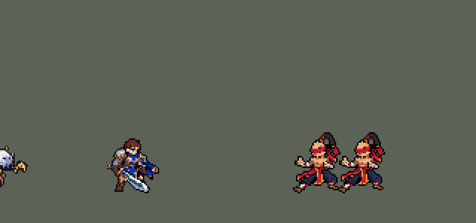
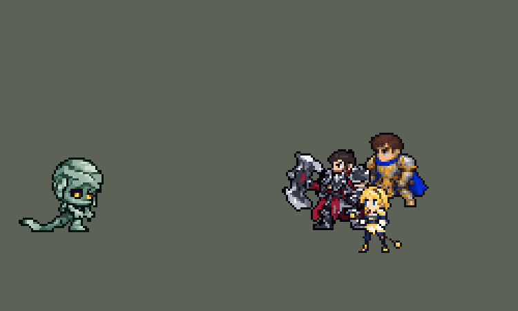
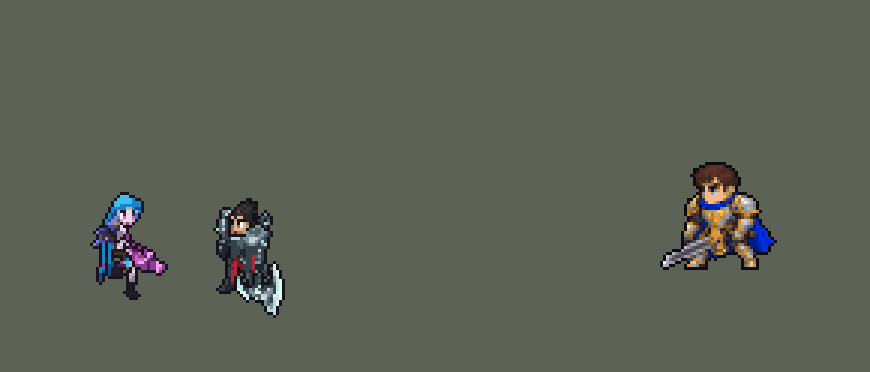

# TFM2-League-Heroes

团战经理2（Teamfight Manager 2）的英雄联盟英雄 Mod，mod_id 是 `league`。纯数据 mod：不改游戏本体，不需要编译。

英雄：盖伦（`league_garen`）、艾希（`league_ashe`）、拉克丝（`league_lux`）、李青（`league_leesin`）、索拉卡（`league_soraka`）、德莱厄斯（`league_darius`）、阿木木（`league_amumu`）、亚索（`league_yasuo`）、金克丝（`league_jinx`）。第一组（上单、打野、中单、ADC、辅助各一）齐了，第二组已有上单德莱厄斯、打野阿木木、中单亚索和 ADC 金克丝。

对敌人放的小技能，施放目标是「敌人（不含防御塔）」，清线、打野时也会放；只有大招、德莱厄斯的 E（拉人）和阿木木的 Q（绷带）只对英雄放。最早几个英雄的小技能只对英雄放，打野时一直平 A 野怪，按玩家反馈改了。










## 英雄：盖伦

技能按创意工坊 *League of Legends Reborn* 的做法处理。团战经理2 只有「技能1、技能2、大招」三个技能位，所以大招放 R，两个技能位放最有代表性的两个小技能，剩下的小技能和被动合并进去。

| 部分 | 内容 |
|---|---|
| 技能1 | Q「致命打击」：加速；下一次普攻变成跃起重击并沉默目标。合并 W「勇气」：减伤、韧性、60 + 50% 攻击力的护盾（原来写的"最大生命值加成"字段游戏不读，护盾一直只有 60） |
| 技能2 | E「审判」：旋转 3 秒，边转边追着目标走，共 7 次伤害，每次对半径 40000 内的敌人造成 25 + 55% 攻击力，追着的目标每次多受 25%（6 + 14% 攻击力），最后一次降低护甲 25%，6 秒。被动「坚韧」：高生命回复。每次伤害原来只有 12 + 32% 攻击力（英雄联盟每圈的数值），一次 E 的伤害还不如同样时间里平 A，玩家以为 E 不造成伤害。改成 25 + 55% 后玩家仍觉得 E 鸡肋：模拟里 E 占盖伦约 70% 的伤害，但他打上路对原版上单时，队伍每 10 分钟少约 3 个击杀。原因是旋转半径只有 30000：AI 在目标离他约 45 px 时就开始放 E（施法距离按两边的边缘算），站在边上的敌人扫不到，而英雄联盟里 E 的半径约是普攻距离的 1.9 倍。半径改成 40000，加上英雄联盟的「最近的敌人多受 25%」和 6 秒破甲后，和原版上单打平（击杀差 −3.0 → 0.0，各 240 局），剑风特效跟着放大到约 80 px 宽 |
| 大招 | R「德玛西亚正义」：巨剑从天而降，造成真实伤害 |
| 精灵图 | 9 个动作 56 帧：待机、走路、普攻、Q 跃斩、战吼、E 旋转、R 施放、受击、死亡。身高约 36 px（原版人类英雄约 31 px），和原版一样是 Q 版大头（头约占身高 1/3），脸和眼睛在游戏里看得清。全部是正面 3/4 朝右，同一套造型和大小；除战吼和受击外，都按英雄联盟原版动作重画 |
| 特效 | 命中火花、Q 重击与沉默、Q 强化光环、W 护盾、E 剑风、R 天降巨剑 |
| 图标 | 官方技能图标（Q / E / R），从本地客户端提取，缩到 64×64 |
| 音频 | 从本地客户端提取的 9 条技能音效和 4 条中文语音。版权属于 Riot Games，**不提交到仓库**，按下面的命令在本地生成 |

### 从本地英雄联盟提取音频和图标

```bash
python tools/lol/extract_garen.py --lol "D:\WeGameApps\lol" --vgmstream "<vgmstream-cli.exe 路径>"
```

- 需要 Python 3.14（自带 zstd 解压），以及 `pip install pillow numpy`。
- `.wem` 音频要用 [vgmstream](https://github.com/vgmstream/vgmstream) 解码。
- 中文语音来自国服（WeGame）客户端的 `Garen.zh_CN.wad.client`。
- 只读取游戏文件，不修改。

`tools/lol/pose_ref.py` 从客户端读取英雄的模型、骨骼和动画，渲染真实动作的关键帧（3/4 视角朝右），作为 GPT 生图时的姿势参考。渲染图是 Riot 的模型，只在本地用，不入库。

`tools/lol/riot.py` 负责：
- 读取 WAD 包。
- 解析 Wwise 音频包。
- 把 `Play_sfx_Garen_...` 这类事件名对应到具体的音频文件。

以后做别的英雄也能直接用。

### 美术：GPT 生成，再导入成像素图

原图在 [`assets/source/garen/`](assets/source/garen/)。角色图是和艾希同一批的 Q 版重画，提示词见 [`CHIBI_REDRAW.md`](assets/source/CHIBI_REDRAW.md)，生成记录在 [`assets/source/chibi/`](assets/source/chibi/)；特效图和之前几轮的提示词见 [`PROMPTS.md`](assets/source/garen/PROMPTS.md)。

```bash
pip install pillow numpy
python tools/art/import_garen.py          # 写出 league/champions 和 league/effects 里的精灵图
python tools/art/preview_garen.py         # 写出 docs/preview 里的预览图和演示动图
```

导入脚本做这些事：
- 切帧：按空白列切开，连在一起的剑、光效整块归到同一帧。
- 缩放：每张图单独缩放，保证头一样大（GPT 每张图的头身比略有出入，按身高对齐会让头忽大忽小）。
- 对齐：脚底统一放在帧中心下方 11.5 px（和原版一致）。待机、战吼、受击按腿部和待机第一帧对齐；照英雄联盟动作画的走路、普攻、Q、R、死亡，按原版骨骼里头部的位置摆放（`pose_ref.py --track`）；普攻、Q、R 的前冲保留约 70%，免得收招时弹回待机太明显；E 旋转按两脚中点固定。
- 像素化：硬边、共享 64 色调色板、1 px 黑描边。
- 头像截取点（`champion_view` 的 `face`）用 `tfm2_ase.py face` 按原版英雄的规律定在头顶，`lint_mod.py` 会检查。

通用部分在 skill 的 `scripts/strips.py`，以后做别的英雄可以直接用。

逐帧预览：[`docs/preview/league_garen_frames.png`](docs/preview/league_garen_frames.png)，特效：[`docs/preview/league_garen_effects.png`](docs/preview/league_garen_effects.png)。

## 英雄：艾希

| 部分 | 内容 |
|---|---|
| 普攻 | 冰霜箭。被动「冰霜射击」：普攻减速 |
| 技能1 | Q「射手的专注」：4 秒内攻速提高；期间普攻换成英雄联盟里 Q 的连射姿势，伤害更高、减速更强 |
| 技能2 | W「万箭齐发」：向目标方向扇形射出 9 支冰霜箭，范围内每个敌人受到一次伤害并减速。数据里没有扇形判定，用的是矩形范围技能（`LineRangeProjectile`，长 80、宽 45），画面上是扇形箭雨 |
| 大招 | R「魔法水晶箭」：远距离直线飞行，眩晕第一个命中的敌方英雄，并在命中处炸开，减速周围敌人 |
| 去掉 | E「鹰击长空」：侦察视野，团战经理2 没有战争迷雾 |
| 精灵图 | 9 个动作 56 帧：待机、跑步、普攻、Q 连射、Q 发动、W、R、受击、死亡。身高 34 px（含兜帽），和原版一样是 Q 版大头，兜帽不遮脸，蓝眼睛在游戏里看得见。全部正面 3/4 朝右，同一套造型；除受击外，每个动作都按英雄联盟原版动画的时间点渲染姿势参考后生成，首尾帧是原版「待机 ↔ 动作」的过渡姿势。之后按游戏原尺寸重画了一次（18 色，见[下文](#按游戏原尺寸重画拉克丝艾希)） |
| 特效 | 冰霜箭、W 扇形箭雨（用冰霜箭按 9 个角度拼成：GPT 画的扇形只有 8 支箭、箭长不一，没采用）、Q 连射、命中冰花、Q 专注光环、R 水晶箭、R 命中冰冻 |
| 图标 | 官方技能图标（Q / W / R），从本地客户端提取，缩到 64×64 |
| 音频 | 从本地客户端提取的 9 条技能音效和 2 条中文语音（Q、W；国服语音包里 R 没有语音）。不提交到仓库，按下面的命令在本地生成 |

```bash
python tools/lol/extract_ashe.py --lol "D:\WeGameApps\lol" --vgmstream "<vgmstream-cli.exe 路径>"
python tools/art/import_ashe.py           # 特效：原图在 assets/source/ashe/，提示词见 ashe/PROMPTS.md
python tools/art/import_native.py --hero ashe   # 角色图：按游戏原尺寸重画的版本，在 assets/source/native/
python tools/art/preview_ashe.py
```

第一轮的角色图（提示词见 [`CHIBI_REDRAW.md`](assets/source/CHIBI_REDRAW.md)）细节很多：细长的冰晶弓、黑兜帽上的白发。按面积平均缩小会糊成一片土黄色，所以当时每个游戏像素只从共享调色板里选一个颜色：覆盖面积最大的那个，冰蓝、白发、肤色、金色的权重加大（`strips.render_vote`）。即便这样，游戏里还是碎成杂色点，后来按游戏原尺寸重画了（见下文）。`import_ashe.py --body` 仍能写出第一轮的角色图。

逐帧预览：[`docs/preview/league_ashe_frames.png`](docs/preview/league_ashe_frames.png)，特效：[`docs/preview/league_ashe_effects.png`](docs/preview/league_ashe_effects.png)。

## 英雄：拉克丝

| 部分 | 内容 |
|---|---|
| 数值 | 照搬创意工坊 *League of Legends Reborn* 的拉克丝：属性、伤害、射程、冷却、光球和光圈的大小、激光的长宽。技能效果一样，数值就不另调了，由玩家自己选。只有大招仍然只对英雄放 |
| 普攻 | 法杖射出光弹。被动「光芒四射」：技能命中敌人后 5 秒内，下一次普攻引爆光芒，追加魔法伤害。团战经理2 只能判断施法者自己身上的状态，所以引爆的是下一个被普攻的敌人；敌人身上的光芒标记是命中时播放的特效 |
| 技能1 | Q「光之束缚」：直线光球，路径上的敌人受到魔法伤害并被禁锢 1.5 秒（英雄联盟里最多命中 2 个，数据里的直线投射物只有「穿透 / 不穿透」，没有命中数量）。合并 W「曲光屏障」：施放时拉克丝和身边的友方英雄获得护盾 |
| 技能2 | E「透光奇点」：抛出光球，落地后形成光圈，圈内敌人减速 20%，1 秒后自动引爆（AI 不会手动二次引爆） |
| 大招 | R「终极闪光」：跃起悬空，法杖浮在身前蓄力，约 0.5 秒后发射长 340、宽 40 的激光，直线上所有敌人受到魔法伤害 |
| 精灵图 | 8 个动作 51 帧：待机、跑步、普攻、Q、E、R、受击、死亡。身高 34 px，Q 版大头（头约占身高 1/3），蓝眼睛在游戏里看得清。全部正面 3/4 朝右；除受击外，每个动作都按英雄联盟原版动画的时间点渲染大头姿势参考后生成：R 里法杖离手悬在身前、发射后空中蜷身再落地，死亡被击飞后仰面倒地。之后按游戏原尺寸重画了一次（19 色，见[下文](#按游戏原尺寸重画拉克丝艾希)） |
| 特效 | 光弹、命中、Q 光球和定身光环、W 彩虹护盾、E 光球和地面光圈（引爆）、R 激光（预警线、蓄力、光束、消散）、光芒标记和引爆 |
| 图标 | 官方技能图标（Q / E / R），从本地客户端提取，64×64 |
| 音频 | 从本地客户端提取的 11 条技能音效和 3 条中文语音（Q、E、R）。不提交到仓库，按下面的命令在本地生成 |

```bash
python tools/lol/extract_lux.py --lol "D:\WeGameApps\lol" --vgmstream "<vgmstream-cli.exe 路径>"
python tools/art/import_lux.py            # 特效：原图和提示词在 assets/source/lux/
python tools/art/import_native.py --hero lux    # 角色图：按游戏原尺寸重画的版本，在 assets/source/native/
python tools/art/preview_lux.py
```

拉克丝从第一轮就按 Q 版比例生成：造型图附本包的盖伦、艾希和原版法系英雄对照图，姿势参考图本身就是大头比例，造型图检查通过后才批量生成动作。第一轮导入时：
- 每张动作图按头的大小缩放：待机的头在各帧上按不同比例做相关匹配，同一张图里可靠的匹配相差不到 3%。
- R 的法杖离手后越过了等宽格子的边界，按连通块切帧：含深蓝紧身衣的块是身体，其他块（法杖、光芒）归给左边最近的身体。
- 原地播放的特效按格子中心对齐（GPT 把每帧画在等宽格子的正中，偏差不超过 8 px）。
- 激光按判定长度缩放（原来 240 px，照搬 LoL Reborn 的数值后是 340 px；最亮的一帧粗 35 px，判定宽 40 px），从拉克丝身前 6 px 开始。E 的光圈同样跟着判定半径从 60 px 缩到 53 px（半径 26500），调色板仍按原来的大小取色，其他特效的颜色不变。游戏把激光画在单位中心的高度，R 里悬浮的法杖离地约 14 px，正好在光束里。

后来角色图按游戏原尺寸重画了（见下文），每帧的位置沿用第一轮，所以法杖仍在光束里。`import_lux.py --body` 仍能写出第一轮的角色图。

跑步第 4、5、7、8 帧的下半身像变了形：英雄联盟里拉克丝跑到后半段把法杖竖在身后，杖尾垂到后脚边，游戏尺寸下金白色的杖尾和后腿粘在一起，看起来像一只金色的脚。这四帧的杖尾改画成和其他帧一样的深色靴子（杖尾算作被腿挡住），逐像素记在 [`native/lux_retouch.json`](assets/source/native/lux_retouch.json)，导入时套用。

待机的法杖看起来是歪的：法杖从她身后斜穿过去，露出的两截不在一条直线上。脚边金球到左腿那截画成 45°，右手到右上金球那截约 30°，顺着下面那截看，会从手上方 6 格处穿过。6 帧待机的这一截都按"金球—右手—金球"这条直线重画（每 3 格升 2 格，中间一格棕色，放到深色卡片背景上也看得出方向），每帧改 8～9 个像素，同样记在 `lux_retouch.json` 里。受击两帧的杖身本来就在直线上，没有改。

逐帧预览：[`docs/preview/league_lux_frames.png`](docs/preview/league_lux_frames.png)，特效：[`docs/preview/league_lux_effects.png`](docs/preview/league_lux_effects.png)。

## 英雄：李青

| 部分 | 内容 |
|---|---|
| 定位 | 刺客（Assassin），第一组里的打野 |
| 普攻 | 出拳。被动「疾风骤雨」：每次施放技能后，3 秒内接下来 2 次普攻攻速 +40%（两个 buff 计数，模板里"第 N 次普攻"的写法） |
| 技能1 | Q「天音波 / 回音击」：音波命中第一个敌人，造成物理伤害并留下印记；0.2 秒后李青自动飞踢冲到它身边再打一次。英雄联盟里二段是手动的，还按已损失生命加伤；这里自动冲、固定数值 |
| 技能2 | E「天雷破 / 摧筋断骨」：跃起捶地，周围敌人受到物理伤害并减速 40%。合并 W「金钟罩 / 铁布衫」：李青和身边的友方英雄获得护盾，李青获得 20% 吸血。W 原本要冲向友方，这里取消冲刺，免得 AI 被拉离战斗 |
| 大招 | R「猛龙摆尾」：回旋踢把目标踢飞约 54 px；一条金龙以同样速度跟在它后面，沿途撞到的敌人受到伤害并被击飞 0.75 秒 |
| 精灵图 | 9 个动作 58 帧：待机、跑步、普攻、Q1 推掌、Q2 飞踢、E 捶地、R 回旋踢、受击、死亡。身高 34 px（光头头顶到脚底，辫子另算），16 色；红色蒙眼布横过脸，盲僧不画眼睛。全部正面 3/4 朝右，按英雄联盟原版动作的时间点画：战斗待机每 0.75 秒下沉弹跳一次，跑步是大步腾跃（双脚离地约一半时间） |
| 特效 | 普攻命中、音波、音波印记、回音击命中、天雷破震波、金钟罩护盾、猛龙摆尾踢击、金龙、撞击击飞 |
| 图标 | 官方技能图标（Q / E / R），从本地客户端提取，64×64 |
| 音频 | 从本地客户端提取的 11 条技能音效和 4 条中文语音（Q、Q2、E、R）。不提交到仓库，按下面的命令在本地生成 |

```bash
python tools/lol/extract_leesin.py --lol "D:\WeGameApps\lol" --vgmstream "<vgmstream-cli.exe 路径>"
python tools/lol/native_pose.py assets/source/leesin/poses.json --out <参考图文件夹>
python tools/art/fit_native.py --hero leesin --src assets/source/leesin/codex --refs <参考图文件夹> --scale run=1.4 --scale attack=1.4 --scale skill=1.4 --scale skill2=1.34 --scale ult=1.38 --scale hit=1.38 --scale dead=1.35 --scale q2=1,1,1,1,1,1.18,1.18
python tools/art/import_native.py --hero leesin    # 角色图
python tools/art/import_leesin.py                  # 特效
python tools/art/preview_leesin.py
```

李青没有先画高清的第一轮，而是一开始就按游戏原尺寸画（提示词见 [`assets/source/leesin/PROMPTS.md`](assets/source/leesin/PROMPTS.md)）：
- `native_pose.py` 把英雄联盟客户端里的动作直接渲染成游戏尺寸的参考图（34 px，每个像素一个 8×8 方块），旁边配同一批帧的高清渲染。每帧的锚点和原版头部骨骼的位置记在 [`native/leesin_cells.json`](assets/source/native/leesin_cells.json)。
- 先画原尺寸造型图，确认后同一批画 9 张动作和 9 张特效；Codex 整理成严格的 8×8 纯色块（交接记录在 [`leesin/codex/`](assets/source/leesin/codex/)）。
- 交回的动作里，除了待机，GPT 都画大了约 1.4 倍，头比身体放得更多；直接导入的话，李青一出招就会变大。`fit_native.py` 按头的大小把每张动作缩回造型图的比例（按 16 色投票取色，仍是纯色像素），再把每帧的蒙眼布对到原版头部骨骼的位置，着地的帧脚底压在地面线上。待机是 Codex 用确认过的造型图分层重组的，原样使用。
- 结果：16 色，和右边像素同色的比例 37%（原版英雄 18%–46%）；头像截取点 (0, −34)。
- 进游戏看过后改了嘴和鼻子：造型图脸前缘那条深色竖线和下巴上的深色块去掉，换成蒙眼布下方两行处 2 格的嘴；头部直立的动作帧套用同一张下半脸。待机的头右侧原来是一条直边，在深色的英雄卡片上看起来像被切掉一半，改成了弧形轮廓（额头、蒙眼布、鼻尖外凸，嘴和下巴内收）。改动逐像素记在 [`native/leesin_retouch.json`](assets/source/native/leesin_retouch.json)，导入时套用。

逐帧预览：[`docs/preview/league_leesin_frames.png`](docs/preview/league_leesin_frames.png)，特效：[`docs/preview/league_leesin_effects.png`](docs/preview/league_leesin_effects.png)。

## 英雄：索拉卡

| 部分 | 内容 |
|---|---|
| 定位 | 辅助（Util），第一组里的辅助，也是本包第一个治疗 |
| 普攻 | 法杖射出星光弹，造成 100% 攻击力的物理伤害 |
| 技能1 | Q「流星坠落」：星星砸向敌人所在的位置，0.4 秒后落地，范围魔法伤害并减速 30%。命中敌方英雄时获得「活力焕发」：2.5 秒内持续回复 75 + 30% 法术强度的生命并加移速，每次施放只触发一次。合并 E「星体结界」：每 16 秒最多一次，星星落地后留下星之领域，沉默圈内敌人，1.5 秒后仍在圈里的被禁锢 1 秒并受到伤害。英雄联盟里 E 是单独的技能；这里没有第三个技能位，就跟着 Q 落下，用一个隐藏的冷却 buff 保留原版 8 秒 / 16 秒的节奏 |
| 技能2 | W「星之灌注」：扣自己 6% 最大生命，治疗一名其他友方英雄 200 + 50% 法术强度（射程 90000，冷却 4 秒）；带有活力焕发时不扣血，目标也获得活力焕发（持续回血和移速，和英雄联盟一样）。扣血前先加 3 tick 的不死 buff，不会把自己扣死。合并被动「拯救」：放完后 2 秒内移速 +30%（数据读不到移动方向和友方血量，近似成治疗后赶去支援） |
| 大招 | R「祈愿」：治疗全图所有友方英雄 220 + 60% 法术强度，包括自己。原版对生命低于 40% 的目标加成治疗，数据做不到，统一数值 |
| 生命 | 780，每级 +80，比原版的辅助都低（最低的 `priest` 900 / +80）。原来 880 / +95：用户觉得加强后她在下路太能赖线、对线无解，于是技能数值不动、只降生命和成长，团战里的治疗照旧。SDK 对战模拟（对 `priest`、`bard`、`enchanter`，两边各 60 局）：前 5 分钟她自己的死亡从 0.50 次升到 0.62 次，10 分钟的治疗量只少 2%，团队击杀差 +0.2 → −0.7（在随机波动之内） |
| 治疗给谁 | W 用 `AllyNotSelf`（除自己以外的友方英雄，不含小兵），R 用 `AllyChampion` 加全图范围。游戏 AI 给友方技能打分时，治疗的价值是"治疗量和目标缺失生命取小"，所以应该会先治疗掉血最多的友方，满血时价值为 0。这是从 mod SDK 的代码里读出来的；用 SDK 跑的对战模拟也对得上：单纯加大 W 的治疗量，实际治疗几乎不涨，加射程、缩冷却、把活力焕发传给队友才涨 |
| 精灵图 | 8 个动作 52 帧：待机、跑步、普攻、Q 召唤流星、W 举杖、R 祈愿鞠躬、受击、死亡。白发顶到蹄底 35 px，17 色，全部正面 3/4 朝右，按英雄联盟原版动作的时间点画：待机 1.5 秒呼吸一次，跑步是蹄子着地的蹦跳式跑 |
| 特效 | 普攻星光弹、命中、流星坠落、活力焕发、星体结界、定身光环、星之灌注、祈愿（头顶的星和落在每个友方身上的光柱） |
| 图标 | 官方技能图标（Q / W / R），64×64 |
| 音频 | 从本地客户端提取的 10 条技能音效和 2 条中文语音（Q 借一句攻击台词，R）。不提交到仓库，按下面的命令在本地生成 |

```bash
python tools/lol/extract_soraka.py --lol "D:\WeGameApps\lol" --vgmstream "<vgmstream-cli.exe 路径>"
python tools/lol/native_pose.py assets/source/soraka/poses.json --out <参考图文件夹>
python tools/art/import_native.py --hero soraka    # 角色图（套用 soraka_retouch.json）
python tools/art/import_soraka.py                  # 特效
python tools/art/preview_soraka.py
```

美术和李青一样直接按游戏原尺寸画（提示词见 [`assets/source/soraka/PROMPTS.md`](assets/source/soraka/PROMPTS.md)）：
- 她的角在模型里没有自己的蒙皮权重，是跟着头走的，头放大 2 倍时角也变成 2 倍、成了最高点。`native_pose.py` 的 `keep` 把角的顶点绑到 `horn` 骨骼上，让它保持原版长度；长马尾挂在胸部骨骼下，本来就不随头放大。
- 造型图 Codex 画了三版：第一版是没整理的模糊图，第二版变成正面站姿、眼睛像两块白斑，第三版通过；嘴去掉，眼睛由用户调亮。
- Codex 把造型图的头逐格贴进了每一帧，头的大小一致，待机和跑步不抖。交回后用户发现头发只盖住头顶和后脑，额头和右半边都是蓝色皮肤，脸显得很大：所有帧的头统一加了刘海和右侧一缕发丝。Q 第 2–3 帧法杖和手分开了，补上握杖的手臂，删掉 GPT 留下的碎块和闪光。
- 之后用户觉得眼睛和嘴还是丑。原因是两只眼睛左右画反了（宽的那只贴在远侧脸边），眼睛只有两行像眯着，眼下 5 行脸加一块深蓝阴影像大下巴。按用户从三个方案里选的：刘海再下移一行，眼睛换回近左远右、改成 3 行的金色大眼，阴影缩成下巴底下一行，加一格暗红小嘴（倒地两帧闭眼）。头部每帧 35 个像素，造型图同步。改动逐像素记在 [`native/soraka_retouch.json`](assets/source/native/soraka_retouch.json)，导入时套用。
- 结果：17 色，和右边像素同色的比例 29%（原版英雄 18%–46%）；头像截取点 (5, −35)。
- 特效放大 2 倍后，流星落地环和星体结界约 60 px 宽，所以 Q、E 的半径定为 30000。

逐帧预览：[`docs/preview/league_soraka_frames.png`](docs/preview/league_soraka_frames.png)，特效：[`docs/preview/league_soraka_effects.png`](docs/preview/league_soraka_effects.png)。

## 英雄：德莱厄斯

| 部分 | 内容 |
|---|---|
| 定位 | 上单（Melee），第二组第一个 |
| 普攻 | 斧头下劈，100% 攻击力。被动「出血」：普攻和 Q 命中让目标流血 5 秒，每秒 3 + 4% 攻击力的物理伤害，每次命中单独叠一层 |
| 被动 | 5 秒内命中 5 次进入「诺克萨斯之力」：攻击力 +40%，持续 5 秒，身后燃起暗红火焰。英雄联盟里按目标身上的出血层数算；数据读不到别人身上的层数，改成德莱厄斯自己的命中计数 |
| 技能1 | Q「大杀四方」：蓄力后抡斧转一圈，半径 32000 内的敌人受到 60 + 110% 攻击力的物理伤害并流血；每命中一名敌方英雄回复 25 + 30% 攻击力的生命 |
| 技能2 | E「无情铁手」：斧钩扫过前方约 106° 的扇形（46000），把敌人拉到身边。合并 W「致残打击」：之后 4 秒内的下一次普攻换成贴地横扫，20 + 150% 攻击力，减速 90% 持续 1 秒 |
| 大招 | R「诺克萨斯断头台」：跳到目标身上砸下，100 + 100% 攻击力的真实伤害；命中计数每层 +20%，诺克萨斯之力时翻倍（200 + 200%） |
| 精灵图 | 9 个动作 59 帧：待机、跑步、普攻、Q 蓄力抡圈、W 贴地横扫、E 甩钩回拉、R 跳斩、受击、死亡。发尖到靴底 34 px，18 色，动作全部取自英雄联盟原版动画 |
| 特效 | 普攻命中、出血、Q 旋风、Q 回血、诺克萨斯之力、W 就绪（脚下）、W 命中、E 扇形斧钩、E 钩中、R 巨斧砸地 |
| 图标 | 官方技能图标（Q / E / R），64×64 |
| 音频 | 从本地客户端提取的 11 条技能音效和 4 条中文语音（Q、E、R、诺克萨斯之力）。不提交到仓库，按下面的命令在本地生成 |

```bash
python tools/lol/extract_darius.py --lol "D:\WeGameApps\lol" --vgmstream "<vgmstream-cli.exe 路径>"
python tools/lol/native_pose.py assets/source/darius/poses.json --out <渲染文件夹> --alpha --parts
python tools/art/restyle_native.py assets/source/darius/poses.json --renders <渲染文件夹>   # 角色图
python tools/art/import_native.py --hero darius
python tools/art/import_darius.py      # 特效
python tools/art/preview_darius.py
```

美术（提示词见 [`assets/source/darius/PROMPTS.md`](assets/source/darius/PROMPTS.md)）：
- 造型图：Codex 第一轮把大图缩小成 34 px，眼睛和斧头都糊了；第二轮直接在原尺寸格子上逐格改，眼睛、描边、盔甲通过。之后加宽了深红前摆，两腿后面露出披风，把心形斧刃照模型改成双月牙巨斧，按用户选择加一格暗红小嘴。
- 脸：后来用户觉得不像英雄联盟里的诺手。照模型同角度的脸出了几个方案，用户选的是三格粗眉、眉心一道皱纹、下巴一圈胡茬，保留原版游戏画法的两行眼（白眼 + 灰蓝瞳），嘴还在两眼之间的正下方。前一版把嘴往后挪了一格、眉毛没压在眼睛上，用户觉得嘴歪、眼睛怪。造型图改了 6 格，动作图重新生成，每帧只差脸上这几格。
- 动作图：Codex 交回的 9 张是在格子上用色块拼的，身体忽大忽小，披风是一块红色方块，动起来很怪。所以改成直接用英雄联盟的动画：`native_pose.py` 在游戏尺寸下渲染每一帧（透明背景，另出一张头 / 斧 / 身体的部位图），`restyle_native.py` 把每个 8×8 块投票成造型图的 18 色（斧头按亮度，身体按色相分成深红、古铜和钢甲），描边画在轮廓外，头换成造型图的头（仰面倒地时转 90°）。肩甲放大 1.4 倍，和造型图一样大。动作、前冲和跳跃都是原版的，每帧是同一个模型，身材不会跳。
- 修了一个工具 bug：`native_pose.py` 原来把整张图的最低点放在地面线上。德莱厄斯的斧尖比靴底低 5 格，所以参考图和照着画的图都浮空 5 格。现在锚点按靴底算，参考图不变。
- 特效用 Codex 画的，围着人画的放大 2 倍。Q 旋风放大后半径约 29 px，所以 Q 的范围定为 32000。
- 结果：18 色，和右边像素同色的比例 37%（原版英雄 18%–46%）；头像截取点 (0, −34)。`tfm2_ase.py face` 把斧尖当成了脚，建议值是 −37。

逐帧预览：[`docs/preview/league_darius_frames.png`](docs/preview/league_darius_frames.png)，特效：[`docs/preview/league_darius_effects.png`](docs/preview/league_darius_effects.png)。

## 英雄：阿木木

| 部分 | 内容 |
|---|---|
| 定位 | 打野（Melee / Tank），第二组第二个 |
| 普攻 | 跳起来往下砸，100% 攻击力。被动「诅咒之触」+「绝望光环」：普攻或放任何技能后哭 4 秒，每秒对周围 25000 内的敌人造成 10 + 10% 法术强度的魔法伤害（敌方英雄另受 1% 最大生命值的真实伤害），并施加诅咒：受到的伤害提高 10%。英雄联盟里 W 是开关，按最大生命值算的部分是魔法伤害；数据里没有开关，魔法伤害也没有按目标生命值算的字段，所以改成打起来自动开的光环，百分比部分做成真实伤害，只打英雄（免得秒大型野怪）。诅咒每秒重新给 1 秒，不会叠加 |
| 技能1 | Q「绷带牵引」：朝敌方英雄扔绷带（施放距离 62000），穿过小兵和野怪，粘住第一个敌方英雄：80 + 70% 法术强度的魔法伤害，眩晕 1 秒，然后阿木木飞过去。只有 1 层充能（英雄联盟是 2 层，AI 会立刻连扔两次） |
| 技能2 | E「阿木木的愤怒」：跺脚，周围 28000 内的敌人受到 60 + 50% 法术强度的魔法伤害，冷却 4.5 秒。被动：受到的普攻伤害降低 10%。英雄联盟里被攻击时冷却缩短，数据里没有"受到攻击时"的触发 |
| 大招 | R「木乃伊之咒」：周围 42000 内的所有敌人受到 150 + 80% 法术强度的魔法伤害，眩晕 1.5 秒，诅咒 3 秒。冷却 60 秒 |
| 精灵图 | 9 个动作 57 帧：待机、跑步、普攻、Q 扔绷带、Q 飞过去、E 发脾气、R 蜷起后炸开、受击、死亡。头顶到脚底 34 px，10 色，动作全部取自英雄联盟原版动画 |
| 特效 | 普攻命中、飞出的绷带、Q 粘住、诅咒标记、绝望光环（脚下）、E 冲击环、R 绷带炸开、R 缠住 |
| 图标 | 官方技能图标（Q / E / R），64×64 |
| 音频 | 从本地客户端提取的 9 条技能音效和 2 条中文语音（Q 的语音；大招借用一句普攻台词）。不提交到仓库，按下面的命令在本地生成 |

```bash
python tools/lol/extract_amumu.py --lol "D:\WeGameApps\lol" --vgmstream "<vgmstream-cli.exe 路径>"
python tools/lol/native_pose.py assets/source/amumu/poses.json --out <渲染文件夹> --alpha --parts
python tools/art/restyle_native.py assets/source/amumu/poses.json --renders <渲染文件夹>   # 角色图
python tools/art/import_native.py --hero amumu
python tools/art/import_amumu.py      # 特效；--raw <Codex 的 generated 文件夹> 先把原始图转成原尺寸条
python tools/art/preview_amumu.py
```

美术（提示词见 [`assets/source/amumu/PROMPTS.md`](assets/source/amumu/PROMPTS.md)）：
- 比例和镜头：阿木木在英雄联盟里本来就是大头，原版比例时头已经占身高 63%，前几个英雄用的"头 2.0、腿 0.8"会让头占 91%，所以用原版比例。待机时他的头往右垂，yaw 55 下只看得到一只眼睛，改用 yaw 40；镜像让身后拖在地上的绷带露出来。原版的 `Spell2` 是被绷带拉过去时身体放平的飞行姿势，用作 `q_pull`。
- 造型图：Codex 的生图对不准网格（1254 px 画布，方块约 13.45 px，只有 29 格高），但画风是对的。Claude 照英雄联盟 34 格的轮廓和姿势逐格画：头上三种深浅的横向绷带条，深紫黑眼窝里一双琥珀色大眼睛（用户在四个选项里选了"大眼睛、不画嘴"），躯干、下巴下的小爪子、两只大圆脚和拖地的绷带各自描边，10 色。
- 动作图：Codex 交回的 9 张也是生图原始输出，头每帧都是重画的，眼睛只是小点，转成原尺寸后站着的身高在 32 到 47 格之间跳。用户看了并排对比，选了用英雄联盟动画重新上色：`restyle_native.py` 把每个 8×8 块投票成造型图的 10 色（全身按亮度分五个绿），头换成造型图的头，只有倒地的几帧把头转 90°（`restyle` 新加的按动作设置的 `turn`）。
- 特效用 Codex 画的：`import_amumu.py --raw` 把原始图（半透明、格子比例不对）转成 8×8 方块的原尺寸条，再按技能范围定大小：E 冲击环约 58 px（半径 28000），R 约 84 px（42000），绝望光环约 56 px（25000）。
- 出手时刻和动画对齐：普攻第 15 tick 砸中，Q 第 16 tick 出手，E 第 20 tick 跺地，R 第 18 tick 炸开。
- 结果：10 色，和右边像素同色的比例 62%（绷带是大块平涂；原版英雄 18%–46%）。头像截取点 (5, −26)：`tfm2_ase.py face` 按头顶建议 −34，但阿木木的眼睛在头顶往下十几格，往下移 8 格，让卡片露出眼睛。

逐帧预览：[`docs/preview/league_amumu_frames.png`](docs/preview/league_amumu_frames.png)，特效：[`docs/preview/league_amumu_effects.png`](docs/preview/league_amumu_effects.png)。

## 英雄：亚索

| 部分 | 内容 |
|---|---|
| 定位 | 中单（Melee / Fighter），第二组第三个 |
| 普攻 | 挥刀劈砍，100% 攻击力。被动「浪客之道」：20% 暴击几率（英雄联盟里暴击几率翻倍，这里直接给 20%）。「剑意」每 12 秒充满一次，充满后下一次出手（普攻、Q 或 E）获得 60 + 60% 攻击力的护盾（2 秒）。英雄联盟的 W「风之障壁」没有做：游戏里没有能挡掉飞行物的效果，只画一面墙在这个游戏里显得奇怪，用户决定删掉 |
| 技能1 | Q「斩钢闪」：向前突刺（45000 × 12000 的长条），30 + 100% 攻击力，按普攻算、可以暴击；命中后叠一层，满 2 层时放出旋风（飞 80000），击飞直线上的敌人 1 秒。E 冲刺中施放改为环形斩（半径 25000），满层时是环形击飞。冷却 4 秒 |
| 技能2 | E「踏前斩」：冲刺穿过一名敌人（施放距离 40000），停在它身后 15000，40 + 60% 攻击力；6 秒内再冲一次伤害 +25%，最多 +50%。冷却 5 秒 |
| 大招 | R「狂风绝息斩」：闪到施放距离 100000 内一名被控制（击飞、眩晕、禁锢、拉拽等）的敌方英雄身边，附近被控制的敌方英雄再被击飞 1 秒，受到 150 + 150% 攻击力的物理伤害；之后 10 秒无视 30% 护甲，剑意立即充满。冷却 40 秒。要有控制才能放：对战模拟里 10 分钟平均放 0.5 次（队友是原版英雄）到 2.9 次（队友是德莱厄斯、阿木木、艾希、拉克丝），以后加入带击飞的英雄时再调 |
| 精灵图 | 10 个动作 68 帧：待机、跑步、普攻、Q 突刺、Q3 放旋风、EQ 环形斩、E 冲刺、R、受击、死亡。身体按头顶到脚底 30 px 画、头保持原来的大小（马尾另外往上翘），20 色，动作全部取自英雄联盟原版动画 |
| 特效 | 普攻命中、Q 突刺的风、Q 命中、旋风烈斩就绪、Q3 旋风、击飞、EQ 环形斩、EQ3 环形击飞、E 命中、剑意护盾、R 连斩 |
| 图标 | 官方技能图标（Q / E / R），64×64 |
| 音频 | 从本地客户端提取的 13 条技能音效和 4 条中文语音（Q、Q3、E、R）。不提交到仓库，按下面的命令在本地生成 |

```bash
python tools/lol/extract_yasuo.py --lol "D:\WeGameApps\lol" --vgmstream "<vgmstream-cli.exe 路径>"
python tools/lol/native_pose.py assets/source/yasuo/poses.json --out <渲染文件夹> --alpha --parts
python tools/art/restyle_native.py assets/source/yasuo/poses.json --renders <渲染文件夹>   # 角色图
python tools/art/import_native.py --hero yasuo     # 套用 yasuo_retouch.json
python tools/art/import_yasuo.py      # 特效；--raw <Codex 的交付文件夹> 先把原始图转成原尺寸条
python tools/art/preview_yasuo.py
```

美术（提示词见 [`assets/source/yasuo/PROMPTS.md`](assets/source/yasuo/PROMPTS.md)）：
- 比例和镜头：用户在三种头身比例里选了 C（头 2.0、腿 0.8），马尾按一半缩放（`hair 0.5`），保持原版的长度感。亚索的待机是深蹲，只有站直时的 80%，头顶到脚底仍按 34 px 算。后来用户觉得亚索比别的英雄大一圈，在三个方案（整体 80%、身体 80% 头不变、整体 88%）里选了身体 80% 头不变：`height` 30，`chibi.head` 2.4、马尾 0.417，头的像素大小和原来一样。待机时刀收在鞘里，腰上往后伸的是刀鞘；普攻和技能时手里是拔出来的银色刀，刀鞘还挂在腰上。
- 造型图：Codex 的两版生图对不准网格（1254 px 画布，方块 9.6–10.8 px），眼睛也不合规格。Claude 在英雄联盟 34 格的剪影上逐格画：先按材质自动投色，再手画肩甲的层叠羽片、刀鞘的银边、胸口的皮肤和斜挎皮带、金绳腰带和刀穗。脸在三个方案里，用户先选了原版游戏画法加小嘴，后来改成英雄联盟里的冷脸：三格粗眉、一行眼睛（白眼挨着黑瞳）、一格暗褐小嘴。身体缩小后脸看着像马脸、右边像被削平、嘴歪、远处的眼睛和头发连成一条像独眼，按用户的意见重画（方案 E2）：刘海盖住额头只露两格，下巴右下角收圆描边，下巴下面露出的脖子改成蓝色领巾，远眼也画出眼白（两只眼都朝前看），一格暗红小嘴放在两眼正中。
- 动作图：用英雄联盟动画重新上色（`restyle_native.py`），这次加了三样：
  - 蓝布、深蓝裤子、金绳、皮肤、棕色皮革、钢铁按色相、饱和度、亮度分类投色（`materials`），原来只认深红布、皮肤和钢铁。原版的暗部很暗：胸口皮肤亮度只有 0.27、阴影里的金绳 0.13–0.36，所以皮肤从 0.1 算起，金色按色相认、不看亮度。
  - 马尾单独成一个部位（`native_pose.py` 的 `hair_part`），每帧跟着原版动画甩。
  - 头：第一版每帧贴待机时的造型头，跑步低头、EQ 转身、R、死亡躺下时头和身体对不上，用户指出后改成头也按原版逐帧取色（跟着身体转、低头、躺下），脸抹成造型图的两色平涂，再把造型图整块脸（额头、粗眉、眼睛、嘴，6×6 格）贴到每帧看得见的脸上：远眼贴着脸的前缘，朝左时镜像，背对镜头时不贴（`native_pose.py` 的 `face_track` 记下每帧脸的位置和朝向）。只贴眉眼几格时，刘海压住眉毛、嘴落到脸颊边上，用户觉得眼睛和嘴都怪。`features` 另有三项：`neck`（离脸两格内、眼睛以下的身体皮肤改成领巾色），`trim_front`（眼睛上方伸出脸前沿的那一列头发剪掉、重新描边：原版刘海在待机时从额头右上角凸出一块，用户觉得怪；头发本来就盖在脸前的帧不剪，免得剪出缺口），`hair_above`（刘海上方露出的一条额头皮肤改成头发）。
  - 自动贴不好的 14 帧逐格手修（35 格）：普攻第 2 帧低头、死亡 2–4 帧画向下的眼线，死亡 6–7 帧躺平画闭眼，Q3 第 6–7 帧侧脸在前缘补嘴（第 7 帧脸转得太偏、整块贴不上，还补了眉和眼），待机 6 帧的金发箍统一成 2 格。记在 [`native/yasuo_retouch.json`](assets/source/native/yasuo_retouch.json)，导入时套用。
  - 死亡动画里拔出来的刀没有动画轨道，会竖在身边，死亡动作不画这把刀（`hide`）；腰绳的两根绳尾缩到 0.6 倍，跑动时不再甩出一大片金色。
- 特效用 Codex 画的 11 张：`import_yasuo.py --raw` 把原始图（半透明、格子比例不对）转成原尺寸条，再按技能范围定大小：Q 突刺 45 px 长，旋风 24 px 宽，EQ 的圈 50 px 宽（半径 25000，画一半大再放大 2 倍）。
- 风墙：先后试过 Codex 画的风柱（被看成龙卷风）和照英雄联盟地面青线画的风幕，最后用户觉得风墙在这个游戏里不合适，整个技能删掉了。
- 出手时刻和动画对齐：普攻第 11 tick 命中，Q 第 8 tick 命中，Q3 旋风每 tick 飞 2.5 px，R 第 24 tick 落刀。
- 结果：20 色，和右边像素同色的比例 46%（原版英雄 18%–46%）。头像截取点 (4, −33)：`tfm2_ase.py face` 按最高点把马尾尖当成了头顶，它和 lint 会再按脸的肤色找一次头，(4, −33) 就在头顶上（缩小前是 (5, −34)）。

逐帧预览：[`docs/preview/league_yasuo_frames.png`](docs/preview/league_yasuo_frames.png)，特效：[`docs/preview/league_yasuo_effects.png`](docs/preview/league_yasuo_effects.png)。

## 英雄：金克丝

| 部分 | 内容 |
|---|---|
| 定位 | ADC（Range），第二组第四个 |
| 普攻 | Q「枪炮交响曲！」：射程 52500 内有敌人时用轻机枪「砰砰」，100% 攻击力，每发叠一层「火力全开」：攻速 +15% / +30% / +45%，2.5 秒。附近没有敌人时换火箭发射器「鱼骨头」：射程 64500，打中目标和它周围 20000 内的敌人，110% 攻击力，拿火箭时攻速 −10%。换枪有音效，由随机选敌（`RandomTarget`）量距离决定。被动「罪恶快感」：亲手击杀敌方英雄（普攻、火箭、R）后 6 秒攻速 +25%，移速 +100%，2 秒后降到 +60%，4 秒后 +30%。击杀用一枚只打英雄的隐形子弹判断：命中时给金克丝挂标记，目标身上挂一个每 tick 清标记的短效果，目标死了效果随之消失，几 tick 后标记还在就是击杀（模拟器里 13 次普攻击杀、3 次火箭击杀全部认出，没有误判） |
| 技能1 | W「震荡电磁波！」：蓄力 0.4 秒（英雄联盟 0.6 秒），射出电磁波，打中第一个敌人：75 + 120% 攻击力的物理伤害，减速 25%，2 秒。射程 100000（LoL Reborn 150000，太远时会拿去打远处的小兵），冷却 6 秒 |
| 技能2 | E「嚼火者手雷！」：往敌方英雄脚下扔三只夹子（射程 80000，飞 0.4 秒），落地 0.25 秒后布好，最多留 5 秒。敌方英雄走进 15000 内时夹子咬合爆炸：禁锢 1.5 秒，80 + 100% 攻击力的物理伤害，然后夹子消失。游戏里没有"留在原地、踩到才触发一次"的效果，做成 20 段、每段 0.25 秒的链：每段显示夹子、段末查一次附近的敌方英雄，再由一个隐藏的计时飞行物生成下一段；咬到人时给金克丝加一个锁，后面的段不再生成。冷却 10 秒 |
| 大招 | R「超究极死神飞弹！」：飞越全图（速度 4500），穿过小兵和野怪，撞到第一个敌方英雄就爆炸：半径 62000 内的敌人受到 175 + 90% 攻击力 + 目标 10% 最大生命值的物理伤害。英雄联盟里伤害随飞行距离增加、按已损失生命加成，数据做不到，改成固定数值加最大生命值百分比。冷却 50 秒 |
| 数值 | 攻击 100（+20）、生命 900（+90）、护甲 20（+7）、魔抗 15（+3）、移速 900（+9），和原版射手一样。先照搬 LoL Reborn 的数值，模拟里伤害比原版射手低约 40%，用户说"加强吧"：换成原版射手的属性，W 蓄力缩短、伤害提高、射程缩短。加强后 10 分钟伤害约 8900（原来 6800），和德莱厄斯、阿木木、亚索、索拉卡一队时击杀领先 5.2（艾希 4.0）。亚索的大招只对被控制的英雄放，金克丝 E 的禁锢也算：队友里有金克丝时 10 分钟平均放 3.1 次（原版射手 2.5 次） |
| 精灵图 | 9 个动作 60 帧：待机、跑步、机枪普攻、火箭、W、E、R、受击、死亡。头顶到脚底 34 px，22 色，动作全部取自英雄联盟原版动画 |
| 特效 | 机枪子弹、机枪命中、鱼骨头火箭、火箭爆炸、电击枪蓄力、电磁波、电磁波命中和减速、扔出的夹子、夹子落地、布好的夹子、咬合爆炸、夹子消失、死神飞弹、飞弹大爆炸、罪恶快感 |
| 图标 | 官方技能图标（W / E / R），64×64 |
| 音频 | 从本地客户端提取的 15 条技能音效和 4 条中文语音（W、E、R，罪恶快感没有专门的台词，用她的笑声）。不提交到仓库，按下面的命令在本地生成 |

```bash
python tools/lol/extract_jinx.py --lol "D:\WeGameApps\lol" --vgmstream "<vgmstream-cli.exe 路径>"
python tools/lol/native_pose.py assets/source/jinx/poses.json --out <渲染文件夹> --alpha --parts
python tools/art/restyle_native.py assets/source/jinx/poses.json --renders <渲染文件夹>   # 角色图
python tools/art/import_native.py --hero jinx
python tools/art/import_jinx.py      # 特效；--raw <Codex 的交付文件夹> 先把原始图转成原尺寸条
python tools/art/preview_jinx.py
```

美术（提示词见 [`assets/source/jinx/PROMPTS.md`](assets/source/jinx/PROMPTS.md)）：
- 分工：从金克丝开始，角色图由 Claude 画，Codex 只画特效。
- 比例和镜头：头 2.0、腿 0.8、辫子 0.5，镜头 yaw 45，头顶到脚底 34 px；武器部位是轻机枪「砰砰」，火箭动作用原版 `Rlauncher_attack1`。
- 造型图：在英雄联盟 34 格的剪影上按材质自动投色（青色头发、粉色、红色、靛蓝、棕色皮革、皮肤、黑色），再逐格画脸。第一版的脸是空的，用户问"脸部五官也没有？"；按原版画法重画后，用户在几组方案里选了 B4：原版画法的眼睛，下巴正中一格她的唇色小嘴。20 色。
- 动作图：`restyle_native.py` 按造型图的颜色给英雄联盟动画逐帧投色，头按原版逐帧取色再贴造型图的脸块（和亚索同一套做法）；躺平的死亡第 6、8 帧贴不上脸，手画闭眼（近眼两格、远眼一格），记在 [`native/jinx_retouch.json`](assets/source/native/jinx_retouch.json)，导入时套用。
- 特效用 Codex 画的 15 张（生图原稿：半透明边、画布尺寸不对，这次帧距也不均匀）：`import_jinx.py --raw` 按画面之间最宽的空列切帧（夹子消失和罪恶快感自身有大空隙，写死切点），再按技能范围定大小：机枪一串 14 px，火箭 24 px，火箭爆炸约 37 px（溅射半径 20000），电磁波 30 px（半径 15000），扔出的夹子 18 px，三只夹子一排 32 px（判定半径 15000），死神飞弹 59 px（半径 28000），大爆炸约 97 px（半径 62000，画一半大再放大 2 倍）。夹子的三张图 Codex 画得大小不一（一排 589、635、504 px），各自缩到 32 px 宽，统一地面线和同一套颜色；两枚火箭每帧都用第一帧的弹体，只让火焰动（原稿的弹体每帧都有点变形）。
- 出手时刻和动画对齐：机枪第 7 tick 出膛，火箭第 11 tick（后坐那一帧），W 第 23 tick，E 第 12 tick 出手，R 第 17 tick（扛上肩的那一帧）。
- 结果：22 色，和右边像素同色的比例 32%（原版英雄 18%–46%）。头像截取点 (3, −35)。

逐帧预览：[`docs/preview/league_jinx_frames.png`](docs/preview/league_jinx_frames.png)，特效：[`docs/preview/league_jinx_effects.png`](docs/preview/league_jinx_effects.png)。

## 按游戏原尺寸重画（拉克丝、艾希）

第一轮的问题：GPT 画的像素画里，角色约 100 个像素块高，游戏里只有 34 px，导入时要 3 个块并成 1 个像素。盖伦是大块铠甲，压完还认得出。拉克丝、艾希身上发丝、饰边、细弓、细杖多，压完成了一粒粒杂色，游戏里一片糊。

所以角色图让 GPT 按游戏尺寸重画了一次，提示词见 [`NATIVE_REDRAW.md`](assets/source/NATIVE_REDRAW.md)：
- 参考图是现在游戏里的每一帧，放大 8 倍：姿势、大小、位置都已经对了。
- 附原版英雄的 8 倍对照图。
- 要求 34 像素高，每个像素画成一个 8×8 的方块，20 色以内，大块平涂，眼睛每只 2×2 个方块。
- 先出两张造型图，检查通过后，再同一批出 17 张动作图。

原图和 Codex 的整理记录在 [`assets/source/native/`](assets/source/native/)。

导入（`tools/art/import_native.py`）：
- 每个方块读成一个游戏像素，不再缩放、不再配色。
- 按出参考图时记下的锚点（`<英雄>_cells.json`）放回第一轮每一帧的位置：头部轨迹、前冲、R 的法杖高度、死亡击飞都沿用。
- 待机和跑步里每帧的头对齐到同一列，去掉 1–2 像素的抖动。

| 待机第 1 帧 | 原版英雄（15 个） | 第一轮 艾希 / 拉克丝 | 重画后 艾希 / 拉克丝 |
|---|---|---|---|
| 颜色数 | 16–33 | 42 / 41 | 18 / 18 |
| 和右边像素同色的比例 | 18%–46%，中位 32% | 15% / 18% | 31% / 29% |


## 安装测试

把 `league` 文件夹复制到 `Teamfight Manager2/mods/league`，在游戏的 Mods 菜单里启用。音频要先按上面的命令在本地提取。

## 仓库里的 skill

`.claude/skills/tfm2-hero-mod/` 是一个团战经理2英雄 mod 开发 skill。在本仓库里用 Claude Code 时会自动加载。

| 路径 | 内容 |
|---|---|
| `SKILL.md` | 英雄从数据到上架的完整流程，以及防止"静默失效"的硬规则 |
| `references/mod-structure.md` | mod 文件结构、`mod.mod_info` / `mod.override_info`、资源路径、本地测试、官方上传器 |
| `references/champion-data.md` | `.data_champion` 全字段、时间和距离单位、官方英雄的属性和冷却区间、54 种可用效果类型、buff 字段、特效绑定、常用写法 |
| `references/art-spec.md` | 像素画规范（实测数据）、动画 tag 和帧时长、锚点、特效和图标风格、AI 生成图的导入方法、QA 清单 |
| `references/text-audio.md` | 多语言文本、富文本颜色和图标、`champion_view`、音效 |
| `references/porting-heroes.md` | 把 LoL、Dota 的技能移植到 TFM2：机制对照表、选英雄评分法、LoL 客户端文件提取 |
| `references/workshop-page.md` | 创意工坊页面模板：缩略图、演示动图、收藏页、简介、更新说明 |
| `scripts/lint_mod.py` | 整包校验：路径、动画 tag、特效绑定、文本 key、音效注入、override 目标等 |
| `scripts/tfm2_ase.py` | 精灵图查看、预览和量化：身高、描边、颜色数、半透明像素等 |
| `scripts/strips.py` | 把 AI 生成的动作条导入成游戏精灵图：切帧、对齐、像素化、调色板、描边、导出 |
| `scripts/bundle_tool.py` | 只读浏览游戏本体资源：可引用的原版特效、音效名、官方英雄数据 |
| `templates/mymod/` | 可直接复制的示例 mod，已通过校验 |

## 快速开始

```bash
pip install pillow numpy
python .claude/skills/tfm2-hero-mod/scripts/lint_mod.py league
python .claude/skills/tfm2-hero-mod/scripts/tfm2_ase.py metrics <英雄>.aseprite
python .claude/skills/tfm2-hero-mod/scripts/bundle_tool.py sfx --grep fighter
```

脚本会在常见的 Steam 路径里找游戏。找不到时加上 `--game "<Teamfight Manager2 目录>"`，或者设置环境变量 `TFM2_GAME_DIR`。

在别的项目里也想用这个 skill：把 `.claude/skills/tfm2-hero-mod` 复制到 `~/.claude/skills/`。其他支持 SKILL.md 格式的工具，复制到它们各自的 skills 目录即可。

## 知识来源

- 游戏本体：68 个官方英雄的数据、78 套官方精灵图、官方上传器
- 创意工坊高分英雄包：oppi 等人的 *League of Legends Reborn*（3774304166）和 *Dota 2 Heroes*（3770621310），以及 *Touhou Project*

文档里的数字都是实测的。只靠推断得出的结论会标 *(inferred)*。

## 声明

非商业粉丝作品。英雄联盟及其角色、音频、图标版权归 Riot Games 所有，团战经理2 版权归其开发商所有。
