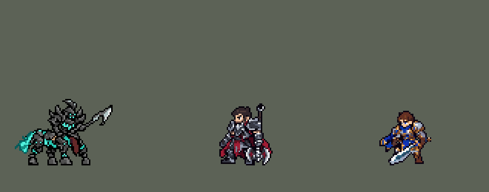
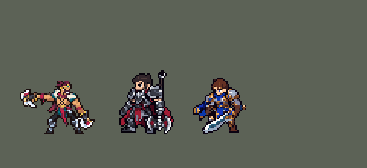
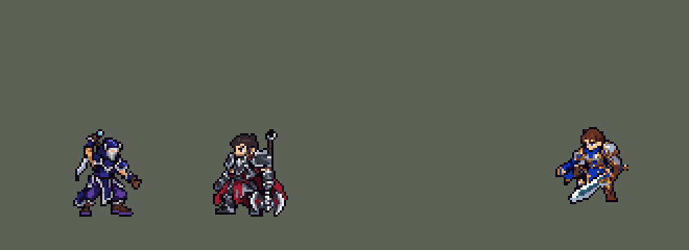
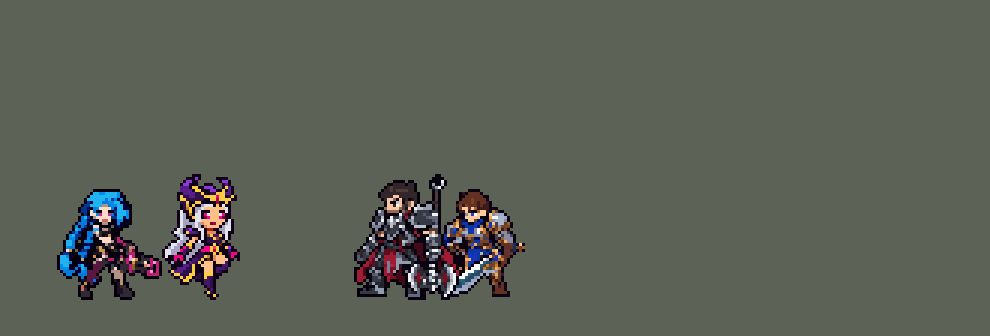
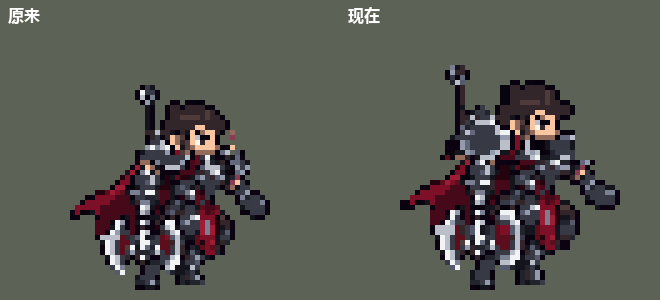

# TFM2-League-Heroes

团战经理2（Teamfight Manager 2）的英雄联盟英雄 Mod，mod_id 是 `league`。纯数据 mod：不改游戏本体，不需要编译。

英雄：盖伦（`league_garen`）、艾希（`league_ashe`）、拉克丝（`league_lux`）、李青（`league_leesin`）、索拉卡（`league_soraka`）、德莱厄斯（`league_darius`）、阿木木（`league_amumu`）、亚索（`league_yasuo`）、金克丝（`league_jinx`）、蕾欧娜（`league_leona`）、提莫（`league_teemo`）、易（`league_masteryi`）、安妮（`league_annie`）、厄运小姐（`league_missfortune`）、迦娜（`league_janna`）、墨菲特（`league_malphite`）、艾克（`league_ekko`）、永恩（`league_yone`）、伊泽瑞尔（`league_ezreal`）、锤石（`league_thresh`）、凯尔（`league_kayle`）、费德提克（`league_fiddlesticks`）、阿狸（`league_ahri`）、卢锡安（`league_lucian`）、莫甘娜（`league_morgana`）、锐雯（`league_riven`）、贝蕾亚（`league_briar`）、阿卡丽（`league_akali`）、薇恩（`league_vayne`）、娜美（`league_nami`）、贾克斯（`league_jax`）、黛安娜（`league_diana`）、维迦（`league_veigar`）、塔里克（`league_taric`）、崔丝塔娜（`league_tristana`）、菲奥娜（`league_fiora`）、菲兹（`league_fizz`）、萨科（`league_shaco`）、凯特琳（`league_caitlyn`）、魔腾（`league_nocturne`）、布里茨（`league_blitzcrank`）、卡蜜尔（`league_camille`）、乐芙兰（`league_leblanc`）、卡莎（`league_kaisa`）、娑娜（`league_sona`）、凯南（`league_kennen`）、蔚（`league_vi`）、瑞兹（`league_ryze`）、烬（`league_jhin`）、基兰（`league_zilean`）、亚托克斯（`league_aatrox`）、凯隐（`league_kayn`）、希维尔（`league_sivir`）、崔斯特（`league_twistedfate`）、洛（`league_rakan`）、伊芙琳（`league_evelynn`）、瑟提（`league_sett`）、丽桑卓（`league_lissandra`）、韦鲁斯（`league_varus`）、阿利斯塔（`league_alistar`）、蛮王（`league_tryndamere`）、泽拉斯（`league_xerath`）、赵信（`league_xinzhao`）、莎弥拉（`league_samira`）、派克（`league_pyke`）、格温（`league_gwen`）、卡兹克（`league_khazix`）、布兰德（`league_brand`）、图奇（`league_twitch`）、萨勒芬妮（`league_seraphine`）、雷克顿（`league_renekton`）、莉莉娅（`league_lillia`）、维克托（`league_viktor`）、霞（`league_xayah`）、璐璐（`league_lulu`）、弗拉基米尔（`league_vladimir`）、雷恩加尔（`league_rengar`）、克格莫（`league_kogmaw`）、劫（`league_zed`）、卡尔玛（`league_karma`）、奥拉夫（`league_olaf`）、赫卡里姆（`league_hecarim`）、德莱文（`league_draven`）、泰隆（`league_talon`）、慎（`league_shen`）、赛娜（`league_senna`）、辛德拉（`league_syndra`）、佛耶戈（`league_viego`）。每组上单、打野、中单、ADC、辅助各一：第一组盖伦、李青、拉克丝、艾希、索拉卡，第二组德莱厄斯、阿木木、亚索、金克丝、蕾欧娜，第三组提莫、易（无极剑圣）、安妮、厄运小姐、迦娜，第四组墨菲特、艾克、永恩、伊泽瑞尔、锤石，第五组有上单凯尔、打野费德提克、中单阿狸、ADC 卢锡安、辅助莫甘娜，第六组有上单锐雯、打野贝蕾亚、中单阿卡丽、ADC 薇恩、辅助娜美，第七组有上单贾克斯、中单维迦、ADC 崔丝塔娜、辅助塔里克，第八组有上单菲奥娜（剑姬，排在原定凯南的位置，凯南延后）、中单菲兹、ADC 凯特琳、辅助布里茨，第九组有上单卡蜜尔（青钢影）、打野魔腾、中单乐芙兰、ADC 卡莎、辅助娑娜。按用户 10 月 2 日排的顺序，打野黛安娜是第七组的，萨科是第八组的。第十组有上单凯南、打野蔚、中单瑞兹、ADC 烬、辅助基兰。第十一组有上单亚托克斯（剑魔）、打野凯隐、中单崔斯特、ADC 希维尔、辅助洛。第十二组有上单瑟提（腕豪）、打野伊芙琳、中单丽桑卓、ADC 韦鲁斯、辅助阿利斯塔（牛头）。第十三组有上单蛮王、打野赵信、中单泽拉斯、ADC 莎弥拉、辅助派克。第十四组有上单格温、打野卡兹克、中单布兰德、ADC 图奇、辅助萨勒芬妮。第十五组有上单雷克顿、打野莉莉娅、中单维克托、ADC 霞（洛的搭档，有联动）、辅助璐璐。用户 10 月 8 日改了名单：泽拉斯是第十三组的中单，布兰德换到第十四组。第 76 位是上单法师弗拉基米尔（用户选的上单）。第 79 位是 ADC 克格莫（射手）。第 80 位是辅助卡尔玛（功能型）。第 81 位是上单奥拉夫（战士）。第 82 位是打野赫卡里姆（战士）。第 84 位是 ADC 德莱文（射手）。第 83 位是中单泰隆（刺客）。第 85 位是上单慎（坦克）。第 86 位是辅助赛娜（射手）。第 87 位是中单辛德拉（法师）。第 88 位是打野佛耶戈（战士）。

对敌人放的小技能，施放目标是「敌人（不含防御塔）」，清线、打野时也会放；只有大招、德莱厄斯的 E（拉人）、阿木木的 Q（绷带）、锤石的 Q（钩子）、阿狸的 E（魅惑）、薇恩的 E（恶魔审判）、维迦的 E（扭曲空间）、凯特琳的 W（约德尔诱捕器）、卡莎的 W（虚空索敌）、基兰的 E（时光发条）、洛的 W（盛大登场，落地后接 E 轻舞成双）、阿利斯塔的 W（野蛮冲撞，撞完接大地粉碎）和布兰德的 E→Q（烈火燃烧接火焰烙印，清线交给 W 烈焰之柱）、劫的 W（影分身，一次施放接鬼斩和诸刃）只对英雄放（莫甘娜的 Q 对什么都放，但射程内有敌方英雄时朝英雄射；贝蕾亚的 Q 也一样，射程内有敌方英雄时扑英雄；娜美的 W、Q 也是，射程内有敌方英雄时打英雄；黛安娜的 Q 也一样，射程内有敌方英雄时朝英雄射，E 带着月光再冲的第二下也先找英雄；菲奥娜的 Q、W 也一样，射程内有敌方英雄时冲向、刺向英雄；凯特琳的 Q 也一样，射程内有敌方英雄时朝英雄射；凯南的 Q 也一样，射程内有敌方英雄时锁定英雄射；伊芙琳的 W 也一样，射程内有敌方英雄时先给英雄挂印记；丽桑卓的 Q 也一样，射程内有敌方英雄时朝英雄射，W 身边没人时冰爪只滑向队友正在打的敌方英雄，否则只是扔出去打一下；韦鲁斯的 Q 也一样，射程内有敌方英雄时拉满弓朝英雄射，只有小兵野怪时快速出手；赛娜的 W 也一样，射程内有敌方英雄时朝英雄射；辛德拉的 W 也一样，射程内有敌方英雄时把法球掷向英雄、接着朝他推 E，Q 在 E 冷却好时也先砸英雄）；提莫的 W 是给自己加速和伪装，也只在敌方英雄靠近时放。最早几个英雄的小技能只对英雄放，打野时一直平 A 野怪，按玩家反馈改了。

待机动画（0.77.0，0.77.3 补了维克托的法杖，0.77.4 补了诺手的斧子、凯南腰下的金边）：玩家反映选人界面里英雄「清一色的不动 不然就是动两个像素点」。现在每个英雄的待机都是用定稿自己的像素做的呼吸：脚不动，小腿以上整体下沉 0、1、2 行再回来，身体跟着向前偏 1 列，8 帧 × 140 毫秒（1.12 秒一个循环，和原版英雄的节奏一样）。切掉的行只选在小腿上看不出来的地方，手里的武器（盖伦、锐雯、莎米拉、剑魔、蛮王的剑，凯隐的镰刀，菲兹的三叉戟，妖姬、维克托的法杖，诺手的斧子，金克丝、烬的枪，韦鲁斯、艾希的弓）跟着身体整体移动，不会被压弯（`tools/art/idle_breathe.py`，由 `import_native.py` 最后一步生成）。布兰德、小炮、贾克斯、派克、永恩、格温、凯尔、牛头、索拉卡、机器人保留原来画好的待机。每组左边是原来的，右边是现在的：


- 眼睛（10 月 9 日，用户：「重构一下锐雯的眼睛 让他更像英雄联盟的锐雯」，三个方案里选了 B）：原来每只眼是 2×2 的圆眼（白高光 + 绿），改成窄而凶的两行琥珀色眼：睫毛行不变，虹膜行白高光 + 琥珀 `#B5732D`，下排深琥珀 `#6E3F14`（`work/rv/eyes_rv.py`）。改在 `riven_head_master.png` 上，再按 `riven_frames40.json` 每帧的头位置贴进 65 帧、造型和待机。模组版本 0.84.7。













## 英雄：盖伦

技能按创意工坊 *League of Legends Reborn* 的做法处理。团战经理2 只有「技能1、技能2、大招」三个技能位，所以大招放 R，两个技能位放最有代表性的两个小技能，剩下的小技能和被动合并进去。

| 部分 | 内容 |
|---|---|
| 技能1 | Q「致命打击」：加速；下一次普攻变成跃起重击并沉默目标。合并 W「勇气」：减伤、韧性、60 + 50% 攻击力的护盾（原来写的"最大生命值加成"字段游戏不读，护盾一直只有 60） |
| 技能2 | E「审判」：旋转 3 秒，边转边走向身边的敌人（贴身的英雄优先），共 7 次伤害，每次对半径 40000 内的敌人造成 25 + 55% 攻击力，追着的目标每次多受 25%（6 + 14% 攻击力），最后一次降低护甲 25%，6 秒。被动「坚韧」：高生命回复。每次伤害原来只有 12 + 32% 攻击力（英雄联盟每圈的数值），一次 E 的伤害还不如同样时间里平 A，玩家以为 E 不造成伤害。改成 25 + 55% 后玩家仍觉得 E 鸡肋：模拟里 E 占盖伦约 70% 的伤害，但他打上路对原版上单时，队伍每 10 分钟少约 3 个击杀。原因是旋转半径只有 30000：AI 在目标离他约 45 px 时就开始放 E（施法距离按两边的边缘算），站在边上的敌人扫不到，而英雄联盟里 E 的半径约是普攻距离的 1.9 倍。半径改成 40000，加上英雄联盟的「最近的敌人多受 25%」和 6 秒破甲后，和原版上单打平（击杀差 −3.0 → 0.0，各 240 局），剑风特效跟着放大到约 80 px 宽。转圈时怎么移动（玩家万华，2026-10-03：「自动吸附敌方英雄有点容易送了，而且清兵的时候不会动，也很呆」）：原来每一圈都以比走路快的速度冲向 60000 内随机的一个敌方英雄（常常是前排后面的、塔下的），附近没有英雄就原地转。现在每一圈按圈层找：贴身（25000 内）的英雄 → 30000 内的任何敌人（小兵、野怪、英雄）→ 45000 内的任何敌人，用他自己的移速（1000）走过去，+25% 打在他走向的那个敌人身上（`tools/kit/garen_spin.py`）。模拟 432 局（上路对原版 fighter / knight / executioner）：清兵、打野时原地不动的 E 73% → 6%，转完身边 40000 内没有队友 44% → 40%，每局死亡 4.29 → 4.25，击杀差 −0.98 → −1.47（误差约 0.35）；完全不优先英雄的版本转完落单只有 34%，但打不中正在打的英雄，击杀差 −2.08，没用 |
| 大招 | R「德玛西亚正义」：巨剑从天而降，造成真实伤害 |
| 精灵图 | 9 个动作 56 帧：待机、走路、普攻、Q 跃斩、战吼、E 旋转、R 施放、受击、死亡。身高约 36 px（原版人类英雄约 31 px），和原版一样是 Q 版大头（头约占身高 1/3），脸和眼睛在游戏里看得清。全部是正面 3/4 朝右，同一套造型和大小；除战吼和受击外，都按英雄联盟原版动作重画 |
| 特效 | 命中火花、Q 重击与沉默、Q 强化光环、W 护盾、E 剑风、R 天降巨剑 |
| 图标 | 官方技能图标（Q / E / R），从本地客户端提取，缩到 64×64 |
| 音频 | 从本地客户端提取的 9 条技能音效和 4 条中文语音。版权属于 Riot Games，**不提交到仓库**，按下面的命令在本地生成 |

### 从本地英雄联盟提取音频和图标

```bash
python tools/lol/extract_garen.py --lol "D:\WeGameApps\lol" --vgmstream "<vgmstream-cli.exe 路径>"
```

- 需要 Python 3.14（自带 zstd 解压），以及 `pip install pillow numpy`。
- `.wem` 音频要用 [vgmstream](https://github.com/vgmstream/vgmstream) 解码。
- 中文语音来自国服（WeGame）客户端的 `Garen.zh_CN.wad.client`。
- 只读取游戏文件，不修改。

`tools/lol/pose_ref.py` 从客户端读取英雄的模型、骨骼和动画，渲染真实动作的关键帧（3/4 视角朝右），作为 GPT 生图时的姿势参考。渲染图是 Riot 的模型，只在本地用，不入库。

`tools/lol/riot.py` 负责：
- 读取 WAD 包。
- 解析 Wwise 音频包。
- 把 `Play_sfx_Garen_...` 这类事件名对应到具体的音频文件。

以后做别的英雄也能直接用。

### 美术：GPT 生成，再导入成像素图

原图在 [`assets/source/garen/`](assets/source/garen/)。角色图是和艾希同一批的 Q 版重画，提示词见 [`CHIBI_REDRAW.md`](assets/source/CHIBI_REDRAW.md)，生成记录在 [`assets/source/chibi/`](assets/source/chibi/)；特效图和之前几轮的提示词见 [`PROMPTS.md`](assets/source/garen/PROMPTS.md)。

```bash
pip install pillow numpy
python tools/art/import_garen.py          # 写出 league/champions 和 league/effects 里的精灵图
python tools/art/preview_garen.py         # 写出 docs/preview 里的预览图和演示动图
```

导入脚本做这些事：
- 切帧：按空白列切开，连在一起的剑、光效整块归到同一帧。
- 缩放：每张图单独缩放，保证头一样大（GPT 每张图的头身比略有出入，按身高对齐会让头忽大忽小）。
- 对齐：脚底统一放在帧中心下方 11.5 px（和原版一致）。待机、战吼、受击按腿部和待机第一帧对齐；照英雄联盟动作画的走路、普攻、Q、R、死亡，按原版骨骼里头部的位置摆放（`pose_ref.py --track`）；普攻、Q、R 的前冲保留约 70%，免得收招时弹回待机太明显；E 旋转按两脚中点固定。
- 像素化：硬边、共享 64 色调色板、1 px 黑描边。
- 头像截取点（`champion_view` 的 `face`）用 `tfm2_ase.py face` 按原版英雄的规律定在头顶，`lint_mod.py` 会检查。

通用部分在 skill 的 `scripts/strips.py`，以后做别的英雄可以直接用。

逐帧预览：[`docs/preview/league_garen_frames.png`](docs/preview/league_garen_frames.png)，特效：[`docs/preview/league_garen_effects.png`](docs/preview/league_garen_effects.png)。

## 英雄：艾希

| 部分 | 内容 |
|---|---|
| 普攻 | 冰霜箭。被动「冰霜射击」：普攻减速 |
| 技能1 | Q「射手的专注」：4 秒内攻速提高；期间普攻换成英雄联盟里 Q 的连射姿势，伤害更高、减速更强 |
| 技能2 | W「万箭齐发」：向目标方向扇形射出 13 支冰霜箭（英雄联盟是 9 支），范围内每个敌人受到一次伤害并减速。数据里没有扇形判定，用的是线形范围技能（`LineRangeProjectile`，长 80、宽 45），画面上是扇形箭雨。SDK 模拟实测：宽度是离中线的距离，两头是圆的，单位中心离「艾希 → 前方 80 像素」这段线 60 像素以内都会被打中（45 + 约 15），身旁、身后也算 |
| 大招 | R「魔法水晶箭」：远距离直线飞行，眩晕第一个命中的敌方英雄，并在命中处炸开，减速周围敌人 |
| 修正（0.10.0） | W 之前在箭雨出现 2 tick 后就结算，箭还没飞出去；现在在箭雨飞到位的第 13 tick 结算，280 ms 的箭雨画面也不再在第 13 tick 被截断。SDK 对战模拟（对原版射手，两边各 36 局）团队击杀差 +2.45 → +1.43 |
| 修正（W 加宽） | 玩家觉得 W 窄。箭雨从 9 支、±28° 改成 13 支、±42°（间隔还是 7°），最后一帧箭尖从左右 35 像素展开到 50 像素，和实际打中的范围（中线左右 60 像素）对得上。判定和伤害都没改，击杀差不变。也试了加宽判定（SDK 模拟，对原版射手 gunner、soldier、archer、gambler）：宽 45000 / 55000 / 60000 / 70000 时，每次 W 命中英雄 0.68 / 0.76 / 0.84 / 0.92 个（每档 72 局），艾希伤害 11307 / 11576 / 11694 / 11951，团队击杀差 +2.40 / +2.58 / +2.26 / +2.03（每档 576 局；同一套数据两批种子差 0.9，都在噪声里）。判定本来就比画面宽，所以没加 |
| 去掉 | E「鹰击长空」：侦察视野，团战经理2 没有战争迷雾 |
| 精灵图 | 9 个动作 56 帧：待机、跑步、普攻、Q 连射、Q 发动、W、R、受击、死亡。身高 34 px（含兜帽），和原版一样是 Q 版大头，兜帽不遮脸，蓝眼睛在游戏里看得见。全部正面 3/4 朝右，同一套造型；除受击外，每个动作都按英雄联盟原版动画的时间点渲染姿势参考后生成，首尾帧是原版「待机 ↔ 动作」的过渡姿势。之后按游戏原尺寸重画了一次（18 色，见[下文](#按游戏原尺寸重画拉克丝艾希)） |
| 特效 | 冰霜箭、W 扇形箭雨（用冰霜箭按 13 个角度拼成，±42°；最初是 9 个角度、±28°，玩家觉得窄；GPT 画的扇形只有 8 支箭、箭长不一，没采用）、Q 连射、命中冰花、Q 专注光环、R 水晶箭、R 命中冰冻 |
| 图标 | 官方技能图标（Q / W / R），从本地客户端提取，缩到 64×64 |
| 音频 | 从本地客户端提取的 9 条技能音效和 2 条中文语音（Q、W；国服语音包里 R 没有语音）。不提交到仓库，按下面的命令在本地生成 |

```bash
python tools/lol/extract_ashe.py --lol "D:\WeGameApps\lol" --vgmstream "<vgmstream-cli.exe 路径>"
python tools/art/import_ashe.py           # 特效：原图在 assets/source/ashe/，提示词见 ashe/PROMPTS.md
python tools/art/import_native.py --hero ashe   # 角色图：按游戏原尺寸重画的版本，在 assets/source/native/
python tools/art/preview_ashe.py
```

第一轮的角色图（提示词见 [`CHIBI_REDRAW.md`](assets/source/CHIBI_REDRAW.md)）细节很多：细长的冰晶弓、黑兜帽上的白发。按面积平均缩小会糊成一片土黄色，所以当时每个游戏像素只从共享调色板里选一个颜色：覆盖面积最大的那个，冰蓝、白发、肤色、金色的权重加大（`strips.render_vote`）。即便这样，游戏里还是碎成杂色点，后来按游戏原尺寸重画了（见下文）。`import_ashe.py --body` 仍能写出第一轮的角色图。

待机的呼吸（0.27.0 修正）：Codex 重画的造型披风垂到站位点下 8 行，靴子只剩最下面 4 行。呼吸的接缝原来在站位点下 6 行，正好切在披风最后一行和大腿的连接处，下沉时那一行被盖掉，靴子像和身体分开了（用户：腿像分开了一样）。接缝挪到站位点下 9 行的靴筒里：第 3–5 帧除鞋底那一行外整个人（披风、大腿、靴子上半截）一起下沉一格，轮廓不变，只有 6 格颜色不同。

逐帧预览：[`docs/preview/league_ashe_frames.png`](docs/preview/league_ashe_frames.png)，特效：[`docs/preview/league_ashe_effects.png`](docs/preview/league_ashe_effects.png)。

## 英雄：拉克丝

| 部分 | 内容 |
|---|---|
| 数值 | 照搬创意工坊 *League of Legends Reborn* 的拉克丝：属性、伤害、射程、冷却、光球和光圈的大小、激光的长宽。技能效果一样，数值就不另调了，由玩家自己选。只有大招仍然只对英雄放 |
| 普攻 | 法杖射出光弹。被动「光芒四射」：技能命中敌人后 5 秒内，下一次普攻引爆光芒，追加魔法伤害。团战经理2 只能判断施法者自己身上的状态，所以引爆的是下一个被普攻的敌人；敌人身上的光芒标记是命中时播放的特效 |
| 技能1 | Q「光之束缚」：直线光球，路径上的敌人受到魔法伤害并被禁锢 1.5 秒（英雄联盟里最多命中 2 个，数据里的直线投射物只有「穿透 / 不穿透」，没有命中数量）。合并 W「曲光屏障」：施放时拉克丝和身边的友方英雄获得护盾 |
| 技能2 | E「透光奇点」：抛出光球，落地后形成光圈，圈内敌人减速 20%，1 秒后自动引爆（AI 不会手动二次引爆） |
| 大招 | R「终极闪光」：跃起悬空，法杖浮在身前蓄力，约 0.5 秒后发射长 340、宽 40 的激光，直线上所有敌人受到魔法伤害 |
| 修正（0.10.0） | R 的伤害之前比激光早 0.43 秒结算（光束还没出现就扣血），现在在激光出现、放出光束音效的第 28 tick 结算。SDK 对战模拟（对原版中单，两边各 36 局）团队击杀差 +1.44 → +2.28 |
| 精灵图 | 8 个动作 51 帧：待机、跑步、普攻、Q、E、R、受击、死亡。身高 34 px，Q 版大头（头约占身高 1/3），蓝眼睛在游戏里看得清。全部正面 3/4 朝右；除受击外，每个动作都按英雄联盟原版动画的时间点渲染大头姿势参考后生成：R 里法杖离手悬在身前、发射后空中蜷身再落地，死亡被击飞后仰面倒地。之后按游戏原尺寸重画了一次（19 色，见[下文](#按游戏原尺寸重画拉克丝艾希)） |
| 特效 | 光弹、命中、Q 光球和定身光环、W 彩虹护盾、E 光球和地面光圈（引爆）、R 激光（预警线、蓄力、光束、消散）、光芒标记和引爆 |
| 图标 | 官方技能图标（Q / E / R），从本地客户端提取，64×64 |
| 音频 | 从本地客户端提取的 11 条技能音效和 3 条中文语音（Q、E、R）。不提交到仓库，按下面的命令在本地生成 |

```bash
python tools/lol/extract_lux.py --lol "D:\WeGameApps\lol" --vgmstream "<vgmstream-cli.exe 路径>"
python tools/art/import_lux.py            # 特效：原图和提示词在 assets/source/lux/
python tools/art/import_native.py --hero lux    # 角色图：按游戏原尺寸重画的版本，在 assets/source/native/
python tools/art/preview_lux.py
```

拉克丝从第一轮就按 Q 版比例生成：造型图附本包的盖伦、艾希和原版法系英雄对照图，姿势参考图本身就是大头比例，造型图检查通过后才批量生成动作。第一轮导入时：
- 每张动作图按头的大小缩放：待机的头在各帧上按不同比例做相关匹配，同一张图里可靠的匹配相差不到 3%。
- R 的法杖离手后越过了等宽格子的边界，按连通块切帧：含深蓝紧身衣的块是身体，其他块（法杖、光芒）归给左边最近的身体。
- 原地播放的特效按格子中心对齐（GPT 把每帧画在等宽格子的正中，偏差不超过 8 px）。
- 激光按判定长度缩放（原来 240 px，照搬 LoL Reborn 的数值后是 340 px；最亮的一帧粗 35 px，判定宽 40 px），从拉克丝身前 6 px 开始。E 的光圈同样跟着判定半径从 60 px 缩到 53 px（半径 26500），调色板仍按原来的大小取色，其他特效的颜色不变。游戏把激光画在单位中心的高度，R 里悬浮的法杖离地约 14 px，正好在光束里。

后来角色图按游戏原尺寸重画了（见下文），每帧的位置沿用第一轮，所以法杖仍在光束里。`import_lux.py --body` 仍能写出第一轮的角色图。

跑步第 4、5、7、8 帧的下半身像变了形：英雄联盟里拉克丝跑到后半段把法杖竖在身后，杖尾垂到后脚边，游戏尺寸下金白色的杖尾和后腿粘在一起，看起来像一只金色的脚。这四帧的杖尾改画成和其他帧一样的深色靴子（杖尾算作被腿挡住），逐像素记在 [`native/lux_retouch.json`](assets/source/native/lux_retouch.json)，导入时套用。

待机的法杖看起来是歪的：法杖从她身后斜穿过去，露出的两截不在一条直线上。脚边金球到左腿那截画成 45°，右手到右上金球那截约 30°，顺着下面那截看，会从手上方 6 格处穿过。6 帧待机的这一截都按"金球—右手—金球"这条直线重画（每 3 格升 2 格，中间一格棕色，放到深色卡片背景上也看得出方向），每帧改 8～9 个像素，同样记在 `lux_retouch.json` 里。受击两帧的杖身本来就在直线上，没有改。

上面两处修改是第一版角色图的。Codex 第二版重画时法杖只画了手上面一截，这两处随旧的修图表一起去掉了，现在的 `lux_retouch.json` 是下面两处（2026-10-05）。

法杖被截断（用户：「拉克丝看起来好像法杖被截断？你查一查这个问题」）：英雄联盟里拉克丝的法杖和她差不多高，两端都有金饰，手握在中段，第一轮的造型图也是这样画的。Codex 第二版只画了手上面那一截：上端金饰、一小段杆，手握在杆的末端，手下面什么都没有，所以举起法杖时像被截断了。`tools/art/lux_retouch.py` 沿手上面那截的直线，补画手下面的半截和杖尾的小金饰，长度约为上半截的四分之三，和握在中段的比例一样。补了这些帧：待机、跑步第 4–8 帧、普攻第 6 帧、Q 第 1 和第 7 帧、E 第 2、6、7 帧、R 第 2–8 帧（悬空的法杖原来有一头是秃的）、受击两帧、死亡第 1 帧。拿在身前的画在身体前面，用描边和身体隔开；拿在身后的只画露出来的部分；跑步时杖尾停在臀部以上，不碰后腿（避免以前「金色的脚」的问题）。受击两帧金饰和手之间原来有一段描边色的暗杆，看起来像断开了，也改成了金色。其他帧法杖的另一半本来就被身体或手臂挡住，没有改。对比动图：[`docs/preview/league_lux_staff.gif`](docs/preview/league_lux_staff.gif)。

眼睛统一（用户：「眼睛统一统一 不对的地方就行修正」）：造型图里每只眼睛是一排深色眼皮，盖在一白一蓝两格上，眼皮上面是额头的皮肤。第二版把这张脸贴进每一帧时，头发还是 Codex 原来画的，有 18 帧刘海的描边或一格灰色高光正好压在眼皮上，那只眼睛就比另一只粗一倍。同一个工具把两只眼睛正上方那一排（从左眼白到右眼蓝）里的深色和灰色改回皮肤色，每帧的两只眼睛都和待机时一样。对比：[`docs/preview/league_lux_eyes.png`](docs/preview/league_lux_eyes.png)。

两处修改逐格记在 [`native/lux_retouch.json`](assets/source/native/lux_retouch.json)（35 帧共 607 格），由 `lux_retouch.py` 生成，`import_native.py` 导入时套用。

逐帧预览：[`docs/preview/league_lux_frames.png`](docs/preview/league_lux_frames.png)，特效：[`docs/preview/league_lux_effects.png`](docs/preview/league_lux_effects.png)。

## 英雄：李青

| 部分 | 内容 |
|---|---|
| 定位 | 刺客（Assassin），第一组里的打野 |
| 普攻 | 出拳。被动「疾风骤雨」：每次施放技能后，3 秒内接下来 2 次普攻攻速 +40%（两个 buff 计数，模板里"第 N 次普攻"的写法） |
| 技能1 | Q「天音波 / 回音击」：音波命中第一个敌人，造成物理伤害并留下印记；0.2 秒后李青自动飞踢冲到它身边再打一次。英雄联盟里二段是手动的，还按已损失生命加伤；这里自动冲、固定数值。AI 对着一个敌人放（0.50.4）：音波照旧直线飞、能躲、被小兵挡，只是往那个人当时的位置打。之前是朝方向放，Q 里又带着回音击的冲刺，内置 AI 把它当成位移技能，冷却一好就朝赶路的方向放，周围没有敌人也放（玩家反馈「技能1冷却好之后就莫名其妙地直接放出去」）：中路 3 局模拟 167 次 Q 里 88 次瞄着空地（47 次 90000 内一个敌人都没有）、73% 打空；现在 125 次里 15 次，瞄英雄的 30 次中 16 次。Q 真打到人以后李青强了一截（打野位对原版打野击杀差，两批平均：修之前 +1.08，只改释放 +2.37），所以伤害降三成：音波 50 + 90% → 35 + 65% 攻击力，回音击 50 + 100% → 35 + 70% 攻击力，现在 +1.54 |
| 技能2 | E「天雷破 / 摧筋断骨」：跃起捶地，周围敌人受到物理伤害并减速 40%。合并 W「金钟罩 / 铁布衫」：李青和身边的友方英雄获得护盾，李青获得 20% 吸血。W 原本要冲向友方，这里取消冲刺，免得 AI 被拉离战斗 |
| 大招 | R「猛龙摆尾」：按情况选踢法（0.27.0，用户要求）。出手时朝目标射一发看不见的探测弹，数这条线上的敌方英雄：目标身后还有人，就冲到目标面前正面踢，把它踢进身后的人群；身后没人，就跃过目标落到它身后回旋踢，把它踢回李青的队友那边。踢击 120 + 130% 攻击力的物理伤害，把目标踢飞约 54 px；一条金龙跟在它后面（正面踢时同速紧跟，回旋踢时晚 4 tick），沿途撞到的敌人受到 80 + 80% 攻击力的物理伤害并被击飞 0.75 秒。射程 30000，冷却 50 秒。模拟里约 13% 的大招是正面踢，每次平均撞飞约 1.9 个英雄（回旋踢 0.36 个）；打野对 5 个原版打野 +0.79 / +0.87（只回旋踢 +0.53 / +0.86） |
| 连招 | 用户要求（0.42.5）：「盲僧我们加点绝招 比如QRQ 回旋踢 QQAE RQQ……因为现在不能摸眼瞬移」。AI 一次只放一个技能，所以每个连招由被用掉的那个技能自己打出来：**QQAE**——回音击落到敌方英雄身边后 2.5 秒内放 E，先出一拳（100% 攻击力）再捶地；**QRQ（回旋踢）**——Q 还在冷却（6 秒内扔过 Q）时放 R，踢中后摆出回音击的飞踢姿势追上被踢飞的人（每 tick 7000，对方每 tick 飞 3000），再打 30 + 60% 攻击力；**RQQ**——Q 好着时放 R，踢中后立刻出掌（新加的 `q_throw`：Q1 推掌的后 4 帧），天音波追着被踢飞的人，在空中命中（50 + 90%），8 tick 后回音击冲过去（50 + 100%）。所以每次大招后面都接 QRQ 或 RQQ，正面踢、回旋踢照旧按身后有没有人选。不锁技能栏：第一版让连招用掉的技能挂一个冷却标记、技能栏等标记结束，模拟里 AI 照样放被锁的 E 和 R（打团和打野时都有），空放一个动作还吃掉真冷却；现在连招不消耗别的技能的冷却，RQQ 的天音波也不让 Q 进冷却，E 3 级、R 5 级解锁照旧。模拟 12 局（每局 15 分钟）：QQAE 18 次、QRQ 48 次（追击全中，平均 7 tick 追上）、RQQ 15 次（13 次天音波在对方落地前命中，12 次冲过去打中）。打野对 5 个原版打野（两边、三套队友阵容，两批各 720 局）：旧版 +0.79 / +0.87，连招版 +0.58 / +1.21，造成的伤害多约 10%，强度在误差范围内不变。 |
| 精灵图 | 10 个动作 62 帧：待机、跑步、普攻、Q1 推掌、Q2 飞踢、E 捶地、R 回旋踢、受击、死亡，加上连招用的出掌（`q_throw`：Q1 推掌的后 4 帧，`leesin_throw_tag.py` 从 Q1 的动作条里切出来，像素和时长都和 Q1 一样）。身高 31 px（光头头顶到脚底，辫子另算；腿缩短 3 行之前 34 px），16 色；红色蒙眼布横过脸，盲僧不画眼睛。全部正面 3/4 朝右，按英雄联盟原版动作的时间点画：战斗待机每 0.75 秒下沉弹跳一次，跑步是大步腾跃（双脚离地约一半时间），一圈 0.92 秒 |
| 特效 | 普攻命中、音波、音波印记、回音击命中、天雷破震波、金钟罩护盾、猛龙摆尾踢击、金龙、撞击击飞 |
| 图标 | 官方技能图标（Q / E / R），从本地客户端提取，64×64 |
| 音频 | 从本地客户端提取的 11 条技能音效和 4 条中文语音（Q、Q2、E、R）。不提交到仓库，按下面的命令在本地生成 |

```bash
python tools/lol/extract_leesin.py --lol "D:\WeGameApps\lol" --vgmstream "<vgmstream-cli.exe 路径>"
python tools/lol/native_pose.py assets/source/leesin/poses.json --out <参考图文件夹>
python tools/art/fit_native.py --hero leesin --src assets/source/leesin/codex --refs <参考图文件夹> --scale run=1.4 --scale attack=1.4 --scale skill=1.4 --scale skill2=1.34 --scale ult=1.38 --scale hit=1.38 --scale dead=1.35 --scale q2=1,1,1,1,1,1.18,1.18
python tools/art/shorten_legs.py --hero leesin      # 腿缩短 3 行（从 legs_long/ 里 Codex 画的原图开始）
python tools/art/fix_leesin_head.py                # 跑步的头、嘴前的黑线 → leesin_retouch.json（动作条变了才要重跑）
python tools/art/leesin_throw_tag.py              # 连招的出掌 q_throw：Q1 推掌的后 4 帧（Q1 的动作条变了才要重跑）
python tools/art/import_native.py --hero leesin    # 角色图（套用 leesin_retouch.json）
python tools/art/import_leesin.py                  # 特效
python tools/kit/leesin_combos.py                  # 连招写进手写的技能数据（只跑一次，--check 查）
python tools/art/preview_leesin.py                 # 逐帧图、特效图、演示和连招演示
```

李青没有先画高清的第一轮，而是一开始就按游戏原尺寸画（提示词见 [`assets/source/leesin/PROMPTS.md`](assets/source/leesin/PROMPTS.md)）：
- `native_pose.py` 把英雄联盟客户端里的动作直接渲染成游戏尺寸的参考图（34 px，每个像素一个 8×8 方块），旁边配同一批帧的高清渲染。每帧的锚点和原版头部骨骼的位置记在 [`native/leesin_cells.json`](assets/source/native/leesin_cells.json)。
- 先画原尺寸造型图，确认后同一批画 9 张动作和 9 张特效；Codex 整理成严格的 8×8 纯色块（交接记录在 [`leesin/codex/`](assets/source/leesin/codex/)）。
- 交回的动作里，除了待机，GPT 都画大了约 1.4 倍，头比身体放得更多；直接导入的话，李青一出招就会变大。`fit_native.py` 按头的大小把每张动作缩回造型图的比例（按 16 色投票取色，仍是纯色像素），再把每帧的蒙眼布对到原版头部骨骼的位置，着地的帧脚底压在地面线上。待机是 Codex 用确认过的造型图分层重组的，原样使用。
- 结果：16 色，和右边像素同色的比例 37%（原版英雄 18%–46%）；头像截取点 (0, −31)（腿缩短前 (0, −34)）。
- 腿和步频（2026-10-01）：用户：“盲僧的腿太长 导致步频过慢 比较违和”。`shorten_legs.py` 在每帧裤腰到脚踝之间删 3 整行（裤腰是灯笼裤的深蓝色第一次铺满 3 格的那一行，删和上下行最像的行，不连着删），上半身整体下移、脚还踩在地面线上，不重画、不重采样；Q2 的空翻和飞踢、R 的空翻、死亡被打飞的那一帧删行会把身体压扁，改成整帧下移 3 行，躺在地上的帧不动。Codex 画的原图留在 [`legs_long/`](assets/source/leesin/legs_long/)。步频慢的主因是跑步的时长：英雄联盟的 `Run_Base.anm` 有 1.53 秒，但动画图按每拍 0.02 秒播（`anim_graph.py LeeSin --grep run`：一圈 0.920 秒），原来 8 帧 × 192 ms 用的是文件原长，比原版慢 1.7 倍；改成英雄联盟的 8 帧 × 115 ms。头像截取点 −34 → −31，选人卡片的 `banpick_center` −7 → −10（待机最高处从站位点上 32 px 变成 29 px，照 −39 − 最高处）。
- 腰线（2026-10-01）：用户：“盲僧改了一下缩短了腿 但是要和腿中间有一条黑线”（“要”是“腰”）。这条线是 Codex 原图里肚皮和红腰带之间的一行黑描边，腿短了以后更显眼。`shorten_legs.py` 删完行后再处理腰线：裤腰往上 6 行内，上面紧挨皮肤、下面紧挨腰带或裤子的一两格黑色，改成下面那块布的最深色（腰带的深红、裤子的深蓝）；横向要连着两格以上才算线，单独一格是手臂轮廓的末端，不动；外轮廓（四邻有透明格）不动。空中整帧下移的帧（贴着腿的是手和头）和 W 落地下巴贴着膝盖的那一帧不处理。改了 32 帧、每帧 2–8 格，待机每帧 8 格。
- 黑边（2026-10-01，用户：「盲僧也要清理」）：同样加进 `COMPLETE` 和 `CLEAN`：缺描边的浅色边外补一格（1413 格），外圈的两种近黑（`#010000`、`#030106`）统一成一种，双层描边的内鼓包 130 格、碎点 93 格、斜阶梯多出的一格 21 格；蒙眼布那一块的脸、辫子、腕带的红条纹不动。`metrics` 的描边 96% → 98%（剩下的是深蓝裤子、深红腰带自己当边）。
- 跑步时头上的残影（2026-10-01，用户：「盲僧走路时发现头上有残影」「这里不还是有残影？」）：Codex 在每个跑步帧都贴了造型图的脸（蒙眼布和它下面逐格一样），但没擦掉底下他自己画的那颗头，它大多偏一两格：脸前缘外面露出一条边——第 2、3、7 帧是一列皮肤、蒙眼布的红和第二层描边，第 1、4、6、8 帧是双层描边；后脑勺外面有一两格的描边和暗红碎点；蒙眼布上面 4 行光头也是每帧重画的（发髻的金扣忽左忽右、头顶冒黑点、头发盖到头顶）。每帧 115 ms 播起来，头的边缘一闪一闪像残影。`fix_leesin_head.py` 按每帧蒙眼布的位置：头顶换成待机的（头皮、轮廓和金扣，不含待机垂在身后的辫子），帧里自己画的第二个金扣改成辫子的深色头发；从头顶到下巴，待机头部前缘外面的格子清掉（最多 2 格宽）；后脑勺（8 帧共有的后缘）外面两列清掉。往后飘的辫子和下巴下面的肩膀不动。改完 8 帧的头从头顶到下巴逐格相同，也和待机的头一样，每帧仍是一整块。
- 嘴前的黑线（2026-10-01，用户：「嘴巴前面还有黑线？」）：造型图的脸在棕色的嘴前面、描边里面多一格近黑色（`#030106`），下巴前缘再一格，和描边连成两格宽的斜黑线（旧造型去掉过的那条脸前缘深色线，Codex 的脸上又有了）。这两格改成皮肤色：嘴前是亮皮肤 `#F3B27C`，下面是皮肤阴影 `#D79260`，和旁边一样；露脸的 50 帧（待机、跑步、普攻、Q、E、R、受击、倒地前两帧）都改，每帧只动这 2 格。两项都写进 [`native/leesin_retouch.json`](assets/source/native/leesin_retouch.json)（共 311 格：跑步每帧 24–33 格，其他每帧 2 格），导入时套用，在呼吸和描边之前（下一条旧造型改嘴和鼻子的那份 retouch 在换成 Codex 动作条时删了，现在这个文件只有这两项）。
- 进游戏看过后改了嘴和鼻子：造型图脸前缘那条深色竖线和下巴上的深色块去掉，换成蒙眼布下方两行处 2 格的嘴；头部直立的动作帧套用同一张下半脸。待机的头右侧原来是一条直边，在深色的英雄卡片上看起来像被切掉一半，改成了弧形轮廓（额头、蒙眼布、鼻尖外凸，嘴和下巴内收）。改动逐像素记在 [`native/leesin_retouch.json`](assets/source/native/leesin_retouch.json)，导入时套用。

逐帧预览：[`docs/preview/league_leesin_frames.png`](docs/preview/league_leesin_frames.png)，特效：[`docs/preview/league_leesin_effects.png`](docs/preview/league_leesin_effects.png)。

## 英雄：索拉卡

| 部分 | 内容 |
|---|---|
| 定位 | 辅助（Util），第一组里的辅助，也是本包第一个治疗 |
| 普攻 | 法杖射出星光弹，造成 100% 攻击力的物理伤害 |
| 技能1 | Q「流星坠落」：星星砸向敌人所在的位置，0.4 秒后落地，范围魔法伤害并减速 30%。命中敌方英雄时获得「活力焕发」：2.5 秒内持续回复 75 + 30% 法术强度的生命并加移速，每次施放只触发一次。合并 E「星体结界」：每 16 秒最多一次，星星落地后留下星之领域，沉默圈内敌人，1.5 秒后仍在圈里的被禁锢 1 秒并受到伤害。英雄联盟里 E 是单独的技能；这里没有第三个技能位，就跟着 Q 落下，用一个隐藏的冷却 buff 保留原版 8 秒 / 16 秒的节奏 |
| 技能2 | W「星之灌注」：扣自己 6% 最大生命，治疗一名其他友方英雄 200 + 50% 法术强度（射程 90000，冷却 4 秒）；带有活力焕发时不扣血，目标也获得活力焕发（持续回血和移速，和英雄联盟一样）。扣血前先加 3 tick 的不死 buff，不会把自己扣死。合并被动「拯救」：放完后 2 秒内移速 +30%（数据读不到移动方向和友方血量，近似成治疗后赶去支援） |
| 大招 | R「祈愿」：治疗全图所有友方英雄 220 + 60% 法术强度，包括自己。原版对生命低于 40% 的目标加成治疗，数据做不到，统一数值 |
| 修正（0.10.0） | 之前流星出现 0.15 秒就结算伤害和减速，画面上 0.4 秒才落地；星体结界挂在了引擎不读的字段上（`RangeProjectile` 没有 `end_effects`），从来没有出现过。现在流星在落地那一帧结算，星体结界在同一时刻出现在落点。SDK 对战模拟（对 `priest`、`bard`、`enchanter`、`monk`，两边各 36 局）团队击杀差 −0.55 → −0.93，在随机波动之内：结界生效了，但流星晚结算更容易被躲开 |
| 修正（0.15.0） | W 的扣血和 Q 的活力焕发写在 `WithSelf` 里，本意是"只给自己"；可引擎里动作目标是别的单位时，`WithSelf` 会给施法者一次、再给目标一次（见下面迦娜一节后的说明）。所以 W 扣自己 6% 最大生命的同时，被治疗的队友也扣了自己的 6%（1490 血的战士少了 89），Q 的活力焕发也挂到了被流星砸中的敌方英雄身上。现在这两处改成只对自己生效的范围效果（`RangeEffect` + `AllyOnlySelf`）。SDK 对战模拟（对 5 个原版辅助，两边、三套队友阵容各 16 局）团队击杀差 −0.45 → −0.12，在随机波动之内，数值不用调 |
| 生命 | 780，每级 +80，比原版的辅助都低（最低的 `priest` 900 / +80）。原来 880 / +95：用户觉得加强后她在下路太能赖线、对线无解，于是技能数值不动、只降生命和成长，团战里的治疗照旧。SDK 对战模拟（对 `priest`、`bard`、`enchanter`，两边各 60 局）：前 5 分钟她自己的死亡从 0.50 次升到 0.62 次，10 分钟的治疗量只少 2%，团队击杀差 +0.2 → −0.7（在随机波动之内） |
| 治疗给谁 | W 用 `AllyNotSelf`（除自己以外的友方英雄，不含小兵），R 用 `AllyChampion` 加全图范围。游戏 AI 给友方技能打分时，治疗的价值是"治疗量和目标缺失生命取小"，所以应该会先治疗掉血最多的友方，满血时价值为 0。这是从 mod SDK 的代码里读出来的；用 SDK 跑的对战模拟也对得上：单纯加大 W 的治疗量，实际治疗几乎不涨，加射程、缩冷却、把活力焕发传给队友才涨 |
| 精灵图 | 8 个动作 52 帧：待机、跑步、普攻、Q 召唤流星、W 举杖、R 祈愿鞠躬、受击、死亡。白发顶到蹄底 35 px，17 色，全部正面 3/4 朝右，按英雄联盟原版动作的时间点画：待机 1.5 秒呼吸一次，跑步是蹄子着地的蹦跳式跑 |
| 特效 | 普攻星光弹、命中、流星坠落、活力焕发、星体结界、定身光环、星之灌注、祈愿（头顶的星和落在每个友方身上的光柱） |
| 图标 | 官方技能图标（Q / W / R），64×64 |
| 音频 | 从本地客户端提取的 10 条技能音效和 2 条中文语音（Q 借一句攻击台词，R）。不提交到仓库，按下面的命令在本地生成 |

```bash
python tools/lol/extract_soraka.py --lol "D:\WeGameApps\lol" --vgmstream "<vgmstream-cli.exe 路径>"
python tools/lol/native_pose.py assets/source/soraka/poses.json --out <参考图文件夹>
python tools/art/import_native.py --hero soraka    # 角色图（套用 soraka_retouch.json）
python tools/art/import_soraka.py                  # 特效
python tools/art/preview_soraka.py
```

美术和李青一样直接按游戏原尺寸画（提示词见 [`assets/source/soraka/PROMPTS.md`](assets/source/soraka/PROMPTS.md)）：
- 她的角在模型里没有自己的蒙皮权重，是跟着头走的，头放大 2 倍时角也变成 2 倍、成了最高点。`native_pose.py` 的 `keep` 把角的顶点绑到 `horn` 骨骼上，让它保持原版长度；长马尾挂在胸部骨骼下，本来就不随头放大。
- 造型图 Codex 画了三版：第一版是没整理的模糊图，第二版变成正面站姿、眼睛像两块白斑，第三版通过；嘴去掉，眼睛由用户调亮。
- Codex 把造型图的头逐格贴进了每一帧，头的大小一致，待机和跑步不抖。交回后用户发现头发只盖住头顶和后脑，额头和右半边都是蓝色皮肤，脸显得很大：所有帧的头统一加了刘海和右侧一缕发丝。Q 第 2–3 帧法杖和手分开了，补上握杖的手臂，删掉 GPT 留下的碎块和闪光。
- 之后用户觉得眼睛和嘴还是丑。原因是两只眼睛左右画反了（宽的那只贴在远侧脸边），眼睛只有两行像眯着，眼下 5 行脸加一块深蓝阴影像大下巴。按用户从三个方案里选的：刘海再下移一行，眼睛换回近左远右、改成 3 行的金色大眼，阴影缩成下巴底下一行，加一格暗红小嘴（倒地两帧闭眼）。头部每帧 35 个像素，造型图同步。改动逐像素记在 [`native/soraka_retouch.json`](assets/source/native/soraka_retouch.json)，导入时套用。
- 还原（0.27.2）：Codex 按定稿重画过一版动作条（第二步，先用它精修过的脸，后来按用户的意思换回确认过的脸），用户说不要新的美术版本、还原成旧的：动作条、定稿、`soraka_retouch.json`、贴图、帧表、逐帧预览和导入工具的表都回到 ac94284 之前，重新导入的贴图和帧表与那时逐字节相同，展示动图重新渲染；头像截取点一直没变。
- 结果：17 色，和右边像素同色的比例 29%（原版英雄 18%–46%）；头像截取点 (5, −35)。
- 特效放大 2 倍后，流星落地环和星体结界约 60 px 宽，所以 Q、E 的半径定为 30000。

逐帧预览：[`docs/preview/league_soraka_frames.png`](docs/preview/league_soraka_frames.png)，特效：[`docs/preview/league_soraka_effects.png`](docs/preview/league_soraka_effects.png)。

## 英雄：德莱厄斯

| 部分 | 内容 |
|---|---|
| 定位 | 上单（Melee），第二组第一个 |
| 普攻 | 斧头下劈，100% 攻击力。被动「出血」：普攻和 Q 命中让目标流血 5 秒，每秒 3 + 4% 攻击力的物理伤害，每次命中单独叠一层 |
| 被动 | 5 秒内命中 5 次进入「诺克萨斯之力」：攻击力 +40%，持续 5 秒，身后燃起暗红火焰。英雄联盟里按目标身上的出血层数算；数据读不到别人身上的层数，改成德莱厄斯自己的命中计数 |
| 技能1 | Q「大杀四方」：蓄力后抡斧转一圈，半径 32000 内的敌人受到 60 + 110% 攻击力的物理伤害并流血；每命中一名敌方英雄回复 25 + 30% 攻击力的生命 |
| 技能2 | E「无情铁手」：斧钩扫过前方约 106° 的扇形（46000），把敌人拉到身边。合并 W「致残打击」：之后 4 秒内的下一次普攻换成贴地横扫，20 + 150% 攻击力，减速 90% 持续 1 秒 |
| 大招 | R「诺克萨斯断头台」：跳到目标身上砸下，100 + 100% 攻击力的真实伤害；命中计数每层 +20%，诺克萨斯之力时翻倍（200 + 200%）。只对己方刚打过的敌方英雄放（`EnemyChampionRecentlyAttacked`，2026-10-04，用户：「现在AI会满血释放大招」：AI 的大招一有英雄进射程就放，常常在开团时砸满血的人；12 局模拟里放大时目标 ≥75% 血从 53 次里 10 次降到 52 次里 3 次，≤30% 血从 11 次升到 20 次，每局放的次数不变，击杀差 +2.59 → +2.42 在波动内）。击杀刷新（2026-10-09，用户：「诺手的大招刷新 做扩展包可以做的吧」）：用纯数据做在主包里，不装扩展包也有。落刀斩杀敌方英雄后，大招冷却清零、身上亮起诺克萨斯之力并播台词，可以马上再放一次；做法同派克的大招刷新（落刀时加 `league_darius_r_kill` 标记，目标活着下一 tick 清掉，4 tick 后检查，用 `ult_cooldown_mult` 清冷却），脚本 `tools/fix/darius_r_reset.py`。11 局模拟：放了 60 次大招，落刀斩杀 20 次全部刷新，没杀死人的一次都没误刷新；上单线击杀差 +0.83 → +1.61（6 个种子）。 |
| 精灵图 | 9 个动作 59 帧：待机、跑步、普攻、Q 蓄力抡圈、W 贴地横扫、E 甩钩回拉、R 跳斩、受击、死亡。发尖到靴底 34 px，18 色，动作全部取自英雄联盟原版动画 |
| 特效 | 普攻命中、出血、Q 旋风、Q 回血、诺克萨斯之力、W 就绪（脚下）、W 命中、E 扇形斧钩、E 钩中、R 巨斧砸地 |
| 图标 | 官方技能图标（Q / E / R），64×64 |
| 音频 | 从本地客户端提取的 11 条技能音效和 4 条中文语音（Q、E、R、诺克萨斯之力）。不提交到仓库，按下面的命令在本地生成 |

```bash
python tools/lol/extract_darius.py --lol "D:\WeGameApps\lol" --vgmstream "<vgmstream-cli.exe 路径>"
python tools/lol/native_pose.py assets/source/darius/poses.json --out <渲染文件夹> --alpha --parts
python tools/art/restyle_native.py assets/source/darius/poses.json --renders <渲染文件夹>   # 角色图
python tools/art/import_native.py --hero darius
python tools/art/import_darius.py      # 特效
python tools/art/preview_darius.py
```

美术（提示词见 [`assets/source/darius/PROMPTS.md`](assets/source/darius/PROMPTS.md)）：
- 造型图：Codex 第一轮把大图缩小成 34 px，眼睛和斧头都糊了；第二轮直接在原尺寸格子上逐格改，眼睛、描边、盔甲通过。之后加宽了深红前摆，两腿后面露出披风，把心形斧刃照模型改成双月牙巨斧，按用户选择加一格暗红小嘴。
- 脸：后来用户觉得不像英雄联盟里的诺手。照模型同角度的脸出了几个方案，用户选的是三格粗眉、眉心一道皱纹、下巴一圈胡茬，保留原版游戏画法的两行眼（白眼 + 灰蓝瞳），嘴还在两眼之间的正下方。前一版把嘴往后挪了一格、眉毛没压在眼睛上，用户觉得嘴歪、眼睛怪。造型图改了 6 格，动作图重新生成，每帧只差脸上这几格。
- 动作图：Codex 交回的 9 张是在格子上用色块拼的，身体忽大忽小，披风是一块红色方块，动起来很怪。所以改成直接用英雄联盟的动画：`native_pose.py` 在游戏尺寸下渲染每一帧（透明背景，另出一张头 / 斧 / 身体的部位图），`restyle_native.py` 把每个 8×8 块投票成造型图的 18 色（斧头按亮度，身体按色相分成深红、古铜和钢甲），描边画在轮廓外，头换成造型图的头（仰面倒地时转 90°）。肩甲放大 1.4 倍，和造型图一样大。动作、前冲和跳跃都是原版的，每帧是同一个模型，身材不会跳。
- 修了一个工具 bug：`native_pose.py` 原来把整张图的最低点放在地面线上。德莱厄斯的斧尖比靴底低 5 格，所以参考图和照着画的图都浮空 5 格。现在锚点按靴底算，参考图不变。
- 特效用 Codex 画的，围着人画的放大 2 倍。Q 旋风放大后半径约 29 px，所以 Q 的范围定为 32000。
- 结果：18 色，和右边像素同色的比例 37%（原版英雄 18%–46%）；头像截取点 (0, −34)。`tfm2_ase.py face` 把斧尖当成了脚，建议值是 −37。

逐帧预览：[`docs/preview/league_darius_frames.png`](docs/preview/league_darius_frames.png)，特效：[`docs/preview/league_darius_effects.png`](docs/preview/league_darius_effects.png)。

## 英雄：阿木木

| 部分 | 内容 |
|---|---|
| 定位 | 打野（Melee / Tank），第二组第二个 |
| 普攻 | 跳起来往下砸，100% 攻击力。被动「诅咒之触」+「绝望光环」：普攻或放任何技能后哭 4 秒，每秒对周围 25000 内的敌人造成 10 + 10% 法术强度的魔法伤害（敌方英雄另受 1% 最大生命值的真实伤害），并施加诅咒：受到的伤害提高 10%。英雄联盟里 W 是开关，按最大生命值算的部分是魔法伤害；数据里没有开关，魔法伤害也没有按目标生命值算的字段，所以改成打起来自动开的光环，百分比部分做成真实伤害，只打英雄（免得秒大型野怪）。诅咒每秒重新给 1 秒，不会叠加 |
| 技能1 | Q「绷带牵引」：朝敌方英雄扔绷带（施放距离 75000，绷带飞 85000），穿过小兵和野怪，粘住第一个敌方英雄：80 + 70% 法术强度的魔法伤害，眩晕 1 秒，然后阿木木飞过去。玩家反映「Q 从来没触发过眩晕，贴脸 Q 也没有」：模拟器里绷带 6 局命中 38%、命中后对方原地 1 秒，正式版的情况在这里复现不了，于是把两处只有它这样写的地方改成稳的：绷带半径 5000 → 7000、每 tick 5000 → 6500（本包最细最慢的技能，莫甘娜 Q 的宽度、本体梦魇技能的速度），命中时伤害和眩晕立刻生效，冲过去和飞行姿势 2 tick 后再放（李青 Q2 在游戏里验证过的写法）；模拟 6 局命中 38% → 60%。玩家试过后说「的确有点难 Q 中人」，要宽一点、远一点：半径 7000 → 12000，施放距离 62000 → 75000、飞行 70000 → 85000，模拟 18 局命中 56% → 73%（半径 10000 时 67%），打野对原版打野 720 局击杀差 −0.52 → +0.01。只有 1 层充能（英雄联盟是 2 层，AI 会立刻连扔两次） |
| 技能2 | E「阿木木的愤怒」：跺脚，周围 28000 内的敌人受到 60 + 50% 法术强度的魔法伤害，冷却 4.5 秒。被动：受到的普攻伤害降低 10%。英雄联盟里被攻击时冷却缩短，数据里没有"受到攻击时"的触发 |
| 大招 | R「木乃伊之咒」：周围 42000 内的所有敌人受到 150 + 80% 法术强度的魔法伤害，眩晕 1.5 秒，诅咒 3 秒。冷却 60 秒 |
| 精灵图 | 9 个动作 57 帧：待机、跑步、普攻、Q 扔绷带、Q 飞过去、E 发脾气、R 蜷起后炸开、受击、死亡。头顶到脚底 34 px，10 色，动作全部取自英雄联盟原版动画 |
| 特效 | 普攻命中、飞出的绷带、Q 粘住、诅咒标记、绝望光环（脚下）、E 冲击环、R 绷带炸开、R 缠住 |
| 图标 | 官方技能图标（Q / E / R），64×64 |
| 音频 | 从本地客户端提取的 9 条技能音效和 2 条中文语音（Q 的语音；大招借用一句普攻台词）。不提交到仓库，按下面的命令在本地生成 |

```bash
python tools/lol/extract_amumu.py --lol "D:\WeGameApps\lol" --vgmstream "<vgmstream-cli.exe 路径>"
python tools/lol/native_pose.py assets/source/amumu/poses.json --out <渲染文件夹> --alpha --parts
python tools/art/restyle_native.py assets/source/amumu/poses.json --renders <渲染文件夹>   # 角色图
python tools/art/import_native.py --hero amumu
python tools/art/import_amumu.py      # 特效；--raw <Codex 的 generated 文件夹> 先把原始图转成原尺寸条
python tools/art/preview_amumu.py
```

美术（提示词见 [`assets/source/amumu/PROMPTS.md`](assets/source/amumu/PROMPTS.md)）：
- 比例和镜头：阿木木在英雄联盟里本来就是大头，原版比例时头已经占身高 63%，前几个英雄用的"头 2.0、腿 0.8"会让头占 91%，所以用原版比例。待机时他的头往右垂，yaw 55 下只看得到一只眼睛，改用 yaw 40；镜像让身后拖在地上的绷带露出来。原版的 `Spell2` 是被绷带拉过去时身体放平的飞行姿势，用作 `q_pull`。
- 造型图：Codex 的生图对不准网格（1254 px 画布，方块约 13.45 px，只有 29 格高），但画风是对的。Claude 照英雄联盟 34 格的轮廓和姿势逐格画：头上三种深浅的横向绷带条，深紫黑眼窝里一双琥珀色大眼睛（用户在四个选项里选了"大眼睛、不画嘴"），躯干、下巴下的小爪子、两只大圆脚和拖地的绷带各自描边，10 色。
- 动作图：Codex 交回的 9 张也是生图原始输出，头每帧都是重画的，眼睛只是小点，转成原尺寸后站着的身高在 32 到 47 格之间跳。用户看了并排对比，选了用英雄联盟动画重新上色：`restyle_native.py` 把每个 8×8 块投票成造型图的 10 色（全身按亮度分五个绿），头换成造型图的头，只有倒地的几帧把头转 90°（`restyle` 新加的按动作设置的 `turn`）。
- 特效用 Codex 画的：`import_amumu.py --raw` 把原始图（半透明、格子比例不对）转成 8×8 方块的原尺寸条，再按技能范围定大小：E 冲击环约 58 px（半径 28000），R 约 84 px（42000），绝望光环约 56 px（25000）。
- 出手时刻和动画对齐：普攻第 15 tick 砸中，Q 第 16 tick 出手，E 第 20 tick 跺地，R 第 18 tick 炸开。
- 结果：10 色，和右边像素同色的比例 62%（绷带是大块平涂；原版英雄 18%–46%）。头像截取点 (5, −26)：`tfm2_ase.py face` 按头顶建议 −34，但阿木木的眼睛在头顶往下十几格，往下移 8 格，让卡片露出眼睛。

逐帧预览：[`docs/preview/league_amumu_frames.png`](docs/preview/league_amumu_frames.png)，特效：[`docs/preview/league_amumu_effects.png`](docs/preview/league_amumu_effects.png)。

## 英雄：亚索

| 部分 | 内容 |
|---|---|
| 定位 | 中单（Melee / Fighter），第二组第三个 |
| 普攻 | 挥刀劈砍，100% 攻击力。被动「浪客之道」：20% 暴击几率（英雄联盟里暴击几率翻倍，这里直接给 20%）。「剑意」每 15 秒充满一次，充满后下一次出手（普攻、Q 或 E）获得 40 + 40% 攻击力的护盾（2 秒；0.15.0 之前是 12 秒、60 + 60%，见下面的修正）。英雄联盟的 W「风之障壁」没有做：游戏里没有能挡掉飞行物的效果，只画一面墙在这个游戏里显得奇怪，用户决定删掉 |
| 技能1 | Q「斩钢闪」：向前突刺（45000 × 12000 的长条），30 + 100% 攻击力，按普攻算、可以暴击；命中后叠一层，满 2 层时放出旋风（飞 80000），击飞直线上的敌人 1 秒。E 冲刺中施放改为环形斩（半径 25000），满层时是环形击飞。冷却 4 秒 |
| 技能2 | E「踏前斩」：冲刺穿过一名敌人（施放距离 40000），停在它身后 15000，40 + 60% 攻击力；6 秒内再冲一次伤害 +25%，最多 +50%。冷却 5 秒 |
| 大招 | R「狂风绝息斩」：闪到施放距离 100000 内一名被控制（击飞、眩晕、禁锢、拉拽等）的敌方英雄身边，附近被控制的敌方英雄再被击飞 1 秒，受到 150 + 150% 攻击力的物理伤害；之后 10 秒无视 30% 护甲，剑意立即充满。冷却 40 秒。要有控制才能放：对战模拟里 10 分钟平均放 0.5 次（队友是原版英雄）到 2.9 次（队友是德莱厄斯、阿木木、艾希、拉克丝），以后加入带击飞的英雄时再调 |
| 连招 | 用户要求（0.42.9）：「亚索也加点连招」「永恩也是」「小鱼人也顺便加一点连招」。和李青、阿卡丽一样，每个连招由用掉的那个技能自己打出来，不锁技能栏：**R Q**——狂风绝息斩斩击落地后（第 29 tick）接一记较轻的环状出剑（25000 内 15 + 50% 攻击力，是 Q 的一半，也不叠层）；**Q3 E Q**——Q3 的旋风击飞敌方英雄后 2.5 秒内放 E，冲刺第 10 tick 自动环状出剑（就是冲刺中放 Q 的效果，不用 Q：Q3 刚用掉）。两记环状出剑都不耗 Q，所以比 Q 轻：按 Q 的全额 30 + 100% 还叠层时，亚索中路击杀差从 +2.30 涨到 +3.16（720 局），伤害多约 5%。原来就有的 EQ / EQ3 不变。模拟 12 局：R Q 33 次（每次大招都接上），Q3 E Q 4 次。强度（中路对 5 个原版法师，两批各 720 局）：旧版 +2.30 / +3.16，连招版 +2.65 / +2.89，强度不变。 |
| 修正（0.15.0） | 剑意的护盾写在 `WithSelf` 里（见迦娜一节后的说明）：普攻和 E 是对敌人施放的，护盾也给了被打的敌人；Q 是方向施法，护盾谁也没给。改成只给自己后亚索明显变强：SDK 对战模拟（打中路，对 5 个原版中单，两边、三套队友阵容各 24 局）团队击杀差 +2.06 → +3.16；护盾降到 40 + 40%、剑意改成 15 秒充满后是 +2.30（只降护盾到 40 + 40% 是 +2.67，30 + 30% 是 +2.84） |
| 精灵图 | 10 个动作 68 帧：待机、跑步、普攻、Q 突刺、Q3 放旋风、EQ 环形斩、E 冲刺、R、受击、死亡。身体按头顶到脚底 30 px 画、头保持原来的大小（马尾另外往上翘），20 色，动作全部取自英雄联盟原版动画 |
| 特效 | 普攻命中、Q 突刺的风、Q 命中、旋风烈斩就绪、Q3 旋风、击飞、EQ 环形斩、EQ3 环形击飞、E 命中、剑意护盾、R 连斩 |
| 图标 | 官方技能图标（Q / E / R），64×64 |
| 音频 | 从本地客户端提取的 13 条技能音效和 4 条中文语音（Q、Q3、E、R）。不提交到仓库，按下面的命令在本地生成 |

```bash
python tools/lol/extract_yasuo.py --lol "D:\WeGameApps\lol" --vgmstream "<vgmstream-cli.exe 路径>"
python tools/lol/native_pose.py assets/source/yasuo/poses.json --out <渲染文件夹> --alpha --parts
python tools/art/restyle_native.py assets/source/yasuo/poses.json --renders <渲染文件夹>   # 角色图
python tools/art/import_native.py --hero yasuo     # 套用 yasuo_retouch.json
python tools/art/import_yasuo.py      # 特效；--raw <Codex 的交付文件夹> 先把原始图转成原尺寸条
python tools/kit/yasuo_combos.py   # 连招写进技能数据（只跑一次，--check 查）
python tools/fix/fix_yasuo_q3_stamps.py   # Q3 旋风沿路逐格盖章，任何方向都是正的（只跑一次，--check 查）
python tools/art/preview_yasuo.py
```

美术（提示词见 [`assets/source/yasuo/PROMPTS.md`](assets/source/yasuo/PROMPTS.md)）：
- 比例和镜头：用户在三种头身比例里选了 C（头 2.0、腿 0.8），马尾按一半缩放（`hair 0.5`），保持原版的长度感。亚索的待机是深蹲，只有站直时的 80%，头顶到脚底仍按 34 px 算。后来用户觉得亚索比别的英雄大一圈，在三个方案（整体 80%、身体 80% 头不变、整体 88%）里选了身体 80% 头不变：`height` 30，`chibi.head` 2.4、马尾 0.417，头的像素大小和原来一样。待机时刀收在鞘里，腰上往后伸的是刀鞘；普攻和技能时手里是拔出来的银色刀，刀鞘还挂在腰上。
- 造型图：Codex 的两版生图对不准网格（1254 px 画布，方块 9.6–10.8 px），眼睛也不合规格。Claude 在英雄联盟 34 格的剪影上逐格画：先按材质自动投色，再手画肩甲的层叠羽片、刀鞘的银边、胸口的皮肤和斜挎皮带、金绳腰带和刀穗。脸在三个方案里，用户先选了原版游戏画法加小嘴，后来改成英雄联盟里的冷脸：三格粗眉、一行眼睛（白眼挨着黑瞳）、一格暗褐小嘴。身体缩小后脸看着像马脸、右边像被削平、嘴歪、远处的眼睛和头发连成一条像独眼，按用户的意见改了几版：E2 用刘海盖住额头、两只眼都画眼白、一格暗红小嘴放在正中，用户觉得一点都不像武士，还是喜欢缩小前的五官。最后选 F2：五官照缩小前（露额头、斜粗眉、细眼只有近眼有眼白、远眼一道暗缝、一格暗褐小嘴、下颌阴影），下巴用收短、收圆、描边的形状，下巴下面露出的脖子改成蓝色领巾。
- 动作图：用英雄联盟动画重新上色（`restyle_native.py`），这次加了三样：
  - 蓝布、深蓝裤子、金绳、皮肤、棕色皮革、钢铁按色相、饱和度、亮度分类投色（`materials`），原来只认深红布、皮肤和钢铁。原版的暗部很暗：胸口皮肤亮度只有 0.27、阴影里的金绳 0.13–0.36，所以皮肤从 0.1 算起，金色按色相认、不看亮度。
  - 马尾单独成一个部位（`native_pose.py` 的 `hair_part`），每帧跟着原版动画甩。
  - 头：第一版每帧贴待机时的造型头，跑步低头、EQ 转身、R、死亡躺下时头和身体对不上，用户指出后改成头也按原版逐帧取色（跟着身体转、低头、躺下），脸抹成造型图的两色平涂，再把造型图整块脸（额头、粗眉、眼睛、嘴，6×6 格）贴到每帧看得见的脸上：远眼贴着脸的前缘，朝左时镜像，背对镜头时不贴（`native_pose.py` 的 `face_track` 记下每帧脸的位置和朝向）。只贴眉眼几格时，刘海压住眉毛、嘴落到脸颊边上，用户觉得眼睛和嘴都怪。`features` 另有三项：`neck`（离脸两格内、眼睛以下的身体皮肤改成领巾色），`trim_front`（眼睛上方和下面三行里伸出脸前沿的那一列剪掉、重新描边：原版刘海在待机时从额头右上角凸出一块，待机第 3 帧下巴也鼓出一格，用户说身体一晃脸就怪；头发本来就盖在脸前的帧不剪，免得剪出缺口），`hair_above`（刘海上方露出的一条额头皮肤改成最深的发色，和头顶原有的边一致，不再在呼吸时闪出一条浅色）。待机时英雄联盟原版第 4、5 帧上身前倾 1 格、第 6 帧再回来，而且每帧的头都是重新取色的，呼吸时脸跟着左右摆、还会变形，用户觉得怪：`import_native.py` 的 `ORDER` 让待机 6 帧都用第 1 帧，新加的 `BOB` 在第 3–5 帧把腰带以上的上半身整体下移 1 格，脸始终是同一张。
  - 自动贴不好的 18 帧逐格手修（47 格）：普攻第 2 帧低头、死亡 2–4 帧画向下的眼线，死亡 6–7 帧躺平画闭眼，Q3 第 6–7 帧侧脸在前缘补暗褐色的嘴（第 7 帧脸转得太偏、整块贴不上，还补了眉和眼），待机 6 帧的金发箍统一成 2 格；大招收招和 E 冲刺收招的蹲姿（R 第 7–8 帧、E 第 7 帧）把下巴收进领巾：身体缩小后头伸出身体外，下半张脸像要从头上脱出来（用户说像“脱壳”）；跑步第 1 帧下巴线下面剩的一格皮肤改成领巾（看起来像张开的嘴）。记在 [`native/yasuo_retouch.json`](assets/source/native/yasuo_retouch.json)，导入时套用。
  - 跑步（0.10.0）：原版跑步时低着头，脸转成侧脸（朝向 0.25–0.36，嘴要 0.45 以上才画），脸块的下半截每帧贴得不一样，有几帧下巴线压在皮肤上像张开的嘴，用户说跑步时一会有嘴一会没嘴。改成跑步时头保持待机的朝向（`head_like`，蕾欧娜的跑步也是这样），8 帧都是和待机一样的脸，嘴一直在。身体和马尾还是原版的跑步动作，其他动作不变。
  - 死亡动画里拔出来的刀没有动画轨道，会竖在身边，死亡动作不画这把刀（`hide`）；腰绳的两根绳尾缩到 0.6 倍，跑动时不再甩出一大片金色。
- 特效用 Codex 画的 11 张：`import_yasuo.py --raw` 把原始图（半透明、格子比例不对）转成原尺寸条，再按技能范围定大小：Q 突刺 45 px 长，旋风 24 px 宽，EQ 的圈 50 px 宽（半径 25000，画一半大再放大 2 倍）。
- Q3 旋风在红色方倒过来（2026-10-05）：飞行物的画面会跟着飞行方向转，Codex 画的竖漏斗往左飞（红色方大多朝左放）就倒过来，往上下飞就横躺。先试过重画成俯视的旋涡，用户还是要原来的漏斗（「亚索的旋风特效还是用这个 右边的话你想办法处理一下」）。现在的做法：旋风本体照常飞、照常击飞，但不再挂画面；同一时刻沿同一条路线发出 16 个看不见的小投射物，分别停在旋风第 1、3、5……31 tick 所在的位置，每个停下时在落点播一帧漏斗（`ViewEffect`，游戏不会旋转它），一帧 34 ms，正好接上下一个。漏斗每 2 tick 前进 5 格，往哪个方向飞都是正的。数据由 `tools/fix/fix_yasuo_q3_stamps.py` 写入，`league_yasuo_big` 多了 `tornado_0`～`tornado_5` 六个单帧标签，和 `tornado` 共用同一块贴图。停点用 SDK 模拟核对过：16 个画面都落在旋风当时的位置，间隔 2 tick、每步 5000。
- 风墙：先后试过 Codex 画的风柱（被看成龙卷风）和照英雄联盟地面青线画的风幕，最后用户觉得风墙在这个游戏里不合适，整个技能删掉了。
- 出手时刻和动画对齐：普攻第 11 tick 命中，Q 第 8 tick 命中，Q3 旋风每 tick 飞 2.5 px，R 第 24 tick 落刀。
- 还原（0.27.1）：Codex 按定稿重画过一版动作条（第二步，换成用户选的眼睛，头像点挪到 (1, −39)），之后又试了重画头和马尾，用户觉得亚索的脸越做越离谱，要回到没做新美术的这一版：动作条、定稿、贴图、帧表、头像点和导入工具的表都回到 9248421 之前，重新导入的贴图和帧表与那时逐字节相同；展示动图重新渲染（对手是现在的德莱厄斯和盖伦），李青的展示里也有亚索，一起重渲染。
- 结果：20 色，和右边像素同色的比例 46%（原版英雄 18%–46%）。头像截取点 (4, −33)：`tfm2_ase.py face` 按最高点把马尾尖当成了头顶，它和 lint 会再按脸的肤色找一次头，(4, −33) 就在头顶上（缩小前是 (5, −34)）。

逐帧预览：[`docs/preview/league_yasuo_frames.png`](docs/preview/league_yasuo_frames.png)，特效：[`docs/preview/league_yasuo_effects.png`](docs/preview/league_yasuo_effects.png)。

## 英雄：金克丝

| 部分 | 内容 |
|---|---|
| 定位 | ADC（Range），第二组第四个 |
| 普攻 | Q「枪炮交响曲！」：射程 52500 内有敌人时用轻机枪「砰砰」，100% 攻击力，每发叠一层「火力全开」：攻速 +15% / +30% / +45%，2.5 秒。附近没有敌人时换火箭发射器「鱼骨头」：射程 64500，打中目标和它周围 20000 内的敌人，110% 攻击力，拿火箭时攻速 −10%。换枪有音效，由随机选敌（`RandomTarget`）量距离决定。被动「罪恶快感」：亲手击杀敌方英雄（普攻、火箭、R）后 6 秒攻速 +25%，移速 +100%，2 秒后降到 +60%，4 秒后 +30%。击杀用一枚只打英雄的隐形子弹判断：命中时给金克丝挂标记，目标身上挂一个每 tick 清标记的短效果，目标死了效果随之消失，几 tick 后标记还在就是击杀（模拟器里 13 次普攻击杀、3 次火箭击杀全部认出，没有误判） |
| 技能1 | W「震荡电磁波！」：蓄力 0.4 秒（英雄联盟 0.6 秒），射出电磁波，打中第一个敌人：75 + 120% 攻击力的物理伤害，减速 25%，2 秒。射程 100000（LoL Reborn 150000，太远时会拿去打远处的小兵），冷却 6 秒 |
| 技能2 | E「嚼火者手雷！」：往敌方英雄脚下扔三只夹子（射程 80000，飞 0.4 秒），落地 0.25 秒后布好，最多留 5 秒。敌方英雄走进 15000 内时夹子咬合爆炸：禁锢 1.5 秒，80 + 100% 攻击力的物理伤害，然后夹子消失。游戏里没有"留在原地、踩到才触发一次"的效果，做成 20 段、每段 0.25 秒：每段显示夹子、查一次附近的敌方英雄，咬到人后这个夹子作废。最早是一段接一段由隐藏飞行物生成、靠挂在金克丝身上的锁停下：玩家反映「夹子反复触发」，是她死后锁挂不到死人身上，定住的英雄每段被咬一口（模拟 24 局有 2 次，各咬 8、18 口）；0.36.1 让死后的检查发不出来，但那只在模拟器里验证过，新版本又有玩家看到「被秒的英雄同时碰到了两个炸弹」。模拟里旧链条在她死后确实照样往下走（7 次死时有夹子，之后又出现 19 段）。现在照提莫蘑菇改成扁平写法：20 段都是这次施法自己的延迟效果，施法者死了排着的延迟效果就停（同样 6 次，0 段）；每个夹子咬一次就作废（夹子自己的标记）；被咬的人禁锢的 1.5 秒内别的夹子不咬他（共用锁）；从第三段起每段还要上一段留下的标记（死后什么都加不上，所以万一还往下走，也最多再咬一口）；两次投掷轮流用两套标记，冷却缩短时两个夹子互不干扰。模拟 12 局：放 E 176 次（改前 169）、咬中 69%（改前 63%），同一个英雄 1.5 秒内被咬两次、死后再咬都是 0。冷却 10 秒 |
| 大招 | R「超究极死神飞弹！」：对 250000 内的敌方英雄发射，飞弹飞 300000（速度 4500），穿过小兵和野怪，撞到第一个敌方英雄就爆炸：半径 62000 内的敌人受到 175 + 90% 攻击力 + 目标 10% 最大生命值的物理伤害；没撞到英雄就不炸。英雄联盟里伤害随飞行距离增加、按已损失生命加成，数据做不到，改成固定数值加最大生命值百分比。冷却 50 秒。英雄联盟是全图大招，第一版也飞越全图（施放、飞行都是 1000000），但这个引擎把直线的终点（脚下 + 方向 × 射程）按 x、y 各自截进地图，终点出了地图整条直线就拐弯：SDK 模拟 240 局 1336 发，偏转中位数 7.5°，一成超过 23°，最多 45°，三分之一飞向地图的角，撞到英雄的 56%（瞄准的那个 23%）。0.86.12 改成施放 250000、飞 300000：只有站在地图边上时才拐（七八发里一发），撞到英雄 67%（瞄准的 43%），240 局里大招击杀从 38 次增加到 58 次。爆炸原来是飞弹终点的效果，射程短了以后没撞到人也会在半路炸开（英雄联盟没撞到英雄不炸），现在改由撞到英雄时丢出的隐形抛物线弹（1 tick 落地，布兰德被动的写法）在被撞的英雄身上炸，晚 1 tick，罪恶快感的击杀判定跟着晚 2 tick（58 次大招击杀认出 56 次，另两次是 7–8 tick 后才死的）。用标记判断「撞到才炸」的写法也试过：敌方 AI 看不到藏在标记后面的伤害，就不再躲飞弹（命中 80%），没有用。击杀差（ADC 位对 5 个原版射手，四批种子各 360 局）：修改前 +4.46，修改后 +4.46，持平（10 分钟伤害 11100 → 12000）。示意图 [`docs/preview/ult_lines_before_after.png`](docs/preview/ult_lines_before_after.png) |
| 数值 | 攻击 100（+20）、生命 900（+90）、护甲 20（+7）、魔抗 15（+3）、移速 900（+9），和原版射手一样。先照搬 LoL Reborn 的数值，模拟里伤害比原版射手低约 40%，用户说"加强吧"：换成原版射手的属性，W 蓄力缩短、伤害提高、射程缩短。加强后 10 分钟伤害约 8900（原来 6800），和德莱厄斯、阿木木、亚索、索拉卡一队时击杀领先 5.2（艾希 4.0）。亚索的大招只对被控制的英雄放，金克丝 E 的禁锢也算：队友里有金克丝时 10 分钟平均放 3.1 次（原版射手 2.5 次） |
| 精灵图 | 9 个动作 60 帧：待机、跑步、机枪普攻、火箭、W、E、R、受击、死亡。头顶到脚底 34 px，22 色，动作全部取自英雄联盟原版动画 |
| 特效 | 机枪子弹、机枪命中、鱼骨头火箭、火箭爆炸、电击枪蓄力、电磁波、电磁波命中和减速、扔出的夹子、夹子落地、布好的夹子、咬合爆炸、夹子消失、死神飞弹、飞弹大爆炸、罪恶快感 |
| 图标 | 官方技能图标（W / E / R），64×64 |
| 音频 | 从本地客户端提取的 15 条技能音效和 4 条中文语音（W、E、R，罪恶快感没有专门的台词，用她的笑声）。不提交到仓库，按下面的命令在本地生成 |

```bash
python tools/lol/extract_jinx.py --lol "D:\WeGameApps\lol" --vgmstream "<vgmstream-cli.exe 路径>"
python tools/lol/native_pose.py assets/source/jinx/poses.json --out <渲染文件夹> --alpha --parts
python tools/art/restyle_native.py assets/source/jinx/poses.json --renders <渲染文件夹>   # 角色图
python tools/art/import_native.py --hero jinx
python tools/art/import_jinx.py      # 特效；--raw <Codex 的交付文件夹> 先把原始图转成原尺寸条
python tools/art/preview_jinx.py
```

美术（提示词见 [`assets/source/jinx/PROMPTS.md`](assets/source/jinx/PROMPTS.md)）：
- 分工：从金克丝开始，角色图由 Claude 画，Codex 只画特效。
- 比例和镜头：头 2.0、腿 0.8、辫子 0.5，镜头 yaw 45，头顶到脚底 34 px；武器部位是轻机枪「砰砰」，火箭动作用原版 `Rlauncher_attack1`。
- 造型图：在英雄联盟 34 格的剪影上按材质自动投色（青色头发、粉色、红色、靛蓝、棕色皮革、皮肤、黑色），再逐格画脸。第一版的脸是空的，用户问"脸部五官也没有？"；按原版画法重画后，用户在几组方案里选了 B4：原版画法的眼睛，下巴正中一格她的唇色小嘴。20 色。
- 动作图：`restyle_native.py` 按造型图的颜色给英雄联盟动画逐帧投色，头按原版逐帧取色再贴造型图的脸块（和亚索同一套做法）；躺平的死亡第 6、8 帧贴不上脸，手画闭眼（近眼两格、远眼一格），记在 [`native/jinx_retouch.json`](assets/source/native/jinx_retouch.json)，导入时套用。
- 特效用 Codex 画的 15 张（生图原稿：半透明边、画布尺寸不对，这次帧距也不均匀）：`import_jinx.py --raw` 按画面之间最宽的空列切帧（夹子消失和罪恶快感自身有大空隙，写死切点），再按技能范围定大小：机枪一串 14 px，火箭 24 px，火箭爆炸约 37 px（溅射半径 20000），电磁波 30 px（半径 15000），扔出的夹子 18 px，三只夹子一排 32 px（判定半径 15000），死神飞弹 59 px（半径 28000），大爆炸约 97 px（半径 62000，画一半大再放大 2 倍）。夹子的三张图 Codex 画得大小不一（一排 589、635、504 px），各自缩到 32 px 宽，统一地面线和同一套颜色；两枚火箭每帧都用第一帧的弹体，只让火焰动（原稿的弹体每帧都有点变形）。
- 出手时刻和动画对齐：机枪第 7 tick 出膛，火箭第 11 tick（后坐那一帧），W 第 23 tick，E 第 12 tick 出手，R 第 17 tick（扛上肩的那一帧）。
- 结果：22 色，和右边像素同色的比例 32%（原版英雄 18%–46%）。头像截取点 (3, −35)。

逐帧预览：[`docs/preview/league_jinx_frames.png`](docs/preview/league_jinx_frames.png)，特效：[`docs/preview/league_jinx_effects.png`](docs/preview/league_jinx_effects.png)。

## 英雄：蕾欧娜

| 部分 | 内容 |
|---|---|
| 定位 | 辅助（Util），第二组的辅助，近战坦克和控制 |
| 普攻 | 剑击，100% 攻击力的物理伤害。被动「日光」：被蕾欧娜技能命中的敌人 1.5 秒内受到的伤害提高 10%。英雄联盟里是队友的下一次攻击引爆额外魔法伤害；数据只能给目标挂增伤，做成所有伤害都加 |
| 技能1 | Q「破晓之盾」：用盾猛击身边的一个敌人（射程 26000），100% 攻击力的物理伤害加 40 + 40% 法术强度的魔法伤害，眩晕 1 秒。英雄联盟里是强化下一次普攻，这里直接出手。冷却 5 秒 |
| 技能2 | E「天顶之刃」：掷出剑光，飞 65 px（每 tick 6 px，宽 7000），对直线上的敌人造成 60 + 40% 法术强度的魔法伤害；另一道只打英雄、不穿透的隐形剑光停在第一个敌方英雄身上，禁锢 0.5 秒，蕾欧娜冲到它身边。合并 W「日蚀」：出手时举盾，3 秒内受到的伤害降低 25%，随后盾牌爆发，对半径 35000 内的敌人造成 60 + 40% 法术强度的魔法伤害；打中敌人则减伤再持续 3 秒。蕾欧娜死了就不会爆发。只对英雄放，射程 60000，冷却 8 秒 |
| 大招 | R「日炎耀斑」：在敌方英雄所在处召唤一道阳光（射程 80000），0.62 秒后落下（英雄联盟 0.625 秒）：半径 36000 内的敌人受到 150 + 80% 法术强度的魔法伤害并减速 80%，中心半径 16000 内的敌人同时眩晕，都持续 1.75 秒。冷却 60 秒 |
| 数值 | 攻击 80（+6）、法术强度 20（+10）、生命 1100（+120）、护甲 40（+8）、魔抗 30（+5）、移速 1000（+10），和原版近战辅助 `monk` 相近。SDK 对战模拟（分别替换原版辅助 `monk`、`priest`、`bard`、`enchanter`、`taoist`，两边各 36 局）团队击杀差平均 +0.5，和原版辅助持平。亚索的大招只对被控制的英雄放，蕾欧娜的眩晕和禁锢都算：队友里有蕾欧娜时，亚索每 10 分钟放 3.7–4.0 次 R（辅助是原版 `priest` 时 2.7 次，本包阵容里是索拉卡时 2.9 次），没有改亚索 |
| 精灵图 | 9 个动作 51 帧：待机、跑步、普攻、Q 盾击、E 掷剑、E 冲刺、R、受击、死亡。头发到脚底 33 px，加上王冠 42 px，20 色，动作全部取自英雄联盟原版动画 |
| 特效 | 剑击、盾击和眩晕星、天顶之刃剑光、剑光命中、禁锢日印、日光印记、日蚀护罩、日蚀爆发、日炎耀斑（聚光、光柱、火环）、大招眩晕星 |
| 图标 | 官方技能图标（Q / E / R），64×64 |
| 音频 | 从本地客户端提取的 11 条技能音效和 3 条中文语音（Q、E、R）。不提交到仓库，按下面的命令在本地生成 |

```bash
python tools/lol/extract_leona.py --lol "D:\WeGameApps\lol" --vgmstream "<vgmstream-cli.exe 路径>"
python tools/lol/native_pose.py assets/source/leona/poses.json --out <渲染文件夹> --alpha --parts
python tools/art/restyle_native.py assets/source/leona/poses.json --renders <渲染文件夹>   # 角色图
python tools/art/import_native.py --hero leona
python tools/art/import_leona.py      # 特效；--raw <Codex 的交付文件夹> 先把原始图转成原尺寸条
python tools/art/preview_leona.py
```

美术（提示词见 [`assets/source/leona/PROMPTS.md`](assets/source/leona/PROMPTS.md)）：
- 分工：角色图由 Claude 画，Codex 只画特效。
- 比例和镜头：镜头 yaw 20、pitch 25，头 2.6、腿 0.8、头发 0.385，盾缩到 0.8 倍。王冠的尖角比头发高出 12 个单位，算进头顶会把其他部分都压小，所以按头发量头顶（`crown` 165），王冠像帽子一样立在上面。和原版骑士并排比时她头发到脚底只有 29 px，`height` 调到 39：头发到脚底 33 px，加上王冠 42 px。
- 造型图：待机第 1 帧按材质投色后画上脸。脸在三个方案里用户选了 C：原版画法的三行眼睛、上扬的眼线、一格暗红小嘴。20 色。
- 动作图：`restyle_native.py` 按造型图的颜色给英雄联盟动画逐帧投色。盾和布料单独成部件（`parts`），各按自己的材质投色，碰到盾的地方描边，不然盾会和盔甲糊成一片金色。她的脸小，被厚头发和王冠挡着，自动贴脸时投出的皮肤太少，加了三个选项：`profile`（朝向低于这个值时只贴脸块前四列）、`chin`（眼睛以下这么多行的脸块也可以盖住衣领）、`fallback`（皮肤太少时直接用跟踪到的远眼位置）。跑步时原版低头、脸藏到盾后面，用 `head_like` 保持待机时的头部朝向。待机 6 帧都用第 1 帧，第 3–5 帧上半身下移 1 格呼吸，分界在盾尖。
- 特效用 Codex 画的 10 张（生图原稿，和金克丝一样）：`import_leona.py --raw` 按画面之间最宽的空列切帧（日蚀爆发的火环几乎连在一起，写死切点），再按技能范围定大小：剑击 20 px，剑光 28 px 长（宽 7000），禁锢日印 26 px，日光印记 12 px，日蚀护罩从地面圈到顶 45 px（高过王冠），日蚀爆发的火环 70 px（半径 35000），日炎耀斑外圈 72 px（半径 36000，这两个画一半大再放大 2 倍），眩晕星 16 px。地面上的圈对准脚下；盾击的三帧星星从胸口移到头顶；大招的眩晕星播两遍，盖满 1.75 秒；日光印记在头顶上方，眩晕星在头顶，分开放，不会糊成一团。
- 出手时刻和动画对齐：普攻第 8 tick 命中，Q 第 11 tick，E 第 9 tick 掷出，R 第 12 tick 召唤；耀斑出现后第 37 tick（光柱那一帧）结算，1 秒的画面播完。
- 结果：20 色，和右边像素同色的比例 30%（原版英雄 18%–46%）。头像截取点 (3, −35)。

逐帧预览：[`docs/preview/league_leona_frames.png`](docs/preview/league_leona_frames.png)，特效：[`docs/preview/league_leona_effects.png`](docs/preview/league_leona_effects.png)。

## 英雄：提莫

| 部分 | 内容 |
|---|---|
| 定位 | 法师（Magician），第三组的上单，本包第二个法师 |
| 普攻 | 吹箭，100% 攻击力的物理伤害。被动 E「毒性射击」：命中时额外造成 20 + 30% 法术强度的魔法伤害，并让目标中毒 4 秒，每秒 10 + 10% 法术强度的魔法伤害（和英雄联盟的 E 一样是 4 秒、共 40% 法术强度）。英雄联盟里中毒不叠加、只刷新时间；数据里的持续伤害（`AddCasted`）每次命中各加一层、各自计时，数值按这个设计 |
| 技能1 | Q「致盲吹箭」：追踪飞镖，80 + 70% 法术强度的魔法伤害，致盲 1.5 秒（`BlockAttack`：目标不能普攻，游戏里显示缴械图标）。射程 65000，冷却 7 秒，也对小兵和野怪放 |
| 技能2 | W「小莫快跑」：敌方英雄靠近到 30000 以内时施放，移速提高 40%，持续 3 秒。合并被动「游击队军备」：同时伪装 1.5 秒（`CasterInvisible`：期间攻击也不会显形，敌人基本不再选他当目标），并获得「出奇制胜」，攻速提高 40%，持续 4.5 秒。英雄联盟里要站着不动才会隐身，引擎判断不了「静止」，改成随 W 触发。W 的被动加速算进了基础移速（1000，原版法师 900）。冷却 12 秒 |
| 大招 | R「种蘑菇」：往敌方英雄脚下扔蘑菇（射程 75000，0.33 秒落地），1 秒后布置好、藏进草里，最多潜伏 12 秒；敌人（英雄、小兵、野怪都算）走到 8000 以内就爆出毒云：半径 30000 内的敌人中毒 4 秒，共 100 + 48% 法术强度的魔法伤害，并减速 40%，持续 2 秒。3 层充能，每层 20 秒（英雄联盟满级 R 也是 20 秒一层）；AI 一般会在几秒内把 3 个蘑菇扔在不同的位置 |
| 蘑菇的做法 | 金克丝 E 的手雷是投射物一层套一层，JSON 已经嵌套 119 层，离 serde 的上限 128 层很近，撑不了 12 秒。提莫的蘑菇全部挂在大招本身的延时效果上（`Position` 施法的效果都落在施法点）：每个蘑菇一个每 tick 检测的触发区、一个每 2 tick 检测的伤害区，再加每 0.25 秒一段画面（潜伏的蘑菇，或爆开的毒云）。三个槽位各用自己的 buff，三个蘑菇可以同时潜伏。数据文件 292 KB，嵌套 19 层 |
| 数值 | 攻击 80（+6）、法术强度 40（+20）、生命 950（+100）、护甲 25（+7）、魔抗 25（+3）、移速 1000（+9）、射程 50000（原版法师 60000；英雄联盟里提莫的 500 也比拉克丝的 550 短）、攻击间隔 60 tick。LoL Reborn 里没有提莫，数值是自己设计的，用 SDK 对战模拟调：打上路、对 6 个原版上单（`fighter`、`executioner`、`lancer`、`pole_warrior`、`knight`、`berserker`），三套队友阵容平均团队击杀差 +1.0，和原版 `fighter`（+0.97）、本包德莱厄斯（+0.98）持平；初版（生命 900、攻击间隔 70、毒伤低一档）是 −2.1。提莫没有硬控（致盲和减速都不算亚索大招要的控制），亚索不用调 |
| 精灵图 | 8 个动作 42 帧：待机、跑步、普攻、Q、W、R、受击、死亡。帽顶到脚底 34 px（羽毛另算），24 色，动作全部取自英雄联盟原版动画 |
| 特效 | 毒镖、毒液命中、致盲飞镖、紫墨命中、致盲紫烟、起跑烟尘、伪装叶旋、中毒、飞在空中的蘑菇、蘑菇落地布置、潜伏的蘑菇、蘑菇毒云 |
| 图标 | 官方技能图标（Q / W / R），64×64 |
| 音频 | 从本地客户端提取的 10 条技能音效和 3 条中文语音（Q、W 借被动伪装的台词、R）。不提交到仓库，按下面的命令在本地生成 |

```bash
python tools/lol/extract_teemo.py --lol "D:\WeGameApps\lol" --vgmstream "<vgmstream-cli.exe 路径>"
python tools/lol/native_pose.py assets/source/teemo/poses.json --out <渲染文件夹> --alpha --parts
python tools/art/restyle_native.py assets/source/teemo/poses.json --renders <渲染文件夹>   # 角色图
python tools/art/import_native.py --hero teemo
python tools/art/import_teemo.py      # 特效；--raw <Codex 的交付文件夹> 先把原始图转成原尺寸条
python tools/art/preview_teemo.py
```

美术（提示词见 [`assets/source/teemo/PROMPTS.md`](assets/source/teemo/PROMPTS.md)）：
- 分工：角色图由 Claude 画，Codex 只画特效。
- 贴图：提莫的皮肤有三张颜色贴图（身体、口琴、蘑菇），按名字排序会先选中口琴那张，整个模型变成黄铜色。`pose_ref` 现在取皮肤 bin 里紧跟在网格后面的那张（其他英雄选到的贴图不变），`hide_submeshes` 去掉皮肤默认隐藏的蘑菇和口琴。
- 比例和镜头：镜头 yaw 55、pitch 25，镜像。约德尔人本身就是 Q 版：按英雄联盟原比例，头（含帽子和耳朵）占身高 56%（原版英雄约 36%，阿木木 63%），不再放大。羽毛缩到 0.6 倍、背包缩到 0.7 倍（原大在游戏里像一对翅膀）。按帽顶量头顶（`crown` 115），羽毛立在上面。
- 造型图：待机第 1 帧按材质投色，头部（帽子、护目镜、羽毛、耳朵、脸）逐格画。脸在三个方案里用户选了 A：英雄联盟原版的眯眼笑（两道弯眼）和一道暗红小嘴。
- 动作图：身体按英雄联盟动画投色；头部是造型图的头，贴在每一帧英雄联盟头部关节的位置（和阿木木、德莱厄斯一样），只在死亡躺下时转 90°。R 里原版有一个后仰翻身，挑帧时跳过；死亡时他被弹飞 320 个单位，用新的 `travel` 只保留 30% 的位移，也跳过了空中翻滚。待机 6 帧都用第 1 帧，第 3–5 帧膝盖以上下移 1 格呼吸。
- 跑步：英雄联盟的跑步是往前扑的冲刺，上身和脖子都往前探，腿往身后蹬，镜头俯视后脚离地 1–8 格；贴上去的头一直正立，用户在游戏里看到跑步时头和身体不像长在一起。三个方案里选了 B：跑步姿势往待机姿势混合 40%（`Run@t>Idle@0:0.4`），上身直起来，头坐在肩上；`flat` 让每帧的脚落回地面；为了头不晃，身子在头下的左右挪动也从最多 3 格降到 2 格。展示动图开头加了一段小跑入场。
- 死亡躺下的两帧，头起初贴到了脖子左上方 3 格、2 格的地方（`restyle_native` 在头转过去之后才按屏幕方向加 `dx` / `dy`），用户在动图里看出头和身体分开了；现在偏移在旋转前就折进关节位置。
- 特效用 Codex 画的 12 张（生图原稿）：`import_teemo.py --raw` 按交付的 manifest 切帧（毒云那张帧距不均），按技能范围定大小：毒镖 16 px，致盲飞镖 20 px，毒云的地面圈 60 px（半径 30000，画一半大再放大 2 倍），布置好的蘑菇 14 px 宽，潜伏的蘑菇和布置的最后一帧一样宽。紫墨和致盲紫烟在眼睛高度，烟尘、叶旋、中毒和蘑菇都落在脚下的地面线上，烟尘在身后。
- 出手时刻和动画对齐：普攻、Q 第 12 tick 吹出，R 第 15 tick（跳起扔出那一帧）扔出，R 动作 26 tick。
- 结果：24 色，和右边像素同色的比例 46%（原版英雄 18%–46%）。头像截取点 (0, −27)：头顶下 7 格，卡片上能看到眼睛。

逐帧预览：[`docs/preview/league_teemo_frames.png`](docs/preview/league_teemo_frames.png)，特效：[`docs/preview/league_teemo_effects.png`](docs/preview/league_teemo_effects.png)。

## 英雄：易（无极剑圣）

| 部分 | 内容 |
|---|---|
| 定位 | 刺客（Assassin），第三组的打野。包里此前只有李青一个刺客 |
| 普攻 | 剑击，100% 攻击力的物理伤害。被动「双重打击」：4 秒内连续的第 4 次普攻多砍一刀，造成 60% 攻击力的物理伤害（英雄联盟也是第 4 下，层数 4 秒） |
| 技能1 | Q「阿尔法突袭」：射程 50000，冷却 9 秒。瞬移到目标身上砍一刀（20 + 60% 攻击力），之后每 12 tick 随机闪到身边 35000 内的一个敌人再砍一刀（10 + 25% 攻击力），共 4 下，最后回到目标身边。可以重复砍同一个人：英雄联盟里重复砍同一目标只有 25% 伤害，数据分不出是不是同一个目标，所以后三下伤害较低。Q 期间（0.8 秒）隐身（`CasterInvisible`），同时有一个受到伤害降低 100%、免疫控制的 buff：贴身的敌人还能对他出手，但每下只掉 1 点血。最初是每一下之后给自己施加 11 tick 的放逐（`Banish`），敌人选不中他，但被放逐的单位不再给己方提供视野：他一个人在野区或敌群里时，周围的野怪和敌方英雄每一下都会掉进战争迷雾、从画面上消失（用户在游戏里发现）；只隐身又挡不住贴身的敌人。可以暴击，无极剑道期间每下附带 75% 的真实伤害。英雄联盟里普攻会减少 Q 的冷却，这里改成固定的短冷却（英雄联盟 18 秒）。小兵、野怪也会放 |
| 技能2 | E「无极剑道」合并 W「冥想」：近身有敌人时放（射程 26000），冷却 10 秒。先盘腿冥想 0.75 秒：1 秒内受到的伤害降低 40%，2 秒内回复 20 + 12% 攻击力的生命值；随后 5 秒内普攻附加 8 + 16% 攻击力的真实伤害（阿尔法突袭每击 6 + 12%），下一次普攻必定是双重打击。英雄联盟的冥想能引导 4 秒、按已损失生命加成治疗；这里 AI 不看血量（冷却一好就放，模拟里满血也放），所以改成开打时短暂冥想再接剑道 |
| 大招 | R「高原血统」：附近 40000 内有敌方英雄时放，冷却 50 秒。7 秒内攻击速度 +45%、移动速度 +45%，Q 和技能2 的冷却加快 40%，代替英雄联盟"击杀、助攻返还冷却"。免疫减速做不到（减速是 buff，引擎没有这个字段）；击杀延长持续时间也做不到 |
| 数值 | 攻击 105（+25）、生命 920（+85）、护甲 25（+7）、魔抗 15（+3）、移速 1100（+14），攻击间隔 0.8 秒，射程 25000。SDK 对战模拟（打野位，两边各 36 局）团队击杀差 −0.62（Q 用放逐时 −1.79）；原版刺客打野：`demon` +0.03、`circus_blade` −2.21、`hunter` −2.83、`inquisitor` −3.25、`ninja` −4.57，他在原版打野的中上。初版 +4.67，已下调 |
| 修正（0.15.0） | 冥想的治疗写在一个无目标（`None`）动作的 `WithSelf` 里（见迦娜一节后的说明），从来没有生效过。修好后易明显变强：SDK 对战模拟（打野位，对 5 个原版刺客打野，两边、三套队友阵容各 24 局）团队击杀差 +0.50 → +1.98。冥想治疗从 80 + 40% 降到 20 + 12% 是 +1.17（另一批种子 +1.13），再把无极剑道的真伤从 10 + 20% 降到 8 + 16%（阿尔法突袭每击 7 + 15% → 6 + 12%）是 +0.58，回到修正前的水平 |
| 精灵图 | 9 个动作 46 帧：待机、跑步、普攻、双重打击第二刀、Q 闪斩、冥想、R、受击、死亡。头盔顶到脚底 34 px（高举的剑另算），22 色，动作全部取自英雄联盟原版动画 |
| 特效 | 普攻斩光、双重打击 X 斩、无极剑道真伤金星、阿尔法突袭 X 闪斩和消失残影、无极剑道金色剑气、冥想莲花和上升光环、高原血统开启爆发和脚下加速光环 |
| 图标 | 官方技能图标（Q / E / R），64×64 |
| 音频 | 从本地客户端提取的 8 条技能音效和 3 条中文语音（Q、冥想、R；无极剑道没有语音）。不提交到仓库，按下面的命令在本地生成 |

```bash
python tools/lol/extract_masteryi.py --lol "D:\WeGameApps\lol" --vgmstream "<vgmstream-cli.exe 路径>"
python tools/lol/native_pose.py assets/source/masteryi/poses.json --out <渲染文件夹> --alpha --parts
python tools/art/restyle_native.py assets/source/masteryi/poses.json --renders <渲染文件夹>   # 角色图
python tools/art/import_native.py --hero masteryi
python tools/art/import_masteryi.py      # 特效；--raw <Codex 的交付文件夹> 先把原始图转成原尺寸条
python tools/art/preview_masteryi.py
```

美术（提示词见 [`assets/source/masteryi/PROMPTS.md`](assets/source/masteryi/PROMPTS.md)）：
- 分工：角色图由 Claude 画，Codex 只画特效。
- 比例和镜头：镜头 yaw 40、pitch 25、不镜像（普攻向右突刺），头 1.8（头盔占身高 38%，原版英雄约 36%）。头盔顶饰在英雄联盟里是 `Hair1-4` 骨骼，跟着头盔一起放大。腿上两把短剑在 34 px 里只会是杂点，不画。
- 头盔：2013 版的易整张脸都在头盔里。按材质投色时，头盔上的细金边和银色会变成每帧都不一样的碎块，所以照高清渲染逐格画了一个头盔，每帧贴到英雄联盟动画的头部位置（各帧头部倾角和待机相差多在 20° 以内）。死亡时他向前扑倒，头盔跟着转 90°（`restyle_native.py` 的新选项 `forward`）。脸在三个方案里用户选了 A：右下一簇绿色复眼镜片。下颚原来是一整条金色，在小尺寸下像一张黄嘴，改成只在前端留一个小金喙。
- 动作图：`restyle_native.py` 按材质给英雄联盟动画逐帧投色（暗蓝灰铠甲、深棕衣摆、金边、橙色宝石、黄绿长剑）。待机 6 帧都用第 1 帧，第 3–5 帧上半身下移 1 格呼吸，分界在枢轴下 1 行：他的后脚比前脚高 5 行，分界再低会把后脚也带着上下动。高举的剑是每一帧的最高处，找不到头部模板，跑步改按英雄联盟的头部关节对齐（`import_native.py` 的 `PASTED`）。
- 特效用 Codex 画的 9 张（生图原稿，和蕾欧娜一样）：`import_masteryi.py --raw` 按画面之间最宽的空列切帧（Q 闪斩第 3、4 帧连在一起，按等宽切），再按技能和身体定大小：斩光 20 px、X 斩 24 px、真伤金星 16 px、阿尔法突袭 34 px、消失残影 30 px；剑气、冥想和高原血统爆发按原稿里的空人形等于他的身高缩放，高原血统的地面光圈 22 px 宽。循环的剑气和加速光环按格子中心定位，逐帧不抖。
- 出手时刻和动画对齐：普攻第 12 tick 命中（挥剑落下那一帧），双重打击第二刀再过 8 tick；Q 每 12 tick 一下，每下重播 12 tick 的闪斩动作；技能2 的 45 tick 正好是 750 ms 的冥想动作。
- 结果：22 色，和右边像素同色的比例 38%（原版英雄 18%–46%）。头像截取点 (0, −35)：原来找头顶的规则会把剑尖当成头顶，现在最上面 12 行都很细时往下多看 20 行（其他英雄结果不变）。

逐帧预览：[`docs/preview/league_masteryi_frames.png`](docs/preview/league_masteryi_frames.png)，特效：[`docs/preview/league_masteryi_effects.png`](docs/preview/league_masteryi_effects.png)。

## 英雄：安妮

| 部分 | 内容 |
|---|---|
| 定位 | 法师（Magician），第三组的中单，本包第三个法师（拉克丝、提莫之后） |
| 普攻 | 扔出小火球，100% 攻击力的物理伤害 |
| 被动 | 「嗜火」：每施放 4 次技能，下一个伤害技能眩晕命中的英雄 0.75 秒（0.15.0 之前 1 秒），然后重新计数。Q、R 各算一次，技能2 是 W 加 E，算两次。攒满时身上绕着一圈白金色火光。用隐藏 buff 计数（和德莱厄斯的出血计数一样）。带不带眩晕在施法瞬间决定，所以第 4 次施法本身不眩晕，第 5 次才眩晕，和英雄联盟一样。眩晕由一个只对英雄生效的隐形"孪生"投射物或范围施加：AI 会拿 Q 清兵，打到小兵、野怪只造成普通伤害，眩晕留给英雄。出生和复活时自带眩晕：模拟器里看到死亡会清空 mod 加的 buff，每次出手先检查一个永久标记，没有就补上眩晕 |
| 技能1 | Q「碎裂之火」：指向火球，70 + 65% 法术强度的魔法伤害（0.15.0 之前 80 + 75%），射程 62500，冷却 4 秒，也对小兵和野怪放。英雄联盟里击杀返还法力和一半冷却；这里没有法力，引擎也没有重置冷却的效果，所以不做 |
| 技能2 | W「焚烧」：朝目标喷出 50° 扇形火焰（`Forward` + `DirDot`，和德莱厄斯 E 一样的锥形判定），半径 56000，60 + 65% 法术强度的魔法伤害（0.15.0 之前 80 + 85%），冷却 7 秒。合并 E「熔岩护盾」：给自己 60 + 40% 法术强度的护盾 3 秒，护盾存在时反弹 20% 所受伤害（普攻和技能都算，`WithShield` buff 随护盾破碎消失），移速 +30% 1.5 秒。英雄联盟里 E 可以给队友；这里只给自己 |
| 大招 | R「提伯斯之怒」：召唤提伯斯砸向一名敌方英雄（射程 62500），0.1 秒后落在他身边，以他为中心半径 30000 内 130 + 70% 法术强度的魔法伤害；嗜火攒满时眩晕范围内的英雄。之后提伯斯紧跟这名英雄 6 秒，每秒灼烧他周围的敌人 14 + 8% 法术强度，然后化成烟消失；这名英雄阵亡时提伯斯在下一秒化烟离场。冷却 60 秒。数据里的召唤物不能走路和普攻，提伯斯是挂在目标身上的一串特效和伤害：目标身上的持续效果（燃烧，目标显示燃烧图标）每秒播一段站立挥爪和脚下火圈（跟随目标），并用一帧抛物线投射物在目标脚下生成灼烧范围；目标死亡会清掉这个效果，提伯斯随之停下。安妮阵亡后提伯斯照样跟着目标，但死掉的施法者放不出投射物，这时只灼烧目标本人。画在单位下层、目标身后 9 px：熊比英雄高，从目标身后露出头和双臂，目标始终在他前面。0.13.0 的提伯斯落地后原地不动，目标走出火圈就烧不到 |
| 数值 | 攻击 80（+6）、法术强度 40（+20）、生命 900（+100）、护甲 20（+7）、魔抗 20（+3）、移速 900（+9），射程 60000，攻击间隔 1.5 秒，都是原版法师的标准。LoL Reborn 里没有安妮，数值是自己设计的，用 SDK 对战模拟调：打中路，对 5 个原版中单（`pyromancer`、`ice_mage`、`lightning_mage`、`wind_mage`、`white_mage`），两边、三套队友阵容各 24 局，团队击杀差 +1.49（0.13.0 原地不动的提伯斯）；0.13.1 提伯斯改为跟随目标，目标走不出火圈，灼烧保持英雄联盟 1 级光环的 20 + 12% 时是 +2.32；降到 14 + 8% 后两批各 720 局（1–24、25–48 号种子）是 +1.57 / +1.78，旧版同样两批是 +1.49 / +2.22（同一套技能换一批种子差 0.7，单批噪声约 ±0.35），平均输出新版高 2.6%；原版中单里最强的 `lightning_mage` 是 +1.19，拉克丝 +2.23。初版（眩晕 1.25 秒、Q 80%、反伤 30%、R 150 + 75%、灼烧 30 + 15%）是 +2.65。以上都是 0.15.0 之前的数字：那时熔岩护盾也给了被喷的敌人，修正后按下面"修正（0.15.0）"一行重新调过 |
| 修正（0.15.0） | W 的熔岩护盾写在 `WithSelf` 里（见迦娜一节后的说明）：W 是对敌方英雄施放的，护盾（连同 20% 反伤）也给了被喷的那个敌方英雄。改成只给自己后安妮明显变强：SDK 对战模拟（打中路，对 5 个原版中单，两边、三套队友阵容各 24 局）团队击杀差 +1.57 → +3.74（同一批种子）。只降 W 的伤害（60 + 65%）是 +3.47，Q、W 一起降是 +2.69，再把嗜火的眩晕从 1 秒缩到 0.75 秒是 +1.65 / +1.36（两批种子，修正前两批 +1.57 / +1.78），就用这一版；降护盾和反伤几乎没有影响（+3.74） |
| 亚索联动 | 眩晕算亚索大招要的控制。亚索打上路、安妮中路时，他每局放 R 2.19 次（队友换成带眩晕的 `lightning_mage` 2.73 次，`pyromancer` 0.67 次，拉克丝 1.04 次），在以往控制型队友的范围内，亚索不用调。0.13.1 提伯斯跟随目标后重测：新旧安妮同一批 48 局分别是 2.50 和 2.48 次，没有变化。0.15.0 嗜火眩晕缩到 0.75 秒后（亚索也换成 0.15.0 的数值）是 1.92 次，同一批里 1 秒眩晕的安妮 2.60 次，仍在控制型队友的范围内 |
| 精灵图 | 8 个动作 47 帧：待机、跑步、普攻、Q、W、R、受击、死亡。猫耳尖到脚底 32 px（腿缩短 2 行之前 34 px），30 色，动作全部取自英雄联盟原版动画 |
| 特效 | 普攻火球和命中、碎裂之火大火球和爆炸、焚烧扇形火、灼烧、熔岩护盾、嗜火火光、火焰眩晕星、提伯斯落地、站立挥爪、消失、脚下火圈 |
| 图标 | 官方技能图标（Q / W / R），64×64 |
| 音频 | 从本地客户端提取的 12 条技能音效和 2 条中文语音（Q、R；W、E 没有语音）。不提交到仓库，按下面的命令在本地生成 |

```bash
python tools/lol/extract_annie.py --lol "D:\WeGameApps\lol" --vgmstream "<vgmstream-cli.exe 路径>"
python tools/lol/native_pose.py assets/source/annie/poses.json --out <渲染文件夹> --alpha --parts
python tools/art/restyle_native.py assets/source/annie/poses.json --renders <渲染文件夹>   # 角色图
python tools/art/shorten_legs.py --hero annie       # 腿缩短 2 行（从 legs_long/ 里的原图开始）
python tools/art/import_native.py --hero annie
python tools/art/import_annie.py      # 特效；--raw <Codex 的交付文件夹> 先把原始图转成原尺寸条
python tools/art/preview_annie.py
```

美术（提示词见 [`assets/source/annie/PROMPTS.md`](assets/source/annie/PROMPTS.md)）：
- 分工：角色图由 Claude 画，Codex 只画特效。
- 模型：一张网格、一张贴图，皮肤里没有隐藏的子网格。小熊提伯斯是一根独立的根骨骼，渲染时当作"武器"部件（`"weapon": "^R_Teddy$"`），按亮度单独投成棕色并描边，不和她的衣服混在一起。
- 比例和镜头：镜头 yaw 35、pitch 25，镜像（看得到脸、背带裙和近手拎着的小熊）。按英雄联盟原比例头只占身高 29%；用户从 1.0 / 1.3 / 1.5 三个比例里选了 1.3（35%，原版英雄约 36%）。
- 造型图：头部逐格画：粉色猫耳发箍（两只尖耳朵）、洋红短发和刘海、绿眼睛按原版英雄的画法（睫毛 / 高光 + 瞳孔 / 眼白 + 虹膜，远眼一格宽）。三个脸部方案里用户选了 B：一格暗红小嘴。身体按英雄联盟动画投色。
- 动作图：头部贴在每一帧英雄联盟头部关节的位置。普攻和 Q 扔火球时英雄联盟会转身露出背包，这几帧朝镜头转 40–60°。R 举起小熊的第 4 帧起小熊消失（英雄联盟里小熊变成了提伯斯），死亡时把小熊甩出去；飞出格子的小熊或挡在脸上的小熊在小尺寸下都像杂物，用 `native_pose.py` 的新选项（逐帧 `hide`）去掉。死亡跳过英雄联盟里 1.5 秒背对镜头站着的部分，甩出小熊后直接倒下，头部用 `forward` 转 90°。待机 6 帧都用第 1 帧，第 3–5 帧小腿以上下移 1 格呼吸；跑步是 60% 英雄联盟的蹦跳跑加 40% 待机姿势，`flat` 让脚落回地面。
- 特效用 Codex 画的 13 张（生图原稿）：`import_annie.py --raw` 按交付的 manifest 切帧，按技能范围定大小：普攻火球 12 px、碎裂之火 20 px、爆炸 28 px、焚烧的扇形压成技能的 56 × 50 矩形（尖端在施法者身上）、熔岩护盾 42 px 高、火圈 60 px 宽（半径 30000）。提伯斯三张图里 Codex 画的熊大小不一（原稿里 235、218、约 270 px），各自缩放到耳朵到脚底 42 px，三张共用一套 20 色的色板，熊的颜色一致。提伯斯的参考图是他自己的模型：`pose_ref.py` 新增 `--wad`，召唤物放在英雄的 WAD 里（`--champ AnnieTibbers --wad Annie`）。
- 出手时刻和动画对齐：普攻、Q 第 12 tick 扔出，W 第 8 tick 喷火、第 12 tick 结算，R 第 12 tick 召唤、落地画面第 2 帧（再过 6 tick）结算。
- 结果：30 色，和右边像素同色的比例 37%（原版英雄 18%–46%）。头像截取点 (0, −26)（腿缩短前 (0, −28)）：猫耳尖下 6 格，卡片上能看到眼睛。
- 腿（2026-10-01）：用户：“安妮的腿也可以缩短一点 安妮的定位是小女孩”。`shorten_legs.py` 在每帧最低处往上 2–7 行（裙摆以下的腿）里删 2 整行（她腿上的颜色描边和裙子也用，找不到裙摆，按待机腿长从脚往上数），上半身下移、脚不动；死亡被抛起和落下的两帧整帧下移 2 行，躺下的三帧不动。待机呼吸的接缝还是站位点下第 6 行（上下两行只差 5 格）。原图留在 [`legs_long/`](assets/source/annie/legs_long/)。

逐帧预览：[`docs/preview/league_annie_frames.png`](docs/preview/league_annie_frames.png)，特效：[`docs/preview/league_annie_effects.png`](docs/preview/league_annie_effects.png)。

## 英雄：厄运小姐

| 部分 | 内容 |
|---|---|
| 定位 | ADC（Range），第三组第四个，本包第三个射手（艾希、金克丝之后） |
| 普攻 | 双枪射出子弹，100% 攻击力的物理伤害，射程 55000（英雄联盟 550，比艾希的 600 短一点） |
| 被动 | 「厄运的眷顾」：对新目标的第一枪额外造成 40% 攻击力的物理伤害，目标身上爆一颗红心。引擎读不出"这一枪和上一枪是不是同一个目标"（`SwitchByBuff` 只看施法者身上的 buff，在目标身上挂一个长时间的隐藏标记又一定会显示状态图标：`Bleed` 流血、`Fire` 燃烧、`Heal` 治疗、`Poison` 中毒，引擎只收这四种），所以近似为：她上一枪（或 Q 的第一发）打死了目标，或者 1.25 秒没开枪（新的一场战斗）。模拟里她换目标的 134 次里有 98 次是旧目标死了，其中 91 次是她自己补的刀；停火超过 1.25 秒后的普攻 87% 打的是新目标。漏掉的是 AI 在旧目标活着时主动换人。约一半的普攻带红心 |
| 技能1 | Q「一箭双雕」：一发子弹射向目标，打中的第一个敌人受到 20 + 100% 攻击力的物理伤害；再打中它身后的下一个敌人，造成 20 + 140% 攻击力（含被动）。第一发打死目标时，第二发暴击（×2），就是英雄联盟里补死小兵、暴击身后英雄的打法。英雄联盟的第二发在身后的扇形里弹射；引擎的随机选目标会把第一个目标再选一次，在子弹停下的地方放扇形也一样（范围效果按实体编号结算、英雄在前，不按远近，第一个目标总在扇形里）。所以同时射出两发同速（12000）的穿透子弹：看得见的窄子弹（半径 5000）只结算第一个敌人；看不见的宽子弹（半径 20000）在第一发命中后等 1 tick，之后 7 tick 内碰到的第一个敌人吃第二发（一次性的锁），不会再打回第一个目标。第一版只有窄子弹，身后的敌人要正好站在弹道上，游戏里几乎弹不到第二个英雄：同样 6 局模拟，第二发打到英雄 14 次（大多打在和第一个目标挤在一起的小兵上），现在 46 次，最远到第一个目标身后 88000。子弹速度 7000 时 AI 会侧身躲开约 15%，提到 12000 后每发都中。射程 60000，冷却 6 秒，也对小兵和野怪放 |
| 技能2 | E「枪林弹雨」：在目标区域下 2 秒弹雨（半径 30000），每 0.25 秒一波，每波 10 + 15% 攻击力的物理伤害（共 80 + 120%），减速 40%。英雄联盟的 E 是吃法强的法术伤害，她在这里没有法强，改成吃攻击力。合并 W「大步流星」：放完 E 后 4 秒攻速 +40%、移速 +20%。W 的被动（一段时间没受伤后加移速）引擎没有"未受伤"的触发，只保留主动部分。射程 70000，冷却 10 秒，也对小兵和野怪放 |
| 大招 | R「弹幕时间」：原地引导 3 秒，朝施放时锁定的方向（`Position` 施法）连射 12 波，每波对 50° 锥形（±25°，`Forward` + `DirDot`，长 100000）内的敌人造成 15 + 45% 攻击力的物理伤害，动作类型是普攻，所以每波都吃暴击率。模拟里眩晕打断不了已经排好的延时效果，所以每一波先找"自己身边 1 格内被控制的友方英雄"（就是她自己）：被眩晕、禁锢、击飞、击退、恐惧、魅惑时下一波起停止；她死了也停（每波检查引导 buff）。只对英雄放，冷却 50 秒。2026-10-01 加宽：原来是 40°（±20°），而且只管画面的矩形（`LineRangeProjectile` 100000 × 36000，没有效果）作用对象写的是敌人，AI 把它当成要躲的技能，每一波都往两边让、让出了锥形：下路 144 局里每次 R 打中英雄 4.75 次（每波 0.43 个，三分之二的波一个英雄都没打中），射程内敌方英雄偏离中线的中位角度从第 1 波的 5° 涨到第 12 波的 50°。只加宽锥形帮助不大（±25° 5.1 次、±30° 5.4 次、±35° 5.7 次），矩形改窄到 1000 宽、锥形 ±25° 是 6.6 次；现在锥形 ±25°，矩形只作用于友方（`applied_target: Ally`，大小和画面不变；敌人不再躲它，友方也没有去躲）：每次 R 7.1 次（每波 0.67 个）。击杀差两批 +3.34 / +2.78（改前 +2.77 / +3.09，在两批之间的波动以内），造成的伤害多 5% |
| 数值 | 攻击 100（+20）、生命 900（+90）、护甲 20（+7）、魔抗 15（+3）、移速 900（+9），攻击间隔 1 秒，和原版射手一样。没有其他 mod 做过她，数值是自己设计的，用 SDK 对战模拟调：打下路，三套队友阵容、两边各 36 局，团队击杀差 +4.41；原版射手 `gunner` +3.43、`soldier` +2.74、`archer` +2.43、`gambler` +1.91，本包艾希 +3.78、金克丝 +4.19。按美术定下的出手帧（普攻、Q、E、R 都在第 8 tick），初版（被动 60%、E 冷却 9 秒）是 +5.50，改成被动 40%、E 冷却 10 秒。再把 R 每波降到 40% 是 +4.47，没有差别，所以 R 保持 45%。Q 改成宽子弹找第二个目标后是 +4.39（同样的局，修前 +4.41），伤害略高，数值不用动 |
| 亚索联动 | 她只有减速，不算亚索大招要的控制，亚索不用调 |
| 精灵图 | 2026-10-04 用户在游戏里看到待机「有点怪异」（白色 T 形的肚皮、远侧手臂一块白、左上的枪像飘在头发边）：照英雄联盟原版在游戏尺寸下描（`tools/art/fix_missfortune_model.py`，逐帧补丁在 `assets/source/missfortune/modelfix/`），有明暗的腰腹、白布喇叭袖和前臂，枪拿在英雄联盟的位置（远侧垂在大腿边、近侧在腰间）；枪改成带握把和喇叭口的手枪，一个持枪姿势里只用一张图（「武器不自然啊」「右边的枪移动时变形」）。8 个动作 49 帧：待机、跑步、普攻、Q、E、R、受击、死亡。帽顶到脚底 36 px（原版戴帽子的赌徒 36、枪手 37 也把帽子算在内），23 色，动作全部取自英雄联盟原版动画 |
| 特效 | 普攻子弹、红心子弹、普攻命中、红心爆开、Q 子弹、Q 命中、弹射命中（带红心）、暴击爆炸、大步流星、弹雨区域、R 的扇形弹幕、R 命中火花 |
| 图标 | 官方技能图标（Q / E / R），64×64 |
| 音频 | 从本地客户端提取的 10 条技能音效和 3 条中文语音（Q、W、R；E 没有语音，E 的施放音带 W 的台词）。不提交到仓库，按下面的命令在本地生成 |

```bash
python tools/lol/extract_missfortune.py --lol "D:\WeGameApps\lol" --vgmstream "<vgmstream-cli.exe 路径>"
python tools/lol/native_pose.py assets/source/missfortune/poses.json --out <渲染文件夹> --alpha --parts
python tools/art/restyle_native.py assets/source/missfortune/poses.json --renders <渲染文件夹>   # 角色图
python tools/art/import_native.py --hero missfortune
python tools/art/import_missfortune.py      # 特效；--raw <Codex 的交付文件夹> 先把原始图转成原尺寸条
python tools/art/preview_missfortune.py
```

美术（提示词见 [`assets/source/missfortune/PROMPTS.md`](assets/source/missfortune/PROMPTS.md)）：
- 分工：角色图由 Claude 画，Codex 只画特效。
- 比例和镜头：镜头 yaw 35、pitch 25，不镜像（看得到脸和胸前，两把枪都在）。帽子是头部下面的 `Hat` 骨骼，放大头会连帽子一起放大：头 1.7 时三角帽占了 35 行里的 10 行、脸只有 4 行。改成头 2.1、帽子单独 0.75（`"scale": {"Hat": 0.75}`），脸大到能画三行的眼睛，帽子仍是三角帽；腿 0.65，头发 0.5，两把枪是武器部件（`^[lr]_weapon$`）。
- 造型图：先在英雄联盟 36 格的剪影上按材质整体投色（帽子、头发、皮肤、白袖子、深青色、深色），再逐格画头：更宽、两个尖角、金色帽带的三角帽，刘海，蓝眼睛，暗红唇，远侧的头发鼓出脸颊（竖直的一条边在深色卡片上像半个头）。三个脸里用户选了 C（三行眼、上挑眼线、红唇），又觉得眼睛上方那排纯黑睫毛紧贴刘海"一坨黑线太怪"；从三种改法里选了 C1：去掉上挑、睫毛改成暗红棕色。
- 动作图：头部贴在每一帧英雄联盟头部关节的位置，身体按造型图的颜色逐帧投色。死亡时两把枪脱手就隐藏（逐帧 `hide`），贴头不旋转（`"turn": {"dead": 180}`），停在 3.4 秒趴在地上抬着头的那一帧：再往后英雄联盟里她的腿翘到头顶上，转 90° 或竖着的头都会压在腿上。待机 6 帧都用第 1 帧，第 3–5 帧靴筒以上下移 1 格呼吸；跑步用待机时的头部朝向（`head_like`）。
- 特效用 Codex 画的 12 张（生图原稿，R 的一波是黑底）：`import_missfortune.py --raw` 按交付清单的 `source_rect` 切帧，黑底按亮度转透明，按技能范围定大小：普攻子弹 12 px、红心子弹 14 px、命中 14 px、红心爆开 18 px、Q 子弹 20 px、Q 命中 22 px、弹射 24 px、暴击 32 px、R 火花 10 px、大步流星的地圈 20 px、弹雨地圈 60 px 宽（半径 30000）。弹雨是在施法点播放的特效（`ViewEffect`），不随施法方向旋转：第一版把它做成弹雨区域（投射物）的画面，投射物画面会转向施法方向，在中路往左放时子弹往上飞。R 的一波压成 100 × 72 px（长 100000 的矩形，Codex 画的 ±20°），枪口固定在每一格的同一列，子弹逐帧往前飞；锥形加宽到 ±25° 后（2026-10-01），导入的第二步把七发子弹各自整颗往外挪到 1.3 倍远，成 100 × 93 px，子弹本身不缩放，最外两发落在新锥形的边上（演示动图跟着加高 12 px，免得最下面一发出画）。
- 出手时刻和动画对齐：普攻、Q、E、R 都在第 8 tick（普攻第 3 帧开枪、Q 第 3 帧、E 举枪朝天那一帧、R 蓄势后的第一发）。
- 结果：23 色，和右边像素同色的比例 35%（原版英雄 18%–46%）。头像截取点 (1, −34)：和赌徒一样在帽顶下 1 格。
- 黑边（2026-10-01，用户：「顺便帮我清理一下厄运小姐的黑边部分 干净一点」）：加进 `import_native.py` 的 `COMPLETE` 和 `CLEAN`。动作帧的外圈大多是另一种近黑（`#030203`，待机是 `#040213`），几处金色、发梢的边没描。现在缺描边的浅色边外补一格（582 格），外圈的近黑统一成待机那种，双层描边的内鼓包（96 格）和碎点（76 格）改成旁边的颜色，斜阶梯多出的一格去掉（42 格），眼睛周围的脸不动。第一版直接用菲奥娜的规则，逐帧审查（6 个审查代理看完四个英雄的每一帧）发现它把鞋底削成尖、把李青的黑辫子削细、把枪口、发梢、手腕红条纹这些深色像素直接涂黑、把画里第二种近黑画的内部分隔线当碎点改掉；现在用严格规则（`strips.clean_outline(strict=True)`，`import_native.py` 的 `STRICT`）：两种近黑都算描边，外圈只把近黑统一成一种，不把任何有颜色的像素涂黑，补描边新加的像素不改色，碎点只算周围一格内没有别的近黑的那种，阶梯外角只在斜阶梯处去掉（方角、直线、实心的深色块不动），找不到眼睛的帧（倒地、转身）整帧不改色。

逐帧预览：[`docs/preview/league_missfortune_frames.png`](docs/preview/league_missfortune_frames.png)，特效：[`docs/preview/league_missfortune_effects.png`](docs/preview/league_missfortune_effects.png)。

## 英雄：迦娜

| 部分 | 内容 |
|---|---|
| 定位 | 辅助（Util），第三组的辅助，本包第三个辅助（索拉卡、蕾欧娜之后） |
| 普攻 | 吹出一道风弹，100% 攻击力的物理伤害 |
| 被动 | 「顺风而行」：战斗中她和身边（半径 40000）的友方英雄移速 +8%。引擎没有常驻光环，做成和阿木木「绝望」一样的脉冲：她每次出手（普攻、Q、E）开始一串 4 秒的脉冲（正在进行就不重开），每秒给范围内的友方英雄挂 1 秒加速。英雄联盟里她的普攻还按额外移速附加魔法伤害，这里不做 |
| 技能1 | Q「飓风呼啸」：朝目标方向吹出龙卷风，0.57 秒沿直线走 85000（半径 10000），穿过的敌人受到 80 + 60% 法术强度的魔法伤害并被击飞 0.75 秒。射程 75000，冷却 9 秒，也对小兵和野怪放。英雄联盟里可以蓄力，蓄得越久吹得越远、击飞越久；这里不蓄力 |
| 技能2 | E「风暴之眼」：对一名敌方英雄（射程 90000）放出 W「和风守护」的风灵，造成 60 + 40% 法术强度的魔法伤害并减速 30%，持续 2 秒；同时给自己身边（半径 50000）一名其他友方英雄 150 + 75% 法术强度的护盾 4 秒，护盾存在时攻击力 +15%，身边没有队友时护住自己。冷却 5 秒。英雄联盟里 E 直接放在队友身上；可引擎给护盾估值时不看目标（期望值只算护盾量），放在队友身上的 E 会在没打架时一冷却好就放掉。改成对敌方英雄施放后，只有敌方英雄在 90000 内才放，护盾出现在交战时。W 的被动（加移速）不做 |
| 大招 | R「复苏季风」：把身边（半径 40000）的敌人往外吹开，然后原地引导 3 秒，每秒给范围内的友方英雄（包括自己）回复 130 + 50% 法术强度的生命，共 4 次。被眩晕、禁锢、击飞、击退、恐惧、魅惑或阵亡时中断（和厄运小姐的 R 一样，每次治疗前先检查自己是否被控制）。施放目标是身边的友方英雄，AI 按治疗量和对方缺的血估值，所以队友受伤时才放。冷却 50 秒 |
| 数值 | 攻击 80（+6）、法术强度 30（+15）、生命 900（+80）、护甲 20（+8）、魔抗 20（+4）、移速 1000（+10），射程 60000，攻击间隔 1.5 秒，和原版辅助 `priest` 完全一样。数值是自己设计的，用 SDK 对战模拟调：打辅助位，对 5 个原版辅助（`priest`、`bard`、`enchanter`、`monk`、`taoist`），两边、三套队友阵容各 24 局，团队击杀差 +0.11；同一批里索拉卡 −0.07、蕾欧娜 +0.78、原版 `priest` +1.10。把出手时刻对齐动画（普攻、Q 第 13 tick，E 第 11 tick，R 的击退从第 10 tick 挪到第 20 tick）之前是 +0.29，对齐后掉到 −0.42，于是护盾从 120 + 60% 提到 150 + 75%、每次治疗从 100 + 40% 提到 130 + 50%（只提护盾 −0.20，只提治疗 −0.15）。E 最初直接放在队友身上（冷却 7 秒）：AI 一冷却好就放，多半给了自己，团队击杀差 −1.32 |
| 亚索联动 | Q 的击飞和 R 的击退都算亚索大招要的控制。亚索打上路、迦娜在他队里打辅助时，他每局放 R 0.92 次；辅助换成蕾欧娜是 1.85 次，索拉卡 0.54 次，原版 `priest` 0.48 次。迦娜在没有硬控的辅助和蕾欧娜之间，亚索不用调 |
| 精灵图 | 9 个动作 52 帧：待机、跑步、普攻、Q、E、R 起手、R 引导、受击、死亡。一直浮在离地 3 px 的空中，发尖到脚底 33 px，27 色，动作全部取自英雄联盟原版动画 |
| 特效 | 普攻风弹和命中、飓风呼啸的龙卷风和击飞旋风、和风守护的风灵和命中、风暴之眼的护盾（成形、风暴、消散三段）、复苏季风的冲击环、地面风暴和治疗风 |
| 图标 | 官方技能图标（Q / E / R），64×64 |
| 音频 | 从本地客户端提取的 7 条技能音效和 1 条中文语音（R）。不提交到仓库，按下面的命令在本地生成 |

```bash
python tools/lol/extract_janna.py --lol "D:\WeGameApps\lol" --vgmstream "<vgmstream-cli.exe 路径>"
python tools/lol/native_pose.py assets/source/janna/poses.json --out <渲染文件夹> --alpha --parts
python tools/art/restyle_native.py assets/source/janna/poses.json --renders <渲染文件夹>   # 角色图
python tools/art/import_native.py --hero janna
python tools/art/import_janna.py      # 特效；--raw <Codex 的交付文件夹> 先把原始图转成原尺寸条
python tools/art/preview_janna.py
```

美术（提示词见 [`assets/source/janna/PROMPTS.md`](assets/source/janna/PROMPTS.md)）：
- 分工：角色图由 Claude 画，Codex 只画特效。
- 悬浮：英雄联盟里迦娜一直飘在空中，待机离地 12–39、跑步滑行时上下起伏 47、R 升到 64（英雄联盟单位）。离地 0 / 3 / 6 px 里用户选了 3 px（原版的幽灵约 6 px）：`native_pose.py` 新增 `"hover"`，锚点下移，每一帧都离地 3 px；跑步去掉起伏（`flat`），R 升起四成，死亡时逐帧落回地面（`"sink"`）。跑步最初保留七成英雄联盟的前倾滑行：身体前倾、腿拖在后面，每帧倾斜不同，而贴上去的头始终竖直，游戏里用户看到身体在头下面动、头像脱节了一样。往待机姿势混合 45% / 60% / 85% 的三版和原来并排做成循环动图，用户选了 85%：几乎是待机姿势飘着走，裙摆和腿轻轻往后飘，和原版的幽灵一样。
- 比例和镜头：镜头 yaw 45、pitch 25，镜像（不镜像时法杖挡在脸前）。四种比例里用户选了 D：头 2.0、头发 0.5、腿 0.8，英雄联盟的身体头顶到脚底 28 px。身材纤细，这个尺寸下手臂、腿和裙摆的布条只有一两个像素宽，每条都描边会把她切成一道道黑线（描边像素和身体像素一样多）。`restyle_native.py` 新增 `"cover": 0.3`（一个方块有 30% 被覆盖就算不透明）和 `"close": 1`（补上两个身体像素之间的空隙），裙摆成了一整块白色；`"weapon_materials"` 按色相把法杖上的橙色宝石和蓝色分开。
- 造型图：头 2.0 时英雄联盟的脸在头发下只有 4×3 格，所以头部逐格画：上扬的金色头发（英雄联盟的头在游戏尺寸上投色，再加三个发尖和发丝，免得像巫师帽）、原版风格的圆脸（6 格宽，原版眼睛配蓝色虹膜）、蓝色头饰和水晶、脑后的尖耳朵。三个脸里用户选了 B：一格暗红小嘴。
- 动作图：头部贴在每一帧英雄联盟头部关节的位置。死亡躺倒的两帧（−47°、−65°）头转 90°（`"turn": {"dead": 45, "*": 180}`）。用户看展示 GIF 时发现大招时头像脱离了身体、中间像一根管子：贴上去的头带着设计稿里待机姿势的两行脖子（中间还有一条黑线），R 的动作里英雄联盟又把身体侧过来，躯干只有 3 格宽。三个修法里用户选了"不要脖子、上身加宽"：头块只留到下巴下一行，这行涂成一整块皮肤（`"paint"`），头下移 2 格坐在肩上，下巴下 3 行身体补宽到 7、6、6 格（`restyle_native.py` 新增 `"shoulders"`）。
- 特效用 Codex 画的 11 张（生图原稿）：`import_janna.py --raw` 按交付的 manifest 切帧，按技能范围定大小：风弹 12 px、命中 16 px、风灵 14 px、风灵命中 18 px、龙卷风的旋涡 26 px（带尾迹 34 px）、击飞旋风和治疗风按 34 px 高的英雄、护盾风暴 36 px 高、复苏季风的冲击环 84 px 宽（半径 40000）、地面风暴压成 84 × 42（Codex 画成 1.47:1，地面上的椭圆是 2:1）。投射物的画面会随施放方向旋转，所以龙卷风要的是俯视的旋涡：漏斗形的龙卷风往左放时会倒着飞。护盾是三段式 buff 画面（`ThreePhase`）：风暴之眼成形、护盾存在时循环的风暴、成形倒放当作消散；三段引擎都要，少了 `remove_tag` 整个英雄读不出来。复苏季风的冲击环和地面风暴画在单位下层。
- 出手时刻和动画对齐：普攻、Q 第 13 tick，E 第 11 tick，R 第 20 tick 吹开敌人，第 35、95、155、215 tick 治疗。
- 0.21.0 重画（做凯尔时，用户说迦娜的模型不满意、脖子和身体看起来分离）：贴上去的头约 15 格宽，英雄联盟比例的身体只有 5 格宽，细脖子一连就像头浮在身体上。渲染时英雄联盟的头改成 1.6 倍（原来 2.0）、高度 30 px（原来 28），身体分到更多高度、粗了约两成，头重新坐到肩上；普攻、Q、E 的第 2–5 帧往待机混合 35%（英雄联盟在这几帧把她侧过身、腿甩到身后，身体挂在头的一角）。头部重画：两缕头发照英雄联盟往后上方扬起（不再是尖帽子），额饰加上 V 形；皮肤和白衣服的暗部调亮（深棕和石板灰在白衣服上像脏污）。
- 结果：32 色，和右边像素同色的比例 31%（原版英雄 18%–46%）。头像截取点 (−1, −33)。

逐帧预览：[`docs/preview/league_janna_frames.png`](docs/preview/league_janna_frames.png)，特效：[`docs/preview/league_janna_effects.png`](docs/preview/league_janna_effects.png)。

## 英雄：墨菲特

| 部分 | 内容 |
|---|---|
| 定位 | 上单（Melee），第四组第一个，本包第一个吃法强和生命值的坦克上单（盖伦、德莱厄斯吃攻击力，提莫是法师） |
| 普攻 | 岩石拳头猛砸，100% 攻击力的物理伤害，攻击间隔 1.17 秒 |
| 被动 | 「花岗岩护盾」：60 + 60% 法术强度的护盾，被打破 10 秒后重新长出来，出生和复活后的第一次行动就有。英雄联盟是 10 秒没挨打回盾、护盾值 10% 最大生命值；引擎没有"受到伤害"的触发，护盾也不能按最大生命值算（护盾只有固定值、攻击力、法强三种加成）。所以护盾挂一个跟着护盾存在的标记（`WithShield`），盾破了标记就没了，他的下一次行动开始计 10 秒，计完后的下一次行动重新套盾：长时间团战里大约每 10 秒回一次，比原版略强。60 + 60% 法强在 1–12 级约等于原版的 10% 最大生命值。合并 W「雷霆拍击」的被动：护甲 +10%，护盾在时 +20% |
| 技能1 | Q「地震碎片」：掷出一块碎石，造成 60 + 50% 法术强度的魔法伤害，减速 25% 持续 3 秒，他偷走这部分速度（移速 +25%，3 秒）。射程 60000，冷却 6 秒，也对小兵和野怪放 |
| 技能2 | E「大地震颤」：猛击地面，半径 36000 内的敌人受到 50 + 40% 法术强度 + 2% 自身最大生命值的魔法伤害，攻速降低 20% 持续 3 秒。原版 E 吃护甲，引擎的伤害读不到护甲，改成自身最大生命值（基础游戏的食人魔、LoL Reborn 的加里奥和赛恩也是这样）。合并 W「雷霆拍击」的主动：之后 4 秒普攻额外对前方扇形（`Forward` + `DirDot`）内的所有敌人造成 10 + 1% 最大生命值的物理伤害。冷却 7 秒，也对小兵和野怪放 |
| 大招 | R「势不可挡」：冲向一名敌方英雄（`MoveToTarget`），冲锋时免疫控制，落地砸出大坑，对周围半径 30000 的敌人造成 150 + 60% 法术强度 + 3% 最大生命值的魔法伤害并击飞 1.25 秒。英雄联盟是冲向一个地点，这里追着目标冲，保证击飞落在选中的英雄身上，他身边的人一起飞。只对英雄放，冷却 60 秒 |
| 数值 | 攻击 80（+6）、法强 30（+15）、生命 1100（+120）、护甲 40（+10）、魔抗 30（+5）、移速 1000（+10），和原版坦克一样。数值是自己设计的，用 SDK 对战模拟调：打上路，对 6 个原版上单（格斗家、处刑人、枪骑士、长柄战士、骑士、狂战士），三套队友阵容、两边各 24 局。初版 +4.38，每局只死 0.6 次；拆开测试，削坦度 −0.2、削伤害 −2.0、削控制 −1.6，所以伤害和控制一起削，坦度基本保留；R 击飞 1.5 秒是 +1.80，1.25 秒是 +1.01。按美术定下的出手帧重跑，两批种子 +1.31 / +1.63，再把 E 的生命值加成从 3% 降到 2%：+0.91 / +1.02，原版格斗家同样两批是 +0.93 / +1.08 |
| 亚索联动 | 击飞算控制。亚索中路、墨菲特上路时，亚索大招每局放 2.19 次，和同样带击飞大招的原版格斗家（2.15）一样（原版骑士 0.92），亚索不用调 |
| 精灵图 | 9 个动作 54 帧：待机、跑步、普攻、Q、E、R 冲锋、R 落地砸地、受击、死亡。背刺顶到脚底 45 px（原版食人魔 44），14 色，动作全部取自英雄联盟原版动画 |
| 特效 | 普攻命中、雷霆拍击命中、Q 碎石和碎裂、E 砸地冲击波和敌人脚下的震起、R 落地大坑和击飞的喷发石柱、花岗岩护盾的石片护圈、雷霆拍击的拳边电弧 |
| 图标 | 官方技能图标（Q / E / R），64×64 |
| 音频 | 从本地客户端提取的 11 条技能音效和 3 条中文语音。中文语音库里墨菲特没有技能台词：Q、E 用原版施法时的喊声，R 用一句攻击台词。不提交到仓库，按下面的命令在本地生成 |

```bash
python tools/lol/extract_malphite.py --lol "D:\WeGameApps\lol" --vgmstream "<vgmstream-cli.exe 路径>"
python tools/lol/native_pose.py assets/source/malphite/poses.json --out <渲染文件夹> --alpha --parts
python tools/art/restyle_native.py assets/source/malphite/poses.json --renders <渲染文件夹>   # 角色图
python tools/art/import_native.py --hero malphite
python tools/art/import_malphite.py      # 特效；--raw <Codex 的交付文件夹> 先把原始图转成原尺寸条
python tools/art/preview_malphite.py
```

美术（提示词见 [`assets/source/malphite/PROMPTS.md`](assets/source/malphite/PROMPTS.md)）：
- 分工：角色图由 Claude 画，Codex 只画特效。
- 比例和镜头：镜头 yaw 35、pitch 25，不镜像，腿 0.85，高度 26（从原版头顶量到脚底，加上背刺共 45 px，和原版食人魔 44 px 一样大）。
- 头部：原版的头很小，垂在胸前，游戏尺寸下只有 6 格宽；放大（1.6–2.6 倍）或按材质投色都和胸口的石头混成一团，所以头是逐格画的，再贴到每一帧上。第一轮三张圆脸（发光细眼、圆眼加暗红嘴、熔岩嘴）用户都不认可：像吉祥物，颜色浅得像贴纸，细角像耳朵。改成照原版的结构、参考 oppi 在 LoL Reborn 里画阿利斯塔和赛恩的方式：侧面的深色石头口鼻、从口鼻长出的粗大浅色石角（立在背刺前方的空白处）、眉骨下一只发黄光的眼睛，再加浅色岩板面和裂纹、角根的深色石环（V12a）。原版的头留在胸口按岩石色投色（`"under"`），手绘头下面就不会留洞。
- 贴头位置：一开始贴在原版头部关节上（离手绘头 19 行），原版的小脑袋一点头、一摆动，手绘头就和身体脱开，当时的 55 帧里有 9 帧（出拳蓄力、R 落地、倒地）。改成跟着两肩中点走（`native_pose.py` 的 `"anchor"`、`restyle_native.py` 的 `"head": {"anchor": true}`），倒地时按躯干倾斜把头一起放平，并逐帧统计头和身体的接触像素检查。
- 动作：R 冲锋用原版的 `RunUlt`，落地砸地借用暴击动作的下砸（原版 R 只有冲锋这一段）。跑步从原版、混合待机 40%、60% 三个循环动图里用户选了 40%：原版压低身子冲撞式跑，显得矮小；40% 还在跑，体型和待机一致。待机 6 帧都用第 1 帧，第 3–5 帧小腿以上下移 1 格呼吸。
- 特效用 Codex 画的 10 张（生图原稿，半透明边）：`import_malphite.py --raw` 按交付清单的 `rect` 切帧，每张 16 色、硬透明，按技能范围定大小，比例在画面上量：普攻命中 14 px、雷霆拍击 26 px、Q 碎石连尾迹 16 px、Q 碎裂 22 px、E 敌人脚下 14 px、E 冲击波 72 px 宽（半径 36000）、R 大坑 64 px 宽（半径 30000）、击飞石柱 32 px 高、护盾石圈 50 px（包住他 43 px 宽的身体）、拳边两道电弧相距 40 px。砸地冲击波和大坑是施法者身上播放的特效（不随方向旋转），画在人物下层。
- 出手时刻和动画对齐：普攻第 8 tick（第 3 帧拳头落下）、Q 第 12 tick（第 4 帧出手）、E 第 11 tick（第 4 帧双拳砸地）、R 落地后 4 tick（砸地那一帧）。
- 结果：14 色，和右边像素同色的比例 45%（原版英雄 18%–46%）。头像截取点 (4, −42)：在他头顶，头像框里能看到角和眼睛。

逐帧预览：[`docs/preview/league_malphite_frames.png`](docs/preview/league_malphite_frames.png)，特效：[`docs/preview/league_malphite_effects.png`](docs/preview/league_malphite_effects.png)。

## 英雄：艾克

| 部分 | 内容 |
|---|---|
| 定位 | 刺客（Assassin），第四组的打野，本包第三个刺客（李青、易之后），第一个吃法术强度的刺客 |
| 普攻 | 挥棒，100% 攻击力的物理伤害，射程 24000，攻击间隔 0.92 秒 |
| 被动 | 「Z型驱动共振」：普攻、Q 的去程和回程、E 的闪击各记一层，4 秒内的第 3 层额外造成 60 + 80% 法术强度的魔法伤害，减速 40% 持续 1.5 秒；这时附近 40000 内有敌方英雄，艾克移速 +40% 持续 2 秒。英雄联盟里要连续打中同一个目标 3 次，同一目标 5 秒内只触发一次。引擎分不出这一下和上一下是不是同一个目标（见厄运小姐一节），所以数的是他自己的命中：两个 4 秒的隐藏 buff 计数，第 3 下打在谁身上就在谁身上触发。Q 每一程只有第一个打中的单位计数（30 tick 的锁，和索拉卡"每次施放只一次"的写法一样） |
| 技能1 | Q「时间卷曲器」：朝目标方向掷出装置（半径 9000），穿过的敌人受到 70 + 50% 法术强度的魔法伤害；飞满 65000 后在尽头展开力场（半径 22000），力场里的敌人减速 40%，0.75 秒后装置飞回艾克身边（他走到哪里就飞到哪里），沿途再造成 50 + 60% 法术强度的魔法伤害。英雄联盟里装置碰到第一个英雄就停下展开力场；这里总是飞满全程。射程 55000，冷却 6 秒，也对小兵和野怪放 |
| 技能2 | E「相位俯冲」：冲到目标身边（射程 45000）闪击，60 + 60% 法术强度的魔法伤害。英雄联盟是先短距离位移、下一次普攻再闪到目标身上；这里合成一个动作：`MoveTo` 冲到目标所在的位置（引擎不按 `range` 截断冲刺距离），冲刺结束时闪击。冷却 7 秒，也对小兵和野怪放。合并 W「时光交错」（单独冷却 14 秒）：60000 内有敌方英雄时，在他脚下投出时间球，投出时地上出现成形中的光环，1.5 秒后成形，再持续 1.5 秒，球里（半径 40000）的敌人减速 40%；艾克在球里时时间球破裂，眩晕球内所有敌人 1 秒，艾克获得 80 + 80% 法术强度的护盾 2 秒。英雄联盟里 W 投向一个地点；这里投到敌方英雄脚下，只打野怪时不投，冷却留给英雄。刚用 E 冲到目标身边，模拟里 73% 的时间球会破裂，多数在成形的那一刻。W 的被动（对低血量目标的额外伤害）引擎读不到目标的血量，不做 |
| 大招 | R「时空断裂」：附近 30000 内有敌方英雄时放，冷却 60 秒。施放时在原地留下时间锚点和他的全息残影，4 秒后回到锚点：短暂无敌（20 tick 内受到伤害降低 100%、免疫控制），回复 150 + 80% 法术强度的生命值，并对落点周围半径 35000 的敌人造成 150 + 100% 法术强度的魔法伤害。英雄联盟是随时回到 4 秒前的位置，并按这 4 秒里受到的伤害加成治疗；引擎不记单位过去的位置，也读不到受到的伤害，所以改成施放时留锚点、4 秒后自动回来，治疗固定。锚点是一个射程 1 的直线投射物，它的结束效果记住施放位置，`Delayed` 239 tick 后 `Teleport` 回到那里（`y_offset` 5000 抵消直线投射物起点的偏移，永恩那边测出来的）。4 秒内阵亡就不回溯：阵亡会清空 buff，回溯前先检查一个 250 tick 的 buff |
| 数值 | 攻击 80（+10）、法术强度 50（+20）、生命 920（+90）、护甲 28（+7）、魔抗 20（+4）、移速 1100（+12）。数值是自己设计的，用 SDK 对战模拟调：打野位，对 5 个原版刺客打野（`demon`、`circus_blade`、`hunter`、`inquisitor`、`ninja`），两边、三套队友阵容各 24 局，一批 720 局。团队击杀差：初版 +0.33；时光交错的半径从 30000 放大到 40000（每局眩晕的英雄从 1.4 个到 2.3 个）是 +0.76；按美术定下的出手帧重跑（普攻第 10 tick、Q 第 11 tick、E 第 2 tick 起跳、R 加上落地动作）掉到 +0.05 / −0.12（两批种子）；共振从 40 + 70% 提到 60 + 80% 是 +0.50；再把 Q 去程从 60 + 40% 提到 70 + 50%、回程从 40 + 60% 提到 50 + 60%、E 闪击从 50 + 50% 提到 60 + 60%，两批是 +0.88 / +0.44，就用这一版。同一批（1–24 号种子）里易 +1.39、原版 `hunter` −0.35、李青 −0.96、阿木木 −1.15。大招的爆炸平均每次只打中约 0.3 个英雄（改射程、半径、延时都差不多），它的价值在治疗和脱身 |
| 亚索联动 | 时光交错的眩晕算亚索大招要的控制。亚索打上路、艾克打野时，亚索每局放 R 1.12 次；同一批 48 局里打野换成原版 `ninja` 是 0.65 次，李青 1.50 次，阿木木 1.69 次。艾克在它们之间，亚索不用调 |
| 精灵图 | 9 个动作 51 帧：待机、跑步、普攻、Q、E、R 起手、R 回溯落地、受击、死亡。发冠顶到脚底 34 px（头骨到脚底 28 px），40 色，动作全部取自英雄联盟原版动画 |
| 特效 | 普攻命中（Q 命中共用）、Z型驱动共振的时间环、Q 装置和尽头的力场、E 冲刺残影和闪击、时光交错成形中的光环、时间球、破裂、眩晕、护盾、R 的全息残影、消散、回溯落地的冲击环和命中 |
| 图标 | 官方技能图标（Q / E / R），64×64 |
| 音频 | 从本地客户端提取的 13 条技能音效和 3 条中文语音（Q、W、R）。不提交到仓库，按下面的命令在本地生成 |

```bash
python tools/lol/extract_ekko.py --lol "D:\WeGameApps\lol" --vgmstream "<vgmstream-cli.exe 路径>"
python tools/lol/native_pose.py assets/source/ekko/poses.json --out <渲染文件夹> --alpha --parts
python tools/art/restyle_native.py assets/source/ekko/poses.json --renders <渲染文件夹>   # 角色图
python tools/art/import_native.py --hero ekko
python tools/art/import_ekko.py      # 特效；--raw <Codex 的交付文件夹> 先把原始图转成原尺寸条
python tools/art/preview_ekko.py
```

美术（提示词见 [`assets/source/ekko/PROMPTS.md`](assets/source/ekko/PROMPTS.md)）：
- 分工：角色图由 Claude 画，Codex 只画特效。
- 比例和镜头：镜头 yaw 45、pitch 25，不镜像，头 2.0、腿 0.8。莫西干发挂在 `F_Mohawk1` / `B_Mohawk1` 骨骼上，头发的规则（`hair|braid|ponytail`）找不到，单独缩到 0.6（`"chibi": {"scale": ...}`），身高从头骨量起（`"crown": 181`）。英雄联盟里艾克待机时深蹲、球棒指向前方；四种姿势（深蹲、深蹲 90%、半直立、直立）里用户选了 B（深蹲 90%）：头骨到脚底 28 px，加上发冠 34 px。
- 肤色：带光照的渲染把他的深棕色皮肤照成了紫粉色；英雄联盟贴图里是 `#63383C`，投色的色阶改取贴图的颜色。
- 头部：第一轮三张从零画的脸（圆头、扁脸、像灰绿色头盔的帽子上立着白发冠、脸上的油彩被看成第三只眼）用户都不认可，觉得奇怪、质量低；按英雄联盟的头在游戏尺寸投色也糊成一团（高发冠下脸只有 9 px 宽）。最后照原版剑士的头部结构逐格画：3/4 朝右的白色尖发（12 格宽）、两色发丝、三行眼睛，发际线压到眉毛（脸五行），发冠像英雄联盟一样前倾，两侧剃短的头发用中间色加两道剃痕。三个脸里用户选了 B：一格暗红小嘴（英雄联盟脸上的白色油彩没画）。
- 动作图：头贴在每一帧英雄联盟头部关节的位置，每帧保持竖直（`"turn": 180`：死亡时他还站着就把头往后甩了 60° 以上）。背后的 Z型驱动装置是单独的部件（`^Weapon_Back`，蓝色和钢色）。跑步用英雄联盟原版的跑步动作 `PunkGenius_Run1`（动画图里 `Run` 在基础移速下播的 `run_base`，`flat`），按英雄联盟自己的节奏：8 帧 × 133 ms，一圈 1.07 秒。最初往待机的蹲姿混合 60%、一圈 1.06 秒，用户在游戏里看到像滑行、像僵尸步：那一版着地的脚几乎不动，身体是被平移过去的；之后不再混合，为了少打滑加快到 8 帧 × 80 ms（一圈 0.64 秒）；用户后来发现节奏和英雄联盟不一样，改回英雄联盟的一圈 1.07 秒（`python tools/lol/anim_graph.py Ekko --grep run` 读出来的）。待机 6 帧都用第 1 帧，第 3–5 帧小腿以上下移 1 格呼吸，靴子不动。E 用 `Spell3` 起跳接 `Spell3_Attack` 挥击，R 起手用 `Spell4`，回溯落地用 `Spell4_end` 的后半段（升起四成）；死亡从第 2 帧起隐藏球棒。
- 特效用 Codex 画的 14 张（生图原稿）：`import_ekko.py --raw` 按交付清单切帧，按技能范围定大小：普攻命中 14 px、共振 24 px、Q 装置 16 px、Q 力场 44 px 宽（半径 22000）、E 残影和闪击 28 px、时光交错的光环和时间球 80 px 宽（半径 40000）、破裂 90 px、眩晕 16 px、护盾 44 px、R 消散 32 px 高（和他的身体一样高）、回溯落地 70 px 宽（半径 35000）、R 命中 22 px。地面上的圆环按各帧最宽一行的中位数对齐地面，逐帧不抖。时间锚点的全息残影不是 Codex 画的：`import_ekko.py` 把他的待机图换成薄荷色（英雄联盟回溯时的颜色），隔行扫描线，第 3、6 帧错位闪烁，8 帧 × 500 ms 正好 4 秒。
- 出手时刻和动画对齐：普攻第 10 tick 命中（挥棒那一帧），Q 第 11 tick 掷出，E 第 2 tick 起跳并投出时间球、冲到目标身边时闪击，R 第 4 tick 留下锚点，239 tick 后回溯，落地动作 24 tick。
- 结果：40 色，和右边像素同色的比例 38%（原版英雄 18%–46%）。头像截取点 (10, −32)：他往前蹲，头在枢轴前方。

- 跑步重画（2026-09-30）：用户说"没有交叉步"——第二轮 Codex 重画的跑步 8 帧两条腿一直是同一个大跨步。Codex 照英雄联盟 `PunkGenius_Run1` 同样的 8 帧只重画腿和摆臂（头和上身逐格保留）：第 1–4 帧和第 5–8 帧交换支撑腿，第 3、7 帧是相反的两个大步，第 4、8 帧两腿收拢交叉，节奏仍是 8 × 133 ms；每帧照 `tidy_codex18.py` 的办法只留一圈描边（19–38 格），脚底线以下 0 格。

逐帧预览：[`docs/preview/league_ekko_frames.png`](docs/preview/league_ekko_frames.png)，特效：[`docs/preview/league_ekko_effects.png`](docs/preview/league_ekko_effects.png)。

## 英雄：永恩

| 部分 | 内容 |
|---|---|
| 定位 | 刺客（Assassin），第四组的中单，亚索的哥哥；本包第四个刺客（李青、易、艾克之后），和亚索一样吃攻击力、带暴击 |
| 普攻 | 挥刀，100% 攻击力的物理伤害，射程 25000，攻击间隔 0.92 秒 |
| 被动 | 「狩人之道」：暴击几率 20%。英雄联盟是暴击几率翻倍、暴击伤害降低；引擎的暴击固定 2 倍，几率也不能乘，和亚索一样直接给 20%。每第二次普攻换恶魔刀（单独的一段挥刀动作），造成 50% 攻击力的物理伤害和 40% 攻击力的真实伤害。英雄联盟里这一刀一半是魔法伤害；引擎的魔法伤害只按法术强度算，永恩没有法强，所以魔法那一半改成按攻击力算的真实伤害，比例打折（W、R 也这样处理） |
| 技能1 | Q「错玉切」：向前突刺，45000 × 12000 的直线，25 + 100% 攻击力的物理伤害，算普攻（能暴击）。命中后叠一层「风暴聚集」（一次施放只叠一层），10 秒内叠满 2 层时腰间起风，下一次 Q 改为向前冲刺 40000，带着旋风击飞路径上（半径 12000）的敌人 1 秒，伤害同上。射程 45000，冷却 4 秒，也对小兵和野怪放。英雄联盟里 Q 的冷却随攻速缩短，这里固定 |
| 技能2 | W「凛神斩」：向目标方向扇形顺劈（半径 45000、约 100°），15 + 25% 攻击力的物理伤害和 10 + 15% 攻击力的真实伤害，英雄另受 5% 最大生命值的伤害（3% 物理、2% 真实；只打英雄，免得几下打掉大龙）。每命中一名英雄获得 35 + 35% 攻击力的护盾 1.5 秒，命中几名就叠几层。冷却 7 秒，也对小兵和野怪放。合并 E「破障之锋」（单独冷却 15 秒）：50000 内有敌方英雄时，这次 W 先灵魂出窍：身体留在原地（英雄联盟的「身体停留」动作），灵体冲到一名敌方英雄身边再斩，4 秒内移速 +25%，4 秒后被拉回身体。灵体期间对英雄的每一击都在对方身上留下印记，拉回时印记引爆，以真实伤害重现那一击数值的 25%：引擎读不到造成了多少伤害，所以按每一击自己的数值算。拉回用艾克 R 的锚点（射程 1 的直线投射物记住位置，239 tick 后 `Teleport`）；他死了就不拉回也不引爆。目标跑进战争迷雾（永恩这边看不见）时，引爆的伤害不生效（模拟里测到的引擎行为） |
| 大招 | R「封尘绝念斩」：只对英雄放，射程 80000，冷却 50 秒。蓄力 15 tick 后沿直线斩出（90000 × 20000，从永恩穿过目标延伸到后面），线上所有敌人受到 70 + 50% 攻击力的物理伤害和 50 + 35% 攻击力的真实伤害并被击飞 0.75 秒，永恩冲到目标身后（`RushMoveToBack`）。英雄联盟里他停在最后一个被命中的英雄身后，还会把人往中间拉；这里停在选中的目标身后，不拉人 |
| 连招 | 用户要求（0.42.9）：「亚索也加点连招」「永恩也是」「小鱼人也顺便加一点连招」。和李青、阿卡丽一样，每个连招由用掉的那个技能自己打出来，不锁技能栏：**Q3 R**——Q3 击飞敌方英雄后 1.5 秒内放 R，不再蓄力 15 tick：摆 Q3 的冲刺姿势，第 8 tick 就斩出（同样的直线、伤害、击飞和冲到目标身后），趁他们还在空中；**R Q3**——R 斩中敌方英雄时给风暴聚集叠一层（一次施放一层），R 之后的 Q 更常是 Q3，腰间起风就是这一层。永恩的 Q 和 W 是本包最大的两棵技能树（游戏每 tick 整棵复制），所以连招只加在 R 上，Q 只多一个看不见的Q3 孪生投射物。模拟 6 局：快速 R 3 次（共 31 次 R；R 冷却 50 秒，Q3 命中英雄时 R 好着的只有约三分之一），R 后有风 15 次（改前 2 次）。强度（中路对 5 个原版法师，720 局）：旧版 +2.20，连招版 +2.20，强度不变。 |
| 数值 | 攻击 80（+18）、生命 850（+80）、护甲 25（+8）、魔抗 15（+4）、移速 1100（+12），暴击 20%。数值是自己设计的，用 SDK 对战模拟调：打中路，对 5 个原版中单（`pyromancer`、`ice_mage`、`lightning_mage`、`wind_mage`、`white_mage`），两边、三套队友阵容各 24 局，一批 720 局。团队击杀差：初版（攻击 110，各技能高一档）+6.65～+6.89，太强；拆开测试（每个候选只削一块）：属性 −4.0、真实伤害 −2.1、R −1.6、W −1.0，灵魂出窍几乎不影响（+0.1）；第二轮降攻击和真伤比例后 +3.7～+4.4；第三轮按美术定下的出手帧重跑（普攻第 10 tick、Q 第 9 tick、Q3 第 9 tick 起冲、W 第 9 tick、R 第 16 tick），攻击 80–95、R 和 W 再削，候选在 +1.6～+3.0（两批种子）。最后把恶魔刀从 50% 物理 + 25% 真实改成 50% + 40%（原来第二刀加起来比第一刀还低），W 的护盾只按命中的英雄给（文字才写得进游戏的长度上限），攻击 80，两批种子 +2.20 / +2.34，就用这一版（同一套数值在接上特效之前，第一批是 +1.98：印记 buff、扇形提前出现这些只影响画面的改动也会改变模拟里事件的先后，差别在一批的噪声以内）。原版最强的 `lightning_mage` 同样两批 +1.19 / +1.62；本包中单：安妮 +1.65 / +1.36、拉克丝约 +2.2、亚索 +2.30 |
| 亚索联动 | Q3 和 R 的击飞算亚索大招要的控制。亚索打上路、永恩打中路时，亚索每局放 R 2.15 次；同一批 48 局里中路换成原版 `lightning_mage` 是 3.19 次，`pyromancer` 0.65 次（之前测过安妮 2.19、拉克丝 1.04）。永恩和安妮差不多，亚索不用调 |
| 精灵图 | 12 个动作 75 帧：待机、移动（英雄联盟的走路动作）、普攻（钢刀）、普攻（恶魔刀）、Q、Q3 冲刺、W、E 灵体冲刺、R、灵魂出窍时留在原地的身体、受击、死亡。连角 41 px（不算角约 37 px），30 色，动作全部取自英雄联盟原版动画 |
| 特效 | 钢刀和恶魔刀的命中、Q 风之矛突刺和命中、风暴聚集（腰间的风）、Q3 冲刺旋风、击飞旋风、W 扇形顺劈和交叉斩痕、护盾、灵魂出窍的灵火、灵体光环、灵魂印记（留在敌人身上直到引爆）、印记引爆、拉回身体、R 直线斩（先出预警红线，再炸开） |
| 图标 | 官方技能图标（Q / W / R），64×64 |
| 音频 | 从本地客户端提取的 17 条技能音效和 6 条中文语音（Q、Q3、W、E、E 返回、R）。不提交到仓库，按下面的命令在本地生成 |

```bash
python tools/lol/extract_yone.py --lol "D:\WeGameApps\lol" --vgmstream "<vgmstream-cli.exe 路径>"
python tools/lol/native_pose.py assets/source/yone/poses.json --out <渲染文件夹> --alpha --parts
python tools/art/restyle_native.py assets/source/yone/poses.json --renders <渲染文件夹>   # 角色图
python tools/art/import_native.py --hero yone
python tools/art/import_yone.py      # 特效；--raw <Codex 的交付文件夹> 先把原始图转成原尺寸条
python tools/kit/yone_combos.py   # 连招写进技能数据（只跑一次，--check 查）
python tools/art/preview_yone.py
```

美术（提示词见 [`assets/source/yone/PROMPTS.md`](assets/source/yone/PROMPTS.md)）：
- 分工：角色图由 Claude 画，Codex 只画特效。
- 比例和镜头：镜头 yaw 35、pitch 25，镜像，头 2.0、腿 0.8、头发 0.5，高度 34。英雄联盟里永恩的皮肤带着基础造型看不到的子模型（亚扎卡纳、道具、刀光拖尾、刀鞘、内裙），两把刀用单独的贴图 `Swords_TX`。为此渲染工具加了两个可选项，不开时其他英雄的输出完全不变：`"hide_submeshes"` 写成名字列表时只隐藏这些子模型（`pose_ref.py --hide-submesh`），`"submesh_textures"` 给子模型指定贴图（`--submesh-texture Katana=Swords_TX`）。钢刀是武器（`^sword$`），红色的恶魔刀是单独的部件（`^ghostsword$`）。
- 头部：三个方案放大 12 倍给用户挑，选了 A（照英雄联盟原样）：红色 V 字面具盖住上半张脸，两根角一根往后斜、一根往上，面具下两只眼睛发紫光（近眼 2 格、远眼 1 格），黑色长发扎在后面、一绺垂在脸侧，下半张脸露出苍白的皮肤，不画嘴。连角 41 px，像素面积约 500，和原版剑士（472）、双刀（503）差不多，比亚索（602）小一圈。
- 动作图：头贴在每一帧英雄联盟头部关节的位置。Q 突刺、Q3 冲刺、W 和 R 蓄力蹲得很低，大头会把身体挡住，这几段往待机姿势混合 30%–40%；死亡第 2 帧头转了四分之一圈，保持竖直（`"turn": 180`）；W 的起跳抬高两成（`"rise"`）。移动用英雄联盟里永恩平时移动的动作：动画图里 `Run` 播的是 `run_base` = `Yone_Walk01`（走路；只有回城加速时换成 `run_homeguard`），8 帧 × 136 ms，一圈 1.09 秒（这段动作 1.267 秒，按每帧 1/35 秒播放，和英雄联盟的节奏一样）。最初用的是 `Yone_Run01` 快跑（动画图里的 `run_fast`，不是他平时的移动），8 帧 × 80 ms、一圈 0.64 秒；用户发现姿势和节奏都和英雄联盟不一样，改成了现在这样。待机 6 帧都用第 1 帧，第 3–5 帧整体下沉一格呼吸。第二刀用英雄联盟的 `Attack02`（恶魔刀），单独一个动作 `attack2`；灵魂出窍时留在原地的身体是 `Spell3_bodyLoop`（`e_body`，2 × 2000 ms）。待机里钢刀刀身在护手下面断了一行（两格白色被描边盖住），0.91.0 按用户截图（「永恩的模型 刀上缺失了像素 ？ 补一补」）补回白色、描边下移一格（`assets/source/native/yone_retouch.json`，`import_native.py` 读它）。
- 特效用 Codex 画的 16 张（生图原稿，近黑色不透明底，Q 突刺的 5 帧宽度不等）：`import_yone.py --raw` 按最亮通道去底（英雄联盟的深色墨迹 `#1E1648` 保留），每张 16 色、硬透明，按技能范围定大小：普攻命中 14 / 16 px、Q 风之矛 42 px（45000 长的判定，从他身前开始）、Q 命中 16 px、风暴聚集 36 px 宽（中间空出他的身体）、Q3 旋风 30 px（前沿在他身前 22 px，跟着他冲）、击飞旋风 28 px 高、W 扇形从尖端到弧 45 px（半径 45000）、交叉斩痕 16 px（R 线上每个敌人身上也用它）、护盾 46 px 高、出窍灵火 36 px 高、灵体光环 39 px 宽、印记 16 px、引爆 24 px、拉回的地环 30 px、R 斩 90 px 长。四个直线类画面（突刺、旋风、扇形、R 斩）上下镜像成严格对称，游戏朝左施放时整张转 180°；印记切成开头、循环、收尾三段，做成挂在敌人身上的 `ThreePhase` buff，持续到引爆那一刻。W 的扇形比出手早 5 tick 出现（出手时正好斩满），R 的预警线 250 ms 后炸开，正好是伤害那一刻。
- 结果：30 色，和右边像素同色的比例 29%（原版英雄 18%–46%）。头像截取点 (−1, −39)。

逐帧预览：[`docs/preview/league_yone_frames.png`](docs/preview/league_yone_frames.png)，特效：[`docs/preview/league_yone_effects.png`](docs/preview/league_yone_effects.png)。

## 英雄：伊泽瑞尔

| 部分 | 内容 |
|---|---|
| 定位 | ADC（Range），第四组的下路，本包第四个射手（艾希、金克丝、厄运小姐之后） |
| 普攻 | 手甲射出追踪光弹，100% 攻击力的物理伤害，射程 55000，攻击间隔 1 秒 |
| 被动 | 「咒能高涨」：技能每打中一个目标（Q、W 粘住、E；R 每次施放一层），攻速 +12%，6 秒，最多 5 层，再次打中时刷新。引擎的 buff 不能叠层也不能刷新时间，所以做成 5 个等级 buff：每次打中把当前等级换成下一级（重新加上就重新计时），满 5 层时身上出现光环 |
| 技能1 | Q「秘术射击」：向前射出能量箭（速度 8000，半径 6000，射程 120000），打中的第一个敌人受到 40 + 140% 攻击力的物理伤害，动作类型是普攻（能暴击）。命中后各技能的剩余冷却最多剩 2/3（英雄联盟是各技能减 1.5 秒）：给自己 2 tick 的 `skill_cooldown_mult` +50。做他时实测，这个属性不是加快冷却，而是每 tick 把剩余冷却压到 冷却时间 × 100 ÷ (100 + 值)，1 tick 的 buff 不生效，2 tick 才行（skill 文档已更正）。射程 100000，冷却 5 秒，也对小兵和野怪放。合并 W「精华跃动」（单独冷却 6 秒）：W 好了且 110000 内有敌方英雄时，这次 Q 先向随机一名敌方英雄扔出精华（穿过小兵和野怪），粘住第一个英雄 4 秒，紧跟的 Q 也只找英雄。精华粘住期间，他下一次打中敌方英雄（普攻、Q、E、R）就引爆，造成 90 + 90% 攻击力的物理伤害。引擎不能在目标身上挂隐藏标记，印记记在伊泽瑞尔身上，所以引爆打的是他接下来打中的那个英雄，通常就是被粘住的人。Q 的引爆靠一发只打英雄、看不见的“影子箭”：真正的 Q 打中英雄的那个 tick 在自己身上留 1 tick 的标记，影子箭同一 tick 打到同一人时才引爆，Q 被小兵挡住就不会隔着小兵引爆（实测：两发谁先生成都一样） |
| 技能2 | E「奥术跃迁」：交战中放（对我方刚打过的敌方英雄，90000 内），按情况闪现后向目标射出追踪魔法箭，造成 50 + 50% 攻击力的物理伤害，也会引爆精华：有敌方英雄贴近（40000 内）时朝远离他的方向后撤 40000，箭射向他；目标在普攻射程内时原地射箭；目标在普攻射程外（在逃）时朝他闪现，停在离他约 48000 处（普攻够得着），再射箭。英雄联盟的 E 是闪到玩家指定的点，可前可后；引擎里对着英雄往前的效果（`MoveTo`、`MoveToTarget`）都会一直冲到他身上，所以往前闪是朝目标射一发看不见、半径 45000 的投射物，它碰到第一个英雄前就停下，伊泽瑞尔传送到停下的地方。投射物飞出第一 tick 后才检查碰撞，太快会冲过头，所以速度只有 6000。冷却 14 秒。第一版只会往后撤（敌方英雄靠近时），用户问起追击时为什么不往前闪，改成现在这样 |
| 大招 | R「精准弹幕」：120000 内有敌方英雄时，蓄力约 1 秒后射出能量波，飞 300000（速度 3500，半径 18000，穿透）。两道同路的波：一道打所有敌方单位 125 + 65% 攻击力，另一道只打英雄再 125 + 65%，所以英雄受到 250 + 130%，小兵和野怪减半（英雄联盟也是对小兵和非史诗野怪 50%）。打中英雄叠一层被动、引爆精华。冷却 60 秒。英雄联盟的施放距离是全图；这里第一版也是，AI 常对着很远的英雄放、打空（6 次只中 2 个英雄），改成 120000。能量波原来横贯全图（飞 1000000），但引擎把直线的终点按 x、y 各自截进地图，终点出了地图整道波就拐弯：模拟 240 局 1280 发，偏转中位数 8.9°，一成超过 27°，最多 56°，打到英雄 24%（瞄准的 11%）。0.86.12 改成飞 300000，七发里六发不拐，打到瞄准的英雄 13%；打到英雄的总数没变（23%），因为直着飞过去的波会被躲：波发出后被瞄准的英雄横移 23400（中位数），原来歪掉的波只有 11400。击杀差（同上）：修改前 +3.10，修改后 +3.29（伤害 14500 → 14600） |
| 数值 | 攻击 100（+20）、生命 900（+90）、护甲 20（+7）、魔抗 15（+3）、移速 900（+9），攻击间隔 1 秒，和原版射手一样。数值是自己设计的，用 SDK 对战模拟调：打下路，对 4 个原版射手（`gunner`、`soldier`、`archer`、`gambler`），两边、三套队友阵容各 24 局。第一版约 +1，本包射手在 +2.4～+3.0：R 施放距离从全图改到 120000，E 触发距离 40000，W 之后的 Q 穿过小兵只找英雄，再把各技能数值提高约 25%，两批种子 +2.50 / +2.34。按美术定下的出手帧（普攻第 7 tick、Q 第 1 + 7 tick、W+Q 连招 W 第 1 + 10、Q 第 1 + 21 tick、E 第 3 tick 后撤、第 3 + 11 tick 射箭、R 第 2 + 56 tick 放出）重跑，+2.12 / +2.91；同批的厄运小姐 +2.77 / +3.09、金克丝 +2.99 / +2.92、艾希 +2.40 / +1.58，用了这一版。之后 E 加上追击时往前闪，E 每局从约 3.5 次增加到约 9 次，两批 +3.45 / +2.76，高于同包射手；冷却改成 16、18、20 秒几乎没有差别（E 次数只从 9 次降到 8 次，受限于交战时机而不是冷却），所以把 E 箭从 60 + 60% 降到 50 + 50%：两批 +2.96 / +2.47，就用这一版（45 + 45% 是 +1.91 / +3.29，同一套数值两批差 1.4，是单批的噪声） |
| 亚索联动 | 他没有控制，亚索不用调 |
| 精灵图 | 9 个动作 62 帧：待机、跑步、普攻、Q、W+Q 连招、E、R、受击、死亡。护目镜顶到脚底 34 px，40 色，动作全部取自英雄联盟原版动画 |
| 特效 | 普攻光弹和命中、Q 能量箭和命中、W 精华球、粘住、印记、引爆、E 闪走和落地的光柱、追踪箭和命中、R 蓄力、能量波和命中、咒能高涨满层的光环 |
| 图标 | 官方技能图标（Q / E / R），64×64 |
| 音频 | 从本地客户端提取的 13 条技能音效和 3 条中文语音（W、E、R）。普攻命中的声音不在任何音频包里，用 Q 的命中声降 10 dB、截 0.4 秒代替。不提交到仓库，按下面的命令在本地生成 |

```bash
python tools/lol/extract_ezreal.py --lol "D:\WeGameApps\lol" --vgmstream "<vgmstream-cli.exe 路径>"
python tools/lol/native_pose.py assets/source/ezreal/poses.json --out <渲染文件夹> --alpha --parts
python tools/art/restyle_native.py assets/source/ezreal/poses.json --renders <渲染文件夹>   # 角色图
python tools/art/import_native.py --hero ezreal
python tools/art/import_ezreal.py      # 特效；--raw <Codex 的交付文件夹> 先把原始图转成原尺寸条
python tools/art/preview_ezreal.py
```

美术（提示词见 [`assets/source/ezreal/PROMPTS.md`](assets/source/ezreal/PROMPTS.md)）：
- 分工：角色图由 Claude 画，Codex 只画特效。
- 比例和镜头：镜头 yaw 40、pitch 25，镜像，头 2.3、腿 0.75、头发 0.45，高度 34。左臂的手甲是武器部件（`^L_(Gauntlet|Elbow)$`），宝石按色相单独投色。
- 头部：三个方案里用户选了 C：额头上白框蓝镜片的护目镜、金色刘海、蓝眼睛，贴在每一帧英雄联盟头部关节的位置。
- 动作图：`restyle_native.py` 按造型图的颜色（围巾、皮肤、衬衫、牛仔裤、夹克、深色）给英雄联盟动画逐帧投色。待机 6 帧都用第 1 帧，第 3–5 帧小腿以上下移 1 格呼吸。普攻用 `Attack2`（手甲射击），Q 用 `spell1`；W+Q 连招是一段动作 `skill_w`：`spell2` 扔出精华，接 `spell1` 射出能量箭，由 `CasterAnimation` 在这次施放里播放；E 用 `Spell3` 闪现接 `spell1` 射箭；R 用 `spell4`，升起四成；死亡保留三成位移。
- 跑步：英雄联盟的 `Run` 在正常移速下播 `ezreal_run`（一圈 1 秒）。按原版节奏 8 帧 × 125 ms，头保持待机时的朝向（`head_like`），和本包的金克丝、厄运小姐、易一样。
- 特效用 Codex 画的 15 张（生图原稿，透明底，共 77 帧）：`import_ezreal.py --raw` 按交付清单切帧，每张 16 色以内、硬透明，按技能范围定大小：普攻光弹 12 px 长、命中 14 px，Q 能量箭 22 px 长、命中 22 px，W 精华球 16 px 高（半径 8000）、粘住 22 px、印记 18 px、引爆 40 px，追踪箭 16 px 长、命中 20 px，R 蓄力 26 px、能量波 36 px 高（半径 18000）、命中 26 px，E 闪光和被动光环按地上的光圈定大小（26 px、22 px）。飞行的画面上下镜像成严格对称（游戏按飞行方向转动，往左飞时整张翻过来），箭头固定在投射物位置；E 的闪光在起点正着播、在落点倒着播；R 的蓄力放在手甲前方（施法者身上的特效会跟着朝向镜像）；W 的印记每 15 tick 播一次 0.25 秒的循环，直到引爆。
- 结果：40 色，和右边像素同色的比例 28%（原版英雄 18%–46%）。头像截取点 (3, −35)。

逐帧预览：[`docs/preview/league_ezreal_frames.png`](docs/preview/league_ezreal_frames.png)，特效：[`docs/preview/league_ezreal_effects.png`](docs/preview/league_ezreal_effects.png)。

## 英雄：锤石

| 部分 | 内容 |
|---|---|
| 定位 | 辅助（Util），第四组的辅助，本包第四个辅助（索拉卡、蕾欧娜、迦娜之后），第一个钩子开团的辅助 |
| 普攻 | 甩出锁链，100% 攻击力的物理伤害，射程 48000，攻击间隔 1.5 秒 |
| 被动 | E「厄运钟摆」的被动：超过 2 秒没有普攻，下一次普攻换成强化的锁链，额外造成 40 + 50% 法术强度的魔法伤害（每次普攻重新挂一个 2 秒的标记，没有标记时这一下是强化的）。「地狱诅咒」：英雄联盟里靠收集灵魂成长护甲和法强；引擎里没有灵魂可捡，改成每级成长的护甲（+10）和法强（+18） |
| 技能1 | Q「死亡判决」：朝目标方向掷出镰刀（半径 6000，飞 72000），钩住直线上第一个敌方英雄（穿过小兵），造成 80 + 60% 法术强度的魔法伤害，眩晕 1 秒，同时把他一路拉到锤石身前（每 tick 1500）。英雄联盟里是再按一次 Q 飞过去；这里不飞，改成把人拉回来（眩晕和拉拽叠在同一个目标上时，他被眩晕着拖过来）。钩到带莫甘娜黑盾（免疫控制）的英雄时不眩晕、不拉回（模拟 48 局：23 次全挡住），锁链缠身的画面和 E 顺势往回拉的判定也只在真钩住时才有（放在一个看不见、只打"被控制中的英雄"的同路径孪生弹上）。射程 65000，冷却 8 秒，只对英雄放。合并 W「魂引之灯」（单独冷却 14 秒）：同时掷出灯笼，给自己和 50000 内一名随机友方英雄各 60 + 40% 法术强度的护盾，持续 2.5 秒。英雄联盟里队友点灯笼才会被拉过来；引擎做不了"点灯笼"，只保留护盾 |
| 技能2 | E「厄运钟摆」：挥动锁链横扫身边（半径 32000），造成 60 + 40% 法术强度的魔法伤害，减速 40% 持续 1 秒，并把敌人推开或拉近（每 tick 2500，12 tick，约 30 px）。英雄联盟里玩家自己选方向；这里由 AI 放，按规则选：钩中英雄后 2 秒内一律往里拉，把人拉过锤石身后（原版钩子接 E 的连招）；否则看命中那一刻有没有敌方英雄贴身（16000 内，算上对方的身体）：有就往外推（`Knockback`，把扑上来的人推开），没有就往里拉（`Pull`，把站在边缘的人拉进来，离得近的会被拉过他身后），清线、打野时也是拉，把兵和野怪聚到一起。贴身的判断用一个 `RandomTarget` 在命中前挂 2 tick 的标记，`SwitchByBuff` 读它。射程 30000，冷却 6 秒，也对小兵和野怪放 |
| 大招 | R「幽冥监牢」：30000 内有敌方英雄时放，冷却 60 秒。在脚下立起五面灵魂墙，持续 5 秒（半径 40000）：第一个碰到的敌方英雄受到 150 + 80% 法术强度的魔法伤害并减速 99% 持续 2 秒，之后碰到的敌方英雄不受伤害，只减速 1 秒，每个英雄只触发一次。英雄联盟里是五面单独的墙，撞碎的那面伤害最重，其余的墙只减速；引擎的直线形状用的是地图的绝对坐标，摆不出围着施法位置的墙，所以整圈做成一个区域（`ApplyInProjectile`，同一个投射物对每个单位只生效一次），"第一个"用施法者身上的标记记住。区域放在一个射程 1 的直线投射物的结束效果里，落在他站的地方；监牢的画面是施法时在他身上播放、不跟随的施法者特效（`CasterViewEffect`）。第一版把画面也放在那个结束效果里（坐标上的 `ViewEffect`，坐标就是他自己脚下），游戏里看不见（用户实测）；模拟里这个事件是有的，推测是画面层会把坐标上的画面转向"施法者到坐标"的方向，距离为 0 时方向算不出来 |
| 数值 | 攻击 75（+6）、法强 25（+18）、生命 1000（+110）、护甲 24（+10）、魔抗 25（+4）、移速 1000（+10）。数值是自己设计的，用 SDK 对战模拟调：打辅助，对 5 个原版辅助（`priest`、`bard`、`enchanter`、`monk`、`taoist`），两边、三套队友阵容各 24 局，一批 720 局。团队击杀差：初版（出手时刻还是估的：普攻第 13 tick、E 第 12 tick、R 第 14 tick）+0.04；按美术定下的出手帧重跑（普攻第 14 tick，E 第 8 tick 起扫、第 13 tick 命中，R 第 17 tick），两批种子 +0.39 / +0.34。游戏内测试后 E 改成推拉两种模式、位移从 15000 加到 30000：+0.80 / +0.34，仍在本包辅助中间，数值没再改。同样两批里：迦娜 +0.11 / +0.31、蕾欧娜 +0.78 / +1.23、索拉卡 −0.07 / −0.28，原版 `priest` +1.10 / +1.12。锤石每局放 Q 约 15 次、E 22 次（对英雄约 4 次，其余在清线、打野）、R 2.3 次 |
| 亚索联动 | Q 的眩晕算亚索大招要的控制（监牢的 99% 减速不算）。亚索打上路、锤石打辅助时，亚索每局放 R 0.92 次（E 改成推拉之前是 1.25；同一批 48 局里辅助换成蕾欧娜是 1.88 次，之前测过迦娜 0.92、索拉卡 0.54、原版 `priest` 0.48）。锤石和迦娜一样，亚索不用调 |
| 精灵图 | 8 个动作 55 帧：待机、移动（英雄联盟的走路动作）、普攻、Q、E、R、受击、死亡。连头上的锁链 39 px，35 色，动作全部取自英雄联盟原版动画 |
| 特效 | 普攻的锁链和命中、强化普攻的锁链和命中、Q 镰刀（锁链随飞行变长）、钩中后缠身的锁链、拉回时的镰刀（锁链随距离变短）、魂引之灯、灯笼护盾、E 横扫和命中、R 幽冥监牢（升起、立 5 秒、碎裂）、R 命中、减速时脚下的灵魂镣铐 |
| 图标 | 官方技能图标（Q / E / R），64×64 |
| 音频 | 从本地客户端提取的 12 条技能音效和 4 条中文语音（Q、W、E、R）。不提交到仓库，按下面的命令在本地生成 |

```bash
python tools/lol/extract_thresh.py --lol "D:\WeGameApps\lol" --vgmstream "<vgmstream-cli.exe 路径>"
python tools/lol/native_pose.py assets/source/thresh/poses.json --out <渲染文件夹> --alpha --parts
python tools/art/restyle_native.py assets/source/thresh/poses.json --renders <渲染文件夹>   # 角色图
python tools/art/import_native.py --hero thresh
python tools/art/import_thresh.py      # 特效；--raw <Codex 的交付文件夹> 先把原始图转成原尺寸条
python tools/art/preview_thresh.py
```

美术（提示词见 [`assets/source/thresh/PROMPTS.md`](assets/source/thresh/PROMPTS.md)）：
- 分工：角色图由 Claude 画，Codex 只画特效。
- 比例和镜头：镜头 yaw 45、pitch 25，镜像，头 2.0、腿 0.8、头发 0.5，高度 30（A / B / C 三种比例、30 / 34 两种高度里用户选了 C30）。灯笼是单独的部件（玻璃按色相投成黄绿色的魂火），腿是单独的部件（深紫色，走路时和长袍分得开），镰刀和锁链是武器。
- 头部：逐格手画后贴到每一帧英雄联盟头部关节的位置，每帧保持竖直（`"turn": 180`）。第一轮三张从零画的脸用户都不认可（"A 前面那张最帅"）；照英雄联盟的头按材质投色，游戏尺寸下糊成一团（"头部好模糊"），加细节也还是糊。最后照原版的结构逐格画了三版，用户选了 C：暗紫色骷髅，V 字怒眉下两只发光的绿眼，三颗尖牙（外侧两颗长），两股带青色骨节的锁链从头顶往后弯到钩子。
- 动作：移动用英雄联盟里锤石平时移动的动作：动画图里 `Run` 在基础移速下播的是 `run_base` = `Thresh_run`（走路，移速 375 以上才换成 `run_fast`；`python tools/lol/anim_graph.py Thresh --grep run`），2 秒的动作里是两遍相同的 1 秒循环。最初那一版看起来像在跑，用户要"一模一样在游戏里的走路姿势"，定了 8 帧 × 125 ms：一圈 1 秒，正是英雄联盟的节奏，不往待机混合。待机 6 帧都用第 1 帧，第 3–5 帧长袍下摆以上下移一格呼吸（靴子不动）。Q 用 `Spell1_in` 接 `Attack1_mid` 甩出镰刀、`Spell1_grab` 收链、`Spell1_out` 收尾，E 用 `Spell3` 横扫，R 用 `Spell4` 举灯。
- 特效用 Codex 画的 14 张（生图原稿，真透明）：`import_thresh.py --raw` 按交付清单的 `rect` 切帧，每张 16 色、硬透明，按技能范围定大小：普攻锁链 16 px、强化 22 px、命中 14 / 22 px、Q 镰刀 20 px 高、钩中的锁链 22 px 宽、灯笼 24 px、灯笼护盾 42 px 高（包住他 39 px 的身体）、E 横扫 66 px 宽（半径 32000）、E 命中 20 px、监牢 84 px 宽（半径 40000，墙立在圈上；地面从原稿的 1.6:1 压到接近游戏的 2:1）、R 命中 24 px、镣铐 24 px。
- 锁链：投射物的画面长度是固定的，Codex 画的 48 px 锁链刚出手时会从锤石背后穿出来。所以 Q 的锁链逐节重画（深铁色的链环，每 4 节一节发绿光，光往镰刀方向走）：镰刀每 tick 飞 5.5 px，每 2 tick 一帧，锁链长 11k − 3 px，末端正好在出手的地方；拉回时镰刀以拉拽的速度（每 tick 1.5 px）飞回他身上，锁链每 4 tick 短 6 px。模拟里钩中时镰刀离他多在 45–70 px（一次 12 px），锁链按 55 px 画，远了留一点空、近了多出一点。
- 灯笼：投射物的画面按飞行方向旋转，往左扔时竖着的灯笼会倒过来，所以把灯笼横过来（提环朝后、朝着拖尾），再上下镜像成对称，往哪个方向飞都一样。普攻和 Q 的镰刀也上下镜像成对称。
- 出手时刻和动画对齐：普攻第 14 tick（锁链甩出的那一帧）、Q 第 16 tick（镰刀出手）、E 第 8 tick 开始横扫的画面，5 tick 后（锁链扫过身前）才命中、R 第 17 tick（举灯那一帧）立起监牢。
- 结果：35 色，和右边像素同色的比例 34%（原版英雄 18%–46%）。头像截取点 (−4, −33)：落在骷髅脸上，头上的锁链往后弯，工具按整个头算出的中心偏后。

逐帧预览：[`docs/preview/league_thresh_frames.png`](docs/preview/league_thresh_frames.png)，特效：[`docs/preview/league_thresh_effects.png`](docs/preview/league_thresh_effects.png)。

## 英雄：费德提克

| 部分 | 内容 |
|---|---|
| 定位 | 打野（Magician），第五组的打野，本包第五个打野（李青、阿木木、易、艾克之后），第一个法师打野 |
| 普攻 | 甩出一道焦油色的小弯刃，100% 攻击力的物理伤害，射程 50000，攻击间隔 1.5 秒 |
| 被动 | 「巫骇草人」：3 秒没有行动（普攻或放技能）后，第一次普攻或夜割使命中的英雄恐惧 1 秒。英雄联盟里是放下一个假人草人；团战经理2 里放不出会行动的单位，改成站着不动的草人突然出手：每次行动在自己身上挂 3 秒的交战标记，行动时身上没有这个标记，这一下就带恐惧（普攻里另有一发只打英雄的影子弯刃负责恐惧）。模拟里他多半先放射程更远的 Q，被动触发得不多 |
| 技能1 | Q「恐惧」：放出乌鸦扑向目标（速度 9000），造成 80 + 60% 法术强度的魔法伤害并使其恐惧 1.25 秒；目标英雄正处于控制中时伤害翻倍。英雄联盟是对已被恐惧的目标翻倍，这里是任何控制（眩晕、击飞、定身、恐惧……）：乌鸦旁边同时飞一发只打受控英雄的影子乌鸦（`EnemyChampionInCC`，命中那一刻才判断），带第二份伤害；乌鸦自己的恐惧晚 1 tick 生效，免得影子把这次的恐惧也算进去（探针实测：打 5 个被眩晕的英雄都翻倍，5 个没被控的都只打一份）。射程 57500，冷却 7 秒，也对小兵和野怪放 |
| 技能2 | W「五骨丰登」，合并 E「夜割」：先在目标处挥出夜割（半径 30000，出现 5 tick 后命中），造成 70 + 50% 法术强度的魔法伤害并减速 40% 1.25 秒，正中心（半径 14000）的英雄沉默 1.25 秒，被动也能由它触发。0.2 秒后原地引导 2 秒：每 0.25 秒吸取 40000 内所有敌人一次，造成 16 + 12% 法术强度的魔法伤害（共 8 次，最后一次另加 50 + 40%，一共 178 + 136%），每次吸到一个英雄回复 10 + 8% 法术强度的生命，小兵和野怪 2 + 2%。英雄联盟里吸取是连在每个敌人身上的线，走远就断；这里按范围吸，被控制时中断（每次吸取前检查）。每次吸取从每个被吸的敌人身上飞回一段魂链（暗红触须挂着一缕白魂，24 格一段、0.25 秒一段首尾相接，画在单位上面），看起来是一条条连着他的链（玩家反馈原来看不到链条，2026-09-30 加的）。射程 40000，冷却 8 秒，也对小兵和野怪放 |
| 大招 | R「群鸦风暴」：80000 内有敌方英雄时对他的位置施放，冷却 60 秒。引导 1 秒（目标处的地上出现鸦群印记；期间被控制会打断，每 0.25 秒检查一次），然后化成一群乌鸦飞走，传送到目标位置，鸦群绕着他转 5 秒，每 0.5 秒对 45000 内的敌人造成 25 + 20% 法术强度的魔法伤害（共 10 次），落地那一下使周围的英雄恐惧 1 秒。他死了风暴就停 |
| 数值 | 攻击 80（+6）、法术强度 40（+20）、生命 950（+100）、护甲 22（+7）、魔抗 20（+3）、移速 1000（+10）。数值是自己设计的，用 SDK 对战模拟调：打野，对 5 个原版打野（`demon`、`circus_blade`、`hunter`、`inquisitor`、`ninja`），两边、三套队友阵容各 24 局，一批 720 局。团队击杀差：出手时刻还是估的时候 +1.15 / +0.56（两批种子）；按美术定下的出手帧（普攻第 8 tick，Q 第 13 tick，夜割第 13 tick 出现、第 18 tick 命中，第 25 tick 起吸，R 引导 1 秒后传送）重跑 +0.33 / +0.65，在本包打野的中间，就用这一版。同样两批里：易 +1.39 / +0.68、艾克 +0.88 / +0.44、李青 −0.96 / −0.58、阿木木 −1.15 / −1.11。费德提克每局放 Q 约 51 次（对英雄 12 次）、技能2 约 30 次、R 4 次。玩家反馈对线强度低（2026-09-30）：只看前 3 分钟的模拟（打野位，对同样 5 个原版打野，一批 360 局）他的击杀差 −0.02、打出 518 伤害，本包打野里只比阿木木（−0.33、372）好（易 +0.33 / 975、李青 +0.20 / 802、艾克 +0.19 / 673、贝蕾亚 +0.18 / 854、黛安娜 +0.08 / 1242）。只提高基础伤害（Q 60 → 80、夜割 50 → 70、每跳吸取 12 → 16、最后一下 40 → 50，法强加成都不变：前期占比大、后期影响小）后前 3 分钟 +0.16、伤害 734；再把攻击间隔缩到 1.3 秒 +0.28，改成基础法强 55 +0.08。整局同一批（360 局）：现版 −0.13，只提高基础伤害 +0.84，加攻速 +0.95，加法强 +1.42（太强）；用只提高基础伤害这一套，在本包打野的中上（黛安娜 +1.04 / +1.03、贝蕾亚 +0.76 / +1.20） |
| 亚索联动 | Q、被动和 R 的恐惧都算亚索大招要的控制。亚索打上路、费德提克打野时，亚索每局放 R 2.81 次（打野换成原版 `ninja` 是 0.65；之前测过：李青 1.50、阿木木 1.69、艾克 1.12，永恩那次中路原版 `lightning_mage` 3.19）。没超过原版英雄带来的次数，亚索不用调 |
| 精灵图 | 10 个动作 65 帧：待机、移动、普攻、Q、技能2（夜割）、W 引导、R 引导、R 落地、受击、死亡。Codex 按方案 B 重画：麻袋头约占身高 1/3，镰刀竖着举在身后，刀刃弧在头顶上方；头上的枝角到脚底约 35 px，连举起的镰刀 47 px，15 色。每帧的时机和站位照英雄联盟原版动画渲染的参考帧 |
| 特效 | 普攻弯刃和命中、Q 乌鸦和尖叫的幽灵稻草人、恐惧之眼（头顶）、沉默缝嘴（头顶）、夜割新月、吸魂引导（绕着他）、被吸出的魂、飞回他身上的魂链、最后的收割、R 落点印记、化鸦飞走、鸦群风暴 |
| 图标 | 官方技能图标（Q / W / R），64×64 |
| 音频 | 从本地客户端提取的 11 条技能音效和 2 条中文语音（夜割、R）。不提交到仓库，按下面的命令在本地生成 |

```bash
python tools/lol/extract_fiddlesticks.py --lol "D:\WeGameApps\lol" --vgmstream "<vgmstream-cli.exe 路径>"
python tools/lol/native_pose.py assets/source/fiddlesticks/poses.json --out <渲染文件夹> --alpha --parts   # 动作参考帧
python tools/art/tidy_fiddlesticks.py <Codex 的模型交付文件夹>   # 角色图：整理 Codex 的动作条，写进 assets/source/native/
python tools/art/import_native.py --hero fiddlesticks
python tools/art/import_fiddlesticks.py      # 特效；--raw <Codex 的交付文件夹> 先把原始图转成原尺寸条
python tools/art/preview_fiddlesticks.py
```

美术（模型重画的提示词见 [`assets/source/fiddlesticks/MODEL_PROMPTS.md`](assets/source/fiddlesticks/MODEL_PROMPTS.md)，特效的见 [`PROMPTS.md`](assets/source/fiddlesticks/PROMPTS.md)）：
- 分工：第一版角色图由 Claude 画（英雄联盟原版动画投色，贴上逐格手画的麻袋头）。用户在游戏里看到镰刀的刀刃挂在脚下、被血条盖住，整体也嫌丑，改由 Codex 重画；从卢锡安起，模型和特效都交给 Codex。
- 第一版：三种镜头里用户选了 B（yaw 30、pitch 25、不镜像，镰刀拖在身后）、麻袋头 H4。镰刀是单独根骨骼上的道具，往待机混合的帧里会离开手臂（用户看到"手臂少了一块"），`native_pose.py` 为此加了 `"glue"`。这套渲染现在是给 Codex 的动作参考（`poses.json`；`native/fiddlesticks_cells.json` 记着每帧的站位点和帧时长）。
- 重画：`MODEL_PROMPTS.md` 先要三个造型：A 原版比例、B Q 版、C 镰刀扛在肩上。用户让 Claude 代选，选了 B：头约占身高 1/3，竖拿的大弯镰在头顶上方，三张里脸和镰刀最好认，也完全在血条上方。然后 Codex 照参考的格子、帧数和出手时机画了 10 条动作，脚底线以下什么都不画（游戏在脚下画血条）。给 Codex 的参考包：现在的动作 8 倍、英雄联盟同一帧的渲染、标好站位点和脚底线的对位图、原版英雄风格对照（渲染和对照图只在本地）。Codex 的交接说明在 [`codex_model/`](assets/source/fiddlesticks/codex_model/)。
- 整理（`tidy_fiddlesticks.py`）：交回的动作条是严格的 8×8 方块、15 色，有三处看着不对，都在游戏像素上改：几帧里两只眼睛连成一条黄绿横杠，改成待机那样一高一低的两只眼；夜割最后一帧的镰刀柄上有眼睛的黄绿色，换成柄的颜色；普攻第 2–5 帧伸出的爪子接在麻袋正面眼睛那一行，像舌头，整只手臂往下挪 5 行，从麻袋下面的胸口伸出去，前臂接到身体，麻袋补上描边。
- 导入：移动那 8 帧里头相对站位点左右差了 12 像素，跑起来会晃。镰刀举在头顶，原来"用待机最上面几行当头"会找到镰刀，所以 `import_native.py` 新增 `EYES`：按只有眼睛用的颜色定头的位置，移动的每帧挪到眼睛对齐（最多 6 像素）；移动的节奏照英雄联盟里他平时移动的 `Fiddlesticks_Run`（8 帧、一圈 0.867 秒）。待机 6 帧用同一张，第 3–5 帧小腿以上下沉一格呼吸。
- 头像点：`tfm2_ase.py face` 和 lint 也把举起的镰刀当成了头顶。改了从脸找头的办法：锈红的刀刃（饱和度 0.63）不再算皮肤（上限 0.65 改为 0.6），头顶只从额头往上找到连着的部分为止。其他 20 个英雄的检查结果不变。头像截取点仍是 (9, −30)，在麻袋头顶。
- 特效用 Codex 画的 13 张（生图原稿，真透明，69 帧）：`import_fiddlesticks.py --raw` 按交付清单的 `frame_regions` 切帧，每帧取大部分落在自己格子里的连通图形（化鸦飞走里两只乌鸦跨进了邻格，按格子切会切出半只），每张 16 色、硬透明，按技能范围定大小：普攻弯刃连烟 14 px、命中 16 px，Q 乌鸦翼展 22 px、幽灵稻草人 30 px 高，恐惧之眼连绕飞的乌鸦 16 px，缝嘴 17 px（三针各 3 px），被吸出的魂 26 px 高、收割 32 px，夜割新月 48 px 高（半径 30000 的圈直径 60 px；做成比英雄高一截、穿过圈里敌人的斩击），吸魂引导 44 px 宽，落点印记 90 px 宽（半径 45000，压成 2:1），化鸦的烟柱 44 px（比他的身高多一点），鸦群 84 px 宽、压到 0.8 高（原稿的格子是方的而不是 3:2，不压的话乌鸦飞到 90 px 高）。弯刃、乌鸦和新月上下镜像成严格对称（游戏按方向转，朝左时整张转 180°），新月的中心就放在施法点上，不上下偏。
- 魂链（后来补的第 14 张，玩家反馈吸取时看不到链条）：Codex 直接按游戏尺寸画（`codex_fx_chain/`，24×8 一段，4 帧循环，上下对称，左端平切），原样用。技能里每次吸取对每个被吸的单位先射一个看不见的瞬间投射物，命中时在它脚下放一个 1 tick 的隐形抛物线，落地发出飞回费德提克的魂链：引擎里「飞回施法者」的投射物只能从投射物的终点出发（娜美 W 的回程、艾克 Q 也是这样），直接放在命中效果里一段都不出现。每 tick 1600、0.25 秒一段，正好首尾相接；每段飞「距离 ÷ 1600」tick 到他身上消失。画在单位上面：画在下面时贴身的敌人几乎把整条链挡住。
- 出手时刻和动画对齐：普攻第 8 tick（弯刃甩出的那一帧）、Q 第 13 tick（乌鸦出手）、技能2 第 13 tick 挥出夜割、5 tick 后（新月画满）命中，第 25 tick 起吸魂（`Spell2_channel`），R 引导 1 秒后传送。
- 结果：15 色，和右边像素同色的比例 25%（原版英雄 18%–46%）。

逐帧预览：[`docs/preview/league_fiddlesticks_frames.png`](docs/preview/league_fiddlesticks_frames.png)，特效：[`docs/preview/league_fiddlesticks_effects.png`](docs/preview/league_fiddlesticks_effects.png)。

## 英雄：凯尔

| 部分 | 内容 |
|---|---|
| 定位 | 法师（Magician），第五组的上单，用户点名的"天使"；本包第三个吃法术强度的上单（提莫、墨菲特之后） |
| 普攻 | 1–4 级挥剑近战，100% 攻击力的物理伤害，附带 15 + 20% 法术强度的魔法伤害，攻击间隔约 1.08 秒 |
| 被动 | 「登神长阶」：「狂热」每次攻击攻速 +6%（5 层），满层「昂扬」移速 +10%，身上燃起圣火。英雄联盟的 6 / 11 / 16 级按用户的要求改成 TFM2 的 5 / 8 / 12 级，每次升阶有一段金翼仪式和语音：5 级「升腾」变远程（射程 +27500，射出火焰弹），8 级「炽诚」昂扬时的普攻多射一道穿透的焰浪（20 + 25% 法术强度），12 级「超然」永久昂扬、射程再 +10000、攻速 +30%。引擎的效果读不到英雄等级（`SwitchByLevel3` 只判断是否满 3 级），所以拿最大生命值当等级表：出手时给自己一个 3 tick 的护盾，再打自己一下 10% 最大生命的固定伤害，护盾是否被打破（`WithShield`）就说明最大生命值过没过这一级的门槛（生命 900 + 95/级：5 级 123、8 级 151、12 级 189 点护盾）；伤害被护盾吸收，不掉血（2026-10-05 起护盾后面紧跟一层 1 tick 的吸收盾，打破护盾时多出来的伤害由它吃掉——之前会漏到血上，用户：「小炮和天使一起修」；`tools/fix/fix_kayle_probe.py`，两局模拟自测掉血从 10 次、9 次降到 0）。先检查身上没有别人给的护盾，再用 100 护盾对 99 伤害验证增减伤没有干扰。每条命的第一次出手静默补读（复活后身上的效果都没了），之后每 2 秒检查下一级。12 局模拟里从不提前，中位数晚 2–4 秒 |
| 技能1 | Q「耀焰冲击」：射出星体之剑（速度 9000，半径 6000，最远 70000），停在第一个敌人处爆开（半径 20000）：60 + 60% 法术强度的魔法伤害，减速 30% 2 秒，护甲和魔抗降低 15% 4 秒。射程 60000，冷却 7 秒，也对小兵和野怪放。英雄联盟里剑会穿过敌人 |
| 技能2 | E「星火符刃」，合并 W「星界恩典」（用户选的 3A）：射出星火，40 + 50% 法术强度的魔法伤害，对英雄另造成 3% 最大生命的真实伤害（用户选的 2A；英雄联盟是按已损生命的魔法伤害），8 级起命中后在目标周围爆炸（半径 20000）。每 12 秒附带星界恩典：给自己和身边（50000 内）一名其他友方英雄回复 60 + 30% 法术强度的生命，移速 +25% 2 秒。射程 55000，冷却 6 秒 |
| 大招 | R「圣裁之刻」（用户选的 4A，游戏内反馈后改了规则）：身边（50000 内）有被控制（眩晕、击飞、禁锢、拉拽、恐惧、魅惑）的友方英雄时立即给他；没有就在自己被两名以上敌方英雄围住（30000 内）时给自己：2.5 秒免疫伤害和控制，结束时圣剑落在他周围（半径 40000），造成 200 + 80% 法术强度的魔法伤害。英雄联盟里是谁危险给谁，但模组数据读不到任何单位的当前血量，游戏 AI 给队友放技能也不看血量（实测：原来的"交战就放、没有被控的队友就给自己"71 次里 68 次给了自己，当时平均 93% 血，用户："队友残血时不给打 自己满血时开大"），所以用能检测到的危险信号近似，规则是用户选的"被控救人 + 被围自保"。AI 只在接近敌方英雄时（60000–100000）才用大招槽，贴身交战后几乎不再选它，所以大招槽只是"上膛"15 秒，这期间她的每次普攻、Q、E 都检查一遍；15 秒没用上就退还冷却，1 秒后可以再上膛。对本包英雄（有控制）的对局里每局救 1–3 次，给的人当时平均剩 66% 血 |
| 数值 | 攻击 70（+6）、法术强度 40（+20）、生命 900（+95）、护甲 25（+7）、魔抗 25（+3）、移速 1000（+9），攻击间隔 65 tick。数值是自己设计的，用 SDK 对战模拟调：打上路，对 6 个原版上单（`fighter`、`executioner`、`lancer`、`pole_warrior`、`knight`、`berserker`），两边、三套队友阵容各 24 局，一批 864 局。团队击杀差：初版（出手时刻还是估的，各 8 局，共 288 局）+0.94，同一批原版格斗家 +0.98、提莫 +1.05；按美术定下的出手帧重跑（普攻第 10 tick、Q 第 12 tick、E 第 10 tick、R 第 20 tick，R 的动作 44 tick），两批种子 +0.61 / +0.73，低于本包上单。两个候选：Q 70 + 60%、E 50 + 50% 是 +0.84 / +1.12；生命 950、法术强度 45 是 +1.07 / +1.17。先用了前一个。游戏内反馈后大招改成“被控救人 + 被围自保”（见上），同样的数值两批 +1.03 / +1.78：原来的大招开团时就用在满血的自己身上，现在留给真正危险的时刻，反而更强；Q、E 改回 60 / 40 是 +0.89 / +1.30（65 / 45 是 +0.78 / +0.84，一批的噪声约 ±0.25），就用这一版，原版格斗家同样两批是 +0.93 / +1.08，墨菲特 +0.91 / +1.02。凯尔每局放 Q 约 50 次（清线、打野也放）、E 约 50 次（对英雄约 22 次），大招槽上膛约 5.6 次 |
| 亚索联动 | 她没有硬控（Q 只是减速），亚索不用调 |
| 精灵图 | 9 个动作 63 帧：待机、移动（英雄联盟的滑翔）、远程普攻、近战普攻、Q、E、R、受击、死亡。Codex 按通过的造型重画（见下）：头顶到脚底 40 px，连翅膀 48 px，离地 3 px，21 色，动作照英雄联盟原版动画的每一帧 |
| 特效 | 近战刀光、火焰弹和命中、炽诚焰浪、昂扬圣火、升阶金翼（5 / 8 / 12 级各一次）、Q 星体之剑和爆开、E 星火、命中和爆炸、星界恩典的治疗光、R 无敌金罩、天降圣剑 |
| 图标 | 官方技能图标（Q / E / R），64×64 |
| 音频 | 从本地客户端提取的 17 条技能音效和 7 条中文语音（Q、W、E、R、三次升阶）。不提交到仓库，按下面的命令在本地生成 |

```bash
python tools/lol/extract_kayle.py --lol "D:\WeGameApps\lol" --vgmstream "<vgmstream-cli.exe 路径>"
python tools/lol/native_pose.py assets/source/kayle/poses.json --out <渲染文件夹> --alpha --parts
python tools/art/restyle_native.py assets/source/kayle/poses.json --renders <渲染文件夹>   # 角色图
python tools/art/tidy_kayle.py <Codex 的交付文件夹> --out <文件夹>                        # Codex 重画：整理成游戏像素
python tools/art/native_frames.py join --hero kayle --src <上一步的文件夹>              # 代替上面两步
python tools/art/import_native.py --hero kayle
python tools/art/import_kayle.py      # 特效；--raw <Codex 的交付文件夹> 先把原始图转成原尺寸条
python tools/art/preview_kayle.py
```

美术（提示词见 [`assets/source/kayle/PROMPTS.md`](assets/source/kayle/PROMPTS.md)）：
- 分工：角色图原本由 Claude 画、Codex 只画特效；玩家反映模型太抽象后，用户让 Codex 按原尺寸重画角色图（见最后两条），下面几条是原来那版的做法，动作和帧位置都沿用。
- 比例和镜头：镜头 yaw 45、pitch 25，不镜像，头 3.0、腿 0.7、头发 0.5，翅膀 0.9 倍、剑 0.65 倍，高度 32，离地 3 px（`"hover"`）。英雄联盟的凯尔有好几套子模型（1 级的头盔、11 级的白发、三对翅膀、两套剑），用户选了 C：11 级的脸和白发、只留最上面一对翅膀、合体的剑；`"submesh_textures"` 给头部、翅膀和剑指定各自的贴图。翅膀是单独描边的部件（`"parts"`，丁香紫、蓝、冰蓝三类颜色）。
- 头部：第一版三张脸用户判不及格（"头部细节做的太差"），改成逐格手绘：照原版英雄的头部结构，白发三个色阶加阴影、眉毛藏在刘海里、眼睛三行；用户选了 K5：浅肤色、英雄联盟那样发光的琥珀色眼睛、红唇。头贴在每一帧英雄联盟头部关节的位置。
- `restyle_native.py` 新增 `"fill_holes"`：她待机时近侧的手臂离腰有一道缝，游戏尺寸下成了盔甲中间一个被描边围住的黑洞。这个选项把画面边缘碰不到的小块空白（最多 12 格）连同它的描边用旁边的身体颜色补上；不开时其他英雄的输出不变（迦娜、亚索、墨菲特、艾克重跑后逐字节相同）。
- 移动：用户要求"和英雄联盟里一模一样"。英雄联盟的 `Run` 在正常移速下播 `Kayle_Run1` 和 `Kayle_Run2`（各半）：前倾滑翔、拍翅膀，一圈 4.27 秒（前后两半的手臂和脚差 5–7 px，不是重复的两圈），上下浮动约 16 px。三种浮动幅度做成循环动图和原版并排，用户选了 A：原版动作、原版节奏（`Kayle_Run1` 16 帧 × 267 ms，完整一圈）、原版浮动，只整体抬高到最低时脚刚好在地面上（`"sink": -8`）。
- 移动时的剑：英雄联盟里她把剑握在身侧、斜着拖向身后下方，我们的镜头斜 45° 看过去剑几乎正对镜头，20 px 长的剑在画面上只剩 5–9 px（用户："走路的时候剑缩小了 几乎看不到了"）。`native_pose.py` 新增 `"weapon_yaw"`：只把武器绕握柄的竖轴转 45°，像从正侧面看那样拖在身后，身体动作不变；不写这个键时其他英雄的渲染不变（迦娜、亚索重跑后逐字节相同）。
- 死亡：英雄联盟里她先向后翻倒、腿朝天（贴上大头后像头上长了腿），再跪地、起身、向前扑倒。用原版后半段：受击、被击飞、跪地、起身、前扑、趴下；剑飞出后隐藏（插在地上的剑会穿过她的脸和地面）；趴下时头转 90°（`"forward": true`）。大招最后一帧改成和待机混合 40%（原来的混合让腿断开了）。
- 特效用 Codex 画的 14 张（生图原稿，透明底，共 84 帧）：`import_kayle.py --raw` 按交付清单切帧，每张 16 色以内、硬透明，按技能范围定大小：刀光 14 px、火焰弹 14 px 长、命中 14 px、焰浪 20 px 高（半径 10000）、Q 圣剑连尾迹 26 px、Q / E 的爆炸圈 40 px（半径 20000）、星火 18 px、星火命中 20 px、天降圣剑的圈 80 px（半径 40000），套在英雄身上的按高度：治疗光 42 px、无敌金罩连光柱 54 px、昂扬圣火 40 px，升阶金翼 46 px 宽。飞行的画面上下镜像成严格对称。
- 出手时刻和动画对齐：普攻第 10 tick、Q 第 12 tick、E 第 10 tick；R 在救人的那一刻生效，同时强制播放 44 tick 的大招动画（和 733 ms 的动画一样长），上膛本身是一个 3 tick、看不出来的动作。
- 原来那版的结果：42 色，和右边像素同色的比例 31%（原版英雄 18%–46%），头像截取点 (1, −36)。
- 重画：玩家反映模型"太抽象"，用户让 Codex 按游戏原尺寸重画全部 63 帧，做法和提示词见 [`assets/source/kayle/MODEL_REDRAW.md`](assets/source/kayle/MODEL_REDRAW.md)。凯尔的格子是 112×112，16 帧的移动整张图 3584×3584，所以每帧单独一张 64×112 格的画布（`tools/art/native_frames.py split`，锚点都在 (32, 86)，拆开再合回逐字节不变）；参考图包含英雄联盟模型渲染，只在本地。交回后 `native_frames.py join` 把每帧按锚点放回格子，再 `import_native.py` 导入。
- 重画的整理（用户："Codex不合格的地方学稻草人会话的处理方式 麻烦你兜底处理"）：Codex 先交造型图（生图原稿 948×1659、像素块宽 14–16 px 不等），Claude 按它自己的像素边缘逐格取色、整理成 21 色，用户通过（[`kayle_model_design.png`](assets/source/kayle/kayle_model_design.png)）。63 帧里待机 6 帧就是造型图，另外 57 帧仍是生图原稿：半透明边缘、每张两三万种颜色、像素块 11–16 px 宽且各帧不同，头的细节、人的位置也每帧不一样（Codex 的交接说明见 [`codex_model/`](assets/source/kayle/codex_model/)）。`tools/art/tidy_kayle.py` 在游戏像素上整理：每个像素取原稿里它中心的颜色（整格合并会在块宽对不上时重复出一列描边，移动第 11 帧中间多了一条黑线），映射到 21 色；受击和倒地以外的 48 帧擦掉画的头、贴上造型图的头（两只眼睛对上画的眼睛，找不到时按头顶和脸的位置），每帧同一张脸，循环时头不"沸腾"；琥珀色只留在眼睛上；竖直方向按身体最低一行对齐原来那一帧，移动恢复了原版的上下浮动（原稿里低了 3–13 行）；横向保持 Codex 画的位置，待机和移动按眼睛对齐（`import_native.py` 的 `EYES`，和费德提克一样，凯尔从 `PASTED` 移过去）。
- 重画后的结果：21 色，和右边像素同色的比例 37%，头像截取点 (−2, −40)（去掉翅膀量的头顶）。选人卡片：她从翅膀尖到脚 50 px，不设 `banpick_center` 时翅膀冒出卡片上沿（用户在游戏里看到），设 −9 时翅膀尖被卡片上沿切掉；照原版高个英雄的做法设 (0, 0)：翅膀完整，小腿以下藏在名字栏后面（见「选人卡片位置」一节）。Q 第 4 帧 Codex 画得小一圈，没有改。

- 升阶变身（2026-10-08，用户：「天使可不可以在到达特定的等级变身呢？还有特效强化」，选了只改数据的做法）：待机、移动、受击、死亡的动画由引擎挑，换不了，所以变身画成跟着她的翅膀（`view_buffs`，z −1 画在她身后），每升一阶多一对，三对叠起来：5 级（`rank5`）腰下一对金色光翼，8 级（`rank8`）肩旁一对圣火翼，12 级（新加的 `form3`，和 `rank12` 一起加，`rank12` 本身还是圣火 `exalted`）头顶两侧一对白金火焰大翼加光环。12 级起普攻火焰弹、焰浪、Q 圣剑、E 星火和它们的命中、爆炸都换成更大更亮的超凡版（每个弹道和画面外包一层 `SwitchByBuff rank12`，换成 `*_x`，四个技能树各多 2–30 个节点）。Codex 画的 11 张（提示词 [`assets/source/kayle/PROMPTS_ASCEND.md`](assets/source/kayle/PROMPTS_ASCEND.md)，交付 [`codex_ascend/`](assets/source/kayle/codex_ascend/)）按 `pixel_1x` 原尺寸切格、断言对称（翅膀和命中左右对称，飞行的上下对称，Q 地面爆炸两个方向都对称，红色方不镜像特效），`python tools/art/import_kayle_ascend.py` 导入、`python tools/fix/kayle_ascend.py` 改数据（只跑一次）。25 分钟模拟里 12 级后八种超凡特效都出现了。预览：[`league_kayle_ascend.gif`](docs/preview/league_kayle_ascend.gif)（1 / 5 / 8 / 12 级并排）、[`league_kayle_ascend.png`](docs/preview/league_kayle_ascend.png)（左原版、右 12 级）。
- 升阶死后不掉（用户：「能一直保持吗 死后不掉」）：引擎在她死亡时清掉身上全部 buff，数据也没有「复活时」这个时机，主包里从倒下到复活后第一次出手之间没有翅膀（射程也回到近战）。附加包 [`addons/league_kayle`](addons/league_kayle/README.md)（在附加包合集里）用原生代码记下她升过的阶，死着、复活时缺了就原样补上（数值和主包一样），并挂上这条命的补读标记，主包不再补读（补读不看已有的阶，同名 buff 会叠两层）。新的一阶仍由主包认出、照旧播仪式。主包不装附加包也完整可玩；附加包只做了单元测试，倒下时翅膀在不在要在游戏里看。

逐帧预览：[`docs/preview/league_kayle_frames.png`](docs/preview/league_kayle_frames.png)，特效：[`docs/preview/league_kayle_effects.png`](docs/preview/league_kayle_effects.png)。

## 英雄：阿狸

| 部分 | 内容 |
|---|---|
| 定位 | 法师（Magician），第五组的中单，本包第四个法师（拉克丝、提莫、安妮之后） |
| 普攻 | 发射妖力球，100% 攻击力的物理伤害，射程 55000，攻击间隔 1.5 秒 |
| 被动 | 「摄魂夺魄」：技能每次施放命中敌人记 1 层（Q、狐火、E、每一段 R 各记各的，同一次施放只记一次），满 3 层后，下一个技能每命中一个敌人为阿狸回复 15 + 8% 法术强度的生命值；攒满时腰间有三颗精魄光点。英雄联盟现在的版本是击杀小兵、参与击杀英雄时回血：引擎只认得出阿狸自己打出的最后一击，助攻算不上，所以用的是英雄联盟以前的版本（技能命中 9 次后，下一个技能每命中一个敌人回血） |
| 技能1 | Q「欺诈宝珠」：朝目标方向掷出宝珠（半径 9000，飞 75000）再收回，往返各对路上的每个敌人造成 70 + 55% 法术强度的魔法伤害，回程无视魔法抗性。英雄联盟的回程是真实伤害；引擎的真实伤害（`FixedAttack`）只能按攻击力算，所以回程每次命中前给阿狸挂 1 tick 的 100% 法术穿透，伤害仍按法强算。射程 65000，冷却 6 秒，也对小兵和野怪放。合并 W「妖异狐火」（单独冷却 9 秒）：放出 3 团狐火追击 60000 内的敌人，先找被控制（魅惑）的英雄，再找英雄，最后是小兵和野怪，每团造成 45 + 30% 法术强度的魔法伤害；同时移速提高 40%，1.5 秒内递减 |
| 技能2 | E「魅惑妖术」：朝敌方英雄献出飞吻（穿过小兵），命中第一个敌方英雄：75 + 75% 法术强度的魔法伤害，魅惑 1.25 秒（被魅惑的人朝阿狸走过来），2 秒内受到的伤害提高 15%（引擎只有"受到的所有伤害"这一项，队友打也算）。射程 70000，冷却 10 秒，只对英雄放 |
| 大招 | R「灵魄突袭」：可连续施放 3 次（3 次充能，每 25 秒恢复 1 次），70000 内有敌方英雄时放。每次冲刺 24000：离敌方英雄太近时往后冲（`MoveBack`），否则朝目标冲（`RushTime`，只冲这一段，不会冲到目标身上）；再向附近敌人射出 3 枚精魄弹，先打英雄，每枚 55 + 35% 法术强度的魔法伤害（2026-10-01 从 60 + 40% 削弱，见数值一栏）。AI 放大招时，3 次通常在 1.5 秒内连着用完 |
| 数值 | 攻击 80（+6）、法强 40（+20）、生命 900（+100）、护甲 20（+7）、魔抗 20（+3）、移速 900（+9），就是原版法师的基础值。数值是自己设计的，用 SDK 对战模拟调：打中路，对 5 个原版中单（`pyromancer`、`ice_mage`、`lightning_mage`、`wind_mage`、`white_mage`），两边、三套队友阵容各 24 局，一批 720 局。团队击杀差：初版（出手时刻还是估的）+0.84；按美术定下的出手帧重跑 +0.68，死得多（每局 2.6 次）、伤害低。试过"目标在射程内就往后冲"（−0.41，更差）、全部伤害 +25%（+2.07）、再加 50 生命（+2.22）、伤害 +15% 且 R 每 20 秒恢复 1 次（+1.31）、伤害 +25% 且永远往前冲（+2.38）；定为伤害 +25%，保留"太近往后冲"，R 每发取整到 +40% 法强：两批种子 +3.04 / +2.27。试验版（R 每发 +38%）在第一批是 +2.07，只改这 2% 就变成 +3.04：一点改动让整局走向不同，差距和两批种子之间一样大，所以看两批的平均（+2.66）。同样两批里：安妮 +1.65 / +1.36、永恩 +2.20 / +2.34、原版 `lightning_mage` +1.19 / +1.62，第一批里拉克丝 +2.23、亚索 +2.30。阿狸每局放 Q 约 44 次、E 10 次、R 15 次。2026-10-01 创意工坊玩家反馈「阿狸有点太强了」，她确实是中单里最高的：同样两批种子试了只削 Q（70 + 55% → 60 + 45%，+2.01 / +2.12）、R 每发 50 + 30%（+1.23 / +1.31）、R 每发 55 + 35%（+1.55 / +1.76）、Q 65 + 50% 加 R 55 + 35%（+1.73 / +1.28）、全部伤害 ×0.9（+0.85，只跑了第一批）；定为 R 每发 55 + 35%，只改这一处，两批平均 +1.66（原来 +2.66），场均伤害 13916 → 12690，和安妮、原版 `lightning_mage`、拉克丝一档 |
| 亚索联动 | E 的魅惑算亚索大招要的控制。亚索打上路、阿狸打中路时，亚索每局放 R 1.27 次（同一批中路换成原版 `lightning_mage` 是 3.19 次，之前测过永恩 2.15、安妮 2.19–2.50、`pyromancer` 0.65）。魅惑一次只控一个人，亚索不用调 |
| 精灵图 | 8 个动作 55 帧：待机、移动（英雄联盟的 `Run`）、普攻、Q、E、R、受击、死亡。连狐耳 38 px，30 色，动作全部取自英雄联盟原版动画；九条尾巴收成身后的一束（2026-09-30 返修，见下） |
| 特效 | 普攻的妖力球和命中、Q 宝珠（里面转着一只狐灵；去程命中、回程真伤命中）、狐火绕身和飞出去的狐火及命中、飞吻爱心、被魅惑时头上的爱心、R 冲刺时留在原地的灵气、精魄弹和命中、被动回血、被动攒满时的精魄光点 |
| 图标 | 官方技能图标（Q / E / R），64×64 |
| 音频 | 从本地客户端提取的 15 条技能音效和 4 条中文语音（W、E、魅惑命中、R）。不提交到仓库，按下面的命令在本地生成 |

```bash
python tools/lol/extract_ahri.py --lol "D:\WeGameApps\lol" --vgmstream "<vgmstream-cli.exe 路径>"
python tools/lol/native_pose.py assets/source/ahri/poses.json --out <渲染文件夹> --alpha --parts
python tools/art/restyle_native.py assets/source/ahri/poses.json --renders <渲染文件夹>   # 角色图
python tools/art/import_native.py --hero ahri
python tools/art/import_ahri.py      # 特效；--raw <Codex 的交付文件夹> 先把原始图转成原尺寸条
python tools/art/preview_ahri.py
```

美术（提示词见 [`assets/source/ahri/PROMPTS.md`](assets/source/ahri/PROMPTS.md)）：
- 分工：角色图由 Claude 画，Codex 只画特效。
- 比例和镜头：镜头 yaw 35、pitch 25，不镜像，头 2.0、腿 0.8、头发 0.5、九条尾巴 0.6（A / B / C / D 四种比例里用户选了 A），高度 32（从狐耳下面的头顶量到脚底）。尾巴是单独的部件：用阿狸尾巴自己的贴图 `Ahri_Base_Tails_TX_CM`（用身体的贴图会画成一条条红袖子），按淡紫白的毛色投色、单独描边；大招才出现的那条大尾巴（`Tail_Large`）不渲染。辫子和前面的发束逐帧投色，跟着英雄联盟的动作摆。英雄联盟的光照把她的皮肤照成粉色（大腿的色相 340–357），皮肤按色相 340–40 算（红色的衣服饱和度更高，先认），腿才没被投成灰色。
- 头部：照英雄联盟的头在游戏尺寸下的轮廓逐格描（狐耳外黑内粉、蓝黑色的头发从后面把脸框住），脸放大到基础英雄的大小（英雄联盟的脸在头 2.0 时只有 4 像素宽），用基础英雄的三行眼、金色瞳孔，不画嘴（A / B / C 三种脸里用户选了 A），贴到每一帧英雄联盟头部关节的位置。
- 动作：移动用英雄联盟里阿狸平时移动的动作。`Run` 在基础移速下播的是 `run_base`：先播一遍 `Run.anm`，之后按 50% / 25% / 25% 在 `Run.anm`、`Run_Var1`、`Run_Var2` 里挑（`python tools/lol/anim_graph.py Ahri --grep run` 现在会列出序列和随机选择的内容），所以用 `Run.anm`，8 帧 × 125 ms，一圈 1 秒，是英雄联盟的节奏。待机 6 帧都用第 1 帧，第 3–5 帧靴筒以上下移一格呼吸。R 的原版动作是头朝前水平俯冲，贴上去的头转 90° 后和身体接不上，所以冲刺那几帧往跑步的前倾姿势混合 50–65%，她斜着冲出去，头保持竖直；Q 去掉了空中翻身那一帧（尾巴翻到头上）。
- 尾巴和五官返修（2026-09-30）：用户在选人卡片上看到「尾巴太多，都拖到地面了，看起来很冗杂」（比赛里 1 倍还好）——Codex 第二步重画时把九条尾巴画成一圈扇形，从狐耳上方一直到脚边，身前身后都有，卡片把待机放大约 2.2 倍，整个人被一团白色包住。先试了由 Claude 把第一版（按英雄联盟动画渲染）的尾巴逐帧换进去，Codex 的长发和尾巴互相穿插，去掉尾巴后留下一根根发丝和碎点，没用；按用户说的交给 Codex：返修包 [`TAILS_REDO.md`](assets/source/ahri/TAILS_REDO.md) 附上现在的动作条、第一版每帧的尾巴（英雄联盟尾巴在这一帧的位置，对照图里标成橙色）、卡片效果，要求只重画尾巴——一束从后腰往后上方扬开，尾尖在腰到头顶之间，膝盖以下和身前都不要，其余逐格不动。Codex 交回 8 个动作 55 帧（交接在 [`codex_tails/`](assets/source/ahri/codex_tails/)）：待机的尾束约 20×22 格、露出 5 个尾尖；跑步、突进时大部分被身体和头发挡住，倒地时随身体折叠。用户另外让 Codex 把五官细化（近侧上眼线、金色瞳点、眼白、淡腮红、小嘴；嘴唇新加 `#B16267`，只用在脸上，琥珀色仍只用在眼睛上）。Codex 的尾巴边只有一部分描了黑边（整体 64%），阿狸加进 `import_native.py` 的 `COMPLETE`，在缺黑边的浅色边外补一格描边色（共 1424 格），到 92%。
- 尾巴第二次返修（2026-10-01）：用户「狐狸新模型的尾巴又太小 导致比赛内的尾巴特征不明显 尤其是比赛的时候 尾巴几乎被身体完全遮挡」——上一轮的尾束待机约 20×22 格，跑步、出招时照英雄联盟的遮挡缩到 8×9 格左右、藏在头发后面。先用程序把尾巴放大重摆，用户说「尾巴和屁股那里感觉有点脱节」，又交给 Codex：返修包 [`TAILS_REDO2.md`](assets/source/ahri/TAILS_REDO2.md) 给出去掉尾巴的身体和每帧的尾巴根（后腰）、朝向、大致范围，要求每帧都看得见尾巴（优先于原版的遮挡）、从后腰长出来、待机约 24–26×26–28 格、只用 6 种颜色。Codex 交回 8 个动作 55 帧（交接、清单和只有尾巴的图层在 [`codex_tails2/`](assets/source/ahri/codex_tails2/)）：身体逐格没动；待机的尾束 23×28 格（含描边），五个尾尖叠成往后上方张开的半扇形；跑步时收拢拖在身后，露出 60%–78%；R 冲刺时拉成一束水平拖在身后；倒地时跟着落下。待机最高处是尾尖 −28，选人卡片不用偏移；呼吸的接缝在尾巴下面。用户看到 R 冲刺时「尾巴和身体脱节了」：尾束挂在身后，和腰之间露出一道地面——第 3、4 帧身体只盖住 9、13 格尾巴，第 2、6、7 帧只有头发尖盖着尾巴根（用户又指出「狐狸第二帧没修啊」）。把第 2、3、4、6、7 帧的尾巴图层分别右移 5、7、10、3、5 格（从 Codex 交的图层算起），身体照旧盖在上面，尾巴还露出 56%–81%；`codex_tails2/tail_layers/ahri_ult_tails_1x.png` 存的是挪过的图层。`COMPLETE` 补了 530 格描边；定稿图换成新的待机第 1 帧（放在 x 28、y 46）。
- 黑边（2026-10-01，用户：「阿狸也清理一下」）：她已经在 `COMPLETE` 里，再加进 `CLEAN`：外圈的三种近黑统一成一种，双层描边的内鼓包 102 格、碎点 156 格、斜阶梯多出的一格 35 格、离开身体的 1–2 格碎块 4 格，脸不动。
- 脸（2026-10-02，用户：「阿狸跑动的时候脸部太模糊」「其他帧也有问题吧 要修一起修吧」）：Codex 第二步重画时 `tidy_codex18.py` 只把定稿眼睛周围 6 × 5 格的脸贴回每一帧，贴的位置比 Codex 自己画的眼睛低一行，周围留着 Codex 那张脸的额头、眼白、眼皮、另一种橙黄虹膜和两边的腮红，每帧都不一样，跑起来脸一直在变。`clean_ahri.py` 第 8 步：凡是贴着定稿脸的帧（眼睛周围那 6 × 5 格和待机完全一致），脸周围一圈（眼睛上 3 行、左右各 2 列）里的脸色像素换成待机同一位置的刘海和侧发，举到脸边的手臂和肩膀几格保留（`RING_KEEP`），转头、倒地看不到脸的帧不动。跑步 8 帧、普攻、Q、W、受击、倒地共 209 格，脸现在每帧都和待机一样（用户：「阿狸修复的没问题」）。
- 特效用 Codex 画的 15 张（生图原稿，真透明）：`import_ahri.py --raw` 按交付清单的 `rect` 切帧，每张 16 色、硬透明，按技能范围定大小：普攻妖力球 10 px、宝珠 14 px 高（路径半径 9000）、狐火 12 px、飞吻 18 px、精魄弹 14 px、命中 12–16 px、狐火绕身 30 px 宽、魅惑的爱心 14 px（最低一行在头顶）、回血 30 px、精魄光点 24 px、冲刺的灵气 30 px 高。飞行的特效都上下镜像成对称（往左飞时游戏会把图转 180°），飞吻的爱心横着放、尖朝前。
- 出手时刻和动画对齐：普攻第 14 tick（妖力球出手）、Q 第 10 tick（宝珠出手）、E 第 9 tick（飞吻）、R 第 3 tick 起冲、冲 12 tick（24000），第 19 tick 射出精魄弹。
- 结果：32 色，和右边像素同色的比例 37%（原版英雄 18%–46%）。头像截取点 (1, −35)：狐耳下面的头顶。

逐帧预览：[`docs/preview/league_ahri_frames.png`](docs/preview/league_ahri_frames.png)，特效：[`docs/preview/league_ahri_effects.png`](docs/preview/league_ahri_effects.png)。

## 英雄：卢锡安

| 部分 | 内容 |
|---|---|
| 定位 | ADC（Range），第五组的下路，本包第五个射手（艾希、金克丝、厄运小姐、伊泽瑞尔之后） |
| 普攻 | 双枪射出子弹，100% 攻击力的物理伤害，射程 55000，攻击间隔 1 秒 |
| 被动 | 「圣光银弹」：每放一个技能，下一次普攻连开两枪（第 6、13 tick；两发都是比普通子弹粗的曳光弹，第一发蓝色从上面那把枪、第二发金色从下面那把枪射出），第二枪对英雄 50% 攻击力，对小兵和野怪 100%，和英雄联盟一样；Q、R 各给一次，E+W 是两个技能，给两次，3 秒内有效。第二枪旁边同时飞一发只打英雄、看不见的影子子弹（同速同路，同一 tick 打到），打中英雄就给自己挂 2 tick 的标记；真子弹先打 50%，1 tick 后没有标记（打的不是英雄）再补另外 50%。「警惕」：普攻时 60000 内有正被控制的敌方英雄，这一次和下一次普攻各多一发 20 + 25% 攻击力的真实伤害（英雄联盟是魔法伤害，他没有法术强度），手上亮起电光，之后 1.5 秒内不再触发。英雄联盟里由盟友的定身触发；引擎看不到是谁控制的，这里任何控制都算 |
| 技能1 | Q「透体圣光」：对一个敌人施放（指定目标），双枪平举在肩膀高度，朝他射出长 100000、宽 12000 的光束，第 12 tick 出现，6 tick 后（完整光束亮完时）打中线上所有敌人，65 + 130% 攻击力的物理伤害。施放距离 70000，冷却 6 秒，也对小兵和野怪放。光束的画面从枪口水平画出（见美术） |
| 技能2 | E「冷酷追击」，合并 W「热诚烈弹」：80000 内有敌人时放，冷却 9 秒。先按情况冲刺：敌方英雄贴身（30000 内）时朝远离他的方向后撤 30000；普攻射程内有敌人时往后跳 15000 拉开距离；都没有（目标在射程外）时朝目标往前冲，停在射程内。往前冲和伊泽瑞尔的 E 一样：引擎里对着单位往前的效果都会一直冲到他身上，所以是朝目标射一发看不见、半径 40000 的投射物（速度 6000，最远 30000），碰到第一个敌人就停下，卢锡安传送到停下的地方，离那个敌人约 40000（普攻够得着）。第 14 tick 射出烈弹（速度 7000，射程 90000），碰到第一个敌人或飞到尽头时爆炸，半径 20000 内的敌人受到 60 + 60% 攻击力的真实伤害（英雄联盟是魔法伤害）并被标记 6 秒；这 6 秒里他每次命中（普攻、Q）移动速度 +25%，持续 1 秒，再次命中刷新。英雄联盟里是打中被标记的敌人才加速；引擎不能在目标身上挂能读的标记，这里记在卢锡安身上。之后两次普攻都连开两枪 |
| 大招 | R「圣枪洗礼」：90000 内有敌方英雄时施放，原地引导 3 秒，从第 10 tick 起每 9 tick 开一枪，共 20 枪。每一枪射向当时最近的敌方英雄（先找 40000 内，再 75000、110000，都没有就不开枪），速度 12000、半径 5000，只打英雄（穿过小兵），每枪 12 + 30% 攻击力的物理伤害（全中共 240 + 600%）。英雄联盟是朝一个方向扫射、会被小兵挡住，这里按用户选的改成每枪找最近的英雄。被眩晕、禁锢、击飞等控制或阵亡时中断（每枪前检查），正常结束给一次圣光银弹。冷却 60 秒 |
| 数值 | 攻击 100（+20）、生命 900（+90）、护甲 20（+7）、魔抗 15（+3）、移速 900（+9），攻击间隔 1 秒，和原版射手一样。数值是自己设计的，用 SDK 对战模拟调：打下路，对 4 个原版射手（`gunner`、`soldier`、`archer`、`gambler`），两边、三套队友阵容各 24 局。初版（射程 50000，Q 60 + 120%、W 50 + 50%、R 每枪 10 + 25%）+0.01；射程 55000、Q 施放距离 70000、各技能伤害提高约 25% 后两批种子 +2.67 / +2.77；R 的子弹从 8000 提到 12000（打中的比例从 58% 升到 85%）+2.66 / +2.40；按美术定下的出手帧和动作长度（普攻第 7 tick，连开两枪第 6、13 tick，Q 第 12 tick，烈弹第 14 tick；普攻和连开两枪 26 tick、Q 30 tick、E 后撤 31 tick）重跑 +2.60 / +2.15，在本包射手之间（艾希 +2.40 / +1.58、伊泽瑞尔 +2.96 / +2.47、厄运小姐 +2.77 / +3.09、金克丝 +2.99 / +2.92）。之后为了让 Q 的光束从枪口水平射出，Q 改成对目标施放（见美术），AI 对英雄放 Q 多了（每局约 16 次），75 + 150% 两批 +3.14 / +3.16，高于本包射手；Q 降到 65 + 130%：+2.89 / +1.97，和改之前一样强，就用这一版。之后被动两发子弹改从各自的枪射出（追踪投射物的 `y_offset` 在模拟里会让子弹早 1 tick 命中，整局走向跟着变），重跑 +2.15 / +2.12；模型按新立绘重做后，子弹和光束的画面跟着新枪口抬高（26 / 12 / 13 px），重跑 +2.37 / +2.14，仍在本包射手之间。卢锡安每局放 Q 约 42 次（对英雄约 16 次）、E 约 22 次（往前追约 8 次、后跳约 13 次、贴身后撤不到 1 次）、R 约 5 次 |
| 亚索联动 | 他没有控制（警惕只读控制，不施加），亚索不用调 |
| 精灵图 | 10 个动作 64 帧：待机、移动、普攻、连开两枪、Q、E 往前冲 + 烈弹、E 后撤 + 烈弹、R、受击、死亡。按用户给的新立绘重做：白色高领长外套（金边、紫色内衬）、深色背心和护甲、两把白色圣物手枪，一把举在头边、一把平指向前；头顶到鞋底约 41 px（举起的枪再高约 5 px），19 色。Codex 画造型和动作，每帧的时机和站位照英雄联盟原版动画渲染的参考帧 |
| 特效 | 普攻子弹和命中、连开两枪的蓝色和金色曳光弹、警惕的手上电光和命中、Q 光束和命中、E 冲刺的尘土、烈弹、星形十字爆炸、标记、加速线、R 的曳光弹和命中 |
| 图标 | 官方技能图标（Q / E / R），64×64 |
| 音频 | 从本地客户端提取的 11 条技能音效和 2 条中文语音（E、R）。不提交到仓库，按下面的命令在本地生成 |

```bash
python tools/lol/extract_lucian.py --lol "D:\WeGameApps\lol" --vgmstream "<vgmstream-cli.exe 路径>"
python tools/lol/native_pose.py assets/source/lucian/poses.json --out <渲染文件夹> --alpha --parts   # 动作参考帧
python tools/art/tidy_lucian.py <Codex 的动作交付文件夹>   # 角色图：检查 Codex 按新造型画的动作条，写进 assets/source/native/
python tools/art/lucian_shoulder.py <Codex 的补肩交付文件夹>   # Q、R、被动 13 帧补上后肩
python tools/art/fix_lucian_collar.py                       # 后肩和下巴之间补上衣领 → lucian_retouch.json（动作条变了才要重跑）
python tools/art/import_native.py --hero lucian    # 角色图（套用 lucian_retouch.json）
python tools/art/import_lucian.py      # 特效；--raw <Codex 的交付文件夹> 先把原始图转成原尺寸条
python tools/art/preview_lucian.py
```

美术（重做的造型的提示词见 [`assets/source/lucian/MODEL_REDESIGN.md`](assets/source/lucian/MODEL_REDESIGN.md)，10 条动作的见 [`MODEL_REDESIGN_STRIPS.md`](assets/source/lucian/MODEL_REDESIGN_STRIPS.md)，第一版模型的见 [`MODEL_PROMPTS.md`](assets/source/lucian/MODEL_PROMPTS.md)，特效的见 [`PROMPTS.md`](assets/source/lucian/PROMPTS.md)）：
- 分工：从卢锡安起模型和特效都由 Codex 画，Claude 写提示词包、整理和导入。第一版一个包分两轮（三个造型和 14 张特效，然后 10 条动作）；之后用户给了一张新立绘，模型重做，分两步：Codex 先画游戏尺寸的造型，用户确认后再画动作，特效照旧。参考全部取自英雄联盟原版：同一镜头的动作渲染、游戏尺寸的参考条、标好站位点和脚底线的对位图、原版英雄风格对照（渲染和对照图只在本地）。Codex 的交接说明在 [`codex_model/`](assets/source/lucian/codex_model/)（`redesign_*` 是重做的两步）。
- 参考帧（`poses.json`）：镜头 yaw 45、pitch 25，不镜像，头 2.3、腿 0.75、头发 0.45，高度 41（新造型头顶到鞋底的格数，第一版 34），两把枪是武器部件（`^(LightGun|DarkGun)$`）。待机是双枪举在头两边的战斗待机 `Lucian_idle_ready`；普攻 `Attack1`，连开两枪 `Passive`，Q `Spell1`，E 往前 `Spell2`、后撤 `Spell2_180`，都接 `Spell3` 射出烈弹，R `Spell4_Idle_0`。移动照英雄联盟里的 `Lucian_Run1`（8 帧 × 117 ms，一圈 0.94 秒），头保持待机时的朝向。每帧的站位点和帧时长在 `native/lucian_cells.json`。
- 造型：第一版是 Codex 的方案 B 加上 Claude 照原版逐格描的头（U3），34 px、26 色。之后用户给了一张 ChatGPT 画的新立绘，约 140 格高，直接缩到游戏尺寸会把外套的白边、金线和脸切碎，所以先让 Codex 在游戏尺寸重画（生图原稿约 10 px 一格）。Claude 按颜色变化找出格子、取每格中心的中位色，还原成 47×46 的游戏像素；几乎一样的颜色合并成 19 种（三种近黑并成描边色、三种金并成两种、膝盖上的青色改成护甲的灰）；两只眼睛重画成一样高，眼白 `#F4F2EA`、虹膜 `#3F6A74` 只用在眼睛上；只留一圈描边。脸改了三轮：Codex 原稿的眉毛是压在眼睛上的一条平黑杠、瞳孔上方拱起一格，像挑眉（用户：眉毛画的不对）；Claude 改成细的斜眉，用户问眉毛对不对、嘴怎么翘起来（下巴两角的暗色和下巴线连起来像嘴角上翘）；最后在用户的 Codex 会话里改了 10 格，用户认可：眉毛换成头发的深棕，远侧脸边补上描边，下巴上方画两格闭着的嘴，去掉连到下巴线的那格暗色（`codex_model/redesign_strips_face_edit_record.json`）。定稿的造型图是 [`lucian_native.png`](assets/source/native/lucian_native.png)。
- 动作：Codex 按定稿造型画了 10 条（64 帧），严格 8×8 方块、19 色、透明度只有 0 和 255，头照造型图逐格复制到每一帧，脚底都在线上。`tidy_lucian.py` 检查网格、颜色、透明度、每帧的两个虹膜和脚底线；头的位置和英雄联盟原版逐帧对比过：普攻往后仰 4–6 px（原版约 3 px），连开两枪 3–4 px，Q 第 4 帧 11 px（原版也是 11 px），移动时头比待机靠前 5 px（原版 5–6 px，跑步前倾），都照原样用。Q 第 4 帧双枪平举在肩膀高度开枪，是 Codex 直接画的。
- Q 的光束：伤害仍是长 100000 的直线判定（`LineRangeProjectile`，不带画面，否则画在腰的高度）。引擎里会跟着方向转的画面，方向都取自站位点高度的两个点，所以起点抬高就会斜：第一版把画面挂在抬高 12000 的直线投射物上，它飞向判定末端，光束往下斜约 7°，用户看出是歪的；射程加大，目标点又会被地图边界截断。现在 Q 改成指定目标施放，画面挂在追踪投射物 `q_ray` 上：它在逻辑上从卢锡安的站位点出发、每 tick 1000 慢慢飞向目标，方向和判定线完全一致，`y_offset` −8000 只把画面抬高 13 px，到第 4 帧两把枪的枪口之间（第一版 12 px）。光束每 tick 一帧、每帧往回画 1 px 抵消移动，所以从枪口水平射出、不动，穿过目标的胸口（锤石 Q 锁链用过的办法）。追踪投射物在目标死时会跟着消失，Q 常打死小兵，所以去掉了 Codex 光束动画开头的火花和渐亮两帧（角色第 4 帧已有枪口闪光），完整光束一出现就亮 5 tick，伤害在光束出现后 6 tick 结算，打死目标时只少了最后的余光。模拟里测到的这些引擎行为写进了 skill 文档。
- 后肩（2026-10-01，用户：「卢锡安怎么释放技能的释放模型变形了」「肩膀那里失去一块」）：双枪朝前的 13 帧（Q 第 2–5 帧、R 第 1–4 帧、被动第 2–6 帧）脖子左边的后肩没有画：待机里那里是举起的手臂，动作里手臂放下去握第二把枪，那块就空了，躯干像被咬掉一块。Codex 只在这些空格上补了肩头（白外套、金边，每帧 36–49 格，其余像素一格不动；提示词见 [`SHOULDER_FIX.md`](assets/source/lucian/SHOULDER_FIX.md)）。`lucian_shoulder.py` 按虹膜对位，只取原来是空、又在肩膀范围里的格子，只给新格子补描边；原来缺口边上的那条描边现在在肩膀里面，改成周围米白或金色暗一级的颜色，肩头和高领之间不再有黑缝。
- 衣领（2026-10-01，用户：「卢锡安开大时左边脸旁边有像素缺失」）：补上的后肩只填在肩膀上，肩膀和下巴之间还空着一道缝——下巴下面一行、肩膀金边和脸颊之间两三格、胸口一两格，背景从脸左边透出来。待机里那块是外套的衣领（轮廓、深色内衬、白领子、顺着胸口往下的金边）。`fix_lucian_collar.py` 在这 13 帧里按虹膜对位，把衣领范围内（虹膜下第 1–4 行、往左 2–9 格，不含待机里更左边举起的手臂）帧里是空、待机里有颜色的格子补成待机的颜色，每帧 6–10 格，共 111 格，写进 [`native/lucian_retouch.json`](assets/source/native/lucian_retouch.json)，导入时套用；其他像素一格不动。
- 大招的子弹从枪口出（2026-10-01，用户：「卢锡安开大时子弹不是从枪口里射出去的」）：大招每枪是一个直线投射物，引擎让它从站位点上方 5 px、站位点的横坐标出发，子弹画面的头在投射物上、28 px 的尾巴拖在后面，所以前两三 tick 子弹是从他背后齐腰高横穿身体画出来的；两个枪口在站位点前约 20 px、上方 11 和 14 px。直线投射物抬高会改变路线、让画面变斜（见 Q 的光束），所以伤害还留在它身上，改名 `league_lucian_r_line`，不带画面；旁边同一 tick 再放一个只带画面的追踪投射物 `league_lucian_r_bullet`（同速度、同目标、不带效果），`y_offset` 抬 8 px（−3000）。追踪投射物总是飞向目标的站位点（腰的高度），抬得越高越往下斜：凯特琳的子弹抬 16.5 px、斜 12°，用户说「子弹看起来是歪的」；这里抬到枪管正中（11、14 px）时，打 40 px 外的英雄要斜 15–19°。抬 8 px 时曳光的上沿正好从下面那把枪的枪管出来，打 70 px 外斜 6.5°、40 px 外 11°（原来从 5 px 出发是 4° 和 7°）。要子弹正对枪管又是平的，得让 Codex 把大招 4 帧的枪往下放。追踪投射物出生那一 tick 会朝正上方（Q 的光束同样的问题），所以子弹画面第 1 tick 不画，接下来两 tick 只画已经出了枪管的那一截（4 px、16 px，`import_lucian.py` 的 `R_IN`），之后才是整条曳光；画面只播一遍（`repeat: false`），不再循环。数据改动由 `work/sc/lucian_r_muzzle.py` 生成（不在仓库里）。模拟里同一局对比：命中率不变（改前 39 发中 33、改后 48 发中 41，都是 85%），画面比伤害晚 2 tick 到达目标，正好在 120 ms 的命中火花里。
- Q 头顶的闪光（2026-10-01，用户在中路单挑测试时看到「一道射在固定角度，再向目标射一道」）：追踪投射物出生时没有方向，同一 tick 的第一次移动先把 `y_offset` 的抬高一次跳上去（再朝目标走一步），游戏按相邻两个位置的差转画面，所以那一 tick 整条光束朝正上方闪一下，下一 tick 才转向目标（模拟里 436 次 Q 每次都有）。现在 `q_ray` 开头空 1 tick（`import_lucian.py` 的 `RAY_SKIP`），光束帧整体往后挪一格，仍停在枪口，晚 17 ms 出现；判定和伤害不变。
- 圣光银弹看得见：用户在游戏里没看出被动（逻辑是好的：模拟一局 10 分钟 45 次连开两枪）。原因是两发子弹从同一个点、同一高度、隔 0.1 秒沿同一条线飞，第二发只是颜色偏金，也没有就绪提示。现在每发子弹从开火的那把枪出发（追踪投射物的 `y_offset` 只抬画面：普攻和第一枪从上面的枪口，站位点上方 26 px；第二枪从下面那把枪，12 px；第一版 20 px 和 9 px），连开的两发画成和大招一样的曳光弹，22 px 长、弹头 5 px 粗，第一发蓝色、第二发金色（`import_lucian.py` 的 `tracer()`，Claude 画的；普通普攻还是小子弹）。中间试过放完技能时双枪亮金光，用户说丑、只要两发子弹明显，去掉了。
- 导入：待机 6 帧是同一张，第 3–5 帧从小腿往上下沉一格呼吸（接缝在站位点下方 4 行，那里上下两行的轮廓只差 2 格）。举起的枪是待机每一帧的最高处，所以按眼睛定头的位置（`import_native.py` 的 `EYES`，虹膜 `#3F6A74` 只用在眼睛上）。警惕的电光挂在两手之间（站位点上方 16 px）。
- 特效用 Codex 画的 14 张（生图原稿，64 帧）：`import_lucian.py --raw` 按交付清单切帧，每张 16 色以内、硬透明，按技能范围定大小：普攻子弹 12 px 长、第二枪 14 px，命中 14 px，警惕的电光 26 px（在手上）、命中 18 px，Q 光束 80 px（从枪口到直线末端）、命中 24 px 高，冲刺的尘土 32 px，烈弹 14 px，星形十字 52 px 宽（爆炸半径 20000 加上十字的长臂），标记 22 px，加速线 24 px（脚下），R 命中 16 px。子弹、光束和烈弹上下镜像成严格对称（游戏按飞行方向转动）。R 的子弹：Codex 画的是 2 格高的细条，放大后仍是一根细棍，用户嫌小；改用 Q 光束的五种蓝色画成 28 px 长、弹头 7 px 粗、往后收细的曳光弹，3 帧闪烁（`import_lucian.py` 的 `tracer()`，这张是 Claude 画的）。
- 出手时刻和动画对齐：普攻第 3 帧开枪（第 7 tick），连开两枪第 3、5 帧（第 6、13 tick），Q 第 4 帧放光束（第 12 tick），烈弹第 6 帧射出（第 14 tick），R 每两帧开一枪（每 9 tick）。E 的两种后撤由 `CasterAnimation` 播 31 tick 的 `skill2_back`，往前冲播技能本身的 `skill2`。
- 结果：19 色，和右边像素同色的比例 36%（原版英雄 18%–46%）。头像截取点 (−3, −41)，在头顶。待机每帧 983 个不透明像素，比第一版（460–566）和原版英雄（剑士 472）大，是新立绘的比例。

逐帧预览：[`docs/preview/league_lucian_frames.png`](docs/preview/league_lucian_frames.png)，特效：[`docs/preview/league_lucian_effects.png`](docs/preview/league_lucian_effects.png)。

## 英雄：莫甘娜

| 部分 | 内容 |
|---|---|
| 定位 | 辅助（Util），第五组的辅助，凯尔的妹妹；本包第五个辅助（索拉卡、蕾欧娜、迦娜、锤石之后），第一个给队友免疫控制的辅助 |
| 普攻 | 射出一团暗影弹，100% 攻击力的物理伤害，射程 50000，攻击间隔 1.5 秒 |
| 被动 | 「灵魂吸取」：Q、W、R 打中英雄时按伤害的约 15% 给自己回血（数据读不到实际伤害，按技能数值的 15% 写死：Q 12 + 9% 法术强度，W 每跳 2 + 1%，R 每段 25 + 12%） |
| 技能1 | Q「暗之禁锢」，合并 W「折磨之影」（用户选的 A）：射出暗影弹核，穿过小兵和野怪，对沿途敌人造成 80 + 60% 法术强度的魔法伤害，停在第一个敌方英雄身上并禁锢 2 秒。两发同路径的弹：一发看不见、穿透的弹打伤害，一发可见、只认英雄的弹负责停下和禁锢；禁锢的下一 tick 起伤害弹不再伤人，被定住的英雄身后的单位不会挨打。每 12 秒同时在被定住的英雄脚下留下折磨之影，4 秒内共 80 + 40% 法术强度的魔法伤害。射程 80000，冷却 9 秒，也对小兵和野怪放；射程内有敌方英雄时朝英雄射（AI 对兵线放技能时一般瞄小兵，初版 39 次 Q 只定住 5 次英雄）。弹速 10000：英雄联盟的 Q 很慢，但这里英雄每 tick 走约 1000，弹速 3500 时 AI 躲掉九成，10000 时 36% 的 Q 定住英雄 |
| 技能2 | E「黑暗之盾」（用户选的 A，迦娜 E 的规则）：对射程内的敌方英雄施法（所以只在打架时放），给身边（50000 内）一名友方英雄套上 150 + 70% 法术强度的护盾，持续 5 秒，护盾在时免疫控制；身边没有队友时给自己。护盾挡所有伤害（游戏的护盾不分类型），不像原版只挡魔法。实测免疫控制对队友有效：3 局里带盾的英雄只被控过 1 次。射程 90000，冷却 8 秒 |
| 大招 | R「灵魂镣铐」（用户选的 A，原版规则）：身边有敌方英雄就放，锁住 50000 内所有敌方英雄，造成 170 + 80% 法术强度的魔法伤害并减速 20%，自己移速 +20%。每个被锁的英雄各有一条锁链：每 1/3 秒从莫甘娜向他发一个看不见的检查弹，在命中点判断她是否还在锁链范围内（84000，按原版 1050 / 625 的比例），在就续上减速和锁链画面；跑出范围一次锁链就断，之后不再减速、也不会被眩晕（和英雄联盟一样）。3 秒后仍被锁住的英雄再受一次伤害并被眩晕 1.5 秒。她中途阵亡锁链全断。冷却 50 秒。第一版在 3 秒时眩晕范围内所有敌方英雄（跑出去又回来的、没被锁过的也算），按用户反馈改成逐条检查 |
| 数值 | 攻击 75（+6）、法术强度 30（+16）、生命 900（+95）、护甲 22（+8）、魔抗 25（+4）、移速 1000（+10）。数值是自己设计的，用 SDK 对战模拟调：打辅助，对 5 个原版辅助（`priest`、`bard`、`enchanter`、`monk`、`taoist`），两边、三套队友阵容各 24 局，一批 720 局。初稿 -2.96（Q 几乎定不住英雄）；Q 改成朝英雄射、弹速 10000 后 -1.04；护盾 80 → 150、E 冷却 10 → 8 秒、R 半径 40000 → 50000 后 -0.11（12 局一组）；按动作帧定下出手时机（普攻第 8 tick、Q 第 9 tick、E 第 12 tick、R 第 10 tick）后两批 +0.54 / +0.32，同样两批迦娜 +0.11 / +0.31、锤石 +0.80 / +0.34、蕾欧娜 +0.78 / +1.23。R 改成逐条锁链检查后眩晕少了（被锁的英雄约六成 3 秒内阵亡、两成跑出范围），两批掉到 −0.16 / −0.22；R 伤害 120 + 60% → 170 + 80%、Q 伤害 70 → 80 后回到 +0.27 / +0.67（R 150 + 70% 为 +0.23 / −0.15，R 170 + 80% 不改 Q 为 −0.12 / +0.31）。莫甘娜每局放 Q 约 38 次（定住英雄 13–21 次，W 9–15 次）、E 约 19 次、R 约 3.5 次 |
| 亚索联动 | Q 的禁锢和 R 的眩晕都能触发亚索的 R：莫甘娜在队里时亚索每局 R 到被控英雄 1.52 次（迦娜 0.94、原版牧师 0.65；R 改成逐条锁链之前测的，现在 R 的眩晕更少，只会更低），在本包辅助的范围内，亚索不用调 |
| 精灵图 | 8 个动作 50 帧：待机、移动、普攻、Q、E、R、受击、死亡。造型按用户给的新立绘重做（方案 A），Codex 画：Q 版大头，两只金边弯角的王冠、黑紫长卷发、尖耳，背后半张开的黑紫羽翼（下半截洋红），紫金开衩长裙；角尖到脚底 45 px、35 px 宽，26 色。每帧的时机和站位照英雄联盟原版动画渲染的参考帧 |
| 特效 | 暗影弹和命中、Q 暗影弹核（冰蓝核心、锁链尾迹）和穿透命中的星芒、禁锢（脚下光环，两股锁链缠上身）、W 焦油地（裂纹透洋红光、冒紫烟）、E 黑暗之盾（紫色罩子、冰蓝下沿）、R 出手爆环（扩到大招范围）、锁链扣中、持续锁链（腰上一圈、一段拉向左边）、锁链崩断和头顶的眩晕法阵 |
| 图标 | 官方技能图标（Q / E / R），64×64 |
| 音频 | 从本地客户端提取的 10 条技能音效和 2 条中文语音（Q、R；E 没有施法语音，W 的语音会和 Q 叠在一起，不用）。不提交到仓库，按下面的命令在本地生成 |

```bash
python tools/lol/extract_morgana.py --lol "D:\WeGameApps\lol" --vgmstream "<vgmstream-cli.exe 路径>"
python tools/lol/native_pose.py assets/source/morgana/poses.json --out <渲染文件夹> --alpha --parts
python tools/art/tidy_morgana.py <Codex 的动作交付文件夹>   # 角色图：整理 Codex 按造型 A 画的动作原稿，写进 assets/source/native/
python tools/art/import_native.py --hero morgana
python tools/art/import_morgana.py      # 特效；--raw <Codex 的特效交付文件夹> 先把原始图转成原尺寸条
python tools/art/preview_morgana.py
```

美术（造型的提示词见 [`assets/source/morgana/MODEL_REDESIGN.md`](assets/source/morgana/MODEL_REDESIGN.md)，8 张动作图的见 [`MODEL_REDESIGN_STRIPS.md`](assets/source/morgana/MODEL_REDESIGN_STRIPS.md)，第一版造型 B 的见 [`MODEL_PROMPTS.md`](assets/source/morgana/MODEL_PROMPTS.md)，特效的见 [`PROMPTS.md`](assets/source/morgana/PROMPTS.md)；Codex 五次交付的交接说明、清单和实际用的提示词在 [`codex_model/`](assets/source/morgana/codex_model/)）：
- 分工：模型和特效都由 Codex 画（从卢锡安起的分工），Claude 写提示词包、整理和导入。
- 造型：第一版 Codex 交 A / B / C 三个造型草稿，用户选 B（羽冠、收着的黑翅），按它做完了动作和特效（整理工具 `draft_to_grid.py` 和它的 `morgana_design.json` 在提交 314e2c9 及之前）。之后用户给了一张新立绘，造型重做（`MODEL_REDESIGN.md`）：Codex 交 A（翅膀半张开）/ B（收拢）两张生图原稿（1254 px，四万多种颜色），用户让 Claude 选，选了 A。整理到游戏尺寸：按原稿自己的像素网格取色（59×76 格、24 色），头发、翅膀、长裙的暗紫色用 3×3 多数色压平，按阿狸那一轮（18 个英雄重画）的做法每组删掉和相邻最像的一行（列）缩到 44 行（不按颜色投票，投票会把脸糊掉），补一圈描边、描边里面换成材质的暗色。远处的眼睛原来只有 1 格（用户：“怎么就一个眼睛”），改成两只 2×2、同一行、中间隔 2 格皮肤，脸加宽到 7 格，用户通过。35×45 px、26 色，眼睛的 #C83CA6 只用在 6 格眼睛上。
- 动作参考：镜头镜像、yaw 20、pitch 25（英雄联盟的待机是侧身站，这样拖尾落在身后），头放大到 2.4 倍，隐藏展开的翅膀和花；96×96 的格子，脚底在站位点下 11 行（`native/morgana_cells.json`）。给 Codex 的参考包：现在的动作 8 倍、英雄联盟同一帧的渲染、对位图（渲染只在本地）。
- 整理（`tidy_morgana.py`）：Codex 按造型 A 画的 8 张动作图也是生图原稿（50 帧，品红底，几万种颜色，每张比例不同：一个游戏像素 4.4–7.2 个原稿像素）。在游戏像素上整理：每张按站着的帧定比例（角尖到脚底 45 行），每个像素取原稿中心 3×3 的中位色、映射到造型的 26 色；每帧只贴造型的脸（额头、睫毛、双眼、脸颊、嘴、下巴，8 行 7 格，放在和画的脸最吻合的位置），头发和角留 Codex 画的、跟着身体动（第一版整个头贴上去，跳起那帧头和身体像分开了）；受击第 1 帧和死亡第 4–7 帧贴闭眼的脸（两条短线），死亡最后一帧脸朝下照原稿；眼睛对到英雄联盟那一帧头的位置（普攻、Q 的前倾照原版），受击和死亡整张用同一个相对站位点的偏移，身体不左右滑；最低一行对齐脚底（R 照原版离地，移动有上下起伏，倒地的帧可低 2 行，`morgana_targets.json`）；暗紫色和造型一样用 3×3 多数色压平（金饰、皮肤、洋红和描边不动）；描边用原稿画的那一圈（取色后散在几种近黑色上，统一换成造型的描边色），只在取色丢了描边的地方补一格，描边里面的黑圈换成材质的暗色。第一版在每帧外面又套了一圈描边，每帧比待机胖一格（面积多 10%–20%），放技能时像变大了一下，用户从 GIF 里看出来后改掉。
- 导入：待机 6 帧用造型本身，第 3–5 帧裙摆下沿往上 5 行以上下沉一格呼吸（`BOB`，接缝的两行只差 8 格阴影）；移动按眼睛的颜色把头稳在同一列（`EYES`）；头像截取点 (−2, −41)，在两只角之间的发顶。
- 特效用 Codex 画的 11 张（生图原稿，真透明，69 帧）：`import_morgana.py --raw` 按交付清单切帧，每张 16 色、硬透明。R 爆环和命中的切线挪进了图形之间的空隙，格子不等宽，所以锚点都量在图上：弹和命中量白色亮核，禁锢量脚下光环，焦油地量椭圆（上面的烟不算），护盾量下沿，持续锁链量腰环（左边拉出的锁链和上面的烟不算），眩晕量法阵。按技能范围定大小：暗影弹 14 px 长，Q 弹核连锁链尾迹 28 px（带刺的球约 14 px，弹的判定半径 7000），命中 14–20 px，禁锢从光环到锁链顶 36 px（到 35 px 英雄的头顶），焦油地的椭圆 44 px 宽（半径 22000），护盾 42 px 高，R 爆环的圆环 100 px（半径 50000），腰环 22 px，崩断 28 px，法阵 24 px。暗影弹和 Q 弹核以亮核为中心上下镜像成严格对称（游戏按方向转，朝左时整张转 180°）。禁锢一次播 2 秒（缠上 3 帧、循环 4 帧 ×4、断开 2 帧），焦油地 4 秒，崩断加眩晕 1.5 秒（崩断在腰上，法阵在头顶，离地 40 px），护盾是 buff 的三段（升起、保持、碎开）。
- 结果：26 色，和右边像素同色的比例 40%（原版英雄 18%–46%）。
- 眼睛和脸型（10 月 8–9 日，用户：“莫甘娜的眼睛……像英雄联盟一点”“莫甘娜脸型要改”，两次都选 A）：2×2 的粉眼换成一行发光的紫眼（外侧亮紫 #C9A6FF、内侧深紫 #8A4FE0，下面一行是皮肤，外眼角往上挑一格，`fix_morgana_eyes.py`）；方下巴收成正中的尖下巴（嘴那行左右各留 2 格，下一行各留 1 格，再下面一格是下巴尖，切掉的格子变描边，`fix_morgana_face.py`，每帧按自己的眼睛找中线，躺倒的死亡帧不动）。`clean_morgana.py` 给每帧贴的干净头部也换成新脸，而且改成认紫色眼睛：它原来认粉色，眼睛换色后头部就没贴上，游戏里露出了生图原稿那些杂乱的方块。`import_native.py` 稳头用的眼睛颜色换成深紫，算出来每帧的头列和原来用粉色时一样。和 main 比，每帧只改了脸上 15–21 格。待机第 3、7 帧腰下面和 main 上的图差 62 格：这是 10 月 8 日呼吸第二版改了切线挑法（同一份源图在 main 上重新导入也这样），以前没有重新导入。

逐帧预览：[`docs/preview/league_morgana_frames.png`](docs/preview/league_morgana_frames.png)，特效：[`docs/preview/league_morgana_effects.png`](docs/preview/league_morgana_effects.png)。

## 英雄：锐雯

| 部分 | 内容 |
|---|---|
| 定位 | 上单（Melee），第六组的上单，本包第六个上单（盖伦、德莱厄斯、提莫、墨菲特、凯尔之后），第一个技能和普攻穿插着打的连招型上单 |
| 普攻 | 断剑劈砍，100% 攻击力的物理伤害，攻击间隔约 1 秒（第 11 tick 出手） |
| 被动 | 「符文之刃」：每放一次技能（Q 每一段、E、W、R）得一层符文，最多 3 层，6 秒后一起消失；普攻用掉一层，多造成 35% 攻击力的物理伤害，被打的单位身上炸开一个交叉的符文斩（不带符文的普攻是一道白色斜斩）；她头顶亮着几块小符文就是几层。三层符文是三个同时刷新的 buff（各自计时的话会出现只剩第 2 层没有第 1 层的情况），E+W 一次给两层 |
| 技能1 | Q「折翼之舞」（用户选的 B：三次充能，原版手感）：每次施放跳向目标，落地斩击周围敌人，20 + 45% 攻击力的物理伤害；3 次充能，每 4 秒回一次；4 秒内的第三次施放改为跃起砸地，击飞周围敌人 0.75 秒。段数按施放算（不按命中）：第一段加 4 秒的 q_1 窗口，窗口里施放换成 q_2，q_2 里施放就是第三段。AI 自己会在段与段之间插普攻（Q、普攻、Q、普攻……），每段给的符文马上被普攻用掉，和英雄联盟的"光速 QA"一样。也对小兵和野怪放 |
| 技能2 | E「勇往直前」+ W「震魂怒吼」（用户选的 A）：冲到目标身边，获得 50 + 70% 攻击力的护盾（1.5 秒），落地怒吼：周围敌人受 50 + 80% 攻击力的物理伤害并眩晕 0.75 秒。冷却 9 秒，也对小兵和野怪放 |
| 大招 | R「放逐之锋」+ 疾风斩（用户选的 A：先强化，后斩）：15 秒内攻击力 +20%、攻击距离 +8000、Q 和 W 的范围扩大 25%；开启 5 秒后，身边（60000 内）有敌方英雄就挥出疾风斩：一道月牙剑气向前飞 70000，对路上的敌人造成 100 + 100% 攻击力 + 目标最大生命值 8% 的物理伤害（原版按已损失生命加伤害，数据读不到，改成最大生命值）。冷却 50 秒。AI 在还没接近敌人时就会放大招（凯尔那次也测到），第一版的 15 秒常常在路上浪费掉（一局 4 次大招只放出 1 次疾风斩），所以放大招先"待命"：身边 35000 内已有敌方英雄就立即开启（12 局里 45 次有 44 次），否则等她第一次在英雄身边普攻时开启；待命 10 秒没用上就返还冷却。疾风斩除了普攻时检查，还每 0.5 秒自动检查一次：每局约 3.5 次开大、2 次疾风斩、1.7 次打中英雄。开大时断剑被绿色的符文能量补成完整的剑（用户选的方案 B）：开大期间的普攻、Q 三段和 E+W 换成重铸剑的动作（普攻在第 1 tick 选动作，第 11 tick 照旧砍中，和永恩的第二斩一样），疾风斩也用重铸的剑；站着和跑步是引擎自己播的动画，换不了，那时脚下的符文光环表示大招还在 |
| 数值 | 攻击 85（+18）、生命 950（+100）、护甲 30（+8）、魔抗 25（+4）、移速 1050（+10）。数值是自己设计的，用 SDK 对战模拟调：打上单，对 6 个原版上单（`fighter`、`executioner`、`lancer`、`pole_warrior`、`knight`、`berserker`），两边、三套队友阵容各 24 局，一批 864 局，两批。初稿（攻击 90、生命 1000、Q 25 + 55%）+1.94 / +2.73；Q 降到 20 + 45% 后 +1.27 / +2.08；攻击 85、生命 950 后 +0.60 / +1.13。按 Codex 画的动作帧定下出手时机后（Q 前两段从第 2 tick 改到跳完落地的第 13 tick，第三段第 15 tick，普攻第 11 tick，E+W 第 13 tick，疾风斩第 8 tick 放出剑气）Q 的斩击落在她跳到的位置上，回到 +1.40 / +1.13（攻击 88、生命 980 为 +2.13 / +1.76）；加上特效后重测 +1.53 / +1.22，符文加成 40% → 35% 后 +1.08 / +1.02（Q 基础 20 → 15 为 +1.06 / +1.47，两批差得多）；普攻改成第 1 tick 选动作（开大期间换重铸剑）、第 11 tick 砍中之后 **+0.95 / +0.80**，数值没再动。同样两批原版 `fighter` 自己打上单是 +0.93 / +1.08（墨菲特合并时 +0.91 / +1.02，凯尔 +0.89 / +1.30）。锐雯每局放 Q 约 70 次（对英雄约 21 次）、E+W 约 25 次（对英雄约 9 次），KDA 3.2 / 2.1 / 3.5 |
| 亚索联动 | Q 第三段的击飞和 W 的眩晕都能触发亚索的 R：锐雯打上单、亚索打中单时，亚索每局 R 到被控英雄 2.12 次（按动作帧定出手时机之前的版本 2.56；同样的局原版 `fighter` 1.94、`knight` 0.85，墨菲特 2.42、德莱厄斯 1.21），在此前带击飞的英雄的范围内（永恩 2.15、安妮 2.19–2.50、原版雷电法师 3.19），亚索不用调 |
| 精灵图 | 16 个动作 106 帧：待机、移动、普攻、Q 三段、E+W、R 开启、疾风斩、受击、死亡，加上开大期间的普攻、Q 三段、E+W 五个重铸剑版本（35 帧）；开大第 3–6 帧和疾风斩也是重铸的剑。造型按用户给的图（Codex 画的小图 A）：白发扎起、绿眼睛、棕色皮甲和绑带，握着碎成几截、刻着符文的断剑；39×40 px（用户觉得 46 行在游戏里太大，缩到 40 行）、27 色（重铸剑多 4 种绿）。动作由 Codex 按确认的造型逐帧画，每帧的时机和站位照英雄联盟原版动画渲染的参考帧；有 18 帧照原版在 40 行大小重画过三轮 |
| 特效 | Codex 画的两批。第一批逐帧画在她自己的动作上（前后两层）：Q 前两段的绿色剑弧、Q 第三段砸地的地裂和碎石、E 冲刺时的护盾横扫、W 落地的地面爆发、R 开启时剑身裹上的绿光、疾风斩的月牙剑气（飞出去的也是这道剑气）。第二批：普攻的白色斜斩、用掉符文的交叉符文斩、Q 斩中、疾风斩打中、被击飞的人脚下卷起的尘土和碎石、被眩晕的人头顶转的符文环、E 的护盾（五块符文碎片绕腰转，护盾在就一直在）、头顶的符文层数（三种符文字，一层一块）、大招期间脚下的符文光环和身边上升的光点 |
| 图标 | 官方技能图标（Q 折翼之舞 / E 勇往直前 / R 放逐之锋），64×64 |
| 音频 | 从本地客户端提取的 15 条技能音效和 4 条中文语音（Q 第三段、W、R 开启、疾风斩；Q 前两段每几秒一次，配语音会太吵，不用）。不提交到仓库，按下面的命令在本地生成 |

```bash
python tools/lol/extract_riven.py --lol "D:\WeGameApps\lol" --vgmstream "<vgmstream-cli.exe 路径>"
python tools/art/design_riven.py      # 造型：从用户选的图整理到游戏尺寸（--check 和提交的比）
python tools/lol/native_pose.py assets/source/riven/poses.json --out <渲染文件夹> --alpha
python tools/art/tidy_riven.py <Codex 的动作交付文件夹>   # 角色图：检查、整理 40 行的动作帧，写进 assets/source/native/，每帧的头和剑记进 riven_frames40.json
python tools/art/tidy_riven.py --redo <Codex 的返修交付文件夹>   # 照原版重画的帧换进去（第二轮、第三轮各跑一次），其余帧必须逐格不变
python tools/art/tidy_riven.py --neck   # 下巴下面一格宽的细脖子补宽
python tools/art/tidy_riven.py --outline   # 补全缩小时删掉的描边（待机和所有动作）
python tools/art/tidy_riven.py --blade   # 开大期间的能量大剑：沿每帧剑的记录画在剑下面，cells 表加 *_r
python tools/art/import_native.py --hero riven
python tools/art/import_riven.py      # 特效；--raw <动作交付> / --fx2 <补充交付> 先检查、去描边，写成原尺寸条
python tools/art/preview_riven.py
```

美术（动作图的提示词见 [`assets/source/riven/MODEL_STRIPS.md`](assets/source/riven/MODEL_STRIPS.md)，缩到 40 行的见 [`MODEL_STRIPS40.md`](assets/source/riven/MODEL_STRIPS40.md)，照原版重画的见 [`REDO18.md`](assets/source/riven/REDO18.md)、[`REDO18B.md`](assets/source/riven/REDO18B.md) 和 [`REDO18C.md`](assets/source/riven/REDO18C.md)，特效的见 [`PROMPTS.md`](assets/source/riven/PROMPTS.md)，补充的特效和重铸剑见 [`PROMPTS_FX2.md`](assets/source/riven/PROMPTS_FX2.md)；Codex 四次交付的交接说明、清单和实际用的提示词在 [`codex_model/`](assets/source/riven/codex_model/)）：
- 分工：模型和特效都由 Codex 画（从卢锡安起的分工），Claude 写提示词包、整理和导入。顺序照用户定的流程：先造型，再动作，最后特效。
- 造型（`design_riven.py`）：用户让 Codex 画了 A / B 两张锐雯的像素小图（`codex_model/design_riven_A_generated.png`、`_B_`），选了 A 交过来。A 是约 10 个原图像素一格的像素图，发顶到鞋底 50 格。按阿狸那一轮（18 个英雄重画）找到的路子整理（直接缩 3 倍、按颜色投票、面积平均都会把脸糊掉）：按原图自己的像素网格取色（颜色变化的峰值定格线，每格取中间 3×3 的中位色，50×48 格）；24 色（Lab 空间 k-means）；每组删掉和相邻最像的一行（列）缩到 46 行，不混色；补一圈描边，描边里面的黑换成材质自己的暗色，区域里的孤立杂点并进周围。给用户看了三个版本（版本 2 多一格嘴，版本 3 用头更大的 B 稿），用户选版本 1：两只眼睛都是 2×2、在同一行，中间隔两格皮肤，上面一排睫毛，白色高光和深绿在上、绿在下，这三种颜色只用在眼睛上，不画嘴。45×46 px、27 色。
- 动作参考（`poses.json`）：镜头 yaw 45、pitch 25，头放大 2.6 倍、腿 0.8，躯干 1.15、大腿 1.3、上臂 1.25；96×96 的格子，脚底在站位点下 11 行（`native/riven_cells.json`）。Q 的旋身、Q 第三段、E、普攻、开大和倒地里会背过身的帧逐帧转身（`turn`，按渲染里脸的朝向找角度，让脸朝镜头、看向右边）。普攻 6 帧 430 ms、Q 三段各 7 帧（460 / 460 / 510 ms）、E+W 8 帧 550 ms（E 的冲刺接 W 的怒吼）、R 开启 6 帧 510 ms、疾风斩 6 帧 480 ms，都取英雄联盟动画里的关键时刻；移动 8 帧 × 121 ms = 0.97 秒一个循环，是原版跑步动画自己的长度。技能的出手 tick 按这些帧定：Q 前两段第 13 tick、第三段第 15 tick，E+W 第 13 tick，疾风斩第 8 tick 放出剑气。
- 整理（`tidy_riven.py`）：Codex 按定稿画了 10 张动作图（65 帧），每帧都贴了造型的头。先逐项检查（每个游戏像素一个 8×8 色块、只用造型的 27 色、alpha 只有 0 / 255、每帧 6 格眼睛色、头贴在交付清单写的位置和角度），再做两件事：一是只留一圈描边，和阿狸分支的 `tidy_codex18.py` 一样（描边外的毛刺去掉、描边里面的黑圈换成材质的暗色、孤立杂点并进周围），Codex 贴的头和它外面一圈不动；二是移动的 8 帧整体浮在脚底线上 3–5 行，整条下移 3 行，第 4、7 帧踩在线上，头的一行起伏不变。每个动作帧的面积都不超过待机（最多多 1%），放技能时人不会变大。
- 重铸的剑（用户选的方案 B，`tidy_riven.py --blade`）：Codex 在现有的 7 条动作图上只改剑（开大第 3–6 帧、疾风斩，和普攻、Q 三段、E+W 的 `_r` 版本，共 45 帧）：断剑的碎块不动，断口往前接一段绿色能量剑身（多数帧 12 格，会碰到脚底线或格子边的帧短一些），剑身上的符文绿 #426E3B 提亮成 #87D46A，外缘用特效的深绿 #2D6940、不描黑边。逐像素和原图比对：只在透明处加了像素、只提亮了剑的符文绿，没有删掉任何像素，脸周围 0 格改动，脚底线以下 0 格，颜色全在特效的绿色里；`riven_cells.json` 加上 5 个 `_r` 标签（格子和时长照原动作）。用户看了 GIF 问"开大时刀没变大？"（只接了一截剑尖，剑没显得更大），选了 Claude 做的加大示意：沿 Codex 交付清单里每帧记下的剑轴，在所有像素下面再画一把宽约 13 格的绿色能量剑，把整把断剑包住（英雄联盟 R 的样子），剑尖在格子里伸到断口外 16 格（Codex 因为贴近脚底线或剑正对镜头而缩短的帧照它的长度），头周围和脚底线以下不画（`tidy_riven.py` 的 `reforge()`）。
- 缩到 40 行（`design_riven.py` 第 7 步、`MODEL_STRIPS40.md`）：用户在游戏里觉得锐雯太大（46 行，比盖伦的 37 行高出一截），在 40 / 42 行里选了 40 行。定稿按行列删减缩小，脸所在的行列整行整列保留，再补全删掉的描边（39×40 px，见下）；Codex 按新定稿把 10 条动作和 7 组特效缩到 40 行，每帧贴新头，并在清单里记下每帧断剑的断口和剑轴。
- 照原版重画 18 帧（`tidy_riven.py --redo`、`REDO18.md`、`REDO18B.md`）：用户看出“脖子拉伸、手看起来脱节”，逐帧查下来是 Codex 最早的动作（46 行时就有）在 18 帧里把剑举到头顶上、握剑的手搭在头发上、手臂被头挡住，Q1 第 5、6 帧剑和手断开，Q2 有 3 帧后手只有一格粗；英雄联盟原版里剑一直握在肩旁或胸前。返修包给每帧附上原版在 40 行大小、放在我们自己格子和站位点上的渲染（`native_pose.py` 身高 39）和分色图，硬性要求剑握在看得见的拳头里、拳头连着手臂连到肩膀、手臂和定稿一样粗、每帧连成一块。第一轮手臂画成了一格的细线、剑是旋转贴上去的（边缘毛刺），第二轮手臂按定稿画了白绷带和棕色护腕，剑从没改过的帧里取角度相近的直接复用（9 把）或逐格重画（9 把），颜色和前后帧一致。导入时检查：没列出的帧和原来逐格一样，每帧头贴在清单位置、6 格眼睛色、脚底线以下没有像素，剑的记录换成新的。另有 21 帧（移动 8 帧等）下巴下面只剩一格宽的脖子（`h p h`，两边透明），按定稿补成 `h p x r h` / `h p x h`（`--neck`）。
- 第三轮（`REDO18C.md`，21 帧）：独立复核还找出 Codex 画的几处，交回第三轮：重画的 9 帧里空着的那只手只是肚子上一个 2×2 的肤色块、前臂没画（用户说的“无影手”）；Q3 第 2–4 帧从第一轮起就站在脚底线上，跳起没了；另有 4 帧没改过但剑没有手握着（Q1、Q2 第 2 帧）或手臂是一条线（E+W 第 2、3 帧）；竖着的剑画成了带 U 形缺口的方板，比定稿宽；E+W 第 1、3 帧脖子是细杆。第三轮把近处的前臂画在身体前面接到手，Q1、Q2 第 2 帧的剑放进右手，E+W 的手臂补上粗细和绷带、护腕，脖子照定稿，竖剑改窄、断口改成斜向锯齿，Q3 第 2–4 帧照 40 行交付放回空中（脚底比脚底线高 8、12、6 格，收腿），并重新量了 Q2 第 5 帧的剑。导入时同样检查：没列出的 26 帧逐格不变，每帧连成一块、头和眼睛、脚底线。
- 独立复核（四个检查员逐帧查，每条问题另一人核实）找出、已由 Claude 修掉的三处：
  - 描边：删行删列时删掉了原来在轮廓上的描边行和列，填充色露在了边上（待机轮廓只有 82% 是深色描边，46 行时 100%；头发左边、身体右边、胯下、靴子、剑尖）。`--outline` 按定稿第 3 步同样的规则补一圈（透明格挨着非深色格就补成描边色；脚底线以下不补，改为把边上那一格涂深），定稿和待机也补（定稿宽 1 列，成 39×40），待机轮廓回到 100%；
  - 能量大剑的剑轴：Codex 清单里记的剑轴是估计值，第二轮复用别处的剑时有几格偏差（Q1、Q2 第 5 帧绿光偏到剑下面）。现在按这一帧剑身自己的像素拟合（记录的剑轴 6 格以内、头以外的定稿剑身色，取主轴），剑长也按剑身量，能量剑从护手画到断口外；
  - 能量大剑的边：护脸的范围从眼睛周围的方框改成贴着头的轮廓（让开 2 格），竖着的剑左边不再被切成直边；朝下的剑尖在脚底线收尖，剑身部分保持全宽。剑插在地上的 Q3 第 4–6 帧，剑立在腿前，绿光大多被身体挡住，只露出剑的右边。
- 能量大剑（`--blade`）：按 `riven_frames40.json` 里每帧剑的断口和剑轴，在所有像素下面画一把宽约 11 格的绿色能量剑（46 行时 13 格；剑尖伸出断口最多 14 格，按 40/46 缩小），剑身上的符文绿在能量剑范围内提亮；头周围和脚底线以下不画，开大前两帧保持断剑。
- 导入：待机 6 帧都用造型本身，第 3–5 帧在靴筒的接缝处下沉一格呼吸（`BOB`，缩到 40 行后接缝仍在靴筒里，腿不会断开）；移动和待机按眼睛的绿色 #3E8E48 把头稳在同一列（`EYES`）；头像截取点 (−1, −38)（46 行时是 (−3, −44)）。结果 106 帧、31 色，和右边像素同色的比例 32%（原版英雄 18%–46%）。
- 特效（`import_riven.py`）：Codex 照 oppi 的做法，把 7 组特效逐帧画在她自己的动作格上（同样的 96×96 格、站位点和帧时长），每组分成人物身后一层和身前一层（头的范围只放后层，不挡脸），6 种绿和白，Q 第三段多两种土石色。`--raw` 检查帧序、时长、站位点和交付清单一致、颜色都在色板里，再去描边：Codex 给每个图形都描了一圈最深的绿 #183A2A（Q1 边缘的 67%），特效不带描边（阿狸的特效边缘只有 1%–18% 是暗色）；边上的 #183A2A 有两个以上亮色邻格就删掉，否则换成次深的绿（细线不断），图形里面的留作阴影。每帧按那一帧的站位点切（和身体一样），在技能第一 tick 和动作一起播放、跟着她走（`CasterViewEffect`、`is_follow`），后层 z −1 在单位下面，前层 z 1 在上面。按她自己的比例画，不缩放：W 的地面爆发左右各够到 41–42 px、Q 第三段的地裂 28–39 px，正好是被打单位的站位点还能被打到的距离（`RangeEffect` 的半径 25000 / 26000 加上施法者和被打单位的碰撞半径，合起来约 17000：盖伦 E 的射程 28000，实测在相距 45 px 时就开始放；以前的英雄画的圈是不加碰撞半径的半径）。疾风斩飞出去的剑气用 Codex 自己画的月牙做（前层第 3、4 帧，在站位点上方 15 px 切，投射物 `y_offset` −15000 抬到同样高度，上下镜像成严格对称，因为游戏按飞行方向转图，放出那一 tick 正好接在画的位置上）。之后用户说"锐雯的大招效果最后放出去的波浪帮我做大一点"：飞出去的剑气放大 1.5 倍，从 31 px 高变成 46 px，差不多就是它真正打到的宽度（投射物半径 16000 加上目标自己的碰撞半径，两边各约 24 px），伤害和范围不变。放大的做法：把六种绿按深浅排成色阶，色阶图平滑放大后再分回原来的六种绿，色带边缘干净、不出现拉长的像素；边上冒出来的最深绿按 `--raw` 的规则去掉，月牙中心留在原来画的位置（`import_riven.py` 的 `WAVE_SCALE`）。
- 补充的特效（`import_riven.py --fx2`，`PROMPTS_FX2.md`）：第一批没画的 9 个，Codex 按补充包给的格子和锚点画在各自的格子里（11 张图、60 帧，没有用 #183A2A，只有击飞用了两种土石色），同样检查后按锚点切：普攻、符文普攻、Q 和疾风斩的命中放在被打单位站位点上方 8 格（胸口），击飞在它的站位点（脚下尘土），眩晕的符文环在站位点上方 28 格（头顶），都跟着单位走；E 的护盾是护盾同生同灭的 buff（和莫甘娜的护盾一样，`WithShield`），出现 2 帧、循环 4 帧、碎开 2 帧；三层符文各一块符文字，放在她站位点上方 40 格、左中右间隔 8 格，有几层亮几块；大招的光环是 R buff 的循环，画在她身后（z −1）。第一批的特效逐帧没变，符文普攻的命中换成这次画的交叉符文斩（第一版是从疾风斩的剑痕里切出来的）。

逐帧预览：[`docs/preview/league_riven_frames.png`](docs/preview/league_riven_frames.png)，特效：[`docs/preview/league_riven_effects.png`](docs/preview/league_riven_effects.png)。

## 英雄：贝蕾亚

| 部分 | 内容 |
|---|---|
| 定位 | 打野（Assassin），第六组的打野（顶替原计划的夜曲），本包第六个打野（李青、阿木木、易、艾克、费德提克之后） |
| 普攻 | 带着枷锁扑咬，100% 攻击力的物理伤害，射程 24000，攻击间隔 1 秒 |
| 被动 | 「猩红诅咒」：普攻和技能命中时叠一层流血，5 秒内每秒造成 2 + 3% 攻击力的物理伤害（共 12 + 18%），每一跳给贝蕾亚回复 1 + 1% 攻击力的生命（共 6 + 6%）。流血是 `AddCasted`（每层单独计时），回血写在流血的每一跳里（`Heal` 的 `heal_type: Caster`，模拟里实测会回给施法者）。普攻每秒最多叠一层（施法者身上 1 秒的锁），所以同一目标身上最多约 5 层，和英雄联盟的上限一样。英雄联盟里"血越少回得越多"和每个技能消耗 5% 当前生命都要读当前血量，团战经理2 做不到，去掉 |
| 技能1 | Q「冲头」，合并 W「血莽」（用户选的 A）：扑向 47500 内的敌人（射程内有敌方英雄时扑英雄，没有就扑小兵或野怪，打野时也会用），落地造成 40 + 60% 攻击力的物理伤害，眩晕 0.5 秒，护甲和魔抗降低 10% 持续 5 秒，叠一层流血。落地进入「血莽」5 秒：攻速 +40%、移速 +20%，普攻先打目标 60% 攻击力，再对她身前 18000 处半径 16000 内的敌人（含目标）打 40%，目标仍是 100%，挨着的敌人受 40% 溅射。进入血莽 2 秒后的下一次普攻是「噬击」：30 + 130% 攻击力加目标 4% 最大生命的物理伤害，回复 20 + 20% 攻击力的生命，每次血莽一次（英雄联盟里是再按一次 W，这里固定在 2 秒后）。冷却 10 秒 |
| 技能2 | E「惊吼」（用户选的 A）：40000 内有敌人时放，冷却 9 秒。先蓄力 1 秒：受到的伤害降低 15%，分 4 次共回复 24 + 16% 攻击力的生命；再过 4 tick 朝前方尖啸，半径 50000、约 ±37° 扇形内的敌人受到 60 + 90% 攻击力的物理伤害，减速 80% 持续 0.5 秒，被击退 40000（每 tick 2500，16 tick），叠一层流血；被击退的英雄在击退结束时眩晕 1 秒。英雄联盟里要撞到墙才眩晕，团战经理2 没有墙，当作都撞上了 |
| 大招 | R「毙除」（用户选的 A）：120000 内有敌方英雄时施放，冷却 50 秒。第 8 tick 踢出血石（速度 9000、最远 130000、半径 9000），穿过小兵和野怪，停在第一个敌方英雄身上，把他标记为猎物；贝蕾亚免疫控制 1 秒、飞向猎物（每 tick 5000），落地对半径 35000 内的敌人造成 150 + 60% 攻击力的物理伤害并叠流血，半径 40000 内猎物以外的敌人恐惧 1.5 秒（落地前先给猎物挂 2 tick 的免控，恐惧就跳过他），然后进入「彻底血狂」6 秒：血莽的效果加强到攻速 +70%、移速 +45%，另加 20 护甲、20 魔抗、10% 生命偷取，2 秒后的普攻同样是噬击。英雄联盟里是全图射程、血狂持续到她或猎物倒下；这里按用户选的，射程比一屏稍大，血狂固定 6 秒 |
| 数值 | 攻击 90（+18）、生命 880（+95）、护甲 28（+8）、魔抗 18（+4）、移速 1100（+12），攻击间隔 1 秒。数值是自己设计的，用 SDK 对战模拟调：打野，对 5 个原版打野（`demon`、`circus_blade`、`hunter`、`inquisitor`、`ninja`），两边、三套队友阵容各 24 局，一批 720 局。初稿（攻击 100、生命 950，Q 50 + 80%、眩晕 0.85 秒、减双抗 15%，血莽攻速 +70%、移速 +30%，蓄力减伤 35%，血狂 +30 双抗、15% 吸血）+5.15；逐项去掉，冲头的眩晕和减抗最强（去掉后 +2.23）；Q 改成 40 + 60%、眩晕 0.5 秒、减抗 10%，血莽 +40% / +20%，噬击 6% → 4% 最大生命、回血 30 + 30% → 20 + 20%，蓄力减伤 15%、回血减半，血狂 +20 双抗、10% 吸血，攻击 90、生命 900 后 +1.39（360 局）；按动作帧定下出手时机（普攻第 8 tick 命中，冲头第 3 tick 起跳，尖啸在蓄力 1 秒后再过 4 tick，第 8 tick 踢出血石，落地动画 26 tick）后 +2.25；六套削弱各 360 局：恐惧 1 秒 + 血狂 5 秒 +1.47，惊吼眩晕 0.75 秒 +1.27，溅射降低 +1.46，回血降低 +1.66，前三项一起 +1.31，攻击成长 22 → 18 且生命 900 → 880 +0.88；最后两套各跑两批不同种子：只降成长和生命 +0.76 / +1.20，再加惊吼眩晕 0.75 秒 +0.73 / +0.76。用前一套，保留用户选的 1 秒眩晕，在本包打野之间（费德提克那两批：易 +1.39 / +0.68、艾克 +0.88 / +0.44、费德提克 +0.33 / +0.65、李青 −0.96 / −0.58、阿木木 −1.15 / −1.11）。贝蕾亚每局放 Q 约 34 次（扑英雄约 7 次）、E 约 30 次（对英雄约 8 次）、R 约 5.5 次 |
| 亚索联动 | 冲头和惊吼的眩晕、毙除的恐惧都算亚索大招要的控制。亚索打上路、贝蕾亚打野时，亚索每局 R 到被控英雄 2.27 次；同一批里费德提克 2.81、李青 1.71、阿木木 1.69、艾克 0.90，原版 `ninja` 0.65（永恩那次中路原版 `lightning_mage` 3.19）。没超过包里已有的打野，亚索不用调 |
| 精灵图 | 11 个动作 61 帧：待机、移动、普攻、冲头、惊吼蓄力、尖啸、踢血石、飞行、落地、受击、死亡。造型按用户给的图由 Codex 重画（方案 B、嘴 3）：白色乱发、发梢玫红，乳白的眼睛没有瞳孔，黑色皮革束衣和短裙配金扣带，腰间撕破的深红衬层，光腿上戴着镣铐环；背后一副巨大的黑铁枷锁（两道金边拱、六根金刺，顶上一颗红色菱形宝石），两端的铁箍锁着手腕。宝石顶到脚底 46 px、38 px 宽，23 色。每帧的时机和站位照英雄联盟原版动画渲染的参考帧 |
| 特效 | 普攻爪痕、噬击的獠牙大嘴和回血光点、冲头的撞击和头顶双星、血莽和彻底血狂的血焰（绕着她）、惊吼蓄力的护壳、尖啸声波和命中、眩晕星、血石（金边、拖尾）、猎物标记（头顶的菱形）、落地爆炸和命中、恐惧骷髅（头顶） |
| 图标 | 官方技能图标（Q / E / R），64×64 |
| 音频 | 从本地客户端提取的 11 条技能音效和 4 条中文语音（Q、W、R、R 落地）。不提交到仓库，按下面的命令在本地生成 |

```bash
python tools/lol/extract_briar.py --lol "D:\WeGameApps\lol" --vgmstream "<vgmstream-cli.exe 路径>"
python tools/lol/native_pose.py assets/source/briar/poses.json --out <渲染文件夹> --alpha --parts   # 动作参考帧
python tools/art/tidy_briar.py <Codex 的动作交付文件夹>   # 角色图：补上贴头切出的方框、只留一圈描边，写进 assets/source/native/
python tools/art/import_native.py --hero briar
python tools/art/import_briar.py      # 特效；--raw <Codex 的特效交付文件夹> 先把整理图转成原尺寸条
python tools/art/preview_briar.py
```

美术（造型的提示词见 [`assets/source/briar/MODEL_PROMPTS.md`](assets/source/briar/MODEL_PROMPTS.md)，10 条动作的见 [`MODEL_STRIPS.md`](assets/source/briar/MODEL_STRIPS.md)，特效的见 [`PROMPTS.md`](assets/source/briar/PROMPTS.md)）：
- 分工：模型和特效都由 Codex 画（从卢锡安起的分工），Claude 写提示词包、整理和导入，按"造型 → 动作 → 特效"分三步。
- 造型：用户给的是 Codex 先前生成的一张图（约 7 像素一格、59×71 格）。直接按行列删减缩到游戏尺寸会切碎头发、眼睛和金边，Codex 自己面积平均缩的 46 格版脸也糊了，所以先让 Codex 在约 76 格高重画（游戏尺寸的约 1.7 倍）两版：A 照原图比例，B 头约占身高的三分之一、腿稍长。Claude 按行列删减缩到 46 行（宝石顶到脚底，不做平均），只留一圈描边，清掉头发里的零散灰点，补一行睫毛，两只眼睛都是 2×2、同一行，冰白眼色 `#F0FCFF`（高光 `#C5E6F5`）只用在眼睛上；嘴在缩小时被删掉了，按脸的中线重画三种。用户选了 B、嘴 3（两格深红）："B嘴3"。定稿是 [`briar_native.png`](assets/source/native/briar_native.png)，38×46 px、23 色。
- 动作参考（`poses.json`）：镜头 yaw 45、pitch 25，不镜像，头 2.3、腿 0.8、头发 0.6，高度 35，96×96 的格子，脚底在站位点下 11 行。待机 `Idle1_sway`；移动照英雄联盟的 `Run1`（8 帧 × 125 ms，一圈 1 秒），头保持待机时的朝向；普攻 `Attack1`，冲头 `Spell1_Enter` / `Spell1_Exit`，惊吼蓄力 `Spell3_Windup`、尖啸 `Spell3_Scream`，踢血石 `Spell4_Cast_In`、飞行 `Spell4_Dash_Enter`、落地 `Spell4_Dash_Exit`。每帧的站位点和帧时长在 `native/briar_cells.json`。
- 整理（`tidy_briar.py`）：Codex 按定稿画了 10 条动作（55 帧），8×8 方块、定稿的 23 色，并把定稿的头逐格贴进每一帧站着的画面。问题是它贴的是头的整块 16×15 矩形：矩形里头以外的像素，外加左、右、上各一圈，全被清成透明，几乎每帧的头都像嵌在一个方窗里，枷锁和身体在头边断开。交付里附了生图原稿（贴头之前），能还原的帧（原稿按交付的外框取中心色、吸到定稿色板后，窗外至少 92% 的格子在 3 格偏移内对得上）就用原稿重建、再盖上头，没有接缝；只补窗里那一块会留接缝，试过不用。对不上的帧（移动 8 帧，Codex 在那里还缩短了小腿；踢血石和落地各一帧；倒地）按旁边枷锁和身体的颜色补窗：每行从窗边补到头，下巴下面从窗下一行往上补，封闭的空洞按邻居补，只保留枷锁拱形本来的开口，新露出的边加描边。普攻、冲头、尖啸、踢血石、落地、受击的最后一帧本来就是定稿站姿，直接换回定稿。然后按阿狸那一轮的做法只留一圈描边（`tidy_codex18.py` 的 `one_outline`，加上阿狸会话补描边的一步）：Codex 每帧的轮廓边只有 49%–86% 画成深色（定稿 99%），所以轮廓上不是近黑的格子都改成描边色（在轮廓以内改，画面不变胖），去掉描边的毛刺，描边里面那一格近黑换成材质自己的暗色（不再是第二圈黑），孤立的杂色格换成所在区域的颜色；眼睛和周围的脸不动。整理后每帧轮廓 96%–99% 是描边，描边里面还是黑的只占 2%–4%。最后检查方块、透明度、只用定稿的颜色、每帧站着时两只眼睛都在、脚底线以下没有像素（倒地可以低 2 行）。
- 导入：待机 6 帧用定稿，第 3–5 帧从小腿（膝盖金环下面）往上下沉一格呼吸（`BOB`）；枷锁的宝石是每帧的最高处，所以按眼睛定头的位置（`EYES`，眼白只用在眼睛上），移动时头稳在同一列。头像截取点 (−3, −34)，在头顶；枷锁的宝石更高，`tfm2_ase.py face` 建议的 (−4, −41) 落在宝石上，不用。
- 特效用 Codex 画的 15 张（70 帧，整理成 8×8 方块、硬透明，每张 16 色以内）：`import_briar.py --raw` 按交付清单切帧，按技能范围定大小：普攻爪痕 16 px，噬击大嘴 24 px、回血光点 30 px 高（绕着她），冲头撞击 24 px、双星 18 px，血莽 44 px、彻底血狂 48 px 高（她连枷锁 46 px），蓄力护壳 40 px，尖啸声波 50 px 长（扇形半径 50000），命中 16 px，眩晕星 18 px，血石 20 px，猎物标记 14 px，落地爆炸的环 70 px（半径 35000），命中 18 px，恐惧骷髅 16 px 高。锚点量在图上：命中和爆开量白色亮核，血焰量最低一行（放在脚底线上），星、标记、骷髅量自己的中心、放在头顶，声波放在格子中间（尖端在左），爆炸量椭圆中心。血莽的原稿在脚下画了一条地面光线，缩到 44 px 只剩一条 15×2 的实心横条，看着像第二根血条，导入时去掉（`cut`）。血石上下镜像成严格对称（游戏按飞行方向转）。冲头的双星循环 0.5 秒（眩晕时长），尖啸的星 1 秒，恐惧骷髅 1.5 秒，血焰和标记是 buff 的循环画面。
- 出手时刻和动画对齐：普攻第 3 帧咬中（第 8 tick），冲头第 2 帧起跳（第 3 tick），惊吼蓄力 1 秒后播尖啸（`CasterAnimation`），再过 4 tick 张嘴出声、判定，踢血石第 3 帧（第 8 tick），飞行由 `CasterAnimation` 播 `ult_fly`，落地播 26 tick 的 `ult_land`。
- 结果：23 色，和右边像素同色的比例 35%（原版英雄 18%–46%）。待机每帧 928–938 个不透明像素，约是原版剑士（472）的两倍，和卢锡安（983）、莫甘娜（1066）相近，多出来的主要是枷锁。

逐帧预览：[`docs/preview/league_briar_frames.png`](docs/preview/league_briar_frames.png)，特效：[`docs/preview/league_briar_effects.png`](docs/preview/league_briar_effects.png)。

## 英雄：阿卡丽

| 部分 | 内容 |
|---|---|
| 定位 | 中单（Assassin），第六组的中单，本包第六个中单（拉克丝、亚索、安妮、永恩、阿狸之后）。和艾克一样走法强 |
| 普攻 | 镰刀横斩，100% 攻击力的物理伤害，射程 24000，攻击间隔 0.92 秒 |
| 被动 | 「我流忍法！潜龙印」：Q、E 打中敌方英雄时他脚下亮起印记圆环，R 第一段冲完时也算，阿卡丽 4 秒内的下一次普攻射程翻倍（48000），甩出镰刀，额外造成 54 + 70% 法强的魔法伤害；印记在身上时移速 +30%。同一次技能打中几个英雄只点亮一次（施法者身上 4 tick 的锁），再打中是刷新不是叠加。英雄联盟里要走出圆环才触发，游戏读不到她离圆环多远，改成打中之后的下一次普攻 |
| 技能1 | Q「我流奥义！寒影」：对 38000 内的敌人施放（小兵和野怪也算，清兵、打野时也用），冷却 3 秒，第 10 tick 朝前扇形甩出五支苦无：半径 45000、±30° 内的敌人受到 65 + 76% 法强的魔法伤害加 30% 攻击力的物理伤害，扇形末端（前方 36000 处半径 12000）的敌人减速 50% 持续 0.5 秒 |
| 技能2 | E「我流奥义！隼舞」（用户选的 A），合并 W「我流奥义！霞阵」（第一版合并在 Q 上，用户改成放在 E 上，照最初方案 B）：对 45000 内的敌人施放，冷却 8 秒。往后翻 21000（第 3–10 tick），第 14 tick 朝目标掷出手里剑（速度 6000、最远 80000、半径 7000），打中的第一个单位（小兵、野怪、英雄都算）受到 54 + 54% 法强的魔法伤害并被标记 0.7 秒；0.5 秒后她冲到它身上（速度 6000）再斩一刀，97 + 97% 法强的魔法伤害。她那时被控住就不冲。放 E 时 40000 内有敌方英雄、霞阵自己的 18 秒冷却也好了，落地时就在落点放一团烟雾，她隐身 2 秒，隐着身冲回去；另外移速 +20% 持续 2 秒、再 +20% 持续 1 秒（开头 1 秒共 +40%，然后减弱）。判定放在出手那一刻：落地时她已经往后退了 21000，离刚才打的人超过 40000。这个游戏里隐身只挡住远处的敌人，贴身的照样能看到、打到，是引擎的限制 |
| 大招 | R「我流秘奥义！表里杀缭乱」（用户选的 A）：50000 内有敌方英雄时施放，冷却 50 秒。先从目标身上穿过去（每 tick 8000、9 tick，共 72000），路上半径 15000 内的敌人受到 140 + 70% 法强的魔法伤害；2.5 秒后自动冲第二段，再穿过第一个目标，它死了或跑出 70000 就换 70000 内另一个英雄，没有就不放，她那时被控住也不放。第二段 86 + 43% 法强，两段之间她每打中英雄一次（普攻和技能都算）+25%，最多 +200%。英雄联盟里第二段按目标损失的生命斩杀，这个游戏读不到血量，改成按两段之间打中的次数加 |
| 连招 | 用户要求（0.42.6）：「阿卡丽也帮我加点连招逻辑」。和李青一样，每个连招由用掉的那个技能自己打出来，不锁技能栏：**E Q A**——E 的二段突进落到敌方英雄身上后 2 秒内放 Q，苦无扇出手 5 tick 后立刻甩出潜龙印的强化镰刀（打 48000 内的一个英雄，不用等下一次普攻；E 二段和 Q 打中英雄都会点亮印记，印记没亮就不甩）；**R E E R**——大招两段之间，E 的二段突进落到敌方英雄身上，6 tick 后就从这个英雄身上穿过去放第二段，不再等满 2.5 秒，大招自己的第二段随之取消；两段之间的命中照样每次 +25%（E 二段这一下也算）。模拟 12 局（每局 15 分钟，中路）：E 二段落到英雄身上 44 次，其中 17 次接 Q 甩出镰刀（全中）；R E E R 6 次，平均在大招第 90 tick 打出第二段（原来第 152 tick），全中。强度（中路对 5 个原版法师，720 局）：旧版 +1.38，连招版 +1.36，造成的伤害多约 2%，强度不变。 |
| 数值 | 攻击 85（+12）、法强 50（+20）、生命 900（+85）、护甲 25（+8）、魔抗 20（+4）、移速 1100（+12），攻击间隔 0.92 秒。数值是自己设计的，用 SDK 对战模拟调：中路，对 5 个原版法师（`pyromancer`、`ice_mage`、`lightning_mage`、`wind_mage`、`white_mage`），两边、三套队友阵容各 24 局，一批 720 局。初稿 +0.32，偏弱；缩短冷却几乎没用，加属性一般，所有技能伤害 +30% 后 +1.98；按动作帧定下出手时机（普攻第 7 tick 命中，强化普攻第 8 tick，Q 第 10 tick，E 第 14 tick 掷出）后伤害再 +8%，两批种子 +1.82 / +1.73。之后霞阵从 Q 挪到 E（用户的要求），同样两批 +1.43 / +1.45：E 的冷却比 Q 长、隐身固定 2 秒，霞阵放得少了，比永恩（+2.20 / +2.34）、阿狸（+3.04 / +2.27）弱一些，和原版闪电法师（+1.19 / +1.62）相当。阿卡丽每局放 Q 约 56 次（打中英雄约 15 次）、E 约 32 次（对英雄约 11 次，霞阵每 10 分钟 3–6 次）、R 约 4.3 次。R 的第二段（6 局 27 次大招）：11 次冲回第一个目标，7 次换了另一个英雄，9 次附近没有英雄没放，2 次她被控住丢掉 |
| 亚索联动 | 阿卡丽没有击飞和眩晕这类控制（只有 Q 末端的减速），亚索的大招不受影响，不用重跑 |
| 精灵图 | 11 个动作 64 帧：待机、移动、普攻、强化普攻、Q、E 后翻掷出、E 突进、R 第一段、R 第二段、受击、死亡。重做后的造型（用户选的“A40”）：深蓝长发扎高马尾、系青柠色蝴蝶结，青绿面罩贴着脸，琥珀色眼睛，短上衣露腰、淡紫纹身，红色挎包，蓝色灯笼裤配青柠绑带；近侧手拿苦无，远侧手拿镰刀。马尾顶到脚底 40 px、37 px 宽、18 色。每帧的时机和站位照英雄联盟原版动画渲染的参考帧 |
| 特效 | 普攻斩痕，强化普攻的翡翠新月斩，刺客印记圆环（敌人脚下），印记在身上时绕着她的光点，Q 的苦无扇和命中星闪，E 落地时霞阵的烟雾（2 秒），E 旋转的手里剑、命中环和头顶的手里剑标记，E 突进的残影和斩击，R 两段的突进残影、第一段的横斩和第二段的 X 形斩杀 |
| 图标 | 官方技能图标（Q / E / R），64×64 |
| 音频 | 从本地客户端提取的 15 条技能音效和 4 条中文语音（Q、E、R、R 第二段）。不提交到仓库，按下面的命令在本地生成 |

```bash
python tools/lol/extract_akali.py --lol "D:\WeGameApps\lol" --vgmstream "<vgmstream-cli.exe 路径>"
python tools/lol/native_pose.py assets/source/akali/poses.json --out <渲染文件夹>   # 动作参考帧
python tools/art/design_akali.py      # 造型：Codex 按游戏尺寸画的 A（48 行）整行整列删到 40 行
python tools/art/tidy_akali.py <Codex 的动作条交付文件夹>   # 检查 10 条动作、补一格锁链，写进 native/
python tools/art/import_native.py --hero akali
python tools/art/import_akali.py      # 特效；--raw <Codex 的特效交付文件夹> 先把整理图转成原尺寸条
python tools/kit/akali_combos.py     # 连招写进技能数据（只跑一次，--check 查）
python tools/art/preview_akali.py    # 逐帧图、特效图、演示和连招演示
```

美术（重做的图片提示词见 [`assets/source/akali/PICTURE_PROMPT_REDO.md`](assets/source/akali/PICTURE_PROMPT_REDO.md)，造型的见 [`MODEL_PROMPTS_REDO.md`](assets/source/akali/MODEL_PROMPTS_REDO.md)，10 条动作的见 [`MODEL_STRIPS_REDO.md`](assets/source/akali/MODEL_STRIPS_REDO.md)，特效的见 [`PROMPTS.md`](assets/source/akali/PROMPTS.md)）：
- 分工：模型和特效都由 Codex 画，Claude 写提示词包、整理和导入，按“图片 → 造型 → 动作 → 特效”的顺序。
- 重做（2026-10-01）：第一版（Codex 的 66 格原稿删到 47 行，再删到 40 行）在竞技场的橄榄绿地面上是一团黑：近黑和暗橄榄色，写实比例、头小，脸被面罩遮住。用户：“现在阿卡丽太丑了 重做一下吧”，照崔丝塔娜的路线先定图片再做精灵图。图片：Codex 第 4 轮画的里用户选了 B（[`codex_model/redo7/akali_redraw4_B.png`](assets/source/akali/codex_model/redo7/akali_redraw4_B.png)）：身材纤细、瓜子脸、琥珀色眼睛、青绿面罩贴着脸。精灵图前几轮按固定的脸格和“每一格都要画出东西”的要求画，头成了方块、画面碎，用户说“还是做的太差劲了”（脸和眼睛看不清、像素乱）；换成 main 里 18 位英雄重画用的包（“干净，不要细节”：最多 24 色，每种材质 2–3 个平涂色阶，大色块，眼睛至少 2 格高、用只给眼睛的颜色），Codex 画出 44×48、18 色、严格 8×8 方块的 A。它的图像模型画不出正好 40 行，`design_akali.py` 用动态规划整行整列删到 39 行：不连删相邻两行，删掉的行要和留下的邻居最像，眼睛权重 12、钢刃 8、青柠色 3，脸（眼睛上 3 行到下 4 行、左右各 3 列）不删，再补一圈描边成 40 行。用户选了“A40”。
- 动作参考（`poses.json`）：镜头 yaw 45、pitch 25，镜像，头 2.2、腿 0.8、头发 0.7，高度 37（头顶到脚底，照新造型），96×96 的格子，脚底在站位点下 11 行。待机 `Idle1`；移动照英雄联盟的 `Run`（8 帧 × 105 ms），头保持待机时的朝向；普攻 `Attack1`，强化普攻 `Attack_Passive`，Q `Spell1`，E `Spell3`、突进 `Spell3_Dash` / `Spell3_Dash_Attack`，R `Spell4`、`Spell4_Dash1_Hit`，第二段 `Spell4_Dash2`，死亡 `Death`。英雄联盟里 Q、E 的空翻不画，身体最多侧过 90°。每帧的站位点和帧时长在 `native/akali_cells.json`。
- 动作：Codex 照包（定稿、贴头用的头、色板、做好的待机、按游戏尺寸渲染的英雄联盟原版动作）画了 10 条动作 58 帧，8×8 方块，只用定稿的 18 色，脚底线以下没有像素，定稿的头逐格贴进每一帧（受击闭眼；倒地最后两帧是它另画的躺着的头）。有几帧共用原画：Q 第 2–3 帧、第 4–5 帧，W/E 起手第 1、3 帧，R 两段共用三张突进原画，R 第 4 帧借强化普攻举镰刀的姿势；突进时身体比原版前倾得少。`tidy_akali.py` 逐格检查一遍，补一格：强化普攻第 4 帧手和锁链之间断了一格（70 格的锁链单独飘着），照第 3 帧补上。交接说明和清单在 [`codex_model/strips_redo/`](assets/source/akali/codex_model/strips_redo/HANDOFF.md)。
- 导入：待机 6 帧用定稿，第 3–5 帧从膝盖往上下沉一格呼吸（`BOB` 5：灯笼裤在膝盖那两行只差 9 格，脚踝和鞋不动）；马尾是每帧的最高处，所以按只在眼睛里用的琥珀色 `#D46A0A` 定头的位置（`EYES`），移动时头稳在同一列。头像截取点 (1, −35) 不变（头顶到脚底还是 37 px）；待机最高处在站位点上 28 px，选人卡片不用 `banpick_center`。
- 特效用 Codex 画的 15 张（81 帧，硬透明，每张 11 色以内）：`import_akali.py --raw` 按交付清单切帧，按技能范围定大小：普攻斩痕 16 px，强化新月斩 28 px，印记圆环 36 px 宽，印记光点的格子 28 px 宽（绕着她 36 px 的身体；缩小前 34 px），苦无扇 45 px 长（扇形半径 45000），命中 12 px，烟雾 70 px 宽（按霞阵在 Q 上时的半径 30000 画的，现在只标出她落地的位置），手里剑 12 px 高，命中 16 px，头顶标记 12 px，E 残影 48 px 长、斩击 20 px，R 残影 64 px 长（一段冲 72000），第一段横斩 22 px，斩杀的 X 30 px。锚点量在图上：命中量白色亮核，圆环和烟雾量中心、放在脚下，光点和苦无扇量格子中间（扇形尖端在左），手里剑量亮核，标记放在头顶，两种残影量左端（她起跑的位置）、放在她身体中间的高度，残影盖住冲刺的路线。时长按技能：苦无扇 14 tick，烟雾 2 秒、和隐身一样长（1–3 帧展开，4–7 帧循环 3 次，8–10 帧散去），光点和标记是 buff 的循环画面。
- 出手时刻和动画对齐：普攻第 3 帧（第 7 tick），强化普攻由 `CasterAnimation` 播 `attack_p`、第 3 帧（第 8 tick），Q 第 4 帧（第 10 tick），E 第 5 帧（第 14 tick 掷出），E 突进播 19 tick 的 `skill2_dash`，R 第一段第 2 帧冲出，第二段播 19 tick 的 `ult2`。
- 结果：18 色，和右边像素同色的比例 39%（原版英雄 18%–46%）。待机每帧 711 个不透明像素（第一版 787），在竞技场地面上能看清脸和眼睛。

逐帧预览：[`docs/preview/league_akali_frames.png`](docs/preview/league_akali_frames.png)，特效：[`docs/preview/league_akali_effects.png`](docs/preview/league_akali_effects.png)。

## 英雄：薇恩

| 部分 | 内容 |
|---|---|
| 定位 | ADC（Range），第六组的下路，本包第六个射手（艾希、金克丝、厄运小姐、伊泽瑞尔、卢锡安之后） |
| 普攻 | 右前臂的腕弩射出弩箭，100% 攻击力的物理伤害，射程 55000，攻击间隔 1 秒，第 8 tick 出箭。翻滚后的那一下强化普攻播自己的动作（英雄联盟的 `tumble_attack1`：低蹲着射），所以普攻在第 1 tick 先判断、播动作，两种箭都在第 8 tick 从 `Delayed` 射出（卢锡安连开两枪的做法） |
| 被动 | 「暗夜猎手」：每次行动时 70000 内有敌方英雄，移动速度 +8%，持续 1.5 秒（刷新，不叠加）；终极时刻期间变成 3 倍（+24%）。英雄联盟里是朝敌方英雄移动时加速，引擎读不到移动方向，这里按附近有没有敌方英雄。W「圣银弩箭」（并进普攻）：她的命中（普攻、闪避突袭的强化箭、恶魔审判）在自己身上叠两层 3.5 秒的计数，第 3 次命中造成 50 点真实伤害，打的是英雄时再加目标 7% 最大生命值的真实伤害（旁边同时飞一发只打英雄、看不见的影子弩箭，读真弩箭留下的 2 tick 标记，晚 1 tick 结算）。英雄联盟里对野怪有伤害上限，这里百分比部分只对英雄，小兵和野怪只吃 50（大龙有上万血）。英雄联盟要求连续打同一个目标，引擎分不清是不是同一个目标，这里只数她自己的命中（艾克的被动也是这样） |
| 技能1 | Q「闪避突袭」（用户选的 A）：75000 内有敌人时放，冷却 5 秒，也对小兵和野怪放。按情况翻滚：敌方英雄贴身（30000 内）时往远离他的方向滚 30000；普攻射程内有敌人时往后跳 30000；都没有时朝目标往前滚 30000 进射程（和卢锡安的 E 一样的三种判断，往前是固定距离的翻滚，不会滚到目标身上；三种都是英雄联盟翻滚的比例，约为普攻射程的 0.55 倍）。之后 7 秒内的下一次普攻是强化箭，额外造成 25 + 80% 攻击力的物理伤害（共 25 + 180%） |
| 技能2 | E「恶魔审判」（用户选的 A）：55000 内有敌方英雄时放，只对英雄放，冷却 10 秒。用背后的大弩射出重箭（速度 7000），命中造成 60 + 70% 攻击力的物理伤害并击退 24000（每 tick 3000，8 tick），落地时再受到 30 + 35% 攻击力的物理伤害并眩晕 1 秒。英雄联盟里要撞到墙才眩晕和追加伤害，团战经理2 没有墙，当作每次都撞上了 |
| 大招 | R「终极时刻」（用户选的 A）：60000 内有敌方英雄时施放，冷却 50 秒。8 秒内攻击力 +25%，技能冷却缩短 50%（引擎的冷却加速对两个技能一起生效，所以恶魔审判也会变快），闪避突袭附带 1 秒隐身，暗夜猎手的移速变成 3 倍，普攻换成终极时刻的射击音效。期间她亲手击杀英雄时（金克丝的击杀检测，助攻看不出来），终极时刻刷新为 8 秒（英雄联盟是每次参与击杀延长 4 秒） |
| 圣银弩箭附加包 | 数据分不清一次攻击打中的是谁，主包的圣银弩箭两层记在薇恩自己身上：她轮流打两个人也会凑满 3 下。附加包 [`addons/league_vayne_bolts`](addons/league_vayne_bolts/README.md)（在附加包合集里）用原生代码在**被打中的单位身上**数层数，同一个目标连续挨 3 下才爆（英雄联盟的样子）；一环、两环的画面和爆发的伤害照旧由数据打出。主包不装附加包也完整可玩；附加包只做了单元测试，要在游戏里看日志确认 |
| 数值 | 攻击 100（+20）、生命 900（+90）、护甲 20（+7）、魔抗 15（+3）、移速 900（+9），攻击间隔 1 秒，和原版射手一样。数值是自己设计的，用 SDK 对战模拟调：打下路，对 4 个原版射手（`gunner`、`soldier`、`archer`、`gambler`），两边、三套队友阵容各 24 局，一批 576 局。初稿（Q 射程内后跳 15000、E 击退 36000，Q 20 + 60%，E 50 + 60% / 25 + 30%）+0.65，同一批里本包射手卢锡安 +2.37、艾希 +2.40、厄运小姐 +2.77、伊泽瑞尔 +2.96、金克丝 +2.99，原版 `gunner` +0.70。逐项试（每组 12 局种子）：击退太远会把目标推出她的射程，她要走过去追（放 E 后中位 77 tick 才能再普攻），缩到 24000 后 +2.08；去掉射程内的后跳 +1.49（用户选的方案里有后跳，所以只缩到 10000）；Q、E、圣银弩箭分别加强 +1.99 / +2.34 / +1.42。最终：后跳 10000、击退 24000、Q 25 + 80%、E 60 + 70% / 30 + 35%，圣银弩箭 40 + 6%：两批种子 +2.56 / +2.85（占位的出手时机）。按动作帧定下出手时机后（普攻和强化普攻 26 tick、第 8 tick 出箭，Q 25 tick，E 31 tick、第 12 tick 出重箭，R 34 tick、第 8 tick 生效）降到 +1.99 / +1.81：强化普攻要先播自己的动作，出箭改从 `Delayed` 走，攻速缩短不了它；圣银弩箭提到 50 + 7% 后 +2.48 / +1.97，和卢锡安定稿时（+2.15 / +2.12）相当，用这套。薇恩每局放 Q 约 51 次（对英雄约 14 次）、E 约 14 次、R 约 2.9 次。玩家反馈位移太短（2026-09-30）：最常出现的是射程内的后跳，原来只有 10000（后跳越远越吃亏，当时缩短了），往后、往前也只有 24000 / 25000；三种都改成 30000 后，同样的下路对局两批 12 局种子 +2.15 / +2.08（同批改前 +2.57 / +2.39），后跳常把她带出射程、要走回来再射，强度降了约 0.35，仍是本包最强的射手之一 |
| 亚索联动 | 恶魔审判的击退和眩晕算亚索大招要的控制。亚索打上路、薇恩在他队里打下路时，亚索每局 R 到被控英雄 1.75 次；同一批里原版 `archer` 0.65、艾希 0.65、卢锡安 0.44（之前测过的贝蕾亚 2.27、蕾欧娜 1.85）。在已有英雄的范围内，亚索不用调 |
| 精灵图 | 10 个动作 63 帧：待机 6、移动 8、普攻 5、W（`skill`）6、Q 跃击（`skill2`）7、Q 近身回旋斩（`skill2_stab`）6、E（`skill_e`）7、R（`ult`）8、受击 2、死亡 8，全部是英雄联盟原版泰隆的动作按游戏尺寸渲染、逐格上成泰隆的配色（`restyle_native.py`），头是定稿的兜帽头。40 行高（用户要的 95%，直接按这个高度渲染，不删行列），21 色。不画眼睛：额前银色刀刃护额下是一条兜帽黑影，只露下半张脸（用户：「这眼睛不对 你要么就别画眼睛了 拿头罩遮住」）。头像截取点 (7, −37)，选人卡片 −11（兜帽顶在 −28，默认位置会顶出卡片） |
| 特效 | 银色弩箭、翻滚后的强化箭（裹着银光、拖着夜紫色烟尾）、恶魔审判的重箭（猩红箭尖）；普攻火花、强化箭的四角星和烟团、重箭的冲击波；圣银弩箭目标胸口的第 1 环、第 2 环和第 3 下的收拢爆开（猩红碎片）；翻滚留在原地的烟；落地撞击的尘土和头顶的眩晕星；终极时刻发动时身后的四角星光芒和飞散的蝙蝠、脚下的四角星地纹和两侧上升的银光点（持续 8 秒）、击杀刷新时的猩红光环 |
| 图标 | 官方技能图标（Q / E / R），64×64 |
| 音频 | 从本地客户端提取的 13 条技能音效和 2 条中文语音（E、R）。不提交到仓库，按下面的命令在本地生成 |

```bash
python tools/lol/extract_vayne.py --lol "D:\WeGameApps\lol" --vgmstream "<vgmstream-cli.exe 路径>"
python tools/lol/native_pose.py assets/source/vayne/poses.json --out <渲染文件夹>   # 动作参考帧
python tools/art/shrink_vayne.py      # 定稿：48 行的定稿整行整列删减到 40 行，脸不动
python tools/art/export_vayne.py <Codex 的原稿文件夹> <Codex 的动作交付文件夹> <输出文件夹>   # 从原稿按定稿的行数重新导出：保留 Codex 画的头，只贴定稿的脸（跑步用重画的原稿和墨镜坐标）
python tools/art/tidy_vayne.py <输出文件夹>   # 角色图：清描边和散点、站位对齐，写进 assets/source/native/
python tools/art/import_native.py --hero vayne
python tools/art/import_vayne.py      # 特效；--raw <Codex 的特效交付文件夹> 先把生图原稿按技能范围转成原尺寸条
python tools/art/preview_vayne.py
```

美术（造型的提示词见 [`assets/source/vayne/MODEL_PROMPTS.md`](assets/source/vayne/MODEL_PROMPTS.md)，9 条动作的见 [`MODEL_STRIPS.md`](assets/source/vayne/MODEL_STRIPS.md)，重画跑步的见 [`MODEL_RUN_REDO.md`](assets/source/vayne/MODEL_RUN_REDO.md)，特效的见 [`PROMPTS.md`](assets/source/vayne/PROMPTS.md)）：
- 造型：用户的图是约 3 像素一格的像素风插画（约 500 格高），不能直接缩。第一版包让 Codex 画成约 1.7 倍（要 72 格），它画了 96 格和 76 格，再缩到游戏尺寸时墨镜、银边和护甲都碎成了点；用户要求照 main 上卢锡安重做成功的方式重做（细节好、不模糊）：第二版包让 Codex 直接在游戏尺寸画（头顶到脚底约 38 格，最多 24 色），交回的图按它自己的格子读回像素（`.claude/skills/tfm2-hero-mod/scripts/regrid.py`），不缩小。这套做法写进了 skill 的 art-spec（"A design drawn at game size"）。A 读回 63×50、B 53×40，都比包里的英雄大；用户在「原样 / 缩到 48 行」四版里选了 B 缩到 48 行：只在脸以外删了 5 行 4 列，脸原样保留（清杂点时被当成孤立色的一格嘴补回来），两片镜片换成只在镜片上用的两种红（`#F8303C`、`#B0102A`）。装进游戏后用户觉得太大（"薇恩游戏里尺寸太大了"：48 行比盖伦的 37 行高出一个头），在 40 / 42 / 44 行里选了 40 行：`shrink_vayne.py` 照锐雯的做法（`design_riven.py` 第 7 步）整行整列删减，删的是和邻行最像的行列，脸所在的第 10–17 行、第 21–29 列（墨镜、脸、嘴）一格不动，再补上被删掉的描边，30×40 px、26 色；48 行的定稿留在 [`vayne_native48.png`](assets/source/native/vayne_native48.png)。
- 动作参考（`poses.json`）：镜头 yaw 40、pitch 25，不镜像（背后的大弩和披风在画面左边，和用户的图一样），头 2.3、腿 0.8、头发 0.6，高度 42。待机 `Vayne_idle1`；移动照英雄联盟的 `Vayne_run`（2 秒的文件里是两圈一样的 1 秒，8 帧 × 125 ms）；普攻 `Vayne_attack1`，强化普攻 `Vayne_tumble_attack1`，Q 往前 `Vayne_spell1`（原版是前空翻，这里头最多转四分之一），Q 往后是同一段倒着放，E `Vayne_spell3`（从背后抽出大弩平端发射），R 没有施法动画，用 E 的抽弩接终极时刻的持弩站姿 `Vayne_ult_idle1`。
- 导出（`export_vayne.py`）：Codex 按定稿画了 9 条（57 帧）。它自己的导出脚本（`VayneExport.cs`）在贴定稿的整颗头之前，先把原稿里眼睛周围的头发、皮肤、紧身衣颜色全清掉（眼睛上方 30 行、下方 6 行，连下巴下面的脖子和立领），头像贴纸一样浮在身上（用户：「头和身体有点分离」「不协调」）；它标的眼睛位置有几帧偏了最多 10 格（E 出箭那帧、死亡），头贴到了身体别处，清除范围还切掉了脸前面的前臂（强化普攻出箭那帧的腕弩像飞出了手）。按它的脚本从原稿重新导出：采样、位置、格子、色板全一样（头以外逐格对过，每帧差 0–2 格），但什么都不清，只把定稿的脸（墨镜、脸、侧脸轮廓、嘴，9×8 格）贴在原稿自己画的脸上（在标记附近 10 格内按颜色找，直接贴在标记处会在旁边留下原稿的第二张脸）；往后仰倒的死亡第 1 帧保留原稿的脸。头发、马尾、脖子和立领都是原稿的，跟着身体动。
- 整理（`tidy_vayne.py`）：比定稿噪的地方在游戏像素上修：离开身体的散点（最多 4 格、只斜角相连）去掉，身体里最多 6 格的小透明洞补上，轮廓上亮的格子（银、皮肤、亮红、棕，Codex 每帧 17–40%，定稿 5%）改成描边色（在剪影里面改，不变胖；头发和紧身衣的深色边照定稿留着），描边里面第二圈黑换成材质自己的暗色，孤立杂色格换成周围的颜色；跑步整体比地面高 1–2 行，按帧放回脚底线。贴上的脸和定稿帧不动。站位：动作包的待机条是按和英雄联盟待机轮廓重叠最多摆的，她的披风和背后的大弩把人往左拉了 9 格（Codex 的交接里也指出镜片比英雄联盟的头关节偏左 9 格），所有帧的站位点一起挪 9 格，让双脚中点踩在站位点上。
- 导入：待机 6 帧是同一张，第 3–5 帧从站位点下 5 行（40 行时在膝盖和披风下摆，上下两行只差 11 格；腿不会断开）往上下沉一格呼吸（`BOB`），靴子不动；背后的大弩是每帧的最高处，所以按镜片对齐头的位置（`EYES`，镜片红只用在镜片上），待机和移动每帧镜片都在站位点那一列。头像截取点 (1, −36)，在头顶、镜片上方 6.6 格（48 行时是 (2, −42)，同样的相对位置；马尾更高，`tfm2_ase.py face` 按最高点建议的 (−4, −38) 落在马尾尖上，不用）。
- 缩到 40 行时动作不用重画：`export_vayne.py` 每张原稿的格距是站姿帧高除以定稿的行数，所以直接按 Codex 原稿自己的格子在 40 行重新取样；脸、脸周围的框和定稿在画布上的位置都从定稿的镜片量出来，待机条是新定稿放在原来待机的脚底和中心上（换回 48 行定稿重跑，写出来的和之前逐字节一样）。原稿里画的头按 40 行变小了，贴上的定稿脸不变，脸的匹配距离从 14–97 升到 52–127；死亡第 4 帧（低头倒下）134 超过阈值，保留原稿的脸。弩箭的高度（腕弩出箭时在站位点上 10–16 格、重箭 12–16 格）和技能数据里的 12 格还对得上，技能数据和平衡不用改。
- 结果：26 色，和右边像素同色的比例 25%（原版英雄 18%–46%）。待机每帧 835 个不透明像素（48 行时 1133；卢锡安 983、贝蕾亚 930）。
- 移动（重画）：第一版 8 帧的腿一模一样——近腿踩地、远腿后踢，两条腿从不交换（用户：「走路没有交叉步」）；英雄联盟的跑步每半圈换一次腿，中间两个膝盖在身体下面交叉。动作包的跑步参考只有站位点和脚底线，提示词只写了"1–4 帧一步、5–8 帧另一步"。重画包（提示词见 [`MODEL_RUN_REDO.md`](assets/source/vayne/MODEL_RUN_REDO.md)）用 `native_pose.py --parts` 把英雄联盟跑步的左右腿分开上色渲染（`"parts"` 选 `l_thigh`、`r_thigh` 两条骨骼链：近腿橙、远腿蓝），8 倍和游戏尺寸各一张，逐帧写明哪条腿踩地、哪帧交叉；胯以上照导入后的版本（头和脖子连着的那版），不清头、不贴头。Codex 交回：第 8、1、2 帧近腿踩地，第 4、5、6 帧远腿踩地，第 2–3、6–7 帧两腿交叉换位，和英雄联盟逐帧对得上。导出用它的原稿和墨镜坐标（其他 8 条仍是第一次交付的原稿），跑步改成和其他动作一样按脚底定位：重画后头比鞋底高 1–2 格，按眼睛的行定位时鞋底落到脚底线下面。头的横向位置 8 帧一样，上下起伏 1 格。
- 特效用 Codex 画的 14 张（77 帧，提示词见 [`PROMPTS.md`](assets/source/vayne/PROMPTS.md)；形状参考英雄联盟原皮自己的特效贴图——圣银弩箭的三个环、终极时刻的四角星地纹、蝙蝠——只在本地用；颜色取她的造型：银光、夜紫烟、猩红、尘土四套）。Codex 交了三种：它自己按排版画布导出的 8×8 方块图、1/8 的原尺寸图、生图原稿（带真实透明度，清单里有每帧的 `rawRect`）。它的导出把排版画布的一格当一个游戏像素，普攻箭有 29 px 长、命中 20 px（要 12），终极时刻三张还在每格中间清出一块矩形（x 22.5%–77.5%、y 17%–89%）给她的身体让位，四角星的光芒、刷新的光环和光环的大部分光点都被清掉了。所以 `import_vayne.py --raw` 从原稿开始，按贝蕾亚那套做法取样（每个游戏像素取它覆盖的原稿像素里最多的颜色，覆盖三分之一才不透明），颜色吸到包里那四套色阶的 16 色；按技能范围定大小：普攻箭连烟尾 16 px（12 px 时箭只剩 4 px）、强化箭 18 px、重箭 24 px，命中 12 / 20 / 24 px，圣银环 16、18 px，爆开 26 px，翻滚烟 28 px 宽，撞击 20 px、眩晕星 16 px。三支箭上下镜像成严格对称（游戏按飞行方向转）。终极时刻的三张不清中间，改成画在单位下面（`z` −1，翻滚的烟也是），中间被她自己的身体挡住；生图工具把它们的 7 帧和 5 帧挤进固定宽度的画布（每帧宽高比 0.40、0.56，包里要的是 0.75），按 3:4 的格子横竖分开缩放回来：发动和光环 40×53 格、刷新 35×47（跟着她 40 行的身高；48 行时是 48×64、42×56），格子 92% 高处（包里定的脚底）放在脚底线上。锚点量在图上：箭量白色亮核（箭头），命中和爆开量亮核或第一张完整帧的中心，圣银环放在胸口，烟量最低一行（贴地），眩晕星放在头顶。恶魔审判落地后撞击 4 帧、眩晕星循环到 1 秒（眩晕时长），光环是 buff 的循环画面。

逐帧预览：[`docs/preview/league_vayne_frames.png`](docs/preview/league_vayne_frames.png)，特效：[`docs/preview/league_vayne_effects.png`](docs/preview/league_vayne_effects.png)。

## 英雄：娜美

| 部分 | 内容 |
|---|---|
| 定位 | 辅助（Util），第六组的辅助；本包第六个辅助（索拉卡、蕾欧娜、迦娜、锤石、莫甘娜之后），第一个在敌我之间来回弹跳的辅助 |
| 普攻 | 手杖的宝珠射出一颗水弹，100% 攻击力的物理伤害，射程 55000，攻击间隔 1.5 秒 |
| 被动 | 「踏浪之行」：她的技能碰到的友方英雄移速 +20%，持续 1.5 秒（W 治疗的队友；R 巨浪经过的队友拿到两倍） |
| 技能1 | W「冲击之潮」，合并 E「唤潮之佑」（用户选的 A）：60000 内有敌人时放（射程内有敌方英雄时打英雄，没有就打小兵或野怪，打野、清线也会放），冷却 7 秒。水流先打敌人：65 + 45% 法术强度的魔法伤害，减速 25% 持续 1 秒；弹向第一个目标 50000 内的一名友方英雄：回复 70 + 35% 法术强度的生命，4 秒内攻击力和法术强度 +15%（唤潮之佑），再加被动的加速；再弹向那名友方英雄 50000 内的一名敌方英雄：60 + 40% 法术强度的魔法伤害并减速。身边没有别的友方英雄时水流飞回娜美自己，给她回血、祝福，再找她身边的敌人。英雄联盟里水流从一个英雄飞到下一个；团战经理2 里所有投射物都从施法者身上出发（SDK 模拟里量的，只有飞回施法者的那一种从命中点出发），所以弹跳是在上一段的命中点周围找下一个目标、每段间隔 9 tick 播放画面。直接找最后一个敌人时十次有九次打回第一个目标，所以第一个目标是英雄时，最后一段要那边有两名敌方英雄才打（Claude 定的规则，之后每局打回第一个目标 0.5 次、打到另一个英雄 1.3 次）。英雄联盟的唤潮之佑是强化队友接下来三次攻击并附带减速；团战经理2 读不到别人的攻击，改成攻击力和法术强度 +15%，减速放在 W 自己的伤害上 |
| 技能2 | Q「碧波之牢」：70000 内有敌人时放（射程内有敌方英雄时朝英雄扔），冷却 10 秒。第 11 tick 抛出水泡，抛物线飞 0.4 秒，落点提前亮出提示圈；落地时对半径 22000 内的敌人造成 80 + 60% 法术强度的魔法伤害，把他们困在水泡里击飞 1.25 秒。模拟里 39% 的 Q 困住英雄，平均每次 1.45 个 |
| 大招 | R「怒涛之啸」：90000 内有敌方英雄时放，冷却 50 秒。第 17 tick 从插在地上的手杖放出巨浪（速度 2500、走 160000、半径 32000），穿过的敌人受 150 + 70% 法术强度的魔法伤害，击飞 0.5 秒并减速 60%；巨浪走得越远减速越久（出手后 32 tick 内打中的 2 秒，之后的 3 秒；英雄联盟是 2 到 4 秒）；经过的友方英雄拿到两倍的踏浪之行加速 |
| 数值 | 攻击 80（+6）、法术强度 30（+15）、生命 880（+85）、护甲 20（+8）、魔抗 22（+4）、移速 1000（+10）。数值是自己设计的，用 SDK 对战模拟调：打辅助，对 5 个原版辅助（`priest`、`bard`、`enchanter`、`monk`、`taoist`），两边、三套队友阵容各 12 局，一批 360 局。初稿 +1.21；W 改成上面的弹跳规则、第一段 65 + 45% 等削弱后两批 +0.68 / +1.14（同两批莫甘娜 +0.78 / +0.42、迦娜 +0.53 / −0.19）；按动作帧定下出手时机（普攻第 11 tick，W 第 8 tick，Q 第 11 tick，R 第 17 tick）后 +0.96 / +0.60。娜美每局放 W 约 40 次（打英雄约 13 次）、Q 约 23 次、R 约 2.8 次 |
| 亚索联动 | Q 和 R 的击飞都算亚索大招要的控制：娜美在队里时亚索每局 R 到被控英雄 1.77 次（同一批迦娜 0.94），在本包辅助的范围内（蕾欧娜 1.85），亚索不用调 |
| 精灵图 | 8 个动作 49 帧：待机、移动、普攻、W、Q、R、受击、死亡。造型按用户给的图由 Codex 按游戏尺寸画（第三轮 A）：红色长发、金冠嵌蓝宝石、琥珀色大眼、鱼鳍耳，金蓝贝壳胸衣和腰带，青绿鳞片的长尾往左下卷、淡黄绿的扇形尾鳍，手持深蓝杖身、金框蓝宝珠的法杖。金冠到尾鳍尖 50 px、36 px 宽，21 色；尾鳍落在脚底线上（原来像迦娜一样浮空 3 px，收藏界面里比别人高，用户让整体下移 3 格）。每帧的时机和站位照英雄联盟原版动画渲染的参考帧 |
| 特效 | 普攻水弹和命中水花、W 水流（弹跳、飞回）、打中敌人的水花、治疗友军的水流、唤潮之佑的水环（友军身上）、踏浪之行的脚下水涡、Q 水泡（抛物线）、落点提示圈、落地炸开的水柱、水牢泡泡（被困的敌人身上）、R 月牙形巨浪、击飞水柱 |
| 图标 | 官方技能图标（W / Q / R），64×64 |
| 音频 | 从本地客户端提取的 12 条技能音效和 2 条中文语音（Q、R）。不提交到仓库，按下面的命令在本地生成 |

```bash
python tools/lol/extract_nami.py --lol "D:\WeGameApps\lol" --vgmstream "<vgmstream-cli.exe 路径>"
python tools/lol/native_pose.py assets/source/nami/poses.json --out <渲染文件夹>   # 动作参考帧
python tools/art/design_nami.py      # 造型：Codex 的游戏尺寸原稿换脸、缩到别的英雄的大小，写 assets/source/native/nami_native.png
python tools/art/tidy_nami.py <动作交付> <返修交付>@attack,skill,skill2,hit <R 的返修交付>@ult
python tools/art/import_native.py --hero nami
python tools/art/import_nami.py      # 特效；--raw <Codex 的特效交付文件夹> 先转成原尺寸条
python tools/art/preview_nami.py
```

美术（造型的提示词见 [`assets/source/nami/MODEL_PROMPTS.md`](assets/source/nami/MODEL_PROMPTS.md)，8 条动作的见 [`MODEL_STRIPS.md`](assets/source/nami/MODEL_STRIPS.md)，特效的见 [`PROMPTS.md`](assets/source/nami/PROMPTS.md)；Codex 的交接说明在 [`codex_model/`](assets/source/nami/codex_model/)、[`codex_strips/`](assets/source/nami/codex_strips/)、[`codex_fx/`](assets/source/nami/codex_fx/)）：
- 分工：模型和特效都由 Codex 画，Claude 写提示词包、整理和导入，按"造型 → 动作 → 特效"分三步。
- 造型：第一轮 Codex 在约 80 格高画（游戏尺寸的约 1.7 倍），尾巴被画短了；照原图把尾巴描回去再缩小，用户觉得"都不满意 看起来太奇怪了""主要是要不模糊细节好"。第三轮照主线卢锡安的做法让 Codex 直接按游戏尺寸画（金冠到尾鳍尖约 50 格），整理时只按它自己的格子取像素。用户选 A，再修两处：脸原来是方的（"怎么方形的脸？"），换成用户选的 D（椭圆脸、尖下巴，两只 2×2 的琥珀色眼睛带白色高光，琥珀色 `#F2B233` 只用在眼睛上）；体型比别的英雄大（"体型还是太大 能不能尽量和别的英雄一个尺寸"），按用户选的 W 每组删掉和相邻最像的一行（列），脸和法杖杖身所在的行列不删，缩到 36×50（和迦娜的面积相近）；尾鳍的浅色换成原图的淡黄绿 `#E8E6A8`。`design_nami.py` 从 Codex 的原稿逐步重建定稿 [`nami_native.png`](assets/source/native/nami_native.png)。
- 动作参考（`poses.json`）：镜头镜像、yaw 45、pitch 25，头 1.4、头发 0.6，高度 47，浮空 3 px，96×96 的格子。英雄联盟的娜美没有腿，`native_pose.py` 新加的 `"legs"` 选项用尾巴（`Tail1` 链）量脚底；`"flat"` 的帧伸出渲染图下边时（插在地上的法杖、死亡时脸朝下）现在会重新量一次。移动照她基础移速下播的直立游（`run_base` 同时播 `Nami_run_C` 和 `Nami_run_L`），取 `Nami_run_L` 的前 1 秒：尾巴摆一下，8 帧 × 125 ms 首尾相接；普攻 `Nami_attack1`，W `Nami_spell2`，Q `Nami_spell1`，R `Nami_spell4`（抛杖、跃起、落下插杖），死亡 `Nami_Death`（最后三帧沉到地上）。
- 整理（`tidy_nami.py`）：Codex 按定稿画了 7 条动作（43 帧），全部过了检查（8×8 方块、定稿的 21 色、脚底线，每帧的头和定稿逐格一致，动作和英雄联盟原版的位置只差 1–2 格）。第一版有 13 帧法杖散开（宝珠脱开或没了、格子里飘着碎片），Codex 自己第二遍修好了大半，R 也改成低跳、第 5–6 帧把法杖插在地上；剩下的发回两轮返修，附上从定稿抠出的整根法杖让它逐格贴（竖的、朝右、朝左，斜着拿时整根旋转）。`tidy_nami.py` 把几次交付拼齐：移动、死亡、R 用第二遍，普攻、W、Q、受击用返修版，R 的第 2–3 帧用第二轮返修；普攻、W、Q、R、受击的最后一帧换成定稿站姿，回到待机时不跳；删掉不连在身上的 12 格以下的碎点（按八邻域算，斜着一格宽的法杖算连着）。
- 导入：待机 6 帧用定稿，按琥珀色的眼睛定头的位置（`EYES`），移动时头稳在同一列。动作参考和 Codex 画的帧都浮空 3 px；用户在收藏界面（所有英雄的脚在同一条线上）看到她偏上，要「整体下移 3 格、去掉浮空」：`import_native.py` 的 `SINK` 把每帧往下移 3 格，但不越过脚底线（R 落地插杖的 2 帧、死亡躺地的 3 帧本来就贴地，不动），画面一个像素都不变。待机第 3–5 帧除了尾鳍尖和法杖底，整个人下沉一格再浮回来（`BOB` 的缝在脚底线上 3 行，那两行只差 4 格），和原来浮着上下动的样子一样。移动时尾巴拖在身后，身体比待机悬得高（最低点离地 14 px），头的高度和待机一样。头像截取点 (6, −47)，在金冠处（浮空时这个点比金冠低 3 px）。选人卡片设 `banpick_center` (0, −1)，见「选人卡片位置」一节。
- 黑边和脖子（用户：「黑边处理了吗」「缩小后脖子和身体有点怪……一上一下的时候感觉身体要分离一样」）：Codex 画的定稿只有 85% 的外轮廓是黑边，动作帧 68–91%（发梢、手指、腰带、尾巴边）。`import_native.py` 的 `COMPLETE` 在切帧、下移之后用 skill 的 `strips.complete_outline`，在缺黑边的浅色边外补一格描边色，画好的像素一个不改；1 格宽的法杖杆两侧不补（原版的细兵器也不描边），脚底线以下不加（改为把边缘像素本身压成描边色）。每帧到 94–100%，颜色数不变，`metrics` 的描边检查从警告变成通过；以后每个英雄都这样补（用户：「后面英雄都要用的」，写进了 skill 的 art-spec）。移动的 8 帧里头是定稿原样贴的，Codex 画的身体在第 1–4 帧比第 5–8 帧和定稿低一格，游动时脖子忽长忽短：`NECK` 把第 1–4 帧下巴以上整体下移一格（和待机呼吸同一个办法），8 帧的肩膀都在下巴下同一行，头随身体一起上下。
- 特效用 Codex 画的 13 张（62 帧）：每张交了生图原稿、它自己整理成 8×8 方块的版本和 1 倍图。1 倍图的格子是原格子的 1/8，大多数正好是想要的大小，照原样用（每个方块一个游戏像素，不重新取样）：水弹 25×10（和迦娜、莫甘娜的普攻弹差不多）、W 水流 26×14、治疗约 25×33、祝福约 28×36（这两张用 Codex 最后精修过的版本）、Q 水泡约 24、炸开 27×29、水牢约 35×45、R 击飞水柱约 30×46、被动水涡 32×12。要和别的英雄或技能范围对上的按多数色重新取样、只用 Codex 自己的颜色：普攻命中 18 px、W 打中 20 px（Codex 画的约 27），Q 落点圈 44 px 宽（半径 22000），R 巨浪 64 px 高（半径 32000，从生图原稿取样，Codex 的格子里只有 46 px 高），巨浪上下镜像成严格对称。锚点：飞行的水弹和水流在格子中线、亮白的水头上，命中量亮核，治疗、祝福、水牢在格子中间（人形空位的中心），落点圈在椭圆中心、放在脚底线上，炸开、击飞水柱和水涡量最低一行（放在脚底线上）。落点圈持续水泡飞行的 0.4 秒，水牢 1.25 秒，祝福和水涡是 buff 的循环画面（水涡画在人物下面）。
- 出手时刻和动画对齐：普攻第 4 帧宝珠前刺（第 11 tick），W 第 3 帧甩出水流（第 8 tick），Q 第 4 帧甩出水泡（第 11 tick），R 第 5 帧插杖（第 17 tick）。
- 结果：21 色，和右边像素同色的比例 34%（原版英雄 18%–46%）。待机每帧 949 个不透明像素（补描边前 918），和迦娜（902）、卢锡安（983）相近。

逐帧预览：[`docs/preview/league_nami_frames.png`](docs/preview/league_nami_frames.png)，特效：[`docs/preview/league_nami_effects.png`](docs/preview/league_nami_effects.png)。

## 英雄：黛安娜

| 部分 | 内容 |
|---|---|
| 定位 | 打野（Assassin），本包第七个打野（李青、阿木木、易、艾克、费德提克、贝蕾亚之后）。计划里是第九组的打野，用户提前做了。和艾克一样是法术伤害的刺客，靠冲刺进场、大招把人拉到身边 |
| 普攻 | 月刃近战，100% 攻击力的物理伤害，射程 24000，攻击间隔 0.83 秒 |
| 被动 | 「月银之刃」：每第 3 次普攻顺劈，目标和它身边的敌人（她身前 18000 处半径 18000 的圆）受到 80 + 80% 法术强度的魔法伤害，4 秒内不再攻击就重新数（英雄联盟一样是第三下）；每放一个技能，3 秒内攻速 +40%（只有一层，再放技能刷新时间）。英雄联盟里是之后三次普攻加攻速；团战经理2 数不了"接下来几次普攻"，改成固定 3 秒 |
| 月光 | Q 打中的单位带 3 秒「月光」（头上一弯新月）。英雄联盟里 E 冲向带月光的敌人时不进冷却；团战经理2 读不到目标身上的 buff，也不能只重置一个技能的冷却（`skill_cooldown_mult` 两个技能一起算，Q 也会回来），所以月光记在她自己身上：3 秒内 Q 打中过任何单位，下一次 E 用掉它，在同一次施放里立刻再冲一次 |
| 技能1 | Q「新月打击」（用户选的 A）：55000 内有敌人时放（射程内有敌方英雄时朝英雄射，没有就朝小兵或野怪射，打野、清线也会放），冷却 6 秒。第 11 tick 射出一道半径 12000 的新月（速度 6000、飞 65000），穿过路径上所有敌人：100 + 90% 法术强度的魔法伤害，挂上月光。英雄联盟的新月沿弧线飞出、在终点炸开；团战经理2 没有弧线的投射物，按用户选的做成直线穿透 |
| 技能2 | E「月神冲刺」，合并 W「苍白之瀑」（用户选的 A）：45000 内有敌人时放（打野、清线也会放），冷却 8 秒。第 2 tick 冲向目标（每 tick 4000），冲到时 80 + 70% 法术强度的魔法伤害。带着月光时，落地 8 tick 后再冲一次：先找她 45000 内的敌方英雄，没有就冲向小兵或野怪，打中同样的伤害（播英雄联盟的重置音效）。苍白之瀑有自己的 10 秒冷却，第一次冲到时触发：70 + 50% 法术强度的护盾（5 秒），三颗月球绕着她转；从第 6 tick 起每 15 tick 飞出一颗，打 20000 内随机一名敌人 35 + 30% 法术强度的魔法伤害；第三颗炸完再给一层同样的护盾（剩下的时间）。英雄联盟里月球碰到敌人才炸，这里身边有敌人时 0.6 秒内三颗炸完，没人就留着转 |
| 大招 | R「月之降临」（用户选的 A，英雄联盟现在的版本）：25000 内有敌方英雄时放，冷却 50 秒。第 16 tick 把半径 50000 内的敌方英雄拉到身边（每 tick 2500，拉到她身上为止），减速 40% 持续 2 秒；1 秒后满月砸在她身上，半径 40000 内的敌人受到 200 + 90% 法术强度的魔法伤害，每多拉到一名英雄伤害 +35%（最多三名算，+70%）。一个英雄都没拉到时不砸。AI 按射程加两人的身体开始施放（盖伦 E、李青 R 也是）：射程 30000、拉人半径 32000（英雄联盟的比例）时它常在中心相距 45000 以外开大，37% 的 R 一个人都没拉到，只剩地上的光环；改成射程 25000、拉人半径 40000 后 84% 的 R 拉到英雄（射程收到 20000 也有 92%，但 AI 放得少，那一批 +0.01）。之后用户觉得「可以做的宽一些」：拉人半径 40000 → 50000、砸地半径 32000 → 40000（都 +25%，射程不变）。同样的两批 1440 局里，一个英雄都没拉到的 R 从 9% 降到 4%，每次 R 拉到的英雄 1.10 → 1.21 名（拉到两名以上的 15% → 19%），满月砸中的英雄 0.74 → 0.86 名，每次砸地顺带砸中的小兵野怪 0.64 → 0.76 个。砸中的英雄比拉到的少，主要是被拉的英雄在满月落下前已经被打死（约四成），还活着的九成都在砸地范围里，所以砸地半径只跟着加 25% |
| 数值 | 攻击 80（+10）、法术强度 50（+20）、生命 950（+95）、护甲 28（+8）、魔抗 20（+4）、移速 1100（+12）。数值是自己设计的，用 SDK 对战模拟调：打野，对 5 个原版打野（`demon`、`circus_blade`、`hunter`、`inquisitor`、`ninja`），两边、三套队友阵容各 24 局，一批 720 局。初稿（顺劈 40 + 50%，Q 70 + 60%，E 50 + 40%，月球 25 + 20%，护盾 50 + 40%，R 150 + 70%；出手时机是估的）−1.00；伤害加 15%–20% 后 −0.27；Q 90 + 80%、E 70 + 60%、顺劈 70 + 70%、月球 35 + 30%、护盾 70 + 50%、R 200 + 90%，攻击成长 10 → 14、生命成长 95 → 100 后 +2.01（同一批艾克 −0.25）；伤害和成长各退一半 +0.59，只留伤害、成长改回 10 / 95 +0.85。按动作帧定下出手时机（普攻第 11 tick，第三下第 14 tick，Q 第 11 tick，E 第 2 tick，R 第 16 tick，都比估的晚）后 −0.25 / +0.22；四套加强各 360 局：技能后攻速 +60% +0.30，Q、E 各加 10 +0.44，攻击间隔 0.92 → 0.83 秒且顺劈 80 + 80% +0.34，苍白之瀑的动作缩短一半 −0.89；中间两套一起跑两批 +0.44 / +0.55，再加技能后攻速 +60% 的一批 +0.12，没有更好；R 改成射程 25000、拉人半径 40000（见大招一栏）后两批 +1.04 / +1.03，在本包打野之间（费德提克那两批：易 +1.39 / +0.68、艾克 +0.88 / +0.44、费德提克 +0.33 / +0.65、李青 −0.96 / −0.58、阿木木 −1.15 / −1.11；贝蕾亚 +0.76 / +1.20）。对原版 `demon` 最吃亏（−1.13 / −0.82）。R 加宽（拉人 50000、砸地 40000，见大招一栏）后同样两批 **+1.25 / +1.16**（同种子逐局配对比加宽前 +0.17，标准误 0.11，伤害 +2%），用这套，对 `demon` −0.56 / −0.08。黛安娜每局放 Q 约 47 次（新月打中英雄约 14 次）、E 约 31 次（冲英雄约 8 次；带月光再冲约 21 次，其中冲向英雄约 6 次）、苍白之瀑约 23 次（每次飞出约 2.9 颗月球）、R 约 2.4 次（加宽后 96% 拉到英雄） |
| 亚索联动 | R 的拉人算亚索大招要的控制（和德莱厄斯的 E 一样）。亚索打上路、黛安娜打野时，亚索每局 R 到被控英雄 1.23 次（R 加宽后 1.19，没变）；同一批里贝蕾亚 2.27、李青 1.52，原版 `ninja` 0.65。没超过包里已有的打野，亚索不用调 |
| 精灵图 | 10 个动作 65 帧：待机、移动、普攻、第三下顺劈、Q、E 冲刺、E 冲到时放出月球（苍白之瀑）、R、受击、死亡。造型按用户选的 A，由 Codex 照英雄联盟的黛安娜按游戏尺寸画：银白长发披在身后、额前一枚月亮额饰，紫色眼睛，深蓝盔甲、胸前金色月徽、银色护肩，青绿色的披风，金色护膝、银色护胫，身后高举一把淡青色的弯月刃。头顶到脚底 40 px，连高举的月刃 43 px、27 px 宽，26 色。每帧的时机和站位照英雄联盟原版动画渲染的参考帧；腰下后来换成原版那样的短尖角裙甲，露出大腿（原来是到膝盖的长外袍，见下面「短裙甲」） |
| 特效 | 普攻斩痕、第三下顺劈的月牙弧光和命中、Q 新月（飞行）和命中、月光标记（头上）、E 落地的月光、苍白之瀑的聚光、三 / 二 / 一颗绕身的月球、飞出的月球和炸开、护盾、R 拉人的地面光环、落下砸地的满月、砸中的月光 |
| 图标 | 官方技能图标（Q / E / R），64×64 |
| 音频 | 从本地客户端提取的 11 条技能音效和 4 条中文语音（Q、W、E、R）。不提交到仓库，按下面的命令在本地生成 |

```bash
python tools/lol/extract_diana.py --lol "D:\WeGameApps\lol" --vgmstream "<vgmstream-cli.exe 路径>"
python tools/lol/native_pose.py assets/source/diana/poses.json --out <渲染文件夹>   # 动作参考帧
python tools/art/design_diana.py     # 造型：Codex 的游戏尺寸原稿按它的格子取回、缩到 40 行，写 assets/source/native/diana_native.png
python tools/art/diana_run_legs.py     # 跑步的腿：待机的腿摆成原版每帧的姿势，写 assets/source/diana/run_legs/
python tools/art/diana_action_legs.py  # 其他动作的腰以下：待机的裙甲和腿摆成每帧的姿势，写 assets/source/diana/action_legs/
python tools/art/tidy_diana.py assets/source/diana/codex_strips --run assets/source/diana/run_legs --legs assets/source/diana/action_legs
python tools/art/import_native.py --hero diana
python tools/art/import_diana.py     # 特效；--raw <Codex 的特效交付文件夹> 先转成原尺寸条
python tools/art/preview_diana.py
```

美术（造型的提示词见 [`assets/source/diana/PICTURE_PROMPT.md`](assets/source/diana/PICTURE_PROMPT.md) 和 [`MODEL_PROMPTS.md`](assets/source/diana/MODEL_PROMPTS.md)，9 条动作的见 [`MODEL_STRIPS.md`](assets/source/diana/MODEL_STRIPS.md)，跑步返修的见 [`RUN_REDO.md`](assets/source/diana/RUN_REDO.md)、[`RUN_REDO2.md`](assets/source/diana/RUN_REDO2.md)、[`RUN_REDO3.md`](assets/source/diana/RUN_REDO3.md) 和 [`RUN_REDO4.md`](assets/source/diana/RUN_REDO4.md)，特效的见 [`PROMPTS.md`](assets/source/diana/PROMPTS.md)；Codex 的交接说明在 [`codex_model/`](assets/source/diana/codex_model/)、[`codex_strips/`](assets/source/diana/codex_strips/)、[`codex_run/`](assets/source/diana/codex_run/)、[`codex_fx/`](assets/source/diana/codex_fx/)）：
- 分工：模型和特效都由 Codex 画，Claude 写提示词包、整理和导入，按"造型 → 动作 → 特效"分三步。
- 造型：这次用户没有先给图，让 Claude 写原图的提示词（「你要写提示词啊 精灵图的」，[`PICTURE_PROMPT.md`](assets/source/diana/PICTURE_PROMPT.md)），Codex 出图后再按游戏尺寸画了 A、B 两版（A 身材修长，B 头更大），都照原图高举月刃，都比要求的大（A 头顶到脚底 52 格、B 56 格）。`design_diana.py` 用 skill 的 `regrid.py` 按 Codex 自己的格子逐格取回，按色相加权的 Lab 聚类收成 26 色（普通 Lab 聚类把头发变成橄榄色、盔甲变成蓝色），紫色眼睛单独保留；再按行列删减（`design_riven.keep_axis`，整行整列删，不穿过脸）缩到 40 行，只留一圈描边。用户选了 A。定稿是 [`diana_native.png`](assets/source/native/diana_native.png)，27×43 px、26 色（月刃按下面「月刃和头发」一条往身后挪了 2 格）。
- 动作参考（`poses.json`）：镜头镜像、yaw 40、pitch 25，头 2.3、腿 0.8、头发 0.6，高度 40，96×96 的格子；月刃（`Weapon`）粘在右手上。移动照英雄联盟的 `diana_run`（8 帧 × 125 ms），普攻 `attack1`，第三下 `attack3`，Q `spell1`，E 冲刺 `spell4`、R `spell3`（动画名沿用重做前的技能位：以前 E 是拉人、R 是冲刺），苍白之瀑 `spell2`，死亡 `diana_death`。
- 整理（`tidy_diana.py`）：Codex 按定稿画了 9 条动作（59 帧），8×8 方块、定稿的 26 色，每帧整个人一起画（没有贴头）。它守不住的是脸：眼睛每帧大小、位置都不一样（有的只剩一只眼，有的一道粗眉）。每帧把定稿的脸（月亮额饰、睫毛、两只眼睛、脸颊，6×7 格）贴到 Codex 的脸上：在交付清单的眼睛标记周围 3 格内找眼睛对眼睛、皮肤对皮肤最多的位置，只贴在不透明的格子上（轮廓不变大）；脸之外剩下的眼睛颜色换成皮肤色。死亡躺倒、背过脸的帧保留 Codex 的。Codex 按眼睛标记对位，跑步整体浮空 2–4 行：该站着的帧往下移到脚底线。定稿的脚在参考站位点左边 9 格（身后的月刃把 Codex 的站位拉了过去，和薇恩一样），所有站位点左移 9 格，游戏里单位站在她两脚中间。
- 跑步返修：第一版跑步 8 帧的腿一模一样（近腿一直踩地、远腿一直往后踢，像单脚往前蹦），Codex 自己的修正版也一样。返修包把英雄联盟的跑步腿按近腿橙、远腿蓝画成参考图，要求胯以上照旧、只重画腿；交回的第 1–4 帧近腿踩地、第 5–8 帧远腿踩地，第 4、8 帧两腿交叉，眼睛和脚底的行都和待机一样。游戏里用户又看到「戴安娜走路的时候出现上下身体分割」「有一半腿露在身体外面」：和英雄联盟逐帧比，第 4、8 帧两脚劈开 23–25 格（原版最多 13 格），往后踢的腿没有大腿、只剩半截小腿横在身后，腰上一排金色、皮肤色的格子把身体切成上下两段。第二次返修包（`RUN_REDO2.md`）附上英雄联盟的跑步按游戏尺寸渲染的 8 帧和按部件上色的一套（青、品红各是一条腿），只重画第 62 行以下：交回的两脚最多相距 10 格，腿从裙甲下面直接长出来、看得见大腿，腰上的浅色带没了，胯以上逐格不变。第 8 帧近腿的小腿用了月刃的浅青色，整理时换成待机护腿的银色（`RUN_GREAVE`，8 格），不然每跑一步闪一下白。但这一版的腿是先生成大图再缩小约 15 倍贴上的，小腿只剩 2–3 格宽（含描边），护膝、护胫碎成零星的点，用户在游戏里看了说「戴安娜的腿太细」。第三次返修（`RUN_REDO3.md`）只加粗：腿的姿势、步幅、换脚都不变，宽度照待机（含两边描边：大腿、膝盖 5–6 格，小腿 4–5 格，靴子 5–6 格），材质照待机，直接在 1 倍图上逐格画、不许缩小。Codex 沿着上一版每帧腿的中线逐格加宽到 5 格，深蓝裤腿、金色护膝、银色护胫、深色靴子，胯以上和脚底的行都没动。用户看了加粗前后两版都说「腿和身体分离」：三次返修都要求第 0–61 行逐格不动，上半身停在 3–4 格宽的细腰，腿从第 62 行接上，腿顶自带一条 4–8 格长的横黑描边，不管腿粗细，腰和腿之间总有这道缝（待机是裙甲盖住大腿上端，没有横线）。第四次返修（`RUN_REDO4.md`）放开胯（第 54–67 行、第 30–55 列）：Codex 逐格改了第 59–65 行，每帧约 50 格——青绿前裙甲带金边盖住近腿上端，后片盖住远腿，腰胯连成一片，腿顶的横黑线没了；黄框外和第 68 行以下逐格不变。之后 Codex 又交了一版（align5，用户直接让它改的）：胯和腿整体往后挪 3 格（第 8 帧 2 格），让腿落在躯干正下方，第 59–60 行的腰接到新的胯位，第 0–58 行不动。用户再看：「你能好好做吗 待机的腿和跑步的腿都不一样」「要用待机的腿啊 跑步的腿在魔改吗？」「还有走路姿势和英雄联盟一样吗」——所以腰以下不再用 Codex 画的，由 `tools/art/diana_run_legs.py` 生成。第一版（待机配色的腿 + 原版姿势）用户说「腰部和腿部还是很怪」；两轮独立的看图审查（三个角度：玩家看动画、对照原版姿势、像素细节）找出原因：待机穿的是长裙甲（腰带第 59–60 行，深蓝前襟带金边加青绿侧片，下摆到第 68 行，下面只露出护膝、护胫和靴子），跑步却是一截短裙加两根长长的细腿，腰像被掐断；第二版又一瘸一拐（一条腿撑 5 帧、另一条 3 帧，第 5 帧跳高 3 行）。现在的做法：上身是 Codex 的（第 57 行以上、手和月刃，先清掉手下的黑棍、黑点、金护腕和左手下的深色细线），整体下移 2 行到待机的高度；胯部直接用待机的裙甲像素（补描边，切口处的紫色、橄榄色改成深蓝），每帧同一列，往后蹬时后摆往后飘一格、往前抬膝时前摆抬一行；腿用待机的零件（斜金边的护膝、两格宽的银护胫、约 5 格长 2 行高带跟带尖的靴子），髋在裙甲里；第 1–4 帧远腿撑地、第 5–8 帧近腿撑地，两步对称——撑地的靴子平踩、鞋底描边在第 79 行、每帧往后挪一格，膝盖按腿长反推；摆动的腿照英雄联盟原版（[`lol_run_leg_segments.json`](assets/source/diana/lol_run_leg_segments.json)：在原版游戏尺寸渲染上分别给大腿、小腿、脚上色量出的髋、膝、踝、脚尖，原版前后两半取平均），往后踢的脚跟藏到裙甲后面，抬起的脚离地至少一行；身体在每步中间沉一行。之后又让 Codex 照这些要求整个重画了一版（redo5），用户看了说「GPT 做的太差就按你这版弄吧」，所以用的是这一版。
- 其他动作的腿（用户：「你既然改了 释放技能的时候腿部也要弄成一样的吧 我怎么看到有不一样的部分了」）：Codex 画的动作帧穿的是短青绿裙加两条长腿，Q、W 的腿只有 1–2 格宽。`tools/art/diana_action_legs.py` 用跑步那套零件重做腰以下：每帧在 [`action_legs.json`](assets/source/diana/action_legs.json) 里写腰带的位置、两条腿的膝盖和脚踝（照 Codex 那帧自己的站姿，它的上身是照这个站姿画的；Q 的细腿照英雄联盟原版：一条腿撑地、一条往后抬），盖上待机的裙甲（蹲下的帧从中间去掉几行变短，侧身的 Q 去掉三列变窄），原画只清掉新裙甲下面旧腿那一块，其余（手、刀柄、月刃的深色边、马尾末梢、裙甲旁的披风）都放回去，挡在裙甲前面的手和前臂按框保留；第一版是从腰带那行整行清掉，审查发现月刃、手被切断浮在空中，改成现在这样。两条腿相贴处只留一道缝。受击两帧原来踩在月刃尖上、脚离地 3 行，整帧下移 3 行。E 横冲的 3 帧、R 落地深蹲的 4 帧、死亡倒地的 7 帧看不到腿，保留 Codex 的。之后用户：「清理一下黑边也别忘了 弄干净一点」：所有动作帧（含跑步）最后一步把外面多出来的第二层黑线和 1–2 格的碎点去掉（`tidy_diana.clean`），裙甲贴片边缘上待机自带的深色线先换成里面一格的颜色，再整圈描一道边（下摆原来是两行黑，之后又断成虚线）。
- 短裙甲（用户：「戴安娜的腿部被包裹的感觉还是好奇怪」）：定稿穿的是到膝盖的长外袍，一动起来下半身像套在筒里，腿只从膝盖往下露出一截；英雄联盟原版是紧身衣加腰间一圈短的尖角裙甲片，两条腿在深色紧身裤里整条露出来。做了样稿（腰带照旧，下面后片青绿、前中片深蓝带金尖、侧片青绿，到大腿上部），用户：「按样稿换成短裙甲」。裙甲片是 `diana_run_legs.py` 的 `TASSET`（12×7 格），跑步、动作帧都用它；待机和定稿由 `idle_lower` 换掉长外袍：清掉外袍和旧腿，画上站着的腿（护膝、护胫、靴子在原来的位置），盖上裙甲片，左边的披风、月刃和右手照旧（`tidy_diana.py` 的待机、`design_diana.py` 的第 6 步）。往后蹬的腿让后片往后飘一格，往前抬的膝盖顶起侧片的尖；侧身的 Q 去掉三列变窄。
- 导入：待机 6 帧用定稿，第 3–5 帧从小腿往上下沉一格呼吸（`BOB`）；按紫色的眼睛定头的位置（`EYES`），移动时头稳在同一列。`COMPLETE` 用 `strips.complete_outline` 补齐每帧缺的描边（共补 1840 格），`metrics` 的描边检查 100%。头像截取点 (−3, −40)；待机最高点是举着的月刃（−31），选人卡片设 `banpick_center` (0, −8)（见「选人卡片位置」一节的规则）。
- 特效用 Codex 画的 17 张（110 帧）：`import_diana.py --raw` 从生图原稿按交付清单的外框取样：每个游戏像素取它覆盖的原稿像素的多数色，三分之一以上不透明才算不透明，按技能范围定大小、只用 Codex 的 11 色：普攻斩痕 12 px，顺劈 44 px 宽（半径 18000 的圆），命中 16 px，Q 新月 22 px 高（半径 12000 加身体），命中 22 px，月光标记 10 px，E 落地 26 px，聚光 40 px，飞出的月球 8 px，炸开 16 px，护盾 36 px（她 40 px 高），R 拉人的光环 116 px 宽（半径 50000 加两边身体；拉人半径 40000 时是 96 px），砸中 20 px。三条绕身月球和满月用 Codex 的 1 倍图原样：月球是它排在同一条 8 步轨道上的（两颗、一颗是三颗的子集），满月是要求的 70×120 格子（生图原稿把 12 帧挤扁了）。满月是按砸地半径 32000 画的，砸地半径加到 40000 后整张按 1.25 倍放大（87×150 的格子，以落点为中心逐格取最近的像素，零星的点不丢也不并）。新月和飞出的月球上下镜像成严格对称（游戏按飞行方向转）。锚点量在图上：投射物在白色亮核上，命中、标记、聚光量最满一帧的中心，地面光环量中心、放在脚底线上，满月的格子量 85% 高处的落点。满月在砸下前 20 tick 开始播，第 6 帧砸地。
- 出手时刻和动画对齐：普攻第 11 tick 砍中（第 4 帧），第三下第 14 tick，Q 第 11 tick 甩出新月（第 4 帧），E 第 2 tick 起冲，苍白之瀑的动作 24 tick，R 第 16 tick 拉人（第 5 帧）。
- 月刃和头发（用户：「皎月的武器和头发重叠了」）：月刃在身后左侧、紧贴披下来的长发，两块都是浅色，1 倍和选人卡片上连成一片。做了三种改法给用户挑（月刃挪 1 格、挪 2 格、只加黑线），用户选「待机 A2 + 其他 B」：待机（站着、选人卡片、收藏界面都用它，6 帧都由定稿这一帧生成）把整把月刃连同它自己的描边往身后挪 2 格，和头发之间露出一道空隙；其他动作每帧月刃位置不同，整把挪会把月刃切断，只把碰到月刃的头发格改成描边色（`tidy_diana.py` 的 `move_blade` / `line_between`，19 帧共 69 格，R 举刀穿过头发的几帧最多）。定稿同样挪了月刃，和待机帧逐格一致。
- 结果：26 色，和右边像素同色的比例 25%（原版英雄 18%–46%）。待机每帧 726–735 个不透明像素，和阿卡丽（787）、薇恩（835）相近。

逐帧预览：[`docs/preview/league_diana_frames.png`](docs/preview/league_diana_frames.png)，特效：[`docs/preview/league_diana_effects.png`](docs/preview/league_diana_effects.png)。

## 英雄：贾克斯

| 部分 | 内容 |
|---|---|
| 定位 | 上单（Melee），第七组的上单；本包第七个上单（盖伦、德莱厄斯、提莫、墨菲特、凯尔、锐雯之后） |
| 普攻 | 抡灯柱砸，100% 攻击力的物理伤害，射程 25000，攻击间隔 64 tick（1.07 秒），第 10 tick 命中（动作第 4 帧）。第 1 tick 选挥法：蓄力一击好了就播蓄力重砸，大招期间播反手突刺，反击风暴的架势里播架势挥击，其余普通横砸 |
| 被动 | 「无情连打」：每次普攻攻速 +7%，最多 8 层（+56%）；2.5 秒不再攻击就从最上面一层开始，每 0.25 秒掉一层 |
| 技能1 | Q「跳斩」，合并 W「蓄力一击」（用户选的 A）：对 50000 内的敌人施放（小兵和野怪也算，清线、打野也用），冷却 7 秒。跳到目标身上（每 tick 4000），落地造成 70 + 110% 攻击力的物理伤害。W 有自己的 5 秒冷却，好了的时候下一次普攻或跳斩落地（先到的那个）额外造成 50 + 100% 法术强度的魔法伤害。方案里 Q 优先跳英雄（贝蕾亚的做法：射程内随机挑一个敌方英雄），模拟里常跳进后排、被整队围住，同一套数值比跳 AI 自己选的目标少 1.2 个击杀差（-1.25 对 -0.09），所以改成跳 AI 选的目标：射程内有英雄时 AI 本来就挑英雄（每局 41 次里约 13 次） |
| 技能2 | E「反击风暴」：对 25000 内的敌人施放（小兵和野怪也算），冷却 8 秒。灯柱在头顶转一圈，进入 1.5 秒架势：打他的普攻全部落空（模拟里伤害为 0），技能伤害 -25%，他照常走动、攻击。架势结束时灯柱一抡，周围 32000 内的敌人受到 60 + 100% 法术强度的魔法伤害并眩晕 1 秒，敌方英雄另受 4% 最大生命值的伤害（野怪不受，免得大龙被秒）。英雄联盟里每躲一次普攻伤害 +20%，这个游戏里被打时没有效果可挂、数不了，伤害固定；提前再按一次结束架势 AI 用不了，去掉；架势从 2 秒缩到 1.5 秒，好让眩晕赶在团战散开之前 |
| 大招 | R「武器大师」（用户选的 A，现版）：30000 内有敌方英雄时施放，冷却 40 秒。跳起砸地，第 15 tick 落地，35000 内的敌人受到 100 + 150% 法术强度的魔法伤害；之后 8 秒护甲、魔抗各 +40，每多砸中一个英雄再各 +15。被动：2.5 秒内连着打，每第 3 次普攻额外造成 40 + 60% 法术强度的魔法伤害，大招期间每第 2 次，挥法换成反手突刺。从 1 级就有，不看 5 级 |
| 数值 | 攻击 108（+20）、法术强度 30（+10）、生命 1120（+100）、护甲 36（+8）、魔抗 30（+4）、移速 1050（+11），攻击间隔 1.07 秒。数值是自己设计的，用 SDK 对战模拟调：上路，对 6 个原版上单（`fighter`、`executioner`、`lancer`、`pole_warrior`、`knight`、`berserker`），两边、三套队友阵容各 24 局，一批 864 局。初稿 -2.83，太弱；逐项加回技能看，Q 跳进人堆送死最多（死亡从 1.3 涨到 2.7）。Q 改跳 AI 选的目标、各技能加强后 +0.08，再加属性（生命 1120、护甲 36、魔抗 30、攻击 108）两批 +0.97 / +0.84：和锐雯（+0.95 / +0.80）、墨菲特（+0.91 / +1.02）、原版战士（+0.93 / +1.08）相当，比德莱厄斯（+1.33 / +1.30）弱一点。每局放 Q 约 42 次（跳英雄约 13.5 次）、E 约 22 次、R 约 4 次 |
| 亚索联动 | E 的眩晕是亚索大招要的硬控：贾克斯打上路时，亚索（中单）每局 R 到被控英雄 0.77 次（同一批原版战士 1.94、锐雯 2.42、德莱厄斯 1.42）。眩晕要等 1.5 秒架势结束才出，给亚索的机会比别的上单少，亚索不用调 |
| 精灵图 | 12 个动作 74 帧：待机、移动、普攻、蓄力一击、架势中普攻、大招中普攻（反手突刺）、Q、E 起手、E 爆发、R、受击、死亡。造型按用户在 Codex 里画的图，由 Codex 按游戏尺寸画，用户选的 A41：品红兜帽，青铜面具上四颗青色灯眼（2×2），蓝色羽饰，淡紫皮肤，棕色皮手套，灯柱一头是青铜弯钩、一头是带尖刺的灯笼。羽饰顶到脚底 41 px，24 色 |
| 特效 | 普攻的灯火火舌，蓄力一击的紫能环，大招被动的金色四角星，跳斩落地的尘土，反击风暴脚下的紫色旋风（架势）、爆发的火环和头顶的眩晕星，武器大师砸地的裂地冲击波、砸中的命中和大招期间的金色光环 |
| 图标 | 官方技能图标（Q / E / R），64×64 |
| 音频 | 从本地客户端提取的 12 条技能音效和 4 条中文语音（W、Q、E、R）。不提交到仓库，按下面的命令在本地生成 |

```bash
python tools/lol/extract_jax.py --lol "D:\WeGameApps\lol" --vgmstream "<vgmstream-cli.exe 路径>"
python tools/lol/native_pose.py assets/source/jax/poses.json --out <渲染文件夹>   # 动作参考帧
python tools/art/design_jax.py       # 造型：Codex 的原稿按它自己的格子取像素，按行列删到 41 行
python tools/art/export_jax.py <Codex 的动作交付> <输出文件夹> --fix <返修帧文件夹> --idle <包里的 jax_idle.png> --install
python tools/art/shrink_jax.py       # 缩到 36 行：从 jax/native41/ 里 41 行的定稿和动作条起算（重新导出后先删掉这个文件夹）；最后补洞、补普攻第 3 帧的腿（fix_jax_frames.py）
python tools/art/import_native.py --hero jax
python tools/art/import_jax.py       # 特效；--raw <Codex 的特效交付文件夹>（--gaps 按空白列切帧）先把原稿转成原尺寸条
python tools/art/preview_jax.py
```

美术（造型的提示词见 [`assets/source/jax/MODEL_PROMPTS.md`](assets/source/jax/MODEL_PROMPTS.md)，11 条动作的见 [`MODEL_STRIPS.md`](assets/source/jax/MODEL_STRIPS.md)，两轮返修见 [`FIX1.md`](assets/source/jax/FIX1.md)、[`FIX2.md`](assets/source/jax/FIX2.md)，特效的见 [`PROMPTS_FX.md`](assets/source/jax/PROMPTS_FX.md)）：
- 分工：模型和特效都由 Codex 画，Claude 写提示词包、整理和导入，按"造型 → 动作 → 特效"分三步。
- 造型：用户先在 Codex 里画了一张图，按它出游戏尺寸的造型包（兜帽顶到脚底 34 格，加羽饰 7 格）。Codex 交回的 A、B 两版没按要求的格子画（A 46×55、B 52×64），用技能的 `regrid.py` 按原稿自己的格子取回像素，再做 45、43、41 行几个版本，用户选了 A41。`design_jax.py`：取像素、对到 24 色（灯眼的青色 `#46F0FF` 只留在面具上）、按行列删到 41 行（脸那几行、几列不删），只留一圈描边。
- 动作参考（`poses.json`）：镜头 yaw 55、pitch 25，镜像，头 2.0、腿 0.8，高度 34，96×96 的格子，脚底在站位点下 11 行。皮肤默认把灯柱这块网格（`Weapon`）藏起来，要显示并贴上 `Jax_Base_Weapon_TX_CM`；两条鱼（`Bluefish`、`Goldfish`）藏掉。待机 `Idle1_v04`，移动 `Jax_Run2`（8 帧 × 133 ms），普攻 `Attack_1`，蓄力一击 `Crit`，架势中普攻 `Spell3_Attack1`，大招中普攻 `Spell4_Attack_reverse`，Q `Spell1`，E 起手 `Spell3_Idle_Cycle`，E 爆发 `Spell3_B_Idle`，R `Spell4_test` 接 `Spell4_Idle`，受击 `Stunned`，死亡 `Death1`。英雄联盟蓄力一击那一下把灯柱拉弯了（动画的拉伸），我们画成直的。
- 动作：Codex 交的是图像模型的原稿（1536×1024 或 1774×887 的整张图，品红或透明底，约 5–9 px 一格，人物画到 44–52 行）。`export_jax.py` 去掉底色（品红和它往描边过渡的颜色；灯柱的紫色 `#9C1EA3` 一类蓝过红，不算底色，映射成定稿的灯柱色 `#693A5D`）、按每块图的中心分给格子、按面积定取样间距（每帧和定稿一样大）、贴定稿的面具、按英雄联盟的头和脚底线放进格子，只留一圈描边。细灯柱落在取样点之间会断成几截：格子里灯柱紫占到四分之一就补成灯柱色，和身体分开的小块沿原稿覆盖三成以上的格子接回去；E 起手 6 帧的灯柱（原稿是粉到蓝的渐变）沿钩到灯笼的线重画成一根，拳头在前；两处披风爪尖用一条披风色细条接回；每帧都留在格子里（离边至少一格，空中的帧往下挪）。
- 返修两轮：第一轮（用户选的"小返修包给 Codex"）重画大招第 3、4 帧（原来画成背影，看不到面具）和蓄力一击第 3 帧（灯柱画成弯的）；第二轮是用户看 GIF 时指出的"攻击的时候武器是歪的"：普攻第 1、6 帧灯柱缩成头边一团金色、第 4、5 帧灯笼竖着插在斜杆上，大招中普攻第 1、2、6 帧钩端画成金球、没有灯笼，Q 第 2 帧和死亡第 1 帧没有灯柱，一共 9 帧，每帧附一张指引图（现在的帧上画出钩到灯笼的线）。返修帧单张导入：第一轮按被替换那帧的面积定大小，第二轮的原稿照着贴好面具的现帧画，按四颗灯眼的间距定大小（按面积会把新画上的整根灯柱算进去，身体小 1–19%）。
- 导入：待机 6 帧用定稿，灯笼和腿在同几行，第 3–5 帧从第 4 行往下沉一格呼吸（`BOB`）；按灯眼 `#46F0FF` 定头的位置（`EYES`）；描边补齐（`COMPLETE`）。
- 尺寸（2026-10-01，用户：「贾克斯模型被反应尺寸太大」）：41 行、50 列时待机占 1158 个像素，全包除了墨菲特最大（德莱厄斯 998、盖伦 722）。按 39、37、36、35 行出了几个版本和别的英雄排在一起，用户选了 36 行。`shrink_jax.py` 用缩小崔丝塔娜的办法：不重画、不重新取样，整行整列删掉——定稿删 5 行 6 列：面具上面 2 行（羽饰、兜帽顶），下面 3 行（肩、身体、腿），左边 3 列（灯柱钩、披风、兜帽后沿），右边 3 列（手臂、灯柱、灯笼）；一次在整个高度上挑，5 行全落在长得一样的羽饰上，身体一点没小，所以按面具上下左右分开挑。面具那几行几列和脚不删。每个动作帧先找到贴好的面具，在它上下左右按定稿在那一块删的比例删（灯柱举得比羽饰高、甩得比定稿远的部分按全图的比例）；每块按要删的行数等分成几段、每段删一行，挑和邻行最像的、不连着删、优先挑定稿删的那几行，压到灯柱（`#693A5D`）、灯笼玻璃和鞋子的行列加代价。第一版在每块里整体挑最省的行，逐帧审查发现均匀的灯柱删起来不花代价：W 第 2 帧的斜灯柱被删断、举过头顶的灯柱缩成一半、灯笼贴到手上，脚底只护 4 行时鞋面的品红绑带有的帧删了有的没删；现在脚底护 5 行，每帧还是一整块。待机就是定稿删同样的行列，死亡最后两帧躺着没有面具，按全图的比例删。删掉的行列上原来是描边的地方在新的边上补回，每帧还在原来的站位点上、脚底不动。41 行的定稿和动作条留在 [`jax/native41/`](assets/source/jax/native41/)。现在待机 959 个像素、最高处 −24（原来 −29）：头像截取点 −33 → −30，选人卡片不用 `banpick_center` 了（原来 −10）。
- 黑边（2026-10-01，用户：「贾克斯也清理一下」）：缩小后再加进 `CLEAN`（`COMPLETE` 原来就有）：外圈三种几乎一样的近黑（`#0F0213`、`#17021C`、`#110315`）统一成一种，双层描边的内鼓包 267 格、碎点 372 格、斜阶梯多出的一格 34 格，面具不动；兜帽、披风最深的紫和羽饰最深的蓝不涂黑。`metrics` 的描边 100%，内部近黑 27% → 26%。
- 配色（2026-10-01，玩家：「贾克斯的颜色太丑」，用户：「能不能换个颜色 模型没问题」）：原图的兜帽和披风是高饱和的玫红、羽饰亮蓝，和淡紫皮肤、铜金面具撞在一起。出了紫金、深蓝、酒红三套，用户选了 A 紫金：兜帽和披风四色换成皇家紫（`#BB1E8E` → `#7E4FB5` 等），羽饰三色换成深一点的蓝，皮肤三色稍微压灰，让铜金面具更突出；模型、面具、灯柱、描边不变。换色写在 `shrink_jax.py` 的 `RECOLOUR`，缩小之后最后一步上色，所以从原稿重新导出时颜色也跟着走。新的中间紫比原来的暗玫红亮（亮度 50 → 73），导入补描边时多补了几格。
- 逐帧检查（2026-10-02，用户：「我发现贾克斯这里腿部也变形了」「还有这里也有模型缺失」「贾克斯还是有点怪 请认真修复」「在详细检查贾克斯 还有没有哪里有问题的」）：12 个动作 74 帧（游戏里显示的帧）逐帧和英雄联盟同一帧（`native_pose.py` 的游戏尺寸渲染）对照。Codex 的动作帧是从生图原稿取样来的，50 帧身上有透出地面的洞，共 347 格：大部分动作在兜帽、披风、腿上 1–8 格（待机每帧兜帽上 2 格），E 爆发和躺倒的死亡 15–21 格，死亡第 6 帧脸旁边 67 格；普攻第 3 帧近侧的腿只剩一小块浮着的脚。`shrink_jax.py` 第 5 步（`fix_jax_frames.py`）：普攻第 3 帧去掉那块脚，垫上第 2 帧的后腿（英雄联盟这一帧也是弓步、后腿在后）；每个洞——帧里围住的，和导入补描边后会被围住的——连同补描边会围出的那一圈，按周围颜色一圈圈往里填（每格取 8 邻里最多的非描边色），6 格以下的洞自己的暗圈也换成周围的颜色，身体里不留黑点；手臂、灯柱、披风和身体之间本来就有的空隙（英雄联盟里也是空的）按位置留着（`KEEP`），导入时描边的清理又封成洞的 4 处一起填（`EXTRA`）。待机呼吸（`BOB`）在近侧脚边封出的 1 格洞由 `import_native.py` 的 `PLUG` 补上。补完洞后 E 爆发 6 帧和死亡第 2–8 帧还是很「花」（每种颜色碎成单个像素，是从大图取样留下的），用户：「这个拜托codex吧」——重画包 [`REDO13.md`](assets/source/jax/REDO13.md)：每帧附游戏里现在的帧（96 × 96 画布，脚底线和站位点）、英雄联盟同一帧的游戏尺寸渲染、8 倍渲染和分部位图，要求按游戏尺寸在原画布上画、只用定稿 24 色、每种材质 2–3 个平涂色阶、身体里不留洞。Codex 在原像素上按材质重新分区平涂、理直灯杆，轮廓、面具、站位和英雄联盟里也有的空隙不变（交接和 QA 在 [`codex_redo13/`](assets/source/jax/codex_redo13/)）；`fix_jax_frames.py` 第 0 步用这 13 张 1 倍图替换原帧，再补洞。E 爆发第 4 帧重新上色时在羽饰里留下一个浅色十字（皮肤色），`RECOLOUR` 换回羽饰的蓝（用户：「有问题的地方还是你帮我修吧」）。
- 特效用 Codex 画的 10 张（59 帧，纯黑底，交付说明里写了取帧区域）：`import_jax.py --raw` 按等宽格子切帧（E 爆发和 R 砸地的圈比格子宽，按离分界线最近的空白列切），按技能范围定大小：普攻命中 16 px，蓄力一击 26 px，大招被动 22 px，跳斩落地 32 px 宽，眩晕星 18 px，架势旋风环 52 px，E 爆发 96 px 和 R 砸地 104 px（半径加上双方的碰撞半径约 17000），砸中 20 px，大招光环 56 px 宽。锚点量在图上：命中量亮核或第一张完整帧的中间、放在上半身，落地尘土量最低一行、放在脚底线，眩晕星放在头顶，旋风、火环和砸地量地面圈的圆心、放在脚下，光环量光圈最低一行、放在脚底线下 2.5 格。架势旋风、火环、砸地和光环都画在人物下层。
- 出手时刻和动画对齐：普攻第 4 帧（第 10 tick），Q 在跳到目标身上时落地（`MoveToTarget` 到达，演示里约第 15 tick），E 爆发动作的第 4 tick 放出火环，R 第 15 tick 砸地。

逐帧预览：[`docs/preview/league_jax_frames.png`](docs/preview/league_jax_frames.png)，特效：[`docs/preview/league_jax_effects.png`](docs/preview/league_jax_effects.png)。

## 英雄：维迦

| 部分 | 内容 |
|---|---|
| 定位 | 中单（Magician），第七组的中单，本包第七个中单（拉克丝、亚索、安妮、永恩、阿狸、阿卡丽之后）。越打越强的法师：技能每命中一次英雄都永久加法术强度 |
| 普攻 | 法杖射出一颗暗能量弹（速度 4500），100% 攻击力的物理伤害，射程 55000，攻击间隔 1.5 秒 |
| 被动 | 「超凡邪力」：技能每命中一名敌方英雄 +1 法术强度（Q、E 的牢笼、W、R 各算一次），Q 每击杀一个单位 +1，击杀敌方英雄 +5（普攻、Q、W、R 的最后一击都算），一直留到他死亡。游戏 0.6 没有叠法术强度的原生被动，每一层是一个永久的施法者 buff（法术强度 1），叠几层就有几个。模拟的一局里 7.8 分钟时叠到 92 层，7.9 分钟死亡后清零 |
| 法强常驻附加包 | 用户：「顺便帮小法做一个 永久叠法强的」。主包里每一层被动是他身上一个永久 buff，引擎在他死亡时清掉全部 buff，所以法强每条命从零叠起（说明里写着「死亡时清空」）。可选的附加包 [`addons/league_veigar_power`](addons/league_veigar_power/README.md)（在附加包合集里，原生代码，主包不装它也完整）每 tick 记下他身上的层数，死亡清掉后原样补回：叠的法强和英雄联盟一样永久 |
| 技能1 | Q「黑暗祭祀」：朝 75000 内的敌人施放（小兵和野怪也算，清兵、打野时也用），冷却 4 秒。第 12 tick 射出一束暗能量（速度 7000、飞 95000、半径 7000），穿透，对最先打中的两个敌人造成 70 + 60% 法术强度的魔法伤害（两个施法者标记数命中次数）。英雄联盟里 Q 击杀才叠层，这里打中英雄就叠（被动），击杀单位再 +1 |
| 技能2 | E「扭曲空间」，合并 W「黑暗物质」（用户选的 A）：对 65000 内的敌方英雄施放，冷却 13 秒。出手（第 12 tick）0.4 秒后在他站的位置立起半径 34000 的牢笼，持续 3 秒（用户选的 A），碰到牢笼的敌人（小兵、野怪也算）眩晕 1 秒，每人一次。英雄联盟只晕穿过边缘的人；这个游戏的区域是实心的圆，成形时站在里面的人立刻被晕。牢笼成形 0.75 秒后黑暗物质砸进中心：半径 22000 内 90 + 80% 法术强度的魔法伤害，正好落在眩晕里 |
| 大招 | R「能量爆裂」：对 65000 内的敌方英雄施放，冷却 50 秒。起跳时（第 2 tick）原始魔法在举起的法杖尖上聚成光球，第 12 tick 跳到最高点时射出（速度 5000），造成 160 + 70% 法术强度的魔法伤害；之前技能每连续命中英雄一次（每次间隔不超过 4 秒）+25%，最多 +100%（用户选的 A：数自己的命中）。英雄联盟按目标损失的生命加伤害，这个游戏读不到血量 |
| 数值 | 攻击 75（+6）、法术强度 30（+18）、生命 850（+95）、护甲 20（+7）、魔抗 20（+3）、移速 900（+9），攻击间隔 1.5 秒。数值是自己设计的，用 SDK 对战模拟调：中路，对 5 个原版法师（`pyromancer`、`ice_mage`、`lightning_mage`、`wind_mage`、`white_mage`），两边、三套队友阵容各 24 局，一批 720 局。初稿 +5.74，太强；一项一项拆开试，眩晕时长和伤害影响最大（眩晕 1.5 秒改 1 秒 +3.84，伤害 −25% +3.82，E 冷却 11 秒改 15 秒 +4.78，去掉被动 +5.43，牢笼半径改 20000 +5.88）；眩晕 1 秒、E 冷却 13 秒、伤害约 −15% 后两批 +1.98 / +2.10；按动作帧定下出手时机（普攻、Q、E、R 都在第 12 tick）后 +2.73 / +2.05，和永恩（+2.20 / +2.34）、阿狸（+3.04 / +2.27）同一档；R 改成第 2 tick 起手、魔法球延后到第 12 tick 射出（为了聚能的画面）后一批 +2.38，射出时刻没变。维迦每局放 Q 约 68 次、E 约 16 次、R 约 6 次 |
| 亚索联动 | E 牢笼的眩晕算亚索大招要的控制：维迦在队里时亚索每局 R 到被控英雄 2.40 次（同一批原版闪电法师 3.19、火法 0.65），亚索不用调 |
| 精灵图 | 8 个动作 50 帧：待机、移动、普攻、Q、E、R、受击、死亡。造型按 Codex 画的原画、由 Codex 直接按游戏尺寸画（用户选的 B）：高高的紫蓝尖顶巫师帽（帽尖是品红色，往左卷，帽上有银扣），帽檐下一团黑影里两只黄眼睛；深蓝长袍、银灰的领口和护肩，锯齿状的袍摆，品红的腰带垂布；远侧手举着银色爪形护手，近侧手拄着法杖（灰色爪头抓着橙色水晶）。帽尖到脚底 40 px、37 px 宽，23 色。每帧的时机和站位照英雄联盟原版动画渲染的参考帧 |
| 特效 | 普攻的暗能量弹和命中、超凡邪力叠层时汇入他身上的紫光和金色火花、Q 的暗能量束和命中、E 的牢笼（地面椭圆立起一圈能量柱、柱上闪金色符文，3 秒）、被晕敌人头顶的紫色星环、W 黑暗物质（落点圈、从天而降的黑紫色球、砸地的闪光和冲击波、焦痕）和砸中敌人的碎块、R 法杖尖聚能的光球、原始魔法球、目标身上的爆炸 |
| 图标 | 官方技能图标（Q / E / R），64×64 |
| 音频 | 从本地客户端提取的 13 条技能音效和 2 条中文语音（E 用最短的一句攻击台词，R 用他的笑声：基础皮肤的语音库里没有技能台词）。不提交到仓库，按下面的命令在本地生成 |

```bash
python tools/lol/extract_veigar.py --lol "D:\WeGameApps\lol" --vgmstream "<vgmstream-cli.exe 路径>"
python tools/lol/native_pose.py assets/source/veigar/poses.json --out <渲染文件夹>   # 动作参考帧
python tools/art/rig_veigar.py        # 动作：用定稿自己的像素按 Codex 的分件骨架摆姿势（法杖单独一层）
python tools/art/import_native.py --hero veigar
python tools/art/import_veigar.py     # 特效；--raw <Codex 的特效交付文件夹> 先把生图原稿转成原尺寸条
python tools/art/preview_veigar.py
```

美术（原画的提示词见 [`assets/source/veigar/PICTURE_PROMPT.md`](assets/source/veigar/PICTURE_PROMPT.md)，造型的见 [`MODEL_PROMPTS.md`](assets/source/veigar/MODEL_PROMPTS.md)，8 条动作的见 [`MODEL_STRIPS.md`](assets/source/veigar/MODEL_STRIPS.md)，特效的见 [`PROMPTS.md`](assets/source/veigar/PROMPTS.md)；Codex 的交接说明在 [`codex_model/`](assets/source/veigar/codex_model/)、[`codex_strips/`](assets/source/veigar/codex_strips/)、[`codex_fx/`](assets/source/veigar/codex_fx/)）：
- 分工：模型和特效都由 Codex 画，Claude 写提示词包、整理和导入，按"原画 → 造型 → 动作 → 特效"分四步。
- 原画和造型：Codex 的输出里还没有维迦的图，先写原画提示词包，Codex 画了 A、B 两张，用户选 A（待机姿势）。再照主线卢锡安的做法让 Codex 直接按游戏尺寸画两版造型：A、B 都是帽尖到脚底 40 格、37 格宽、23 色，A 的帽子占 18 行，B 占 14 行、把行数留给脸和身体，用户选 B（"帽子小一点"）。用户看动作时说法杖不对（"法杖有点歪"，"法杖末尾多了一截"）：定稿里杖身最下面一段（第 34–37 行，7 格）比杖身偏右一列，只删掉这一段，别的不动（用户："用下面这个就可以"），见 [`veigar_native.png`](assets/source/native/veigar_native.png)。
- 动作参考（`poses.json`）：镜头 yaw 40、pitch 25，不镜像，高度 40，96×96 的格子。待机 `Idle1`，移动照英雄联盟的 `Run`（8 帧 × 104 ms，头保持待机时的样子），普攻 `Attack1`，Q `Attack2`，E `Spell3`，R 用 W 的 `Spell2`（跳起举杖，用户选的 B），受击取 `Death` 开头，死亡 `Death`。
- 动作：Codex 先用生图画了 7 条，发现把他画变了（身体变胖、左右手对调、每帧换一个头），改为用定稿的像素分件摆姿势交付：定稿切成头、身体、两条腿、远侧手臂和护手、近侧袖子、法杖和近侧手，每帧按姿势移动、旋转（最近邻，只用定稿的颜色）。法杖的问题出在这里：它那一层带着长袍的左边，转到 6°、18°、84° 这类角度时杆上会错出一格。`rig_veigar.py` 用 Codex 的姿势重新摆一遍：法杖（爪头、水晶、箍、杖身）单独一层，只转到 45° 的整数倍（竖直、水平原样；45°、135° 先 Scale2x 放大三次再转，按多数色缩回每格一个像素），护手跟着手移动但不转，长袍留在身体上；E 第 2 帧的法杖改成竖直（26° 取整到 45° 时爪头会藏到帽子后面）；站位点左移 10 列（Codex 按和英雄联盟待机的重叠放的站位，原版的法杖高过帽子，脚落在站位点左边 10 px）。
- 导入：待机 6 帧都用定稿，第 3–5 帧从袍摆上方下沉一格呼吸（`BOB` 5，缝在锯齿袍摆上面，那两行只差 2 格描边和 5 格颜色；袍摆、短腿和靴子不动）；帽尖随姿势摆动，所以按黄色的眼睛定头的位置（`EYES`），移动时头稳在同一列。`COMPLETE` 补齐外轮廓的黑边（50 帧共补 1429 格）。头像截取点 (−2, −31)，在脸上；待机最高点 −28，选人卡片装得下，不设 `banpick_center`。
- 特效用 Codex 画的 12 张（67 帧），交的是生图原稿（半透明边、颜色没锁色板）：`import_veigar.py --raw` 按交付清单切帧，每个游戏像素取它覆盖的原图像素的多数色、有三分之一不透明才画，颜色吸到提示词包的 13 色（紫色能量的渐变、虚空暗色、邪恶的金黄）。按技能范围定大小：普攻弹 12 px 长、命中 12 px，Q 的暗能量束 22 px 长、命中 16 px，叠层紫光的格子 48 px 宽（绕着他 37×40 的身体），牢笼 78 px 宽（半径 34000），眩晕星环 16 px，黑暗物质 48 px 宽（半径 22000，球从地面上约 110 px 落下），砸中 16 px，R 聚能 20 px，魔法球 20 px 长，爆炸 30 px；三种飞弹上下镜像成严格对称（游戏会把它们转到飞行方向）。Codex 把牢笼的柱子画得和圈一样宽（按圈宽缩到 78 px 时柱子有 73 px 高，比德莱厄斯还高），圈后沿以上的行按 0.37 倍取样，墙高约 20 px（提示词包要的高度）。黑暗物质拆成两层同时播：地上的部分（落点圈、冲击波、焦痕）画在人物下面，球、闪光和碎块画在人物上面。锚点量在图上：命中和聚能量白色亮核，飞弹量亮核（飞弹所在的点），牢笼量第 1 帧的椭圆中心、放在脚下，黑暗物质量前 4 帧的落点圈（第 5 帧球已经碰到圈），星环和叠层紫光量格子中间。时长按技能：牢笼 3 秒（1–3 帧立起，4–7 帧循环 6 次，8–10 帧散去），黑暗物质 5 帧各 150 ms 落下、正好在第 45 tick 砸地，星环循环 1 秒（眩晕时长）。
- 出手时刻和动画对齐：普攻第 4 帧（第 12 tick）射出，Q 第 4 帧（第 12 tick），E 第 4 帧（第 12 tick），R 第 2 tick 起跳时开始聚能、第 4 帧跳到最高点（第 12 tick）射出：R 从第 2 tick 开始，魔法球由延迟 10 tick 的 `Delayed` 射出（阿卡丽 E 的手里剑的做法），聚能光球的闪光正好在出手那一刻；魔法球的 `y_offset` 设 −15000，画面比站位点高 20 px，和举起的法杖差不多高，不从腰部飞出；爆炸放在胸口。
- 结果：23 色，和右边像素同色的比例 33%（原版英雄 18%–46%）。待机每帧 798 个不透明像素（补描边前 778），和阿卡丽（787）相近。

逐帧预览：[`docs/preview/league_veigar_frames.png`](docs/preview/league_veigar_frames.png)，特效：[`docs/preview/league_veigar_effects.png`](docs/preview/league_veigar_effects.png)。

## 英雄：塔里克

| 部分 | 内容 |
|---|---|
| 定位 | 辅助（Util），第七组的辅助；本包第七个辅助（索拉卡、蕾欧娜、迦娜、锤石、莫甘娜、娜美之后），第一个把自己的技能通过灵链在队友身边再放一次的辅助 |
| 普攻 | 挥斧锤砸，100% 攻击力的物理伤害，射程 25000，攻击间隔 80 tick（1.33 秒），第 10 tick 命中（动作第 3 帧） |
| 被动 | 「正气凌人」（用户选的 A：英雄联盟原版的循环）：每放一个技能（E、Q/W、R 起手），接下来 4 秒内的两次普攻攻速 +100%，改播强化挥击（第 9 tick 命中），额外造成 30 + 20% 法术强度 + 3% 最大生命值的魔法伤害（英雄联盟按护甲加伤害，这个游戏读不到护甲，换成最大生命值），加一层星光之触，并把基础技能的冷却缩短约 1 秒。这个游戏没有"减少冷却"的效果：`skill_cooldown_mult` 只是在生效时把剩余冷却压到上限 冷却 × 100 / (100 + mult)，而第一次强化普攻在放技能后 70–120 tick 才打出来，每下 +20 的话一整局模拟里只缩短过一次。改成两下分别加 2 tick 的 55 和 145（E 冷却 420 tick：第一下 337 → 270，第二下 228 → 171），同一个 buff 带相反数的 `ult_cooldown_mult`，大招不受影响；冷却缩短生效后同一批模拟从 +0.97 到 +1.68 |
| 技能1 | E「炫光」（用户选的 A：现版的延迟光束）：60000 内有敌人时放（小兵和野怪也算，清线、打野也用；射程内有敌方英雄时朝英雄放，莫甘娜 Q 的做法），冷却 7 秒。第 12 tick 在地上射出一道长 80000、宽 18000 的星光，0.75 秒后整条线爆开：95 + 60% 法术强度 + 2% 最大生命值的魔法伤害，晕眩 1.25 秒。英雄联盟是 1 秒后爆开、宽 12000：这个游戏的英雄一秒就走出线，改成 0.75 秒、宽 18000（当时的统计：瞄准英雄的 E 从 24% 到 65%）。光束原来长 62000，用户试玩时对线一次都晕不到（"AI判定都躲了"）：AI 在射程 60000 加两人身体的距离上就放（中位 73000，已经在光束尽头外），被瞄准的英雄在蓄力的 0.75 秒里往后退约 23000（放之前的 0.75 秒里基本不动），从光束尽头走出去，几乎没有往旁边躲的；逐次核对被瞄准的那个英雄，对线期（前 3 分钟）只晕到 29%，整局 34%。加长到 80000（够到 AI 放 E 的距离）后对线期 63%、整局 59%（中路 68% / 59%）；同一批里 72000 是 48% / 48%，加宽到 30000 是 58% / 58%，0.5 秒爆开是 59% / 60%。判定是离这条线段"宽度 + 约 15000"以内的英雄（两头是圆的），所以宽度管的是半边，画面比判定窄；加长只改判定和光束画面，说明文字不用改 |
| 技能2 | Q「星光之触」，合并 W「坚毅壁垒」（用户选的 A：带灵链）。Q：30000 内有敌人时放，冷却 6 秒。离上次加层每过 5 秒攒一层（最多 3 层，在他行动时结算），强化普攻每下也加一层；Q 用掉全部层数，给自己和 30000 内的友方英雄每层回复 40 + 12% 法术强度的生命。它只回血，按对英雄放（45000）AI 每局只放 6 次，改成附近有敌人就放后每局约 21 次。W：同一次施放里、W 自己的 12 秒冷却好了时，给 60000 内随机一名友方英雄飞一颗宝石：护盾 80 + 40% 法术强度（2.5 秒），12 秒内护甲 +15，和塔里克连上灵链。灵链期间塔里克的 Q 回血、E 爆开和 R 无敌也在那名队友身边放一次（两人相距 30000–110000 时：英雄联盟的灵链 1300 码断开；队友贴着他时已经在他自己的范围里）。模拟每局英雄治疗约 31.7 次来自 Q 本身、8.4 次来自灵链，灵链的 E 每局爆开约 1.6 次 |
| 大招 | R「宇宙之辉」（用户选的 A：原版的 2.5 秒召唤加 2.5 秒无敌）：冷却 60 秒。60000 内有敌方英雄时先"待发"10 秒（锐雯 R 的做法：大招格子是 3 tick 的空动作，加一个待发标记；没放出去就退回冷却）；待发期间他每次行动和每 0.5 秒数一次 45000 内的敌方英雄、看有没有被控的友方英雄（凯尔 R 的数法）：两名敌方英雄或一名被控的队友就放。举锤召唤星光，2.5 秒后自己和 40000 内的友方英雄（灵链队友身边也算）无敌 2.5 秒（受到的每下伤害只剩 1；两个无敌 buff 叠在一起也是 1）。每局约放 1.25 次，每次护住约 2.1 名英雄 |
| 数值 | 攻击 75（+6）、法术强度 30（+15）、生命 1080（+110）、护甲 36（+9）、魔抗 26（+4）、移速 1000（+10），攻击间隔 1.33 秒。数值是自己设计的，用 SDK 对战模拟调：打辅助，对 5 个原版辅助（`priest`、`bard`、`enchanter`、`monk`、`taoist`），两边、三套队友阵容各 24 局，一批 720 局。初稿 −0.80；E 的延迟和宽度、Q 的施放条件改好后 +0.97；正气凌人真正缩短冷却后 +1.68，数值削回后两批 +0.77 / +0.80（同两批娜美 +0.96 / +0.60）。塔里克每局放 E 约 49 次（瞄准英雄约 19 次）、Q 约 21 次 |
| 亚索联动 | E 的晕眩是亚索大招要的硬控：塔里克在队里时亚索每局 R 到被控英雄 1.02 次（同一批娜美 1.90、蕾欧娜 1.88）。E 是 0.75 秒后才爆开的一条线，控到的英雄比击飞和范围晕少，亚索不用调 |
| 精灵图 | 9 个动作 55 帧：待机、移动、普攻、强化普攻（正气凌人）、E、Q/W、R、受击、死亡。造型是用户定稿的 Codex 原画：棕色中分长卷发、蓝眼睛，银白肩甲嵌蓝宝石，深褐色胸甲，蓝色领巾和胸前的宝石吊坠，深蓝披风，蓝宝石锤头的斧锤垂在身侧。发顶到脚底 40 px、33 px 宽，29 色 |
| 特效 | 普攻的银紫斩光，正气凌人命中的四角星和紫晶碎片、强化期间腰间和手边的星点，E 地上的星光（蓄力 0.75 秒后爆开）、灵链队友身边的爆开光圈、被晕敌人身上的星环，Q 脚下的星光圈和升起的回血星光，W 飞向队友的宝石、队友身上的晶体护盾和脚下的灵链印记，R 头顶的日冕光环和降下的金色光柱、无敌生效的金光和无敌期间的金色光罩 |
| 图标 | 官方技能图标（E / Q / R），64×64 |
| 音频 | 从本地客户端提取的 12 条技能音效和 4 条中文语音（Q、W、E、R）。不提交到仓库，按下面的命令在本地生成 |

```bash
python tools/lol/extract_taric.py --lol "D:\WeGameApps\lol" --vgmstream "<vgmstream-cli.exe 路径>"
python tools/lol/native_pose.py assets/source/taric/poses.json --out <渲染文件夹>   # 动作参考帧
python tools/art/export_taric.py <Codex 的定稿原画 taric-approved.png> <Codex 的动作交付 taric-approved-animations>
python tools/art/tidy_taric.py --write   # 清黑边和跑步只闪一帧的像素（之后 Codex 又给跑步的腿重新上色，不要再跑）
python tools/art/import_native.py --hero taric
python tools/art/import_taric.py      # 特效；--raw <Codex 的特效交付文件夹> 先把 8 倍图切成原尺寸条
python tools/art/preview_taric.py
```

美术（原画的提示词见 [`assets/source/taric/PICTURE_PROMPT.md`](assets/source/taric/PICTURE_PROMPT.md)，造型的见 [`MODEL_PROMPTS.md`](assets/source/taric/MODEL_PROMPTS.md)，重画头的见 [`HEAD_REDO.md`](assets/source/taric/HEAD_REDO.md)，9 条动作的见 [`MODEL_STRIPS.md`](assets/source/taric/MODEL_STRIPS.md)，跑步两次只改腿的见 [`MODEL_RUN_LEGS.md`](assets/source/taric/MODEL_RUN_LEGS.md)、[`MODEL_RUN_LEGS2.md`](assets/source/taric/MODEL_RUN_LEGS2.md)，特效的见 [`PROMPTS.md`](assets/source/taric/PROMPTS.md)；Codex 的交接说明在 [`codex_model/`](assets/source/taric/codex_model/)、[`codex_strips/`](assets/source/taric/codex_strips/)、[`codex_run_legs/`](assets/source/taric/codex_run_legs/)、[`codex_run_legs2/`](assets/source/taric/codex_run_legs2/)、[`codex_fx/`](assets/source/taric/codex_fx/)）：
- 分工：模型和特效都由 Codex 画，Claude 写提示词包、整理和导入，按"原画 → 造型 → 动作 → 特效"分四步。
- 原画和造型：先写原画提示词包，Codex 画了 A、B 两张，用户选 A（斧锤垂在身侧）。照主线卢锡安的做法让 Codex 直接按游戏尺寸画造型，两版用户都不满意（"都不行"，"脸和头发不像"），只重画头，用户选 B2（头大一点）。Codex 再把 B2 的头画成一整块（中分、带眼睑的小蓝眼、闭着的嘴、有手掌手指的空手），用户定稿（"这个很完美"），Codex 照这张画了 9 条动作：高细节像素画，约 70 格高，不在游戏的格子上。用户选用这一套（"用 Codex 的 approved 版"），代替游戏尺寸的 B2 和第一版动作。
- 动作参考（`poses.json`）：镜头 yaw 40、pitch 25，不镜像，头 2.2、腿 0.8、头发 0.7、护肩 1.2，高度 39，96×96 的格子。待机 `taric_idle1`，移动 `taric_run`（8 帧 × 150 ms，头保持待机的样子），普攻 `taric_attack2`，强化普攻 `taric_passiveattack1`，E `taric_spell3_0`，Q/W `taric_spell1`，R `taric_spell4`，受击取 `taric_death` 开头，死亡 `taric_death`。
- 缩到游戏尺寸（`export_taric.py`）：颜色取定稿原画按它自己的格子读回后的 28 色；每条动作按它站姿那一帧的高度定取样间距（大招和强化普攻画得小约 6%，按各自的站姿帧），每个游戏像素取多数色，格子对齐脚底线。眼睛在这个大小会被周围的皮肤投掉，在原图里找一对眼（同一行或随头歪斜、相距约 30 px、中间是鼻梁的皮肤；远侧那只贴着脸边，抬头时画成浅紫蓝），标成眼睛色 `#182CB0`（只用在眼睛上）。
- 头（用户看待机和动图时指出三处）：第一版待机是定稿原画删行删列缩到 40 行（锐雯、阿卡丽的做法，脸那几行不删），头有 16 行，Codex 画的动作整体等比缩小后头只有 11–12 行，一放技能头就变大小（"塔里克放技能头还会变大？"）：待机改用 Codex 自己的待机帧、和动作同一比例缩。多数色把 1–3 px 的眉毛、眼睑和嘴线投掉，耳前垂下的一缕头发缩成最深的颜色、像一道黑线劈开脸（"待机帧的这个头就很奇怪"）：照 Codex 的待机帧逐格定脸（`FACE_EDITS`：每只眼睛上一格眼睑、两眼间的鼻梁留肤色、鼻尖一格阴影、嘴两格浅阴影、下巴一道轮廓，那缕头发用中间的棕色）。每帧的头各自缩，头发和下巴线帧帧不同，动起来像在变形（"gif图里看脸怎么还会变形"）：头是正的帧（两眼同一行、相距 2–4 格）先清掉自己的头，再按近侧那只眼睛贴上待机的整个头（头顶到下巴），删掉原来头发留下的 12 格以下的碎块。55 帧里 44 帧是同一个头，死亡第 2、3 帧仰倒时用自己的；代价是跑步时头发不再往后飘。
- 跑步的交叉步和黑边（用户在游戏里看）：Codex 画的跑步 8 帧一直是近腿在前，两腿从不交替（"塔里克的走路姿势没有交叉步"）。先试过给跑步换它自己的前倾头、8 帧共用一个上半身、让 Codex 在游戏尺寸上整体精修，用户都不满意（"改的都不像塔里克了 和英雄联盟里面也不像 还没之前好"），退回这一版后选了"只修交叉步"：Codex 只在腿的范围里改（站位点下 1 行到鞋底、站位点后 12 格往前，锤头下面 +8 行往下；其余一格不许动，交回后逐格核对为 0），照英雄联盟原版重排：第 8、1、2 帧近腿着地，第 4、5、6 帧远腿着地，第 3、7 帧交叉。两条腿同色时看不出交叉（"怎么感觉交叉步不是很明显？"），第二次只给腿重新上色：远腿 8 帧都压暗（最深的褐色裤子、暗灰护腿和靴子），近腿保持银白、留一两格高光，外形一格不变。黑边（"最后去除黑边 弄干净一点"，"跑动时不干净啊 多余的像素不清理吗"）：`tidy_taric.py` 把和描边同色、贴在外轮廓里面的第二层黑线换成里面的颜色，四周没有同色的单点换成周围最多的颜色（每帧 17–53 格）；跑步再按头的位置对齐相邻帧，前后两帧一样、只有这一帧不同的格子换成前后帧的颜色（腰以上每帧 80–120 格，持续两帧以上的晃动保留）；外轮廓、脸、宝石和领巾不碰。
- 导入：待机 6 帧用同一帧，第 3–5 帧从第 8 行往下沉一格呼吸（`BOB` 8：缝在靴子上，那两行只差 3 格描边和 12 格颜色，靴子最下面两行不动）；按眼睛色定头的位置（`EYES`），移动 8 帧的头稳在同一列（只挪了 1 帧 1 格）；`COMPLETE` 补描边（导出时已补过，这一步补 84 格）。头像截取点 (−3, −38)，在发顶；待机最高点 −28，选人卡片装得下，不设 `banpick_center`。
- 特效用 Codex 画的 14 张（93 帧）：这次 Codex 直接按游戏尺寸画，每张是 1 倍图放大 8 倍的纯色方块、只用包里的色板（星光蓝白、宝石紫、R 的金色、治疗的薄荷绿）、没有半透明，E 光束和 W 宝石上下严格对称；强化星点 Codex 自己改过一版，只在腰间和手边、不挡身体（`p_glow_correction.txt`）。`import_taric.py --raw` 按格子切帧，不缩放、不换颜色。锚点：命中放在上半身，围着人的画面（强化星点、晕眩、回血、护盾、R 的闪光和光罩）把人形空位的底行放在脚底线，地面圈（Q 的星光圈、E 在队友身边的爆开、灵链印记）的椭圆中心放在脚底线上 2 格，E 光束是 `LineRangeProjectile` 的画面（画面中心在长 80000 的矩形中点、随施法方向转，左端在塔里克身上；Codex 按 62000 画，`import_taric.py` 沿光束方向拉长到 `E_LENGTH`，每列取最近的原列），W 宝石按紫色宝石定点，R 的召唤按格子底边中点放在脚底线。时长按技能：E 光束前 8 帧撑满命中前的 44 tick、第 9 帧在命中那一刻爆开；灵链队友身边的圈晚 2 tick 出现、同一 tick 爆开；晕眩星环 75 tick；R 的召唤前 8 帧撑满生效前的 150 tick，第 9–10 帧落光。E 光束、Q 星光圈、队友身边的圈和灵链印记画在人物下层。
- 出手时刻和动画对齐：普攻第 3 帧（第 10 tick），强化普攻第 3 帧（第 9 tick），E 第 3 帧（第 12 tick）射出光束，Q/W 第 3 帧（第 12 tick），R 的 7 帧正好 40 tick（召唤光在第 0 tick 开始）。
- 结果：29 色，和右边像素同色的比例 36%（原版英雄 18%–46%）。待机每帧 907 个不透明像素，和维迦（798）、娜美（949）之间。

逐帧预览：[`docs/preview/league_taric_frames.png`](docs/preview/league_taric_frames.png)，特效：[`docs/preview/league_taric_effects.png`](docs/preview/league_taric_effects.png)。

## 英雄：崔丝塔娜

| 部分 | 内容 |
|---|---|
| 定位 | ADC（Range），第七组的下路，本包第七个射手（艾希、金克丝、厄运小姐、伊泽瑞尔、卢锡安、薇恩之后） |
| 普攻 | 大炮打出铁炮弹（速度 6000），100% 攻击力的物理伤害，射程 55000，攻击间隔 1 秒，第 8 tick（动作第 3 帧）出弹 |
| 被动 | 「瞄准」：3、6、9、12 级时射程各 +2500（+4.5%，12 级 65000）。引擎只读得出 3 级（`SwitchByLevel3`），6、9、12 级用凯尔的生命探测：给自己一个护盾再打自己一下，护盾被打破就说明到级了（见下面「等级探测」）。「爆炸火花」的被动：普攻击杀的单位原地爆炸，对 20000 内的敌人造成 30 + 30% 攻击力的物理伤害 |
| 技能1 | E「爆炸火花」，合并 Q「急速射击」（用户选的「E+Q 合一」）：60000 内有敌人时放（小兵和野怪也算），冷却 8 秒。急速射击：攻速 +80%，持续 7 秒，炮管冒蒸汽。炸弹（速度 4500）粘在目标身上，4 秒后爆炸，对 25000 内的敌人造成 70 + 80% 攻击力的物理伤害；她每命中一次（普攻、W 落地、R 冲击波）加一层、伤害 +25%，第 4 层立刻引爆（炸弹上的红灯数就是层数）；满层引爆在英雄身上时 W 刷新。引擎分不出她打中的是谁，所以她打别的单位也加层（和薇恩的圣银弩箭一样） |
| 技能2 | W「火箭跳跃」（用户选的「逃跑 + 进场」）：由普攻触发。她的炮弹打中英雄时，这个英雄身上的炸弹已经有 2～3 层，就跳到他身边（先蹲 7 tick，每 tick 4000）；开炮时有敌方英雄贴身（25000 内），就往远离他的方向跳 38500（每 tick 3500，11 tick；原版是被包围才跳，按两名英雄贴身判断时一局一次都没跳）。落地对 22000 内的敌人造成 50 + 60% 攻击力的物理伤害，减速 40% 2 秒，并给炸弹加一层。冷却 18 秒，她击杀敌方英雄或在英雄身上满层引爆炸弹时刷新（头顶一个小火箭金光；贴在小兵身上的炸弹满层引爆不算，击杀判定按普攻、E、W、R 分开记，不会串），所以常见的是「跳进去 → 引爆 → 刷新 → 跳出来」。模拟的四局里每局跳 5～11 次，共 19 次进场、10 次逃跑，刷新 18 次。W 按钮每 10 秒对 80000 内的敌方英雄放一次，做同样的判断和「瞄准」的等级探测（单独靠按钮时，一局 10 分钟只跳 0～1 次：每 10 秒看一次，很少碰上炸弹正好 2～3 层） |
| 大招 | R「毁灭射击」：对 60000 内的敌方英雄施放（30000 内有英雄时先打最近的），冷却 50 秒。第 9 tick（动作第 3 帧）打出大炮弹（速度 7000），对目标和它 20000 内的敌人造成 200 + 120% 攻击力的物理伤害，击退 30000（每 tick 3000，10 tick），落地眩晕 0.5 秒 |
| 数值 | 攻击 100（+20）、生命 900（+90）、护甲 20（+7）、魔抗 15（+3）、移速 900（+9），攻击间隔 1 秒，和原版射手一样。数值是自己设计的，用 SDK 对战模拟调：打下路，对 4 个原版射手（`gunner`、`soldier`、`archer`、`gambler`），两边、三套队友阵容各 24 局，一批 576 局。初稿（E 60 + 70%、冷却 10 秒，R 150 + 100%，W 按钮每 1.5 秒判断一次）−0.38。那时「瞄准」的探测放在普攻里、会暴击（见下面「等级探测」）；修好后 E 冷却 8 秒、W 按钮改成每 10 秒一次 +0.74，再加 E 70 + 80%、R 200 + 120% 后 +2.63（这两组各 8 局种子）；去掉 W 结果一样（+2.55），因为按钮每 10 秒才判断一次，W 一局只跳 0～1 次。同一批 24 局种子上：定下探测规则和炮口高度后 +1.31（同批本包金克丝 +2.99、薇恩 +2.11）；W 改成由普攻触发后 +1.86（逃跑要两名英雄贴身，一次都没跳）、+2.11（一名英雄贴身就跳），用这版，第二批种子 +1.94，和薇恩（+2.15 / +2.08）、卢锡安（+2.15 / +2.12）同一档；修掉 W 的两处误刷新后同一批 +2.06。崔丝塔娜每局放 E 约 32 次（对英雄约 9 次）、R 约 5 次，W 跳 5～11 次 |
| 亚索联动 | 毁灭射击的击退和眩晕算亚索大招要的控制。亚索打上路、崔丝塔娜在他队里打下路时，亚索每局 R 到被控英雄 1.12 次；同一批里薇恩 1.92、原版 `archer` 0.65（之前测过的阿狸 1.27、艾克 1.12）。在已有英雄的范围内，亚索不用调 |
| 精灵图 | 8 个动作 49 帧：待机、移动、普攻、E+Q、W、R、受击、死亡。造型按 Codex 画的原画（用户选的 B：炮身朝右）由 Codex 直接按游戏尺寸画（用户选的 A：护目镜的镜筒高）：淡紫色皮肤的约德尔人，白发，粉色的大耳朵，头顶推着一副护目镜（红铜框、浅蓝镜片），琥珀色眼睛，橄榄绿的上衣和短裤、棕色皮带，红色护手，腰间抱着一门短粗的铜炮（X 形铜箍，钢蓝色的炮口和炮尾）。护目镜顶到脚底 34 px，连炮 46 px 宽，26 色（定稿 41 行、56 宽，比盖伦还高，按用户的意见缩小，见下）。每帧的时机和站位照英雄联盟原版动画渲染的参考帧 |
| 特效 | 普攻的铁炮弹、炮口火光和命中火花；E 炮口朝下的火光、飞出去的炸弹、粘在目标身上的炸弹（0～3 盏红灯，亮边随红灯闪）、加层的红白火花、4 秒的爆炸和满层的大爆炸；急速射击开始时炮口的火星和蒸汽、之后每秒一缕蒸汽；W 落地的火环和刷新时头顶的小火箭；R 的炮口爆风、裹着火焰的大炮弹、命中的火光、地面冲击波和头顶的眩晕星；普攻击杀的爆炸 |
| 图标 | 官方技能图标（E / W / R），64×64 |
| 音频 | 从本地客户端提取的 13 条技能音效和 4 条中文语音（Q、E、W、R）。不提交到仓库，按下面的命令在本地生成 |

```bash
python tools/lol/extract_tristana.py --lol "D:\WeGameApps\lol" --vgmstream "<vgmstream-cli.exe 路径>"
python tools/lol/native_pose.py assets/source/tristana/poses.json --out <渲染文件夹>   # 动作参考帧
python tools/art/import_native.py --hero tristana
python tools/art/fix_tristana_dead.py <Codex 的动作交付文件夹>   # 死亡第 5-8 帧：整个身体跟着头转（41 行）
python tools/art/shrink_tristana.py   # 缩到 34 行：整行整列删，头不动（从 assets/source/tristana/native41/ 开始）；普攻由待机整块按原版的头部轨迹生成
python tools/art/import_tristana.py   # 特效；--raw <Codex 的特效交付文件夹> 先把生图原稿转成原尺寸条
python tools/art/preview_tristana.py
```

美术（原画的提示词见 [`assets/source/tristana/PICTURE_PROMPT.md`](assets/source/tristana/PICTURE_PROMPT.md)，造型的见 [`MODEL_PROMPTS.md`](assets/source/tristana/MODEL_PROMPTS.md)，8 条动作的见 [`MODEL_STRIPS.md`](assets/source/tristana/MODEL_STRIPS.md)，特效的见 [`PROMPTS.md`](assets/source/tristana/PROMPTS.md)；Codex 的交接说明在 [`codex_model/`](assets/source/tristana/codex_model/)、[`codex_strips/`](assets/source/tristana/codex_strips/)、[`codex_fx/`](assets/source/tristana/codex_fx/)）：
- 分工：模型和特效都由 Codex 画，Claude 写提示词包、整理和导入，按"原画 → 造型 → 动作 → 特效"分四步。
- 原画和造型：先写原画提示词包，Codex 画了 A、B 两张，用户选 B（炮身朝右）。再让 Codex 直接按游戏尺寸画两版造型（不缩小）：A 护目镜的镜筒高、41 格，B 矮、40 格，都是 26 色；用户选 A。Codex 按用户的意见把长炮改成了短粗的炮。
- 动作参考（`poses.json`）：镜头 yaw 60、pitch 15，镜像（炮在画面右边，和原画一样），高度 41，96×96 的格子。待机 `Tristana_Idle01`，移动照英雄联盟的 `Tristana_Run`（8 帧 × 117 ms），普攻 `Attack1`，E `Spell3`，W `Spell2_IN` 接 `Spell2_MID`（原版是倒立着飞，这里改成整个身体转 90°/45° 的起跳和落下），R `Spell4`，受击 2 帧，死亡 `Death`。
- 动作：Codex 用生图画 7 条（43 帧），每帧把定稿的头原样贴回去（倾斜的帧整体转），待机 6 帧用定稿；受击第 1 帧在定稿头上画闭眼。死亡第 5–8 帧 Codex 只把头转了四分之一，下面的身体画得又细又小（一条腿或一只手），看起来头单独躺在地上（用户：「死亡后头和身体分离了看起来」）：`fix_tristana_dead.py` 拿第 3 帧完整的身体（贴上受击第 1 帧的闭眼）整体转 45°（第 5 帧，往后倒）和 90°（第 6–8 帧，仰面躺下），第 5 帧在空中、第 6 帧离地 2 行、第 7–8 帧落地；地上的炮不动。
- 缩到 34 行（`shrink_tristana.py`）：用户在游戏里看了说「小炮的定位是约德尔人 现在在游戏里体型过大了吧？」——41 行时她比盖伦（37）还高、比提莫（38，连帽子）大一圈，面积是全包最大（1251 像素）。在 36 / 34 / 32 行的预览里用户选了 34 行，头整个保留（约德尔人的头占了大半个人）；看了第一版又说「炮可以调小一点」，在「炮只收窄炮口」和「炮身变矮、炮口更小」里选了后者。做法照阿卡丽当初缩到 40 行的办法（`shrink_akali.py`，阿卡丽重做时删掉了）：不重画、不重采样，整行整列删，留下的每个像素都是原图的。定稿删 7 行：护目镜镜框的上下沿 2 行、腰 4 行（穿过炮身，炮跟着变矮）、靴筒 1 行；删 10 列：左耳尖 2 列、铜炮管 4 列、炮口钢圈里面 4 列（钢圈两边的边沿不删）。头部（发顶到脖子）、眼睛和脚的行不删，最外圈的行列也不删（删了描边会在新边上补回来，等于没删）。每帧找到贴进去的定稿头，删和定稿一样的头部行列，所以每帧的头都和定稿一样；头以下按定稿的比例分区删，炮举过头顶、甩到身后的部分按 10/56 删。大腿和膝盖那几行不删（第一次删了一行大腿，左腿从大腿到靴子的斜线断成台阶，用户：「小炮缩放后左腿看起来像少了一块？」），腿上只删靴筒一行。脖子、领口、肩膀和上臂（定稿第 18–24 行）也不删：删了其中第 22、24 行时，两边肩膀和上臂挤到下巴下面同一行，选人卡片上是一条浅色横线压着一条描边（用户：「模型出问题了吧 脖子下面一条横线是什么」），这两行改删护目镜镜框的下沿和腰。蹲下的帧（W 起跳前、R 开炮、普攻后坐、死亡第 1 帧）头离脚近，保住肩膀和大腿就不够按比例删，这时先删大腿那几行（深蹲时膝盖抬到肩膀的高度，那几行算大腿的）：少删一两行时，蹲姿比待机高 1–2 格，炮也粗一圈。W 第 4、5 帧是第 3 帧整体顺时针转 90° 和 45°（Codex 的做法），死亡第 5–8 帧是第 3 帧的身体转的（`fix_tristana_dead.py`），都用缩好的帧重新转；R 第 5 帧和死亡第 4 帧被 Codex 整体转了约 24°，保住脸、按比例删。地上的炮在死亡第 2–8 帧用同一块，不会抖。41 行的定稿和动作留在 `assets/source/tristana/native41/`。
- 跑步重画（34 行）：用户说「跑动的时候头和身体不协调」——第一轮动作包要求跑步时头每帧都在待机的位置，参考也按待机的头渲染（`poses.json` 的 `head_like`），可英雄联盟的跑步是整个人前倾、一蹦一蹦，头比待机靠前约 10 格；缩到 34 行后身子更短，头像在身体上滑。重画包（[`RUN_REDO.md`](assets/source/tristana/RUN_REDO.md)）去掉 `head_like` 按 34 行重新渲染原版跑步，要求头和躯干当一个整体：Codex 把头、躯干、手臂和炮做成一块，每帧整体平移（上下起伏 4 格，头在臀部前 3 格），腿按步伐另画；不再经过 `shrink_tristana.py`（交接说明在 [`codex_run_redo/`](assets/source/tristana/codex_run_redo/)）。用户接着说「走路有点怪 没明显的交叉步」：第 1、5 帧和第 4、8 帧的腿一样，总是同一条腿落地。交叉步包（[`RUN_LEGS.md`](assets/source/tristana/RUN_LEGS.md)）只让 Codex 重画腿，每半个周期换一条腿：第 1 帧近腿踩在身下、第 4 帧远腿在前落地、第 5 帧远腿踩在身下、第 8 帧近腿在前落地，第 2–3、6–7 帧两个膝盖在身下交错（交接说明和原稿在 [`codex_run_legs/`](assets/source/tristana/codex_run_legs/)）。提示词要近腿浅一档、远腿深一档，Codex 把两条腿都画成棕色皮裤（近腿浅棕、远腿深棕），跑起来画面左边那条腿浅棕、深棕来回变，也和待机的腿对不上；脚踝还有整行黑线把脚和小腿隔开，第 1、5、6 帧被挡住的腿画成了黑块（用户：「走路的时候左腿和待机的不一样」「清理一下黑边也别忘了 弄干净一点」）。`fix_tristana_run.py` 照 Codex 的落脚和膝盖位置把 8 帧的腿重画成待机的材质：淡紫大腿、深棕绑腿（中间一格浅棕）、淡紫光脚，两条腿同色，前后只看谁的描边压在上面；描边是腿和短裤外面一圈（脚底两角补上），髋部那一行以上不动。
- 普攻（34 行）：用户说「平A的时候头和身体不太协调」。量下来 Codex 的 6 帧每帧都把定稿的头贴在同一列（眼睛一直在站位点左 4 格），只上下动；下面的身体每帧换一幅画：两只脚每帧滑 8–12 格，头陷进肩膀没了脖子，炮在第 2–5 帧粗了将近一倍、第 3–4 帧炮口翻成朝上、朝镜头。三个独立的看图审查给出同一个改法，和跑步一样把头和躯干当一个整体：`shrink_tristana.py` 的 `attack_from_idle` 用缩好的待机帧，把头、脖子、上衣、手臂和炮（腿以上，加上腿那几行里的炮口）当一整块，按英雄联盟原版的头部轨迹逐帧移动（右、下：0/0、+2/+1、+3/+2 出弹、+2/+2 后坐、0/−1 收势上弹、0/0；原版是 +1.6/+0.7、+2.8/+3.7、+2.4/+4.5、−0.1/−1.5、−0.4/−2.0，下沉限在 2 行，再深腿只剩一截），脚始终踩在待机的位置，腿用待机自己的几行：下沉一行去掉靴口那行、两行再去掉膝盖那行，上弹把靴口那行复制一行，再从大腿到靴子逐行往前斜。炮一直是定稿那门炮。炮弹画面晚 30 ms 出现（从站位点飞到炮口 5 tick）；炮弹的 `y_offset` 2000 没动，强度不变。代价是原版那样大幅的后坐和转身没有了：贴上去的头不能跟着转，要的话得让 Codex 把头画进每一帧重画。这一版用户又说「腿部看起来怪异」「腿部看起来和身体不一致 不像一个部位 非常违和感」：下沉靠删掉腿的行、上弹靠复制一行，腿每帧长短都在变。现在每帧都是待机整条腿，只从大腿往下往前斜，身体最多下沉一行、盖住大腿最上面那行，不上弹：0/0、+1/0、+2/+1 出弹、+2/+1、0/0、0/0，出弹帧和下一帧炮口不动（见下一条）。
- 炮口火光跟着炮口（用户：「枪口的火还是没跟着枪的方向 固定住了」）：挂在她身上的火光只跟着她转身，不跟着精灵图里的炮走，炮一动火就留在原地——R 的火焰在后坐把炮甩到头顶之后还在原处烧了将近 300 ms。现在每段火焰只在炮口还在那里的帧里烧：普攻出弹帧和下一帧炮口都在 (27, 3)，火焰 90 ms；E 的火焰在第 4 帧跟着炮口退一格到 (19, 8)；R 的火焰在 90 ms 的出弹帧里烧完。之后的烟留在原处（`import_tristana.py` 的 `MUZZLE_ATTACK`、`MUZZLE_E4` 和三条火光的帧时长）。
- 导入：待机 6 帧都用定稿，第 3–5 帧从小腿往上下沉一格呼吸（`BOB`，缝在脚底上方 3 行），脚不动；按琥珀色的眼睛定头的位置（`EYES`），移动时头稳在同一列；`COMPLETE` 补齐外轮廓的黑边（49 帧补 563 格）。头像截取点 (−3, −28)，在护目镜下面的头发顶（提莫 −27）；待机最高点 −22，选人卡片装得下，不设 `banpick_center`（41 行时设过 −10）。
- 特效用 Codex 画的 19 张（102 帧），交的是生图原稿（半透明边、颜色没锁色板），多数排成两三行的等宽格子，交付清单写了每帧的区域和挂点：`import_tristana.py --raw` 按清单切帧，每个游戏像素取它覆盖的原图像素的多数色、有三分之一不透明才画，颜色吸到提示词包的 22 色（火焰、烟尘、铁、铜、红灯）。按技能范围和炮口大小定大小（缩到 34 行后炮口钢圈约 11 行，挂在炮上的特效跟着乘 0.8）：炮弹连火尾 12 px（弹 4 px）、炸弹连引信 10 px、大炮弹 16 px；炮口火光 14 / 11 / 24 px；命中 14、加层火花 10、R 命中 24；目标身上的炸弹 13 px（10 px 在 35 px 的身体上看不清）；爆炸 48 px（半径 25000）、满层 58、击杀爆炸 34；W 落地 44 px（半径 22000）、R 冲击波 40（20000）；急速射击的蒸汽 13 px 宽、每秒那一缕 10 px 高；刷新的小火箭 12 px 高、眩晕星 16 px 宽。要固定不动的每帧自己量：三种飞弹量铁球的中心（上下镜像成严格对称，游戏会转到飞行方向），炸弹量弹身，普攻和 R 的炮口火光量左边中点（炮口），E 的量左上角（朝右下喷）；地面的量火环中心。会动的保留原图的动作：命中、火花、小火箭（往上一跳）、眩晕星（绕圈）按交付清单的挂点，蒸汽按第一帧的火星。黑铁炸弹贴在德莱厄斯的黑盔甲上只看得见铜箍，所以加了一圈 1 格的亮边，暗帧橙色、亮帧金色，跟着红灯闪。
- 出手时刻和动画对齐：普攻、E、R 都在动作第 3 帧出手（第 8、8、9 tick）。炮弹从她的站位点出发、`y_offset` 只抬高画面，所以三种飞弹抬到出手帧炮口附近（`y_offset` 普攻 2000：站位点上 3 px；E 9000：下 4 px；R 6000：下 1 px；缩到 34 行后比炮口中心高 3–4 px，还在钢圈里），画面开头空几 tick（从站位点飞到炮口的时间：5、5、3 tick）。`y_offset` 不只是画面：按 34 行的炮口改成 5000 / 13000 / 9000 后，炮弹多飞 1–2 tick，24 局强度从 +2.06 掉到 +1.33，所以留用测过的值，不会从她肚子里冒出来；炮口火光在同一 tick 放在炮口，跟着她（`is_follow`）：不跟随时火光留在放出的那一边，她转身后就在她身后（用户：「小炮转身了那个火就在小炮的身后」）。急速射击的火星和蒸汽等 E 的动作放完、炮口端平时才从炮口冒出，之后每秒一缕蒸汽（不用 buff 画面：buff 的画面会留在尸体上，也不一定跟着她转向）。
- 结果：26 色，和右边像素同色的比例 40%（原版英雄 18%–46%）。待机每帧 991 个不透明像素（连炮；41 行时 1251，盖伦 722、提莫 709）。
- 耳朵（用户：「小炮也有这问题左右耳朵做的不一样」）：定稿的右耳比左耳小、没有里面的深玫红。给用户看了 A（都用左边的大耳朵）、B（都用右边的小耳朵），用户选 A。`tristana_ears.py` 把左耳（粉色、深玫红、淡紫的边和外面一圈描边；耳朵下面那格棕色系带在右边变成描边，把耳垂封口）以头的中线镜像到右边，先擦掉旧的右耳，不盖住头发、脸、手和炮。`shrink_tristana.py` 最后一步对每一帧做（由别的帧转出来的帧身体保持原样：转 90° 的帧转回来换完再转回去，转 45° 的和 Codex 自己转了约 22° 的两帧把待机的新耳朵用 RotSprite 转同样的角度贴上），`fix_tristana_run.py` 对移动做。
- 炮口（用户：「还有小炮的枪口有点歪？」）：缩到 34 行时从喇叭口里面删了 4 列，喇叭口上半比下半窄一列，口里的暗线和外沿差一行，看起来是歪的。`tristana_bell.py` 按原来的大小重画（7 × 11 格，炮管的中线穿过中间一行）：下半的轮廓镜像到上半，暗色炮口、深蓝内壁和灰色外沿都对齐中线，光还是从左上照。给用户看了现在和对称版，用户：「小炮没问题 提交吧」。`shrink_tristana.py` 在耳朵之后给所有带待机炮口的帧换上（逐格找到的：待机、普攻、Q / W / R 的最后一帧、受击第 2 帧），受击第 1 帧那个更高的炮口按它自己的炮管中线换；`fix_tristana_run.py` 给移动的 8 帧换（Codex 画的较小、斜着的炮口，跟着起伏移动）。炮转了方向的帧（Q、W、R 的出手，死亡）和 R 蓄力时放低的炮保持原样。

**等级探测（「瞄准」的 6、9、12 级）。** 凯尔的做法（给自己一个 3 tick 的护盾，再用 `FixedAttack` 按最大生命的比例打自己，护盾被打破就说明到级了）用在射手身上有三个问题：普攻（`BaseAttack`）里的 `FixedAttack` 会按她的暴击率暴击，暴击时任何等级都能打破护盾（出了暴击装后 4 级就加了 12 级的射程），所以探测只放在 E 和 W 按钮里，普攻只加 3 级那一段；探测那 2 tick 里挨到敌人的攻击也会打破护盾，所以探测期间她受到的伤害减少 99%，打自己的那一下放大 100 倍；塔的攻击不吃这个减伤，所以打架时要连续两次通过（60 秒内）才加射程，复活后的第一个动作（在泉水边、没人打她）一次就够。凯尔防伤害加深的 99 对 100 检查去掉了：打架时敌人的攻击老是打破它，射程要晚好几分钟才加。模拟的四局里没有一段提前加：3 级那段一秒内加上，6 级晚 10–36 秒，9 级晚 18–43 秒，12 级（只有一局打到）晚 18 秒。自测不扣血（2026-10-05，用户：「小炮和天使一起修」，卡莎的同一个问题）：打破护盾时多出来的伤害原来落到血上，现在护盾后面紧跟一层 1 tick 的吸收盾吃掉它；自测的一击缩到最大生命的 2%（护盾 27 / 32 / 37），每 15 秒最多一次（原来 5 秒）。两局 18 分钟模拟：自测掉血 0 次（原来 7 次、4 次），头上的自测数字从 216–360 降到 21–36，加射程的等级不变。

逐帧预览：[`docs/preview/league_tristana_frames.png`](docs/preview/league_tristana_frames.png)，特效：[`docs/preview/league_tristana_effects.png`](docs/preview/league_tristana_effects.png)。

## 英雄：菲奥娜

| 部分 | 内容 |
|---|---|
| 定位 | 上单（Melee），第八组的上单（用户把她排在原定凯南的位置，凯南延后）；本包第八个上单（盖伦、德莱厄斯、提莫、墨菲特、凯尔、锐雯、贾克斯之后）。决斗型：一直找对手的破绽 |
| 普攻 | 细剑直刺，100% 攻击力的物理伤害，射程 25000，攻击间隔 62 tick（1.03 秒），第 9 tick 命中（动作第 3 帧） |
| 被动 | 「决斗之舞」（用户选的 A：计时亮破绽）：上一处破绽刺中 3 秒后（开局就有），她下一次命中敌方英雄时在他身上亮出一处破绽（持续 3 秒），再命中这个英雄就刺中：20 + 10% 攻击力 + 4% 最大生命值的真实伤害，回复 30 + 15% 攻击力的生命值，移速 +60%，1.5 秒内分两段降回（+30% 1.5 秒、+30% 0.75 秒两个 buff）。英雄联盟的破绽在目标的四个方向之一、要从那一边打，这个游戏读不到方向，也不能在目标身上记住状态，由剑姬身上的标记决定：亮着的时候，下一次命中英雄就刺中。每次命中都经一枚只打英雄的分身投射物（和伤害同速，同一 tick 到）进被动 |
| 技能1 | Q「破空斩」，合并 E「夺命连刺」（用户选的 A：E 并进 Q，W 单独）：对 42000 内的敌人施放（小兵和野怪也算，清线、打野也用），射程内有敌方英雄时冲英雄，冷却 5.5 秒。每 tick 4000 冲到目标身上刺一剑，造成 40 + 100% 攻击力的物理伤害。E 有自己的 8 秒冷却，好了的时候这一刺顺带发动：之后 4 秒内两次普攻攻速 +50%，第一下减速 30%（1 秒），第二下是 160% 攻击力的暴击（播暴击动作） |
| 技能2 | W「劳伦特心眼刀」（用户选的 A：挡下伤害才眩晕）：对 45000 内的敌人施放（小兵和野怪也算），冷却 10 秒。招架 0.75 秒：每次受到的伤害只有 1 点，免疫控制；同时套一个 1 点的护盾，护盾被打破就说明挡下过伤害（`WithShield` 标记）。第 47 tick 朝 55000 内的敌方英雄（没有就朝施放目标；招架时目标死了也照刺）刺出 55000 长、16000 宽的剑气：直线上的敌人受到 60 + 90% 攻击力的物理伤害，第一个敌方英雄减速 50%（1.5 秒），招架时挡下过伤害就改为眩晕 1 秒。英雄联盟看的是挡下的控制，这个游戏读不到控制，改看伤害 |
| 大招 | R「无双挑战」（用户选的 A：目标处留治疗区）：冷却 50 秒。AI 走向敌方英雄的路上就会放大招（凯尔、锐雯都遇到过，离目标还有 65000–235000），所以放出时只是"上膛" 10 秒：35000 内有敌方英雄就立刻开始，否则等她下一次普攻命中的英雄；10 秒没用上就返还冷却。开始时举剑致意（18 tick），目标身上亮出 4 处破绽，持续 8 秒，期间她移速 +20%，并立即发动夺命连刺（之后两下普攻攻速 +50%，不占 E 自己的冷却）；每次命中这个英雄刺中一处（伤害、回血、加速和被动一样），每刺中一处，Q、W 剩下的冷却最多只留一半（3 tick 的 `skill_cooldown_mult` 100）。破阵的快慢跟着战况走（用户：「破阵速度 你要时快时慢啊」「根据战场情况」，选了"破阵连击"）：贴着目标打时，两下快攻加上回来的 Q 一秒多刺中三处；目标跑开、她被控制或被拉开时就慢下来，要等冷却减半的 Q、W 追上去。4 处全部刺中，或刺中过一处后目标死亡（谁杀的都算），留下「胜利之地」：3 秒内每秒为半径 35000 内的友方英雄回复 40 + 24% 攻击力的生命值。第四处刺中时治疗区落在目标脚下；目标死亡时由剑姬每秒检查一次（目标身上剩余破绽的画面每 20 tick 播一段，只在他活着时给剑姬加标记），治疗区落在剑姬脚下 |
| 胜利之地的位置（0.71.0） | 玩家反映大招打出阵法后，胜利之地刷在了别的英雄脚下。数据分不清一次攻击打中的是谁，4 处破绽记在剑姬身上，大招期间打中任何一个敌方英雄都会刺掉一处（模拟里 42 次有 16 次刺在别人身上），第 4 处刺在谁身上，阵法就落在谁脚下。现在第 4 处只立一个标记，被挑战的英雄身上挂着的检测（崔丝塔娜 E 的做法）看到它，把阵法和画面放在他自己脚下（`tools/fix/fix_fiora_r_zone.py`）。破绽会被别的英雄触发这一点主包改不了，在下面的附加包里 |
| 破绽附加包 | 附加包 [`addons/league_fiora_duel`](addons/league_fiora_duel/README.md)（在附加包合集里）用原生代码：开大时给被挑战的英雄挂标记，每次破绽判定先看打中的人身上有没有标记，有才刺大招的破绽，打别的英雄只出普通的被动破绽（英雄联盟的样子）。主包不装附加包也完整可玩；附加包只做了单元测试，要在游戏里看日志确认 |
| 数值 | 攻击 88（+18）、生命 980（+100）、护甲 30（+8）、魔抗 28（+4）、移速 1050（+10），攻击间隔 1.03 秒。数值是自己设计的，用 SDK 对战模拟调：上路，对 6 个原版上单（`fighter`、`executioner`、`lancer`、`pole_warrior`、`knight`、`berserker`），两边、三套队友阵容各 24 局，一批 864 局。前两版四批在 +0.37 到 +0.72 之间，比锐雯（+0.95 / +0.80）、贾克斯（+0.97 / +0.84）弱；破绽间隔 4 秒改 3 秒、致意 30 tick 改 18 tick 后 +0.58；再把破绽的伤害从 3% 改成 4% 最大生命值（英雄联盟是 3%，每 100 额外攻击力再 +4%）后两批 +1.37 / +1.22，和德莱厄斯（+1.33 / +1.30）同一档（另一个方向，攻击 92、生命 1000，+1.27，选了更像英雄联盟的破绽伤害）。大招改成破阵连击后两批 +1.56 / +1.63，偏强；试了大招冷却 60 秒（+1.81）、攻击 85（+1.66）、大招的破绽改 3%（+1.47 / +1.70），单批的波动约 ±0.3，都没压下来；把暴击 180% 改 160%、Q 的基础伤害 50 改 40 后两批 +1.22 / +1.23，定下这版（生命 940、攻击 85 那版 +1.50 / +1.12，波动太大）。每局放 Q 约 45 次（冲英雄约 13 次）、W 约 29 次、R 约 4.4 次 |
| 亚索联动 | W 的眩晕（挡下伤害才有）是亚索大招要的硬控：剑姬打上路时，亚索（中单）每局 R 到被控英雄 1.23 次（同一批原版战士 1.94、锐雯 2.42），亚索不用调 |
| 精灵图 | 9 个动作 54 帧：待机、移动、普攻、暴击（夺命连刺第二下）、Q、W、R、受击、死亡。造型按用户在 Codex 里挑的原画（A：细剑平举的决斗架势），由 Codex 直接按游戏尺寸画 A、B 两版，用户先选 A40，又改选 B40（"等等 A40不如B40"）：深紫蓝短发、一缕红发，青色眼睛，白色高领，青金两色的胸甲和护肩，酒红披风，深青紧身裤带金色条纹，青色高跟靴、金色靴尖，金色护手的细剑。头顶到脚底 40 px，连平举的细剑 62 px 宽，25 色 |
| 特效 | 普攻的银白斜刺光，夺命连刺第一下的蓝色刺光和冰晶、第二下的金白 X 形暴击，破空斩的星形刺击和出发点的尘土风痕，破绽的蓝色菱形纹章和刺中时的蓝色玫瑰碎裂，刺中后脚下的速度线，劳伦特心眼刀身前的月牙剑光（招架）、直线剑气、命中、减速寒气和头顶的眩晕星，无双挑战的金环和剩下的破绽（4、3、2、1 枚）、金色玫瑰碎裂和胜利之地（金色光圈，冒着绿色和金色的光点），夺命连刺好了时绕身的蓝白光线 |
| 图标 | 官方技能图标（Q / W / R），64×64 |
| 音频 | 从本地客户端提取的 17 条技能音效和 3 条中文语音（Q 刺中时的喊声，W、R 的台词），合成 16 个游戏音效。不提交到仓库，按下面的命令在本地生成 |

```bash
python tools/lol/extract_fiora.py --lol "D:\WeGameApps\lol" --vgmstream "<vgmstream-cli.exe 路径>"
python tools/lol/native_pose.py assets/source/fiora/poses.json --out <渲染文件夹>   # 动作参考帧
python tools/art/design_fiora.py      # 造型：Codex 的原稿按它自己的格子取像素，删到 40 行，细剑留一格裸线
python tools/art/import_native.py --hero fiora
python tools/art/import_fiora.py      # 特效；--raw <Codex 的特效交付文件夹> 先把生图原稿转成原尺寸条
python tools/art/preview_fiora.py
```

美术（原画的提示词见 [`assets/source/fiora/PICTURE_PROMPT.md`](assets/source/fiora/PICTURE_PROMPT.md)，造型的见 [`MODEL_PROMPTS.md`](assets/source/fiora/MODEL_PROMPTS.md)，9 条动作的见 [`MODEL_STRIPS.md`](assets/source/fiora/MODEL_STRIPS.md)，跑步返修的见 [`MODEL_RUN_REDO.md`](assets/source/fiora/MODEL_RUN_REDO.md)、第二次的见 [`MODEL_RUN_REDO2.md`](assets/source/fiora/MODEL_RUN_REDO2.md)，特效的见 [`PROMPTS_FX.md`](assets/source/fiora/PROMPTS_FX.md)；Codex 的交接说明在 [`codex_model/`](assets/source/fiora/codex_model/)、[`codex_strips/`](assets/source/fiora/codex_strips/)、[`codex_fx/`](assets/source/fiora/codex_fx/)）：
- 分工：模型和特效都由 Codex 画，Claude 写提示词包、整理和导入，按"原画 → 造型 → 动作 → 特效"分四步。
- 原画和造型：先写原画提示词包，Codex 画了 A（细剑平举的决斗架势）、B 两张，用户选 A。再让 Codex 直接按游戏尺寸画两版造型（B 的头大一些，像原版英雄），交回的原稿格子比要求的大（A 62 行、B 51 行），用 `regrid.py` 按原稿自己的格子取回像素，各做 40、42、44 行，用户选了 B40。`design_fiora.py`：取像素、对到 24 色（眼睛的青色只留在眼睛上）、只留一圈描边、按行列删到 40 行（脸那几行、几列不删），细剑在护手右边只留一行亮银色、不描边（Codex 画成两格粗，描边又把它围了一圈）；领口三颗宝石原来吸成了眼睛的青色，改回宝石蓝；用户看到"眼睛上有白色的方块"，选了改法 2：眼睛上方两格浅灰改成睫毛黑，白色角上那格改成瞳孔色。
- 动作参考（`poses.json`）：镜头 yaw 45、pitch 25，不镜像，头 2.3、腿 0.8、头发 0.6，细剑（`Weapon`）放大 2 倍、贴在右手上，高度 40，120×112 的格子。待机 `Fiora_Idle1`，移动 `fiora_runwalk`（8 帧 × 114 ms，平地，头保持待机时的样子），普攻 `fiora_attack1`，暴击 `fiora_crit`，Q `fiora_spell1` 接 `fiora_crit`，W `fiora_spell2_in`（3 帧 × 250 ms 招架）接 `fiora_spell2`（4 帧 × 80 ms 刺出），R 用致意 `fiora_taunt`（50/50/60/70/70 ms，共 18 tick），受击取 `fiora_death` 开头和待机混合，死亡 `fiora_death`。
- 动作：Codex 按参考帧画了 9 条（每帧贴定稿的头）。移动的第一版 8 帧两条腿一直是同一条在前（用户选"给 Codex 返修走路"），返修包附一张指引图：英雄联盟的原版走路，近侧腿涂橙、远侧腿涂蓝；返修只改髋部以下（第 81–97 行）：第 1–3 帧近侧腿着地在前，第 5–7 帧远侧腿在前，第 3–4、7–8 帧两腿在身下交错。
- 跑步的头（用户在游戏里看到「剑姬也有走路的时候 头和身体不协调的问题」）：Codex 把待机的头按待机的高度贴到了跑步上，可走路是直起身的（待机的弓步矮 3 行），下巴直接压在领口和举剑的手臂上（眼睛到衬衫 5 行、第 6–8 帧 4 行，待机是 8 行），身体在头下面上下晃、头不动。先用像素把头抬 2–3 行、垫上待机的脖子和高领，用户看了「还是有点怪」，就写了第二次返修包：Codex 把头、脖子、高领、肩膀、举剑的上臂和披风顶端重画成一体（头逐格照抄定稿，眼睛到衬衫每帧 8 行；腿、披风下半、细剑不动；交接说明 `codex_strips/HANDOFF_RUN_REDO2.md`），用户：「好像挺不错」。只是这一整块在迈开的腿上方几乎不动（只在第 6–8 帧高 1 行），而英雄联盟的走路落脚时（第 4 帧，两脚分得最开）整个上身往下沉、第 5–6 帧最高，头和身体一起动约 2 px（胯 3 px）。`import_native.py` `STEP` 把每帧胯（第 −6 行）以上整块下移 1、1、0、2、0、1、2、2 行、盖在腿上（腿根藏到胯下），从胯下穿过去的披风按它的两种酒红色整条挑出来一起移（只移胯以上时披风在那一行折出 3–4 格的台阶），加上原图第 6–8 帧高的那 1 行，是第 4 帧最低、第 5–6 帧最高、上下 2 px；照胯的 3 px 做时第 4→5 帧一下跳 3 行，40 行的小人看着像在蹦。用户：「加起伏吧」。再按用户的「这个可以清理一下 走路的时候也有不干净的地方」清理（`fiora_retouch.json`，在切好的帧上改 110 格，起伏和描边之前）：GPT 在前臂底下画了一排断断续续的深棕阴影，描边给每一段下面都挂了一个黑点，这一排改成一条完整的黑边；第 5 帧的细剑（连护手顶）比头早一帧抬高了 1 行，往下挪回其他帧的高度；披风在腰边漏掉的 1 格空隙用四周的酒红补上（描边绕着空隙画的一圈黑也跟着消失）；胯和腋下边上凸出的单个深色像素改成描边，不再挂出一个黑点；肩上一个被四面围住的空格补上。起伏把披风往下移时，披风边和腿之间偶尔夹出一个四面封闭的空格，`STEP` 用周围的颜色补上。
- 动作里的脖子（用户：「剑姬放技能的时候脖子又消失 没修复吗？」「还是漏了」）：定稿的头下面是 3 格宽的短脖子和带宝石的金色高领，眼睛到白衬衫 8 行；动作条的提示词写了「下巴下面不要露出一截脖子」（别的英雄的贴头规则，套到有高领的剑姬身上是错的），Codex 就把定稿的头贴在了衬衫上：普攻、暴击、Q、W、R、受击、死亡几乎每帧眼睛到衬衫只有 4–5 行，脖子和高领都没了，修走路时也没把其他动作量一遍。`import_native.py` `NECK_UP` 在切好的帧上把贴的头（待机的头，98% 像素相同）抬回去，下面垫待机下巴下的脖子和高领那几行；每帧抬几行、垫多宽按每条动作一位评审逐帧定：肩膀正对我们时垫宽的（连肩甲顶，7 列），会压到肩膀时窄一点（5 列），举剑那一侧截短；普攻第 2、3 帧本来就差 1 行，第 3 帧下巴下的透明缺口用待机的脖子补上；受击第 1 帧是闭眼（`NECK_EYES` 给眼睛位置）。Q 冲刺的第 2、3 帧身体是横的、英雄联盟也看不到脖子，死亡第 2–4 帧头伸在身体前面，竖着垫脖子接不上，这几帧不动。修完各帧眼睛到衬衫 7–9 行。
- 导入：待机 6 帧用定稿，第 3–5 帧从第 8 行（靴口）往下沉一格呼吸（`BOB`）；按眼睛的青色定头的位置（`EYES`）。Codex 按英雄联盟的站位放各条动作，头大约在站位点上方，而定稿的待机按脚的中间站，差 9 列，待机的站位点右移 9 列（`fiora_cells.json`）。描边补齐（`COMPLETE`）时，深青的腿（亮度约 58）和酒红的披风（约 44）不算描边，默认的阈值 70 会让 Q 的几帧只有 83–89% 的边是黑的，所以剑姬的阈值设为 40（`DARK`），补齐后 98–100%（细剑那一格裸线不算）。最后按用户的「黑色描边处理一下 弄干净点」再清一遍（`CLEAN`，`strips.clean_outline`，脸部那块不动）：外圈原来一段黑、一段是她最深的青、酒红、棕，统一成黑色（2213 格）；描边内侧多贴的一层黑削掉（168 格）；身体里散落的单个黑点换成周围的颜色（400 格）；斜线台阶外侧多出的一格去掉（271 格）；斜着的细剑断成一段段两格长的短线，描边补齐给每段两头都加了黑头，看起来是黑白虚线，只挨着剑身亮色的黑头全部去掉（`BARE`，172 格），剑身成了一条干净的亮线。用户又指出斜着的剑「也应该是直线的吧」：Codex 画的斜剑台阶长短不一（3、2、3、2、4），就算是严格的直线、角度不巧也会 2、3 格混排而显得抖，`strips.straighten_lines` 把每把长剑的斜率对到最近的整齐比例（水平、1:4、1:3、1:2、2:3、1:1），从护手开始按等长台阶重画（63 格）。头像截取点 (1, −39)。待机最高点 −28，按规则不用设 `banpick_center`（锐雯、薇恩、阿卡丽也是 −28），但平举的细剑会伸出选人卡片的右边，设 (0, −11) 让卡片把它裁在画布里（剑尖少一截）。
- 特效用 Codex 画的 18 张（107 帧），交的是生图原稿（半透明边、颜色没锁色板、蓝色和金色的光外面包着一圈最深色）：`import_fiora.py --raw` 按交付清单切帧，每个游戏像素取它覆盖的原图像素的多数色、有三分之一不透明才画，颜色只吸到这张特效要的色阶（钢色、破绽蓝、金色、治疗绿、尘土），最深的蓝、金色在边上的一格去掉（旁边有两格更亮的撑住形状时）或提亮一级。按技能定大小：命中 16–20 px，暴击 26 px，破绽 14 px 高、刺中 30 px，R 刺中 32 px，招架月牙 44 px 高，W 剑气 56 px 长（直线 55000），减速寒气 20 px 宽，眩晕星 18 px，胜利之地 72 px 宽（半径 35000），夺命连刺的光线格子 36 px 宽（绕着她 40 px 的身体），速度线 26 px，尘土 32 px。W 剑气按白色的芯（第 71 行）上下镜像成严格对称（游戏会把它转到刺的方向）；招架月牙在 4 帧里左右漂了 35 个原图像素，按月牙最右边对齐；减速寒气的圈在第 4、5 帧往上跑，按圈最宽的几行对齐；R 起手的四枚破绽画得比常驻的散开，横向压到 72/84、下移 4 个原图像素，起手画完正好接上常驻的四枚（常驻的第一段因此从第 22 tick 开始）；刺中破绽的蓝色玫瑰缩到 30 px 后花瓣线比一格还细，底色从深蓝提亮一级。招架月牙原来挂在招架 buff 上，buff 的画面不随朝向镜像，她朝左出 W 时月牙跑到身后、和剑对不上（用户：「W格挡会和剑的位置不一致」），先改成 W 出手时播的施法者画面（朝左时镜像），但施法者画面只能朝左或朝右，往下出 W 时月牙立在身侧、和往下的剑气成直角（用户：「剑姬格挡还会歪？」，选了「跟着出招方向转」），最后挂在一个朝目标飞、每 tick 只爬 0.1 px 的投射物上（卢锡安 Q 的做法：从她身体中心指向目标，画面单独抬高 9 px）：月牙转到出招方向，和剑气一条线，上下镜像成对称（往左时整张图转 180°），每帧往回挪抵消投射物爬的距离，0.75 秒后是空帧；刺中破绽后脚下往后拖的速度线也一样（用户：「速度线也一样改了吧」），每次刺中播 0.75 秒（加速最强的那半段），大招里连着刺中时前后两段会叠一下。时长按技能：破绽和剩下的破绽每段 20 tick（技能每 20 tick 播一段），R 起手 22 tick，W 剑气 11 tick（直线存在的时间），眩晕星 1 秒，胜利之地 3 秒（1–2 帧展开，3–6 帧循环 6 次，7–8 帧散去）。
- 出手时刻和动画对齐：普攻第 3 帧（第 9 tick），Q 在冲到目标身上时刺中（`MoveToTarget` 到达），W 招架 45 tick 后第 47 tick 刺出，R 致意 18 tick。

逐帧预览：[`docs/preview/league_fiora_frames.png`](docs/preview/league_fiora_frames.png)，特效：[`docs/preview/league_fiora_effects.png`](docs/preview/league_fiora_effects.png)。

## 英雄：菲兹

| 部分 | 内容 |
|---|---|
| 定位 | 中单（近战，分类 Assassin），第八组的中单；本包第八个中单（拉克丝、亚索、安妮、永恩、阿狸、阿卡丽、维迦之后）。刺客：大招的鱼先粘上人，Q 穿过去带出 W 的强化，挨打时 E 跳起来躲开再砸下 |
| 普攻 | 三叉戟戳刺，100% 攻击力的物理伤害，射程 24000，攻击间隔 55 tick（0.92 秒），第 8 tick 出手、第 9 tick 命中（动作第 3 帧）；每次命中让目标流血（W 的被动，见技能1） |
| 被动 | 「伶俐斗士」：受到的普攻伤害 -12%（`base_attack_damaged_reduce`，每条命第一次出手时加上）。英雄联盟的"无视单位碰撞"这个游戏没有对应字段（和移动有关的只有穿墙），略去 |
| 技能1 | Q「淘气打击」，合并 W「海石三叉戟」（英雄联盟的 W 接 Q）：对 50000 内的敌人施放（小兵和野怪也算，清线、打野也用），冷却 5 秒。第 4 tick 起每 tick 4500 穿过目标，停在它身后 15000（`RushMoveToBack`），碰到它时造成 100% 攻击力的物理伤害和 40 + 65% 法术强度的魔法伤害，和普攻一样让它流血。W 的被动：普攻和 Q 每次命中给目标挂一层流血（3 秒，每秒 6 + 6% 法术强度的魔法伤害，每层分开算，不打防御塔）。W 的主动有自己的 6 秒冷却，好了的时候下一次普攻换成强化刺击（30 tick 的动作，第 16 tick 刺中），额外造成 50 + 60% 法术强度的魔法伤害；先放的 Q 就由 Q 的这一下带出。强化刺击打死目标（小兵也算，英雄联盟一样）时，W 的冷却改成 1 秒（金克丝的击杀判定）；模拟一局约 46 次强化，17 次打死了目标（多是小兵） |
| 技能2 | E「古灵精怪」（用户：「这个需要灵活根据战场判断 有时候E可以躲技能 有时候可以直接砸」）：对 45000 内的敌人施放（小兵和野怪也算），冷却 9 秒。50000 内没有敌方英雄（清线、打野）就立刻跳；有的话先蓄着，最多 1 秒：身上一个 1 点的护盾，第一次挨打把它打破，2–4 tick 后跳起，躲开后面跟来的伤害和控制；1 秒内没人打他，到时候再跳（这个游戏读不到"技能飞过来"，挨的第一下就是信号）。被控制时不跳。跳起：50 tick 的动作，38 tick 内隐身、每次受到的伤害只有 1 点、免疫控制（英雄联盟的不可选取；对自己用放逐会让队友也看不到他）；第 6 tick 每 tick 3000 跳到最近的敌人身上（先找 20000 内的敌方英雄，再找 45000 内的，再找任何单位），第 38 tick 每 tick 8000 再扑向最近的敌人，第 42 tick（动作砸下的那一帧）砸地：半径 30000 内的敌人受到 80 + 80% 法术强度的魔法伤害，减速 40%（2 秒）。蓄着的那 1 秒由一个跟着他的隐形范围每 3 tick 查一次（艾克的锚点做法），跳的效果只写一份（每次检查各写一份时整个英雄文件 980 KB，现在 100 KB）。模拟一局约跳 26 次，三分之一是蓄着等到挨打才跳的 |
| 大招 | R「巨鲨强袭」（用户选的：落空也在落点冲出鲨鱼）：朝 85000 内的敌方英雄扔，冷却 50 秒。第 7 tick 扔出鱼，每 tick 6000，半径 10000，只粘敌方英雄（穿过小兵）。粘上时按鱼飞了多久定鲨鱼的大小（英雄联盟按距离）：3 tick 内小鲨鱼，5 tick 内中鲨鱼，再远大鲨鱼；鱼粘在他身上 2 秒，减速 40% / 60% / 80%，脚下亮起鲨鱼齿环；2 秒后鲨鱼从他脚下冲出（他走到哪跟到哪），半径 24000 / 30000 / 36000 内的敌人受到 150 / 220 / 300 + 70% / 90% / 110% 法术强度的魔法伤害、击飞 1 秒，落地后再减速 1.5 秒。没粘上时鱼落在停下的地方，2 秒后在那里冲出大鲨鱼。鱼的速度原来是 3500：AI 在目标离鱼 0–8 tick 飞行时出手，慢的鱼一半被走开躲掉；提到 6000 后 22 发只空 1 发。三档按 AI 实际给的飞行时间定（小 22%、中 44%、大 34%） |
| 连招 | 用户要求（0.42.9）：「亚索也加点连招」「永恩也是」「小鱼人也顺便加一点连招」。和李青、阿卡丽一样，每个连招由用掉的那个技能自己打出来，不锁技能栏：**Q E**——Q 穿过敌方英雄后 1 秒内放 E；**R E**——R 的鱼粘在敌方英雄身上时（到鲨鱼冲出为止）放 E。这两种时候 E 不再等 1 秒挨打再跳，直接跳起扑到最近的英雄（Q 刚穿过的那个）身上砸下；跳的效果本身不变。模拟 6 局：Q 后的 E 6 次、鱼粘上时的 E 14 次，其中 19 次直接跳起。强度（中路对 5 个原版法师，720 局）：连招版 +2.06，同一批种子旧版是 +1.75（README 原来的记录），在误差范围内。 |
| 数值 | 攻击 80（+10）、法术强度 50（+20）、生命 920（+85）、护甲 26（+8）、魔抗 20（+4）、移速 1100（+12），攻击间隔 0.92 秒。数值是自己设计的，用 SDK 对战模拟调：中路，对 5 个原版中单（`pyromancer`、`ice_mage`、`lightning_mage`、`wind_mage`、`white_mage`），三套队友阵容、两边各 24 局，一批 720 局。第一版 -0.30（同一批阿卡丽 +1.22、亚索 +2.03）；Q 冷却 6 秒改 5 秒、E 冷却 10 秒改 9 秒后 +1.33；生命 950、护甲 28、被动 10% 改 12% 后 +1.63；按动作条对齐出手时刻（强化刺击第 16 tick、R 第 7 tick 扔出、E 第 38 tick 落下）后两批 +1.64 / +2.12，偏强；大招伤害降一成（140 / 200 / 270）两批 +1.96 / +2.34，单批的波动约 ±0.3，没压下来，改回；生命 920、护甲 26 后两批 +1.75 / +1.54，定下这版。每局放 Q 约 35 次（打英雄约 8 次）、E 约 27 次、R 约 5.4 次 |
| 亚索联动 | R 的击飞是亚索大招要的控制：菲兹打中路、亚索打上路同队时，亚索每局 R 到被控英雄 1.06 次（同一批原版雷法 3.19、火法 0.65、维迦 2.44），亚索不用调 |
| 精灵图 | 9 个动作 59 帧：待机、移动、普攻、强化刺击（W）、Q、E、R、受击、死亡。造型按用户在 Codex 里挑的原画（A：横握三叉戟、叉头朝右），由 Codex 直接按游戏尺寸画：蓝色鱼人、头顶白斑、带橙色鳍边的大耳鳍、绿眼睛、奶黄色的喉咙和肚皮、深海军蓝的小腿和蹼足，三叉戟是深红的杆、玉绿的叉头（钢色刃边、蓝宝石）、尾端金环。头顶到脚底 32 px，连横握的三叉戟 55 px 宽，23 色 |
| 特效 | 普攻命中的小水花（14 px），W 强化刺击的青白三叉戟爆光（22 px），Q 穿过时的水花（20 px）和出发点的水痕（32 px），E 起跳的水花（24 px）、砸地的水冠（64 px 宽，半径 30000）和减速的水滴（18 px），R 飞行的小丑鱼（14 px，上下对称，游戏会转到飞的方向）、粘在英雄胸口右侧的鱼、脚下的鲨鱼齿环（48 / 60 / 72 px，跟着三档鲨鱼）、落空时在地上蹦的鱼、三档鲨鱼冲出水面（水圈 48 / 60 / 72 px，鲨鱼约 36 / 46 / 56 px 高） |
| 图标 | 官方技能图标（Q / E / R），64×64 |
| 音频 | 从本地客户端提取的 13 条技能音效和 3 条中文语音（Q、E、R 的喊声），合成 12 个游戏音效。不提交到仓库，按下面的命令在本地生成 |

```bash
python tools/lol/extract_fizz.py --lol "D:\WeGameApps\lol" --vgmstream "<vgmstream-cli.exe 路径>"
python tools/lol/native_pose.py assets/source/fizz/poses.json --out <渲染文件夹>   # 动作参考帧
python tools/art/design_fizz.py      # 造型：Codex 的原稿 A 按它自己的格子取像素，32 行、23 色
python tools/art/import_native.py --hero fizz
python tools/art/import_fizz.py      # 特效；--native <Codex 的特效交付文件夹> 先把它的 1 倍成品转成原尺寸条（生图原稿用 --raw）
python tools/kit/fizz_combos.py   # 连招写进技能数据（只跑一次，--check 查）
python tools/art/preview_fizz.py
```

美术（原画的提示词见 [`assets/source/fizz/PICTURE_PROMPT.md`](assets/source/fizz/PICTURE_PROMPT.md)，造型的见 [`MODEL_PROMPTS.md`](assets/source/fizz/MODEL_PROMPTS.md)，9 条动作的见 [`MODEL_STRIPS.md`](assets/source/fizz/MODEL_STRIPS.md)，移动返修的见 [`MODEL_RUN_REDO.md`](assets/source/fizz/MODEL_RUN_REDO.md)、三叉戟修正的见 [`MODEL_RUN_TRIDENT.md`](assets/source/fizz/MODEL_RUN_TRIDENT.md)，特效的见 [`PROMPTS_FX.md`](assets/source/fizz/PROMPTS_FX.md)；Codex 的交接说明在 [`codex_model/`](assets/source/fizz/codex_model/)、[`codex_strips/`](assets/source/fizz/codex_strips/)、[`codex_fx/`](assets/source/fizz/codex_fx/)）：
- 分工：模型和特效都由 Codex 画，Claude 写提示词包、整理和导入，按"原画 → 造型 → 动作 → 特效"分四步。
- 原画和造型：原画包里 Codex 画了两张，用户选 A（横握三叉戟，叉头朝右）。造型包让 Codex 直接按游戏尺寸画（34 行，同崔丝塔娜），交回 A、B 两版草稿，又按格子逐格重画了一版 34 行的（转成正面、眼睛变小、叉头成了 C 形）；用户选了草稿 A 按它自己的格子读回来的那版（「左：原稿读回的 A」）。`design_fizz.py`：`regrid.py` 给每个画出来的方格取一个像素，32 × 55；生图的 770 多种柔和颜色按 Lab 距离乘覆盖像素数的平方根，一对一对合并到 24 色（眼睛的绿色只有 7 个像素也留得住，k-means 会把它并进皮肤）；两种近黑合成一种描边，23 色；放到 128 × 128 的画布上，脚底在第 99 行、两脚中间在第 64 列；三叉戟尾端宝石里那一格眼睛绿改成三叉戟的青色（动作包规定绿色只用在眼睛上）。
- 动作参考（`poses.json`）：镜头 yaw 30、pitch 20，镜像，头、腿、头发都按原版比例，高度 32，112 × 112 的格子。待机 `fizz_idle1`（6 帧 × 200 ms），移动 `fizz_run`（8 帧 × 107 ms，平地，头保持待机时的样子；按动画图实测一圈 0.857 秒），普攻 `fizz_attack1`（前冲取一半），强化刺击 `fizz_crit`，Q `fizz_spell1`（翻滚穿过），E `fizz_spell3a` 起跳、`fizz_spell3a_idle` 倒立在插地的三叉戟上、`fizz_spell3b` 砸下（8 帧共 50 tick，第 7 帧落地，和砸地的第 42 tick 对齐），R `fizz_spell4`，受击用待机姿势（2 帧 × 120 ms），死亡 `fizz_death`。
- 动作：Codex 按参考帧画了 9 条，每帧逐格贴定稿的头（E 倒立在三叉戟上时头上下翻转，Q 翻滚时头按 90° 转），喉咙从眼睛最下一行往下第 4 行开始。移动的第一版把身体压扁在头下面、两腿贴地摊开、三叉戟横在胸口，像蹲着往前爬（用户：「小鱼人移动时候有点奇怪啊 姿势」，选了「照原版重画」）。返修包附英雄联盟的移动，近腿涂橙、远腿涂蓝、三叉戟涂绿：返修版身体立了起来、两腿交替（第 1–4 帧一步、第 5–8 帧另一步），但三叉戟用了 55 格全长、整根放在身后，叉头在后脚边像拖着，杆尾往后伸出 30 多格。用户选「只再修三叉戟」：身体和腿不动，三叉戟缩到 40 格（只缩杆子，叉头和金环不变），叉头第 1–3、8 帧摆到前脚边，第 4–7 帧摆回身体下面（英雄联盟的钟摆），金环在头的左后方；定稿的头比原版的大，原版 37–70° 的角度会让杆子整根藏到头后面，所以放平到 26–55°，修正包附逐帧的目标（中间齿尖、金环末端、握点）和在 Codex 自己的拼图脚本上摆好的示意（`MODEL_RUN_TRIDENT.md`）。Codex 把叉头按每个角度重画成三根分开的玉绿色齿（不用整块旋转出来的碎点），近腿膝盖以下压在叉头上。做的时候用户又指出往前伸的空手「有点违和感」（3 格粗的直手臂加一只耙子似的大手），Codex 把前臂缩短、肘部轻弯、手收成小蹼手，用户：「这个OK了」。交接说明`codex_strips/HANDOFF_RUN_REDO.md`、`HANDOFF_RUN_TRIDENT.md`。
- 导入：待机 6 帧用定稿，第 3–5 帧从第 8 行（脚踝）往下沉一格呼吸（`BOB`）；按眼睛的绿色定头的位置（`EYES`）；描边补齐（`COMPLETE`）。头像截取点 (0, −31)。待机最高点 −20，不用设 `banpick_center`，横握的三叉戟左右各伸出 26–28 px，在选人卡片的画布里放得下。
- 特效用 Codex 画的 12 张（79 帧）。这次 Codex 直接交了按游戏尺寸整理好的成品（每张有 1 倍的逻辑像素图，颜色按包里的色阶，透明度只有 0 / 255，水花外面不再包一圈最深色）：`import_fizz.py --native` 按交付清单的窗口逐像素搬进来，不再缩放取样；三档鲨鱼按整格切（三行的窗口不一样大，但地面基线一致）。预警圈 Codex 只画了 48 px 一档，中、大鲨鱼要 60、72 px：按比例最近邻放大会让 1 格的圈边变成 1–2 格、牙齿变形，改成沿椭圆半径重映射（每个像素取原图同一角度、离外圈同样距离的像素），圈边和牙齿保持原来的像素宽度，只是间距变大。粘在身上的鱼按 Codex 的建议挂在胸口右侧（它把鱼画成贴在身侧、人物的位置留空）。时长按技能：普攻和 Q 命中 5 帧 × 50 ms，强化刺击 6 × 55 ms，Q 水痕 5 × 70 ms，E 起跳 5 × 60 ms、砸地 7 × 70 ms、减速 6 × 80 ms，飞行的鱼 4 帧循环 60 ms，粘住的鱼和鲨鱼齿环 4 帧循环 100 ms（2 秒），落地的鱼 4 帧循环 5 次（2 秒，到鲨鱼冲出），鲨鱼 8 帧 × 70 ms。演示 GIF 里菲兹画在德莱厄斯前面：Q 停在他身后 15000，正好在他的身体里。
- 出手时刻和动画对齐：普攻第 3 帧（第 9 tick），强化刺击第 16 tick（动作的刺出帧），Q 碰到目标时命中，E 第 42 tick 砸下（动作第 7 帧），R 第 7 tick 扔出（动作第 3 帧）。

逐帧预览：[`docs/preview/league_fizz_frames.png`](docs/preview/league_fizz_frames.png)，特效：[`docs/preview/league_fizz_effects.png`](docs/preview/league_fizz_effects.png)。

## 英雄：萨科

| 部分 | 内容 |
|---|---|
| 定位 | 打野（近战，分类 Assassin），计划里是第十组的打野，提前做了；本包第八个打野（李青、阿木木、易、艾克、费德提克、贝蕾亚、黛安娜之后）。刺客：Q 隐身闪到身后，背刺必定暴击；W 魔盒吓人；R 分身跟着砍 |
| 普攻 | 匕首刺击，100% 攻击力的物理伤害，射程 23000，攻击间隔 52 tick（0.87 秒），第 8 tick 命中（动作第 3 帧） |
| 被动 | 「背刺」（用户选的「身后与逃跑时」）：这个游戏读不到朝向，「从背后」做成三种情况：Q 落地后的那一刀（必定暴击，见技能1）；打中被控制的敌方英雄（被恐惧的英雄正背对着他逃跑）时，多一枚只打 `EnemyChampionInCC` 的分身投射物，额外造成 15 + 25% 攻击力的物理伤害（普攻和毒刃都算，可以暴击）；幻像的每一下（伤害里已经算进背刺） |
| 普攻里的 E | E「双面毒刃」并进普攻（用户选的「Q技能1 + W技能2」，E 折进普攻）：自己的冷却 8 秒，好了的时候下一次普攻改为掷出毒刃（掷刀动作第 4 帧、第 11 tick 出手，每 tick 6000），造成 55 + 70% 法术强度的魔法伤害，减速 30%（1.5 秒）。英雄联盟里 E 的被动减速并进了这一下 |
| 技能1 | Q「欺诈魔术」：对 45000 内的敌人施放（小兵和野怪也算，清线、打野也用），冷却 6 秒。第 7 tick（动作第 3 帧）原地化成一团烟、隐身 1.5 秒，每 tick 15000 闪到目标身后 15000（`RushMoveToBack`），4 tick 后身后冒出一小团烟。2.5 秒内的下一次普攻是背刺：播背刺动作，第 9 tick 刺中，那一刻先给自己 2 tick 的 100% 暴击率，所以必定暴击（2 倍），造成 20 + 85% 攻击力的物理伤害（暴击前） |
| 技能2 | W「惊吓魔盒」（用户选的「扔到脚下立即弹开」）：对 50000 内的敌人施放（`Position`，小兵和野怪也算），冷却 10 秒。第 8 tick 扔出，12 tick 后落在目标脚下，再过 10 tick 弹开：半径 30000 内的敌方英雄恐惧 1 秒，小兵和野怪恐惧 1.5 秒（英雄联盟的分法：先给英雄恐惧和 2 tick 的控制免疫，下一 tick 再给其余的，英雄就只吃到短的那次）；之后 5 秒每 0.5 秒对半径 35000 内的敌人造成 10 + 12% 法术强度的魔法伤害。不隐身、也不等人踩：AI 会把陷阱扔在任何地方，所以直接扔到敌人脚下 |
| 大招 | R「幻像」（用户选的「缠住目标」）：对 60000 内的敌方英雄施放，冷却 50 秒。第 6 tick 一团烟、萨科隐身 1 秒，12 tick 后分身出现在目标身后（安妮提伯斯的做法：分身的画面和伤害都挂在目标身上，目标走到哪跟到哪）。5 秒内萨科每打中一下，分身跟着砍一下（没打时每秒自己砍一下），每下 10 + 40% 攻击力的物理伤害（背刺已经算在里面），分身站在目标身边同一条地面线上，目标身上亮出背刺的血红刀光。5 秒到了，或者目标先死了，分身在目标站着（倒下）的地方爆炸：半径 30000 内的敌人受到 150 + 100% 法术强度的魔法伤害，再弹出三个小魔盒（英雄恐惧 0.75 秒、其余 1.25 秒，2.5 秒内每 0.5 秒 8 + 10% 法术强度）。目标死亡是这样判断的：分身每次检查都朝目标发一个隐形的抛物线投射物，下一 tick 就落地，在落点等 6 tick 再看：检查停了（目标死了），就在落点爆炸（死掉的单位上什么都发不出来，所以落点要趁他活着时先发出去）。这个投射物不能在空中多待：0.50.2 之前它要飞 6 tick，被大的英雄会走开躲它（见下面「大招的隐形检查弹」） |
| 数值 | 攻击 100（+23）、法术强度 30（+12）、生命 900（+82）、护甲 23（+7）、魔抗 15（+3）、移速 1100（+14），攻击间隔 0.87 秒。数值是自己设计的，用 SDK 对战模拟调：打野，对 5 个原版打野（`demon`、`circus_blade`、`hunter`、`inquisitor`、`ninja`），三套队友阵容、两边各 24 局，一批 720 局。第一版 +3.43（Q 的背刺 40 + 145%、分身每下 15 + 75% 持续 6 秒、W 冷却 8 秒），调到 Q 20 + 85%、分身 10 + 45% 持续 5 秒、W 冷却 10 秒、护甲 23 后 +1.11；按动作条对齐出手时刻后两批 +1.25 / +1.84（同一批易 +1.21 / +0.68、李青 +0.73 / +0.87），偏强；分身每下 45% 改 40%、攻击成长 25 改 23 后两批 **+1.08 / +1.27**（只把分身改 40% 是 +0.89 / +1.66，分身 35% 是 +1.18 / +1.35），和黛安娜（+1.04 / +1.03）、菲奥娜（+1.22 / +1.23）同一档。每局放 Q 约 41 次（对英雄约 6 次）、W 约 30 次、R 约 4.9 次 |
| 亚索联动 | W 和小魔盒的恐惧是亚索大招要的控制：萨科打野、亚索同队时，亚索每局 R 到被控英雄 2.42 次（同一批阿木木 1.69、李青 1.52、艾克 0.90、原版忍者 0.65），和其他带控制的打野同一档，亚索不用调 |
| 精灵图 | 10 个动作 58 帧：待机、移动、普攻、背刺、毒刃、Q、W、R、受击、死亡。造型是 Codex 按游戏尺寸一格一格画的 46 行 v4 A 版：双角小丑帽（深蓝的角往左卷、红角往上，两个金铃）、白面具、冰青色眼睛、咧嘴的大笑、金色褶领、银色尖刺护肩、红上衣、深蓝袖子和红色大袖口、黑白格子灯笼裤、带银刺的深蓝靴子、红色卷尖鞋，两只手各握一把锯齿匕首。帽尖到脚底 43 px（定稿 46 行，用户说「现在放游戏里有点大」，腿上去掉了 3 行），37 px 宽，17 色 |
| 特效 | 普攻的银色刀光（14 px），背刺暴击的血红 X 和紫光（26 px），被动背刺的血红竖刀光（18 px），飞行的毒刃（12 px，上下对称，游戏会转到飞的方向）和绿色毒液（16 px），头顶的恐惧笑脸漩涡（16 px，1 秒），魔盒射中的紫色小爆点（10 px），Q 原地消失的烟和毛笔圈（30 px 宽）、身后现身的小烟（24 px），翻滚着飞出去的魔盒（10 px），落地弹一下的魔盒和尘土（24 px），弹开、晃着射击 5 秒、缩回化成烟的魔盒（24 × 32 px），R 施法的烟和紫红火星（32 px），分身爆炸的紫焰和冲击波（60 px，半径 30000），每个被炸到的敌人身上的紫焰（18 px），三个小魔盒（64 px 宽），以及幻像分身本身 |
| 图标 | 官方技能图标（Q / W / R），64×64 |
| 音频 | 从本地客户端提取的 12 条技能音效和 2 条中文语音（背刺的笑声、R 的笑声），合成 14 个游戏音效。不提交到仓库，按下面的命令在本地生成 |

```bash
python tools/lol/extract_shaco.py --lol "D:\WeGameApps\lol" --vgmstream "<vgmstream-cli.exe 路径>"
python tools/lol/native_pose.py assets/source/shaco/poses.json --out <渲染文件夹>   # 动作参考帧
python tools/art/design_shaco.py      # 造型：Codex 的 46 行 v4 A，左移 4 列、补上褶领
python tools/art/shrink_shaco.py     # 缩到 43 行：从 assets/source/shaco/native46/ 的 46 行动作条，每帧腿上去掉 3 行
python tools/art/import_native.py --hero shaco
python tools/art/import_shaco.py      # 特效和幻像分身；--raw <Codex 的特效交付文件夹> 先把生图原稿转成原尺寸条
python tools/art/preview_shaco.py
```

美术（原画的提示词见 [`assets/source/shaco/PICTURE_PROMPT.md`](assets/source/shaco/PICTURE_PROMPT.md)，造型的见 [`MODEL_PROMPTS.md`](assets/source/shaco/MODEL_PROMPTS.md) 和 46 行的 [`MODEL_PROMPTS_46.md`](assets/source/shaco/MODEL_PROMPTS_46.md)，9 条动作的见 [`MODEL_STRIPS.md`](assets/source/shaco/MODEL_STRIPS.md)，修腿的见 [`LEGS_FIX.md`](assets/source/shaco/LEGS_FIX.md)，特效的见 [`PROMPTS_FX.md`](assets/source/shaco/PROMPTS_FX.md)；Codex 的交接说明在 [`codex_model/`](assets/source/shaco/codex_model/)、[`codex_strips/`](assets/source/shaco/codex_strips/)、[`codex_legs/`](assets/source/shaco/codex_legs/)、[`codex_fx/`](assets/source/shaco/codex_fx/)）：
- 分工：模型和特效都由 Codex 画，Claude 写提示词包、整理和导入，按"原画 → 造型 → 动作 → 特效"分四步。
- 原画和造型：原画包里 Codex 画了 A、B 两张，用户选 A（红色在前）。第一轮按游戏尺寸画的 40 行造型，用户看了「太模糊了」（金色碎点、一格的眼睛），之后的 40 行又显得矮短。用户喜欢 Codex 那张方块干净的 76 格大图，要「稍微放大」：直接缩到 40–48 行，格子裤和面具都碎成噪点，所以让 Codex 按 46 行一格一格重画（`MODEL_PROMPTS_46.md` → `codex_model/v4/`：37 × 46，17 色，严格 8 倍网格，描边闭合，两只眼各是 2×2 的冰青色加一格亮芯）。Claude 按「可以减少身体别的元素来画头部」重画了两版脸，用户：「用codex版本」「你做的两版本都不行」，所以 v4 A 原样采用：`design_shaco.py` 只把它左移 4 列（两脚中点对到第 64 列），再加上 Codex 画动作时补的褶领（下巴下 19 格，金色褶领接到脖子上；Codex 的交接说明写的是用户认可的修补），头部一格不动。
- 动作参考（`poses.json`）：镜头 yaw 30、pitch 25，镜像；头 3.4 倍、腿 0.55 倍，帽子的两只角 0.4 倍，护肩和匕首 1.4 倍；两把匕首各挂在一只手上（`native_pose.py` 的 glue 现在可以给一串：萨科的两把匕首都挂在根骨骼上）；高度 46，112 × 96 的格子。待机 `Shaco_Idle1`（6 帧 × 180 ms），移动 `shaco_run_new`（8 帧 × 139 ms，平地，头保持待机时的样子），普攻 `Shaco_Attack1`，背刺 `Shaco_Attack3`（英雄联盟的暴击动作），毒刃 `Shaco_Spell3`，Q `Shaco_Spell1`，W `Shaco_Spell2`，R 用 `Shaco_Taunt`，受击取 `Shaco_Death` 开头和待机混合，死亡 `Shaco_Death`。
- 动作：Codex 用定稿自己的像素部件摆姿势（平移、旋转，重接袖子和膝盖，最后逐格贴回原来的头），9 条 52 帧，待机 6 帧用定稿。导入前逐帧检查（网格、色板、头部、连通块、脚底线、两腿交替）发现两处：移动的 8 帧里近侧的腿一直在后、远侧的腿一直在前，从不换步（用户：「萨科走路没交叉步的感觉啊」）；蹲下的帧（普攻 4、背刺 3–5、毒刃 4–5、Q 3–4、R 4、死亡 5–8）大腿成了红色和深蓝色的斜条，格子裤不见了（深格只剩 4–13 个，定稿 44 个）。修腿包（`LEGS_FIX.md`，附英雄联盟同样的帧：近腿涂橙、远腿涂蓝）交给 Codex，它只重画腰带以下的 21 帧：蹲下的帧恢复了两条格子裤（`codex_legs/`）。移动的这一版两只鞋最远分开 22 格、远侧那只鞋在第 7、8 帧之间一下从身前跳到身后 17 格，用户：「分叉的太大了 你可以微调一下 不用让codex继续修了」「还有没有前后交叉步的感觉」。Claude 在 Codex 自己的画腿脚本上（给髋、膝、鞋三个点，画出格子裤到膝盖、定稿的靴子和鞋，一圈描边；它的交付里带着这个脚本）重排了 8 帧的位置：每只鞋落地后撑 4 帧，每帧在身体下面往后滑约 3 格，然后抬起 3–4 格，从另一条腿旁边摆到前面（第 2、6 帧两个膝盖交错，第 7、8、1 帧近腿在前，第 3、4、5 帧远腿在前），两只鞋最多分开 12 格，腰带以上一格不动。用户：「这个很不错」。
- 缩到 43 行（`shrink_shaco.py`）：装进游戏后用户说「萨科能略微的变小一点吗尺寸 现在放游戏里有点大」。照李青、安妮缩短腿的办法（`shorten_legs.py`）只删整行、不重画：每帧在灯笼裤顶和鞋之间删 3 行，挑和上下行最像的、不相邻的行，头、帽子和脸原样下移 3 行，脚和地面线不动。穿过 2×2 格子的行（会剩下 1 行高的格子）、金箍唯一的一行、靴子上银刺那一行都额外加代价，所以待机删的是膝盖金箍的第二行、一行素色靴筒和靴底一行。死亡最后两帧是躺着的，改删腿那几列。46 行的动作条留在 `assets/source/shaco/native46/`。
- 导入：待机 6 帧用定稿，第 3–5 帧从灯笼裤最下面一条格子（站位点下第 3 行）往上下沉一格呼吸（`BOB`；缩到 43 行后再往下每一行都是金箍、银刺或鞋）；按冰青色的眼睛定头的位置（`EYES`）；描边补齐（`COMPLETE`）。头像截取点 (−1, −42)，在帽子的顶上。待机最高点 −31，高过 −28，按选人卡片的规则设 `banpick_center` (0, −8)。
- 特效用 Codex 画的 16 张（95 帧），交的是生图原稿（半透明边、颜色没锁色板，交付清单写了每帧的格子）：`import_shaco.py --raw` 按清单切帧，每个游戏像素取它覆盖的原图像素的多数色、有三分之一不透明才画，颜色只吸到这张要的色阶（刀光银、血红、恶魔紫、毒绿、烟、尘土、魔盒和小丑头的颜色），光和烟边上最深的一圈去掉，魔盒和小丑头是「物体」，保留近黑的描边。按技能定大小（1000 距离单位一格）：见上面「特效」那一格。魔盒在弹开、射击的帧里被 Codex 画高了 4 行（第 6–8 帧），左右也差 1–4 格，三个小魔盒每帧上下差 1–2 格：按盒底和盒子左边的金边逐帧对齐，后面散成烟的帧跟着最后一个盒子走。时长按技能：魔盒弹开 3 帧、循环 4–7 帧重复到 5 秒（W 的射击 300 tick）、缩回散烟 3 帧；三个小魔盒同样重复到 2.5 秒；恐惧 8 帧共 1 秒；落地的魔盒 170 ms，正好接上 10 tick 后的弹开。
- 幻像分身：就是萨科本人，从他导入后的待机和普攻帧做（`league_shaco_clone`）：描边从近黑换成恶魔紫，看得出不是本人。第一版照安妮的提伯斯画在目标身后往上 9 px、压在目标下面，用户：「大招的分身也有点奇怪 看起来像是挂在别人身上的」；现在站在目标的地面线上、目标左边 24 px，面朝目标，画在单位下面（游戏如果按目标的朝向翻转挂在它身上的画面，分身就一直在它背后）。`clone_idle` 是待机一帧（技能每 4 tick 播一次），`clone_attack` 是普攻（6 帧，约 24 tick，和技能里分身出手后的 `r_pic` 一样长），`clone_in` 是 Q 现身的小烟里站出来的分身。
- 出手时刻和动画对齐：普攻第 3 帧（第 8 tick），背刺第 3 帧（第 9 tick），毒刃第 4 帧（第 11 tick），Q 第 3 帧消失（第 7 tick），W 第 3 帧扔出（第 8 tick），R 第 2 帧施法（第 6 tick）；背刺、毒刃、Q、W、R 的帧时长按技能的长度压缩（24、24、18、20、24 tick）。
- 演示 GIF：用户看到「怎么小丑本地会消失？」「不开隐身的时候也会莫名其妙消失」——演示脚本里普攻的动画只有 390 ms，下一刀在 867 ms 后，中间没接待机，他每砍完一刀就消失半秒（游戏本身没有这个问题）。补上待机后，脚本检查每一帧都画了萨科；只有 Q（1.5 秒）和 R（1 秒）隐身时画成半透明。

逐帧预览：[`docs/preview/league_shaco_frames.png`](docs/preview/league_shaco_frames.png)，特效：[`docs/preview/league_shaco_effects.png`](docs/preview/league_shaco_effects.png)。

大招的隐形检查弹（0.50.2）：基兰的 Q 照抄了萨科这套死亡检查，模拟发现在空中飞 6 tick 的隐形投射物会让敌方 AI 去躲，基兰因此少了 0.4 的击杀差和 9% 的伤害。萨科按同样的方法测了：打野位三批各 720 局，原来的写法 +1.08 / +1.27 / +0.90，改成下一 tick 落地、在落点等 6 tick 再检查 +1.16 / +0.80 / +1.17，去掉检查 +1.02 / +1.23，都在噪声里（一批约 ±0.30），伤害 −1% 到 +6% 来回变——萨科的投射物只在分身那 5 秒里飞，大招冷却 50 秒。但 AI 确实在躲：两版各 240 局的日志里，分身期间目标死亡 32.9%，改后 39.8%（目标不再走开），萨科先死 3.2% 对 5.1%；两版在目标死亡时都每次爆炸（379 次 / 470 次，改后晚 1 tick）。用户：「那就换」——被大的英雄照常打，不再躲看不见的东西。

## 英雄：凯特琳

| 部分 | 内容 |
|---|---|
| 定位 | 下路 ADC（远程，分类 Range），第八组的 ADC；本包第八个 ADC（艾希、金克丝、厄运小姐、伊泽瑞尔、卢锡安、薇恩、崔丝塔娜之后）。手最长的射手：每 6 枪一发爆头，夹子和网让下一枪必爆头，网也是她的位移，大招在很远处点杀 |
| 普攻 | 步枪射击，100% 攻击力的物理伤害，射程 65000（英雄联盟 650 对一般射手的 550；本包薇恩、卢锡安、伊泽瑞尔 55000），攻击间隔 60 tick（1 秒），第 8 tick 出手（动作第 3 帧），子弹每 tick 7000。每次普攻在第 1 tick 决定这一枪是什么（金克丝的做法）：网、打被夹住英雄的爆头、网后的爆头、数到第 6 枪的爆头，或者普通一枪 |
| 被动 | 「爆头」（用户选：每 6 枪一次，夹子和网必爆头）：普通射击数到第 6 枪换成爆头（另一条 22 tick 的动作，第 10 tick 出手，子弹每 tick 9000），180% 攻击力的物理伤害；死了重数（英雄联盟一样）。夹子夹住英雄期间（和定身一样长），她的下一枪改打 1.5 倍射程（77500）内被控制的敌方英雄，爆头再加 40 + 40% 攻击力（英雄联盟里被夹住的英雄在两倍射程内就能被爆头）；这个游戏分不出控制是谁给的，这段时间里队友控住的英雄也算。网中英雄后 1.8 秒内下一枪必爆头。模拟 10 分钟约 29 次数出来的爆头、8 次打被夹住的英雄 |
| 技能1 | Q「和平使者」：朝 120000 内的敌人施放（小兵和野怪也算，清线、打野也用），冷却 8 秒。第 1 tick 响起上膛声，第 24 tick 射出（动作第 7 帧）。瞄准在开枪前 8 tick 锁定：那时 100000 内有敌方英雄，就朝他那一刻的位置射（一个隐形的抛物线飞行物落在那里，落地时从她身上朝落点开枪，子弹飞到落点为止），没有就按施放方向；锁定后走开就能躲（用户：「Q是可以躲得 现在百发百命中」：原来开枪那一刻才瞄准，几乎必中）。锁在前摇一开始时，瞄英雄的子弹只中 16%（AI 的英雄一直在走动），锁在开枪前 12 tick 中 28%、8 tick 中约 4 成，取 8。穿透，每 tick 10000、半径 6000，第一个打中的单位受到 60 + 110% 攻击力的物理伤害，后面的受 60%。射出写在第 1 tick 开始的延迟里，动作被打断也照样射出 |
| 技能2 | W「约德尔诱捕器」（用户选：W 单独一格）：3 层充能，每 12 秒回一层，朝 80000 内的敌方英雄扔（方向型施法），落地 30 tick 后布好，存在 8 秒；第一个踩上的敌方英雄被定身 1.5 秒，她接下来的一枪爆头打他（见被动）。同时最多 3 个夹子（提莫 R 的三个槽位），各放一处，不叠在一起（用户：「会在一个位置无限放夹子 应该错开来放吧」：原来每个都扔在他脚下，AI 一口气用掉 3 层充能就叠成一堆，4 局里同时在场的夹子 52 对有 19 对叠着）：第一个夹子碰到路上第一个敌方英雄就停、落在他脚下；它还在时，第二、三个落在瞄准线上离她 35000、58000 处（飞行物在方向型施法里飞到 施法者 + 方向 × 射程 为止，结束效果在停下的点上运行）。现在 99 对里 11 对挨着。夹子的范围咬人时先拿掉自己的标记，所以一个夹子只咬一个英雄。从投掷物落点生成的范围在她死后照样运行，她的状态又被冻结、标记拿不掉，会每 tick 咬一次（模拟 16 局在她死后咬了 285 次）；所以咬之前先找她自己（`RandomTarget {AllyOnlySelf, range: 1}` 找不到死人），找到才定身（16 局死后 0 次）。定身仍直接写在范围里，AI 照常放 W；把定身挪进延迟一 tick 的飞行物（main 上金克丝 E 的修法）也一样安全，但 AI 每局只扔 13 个、夹中 6 次。夹子咬住英雄后，定身期间和之后 1 秒内 W 的效果是空的（`w_hold`）：AI 按当时的状态给技能打分，看到空分支就不放，充能留着（用户：「W敌人踩上去后会连放 这个要改一改 其他时候没问题」：被定住的英雄站着不动，AI 会把剩下的充能接连扔到他身上，每局 4.6 次在夹中后 2.25 秒内又扔，松开后又被夹；现在 0 次）。中间试过改成 1 层、冷却 8 秒，连放也没了，但每局少 0.46 个击杀，没用。模拟每局扔约 15 次、夹中约 8.6 次（之前 19 次、11 次；AI 的英雄攻击时站着不动） |
| E（并入普攻） | E「90 口径绳网」（用户选：E 并入普攻，当逃生用）：普攻第 1 tick，E 好了（冷却 12 秒）而且 25000 内（中心距约 45000）有敌方英雄时，这一枪换成绳网：另一条 34 tick 的动作，第 6 tick 射出网（每 tick 6000），打中造成 60 + 60% 攻击力的物理伤害、减速 50%（1 秒），下一枪必爆头；第 7 tick 起每 tick 5000、共 6 tick 往后跳开 30000，正对着那个英雄的反方向（伊泽瑞尔 E 的做法）。模拟每局约 2.5 次 |
| 大招 | R「让子弹飞」（用户选：直线快弹，可被英雄挡下）：对 200000 内的敌方英雄施放，冷却 50 秒。瞄准 1 秒（他身上出现准星；用户：「女警大招释放时候没有线 补一个特效吧 不然中没中 打谁的都不知道」，所以从端平枪的第 12 tick 起，她和他之间有一条红色瞄准线；用户又说「凯特琳这个大招特效线是歪的？做直了啊」「连接线特效是歪的 你不修吗」，所以线和子弹从枪口出发，直直连到他的站位点，准星也挪到那里，线正好扎进准星中心，开枪时子弹沿着这条线飞过去），期间她被控制就取消（厄运小姐 R 的检查，每 10 tick 一次）；第 61 tick 射出一发不穿透的子弹（每 tick 20000，半径 8000），只对敌方英雄生效：路上第一个敌方英雄受到 250 + 150% 攻击力的物理伤害（小兵不挡）。模拟每局放约 6 次，九成打中英雄 |
| 数值 | 攻击 100（+20）、生命 900（+90）、护甲 20（+7）、魔抗 15（+3）、移速 900（+9），攻击间隔 1 秒，射程 65000。数值是自己设计的，用 SDK 对战模拟调：下路，对 4 个原版射手（`gunner`、`soldier`、`archer`、`gambler`），三套队友阵容、两边各 12 局，一批 288 局。第一版 +2.60（同一批薇恩 +2.15、卢锡安 +2.28、崔丝塔娜 +1.82）；Q 改成从第 1 tick 开始的延迟里射出后 +3.24，偏强；夹子定身 1.5 秒改 1.25 秒、Q 加成 130% 改 110%、爆头 180% 改 170% 后两批 +2.16 / +2.30（同一批薇恩 +2.08 / +2.16、卢锡安 +2.45 / +2.25、崔丝塔娜 +2.30 / +2.62），定下这版。子弹改从放低的枪口出发后（`y_offset` 见下）两批 +2.24 / +1.83（同样的种子，改前 +2.16 / +2.30），在一批的波动内，不用调。Q 改成能躲、W 错开放之后两批 +1.80 / +2.01（Q 打中英雄少了，伤害约少 5%）；W 不再接连扔到被夹住的人身上之后两批 +1.42 / +1.27，连夹原来贡献了不少击杀，定身改回 1.5 秒、爆头改回 180% 后两批 +1.59 / +1.78（爆头 180% 加 Q 130% 是 +1.33 / +1.11，没用），定下这版，比本包其他 ADC 略弱。每局放 Q 约 47 次、W 约 19 次、R 约 5.7 次 |
| 亚索联动 | W 的定身是亚索大招要的控制：凯特琳打下路、亚索打上路同队时，亚索每局 R 到被控英雄 0.75 次（同一批原版弓箭手 0.65、薇恩 1.92、崔丝塔娜 1.08），亚索不用调 |
| 精灵图 | 10 个动作 67 帧：待机、移动、普攻、爆头、Q、W、E、R、受击、死亡。第二版造型（2026-10-03，玩家说第一版「腿太短 太胖」）：Codex 照 oppi 的比例重画的细身体配第一版的头（缩小），手里是那版的整支金色长步枪：紫色大礼帽（金色饰纹、青色宝石）、深蓝长发、蓝眼睛、奶油色领子、紫色胸衣、金边紫裙和奶油色衬裙、藏青长袜（金色袜带、棕色护膝）、棕色长靴。礼帽顶到脚底 45 px，35 色；每个动作都用这个造型自己的部件摆出来 |
| 特效 | 普攻的子弹（12 px，上下对称，游戏会转到飞的方向）、枪口火光和烟（10 px）、命中的金色火花（10 px）；爆头的长弹（18 px）、枪口火光加青色光环（16 px）、命中的十字闪光（20 px）；Q 的青色能量弹（32 px）、枪口的青光（24 px）和命中（22 px）；E 飞出时展开的绳网（16 px）、枪口火光和烟（12 px）、罩在英雄身上的网（22 px，网孔透明）和脚边的碎网（减速）；W 翻滚着飞出的夹子（8 px）、落地、趴着等人（两帧一节 15 tick）、到期消失和咬合（18 px）；R 敌人身上的红色准星（24 px）、从枪口连进准星的红色瞄准线（我画的，2 px 粗、准星的红色；引导时每 tick 向他发一小段 8 px 的线段，每 tick 6 px，前后略有重叠，转了角度也不会一截一截地错开，止于他身上；画在单位下层）、枪口的大火光（26 px）、长弹（32 px）和命中的大爆闪（28 px） |
| 图标 | 官方技能图标（Q / W / R），64×64 |
| 音频 | 从本地客户端提取的 15 条技能音效和 6 条中文语音（Q、W、E、R 的喊声，夹中和 R 命中的台词），合成 15 个游戏音效。爆头也有台词，每 6 枪说一次太吵，没用。不提交到仓库，按下面的命令在本地生成 |

```bash
python tools/lol/extract_caitlyn.py --lol "D:\WeGameApps\lol" --vgmstream "<vgmstream-cli.exe 路径>"
python tools/lol/native_pose.py assets/source/caitlyn/poses.json --out <渲染文件夹>   # 动作参考帧
python tools/art/design_caitlyn.py      # 第一版造型（第二版的头从这里取）
python tools/art/design_caitlyn_v2.py   # 第二版造型：Codex 的细身体 A + 第一版的头（缩小）+ A 的整支枪，45 行
python tools/art/rig_caitlyn.py --cells assets/source/native/caitlyn_cells.json --out assets/source/native   # 动作：每帧用造型的部件摆姿势
python tools/art/fix_caitlyn_run_v2.py --cells assets/source/native/caitlyn_cells.json --out assets/source/native/caitlyn_run.png   # 移动：交叉步
python tools/art/import_native.py --hero caitlyn
python tools/art/import_caitlyn.py   # 特效；--native <Codex 的特效交付文件夹> 先把它的 1 倍成品搬成原尺寸条
python tools/art/preview_caitlyn.py
```

美术（原画的提示词见 [`assets/source/caitlyn/PICTURE_PROMPT.md`](assets/source/caitlyn/PICTURE_PROMPT.md)，造型的见 [`MODEL_PROMPTS.md`](assets/source/caitlyn/MODEL_PROMPTS.md)，9 条动作的见 [`MODEL_STRIPS.md`](assets/source/caitlyn/MODEL_STRIPS.md)，特效的见 [`PROMPTS.md`](assets/source/caitlyn/PROMPTS.md)；Codex 的交接说明在 [`codex_model/`](assets/source/caitlyn/codex_model/)、[`codex_strips/`](assets/source/caitlyn/codex_strips/)、[`codex_fx/`](assets/source/caitlyn/codex_fx/)）：
- 分工：模型和特效都由 Codex 画，Claude 写提示词包、整理和导入，按"原画 → 造型 → 动作 → 特效"分四步。
- 原画和造型：原画包里 Codex 画了两张，用户选 A（步枪斜握在身前，枪托在身后的胯边）。造型包让 Codex 直接按游戏尺寸画 42 行，交回的是 1254 px 的生图原稿：A 是原画的长比例（读回 124 格高），B 是 Q 版（58 格高）。用户选 B 裁到 42 行（「B42」），又指出「B42的枪是歪的」，选了 1 格粗的直枪管。`design_caitlyn.py`：`regrid.py` 给每个画出来的方格取一个像素；901 种颜色按 Lab 距离乘覆盖像素数的平方根，一对一对合并到 24 色（眼睛的蓝色留得住）；按区域定额删行（礼帽 14 → 10、脸 10 行不动、身体 21 → 13、腿 13 → 8；整体一起删时先删掉礼帽整齐的帽筒，帽子被压扁），再删列 49 → 38，脸的列保留，一层描边，最后 41 行；近手右边的奶油色枪管改成金色（英雄联盟的步枪是金色的，Codex 的交接也说"B 的枪管过浅"）；删行后枪管在近手外翘成 45°，而枪托和枪身是 1/3 的斜度：清掉旧枪管，沿枪身的斜度画一条 1 格粗的金线，上下描边，末端是 2 × 2 的枪口（金、青）。放到 128 × 128 的画布上，脚底在第 99 行、两脚中间在第 64 列。
- 动作参考（`poses.json`）：镜头 yaw 20、pitch 20，镜像，Q 版比例（头 2.8 倍、腿 0.75），步枪绑到右手，高度 41，96 × 96 的格子。待机 `idle1`（6 帧 × 200 ms），移动 `run`（8 帧 × 117 ms，平地），普攻 `attack1`（6 帧共 400 ms），爆头 `passive`（6 帧共 367 ms），Q `spell1`（8 帧共 667 ms），W `spell2`（6 帧共 400 ms），E `spell3`（8 帧共 567 ms），R `spell4`（9 帧共 1.4 秒），受击用待机姿势（2 帧 × 120 ms），死亡 `death`（8 帧）；动作里的头都保持待机的样子（她举枪时大礼帽会挡住脸）。
- 动作（第一版）：Codex 按参考帧画了 9 条（61 帧），每帧贴定稿的头、用定稿的 24 色；待机 6 帧用定稿。逐帧检查后手修了几处（`caitlyn_retouch.json`）：普攻第 4–5 帧头顶上残留的 Codex 自己画的帽筒去掉；Q 第 3 帧浮在枪上方一行的后瞄准镜圈接回枪身；W 第 3 帧竖着的步枪在 −8 行断开、上半截飘在身边，补 3 格接回手里的枪托。
- 移动（第一版）：Codex 这版把枪平端在身前往前戳、两腿劈成大弓步（用户：「这个走路姿势有点问题吧」「有点不自然」，让 Claude 自己改、不再找 Codex）。英雄联盟里她跑步时枪像待机一样斜握在身前，腿是收在身体下面的小碎步。`fix_caitlyn_run.py`：上半身用待机帧（裙子衬里以上：头、礼帽、头发、斜握的枪和裙子整块），按英雄联盟骨盆的起伏逐帧下移 0、1、2、1、0、1、2、1 行；两条腿逐帧手画，3 格宽、待机腿的材质（藏青裤袜、深棕长靴、浅色后沿、金色靴口和鞋尖），位置照英雄联盟移动的关节投影（`tools/lol/pose_joints.py`：和 `native_pose.py` 同样的模型、镜头和比例，算出两腿的胯、膝、踝、脚尖）：第 1–3 帧前腿撑地、后腿往后踢起再从前面摆过，第 5–7 帧换过来，第 4、8 帧落地；原版在这个尺寸下脚只前后动 3 格，两腿会互相挡住，摆幅放大到约 1.6 倍。每条腿一圈描边，前腿的描边压在后腿上。用户：「挺不错的」。
- 裙子（第一版）：定稿的裙摆到站位点下 2 格、金边下面直接接靴子；Codex 画的动作条裙子短 1–2 格，裙下有一条深色衬里，再露出 2–3 格藏青裤袜到靴口。走路照待机重画后，走路和平A、放技能时裙子一长一短（用户：「裙子长短不一样 你是只修了一个部分」，选「统一成短裙」）。`fix_caitlyn_skirt.py` 从定稿重新生成待机 6 帧：金边下摆上收一格，下面一行深色衬里，再下面露出裤袜，靴子和左边的枪托不动；走路的上半身取这一版，衬里那行的裤袜改成衬里色，腿从衬里下面出来。
- 第二版（2026-10-03）：玩家说「腿太短 太胖」，用户：「参考oppi的女警调整一波」。按行拉长腿、削头发的做法被否（「你这凯特琳做的是个啥啊这么抽象对吗」），改由 Codex 照 oppi 的比例重画（`assets/source/caitlyn/MODEL_V2.md`，交付在 `codex_model_v2/`）。用户选 A，脸用第一版的（「能把这个脸移植过去吗」），头适当缩小、只删帽子和头发的行列不动脸，枪用 A 的整支（「枪还是太短」）：`design_caitlyn_v2.py` 把 A 按它自己的大方格读回、腿拉直，接上缩小的旧头，45 行，用户：「OK完美」。动作先交给 Codex（`MODEL_STRIPS_V2.md`），两次都不行：第一次是旧动作换色再贴新头，第二次身体是重画了，但用户：「头和脖子失去模型 头发失去模型 死亡是动作特别奇怪」「各种模型丢失 模型异常问题」「你来修复吧 codex太笨了」。于是 `rig_caitlyn.py` 每一帧都用造型自己的部件拼：头（礼帽、脸、脸旁的头发）和背后的长发原样；上身和裙子原样，只把斜握的枪和两只手挡住的格子补成胸衣和裙子的颜色（`TORSO`、`SKIRT`）；步枪照 oppi 的凯特琳逐格描成水平的一支、长度按 A 的枪（用户先说「枪的细节太差了」，又说「枪的元素太少 实在改不好的话就抄oppi的拿回来手描」）：圆头金枪托带白色高光、握手处深色木枪身、金色机匣带白色高光和蓝色宝石、扳机，枪管根部上方金色瞄准镜（蓝色镜片、下面白边），深棕木枪管箍着金环带淡黄高光，金色枪口，33 格；别的角度整支用 RotSprite 转过去（朝后时先翻面）；待机、移动和各动作回到持枪的帧也拿这一支，照造型的握法（枪托在近侧胯边、枪管斜向远侧肩外），用户在「待机保留定稿的枪 / 也换新枪」里选了换（「B」），所以每个动作都是同一把枪。手臂从肩到肘到手（藏青袖子带棕色皮革、金色袖箍、奶油色袖口、棕色手套），沿骨骼线取色，不够长时手停在够得着的地方，绝不拉成长棍；腿：站着、瞄准和每个技能都直接用待机（定稿）的那双腿，逐像素一样，E 后跳把这双腿整体抬离地面（先后试过照 oppi 斜成 A 字、往外叉开、脚尖朝外，用户：「除了移动的时候 其他时候腿部完全不对 各种变形」「这里腿各种脱节」「怎么释放技能全外八字啊」「这姿势不怪吗 你还不明白吗」）；Q、R 和死亡的跪姿逐格手画（近腿膝盖着地、小腿往后平贴地面，远腿小腿竖直踩地）。姿势照第一版用户认可的动作条：普攻在胸前瞄准、放低、从腰间开枪（第 3–4 帧，枪口离站位点 7 px，子弹几乎平着飞向目标），爆头蹲下、从腰间开枪（第 4–5 帧，8 px）；Q 把枪甩到头后、转到身前，单膝跪地平射（第 7 帧开枪，8 px）；W 把枪立在身边当拐杖，弯腰用另一只手把夹子扔出去；E 瞄准、开网（第 3 帧）、向后跳（两腿并拢离地）、落地；R 举枪、单膝跪地平射（第 7 帧，8 px）；受击后仰；死亡是被打中、拄着枪单膝跪下、跪着往下瘫（枪倒在身后）、照 oppi 趴在地上（头竖着、下巴贴地，身体、裙子、两条腿平铺在左边，枪压在身下、枪管伸到脸前；先前把上半身整个转 90°，脸横着，用户：「还是看了怪」）。移动 `fix_caitlyn_run_v2.py`：上半身用待机的（裙子衬里以上，拿新枪）跟着英雄联盟骨盆起伏（落脚时沉一格、两腿交错时抬回），腿留在地上、裙子盖过大腿；腿逐帧手画（`LEG`：一条腿的 8 个相位，造型腿的颜色和长度），近腿第 k 帧用相位 k，远腿用相位 k + 4、往右 2 格（两步一样长）：撑地的腿在身下往后滑、蹬地，另一条脚跟往后抬起（到另一条腿小腿一半高）、从前面摆过、伸到前面落地，半个周期换一次腿（两只鞋前后位置每周期交换两次），远腿先画、近腿连描边压在上面。用户：「女警走路时候有点不自然」——原来身体落脚时最高、两腿交错时最低（反了），远腿错开 3 格让一步大一步小，脚跟踢到膝盖高；在对比里选了 C（起伏改对、后踢放低、错开 2 格）。
- 导入：待机第 3–5 帧从第 7 行（靴筒）往下沉一格呼吸（`BOB`）；按眼睛的蓝色定头的位置（`EYES`）；描边补齐（`COMPLETE`）。第二版的动作条按播放顺序画，第一版的帧重排（`ORDER`）和手修表（`caitlyn_retouch.json`）去掉了。头像截取点 (−1, −35)。待机最高点 −33（礼帽），选人卡片按规则设 `banpick_center` −6。
- 特效用 Codex 画的 22 张（107 帧），交的是按游戏尺寸整理好的成品（1 倍的逻辑像素图，颜色按包里的色阶，透明度只有 0 / 255）：`import_caitlyn.py --native` 按格子逐像素搬进来。枪口火光挂在各出手帧枪管最后一格的外面，只在枪口不动的那段时间里烧（普攻 67 ms、爆头 130 ms、E 67 ms、Q 100 ms、R 150 ms），之后的烟留在原处。子弹、网、Q 的能量弹和 R 的长弹从枪口的高度出发：`y_offset` = 5000 − 1000 × 枪口离站位点的高度（第二版：普攻、爆头、Q、R −2500，网 −6500；第一版是 −1500、−3000、−2500、−4000、−6500）。追踪弹飞向目标的站位点：Codex 的普攻出手帧枪口往上跳到 16.5 px 高，子弹一路往下斜 12°，游戏又按方向把图转过去（用户：「平A出去的子弹看起来是歪的」）。原版是把枪放低开枪的，所以普攻改成在放低的第 4 帧开枪并停一格（`ORDER` 1、2、4、4、5、6，去掉上跳的第 3 帧，手修表跟着对位），枪口 6.5 px 高；爆头同样用放低的第 5 帧（1、2、3、5、5、6），8 px 高；出手的 tick 不变，斜度降到约 5°。Q 的子弹曾照原版的 Q_FlameHead / Q_Trail 贴图重画成蓝色飞镖（用户：「Q的技能特效和LOL不一样」），细长的深蓝色在游戏里不显眼，用户：「Q用原本codex的特效吧 现在改了不明显」，换回 Codex 的青色能量弹；用户又让 Codex 把 Q 的三张（子弹、枪口光、命中）放大约三成重画（`caitlyn_fx_pack_q_larger_v2`），整包重新导入——第一次导入时有几张（网罩、爆头枪口、R 的命中和枪口、夹子趴着和消失、飞行的网、减速）是 Codex 还在改写中拿的，这次一起换成了定稿。它们仍从她站位点的正上方出发，所以画面开头空几 tick，到了枪口才出现（第二版：普攻 4、爆头 3、网 4、Q 3、R 2 tick），之后循环，最后停在一帧（`repeat: false`）。命中挂在上半身，准星在胸口；罩在身上的网、咬合的夹子、碎网和地上的夹子，最下一行都在脚底那一行（站位点下 11 px）。时长按 Codex 建议的 tick，网 60 tick、咬合 75 tick 和减速、定身一样长；落地的夹子停在最后一帧，到第一张趴着的画面（落地后 30 tick）为止，趴着和到期消失的夹子各是一节 15 tick。
- 出手时刻和动画对齐：普攻第 8 tick（第 3–4 帧从腰间开枪），爆头第 10 tick（第 4–5 帧），E 第 6 tick（第 3 帧），W 第 10 tick 扔出（第 4 帧），Q 第 24 tick（第 7 帧），R 第 61 tick（第 7 帧）。

逐帧预览：[`docs/preview/league_caitlyn_frames.png`](docs/preview/league_caitlyn_frames.png)，特效：[`docs/preview/league_caitlyn_effects.png`](docs/preview/league_caitlyn_effects.png)。

## 英雄：魔腾

| 部分 | 内容 |
|---|---|
| 定位 | 打野（近战，分类 Assassin），按用户排的顺序是第九组的打野（同组有青钢影、乐芙兰、卡莎、娑娜），提前做了；本包第九个打野（李青、阿木木、易、艾克、费德提克、贝蕾亚、黛安娜、萨科之后）。刺客：Q 的影径给自己加速、加攻击，E 拴住目标 2 秒、拴住了就把他吓跑，同时套上黑暗庇护；R 飞扑期间全队隐身，从一屏外飞扑敌方英雄 |
| 普攻 | 刀刃挥击，100% 攻击力的物理伤害，射程 23000，攻击间隔 48 tick（0.8 秒，W 的被动攻速算在里面，别的刺客是 50–52），第 8 tick 命中（动作第 3 帧），身前一道刀弧 |
| 被动 | 「暗影之刃」：每 12 秒、或者上次横扫后的第 4 次普攻（英雄联盟里每次普攻给冷却减 1–3 秒，打起来大约每 4 下一次），下一次普攻改成横扫：身边 20000 内的所有敌人（不含防御塔）受到 120% 攻击力的物理伤害，每打中一个给他回 15 + 20% 法术强度的生命。第 4 下用三级计数（`p_n1` → `p_n2` → `p_n3`，12 秒没打就清零）。范围从单位的边缘算，正在砍的目标在普攻的最大射程上也打得到：每局约 49 次横扫，13% 没打中人、20% 打中两个以上 |
| 技能1 | Q「梦魇之径」（用户选的「真的影径」）：朝 66000 内的敌人施放（`Direction`，小兵和野怪也算），冷却 7 秒。第 10 tick（动作第 3 帧）掷出暗影之刃，每 tick 4500，穿过路上的所有敌人，造成 40 + 85% 攻击力的物理伤害。刀飞过的路上留下黄昏之径 5 秒：地上的影径画面，加上沿路每隔 12000 一个半径 9000 的检查区，每 6 tick 看他是否站在里面；被刀打中的敌方英雄脚下也拖着一条影径（他身上每 6 tick 朝魔腾发一个隐形的检查，15000 内就算）。站在影径上：移速 +25%、攻击 +15%（每次检查刷新 10 tick，只有一份）。每局放 Q 约 43 次，每次之后的 5 秒里约 2 秒站在影径上 |
| 技能2 | E「无言恐惧」+ W「黑暗庇护」（用户选的「E 当技能2，W 并入 E」）：对 30000 内的敌人施放（小兵和野怪也算），冷却 11 秒。第 8 tick 灵链抓住目标：锁链一节一节从目标飞回魔腾（费德提克 W 的做法），2 秒内 4 次魔法伤害，每次 20 + 30% 法术强度；2 秒到时朝目标发一个隐形的检查，他还在 60000 内（从他身体的边缘算，两人中心约 78000），就恐惧 80 tick（1.33 秒），恐惧期间魔腾移速 +40%（E 的被动，不分方向）。同一下套上 1.5 秒黑暗庇护：不受技能伤害、免控，再加一个 1 点护盾；期间挨一下（普攻或技能都算）护盾就破，之后最近的一次检查（每 6 tick 一次）给他 5 秒攻速 +40%（英雄联盟 W 的被动翻倍）。每局放 E 约 24 次（对英雄约 5 次），黑暗庇护触发 14–19 次。6 局带日志的对局里，拴住英雄 30 次，14 次走到 2 秒的检查（没走到的 16 次里有 10 次是目标先死了），其中 7 次被吓跑（断开距离 45000 时是 4 次）。破盾检查和锁链各只写一次（一个轮询区域、目标身上一个 AddCasted；轮询区域要从一个 1 tick 落地的隐形抛物线投射物的落点生成，直接写在技能里不会出现），E 的技能树从 260 个节点减到 56 个：一个魔腾上场时，每 tick 的 CPU 从原版对局的 1.38 倍降到 1.17 倍（引擎每 tick 都复制技能树，性能会话的计时工具测的） |
| 大招 | R「鬼影重重」（用户选的「我方全队隐身 + 飞扑」）：对 110000 内的敌方英雄施放，冷却 50 秒。第 8 tick（动作第 3 帧）黑暗降临：我方所有英雄（包括他）隐身、每个敌方英雄头上罩一团黑雾（只是画面），都只在大招的动作里——飞扑途中（出手时 32 tick）和落地爆开（落地时再 20 tick，取长的）。原来固定 3 秒，他 0.75 秒就落地爆开完了，之后两秒多看不出在放大、队友却还隐着身（用户：「魔腾不放大的时候也全队隐身」，选了「只在大招动作期间隐身」）；他飞向目标（每 tick 3500，途中免控），落地造成 120 + 120% 攻击力的物理伤害，接一记十字斩。每局约 6 次 |
| 数值 | 攻击 110（+27）、法术强度 30（+10）、生命 940（+90）、护甲 27（+8）、魔抗 18（+4）、移速 1100（+13），攻击间隔 0.8 秒。数值是自己设计的，用 SDK 对战模拟调：打野，对 5 个原版打野（`demon`、`circus_blade`、`hunter`、`inquisitor`、`ninja`），三套队友阵容、两边各 24 局，一批 720 局。全队隐身是这套技能的核心：R 隐身 4 秒 +2.12、2 秒 +0.12、不隐身 −1.86（被动回血减半是 +2.16，几乎没影响）；定 3 秒后两批 +1.30 / +1.31，偏强；攻击成长 24 改 22 后 +1.01 / +0.76（改成 Q 30 + 75% 是 +1.43，在噪声范围里，Q 不是关键）；E 的断开距离从 45000 放到 60000 后两批 **+1.19 / +0.99**，和萨科（+1.08 / +1.27）、黛安娜（+1.04 / +1.03）同一档。0.53.2 隐身改成只在大招动作期间后（同一批种子）：原版 +0.84、只改隐身 −0.35；补大招伤害（200 + 150% −0.62）、缩冷却（35 秒 −0.82）都没用，攻击成长才是关键（成长 25 加大招 160 + 140% +0.39、26 +0.10、27 +0.38、28 +0.09、29 +0.40，噪声约 ±0.4）；基础攻击 100 改 110、成长 22 改 27 两批 **+0.88 / +0.61**（原版 +0.84 / +0.99），回到原来那一档 |
| 亚索联动 | E 的恐惧是亚索大招要的控制，但对英雄每局只吓到 1 次左右：魔腾打野、亚索同队时，亚索每局 R 到被控英雄 0.83 次（同一批原版忍者 0.65；之前一批萨科 2.04、李青 1.52），亚索不用调 |
| 精灵图 | 10 个动作 56 帧：待机、移动、普攻、横扫、Q、E、R（起飞和飞扑）、R 落地斩、受击、死亡（移动、普攻、Q、E、R、落地斩按英雄联盟的动作重摆，见下）。造型是 Codex 按游戏尺寸画的 B 版，削到 40 行：深蓝的烟影身体弓着背，头顶向后卷的深蓝冠，两只白色的方眼，紫色的护肩上嵌着蓝眼，胸口一颗红色的眼形纹章，银边的红色刀刃从两条手臂垂下，下身是一条烟尾巴（英雄联盟的模型没有下半身）。头冠到尾巴尖 40 px，33 px 宽，20 色 |
| 特效 | 普攻的红色刀弧（31 × 40 px）和打中时的刀痕（13 px），横扫绕身的红蓝光环（72 × 24 px）和每个被打中的敌人身上的刀痕（15 px），飞行的暗影之刃（35 px）和地上的黄昏之径（66 px 长，Q 的射程），刀穿过时的冒烟刀痕（16 px）和被打中的英雄脚下的影径（23 px），E 抓住目标的灵链（24 px）、飞回的锁链（一节 24 px，节节相接）和每次伤害的紫光（12 px），被吓到的单位头顶的眼睛漩涡（15 px），黑暗庇护的护罩（50 × 48 px，1.5 秒）和破盾时的爆发（32 × 36 px），R 施法时地上的黑暗冲击波（114 px 宽）、我方英雄隐身时的黑雾（28 px）、敌方英雄头上的黑雾（30 px，3 秒）、飞扑的拖影（52 px）和落地的十字斩（76 × 36 px） |
| 图标 | 官方技能图标（Q / E / R），64×64 |
| 音频 | 从本地客户端提取的 13 条技能音效和 4 条中文语音（Q、E、黑暗庇护触发、R），合成 12 个游戏音效。不提交到仓库，按下面的命令在本地生成 |

```bash
python tools/lol/extract_nocturne.py --lol "D:\WeGameApps\lol" --vgmstream "<vgmstream-cli.exe 路径>"
python tools/lol/native_pose.py assets/source/nocturne/poses.json --out <渲染文件夹>   # 动作参考帧
python tools/art/design_nocturne.py       # 造型：Codex 的 B 版削到 40 行
python tools/art/fix_nocturne_strips.py   # Codex 的动作条（待机、横扫、受击、死亡）：去掉散落的描边碎块
python tools/art/rig_nocturne.py          # 移动、普攻、Q、E、R、落地斩：定稿的部件按英雄联盟的动作重摆
python tools/art/import_native.py --hero nocturne
python tools/art/import_nocturne.py       # 特效（两轮交付，导入时提亮）
python tools/art/preview_nocturne.py
```

美术（原画的提示词见 [`assets/source/nocturne/PICTURE_PROMPT.md`](assets/source/nocturne/PICTURE_PROMPT.md)，造型的见 [`MODEL_PROMPTS.md`](assets/source/nocturne/MODEL_PROMPTS.md)，动作的见 [`MODEL_STRIPS.md`](assets/source/nocturne/MODEL_STRIPS.md)，特效的见 [`PROMPTS_FX.md`](assets/source/nocturne/PROMPTS_FX.md) 和补充的 [`PROMPTS_FX2.md`](assets/source/nocturne/PROMPTS_FX2.md)；Codex 的交接说明在 [`codex_model/`](assets/source/nocturne/codex_model/)、[`codex_strips/`](assets/source/nocturne/codex_strips/)、[`codex_fx/`](assets/source/nocturne/codex_fx/)、[`codex_fx2/`](assets/source/nocturne/codex_fx2/)）：
- 分工：模型和特效都由 Codex 画，Claude 写提示词包、整理和导入，按"原画 → 造型 → 动作 → 特效"分四步。
- 原画：Codex 画了 A（英雄联盟待机那样弓着背浮在空中）、B（直立浮空）两张，用户选 A。
- 造型：造型包要 44 行（A 用原画的头，B 头大一些），Codex 交回的两版都是正面、左右对称，A 37 × 50、B 37 × 46。用户：「用 Codex B，削到 44 格」，又说「最后要削到40-41格」，从 41、40 两版里选了 40。`design_nocturne.py` 在 Codex 的画布上删掉 6 行（第 56、59、62、86、93、95 行）和 4 列（第 45、54、71、79 列），都是和相邻行列最像的，两只眼睛（各 2 × 2 纯白）和胸口的纹章不动：33 × 40，20 色。
- 动作参考（`poses.json`）：镜头 yaw 10、pitch 20，镜像；头 2.4 倍，刀刃 0.6 倍；英雄联盟的模型没有下半身（烟尾巴是粒子特效），渲染到披风下摆为止，腿只认 `hip`；高度 34，离地 6，120 × 104 的格子。待机 `nocturne_idle1`，移动 `nocturne_run`（8 帧 × 100 ms，平地，头保持待机时的样子），普攻 `nocturne_attack1`，横扫 `nocturne_crit`（英雄联盟的暴击动作），Q `nocturne_Spell1`，E `nocturne_Spell3`，R 起飞 `nocturne_Spell4_activate`、飞扑 `nocturne_Spell4`（4 帧 × 155 ms，飞多久循环多久），落地斩 `nocturne_attack3`，受击取 `nocturne_death` 开头和待机混合，死亡 `nocturne_death`。
- 动作：Codex 用定稿的像素部件摆姿势（拆开、平移、旋转，头只平移），9 条 50 帧，待机 6 帧用定稿；它先试的一次生图改了手臂比例和像素密度，自己弃用了。导入前逐帧检查，旋转留下的 61 处散落的描边碎块（1–3 格、不在脚底线上的近黑小块）由 `fix_nocturne_strips.py` 去掉。死亡的最后两帧化成一滩烟，只剩两把刀。
- 按英雄联盟重摆（`rig_nocturne.py`）：Codex 的版本只动手臂，身体一直正面不动（它的交接说明也写了没有复刻转身）。用户：「感觉梦魇平A的姿势和英雄联盟不一样？ 改一改吧」「所以你能改吗？不用 codex」「剩下的有不一样的地方也拜托你改了 走路姿势这种」。把英雄联盟的动作按游戏尺寸渲染出来（正面之外再从 yaw 45、75 看前倾）逐条对比，差得远的有六条：移动是弓着背滑行、双臂张成拱形、刀向外向后（Codex 的是待机上下晃），普攻 attack1 是转身斩（蓄力把刀拉到身后 → 低身前冲出刀 → 转到背对镜头、一把刀高举挥下 → 转回正面），Q 双臂平展后向前下方掷出，E 双臂高举后俯身前抓，R 先把双刃竖起、再前倾俯冲、刀往后拖，落地斩是大开大合的横扫；横扫（crit：双臂平展）、受击、死亡（化成烟）大意一致，保留 Codex 的。做法：定稿按自己的描边切成头（头冠、头、眼睛）、两个护肩、两条手臂（刀和手）、带纹章的躯干、尾巴，每帧只移动这些部件——平移、90° 旋转和镜像（无损），其他角度用 RotSprite（先 Scale2x 三次放大 8 倍，绕关节按最近邻旋转，再取回 1 倍，刀的像素块不碎），整体前倾用逐行错位（头不错位，按眼睛那一行的偏移整体平移，方眼不会变斜），手臂外移时补一段两格粗的深蓝上臂连到护肩；转身斩的两帧用背面：定稿左右镜像，眼睛、纹章和护肩的宝石涂掉。边缘到不了的小空洞填身体的深蓝，描边由导入时补齐。帧数和每帧时长没变，技能的出手时刻还落在原来的帧上。
- 导入：待机 6 帧用定稿，第 3–5 帧从站位点下第 9 行（尾巴）往上下沉一格呼吸（`BOB`）；按白色的眼睛定头的位置（`EYES`，纯白只在眼睛上）；描边补齐（`COMPLETE`）。头像截取点 (−1, −35)。待机最高点 −28（头冠），装得进选人卡片，不设 `banpick_center`。
- 特效：Codex 的特效那一轮收到的是动作包（Codex 的记录里用户发去的是 `nocturne_strips_pack.zip`），它照着包里的说明自己挑了 8 张画（普攻刀弧、横扫光环、暗影之刃、黄昏之径、锁链、黑暗庇护、飞扑拖影、落地斩，`codex_fx/`）；缺的 11 张（打中、横扫打中、Q 打中、英雄脚下的影径、E 抓取、E 伤害、恐惧、破盾、R 冲击波、隐身黑雾、敌方黑雾）按同样的格式出补充包（`PROMPTS_FX2.md` → `codex_fx2/`）。两轮都是每张 4 帧、120 × 104 的格子、锚点在单位脚底：`import_nocturne.py` 把锚点放到站位点下 11 行（站位点在脚底上 11 px），飞行的刀按自己居中，黄昏之径从 88 px 均匀抽掉列缩到 Q 的 66 px，锁链取 Codex 那条 52 px 长绳中间均匀的 24 px 作一节（技能每 12 tick 发一节、每 tick 飞 1600，节节相接）。恐惧、脚下影径和敌方黑雾是三个形态按 1-2-3-2 往返循环。
- 提亮：两轮都只用定稿的 19 色，大部分是最暗的三种深蓝，整套是全包最暗的特效（平均亮度 36–42，最亮的一成也只有 72；同样走暗色的费德提克、莫甘娜、萨科都有 200 以上的高光），打中的特效叠到德莱厄斯身上就看不见了。导入时换色（`LIFT`）：最暗的三种深蓝各提一级（烟的暗色核心不变），其余的蓝提成亮蓝、浅蓝和近白的边，紫色和红色提两级（新加 7 个颜色），形状一格不动：小特效平均亮度 96、最亮的一成 193。所有颜色都只提一级时打中的特效还是看不清，都提两三级时黑暗变成了粉白色。
- 出手时刻和动画对齐：普攻第 3 帧（第 8 tick），横扫第 3 帧（第 8 tick），Q 第 3 帧掷出（第 10 tick），E 第 3 帧（第 8 tick），R 第 3 帧起飞（第 8 tick）、飞扑的 4 帧循环到落地，落地斩第 1 帧出刀。

逐帧预览：[`docs/preview/league_nocturne_frames.png`](docs/preview/league_nocturne_frames.png)，特效：[`docs/preview/league_nocturne_effects.png`](docs/preview/league_nocturne_effects.png)。

## 英雄：布里茨

| 部分 | 内容 |
|---|---|
| 定位 | 辅助（近战，分类 Util），第八组的辅助；本包第八个辅助（索拉卡、蕾欧娜、迦娜、锤石、莫甘娜、娜美、塔里克之后）。开团：Q 把敌方英雄钩过来，E 打上天，R 一圈沉默 |
| 普攻 | 铁拳，100% 攻击力的物理伤害，射程 25000，攻击间隔 80 tick（1.33 秒），第 8 tick 命中（动作第 3 帧）。大招不在冷却时带静电力场的被动（见大招） |
| 被动 | 「法力屏障」（用户选的「被围或被控时」）：这个游戏读不到当前生命，用"危险"代替"低血量"：35000 内有两个以上敌方英雄，或者他自己被控制时，获得 120 + 80% 法术强度的护盾，持续 10 秒，冷却 60 秒，金色的能量罩跟着护盾（护盾打破就消失）。每次行动都检查，行动后 4 秒内每 0.5 秒再查一次（被眩晕时他不行动，这串检查照样跑），模拟每局约 3–4 次 |
| 技能1 | Q「机械飞爪」（用户选的「只钩英雄、穿过小兵」）：朝 70000 内的敌方英雄的方向施放，冷却 10 秒。第 11 tick 掷出：张开的机械爪带着钢链从举起的手臂飞出（起点在他支点上方 16.5 px，斜着往下飞，到射程尽头回到地面高度，用户：「从上面勾 别从下面勾」「要的是和联盟一样 从手臂飞出去的爪子勾人」），每 tick 6000，射程 78000，半径 6000，穿过小兵和野怪，碰到第一个敌方英雄：70 + 50% 法术强度的魔法伤害，眩晕 0.67 秒，以每 tick 1500 拉到他身前。钩中时和英雄联盟一样：合拢的爪子抓着那个英雄沿原路收回（每 tick 1500），钢链缩回腕口，爪子装回手臂时他正好落在布里茨身前（约 33 px，E 够得着）；没钩中或被黑暗之盾挡掉（眩晕和拉拽都没生效，靠一枚只打被控英雄的隐形分身判断），张开的爪子带着钢链沿原路快速收回。一局模拟里 18 钩中 10 |
| 技能2 | E「能量铁拳」，合并 W「过载运转」（用户选的「E 当技能2，W 自动开」）：对 25000 内的敌人施放（小兵和野怪也算，清线、打野也用），冷却 7 秒。第 12 tick（动作第 4 帧）上勾拳：先打身边的敌方英雄，没有就打施放目标，20 + 100% 攻击力的物理伤害，击飞 1 秒。W 有自己的 15 秒冷却：好了的时候，他任何一次行动发现 60000 内有敌方英雄就自动开启：移速 +20%（前 2 秒再 +20%，英雄联盟的递减）、攻速 +25%，持续 4 秒，两根烟囱每秒冒一次蒸汽，结束后自己减速 25%（1.5 秒） |
| 大招 | R「静电力场」（用户选的「按原版规则，沉默 1 秒」）。被动：大招不在冷却时，普攻打中的目标（不打防御塔）身上挂一团静电，1 秒后头顶劈下闪电，20 + 15% 法术强度的魔法伤害。主动照塔里克、锐雯的蓄势大招做：放了之后保持 10 秒，30000 内一出现敌方英雄就发动（每次行动和每 15 tick 各检查一次）：浑身冒电，第 23 tick（动作第 6 帧）脚下炸开电场，半径 40000 内的敌人受到 150 + 80% 法术强度的魔法伤害，敌方英雄沉默 1 秒。发动后被动在大招冷却的 50 秒里关掉，和英雄联盟一样；10 秒没用上就返还冷却 |
| 数值 | 攻击 80（+6）、法术强度 30（+15）、生命 1050（+115）、护甲 36（+9）、魔抗 28（+4）、移速 1000（+10），攻击间隔 1.33 秒。数值是自己设计的，用 SDK 对战模拟调：辅助位，对 5 个原版辅助（`priest`、`bard`、`enchanter`、`monk`、`taoist`），三套队友阵容、两边各 12 局，一批 360 局。第一版（Q 90 + 80%、眩晕 1 秒、冷却 8 秒，E 30 + 150%，被动 40 + 30%，R 200 + 100%，W 攻速 +40%）+2.98（同一批锤石 −0.32、蕾欧娜 +0.93）；E、被动、Q、R 的伤害各降一档、W 改成攻速 +25%、移速 +20% / +20% 后 +1.87；Q 冷却 8 秒改 10 秒后 +1.21；Q 眩晕 1 秒改 0.67 秒后两批 **+0.77 / +1.66**（同两批锤石 −0.32 / +0.24、蕾欧娜 +0.93 / +0.64，塔里克 +2.47 / +2.43），定下这版。钩子抬到手臂高度后两批 +1.27 / +1.01；飞爪按英雄联盟改成沿原路收回、人落在他身前后 −0.14 / +1.27（同两批锤石 −0.32 / +0.24、蕾欧娜 +0.93 / +0.64），都在这一档。每局放 Q 约 18 次、E 约 24 次（对英雄约 8 次）、R 约 2.8 次 |
| 亚索联动 | Q 的眩晕和 E 的击飞是亚索大招要的控制：布里茨打辅助、亚索打上路同队时，亚索每局 R 到被控英雄 1.98 次（同一批蕾欧娜 1.88、锤石 1.35、原版牧师 0.65），和带硬控的辅助同一档，亚索不用调 |
| 精灵图 | 10 个动作 57 帧：待机、移动、普攻、Q、Q 拉拽、Q 爪子装回、E、R、受击、死亡。造型按用户在 Codex 里挑的原画（A：两拳垂在身侧），由 Codex 直接按游戏尺寸画：金色的圆身体、粉色的眼睛、胸口的银色仪表圈、两根钢烟囱、垂到地面的两只方块大拳、深色活塞腿和金色大脚。烟囱顶到脚底 44 px，46 px 宽，16 色 |
| 特效 | 普攻命中的金色冲击（16 px），静电标记（18 px，1 秒）和从头顶劈下的闪电（20 × 44 px），Q 的金色机械爪（张开和合拢各 2 帧，16 × 14，Codex 重画）和钢链（一节 8 × 3，逐帧拼出），钩中英雄的金色电光圈（22 px），E 上勾拳的冲击和往上冲的火星（24 × 40 px），W 两根烟囱冒的蒸汽（48 × 56 px），R 浑身窜的电弧（60 × 56 px）、地上炸开的电场（132 × 72 px，半径 40000）、电到每个敌人的电光（18 px）、头顶的紫色沉默环（22 × 12 px），被动的金色能量罩（60 × 56 px） |
| 图标 | 官方技能图标（Q / E / R），64×64 |
| 音频 | 从本地客户端提取的 11 条技能音效和 2 条语音（基础皮肤没有技能台词：W 用移动语音、R 用攻击语音），合成 11 个游戏音效。不提交到仓库，按下面的命令在本地生成 |

```bash
python tools/lol/extract_blitzcrank.py --lol "D:\WeGameApps\lol" --vgmstream "<vgmstream-cli.exe 路径>"
python tools/lol/native_pose.py assets/source/blitzcrank/poses.json --out <渲染文件夹>   # 动作参考帧
python tools/art/design_blitzcrank.py        # 造型：Codex 的 B2，头和脚换成身体的金色、按原画重画两根烟囱
python tools/art/fix_blitzcrank_strips.py    # 动作：清理 Codex 的动作条（烟囱、移动的拳头残块、胸口的第二个圆环、死亡的位置）
python tools/art/import_native.py --hero blitzcrank
python tools/art/import_blitzcrank.py        # 特效和飞爪；--native <Codex 的特效交付文件夹> 先把它的 1 倍成品转成原尺寸条
python tools/art/preview_blitzcrank.py
```

美术（原画的提示词见 [`assets/source/blitzcrank/PICTURE_PROMPT.md`](assets/source/blitzcrank/PICTURE_PROMPT.md)，造型的见 [`MODEL_PROMPTS.md`](assets/source/blitzcrank/MODEL_PROMPTS.md)、返修的见 [`MODEL_REDO.md`](assets/source/blitzcrank/MODEL_REDO.md)，9 条动作的见 [`MODEL_STRIPS.md`](assets/source/blitzcrank/MODEL_STRIPS.md)，特效的见 [`PROMPTS_FX.md`](assets/source/blitzcrank/PROMPTS_FX.md)；Codex 的交接说明在 [`codex_model/`](assets/source/blitzcrank/codex_model/)、[`codex_strips/`](assets/source/blitzcrank/codex_strips/)、[`codex_fx/`](assets/source/blitzcrank/codex_fx/)）：
- 分工：模型和特效都由 Codex 画，Claude 写提示词包、整理和导入，按"原画 → 造型 → 动作 → 特效"分四步。
- 原画和造型：原画包里 Codex 画了 A、B 两张，用户选 A（英雄联盟的待机，两拳垂在身侧）。造型包让 Codex 直接按游戏尺寸画（44 行，身宽手长），第一轮的 A、B 只差在头上，用户选 B 并让 Codex 返修（`MODEL_REDO.md`：烟囱改成钢身、炉门缩小、手臂分出肩、前臂和拳头）；返修的 B2 头和脚还是第一轮的柠檬黄，烟囱一根是笔直的柱子、一根挂在穹顶上。用户：「你可以修一修吧 不一定要依赖codex」，Claude 把头和脚按色阶一一换成身体的新金色（像素不动），按原画重画两根烟囱（金色帽、深色烟囱口、往下变细的钢身，远侧那根接到肩上），16 色；用户：「就用这版」（`design_blitzcrank.py`）。装进游戏后用户：「头部可以往右侧面调一调？现在太靠左贴到铠甲了」：B2 的头在第 64 列，比下面领圈的中轴偏左 2–3 格、脸贴着近侧肩甲；头整体右移 2 格，下巴落进领圈，左边和肩甲之间留出空隙，右侧烟囱的里边两列挡到头后面。
- 动作参考（`poses.json`）：镜头 yaw 20、pitch 20，不镜像（看得见两只拳头、胸口炉门和眼睛）；头 1.5 倍，腿原比例；高度 44，128 × 112 的格子，出拳的动作转 15–25° 让拳头朝右。待机 `blitzcrank_idle1`（6 帧 × 160 ms），移动 `blitzcrank_run`（8 帧 × 83 ms，平地，头保持待机的样子），普攻 `blitzcrank_attack1`（6 帧），Q `blitzcrank_spell1`（8 帧，第 4 帧手飞出去，之后手臂末端是空的六角形腕口），Q 拉拽取 `blitzcrank_spell1` 的 435 / 523 / 610 ms 三帧循环，E `blitzcrank_i_Spell3`（7 帧），R `blitzcrank_spell2`（7 帧），受击取 `blitzcrank_death` 开头和待机混合（2 帧），死亡 `blitzcrank_death`（8 帧）。
- 动作：Codex 按参考帧画了 8 条 49 帧，待机 6 帧用定稿。导入前逐帧检查（网格、色板、头部、连通块、脚底线、两腿交替），`fix_blitzcrank_strips.py` 处理了几处（用户：「codex奇怪的地方请你善后 比如模型哪里少了之类的」）：烟囱（Codex 补回定稿烟囱时少了两侧描边，旁边留着它第一版烟囱的竖条、穹顶上一道棕色横条，都按定稿逐格放回）；移动（Codex 把定稿的两条腿按行切片挪出步幅，每片都带着垂地拳头内侧那一列，两腿外侧各留下一条虚线似的"梯子"：逐行找出每条腿切片的位移，把拳头那几格清掉；两腿交叉的 3 帧里 Codex 让远侧的脚压住了近侧的脚，近侧的腿重新画回前面；胯边剩下的腕部残块和一个孤立小点清掉）；胸口的第二个圆环（普攻 1–5、Q 拉拽 3、E 1–4、死亡 3–4 在真圆环左边 5–8 格又画了一道圆弧，看起来像两个圆环，用周围机身的颜色补平）；死亡最后两帧躺下的身体低出脚底线 2 行，整体上移；每帧贴的头和定稿一起右移 2 格（空出来的格子留空，描边在导入时补齐；E 第 5–6 帧为了举起的手臂没清头顶，这里把 Codex 留下的一小块旧烟囱和一截棕色横条清掉）。之后 Codex 又整条重画了移动（`codex_strips/HANDOFF_RUN_REGEN.md`），新的一版同一条腿一直在前、后腿成了没有脚的棕色块，没有换步，所以没用。Q 的出手和拉拽后来按用户「要的是和联盟一样 从手臂飞出去的爪子勾人」请 Codex 重画（[`Q_REDO.md`](assets/source/blitzcrank/Q_REDO.md)，交付在 [`codex_q_redo/`](assets/source/blitzcrank/codex_q_redo/)）：出手的手臂顺着钩子的飞行线伸出，空腕口在 (24, −11)（它还画了朝飞回支点的方向伸手的三帧拉拽，后来爪子改成沿原路收回，手臂方向对不上，没有用）。用户：「有问题的地方还是你来调整」：Codex 换手臂时连带挖掉了 Q 第 4–5 帧头的右半边和胸口仪表（第 6 帧也缺几条），按原帧补回；第 3、7 帧装在手上的爪子它画成细叉子，换成它自己画的张开机械爪（去掉火箭蒸汽：还没发射，16 色不变）。拉拽用 Q 第 5–6 帧（手臂顺着钩子的线伸直、空腕口，5 6 5 循环）；新加的「爪子装回」（`q_hold`，2 帧）是同两帧装上它画的合拢机械爪。
- 导入：待机 6 帧用定稿，第 3–5 帧从脚上（站位点下第 9 行，上下两行轮廓一样）往上下沉一格呼吸（`BOB`；再往上每一行都会切到垂地的拳头和活塞腿）；按粉色的眼睛定头的位置（`EYES`）；描边补齐（`COMPLETE`）。头像截取点 (0, −39)（头右移后跟着右移）。待机最高点（烟囱顶）−32，高过 −28，按选人卡片的规则设 `banpick_center` (0, −7)。
- 特效用 Codex 画的 12 张（63 帧；同一包里的飞拳和钢缆后来换成重画的机械爪，见下）：直接交了按游戏尺寸整理好的成品，`import_blitzcrank.py --native` 按交付清单的格子逐像素搬进来。锚点按画面定：雷击的落点 (9, 32)、上勾拳的闪光 (11, 30)（包里写的是 (10, 31)、(12, 26)），挂在胸口（站位点上 6 格）；蒸汽格按包里的站位点 (24, 47)，烟正好从两根烟囱口冒出；蓄电和能量罩 Codex 画成站在格子第 47 行，那一行对到他的脚底；沉默环在头顶上方（站位点上 30 格）。时长按技能：普攻命中 5 帧 × 60 ms，静电标记 6 × 167 ms（1 秒，到雷击），雷击 6 × 70 ms，抓取 5 × 70 ms，上勾拳 6 × 70 ms，蒸汽 6 × 167 ms（过载的 4 秒里每秒一次），蓄电 5 × 80 ms（第 23 tick 电场炸开），电场 7 × 80 ms，R 命中 5 × 70 ms，沉默 6 × 167 ms（1 秒），能量罩 6 × 167 ms 循环。
- 飞爪：Q 的手臂按英雄联盟举到肩高（腕口在支点上方约 16 px）。第一版飞拳沿锤石的高度飞（`y_offset` 2000），像从肚子前面飞出去，用户：「爪子应该从飞出去的那个手臂出去」「从上面勾 别从下面勾」。游戏会把投射物的画面转到它飞的方向，画面里加不了高度（往上画的部分向左扔时会翻到下面），所以把钩子本身抬到手臂高度：`y_offset` −11500，从他支点上方 16.5 px 出发，斜着往下飞到射程尽头的地面高度（约 12°），落在对方胸口一带；模拟 8 局抬高后钩中 76/144，原来 68/125，近处的英雄没有因此漏钩。之后用户：「要的是和联盟一样 从手臂飞出去的爪子勾人」，Codex 重画了出手的手臂和爪子（见上「动作」）。第一版拼法让收回的爪子飞向他的支点、画在单位下层：被抓的人挡住了爪子，链子和爪子钻进肚子、没回到手上，用户：「你装在手上拉回不是用手？」「lol里面机器人什么样你就什么样」。现在照英雄联盟：手带着钢链飞出去，抓到的人由手沿原路带回来，手装回手臂。钩子从掷出那一 tick 起每 tick 走 6 px，停在出发点外 6 (h + 1) px（h：停下时离掷出几 tick）。飞出每 tick 一帧：张开的爪子在钩子上（画在单位上层，走到 36 px、第 3 帧装在手臂上的位置前面才出现），钢链在同行的隐形分身上（画在单位下层，一直连回出发点）。收回不用飞回支点的投射物（`BackToCasterLinearProjectile` 不管 `y_offset` 都飞向支点），改用钩子 `end_effects` 里放出的直线投射物：模拟日志里它们和钩子从同一点出发、朝钩子停下的地方飞，正好在钩子的线上；两枚每 tick 1500 的投射物带着那个 h 的收回画面（`q_hc<h>`：合拢的爪子，上层；`q_hn<h>`：钢链，下层），爪子抓着人每 tick 退 1.5 px，钢链跟着缩短。掷出时设的 13 个标记（`q_f0`–`q_f12`）给出 h（4 局日志里每一钩都对上）；隐形分身按 h 把人拖 (6 (h + 1) + 12 − 33) / 1.5 tick（`Grab` 带 `tick`；钩子停在离人中心 12 px 处），人停在他身前约 33 px（E 够得着），同时爪子正好退回 32 px（第 3 帧装着它的位置），从人的前沿滑到人身上；那一刻身体换成「爪子装回」（`q_hold`，8 tick），然后回到待机。先试过把人停在手臂尽头（约 43 px）、装回 12 tick：他得先走一步才能接 E，两批 −0.23 / −0.15，低了约一分。他的身体只有朝左、朝右，钩子却多半斜着扔（模拟 4 局 80 钩，水平 ±15° 内只有 15 钩，60 钩向上 30–90°）：钢链画在单位下层、连回出发点，水平扔时被伸直的手臂挡住、正好从腕口伸出，斜着扔时从他头肩后面伸出，飞出和收回都在同一条线上。没钩中（或被黑暗之盾挡掉）时，张开的爪子带着钢链每 tick 9 px 沿原路收回，退到 32 px 消失，第 7 帧爪子回到手臂上。Q 动作条的时长跟着改：第 3 帧（爪子装在手上）留到第 16 tick 爪子飞到前面，第 4–6 帧的空腕口留到落空的爪子收回（第 32 tick），60 60 147 66 84 116 67 67 ms（原来 60 60 70 80 120 120 80 80，总长还是 40 tick），Q 音效里发射那一段也挪到第 16 tick（延迟 0.2 → 0.08 秒）。
- 出手时刻和动画对齐：普攻第 3 帧（第 8 tick），Q 第 11 tick 掷出，第 3 帧爪子留在手上到第 16 tick（第 4 帧换成空腕口），钩中后播 Q 拉拽，爪子装回手臂时换「爪子装回」8 tick，E 第 4 帧（第 12 tick），R 第 6 帧电场炸开（第 23 tick）。

逐帧预览：[`docs/preview/league_blitzcrank_frames.png`](docs/preview/league_blitzcrank_frames.png)，特效：[`docs/preview/league_blitzcrank_effects.png`](docs/preview/league_blitzcrank_effects.png)。

## 英雄：卡蜜尔

| 部分 | 内容 |
|---|---|
| 定位 | 上单（近战，分类 Melee），第九组的上单（用户 10 月 2 日排的顺序，同组有魔腾、乐芙兰、卡莎、娑娜），提前做了；本包第九个上单（盖伦、德莱厄斯、提莫、墨菲特、凯尔、锐雯、贾克斯、菲奥娜之后）。青钢影用腿上的刀刃踢人：Q 两段踢、W 外沿横扫、E 钩索突进眩晕、R 力场把目标锁在身边 |
| 普攻 | 刀刃踢，100% 攻击力的物理伤害，射程 25000，攻击间隔 64 tick（1.07 秒），第 8 tick 命中（动作第 3 帧） |
| 被动 | 「适应性防御」（用户选的「每 10 秒」）：踢中敌方英雄时，冷却好了（10 秒）就获得 80 + 80% 攻击力的护盾，持续 2 秒，护盾在时身上罩着青色的六边形格子。英雄联盟里是最大生命值 20%、只挡一种伤害类型的护盾；护盾读不到最大生命值，也不分伤害类型 |
| 普攻里的 Q | Q「精准礼仪」并进普攻（用户选的「W 技能1 + E 技能2，Q 折进普攻」）：自己的冷却 7 秒，好了的时候下一踢是第一踢：额外 10 + 30% 攻击力，加速 30%（1 秒），并打开 4 秒的窗口；窗口里蓄力 1.5 秒后的第一踢是第二踢：额外伤害翻倍，整下的 50% 转为真实伤害，再加速一次；蓄力中的踢是普通踢（英雄联盟「等 1.5 秒再 Q」的打法）。第一踢第 8 tick、第二踢第 9 tick 命中。蓄满到踢出第二踢之间，她的两把腿刃泛起青光（用户要的英雄联盟蓄满提示：蓄满时先亮一下、循环发光、踢出时收光），踢出或 4 秒窗口结束就消失 |
| 技能1 | W「战术横扫」：对 42000 内的敌人施放（小兵和野怪也算），冷却 10 秒。蓄力到第 22 tick（动作第 5 帧）向目标扇形横扫（半径 46000，张角约 ±45°），造成 50 + 60% 攻击力的物理伤害；外沿（扇形边缘：前方 36000 处半径 4000 的圆）的敌人再受到 5% 最大生命值的伤害，减速 80%（1 秒 50% 加 2 秒 30%，2 秒内衰减），外沿每打中一个敌方英雄她回复 20 + 20% 攻击力的生命 |
| 技能2 | E「钩索」（用户：英雄联盟要钩墙或防御塔才能位移、原地勾会空；这里没有墙，「英雄不能拉太假 小兵 野怪 防御塔 可以拉 拉英雄直接设置落空」「你可以加连招逻辑啊 这样就不会无脑E英雄了」「逃跑时也可以放吧」）：技能键是一个 3 tick 的准备动作，AI 在 60000 内有敌方英雄时按下，之后 4 秒内每 0.1 秒看一次，找到能钩的东西才真正出手，冷却 12 秒；找不到就不出手、不进冷却。能钩的是双方的小兵、野怪和防御塔，英雄永远不钩。开团：在一名敌方英雄身边 35000 内、离她 60000 内找一个能钩的，投掷动作第 3 帧丢出钩爪（每 tick 6000），把她拉过去（每 tick 3500），再接第二段冲向 40000 内的敌方英雄（每 tick 4500），到了对半径 25000 内的敌人造成 60 + 70% 攻击力的物理伤害，眩晕那个英雄 0.75 秒，她获得 50% 攻速 5 秒。逃跑：被以多打少（45000 内两名敌方英雄而 40000 内没有队友，或三打二）、又不在大招里时，改钩离她 25000 到 60000、周围 40000 内没有敌方英雄的目标，拉过去后第二段背向最近的敌方英雄冲开（每 tick 4500，8 tick）。游戏读不到当前血量，所以"逃跑"按以多打少判断。模拟 12 局：每局开团出手约 10.4 次、钩中被拉过去约 10.2 次、二段眩晕约 8.2 次，没有一次钩英雄或空放；逃跑每局约 0.1～0.4 次（被以多打少的地方常常没有小兵或塔）。 装上钩墙附加包 [`addons/league_camille_wall`](addons/league_camille_wall/README.md)（原生代码，单独一个 mod）后，E 改成钩墙、地图四边的石墙和石堆、防御塔，拉过去再扑人（演示 GIF 里就是这样）。 |
| 大招 | R「海克斯最后通牒」（用户：「固定区域放了后不能移动的」「卡密尔的大招是无法离场的」「青钢影的大招时没法躲避的」「敌人也不能走出那个圈」，10 月 3 日：「卡密尔大招要改成自己能出去啊」「敌人不能出去但是自己可以出去」）：对 35000 内的敌方英雄施放，冷却 50 秒。第 5 tick 跳起（每 tick 5000，空中 14 tick 免疫伤害和控制），一直追到目标身上；从施放到落地她的 E 不会出手、不会把她拉走（原来 E 偶尔在这时出手，把跳到半空的她拉去别处，大招落空）；落地后力场里 E 只用来逃跑，不去钩别人（钩出去力场就没了，正在打的目标会跑掉）。落地把周围 30000 内的其他敌人击退（目标不动），在落点立起六边形力场，3 秒不动。判定就是画出来的六边形地面：矩形（宽 29000、高 0，引擎再加上单位自身约 16000 的碰撞半径，站位点在左右约 30、上下约 16 像素内），每 tick 检查：目标不能位移，走到边上就被拉回她身边（身上闪紫色电光，0.5 秒最多闪一次）。她自己可以出去（英雄联盟：卡密尔离开力场或阵亡，1 秒内力场消失）：离落点超过 30000（加上她自身的碰撞半径约 46000，贴着边踢目标不算出去）力场就结束，目标恢复自由（不再被拉回、可以位移）。原来她走出去会被拉回力场中心；目标是拉回她身边的，所以她离开时力场必须结束，否则会把目标拖出去。模拟 24 局 103 次大招：她自己走开结束 30 次（多半是去追别人或撤退），目标死后她离开 32 次，她阵亡 2 次，其余满 3 秒。引擎的判定只能看出"有没有敌方英雄在场内"，目标的队友站进来时会失灵，所以另有一道保险：目标离她比整个力场还宽（约 62 像素）时也拉回——两人都在场内时不可能隔这么远，所以场内不会误拉。原来是半径 36000 的圆、每 0.1 秒查一次，加上碰撞半径后目标中心离落点 51 像素以内都算在场内，而地面只画了 66 × 30 像素，目标上下能走出画面二十多像素：模拟 12 局里大招期间目标有 58% 的时间站在画出来的地面外，现在约 2%，而且多半就贴在墙边。期间她每踢中英雄额外造成 10 + 3% 最大生命值的真实伤害（英雄联盟是当前生命值的魔法伤害，这里读不到当前生命值）。力场的画面：落地处升起（0.5 秒），之后每 0.5 秒接一段站着的画面，力场结束就不再接，所以最多再留半秒；目标脚下的紫色六边形也是每 0.5 秒一段。每一段都由落地那一刻放出的「计时」投射物到点生成（原地不动，到时间就结束）：直接用延时生成的区域，画面朝向会随她站在哪边变，一半的段上下颠倒。强度不变：上单对 6 个原版上单两批（种子 1–24 / 25–48，各 864 局）改前 +1.16 / +1.02，改后 +1.40 / +1.04，每局阵亡 1.7 → 1.5–1.6（打不过时能走开）。 |
| 数值 | 攻击 95（+19）、生命 1000（+100）、护甲 32（+8）、魔抗 26（+4）、移速 1040（+10），攻击间隔 1.07 秒。数值是自己设计的，用 SDK 对战模拟调：上单，对 6 个原版上单（`fighter`、`executioner`、`lancer`、`pole_warrior`、`knight`、`berserker`），三套队友阵容、两边各 24 局，一批 864 局。团队击杀差：初版 +4.99 / +4.68（两批种子），太强；逐项去掉看贡献，E 的眩晕和攻速是大头（去掉后 +1.14），Q 约 1.5、被动约 1、R 的额外伤害约 0.5。E 的眩晕改成只晕被钩中的英雄，再削护盾（60 + 60%）、W（冷却 10 秒、回血 20 + 20%）、E（冷却 12 秒、攻速 30% 3 秒）、R（3%）、Q（25%）：+1.81 / +1.53；眩晕从 0.75 秒缩到 0.5 秒：+1.12 / +1.38；按动作条对好出手时间（普攻、W 提前，R 第 5 tick 起跳、更快，空中不再隐身）后变强到 +1.89 / +1.86；再把 R 的真伤从 3% 降到 2%、Q 第二踢的真伤比例从 50% 降到 40%（英雄联盟 1 级的比例）：+0.95 / +1.27，就用这一版（同时测的眩晕 0.4 秒 +1.65 / +1.45，攻击成长 17 加 Q 20% +1.41 / +0.90）。其他上单约 +1.0～1.3。E、R 按英雄联盟重做（R 固定力场；E 只钩小兵、野怪、防御塔，准备键加脉冲找钩点，被以多打少时逃跑）后掉到 −1.73 / −1.56；E 瘦身后逐步加强：E 二段眩晕回到英雄联盟的 0.75 秒、攻击 95（+19）、护盾 80 + 80%、Q 30%、Q 第二踢真伤 50%、R 3%、E 二段攻速 50% 持续 5 秒（英雄联盟 40%～80%、5 秒）：三批种子 +1.22 / +0.31 / +1.22，平均 +0.92；再把力场做成真正走不出去（判定对齐画出来的地面、每 tick 检查）、大招不再被自己的 E 打断以后：+1.16 / +1.02，就用这一版（其他上单约 +1.0～1.3） |
| 亚索联动 | E 第二段的眩晕是亚索大招要的控制：卡蜜尔上单、亚索中单同队时，亚索（#66 的连招版）每局 R 到被控英雄 2.17 次（旧版亚索时测的萨科 2.42、阿木木 1.69、李青 1.52），和其他带控制的英雄同一档，亚索不用调 |
| 精灵图 | 11 个动作 67 帧：待机、移动、普攻、Q 第一踢、Q 第二踢、W、E 射钩、E 冲刺落地、R、受击、死亡。造型取自 Codex 生成的一张 65 格的青钢影，头一格不动、身体按行删到 46 行：银白偏薄荷的尖角短发和后脑发髻、青蓝眼睛、深蓝高立领和深蓝宝石、天蓝胸甲、黑手套和金腕带、宽胯和金色电路纹、近侧胯上的浅青核心、金色膝关节、两把长长的银蓝刀刃小腿。头顶到刀尖 46 px，23 px 宽，49 色 |
| 特效 | 普攻的银蓝斜划光（14 px），Q 第一踢的青色四芒星（20 px），第二踢的真伤爆点（八芒星和光环，31 px），W 的月牙刀光（扇形长 41 px，游戏会转到施法方向）和内圈、外沿命中（14、20 px，外沿带电弧），E 的金色钩爪和逐帧变长的光绳（71 px），落地的冲击环和尘土（63 px 宽），E 命中（16 px），头顶转着的眩晕（23 px，0.75 秒），被动的蜂窝护盾（25 × 53 px），R 的力场（落地处升起 0.5 秒、站着循环到 3 秒，91 px 宽；它是区域效果自己的画面，引擎按区域的朝向 (−1, 0) 把它转半圈，所以图里存的是转好半圈的），目标脚下的紫色六边形（31 px），撞墙的紫色电光（20 px），R 额外真伤的小火花（14 px），Q 蓄满的腿刃辉光（我照英雄联盟的蓄满光画的：青色泛光是半透明的，星芒是硬像素；左右对称，因为增益画面不随转身翻转；蓄满亮闪 4 帧、循环 6 帧、收光 3 帧） |
| 图标 | 官方技能图标（W / E / R），64×64 |
| 音频 | 从本地客户端提取的 16 条技能音效和 2 条中文语音（E、R），合成 16 个游戏音效。不提交到仓库，按下面的命令在本地生成 |

```bash
python tools/lol/extract_camille.py --lol "D:\WeGameApps\lol" --vgmstream "<vgmstream-cli.exe 路径>"
python tools/lol/native_pose.py assets/source/camille/poses.json --out <渲染文件夹>   # 动作参考帧
python tools/art/design_camille.py     # 造型：Codex 的 65 格图删到 46 行（--check 只核对）
python tools/art/import_native.py --hero camille
python tools/art/import_camille.py     # 特效；--raw <Codex 的特效交付文件夹> 先转成原尺寸条
python tools/art/preview_camille.py
```

美术（动作的提示词见 [`assets/source/camille/MODEL_STRIPS.md`](assets/source/camille/MODEL_STRIPS.md)，特效的见 [`PROMPTS_FX.md`](assets/source/camille/PROMPTS_FX.md)；Codex 的交接说明在 [`codex_strips/`](assets/source/camille/codex_strips/)、[`codex_fx/`](assets/source/camille/codex_fx/)）：
- 分工：模型和特效都由 Codex 画，Claude 写提示词包、整理和导入，按"原画 → 造型 → 动作 → 特效"分四步。中途 GPT 到期，造型试过交给 Gemini，用户：「还是用codex吧」。
- 原画和造型：原画包里用户选 A（一手叉腰、远手比剑指）。用户选了 Codex 画的一张大图（「精灵图就用这个」），读回来是 93 行；照萨科的办法按整行缩小，缩到 60 行以下手臂和胸甲就碎成散线。Codex 后来生成的一张 65 格的图干净得多（`assets/source/camille/camille_source_65.png`，按 10 px 一格读回）：`design_camille.py` 头部 12 行一格不动，身体分胸、胯、刀刃三段删行，每次删最便宜的行、相邻两行不同时删、会把人分成两块的行加代价，近似色先合并（RGB 距离 22）。先做了 50 行，用户：「不行还是得用46 帮我换吧 50太大了」「可以牺牲点腿部元素 来做上半身 比如手和脸做好点」，三个 46 行方案里选了 C1（胸部少删：权重胸 0.5、胯 1.0、刀刃 1.3）：46 × 21，49 色。远侧眼睛原来和胯上的核心同一种青色，改成近侧眼睛的 `#029FD9`，这种青色只在眼睛上。手（用户：「卡密尔的手部能改精致一点吗？现在太怪了」）：删掉的 7 列正好穿过两条手臂，远侧举起的前臂和手只剩外侧一列描边（一根黑钩），近侧手肘没了描边；再做一次保护两条手臂所在列的缩小，把它的远侧前臂、金袖口和举起的手套移到 C1 上（往右 2 格正好接上肩膀），近侧手肘补上描边，身体一格不动：46 × 23。待机和各动作最后一帧直接用定稿，跟着换了；其余 55 个动作帧的手臂（黑线和黑爪）交给 Codex 照定稿重画（[`HANDS_FIX.md`](assets/source/camille/HANDS_FIX.md)）。
- 动作参考（`poses.json`）：镜头 yaw 30、pitch 25，镜像；头 2.3 倍、腿 0.72 倍、头发 0.8 倍；高度 46，128 × 112 的格子。待机 `Camille_Idle_loop`（6 帧 × 200 ms，都是定稿），移动 `Camille_Run_Base`（8 帧 × 125 ms，平地，头保持待机时的样子），普攻 `Camille_Attack1`，Q 第一踢 `Camille_spell1`，第二踢 `Camille_Spell1_2`，W `Camille_Spell2_0`，E 射钩 `Camille_Spell3_0`，E 冲刺落地 `Camille_Spell3_Dash2` + `Camille_Spell3_Hit`，R `Camille_spell4`，受击取 `Camille_death` 开头和待机混合，死亡 `Camille_death`。
- 动作：Codex 照定稿和英雄联盟的动作逐条画了 10 条 61 帧，每个站立帧都贴回定稿的头（头部像素 100% 一致）、高立领每帧都在，颜色全是定稿的 49 色，脚底线以下只有躺倒的死亡最后两帧多 2 格。导入前逐帧检查（网格、色板、头部、连通块、脚底线、两腿交替）后修了这些地方，改好的动作条放在 `assets/source/native/`：头部右侧生成图头发留下的白点（普攻 1、3、4、5，Q 第一踢 3，E 射钩 2，E 冲刺 1、2），1～2 格的散点，跑步第 7 帧摆动的手、R 第 3 帧举起的手臂只斜角相连（各补 1 格接上，R 那只手散开的三个"手指"点去掉成拳头），E 射钩第 5 帧后腿外多出的一道描边，死亡第 7 帧头下的残块，死亡第 2 帧下巴下面那条用了头发的灰绿色（改成袖子的深蓝），受击第 2 帧胯边的金边画成了暗棕色（改回定稿的黑描边和金色）。
- 导入：待机 6 帧用定稿，第 3–5 帧从刀刃中段（站位点下第 5 行，上下两行轮廓一样）往上下沉一格呼吸（`BOB`）；按青色的眼睛定头的位置（`EYES`）；描边补齐（`COMPLETE`）。头像截取点 (0, −44)；待机最高点 −34，高过 −28，按选人卡片的规则设 `banpick_center` (0, −5)。
- 特效用 Codex 画的 16 张（95 帧），交的是严格 8 倍方块、只用指定色阶，但格子比图大：`import_camille.py --raw` 一格读一个像素，画得和游戏尺寸差不到两成的照原样用（Q 第二踢的爆点、W 的月牙、E 的钩爪和光绳、眩晕、R 的火花、E 的落地环、R 的力场——升起和站着的两张要同一个比例，循环才接得上落地），其余按技能定的大小缩小（普攻、Q 第一踢、W 内圈和外沿、E 命中、护盾、R 标记、撞墙），任何一个源像素有颜色就保留，一格的火花不会丢。光和电弧边上最深的一圈去掉；钩索的光绳本身就是深色的芯，不去。Codex 交的护盾每帧往左滑 7 格、后三帧又高 3 格，导入时每帧按自己的图形居中。
- 出手时刻和动画对齐：普攻和 Q 第一踢第 3 帧（第 8 tick），Q 第二踢第 3 帧（第 9 tick），W 第 5 帧（第 22 tick），E 第 3 帧射出钩爪（第 9 tick），E 冲刺落地的动作完整播放（26 tick）；R 第 2 帧起跳（第 5 tick），每 tick 5000：AI 从中心距约 52000 起跳，第 14 tick （落地帧）前后落地，力场在落地那一刻立在落点。之前用静态图时 R 空中隐身（让她"跳走"），有了跳跃动作就去掉了，空中照样免疫伤害和控制。

逐帧预览：[`docs/preview/league_camille_frames.png`](docs/preview/league_camille_frames.png)，特效：[`docs/preview/league_camille_effects.png`](docs/preview/league_camille_effects.png)。

## 英雄：乐芙兰

| 部分 | 内容 |
|---|---|
| 定位 | 中单（远程法师，分类 Magician），第九组的中单（按用户 10 月 2 日排的顺序，同组有魔腾、青钢影、卡莎、娑娜）。打法和英雄联盟一样：Q 标记，W 冲进去打一套再闪回，E 拴住定身，R 重放上一个技能 |
| 普攻 | 法杖射出的魔法球，100% 攻击力的物理伤害，射程 52500（英雄联盟 525），攻击间隔 90 tick（1.5 秒），第 12 tick 法球离开法杖（动作第 4 帧），每 tick 4.5 px |
| 被动 | 「镜花水月」（用户选的「被围攻时」）：游戏读不到当前生命，用"危险"代替"生命低于 40%"：每次普攻前数 40000 内的敌方英雄，有两个以上时这一下不打，改成隐身 1 秒、往后跳开 24 px，原地留一个分身（她的待机画面，然后化成光柱），冷却 40 秒 |
| 技能1 | Q「恶意魔印」：对 70000 内的敌人施放（小兵和野怪也算，清线、打野也用），冷却 5 秒。第 12 tick 掷出眼形魔印（每 tick 3.5 px）：90 + 70% 法术强度的魔法伤害，留下 3.5 秒的印记；她之后任何一个技能打中（W 的爆炸、E 的锁链和定身、R 的各个版本）就引爆印记，再造成 90 + 70% 的魔法伤害。连招（用户：「另外可以加入连招逻辑 像盲僧那样」）：魔印打中英雄 24 tick 后，W 好了就接着冲向他，落地的爆炸正好引爆魔印 |
| 技能2 | W「魔影迷踪」：对 60000 内的敌方英雄施放，冷却 8 秒。冲向目标（每 tick 4 px），落地在 26000 内爆炸：120 + 100% 法术强度的魔法伤害，引爆魔印。起点留下魔法阵，施放 75 tick（1.25 秒）后闪回起点（用户选的「约 1 秒后回来」）；那一刻被控就不回，死了也不回 |
| 普攻里的 E | E「幻影锁链」：每 10 秒，80000 内有敌方英雄时，她下一次普攻改成甩锁链（E 的动作）。出手前 8 tick 锁定瞄准（站着会被打中，走开能躲），锁链穿过小兵飞向英雄：80 + 50% 法术强度的魔法伤害，拴住 1.5 秒（光链环一节节飞回她身边）；拴着时她一跑出 95000（比如 W 冲走或闪回到远处）锁链就断：链环停下、不再定身；拴满 1.5 秒还在范围内就定身 1.5 秒，再造成 110 + 100% 的魔法伤害（用户：「W回本体有时候没链到特效还在」） |
| 大招 | R「故技重施」：对 70000 内的敌方英雄施放，冷却 45 秒。重放她上一次用的技能（Q、W 或 E；还没用过技能或死后重生时是 Q），伤害约两倍：RQ 160 + 110%（它的印记同样会被引爆），RW 220 + 150%（爆炸半径 30000，同样闪回），RE 130 + 90%、定身时 200 + 150%；特效是对应技能的亮色版 |
| 数值 | 攻击 80（+6）、法术强度 40（+20）、生命 880（+95）、护甲 20（+7）、魔抗 20（+3）、移速 920（+10）。数值是自己设计的，用 SDK 对战模拟调：中单位，对 5 个原版法师（火、冰、雷、风、白），三套队友阵容、两边各 8 局，一批 240 局。第一版伤害（Q 55 + 45% 等）−3.16：她死得不比阿狸多，但打出的伤害只有 8000（阿狸 12600）；W 回得更快、W 也打小兵、去掉连招都不行（−2.5 到 −3.1，连招约值 0.6 分）；伤害 ×1.4 −0.42，×1.6 +1.33，最后两批 +1.50 / +0.77 |
| 亚索联动 | E 的定身是亚索大招要的控制，但锁链要拴满 1.5 秒才定：乐芙兰打中单、亚索打上路同队时，亚索每局 R 到被控英雄 0.58 次（同一批原版火法师 0.65、雷法师 3.19），亚索不用调 |
| 精灵图 | 9 个动作 56 帧：待机、移动、普攻、Q、W 冲刺、W 闪回、E 甩锁链、受击、死亡（R 用 Q 的帧）。造型按用户在 Codex 里选的原画（A：待机站姿），由 Codex 按游戏尺寸画，用户选版本 B：靛蓝头发、金色头冠和尖角、琥珀色的眼睛、金领甲、午夜蓝和深红的长裙、身后的披风、金杆红水晶加两只蝙蝠翼的法杖。头冠尖到脚底 43 px，32 px 宽，18 色 |
| 特效 | 普攻的法球（19 px）、法杖上的闪光和命中，Q 的眼形魔印（飞行、成形、命中、目标胸口的印记、碎成玻璃的引爆），E 的锁链（链头、一节节飞回的光链环、甩出的弧光、命中、从地上缠住脚的锁链 30 × 31 px），W 的魔法阵（28 px）、冲刺残影（47 × 23 px）、落地爆炸（58 px，半径 26000）、命中、闪出和闪回的光柱（22 × 54 px）；大招的亮色版，被动的分身 |
| 图标 | 官方技能图标（Q / W / R），64×64 |
| 音频 | 从本地客户端提取的 13 条技能音效和 7 条中文语音（Q、W、E、被动和 R 的三个版本），合成 15 个游戏音效。不提交到仓库，按下面的命令在本地生成 |

```bash
python tools/lol/extract_leblanc.py --lol "D:\WeGameApps\lol" --vgmstream "<vgmstream-cli.exe 路径>"
python tools/lol/native_pose.py assets/source/leblanc/poses.json --out <渲染文件夹>   # 动作参考帧
python tools/art/design_leblanc.py         # 造型：Codex 的 B 版按整行整列删到 43 行，脸和法杖保住，两只耳饰一样
python tools/art/fix_leblanc_strips.py     # 动作：清理 Codex 的动作条；移动用重画的那版，8 帧共用一个上半身；裙摆按 tidy_leblanc.py 修
python tools/art/import_native.py --hero leblanc
python tools/art/import_leblanc.py         # 特效：按整数比例缩放、挂点；大招亮色版和被动分身
python tools/art/preview_leblanc.py
```

美术（原画的提示词见 [`assets/source/leblanc/`](assets/source/leblanc/) 里的原画包，动作的见 [`MODEL_STRIPS.md`](assets/source/leblanc/MODEL_STRIPS.md)、移动重画的见 [`RUN_REDO.md`](assets/source/leblanc/RUN_REDO.md)，特效的见 [`PROMPTS_FX.md`](assets/source/leblanc/PROMPTS_FX.md)；Codex 的交接说明在 [`codex_model/`](assets/source/leblanc/codex_model/)、[`codex_strips/`](assets/source/leblanc/codex_strips/)、[`codex_run_redo/`](assets/source/leblanc/codex_run_redo/)、[`codex_fx/`](assets/source/leblanc/codex_fx/)）：
- 分工：模型和特效都由 Codex 画，Claude 写提示词包、整理和导入，按"原画 → 造型 → 动作 → 特效"分四步。
- 原画和造型：先写原画提示词包，Codex 画了 A、B 两张，用户选 A（待机站姿）。造型第一轮 Codex 画得太大（86 行），第二轮按游戏尺寸画了 A、B 两版，用户：「这两版我挺喜欢的……脸部 法杖做好点」，选 B 并定 43 行。`design_leblanc.py` 只删整行整列（脸、眼睛、法杖的杆不删），再按用户逐处指出的修：法杖拉直、补回右边的蝙蝠翼和水晶描边，披风上的洞补上，清掉零散的黑格（「清理黑边保持干净」「法杖旁边多了一块黑色素」），耳饰下移 3 行到眼睛高度，再把远侧的耳饰镜像到近侧（「最好左右耳朵做成一样的」）；近侧眼的两格瞳孔换成只有眼睛用的暗红（导入时按它定头的位置）。
- 动作参考（`poses.json`）：镜头 yaw 45、pitch 20，不镜像；头 2.3 倍、腿 0.8 倍、法杖 0.75 倍；高度 38，96 × 80 的格子。英雄联盟的披风是特效材质，渲染不出来，参考图里藏掉了，提示词要 Codex 照造型画披风。待机 6 帧 × 180 ms，移动 `run1` 8 帧 × 142 ms（动画图里播放一圈 1.133 秒），普攻 6 帧，Q 5 帧，W 冲刺 `spell2` 5 帧 × 60 ms，W 闪回 `spell2_recast` 5 帧 × 80 ms，E `spell3` 6 帧，受击 2 帧，死亡 8 帧。
- 动作：Codex 画了 8 条，每帧贴定稿的头。`fix_leblanc_strips.py` 清理（用户：「有奇怪的地方你再调一下吧 codex太笨了」）：头旁边残留的 Codex 自己的头的描边和耳饰、普攻第 4–5 帧格子顶上的一抹，用造型的规则清掉不描边任何东西的黑格（披风边上的第二圈黑边、黑尾巴）；普攻第 3 帧举过头的法杖接成一条直线从头后面穿过，第 4–5 帧悬在脸旁的一根两格细黑棍（往后甩的手臂）去掉。移动第一版 8 帧一直是左腿在后、右腿在前（「走路没有交叉步 平行走路？」），前 4 帧脚离地 1–3 格，耳边一闪一闪（「走路的时候左右耳会冒出来什么东西？」）；Claude 自己按关节重画的腿用户说「做的不行 让codex帮忙重做吧」，于是写了移动重画包，Codex 重画了交叉步（第 3、7 帧两腿交叉经过，鞋距 10 格内，每帧踩地）。它每帧都重画了贴好的头下面的身体，领甲每帧离下巴偏 1–3 格，用户：「移动时候头和身体不协调 像脱节了一样」——现在 8 帧共用第 3 帧的上半身（头、领甲、躯干、披风、法杖一整块），整块随步子起伏（第 1、5 帧低 1 行），每帧只换裙摆下面自己的腿。
- 裙摆（用户：「乐芙兰有多余的像素没清理干净啊 看起来还有很多不干净的地方」，指着待机的裙摆下缘）：Codex 75 行的原稿删到 43 行时裙子差不多隔行删，下缘散开了——深红裙片最后一格挂在裙摆下面、自带一圈描边，近处的鞋是金色鞋带和一条藏青隔着描边，长裙的金边在膝盖处断开，红色里剩下单个的黑格。`tidy_leblanc.py` 手工改 11 格（挂着的那格并进裙摆描边、鞋子补成 2×2 的藏青鞋、金边接上、红里的黑格换成红），凡是带定稿下半身的帧（逐格找到：待机、普攻 / Q / E / R 的首尾帧）都改同样的格子，造型图也一样。给用户看了 A（只修下缘）和 B（再把裙子里零散的杂色格并入周围），用户选 A。移动 8 帧共用的上半身去掉披风上沿翘起的 1 个黑点。其他动作逐帧查过：规则能找到的只有高跟鞋的鞋跟和鞋尖、法杖蝙蝠翼的尖爪，都是画出来的，保留（第一版规则把 W 的鞋跟削掉了）。
- 导入：待机 6 帧都用定稿，第 3–5 帧从裙摆（脚底上方 2 行）往上下沉一格呼吸（`BOB`；长裙的斜纹每行都不一样，选在高跟鞋上面）；按近侧眼的暗红定头的位置（`EYES`）；描边补齐（`COMPLETE`）。头像截取点 (4, −38)（`tfm2_ase.py face`），选人卡 −8（见下）。
- 特效用 Codex 画的 19 张（99 帧），交的是 1 倍的成品，但比提示词写的大 2–3 倍；它自己缩到游戏尺寸的预览条丢了魔印的眼睛、魔法阵的圈和法球的尾巴，没用。用户：「有问题的地方你帮忙善后一下吧」——`import_leblanc.py` 按整数比例缩放（缩一半、缩三分之一时每块取最亮的像素，白色的芯和一像素的光丝都留得住），W 的落地爆炸放大 2 倍对上 26000 的范围，魔法阵和魔印的引爆用原尺寸。挂点：出手的闪光在当帧法杖水晶的位置（普攻第 4 帧 (37, −13)、Q 出手 (21, −25)、E 出手 (32, −17)；挂在她身上的画面会跟着她转身镜像），命中、印记和引爆在上半身 (0, −8)，定身、魔法阵、爆炸和光柱落在脚底，冲刺残影在她身后。大招的画面是基础特效每种颜色往白色靠三分之一；被动的分身是她的待机 6 帧，然后沉进闪出的光柱。
- 出手时刻和动画对齐：普攻第 4 帧（第 12 tick），Q 第 3–4 帧（第 12 tick），E 第 4 帧，W 冲刺 18 tick、闪回 24 tick 和动作条一样长；印记每 12 tick 重播一次（4 帧 × 50 ms），定身 12 帧共 1.5 秒，魔法阵 10 帧撑到 1.25 秒后闪回。

逐帧预览：[`docs/preview/league_leblanc_frames.png`](docs/preview/league_leblanc_frames.png)，特效：[`docs/preview/league_leblanc_effects.png`](docs/preview/league_leblanc_effects.png)。

## 修德莱厄斯跑步（0.43.1）

用户（10 月 2 日）：「诺手在上半区移动看起来头和身体不协调」。



- 德莱厄斯跑步（`HEAD_MOVE`，不放大）：Codex 画的走路动作保留（用户：「原来的走路姿势是最好的 问题是头和身体不协调」）。8 帧用的是同一个贴上去的头，一直钉在原地，可第 1 帧的身体比别的帧往前冲了 5 px、第 4 帧往前 3 px 还低 1 行（按肩膀和胸口对第 8 帧量的），所以这两帧看着像身子跑出去、头留在后面。现在这两帧的头跟着身体挪过去，头挪开露出的那一小块用第 8 帧同一位置的肩甲补上；别的帧、腿、斧头、披风都和原来一样。之前试过的两种「统一身体」（下巴以上、膝盖以上用同一张）被否掉：一种胸口像断开，一种身体僵住只有脚在动。

## 清理杂黑和多余方块（0.43.1）

用户（10 月 2 日）：「风女 莫甘娜 不干净的黑色块也太多了」「莫甘娜头部有很多多余的方块」「阿狸也是都给我清理干净」。外轮廓的黑边之前已经整理成一圈；这次清的是剪影里面的黑块和散落的方块。每个英雄一个清理模块（`tools/art/clean_<英雄>.py` 的 `tidy(tag, k, frame)`），`import_native.py` 的 `TIDY` 在导入最后一步调用，所以以后重新导入也保留。规则：只挨着同一种材质的黑改成那种材质最深的颜色（黑不当阴影），两种材质交界处保留 1 px 线；散落的单个方块改成周围的颜色或删掉；眼睛周围不动。做完的发给用户审核，不用自动评审（用户：「做完了发给我审核 不要自动审核」）。

- 阿狸（`clean_ahri.py`，用户：「狐狸没问题」）：剪影里的黑从约 5,400 降到约 3,000 像素，剩下的是尾巴和头发、脸、衣服之间的 1 px 线；头发后面的黑洞变成深蓝头发，尾巴里的黑条变成尾巴的淡紫阴影，两腿之间的黑线改成深红；技能帧里一只 1 px 的粉色尖刺耳朵改成和待机一样的 3 px 耳朵，头上的白点、金块去掉。共改 4,588 像素。
- 风女（`clean_janna.py`，用户：「风女莫甘娜也没问题」）：待机的法杖原来只剩杖头和一截，现在杖身从手里斜着往左下穿过裙子到胯部（和攻击、技能帧、英雄联盟一样），金色杖箍到手之间连成一条；杖头月牙中间的黑填成蓝、留一格缺口；脸和法杖之间的黑块分成脸边的发丝和杖上的飘带；剪影里的黑改成裙子的蓝、头发的棕等阴影，外轮廓补齐（96–100%）。待机每帧里的黑从 160 降到 58 像素，共改 3,098 像素。
- 莫甘娜（`clean_morgana.py`）：把待机的头整理成一个模板（左角连成一条金色，右角的紫、棕、灰紫杂点去掉，耳朵改成皮肤加阴影），按每帧眼睛的位置贴回待机、移动、攻击、技能、受击（死亡保留自己的头，只清杂点）；剪影里的黑从约 4,900 降到约 370 像素；死亡后几帧上移 2 行站在地面上。共改 14,303 像素。

## 英雄：卡莎

| 部分 | 内容 |
|---|---|
| 定位 | 下路 ADC（远程，分类 Range），第九组的 ADC（同组有魔腾、青钢影、乐芙兰、娑娜）；本包第九个 ADC（艾希、金克丝、厄运小姐、伊泽瑞尔、卢锡安、薇恩、崔丝塔娜、凯特琳之后）。电浆叠满引爆打百分比伤害，Q 一片激光导弹，W 超远距离的虚空光束，大招冲到被打的英雄身边开护盾；技能随攻击力和等级进化 |
| 普攻 | 前臂发射电浆弹，100% 攻击力的物理伤害，射程 55000（英雄联盟 525，本包薇恩、卢锡安、伊泽瑞尔 55000），攻击间隔 60 tick（1 秒），第 8 tick 出手（动作第 3 帧，掌心 9 px 高），电浆弹每 tick 7000，`y_offset` -3000（抬 8 px，见凯特琳的子弹）。同一 tick 还射出两个只对英雄生效的"影子"弹（同速度同高度，所以同一 tick 落地）：一个叠电浆，一个只在目标被控制时多叠一层 |
| 被动 | 「体表活肤」（用户选 A：叠满引爆打百分比最大生命的真实伤害）：普攻打中敌方英雄叠一层电浆（4 秒，每次叠层刷新），这一下额外造成 18 + 9 × 已有层数的魔法伤害（+20% 法术强度）；打中被控制的英雄多叠一层（英雄联盟里队友的定身也给层数）。第 5 层引爆：80 + 60% 攻击力 + 目标 15% 最大生命的真实伤害（英雄联盟是已损生命的百分比，这个游戏读不到）。层数记在她自己身上（四个状态标记 `pl_1`–`pl_4`，同薇恩的圣银弩箭），头顶的标记亮几格就是几层（层数格画成 2 × 2，游戏尺寸下看得清）。模拟每局引爆约 2–3 次 |
| E（并入普攻） | 「极限超载」（用户选：E 并入普攻）：E 好了（冷却 8 秒）且 75000 内有敌方英雄时，这一枪触发：先加 60% 移速 1.1 秒，再加 90% 攻速 4 秒，身上每秒冒一次电弧。进化（9 级）后触发时隐身 0.5 秒。攻速和电弧的延迟挂在她自己身上（自己身上的范围效果）：原来挂在 E 检查时选中的敌方英雄身上，他 1.1 秒内死了（比如 R 飞进去打出引爆）攻速就整个没了（SDK 模拟里移速结束后没有攻速） |
| 技能1 | Q「艾卡西亚暴雨」：朝 60000 内的敌人施放（小兵和野怪也算，清线、打野也用），冷却 8 秒。第 9 tick 两个翼舱口闪光，射出 6 发激光导弹（进化后 12 发），每发 30 + 50% 攻击力的物理伤害（进化后每发 20 + 34%）：第一发打施法目标，其余每 2 tick 一发，打 60000 内随机一个敌人（伊泽瑞尔的随机投射物），孤身一人的英雄全吃，有兵线就分散。导弹从三个高度出发（`y_offset` -21000、-12000、-30000：翼舱口和它上下），扇形散开再汇聚到目标，看起来是多道激光（用户：「Q应该是多重激光吧」；引擎里的追踪弹走直线，弯不了）。三个 `AddCasted` 挂在她身上轮流发射，比 12 份延迟小（技能树每 tick 复制一次，节点数影响帧率） |
| 技能2 | W「虚空索敌」：朝 150000 内的敌方英雄施放（方向型），冷却 12 秒，只对英雄放。站着抬起前臂炮蓄力，第 23 tick 开火；瞄准在开火前 6 tick 锁定（凯特琳 Q 的隐形抛物线），锁定后走开就能躲。一发大号虚空光弹（每 tick 14000，半径 5000，`y_offset` -3000）穿过小兵和野怪（不伤它们），打中第一个敌方英雄：60 + 150% 攻击力的物理伤害，叠 2 层电浆。进化（12 级）后叠 3 层并返还 75% 冷却。模拟每局放约 19 次、打中英雄约 3–6 次（AI 的英雄一直在走动） |
| 大招 | R「猎手本能」：对 100000 内近期被己方打过的敌方英雄施放，冷却 50 秒。前 8 tick 起跳（起跳点留下地面爆光），然后以冲刺姿势飞向他（每 tick 6000，身后拖着紫色尾迹），落地获得 220 + 180% 攻击力的护盾，持续 2 秒。英雄联盟要求目标身上有电浆；挂这个条件时 AI 照样施放，分支是空的，每局 4–5 次里浪费 2 次，所以改成"近期被己方打过"（`EnemyChampionRecentlyAttacked`） |
| 进化 | 「活体武器」（用户选 A：按属性进化）：Q 在攻击力达到 200 时进化，E 在 9 级，W 在 12 级。游戏读不到攻击力和等级，用崔丝塔娜的自测：在 99% 减伤下给自己挂 3 tick 护盾、再用自己的攻击力（或最大生命，对照等级表）打自己一下，护盾被打破就说明到了；打架时要连续两次通过，每条命的第一次施放静默重读（死亡清掉状态）。自测不扣血（2026-10-04，用户：「卡莎的q有点bug 这么q消耗自己的血」：打破护盾后多出来的伤害原来落到血上，每次 4–50 点，带生命装更多，Q 还会冒出 250–340 的自伤数字）：护盾后面紧跟一层 1 tick 的吸收盾，护盾按添加的顺序吸收（SDK 模拟：23 打 39 的盾剩 16，43 打 39 不掉血），吸收盾在同一 tick 结束时就没了，2 tick 后读的还是自测盾；自测的一击缩到攻击力的 5%（护盾 10）、最大生命的 2%（护盾 32 / 37，引擎向下取整），每 15 秒最多一次（原来 5 秒）。两局 18 分钟模拟：自测掉血 0 次（原来 10 次），进化时间不变。进化时身上一道光柱。模拟里 Q 约 4 分钟进化，E 约 7 分钟，W 10 分钟内很少到 |
| 数值 | 攻击 100（+20）、生命 900（+90）、护甲 20（+7）、魔抗 15（+3）、移速 900（+9），和本包其他射手一样。数值是自己设计的，用 SDK 对战模拟调：下路，对 4 个原版射手（`gunner`、`soldier`、`archer`、`gambler`），三套队友阵容、两边各 12 局，一批 288 局。第一版 −0.55：R 冲到目标身上，每局死 2.6 次（同一批薇恩 1.5 次、+2.16）。R 的施放距离 150000 → 100000、护盾 80 + 110% → 150 + 150% 后 +0.68，死 2.1 次（改成冲到他 45000 外停下 +0.76，差别在一批的波动内，保留身体飞过去的冲刺，像英雄联盟）；Q 每发 22 + 40% → 30 + 50%（进化后 15 + 27% → 20 + 34%）+0.93；再把 E 的攻速 70% → 90%、移速 45% → 60%，护盾 → 220 + 180%，被动每次命中 15 + 8 × 层 → 18 + 9 × 层、引爆 60 + 50% + 12% → 80 + 60% + 15%，两批 +2.35 / +2.42（只加 E 和护盾的 +1.96），在本包射手的范围里（+2.1–2.5），定下这版。E 的攻速改挂在她自己身上后同两批种子 +2.18 / +2.78，差别在波动内。每局放 Q 约 36 次（平均每次 9.7 发）、W 约 21 次（打中英雄 3–6 次）、R 约 4.4 次，引爆 2–3 次 |
| 亚索联动 | 卡莎没有控制（被动对被控制的英雄多叠一层，控制来自队友），亚索大招不受影响，不用调 |
| 精灵图 | 10 个动作 51 帧：待机、移动、普攻、Q、W、R 起跳、R 冲刺、R 落地、受击、死亡。造型按用户在 Codex 里挑的原画（B：翼舱张开），由 Codex 画 Q 版（用户选「B44」：44 行）：深紫长发、浅钢蓝紧身衣、深紫甲片、金边、洋红发光纹、淡紫靴、背后一对张开的翼舱。翼舱顶到脚底 44 px，34 色。第二版（2026-10-03，玩家：「身宽体胖 脸大」）：Codex 重画的瘦身稿 A 按它自己的格子读回、整行整列删到 42 行（用户选「42 格」），25 × 42 px，709 格，33 色；两只翼舱往两侧各移 2 格，中间的头顶手描成圆弧 |
| 音效 | 英雄联盟的音效和配音（`tools/lol/extract_kaisa.py`）：电浆弹、命中、引爆、极限超载、进化、Q 发射和每发命中、W 蓄力 / 开火 / 命中、R 起跳 / 冲刺 / 护盾；Q、W、R 带中文配音（E 的台词 4 秒长，不用） |

重新生成（素材来自本机的英雄联盟客户端，音频不进仓库）：

```bash
python tools/lol/extract_kaisa.py --lol "D:\WeGameApps\lol" --vgmstream "<vgmstream-cli.exe 路径>"
python tools/lol/native_pose.py assets/source/kaisa/poses.json --out <渲染文件夹>   # 动作参考帧
python tools/art/design_kaisa_v2.py      # 造型（第二版）：Codex 的瘦身稿 A 按自己的格子读回，删到 42 行；翼舱各往外移 2 格，头顶手描
python tools/art/fix_kaisa_strips_v2.py  # 动作（第二版）：站着的帧是待机的身体，只有近侧手臂和 Q 张开的翼是 Codex 的；死亡 3–8 帧在待机的身体上画（kaisa_death.py）
python tools/art/import_native.py --hero kaisa
python tools/art/import_kaisa.py      # 特效；--raw <Codex 的特效交付文件夹> 先把生图原稿缩成游戏尺寸的原尺寸条
python tools/art/preview_kaisa.py
```

美术（原画的提示词见 [`assets/source/kaisa/PICTURE_PROMPT.md`](assets/source/kaisa/PICTURE_PROMPT.md)，造型的见 [`MODEL_PROMPTS.md`](assets/source/kaisa/MODEL_PROMPTS.md)，9 条动作的见 [`MODEL_STRIPS.md`](assets/source/kaisa/MODEL_STRIPS.md)，移动重画的见 [`RUN_REDO.md`](assets/source/kaisa/RUN_REDO.md)，特效的见 [`PROMPTS.md`](assets/source/kaisa/PROMPTS.md)；Codex 的交接说明在 [`codex_model/`](assets/source/kaisa/codex_model/)、[`codex_strips/`](assets/source/kaisa/codex_strips/)、[`codex_fx/`](assets/source/kaisa/codex_fx/)）：

- 原画和造型：Codex 画了两张原画，用户选 B（翼舱张开：她跑动、攻击时都张着，每条动作里翼舱是同一个形状，洋红色的光在深色身体上看得清）。造型包让 Codex 按游戏尺寸画，交回的仍是大图（A 79 格高、B 64 格高）。`design_kaisa.py`：`regrid.py` 按画出来的方格取像素，合并到 26 色（两只眼睛的虹膜保住），按删行规划裁到 40 / 42 / 44 行三版，用户选 44 行（「选B44」）；一层描边，放到 128 × 128 的画布上，脚底在第 99 行、两脚中间在第 64 列。
- 动作：Codex 按参考帧画了 9 条，每帧贴定稿的头、用定稿的颜色；交回的摆动的腿全是 2–4 格粗的描边色色块（像一条尾巴），移动一个周期只迈一步。用户：「有问题的地方你进行收尾修正就行了」。`fix_kaisa_strips.py`：R 起跳第 1、2 帧甩起的头发（最暗的发色，像一根黑刺）内部换成中间色、左边提亮。
- 移动：前后改了十三次（之前几版的问题：腿和身体脱节、腿太长、蛙腿、和放技能时的腿不一样、截肢、一粗一细、腿挂在侧面、脚像钉子、大腿不动、整条腿像木板滑、叉得太开）。定下来的这版（用户：「这版走路可以了」）全部用待机自己的像素：切线在腰带，腰带以上和两只手不动、落地两帧低一行；腰带下那两块洋红金边的其实是大腿（之前每版都把它们冻在待机的叉开姿势，只重画膝盖以下，所以脱节、大腿不跟着动），现在每条大腿是待机自己的大腿，斜切让膝盖收到身体下面并跟着步子摆；两条小腿都用待机右腿那段（护膝、小腿、靴子，一样粗），撑地时斜切让脚往后滑，后踢时护膝留在膝盖下、靴子抬起挪到膝盖后面（`RUN_POSE`）。步态照英雄联盟在游戏镜头下的跑步（按游戏尺寸逐关节渲染出来看：两腿在身体下面、以上抬为主，不往前后叉开）：近腿 2–5 帧撑地，远腿 6–8、1 帧撑地。待机的两条小腿原来一粗一细（「待机时候腿一粗一细」），左小腿换成右小腿的镜像，靴子还站在原处；普攻、Q、W、受击的腿和跑步都取自这个待机。之后又统一了其余动作的腿（用户：「你要改全改啊 什么SKILL 大招里面的腿还是不一样」「攻击的腿也不一样」）：Codex 照待机画的帧（普攻、Q、W 的首尾帧，受击第 2 帧，R 落地最后一帧）同样换成一样粗的两条小腿；摆姿势的帧（R 起跳 1–3、冲刺、落地 1–2，死亡 1–6）原来的腿比待机粗、颜色更深，现在每帧都换成待机自己的大腿和小腿，按原来的姿势斜切、转动（`POSED_LEGS`，脚底落在脚底线上）；死亡最后两帧趴在地上，腿几乎看不见，保留原样。之后试过一版更像英雄联盟的跑步（摆动腿的脚跟踢到膝盖高度、身体起伏 2 行、手臂前后摆），用户觉得不如这版，保留这版。
- 第二版（2026-10-03）：玩家说卡莎「身宽体胖 脸大」（第一版 44 行、头占 23 行、932 格）。Codex 照 `MODEL_V2.md` 重画瘦身稿，用户选 A；`design_kaisa_v2.py` 和第一版一样按草稿自己的格子读回、整行整列删到 42 行（脸、眼睛、洋红光纹和金边不删）。删行在近侧翼舱左边留下一个缺口（用户：「卡莎头顶少一块模型」），补成一块后又像鸡冠、像鼓包（「卡莎公鸡头？」「头顶凸出来的那一块 不难看吗」），用户：「你把护翼往两侧扩出去一点不就能改了吗」——两只翼舱连描边各往外移 2 格（`PODS_OUT`），中间的头顶逐格手描成一条圆弧（`CROWN`，用户在对比图里选右图，接缝补好）；远侧眼睛补成和近侧一样大（`EYE_FAR`：「眼睛也是一大一小」）。动作由 Codex 按第二版重画 9 条（`MODEL_STRIPS_V2.md`），`fix_kaisa_strips_v2.py` 收尾（用户：「卡莎的也好了 有奇怪的地方请帮忙给codex擦屁股」，又：「手臂待机和释放技能时尺寸还是不一样」「上半身也是 释放技能上半身衣服变了」「体型也变了」）：站着的帧（普攻、Q、W、受击、R 落地后两帧、死亡前两帧）逐格用待机的身体，只有近侧手臂（沿 Codex 的手臂重画成 3 格宽，材质同待机）、W 的臂炮和 Q 第 3–4 帧张开的翼是 Codex 的（第 2、5 帧半张的翼在外移的翼舱旁成了碎条，改成合着）；直立但不站着的帧（移动、R 起跳、R 落地前两帧）头换成待机的头，移动时背后的长发也用待机的（「卡莎的发型怪异」）；死亡 3–8 帧 Codex 画的是旧模型（「死亡时候的脸也不对 身体还是原版的？」），`kaisa_death.py` 照凯特琳的做法在待机身体上画：单膝跪、双膝跪着瘫下、趴在地上（头竖着、下巴贴地）。
- 特效用 Codex 画的 20 张（生图原稿，`import_kaisa.py --raw` 每格缩到游戏尺寸：每个游戏像素取覆盖的原稿像素里最多的颜色，三分之一以上不透明才画，颜色归到包里的色阶，光效外圈的暗色描边去掉）。电浆层数标记缩小后 4 个层数格连成一条，改成按宝石定位、层数格重画成 2 × 2、间隔 1 格（亮 = 已叠，暗 = 未叠）。用户看了说「Q和w特效和lol不一样」「Q应该是多重激光吧 w应该做大点吧 飞得距离很远啊」：Q 的导弹和 W 的光弹改成照英雄联盟自己的贴图（`Kaisa_Base_W_Bullet`、`W_plasma`、`Q_cas_smoke` 的颜色）画：W 是 45 × 13 的淡紫光弹（#C87FF2，粉白亮芯 #F9D9EF，带洋红电弧 #E66AD7 的波浪拖尾），蓄力、炮口和命中换成同一套紫色、放大（炮口 26 px、命中 30 px）；Q 每发是一道 26 px 的紫红激光（白粉色的头），前两帧从翼舱长出来。位置：掌心闪光在普攻第 3 帧掌心外 (19, −9)、第 4 帧 (23, −10)；W 蓄力在炮口 (22, −10)，开火的爆光在举起的炮口 (−15) 和光弹（8 px 高）之间；Q 的闪光在两个翼舱口 (−13, −30)、(16, −29)；地面上的（E 的光圈、R 起跳和落地、进化光柱）在脚底那一行；电浆标记在头顶上方。

逐帧预览：[`docs/preview/league_kaisa_frames.png`](docs/preview/league_kaisa_frames.png)，特效：[`docs/preview/league_kaisa_effects.png`](docs/preview/league_kaisa_effects.png)。

## 英雄：娑娜

| 部分 | 内容 |
|---|---|
| 定位 | 辅助（远程，分类 Util），第九组的辅助（按用户 10 月 2 日排的顺序，同组有青钢影、魔腾、乐芙兰、卡莎），第九组就此做齐；本包第九个辅助（索拉卡、蕾欧娜、迦娜、锤石、莫甘娜、娜美、塔里克、布里茨之后）。打法和英雄联盟一样：Q 远程消耗，W 奶和护盾，E 加速，每放三个技能下一次普攻带上能量和弦，R 一条线晕眩。技能方案用户全选 A：Q 单独一个技能位，W 带上 E，能量和弦和英雄联盟一样，渐入佳音做成大招的被动 |
| 普攻 | 弹出音符，100% 攻击力的物理伤害，射程 55000（英雄联盟 550），攻击间隔 90 tick（1.5 秒），第 7 tick 音符离开琴弦（动作第 3 帧），每 tick 5000 |
| 被动 | 「能量和弦」：每放一个技能记一次（Q、W 各一次，W 带出 E 时 E 再记一次），记满 3 次后她的琴边转起金色音符；下一次普攻改成强化动作，第 11 tick 弹出金色音符，打中敌人（小兵、野怪也算，防御塔不算，和英雄联盟一样）额外造成 50 + 50% 法强的魔法伤害，再按最后放的那首歌：断奏（Q）伤害翻倍；渐弱（W）目标 3 秒内攻击力和法强降低 25%；节奏（E）减速 40%，2 秒。模拟每局约 20 次（断奏约 13 次、节奏约 7 次；渐弱很少：一半的 W 带着 E 一起放，最后一首歌就成了 E） |
| 技能1 | Q「英勇赞美诗」：对 65000 内的敌人施放（小兵和野怪也算，清线、打野也用），冷却 7 秒。第 7 tick 向附近两个敌人各弹出一道蓝色音波（每 tick 5000），95 + 60% 法强的魔法伤害，英雄优先（引擎按单位编号的顺序处理范围，英雄排在前面）。旋律：脚下的蓝色光环跟着她 3 秒（半径 45000），碰到的友方英雄（她自己也算）3 秒内攻击力和法强 +15%，每次施放每人只吃一次（英雄联盟的旋律） |
| 技能2 | W「坚毅咏叹调」：80000 内有敌方英雄时施放（打架时才放），冷却 8 秒。第 8 tick 回复自己和 60000 内随机一名友方英雄 100 + 40% 法强的生命（游戏读不到当前生命，英雄联盟是伤得最重的那个）。旋律：绿色光环 3 秒，碰到的友方英雄获得 70 + 40% 法强的护盾，1.5 秒 |
| W 里的 E | E「迅捷奏鸣曲」：每 14 秒随 W 一起弹出，粉色光环 3 秒，碰到的友方英雄移速 +20%（她自己 +30%），3 秒。E 也算一次技能，而且是最后一首歌。光环第一版的目标是"除自己以外的友方"，结果连小兵和防御塔都加速了，改成"友方英雄" |
| 大招 | R「狂舞终乐章」：朝 75000 内的敌方英雄施放，冷却 50 秒。她把琴抛到头顶（金色和弦爆发），第 8 tick 金色音波朝前推出（每 tick 5000，飞 95000，宽 40000），穿过途中所有单位，只打敌方英雄：150 + 60% 法强的魔法伤害，晕眩 1.5 秒（英雄联盟里是被迫跳舞）。被动「渐入佳音」：每条命第一次放大招后，Q、W 的冷却缩短 20%（`skill_cooldown_mult` 25，加上符号相反的 `ult_cooldown_mult`，大招自己的冷却不变）。模拟每局放约 2.7 次，每次晕到约 1 个英雄 |
| 数值 | 攻击 80（+6）、法术强度 30（+15）、生命 950（+95）、护甲 24（+7）、魔抗 24（+4）、移速 1000（+10）。数值是自己设计的，用 SDK 对战模拟调：打辅助，对 5 个原版辅助（`priest`、`bard`、`enchanter`、`monk`、`taoist`），两边、三套队友阵容各 8 局，一批 240 局；同一批种子塔里克 +2.45、娜美 +0.79、蕾欧娜 +0.78、锤石 −0.04。第一版（Q 50 + 45%、治疗 50 + 25%、护盾 40 + 30%、和弦 30 + 40%、生命 860（+88）、护甲 20、魔抗 22）−0.77，每局死 2.6 次；技能和生命调高（Q 70 + 50%、治疗 70 + 30%、护盾 60 + 35%、生命 920（+95）、护甲魔抗 24）后约 −0.4；Q 85 + 55% +0.43；再把光环半径 35000 → 45000、旋律加攻 12% → 15%、治疗 90 + 35%、W 冷却 9 → 8 秒、和弦 50 + 50% 后两批 +1.03 / +1.35（R 再加强到 180 + 70% 的 +0.99，没有更好）；断奏改成和和弦一样的 50 + 50%（说明里的"伤害翻倍"）后正式版两批 +1.25 / +0.63（和上面同样的种子，差别是一批的波动：四批平均 +1.07），定下这版。10 月 3 日玩家反馈「琴女实测感觉全能，但是什么都不突出，对线有点炸了，对线伤害低，奶量和护盾基础底，看起来不错，但是对线身板又脆，感觉可以加强一点点」：生命 920 → 950、Q 85 + 55% → 95 + 60%、治疗 90 + 35% → 100 + 40%、护盾 60 + 35% → 70 + 40%，两批 +1.35 / +1.92（同种子的上一版 +1.25 / +0.63；输出 +9%、治疗 +14%、每局死亡 2.15 → 2.0）；再加护甲魔抗 26、和弦 60 的版本（+1.05 / +1.50）没有更好，更大的一档（Q 100 + 60%、治疗 110、护盾 80、生命 960）+1.50 / +1.96，按「一点点」没用。每局放 Q 约 46 次（打到英雄约 15 下）、W 约 16 次、R 约 2.7 次 |
| 亚索联动 | R 的晕眩是亚索大招要的控制：娑娜打辅助、亚索打上路同队时，亚索每局 R 到被控英雄 1.00 次（同一批蕾欧娜 2.19、娜美 1.94、原版牧师 0.50），亚索不用调 |
| 精灵图 | 9 个动作 56 帧：待机、移动、普攻、能量和弦普攻、Q、W（带 E）、R、受击、死亡。造型按用户在 Codex 里挑的原画画（A：英雄联盟的待机，琴横在腰前），由 Codex 按游戏尺寸画了两版（40 × 34），选 B（头 12 行）：蓝色双马尾、金色发饰、青绿色的眼睛、深蓝和金色的长裙、腰前的金色琴（叶琴）。马尾顶到裙摆 40 px，34 px 宽，23 色 |
| 特效 | 普攻的蓝色音波弹（11 px）和命中；能量和弦：金色音符、三种命中（金色高音谱号外一圈蓝 / 绿 / 粉音波）、琴边转着的三个金色音符、节奏的粉色五线谱减速环（42 px，套在脚下）、渐弱的头顶绿色音符；Q 的蓝色编织音波（23 px）、命中的星形光爆、旋律加攻的蓝色小音符；W 的绿色治疗光柱、护盾（23 × 35 px 的绿色椭圆罩）；E 的粉色加速风（38 px）；三个旋律光环（蓝 / 绿 / 粉，地上 90 × 45 px 的椭圆，正好是 45000 的半径，跟着她 3 秒）；R 头顶的金色和弦爆发（38 px）、金色音波（15 × 45 px）、晕眩时头顶转圈的金色音符（12 帧，1.5 秒） |
| 图标 | 官方技能图标（Q / W / R），64×64 |
| 音频 | 从本地客户端提取的 11 条技能音效和 4 条中文语音（Q、W、E、R），合成 13 个游戏音效。不提交到仓库，按下面的命令在本地生成 |

```bash
python tools/lol/extract_sona.py --lol "D:\WeGameApps\lol" --vgmstream "<vgmstream-cli.exe 路径>"
python tools/lol/native_pose.py assets/source/sona/poses.json --out <渲染文件夹>   # 动作参考帧
python tools/art/design_sona.py         # 造型：Codex 的 B 版，一格马尾误用了瞳孔色，改回发色
python tools/art/fix_sona_strips.py     # 动作：擦掉 Codex 画的细棍手臂，贴上造型自己的手臂（按每帧的角度旋转），每帧贴待机的头
python tools/art/import_native.py --hero sona
python tools/art/import_sona.py         # 特效：缩一半；减速环、加速风、R 的爆发用原尺寸；光环按半径缩放；和弦的金色音符
python tools/art/preview_sona.py
```

美术（原画的提示词见 [`PICTURE_PROMPT.md`](assets/source/sona/PICTURE_PROMPT.md)，造型的见 [`MODEL_PROMPTS.md`](assets/source/sona/MODEL_PROMPTS.md)，动作的见 [`MODEL_STRIPS.md`](assets/source/sona/MODEL_STRIPS.md)，特效的见 [`PROMPTS_FX.md`](assets/source/sona/PROMPTS_FX.md)；Codex 的交接说明在 [`codex_model/`](assets/source/sona/codex_model/)、[`codex_strips/`](assets/source/sona/codex_strips/)、[`codex_fx/`](assets/source/sona/codex_fx/)）：

- 分工：模型和特效都由 Codex 画，Claude 写提示词包、整理和导入，按"原画 → 造型 → 动作 → 特效"分四步。用户：「你关注好 codex 做完了就进行下一步」——每一步 Codex 交了就直接进下一步，A/B 由 Claude 选并说明。
- 原画和造型：原画 A 是英雄联盟的待机（琴横在腰前），B 是放 E 的姿势，选 A。造型按 40 行（马尾顶到裙摆）画，A 头 10 行、B 头 12 行，选 B。`design_sona.py`：一格马尾用了瞳孔的颜色（导入时按眼睛定头的位置会认错），改回发色。
- 动作参考（`poses.json`）：她的脸、头骨和头发都绑在 `C_Head` 上，`head` 关节没有顶点，`native_pose.py` 为此加了 `"head_joint"` 选项；头 3.6 倍、头发 0.5 倍，腿用裙摆的骨骼。英雄联盟里她不迈步（裙摆下飘着走），移动 8 帧 × 160 ms。出手帧：普攻第 3 帧（第 7 tick），能量和弦第 4 帧（第 11 tick），Q 第 3 帧（第 7 tick），W 第 3 帧（第 8 tick），R 第 3 帧（第 8 tick，琴在第 3–5 帧抛到头顶）。
- 动作：Codex 画了 9 条（56 帧），每帧贴定稿的头，但手臂画成 1–2 格的细棍。第一版修正沿着长长的手臂补了袖子，用户：「手臂异常问题你不修复吗 还是看起来怪啊」「这里啊 手臂伸展这么长」；第二版画短袖子，和马尾糊在一起，没用；第三版 `fix_sona_strips.py` 擦掉 Codex 的手臂（琴和身体的像素按层还原），把造型自己的手臂（袖子和手）按每帧的角度用 RotSprite 旋转后贴回去，用户：「下面改对了」「没问题了」。
- 导入：待机 6 帧都用定稿，第 3–5 帧从裙摆往上下沉一格呼吸（`BOB`，接缝在设计的第 94/95 行：裙片是竖直的，这两行一样宽）；按虹膜的青绿色定头的位置（`EYES`）；描边补齐（`COMPLETE`）。补齐后脸两侧原来一格宽的缝口被封住，每帧脸边各露出一个透地面的小洞，贴回的手臂旁边也有几个——`PLUG` 用描边色补上（共 145 格），设计自己在裙片和腿之间的 4 个缝保留。头像截取点 (−1, −36)（`tfm2_ase.py face`），待机最高点 −28，不设选人卡位置。
- 特效用 Codex 画的 20 张（104 帧），交的是要求尺寸 2 倍的像素图（`logical-source`）。`import_sona.py` 缩一半（每 2 × 2 格取最亮的像素，白色的芯和一格的五线谱线都留得住）；节奏减速环、加速风缩一半后比人还窄，画在人身后会被完全挡住，R 的爆发缩一半后比抛起的琴还小，这三张用原尺寸；三个旋律光环按 45000 的半径缩放（宽 90 px，画的就是 2:1 的椭圆）；能量和弦的金色音符是普攻的音符按色阶换成金色。挂点：命中在上半身 (0, −8)，琴边的金色音符在腰前 (0, −3)，渐弱和晕眩在头顶 (0, −31)，治疗、护盾落在脚底，减速环、加速风和光环的椭圆中心在脚底上方 2 px（画在人身后，前半圈露在脚下），R 的爆发在抛起的琴上 (0, −40)。

逐帧预览：[`docs/preview/league_sona_frames.png`](docs/preview/league_sona_frames.png)，特效：[`docs/preview/league_sona_effects.png`](docs/preview/league_sona_effects.png)。

## 英雄：凯南

| 部分 | 内容 |
|---|---|
| 定位 | 上单（远程法师，分类 Magician），用户 10 月 2 日排的第十组的上单；本包第十个上单（盖伦、德莱厄斯、提莫、墨菲特、凯尔、锐雯、贾克斯、菲奥娜、卡蜜尔之后）。约德尔忍者：技能给敌方英雄叠雷缚印，第三层眩晕；Q 雷电手里剑，E 化作闪电冲进人群，R 跟着他走的雷暴 |
| 普攻 | 掷出手里剑，100% 攻击力的物理伤害，射程 55000，攻击间隔 70 tick，第 11 tick 出手（动作第 4 帧，手里剑刚离手 (24, −5)），手里剑每 tick 5000，`y_offset` 1500（抬 3.5 px），前 5 tick 不画（还在他身上，引擎第一 tick 也会把画面转朝上）。W 的被动「电刃」：每第 5 下普攻额外造成 48 + 70% 法术强度的魔法伤害（紫色的出手闪光和电击），打中英雄时叠一层雷缚印（只对英雄生效的影子手里剑） |
| 被动 | 「忍法！雷缚印」（用户选：只算英雄）：技能（和每第 5 下普攻）打中敌方英雄叠一层，第三层眩晕 1.25 秒（7 秒内眩晕过人则 0.5 秒，同英雄联盟的第二次眩晕变短）。游戏读不到目标身上的层数，层数记在凯南自己身上（两个状态标记 `k_1`、`k_2`，6 秒，每叠一层刷新），每个技能各一把 2 tick 的锁：一次施放不管打中几个英雄只计一层，第三层时这次施放打中的英雄全部眩晕。被打中的英雄头顶亮一格或两格闪电符号。和英雄联盟的差别：层数是凯南一个人的，打 A 一层、打 B 两层，B 就被眩晕 |
| 技能1 | Q「奥义！千鸟」：朝 80000 内的敌人施放（小兵和野怪也算，清线、打野也用），冷却 5 秒。第 10 tick 出手（动作第 4 帧，手里剑离手的地方 (24, −5) 闪光）。射程内有敌方英雄时，出手前 8 tick 锁定他所在的位置（凯特琳 Q 的隐形抛物线），手里剑飞过小兵、打中这条线上第一个敌方英雄（锁定后走开就能躲）：95 + 90% 法术强度的魔法伤害，叠一层雷缚印；没有英雄时朝施放方向飞，打中第一个敌人。每 tick 8000，半径 7000：原来会被小兵挡住（每局瞄准英雄的 45–61 发只有 3–7 发打到英雄），改成穿过小兵后 42% 打中。连招 Q → W（用户选加连招）：打中的英雄在凯南 50000 内、电刃好了，4 tick 后接电刃 |
| W（并入） | 「奥义！电刃」：没有自己的技能位（Q、E 占了两个技能位）。被动在普攻里（见上）；主动在 Q 打中身边的英雄后、E 冲刺结束时施放，冷却 9 秒（谁先用谁占）：先摆姿势，第 6 tick 放电（半径 50000，脚下一圈电弧）：周围敌人 80 + 80% 法术强度的魔法伤害，英雄叠一层雷缚印 |
| 技能2 | E「奥义！雷铠」：对 50000 内的敌人施放（小兵和野怪也算），冷却 8 秒。化作闪电球冲向目标并穿过（每 tick 2500、16 tick，40 px），经过的敌人受到 70 + 70% 法术强度的魔法伤害，碰到的英雄叠一层雷缚印。冲完：攻速 +50% 持续 4 秒，电刃好了就放电刃；连招 E → R（用户：「E 冲进人群时如果大招好了就直接接 R」）：大招已解锁、还没用、55000 内有敌方英雄时直接开雷暴。冲刺结束的效果挂在凯南自己身上：原来挂在目标身上，目标被冲死后攻速、电刃冷却、大招冷却都没了，下一次冲刺又开了一次雷暴 |
| 大招 | R「秘奥义！万雷天牢引」：55000 内有敌方英雄时施放，冷却 50 秒。凯南身边雷暴 3 秒，跟着他走，每 0.5 秒对 55000 内所有敌方英雄造成 52 + 30% 法术强度的魔法伤害并叠一层雷缚印（第三下圈里的英雄一起眩晕），期间 +25 护甲和魔抗，他照常攻击。半径同英雄联盟（等于普攻射程）：45000 时打不到他贴身打的英雄（中心距 73000）。雷击是挂在他自己身上的一个 `AddCasted`（技能树里只有一份，E 的连招也用它：技能树每 tick 复制一次，节点数影响帧率） |
| 数值 | 攻击 80（+6）、法强 40（+20）、生命 920（+100）、护甲 22（+7）、魔抗 22（+3）、移速 1000（+9）。数值是自己设计的，用 SDK 对战模拟调：上路，对 6 个原版上单（`fighter`、`executioner`、`lancer`、`pole_warrior`、`knight`、`berserker`），三套队友阵容、两边各 8 局，一批 288 局。第一版 −0.18（同一批提莫 +1.05）：大招半径 45000 时很少打到英雄，Q 被小兵挡住。大招半径 → 55000、Q 穿过小兵打英雄后各版 +1.4–2.2；伤害再调高一档 +2.64 / +2.25，回调到 Q 95 + 90%、W 80 + 80%、E 70 + 70%、R 52 + 30%、被动 48 + 70%：两批 +1.18 / +2.29，定下这版 |
| 亚索联动 | 第三层雷缚印的眩晕是亚索大招要的控制：凯南打上路、亚索打中路同队时，亚索每局 R 到被控英雄 1.48 次（同一批原版战士 2.33），在之前控制英雄的范围内，亚索不用调 |
| 精灵图 | 9 个动作 51 帧：待机、移动、普攻、Q、E 冲刺、W 电刃、R、受击、死亡。造型按用户在 Codex 里挑的原画 A（英雄联盟的待机），由 Codex 按游戏尺寸画，整行整列删到 37 行（用户：「约德尔人体型不能太大」），眼睛和手保持 Codex 原稿；进游戏后用户换成原画 B 的姿势（「姿势能换成这个吗 A版游戏里太丑了」）：手里剑从背上拿下来，远侧手臂把它举在头旁边（这条手臂由 Codex 画），袍子瘦两列（「凯南体型有点胖 稍微调瘦点」）。紫色忍者兜帽（两个耳尖、金色闪电纹）、蓝色大眼、紫色面罩和长袍、金色四角大手里剑。36 × 35 px，21 色；待机最高点 −24（举起的手里剑尖，兜帽顶 −20），不设 `banpick_center` |
| 音效 | 英雄联盟的音效和配音（`tools/lol/extract_kennen.py`）：普攻手里剑和命中、第 5 下强化出手和命中、Q 出手和命中、W 放电、E 冲刺 / 命中 / 结束、眩晕、R 开启和每下雷击；Q、W、E、R 带中文配音 |

重新生成（素材来自本机的英雄联盟客户端，音频不进仓库）：

```bash
python tools/lol/extract_kennen.py --lol "D:\WeGameApps\lol" --vgmstream "<vgmstream-cli.exe 路径>"
python tools/lol/native_pose.py assets/source/kennen/poses.json --out <渲染文件夹>   # 动作参考帧
python tools/art/design_kennen.py         # 造型：Codex 的 A 版删到 37 行，再换成 B 姿势（背上的手里剑拿掉、袍子瘦两列、贴 Codex 画的举手里剑的手臂）
python tools/art/rig_kennen.py            # 动作：9 个动作都用造型的部件摆，扔手里剑的 4 个手臂姿势是 Codex 画的
python tools/art/import_native.py --hero kennen
python tools/art/import_kennen.py         # 特效；--raw <Codex 的特效交付文件夹> 先把生图原稿缩成游戏尺寸的原尺寸条
python tools/art/preview_kennen.py
```

美术（原画的提示词见 [`assets/source/kennen/PICTURE_PROMPT.md`](assets/source/kennen/PICTURE_PROMPT.md)，造型的见 [`MODEL_PROMPTS.md`](assets/source/kennen/MODEL_PROMPTS.md)，B 姿势的手臂见 [`ARM_PROMPT.md`](assets/source/kennen/ARM_PROMPT.md)，扔手里剑的手臂见 [`THROW_PROMPT.md`](assets/source/kennen/THROW_PROMPT.md)，特效的见 [`PROMPTS_FX.md`](assets/source/kennen/PROMPTS_FX.md)；Codex 的交接说明在 [`codex_picture/`](assets/source/kennen/codex_picture/)、[`codex_model/`](assets/source/kennen/codex_model/)、[`codex_arm/`](assets/source/kennen/codex_arm/)、[`codex_throw/`](assets/source/kennen/codex_throw/)、[`codex_fx/`](assets/source/kennen/codex_fx/)）：

- 原画和造型：Codex 画了 A、B 两张原画，用户选 A（待机，手里剑背在背上）。造型 Codex 画了 A 48 行、B 43 行；`design_kennen.py` 只删整行整列（脸保住），给用户看了 A44 / 41 / 38、B40 / 38 / 36，用户选 A38，再要求「缩小到 37 左右，可以牺牲点别的地方的像素」，定 37 行（「就37吧 OK了」）。眼睛用 Codex 原稿（「凯南眼睛用codex原稿」，重画成两只一样高的眼睛被否了），手也用 Codex 原稿（「凯南的手就用调整前codex的」）。一层描边，128 × 128 画布上脚底在第 99 行、两脚中间在第 64 列。
- B 姿势：A37 进游戏后用户：「姿势能换成这个吗 A版游戏里太丑了」（原画 B：手里剑举在头旁边，另一只爪子向前）、「凯南体型有点胖 稍微调瘦点」。Codex 按 B 重画的造型头是方的（「都不满意 质量太差了」「换回现在的头」），所以 B 就是 A37 改出来的（`design_kennen.py` 第 5–9 步）：背上的手里剑拿掉，兜帽后面原来被它挡住的地方补画（圆的后沿，左上亮）；胸前的远侧爪子拿掉（远侧手臂是举起来的那条）；下巴以下的袍子整列删两列；再补一次描边——这张是给 Codex 的底图（`codex_arm/base_unchanged_1x.png`）。举手里剑的手臂我画了四版，用户都觉得「奇怪」（一根柱子、手肘鼓包、袖子贴着脸、「90度角」），改成只让 Codex 画手臂这一层、底图一格不改（`ARM_PROMPT.md`），三版里用户选 B。现在 36 行（手里剑尖在第 64 行）、35 列、21 色。
- 动作：Codex 先按 A 姿势画了 8 条（手里剑背在背上），我修过移动的交叉步（「凯南走路没有交叉步」）、死亡缺的半个身子（「死亡后模型缺失右半身」）和普攻第 3 帧一根细长的手臂（「中间有一帧手臂突然伸的很长 有点诡异」）。换成 B 姿势后这些条都不能用了，`rig_kennen.py` 用造型的部件摆全部 9 个动作，自己不画手臂：待机是造型 6 次（导入时 `BOB` 呼吸）；移动是造型的上半身（头、举着的手臂和手里剑、袍子、近侧爪子是一整块）在袍子下面两条两格宽的小腿上，近处的鞋（画在前面，小腿的描边压住远处那条腿）先在前、再落到远处那只后面，每半个周期换一次领先的脚，摆动的脚抬 1–2 行，摆腿时身体高一行；E 冲刺是同一块压低 2–3 行、大步交替（闪电球是特效）；W 蹲 1、2 行，放电时起身；R 蹲下、跳起 3、4 行（鞋收起一行）、落地再蹲；受击后退一列、低一行；死亡先受击，再整个造型后仰 30 度，然后不带举着的手臂的身体在空中仰 60 度、仰面躺倒（90 度，先离地一行），手里剑飞出去、落在他头边。普攻和 Q 是扔手里剑：造型 → Codex 画的 4 个手臂姿势（后摆、前甩、出手、收手；`codex_throw/`，`THROW_PROMPT.md`：只画手臂和手里剑，底图一格不改，出手那张手里剑中心在 (24, −5)）→ 造型。用户：「凯南做的很好」。之后用户：「凯南平A时手的长度有点怪啊」——Codex 画的出手、收手两帧手臂伸出身体 13–15 格，和他身体一样宽（英雄联盟里爪子只伸出 4–6 格）；`rig_kennen.py` 的 `SHORTEN` 把这两帧的袖子删掉 6、4 列（手和手里剑跟着往里收），截短 4 / 6 / 8 格三个版本里用户选了 6 格。
- 特效用 Codex 画的 19 张（96 帧，生图原稿，`import_kennen.py --raw` 每格缩到游戏尺寸：每个游戏像素取覆盖的原稿像素里最多的颜色，四分之一以上不透明才画，颜色归到包里各自的色阶——闪电的白到紫、青色的电边、手里剑的金色、雷暴的暗紫云，光效外圈的暗紫去掉）。眩晕原稿两道闪电柱画得只有高度的三分之一宽，按 24 × 38 拉开到英雄身体两边；Q 的手里剑上下对称（游戏按飞行方向转）。位置：普攻和 Q 出手都在第 4 帧手里剑离手的地方 (24, −5)，命中在上半身 (0, −8)，雷缚印在头顶上方 (0, −35)，眩晕、W 的电刃圈、R 的雷暴和雷击落在脚底那一行，E 的闪电球包住蹲低的他 (0, −5)，起点和终点的闪光留在原地。时长：印记 0.8 秒，眩晕 1.25 秒，闪电球 0.28 秒（到冲刺结束），雷暴 2.9 秒（成形、第 3–10 帧循环 4 次、消散；雷击 2.5 秒内打完，护甲 3 秒）。

逐帧预览：[`docs/preview/league_kennen_frames.png`](docs/preview/league_kennen_frames.png)，特效：[`docs/preview/league_kennen_effects.png`](docs/preview/league_kennen_effects.png)。

## 英雄：蔚

| 部分 | 内容 |
|---|---|
| 定位 | 打野（近战，分类 Melee），用户 10 月 2 日排的第十组的打野；本包第十个打野（李青、阿木木、易、艾克、费德提克、贝蕾亚、黛安娜、萨科、魔腾之后）。皮城执法官：拳套打出护盾，Q 蓄力冲拳撞停第一个英雄，E 打穿目标身后的扇形，R 锁定一个英雄冲过去把他打飞。技能方案用户全选 A |
| 普攻 | 直拳，100% 攻击力的物理伤害，射程 24000，攻击间隔 60 tick（1 秒），第 10 tick 打中（动作第 3 帧）。W「爆弹重拳」并入普攻：每第 3 下额外 20 点物理伤害，对英雄再加目标 5% 最大生命（只对英雄生效的影子弹，英雄联盟对野怪有上限），减护甲 20%、自己攻速 +30%，都是 4 秒，并把爆裂护盾的冷却缩短 3 秒。游戏读不到目标身上的层数，层数记在她自己身上（两个状态标记，3.5 秒不打就清零）；Q 打中英雄也叠一层（不会直接变成第三下） |
| 被动 | 「爆裂护盾」：Q、E、R 打中敌人时获得 100 + 60% 攻击力的护盾，3 秒；冷却 12 秒，做成四段 3 秒的状态，第三下爆弹重拳去掉剩下最长的一段（−3 秒） |
| 技能1 | Q「强能冲拳」：朝 45000 内的敌人施放（小兵和野怪也算，清线、打野也用），冷却 8 秒。原地蓄力 30 tick（0.5 秒，拉到身侧的拳套发光），方向在开始蓄力时锁定（用户选 A：看得见、躲得开），然后朝那个方向冲刺（每 tick 4000，最多 12 tick）：`RushTime` 打 `EnemyChampion` 且不穿透，撞到第一个英雄就停下（vi_sim 里量过），把他击退（每 tick 2000、10 tick）；跟着她走的判定区（`ApplyInProjectile`，`follow_caster`）打中经过的每个敌人一次：60 + 100% 攻击力的物理伤害。打中英雄后 1.5 秒内放 E 立刻出拳（连招 Q → E） |
| 技能2 | E「透体之劲」：2 层充能（每层 8 秒），对 26000 内的敌人施放。放一次，下一次普攻换成 E 的出拳动作，打中时变成穿过目标的扇形（长 40000），扇形里的敌人受到 30 + 110% 攻击力的物理伤害。引擎没有"重置普攻"，所以强化的是下一次普攻；Q 打中英雄后的 E 和 R 落地送的 E 立刻出拳 |
| 大招 | R「天霸横空烈轰」：朝 80000 内的敌方英雄施放，冷却 50 秒。起步 8 tick 后免疫控制地冲向他（`MoveToTarget`，每 tick 4000），跟着她的小判定区撞开路上别的敌人：75 + 60% 攻击力的物理伤害、眩晕 0.75 秒、短短一推（1500 × 4：判定区比她落地早约 10 tick 就碰到目标，2000 × 5 时把他推出 20000，落地又追了 10 tick）；到达后上勾拳砸地：150 + 120% 攻击力的物理伤害，击飞 1.25 秒，落地送一次透体之劲（连招 R → E） |
| 数值 | 攻击 95（+20）、生命 1000（+100）、护甲 30（+8）、魔抗 22（+4）、移速 1050（+11）。数值是自己设计的，用 SDK 对战模拟调：打野，对 5 个原版打野（`demon`、`circus_blade`、`hunter`、`inquisitor`、`ninja`），600 秒一局。定稿两批（各 8 个种子）+2.12 / +1.97，平均 +2.05（参考：更早一批里李青 +0.76、魔腾 +0.94）。削弱的几版（爆弹重拳 4% + 护盾 80、R 120 / 60、攻击 90、R 135 / 65、R 120 / 75、路上 50）在 +0.96 到 +2.39 之间，换一批种子就不稳（R 120 / 60 那批 +0.96，另一批的 R 120 / 75 是 +2.00），都在波动范围内，定下第一版 |
| 亚索联动 | R 的眩晕和击飞是亚索大招要的控制：蔚打野、亚索同队时，亚索每局 R 到被控英雄 2.59 次（同一批李青 1.88、阿木木 2.94、原版忍者 0.53），亚索不用调 |
| 精灵图 | 11 个动作 56 帧：待机、移动、普攻、E 出拳、Q 蓄力、Q 冲刺、R 起步、R 冲锋、R 上勾拳砸地、受击、死亡。造型照隔壁 oppi 模组里蔚的结构画我们自己的（3/4 侧面朝右的拳击架势、头发盖住后颈接到肩上、身体干净）：Codex 生图的主稿，用户认可后读成 40 行，眼睛和远侧脸颊按用户挑的改。粉色短发、护目镜推在头上、蓝眼睛、红围巾、钢蓝胸甲、深蓝紫腿甲、两只金色海克斯拳套（仪表盘、钢灰指节、蓝水晶）。30 × 40 px，26 色；待机最高点 −28，不设 `banpick_center` |
| 特效 | Codex 画的 15 张（85 帧）：普攻命中（白金星光、金色火花、一圈海克斯蓝）、爆弹重拳（两道蓝色冲击弧）、爆裂护盾（蓝色光环罩住全身，破碎）、Q 的蓄力光（拳套上的蓝白光球）、冲出的尘土和热橙火花、路过的命中、撞停的爆裂光环、E 的拳套充能、扇形冲击波、命中、R 起步的光柱、冲锋的蓝色尾迹、撞开的星光、上勾拳的光柱、砸地的裂纹 |
| 图标 | 官方技能图标（Q / E / R），64×64 |
| 音效 | 英雄联盟的音效和配音（`tools/lol/extract_vi.py`）：普攻命中、爆弹重拳、护盾、Q 蓄力 / 冲出 / 撞停 / 命中、E 充能 / 出拳 / 命中、R 起步 / 撞开 / 上勾拳；Q、E、R 带中文配音 |

重新生成（素材来自本机的英雄联盟客户端，音频不进仓库）：

```bash
python tools/lol/extract_vi.py --lol "D:\WeGameApps\lol" --vgmstream "<vgmstream-cli.exe 路径>"
python tools/lol/native_pose.py assets/source/vi/poses.json --out <渲染文件夹>   # 动作参考帧（英雄联盟的姿势）
python tools/art/design_vi.py      # 造型：主稿按方块读成 40 行，改眼睛和远侧脸颊
python tools/art/strips_vi.py      # 动作：Codex 的 50 帧按造型的格子读，竖着的头贴造型的头
python tools/art/import_native.py --hero vi
python tools/art/import_vi.py      # 特效：按技能需要的大小缩放，挂到拳头、目标、地面上
python tools/art/preview_vi.py
```

美术（原画的提示词见 [`assets/source/vi/PICTURE_PROMPT.md`](assets/source/vi/PICTURE_PROMPT.md)，造型的见 [`MODEL_V2.md`](assets/source/vi/MODEL_V2.md)，动作的见 [`STRIPS_V4.md`](assets/source/vi/STRIPS_V4.md)，特效的见 [`PROMPTS.md`](assets/source/vi/PROMPTS.md)；Codex 的交接说明在 [`codex_picture/`](assets/source/vi/codex_picture/)、[`codex_model_v2/`](assets/source/vi/codex_model_v2/)、[`codex_strips_v4/`](assets/source/vi/codex_strips_v4/)、[`codex_fx/`](assets/source/vi/codex_fx/)）：

- 第一版造型（A40：正面站、拳套垂在两边）和它的几轮动作都被否了：Codex 用代码拼的动作（「跑动姿势好怪 完全不像LOL里面的蔚」）、生图重画后压成满身金色碎点的一版（「你觉得这模型对吗 质量这么差」）、用代码逐像素画的一版（身体像方块机器人），我按英雄联盟骨骼重摆拳套也露出空洞。用户：「头不连接身体」「死亡的时候大规模模型丢失」「身体看起来很奇怪」「你可以参考隔壁oppi的蔚怎么做的」。
- 新造型（`MODEL_V2.md`）：照 oppi 的蔚的结构画我们自己的——3/4 侧面朝右的拳击架势（近侧拳套横在胸前，远侧拳头举在脸旁）、头发盖住后颈接到肩上、身体是大块的深色加钢色肩甲，金色只在拳套上；服装和配色照我们自己的原画 A，oppi 的图只给 Codex 看结构、不描。Codex 生图的主稿用户认可了，但读回有 59 行（「codex做了一版挺大的 需要你慢慢调到合适的尺寸」）。`shrink_vi.py` 不缩读回图，而是回到主稿原图，每个游戏像素读它覆盖的那块原图：颜色归到主稿的 27 色，眼睛和水晶的蓝占一块的 12%、白色占 36% 就保留，描边的深色占 40% 就保留，其余取最多的颜色，零星的单格并掉，最后补齐描边。给用户看了 42 / 40 / 38 行，选 40（「40 但是眼睛要修一下」）：眼睛改成两行高、上面一行睫毛，近侧眼白加瞳孔、远侧瞳孔往里收一格（第一版远侧瞳孔压在下巴的轮廓线上，「凸在外面的」），三个方案选 1；远侧脸颊戳进刘海的一列皮肤改成刘海、浅棕的轮廓改成下巴那种近黑（「方案1吧 但是这里有点奇怪」，两个修法选 A）。近侧瞳孔最上面一格用只有它有的 #006CFB（导入时按它找脸，水晶用别的蓝）。128 × 128 画布上脚底在第 99 行、两脚中间在第 64 列。
- 动作（`STRIPS_V4.md`）：Codex 照画主稿的方法，一帧一张 1254 px 的生图，和主稿一样大、脚踩主稿的地面线（y = 1189）、两脚中间在 x = 635，自己不读回、不缩小、不拼。`strips_vi.py` 用造型那套格子读每一帧（把主稿当成一帧读，结果和造型逐像素一样），脚踩进地面超过半格的整帧上移、站着悬空的下移（移动和 R 冲锋有腾空，不动）；头还竖着的帧都贴造型的头：按头发和皮肤的分布找到 Codex 画的头（逐格比颜色只有 0.2–0.6 对得上），先擦掉它（脸那一侧全擦，后脑只擦皮肤和眼睛，冲刺时往后飘的头发留着），再贴、补描边、去掉不到 8 格的碎块；死亡低头趴下，留 Codex 自己的头。动作照英雄联盟（`poses.json` 渲染的每帧姿势），都从拳击架势出发再回到架势；死亡整个人跪下趴在拳套上，每帧都画全。Codex 的 50 帧原图存成按主稿色板的索引色 PNG（19 MB → 1.2 MB，读出来逐像素不变）。
- 导入：待机 6 帧都是造型，第 3–5 帧小腿以上下沉一行呼吸（`BOB`，接缝在造型第 92 行：两条腿那里都是细斜线，拳套最低到第 85 行）；按 #006CFB 定头的位置（`EYES`）；描边补齐（`COMPLETE`）。头像截取点 (−1, −37)（`tfm2_ase.py face`）。
- 跑步的腿（2026-10-03，用户：「蔚走路的时候没有明显交叉步」）：v4 的跑步 8 帧里带粉色护膝的那条腿一直在后面，第 5–8 帧是第 1–4 帧的重画，第 4、8 帧两只鞋相距约 26 格。给 Codex 的包（`assets/source/vi/RUN_LEGS.md`）照英雄联盟跑步的关节排好每帧两只鞋的位置，后 4 帧两腿对调，只重画腰带以下；Codex 交回的 8 帧（`codex_run_legs/`：上半身逐像素不变、只用原图已有的颜色）换进 `codex_strips_v4/frames`，两只鞋最多相距 8 格，近腿在前和在后各半个周期。
- 特效（Codex 画的 15 张，`import_vi.py`）：原稿是 8 px 方块的像素画（每张约 30 格），按技能需要缩放（每个新像素取原稿那块里最亮的不透明像素，白芯和一格的线留得住）：命中类 0.7（缩一半时太小，用户：「命中类偏小恢复到0.7」）、拳头的光一半、爆弹重拳 0.7、撞停 0.8、护盾放大 1.5 倍（36 × 45，罩住 40 行的她）、砸地裂纹只横向拉 1.7 倍（约 75 px，原来被她砸地的身子挡住，用户：「往两边延伸出去就行」）。位置按新动作量拳套水晶：Q 蓄力在拉到身侧的近侧拳套 (−7, −5)，E 充能在脸旁的远侧拳头 (11, −15)（E 砸拳用这只手），冲击波从第 4 帧砸下的拳头往前 22–66 px，画在一条从她站位点朝目标的「只有画面的线」上（`league_vi_e_wave`，68000 长，和贝蕾亚 E 的声波一样）：原来是挂在她身上的特效，只会左右翻，目标在斜上斜下时和伤害的扇形对不上，红方还会朝反方向（用户：「蔚的E技能特效是歪的」「红方释放的释放是歪的」「之前剑姬的问题 E技能的特效没有跟随人物 反方向的」），现在冲击波总是朝着被打的人，朝左打时上下颠倒（Codex 的冲击波上下差不多，看不出来），R 尾迹的右端在她背后 (−4, −12)；命中在上半身 (0, −8)，上勾拳光柱、护盾、R 起步落在脚底，裂纹的中线在脚底上方 2 px。时长：Q 蓄力 5 × 100 ms（30 tick），护盾 3 秒（起、第 4–8 帧循环 5 次、碎），R 尾迹 6 × 70 ms 循环到落地。

逐帧预览：[`docs/preview/league_vi_frames.png`](docs/preview/league_vi_frames.png)，特效：[`docs/preview/league_vi_effects.png`](docs/preview/league_vi_effects.png)。

## 英雄：瑞兹

| 部分 | 内容 |
|---|---|
| 定位 | 中单（远程法师，分类 Magician），用户 10 月 2 日排的第十组的中单；本包第十个中单（拉克丝、亚索、安妮、永恩、阿狸、阿卡丽、维迦、菲兹、乐芙兰之后）。符文法师，技能就是英雄联盟里的那一套连招：E 给目标和身边的敌人挂涌动，W 把带涌动的敌人禁锢，Q 引爆涌动；R 打开传送门追人或逃跑，站在门里的队友和小兵一起传送 |
| 普攻 | 符文法球，100% 攻击力的物理伤害，射程 55000（英雄联盟 550），攻击间隔 90 tick，第 9 tick 出手（动作第 3 帧，双手推出），法球每 tick 4500，`y_offset` 1500 |
| 被动 | 「奥术专精」：英雄联盟里技能吃额外法力值；本作没有法力值，所有技能的魔法伤害额外加上 2% 最大生命值（`hp_ratio`），生命成长比一般法师高（+105） |
| 技能1 | Q「超负荷」单放（用户选）：朝 80000 内的敌人施放（小兵和野怪也算，清线、打野也用），冷却 3.5 秒。第 7 tick 出手（Q 动作第 3 帧，手掌前一闪），方向在施放时锁定（能躲），光弹每 tick 6000、半径 6000，打中第一个敌人：70 + 55% 法术强度的魔法伤害。身边有涌动时（见技能2），打中的同时所有带涌动的敌人受到 50 + 40% 法术强度的弹射伤害（英雄联盟里超负荷在带涌动的敌人之间弹射），涌动随之用掉；放过 R 后本条命内提高到 70 + 60% |
| 技能2 | E → W → Q → E → Q 连招（用户选的 E → W → Q；10 月 5 日用户：「没有高爆发的连招 查查高手怎么玩的」——高手的单体连招是 Q-E-Q-W-Q-E-Q，每个 E、W 之间都插一发 Q，所以加上第二发 E 和 Q：第 6 tick E、16 W、26 Q、36 E、46 Q；第二发 E、Q 只打施放目标，目标在前面就死了不补打。下面是原来的写法，数值见「数值」）：对 60000 内的敌人施放（小兵和野怪也算），冷却 9 秒，一个 12 帧的动作。第 6 tick E「法术涌动」：紫色法球（每 tick 4500），70 + 50% 法术强度的魔法伤害，打中后目标和 25000 内的敌人带上涌动 4 秒（已经带着涌动的再放 E 扩散到 38000）；第 24 tick W「符文禁锢」：70 + 55%，目标有涌动时禁锢 1.25 秒（蓝色符文牢笼），否则减速 40% 1.5 秒（脚下的符文锁链）；第 38 tick Q「超负荷」：同技能1，引爆涌动。E、W 各充一枚符文（绕着腰转），这一发 Q 放出两枚：移速 +30% 2 秒。目标中途死了，W、Q 打身边一个敌人（先找英雄）。涌动是每个敌人身上的一个 `AddCasted`（读瑞兹身上的标记），Q 打中时瑞兹身上的引爆标记亮 3 tick，每个带涌动的敌人各炸一次（模拟里数了 405 次，没有一个敌人炸两次） |
| 大招 | R「曲境折跃」（10 月 5 日用户：「团战开了大往里面送」——追人时落在第一名敌方英雄 5000 外，经常没人跟着；现在落在离他 38000 处（射程边上），要有队友站在他门里（25000 内），身边 100000 内敌方英雄三个以上（团战）时不追，只逃跑。模拟 240 局：落地 20000 内有敌方英雄 16% → 8%，45000 内两个以上 17% → 8%，落地 3 秒内阵亡 16% → 14%，每局追人 2.3 → 1.8 次；用户选：英雄联盟的团队传送，落地补一发 E；10 月 3 日用户：「敌人在身前为什么要释放？」「不是应该用来追敌人或者逃跑用吗」「或者运送小兵」）：冷却 50 秒。敌方英雄进入 120000 时只是「备好」10 秒（一个 3 tick 的待机动作，`league_riven` R 的做法；没用上就把冷却退回 1 秒），之后每 10 tick 判断一次（瑞兹身上的 `AddCasted`）：**逃跑**——30000 内有两名敌方英雄，或 15000 内有一名而 50000 内没有队友：脚下开门，引导 1 秒（被控打断）后朝远离其中一人的方向跳 60000（`MoveBack` 15000 × 4 tick）；**追人**——射程（45000）内已经没有敌方英雄、但 1.5 秒内还有，50000 内有队友，并且 100000 内有一名刚被己方打过的敌方英雄：脚下和朝他的方向各开一个门（一条隐形直线碰到第一个敌方英雄处停，最远 80000），引导 1 秒后传送过去。敌人就在射程里时不放。两种都把站在他门里（半径 25000）的友方英雄和小兵一起拉过去（每 tick 15000），落地 3 tick 后对 70000 内的一名敌方英雄补一发法术涌动（挂涌动，接下来的 Q 能引爆）。门里的单位各吃一发只打 `BothWithoutTower` 的隐形追踪弹再被拉：直接用区域对友方 `Grab` 会把防御塔也拖走（模拟里拖动了两座塔）。模拟里每局约 2.2 次追人、0.6 次逃跑、0.2 次被控打断，追人落地时 62% 离最近的敌方英雄在射程内；改之前 R 每次都是在敌人已经在射程里（30000–55000）时朝他传 30000，三成落在敌人脸上 |
| 数值 | 攻击 78（+6）、法强 35（+20）、生命 900（+105）、护甲 22（+7）、魔抗 22（+4）、移速 920（+10）。数值是自己设计的，用 SDK 对战模拟调：中路，对 5 个原版中单（`pyromancer`、`ice_mage`、`lightning_mage`、`wind_mage`、`white_mage`），三套队友阵容、两边各 24 局，一批 720 局。第一版 +2.09；R 的传送距离 45000 时 +2.24，30000 反而更强（+3.41，落地离战场近）；Q 降到 60 + 50% 还有 +2.59；最后连招冷却 9 秒、生命 900（+105）：两批 +1.65 / +2.01（同两批阿狸 +1.55 / +1.76、安妮 +1.65 / +1.36、拉克丝 +2.23 / +1.89、维迦 +3.23 / +3.75、乐芙兰 +0.78 / +0.34），定下这版。R 改成追人 / 逃跑后两批 +1.41 / +1.35（不再每场一进射程就朝人传、白送一发落地 E），在阿狸、安妮和乐芙兰之间。10 月 5 日连招加到 E → W → Q → E → Q：原数值 +5.12；Q 55 + 50%、E 45 + 45%、涌动弹射 35 + 35%（R 后 50 + 55%）、连招冷却 14 秒后两批 +1.63 / +1.61，每局击杀 3.1 → 4.2 |
| 亚索联动 | 有涌动时 W 的禁锢是亚索大招要的控制：瑞兹打中路、亚索打上路同队时，亚索每局 R 到被控英雄 1.65 次（同一批阿狸 1.33、原版雷法 3.19），亚索不用调 |
| 精灵图 | 9 个动作 60 帧：待机、移动、普攻、Q、E → W → Q 连招、R 引导、R 落地、受击、死亡。造型按用户在 Codex 里挑的原画 A（英雄联盟的待机），Codex 生图草稿 A 按自己的格子读回、整行整列删到 40 行（用户选 A40）：光头、蓝紫皮肤和符文纹、发光的眼睛、长胡子、背上的大卷轴。29 × 40 px，30 色；待机最高点 −28（卷轴顶），不设 `banpick_center`；头像截取点 (−4, −39)。第二版（2026-10-03，用户：「瑞兹看起来也做的有点胖了」）：Codex 重画的瘦身稿 B 读回到 41 行、接第一版的头，25 × 41 px，664 格，30 色 |
| 音效 | 英雄联盟的音效和配音（`tools/lol/extract_ryze.py`）：普攻法球和命中、Q 出手 / 命中 / 引爆涌动、W 出手和命中、E 出手和命中、R 引导和传送；Q、E、R 带中文配音 |

重新生成（素材来自本机的英雄联盟客户端，音频不进仓库）：

```bash
python tools/kit/build_ryze.py          # 技能数据（2026-10-05 收进仓库），数字都在参数表 P 里
python tools/lol/extract_ryze.py --lol "D:\WeGameApps\lol" --vgmstream "<vgmstream-cli.exe 路径>"
python tools/lol/native_pose.py assets/source/ryze/poses.json --out <渲染文件夹>   # 动作参考帧
python tools/art/design_ryze_v2.py      # 造型（第二版）：Codex 的瘦身稿 B 读回到 41 行，接第一版的头，手和胯逐格画
python tools/art/fix_ryze_strips_v2.py  # 动作（第二版）：站着的帧是待机的身体，手臂沿 Codex 的重画成待机的粗细；跑步逐帧照英雄联盟的 Ryze_Run_Fast（腿、手臂、手），R 站着引导
python tools/art/import_native.py --hero ryze
python tools/art/import_ryze.py         # 特效；--raw <Codex 的特效交付文件夹> 先把生图原稿缩成游戏尺寸的原尺寸条
python tools/art/preview_ryze.py
```

美术（原画的提示词见 [`assets/source/ryze/PICTURE_PROMPT.md`](assets/source/ryze/PICTURE_PROMPT.md)，造型的见 [`MODEL_PROMPTS.md`](assets/source/ryze/MODEL_PROMPTS.md)，动作的见 [`MODEL_STRIPS.md`](assets/source/ryze/MODEL_STRIPS.md)，重画跑步的见 [`RUN_REDO.md`](assets/source/ryze/RUN_REDO.md)，特效的见 [`PROMPTS_FX.md`](assets/source/ryze/PROMPTS_FX.md)；Codex 的交接说明在 [`codex_picture/`](assets/source/ryze/codex_picture/)、[`codex_model/`](assets/source/ryze/codex_model/)、[`codex_strips/`](assets/source/ryze/codex_strips/)、[`codex_run_redo/`](assets/source/ryze/codex_run_redo/)、[`codex_fx/`](assets/source/ryze/codex_fx/)）：

- 原画和造型：Codex 画了 A、B 两张原画，用户选 A（英雄联盟的待机，两手垂在身边）。造型 Codex 交的成品是用代码一格一格拼的（头糊成一团，眼睛是一条白杠），它的生图草稿反而好：草稿 A 按自己的格子读回（`scripts/regrid.py`，61 × 42），颜色并到 28 种（眼睛的格子不动），整行整列删到 40 行（脸的行列不删），一层描边。8 个候选里用户选 A40（`design_ryze.py`）。
- 动作：Codex 用生图画了 8 条，再自己转成游戏像素、贴回定稿的头。用户：「Codex生成的质量很差 你看看奇怪的地方能不能修复吧」。毛病出在它的转换，不在画：8 条按同一个格距取样（每条生图的格子其实不一样大，5–8 px），普攻条大了五分之一，移动有 3 帧在腿上断成两截；贴头前把头周围一整块都擦了，举在头边的手臂被擦成细棍（连招的 W、R 最后一帧的两只手飘在空中）；贴上的头上面还留着原画的头顶一圈，卷轴旁边留着原画的卷轴头；死亡躺在地上的几帧也贴了竖着的头。`fix_ryze_strips.py` 从 Codex 的生图原稿（`codex_strips/raw/`）重新读：每条按自己的格距读回（`regrid.py`，格距是颜色变化的周期），换成定稿的颜色，整行整列删到和待机一样的头顶到脚底高度；按眼睛贴回定稿的头，擦原画的头时只擦头周围一格、两侧 5 列和头顶，举着的手臂留着，细到不成块的残边和碎点去掉，原画的头更宽留下的缝由背后的卷轴补上；躺地的 3 帧留原画的头，低头的死亡第 3 帧按手标的眼睛贴头。普攻、Q、连招、落地的最后一帧用定稿本身（收招回到待机）；R 最后一帧（双手举过头）近侧的手臂被头挡住，用第 7 帧。用户：除跑步外「可以，用这版」。之后用户：「释放技能和攻击的时候 头和身体不协调」——Codex 把每一帧的头都放在站位点上同一列，身体在头下面往后滑 4–8 格；这些动作改成按胯部（腰前青色布条的中间）对准站位点，头跟着姿势前倾后仰。「手臂是不是有点变长」：伸出的手臂是英雄联盟的伸展长度，比定稿垂手时长 2–6 格，肩膀外侧的上臂删列，伸出身体最多 15 格（17 / 15 / 13 三档里用户选 15）；手边原画的蓝紫光圈被归成头皮的深紫，像深色的爪子，改成定稿手臂的暗紫。
- 跑步：原稿两步都是近侧的腿在前、手臂也不换，没有交叉步。按用户选的让 Codex 只重画跑步（`RUN_REDO.md`，附彩色腿位图：前 4 帧近腿在前、后 4 帧远腿在前，第 3、7 帧两膝交错，手臂和腿反着摆），它的第 4 稿两腿轮流在前，同样读回、贴头（旧稿留在 `codex_strips/raw/ryze_run_raw_v1.png`）。
- 导入：待机 6 帧都用定稿，第 3–5 帧从靴筒往上下沉一格呼吸（`BOB`，接缝在设计的第 96/97 行：手垂到护膝，不能从腿上切）；按眼睛的白色定头的位置（`EYES`）；描边补齐（`COMPLETE`）。
- 第二版（2026-10-03）：用户：「瑞兹看起来也做的有点胖了 顺带也修复一下吧」（第一版 40 行 828 格，手臂 6 格粗挂在身体外，裤子一整块）。Codex 照 `MODEL_V2.md` 画了 A / B / C，用户让我挑（「你挑一版吧」）：B，瘦但保留瑞兹的宽肩。`design_ryze_v2.py`：B 按 Codex 自己的读法读到 41 行、颜色归到第一版的 30 色，接第一版的头（按近侧眼睛的白定位），两只手逐格重画（「这里还变形」），手和衣服之间的缝补成描边，胯下逐格画到腰带（`HIPS`：「瑞兹这腿和身体感觉是分割的」）。动作由 Codex 按第二版重画（`MODEL_STRIPS_V2.md`），`fix_ryze_strips_v2.py` 收尾（用户：「手臂待机和释放技能时尺寸还是不一样」「上半身也是 释放技能上半身衣服变了」「体型也变了」）：站着的帧逐格用待机的上身（随 Codex 的头最多倾斜 4 格），手臂沿 Codex 手臂的骨线重画成待机的 3 格宽（上臂、金色护腕、手），胡子和脸不被手臂和它的描边盖住；跑步的腿用 Codex 的、换成待机的材质、推到待机的胯下，手臂（Codex 的碎成几块，自己按步子摆的又像钟摆：「瑞兹走路时手还是有点不自然」「看英雄联盟里面啊」）照英雄联盟 Ryze_Run_Fast 的骨骼逐帧摆（`lol_joints_v2.json`：肩→肘→手的方向，前后层按手相对脊柱的深度——远侧手臂往前摆时横过肚子挡在身前，近侧手臂往后摆时藏到身后），两腿交错的两帧补上被删掉的靴子；普攻第 3–4 帧远侧手臂（Codex 折成一团）和普攻、Q 收尾帧（手臂偏短）用待机的手臂；R 引导不再下跪（「瑞兹放大时候别跪下来啊」）：第 1 帧双臂张开在传送门上保持到第 4 帧（A / B 两版用户让我选：B），落地接引导最后一帧举手。内部逐帧检查后（用户：「错误的地方太多了」「你内部review完了再喊我审核」）：每个动作的手臂都是待机自己的手臂（上臂、护腕和手逐格原样，`tools/art/ryze_arms.py`：骨头朝下 45° 以内整行错位、朝侧面整条转 90° 后错位、朝上倒过来，不重采样；往前伸时从中间去掉几行，3/4 视角下的透视缩短，不再是一根长棍），角度照第一版（用户认可过的动作条）逐帧标出的肩、肘、腕、手（`assets/source/ryze/v1_arm_joints.json`，每条动作一个人标、另一个人在叠加图上复核）——之前转待机手臂只按 Codex 的手臂方向猜、跑步小幅摆，用户：「瑞兹的手臂感觉还是很奇怪真的」「像个僵尸一样」「不自然」；放技能时身体不再跟着头倾斜（「释放技能时身体有点变形」）；连招第 7 帧也站着；死亡 3–8 帧 Codex 画的是另一个身体，`ryze_death.py` 在待机身体上画：单膝跪、双膝跪着瘫下、趴在地上（卷轴在背上，头竖着、只露到胡子顶、下巴贴地：「这死了头是歪的？」）。
- 手臂缩短（2026-10-04）：用户「瑞兹的手臂看起来可以稍微改短一点」，在现在 / 短 1 格 / 短 2 格里选了短 2 格：`design_ryze_v2.py` 第 6 步把两条垂着的上臂各抽掉 2 行（从第 −11 行起），肘、护腕和手跟着上移；`rig_ryze.py` 按同一个 `ARM_CUT` 切手臂、放肘和手的关节，所以动作里摆出来的手臂、跑步转的手臂、恢复动作里待机的手臂和死亡帧都和待机一样短了 2 格（`ARM_CUT` 0 时逐格还原原来的造型）。Q 和 E 出手特效的位置跟着手移了（`Q_PALM` (21, −20)、`E_PALM` (21, −26)）。
- 跑步和 R 的手臂、跑步的腰、R 下跪（2026-10-05）：用户：「第一张图这里是像素丢失 一条黑线？ 第二张图这里手臂严重变形？ 右手臂和蛇精一样的？你看像官方瑞兹啊 好好修复吧」「腿和腰脱节的问题你没解决啊」「瑞兹走路时候这里少一块就像脱节一样」「瑞兹放大招时要下跪吧」。
  - 手臂：跑步 8 帧和 R 的手臂按关节逐格画（`ryze_arms.draw`：待机的材质和粗细，上臂按缩短后的长度；`fix_ryze_strips_v2.py` 的 `DRAWN`），不再把待机的手臂整块错位、横转（小臂转过 45° 后拳头碎掉，R 第 7–8 帧近侧手臂成了一根斜向上的长直线）。跑步 1–3、7 帧沿用第一版的关节；4–6 帧近侧手往后摆、远侧手收到身后（第一版近侧小臂向后反折，远侧小臂横在胸前，描边成一道黑线）；第 8 帧远侧上臂不再水平伸出。R 5–8 帧按英雄联盟的骨骼（`lol_joints_v2.json`）：远侧手举到头边、近侧手往右下伸，第 8 帧双手举起（落地第 1 帧沿用）。
  - 跑步的腰：Codex 画的大腿根比腰带窄，有 5 帧还偏左 2–5 格，胯侧露出地面。现在造型腰带下面两行（胯和腰布顶，`PELVIS`）并进上半身，Codex 的腿挂在胯下，按顶上两行居中（`legs_dx`）；腿里混进的 Codex 的手（皮肤、非腿部材质、不到 6 格的碎块）去掉。
  - R 第 2–4 帧改回下跪（之前用户说「瑞兹放大时候别跪下来啊」；看了英雄联盟原版的下蹲后选了跪）：死亡帧那套单膝跪的身体（`ryze_death.py` 的 `KNEEL`），双手按英雄联盟的位置往地面伸（`R_KNEEL`）：第 2 帧近侧手垂到膝边，第 3 帧双手在膝前，第 4 帧手收到胯边。
- 跑步重做（2026-10-05，用户：「感觉不对啊 这两个英雄 和英雄联盟不一样」「瑞兹走路也没那味 往上找个视频核对一下吧」「手臂做的很不好」「瑞兹右手臂还是有点小问题的」「手的形状也没有」「瑞兹这里有点色素丢失」）：英雄联盟里 `Run` 播的是 `Ryze_Run_Fast`（`tools/lol/anim_graph.py`），游戏尺寸下是小步颠着跑：后脚跟踢起、抬膝、身体前倾上下颠、两拳在腰前摆；我们的是 Codex 的腿（第 4、8 帧两脚叉开 29 格）加第一版的手臂关节（近侧手和近侧腿同时往前，第 7–8 帧小臂平伸）。现在逐帧照英雄联盟画在定稿自己的身体上（`fix_ryze_strips_v2.py` 的 `run_frame`）：腿按侧面看的角度（[`poses_run_profile.json`](assets/source/ryze/poses_run_profile.json) 导出的 [`lol_run_profile.json`](assets/source/ryze/lol_run_profile.json)，步子在屏幕上左右展开），骨头用定稿的长度，按定稿的裤子、护膝、靴子逐行画，左腿在前、各自描边，身体高度按最低的鞋底踩地；上半身是定稿去掉手臂，每行前倾 0.12 格、跟着原版的头上下颠；两只手臂各用前摆、经过、后摆 3 个固定姿势，按原版的节奏排（每帧都在原版的角度之间插值时，小臂一会长一格一会短一格、手一会挪一格，看着像虫子在扭：「右手臂还是奇怪看起来 在那晃动和个虫一样」），手肘一直弯着，往前摆时朝镜头，小臂缩短、拳头收在腰前（照原版自己的角度近侧手是一根斜直棍、平伸时护腕像一根带横纹的长条）；手臂是定稿自己的手臂像素（上臂、护腕、拳头）从肩膀整条摆（`ryze_arms.pose`：45° 以内逐行错开、再斜转 90°、朝镜头时去掉几行，不做非 90° 的旋转）：按关节画成的圆管手臂贴着身体时描边压进衣服边、身体看着窄了一圈（「右手臂是贴着身体的 还导致身体变形了」），只摆小臂又显得僵（「只有前臂晃动」）；右手和左手同一画法（「左手做的很好 右手不能按左手那样做吗」）：前摆时上臂竖直、护腕横平、拳头方正（斜着错位时护腕成了一条台阶），经过时接近待机的下垂，后摆时放到身体后面，远侧手往后时小臂朝后垂、不贴回胯部；手是拳头：定稿的手去掉下面那一格指尖，3×3 一块（之前画的圆拳头只是一团淡紫，带指尖的张开的手又像一根怪手指：「手指头做的是什么啊 你不然就做成拳头形状啊」）；被身体围住的空格补成旁边衣服的颜色；1 格宽的裂缝（手臂和身体之间、腰布下两腿之间）补成轮廓色，两条轮廓合成一条（和定稿一样；「这里也补补吧」）；更宽的空隙保留（补成衣服色时成了一块深色团：「你不觉得奇怪吗？」）。左手往后摆时整条手臂只稍微后倾（从肩膀斜着离开身体时会夹出一条上窄下宽的缝）。
- 特效用 Codex 画的 19 张（102 帧，生图原稿，`import_ryze.py --raw` 同卡莎：每个游戏像素取覆盖的原稿像素里最多的颜色，四分之一以上不透明才画，颜色归到包里的蓝、紫两套色阶，光效外圈最暗的一档去掉；三种飞行物上下对称，游戏按飞行方向转；传送门每格和画一样宽，格边混进来的邻格碎片去掉）。位置：Q 和 E 的出手闪光在手掌 (24, −8) 和 (24, −15)，命中和引爆在上半身 (0, −8)，涌动绕胸口 (0, −7)，符文绕腰 (0, −2)，牢笼、减速锁链、加速风、传送门、光柱、落地都在脚底。时长：涌动 4 帧 × 50 ms（技能每 12 tick 重放一次），禁锢的牢笼立着保持到 75 tick 再消散，没有涌动时牢笼只一闪（减速的锁链留在脚下），传送门展开、转过 1 秒引导、他离开时收起。

逐帧预览：[`docs/preview/league_ryze_frames.png`](docs/preview/league_ryze_frames.png)，特效：[`docs/preview/league_ryze_effects.png`](docs/preview/league_ryze_effects.png)。

## 英雄：烬

| 部分 | 内容 |
|---|---|
| 定位 | ADC（远程射手，分类 Range），用户 10 月 2 日排的第十组的 ADC；本包第十个 ADC（艾希、金克丝、厄运小姐、伊泽瑞尔、卢锡安、薇恩、崔丝塔娜、凯特琳、卡莎之后）。戏命师：四发一轮的手炮「低语」，第四发必定暴击；手雷在敌人之间弹跳，手杖枪远程定身，大招跪地架炮连开四炮 |
| 普攻 | 「低语」：100% 攻击力的物理伤害，射程 55000（英雄联盟 550），攻击间隔 72 tick，第 8 tick 出手（动作第 3 帧，枪口在站位点右 30、上 7），子弹每 tick 7000，`y_offset` −2000（从枪口抬 7 px 出发）。每第四发换成第四枪的动作（先耍一圈枪），第 12 tick 出手：必定暴击（出手前给自己 1 tick 的 100% 暴击率，打完马上去掉），再加目标 10% 最大生命值的物理伤害；之后「装弹」2.2 秒：给自己 130 tick 的 `BlockAttack`（攻速减益不会推迟下一次普攻，所以用禁止普攻），其间照常走动、放技能，头顶的四颗子弹一颗颗亮起，移速 +25% 2 秒（英雄联盟第四发后的加速）。第一到第三发靠烬身上的三个计数标记（10 秒内不开枪就从头数） |
| 技能1 | Q「曼舞手雷」：朝 55000 内的敌人施放（小兵和野怪也算，清线、打野也用），冷却 6 秒。第 9 tick 出手（Q 动作第 3 帧，金拳头处一闪），手雷每 tick 4000 追向目标：60 + 70% 攻击力的物理伤害。打中后在附近的敌人之间最多再弹三次（英雄联盟同样最多打 4 个），每次在上一个目标落地、再炸开；前面每打死一个目标，后面的伤害 +35%（英雄联盟的击杀加伤）。弹跳靠和手雷同速、同时出发的一条宽 25000 的隐形穿透直线（厄运小姐 Q 的做法）：它碰到的单位在手雷打中后的 12 tick 窗口里各接一跳，所以不会弹回已经打过的那个（`RandomTarget` 会挑到刚打中的单位）。模拟里 25–45% 的手雷至少弹一次 |
| 技能2 | W「致命华彩」并入 E「万众倾倒」（用户选方案 A）：朝 160000 内的敌方英雄施放，冷却 10 秒，一个 0.8 秒的动作。先找近期被己方打过的英雄（`EnemyChampionRecentlyAttacked`），没有再找任意一个；第 36 tick 锁定他所在的位置（凯特琳 Q 的隐形抛物线，能躲），第 42 tick 手杖枪开枪（动作第 7 帧，枪口右 39、上 9）：长弹每 tick 16000，穿过小兵，打中这条线上第一个敌方英雄：90 + 90% 攻击力的物理伤害；他近期被烬的队友打过、或 4 秒内被烬本人打中过（普攻、Q、R），就定身 1.67 秒（英雄联盟的「被标记的英雄」）。E 有充能（15 秒一次）时，开枪前先往 75000 内的敌方英雄脚下扔一朵莲花：落地 0.4 秒后布好，5 秒内第一个踩上去的敌方英雄让它开花：周围 18000 内的敌人减速 35% 2 秒，2 秒后炸开，60 + 120% 攻击力的物理伤害。被动「绚葬之华」：烬打死的英雄身上也开一朵（普攻、W、R 各有一套击杀判定，金克丝、崔丝塔娜的写法：命中时挂一个标记，活着的话下一 tick 就被清掉） |
| 大招 | R「完美谢幕」：180000 内有敌方英雄时施放，冷却 50 秒。跪地架起大炮（0.5 秒），之后 5 秒内每 6 tick 判断一次：先找 120000 内近期被己方打过的英雄，没有再找射程内任意一个；锁定 8 tick 后开炮（炮口右 39、上 8），炮弹每 tick 20000，打中第一个敌方英雄：90 + 55% 攻击力，前面每打中一发 +30%，每发减速 80% 0.5 秒（「怯场」）；第四发伤害翻倍（技能里的普攻伤害不会暴击，所以直接按两倍算）。两炮之间至少 54 tick，打中后 34 tick。被控制时中断（英雄联盟的引导打断）。四发打完收炮 |
| 数值 | 攻击 125（+23）、生命 950（+90）、护甲 20（+7）、魔抗 15（+3）、移速 900（+9）。数值是自己设计的，用 SDK 对战模拟调：下路，对 5 个原版射手（`archer`、`gunner`、`boomerang_hunter`、`poison_dart_hunter`、`bomber`），三套队友阵容、两边各 24 局，一批 720 局。第一版 −0.57（攻击 112、四发间隔 80 tick、装弹 2.5 秒）；攻击 120、间隔 72、装弹 2.2 秒 +0.50；攻击成长 23、生命 950 +1.19；W 90 + 90%、定身 1.67 秒、莲花 60 + 120%、手雷的隐形线加宽到 25000 后 +1.59 / +1.23；再加攻击 125、R 90 + 55%：+1.46 / +1.66。精灵图导入后子弹改从各自开枪帧的枪口出发、W 在开枪帧开枪：两批 +2.03 / +1.96（只改出发高度 +1.78 / +1.77），和包里的 ADC 持平（卡莎约 +2.2、蔚 +2.0），定下这版 |
| 亚索联动 | W 的定身是亚索大招要的控制：烬打下路、亚索打中路同队时，亚索每局 R 到被控英雄 1.44 次（同一批原版弓箭手 0.50、枪手 0.19；凯南 1.48），亚索不用调 |
| 精灵图 | 11 个动作 62 帧：待机、移动、普攻、第四枪、Q、W、R 架炮、R 瞄准（循环）、R 开炮、受击、死亡。造型按用户在 Codex 里挑的原画 A（英雄联盟的待机：金色的左手扶着手杖枪，低语垂在右手），Codex 生图草稿 A 按自己的格子读回、整行整列删到 41 行（用户选「新41 头13」）：深紫兜帽、白色面具和粉色的眼睛、白金披风和玫红里衬、金色铠甲的左臂、青色缠柄的手杖枪、象牙柄的低语。29 × 41 px，23 色；待机最高点 −29（兜帽顶），`banpick_center` 设 −10；头像截取点 (−2, −40) |
| 音效 | 英雄联盟的音效和配音（`tools/lol/extract_jhin.py`）：普攻开枪和命中、第四枪出手 / 开枪 / 命中、装弹、Q 出手 / 命中 / 弹跳、W 出手 / 开枪 / 命中、莲花扔出 / 落地 / 开花 / 爆炸、R 架炮、开炮和第四炮、命中和第四炮命中；第四枪、Q、W、R 带中文配音。开枪、扔手雷、开炮都是英雄联盟里同一刻播的几层叠在一起：开火声（`_OnMissileCast`，前 5 ms 就到最响）+ 出膛声（`_OnMissileLaunch`，250–530 ms 才最响）+ 扳机 / 甩手声（`_OnCast`）；第一版只取了出膛那层，开枪发虚（用户：「烬的技能音效…不太对」），普攻的开枪声还比开枪早 8 tick 响（在动作开始时），现在和枪口火同一 tick |

重新生成（素材来自本机的英雄联盟客户端，音频不进仓库）：

```bash
python tools/lol/extract_jhin.py --lol "D:\WeGameApps\lol" --vgmstream "<vgmstream-cli.exe 路径>"
python tools/lol/native_pose.py assets/source/jhin/poses.json --out <渲染文件夹>   # 动作参考帧
python tools/art/design_jhin.py         # 造型：Codex 的生图草稿 A 按自己的格子读回，删到 41 行；右手照英雄联盟描
python tools/art/rig_jhin.py            # 动作：走路用造型的像素重建，其余是 Codex 的动作条加修补
python tools/art/import_native.py --hero jhin
python tools/art/import_jhin.py         # 特效；--raw <Codex 的特效交付文件夹> 先把生图原稿缩成游戏尺寸的原尺寸条
python tools/art/preview_jhin.py
```

美术（原画的提示词见 [`assets/source/jhin/PICTURE_PROMPT.md`](assets/source/jhin/PICTURE_PROMPT.md)，造型的见 [`MODEL_PROMPTS.md`](assets/source/jhin/MODEL_PROMPTS.md)，动作的见 [`MODEL_STRIPS.md`](assets/source/jhin/MODEL_STRIPS.md)，特效的见 [`PROMPTS_FX.md`](assets/source/jhin/PROMPTS_FX.md)；Codex 的交接说明在 [`codex_picture/`](assets/source/jhin/codex_picture/)、[`codex_model/`](assets/source/jhin/codex_model/)、[`codex_strips/`](assets/source/jhin/codex_strips/)、[`codex_fx/`](assets/source/jhin/codex_fx/)）：

- 原画和造型：Codex 画了 A、B 两张原画，用户选 A（英雄联盟的待机）。造型 Codex 自己删到 41 行的 A（头 13 行）、B（头 11 行）丢了细节（裸露的右臂变成紫色、低语断开），`design_jhin.py` 把它的生图草稿 A 按自己的格子读回（`scripts/regrid.py`，62 × 44），颜色按 CIELAB 归到 Codex 的 24 色（按 RGB 归，披风的褐色花纹会变成肤色），两只眼睛用粉色，整行整列删到 41 行（脸、手杖、眼睛和低语的行列不删），一层描边。五个候选里用户选「新41 头13」。进游戏后用户：「右手的模型看起来有点不自然」——照英雄联盟的待机描：原稿的右臂是一截肤色短条直接连着低语的枪柄，旁边透出一道地面；补上紫色护腕和握住枪柄的手，那道缝是他身体侧面的深紫色（`design_jhin.py` 的 `HAND`）。
- 动作：Codex 画了 11 条。用户：「奇怪的地方你帮我修复 比如走路的步伐我看到已经有点奇怪了 codex太笨了」。`rig_jhin.py`：走路按造型重建——上半身（头、披风、两臂、手杖和低语）是造型本身，迈步时高一行；两条腿是造型自己的腿，各绕胯部切变，脚移动 1–4 列，摆动的脚抬 1–2 行，两腿比站姿靠拢一些，近处的脚在一个周期里两次从远处那只的前面换到后面（交叉步），两脚最多相距 12 列（用户：「你改的很不错 走路」）。其余是 Codex 的动作条加修补（`FIX`，每处是一段字符画）：普攻开枪那帧原来下垂的手臂没擦掉，和平伸的小臂连成一根悬空的肤色棍子；第一次改成上臂从肩膀垂到腰边、小臂平伸握枪，手肘成了直角（用户：「手臂怎么90度角？看着一股怪味」），照英雄联盟的开枪动作重描：上臂从肩膀斜着往前下方伸，手肘微弯，小臂几乎水平接到枪柄，手前面一圈紫色护腕（两个方案里用户选手肘微弯，另一个是整条直臂），枪的位置不动；第四枪举枪的手臂原来 16 行长（造型的手臂 6 行），枪、手和穗子下移 7 行；第四枪开枪的小臂是一条没有描边的金色亮线，改成带描边的肤色手臂，从肩膀到枪柄一条直线（肩膀处原来还立着下垂手臂的头两行，也是个直角）；Q 的金色手臂原来横穿 23 格，改成 2 行的小臂、紫色护腕和 4 行的金拳头；死亡时头顶漂着的碎片去掉，第 3–4 帧被压成两行的低语换成第 5 帧那把整枪，飞出去的低语往回 5 格；大炮的穗子接回炮管。之后用户：「死亡时候还有模型缺失」——跪伏的第 5–8 帧披风和低下的头之间是空的（地面透过来），补成身体的深紫色；一样透出地面的细缝（兜帽和面具之间、手臂和身体之间、大炮下面、死亡第 1、3、4 帧）也补上，包括只有导入补描边后才封口的（`GAP`）；兜帽后面每个动作都有的 3 + 1 格小洞补成描边。普攻、第四枪、Q 的收招帧和待机就是造型本身，从造型重画（右手跟着改）。
- 导入：待机 6 帧都用造型，第 3–5 帧下沉一格呼吸（`BOB`）：接缝最早在膝盖，手杖的箍和斜着的低语每次呼吸都错开一行（用户：「上下摆动导致模型变形 盖伦就没这问题」），四个方案里用户选了肩膀下面；肩膀的接缝又把手臂、披风和肩甲压扁一行（2026-10-04，用户：「烬是模型上下摆动导致有点微小的变形」），改成盖伦的做法：接缝在靴子里（站位点下 9/10 行：腿上只有 1 格不透明度、3 格颜色不同），鞋底那一行不动，手杖和低语跟着手整根下沉、不再被切（`BOB_CARRY`：站位点左边 −11 列以外、右边 +6 列以外整列一起动）；按眼睛的粉色定头的位置（`EYES`）；描边补齐（`COMPLETE`）。
- 特效用 Codex 画的 27 张（146 帧，生图原稿整理成 8 倍方格，`import_jhin.py --raw` 同瑞兹：每个游戏像素取覆盖的原稿像素里最多的颜色，四分之一以上不透明才画，颜色归到包里给每张的色阶——金、玫红、紫、青、手雷的铁灰、烟——光效外圈最暗的一档去掉，手雷罐和莲花保留描边；四种子弹上下对称，游戏按飞行方向转）。位置：抬枪的闪光在低语上 (19, −21)，枪口火焰在普攻 (30, −7)、第四枪 (35, −8)、W (39, −9)、R (39, −8)（Codex 把枪口火的白芯登记在格子左边中点，按它对上），Q 的闪光在金拳头 (10, −10)，装弹的四颗子弹在兜帽上方 (−2, −36)，命中在上半身 (0, −8)，定身、莲花、减速在脚底。R 的开幕光幕 Codex 画成两根高光柱，按宽 36 会有 72 行高，改按身高 40 行。时长：子弹第一 tick 空着（出生那一 tick 画面朝上），飞行帧铺满最长飞行的两倍，最后一帧留 1 秒；装弹 2.2 秒；定身保持到 100 tick；莲花开花的 4–8 帧循环到 2 秒后的爆炸。之后用户：「攻击特效不太对」——抬枪的闪光在枪还垂着时就出现，枪口火持续 180–300 ms，枪一往上抬，火还挂在原来枪口的位置；现在抬枪闪光只在举枪那帧（51 ms），枪口火缩到 83–150 ms，普攻、W、R 开枪的那帧加长、前后帧缩短（`rig_jhin.py` 的 `RETIME`，每个动作总时长不变），子弹飞过枪口前不画（普攻、第四枪 4 tick，W、R 2 tick）。

逐帧预览：[`docs/preview/league_jhin_frames.png`](docs/preview/league_jhin_frames.png)，特效：[`docs/preview/league_jhin_effects.png`](docs/preview/league_jhin_effects.png)。

## 英雄：基兰

| 部分 | 内容 |
|---|---|
| 定位 | 辅助（远程法师，分类 Util），用户 10 月 2 日排的第十组的辅助；本包第十个辅助（索拉卡、蕾欧娜、迦娜、锤石、莫甘娜、娜美、塔里克、布里茨、娑娜之后）。时光守护者：Q 定时炸弹，两颗炸弹叠在同一个人身上就眩晕；E 减速敌人、加速队友；R 给危险中的队友挂上时光符文，符文时间内死不了 |
| 普攻 | 时光法球，100% 攻击力的物理伤害，射程 55000，攻击间隔 90 tick，第 17 tick 出手（动作第 5 帧，法球在手上 (17, −6)），法球每 tick 5000，`y_offset` −1000（抬 6 px） |
| 被动 | 「瓶中时光」：英雄联盟里存经验送给队友；本作没有给经验的效果，瓶子里装的是属性：每 90 秒攒满一瓶（每条命第一个动作开始计时），下一次 E 加速到队友时倒给他——队友和基兰各 +10 攻击、+10 法术强度、+80 生命，一直到死（每瓶各算一份，能叠）。模拟里每局约 2.5 瓶 |
| 技能1 | Q「定时炸弹」：对 70000 内的敌人施放（小兵和野怪也算，清线、打野也用），冷却 7 秒。第 12 tick 出手（举起的手 (15, −21)），炸弹抛向目标出手那一刻站的位置（24 tick 落地，走开的英雄躲得掉），粘在落点 8000 内的第一个敌人身上（先找英雄，同英雄联盟），3 秒后在他身边爆炸：半径 30000，80 + 70% 法术强度的魔法伤害。没粘到人就落在地上，3 秒后原地爆炸。携带炸弹的单位先死了，炸弹当场爆炸（同英雄联盟；`league_shaco` R 的死亡侦测：携带者身上每 4 tick 扔一颗只飞 1 tick 的隐形探测弹，落地 6 tick 后发现携带者没了就在落点引爆，携带期间身上有燃烧图标）——改之前炸弹粘在快死的小兵身上就没了（一局 27 颗里丢了 8 颗） |
| W（并入 Q） | 「穿梭未来」（用户选：自动 QWQ）：英雄联盟里 W 刷新 Q，玩家的连招是 Q、W、Q，两颗炸弹叠在同一个人身上立刻一起爆并眩晕。炸弹粘到敌方英雄、W 好了（冷却 12 秒）时：基兰倒转时光（W 动作 0.5 秒，身后大钟面倒转），再放一次 Q，第二颗炸弹追着那个英雄飞过去，打中后两颗一起爆：伤害翻倍（160 + 140% 法术强度），范围内所有敌人眩晕 1.25 秒，第一颗炸弹的倒计时和爆炸取消。同时 Q、E 剩下的冷却最多只剩原冷却的 62.5%（英雄联盟的 W 减少其它技能冷却 10 秒），大招不受影响。模拟里每局约 11 次 QWQ，眩晕英雄 15–17 次 |
| 技能2 | E「时光发条」（用户选：同时减速和加速）：对 70000 内的敌方英雄施放，冷却 10 秒。英雄联盟里二选一，AI 不会选，这里两个都给：敌方英雄减速 35% 2.5 秒；基兰身边 40000（找不到再 80000）内的一名友方英雄加速 35% 2.5 秒，身边没有队友就加速自己。攒满的瓶子在这一下倒给加速的队友。模拟里每局约 11 次，10 次加速到了队友 |
| 大招 | R「时光倒流」（用户选：不死符文 + 等危险）：冷却 60 秒。英雄联盟里符文时间内死亡的队友会复活；本作读不到当前生命值、也不能复活，但有「不死」状态（`undying`，生命不会降到 0）：符文 5 秒内不死，结束时倒流回血 400 + 150% 法术强度。什么时候放：用 `league_kayle` R 的做法，敌方英雄进入 60000 时「备好」15 秒，备好时基兰的每个动作都检查一次：90000 内有被控制的友方英雄就给他；没有的话，40000 内有两名敌方英雄时给自己；15 秒没用上就把冷却退回 1 秒，下次接近再备好。检查范围是 60000 / 30000 时每局只放 0.2 次，90000 / 40000 时 0.8 次。被救的队友符文内没有死；回血 250 + 80% 时 7 个里有 5 个符文一结束就死了，提高到 400 + 150%（英雄联盟复活 600–1100 + 200%）后 6 个里 3 个。英雄联盟复活后的 2 秒停滞（无敌）也试过，没有采用（不是用户选的方案，数值也差不多） |
| 数值 | 攻击 80（+6）、法强 30（+15）、生命 900（+95）、护甲 22（+7）、魔抗 24（+4）、移速 1000（+10）。数值是自己设计的，用 SDK 对战模拟调：辅助位，对 5 个原版辅助（`priest`、`bard`、`enchanter`、`monk`、`taoist`），三套队友阵容、两边各 24 局，一批 720 局。第一版 +1.12（同一批娑娜 +1.52）：大招很少放、E 每局只放 8 次；大招检查范围 90000 / 40000、E 射程 70000 后两批 +2.16 / +2.28（同一批娑娜 +1.92、娜美 +1.21、迦娜 +0.31）；Q 提高到 90 + 75% 时 +2.74，太强没用；大招回血改成 400 + 150% 后两批 +2.25 / +2.36。之后 Q 加上携带者死亡时当场爆炸（同英雄联盟）：照搬萨科大招的探测（每 4 tick 一颗飞 6 tick 的隐形探测弹）时，同种子从 +2.44 掉到 +2.01、对英雄的伤害少 9%，探测弹不引爆也一样（+1.97）——空中一直飞着隐形弹会改变 AI 的打法（作用对象改成友方时反而 +3.06）；探测弹改成 1 tick 落地后两批 +2.40 / +2.40（对英雄伤害 7558 / 7424），定下这版。 |
| 亚索联动 | QWQ 双炸弹的眩晕是亚索大招要的控制：基兰打辅助、亚索打中路同队时，亚索每局 R 到被控英雄 1.40 次（同一批蕾欧娜 2.19、原版牧师 0.50），亚索不用调 |
| 精灵图 | 8 个动作 47 帧：待机、移动（飘着走）、普攻、Q、W、E、受击、死亡（大招用 Q 的动作，英雄联盟的 R 也是 Q 的动作）。造型按用户在 Codex 里挑的原画 A（英雄联盟的待机：浮在空中、两手掌心朝上、背后金色大钟、没拿法杖），Codex 生图草稿 A_draft_02 按自己的格子读回、整行整列删到 40 行（用户选 A2_40）：蓝色长胡子和头发、蓝眼睛、红黑长袍、背后的金色大钟。35 × 40 px，33 色；待机最高点 −28（钟顶），不设 `banpick_center`；头像截取点 (−2, −35) |
| 音效 | 英雄联盟的音效和配音（`tools/lol/extract_zilean.py`）：普攻法球和命中、Q 出手 / 粘上 / 倒计时滴答 / 落地 / 爆炸 / 双炸弹爆炸、W 倒转、E 出手 / 减速 / 加速、瓶中时光、R 施放 / 符文 / 倒流；R 带中文配音 |

重新生成（素材来自本机的英雄联盟客户端，音频不进仓库）：

```bash
python tools/lol/extract_zilean.py --lol "D:\WeGameApps\lol" --vgmstream "<vgmstream-cli.exe 路径>"
python tools/lol/native_pose.py assets/source/zilean/poses.json --out <渲染文件夹>   # 动作参考帧
python tools/art/design_zilean.py         # 造型：Codex 的生图草稿 A_draft_02 按自己的格子读回，删到 40 行
python tools/art/fix_zilean_strips.py     # 动作：四个技能的第 3 帧、死亡的散块和倒地、胸口漏底
python tools/art/import_native.py --hero zilean
python tools/art/import_zilean.py         # 特效；--raw <Codex 的特效交付文件夹> 先把生图原稿缩成游戏尺寸的原尺寸条
python tools/art/preview_zilean.py
```

美术（原画的提示词见 [`assets/source/zilean/PICTURE_PROMPT.md`](assets/source/zilean/PICTURE_PROMPT.md)，造型的见 [`MODEL_PROMPTS.md`](assets/source/zilean/MODEL_PROMPTS.md)，动作的见 [`MODEL_STRIPS.md`](assets/source/zilean/MODEL_STRIPS.md)，特效的见 [`PROMPTS_FX.md`](assets/source/zilean/PROMPTS_FX.md)；Codex 的交接说明在 [`codex_picture/`](assets/source/zilean/codex_picture/)、[`codex_model/`](assets/source/zilean/codex_model/)、[`codex_strips/`](assets/source/zilean/codex_strips/)、[`codex_fx/`](assets/source/zilean/codex_fx/)）：

- 原画和造型：Codex 画了 A、B 两张原画，用户选 A（英雄联盟的待机）。造型要的是 40 行的游戏尺寸，Codex 交的成品 A 读回来 45 × 56、B 54 × 77，没有缩；它的生图草稿可以用：三张草稿的 7 个裁法（A_draft_03 的 40 / 43 / 46 行、A_draft_02 的 40 / 44 行、正面的 B 43 / 46 行）和包里的英雄并排给用户看，用户选 A_draft_02 的 40 行（`design_zilean.py`）：草稿按自己的格子读回（`scripts/regrid.py`，9 px 一格，52 × 62），颜色并到 30 种（十个眼睛格子不动，眼白统一成一种白、瞳孔用描边的近黑），整行整列删到 39 行（脸的行列不删，眼睛、钟面的青色数字和金色高光加权保留），一层描边补到 40 行，128 × 128 画布上脚底在第 99 行、两脚中间在第 64 列。
- 动作：Codex 用生图画了 7 条，每帧贴定稿的头、把自己画的钟换成定稿的钟。逐帧在 8 倍下看过，`fix_zilean_strips.py` 只修坏掉的几帧：普攻、Q、W、E 的第 3 帧（英雄联盟深深弯腰、钟翻过头顶）下半身碎成暗块，改成重复第 2 帧（同凯南普攻第 2 帧的修法），弯腰只留英雄联盟的 70 ms；死亡第 1、2 帧有一只手和一整条袖子飘在身体外面，只留身体（最大的连通块）；胡子下面胸口漏底（贴的头和 Codex 的长袍没接上：普攻第 4 帧有 72 格透明，定稿 25 格——胡子两边和齿轮里本来的空隙），被身体围住的透明格按贴头的位置取定稿同一处的像素，只补定稿那里有身体的格子；死亡第 4–8 帧原稿是整个定稿按最近邻转了 55、75、85 度，脸和描边碎成点，改成第 4 帧定稿转 45 度（RotSprite），第 5–8 帧转 90 度——仰面倒在钟上、脸朝上，同英雄联盟和凯南的死亡，放在 Codex 摆的位置、最低一行贴脚底线。其余都是 Codex 的原帧；待机 6 帧都是定稿。用户：「没问题」。
- 导入：待机 6 帧都用定稿，第 3–5 帧从第 94/95 行的接缝往下沉一格呼吸（`BOB`）；按眼白定头的位置（`EYES`）；描边补齐（`COMPLETE`）。
- 特效用 Codex 画的 19 种（110 帧，生图原稿，`import_zilean.py --raw` 同瑞兹：每个游戏像素取覆盖的原稿像素里最多的颜色，四分之一以上不透明才画，颜色归到包里的青、金、紫三套色阶，光效外圈最暗的一档去掉；炸弹、瓶子、符文是实物，保留自己的暗边）。Codex 自己按 8 px 网格读回的条图格数太少（双炸弹爆炸只有 38 格宽，要 64），所以从原稿重读；4 × 2 排版的原稿格边混进来的邻格碎片去掉；大招符文原稿每格往左漂，按钟面逐帧对齐。位置：普攻、Q、E 的出手闪光在手上 (18, −6)、举起的手 (16, −21)、(15, −5)，命中和粘着的炸弹在上半身 (0, −8)，眩晕的三只小钟在头顶 (0, −33)，减速的钟圈在腰上，加速圈、大招的符文钟和地上的炸弹在脚下，W 倒转的钟面在他身后 (−1, −9)，爆炸的闪光在地面圈正上方（地面圈落在脚下），瓶子的光流落到头顶 (0, −27)，符文的钟在头顶上方 (0, −23)，回溯的光柱从脚下升起。时长：粘着的炸弹 4 帧 × 125 ms（技能每 30 tick 重放一次），地上的炸弹 3 秒（前 10 帧转两圈，最后两帧变亮），单炸弹爆炸 0.49 秒、双炸弹 0.6 秒，眩晕 1.25 秒，减速、加速、符文跟着状态循环。

逐帧预览：[`docs/preview/league_zilean_frames.png`](docs/preview/league_zilean_frames.png)，特效：[`docs/preview/league_zilean_effects.png`](docs/preview/league_zilean_effects.png)。

## 英雄：亚托克斯

| 部分 | 内容 |
|---|---|
| 定位 | 上单（近战战士，分类 Melee），用户 10 月 2 日排的第十一组的上单。暗裔剑魔：三段 Q 的剑刃边缘击飞，W 锁链把人拖回圈心，R 恶魔形态腾空作战 |
| 普攻 / 被动 | 普攻 100% 攻击力，射程 26000。被动「赐死剑气」：每 10 秒强化一次普攻，额外 25 + 英雄 6% 最大生命值的伤害并回血；命中英雄冷却 −2 秒，剑刃边缘命中 −4 秒。对英雄的伤害回复 18%（E 的被动并入） |
| 技能1 | Q「暗裔利刃」：可连放三段，形状各异（Q1 长条、Q2 扇形、Q3 圆形砸地），每段 +25%，100 + 160% 物理伤害；剑刃边缘命中再 +60% 并击飞。蓄力的整个过程地上都有警示，劈下前锁定方向，走开就能躲。E「暗影冲决」并入 Q：就绪时在蓄力中途冲刺，把敌人送到剑刃边缘 |
| 技能2 | W「恶火束链」：甩出锁链，第一个敌人受到 40 + 40% 物理伤害；被锁住的英雄 1.5 秒后被拖回圈心再受一次伤害（用户要求去掉了减速）。扩展包 `league_aatrox_chain` 判断他是否已经走出圈：走出去了才不拖。锁链打中任何敌人，落点都会出现地面圈和 1.5 秒后的收紧特效（只有英雄会被拖回；原来只在打中英雄时才出圈，锁链大多被小兵挡住，平时几乎看不到。用户：「剑魔的w应该是释放了地面上就有的吧」，2026-10-05，`tools/fix/fix_aatrox_w_ring.py`） |
| 大招 | R「大灭」：显现恶魔形态 10 秒，恐惧附近的小兵和野怪，攻击力 +25%，自我治疗 +50%，移速 +45% 并逐渐衰减；击杀英雄刷新持续时间。开大期间普攻、强化普攻、W 和三段 Q 都换成空中版本：起手离地，出招时飘在空中（离地 2–11 格，照英雄联盟 ULT 动画的高度），Q 俯冲砸地，收招落回地面。引擎不能在运行时换待机和走路的动画，所以不出招时脚在地上，背后的翅膀光环一直在 |
| 数值 | 攻击 100（+22）、生命 1100（+105）、护甲 36（+8）、魔抗 26（+4）、移速 1030（+10）。数值是自己设计的，用 SDK 对战模拟调：上单，对 5 个原版上单，三套队友阵容、两边各 24 局。W 去掉减速后击杀差 +1.59（带 25% 减速时 +1.69） |
| 精灵图 | 待机、移动、普攻、强化普攻、Q1–Q3、W、R 变身、开大的普攻 / 强化普攻 / W / Q1–Q3、受击、死亡。造型是 Codex 的生图草稿按格子读回到 40 行（`design_aatrox.py`），头和巨剑来自第一版；第 7 步补齐身上的透底小洞、两个膝盖至少两格、描边闭合。跑步、普攻、强化普攻、W、受击、死亡用待机自己的部件摆出来（`rig_aatrox.py`：手肘在臂长之内弯曲，巨剑不重采样、只用精确的方向，跑步左右腿交替、红色护甲片跟着大腿）；Q1–Q3 是 Codex 画的；开大的空中动作用 `air_aatrox.py` 从这些通过的帧拼出（腰部以上不动，待机的腿下垂，翅膀用通过的光环） |

重新生成：

```bash
python tools/art/design_aatrox.py        # 造型
python tools/art/rig_aatrox.py           # 待机、跑步、普攻、强化普攻、W、受击、死亡
python tools/art/import_redo_aatrox.py   # Codex 的 Q1–Q3（之后要再跑 air_aatrox.py）
python tools/art/air_aatrox.py           # 开大的空中动作和变身
python tools/art/import_native.py --hero aatrox
python tools/art/warn_aatrox.py && python tools/art/chain_aatrox.py && python tools/art/import_aatrox.py   # 特效
python tools/art/preview_aatrox.py
```

逐帧预览：[`docs/preview/league_aatrox_frames.png`](docs/preview/league_aatrox_frames.png)，特效：[`docs/preview/league_aatrox_effects.png`](docs/preview/league_aatrox_effects.png)。

## 英雄：凯隐

| 部分 | 内容 |
|---|---|
| 定位 | 打野（近战刺客，分类 Assassin），用户 10 月 2 日排的第十一组的打野。暗影刺客凯隐和镰刀拉亚斯特：打中英雄攒两种印记，先攒满的那种变身——暗裔杀手（拉亚斯特）吸血、按最大生命值打，影流刺客进入战斗后追加真实伤害、W 更远 |
| 普攻 | 镰刀挥砍，100% 攻击力的物理伤害，射程 24000，攻击间隔 50 tick，第 10 tick 打中（动作第 4 帧） |
| 被动 | 「暗裔魔镰」（用户选：主包近似 + 扩展包照搬）。英雄联盟按被打的英雄近战还是远程分，数据读不到对方的攻击距离：主包里技能打中身边的英雄攒暗裔（2 次），W 只打中远处的英雄攒影流（1 次），先满的变身；数据 buff 阵亡就没了，所以每条命重攒（门槛这么低是因为「你也要考虑不安装扩展包的人」：模拟里 81% 的命会变身，中位 33 秒）。暗裔杀手：对英雄的伤害回复 20%；影流刺客：进入战斗 3 秒内打英雄追加 8 + 15% 攻击力的真实伤害（8 秒冷却）。变身时播变身动作、0.6 秒减伤 50%，之后身上一直有形态光环，普攻、Q、W、R 破体换成那个形态的出招动作（待机、跑步、受击、死亡引擎按名字自动播，数据换不了，还是本体，`form-switch` 的研究见 `tools/art/rig_kayn.py` 的说明；装了附加包整个身体都换，见下一行） |
| 扩展包 | `addons/league_kayn_form`（原生代码，可选，v0.3.0，在附加包合集里）：照英雄联盟分近战 / 远程（本包英雄按各自的攻击距离，35000 以上算远程，别的 mod 的英雄按挂标记时的距离猜），各 14 次攒满；形态记在被动里，阵亡不丢、复活自动补回。**完整变身**（游戏 0.6.3）：变身后待机、跑步、受击、阵亡也是形态的样子（用户：要像创意工坊的佛耶戈那样整个变身），按画面上凯隐身上的形态 buff 换正在播的动画名，像原版恶魔那样（挂在游戏的显示处理槽上，和变身前置 tfm2_transform_core 同一处：前置先装好时两边一起生效，本包先装时前置会拒绝安装）。**掠影步穿墙**：Q 后 2 秒里隔着地图的墙追最近的敌方英雄，人在墙里是一团暗影（Codex 画的暗影雾和进出墙的溅开）。不装也能玩，主包是完整的近似版；详见 [附加包说明](addons/league_kayn_form/README.md) |
| 技能1 | Q「巨镰横扫」+ E「掠影步」（用户选：并进 Q）：对 42000 内的敌人施放（清线、打野也用），冷却 6 秒。8 tick 冲过去，第 12 tick 原地转一圈（半径 24000），冲刺和旋转都造成 40 + 55% 攻击力的物理伤害（每个敌人各一次），暗裔额外 4% 最大生命值。转完 2 秒掠影步：移速 +35%（影流 +55%）、能穿墙、回复 20 + 20% 攻击力 |
| 技能2 | W「利刃纵贯」：朝方向施放（50000），冷却 8 秒。镰刀上拉亚斯特的眼睛蓄力 0.55 秒（敌人看得到、躲得掉），然后一长条斩击：长 62000（影流 80000）、宽 7000，55 + 100% 攻击力的物理伤害，减速 50% 0.5 秒再 25% 1 秒；暗裔把英雄击飞 0.75 秒。瞄着的英雄被打中约 65% |
| 大招 | R「裂舍影」：对 55000 内、队伍最近打过的敌方英雄施放，冷却 50 秒。0.2 秒扑过去钻进他体内 2 秒（隐身、无法选中、免控，跟着他走，他头上有标记），然后破体而出：110 + 150% 攻击力的物理伤害；暗裔额外 10% 最大生命值并吸血 70%，影流刷新被动 |
| 数值 | 攻击 105（+24）、生命 940（+92）、护甲 28（+8）、魔抗 18（+4）、移速 1100（+13）。数值是自己设计的，用 SDK 对战模拟调：打野位，对 5 个原版打野（`demon`、`circus_blade`、`hunter`、`inquisitor`、`ninja`），两组种子各 600 局。第一版 +2.0 左右（回血太多）；门槛降到 2 / 1 后变身多了、又强到 +2.3；削形态（暗裔回血 20%、Q / R 的最大生命值 4% / 10%、影流追加 8 + 15%）、掠影步回血、Q、W、R 后 +1.70 / +0.88，和包里的打野差不多 |
| 亚索联动 | 只有暗裔的 W 击飞：凯隐打野、亚索同队时亚索每局 R 到被控英雄 1.00 次（同一批原版忍者 0.50、李青 1.67、蔚 2.98、阿木木 2.83），亚索不用调 |
| 精灵图 | 9 个本体动作 + 两种形态各 4 个出招（普攻、Q、W、R 破体）+ R 体内的空白帧，105 帧。造型是 Codex 画的三张（用户按截图选「40 44 40」：本体和暗裔是生图草稿按自己的格子读回、按众数缩到 40 / 44 行，影流用 Codex 自己的 40 行）：黑色刺头蓝挑染、长辫子、镰刀拉亚斯特；暗裔是红色恶魔、大角头盔；影流是苍白皮肤、长发、银柄青刃的镰刀。40 × 40 px，24 色；待机最高点 −28，不设 `banpick_center`；头像截取点 (−1, −37) |
| 音效 | 英雄联盟的音效和配音（`tools/lol/extract_kayn.py`）：普攻命中、Q 出手 / 旋转 / 命中、掠影步、W 出手（暗裔另一个）/ 命中、R 出手 / 钻入（扑入声叠在宿主身上的低鸣上：用户觉得只有低鸣时「音效不明显」）/ 破体 / 命中、两种变身；Q、W、R、变身带中文配音 |

重新生成（素材来自本机的英雄联盟客户端，音频不进仓库）：

```bash
python tools/lol/extract_kayn.py --lol "D:\WeGameApps\lol" --vgmstream "<vgmstream-cli.exe 路径>"
python tools/lol/native_pose.py assets/source/kayn/poses.json --out <渲染文件夹>   # 动作参考帧
python tools/art/design_kayn.py           # 三张造型
python tools/art/rig_kayn_forms.py        # 两种形态的待机、跑步、受击、阵亡（附加包的完整变身用）
python tools/art/import_native.py --hero kayn   # 也写变身图集 league_kayn_darkin / _shadow 和墙里的 *_wall
python tools/art/import_kayn.py           # 特效；--raw <Codex 的特效交付文件夹> 先把生图原稿缩成游戏尺寸；--wall <文件夹> 读穿墙特效
python tools/art/preview_kayn.py
python tools/art/preview_kayn_forms.py    # 完整变身的演示
```

美术（原画的提示词见 [`assets/source/kayn/PICTURE_PROMPT.md`](assets/source/kayn/PICTURE_PROMPT.md)，造型的见 [`MODEL_PROMPTS.md`](assets/source/kayn/MODEL_PROMPTS.md)，动作的见 [`MODEL_STRIPS.md`](assets/source/kayn/MODEL_STRIPS.md)，特效的见 [`PROMPTS_FX.md`](assets/source/kayn/PROMPTS_FX.md)；Codex 的交接说明在 [`codex_picture/`](assets/source/kayn/codex_picture/)、[`codex_model/`](assets/source/kayn/codex_model/)、[`codex_fx/`](assets/source/kayn/codex_fx/)）：

- 动作：Codex 画了 17 条（本体 9 条 + 两种形态各 4 条），但人和镰刀比定稿大一圈、不少帧镰刀断开、贴的头留着旧头的边。用户：「每个都修到完美吧」。先逐帧修到定稿的体型（镰刀接上、碎块清掉、头换成定稿的头），有些动作因此变成了站姿；用户选「保留修复版，把动作找回来」：三张定稿切成部件（头、辫子 / 头发、躯干、两臂、两腿、镰刀，被挡住的像素补齐，`assets/source/kayn/rig/`）加五种腿（下蹲、弓步、收腿、垂腿、跪地），变僵的帧照英雄联盟的帧和 Codex 的原稿用部件重新摆（`tools/art/rig_kayn.py`，同魔腾的做法）。跑步：腿用修复版的交叉步（用户看过重新手画的腿「有点怪」，Codex 重画的腿也不如这版），上身用定稿的部件直立摆上去，腰带和腿之间垫定稿的大腿根，空着的手用定稿的手臂前后摆，镰刀转到背后扛着（前一版把上身整体斜切前倾，用户：「腿和身体严重脱节和歪的」、后摆的手「形状有点奇怪」）。精修（用户：「走路少一块」）：修复版的腿整体比定稿的胯偏左约 3.5 格，胯右边悬空，所以 8 帧整双腿统一右移 3 格（第 2 帧 4 格）落到胯正下方；腿上 Codex 自己画的红腰带垂穗挪开后成了第二块红斑，改成裤子的颜色；刀刃、辫子、手、靴尖旁孤立的黑点删掉；前腿和刀柄之间时有时无的窄缝用描边合上。
- 导入：待机 6 帧都用定稿，第 3–5 帧从脚底上一行的接缝往下沉一格呼吸（`BOB`）；按近处那只金色眼睛定头的位置（`EYES`）；描边补齐（`COMPLETE`）；R 体内的 `r_hidden` 是一帧全透明。
- 特效用 Codex 画的 23 种（生图原稿，`import_kayn.py --raw` 同烬：每个游戏像素取覆盖的原稿像素里最多的颜色，归到本体（暗紫转深红、青色刃光）、暗裔（血红到淡金）、影流（靛蓝到淡青）三套色阶），另 8 种是本体那张按色阶换成两种形态的颜色（普攻命中、Q 旋转、W 蓄力、R 标记）。变身的火柱和触手按 46 × 60 缩（原稿太窄，按高缩会盖在人身上）；W 的蓄力在各形态镰刀的眼睛上（本体 (31, −2)、暗裔 (41, −7)、影流 (36, −2)）；W 的斩击是范围投射物的画面，以线段中点为中心、长 62 / 80。

- 完整变身（附加包）：两种形态的待机、跑步、受击、阵亡用定稿的部件摆（`tools/art/rig_kayn_forms.py`，用户选「用造型像素摆」）。待机是定稿本身；跑步是定稿自己的两条腿各绕胯转 ±36°，两胯往中间并 3 格，脚能交叉（「走路没有交叉步」），上身整体前移一格，不斜切（斜切会把镰刀切歪：「武器看起来有点歪」）；受击后退两格再一格；阵亡是后仰、下蹲、跪下、伏身，最后按 4 × 4 的抖动网格分三步消散（两种形态比人宽，像本体那样转 90° 躺下会竖起来）。出招沿用两种形态的出招动作；R 扑进去和变身那一下用形态自己的画（R 出场倒放、待机），不然会闪回本体。墙里的样子是各自待机按亮度换成暗影紫，中间棋盘格透出地面，饱和的亮色换成深红（`import_native.py` 的 `shadow_frame`）；暗影雾和溅开是 Codex 画的（提示词 [`PROMPTS_WALL.md`](assets/source/kayn/PROMPTS_WALL.md)，`tools/art/pack_kayn_wall.py` 打包参考图）。


逐帧预览：[`docs/preview/league_kayn_showcase_key.png`](docs/preview/league_kayn_showcase_key.png)、[`league_kayn_forms_key.png`](docs/preview/league_kayn_forms_key.png)。

## 英雄：希维尔

| 部分 | 内容 |
|---|---|
| 定位 | ADC（远程，分类 Range），用户 10 月 2 日排的第十一组的 ADC，从用户旧 mod `lol_mod` 的 `boomerang_hunter` 移植。战争女神：十字刃弹射清线，Q 回旋之刃往返，E 法术护盾，R 全队加速 |
| 普攻 / 被动 | 普攻 100% 攻击力，射程 55000。被动「敏锐疾行」：攻击或技能命中英雄时移速 +25%，2 秒内递减。W「弹射」并入普攻：每 10 秒下一次攻击开启 4 秒弹射，攻速 +45%，攻击再弹向目标身后最多 3 个敌人，各 60% 物理伤害（可暴击） |
| 技能1 | Q「回旋之刃」：射程 100000，冷却 8 秒。掷出十字刃，飞到尽头再飞回手中，往返都对路上所有敌人造成 60 + 80% 物理伤害；附近有英雄时朝他所在的位置掷出（出手前锁定，可以躲开） |
| 技能2 | E「法术护盾」：对敌方英雄施放，冷却 12 秒。张开护盾最多 3 秒：免疫技能伤害和控制；第一次被击中时回复 60 + 40% 生命并触发敏锐疾行，护盾再撑 1 秒后破碎 |
| 大招 | R「狩猎」：冷却 50 秒。附近友方英雄（含自己）移速 +30%，持续 8 秒；狩猎期间希维尔的攻击命中英雄会缩短回旋之刃和法术护盾的冷却，弹射冷却减半；她的攻击击杀英雄时刷新狩猎 |
| 数值 | 攻击 110（+23）、生命 900（+90）、护甲 20（+7）、魔抗 15（+3）、移速 900（+9）。数值是自己设计的，用 SDK 对战模拟调：下路，对 4 个原版射手（`gunner`、`soldier`、`archer`、`gambler`），每批两边各 12 局。旧 mod 的套路 −2.7 / −2.4（没有 W、Q 出手不锁定、E 只是减伤）；补上 W、真正的 E 和 R 的冷却缩减后 −1.05 / −0.77；Q 先锁定射程内的英雄、射程 100000（往返 110000）+1.01 / +1.14；攻击 110（+22）+2.02 / +1.60；接刃的停顿加上后再调到攻击成长 23、弹射 60%、W 攻速 +45%：+2.50 / +1.83，和包里的 ADC 持平（同一批烬 +1.43 / +2.08、卡莎 +2.07 / +2.85、凯特琳 +2.68 / +1.46），定下这版 |
| 精灵图 | 10 个动作 48 帧：待机、移动、普攻、Q 掷出、Q 等刃飞回（空手）、Q 接刃、E、R、受击、死亡。造型按用户在 Codex 里挑的原画 A（英雄联盟的待机：低重心宽站姿，展开的十字刃在后腰），Codex 第二轮的生图草稿 2 按自己的格子读回、删到 40 行（`design_sivir.py`，用户：「好的完美」）；每个动作都用造型自己的部件摆出（`rig_sivir.py`，移动的腿在 `rig_sivir_run.py`），十字刃缩到约 70%（「另外希维尔感觉模型偏大？」）。48 × 40 px，23 色；待机 6 帧同一张（不呼吸）；待机最高点 −28，`banpick_center` 不设；头像截取点 (0, −37) |
| 音效 | 英雄联盟的音效（`tools/lol/extract_sivir.py`）：普攻掷刃和命中、Q 掷出 / 回旋 / 命中、E 张开 / 挡下、R 施放 |

重新生成（素材来自本机的英雄联盟客户端，音频不进仓库）：

```bash
python tools/lol/extract_sivir.py --lol "D:\WeGameApps\lol" --vgmstream "<vgmstream-cli.exe 路径>"
python tools/art/design_sivir.py          # 造型：Codex 的生图草稿 2 按自己的格子读回，删到 40 行
python tools/art/rig_sivir.py             # 动作：全部用造型的部件摆出（移动的腿在 rig_sivir_run.py）
python tools/art/import_native.py --hero sivir
python tools/art/import_sivir.py          # 特效；--raw <Codex 的特效交付文件夹> 先把整理版缩成游戏尺寸的原尺寸条
python tools/art/preview_sivir.py
```

美术（原画的提示词见 [`assets/source/sivir/PICTURE_PROMPT.md`](assets/source/sivir/PICTURE_PROMPT.md)，造型的见 [`MODEL_PROMPTS.md`](assets/source/sivir/MODEL_PROMPTS.md)，动作的见 [`MODEL_STRIPS.md`](assets/source/sivir/MODEL_STRIPS.md)，特效的见 [`PROMPTS_FX.md`](assets/source/sivir/PROMPTS_FX.md)；Codex 的交接说明在 [`codex_picture/`](assets/source/sivir/codex_picture/)、[`codex_model/`](assets/source/sivir/codex_model/)、[`codex_fx/`](assets/source/sivir/codex_fx/)）：

- 原画和造型：Codex 画了 A、B 两张原画，用户选 A。第一轮的 38 行造型和整行整列删短的版本都被否（「模型都有问题 太胖 太丑」），用户指着生图草稿说「用这张」，Codex 照草稿小一号重画；它的第二张按自己的格子读回是 49 × 62，用户要「继续缩小点吧 和别的ADC站一起太大了吧」，删到 40 行；再按用户的三处意见保住靴子的行（「腿上鞋子模型丢失」）、改删肚子的两行（「莫名其妙的黑线」：删掉远腿小腿的行后，护膝平贴在靴子上）、按列配额保住手套的列（「手没了？？」）。颜色按 CIELAB 归到 Codex 的 24 色，两只眼睛用薄荷色，别处不用。
- 十字刃缩小：用户「另外希维尔感觉模型偏大？」，在几种缩法里选了只缩十字刃：造型的 20 × 23 格十字刃按约 70% 重画成 16 × 16 格（`rig_sivir.py` 的 `SMALL_BLADE`：五片刃——带斧形刃口的上片、细长的左片、下片、手套下的右片和它下面的一片——亮边的米白、中间的圆环和 2 × 2 的孔、宝石），后手手套握在原来那一格上，身体不动；大刃盖住的地方露出垂下来的长发，同刃离开后腰的动作帧。待机、所有动作和死亡时地上的刃都用小刃，Q 飞出去的刃也改成同样大（16 格），接回手里不变样。整体从 51 × 40 变成 48 × 40。
- 技能时身体跟着动（2026-10-05，用户：「感觉放技能的时候身体不变 和平A时一样 你看看英雄联盟里面什么样吧」）：原来普攻、Q、E、R 都是待机的身体，只有手臂和十字刃在动。英雄联盟里这几个都是全身动作（Q、R 还会转身背对镜头），造型的部件画不出背面，所以用同一套部件让身体跟着动：腿绕髋转出不同站姿（站宽就低、站窄就高），上身在髋上前倾或后仰，整个人跳起或前冲。普攻：后仰蓄力，掷出时前倾弓步；Q：下蹲蓄力，后仰跃起举刃，掷出时前冲弓步，等刃时前倾，接刃时后仰跳起；E：站高后仰举刃；R：下蹲，站直踮起举刃过头，最后前倾弓步。没有重画任何部位，身体不会变胖（`rig_sivir.py` 的 `act`，用户看过试做动图：「希维尔OK了」）。对比：[`docs/preview/league_sivir_skills.gif`](docs/preview/league_sivir_skills.gif)。
- 动作：Codex 的动作条每帧都重画了一个更大的身体（比待机多 13–45% 的像素），缩小后贴上造型的头也还是「人物释放技能时变胖 模型变形」。现在每一帧都是造型本身：十字刃连同后手的手套和金色袖口当一整块，按手的位置摆，转动用 RotSprite，手离后肩不超过前臂的长度，肩到袖口画紫色袖子；前臂绕肩膀转；刃离开后腰时露出的空隙补成垂下来的长发；腿就是造型自己的腿。姿势照 Codex 动作条的意思：普攻后手往后一拉、刃到前手出手；Q 刃往后上举到头顶再掷出，等刃时双手空着张开，前手举高接住；E 后手把刃举在身侧（挡在身前时整个人被刃盖住，英雄联盟的法术护盾也是举在身侧）；R 刃举过头顶；受击上身后仰（头整块平移，不跟着斜）；死亡后仰、脱手、倒地，仰面躺着，刃平放在地上。所有帧的站位点相同，除了普攻的前冲身体不会滑动。普攻时整个人跟着出手（用户：「平A的时候没有身体联动 所以看起来僵硬」）：照英雄联盟的普攻（先把刃往后拉，再往前送着甩出去、人往前冲），整个人连同自己的腿一起移动，一个格子都不重画——蓄力时后退 1 格，出手后前进 1、2、2、1 格再回到待机（`frame` 的 `move`）；只移动上身、腿不动的做法会让模型变形（「你改的模型都变形了啊」：下沉一行腿就变短，胯也对不上腿），不用。弹射开启的光跟着后腰的刃到 (−17, −8)。
- 移动：第一版用造型的两条直腿各自绕胯部转动（「走路姿势不像希维尔 上下晃动时模型变形」：直腿开合像剪刀，远腿比近腿长，身体跳 2–5 行）；第二版按英雄联盟的跑姿画腿，但上身完全不动（「太僵硬了吧？和僵尸一样」）。现在：头和躯干是造型本身、微微前倾，整块随步伐起伏；两条腿逐帧照英雄联盟的 Sivir_Base_Run（2026-10-05，用户：「还有希维尔也有点奇怪 你按照刚才的方法看一看怎么改」，和瑟提同一做法）：每帧膝盖和脚踝相对胯的位置照原版在定稿同一个镜头下的位置（[`lol_run_joints.json`](assets/source/sivir/lol_run_joints.json)），高度缩到这双腿的长度、步幅再放宽三分之一（按高度同比缩时脚一直收在身体下面），着地腿伸直、另一条往后踢再往前带，身体高度按最低的靴底踩地（原版两帧腾空时抬起来会一跳一跳，不抬）；离镜头近的腿画在前面，往后踢的靴子脚尖朝后；两腿之间被围住的空格补成腿的暗色，十字刃中间的圆孔照旧（之前每只脚按自己排的跑步周期放、膝盖朝前解出来，两膝一直弯着，小碎步）；腿用造型的材质（大腿根的皮肤、紫色袜子），护膝和靴子是造型原样盖上去，不转；前臂屈肘握拳，和腿反着摆，往前时肘弯得多；刃在腰后跟着晃，往后踢的脚盖在刃上（用户：「新版很不错」）。
- 导入：待机 6 帧是同一张，不呼吸：之前第 3–5 帧从围巾下面往下沉一格，接缝每次切过十字刃和前肩，选人卡片跟着上下摇（用户：「BP界面还是会上下摇动」），用户选了不呼吸；按眼睛的薄荷色定头的位置（`EYES`）；描边补齐（`COMPLETE`）。
- 特效用 Codex 画的 16 张（86 帧，生图后整理成 8 倍方格，`import_sivir.py --raw` 同烬：每个游戏像素取覆盖的原稿像素里最多的颜色，颜色归到包里给每张的色阶——金、青绿、护盾的蓝紫、R 的青蓝——光效外圈最暗的一档去掉，飞行的十字刃保留描边）。飞行的刃比包里写的大一号（普攻 13、W 15 格：10 格转起来糊成一团；Q 16 格，和她手里的十字刃一样大）。位置：W 开启的光在后腰的刃上 (−17, −8)，Q 出手的闪光在前手 (23, −12)，接刃的闪光在举起的刃上 (22, −22)，挡下技能和刷新的闪光在胸口 (3, −10)，护盾的球心 (2, −9)，冲击波和加速的风环在脚底。飞行的刃第一帧前空 4 tick（刃飞过手之前不画），普攻和 W 的刃从 −8 的高度出发；Q 的回程弹道没有高度参数，去程也留在 −2，转身时不跳。

逐帧预览：[`docs/preview/league_sivir_frames.png`](docs/preview/league_sivir_frames.png)，特效：[`docs/preview/league_sivir_effects.png`](docs/preview/league_sivir_effects.png)。

## 英雄：崔斯特

| 部分 | 内容 |
|---|---|
| 定位 | 中单（远程法师，分类 Magician），用户 10 月 2 日排的第十一组的中单。卡牌大师：W 选牌（蓝、红、金三张牌真的在头顶轮换），Q 万能牌，R 命运 + 传送之门去支援队友 |
| 普攻 / 被动 | 扔牌普攻，射程 57500，攻击间隔 66 tick（比包里其他法师短：E 和 W 的牌都靠普攻扔出）。E「卡牌骗术」并入普攻：每第 4 次攻击（选牌扔出的牌也算）额外造成 80 + 60% 法强的魔法伤害，出手时手上一闪洋红光。被动「灌铅骰子」：普攻或万能牌击杀单位时头顶掷一颗骰子，点数按固定的乱序出（4、1、6、3、5、2），3 点以上加一点法强，6 点加两点，死亡清空（英雄联盟里给金币，团战经理的数据改不了金币，换成法强） |
| 技能1 | Q「万能牌」：冷却 4 秒，射程 95000。扔出一条穿透的牌带（画面是三张牌飞着散开），沿途每个敌人受到 120 + 100% 法强的魔法伤害；附近有敌方英雄时朝他扔（出手前锁定方向，可以躲开），否则朝施法方向扔（清线、打野） |
| 技能2 | W「选牌」：冷却 5 秒。头顶的蓝、红、金三张牌按英雄联盟的节奏轮换（每 0.5 秒一张），AI 转到想要的那张就锁定（攻击范围内有敌方英雄 → 金牌，扔向他；目标周围有一群小兵或野怪 → 红牌；单个目标 → 蓝牌），下一次普攻扔出（另加 100% 攻击力）：蓝牌 60 + 100% 法强并返还 Q、W 的冷却（他胸口一闪蓝光）；红牌在目标周围 25 格内造成 50 + 70% 法强伤害，并减速 30%，持续 2 秒；金牌 30 + 60% 法强并眩晕 1.67 秒（被眩晕的人头顶金星转圈） |
| 大招 | R「命运」+「传送之门」：冷却 90 秒。所有敌方英雄头顶出现命运之眼（只是标记：团战经理没有能改视野的接口）；他身边没有敌人、远处有队友正在打敌方英雄时，引导 1.5 秒（被控制打断），然后传送到那个敌人身边（停在 25 格外），落地锁定金牌 |
| 数值 | 攻击 85（+8）、法强 40（+20）、生命 920（+100）、护甲 24（+7）、魔抗 22（+3）、移速 920（+10）。数值是自己设计的，用 SDK 对战模拟调：中路，对 5 个原版法师（`pyromancer`、`ice_mage`、`lightning_mage`、`wind_mage`、`white_mage`），每批两边各 12 局。第一版 −3.2（Q 只有 15% 打到英雄，金牌扔到小兵身上，R 传进去送死）；Q 先锁定附近的英雄、金牌只留给英雄、红牌只在成群时选：−1.3；Q 120 + 100%、冷却 4 秒，牌和 E 加强：+0.6；R 落在战场 25 格外、冷却 90 秒（之前每局因为传送多死 0.9 次）：+0.4；再加生命和护甲、金牌眩晕加长、W 冷却 5 秒：三批 +1.36 / +1.85 / +1.30，和包里的中单持平（瑞兹 +1.50、安妮 +2.03），定下这版。亚索和他同队时，大招每局对英雄放 1.23 次（阿狸 1.27），亚索不用改 |
| 精灵图 | 10 个动作 51 帧：待机、移动、普攻、Q、W、R 命运、R 传送引导、R 落地、受击、死亡。造型按用户在 Codex 里挑的原画 A（英雄联盟的待机，三色牌扇拿在腰间），Codex 的生图草稿按自己的格子读回、删到 40 行（`design_twistedfate.py`，用户：「4 原稿删到40行」）；每个动作都用造型自己的部件摆出（`rig_twistedfate.py`）。24 × 41 px，21 色；待机 6 帧同一张（不呼吸）；待机最高点 −29，`banpick_center` 设 −10；头像截取点 (−4, −40) |
| 音效 | 英雄联盟的音效和语音（`tools/lol/extract_twistedfate.py`）：扔牌和命中、E、Q、W 翻牌，锁定蓝 / 红 / 金牌（带语音），三色牌扔出和命中，R 施放和传送（带语音），落地，骰子 |

重新生成（素材来自本机的英雄联盟客户端，音频不进仓库）：

```bash
python tools/lol/extract_twistedfate.py --lol "D:\WeGameApps\lol" --vgmstream "<vgmstream-cli.exe 路径>"
python tools/art/design_twistedfate.py      # 造型：Codex 的生图草稿按自己的格子读回，删到 40 行
python tools/art/rig_twistedfate.py         # 动作：全部用造型的部件摆出
python tools/art/import_native.py --hero twistedfate
python tools/art/import_twistedfate.py      # 特效；--raw <Codex 的特效交付文件夹> 先把生图原稿缩成游戏尺寸的原尺寸条
python tools/art/preview_twistedfate.py
```

美术（原画的提示词见 [`assets/source/twistedfate/PICTURE_PROMPT.md`](assets/source/twistedfate/PICTURE_PROMPT.md)，造型的见 [`MODEL_PROMPTS.md`](assets/source/twistedfate/MODEL_PROMPTS.md)，动作的见 [`MODEL_STRIPS.md`](assets/source/twistedfate/MODEL_STRIPS.md)，特效的见 [`PROMPTS_FX.md`](assets/source/twistedfate/PROMPTS_FX.md)；Codex 的交接说明在 [`codex_picture/`](assets/source/twistedfate/codex_picture/)、[`codex_model/`](assets/source/twistedfate/codex_model/)、[`codex_strips/`](assets/source/twistedfate/codex_strips/)、[`codex_fx/`](assets/source/twistedfate/codex_fx/)）：

- 原画和造型：Codex 画了 A、B 两张原画，用户选 A（「崔斯特原图选A」）。造型 Codex 交了用脚本拼的 A、B 和三张生图草稿，用户选了生图草稿删到 40 行：按自己的格子读回是 32 × 59，颜色按 CIELAB 归到 Codex 的 25 色，整行整列删到 40 行（脸、青色眼睛所在的行列和三行鞋底不删）。帽檐挡住一只眼，只露一只青色的眼睛。
- 动作：Codex 的动作条是用脚本拼的：头、躯干、小腿贴造型，会动的手臂和走路的腿都画成 3 格粗的线（普攻和 Q 是一条横在胸前的木板手臂，W、受击、R、传送是一根管子手臂加一块方块手，走路、Q 的下蹲、传送和倒下是火柴腿）。用户：「奇怪的地方你帮我修复 不再让codex返工了」。现在每一帧都是造型本身，只动这个动作要动的地方：右臂（远侧那只手，英雄联盟里扔牌的手）照瑞兹的做法拆成大臂和小臂两段，每段都是造型自己的格子，45° 以内逐行错开，往前伸时整段转 90°（外侧朝上），接近 45° 时加宽一格，往前伸时大臂少一行（伸向镜头），画在身体后面；牌扇一直在左手腰间（扔出去的牌是特效）。普攻和 Q：第 2–3 帧上身后仰一格蓄力，第 4 帧（第 12 tick）手往前上方甩出、上身前倾一格；Q 第 2–3 帧小跳一格。走路按英雄联盟的速度，一个步态 868 毫秒（8 帧），两条腿从胯部整条摆，一步换一次脚，两脚最远 11 格，着地时上身低一格，右臂和右腿反着摆；腿离开外套开口时露出外套的红色内衬。R 传送引导和落地：外套整体压低两格盖住靴子，头再低一格（腿不画成弯的）。受击上身后仰一格。死亡以后脚跟为轴往后倒，最后仰面躺着。右臂用户审了三次：先是我按造型的颜色重画的一条直臂（「走路时右手这里有点奇怪」「放技能的时候右手臂应该也不对 要改全都改了」：粗直的棍子，手是尖的），再是把造型的整只手臂用 RotSprite 转（「怎么后面释放技能手臂变形了啊」），最后是两段的做法（「可以」）。
- 导入：待机 6 帧同一张，不呼吸（同希维尔：选人卡片不晃）；按青色的眼睛定头的位置（`EYES`）；描边补齐（`COMPLETE`）。
- 特效用 Codex 画的 29 张（135 帧生图原稿，`import_twistedfate.py --raw` 同希维尔：每个游戏像素取覆盖的原稿像素里最多的颜色，颜色归到包里给每张的色阶——蓝牌、红牌的火、金色、紫色牌背、牌面纸色和牌的墨色描边——光效外圈最暗的一档去掉，牌和骰子保留描边）。飞行的牌定在牌身上（不在拖尾上），E 和 Q 出手的闪光在扔牌的手上 (11, −12) / (11, −8)，选牌的三色牌、锁定的牌、骰子和命运之眼在帽子上方 2 格，红牌爆炸、传送门和目的地的圈心在脚下；传送门和目的地的循环帧排满 1.5 秒引导。骰子 2–6 点缩小后点糊在一起：骰子正面高一行，点按 3 × 3 的格子重新点上（每点 1 格，点间空 1 格，1 点是红色十字）。审核时用户问「卡牌眩晕后没记号的吗？敌方英雄」「蓝牌也没特效」：补了金牌眩晕的标记（三颗金星在被眩晕的人头顶转圈，持续 100 tick，按包里的金色画在导入脚本里）和蓝牌返还冷却时他胸口的蓝光（蓝牌命中水花的后几帧）。

逐帧预览：[`docs/preview/league_twistedfate_frames.png`](docs/preview/league_twistedfate_frames.png)，特效：[`docs/preview/league_twistedfate_effects.png`](docs/preview/league_twistedfate_effects.png)。

## 英雄：洛

| 部分 | 内容 |
|---|---|
| 定位 | 辅助（远程，分类 Util），用户 10 月 2 日排的第十一组的辅助。幻翎：W 冲进敌群击飞、E 飞回队友身边上盾（一次施放连着放），Q 打中英雄后碰到队友就回血，R 加速冲过敌人逐个魅惑 |
| 普攻 / 被动 | 普攻甩出一根羽毛，100% 攻击力的物理伤害，射程 40000。被动「异色羽裳」：护盾 70 + 70% 法术强度，直到被打破；每条命第一次行动时给，被打破后从下一次行动开始计时，12 秒后再给，普攻或技能每打中一次英雄缩短 1 秒（英雄联盟：40–10 秒，打英雄 −1 秒） |
| 技能1 | Q「微光飞翎」：射程 60000，冷却 5.5 秒，也对小兵和野怪放。射出一根羽毛，打中第一个敌人造成 100 + 80% 法术强度的魔法伤害；打中英雄时带上治疗（脚下的黄绿色光圈）：碰到友方英雄（12000 内）、W → E 落到队友身边或 3 秒到时放出，给自己和 40000 内的友方英雄回复 70 + 50% 法术强度的生命（数据分不出野怪和小兵，所以只有打中英雄才带治疗） |
| 技能2 | W「盛大登场」→ E「轻舞成双」（用户选的 A：一次施放连着放）：对敌方英雄施放，射程 45000，冷却 7.5 秒。冲到他身上落地、旋转升空，12000 内的敌人受到 100 + 70% 法术强度的魔法伤害并被击飞 0.8 秒；落地 0.4 秒后飞到最近的友方英雄身边（先找 25000 内，再 50000、90000），给他 90 + 70% 法术强度的护盾，持续 3 秒；身边没有队友时给自己上盾、留在原地。带着 Q 的治疗落到队友身边时治疗立刻放出（英雄联盟的 Q → E 连招） |
| 大招 | R「惊鸿过隙」：对敌方英雄施放，射程 50000，冷却 50 秒。4 秒内移速 +75%，碰到的每个敌人（10000 内）受到一次 140 + 70% 法术强度的魔法伤害并被魅惑 1.25 秒；碰到的第一个英雄让他的冲刺快 1.5 秒（英雄联盟的递减加速）。每 1/3 秒冲过一个敌方英雄（先找 25000 内，再 50000，都没有时冲过任意敌人）。大招的动作只在冲刺的那 12 tick 播放，中间他带着加速自己跑、照常普攻（「洛开大后在原地跑」：原来 4 秒都锁在大招动作里，只靠冲刺移动，身边或附近没敌人时就站在原地播跑步动作；`tools/fix/fix_rakan_r_walk.py`） |
| 数值 | 攻击 78（+6）、法术强度 30（+15）、生命 1000（+105）、护甲 28（+8）、魔抗 26（+4）、移速 1030（+10）。数值是自己设计的，用 SDK 对战模拟调：打辅助，对 5 个原版辅助（`priest`、`bard`、`enchanter`、`monk`、`taoist`），两边、三套队友阵容各 24 局，一批 720 局。初稿 −1.59（同一批蕾欧娜 +0.78、迦娜 +0.11）；Q 的羽毛飞得太慢（打中英雄 15%），弹速 2500 → 6000 后打中 30%，−1.01；Q、治疗、W、E、R、被动和生命、护甲一起加强 +0.22；W 冷却 8 → 7.5 秒、Q 6 → 5.5 秒后两批 **+0.72 / +0.91**（第二批同种子蕾欧娜 +1.23），定下这版。每局 Q 打英雄约 20 次、打兵和野怪约 33 次，W → E 约 8 次（每次击飞约 1.1 个英雄，68% 飞到队友身边），R 约 2.3 次（每次魅惑 1.4–1.8 个英雄），被动护盾约 12 次 |
| 亚索联动 | W 的击飞和 R 的魅惑是亚索大招要的控制：洛辅助、亚索同队时，亚索每局 R 到被控英雄 2.10 次（同一批蕾欧娜 2.19、迦娜 0.98），亚索不用调 |
| 霞联动 | 霞（`league_xayah`）在附近时（她的普攻、W 在洛身上挂的 buff，`tools/fix/rakan_xayah_duo.py`）：霞的 W 「致死羽衣」也给洛攻速和移速，他的普攻多甩一根羽毛；E「轻舞成双」找不到其他队友时，飞到 130000 外的霞身边（英雄联盟 700 → 1000 码），飞向霞时说霞那句台词。没有霞时洛的对局不变 |
| 精灵图 | 11 个动作 60 帧：待机、移动、普攻、Q、W 冲刺、W 落地旋升、E 飞向队友、E 落地、R、受击、死亡。造型按用户在 Codex 里挑的原画 A（英雄联盟的待机：金羽毛在下巴边，羽毛披风拖在地上），Codex 的游戏尺寸草稿按自己的格子读回、删到 40 行（`design_rakan.py`，用户：「40 行（我删的）」，脸「原样」）；动作是 Codex 照英雄联盟的动作画的，不对的地方 Claude 修（`fix_rakan_strips.py`，用户：「不对的地方你帮我修复 codex太笨了 不想让他返工了」）。32 × 40 px，22 色；待机 6 帧同一张，膝下红带下面的接缝呼吸；待机最高点 −28，`banpick_center` 不设；头像截取点 (−2, −39) |
| 音效 | 英雄联盟的音效和配音（`tools/lol/extract_rakan.py`）：普攻甩羽和命中，Q 射出、命中、带上治疗、治疗放出，W 冲出、旋升，E 起飞、落地，被动护盾，R 施放、魅惑命中；Q、W、E、R 施放时各一句配音 |

重新生成（素材来自本机的英雄联盟客户端，音频不进仓库）：

```bash
python tools/lol/extract_rakan.py --lol "D:\WeGameApps\lol" --vgmstream "<vgmstream-cli.exe 路径>"
python tools/art/design_rakan.py          # 造型：Codex 的游戏尺寸草稿按自己的格子读回，删到 40 行
python tools/art/fix_rakan_strips.py      # 动作：Codex 的动作条加上修复
python tools/art/import_native.py --hero rakan
python tools/art/import_rakan.py          # 特效；--raw <Codex 的特效交付文件夹> 先把生图原稿缩成游戏尺寸的原尺寸条
python tools/art/preview_rakan.py
```

美术（动作的提示词见 [`assets/source/rakan/MODEL_STRIPS.md`](assets/source/rakan/MODEL_STRIPS.md)，特效的见 [`PROMPTS_FX.md`](assets/source/rakan/PROMPTS_FX.md)；Codex 的提示词和交接说明在 [`codex_picture/`](assets/source/rakan/codex_picture/)、[`codex_model/`](assets/source/rakan/codex_model/)、[`codex_strips/`](assets/source/rakan/codex_strips/)、[`codex_fx/`](assets/source/rakan/codex_fx/)）：

- 原画和造型：Codex 画了 A（英雄联盟的待机，披风拖在地上）、B（舞者站姿）两张原画，用户先说 B，又改「用A」。Codex 自己删到 40 行的两版删掉了脸和披风上的 12 行 9 列（眼睛挤扁、披风变短），改用它的生图草稿：按自己的格子读回是 52 × 39 格，按区域删整行整列（冠羽 7 → 4 行，发顶到下巴 13 → 12 行，眉眼嘴的行和脸的列不删）到 40 × 32；颜色按 CIELAB 归到 Codex 的色板。
- 动作参考（`poses.json`）：镜头 yaw 60、pitch 20，镜像；头 2.2 倍、腿 0.85 倍；高度 41，112 × 88 的格子；只藏玫瑰（`Rakan_Base_Rose_Mat`：`pose_ref.py` 的 `--hide-submeshes` 会把他的羽毛披风 `Rakan_Base_Wing_Mat` 也藏掉）。待机 `Rakan_Idle01`，移动 `Rakan_Run`（8 帧 × 100 ms），普攻 `Attack1`（第 3 帧甩出，第 12 tick），Q `Spell1`（第 4 帧，第 10 tick），W 冲刺 4 帧，W 落地旋升 `W_activate` 6 帧 × 67 ms（第 3 帧击飞，第 8 tick），E 3 帧，E 落地 `E_to_Idle` 3 帧，R `Spell4_Run` 8 帧 × 107 ms，死亡 `Death` 8 帧。
- 动作的修复（`fix_rakan_strips.py`，Codex 的交付留在 [`codex_strips/`](assets/source/rakan/codex_strips/)）：Codex 把造型的头贴在它自己画的头上，头旁边露出它自己的耳尖和头发（播放时一闪一闪），这些碎块去掉；后颈和披风、高领之间透出地面的三角补成高领的深红；Q 第 4、5 帧举到脸边的前臂没有上臂（手悬空），补上从肩到肘的上臂；R 冲刺的腿照英雄联盟画得又细又黑，宽度不动，纯黑的腿条里填上绑腿色，膝下补两格待机和移动都有的红带，后大腿 3 行厚的黑块中间填裤子色；死亡第 5–8 帧倒下的头旁边立着 Codex 原来那只头的耳朵和头发（像一根小棍），去掉，头和肩之间 1–3 格的缝补成高领的深红。用户在游戏里看到两处：「移动的时候头和身体不协调」——Codex 把移动 8 帧的头钉在同一列，身体在下面晃，比待机时下巴和高领的相对位置偏左 1–2 格、有 3 帧低一行，按每帧量出的偏移把头挪回身体上（导入时移动不再按头对齐，头跟着身体走）；「受击的时候身体和腿几乎分离」——Codex 把受击 2 帧的整个上身往右推了 5–7 格，腿是贴上去的造型原腿，它自己画的身体和披风也更窄；挪回腿上以后披风像一根棍子斜插在旁边（「这里你真不修吗」），身体也不像待机的身体（「身体都变形了」）。按「施法的身体用待机的身体」，受击两帧就是待机本身，整个人往后退 2 格、再退 1 格（被打退再站回来）；试过第 1 帧换成 Codex 画的抬拳，拳头举到了脖子（「手都到脖子这了 能和别的一个高度吗」），手留在待机的高度，拿着金羽毛。
- 导入：待机 6 帧同一张；呼吸的接缝在膝下红带下面（披风斜着拖到地上，别的行都会切到披风的斜边），呼吸时靴子短一行。描边补齐（`COMPLETE`），补描边时在羽毛、手和头发之间封出的一格透底（21 个）填成描边色（`PLUG`）。
- E 的朝向（用户：「看看洛E回来的方向能不能面向队友 红色方好像不对」）：游戏在整个 W → E 施放里都让他朝着 W 的目标（他冲上去的敌人），Codex 画的 E 飞行是朝他面向的方向飞，所以飞回队友时一直是倒着飞的（两边都这样）。`fix_rakan_strips.py` 把 E 的飞行和落地帧以站位点为轴左右翻转：他朝背离敌人、自己队友那边飞（E 找的是最近的队友，几乎总在那边），落地最后一帧转回面向敌人。
- 特效用 Codex 画的 15 张（79 帧，生图原稿），`import_rakan.py --raw` 同凯隐：每个游戏像素取覆盖的原稿像素里最多的颜色，颜色归到包里给每张的色带——金、虹彩（青蓝紫）、治疗的黄绿、魅惑的爱心——光效外圈最暗的一档去掉；E 的护盾、护盾持续、W 的旋升和击飞里 Codex 用不透明的深棕色填的辉光去掉（不然叠在队友身上是一块深红）。大小按技能范围：Q 的治疗放出时椭圆 84 格宽（治疗半径 40000）；W 的旋升 Codex 画成细高的柱子，按高度缩只有 12 格宽、画在他身后会被挡住，宽高分开缩：地面的圈 26 格（击飞半径 12000）、柱高 44 格；被动护盾 34 × 46 格、画在他身后（画在前面时护罩的边从他脸上穿过）；魅惑的爱心 6 格，往上飘的距离缩到原稿的 45%。英雄联盟的 R 地上没有圈：R 的加速 buff 画身后金、青、紫三条波浪光带（buff 画面跟着朝向翻转，往左跑时光带在右边），碰撞圈不画。待发治疗的光圈画在脚下（`z` −1）。

逐帧预览：[`docs/preview/league_rakan_frames.png`](docs/preview/league_rakan_frames.png)，特效：[`docs/preview/league_rakan_effects.png`](docs/preview/league_rakan_effects.png)。

## 英雄：伊芙琳

| 部分 | 内容 |
|---|---|
| 定位 | 打野（近战刺客，分类 Assassin），用户 10 月 2 日排的第十二组的打野。痛苦之拥：在恶魔魅影里潜行接近，鞭笞打出百分比伤害，引诱成熟后魅惑，最终抚慰斩杀残血后闪回 |
| 普攻 / 被动 | 普攻是鞭子抓击，100% 攻击力的物理伤害，射程 24000，攻击间隔 55 tick。E「鞭笞」并入普攻（用户选的：Q、W 占技能位，E 并进普攻）：每 8 秒普攻变成鞭打，额外造成 40 + 40% 法术强度的魔法伤害和目标最大生命 3% 的真实伤害，移速 +30% 持续 2 秒；刚出魅影时这一鞭变成冲刺：攻击距离多 20000，扑到目标身上，沿途打穿一条线，60 + 60% 法术强度 + 最大生命 4%。被动「恶魔魅影」：4 秒不出手（W 除外）进入魅影：回复生命（数据读不到当前血量，所以任何血量都回，比英雄联盟低血才回的量小），鞭笞重置并强化；5 级起隐身（英雄联盟是 6 级，对应大招解锁；用凯尔的等级探测，连测两次才算，避免野怪的伤害误判）。出手就现形，引诱不算出手 |
| 技能1 | Q「憎恨之刺」：射程 55000，冷却 5 秒，也对小兵和野怪放（出手前锁定方向，可以躲）。鞭子打中第一个敌人，造成 45 + 35% 法术强度的魔法伤害并挂上荆棘标记：她接下来 3 次普攻各多 15 + 20% 法术强度。之后 0.37、0.67、0.97 秒自动射出 3 根尖刺（英雄联盟是再按 Q，团战经理的 AI 不会连按，做成自动），先找 50000 内的敌方英雄，没有就打任意敌人，各对一条线上的敌人造成 30 + 25% 法术强度 |
| 技能2 | W「引诱」：射程 90000，冷却 12 秒，范围内有敌方英雄时先挂英雄，否则挂施放目标（清野时挂野怪）。诅咒飞过去挂上心形印记，施放不会现形；2.5 秒后印记成熟（心被填满），她下一次打中这个目标时魅惑：英雄 1.25 秒并削减 35% 魔抗 4 秒，其他单位 3 秒并受到 150 + 60% 法术强度。魅惑期间目标头顶三颗小心转圈，脚下是削魔抗的裂纹光环 |
| 大招 | R「最终抚慰」：冷却 50 秒。大招位只负责"就绪"（AI 遇到英雄就会放大招位，用来等时机），就绪 10 秒内她的普攻在合适时出手：最近 4 秒内打中英雄满 3 次，或打中 2 次且身边有两个敌方英雄。前方扇形（半径 45000、140°）150 + 75% 法术强度的魔法伤害，最近每打中英雄一次 +35%，最多 ×2.4（英雄联盟是对 30% 血以下 ×2.4，读不到目标血量，改成按她自己的连击算）；出手时不可选中，向后闪 45000，1.25 秒后重回魅影。就绪没用上就返还冷却 |
| 数值 | 攻击 75（+10）、法术强度 50（+20）、生命 880（+85）、护甲 26（+8）、魔抗 20（+4）、移速 1100（+12）。数值是自己设计的，用 SDK 对战模拟调：打野，对 5 个原版打野（`demon`、`circus_blade`、`hunter`、`inquisitor`、`ninja`），每批两边各 24 局。初稿（魅影回血 25、生命 920、攻击 80）+2.42；只降回血到 12，换种子在 +1.04 到 +2.63 之间；回血 12、生命 880、攻击 75 两批 +1.38 / +1.30，和包里的打野持平（凯隐 +1.70 / +0.88），定下这版；改削 Q、尖刺和鞭笞的伤害是 +1.31 / +1.22 |
| 亚索联动 | 引诱的魅惑是亚索大招要的控制：伊芙琳打野、亚索同队时，亚索每局 R 到被控英雄 1.81 次（同一批凯隐 1.00、原版忍者 0.50），亚索不用调 |
| 精灵图 | 10 个动作 57 帧：待机、移动、普攻、鞭笞、强化鞭笞（冲刺）、Q、W、R、受击、死亡。造型按用户在 Codex 里挑的原画 A（英雄联盟的待机：近手的爪子抬在下巴边，两条鞭子卷在身后），Codex 的生图草稿按自己的格子读回、减半到 41 行（`design_evelynn.py`，用户：「3 原稿A减半 40行」「小修版」），36 × 41 px，18 色；动作是 Codex 照英雄联盟的动作画的，奇怪的地方 Claude 修（`fix_evelynn_strips.py`，用户：「有奇怪的地方你直接修复 codex太笨了」）。待机 6 帧同一张（不呼吸）；待机最高点 −28，不设 `banpick_center`；头像截取点 (−10, −39) |
| 音效 | 英雄联盟的音效和配音（`tools/lol/extract_evelynn.py`）：普攻出手和命中，鞭笞出手，强化鞭笞冲出和命中，Q 出手、鞭子飞出和命中，尖刺射出和命中，W 出手和命中、印记成熟、魅惑炸开，R 出手和命中，进入魅影；强化鞭笞、W、R 各一句配音 |

重新生成（素材来自本机的英雄联盟客户端，音频不进仓库）：

```bash
python tools/lol/extract_evelynn.py --lol "D:\WeGameApps\lol" --vgmstream "<vgmstream-cli.exe 路径>"
python tools/lol/native_pose.py assets/source/evelynn/poses.json --out <渲染文件夹>   # 动作参考帧
python tools/art/design_evelynn.py         # 造型：Codex 的生图草稿按自己的格子读回，减半到 41 行
python tools/art/fix_evelynn_strips.py     # 动作：Codex 的动作条加上修复，帧时长对上技能
python tools/art/import_native.py --hero evelynn
python tools/art/import_evelynn.py         # 特效；--raw <Codex 的特效交付文件夹> 先把生图原稿缩成游戏尺寸的原尺寸条
python tools/art/preview_evelynn.py
```

美术（造型的提示词见 [`assets/source/evelynn/MODEL_PROMPTS.md`](assets/source/evelynn/MODEL_PROMPTS.md)，动作的见 [`MODEL_STRIPS.md`](assets/source/evelynn/MODEL_STRIPS.md)，特效的见 [`PROMPTS_FX.md`](assets/source/evelynn/PROMPTS_FX.md)；Codex 的提示词和交接说明在 [`codex_picture/`](assets/source/evelynn/codex_picture/)、[`codex_model/`](assets/source/evelynn/codex_model/)、[`codex_strips/`](assets/source/evelynn/codex_strips/)、[`codex_fx/`](assets/source/evelynn/codex_fx/)）：

- 原画和造型：Codex 画了 A（英雄联盟的待机）、B 两张原画，用户选 A。英雄联盟的皮肤里藏着一张带角的钢面具（`Eve_Mask_MAT`），游戏里她是素脸，渲染参考时藏掉（`pose_ref.py` 的 `--hide-submeshes`；她的颜色贴图的透明通道是发光遮罩，加了 `--opaque`；贴图在关联的皮肤 bin 里，`pose_ref.py` 加了找贴图的回退）。Codex 的游戏尺寸造型是脚本拼的方块，生图草稿又是要求的两倍大（87 行）；按行删到 40 行会保住脸、压扁身体，用户从几种选了「原稿 A 减半」：草稿按自己的格子读回，颜色按 CIELAB 归到 Codex 的 24 色，删成两倍目标大小的整行整列后 2 × 2 合一格；两只眼睛对齐到一行，各 2 格宽，上面一格紫色眼影（「小修版」）。
- 动作参考（`poses.json`）：镜头 yaw 60、pitch 20，镜像；头 2.4 倍、腿 0.8 倍；高度 40；藏面具、不透明贴图。待机 `evelynn_idle01`，移动 `evelynn_run`（8 帧 × 125 ms），普攻 `attack3`，鞭笞 `crit`，强化鞭笞 `spell3_empowered`，Q `spell1`，W `spell2`，R `spell4`，死亡 `death`。
- 动作的修复（`fix_evelynn_strips.py`，Codex 的交付留在 [`codex_strips/`](assets/source/evelynn/codex_strips/)）：Codex 用造型的部件拼动作（头原样贴、躯干和腿按区域挪、手臂和鞭子在原尺寸格子上画），大多照得出英雄联盟的动作，这几处不对：
  - 移动：两只手往外张开像稻草人，两条腿糊成一团，两条鞭子是贴地的粗直条。重做：上身是造型本身，两脚同时着地时下沉一行；腿用新写的两节腿骨架（`evelynn_legs.py`）：造型的粉色护板其实是大腿（从腰带下开始），连膝盖、小腿、脚一起当一条腿的贴图，两条腿用同一条（一样粗），沿骨头取造型的填色再描一圈边，脚平放；步态照英雄联盟游戏尺寸的跑步量（每只脚在自己胯下前后摆，抬脚 1–2.5 格，不交叉成 X）。我第一版自己画的细腿交叉成 X（用户：「走路时腿有点怪吧？」）。两条鞭子照英雄联盟拖在身后、一高一低，末端是待机后鞭的弯刃，跟着身体晚一帧起伏。
  - 放技能的腿：普攻 3–5、鞭笞 4–5、强化鞭笞 1–5、Q 第 2 帧、R 第 1、3–5 帧的弓步和下蹲，Codex 把造型的小腿逐行错开拼成细长的斜棍，没有大腿，后脚劈叉（用户：「放技能时腿也有点怪吧？」）。这些帧去掉 Codex 的腿和它自己的胯，上身、手臂、手爪（带浅粉爪尖的粉色块）和鞭子（靠 Codex 记录的鞭子路径识别）保留，整体抬回站立高度，站在骨架摆出的待机站姿上，接在 Codex 腰带的实际位置下面；弓步往前的位移保留成整个人往前一步。只按头的位置接腿时，Codex 挪开的胯块从新腿旁边凸了出来（用户圈出大招第 4 帧：「这里凸出来的是什么」），现在胯以下 Codex 的旧胯、旧大腿都去掉。
  - 死亡：Codex 第 1–4 帧踉跄、跪下（英雄联盟的死亡就是瘫软跪坐，不躺平，游戏把她淡出），第 5–8 帧把跪姿整体转 35°/65°/90°，成了头朝下、一条鞭子竖在空中。改成第 4 帧的跪伏姿势再往下沉 1–2 行定住；第 2 帧的斜棍腿换掉，延续第 1 帧的踉跄。整个人转着倒地试过：她的大头发竖成一块，鞭子像螃蟹腿，不用。
  - 受击、W 第 1 帧、死亡第 1 帧：后面那条弯鞭被 Codex 画成了带黑边的直棍，换回造型的弯鞭，别的不动。
  - 每帧补齐描边后，单像素的透底小洞填成周围最多的颜色（强化鞭笞第 2、5 帧胸口有 9–14 个，造型本身 3 个）。
  - 帧时长对上技能：Q 第 3 帧在鞭子飞出的第 10 tick，W 第 2 帧在第 6 tick，R 第 3 帧在斩击的第 13 tick，强化鞭笞第 4 帧在冲到目标的第 5 tick 左右；普攻和鞭笞本来就对得上。
- 特效用 Codex 画的 31 张（133 帧，生图原稿，`import_evelynn.py --raw` 同洛：每个游戏像素取覆盖的原稿像素里最多的颜色，颜色归到包里给每张的色阶——粉（心、尖刺、斩痕）、紫（鞭光、光带、光环）、烟（魅影、大招）——光效外圈最暗的一档去掉）。位置：Q 出手的闪光在甩鞭的手 (17, −12)，W 的飞吻在手 (13, −12)；头顶三层标记错开（荆棘冠 −31 贴着头顶，魅惑的小心 −36，心印记 −42），三个能同时看到；R 的 X 斩痕画在她前方 20 px（扇形的中段），残影留在原地、她闪回后脚下炸开落地烟；魅影的进入、循环、离开三张共用一帧，按同一个比例、同一个脚下锚点导入；冲刺拖尾从她起跳的胯部向前铺开。飞出去的鞭子、尖刺、诅咒第一帧前空 2–3 tick（飞过手之前不画）。

逐帧预览：[`docs/preview/league_evelynn_frames.png`](docs/preview/league_evelynn_frames.png)，特效：[`docs/preview/league_evelynn_effects.png`](docs/preview/league_evelynn_effects.png)。

## 英雄：瑟提

| 部分 | 内容 |
|---|---|
| 定位 | 上单（近战战士，分类 Melee），用户 10 月 1 日定的第十二组的上单（同组：伊芙琳、丽桑卓、韦鲁斯、牛头）；本包第十二个上单（盖伦、德莱厄斯、提莫、墨菲特、凯尔、锐雯、贾克斯、菲奥娜、卡蜜尔、凯南、亚托克斯之后）。腕豪：左右拳交替，E 把身边的人拽过来对撞，W 挨打攒豪意、一拳轰出真实伤害，R 抓起英雄扔出去再跳起来砸地 |
| 普攻 / 被动 | 普攻射程 25000。被动「沙场豪情」：左右拳交替，左拳 100% 攻击力（第 12 tick 打中）；右拳出得更快（第 9 tick），15 + 120% 攻击力；2 秒不出拳就从左拳重新开始。英雄联盟按已损失生命回血，这里读不到当前生命，改成较高的固定生命回复 5（+2）/秒 |
| 技能1 | E「强手裂颅」，Q「屈人之威」并入：冷却 8 秒，身边 30000 内有敌方英雄时才施放（留给打架，不拿去清兵）。把半径 24000（加双方体积）内的敌人全部拽到面前，40 + 70% 物理伤害；拽到两个及以上就全部眩晕 1 秒，只拽到一个则减速 50% 0.5 秒。之后 5 秒内的两拳是屈人之威：每拳再加 30 + 20% 攻击力 + 目标 4% 最大生命值，并且移速 +30% 1.5 秒。连招：大招砸地后 2.5 秒内施放必定眩晕（只拽到一个也晕） |
| 技能2 | W「蓄意轰拳」：冷却 9 秒。被动「豪意」：挨打攒豪意，最多 5 层，4 秒没挨打就散。施放时消耗全部豪意，得到 50 + 20% 攻击力的护盾（每层 +30 + 25%），3 秒；蓄力约 0.5 秒后向前轰出一拳（出手时就锁定了方向，可以躲开）：拳头范围内 40 + 70% 物理伤害，正中一条再受 30 + 30% 真实伤害（每层 +10 + 8%）。连招：E 眩晕到英雄后 1.5 秒内、或大招砸地后 2.5 秒内施放，整只拳头都打真实伤害 |
| 大招 | R「叹为观止」：冷却 50 秒，对 30000 内的敌方英雄。抓住他（眩晕到砸地之后），往前扔出 24000，自己同速跳着追上去砸地：半径 26000 内的敌人受到 120 + 100% 攻击力 + 各自 4% 最大生命值的物理伤害、减速 99% 0.5 秒，被扔的英雄再受 6% 最大生命值；整个过程免疫控制 |
| 数值 | 攻击 90（+18）、生命 1100（+110）、护甲 34（+8）、魔抗 26（+4）、移速 1000（+11）、生命回复 5（+2）。在 SDK 上模拟过（见下面「平衡」） |
| 精灵图 | 11 个动作 60 帧：待机、移动、左拳（`attack`）、右拳（`attack2`）、E（`skill`）、W（`skill2`）、R 抓起扔出（`ult`）、R 飞扑（`ult_dash`）、R 砸地（`ult_slam`）、受击、死亡。造型是 Codex 的生图原稿 B 按块读到 42 行（`design_sett.py`），26 × 42 px，26 色；动作是 Codex 的生图原稿按同样的读法读到 42 行、每帧贴定稿的头（`strips_sett.py`），跑步在定稿自己的身体上做（`run_sett.py`）；待机 6 帧同一张（不呼吸）；待机最高点 −30，`banpick_center` −9；头像截取点 (−2, −37) |
| 特效 | Codex 生图的 14 张 77 帧（`import_sett.py` 缩成游戏像素）：`league_sett_fx` 左右拳命中、强化拳的金色拳光和命中、E 拽到、W 护盾（出现 / 持续 / 碎掉）、W 真伤和两侧命中、R 抓取和砸中、豪意 4–5 层脚下的热浪；`league_sett_big` W 巨拳（铺在出拳线上）、E 对撞、R 砸地大坑。颜色照英雄联盟：拳头和冲击橙金、护盾银白、热浪橙红、砸地土黄 |
| 音效 | 从本地客户端提取的 13 条技能音效和 3 条中文语音（E、W、R 出手），`.sound_info` 写明每个技能放哪几条。版权属于 Riot Games，**不提交到仓库**，按下面的命令在本地生成 |
| 图标 | 官方技能图标（E / W / R），从本地客户端提取，缩到 64×64 |

重新生成：

```bash
python tools/lol/extract_sett.py --lol "D:\WeGameApps\lol" --vgmstream "<vgmstream-cli.exe 路径>"   # 音效和技能图标
python tools/kit/sett_kit.py              # 技能数据和五种语言的文字，数字都来自脚本里的常量；--check 只比对
python tools/art/design_sett.py           # 造型：Codex 的原稿 B 按块读到 42 行、清掉身体里的黑、画脸；--check 只比对
python tools/lol/native_pose.py assets/source/sett/poses.json --out <渲染文件夹>   # 第 2 步：英雄联盟的动作按游戏尺寸渲染
python tools/art/pack_sett_strips.py --renders <渲染文件夹> --out <包文件夹> --zip   # 第 2 步给 Codex 的包
python tools/art/strips_sett.py          # 动作：Codex 的原稿按定稿的读法读到 42 行、贴定稿的头；--raw <交付文件夹> 先存原稿
python tools/art/import_native.py --hero sett   # 动作条导入成游戏贴图 league/champions/league_sett
python tools/art/pack_sett_fx.py --out <包文件夹>/sett_fx_pack --zip   # 第 3 步给 Codex 的特效包
python tools/art/import_sett.py           # 特效；--raw <Codex 的特效交付文件夹> 先把生图缩成游戏尺寸的原尺寸条
python tools/art/preview_sett.py          # 逐帧图、特效图和展示动图
```

做法：

- 豪意：没有效果能读到「受到了伤害」。瑟提身上挂一个 1 点的护盾当传感器，再挂一个持续到护盾破掉的 `WithShield` buff（护盾被打破 2 tick 后消失，SDK 里测过）。每次普攻和大招检查一次：传感器破了就是挨打了，豪意加一层（1–5 层互斥，每层 4 秒，最高层刷新），再挂一个新的。检查不放进 E、W，因为游戏每 tick 都复制 `skill` / `skill2`。选他时的评估是「读不到，改成固定护盾加真实伤害」：`sett_kit.py` 里把 `GRIT_MAX` 改成 0 就是这个做法（文字跟着变）。
- E 的两侧：英雄联盟要两边都拽到人才眩晕；这个游戏的范围只有圆、矩形、线段和朝目标的扇形，`Forward` 也不能往身后放，分不出前后，所以改成「拽到两个及以上」。要做得和原版一样，可以像卡蜜尔钩墙、魔腾黑暗那样另做一个原生代码附加包，主包保持纯数据。
- R：英雄联盟砸地的伤害按被抓英雄的额外生命值算，这里读不到别人的生命值，改成每个敌人按自己的最大生命值、被扔的英雄再多 6%。扔出去用击退，他用同样的速度追（`MoveToTarget` 会追着目标走），所以总是在目标落地以后落在他身上砸下去（墨菲特 R 的落地写法）。
- 连招（用户：「瑟提加点高手的技能连招逻辑比较好」）：AI 一次只放一个技能，所以和李青一样，连招由后放的那个技能来打，前一个技能留下标记：大招砸地留下 `r_combo` 和 `w_combo`（2.5 秒），E 眩晕到英雄留下 `w_combo`（1.5 秒，只拽到小兵不算）。R → E：E 必定眩晕；E → W、R → W：W 的真实伤害覆盖整只拳头（高手把正中对准被晕住、被砸慢的人）。不拿标记卡住任何技能。另外 E 只在身边有敌方英雄时放：原来一局（10 分钟）放 28 次 E，只有 3.5 次拽到英雄；现在放 9 次，7 次拽到英雄。W 也这样留给英雄反而少 0.8 个击杀差（护盾在线上换血有用），大招只抓交战中的敌人（德莱厄斯 R 的做法）少 0.3，都没采用。
- 平衡（SDK 模拟，上单位置对 6 个原版上单，3 套阵容、两边各打，10 分钟，种子 1–12 和 13–24 两批，每批 432 局，看击杀差）：初稿 +0.39 / +0.50（原版战士 +1.14 / +0.72，德莱厄斯 +1.18）；E 留给英雄加连招 +0.81 / +0.76（不加连招 +0.55 / +0.49）；再把屈人之威从 20 + 3% 提到 30 + 4%：+1.08 / +1.24，和原版战士、德莱厄斯持平。对照：眩晕 1 → 1.25 秒 +1.19 / +0.59，E 伤害 40 → 60 +0.68 / +0.59，大招伤害 120 → 150 −0.04 / +1.03。亚索大招检查（亚索中路和他同队，24 个种子两边各打）：亚索每局对英雄放 1.88 次大招，改动前 2.12，原版战士 2.33、德莱厄斯 1.25，在控制型英雄的范围里，亚索不用改。

美术（原画的提示词见 [`assets/source/sett/PICTURE_PROMPT.md`](assets/source/sett/PICTURE_PROMPT.md)，造型的见 [`MODEL_PROMPTS.md`](assets/source/sett/MODEL_PROMPTS.md)，动作的见 [`MODEL_STRIPS.md`](assets/source/sett/MODEL_STRIPS.md)，特效的见 [`PROMPTS_FX.md`](assets/source/sett/PROMPTS_FX.md)；Codex 的交接说明在 [`codex_picture/`](assets/source/sett/codex_picture/)、[`codex_model/`](assets/source/sett/codex_model/)、[`codex_strips/`](assets/source/sett/codex_strips/)、[`codex_fx/`](assets/source/sett/codex_fx/)；参考是用户从本机客户端导出的原画、模型渲染和动作关键帧，Riot 素材，不进仓库）：

- 原画和造型：第 0 步原画（[`assets/source/sett/PICTURE_PROMPT.md`](assets/source/sett/PICTURE_PROMPT.md)）Codex 画了 A（英雄联盟的待机：挺胸抬下巴）、B（拳击架势），用户选 A（[`codex_picture/`](assets/source/sett/codex_picture/)）；第 1 步按游戏尺寸画造型（[`MODEL_PROMPTS.md`](assets/source/sett/MODEL_PROMPTS.md)，包由 `tools/art/pack_sett_model.py` 生成）：耳尖到脚底 42 格，头 13 / 11 格两版，原画的头只占 16%，缩下来脸会糊。第一轮（[`codex_model/`](assets/source/sett/codex_model/)）Codex 没画在游戏尺寸上：原稿按自己的格子读回是 50×81（B）和 78×118（A），交的 42 格版是缩小再把头和身体分开重采样拼的，脸、毛领、拳头碎成杂点；原稿 B 本身干净，第二轮的包（[`MODEL_REDO.md`](assets/source/sett/MODEL_REDO.md)，`tools/art/pack_sett_model_redo.py`）没有发出：用户「直接用这个然后你慢慢调整就行了」，造型直接从原稿 B 读到 42 行（`tools/art/design_sett.py`，蔚的做法：每个游戏像素读它覆盖的那块原稿，颜色归到原稿自己的 25 色，描边的黑占 40% 就保留，零星单格并掉，补齐描边；用户：「还有去掉身体上没用的黑色素 弄干净一点 现在非常不干净」——只留轮廓外圈的黑描边，身体里面的黑格从外往里换成材质的最深色：被一种材质包住的用那种材质的，两种材质交界的用较暗那种的（皮肤和外套之间是外套的深梅色，挨着毛领是深紫），黑格从 280 减到 147），脸照规则手画：眉毛用头发最深的红，一行眼睛——近眼白色高光旁一格深琥珀色的虹膜、远眼一格琥珀色，嘴是一格阴影，琥珀色只有眼睛有（第一版眼睛下面还有一行琥珀色，用户：「这两坨黄的有点怪吧」，三种脸里选了这种：「用option2」；之后照原稿 B 的眼睛试画过 3×2 的大眼睛——深色眼睑、白色高光、琥珀色虹膜、黑瞳、下面一行亮金，用户：「就用option2吧」），26 × 42，26 色（[`assets/source/native/sett_native.png`](assets/source/native/sett_native.png)）。用户：「没有了弄的很好 下一步吧」。后来用户又看到「右手臂上有个多余的色素」：远侧手肘旁、垂在手臂上的那缕头发末端有一格单独的金色（原稿上一点金色读成了一整格），连同只挨着它的一格描边去掉，头发末端补上描边（`design_sett.py` 的 `SPECK`）。
- 动作：第 2 步动作（[`MODEL_STRIPS.md`](assets/source/sett/MODEL_STRIPS.md)）：英雄联盟的动作按 [`poses.json`](assets/source/sett/poses.json) 在本机用 `native_pose.py` 渲染成游戏尺寸（格子 96×80，脚底线在第 67 行），帧时长按技能数据的出手 tick 排：普攻第 4 帧 = tick 12、右拳第 3 帧 = 动作 tick 9、E 第 4 帧抓住 = tick 10 / 第 6 帧对撞 = tick 18、W 的蓄力从原版 0.78 秒压到 0.48 秒、第 5 帧出拳 = tick 29、R 第 4 帧扔出 = tick 8、砸地第 2 帧 = tick 4；`tools/art/pack_sett_strips.py` 把渲染、定稿、要贴的头（耳尖到下巴 90 格）、色板、做好的待机条和参考线图打成给 Codex 的包。Codex 交回的动作条（[`codex_strips/`](assets/source/sett/codex_strips/) 的 `HANDOFF.md`）是它把定稿切成部件再拼的：跑步的腿和外套碎成一片金色杂点，出拳的手臂拉成细长棍，拳头飘在外面，死亡倒地是一团。用户：「有问题的地方你帮我修正 codex太笨了」「你可以看一下其他窗口修复模型的经验 认真的修复」。它的生图原稿（每条一张，50–54 格高）姿势和像素都干净，所以照蔚的做法（`strips_vi.py`）：`tools/art/strips_sett.py` 把原稿每帧按定稿的读法读到 42 行（每条按它站着那帧的高度定方块大小，颜色归到定稿的 25 色，眼睛的琥珀色不用；零星单格并掉、补描边、清掉身体里的黑），在每帧自己的头最吻合的地方贴定稿的头（头发和皮肤对得上 75–94%），先擦掉 Codex 自己的头发、眼睛和脸那一侧的皮肤（瑟提脑后没有长发，Codex 画的一大蓬也擦掉）、头边上剩下的耳朵碎块和孤立的描边；倒地的死亡第 3–8 帧留 Codex 自己的头。位置：横向让贴的头落在英雄联盟头关节的位置（`sett_cells.json`），落地的帧脚底踩第 67 行，跑步和砸地第 1 帧离地多少照原稿，飞扑悬在地面上方 5 格，砸地第 1 帧落在第 2 帧的位置上方。原稿按定稿色板存成索引色 PNG（4.8 MB → 0.6 MB，读出来逐像素不变）。
- 移动：先用的是 Codex 的跑步原稿，换上定稿粗细的腿（用户：「移动的时候腿有点细？有点变形？」）；用户又说「跑步姿势有点怪吧？而且好像还有点变形」：每帧的上半身是 Codex 单独画的，躯干、毛领、外套和手臂每帧形状都不一样、比待机瘦一圈，三帧两腿直直叉成 A 字，胯和头忽高忽低。现在照希维尔跑步（`rig_sivir_run.py`，用户认可的那版）在定稿自己的身体上做（`tools/art/run_sett.py`）：腰带以上（头、躯干、毛领、金扣饰、外套前襟、腰带）去掉两只手臂后是定稿原样，每帧同一块，往前微倾（每往上一行前移 0.09 格），身体按腿能站多高就放多高；两条腿逐帧照英雄联盟的 Sett_Run（在定稿同一个镜头下，每帧膝盖和脚踝相对胯的位置：[`lol_run_joints.json`](assets/source/sett/lol_run_joints.json)，`tools/lol/pose_joints.py` 导出）：着地腿伸直，另一条往后踢再往前带，落地那一帧身体下沉缓冲；踢到身后的腿藏到外套后面，两腿靠近时中间的黑缝只留一格、其余补裤子暗色，被挡住后露出的零碎几格补成周围的颜色（用户：「瑟提走路应该不是弯曲的」——原来按自己排的跑步周期放脚、解出朝前的膝盖，每帧两膝都弯着，像蹲着小碎步；照英雄联盟侧面的角度套在这对相隔 5 格的胯上又会叉成扎马步）；粗细、颜色和鞋都照定稿；两只手臂和腿反着前后摆，照英雄联盟里他跑步的样子收在身体两侧；用户又说「瑟提走路时手臂变形」：原来的手臂是按皮肤、绷带颜色画的两段线、腕上贴定稿的拳头，只有定稿手臂一半粗，金色护臂也没了。改成定稿原样的手臂、绕肩和肘转动（RotSprite）后，远侧手臂会水平伸出去像根棍子，转过的护臂看着是歪的（「还是不对啊」「歪的？？」）。之后又试过护臂竖直平移、上臂逐行错开（空出的地方补成了黑线和凹口：「肚子上有一条黑线 还有右手臂比左手臂细？」「手臂那里还有一块凹进去的」），上臂不动、两手直直垂着（「你看看对吗 走路时手和手臂错误」），护臂翻成水平摆在腰前（和腰带混在一起、两个姿势之间一下跳过去：「手还是不对」「一坨屎」）。现在照瑞兹跑步的做法（`tools/art/ryze_arms.py`，用户认可过）：两只手臂都是定稿原样的像素，分上臂（皮肤和肘部绷带）、前臂（金色护臂、梅色手套和拳头）两段，离竖直 45° 以内按行错开、再斜就转 90°（亮面朝上）、指向镜头时去掉几行表现透视缩短，肘部拐角补齐，不做任何非 90° 的旋转；按英雄联盟的节奏摆：近侧脚在前时近侧整条手臂往后摆、护臂垂在胯后，远侧拳头伸到身前；远侧脚在前时反过来，手肘一直弯着。手臂离开的地方补上后面的东西（外套侧面、鬓毛、侧腰），不留空洞；近侧手臂画在身体前面，远侧手臂在身体后面：上臂和肘部绷带保持定稿原样，只有护臂连拳头竖直地挪（往前时往前上方挪到胯前、绷带跟着接上手肘，往后时藏到远侧大腿后面；让远侧上臂跟着摆、把护臂转成水平都显得穿模变形：「还有这里严重穿模 变形」「这里也有问题」「不是变形吗？？」），压在腿和外套上时用黑线分开，腰带以上的身体里不留黑格（和定稿一样）；之后用户：「你把像素块再清理清理 现在不干净有的地方」，又照逐像素检查清理了一遍：拳头不再带走它后面外套的像素，定稿里手臂和外套之间露底色的小缝用外套补上，肩后露出来的地方补鬓毛色，远侧手臂离开后才补侧腰的阴影（以前先补，盖住了它自己的皮肤、显得细），远侧拳头转成水平时亮面朝上、留一行绷带接住手肘，两只手臂贴背景的边都描黑，腰带以上手臂的边用旁边最深的颜色（贴皮肤是皮肤阴影、贴鬓毛是鬓毛最深色、贴外套是最深梅色），近侧手臂往后摆时整条胳膊做透视缩短（往身后摆是离开镜头，上臂去掉两行；甩到 −45° 不缩短时伸得太长：「左手伸出去太长了吧」），外套后片挂到鬓毛下面（不再露出一块底色），一格宽和两格宽的缺口都补上；外套下摆从腰后往后飘，开襟和下摆镶金边，跟着步子抖一格。8 帧头的位置一样，身体和待机一样大。
- 导入：待机 6 帧同一张不呼吸，按眼睛的琥珀色对齐跑步的头，补描边；60 帧 26 色，头像截取点 (−2, −37)。
- 特效：第 3 步特效（[`PROMPTS_FX.md`](assets/source/sett/PROMPTS_FX.md)，包由 `tools/art/pack_sett_fx.py` 生成：定稿、大小对照（W 往前 50 格、R 砸地 52 × 26 的椭圆）、出手帧的挂点（待机两拳 (±10, −5)、E 对撞 (7, −11)、W 出拳 (24, −14)、R 砸地在鞋底）、蔚的特效当画风参考）：14 张，小图进 `league_sett_fx`（左右拳命中、强化拳的金色拳光和命中、E 拽到、W 护盾三段、W 真伤和两侧命中、R 抓取和砸中、豪意 4–5 层脚下的热浪），大图进 `league_sett_big`（W 巨拳：朝右画、铺在 50 格的出拳线上，前 4 帧地上预警，第 27 tick 拳头轰出；E 对撞；R 砸地大坑）；颜色照英雄联盟：拳头和冲击橙金、护盾银白、热浪橙红、砸地土黄。Codex 交回 14 张生图（77 帧，[`codex_fx/HANDOFF.md`](assets/source/sett/codex_fx/HANDOFF.md)），`import_sett.py --raw` 照希维尔的做法缩成游戏像素：每个游戏像素取覆盖的原稿像素里最多的颜色，归到包里给每张的色阶，光效外圈最深的一档去掉（砸地的土块留着暗边）；每张按包里写的大小定比例（命中 12–22 格、拳光 30 格宽、E 对撞 26 格、W 巨拳的预警扇形正好 50 格，画面中心是出拳线的中点，R 砸坑 64 格宽、热浪 32 格宽）。W 护盾按 36 格导入时是个罩在胸口的圈，头顶和脚露在外面，放大到 44 格罩住全身。挂点：命中在上半身 (0, −8)，拳光两团对着待机的两只拳头（中点 (−1, −5)），E 对撞在两拳之间 (7, −11)，护盾中心 (−1, −10)，热浪和砸坑在鞋底 (0, 10)；时长：W 巨拳 46 tick（前 4 帧 27 tick 的地上预警，第 5 帧拳头轰出，正好在打中那一刻），护盾三段（出现 0.2 秒、持续循环、碎掉 0.26 秒），砸坑 0.7 秒。特效的平均亮度 173（蔚 152、希维尔 155），暗底上看得见。

逐帧预览：[`docs/preview/league_sett_frames.png`](docs/preview/league_sett_frames.png)，特效：[`docs/preview/league_sett_effects.png`](docs/preview/league_sett_effects.png)。

## 英雄：丽桑卓

| 部分 | 内容 |
|---|---|
| 定位 | 中单（法师，分类 Magician），用户 10 月 2 日排的第十二组的中单（同组：瑟提、伊芙琳、韦鲁斯、牛头）。冰霜女巫：冰锥减速、冰环定身、冰爪滑进人群开团，冰封陵墓既能冻住敌人也能冻住自己保命 |
| 普攻 / 被动 | 普攻是一颗追踪的小冰弹，100% 攻击力的物理伤害，射程 55000，攻击间隔 85 tick（第 13 tick 出手，从手的高度飞出）。被动「冰脉驱役」：她的普攻、Q、W、R 打死的敌方英雄在倒下的地方化成冰仆，1.5 秒后碎裂，对周围（半径 25000）敌人造成 150 + 70% 法术强度的魔法伤害并减速 25% 1.5 秒。英雄联盟是附近任何敌方英雄死亡都会变冰仆、冰仆还会走向敌人；这里没有「有人死了」的事件，用击杀检测（金克丝那套：命中时挂标记，活着的目标一 tick 后清掉）加命中同一 tick 投一个 1 tick 的隐形落点记下位置，所以只认她自己打死的、冰仆站在原地 |
| 技能1 | Q「寒冰碎片」：射程 70000，冷却 4 秒，也对小兵和野怪放。出手瞬间（第 12 tick）射程内有敌方英雄就朝他当时的位置射（直线，可以躲），否则朝施放方向：一根冰锥穿过路上的所有敌人（英雄联盟是打中第一个后碎片继续往后飞，这里直接穿透），120 + 100% 法术强度的魔法伤害，减速 25% 1.5 秒 |
| 技能2 | W「冰霜之环」，E「冰川之径」并入（用户选的）：冷却 7 秒。身边（半径 26000）有敌人：立刻放冰环，100 + 80% 法术强度的魔法伤害并定身 1.25 秒。身边没人：E 不在冷却（15 秒）且 85000 内有队友正在打的敌方英雄时，冰爪贴地滑向他（路上的敌人 80 + 60% 法术强度），她顺着冰路滑到爪子停下的地方（英雄身前 14000），落地接冰环——英雄联盟的 E → W 开团；否则冰爪只扔出去打一下（清线、打野，不滑过去） |
| 大招 | R「冰封陵墓」：冷却 60 秒。大招位只负责「就绪」（同凯尔的大招：AI 遇到英雄就会放大招位），就绪 10 秒内她的普攻、Q、W 出手时检查：身边 30000 内有两个及以上敌方英雄（英雄联盟是残血时冻自己，这里读不到生命值，用「被围」代替）→ 冻住自己 2.5 秒，伤害和控制都免疫，期间回复 200 + 80% 法术强度的生命；否则 60000 内有队友正在打的敌方英雄 → 把他冻进冰墓，眩晕 1.5 秒，200 + 100% 法术强度的魔法伤害。两种都在冰墓周围炸开黑冰（半径 26000 内敌人 80 + 40% 法术强度），留下一片冰地 3 秒，冰地上的敌人减速 40%。10 秒内没用上就返还冷却 |
| 数值 | 攻击 80（+6）、法术强度 40（+20）、生命 920（+100）、护甲 22（+7）、魔抗 22（+3）、移速 900（+10）。数值是自己设计的，用 SDK 对战模拟调：中单，对 5 个原版中单（`pyromancer`、`ice_mage`、`lightning_mage`、`wind_mage`、`white_mage`），3 套阵容、两边各打，10 分钟。初稿 −0.22（输出 7915，偏弱）；各技能伤害都加（Q 90 + 80% → 120 + 100%、冷却 4.5 → 4 秒，W 70 + 60% → 100 + 80%，E 60 + 50% → 80 + 60%，R 150 + 75% → 200 + 100%，冰仆 100 + 50% → 150 + 70%）后种子 1–24 +1.51、25–48 +1.55（本包的瑞兹 +1.50）。把「被围」的范围放大到 40000 或加坦度（生命 980、双抗 26，+2.04）都没用上 |
| 亚索联动 | 冰环的定身和冰墓的眩晕都是亚索大招要的控制：丽桑卓中单、亚索同队时，亚索每局 R 到被控英雄 1.79 次（同一批原版雷法 3.19、崔斯特 1.23），亚索不用调 |
| 精灵图 | 10 个动作 57 帧：待机、移动（滑行）、普攻、Q、W、E 掷爪（`skill2_e`）、R 冻敌人（`ult`）、R 冻自己（`ult_self`）、受击、死亡。造型 27 × 42 px，21 色；她没有腿（英雄联盟里长裙拖地、滑着走），裙摆最低一行就是脚底线。待机 6 帧同一张，呼吸时裙摆以上下沉一行（裙摆的冰晶不动）；头像截取点 (0, −39)，选人卡片 `banpick_center` −9（待机最高点 −30） |
| 特效 | Codex 生图的 21 张 97 帧（`import_lissandra.py` 缩成游戏像素）：`league_lissandra_fx` 冰弹和命中、Q 手上的寒气、冰锥和命中、减速的霜（Q、R 冰地、冰仆三处共用）、W 命中和定身的冰晶、E 手上的光、冰爪和划痕；`league_lissandra_big` W 冰环（W 和 E 落地各用一次）、E 落地的寒雾和冰晶、R 卷下的寒风、冰墓、黑冰爆发、冰地、冻自己时冰块成形和持续、冰仆站起和碎裂 |
| 音效 | 英雄联盟的音效和配音（`tools/lol/extract_lissandra.py`）：普攻出手和命中，Q 出手、飞出和命中，W 冰环和定身，E 出手、命中和滑过去，R 出手、冰墓、冻自己、冰爆、冰地，冰仆站起和碎裂；Q、W、E、R（冻敌人 / 冻自己）各一句中文配音。版权属于 Riot Games，**不提交到仓库**，按下面的命令在本地生成 |
| 图标 | 官方技能图标（Q / W / R），从本地客户端提取，缩到 64×64 |

重新生成（素材来自本机的英雄联盟客户端，音频不进仓库）：

```bash
python tools/lol/extract_lissandra.py --lol "D:\WeGameApps\lol" --vgmstream "<vgmstream-cli.exe 路径>"
python tools/kit/build_lissandra.py        # 技能数据，数字都在脚本的参数表 P 里；--nodes 看每棵技能树的节点数
python tools/kit/setup_lissandra.py --face=0,-39 --banpick=-9   # 五种语言的文字、音效配置、共享文件里她的键
python tools/art/design_lissandra.py       # 造型：Codex 换皮的 B 按格子取多数色读回、修脸
python tools/lol/native_pose.py assets/source/lissandra/poses.json --out <渲染文件夹>   # 动作参考帧
python tools/art/rig_lissandra.py          # 动作：每帧都是造型本身，只用她自己的手臂格子按英雄联盟的角度摆
python tools/art/import_native.py --hero lissandra
python tools/art/import_lissandra.py       # 特效；--raw <Codex 的特效交付文件夹> 先把生图原稿缩成游戏尺寸的原尺寸条
python tools/art/preview_lissandra.py
```

美术（原画的提示词见 [`assets/source/lissandra/PICTURE_PROMPT.md`](assets/source/lissandra/PICTURE_PROMPT.md)，造型的见 [`MODEL_PROMPTS.md`](assets/source/lissandra/MODEL_PROMPTS.md)、[`MODEL_PROMPTS_V2.md`](assets/source/lissandra/MODEL_PROMPTS_V2.md)、[`SKIN_PROMPT.md`](assets/source/lissandra/SKIN_PROMPT.md)，动作的见 [`MODEL_STRIPS.md`](assets/source/lissandra/MODEL_STRIPS.md)，特效的见 [`PROMPTS_FX.md`](assets/source/lissandra/PROMPTS_FX.md)；Codex 的交付说明在 [`codex_picture/`](assets/source/lissandra/codex_picture/)、[`codex_model/`](assets/source/lissandra/codex_model/)、[`codex_skin/`](assets/source/lissandra/codex_skin/)、[`codex_strips/`](assets/source/lissandra/codex_strips/)、[`codex_fx/`](assets/source/lissandra/codex_fx/)）：

- 原画：Codex 画了 A（英雄联盟的待机：两臂垂在身侧）、B（Q 的起手：双臂张开），用户选 A。渲染参考时她皮肤里的子网格名字是反的：身体叫 `Lissandra_Death_subm`，`Lissandra_Model_Lissandra1` 是死亡时的冰晶，藏掉后者；英雄联盟里她的眼睛被冰冠的面罩挡住，照原版不画眼睛，下半张脸一格深蓝嘴唇。
- 造型：Codex 的生图画不准 40 行——第一轮按脚本删行拼的 A/B 很粗（辫子是一根白柱子、脸很小），细节好的那张原稿是 79 行；第二轮让它照细节原稿直接画 40 行，三张原稿还是 72–100 行，任何缩小（按面积、2×2 减半、整行删）都碎成杂点。改用用户定的「骨架 + 皮囊」：我逐格画了一张 40 行的骨架（大小、比例、姿势，`assets/source/lissandra/design_lz.py`），和 Codex 第二轮最好的原稿（皮囊）一起交给 Codex 换皮，用户选了 B（42 行）。Codex 的方块大小在 19 px 上下浮动，按格子中心取色会取到邻格，改成每格取多数色（格距 19.75 px、偏移 (16, 8)，在 18–20.5 px 之间搜出来最「纯」的一组）；读回后脸是一块浅色，按规则重修：眼睛那一行是面罩（下沿一格亮边）、两行皮肤、一格深蓝嘴唇、一行下巴阴影。
- 动作参考（`poses.json`）：镜头 yaw 45、pitch 20，镜像；头 2.4 倍，辫子按头的放大缩回（`hair` 0.42，不然辫子拖到裙摆下面）；高度 42；藏死亡冰晶和 Q 的冰刺。移动用英雄联盟的 `Run`（她滑行，2 秒一个循环，8 帧 × 250 ms）。
- 动作：Codex 的动作条（[`codex_strips/`](assets/source/lissandra/codex_strips/)）它自己的说明就写了不合格：身体被画到 47–60 行、手臂太细、辫子对不上。她没有腿，所以每帧的身体（冰冠、头、胸甲、长裙）直接是造型本身，只把两条手臂拆下来（身前那只第 70–73 列、身后那只第 60–62 列，第 74–85 行，肘在第 80 行），用她自己的格子分大臂、小臂两段，按英雄联盟每帧的角度摆（`rig_twistedfate.place_bone`：45° 以内逐行错开，横过来整段转 90°，接近 45° 加宽一格）；身后那只画在身体后面。滑行时手臂往后拖、互相摆几度，裙摆以上起伏一行；死亡照英雄联盟：举起双臂，深色冰锥从裙摆往上长到胸口，冻成冰雕。用户看过后改了两处：R 身前那只手举过 150° 成了压在冰冠上的细钩、斜 45° 甩出成了细长棍（「放R的时候右手有点怪 违和感」），改成举到冠刃旁边、甩出收短；放技能时裙摆以上左右挪一格当作前倾后仰，上身在裙摆上错开（「放技能的时候模型左右晃动导致变形了」），去掉，只留受击的后仰。
- 特效用 Codex 画的 21 张（97 帧，生图原稿，`import_lissandra.py --raw`：每张按画的格子数等分，每个游戏像素取覆盖的原稿像素里最多的颜色，颜色归到包里给每张的色阶——白蓝的冰、寒雾、手上的青光、她的黑冰，实心冰保留描边、光效外圈最暗的一档去掉）。位置：Q、E 出手的寒光在伸出的手 (17, −16) / (17, −12)；冰墓、冰块、冰仆、定身的冰晶底边踩在脚底线上，地面的环和冰地按椭圆最宽的一行对在脚下。冰弹从 8 px 高出手（追踪弹从更高处出手会飞歪），冰锥从 15 px 高出手；飞出去的冰弹、冰锥、冰爪第一帧前空 2–3 tick（飞过手之前不画）。

逐帧预览：[`docs/preview/league_lissandra_frames.png`](docs/preview/league_lissandra_frames.png)，特效：[`docs/preview/league_lissandra_effects.png`](docs/preview/league_lissandra_effects.png)。

## 英雄：韦鲁斯

| 部分 | 内容 |
|---|---|
| 定位 | ADC（射手，分类 Range），用户 10 月 2 日排的第十二组的 ADC（同组：瑟提、伊芙琳、丽桑卓、牛头）。惩戒之箭：平 A 给敌方英雄叠枯萎，Q、E、R 打中时引爆，Q 拉满弓穿透一条线，E 箭雨减速重伤，R 触须禁锢并扩散 |
| 普攻 / W / 被动 | 普攻是一支追踪的箭，100% 攻击力的物理伤害，射程 57500，攻击间隔 56 tick（第 9 tick 放箭，从弓的高度飞出）。W「枯萎箭袋」并入普攻（用户选的）：每支箭附带 20 魔法伤害；打中敌方英雄叠一层枯萎（最多 3 层，6 秒，层数记在他自己身上，同卡莎的被动——这里读不到目标身上的层数），头顶亮起对应层数的标记。Q、E、R 打中英雄时引爆：每层造成目标最大生命值 3% 的真实伤害（英雄联盟是魔法伤害，但只有真实伤害能按最大生命值算），Q、E 引爆时每层把两个小技能的冷却缩短 13%（英雄联盟原版的数；引擎的冷却上限对所有技能一起生效，R 的剩余冷却也会压到同样比例，算是小小的额外收益）。W 的主动「枯萎之箭」并入 Q：每 40 秒一次，拉满弓的 Q 打中英雄时额外造成最大生命值 6% 的真实伤害（英雄联盟是已损生命值，这里读不到）。被动「复仇之欲」：他打死敌方英雄后 5 秒内攻速 +60%，打死小兵或野怪 +20%（没有「有人死了」的事件，用金克丝那套击杀检测） |
| 技能1 | Q「穿刺之箭」：冷却 400 tick（约 6.7 秒），也对小兵和野怪放。智能蓄力（用户选的）：施放时 130000 内有敌方英雄就拉满弓 66 tick（1.1 秒，前后分腿的弓步），放箭瞬间朝射程内英雄当时的位置射（直线，可以躲），110 + 130% 攻击力的物理伤害，射程 140000；只有小兵野怪时快速出手（24 tick），伤害 60%、射程 100000。箭穿透一条线，第一个敌人全额，第二个 80%，之后 60% |
| 技能2 | E「恶灵箭雨」：冷却 480 tick（8 秒），射程 90000，也对小兵和野怪放。朝目标所在的位置射一箭上天，20 tick 后箭雨落下（半径 28000，落点是出手时的位置，可以躲），70 + 90% 攻击力的物理伤害并引爆枯萎；地面腐化 4 秒，站在上面的敌人减速 30%、受到的治疗降低 40%（重伤） |
| 大招 | R「腐败锁链」：冷却 60 秒，只对英雄放。第 15 tick 甩出触须，朝目标当时的位置飞（穿过小兵，停在第一个敌方英雄身上，可以躲）：150 + 80% 攻击力的物理伤害，禁锢 2 秒，先引爆已有的枯萎再给他叠满 3 层；30 tick 后腐化从他脚下扩散（半径 55000），附近的敌方英雄都被禁锢 1.5 秒 |
| 数值 | 攻击 100（+20）、生命 950（+90）、护甲 20（+7）、魔抗 15（+3）、移速 900（+9）。数值是自己设计的，用 SDK 对战模拟调：下路，对 4 个原版 ADC（`gunner`、`soldier`、`archer`、`gambler`），3 套阵容、两边各打，10 分钟。初稿 +0.82；攻击间隔 62 → 56、生命 900 → 950（+1.16 / +1.85），再把 Q 冷却 480 → 400、E 冷却 540 → 480 后种子 1–24 +1.63、25–48 +1.91（本包的烬 +1.43 / +2.08、希维尔 +2.50 / +1.83）。只加 Q 伤害（140 + 150%）、枯萎 4% 或攻击 106 都不如这一版 |
| 亚索联动 | R 的禁锢是亚索大招要的控制：韦鲁斯下路、亚索同队时，亚索每局 R 到被控英雄 0.71 次（同一批原版枪手 0.19、烬 1.17）——R 要打中英雄才禁锢、冷却又长，亚索不用调 |
| 精灵图 | 9 个动作 52 帧：待机、移动、普攻、Q 满蓄力（`skill`）、Q 快速出手（`skill_quick`，从满蓄力那条里剪的第 1–3、6–7 帧）、E、R、受击、死亡。造型 29 × 40 px，26 色。待机 6 帧同一张、不呼吸；头像截取点 (−1, −37)，待机最高点 −28，不用选人卡片位置 |
| 特效 | Codex 生图的 24 张（`import_varus.py` 缩成游戏像素）：`league_varus_fx` 普攻的箭、放箭闪光、命中，枯萎 1/2/3 层标记和引爆，枯萎之箭的红光和爆发，Q 的蓄力光（快速出手用前 3 帧）、放箭爆闪、穿刺之箭（快速出手同一张）、命中，E 朝天射的闪光、命中、腐化地面上的减速重伤标记，R 甩出、触须、命中、扩散命中、禁锢的触须，被动的攻速光环；`league_varus_big` 箭雨、腐化地面、锁链扩散、被动爆发 |
| 音效 | 英雄联盟的音效和配音（`tools/lol/extract_varus.py`）：普攻放箭、飞出、命中，枯萎引爆和枯萎之箭，Q 拉弓、蓄力、放箭、飞出、命中，E 出手、箭雨落地、命中，R 出手、飞出、命中、扩散，被动；Q、E、R 各一句中文配音。版权属于 Riot Games，**不提交到仓库**，按下面的命令在本地生成 |
| 图标 | 官方技能图标（Q / E / R），从本地客户端提取，缩到 64×64 |

重新生成（素材来自本机的英雄联盟客户端，音频不进仓库）：

```bash
python tools/lol/extract_varus.py --lol "D:\WeGameApps\lol" --vgmstream "<vgmstream-cli.exe 路径>"
python tools/kit/build_varus.py        # 技能数据，数字都在脚本的参数表 P 里；--nodes 看每棵技能树的节点数
python tools/kit/setup_varus.py --face=-1,-37   # 五种语言的文字、音效配置、共享文件里他的键
python tools/art/design_varus.py       # 造型：Codex 原稿 A 按格子读回、按面积缩到 40 行、清掉零散黑点、修胸口皮带和腿
python tools/lol/native_pose.py assets/source/varus/poses.json --out <渲染文件夹>   # 动作参考帧
python tools/art/rig_varus.py          # 动作：每帧都是造型本身，手臂、弓按动作摆
python tools/art/import_native.py --hero varus
python tools/art/import_varus.py       # 特效；--raw <Codex 的特效交付文件夹> 先把生图原稿缩成游戏尺寸的原尺寸条
python tools/art/preview_varus.py
```

美术（原画的提示词见 [`assets/source/varus/PICTURE_PROMPT.md`](assets/source/varus/PICTURE_PROMPT.md)，造型的见 [`MODEL_PROMPTS.md`](assets/source/varus/MODEL_PROMPTS.md)，动作的见 [`MODEL_STRIPS.md`](assets/source/varus/MODEL_STRIPS.md)，特效的见 [`PROMPTS_FX.md`](assets/source/varus/PROMPTS_FX.md)；Codex 的交付说明在 [`codex_picture/`](assets/source/varus/codex_picture/)、[`codex_model/`](assets/source/varus/codex_model/)、[`codex_strips/`](assets/source/varus/codex_strips/)、[`codex_fx/`](assets/source/varus/codex_fx/)）：

- 原画：Codex 画了 A（英雄联盟的待机：左手提弓垂在腿边）、B（Q 拉弓蓄力），用户选 A。渲染参考时弓是皮肤里标成「隐藏」的子网格 `Weapon`，所以不能加 `--hide-submeshes`。
- 造型：Codex 按游戏尺寸画的 40 行 A/B 是隔行取样缩出来的，碎成杂点；它的生图原稿 A 按自己的格子（19 px）读回是 52 × 73，干净。整行删最少只能删到 42 行（73 行不能连删两行），减半是 38 行；四种缩法（减半、删到 42 / 44 行、按面积投票缩到 40 行）给用户挑，用户选按面积缩的 40 行（「这个最好 很不错」）：原稿的颜色先用 k-means 归成 24 色，再每格取覆盖面积最大的颜色。之后按用户的反馈逐格修：身体里孤立的黑点换成周围的颜色（脸不动），胸口护符旁那块黑（原画的皮带）改成深灰褐皮带色，腿上夹在中间的黑格换成腿甲的颜色，左大腿根的凹口补平，右腿从小腿往下往里收一格（出招时腰和腿对齐）。
- 动作参考（`poses.json`）：镜头 yaw 45、pitch 20，镜像；头 2.6 倍、腿 0.85；高度 40。移动用英雄联盟的 `varus_run`（1.07 秒一个循环，8 帧 × 133 ms）；普攻第 3 帧（第 9 tick）放箭，Q 第 6 帧（第 66 tick），E 第 3 帧（第 10 tick），R 第 3 帧（第 15 tick），和技能数据一致。
- 动作：Codex 的动作条（[`codex_strips/`](assets/source/varus/codex_strips/)）是用造型的部件拼的：射箭的手臂是一根肉色长条、弓下面留着碎点、E 的弓转成一串碎块、死亡时躺着的弓是一条虚线、跑步和蹲下的腿是细棍。用户：「有奇怪的地方你帮我修复好」。改成全部用造型自己的部件摆（`rig_varus.py`）：弓、持弓手、拉弦手从造型上拆下，两只手臂按崔斯特那样分大臂（皮肤）、小臂（紫红腐化）和爪手两段摆，持弓手在身后、拉弦手在身前，弓整把跟着手走（只有 E 和死亡时用 RotSprite 转），拉弓时一根弦从弓尖拉到脸旁、弦上搭一支发光的箭、弓变亮；普攻、E、受击站在待机自己的腿上，出手时整个人连腿一起后撤一格、放箭时前移一格；Q 蓄力、R 甩出是前后分腿的弓步（腿从胯部错开）；跑步两腿从胯部交替迈步；死亡时弓脱手落地、人跪下低头。用户看过后照隔壁 oppi 的韦鲁斯改了手臂（持弓手从肩膀顶端伸出、肩膀接缝不留黑线），又逐处修了胯部的厚黑描边、腰和腿的对齐（右边从腰腹到小腿一条直线）。
- 特效用 Codex 画的 24 张（生图原稿，`import_varus.py --raw`：每张按格子等分，每个游戏像素取覆盖的原稿像素里最多的颜色，颜色归到包里给每张的色阶——暗裔紫光、品红、腐化紫红、黑紫，箭和触须保留描边、光效外圈最暗的一档去掉；枯萎标记那张的三行拆成 1/2/3 层）。位置：普攻、Q、E、R 从弓的握把出手（放箭那一帧量的：普攻 (13, −9)、Q (13, −8)、E (13, −18)、R (14, −8)），枯萎标记在头顶上方，箭雨、腐化地面、扩散的地面圈按椭圆最宽的一行对在脚下，禁锢的触须底边踩在脚底线上。箭、Q 的大箭、触须都从 8 px 高飞出（`y_offset` −3000），第一帧前空 2 tick（飞过弓之前不画）。

逐帧预览：[`docs/preview/league_varus_frames.png`](docs/preview/league_varus_frames.png)，特效：[`docs/preview/league_varus_effects.png`](docs/preview/league_varus_effects.png)。

## 英雄：阿利斯塔

| 部分 | 内容 |
|---|---|
| 定位 | 辅助（分类 Util；本包没有坦克分类，标签 Tank），用户 10 月 2 日排的第十二组的辅助（同组：瑟提、伊芙琳、丽桑卓、韦鲁斯）。牛头：Q 砸地群体击飞，W 冲撞接 Q（W→Q 二连），E 践踏并进 Q 和 W，满五次的下一拳眩晕，R 免控减伤 |
| 普攻 / 被动 | 普攻是双拳重击，100% 攻击力的物理伤害，射程 25000，攻击间隔 80 tick（第 12 tick 打中）。被动「凯旋怒吼」：他的控制（Q、W→Q 的击飞，W 的撞退，E 的眩晕）每命中一个敌方英雄记一次，满 3 次（冷却 5 秒）就怒吼：自己回复 40 + 20% 法强，40000 内的友方英雄回复 50 + 30% 法强。英雄联盟里附近小兵死亡也会叠层，这里没做 |
| 技能1 | Q「大地粉碎」+ E「践踏」（用户选的 E → Q 二连）：冷却 600 tick（10 秒），也对小兵和野怪放，射程 24000。施放时如果践踏没在冷却，先开始践踏（出手时踩第一脚）：3 秒内每 30 tick 踩一脚，24000 内的敌人受到 8 + 6% 法强魔法伤害；第 14 tick 砸地，28000 内的敌人受到 50 + 50% 法强魔法伤害并击飞 1 秒，每击飞一个英雄也算踩中一次。践踏累计踩中敌方英雄 5 次后，下一次普攻英雄眩晕 1 秒，额外 50 + 50% 法强魔法伤害。践踏冷却 1080 tick（18 秒） |
| 技能2 | W「野蛮冲撞」接大地粉碎（W → Q，用户选的）：冷却 720 tick（12 秒），只对英雄放，射程 55000。冲向目标（每 tick 3500），一头撞上造成 40 + 50% 法强魔法伤害并把面前的英雄撞退（8 tick，每 tick 2500）；落地 6 tick 后在原地砸地，周围敌人受到 30 + 30% 法强魔法伤害并击飞 1 秒——砸在被撞飞的英雄落下的位置。同样会开始践踏 |
| 大招 | R「坚定意志」：冷却 60 秒，只对英雄放，和布里茨的 R 一样先「上膛」：70000 内有敌方英雄时上膛 10 秒，之后 32000 内有敌方英雄、或他自己被控制时立刻触发：免疫控制 1 秒（英雄联盟的解控），7 秒内受到的伤害降低 50%，怒吼一声、身后亮起怒气光环。上膛期间没用上就返还冷却 |
| 数值 | 攻击 80（+6）、生命 1100（+120）、护甲 38（+8）、魔抗 28（+4）、移速 1000（+10），和本包的蕾欧娜同一档。数值是自己设计的，用 SDK 对战模拟调：辅助位，对 5 个原版辅助（`priest`、`bard`、`enchanter`、`monk`、`taoist`），3 套阵容、两边各打，10 分钟。初稿 +6.08（伤害 9254，蕾欧娜 3705：Q 和 W→Q 几秒一次，每次都是 1 秒的群体击飞）；砍到 Q 50 + 50%、冷却 6 → 10 秒，W→Q 的砸地单算 30 + 30%，W 40 + 50%、冷却 8 → 12 秒，践踏每脚 8 + 6%、冷却 10 → 18 秒，怒吼的回复下调，R 减伤 60% → 50% 后，种子 1–24 +1.65、25–48 +1.47（蕾欧娜 +0.78 / +1.23）。击飞保留英雄联盟的 1 秒（0.75 秒那版 +0.85，不如保留原版手感） |
| 亚索联动 | Q、W→Q 的击飞和 E 的眩晕都是亚索大招要的控制：牛头辅助、亚索同队时，亚索每局 R 到被控英雄 2.23 次（同一批蕾欧娜 2.19、原版 `priest` 0.50），和蕾欧娜一样，亚索不用调 |
| 精灵图 | 10 个动作 55 帧：待机 6、移动 9（9 × 111 ms，一秒一个循环）、普攻 6、Q（`skill`）6、W 冲撞（`skill2`）6、W 撞头（`butt`）2、W→Q 砸地（`slam`）4、R 6、受击 2、死亡 8。造型 41 × 44 px，25 色。头像截取点 (9, −32)，选人卡片 `banpick_center` y −7 |
| 特效 | Codex 生图的 15 张（`import_alistar.py` 缩成游戏像素）：`league_alistar_fx` 普攻命中、击飞的尘土、撞头闪光和命中、践踏命中、锁链印记（满五次）、眩晕一拳的命中和头上的星星、怒吼回血；`league_alistar_big` 大地粉碎的地裂、W→Q 的地裂、冲撞的尘土、践踏的地面圈、凯旋怒吼的光圈、R 的怒吼爆发和身后的怒气光环（画在他身后） |
| 音效 | 英雄联盟的音效和配音（`tools/lol/extract_alistar.py`）：普攻命中，Q 出手和砸地，W 出手和撞上，践踏、印记满、眩晕，被动怒吼，R 怒吼；Q、W 各一句中文配音。版权属于 Riot Games，**不提交到仓库**，按下面的命令在本地生成 |
| 图标 | 官方技能图标（Q / W / R），从本地客户端提取，缩到 64×64 |

重新生成（素材来自本机的英雄联盟客户端，音频不进仓库）：

```bash
python tools/lol/extract_alistar.py --lol "D:\WeGameApps\lol" --vgmstream "<vgmstream-cli.exe 路径>"
python tools/kit/build_alistar.py        # 技能数据，数字都在脚本的参数表 P 里；--nodes 看每棵技能树的节点数
python tools/kit/setup_alistar.py --face=9,-32 --banpick -7   # 五种语言的文字、音效配置、共享文件里他的键
python tools/art/design_alistar.py       # 造型：Codex 原稿 A 按 2×2 减半到 44 行，修鼻环下的横线、左角照右角镜像
python tools/lol/native_pose.py assets/source/alistar/poses.json --out <渲染文件夹>   # 动作参考帧
python tools/art/fix_alistar_strips.py   # 动作：Codex 的动作条按格子读回，贴回造型的头，清掉杂点和缺像素
python tools/art/run_alistar.py          # 移动：换皮交付按格子读回、换成造型的颜色，修腰上的黑线
python tools/art/import_native.py --hero alistar
python tools/art/import_alistar.py       # 特效；--raw <Codex 的特效交付文件夹> 先把生图原稿缩成游戏尺寸的原尺寸条
python tools/art/preview_alistar.py
```

美术（原画的提示词见 [`assets/source/alistar/PICTURE_PROMPT.md`](assets/source/alistar/PICTURE_PROMPT.md)，造型的见 [`MODEL_PROMPTS.md`](assets/source/alistar/MODEL_PROMPTS.md)，动作的见 [`MODEL_STRIPS.md`](assets/source/alistar/MODEL_STRIPS.md)，特效的见 [`PROMPTS_FX.md`](assets/source/alistar/PROMPTS_FX.md)，移动的换皮提示词见 [`codex_run_swap/pack/PROMPT.md`](assets/source/alistar/codex_run_swap/pack/PROMPT.md)；Codex 的交付说明在 [`codex_picture/`](assets/source/alistar/codex_picture/)、[`codex_model/`](assets/source/alistar/codex_model/)、[`codex_strips/`](assets/source/alistar/codex_strips/)、[`codex_fx/`](assets/source/alistar/codex_fx/)、[`codex_run_swap/`](assets/source/alistar/codex_run_swap/)）：

- 原画：Codex 画了 A（英雄联盟的待机）、B，用户选 A。
- 造型：Codex 原稿 A 先按格子读回，再 2×2 减半到 44 行（用户在几种缩法里选的）；按用户的反馈修了鼻环下面的一条横线，左边的牛角改成右角的镜像。
- 动作：Codex 的动作条每帧都贴了造型的头，贴的时候头四周带着一圈方框，改成按头的形状贴；按用户的反馈逐帧补了缺的像素（死亡时头上、W 冲撞的旧牛角）、清掉银色杂点和孤立的小块，审核动图统一画布（之前帧大小不一，看起来像多出一截身体）。
- 移动：前几版都是待机的上半身不动、只换腿，用户：「牛头走路没有交叉步」「单脚走路的」「走路和待机的体型不一样」，Codex 只画腿的一版把远侧的拳头弄丢了、腿压成了细棍，按步态重排的一版用户还是觉得「不自然」。参考隔壁 oppi 的牛头跑步（拳头和腿反向摆、后腿弯膝往后踢、身体一起一伏），用「骨架 + 皮囊」换皮让 Codex 重画了 9 帧：图 1 是那套跑步动作（只当动作参考，原图不放进仓库），图 2 是我们的造型。`run_alistar.py` 抠掉绿底、按格子读回、颜色换成造型的 25 色、按站位点摆好；GPT 在肚子和兜裆布之间画了一条黑线、护腕和兜裆布之间留了一块黑，用户：「腰部一条横线很明显」「明显腰部和腿分离了」，改成兜裆布自己的深棕色和肚子下的深紫阴影（腿不动）。
- 特效用 Codex 画的 15 张（`import_alistar.py --raw`：每张按格子等分，颜色归到包里给每张的色阶）。R 的怒气光环按宽高分别缩放、画在他身后（`z` −1），冲撞的尘土缩小到脚边。

逐帧预览：[`docs/preview/league_alistar_frames.png`](docs/preview/league_alistar_frames.png)，特效：[`docs/preview/league_alistar_effects.png`](docs/preview/league_alistar_effects.png)。

## 英雄：蛮王

| 部分 | 内容 |
|---|---|
| 定位 | 上单（战士，分类 Melee），用户排的第十三组的上单（同组：赵信、泽拉斯、莎弥拉、派克）。蛮族之王 泰达米尔：普攻、旋风斩叠怒气加暴击，W 怒吼削弱附近的敌人，R 在危险时让他 5 秒内死不了，结束时喝 Q 回血。四个选择都按推荐的来（用户选的）：E / W / R 三个技能位、Q 并进 R 的结尾，R 平时「待命等危险」，怒气 5 层 |
| 普攻 / 被动 | 普攻是近战挥剑，100% 攻击力的物理伤害，射程 25000，攻击间隔 62 tick（第 12 tick 砍中），会暴击（引擎的暴击：普攻 2 倍）。被动「战斗狂怒」：普攻每打中一次得 1 层怒气，E 每扫到一个敌人得 1 层，击杀（金克丝那套击杀检测）得 2 层，最多 5 层，每层暴击率 +8%（满层 40%，同英雄联盟 100 点怒气）。怒气同贾克斯的被动那样一层一层掉：最后一次命中后 300 tick 开始掉，之后每 60 tick 掉一层。满层时脚下和身边烧着一层红光。Q「嗜血杀戮」的被动（按已损生命加攻击力）读不到生命，并进了基础攻击力 |
| 技能1 | E「旋风斩」：冷却 480 tick（8 秒），射程 45000，也对小兵和野怪放。旋转着朝目标冲 48000（RushTime，穿过目标），路上半径 15000 内的敌人都受到 100 + 160% 攻击力的物理伤害，每砍到一个得 1 层怒气（不会暴击）；英雄联盟暴击减冷却并进了冷却时间 |
| 技能2 | W「蔑视」：冷却 840 tick（14 秒），身边 40000 内有敌方英雄时放。怒吼：40000 内的敌方英雄攻击力降低 25%，持续 4 秒；离他 12000 以外的（英雄联盟是背对他的，这里读不到朝向，远一点的就是正要跑开的）再减速 40%，持续 2 秒 |
| 大招 | R「无尽怒火」：冷却 50 秒，凯尔那样「待命」：敌方英雄进到 60000 内时放出，待命 900 tick（15 秒），没用上就退还冷却。待命期间他每次普攻查一次危险：被两名以上敌方英雄贴身（30000 内），或连续 5 次检查都挨了打（瑟提那样用 1 点护盾感知挨打）——就爆发：怒气加满，300 tick（5 秒）内生命不会降到 1 以下（`undying`），播 R 的动作、火焰和配音；第 290 tick 喝 Q「嗜血杀戮」：回 60 + 30% 攻击力的生命，每层怒气再加 50 + 10%，然后清空怒气 |
| 残血开大附加包 | 用户：「大招快没血的时候设置开也行」。数据读不到当前生命，主包只能按上面的「危险」开（SDK 模拟里开大时生命中位数 75%）。附加包 [`addons/league_tryndamere_rage`](addons/league_tryndamere_rage/README.md) 用原生代码读生命：身边 50000 内有敌方英雄、生命低于 15%（或 1 秒内被打掉 35% 以上、只剩 40% 以下）才开；0.2.0 起 AI 也只在这时按 R（之前 AI 一看到敌人就放出 R 待命，游戏里显示成满血开大，用户：「蛮王总是满血开大」）；R 没好时生命低于 30% 喝 Q（12 秒一次）。主包不装附加包也完整可玩；附加包只做了单元测试，开大时机要在游戏里看日志确认 |
| 数值 | 攻击 86（+17）、生命 1050（+105）、护甲 30（+8）、魔抗 25（+4）、移速 1000（+11）、生命回复 2（+1）。英雄联盟的蛮王攻击没有成长（嗜血的被动），这里按 Melee 的基础调低一点。数值是自己设计的，用 SDK 对战模拟调：上路，对 6 个原版上单（`fighter`、`executioner`、`lancer`、`pole_warrior`、`knight`、`berserker`），3 套阵容、两边各打，10 分钟。初稿 −0.62（按危险喝 Q 会在满血时喝掉）；Q 只在 R 结束时喝 −0.03；E 70 + 120% → 100 + 160%、冷却 9 → 8 秒、生命 1000 → 1050 后种子 1–12 +1.34、13–24 +1.24（原版斗士 +1.14 / +0.72，本包的瑟提 +1.08 / +1.24）。每层暴击 10% 差不多，用 8% 保持英雄联盟满怒气 40% |
| 亚索联动 | 蛮王没有击飞或控制，W 只是减速，不算亚索大招要的控制，不用调 |
| 精灵图 | 9 个动作 53 帧：待机、移动、普攻、E（`skill`）、W（`skill2`）、Q（`skill_q`）、R（`ult`）、受击、死亡。造型 53 × 37 px（含拖在身后的大剑；原来 57 × 40，用户在游戏里看：「蛮王还可以缩小点吧 在局内有点大 略微缩小就行了」），24 色。待机 6 帧同一张、不呼吸；头像截取点 (9, −35)，待机最高点 −25，不用选人卡片位置 |
| 特效 | Codex 生图的 11 张（`import_tryndamere.py` 缩成游戏像素）：`league_tryndamere_fx` 普攻、E、W 的命中，Q 的回血红光，满怒气的红光，W 的减攻标记（头顶的断剑）和减速标记；`league_tryndamere_big` E 绕身转的刀光、W 的怒吼冲击波、R 爆发的火焰和不死期间身上的火 |
| 音效 | 英雄联盟的音效和配音（`tools/lol/extract_tryndamere.py`）：普攻挥剑、命中，E、W、Q、R；E、W、R 各一句中文配音。版权属于 Riot Games，**不提交到仓库**，按下面的命令在本地生成 |
| 图标 | 官方技能图标（E / W / R），从本地客户端提取，缩到 64×64 |

重新生成（素材来自本机的英雄联盟客户端，音频不进仓库）：

```bash
python tools/lol/extract_tryndamere.py --lol "D:\WeGameApps\lol" --vgmstream "<vgmstream-cli.exe 路径>"
python tools/kit/build_tryndamere.py        # 技能数据，数字都在脚本的参数表 P 里；--nodes 看每棵技能树的节点数
python tools/kit/setup_tryndamere.py --face 9,-35   # 五种语言的文字、音效配置、共享文件里他的键
python tools/art/design_tryndamere.py       # 造型：Codex 原稿 A_retry 按格子读回、整行整列删到 40 行（脸不动），再删到 37 行
python tools/lol/native_pose.py assets/source/tryndamere/poses.json --out <渲染文件夹>   # 动作参考帧
python tools/art/rig_tryndamere.py          # 动作：每帧都是造型本身，手臂连剑整块转；--review <文件夹> 先看
python tools/art/import_native.py --hero tryndamere
python tools/art/import_tryndamere.py       # 特效；--raw <Codex 的特效交付文件夹> 先把生图原稿缩成游戏尺寸的原尺寸条
python tools/art/preview_tryndamere.py
python addons/league_tryndamere_rage/make_override.py   # 附加包的英雄数据和文字（主包的蛮王改了以后重跑）
```

美术（原画的提示词见 [`assets/source/tryndamere/PICTURE_PROMPT.md`](assets/source/tryndamere/PICTURE_PROMPT.md)，造型的见 [`MODEL_PROMPTS.md`](assets/source/tryndamere/MODEL_PROMPTS.md)，动作的见 [`MODEL_STRIPS.md`](assets/source/tryndamere/MODEL_STRIPS.md)，特效的见 [`PROMPTS_FX.md`](assets/source/tryndamere/PROMPTS_FX.md)；Codex 的交付说明在 [`codex_picture/`](assets/source/tryndamere/codex_picture/)、[`codex_model/`](assets/source/tryndamere/codex_model/)、[`codex_strips/`](assets/source/tryndamere/codex_strips/)、[`codex_fx/`](assets/source/tryndamere/codex_fx/)）：

- 原画：Codex 画了 A（英雄联盟的待机：大剑拖在身后）、B，用户选 A。
- 造型：Codex 按游戏尺寸画的 40 行是隔列删出来的，碎成杂点；它重画的原稿 A_retry 按自己的格子读回是 80 × 56。按面积投票缩（眼睛没了）、贴大头再手画脸都被否了（「眼睛都看不到」「这是做的什么啊」）；改成薇恩、锐雯那样整行整列地删：原稿颜色先归成 24 色，每组里和邻行最像的那行删掉，眼睛、脸、胡子、嘴那几行几列和角尖那一行不删，删到 40 行，删掉描边的地方补描边。用户从四个版本里选「40 行原样」——每一格都是原稿自己的。之后在游戏里嫌大（「略微缩小就行了」），照锐雯缩小的办法在 40 行上再整行整列删到 37 行（删 40 行造型的第 80、87、96 行和第 44、55、66、90 列，脸和角尖不删，描边补齐），宽 57 → 53；动作的部件、关节和行号仍按 40 行写，`rig_tryndamere.py` 按保留的行列自动换算到 37 行。大剑单独缩：删同样两行，列改成剑身在这两行的中间一列（照身体删的列会在剑身上斜错两行，转起来像折了：「蛮王缩小后 攻击的时候模型有点变形？」）；放技能时上身前倾、后仰最多 0.10（肩膀错开 1 格），0.20 在 37 行上看着身体歪了。
- 动作参考（`poses.json`）：镜头 yaw 60、pitch 20，镜像（yaw 45 看到的是背）；头 2.6 倍、腿 0.85、头发 0.5（长马尾不挡人）；高度 40。普攻第 5 帧（第 12 tick）砍中，W 第 4 帧（第 10 tick）怒吼，和技能数据一致。
- 动作：Codex 的动作条（[`codex_strips/`](assets/source/tryndamere/codex_strips/)，它自己的交接写着「未通过视觉验收」）举剑时手臂是细木板、E 是一根棍、死亡时身体碎开。用户：「codex实在太笨了 ... 我们自己来修复」。改成全部用造型自己的像素摆（`rig_tryndamere.py`，通用的部分做成了 [`tools/art/rigkit.py`](tools/art/rigkit.py)，以后的英雄可以直接用）：握剑的手臂连同大剑从造型上整块切下，绕肩膀只做 90° 的整数倍旋转（举到身后、举过头顶、劈到身前；E 转一整圈）；另一只手臂也是造型自己的，Q、W、R 转上去举拳、W 翻过来往前伸；身体、头、腿每帧和待机一格不差，位移都是整个人一起动。先后被否的做法：镜像的剑（弧度反了）、只挪上半身（腰错位，「刀和身体 有点变形吧」「放技能还是受击打的时候变形」）、沿骨骼画的手臂和错切拉平的手臂（「左手右手释放技能都变形」）、死亡时删 7 行腿再左右平移（「死亡动画整个模型变形」）。现在的死亡：整个人后退一格，剑先甩到身后再脱手插在地上，膝盖只弯 4 行。跑步两腿从胯部交替迈步，脚收到胯下。之后用户在游戏里看：「蛮王在游戏里有点僵硬 和之前希维尔一个问题」——放技能时身体和待机一模一样。改成希维尔那样身体跟着动：上身沿胯部前倾、后仰（每行按离胯的高度错开，腰不断开；头整块跟着下巴那一行移，不错切），两只手臂跟着肩膀走，整个人前后挪步、离地起跳：普攻先后仰收剑、劈下时扑出两格，E 前倾着转、中间离地，W 先后仰再往前吼，Q、R 挺胸后仰。
- 特效用 Codex 画的 11 张（生图原稿，`import_tryndamere.py --raw`：每张按格子等分，每个游戏像素取覆盖的原稿像素里最多的颜色，颜色归到包里给每张的色阶——血红、余烬橙、暗红，断剑标记和灰烬保留描边、光效外圈最暗的一档去掉）。位置：E 的刀光以腰为中心（(7, −2)，跟着他冲过去），Q 的红光在胸口（(6, −8)），W 的冲击波、R 的火、满怒气的光按地上椭圆最宽的一行对在脚下，减攻的断剑在头顶。游戏里看（「特效盖不住身体」）：他连拖着的大剑约 57 格宽，火焰只有 35 格——不死的火焰、满怒气的光、R 的爆发按原高度画、横向拉宽 1.7–1.75 倍，盖住整个人；R 的爆发和 W 的冲击波对准躯干（站位点往前 6 格：他前倾，躯干在两脚中间的前面）。不死的火焰和满怒气的光是 buff 的画面，游戏不按朝向翻转，只能以站位点为中心左右对称。

逐帧预览：[`docs/preview/league_tryndamere_frames.png`](docs/preview/league_tryndamere_frames.png)，特效：[`docs/preview/league_tryndamere_effects.png`](docs/preview/league_tryndamere_effects.png)。

## 英雄：泽拉斯

| 部分 | 内容 |
|---|---|
| 定位 | 中单（法师，分类 Magician），用户排的第十三组的中单（同组：上单蛮王、打野赵信、ADC 莎弥拉、辅助派克），第 62 位英雄。远古巫灵 泽拉斯：超远距离的炮台法师，Q 蓄力光束、E 眩晕接 W 法阵、R 站定连发炮击。四个选择都按推荐的来（用户选的）：Q / E→W / R 三个技能位，被动改成强化普攻减冷却 |
| 普攻 / 被动 | 普攻甩出奥术法球（追踪，100% 攻击力的物理伤害），射程 55000，攻击间隔 90 tick（第 10 tick 出手）。被动「法力澎湃」：团战经理没有蓝条，原版的回蓝改成回技能——每 14 秒下一次普攻是强化法球，额外 40 + 40% 法强的魔法伤害，打中时 Q 和 E→W 的剩余冷却压到 77%（2 tick 的 `skill_cooldown_mult` 30）。等待用 4 个同时加上的标记（210 / 420 / 630 / 840 tick），一个都不剩就好了；他的普攻或冲击法球每击杀一个单位（金克丝那套击杀检测），去掉最长的那个，下一次强化提前 3.5 秒（英雄联盟同样是每击杀 3.5 秒） |
| 技能1 | Q「奥能脉冲」：冷却 300 tick（5 秒），朝方向放（`Direction`），也对小兵和野怪放。韦鲁斯 Q 那样的智能蓄力：140000 内有敌方英雄就完整蓄力 54 tick（0.9 秒），光束射 150000；只有小兵野怪时快速蓄力 22 tick，伤害 65%、射 95000。出手时 145000 内有敌方英雄就朝他站的位置射（锁定方向，走开就躲掉），否则朝施法方向。光束贯穿直线上所有敌人：110 + 85% 法强的魔法伤害 |
| 技能2 | E「冲击法球」→ W「毁灭之眼」：冷却 600 tick（10 秒），对目标放（也对小兵和野怪）。第 10 tick 甩出冲击法球（直线、打中第一个敌人停下）：60 + 45% 法强，眩晕按飞行距离 0.75 / 1.33 / 2 秒（发射时加两个计时标记，命中时看还剩哪个——英雄联盟 0.75–2.25 秒）。同路径一颗只认英雄的隐形副本穿过小兵，打中第一个敌方英雄后，毁灭之眼落在他脚下（被眩晕的话正好在中心）；线上没有英雄时，30 tick 后落在目标脚下。法阵 30 tick 后炸开：半径 26000 内 60 + 50% 法强、减速 25%，中心 11000 内再加 67%（英雄联盟的 ×1.667）、再减速 35%，减速 2.5 秒 |
| 大招 | R「奥术仪式」：冷却 50 秒，对 220000 内的敌方英雄放（几乎整个战场）。烬 R 那样的站定引导：飞升 30 tick，然后引导最多 330 tick；每 6 tick 检查一次，被控制就中断；两发之间隔 54 tick，召唤一发炮击——优先打队友正在打的英雄，否则射程内随便一个：落点先出瞄准圈，36 tick（0.6 秒）后爆炸，半径 18000 内 120 + 45% 法强；这次引导里每有一发打中过英雄，之后的炮击伤害 +20%（英雄联盟的递增伤害）。打满 4 发结束 |
| 数值 | 攻击 78（+6）、法强 42（+21）、生命 860（+95）、护甲 18（+7）、魔抗 20（+4）、移速 900（+9）。英雄联盟的泽拉斯是生命少、射程远的炮台法师。数值是自己设计的，用 SDK 对战模拟调：中路，对 5 个原版中单（`pyromancer`、`ice_mage`、`lightning_mage`、`wind_mage`、`white_mage`），3 套阵容、两边各打，10 分钟。初稿（Q 95 + 75%、冷却 5.5 秒）种子 1–24 +1.05、25–48 +1.01；Q 110 + 85%、冷却 5 秒后 +1.48 / +1.60（本包的瑞兹 +1.63 / +1.61、阿狸 +1.55 / +1.76、安妮 +1.65 / +1.36）。Q、E、W、R 一起加强是 +2.78（12 个种子），太强 |
| 亚索联动 | 泽拉斯在中路时亚索大招每局对英雄放 0.94 次（同批闪电法师 3.40、丽桑卓 2.10；阿狸 1.27），只有 E 一个单体眩晕，不用调 |
| 精灵图 | 11 个动作 62 帧：待机、移动（悬浮滑行）、普攻、Q 完整蓄力（`skill`）、Q 快速蓄力（`skill_quick`）、E→W（`skill2`）、R 起手（`ult`）、R 引导（`ult_loop`）、R 每一发（`ult_shot`）、受击、死亡（铠甲散落一地）。造型 31 × 44 px（用户：「泽拉斯尺寸可以做大一点」「可以44px？」），23 色。待机 6 帧同一张、第 2–4 帧整体下沉一行（腿尖不动）；头像截取点 (1, −41)，选人卡片位置 −7 |
| 特效 | Codex 生图的 27 张（`import_xerath.py` 缩成游戏像素）：`league_xerath_fx` 普攻法球、强化法球、出手闪光、命中，Q 的蓄力、发射闪光、长短两种光束、命中，E 的出手、冲击法球、电爆、头顶的眩晕电光，W 的命中和减速，R 每一发的出手闪光、命中、结束；`league_xerath_big` W 的预警法阵和天降光柱，R 的飞升、引导时脚下的符文法阵、炮击的瞄准圈和天降光弹 |
| 音效 | 英雄联盟的音效和配音（`tools/lol/extract_xerath.py`）：普攻出手、命中，法力澎湃，Q 蓄力、发射、命中，E 出手、命中，W 法阵、爆炸，R 开始、每一发、爆炸、结束；Q、E、R 各一句中文配音。版权属于 Riot Games，**不提交到仓库**，按下面的命令在本地生成 |
| 图标 | 官方技能图标（Q / E / R），从本地客户端提取，缩到 64×64 |

重新生成（素材来自本机的英雄联盟客户端，音频不进仓库）：

```bash
python tools/lol/extract_xerath.py --lol "D:\WeGameApps\lol" --vgmstream "<vgmstream-cli.exe 路径>"
python tools/kit/build_xerath.py        # 技能数据，数字都在脚本的参数表 P 里；--nodes 看每棵技能树的节点数
python tools/kit/setup_xerath.py        # 五种语言的文字、音效配置、共享文件里他的键（头像点和选人卡片点在脚本的 VIEW 里）
python tools/art/design_xerath.py       # 造型：Codex 原稿 B 按格子读回（78 × 39），整行整列删到 44 行（脸不动）
python tools/lol/native_pose.py assets/source/xerath/poses.json --out <渲染文件夹>   # 动作参考帧
python tools/art/fix_xerath_strips.py   # 动作：Codex 用造型部件摆的动作条，加上施法时身体的前倾后仰
python tools/art/import_native.py --hero xerath
python tools/art/import_xerath.py       # 特效；--raw assets/source/xerath/codex_fx 先把生图原稿缩成游戏尺寸的原尺寸条
python tools/art/preview_xerath.py
```

美术（原画的提示词见 [`assets/source/xerath/PICTURE_PROMPT.md`](assets/source/xerath/PICTURE_PROMPT.md)，造型的见 [`MODEL_PROMPTS.md`](assets/source/xerath/MODEL_PROMPTS.md)，动作的见 [`MODEL_STRIPS.md`](assets/source/xerath/MODEL_STRIPS.md)，特效的见 [`PROMPTS_FX.md`](assets/source/xerath/PROMPTS_FX.md)；Codex 的交付说明在 [`codex_picture/`](assets/source/xerath/codex_picture/)、[`codex_model/`](assets/source/xerath/codex_model/)、[`codex_strips/`](assets/source/xerath/codex_strips/)、[`codex_fx/`](assets/source/xerath/codex_fx/)）：

- 原画：Codex 画了 A（英雄联盟的待机：悬浮，两臂垂下）、B（Q 蓄力），用户选 A。
- 造型：Codex 自己删到 40 行的两版是隔行删出来的，碎成杂点；用户：「泽拉斯尺寸可以做大一点」「可以44px？」。改成把它的生图原稿按自己的格子读回（A 62 行、B 78 行），整行整列删到 44 行（兜帽和眼睛的行列不删），出了 A、B 宽窄几种和 B 50 行让用户挑，用户选「B44 宽」（31 × 44）。远侧的腿尖比近侧高两行，照原稿保留（悬浮、3/4 视角）。
- 动作参考（`poses.json`）：镜头 yaw 45、pitch 20，镜像；头 2.2 倍；高度 44。普攻第 4 帧（第 10 tick）出手，Q 完整蓄力第 6 帧（第 54 tick）、快速第 4 帧（第 22 tick）发射，E 第 3 帧（第 10 tick）甩出，和技能数据一致。
- 动作：Codex 这次没有重画身体，而是用造型自己的像素摆的（手臂拆成部件整块按 90° 转、平移，头逐格贴回），身体、肩甲、铁链、封印和腿每帧都是待机的。但施法时身体完全不动；按用户之前对蛮王、希维尔说的「僵硬」，`fix_xerath_strips.py` 照蛮王的做法加了前倾后仰：腰以上逐行最多挪 2 列（兜帽跟着下巴那一行整块平移，不错切），腿不动——甩法球和蓄力时后仰，出手时前倾，引导时略微前倾。死亡最后三帧旁边的几条孤立黑线（1–4 格的碎块）去掉了。
- 动作修正（10 月 6 日，用户：「泽拉斯 平A 放技能的时候模型有点变形」）：Codex 把「举起来」的爪子转到肩甲和头的后面，40 / 58 格里只露 14–20 格——蓄力、R 的引导、W 的举手时手像没了，肩上只剩一个蓝色小尖；再加上最多 0.12 的前倾后仰（下巴错开 2 格），细长的身子看着歪了。`fix_xerath_strips.py` 的 `POSES` 把普攻、Q、快速 Q、E → W、R 和它的引导、出手、受击都从造型重新摆：身体逐格照造型，站的位置和挪步照 Codex（按头找到的）；两只悬空的爪子从造型整块切下，Codex 摆得看得见的照原样（朝前伸、下垂、受击甩开，画进动作帧的出手闪光就落在这些位置），被藏起来的改成抬起 5 行、往外 2 列放在身体两侧（五种摆法里的 E）；倾斜减半，最多错开 1 格。跑步和死亡不变。
- 特效用 Codex 画的 27 张（生图原稿，`import_xerath.py --raw`：每张按格子等分，每个游戏像素取覆盖的原稿像素里最多的颜色，颜色归到包里给每张的色阶——奥术青蓝、深蓝紫，光效外圈最暗的一档去掉）。Codex 自己说没做到的对称按规则补齐：光束上下镜像（红方往左飞时引擎会上下翻），眩晕、减速、引导法阵、飞升、结束这些不随朝向翻转的画面左右镜像；飞升的光柱在他身体的位置挖空，不盖住人。位置：出手闪光和法球从前爪（站位点右 18、上 15）出，Q 蓄力聚在举起的前爪（右 10、上 20）；W 的光柱和 R 的光弹是竖直的，放在落点上播放，不随方向转（红方不会颠倒）。技能数据里光束和冲击法球的出手高度对到前爪（`y_offset` −10000），追踪的普攻法球 8 格高（从更高的地方追踪会飞歪）。

逐帧预览：[`docs/preview/league_xerath_frames.png`](docs/preview/league_xerath_frames.png)，特效：[`docs/preview/league_xerath_effects.png`](docs/preview/league_xerath_effects.png)。

## 英雄：赵信

| 部分 | 内容 |
|---|---|
| 定位 | 打野（战士，分类 Melee），用户排的第十三组的打野（同组：上单蛮王、中单泽拉斯，ADC 莎弥拉、辅助派克以后做）。德邦总管 赵信：E 冲上去接 Q 三连击、第三下击飞，W 先横扫再直刺一道电光，R 绕身横扫、把眼前这个人留下单挑。技能位用户选的「E+Q / W / R」，R 选的「目标留身边 + 减伤」 |
| 普攻 / 被动 | 普攻是长枪突刺，100% 攻击力的物理伤害，射程 26000，攻击间隔 60 tick（第 11 tick 刺中；动作在第 1 tick 选好，命中放在 `Delayed` 里，黛安娜那样）。被动「果决」：每第三次攻击（两个 240 tick 的计数，英雄联盟停手就清零）换成双手大挥（`attack_p`，第 13 tick 打中），额外造成 40% 攻击力的物理伤害，并回复 15 + 15% 攻击力的生命；Q 的三下也算次数 |
| 技能1 | E「无畏冲锋」+ Q「三重爪击」（英雄联盟的 E→Q 连招）：冷却 540 tick（9 秒），射程 50000，也对小兵和野怪放。飞身冲到目标身上（每 tick 3500），落地时 20000 内的敌人受到 40 + 50% 攻击力的物理伤害（英雄联盟是 60% 法强的魔法伤害，他没有法强），减速 30%，持续 0.5 秒；自己攻击速度 +40%，持续 5 秒。然后接三重爪击：4 秒内接下来 3 次攻击各额外造成 20 + 30% 攻击力的物理伤害，第三下击飞 0.75 秒；头顶亮着还剩几下的金爪印。英雄联盟里 Q 打中会减其他技能 1 秒冷却，这里没做 |
| 技能2 | W「风斩电刺」：冷却 600 tick（10 秒），射程 60000，也对小兵和野怪放。第 13 tick 在身前横扫（半圆，半径 32000），20 + 40% 攻击力的物理伤害；第 17 tick 朝目标直刺一道电光（一条线，60000 长），40 + 65% 攻击力的物理伤害，减速 50%，持续 1.5 秒。英雄联盟的「挑战」标记会让 E 射程变远，引擎的施法距离不能随 buff 变，没做 |
| 大招 | R「新月护卫」：冷却 50 秒，只对英雄放（射程 30000，贴身才放）。第 10 tick 绕身横扫（半径 36000）：100 + 100% 攻击力的物理伤害，英雄再加最大生命值 10%（英雄联盟是当前生命 15%，读不到当前生命）；**被挑战的目标（施放对象）留在身边**，其余敌人全部击退（每 tick 2500，8 tick）——做法：横扫前给目标挂 3 tick 的 `cc_immune`，SDK 里核对过击退那一刻目标一格没动、周围的小兵和英雄都被推开；目标头顶挂金色挑战纹章。之后 3 秒受到的伤害降低 40%（英雄联盟是挡住 450 码外的伤害；数据读不到伤害来自多远，用户选的减伤），身后亮起金色护卫光 |
| 数值 | 攻击 82（+18）、生命 980（+102）、护甲 32（+8）、魔抗 25（+4）、移速 1000（+11）、生命回复 2（+1）。数值是自己设计的，用 SDK 对战模拟调：打野，对 5 个原版打野（`demon`、`circus_blade`、`hunter`、`inquisitor`、`ninja`），3 套阵容、两边各打，每批 24 局 × 30，10 分钟。初稿 +2.01（同批凯隐 +1.12）；被动回血 20 + 25% → 15 + 15%、E 60% → 50%、Q 35% → 30%、攻击 90 → 86 是 +1.17。按动作条的出手帧重跑（W、R 出手变快）升到 +1.89 / +2.26（同两批凯隐 +1.12 / +1.72）；生命 1020 → 980、W 直刺 80% → 65%、攻击 86 → 82 后两批 +1.10 / +1.29，和凯隐持平 |
| 远程免伤附加包 | 用户：「读不到多远就改rust源代码 看看能不能」。附加包 [`addons/league_xinzhao_guard`](addons/league_xinzhao_guard/README.md) 用原生代码读攻击者的位置：R 之后 3 秒的护卫光还在时，离他超过 36000（R 的横扫半径，英雄联盟的 450 码）的敌人打来的伤害，一落下就原样加回（主包的 40% 减伤在附加包里去掉）；近身的伤害照常吃。主包不装附加包也完整可玩；附加包只做了单元测试，一下就致命的远程伤害可能来不及挡，要在游戏里看日志确认 |
| 亚索联动 | Q 第三下的击飞是亚索大招要的控制 |
| 精灵图 | 12 个动作 75 帧：待机、移动、普攻、被动第三下（`attack_p`）、Q 三下（`q1`、`q2`、`q3`）、E（`skill`）、W（`skill2`）、R（`ult`）、受击、死亡。造型 65 × 42 px（含斜架在身后的长枪），24 色，描边 99%；下巴以下瘦了 4 列（用户：「体型也有点胖」）。待机 6 帧同一张、不呼吸；头像截取点 (12, −36)（脸上，不在发髻上）；发髻顶在 −30，选人卡片 `banpick_center` −9 |
| 特效 | Codex 生图的 20 张（`import_xinzhao.py` 缩成游戏像素）：`league_xinzhao_fx` 普攻、被动第三下、Q、Q3 击飞、E、W 两下和 R 的命中，被动回血的金光，头顶 3/2/1 道金爪印（Q 剩几下），E 和 W 的减速标记，R 的挑战纹章；`league_xinzhao_big` E 的冲刺光痕和落地冲击圈，W 的横扫月牙和电刺，R 起手转枪的金光、绕身一圈的新月刃光和之后 3 秒的护卫光 |
| 音效 | 英雄联盟的音效和配音（`tools/lol/extract_xinzhao.py`）：普攻刺出、命中，被动第三下和回血，Q 起手和三下命中，E 冲锋和落地，W 起手、电刺射出、命中，R 横扫、击退、挑战、护卫和结束；Q 第三下、E、W、R 各一句中文配音。版权属于 Riot Games，**不提交到仓库**，按下面的命令在本地生成 |
| 图标 | 官方技能图标（E / W / R），从本地客户端提取，缩到 64×64 |

重新生成（素材来自本机的英雄联盟客户端，音频不进仓库）：

```bash
python tools/lol/extract_xinzhao.py --lol "D:\WeGameApps\lol" --vgmstream "<vgmstream-cli.exe 路径>"
python tools/kit/build_xinzhao.py        # 技能数据，数字都在脚本的参数表 P 里；--nodes 看每棵技能树的节点数
python tools/kit/setup_xinzhao.py --face=12,-36 --banpick -9   # 五种语言的文字、音效配置、共享文件里他的键
python tools/art/design_xinzhao.py       # 造型：Codex 原稿 03 按格子读回、整行整列删到 42 行（脸不动）
python tools/lol/native_pose.py assets/source/xinzhao/poses.json --out <渲染文件夹>   # 动作参考帧
python tools/art/rig_xinzhao.py          # 动作：每帧都是造型本身，长枪重建成一整杆、连手臂整块转；--review <文件夹> 先看
python tools/art/import_native.py --hero xinzhao
python tools/art/import_xinzhao.py       # 特效；--raw <Codex 的特效交付文件夹> 先把生图原稿缩成游戏尺寸的原尺寸条
python tools/art/preview_xinzhao.py      # --only red：整场镜像（红色方）
python addons/league_xinzhao_guard/make_override.py   # 附加包的英雄数据和文字（主包的赵信改了以后重跑）
```

美术（原画的提示词见 [`assets/source/xinzhao/PICTURE_PROMPT.md`](assets/source/xinzhao/PICTURE_PROMPT.md)，造型的见 [`MODEL_PROMPTS.md`](assets/source/xinzhao/MODEL_PROMPTS.md)，动作的见 [`MODEL_STRIPS.md`](assets/source/xinzhao/MODEL_STRIPS.md)，特效的见 [`PROMPTS_FX.md`](assets/source/xinzhao/PROMPTS_FX.md)；Codex 的交付在 [`codex_picture/`](assets/source/xinzhao/codex_picture/)、[`codex_model/`](assets/source/xinzhao/codex_model/)、[`codex_strips/`](assets/source/xinzhao/codex_strips/)、[`codex_fx/`](assets/source/xinzhao/codex_fx/)；附图包由 `tools/art/pack_xinzhao_picture.py`、`pack_xinzhao_model.py`、`pack_xinzhao_strips.py`、`pack_xinzhao_fx.py` 在本地生成，英雄联盟的渲染不进仓库）：

- 原画：Codex 画了 A（英雄联盟的待机：长枪斜架在身后）、B（Q 第三下之后长枪横举过头顶），横版 1536×1024（长枪竖版放不下），用户选 A，枪按 1.2 倍身高画造型。模型渲染里头顶的发髻和发带是一团坏掉的网格，发髻照官方加载画面画。
- 造型：Codex 自己整行整列删出来的 57 × 42 两版偏暗发糊；四张生图原稿按格子读回再按面积缩的选项里先选了原稿 2，可脸太方（「太方正了吧」），手画的三种脸也不行——用户：「不能用这个 参考刚刚蛮王怎么借助工具弄的」，指定原稿 03，照 `design_tryndamere.py` 做：按自己的格子读回（95 × 62，每格 11.5 px）、归成 26 色、整行整列删到 42 行（脸的第 15–26 行、第 61–72 列和发髻顶不删），每一格都是原稿的。用户从 40 / 42 / 44 行里选 42 行、枪保持原稿的长度。看过跑步后用户：「体型也有点胖」（肩甲到前手 22 列宽，原版在游戏尺寸约 12–14 列）——照韦鲁斯的 `SLIM`，下巴以下（第 75 行起）整列删掉和右边一列最像的 4 列（胸口、白衬、腰带、前手旁；用户从删 2 / 3 / 4 列里选 4 列），右边的前手、腰、右腿整块往里收，头、脸、长枪不动；删列后并在一起的描边和小洞换成旁边的颜色。
- 动作参考（`poses.json`）：镜头 yaw 60、pitch 20，镜像；头 2.4 倍、腿 0.85；高度 42；头发骨骼 `Hair1–8`（发髻和发带，渲染成一团黑）不画。普攻用英雄联盟的第 4 种（`Attack_AA_04`，第 1 种前摇转成背面），第 4 帧（第 11 tick）刺中；被动第三下 `Passive_AA_01`；Q 三下 `Spell1_AA_01–03`；E `Spell3` 飞扑；W `Spell2_b`；R `Spell4_v2`；死亡单膝拄枪再倒下。
- 动作：Codex 的动作条（[`codex_strips/`](assets/source/xinzhao/codex_strips/)，它自己的交接写着「未达到可导入标准」）每个动作的面积是待机的 1.35–1.7 倍（一出招人就变大），头和腿是它自己画的，13 帧伸到脚底线下面。用户：「你学习蛮王刚才怎么修复的 使用了各种工具」——改成全部用造型自己的像素摆（`rig_xinzhao.py`，用 `rigkit.py`）：长枪在身后斜穿整个人，中间一大段被身体挡住，先重建成一整杆：枪头（紫刃、银月牙钩、飘带、金接口）和枪尾（金箍、尖锥）从造型上切下，原来露出来的短枪杆去掉，中间的枪杆按造型自己的颜色画成一条 1:2 的直线（每 2 列 1 行；第一版按真实斜率 0.38 画，台阶 2、3 交替，接口处还和残留的枪杆分叉——用户：「枪有变形的部分啊」）。整杆枪连着后手绕肩膀只做 90° 的整数倍旋转和左右翻转，刺出时枪在手里往前滑（手握在靠枪尾处，枪头伸到前面）；前手是造型自己的、可以举起或往前伸；出招时两条腿绕胯迈步（前腿跨出、后腿后蹬）、整个人前冲，E 离地飞扑，上身前倾后仰（蛮王那样按行错开，腰不断开）；跑步照英雄联盟原版 `Runbase` 逐帧（瑟提、希维尔的做法：上半身和长枪整块前倾，两条腿按原版的大腿、小腿角度、按原版的长度（胯到脚底约 15 行，比蹲着的待机高 2 行，用户：「这赵信走路姿势和LOL里面不像啊」「腿那里也严重不对」）用裤子的颜色画、配造型颜色的小靴子，前摆剪短到第 91 行，一前一后迈步、蹬地的那只脚踩在地上、起伏不超过 1 行，两个胯在腰的正中（相隔 4 格，和原版一样；第一版胯偏在腰后面，用户：「你要对齐 脚和腰 现在明显没对齐吧 脚走路前面空那么多」）；第一版只让马步的两条腿绕胯往里收再张开，用户：「这个赵信怎么是螃蟹步啊」，原版的关节位置在 `assets/source/xinzhao/lol_run_joints.json`）；死亡单膝拄枪下沉，再整个人往前扑倒（整个人旋转，不变形）、枪落在身旁。待机也用重建的直枪，出招前后枪尾不跳。
- 特效用 Codex 画的 20 张（生图原稿，`import_xinzhao.py --raw`：每张按格子等分，每个游戏像素取覆盖的原稿像素里最多的颜色，颜色归到包里给每张的色阶——德玛西亚金、电光蓝白、暗蓝紫，挑战纹章保留描边、光效外圈最暗的一档去掉）。Codex 画得比要求大（命中约 27 格，要 14 格），每张按技能范围定缩放：E 落地圈 40 格宽（半径 20000）、W 电刺 60 格长、R 横扫 76 格宽（半径 36000）。位置：命中在身体上部，被动回血和 R 起手在胸口，E 落地圈、R 横扫按地上椭圆最宽的一行对在脚下，E 冲刺光痕在腰的高度往后拖，金爪印和挑战纹章在头顶。
- 红色方：出招后才播放的施法者特效（被动回血、E 落地、W 横扫、R 横扫）都不跟随（`is_follow: false`），按朝向镜像；E 冲刺光痕、R 起手在动作第一 tick 播放、跟随。W 电刺是线状弹道的画面，按施法方向转动，做成严格上下对称（Codex 的差 4–12%，按中线镜像），朝左放时转半圈和左右翻转一模一样；R 之后的护卫光是 buff 的画面，游戏不按朝向翻转，做成严格左右对称。`lint_mod.py` 对赵信 0 错误、0 警告。

逐帧预览：[`docs/preview/league_xinzhao_frames.png`](docs/preview/league_xinzhao_frames.png)，特效：[`docs/preview/league_xinzhao_effects.png`](docs/preview/league_xinzhao_effects.png)。

## 英雄：莎弥拉

| 部分 | 内容 |
|---|---|
| 定位 | ADC（射手，分类 Range），用户排的第十三组的 ADC（同组：上单蛮王、打野赵信、中单泽拉斯，辅助派克以后做），第 64 位英雄。沙漠玫瑰 莎弥拉：远处开枪、近身挥剑，打出不同的招式把评分从 E 升到 S，到 S 才能放 R。技能位用户选的「Q / E→W 连招」，W 选「旋转时减伤」，R 选「这个不能走的话可以改RUST文件」（主包里 R 原地旋转连射，主包自己完整可玩；边走边射以后做原生附加包），被动「冲上去挑飞被控制的英雄」选做 |
| 普攻 / 被动 | 普攻射程 55000（英雄联盟 500 码），攻击间隔 58 tick。第 1 tick 先发一颗看不见的探测弹：目标在 8000 内就挥剑（`attack_m`，第 12 tick 砍中，额外 15 + 20% 攻击力的魔法伤害——英雄联盟的近战加成），否则开枪（第 12 tick 子弹出枪口）。被动「悍勇本色」：用和上一次不同的招式（开枪、挥剑、Q、E、W 各算一种）命中英雄，评价 E→D→C→B→A→S 升一级，每级移速 +3%，9 秒没打到英雄清零；评价字母挂在头顶。攻击被控制住的敌方英雄时冲到他身上把他击飞 0.5 秒（英雄联盟的挑飞连击，6 秒一次，不然会和她自己的击飞无限连） |
| 技能1 | Q「交火」：冷却 300 tick（5 秒），射程 90000，也对小兵和野怪放。身边 28000 内有敌人时挥剑斩前方的半圆（半径 32000，第 10 tick），否则开枪：一发直线子弹（95000 长，每 tick 9000）打中第一个敌人（第 9 tick 出枪口）。都是 30 + 130% 攻击力的物理伤害，挥剑再加近战加成 |
| 技能2 | E「狂飙」→ W「锋旋」（英雄联盟的 E→W 连招）：冷却 720 tick（12 秒），只对敌方英雄放（射程 60000）。冲刺穿过目标落到他身后（每 tick 8000），落点 22000 内的敌人受到 70 + 40% 攻击力的魔法伤害，攻击速度 +30% 持续 5 秒；落地接锋旋：原地旋转 0.75 秒，32000 内砍两次（25 + 70% 攻击力 + 近战加成），旋转时受到的普攻伤害降低 60%（英雄联盟是挡掉飞行道具，这里挡不了弹道，用户选的减伤）。被她打中过的英雄 40 tick 内死掉就刷新所有技能冷却（英雄联盟的击杀刷新 E） |
| 大招 | R「炼狱扳机」：只对敌方英雄放（射程 50000），评价到 S 才会放（AI 会在任何时候放技能位，所以没到 S 时这个技能只「待命」330 tick：到 S 后的下一次普攻放出，没用上就退还冷却，伊芙琳 R 的做法）。原地旋转连射 2 秒（120 tick），每 12 tick 向 55000 内每个敌人各开一枪：10 + 40% 攻击力的物理伤害，期间生命偷取 40%；被控制会打断旋转动作，但枪照样打（英雄联盟的 R 也不停）。放完评价清零。冷却 300 tick |
| 数值 | 攻击 112（+20）、生命 1030（+92）、护甲 26（+7）、魔抗 15（+3）、移速 900（+9）。数值是自己设计的，用 SDK 对战模拟调：下路，对 4 个原版 ADC（`gunner`、`soldier`、`archer`、`gambler`），3 套阵容、两边各打，10 分钟。初稿 −2.72（E 冲刺距离固定把她留在兵线里、评价 9 秒太短升不到 S）；E 只冲英雄并落到目标身后、挥剑普攻单独算一种招式、攻击 100 → 112、生命 920 → 1030、护甲 22 → 26、射程 50000 → 55000、Q 110% → 130%、E 50 → 70、W 50% → 70% 后 +1.36 / +1.19；配上动作条和特效后 +1.73 / +1.38（同包韦鲁斯 +1.63 / +1.91、烬 +1.43 / +2.08） |
| 亚索联动 | 被动的挑飞是亚索大招要的击飞：莎弥拉在下路时亚索大招每局对英雄放 0.25 次（同批原版枪手 0.35，韦鲁斯 0.67），挑飞要先有人控住对面，不用调 |
| 精灵图 | 10 个动作 101 帧（含画进帧里的特效）：待机、移动、开枪普攻（`attack`）、挥剑普攻（`attack_m`）、Q 开枪（`skill`）、Q 挥剑（`skill_m`）、E→W（`skill2`）、R（`ult`）、受击、死亡。第二版造型 32 × 37 px，25 色。待机 8 帧上下呼吸（剑身跟着身体整体移动，不前倾，两只靴子不动）；头像截取点 (−4, −36) |
| 特效 | Codex 生图的 23 张（`import_samira.py` 缩成游戏像素）：`league_samira_fx` 普攻、Q、R 的子弹和命中，挥剑、Q 剑斩、E、W 的命中，挑飞，E 击杀刷新的金光，头顶的评价字母 E D C B A S、升级闪光和到 S 的爆闪；`league_samira_big` W 绕身旋转的剑刃火环、R 身边的枪火和玫瑰花瓣；画进她自己动作帧里的：普攻和 Q 的枪口火光、R 两把枪的火光、挥剑的火焰弧光、Q 的半月斩、E 冲刺的拖尾 |
| 音效 | 英雄联盟的音效和配音（`tools/lol/extract_samira.py`）：开枪、挥剑、命中，评价升级和到 S，Q 上膛、开枪、挥剑、命中，E 冲刺、命中，W 旋转、命中，R 开始、连射、每一枪；Q（开枪、挥剑各一句）、E、R 的中文配音。版权属于 Riot Games，**不提交到仓库**，按下面的命令在本地生成 |
| 图标 | 官方技能图标（Q / E / R），从本地客户端提取，缩到 64×64 |

重新生成（素材来自本机的英雄联盟客户端，音频不进仓库）：

```bash
python tools/lol/extract_samira.py --lol "D:\WeGameApps\lol" --vgmstream "<vgmstream-cli.exe 路径>"
python tools/kit/build_samira.py        # 技能数据，数字都在脚本的参数表 P 里；--nodes 看每棵技能树的节点数
python tools/kit/setup_samira.py        # 五种语言的文字、音效配置、共享文件里她的键（头像点在脚本的 VIEW 里）
python tools/art/design_samira2.py      # 造型（第二版）：用户的 ChatGPT 图按格子读回、整行整列删到 39 行，缩头、理脸型、理枪管（第一版的 design_samira.py 不能再跑）
python tools/lol/native_pose.py assets/source/samira/poses.json --out <渲染文件夹>   # 动作参考帧
python tools/art/rig_samira.py          # 动作：每帧都是造型本身，手臂、腿、武器按下面的做法摆；--review <文件夹> 先看
python tools/art/import_samira.py       # 特效；--raw assets/source/samira/codex_fx 先把生图原稿缩成游戏尺寸的原尺寸条
python tools/art/import_native.py --hero samira   # 动作条 + 画进帧里的特效（assets/source/native/samira_bake.json）
python tools/art/preview_samira.py
```

美术（原画的提示词见 [`assets/source/samira/PICTURE_PROMPT.md`](assets/source/samira/PICTURE_PROMPT.md)，造型的见 [`MODEL_PROMPTS.md`](assets/source/samira/MODEL_PROMPTS.md)，动作的见 [`MODEL_STRIPS.md`](assets/source/samira/MODEL_STRIPS.md)，特效的见 [`PROMPTS_FX.md`](assets/source/samira/PROMPTS_FX.md)；Codex 的交付在 [`codex_picture/`](assets/source/samira/codex_picture/)、[`codex_model/`](assets/source/samira/codex_model/)、[`codex_strips/`](assets/source/samira/codex_strips/)、[`codex_fx/`](assets/source/samira/codex_fx/)；附图包由 `tools/art/pack_samira_*.py` 在本地生成，英雄联盟的渲染和 oppi 的图不进仓库）：

- 原画：Codex 画了 A（双手叉腰、大剑背在身后）和 B，用户选 A。
- 造型：Codex 的草稿 1 按格子读回、整行整列删到 40 行（用户：「40 行原样」；先护住整张脸会把身体挤成碎点，改成只护眼睛的行列）。武器看不清（「武器有点看不清啊」「你可以参考隔壁oppi的怎么画的」）：照 oppi 的做法让大剑的剑身和近侧手枪的枪管露出身体轮廓；Codex 按 oppi 待机姿势重摆的版本用户没要（「用左边的」），只把膝盖以下的靴子理直（「你帮我挑挑干净 脚这里都是歪的」）。
- 第二版造型（2026-10-09）：第一版在游戏里看着很乱（用户：「这莎弥拉做的也太抽象了」），我照 oppi 比例画的几版头发和脸也不行（「太丑了」），用户自己用 ChatGPT 画了一张（[`gpt_picture/`](assets/source/samira/gpt_picture/)）：「按照做吸血鬼的方法慢慢调成这样吧」。`design_samira2.py`：按格子读回 53 × 45，整行整列删到 39 行（用户选「39行」「压7行」：头发压到 7 行，眼罩、绑带、眼睛、嘴那几行几列整行保留，每一格都是原图的颜色）；「头还是有点大」→ 只在头部的行里删两行头发，大剑上半截先拿出来、缩完放回原位（剑不折）；「脸型有点奇怪」→ 下巴和额头换回原图逐行收窄的那几行、右脸颊收窄一列（用户选 F4）；近侧枪管理成一根直的两格宽银管。37 行、25 色。
- 动作：Codex 的动作条每条都重画了她、自己的检查也没通过，用户选「我用蛮王那套做」——全部用造型自己的像素摆（`rig_samira.py`）。第一版（手臂自己画成木板、身体按行错开、腿平移、死亡切掉几行）被否：「手变形 走路没交叉步 死亡动画完全错误 模型变形」；第二版（两段骨骼的手臂、照英雄联盟关节画的腿）也被否：「手臂对吗 走路对吗？」「你看了不奇怪吗 没违和感吗」——远侧肩膀放在了脖子旁边，手臂画在胸口和头发上面像从胸口长出来，R 两条手臂连成一根横穿身体的棍子；跑步的腿有一截她没有的皮肤大腿、红带跑到了胯上、两腿收成 V 字。第三版：手臂是直的、3 格粗（造型的肤色上亮下暗），手端两格墨绿手套，和叉腰的手臂一样长，从躯干上方的两个肩角出来——近侧从左肩外沿出来、画在身体上面，描边不压肩膀；远侧从躯干右上角出来、在躯干下面但压在背后的头发上；手臂抬起后原来叉腰的位置用躯干侧面和头发的颜色补上。枪和剑画在手臂下面、手套握住柄，剑只用整 90° 和 45° 的方向（不旋转像素），每一帧手和武器都看得见。跑步的腿用造型自己腿的每一行（两格深绿两格浅绿、膝盖红带、远侧靴子的脚和金鞋跟，脚尖朝前）沿着胯—膝—脚踝摆，两胯收到身体下方相隔 6 格，前后各迈 5 格：近侧腿在前时两腿交叉，远侧腿稍暗一档（不然交叉时糊成一团），抬起的脚最多离地 3 行，身体随落地下沉 1 行；手还是叉腰（英雄联盟跑步时手也在腰边）。死亡：受击、被击退、整个人转 45° 往后倒，再转 90° 仰躺（双腿并拢、手放在身侧），大剑落在头旁边。
- 第二版造型的动作（2026-10-09，「OK 动作帧全要大改吧」）：同一套做法按新造型逐格重定——叉腰的两只手臂和手拿开后补上的腰带、两个肩点、背上大刀的上半截（刀柄、红穗子、护手）和右下的刀身、刀取下后补上的肩边头发、远侧手臂压住的辫子、跑步时跟着身体走的两个枪套、三格宽的裤腿和靴子（红靴口、白扣、脚尖朝前）；手臂加一格金护腕；帧数和每帧时长不变（技能的出手时机不用改）；枪口、R 两把枪、挥剑弧光、Q 半月斩的位置在新动作上重量，头顶字母随头矮了 3 格；待机只上下呼吸、不前倾（叉开站的两只靴子每帧不动）。
- 特效用 Codex 画的 23 张（生图原稿，`import_samira.py --raw`：每张按格子等分，每个游戏像素取覆盖的原稿像素里最多的颜色，颜色归到包里给每张的色阶——枪火的白金橙、剑火的深红、玫瑰花瓣、评价字母的金、冲刺扬起的黄沙；火光外圈最暗的一档去掉，评价字母保留描边）。
- 红色方（用户：「注意红色方和蓝色方的技能特效不要不对称 导致歪的」）：游戏只会按朝向镜像英雄自己的动作帧、不镜像特效图，所以有朝向的特效全部画进她的动作帧（`samira_bake.json`）：普攻、Q、R 两把枪的枪口火光，挥剑的弧光，Q 的半月斩，E 冲刺的拖尾——技能数据里不再单独播放 Q 斩和 E 拖尾。三种子弹做成严格上下对称（朝左飞时转半圈和左右翻转一样）；挂在她身上、不管朝哪边都播放的（W 剑环、R 枪火、E 刷新、升级和到 S 的闪光）做成严格左右对称，剑环和枪火在她身体上方那半圈掏空，看起来从她身后绕过；评价字母不镜像。子弹从她身上 8 格高处出发、前 2–3 tick 不显示，飞过枪口才出现（太高会斜着飞向目标脚下）。演示 GIF 后半段她转身朝左打，就是红色方的样子。
- 10 月 7 日精修（「你把我44行的精修一下吧」）：头部按用户的图重画——两侧螺旋卷发、头顶两个小蝴蝶结、刘海和呆毛，裙子上的金饰减少；剪刀环上的爱心修好（清理步骤曾把它打成棋盘格），轮廓里的透明小洞补上。站姿照最初的设计微微侧身（「你现在站的太正了」）：大腿并拢、近腿直立、靴子朝前，远腿的脚尖朝右，脸的五官往右转一格，左脸一缕鬓发、近眼加眼角睫毛（「左边脸部有点奇怪吧 再精致一点」）。跑步改成英雄联盟那样一脚着地、另一只脚往后踢起（「走路姿势也有点奇怪」），空着的左手不再摆（「左手摇来摇去要变形了」），剪刀留在身后。

逐帧预览：[`docs/preview/league_samira_frames.png`](docs/preview/league_samira_frames.png)，特效：[`docs/preview/league_samira_effects.png`](docs/preview/league_samira_effects.png)。

## 英雄：派克

| 部分 | 内容 |
|---|---|
| 定位 | 辅助（刺客，分类 Assassin），用户排的第十三组的辅助（同组：上单蛮王、打野赵信、中单泽拉斯、ADC 莎弥拉），第 65 位英雄。血港鬼影 派克：近身戳刺或远处扔鱼叉把人钩回来，潜进幽水贴近、冲过去让魅影晕人，大招沿 X 斩下处决残血。四个选择都按推荐的来（用户选的）：技能位「Q / W→E 连招」，R「X 形处决 + 击杀可再放」，被动「灰血 + 生命换攻击」，分类刺客。数据读不到当前血量，用户：「这个读不到的话就改rust原码」——主包用下面的近似办法，自己完整能玩；精确的斩杀线处决以后做原生扩展包 |
| 普攻 / 被动 | 鱼叉近战，射程 24000，攻击间隔 55 tick，第 12 tick 砍中。被动「溺水之幸」：身上挂一层 1 点的护盾当受击感应（瑟提 W 的做法），普攻和大招时看一眼：被打破过就多一层灰血（最多 5 层，8 秒不叠就消失）；他进 W 的潜行，或者普攻后 3 秒没再挨打，每层灰血回复 15 + 8% 攻击力的生命（分 4 次）。「无法获得额外生命」体现在属性上：生命成长低、攻击力成长高（装备给的生命数据管不了） |
| 技能1 | Q「透骨尖钉」：冷却 420 tick（7 秒），射程 100000，也对小兵和野怪放。敌方英雄在 26000 内就秒放戳刺（第 13 tick 戳中那个英雄，35 + 60% 攻击力，减速 90% 1 秒，同英雄联盟）；否则蓄力 36 tick 扔出鱼叉：出手时射程内有敌方英雄就瞄他（鱼叉穿过小兵，AI 绕不开兵线，锤石 Q 的做法），否则沿施法方向打第一个敌人；命中同样伤害、减速，并把目标拉回他身边（每 tick 5000，最远约 0.3 秒），鱼叉跟着收回（原来每 tick 1500，鱼叉追着走动的派克飞一秒多，转来转去：「Q有点bug 回来的时候乱飞」；慢拉本身是一秒多的控制，拉快后减速从 60% 提到 90%，模拟两批 +1.37 / +1.25，和原来 +1.21 / +1.44 一样强） |
| 技能2 | W「幽潭潜行」→ E「魅影浪洄」：冷却 660 tick（11 秒），只对敌方英雄放（射程 70000）。先潜行 2.5 秒、移速 +40% 渐退，灰血回复；15 tick 后冲刺穿过目标落到他身后（每 tick 9000）；冲刺起点留下一滩水，12 tick 后魅影从那里飞回他身边（每 tick 12000，宽 12000），途经的敌方英雄受到 50 + 60% 攻击力的物理伤害并晕眩 1 秒 |
| 大招 | R「涌泉之恨」：冷却 2700 tick（45 秒），射程 75000，只对队友刚打过的敌方英雄放（诺手 R 的做法，更容易挑到残血）。目标脚下亮起 X，0.5 秒后斩下（能躲）：半径 28000 内的敌方英雄受到「斩杀线」180 + 60% 攻击力的真实伤害——血量低于它的直接死掉，没死的下一 tick 回补一半（所以只吃一半，和英雄联盟一样；SDK 模拟里量过：377 伤害、188 回补，死了的不会被救活），小兵野怪受一半物理伤害。有英雄死在 X 里，派克闪到他身上，大招冷却刷新、可以马上再放。英雄联盟给助攻者金币做不了 |
| 连招 | 用户：「另外加点高手的连招逻辑吧」。照盲僧的做法，每个连招都是下一个技能自己打出来的，不占别的技能：**Q→E**：鱼叉钩中英雄后 2.5 秒内放 W→E，潜行后 3 tick 就冲（平时 15 tick），冲进正被拉过来的那个人，拉完正好晕住；**E→Q→A**：魅影晕住英雄后 2.5 秒内按 Q，40000 内有英雄就戳刺（平时 26000），戳完直接接一刀普攻（普攻的动作和伤害，不占普攻冷却）。R 不另做连招：它本来就等残血、斩杀后刷新。SDK 模拟 6 局：40 次 E 里 6 次是钩中后秒接的，E 晕人后 3 次 Q 接普攻；两批 720 局击杀差 +1.21 / +1.44（没有连招时 +1.12 / +1.24），强度不变 |
| 精确斩杀附加包 | 用户：「大招逻辑也有点问题 总是满血砍人」。数据读不到当前生命，主包的 R 只能按「队友刚打过」挑人，满血的也会砍。附加包 [`addons/league_pyke`](addons/league_pyke/README.md)（在附加包合集里）用原生代码读生命：R 只放向 75000 内生命不高于斩杀线（180 + 60% 攻击力）的敌方英雄，几个时砍血最少的，AI 想砍斩不死的人就改成打他；X 落下时斩杀线以下的直接处决，其余吃一半真实伤害。主包不装附加包也完整可玩；附加包只做了单元测试，放 R 的时机要在游戏里看日志确认 |
| 数值 | 攻击 72（+7）、生命 900（+82）、护甲 26（+8）、魔抗 18（+4）、移速 1100（+12）。数值是自己设计的，用 SDK 对战模拟调：辅助位，对 5 个原版辅助（`priest`、`bard`、`enchanter`、`monk`、`taoist`），3 套阵容、两边各打，10 分钟。初稿 +3.80（伤害是日女的两倍多，R 一局放 6 次）；攻击 90 +16 → 72 +7、R 220 + 90% 每 25 秒 → 180 + 60% 每 45 秒、Q 60 + 100% → 35 + 60%、E 70 + 90% → 50 + 60%、灰血 22 + 12% → 15 + 8% 后 +1.12 / +1.24（同批种子日女 +0.78 / +1.23、洛 +0.84 / +0.41）。E 的魅影 40 tick 后才飞回时 37 次只中 3 次，12 tick 后飞回 32 次中 25 次 |
| 亚索联动 | E 的晕眩和 Q 的拉拽是亚索大招要的控制：派克在辅助位时亚索大招每局对英雄放 1.88 次（同批锤石 1.40、日女 2.33），不用调 |
| 精灵图 | 9 个动作 51 帧：待机、移动、普攻、Q 戳刺（`skill_stab`）、Q 扔鱼叉（`skill`）、W→E（`skill2`）、R（`ult`）、受击、死亡。造型 62 × 53 px（连举起的鱼叉；光头顶到脚底 40 行），29 色。待机 6 帧同一张，呼吸的缝在靴口；头像截取点 (10, −38)，选人卡片 `banpick_center` 0（鱼叉尖高出画布） |
| 特效 | Codex 生图的 16 张（`import_pyke.py` 缩成游戏像素）：`league_pyke_fx` 普攻、Q 戳刺、Q 钩中、E、R 的命中，Q 蓄力的光，飞出去和收回来的鱼叉，W 脚下炸开的幽水，晕眩和减速，R 处决后的赏金，灰血回复的幽水；`league_pyke_big` E 起点的水洼和飞回来的魅影，R 地上的 X 预警和 X 斩击 |
| 音效 | 英雄联盟的音效和配音（`tools/lol/extract_pyke.py`）：挥砍、命中，Q 戳刺、蓄力、扔出、钩中，W 潜入，E 冲刺、魅影飞回、晕眩，R 起手、斩下、处决刷新，灰血回复；Q（扔鱼叉、戳刺各一句）、E、R 处决的中文配音。版权属于 Riot Games，**不提交到仓库**，按下面的命令在本地生成 |
| 图标 | 官方技能图标（Q / E / R），从本地客户端提取，缩到 64×64 |

重新生成（素材来自本机的英雄联盟客户端，音频不进仓库）：

```bash
python tools/lol/extract_pyke.py --lol "D:\WeGameApps\lol" --vgmstream "<vgmstream-cli.exe 路径>"
python tools/kit/build_pyke.py          # 技能数据，数字都在脚本的参数表 P 里；--nodes 看每棵技能树的节点数
python tools/kit/setup_pyke.py          # 五种语言的文字、音效配置、共享文件里他的键（头像点在脚本的 VIEW 里）
python tools/art/design_pyke.py         # 造型：Codex 原稿 A-second 按格子读回、整行整列删到 40 行（脸不删），眼睛改亮
python tools/lol/native_pose.py assets/source/pyke/poses.json --out <渲染文件夹>   # 动作参考帧
python tools/art/rig_pyke.py            # 动作：每帧都是造型本身，鱼叉和手臂整块转；跑步的腿用 Codex 换皮的腿；--review <文件夹> 先看
python tools/art/import_pyke.py         # 特效；--raw assets/source/pyke/codex_fx 先把 Codex 的图缩成游戏尺寸的原尺寸条
python tools/art/import_native.py --hero pyke
python tools/art/preview_pyke.py
python addons/league_pyke/make_override.py   # 附加包的英雄数据和文字（主包的派克改了以后重跑）
```

美术（原画的提示词见 [`assets/source/pyke/PICTURE_PROMPT.md`](assets/source/pyke/PICTURE_PROMPT.md)，造型的见 [`MODEL_PROMPTS.md`](assets/source/pyke/MODEL_PROMPTS.md)，动作的见 [`MODEL_STRIPS.md`](assets/source/pyke/MODEL_STRIPS.md)，跑步换皮的见 [`RUN_SWAP.md`](assets/source/pyke/RUN_SWAP.md)，特效的见 [`PROMPTS_FX.md`](assets/source/pyke/PROMPTS_FX.md)；Codex 的交付在 [`codex_picture/`](assets/source/pyke/codex_picture/)、[`codex_model/`](assets/source/pyke/codex_model/)、[`codex_strips/`](assets/source/pyke/codex_strips/)、[`codex_run/`](assets/source/pyke/codex_run/)、[`codex_fx/`](assets/source/pyke/codex_fx/)；附图包由 `tools/art/pack_pyke_*.py` 在本地生成，英雄联盟的渲染和 oppi 的图不进仓库）：

- 原画：Codex 画了 A（英雄联盟的待机：半蹲、鱼叉高举）和 B（站姿），用户选 A。渲染参考图时，派克的模型里藏着一只大海怪（Nensi），`pose_ref.py` 改成只按画出来的部分量身高和脚底。
- 造型：Codex 自己按格点取到 40 行碎成杂点；改成按原稿 A-second 自己的格子读回，分三段（头顶上的鱼叉、脸、身体）整行整列删，脸那几行不删，候选 40 / 44 / 48 行，用户选「40 行」（62 × 53）；读回来的眼睛是暗青色，只把 3 格眼睛改回原画的发光亮青。
- 动作：Codex 的第 2 步也是拿造型零件摆的，但前手被转成横着的棍子、Q 和 R 的叉刃藏在身体后面、跑步的腿整条转 45°，用户：「有问题的地方你帮忙修复 和之前做英雄一样 灵活运用工具」。`rig_pyke.py` 重摆：远侧手臂连鱼叉是一整块，绕肩膀整块转（RotSprite，15–45° 的整块角度，不弯不拉伸）——蓄力时鱼叉竖着举在身后，出手时鱼叉横在头顶、刃朝前，手臂从背上那根大獠牙后面伸出来（鱼叉在远侧手里、长度有限，往前刺会挡脸或挡身体，试过镜像和平移都读不清）；前手的爪子始终是待机的样子；头每帧贴回造型原像素。死亡照希维尔：受击、后退、整个人转 45° 往后倒、再转 90° 仰躺——仰躺时两腿换成造型自己的护膝腿并拢伸直（远侧暗一档），两手顺着身体，鱼叉掉在旁边地上。
- 跑步：派克是深蹲宽站姿、腿短，造型自己的腿平移只像在滑；照牛头的做法拿 oppi 雷恩加尔的跑步当骨架给 Codex 换皮画腿（`pack_pyke_run.py`），用户：「你直接拿过来修吧」——Codex 的原稿按 4.87 像素一格、每格取多数色读回，只用它的腿，上半身贴造型原像素。用户指出的三处都修了：「上下半身错位啊」——按腰带对齐 Codex 那一帧的身体（按头对齐差 2 行）；「移动时模型有点变形」——上半身保持待机的高度（落地帧低 1 行），腿顶藏到上半身下面，不再一跑就被拉高；「这里腿都歪了吧？？」——往后蹬的那条腿 Codex 画成水平、靴子悬空，整条绕胯往下转到靴子接近地面；「移动时手变形了」——Codex 腿图里带着它自己那条爪子手臂的描边，贴在造型手臂旁边，清掉后爪子和待机逐格一样。Codex 最后自己合成的跑步（腿没描边、下摆碎块飘着）只留作来源。
- 特效用 Codex 画的 16 张（`import_pyke.py --raw`：每张按格子等分，每个游戏像素取覆盖的像素里最多的颜色，颜色归到包里给每张的色阶——幽水的青绿、鱼叉的骨白和金红、大招的血红、赏金的金；水和血外圈最暗的一档去掉，飞出去的鱼叉保留描边）；收回的鱼叉是飞出去那张左右镜像（尾巴朝前）。
- 红色方：游戏只会按朝向镜像英雄自己的动作帧、不镜像特效图。飞行的画面（鱼叉、魅影）做成严格上下对称；晚于动作第一 tick 播放的（处决赏金、灰血回复）不跟随、严格左右对称；头顶的晕眩、脚下的减速、地上的水洼和 X 也左右对称。演示 GIF 后半段他转身朝左打，就是红色方的样子。

逐帧预览：[`docs/preview/league_pyke_frames.png`](docs/preview/league_pyke_frames.png)，特效：[`docs/preview/league_pyke_effects.png`](docs/preview/league_pyke_effects.png)。

## 英雄：格温

| 部分 | 内容 |
|---|---|
| 定位 | 上单（刺客，分类 Assassin），用户排的第十四组的上单，第 66 位英雄。灵罗娃娃 格温：拿大剪刀近身剪，普攻叠层数让 Q 多剪几下，E 跳上去接 W 的圣霭（站在雾里远处的敌人看不到她），R 连扔三波针。技能位用户选的「Q / E→W 连招」，W 选「雾里隐身 + 双抗」，R 选「一次施放连投三段」；被动的百分比魔法伤害用户说「这个可以改rust」（主包里是最大生命值的真实伤害，主包自己完整可玩；真正的百分比魔法伤害在原生附加包 `league_gwen` 里） |
| 普攻 / 被动 | 近战，射程 24000，攻击间隔 56 tick，第 11 tick 剪中（动作第 4 帧往前刺）。每次剪中敌人叠一层 Q（最多 4 层，6 秒）。被动「千穿百孔」：普攻、Q 的每一剪、R 的每根针附加 10 + 8% 法强的魔法伤害；对英雄再造成 1% 最大生命值的真实伤害（数据读不到最大生命值的魔法伤害，`FixedAttack target_hp_ratio`）并回复 10 + 6% 法强的生命 |
| 技能1 | Q「快刀剪乱」：冷却 330 tick，射程 30000，也对小兵和野怪放。在身前扇形里剪 1 + 层数下（每下 12 + 8% 法强，3 tick 一下），第 22 tick 最后一大剪 60 + 40% 法强；正中央（前方 16000、半径 6000）的敌人再受到 25 真实伤害（英雄联盟中心的伤害是真实伤害）。层数清空 |
| 技能2 | E「断续疾走」→ W「丝缕缠流」：冷却 900 tick（15 秒），只对敌方英雄放（射程 45000）。跳到目标身边（每 tick 6000），之后 4 秒攻速 +25%、攻击距离 +7500、普攻附加 15 + 20% 法强；落脚处升起圣霭 4 秒（半径 37000）：她站在雾里时每 0.1 秒刷新一次隐身（远处的敌人选不中她，走近的还能打，英雄联盟是雾外的敌人选不中她）和护甲、魔抗 +22，走出雾 0.1 秒内失效（阿卡丽第一层烟雾的做法：艾克的锚点 → 区域 → 只对自己） |
| 大招 | R「引针簇射」：冷却 2400 tick，只对敌方英雄放（射程 70000），朝施法方向连扔三波（隔 36 tick）：1 根、3 根、5 根针（一条 80000 长、宽 5000 / 15000 / 25000 的直线，能躲），每波 50 / 60 / 75 + 25% 法强的魔法伤害，带被动，减速 40% 1.5 秒 |
| 被动附加包 | 附加包 [`addons/league_gwen`](addons/league_gwen/README.md)（在附加包合集里）用原生代码：被动打到敌方英雄时读他的最大生命值和格温的法强，造成 1%（每 100 法强 +0.3%，英雄联盟是 0.6%，后期太疼减半）最大生命值**魔法伤害**（会被魔抗减免），代替主包的 1% 最大生命值真实伤害；回血和固定的魔法伤害照旧。主包不装附加包也完整可玩；附加包只做了单元测试，要在游戏里看日志确认 |
| 连招 | 用户：「另外加一点格温高手的连招逻辑进去」。**E→A**：E 落地立刻剪目标一下（英雄联盟 E 重置普攻；60% 攻击力 + 被动，也叠一层 Q）；**E→Q**：E 落地后 2 秒内放 Q，最后一剪的真实伤害直接打在 Q 的目标身上（高手用 E 调位置让中心对准，AI 对不准，这里替它对准）；**R 穿插普攻**：R 只在扔第一波时让她停下，后两波从她当时的位置照原方向飞，中间她照常普攻（英雄联盟 R 分三次放、中间穿插普攻） |
| 数值 | 攻击 74（+10）、法强 50（+20）、生命 880（+98）、护甲 30（+8）、魔抗 24（+4）、移速 1080（+11）。数值是自己设计的，用 SDK 对战模拟调：上单，对 6 个原版上单（`fighter`、`executioner`、`lancer`、`pole_warrior`、`knight`、`berserker`），3 套阵容、两边各打，10 分钟。初稿 +1.55 / +2.00；生命 980 → 950、Q 90 + 50% → 70 + 40%、E 攻速 40% → 30%、W 25 → 22 后 +1.41 / +1.24（同包菲奥娜 +1.22 / +1.47、蛮王 +1.29 / +1.02）。加了连招后 +3.39，再调回：E 落地那一剪 60% 攻击力不带 E 的附加伤害、中心真伤 40 → 25、生命 950 → 880、攻击 80 → 74、Q 70 → 60（小剪 15 → 12）、E 攻速 30% → 25%、R 60/70/90 → 50/60/75，+1.33 / +1.30 |
| 亚索联动 | 她的技能只有减速，没有击飞和晕眩，不用调 |
| 精灵图 | 8 个动作 52 帧（含画进帧里的特效）：待机（呼吸：上半身和剪刀在第 3、4 帧沉一行）、移动、普攻、Q（`skill`）、E→W（`skill2`）、R（`ult`）、受击、死亡。造型 50 × 42 px（连身后的长剪刀；原来 53 × 46，用户觉得体型大，缩到 42 行），25 色。头像截取点 (2, −38)，选人卡片 `banpick_center` −9 |
| 特效 | Codex 生图的 16 张（`import_gwen.py` 缩成游戏像素）：`league_gwen_fx` 普攻、Q 小剪、R 针的命中，Q 中心真伤的白光，头顶的 Q 层数记号（4 个位置），E 加速时的丝线、雾里的护罩、减速时脚踝的丝线；`league_gwen_big` 地上的圣霭、R 的三波针；画进她自己动作帧里的：普攻剪尖的 X、Q 的小剪和最后一大剪、E 跳跃的丝线拖尾 |
| 音效 | 英雄联盟的音效和配音（`tools/lol/extract_gwen.py`）：普攻挥剪、剪中，Q 开剪、小剪、最后一剪、剪中、真伤，E 冲刺，W 圣霭，R 起手、扔针、针中；Q、E、W、R 的中文配音。版权属于 Riot Games，**不提交到仓库**，按下面的命令在本地生成 |
| 图标 | 官方技能图标（Q / E / R），从本地客户端提取，缩到 64×64 |

重新生成（素材来自本机的英雄联盟客户端，音频不进仓库）：

```bash
python tools/lol/extract_gwen.py --lol "D:\WeGameApps\lol" --vgmstream "<vgmstream-cli.exe 路径>"
python tools/kit/build_gwen.py          # 技能数据，数字都在脚本的参数表 P 里；--nodes 看每棵技能树的节点数
python addons/league_gwen/make_override.py   # 附加包的英雄数据和文字（主包的格温改了以后重跑）
python tools/kit/setup_gwen.py          # 五种语言的文字、音效配置、共享文件里她的键（头像点在脚本的 VIEW 里）
python tools/art/design_gwen.py         # 造型：Codex 草稿 bd82 按格子读回到 44 行，脸、剪刀、躯干逐格画，再整行删到 42 行、剪刀重画
python tools/art/rig_gwen.py            # 动作：每帧都是造型本身，手臂和剪刀整块摆；--review <文件夹> 先看
python tools/art/import_gwen.py         # 特效；--raw assets/source/gwen/codex_fx 先把生图原稿缩成游戏尺寸的原尺寸条
python tools/art/import_native.py --hero gwen   # 动作条 + 画进帧里的特效（assets/source/native/gwen_bake.json）
python tools/art/preview_gwen.py
```

美术（原画的提示词见 [`assets/source/gwen/PICTURE_PROMPT.md`](assets/source/gwen/PICTURE_PROMPT.md)，造型的见 [`MODEL_PROMPTS.md`](assets/source/gwen/MODEL_PROMPTS.md)，动作的见 [`MODEL_STRIPS.md`](assets/source/gwen/MODEL_STRIPS.md)，特效的见 [`PROMPTS_FX.md`](assets/source/gwen/PROMPTS_FX.md)；Codex 的交付在 [`codex_picture/`](assets/source/gwen/codex_picture/)、[`codex_model/`](assets/source/gwen/codex_model/)、[`codex_strips/`](assets/source/gwen/codex_strips/)、[`codex_fx/`](assets/source/gwen/codex_fx/)；附图包由 `tools/art/pack_gwen_*.py` 在本地生成，英雄联盟的渲染和 oppi 的图不进仓库）：

- 原画：Codex 画了 A（大剪刀拖在身后）和 B，用户选 A。
- 造型：用户给了一张草稿（「你那些都不合格 用这个」），按草稿自己的格子读回到 44 行，每个游戏像素按投票取色（描边和头发的暗线单独算）。脸照 oppi 的画法重画（「眼睛嘴巴不还是奇怪吗？改不好就学隔壁oppi美术的技巧」），后来按用户给的参考图改成上深下浅、左上白色高光、睫毛带眼尾的眼睛（「能不能把这个五官拿过来用 你慢慢手绘」）。剪刀用英雄联盟原版的样子（「我记得格温是大剪刀把？」「你看原版英雄啊」）：一把长长的合拢剪刀从腰后斜到脚边，两个带尖刺的环在身侧，环的孔是爱心（「剪刀孔请用可爱的形状」）。脖子和胸衣照草稿重画（「只剩脖子和身体那里有点怪了」），胸衣改成平涂（「手臂这里颜色都对对齐看了好怪」），身体里不连成线的孤立黑点清掉（「清理一下没用的黑色素」）。头两侧两块比头发暗得多的深紫色后发改成头发的深蓝和蓝（「头像这里一大块是什么？」「像素缺失？」）。试过把头发改成双螺旋马尾，用户要原样（「这发型你还原吧」）。之后「格温的体型能缩小点吗」：用户在 42 / 40 行里选了「A 缩到 42」，剪刀「变 但是武器的孔请两边都一样」。`design_gwen.py` 第 15 步先把剪刀拿下来，身体只删整行（头发 1 行、裙子白边下面的暗色 2 行、袜子 1 行；脸、手臂、头顶的翘发不删），46 → 42 行；剪刀按原来的画法重画，刀刃和连杆按 42/46 缩短，两个环最后画（原来尖刺压掉了下面那个心形孔的一角），两个心形孔一模一样。`rig_gwen.py` 的行号都经 `design_gwen.old_to_new()` 换算，手里的剪刀 30 → 27 格、环也最后画；画进动作帧的剪击、E 拖尾、头顶层数记号的位置重新量过。
- 发型和眼睛（10 月 9 日，用户：「格温的眼睛」「发型和眼睛能一起改吗 现在好怪」「眼睛形状改一改吧 这形状不像格温」，从方案图里选了 B）：`design_gwen.py` 第 16 步重画头部，`rig_gwen.py` 照着摆所有动作。
  - 头发：原来两团螺旋卷在眼睛高度，像耳罩，头宽到 25 格。现在照英雄联盟改成圆头顶（左上受光），蝴蝶结藏到头后只露两翼，两条斜纹螺旋卷从耳后垂到肩下；刘海和脸不变。
  - 眼睛：改成英雄联盟的杏仁眼。近处的眼睛 3 格宽：外眼角一格眼白，往里是青色瞳孔，靠她前方一格瞳仁；远处的眼睛 2 格宽。上眼线都往外多延一格，下眼睑粉色。瞳孔用青色，不再用头发的蓝。
  - rig：字母表固定成造型脚本的 PAL（按亮度自动排的字母会被新加的青色挤乱）。卷发算头发层：手臂抬起时，原来垂着的手臂那几格不清空、不补色，近侧手臂画在卷发前，远侧手臂从卷发上方经过（后来改到卷发后面，见下面「剪刀和卷发」）。跑步时摆动的后侧卷发换成新的左卷发。
  - 选人卡片：头顶从 −30 变成 −29，`banpick_center` 改成 −10；脸部定位点 (2, −39)。和 main 比，没有一帧多出透明小洞。
- 再缩小（10 月 9 日，用户：「格温好像也偏大」，两个方案里选了「A 38 行」）：`design_gwen.py` 第 17 步，`rig_gwen.py` 照着重新生成所有动作。
  - 身体再删 3 整行（裙子、袜子、小腿各一行，都和上下行几乎一样），41 → 38 行；头、卷发、手臂不动。
  - 剪刀先拿下来，按 38/41 缩短后重画，握柄跟着胯部下移，两个心形孔照旧一样大；剪刀尖离脚底线至少两行（待机呼吸时剪刀会跟着往下沉一行）。手里拿的剪刀 27 → 25 格。
  - `old_to_new()` 现在把第 14 步的坐标经第 15、17 步一起换算，动作脚本靠它定位；卷发的格子跟着第 17 步下移。
  - 烤进动作帧的普攻 X 和 Q 的剪痕原来按站立点放在剪刀尖上，格温变矮后会比刀尖高 3 行、远 2 格：`gwen_bake.json` 给这几项加了 `dx: -2, dy: 3`（`import_native.py` 的烤特效新增偏移参数），E 的拖尾不动。
  - 选人卡片：头顶到站立点 −26，不再超过 −28，去掉 `banpick_center`；头像点 (2, −36)。和 main 逐帧比，没有一帧多出碎块、透明小洞、孤立描边或低过脚底的像素。
- 剪刀和卷发（10 月 9 日，用户：「攻击或者放技能的时候 剪刀和头发互卡了？」，两个方案里选了「A 卷发在前」）：`rig_gwen.py` 把伸出去的远侧手臂、手套和手里的剪刀画在头发上层，可右边那根卷发在待机里挂在肩膀前面，手又正好停在卷发发梢上，手臂的肤色和握环一半压在卷发上、头发从缝里露出来。现在两根卷发永远画在它们上面，和待机一样：普攻第 2–7 帧、Q 第 1–13 帧、W 第 6–8 帧变了，握环的心形在这些帧里大多藏在卷发后面，刀身从卷发后面伸出来；其他动作一帧没动。
- 重画（10 月 9 日，用户：「格温和萨勒芬妮的脸部立绘可以修好看一点」「剪刀收着的时候模型不太像剪刀」「格温剪刀可以改成官方那种扛在肩膀上啊」）：先请 Codex 画了一张扛剪刀、小傲娇的原图，用户很喜欢（「非常不错 你能还原吗」）。我手描缩到游戏尺寸几轮都不行——原图的头是歪的，在正的头上硬放五官就不一致（「你现在头是做正的 所以强行画五官就不一致」）。于是让 Codex 把它**直接画在游戏格子上**（26 px 固定格、头顶到鞋底 38 格、大头比例，交付 [`codex_grid/`](assets/source/gwen/codex_grid/)，1x 文件每格一像素）。`design_gwen2.py` 从字母格 [`design/gwen_design2.txt`](assets/source/gwen/design/gwen_design2.txt) 生成造型：1x 放到画布上（鞋底第 99 行、脚中点第 64 列），采样碎掉的剪刀把手照 Codex 原稿手工重画（脸右侧圆形剪刀轴、紫手套握柄、叉柄接两个空心爱心指环 + 尖刺），右侧卷发和腰部整理，补 5 个小孔；用户再提「眼睛起码一样大 嘴上那个点太大了 脖子也看不到」「你可以做可爱点」「上面两条黑的也可以调一下」：两眼都改成 3 × 2（左上白高光、深青瞳、右下浅青，远侧按歪头高一行，睫毛只盖眼睛 + 外眼角一格，「眉毛不要」：眉毛去掉），去掉嘴角的痣、嘴角用肤色阴影上翘，第 76 行画出脖子。爱心孔用品红标记色（`Z`）：动作脚本和导入的描边都当它是颜色，最后 `clean_gwen.py`（导入的 TIDY 步）把它变透明，孔不会被描边补死。`rig_gwen2.py` 用这版造型重摆所有动作：待机呼吸（上身连剪刀下沉一行）；普攻 / Q / W 把剪刀从肩上拿下来（握在两个指环中间，朝前时整把画在身前）；R 用叉腰的左手甩针；跑步改成英雄联盟的蹦跳步（每半圈蹲一下、一只脚往后踢起，左右轮流，「左右脚来回切换单脚蹦跶着走」）；死亡照旧（剪刀落地）。普攻和 Q 的剪痕偏移不变，X 仍落在刀尖。头像点 (2, −38)，选人卡片按规则 `banpick_center` −9（头顶呆毛 −30，肩上的刀尖 −38 被卡片裁掉）。模组版本 0.83.2。
- 动作：Codex 的动作条把手臂硬转 85–90°（变形）、R 和受击就是待机，用户：「有奇怪的地方你帮我修复 灵活运用工具」。`rig_gwen.py` 全部用造型自己的像素摆：手臂是直的、两格粗（肤色上亮下暗、紫手套两格），和造型垂着的手臂一样长；远侧手臂从肩角出来、画在身体下面但压在背后的卷发上，近侧画在身体上面。手里的剪刀每一帧都按造型的画法重画（同样的环、尖刺和刀身，角度不同，不旋转像素），张开时是两片刀刃。普攻、Q、W 手在腰的高度（在肩膀高度时环陷进卷发里），刀身不往地上戳；E 用跑步的腿跳一下；R 左手举起一把三根针、甩过胸口；受击整个人后退；死亡每一帧都绕脚转，倒下时剪刀先还在手里，倒地后躺在脚前面。跑步：腿用造型自己腿的每一行沿胯—膝—脚踝摆，两胯收到身下，交叉步，远侧腿暗一档，落地时身体沉一行；空着的左手和腿反着摆，后面卷发的下半段往后飘一格（「走路时太过于僵硬 没有那种灵性」；整束卷发一起动时头发变形：「头发上 有点变形」）。剪刀的描边在每一帧都保留原样（被清理改掉时剪刀一帧一个样：「上下摆动剪刀变形啊」）。
- 特效用 Codex 画的 16 张（生图原稿，`import_gwen.py --raw`：每张按格子等分，每个游戏像素取覆盖的原稿像素里最多的颜色，颜色归到包里给每张的色阶——剪刀和针的白青圣光、针的银白、圣霭的淡白蓝；光外圈最暗的一档去掉，Q 层数记号保留描边）。三波针的原稿每帧位置不齐、最后几帧被切掉，改成取最完整的一帧、由脚本沿直线匀速往前移；雾里的护罩和 E 的丝线把她盖白了，中间掏空；地上的圣霭底色太实，隔一格透出地面。
- 红色方：游戏只会按朝向镜像英雄自己的动作帧、不镜像特效图，所以有朝向的特效全部画进她的动作帧（`gwen_bake.json`）：普攻剪尖的 X、Q 的小剪和最后一大剪、E 的拖尾——技能数据里不再单独播放 E 的拖尾。三波针做成严格上下对称；挂在她身上、地上、敌人脚下的画面做成严格左右对称。演示 GIF 后半段她转身朝左打，就是红色方的样子。后来查红色方（「红色蓝色方没有技能特效颠倒的问题吧」）：Q 的命中是一道「/」斜切、R 的命中是针从左上方飞来的拖尾，红色方她在右边时方向是反的；用户选「只改 R 和 Q」：这两个和自己的镜像叠起来（`tools/fix/mirror_union_fx.py`，表 `league_gwen_sym`，Q 成 X、R 成从两边来的 V），`build_gwen.py` 生成时就指向它，附加包的副本也一样；普攻的 X 和 Q 真伤的星光不动。

逐帧预览：[`docs/preview/league_gwen_frames.png`](docs/preview/league_gwen_frames.png)，特效：[`docs/preview/league_gwen_effects.png`](docs/preview/league_gwen_effects.png)。


## 英雄：卡兹克

| 部分 | 内容 |
|---|---|
| 定位 | 打野（刺客，分类 Assassin），用户排的第十四组的打野（同组：上单格温已做，中单布兰德、ADC 图奇、辅助萨勒芬妮后来做了），第 67 位英雄。虚空掠夺者 卡兹克：扑向落单的猎物，爪击孤立无援的目标伤害更高，跳上去补一根虚空尖刺，隐身后再出手；5/8/11 级依次进化爪子、虫翼、隐身。四个选择都按推荐的来（用户选的）：技能位「Q / E→W 连招」，孤立判定「目标身边没有它的友军」，进化「按等级三次 Q→E→R」，R「可再次使用 + 脱战就绪」；另外「加入高手的连招」。数据读不到视野和等级，用户：「数据读不到就用rust 改写源码」——主包用下面的近似办法，自己完整能玩；真视野和直接读等级在原生附加包里 |
| 普攻 / 被动 | 利爪近战，射程 23000，攻击间隔 50 tick，第 11 tick 抓中。被动「无形威胁」：R 隐身时、每条命开始时、约 4 秒没出手后（伊芙琳脱战的做法）就绪，腰间两团洋红火光（原来在胸前，游戏里挡住了面甲，用户：「螳螂这个特效挡住脸部了」）；下一次攻击英雄附加 15 魔法 + 25% 攻击力的伤害并减速 25% 2 秒 |
| 技能1 | Q「品尝恐惧」：冷却 240 tick（4 秒），射程 26000，也对小兵和野怪放。第 1 tick 一颗看不见的弹落在目标脚下，在那里半径 30000 数目标那边的单位（英雄、小兵、野怪都算，目标自己是第一个）；第 12 tick 爪中：有第二个单位就是 30 + 70% 攻击力，没有就是孤立无援，45 + 125% 攻击力，画面换成更重的一击。进化收割利爪（5 级）：攻击距离 +6000，打孤立目标返还 45% 冷却 |
| 技能2 | E「跃击」→ W「虚空突刺」：冷却 720 tick（12 秒），只对敌方英雄放。60000 内有英雄就跳到目标身上（进化虫翼后 80000），远了就朝他跳一段；第 14 tick 落地，半径 22000 内 25 + 35% 攻击力；落地 6 tick 后朝目标甩出尖刺：30 + 50% 攻击力，减速 40% 2 秒，他站在爆炸半径 30000 里就回复 30 + 15% 攻击力的生命。进化虫翼（8 级）：参与击杀英雄后 E 刷新（金克丝的击杀检测） |
| 大招 | R「虚空来袭」：冷却 3000 tick（50 秒），射程 70000。隐身 1.25 秒、移速 +40%，被动就绪；第一次放完 2 秒后能再放一次，第二次放完才进完整冷却。进化动态遮蔽（11 级）：隐身 2 秒，共 3 次。隐身只让远处的敌人看不见、选不中，贴身的照样能打他（游戏的规则） |
| 进化 | 数据只读得到「是否到 3 级」。他每级 +1 法强（他不出法强装，技能也不吃法强），普攻时用凯尔的探测量法强：2 tick 减伤 99%、无视魔抗，按 100 倍法强打自己一下，打一层设在两级之间的护盾，打碎了就是到级了，隔 30 tick 再测一次确认。踩过的两个坑：探测自伤放在普攻里会吃暴击（出了暴击装后翻倍、提前进化）；拿最大生命当等级尺会被装备的生命带偏（模拟里 8 级时装备生命 0–800 不等，E、R 最多提前 3 级进化）。模拟里每次都在升级后 1–5 秒进化；死了以后复活第一次普攻静默补回，不再重播进化的光效和台词 |
| 连招 | 用户：「另外加入高手的连招」。照盲僧的做法，每个连招都是后一个技能自己打出来的，不占别的技能冷却：**E→Q→A**：跳到英雄身边后 2.5 秒内放 Q，爪完直接接一刀普攻；**Q→R→A**：Q 打中英雄后 2.5 秒内放 R，隐身的同时出一刀（吃到被动）；**R→E→W→A**：隐身中放 E，甩完尖刺再补一刀 |
| 雷恩加尔彩蛋 | 和雷恩加尔（第 77 位）的双向彩蛋：他的命中给对方挂 `league_khazix_rival_hit`，出手时看到自己身上有雷恩加尔的标记就给身边敌方英雄挂 `league_khazix_seen`；带着雷恩加尔回的 `league_rengar_seen` 击杀英雄就是杀了雷恩加尔：额外进化（马上得到下一阶段，攻击 +10%，直到死亡，W 进化的台词）。为此击杀判定不再等进化虫翼，一直开着（击杀刷新 E 仍要虫翼）。第一次碰面时笑一声、头顶冒出怒气符号（雷恩加尔的特效表 `league_rengar_fx`）。详见雷恩加尔一节 |
| 视野与进化附加包 | 附加包 [`addons/league_khazix`](addons/league_khazix/README.md)（在附加包合集里）用原生代码：被动每 tick 看敌方队伍看不看得见他（草丛、战争迷雾、R 的隐身都算），看不见就就绪；进化直接读等级，到 5/8/11 级就进化。主包不装附加包也完整可玩；附加包只做了单元测试，要在游戏里看日志确认 |
| 数值 | 攻击 88（+16）、生命 880（+84）、护甲 26（+8）、魔抗 18（+4）、移速 1100（+13）。数值是自己设计的，用 SDK 对战模拟调：打野，对 5 个原版打野（`demon`、`circus_blade`、`hunter`、`inquisitor`、`ninja`），3 套阵容、两边各打，10 分钟。初稿 +6.96（一局 15788 伤害，是凯隐的两倍：Q 打英雄 12 次、打野怪 46 次，大多是孤立无援）；攻击 106 +25 → 85 +16、Q 40 + 100%（孤立 84 + 200%）→ 25 + 65%（40 + 115%）、E 40 + 50% → 25 + 35%、W 50 + 80% → 30 + 50%（回血 40 + 25% → 30 + 15%）、被动 30 + 40% → 15 + 25%、生命 920 → 880 后 +1.18 / +1.11。配上动作条的出手时间（Q 第 12 tick 才爪中）后掉到 +0.62 / +0.57，再把攻击 85 → 88、Q 25 + 65% → 30 + 70%（孤立 40 + 115% → 45 + 125%），+0.98 / +1.48（同批种子凯隐 +1.38 / +1.33、赵信 +1.02 / +1.54） |
| 亚索联动 | 卡兹克的技能只有减速，没有击飞和眩晕，亚索大招不受影响，不用调 |
| 精灵图 | 8 个动作 46 帧：待机、移动、普攻、Q（`skill`）、E→W（`skill2`）、R（`ult`）、受击、死亡。造型 42 × 45 px 画、缩到 37 行（触角尖到脚底），23 色，是英雄联盟的最终形态（收割利爪、虫翼、背甲，没有 W 的背刺）。待机 6 帧同一张，呼吸的缝在小腿；头像截取点 (8, −26)（面甲顶；工具量的是触角尖），缩小后选人卡片装得下，不设 `banpick_center` |
| 特效 | Codex 画的 16 张，按游戏尺寸交付，两张表 `league_khazix_fx` / `league_khazix_big`：普攻的爪痕、被动打出的洋红爆裂、Q 普通一击和孤立无援的重击、E 落地的冲击波和命中、W 飞出的虚空尖刺（朝目标飞，严格上下对称）和命中、回血、被动就绪的光、胸前的无形威胁火光、击杀刷新 E、R 隐身的虚空爆发和隐身时脚下的闪烁、减速、进化 |
| 音效 | 英雄联盟的音效和配音（`tools/lol/extract_khazix.py`）：挥爪、命中，被动就绪和打出，Q 出手、普通命中、孤立命中，E 起跳、落地，W 甩出、命中，R 隐身，进化，击杀刷新 E；Q、E、R 和三次进化的中文配音。版权属于 Riot Games，**不提交到仓库**，按下面的命令在本地生成 |
| 图标 | 官方技能图标（Q / E / R），从本地客户端提取，缩到 64×64 |

重新生成（素材来自本机的英雄联盟客户端，音频不进仓库）：

```bash
python tools/lol/extract_khazix.py --lol "D:\WeGameApps\lol" --vgmstream "<vgmstream-cli.exe 路径>"
python tools/kit/build_khazix.py          # 技能数据，数字都在脚本的参数表 P 里；--nodes 看每棵技能树的节点数
python tools/kit/setup_khazix.py          # 五种语言的文字、音效配置、共享文件里他的键（头像点在脚本的 VIEW 里）
python tools/lol/native_pose.py assets/source/khazix/poses.json --out <渲染文件夹>   # 动作参考帧（进化形态的关节层叠在每帧上）
python tools/art/fix_khazix_strips.py     # 动作：Codex 的动作条，跑步和死亡按造型重做
python tools/art/import_native.py --hero khazix
python addons/league_khazix/make_override.py   # 附加包的英雄数据和文字（主包的卡兹克改了以后重跑）
```

美术（原画的提示词见 [`assets/source/khazix/PICTURE_PROMPT.md`](assets/source/khazix/PICTURE_PROMPT.md)，造型的见 [`MODEL_PROMPTS.md`](assets/source/khazix/MODEL_PROMPTS.md)，动作的见 [`MODEL_STRIPS.md`](assets/source/khazix/MODEL_STRIPS.md)，特效的见 [`PROMPTS_FX.md`](assets/source/khazix/PROMPTS_FX.md)；Codex 的交付在 [`codex_picture/`](assets/source/khazix/codex_picture/)、[`codex_model/`](assets/source/khazix/codex_model/)、[`codex_strips/`](assets/source/khazix/codex_strips/)；附图包由 `tools/art/pack_khazix_*.py` 在本地生成，英雄联盟的渲染不进仓库）：

- 原画：卡兹克的进化部件（大爪、背刺、翅膀、背甲）和身体是同一个模型，靠关节缩放显示，英雄联盟每个动作都叠一层 `Khazix_evo_overrides`。`pose_ref.py` 加了 `--layer`（`native_pose.py` 的 `layer`）照样叠，渲染出未进化（A）和本包的最终形态（B：Q 爪 + E 翅膀 + R 背甲，W 不进化所以没有背刺）。用户选 B。
- 造型：Codex 第 1 步交了 40 行（A）和 44 行（B）两版（它自己从生图原稿整列删窄）；我按原稿格子读回、只删两边几列的版本也一起给用户看，用户选了 Codex 的 A（42 × 45）：「用这个吧」。
- 动作：Codex 第 2 步用造型自己的零件摆（手臂连镰爪整块按 45° 转，头每帧贴回），普攻、Q、E→W、R、受击照用。死亡第 3–8 帧身体斜了头还竖着、躺倒时一条腿撑着，照希维尔重做：受击、后退、整个人转 45° 往后倒、再转 90° 仰躺。跑步：Codex 只是把腿一行行错开、脚在原地滑，用户：「走路时腿有点奇怪啊 这是交叉步？」——造型里两条斜撑到地上的长条其实是镰爪，真腿是左边那条斜腿和身体下那条；重做成两腿从胯部错开交叉迈步、脚掌整块平移、经过身体下方时抬起，远侧腿暗一档，镰爪随步伐轮流离地，身体起伏 1 行。之后用户指出腿上缺像素（「腿部移动时缺失模型看不到？」「眼睛是瞎的吗」）：抬脚把行压掉了、中间腿的框带走了一截右爪手臂、爪刃和描边碎块留在原地——改成整条腿抬起、上下行接上、按 Codex 精确描的部件切；中间那条腿只动膝盖以下（「腿有变形」：从胯部一起动时膝盖被拉斜）。两腿之间的缝按用户选的「保持露出地面」。
- 缩小：用户：「螳螂可以整体缩小一点」。照派克的缩法（`fix_khazix_strips.py` 的 `SHRINK`）：脚底往上每 6 行删 1 行、站位点两边每 6 列删 1 列，所有帧删同样的行列（每段里删和相邻最像的那一行/列，待机和跑步算三倍），不重采样；Codex 每帧贴的头先拿出来，缩一次后整块贴回落到的位置，所以每帧脸都是同样的格子。45 行 → 37 行（宽 42 → 37），和德莱厄斯（36 行）、盖伦差不多；挂在他身上的特效点、头像点、尖刺的高度跟着挪。跑步改在缩小后的造型上重新摆（整张缩时移动的腿每帧被删的格子不同，形状一帧一个样），步子也加大：原来两只脚只是在身下碰头又分开，游戏里看不出交叉（用户：「你在游戏里走路有点怪 没有交叉步的感觉」），现在每半个周期两只脚交换前后位置，抬起的脚高 3 格从另一只旁边越过，腿根也跟着挪一点，腿不会被拉平。
- 特效：Codex 第 3 步把 16 张都按游戏尺寸画了一份（[`codex_fx/pixel_1x/`](assets/source/khazix/codex_fx/pixel_1x/)，一格一个游戏像素，只用包里的颜色），不用再缩放：`tools/art/import_khazix.py` 每格切出、按锚点（中心、尖刺的尖、脚底）放到他身上或目标身上，导入时逐格检查对称
- 红色方：游戏只会按朝向镜像英雄自己的动作帧、不镜像特效图。飞出去的尖刺做成严格上下对称；晚于动作第一 tick 播放的（回血、被动就绪、击杀刷新、进化）不跟随、严格左右对称；挂在他身上的被动火光、隐身闪烁、脚下的减速、地上的落地冲击也左右对称。挂在他身上的画面（被动火光、就绪、刷新 E）都放在站位点那一列：原来按朝右量的胸口、头顶、身体中间在站位点前 2–6 px，朝左时会落到他身后（用户：「查一下红色蓝色方技能有没有歪的问题」），现在全部 x = 0。演示 GIF 后半段他转身朝左打，就是红色方的样子。

逐帧预览：[`docs/preview/league_khazix_frames.png`](docs/preview/league_khazix_frames.png)，特效：[`docs/preview/league_khazix_effects.png`](docs/preview/league_khazix_effects.png)。


## 英雄：布兰德

| 部分 | 内容 |
|---|---|
| 定位 | 中单（法师，分类 Magician），用户排的第十四组的中单（原来排在第十三组，后来和泽拉斯对调），第 68 位英雄。复仇焰魂 布兰德：技能把敌人点燃（烈焰焚身），技能连中同一个英雄三次时那个英雄会爆炸。技能位用户选的「W / E→Q / R」：技能1 是 W 烈焰之柱（清线打团都用），技能2 是英雄联盟里最常见的 E→Q 连招（点燃再火球，必晕）；R 选「5 次弹跳，团战才放」；被动选「主包近似 + 扩展包」（数据里读不到每个敌人身上的层数，主包把层数记在布兰德身上，主包自己完整可玩；每个敌人各自计层在原生附加包 `league_brand` 里）；用户又要「加入高手的连招」 |
| 普攻 / 被动 | 远程，射程 52000，攻击间隔 90 tick，第 11 tick 扔出火球（100% 攻击力）。被动「炽热之焰」：技能命中的每个单位都被点燃（烈焰焚身）4 秒，每秒 6 + 4% 法强的魔法伤害（每次命中各算一层灼烧）。技能打中敌方英雄叠层（层数记在布兰德身上，4 秒内不再命中就清空；同一个技能一次只算一层），第 3 层打中的英雄先亮起倒计时火圈，2 秒后在他身上爆炸：周围半径 26000 内的敌人受到 50 + 30% 法强的魔法伤害和 4% 最大生命值的真实伤害（数据里读不到最大生命值的魔法伤害），然后层数清零。头顶的 1 / 2 / 3 个小火苗显示层数。0.71.1：说明里去掉了「并损失最大生命值」（数值 c4 起灼烧的最大生命值部分是 0），数据里那段 0 伤害的灼烧也去掉了，玩法不变 |
| 技能1 | W「烈焰之柱」：冷却 480 tick（8 秒），射程 85000，也对小兵和野怪放。第 11 tick 在目标脚下亮起火纹，36 tick（0.6 秒）后火柱冲起（能躲）：半径 23000 内 70 + 55% 法强的魔法伤害并点燃；有英雄在燃烧时（布兰德身上有层数）伤害提高 25% |
| 技能2 | E「烈火燃烧」→ Q「火焰烙印」：冷却 660 tick（11 秒），只对敌方英雄放（射程 60000，清线交给 W）。第 6 tick 点燃目标并蔓延到周围（半径 24000，身上有层数时 40000）：45 + 35% 法强的魔法伤害；第 17 tick 朝目标扔出火球（每 tick 8000，打中第一个敌人）：60 + 45% 法强的魔法伤害并晕眩 50 tick（目标刚被 E 点燃，英雄联盟里点燃的目标必晕） |
| 大招 | R「烈焰风暴」：冷却 2700 tick（45 秒），只对敌方英雄放（射程 65000）。施放时先数目标周围 55000 内的敌方单位：只有他一个就不放，大招冷却缩到 1 秒以内（塔里克大招的退冷却办法），免得 AI 把大招浪费在孤身的英雄上。放出去的火种打中目标后在附近弹跳，一共命中 5 次（隔 16 tick），优先英雄：上一跳打的是英雄、附近只有他一个英雄时弹给附近的任意单位（可能是小兵，也可能弹回他），和英雄联盟一样；每次 60 + 20% 法强的魔法伤害、点燃、减速 35% 0.5 秒，打中英雄也叠被动层数。游戏里的弹道都从施法者出发，所以弹跳画成火种从上面砸到下一个目标身上（娜美 W 的做法） |
| 被动附加包 | 附加包 [`addons/league_brand`](addons/league_brand/README.md)（在附加包合集里）用原生代码：层数记在**每个被打中的敌方英雄身上**，各算各的（英雄联盟的做法；主包只能记在布兰德身上，连中不同的英雄也会叠到第 3 层）。第 3 层的英雄 2 秒后爆炸（等爆炸时不再叠层，爆炸前死了就不炸），周围半径 26000 内的敌人受到 50 + 30% 法强 + 4% 最大生命值的**魔法伤害**（主包里最大生命值部分是真实伤害）并被点燃；W 的加成和 E 的大范围蔓延照旧看布兰德最近有没有叠过层。主包不装附加包也完整可玩。游戏里确认过（2026-10-07，第一次 30 分钟的对局日志）：叠层 13107 次、第 3 层引爆 2179 次，Q 和 R 弹跳的叠层也拿得到被打中的英雄（没有一次 `BLAZE skipped`） |
| 连招 | 用户：「加入高手的连招」。**E→Q→W**：E→Q 的火球晕住英雄、W 又没在冷却时，接着在被晕的英雄身上放 W（落在晕住的人身上必中），E、Q、W 三下正好叠满三层，被动引爆；W 的冷却和技能1 共用（这次放过了技能1 就要等冷却）。**R 先打被点燃的**：R 只在目标身边有别的敌人时放，弹跳优先英雄 |
| 数值 | 攻击 78（+6）、法强 42（+21）、生命 820（+95）、护甲 18（+7）、魔抗 20（+4）、移速 900（+9）。数值是自己设计的，用 SDK 对战模拟调：中单，对 5 个原版中单法师（`pyromancer`、`ice_mage`、`lightning_mage`、`wind_mage`、`white_mage`），3 套阵容、两边各打，10 分钟。初稿击杀差 +5.62（伤害 16530，同一批泽拉斯 +1.51、丽桑卓 +1.23）：去掉灼烧的最大生命值真实伤害、引爆 6% → 4%、各技能伤害下调、晕眩 75 → 50 tick、生命 860 → 820（+2.34），再把 E→Q 冷却 9 → 11 秒、W 冷却 7 → 8 秒：+1.56 / +1.24（两批 24 个种子），伤害约 12000 |
| 亚索联动 | Q 有晕眩：和布兰德同队时亚索的大招每局放 1.73 次（同一批原版雷法师 3.40、火法师 0.58、泽拉斯 1.17），不用调 |
| 精灵图 | 8 个动作：待机（呼吸：小腿以上在第 3–5 帧沉一行）、移动（6 帧，一圈 1 秒；待机和移动时头顶的火焰和火焰手三帧一轮跳动：原样、火舌窜高一格、火亮一档——「火男移动时起码身上火焰要有点效果吧」）、普攻、W（`skill`）、E→Q（`skill2`）、R（`ult`）、受击、死亡。造型 37 × 43 px（连头顶的火焰），22 色。头像截取点 (4, −26)（光头和眼睛，不算头顶的火焰），选人卡片 `banpick_center` −8 |
| 特效 | Codex 生图的 20 张（`import_brand.py` 缩成游戏像素）：`league_brand_fx` 普攻小火球、Q 火球、R 火种（飞行），普攻 / Q / W / R / 引爆的命中，E 点燃时窜起的火，R 弹跳时砸下来的火种，R 起跳时身边卷起的火，身上的灼烧、倒计时火圈、晕眩火星、减速余烬，头顶 1 / 2 / 3 个火苗；`league_brand_big` W 的火纹和火柱、E 的蔓延火环、被动的大爆炸；画进他自己动作帧里的：出手时火焰手上爆开的火光（普攻、E 张臂、Q 推掌、W 砸地） |
| 音效 | 英雄联盟的音效和配音（`tools/lol/extract_brand.py`）：普攻扔火球、打中，W 火纹、火柱，E 点燃、蔓延，Q 火球、打中，R 起手、弹跳、打中，被动引爆；Q、W、E、R 的中文配音。版权属于 Riot Games，**不提交到仓库**，按下面的命令在本地生成 |
| 图标 | 官方技能图标（W / E / R），从本地客户端提取，缩到 64×64 |

重新生成（素材来自本机的英雄联盟客户端，音频不进仓库）：

```bash
python tools/lol/extract_brand.py --lol "D:\WeGameApps\lol" --vgmstream "<vgmstream-cli.exe 路径>"
python tools/kit/build_brand.py          # 技能数据，数字都在脚本的参数表 P 里；--nodes 看每棵技能树的节点数
python addons/league_brand/make_override.py   # 附加包的英雄数据和文字（主包的布兰德改了以后重跑）
python tools/kit/setup_brand.py --face 4,-26 --banpick -8   # 五种语言的文字、音效配置、共享文件里他的键
python tools/art/design_brand.py         # 造型：Codex 原稿 A 按格子读回，整行整列删到 37 行
python tools/art/rig_brand.py            # 动作：每帧都是造型本身，手臂连火焰手整块转；--review <文件夹> 先看
python tools/art/import_brand.py         # 特效；--raw <Codex 的 brand-fx 文件夹> 先把生图原稿缩成游戏尺寸的原尺寸条
python tools/art/import_native.py --hero brand   # 动作条 + 画进帧里的火光（assets/source/native/brand_bake.json）
python tools/art/preview_brand.py
```

美术（原画的提示词见 [`assets/source/brand/PICTURE_PROMPT.md`](assets/source/brand/PICTURE_PROMPT.md)，造型的见 [`MODEL_PROMPTS.md`](assets/source/brand/MODEL_PROMPTS.md)，动作的见 [`MODEL_STRIPS.md`](assets/source/brand/MODEL_STRIPS.md)，跑步换腿的见 [`RUN_SWAP.md`](assets/source/brand/RUN_SWAP.md)，特效的见 [`PROMPTS_FX.md`](assets/source/brand/PROMPTS_FX.md)；Codex 的交付在 [`codex_picture/`](assets/source/brand/codex_picture/)、[`codex_model/`](assets/source/brand/codex_model/)、[`codex_strips/`](assets/source/brand/codex_strips/)、[`codex_run/`](assets/source/brand/codex_run/)；附图包由 `tools/art/pack_brand_*.py` 在本地生成，英雄联盟的渲染和 oppi 的图不进仓库）：

- 原画：Codex 画了 A（英雄联盟的待机：微微弓身、两只火焰手张开）和 B（举手施法），用户选 A。
- 造型：Codex 自己按 37 行抽格缩出来的两版碎成了斑点；按它的生图原稿自己的格子读回（74 × 57 格），火焰、头骨、眼睛那几行和身体分段整行整列删到 37 行（脸和眼睛那几行几列不删），只出现 1–3 次的杂色并掉、身体里孤立的黑点换成旁边的颜色。用户在 A / B 各 37 / 40 / 44 行里选「A 37」。头照 oppi 的布兰德重画过一版，用户说「算了别改了」，保持原样。下巴底下的熔岩裂纹看着像流血的嘴（「嘴上这是什么 怎么看的这么怪」），那几格换成脖子的灰紫。
- 动作：Codex 的动作条用造型的部件拼，但手臂按任意角度转（边缘发碎）、跑步两腿并成一根、W 和 R 腿摊开、死亡斜着脚朝天；用户：「有问题的地方你帮忙修复就行了」。`rig_brand.py` 全部用造型自己的像素：两条手臂连火焰手各自整块按 90° 转（举起、往前、张开），身体和腿逐格不变，W 砸地整个人蹲低 3 行，R 起跳整个人离地 2–4 行；死亡照希维尔：受击、后退、整个人倒到 45°、平躺 90°（手臂贴着身体、腿伸直）。跑步试了几种用造型自己的腿拼都不行（转角度裤子膝盖变形、平移成螃蟹步、没有交叉步），按用户的选择交给 Codex 换腿（`pack_brand_run.py`：oppi 包里布兰德的跑步当骨架、我们的上半身当皮）：交叉步、远侧腿暗一档；裤子主色换回待机的棕褐；腿原来从腰带下面直接开始、偏右又窄，身体和腿像分开的（「移动时身体和腿完全分离」），腰带下面补回待机自己的两行裤腰、腿挪到正中，腰到腿的右边缘对成一条直线（腰带和裤腰原来往外凸两格：「上半身和腿部之间还是不对 一股违和感」）；两只手臂往前摆时整条原样抬高一格（整块平移或转角度时手臂和肩膀断开、前臂发碎：「右手臂有点变形」「修这里啊」）。
- 特效用 Codex 画的 20 张（生图原稿，`import_brand.py --raw`：每张按格子等分，每个游戏像素取覆盖的原稿像素里最多的颜色，颜色归到包里给每张的色阶——火、熔岩、焦油烟；火外圈最暗的一档去掉，层数火苗保留描边）。R 身边的火和 W 的火柱按高度缩（按宽度缩出来太高），R 身边的火中间掏空不挡人；W 火柱打中的火花借用 Q 命中的图。
- 红色方：游戏只会按朝向镜像英雄自己的动作帧、不镜像特效图，所以出手时火焰手上的火光画进他的动作帧（`brand_bake.json`）；三种飞行道具做成严格上下对称；R 身边的火（施放后才播放、不跟随）、身上的状态、地上的火纹、火柱、火环、爆炸做成严格左右对称。演示 GIF 后半段他转身朝左放大招，就是红色方的样子。

逐帧预览：[`docs/preview/league_brand_frames.png`](docs/preview/league_brand_frames.png)，特效：[`docs/preview/league_brand_effects.png`](docs/preview/league_brand_effects.png)。


## 英雄：图奇

| 部分 | 内容 |
|---|---|
| 定位 | ADC（射手，分类 Range），用户排的第十四组的 ADC（同组：上单格温、打野卡兹克、中单布兰德已做，辅助萨勒芬妮后来做了），第 69 位英雄。瘟疫之源 图奇：每一箭给目标挂一层毒，Q 隐身摸过去、出手后攻速大涨，W 毒桶减速上毒，E 引爆所有中毒敌人身上的毒，R 射程变长、弩箭穿透一条线。四个选择都按推荐的来（用户选的）：技能位「Q / W→E 连招」，毒层「每层挂在敌人身上」，Q「伊芙琳式：打出第一下才现形」，R「直线穿透箭 + 等有利时机」；另外「加入高手的连招」 |
| 普攻 / 被动 | 弩箭，射程 55000，攻击间隔 54 tick，第 7 tick 出箭（弩尖在站位点前 19 px、和站位点同高，箭就在这个高度飞）。被动「死亡毒液」：普攻、毒桶和它的毒池、大招的箭每打中一次，就在目标身上挂一层毒（6 秒，每秒 1 + 2% 攻击力的真实伤害，游戏自带的中毒图标）。每层是目标身上自己的一份（`AddCasted Poison`），所以每个敌人的层数各算各的；数据里封顶不了 6 层，攻速很高时能叠到 8–9 层，数值按模拟压 |
| 技能1 | Q「埋伏」：冷却 900 tick（15 秒），90000 内有敌方英雄时放。隐身最多 5 秒、移速 +20%（每 6 tick 续一次隐身，伊芙琳的做法）；他打出下一箭或放技能就现形，之后 6 秒攻速 +35%（时间到自己现形也给）。他参与击杀敌方英雄时埋伏刷新（金克丝的击杀检测，挂在普攻、大招的箭和毒性爆发上） |
| 技能2 | W「剧毒之桶」→ E「毒性爆发」：W 冷却 660 tick（11 秒），射程 90000，也对小兵和野怪放。毒桶抛向目标站的地方（14 tick 落地，能躲）：半径 28000 内的敌人挂一层毒、减速 30%，地上留下 3 秒毒池（站在里面一直减速、每秒再挂一层）；落地 45 tick 后 E 好了就接毒性爆发（冷却 600 tick）：**每个中毒的敌人身上每一层毒**各结算一次 6 + 16% 攻击力的物理伤害——每层毒都是挂在敌人身上的一份，各自等一个 3 tick 的「引爆」标记（瑞兹 E 印记的做法），所以每个敌人按自己身上的层数吃伤害；模拟里统计过每次引爆的次数正好等于当时活着的层数 |
| 大招 | R「火力全开」：冷却 3600 tick（60 秒）。AI 一遇到英雄就会放大招技能位，所以技能位只是让它「待命」10 秒（伊芙琳 R、莎弥拉 R 的做法）：85000 内有两名敌方英雄就立刻开；只有一名时，待命满 3 秒后他打的英雄还在射程里也开；没开成就退还冷却。开了以后 6 秒内射程 +30000、攻击力 +15，每一箭改成沿目标方向飞的直线穿透箭：第一个单位全额，之后每多穿一个少 10%，最低 60%，每支箭都上毒；打防御塔时还是普通弩箭 |
| 连招 | 用户：「加入高手的连招」。**Q→W**：埋伏现形的那一箭射完，W 好了就朝那个目标扔毒桶；**R→W→箭**：大招从技能位开时，W 好了先扔桶再射穿透箭；**R 收尾的 E**：大招结束前 0.5 秒，E 好了、最近打中英雄 3 次以上，就毒性爆发收尾。W 的冷却记在他身上（技能位的冷却也是 W 的），连招扔过桶后技能位只剩 E 可放 |
| 数值 | 攻击 94（+19）、生命 900（+88）、护甲 20（+7）、魔抗 15（+3）、移速 900（+9）。数值是自己设计的，用 SDK 对战模拟调：下路，对 4 个原版射手（`gunner`、`soldier`、`archer`、`gambler`），3 套阵容、两边各打，10 分钟。初稿 +3.41（明显太强）；削 E 和毒几乎没变化，毒桶的减速才是大开关（35% 降到 20% 直接掉到 +0.08）：攻击 98 → 94、Q 攻速 45% → 35%、R 攻击力 +25 → +15、E 每层 12 + 28% → 6 + 16%、毒 2 → 1 + 2%、减速 35% → 30%，+1.59 / +1.59；配上动作条的出手时间后 +1.62 / +1.35（同批种子莎弥拉 +1.36 / +1.19、韦鲁斯 +1.63 / +1.91） |
| 亚索联动 | 图奇只有减速，没有击飞和眩晕，亚索大招不受影响，不用调 |
| 精灵图 | 9 个动作 44 帧：待机、移动、普攻、Q（`skill`）、W 扔桶（`skill2`）、E 毒爆（`skill2_e`）、R（`ult`）、受击、死亡。造型 44 × 38 px（背包顶到脚底 38 行，和德莱厄斯差不多高），24 色。待机 6 帧同一张，呼吸的缝在斗篷下摆下面；头像截取点 (4, −22)（耳朵尖、头的中间那列；工具按最高处建议的 −36 是背包顶），选人卡片装得下，不设 `banpick_center` |
| 特效 | Codex 画的 17 张，按游戏尺寸交付，两张表 `league_twitch_fx` / `league_twitch_big`：弩箭、穿透箭、毒桶（飞行，严格上下对称），普攻、毒桶、穿透箭的命中，每层毒引爆的毒刺爆炸，毒池、减速，Q 的隐身烟、现形、攻速毒火、刷新，E 身边炸开的毒云，R 开大的冲击波和光丝；弩口的毒烟画进普攻出手帧里 |
| 音效 | 英雄联盟的音效和配音（`tools/lol/extract_twitch.py`）：弩箭出手、命中，Q 隐身、现形、刷新，W 出手、飞出、落地，E 施放、爆发，R 开大、穿透箭出手、命中；Q、W、E、R 的中文配音。版权属于 Riot Games，**不提交到仓库**，按下面的命令在本地生成 |
| 图标 | 官方技能图标（Q / W / R），从本地客户端提取，缩到 64×64 |

重新生成（素材来自本机的英雄联盟客户端，音频不进仓库）：

```bash
python tools/lol/extract_twitch.py --lol "D:\WeGameApps\lol" --vgmstream "<vgmstream-cli.exe 路径>"
python tools/kit/build_twitch.py          # 技能数据，数字都在脚本的参数表 P 里；--nodes 看每棵技能树的节点数
python tools/kit/setup_twitch.py          # 五种语言的文字、音效配置、共享文件里他的键（头像点在脚本的 VIEW 里）
python tools/art/design_twitch.py         # 造型：Codex 原稿 B 按自己的格子读回，整行整列删到 38 行
python tools/lol/native_pose.py assets/source/twitch/poses.json --out <渲染文件夹>   # 动作参考帧
python tools/art/fix_twitch_strips.py     # 动作：Codex 的动作条，W / E / R 的手臂和跑步的远侧腿按造型修
python tools/art/import_twitch.py         # 特效
python tools/art/import_native.py --hero twitch   # 精灵（弩口的毒烟按 twitch_bake.json 画进普攻）
python tools/art/preview_twitch.py        # 逐帧预览、特效预览、演示 GIF
```

美术（原画的提示词见 [`assets/source/twitch/PICTURE_PROMPT.md`](assets/source/twitch/PICTURE_PROMPT.md)，造型的见 [`MODEL_PROMPTS.md`](assets/source/twitch/MODEL_PROMPTS.md)，动作的见 [`MODEL_STRIPS.md`](assets/source/twitch/MODEL_STRIPS.md)，特效的见 [`PROMPTS_FX.md`](assets/source/twitch/PROMPTS_FX.md)；Codex 的交付在 [`codex_picture/`](assets/source/twitch/codex_picture/)、[`codex_model/`](assets/source/twitch/codex_model/)、[`codex_strips/`](assets/source/twitch/codex_strips/)、[`codex_fx/`](assets/source/twitch/codex_fx/)；附图包由 `tools/art/pack_twitch_*.py` 在本地生成，英雄联盟的渲染不进仓库）：

- 原画：A 是英雄联盟的待机（单手端弩、另一只爪子垂着），B 是普攻起手的站姿（两手横端弩、尾巴卷起）。用户选 B（身形紧凑，两只手都在弩上，做动作时手臂和弩能整块转）。
- 造型：一开始就按德莱厄斯 36 行左右的个子要（卡兹克 45 行做出来后用户嫌大）。Codex 自己从生图原稿删到 36 / 38 行，B 删掉 13 行后腿被压在斗篷下面；我按原稿自己的格子读回（58 × 51 格），脸和护目镜那几行几列不删，整行整列删到 38 行。用户选「B 38（我读回的）」。
- 动作：英雄联盟的 W 是空翻扔桶、E 是跳起来喷毒、死亡是翻跟头，和「放技能时的身体 = 待机的身体」冲突，包里都改成站着做：扔桶站着单手扔，E 小跳 3 行、手臂甩开，死亡照希维尔（受击、后退、整个人转 45°、再转 90° 仰躺）。Codex 第 2 步用造型自己的零件摆（头每帧贴回、鼠腿是造型自己的），待机、普攻、Q、受击、死亡照用。用户：「完成下一步 有不对的地方你帮忙修改 灵活利用工具」，`fix_twitch_strips.py` 修了这几处：W / E / R 里手臂抬走时，Codex 把 12 × 12 格一整块（连背包下沿、腰包、斗篷）切走，再用平涂的条纹补，身上一块蓝色方块；造型里的近侧手臂只是一条上臂加一团手，连不成一块，所以按造型自己的手臂颜色做了一条整块的手臂（3 格宽、绿 / 深青两档、绿爪子、一圈描边），从肩膀外侧长出来、整块按 45° 转，手臂离开的地方只补躯干自己的青 / 绿 / 蓝；扔桶那两帧手里是一个带描边的小毒桶。R 的弩原来往右上挪 8 格、和身体断开，改成抬 4 格、往前 2 格，弩托还贴着胸口。跑步的远侧腿原来被换成腰带的深棕色（两脚之间一坨棕色），改成腿自己灰紫色暗一档。
- 缩小（10 月 9 日，用户：「老鼠模型有点大」）：待机 38 × 44、977 个像素，是射手里最大的之一（金克丝 725、提莫 709）。三档里用户选了 85%：`import_native.py` 的 `SHRINK` 在导入时只删整行整列（`shrink_frames.py`，不重新采样），每个动作删 6–7 行、6–7 列；待机变成 32 × 38、711 个像素。头像点 (1, −30)（`setup_twitch.py` 的 `VIEW`）。第一版保护色用了眼白 #FBFDF7 的整框，可它在头顶也有一格，整颗头都不许删，6 行全挤到躯干和腿上，腿被压扁，用户：「老鼠上下摇摆模型变形」。现在只护眼白那 4 格本身和"眼睛到嘴"一框（嘴和围巾的橙红 #F94714 往上扩 3 行），删的行分到头上 2 行（耳朵、额头）、躯干 2 行、腿 2 行；眼白仍用来逐帧对齐删的位置。和 main 逐帧比，没有一帧多出碎块、小洞或孤立描边。
- 特效：Codex 第 3 步把 17 张都按游戏尺寸画了一份（[`codex_fx/twitch-fx/pixel_1x/`](assets/source/twitch/codex_fx/twitch-fx/pixel_1x/)），`tools/art/import_twitch.py` 每格切出、按锚点（中心、箭尖、脚底、喷口）放好，导入时逐格检查对称。
- 红色方：飞出去的弩箭、穿透箭、毒桶严格上下对称；晚于动作第一 tick 播放的（现形、刷新、毒云、开大）不跟随、严格左右对称；挂在他身上、脚下循环的（攻速毒火、大招光丝、减速）和 Q 的隐身烟也左右对称，毒池上下左右都对称；挂在他身上的画面都在站位点那一列。只有弩口的毒烟有朝向，画进普攻的出手帧里（`twitch_bake.json`），跟着他一起翻转。演示 GIF 后半段他转身朝左开大，就是红色方的样子。

逐帧预览：[`docs/preview/league_twitch_frames.png`](docs/preview/league_twitch_frames.png)，特效：[`docs/preview/league_twitch_effects.png`](docs/preview/league_twitch_effects.png)。


## 英雄：萨勒芬妮

| 部分 | 内容 |
|---|---|
| 定位 | 辅助（分类 Util），用户排的第十四组的辅助，也是这一组的最后一位（同组：上单格温、打野卡兹克、中单布兰德、ADC 图奇），第 70 位英雄。星籁歌姬 萨勒芬妮：站在浮空小舞台上唱歌，Q 抛出高音落地炸开，E 声波减速、回音那道定身、已被控制的眩晕，接着 W 给身边友军护盾加速再回血，R 一道大音波魅惑一排敌人；每第 3 个技能会回音再放一次，放技能攒音符让下一下普攻多打。四个选择都按推荐的来（用户选的）：技能位「Q 单放 / E→W 连招」，被动「回音 + 音符都做」，R「直线魅惑 + 穿过友军延长 + 两名英雄才放」；另外「加入高手的连招」 |
| 普攻 / 被动 | 音球，射程 55000，攻击间隔 90 tick，第 11 tick 从伸出去的手上发出（手在站位点前 22 px、上面 14 px，音球在上面 8 px 的高度飞：再高弹道会斜）。被动「星光漫射」，**音符**：每放一个技能她得一个音符，身边 60000 内每个友方英雄再给一个（最多 4 个，6 秒，有音符时射程 +3000），下一下普攻全部花掉，每个音符额外 8 + 8% 法强魔法伤害（飞出去的是更大的彩色音球）；**回音**：技能（Q、E→W、R，连招放的也算）在她身上记层，第 2 次后回音就绪（舞台下一圈彩光），第 3 个技能 0.2 秒后原样再放一次。Q 遇到回音就绪会先留着 5 秒给 E→W 或 R，过了才自己用 |
| 技能1 | Q「清籁穿云」：冷却 540 tick（9 秒），射程 75000，也对小兵和野怪放。高音抛向目标站的地方（18 tick 落地，能躲），半径 30000 内造成 55 + 40% 法强魔法伤害。英雄联盟里目标越残血伤害越高（最多 +75%），数据读不到当前血量，改成对**正被控制的英雄**（被她定身、眩晕、魅惑的，或别人控制的）多 50% |
| 技能2 | E「增幅节拍」→ W「聚和心声」：E 冷却 600 tick（10 秒），对 85000 内的敌方英雄放。E：一道往前推的声波（长 100000），路上的敌人受到 45 + 35% 法强魔法伤害、减速 30% 1 秒；**回音那一道**打中刚被第一道打中的英雄就定身 0.75 秒（数据读不到目标是否被减速，所以每个被打中的英雄身上挂一个 1.5 秒的记号，回音波飞的时候才会让记号定身——她的减速只来自自己的 E，正好就是英雄联盟里回音 E 的效果）；已经被控制的英雄被打中就眩晕 0.75 秒。W 紧接在第 20 tick：身边 50000 内的友方英雄（含她自己）获得 50 + 25% 法强的护盾 2.5 秒和 20% 移速；2.5 秒后还在身边的友军按身边友方英雄的人数，每人回复（8 + 6% 法强）× 人数的生命（英雄联盟是按已损失生命和人数回复） |
| 大招 | R「炫音返场」：冷却 3300 tick（55 秒）。技能位只让它「待命」10 秒（图奇 R、莎弥拉 R 的做法）：70000 内有两名敌方英雄就立刻放；只有一名时，待命满 3 秒后她普攻的英雄在射程里也放；没放成就退还冷却。放出时先用一道看不见的探测线找前方有没有友方英雄：有就推出 150000 长的音波（英雄联盟里穿过友军会延长），没有就 90000；音波宽 18000，打中的敌方英雄受到 120 + 50% 法强魔法伤害、被魅惑 1.5 秒（走向她） |
| 连招 | 用户：「要」。**E→Q**：E 的声波推出去后，Q 好了就把高音砸到被控制的英雄身上（刚被定身 / 眩晕的那个，吃 Q 的加伤）；**R→E**：大音波推出去后，E 好了就对被魅惑的英雄放 E→W（被控制，直接眩晕）；**留回音**：上面被动里写的，Q 不抢回音，留给 E→W 和 R。E 的冷却记在她身上（技能位的冷却也是 E 的），连招放过 E 后技能位只剩 W 可放 |
| 数值 | 攻击 75（+6）、法强 30（+15）、生命 880（+92）、护甲 22（+7）、魔抗 24（+4）、移速 1000（+10）。数值是自己设计的，用 SDK 对战模拟调：辅助位，对 5 个原版辅助（`priest`、`bard`、`enchanter`、`monk`、`taoist`），3 套阵容、两边各打，10 分钟。初稿 +3.21（同批娑娜 +0.93、娜美 +0.96、风女 +0.53，明显太强）：Q 70 + 50% → 55 + 40%、E 60 + 45% → 45 + 35%、音符 12 + 12% → 8 + 8%、R 150 + 60% → 120 + 50%、Q 冷却 8 → 9 秒、定身和眩晕 1 → 0.75 秒、Q 加伤 75% → 50%、生命 920 → 880、护盾 60 + 30% → 50 + 25%、减速 60% → 30%、治疗 10 + 8% → 8 + 6%（+1.76 / +0.82）；配上动作条的出手时间后 +1.38 / +1.55 |
| 技能树大小 | 每 tick 都会复制的两棵树：Q 87、E→W 225 个节点（都在 300 以内）；普攻 393、大招 339（不复制）。回音只多复制一份技能本体，连招放在声波外面只跑一次，等待放大招的检查只挂在普攻上 |
| 亚索联动 | 她有定身、眩晕和魅惑：同队时亚索每局放 R 1.52 次（同批蕾欧娜 2.33、风女 1.23、原版牧师 0.58），在已有的控制辅助范围里，亚索不用调 |
| 精灵图 | 8 个动作 48 帧：待机、移动（踩着舞台滑行）、普攻、Q（`skill`）、E→W（`skill2`）、R（`ult`）、受击、死亡。造型连脚下的浮空舞台 43 × 31 px（身体 37 行、舞台 6 行；原来 52 × 38，用户在游戏里嫌太大、又嫌胖、又嫌头大，缩小变瘦了，头顶削圆，头再少 2 行、收 4 列），40 色。待机 6 帧，3–4 帧长发发梢往后飘一格；头像截取点 (3, −40)，选人卡片 `banpick_center` −8 |
| 特效 | Codex 画的 25 张，按游戏尺寸交付，两张表 `league_seraphine_fx` / `league_seraphine_big`：普攻音球和带音符的彩色音球、Q 抛出的高音、E 的声波、R 的大音波（飞行，严格上下对称）；普攻、音符普攻、Q、E、R 的命中，Q 落地的声波环、对被控英雄的金色加伤星光，E 的定身五线谱环、头顶转的眩晕音符、减速时脚下的五线谱光，W 地上扩开的歌声光环、护盾泡泡（按游戏里的大小重画）、治疗的爱心，R 的舞台聚光灯、魅惑的爱心，回音的彩虹光环、回音就绪的舞台彩光，身边环绕的 1–4 个音符 |
| 音效 | 英雄联盟的音效和配音（`tools/lol/extract_seraphine.py`）：普攻、音符普攻，Q 施放、飞出、落地，E 声波、眩晕，W 歌声和护盾、治疗，回音，R 施放、音波、魅惑；Q、W、E、R 的中文配音（片段名 `league_seraphine_sfx_vo_*`，和声音名不同）。版权属于 Riot Games，**不提交到仓库**，按下面的命令在本地生成 |
| 图标 | 官方技能图标（Q / E / R），从本地客户端提取，缩到 64×64 |

重新生成（素材来自本机的英雄联盟客户端，音频不进仓库）：

```bash
python tools/lol/extract_seraphine.py --lol "D:\WeGameApps\lol" --vgmstream "<vgmstream-cli.exe 路径>"
python tools/kit/build_seraphine.py          # 技能数据，数字都在脚本的参数表 P 里；--nodes 看每棵技能树的节点数
python tools/kit/setup_seraphine.py --banpick -5  # 五种语言的文字、音效配置、共享文件里她的键（头像点在脚本的 VIEW 里）
python tools/art/design_seraphine.py         # 造型：Codex 原稿按自己的格子读回，分区整行整列删到 52 行，脸和腿照格温的画法重画，再缩到 45 行、变瘦，换成小头和新五官、近侧肩膀收窄
python tools/lol/native_pose.py assets/source/seraphine/poses.json --out <渲染文件夹>   # 动作参考帧
python tools/art/rig_seraphine.py            # 动作：用造型自己的部件摆（施法手重画成白手套、长发往后飘、死亡照希维尔）
python tools/art/import_seraphine.py         # 特效
python tools/art/import_native.py --hero seraphine   # 精灵
python tools/art/preview_seraphine.py        # 逐帧预览、特效预览、演示 GIF
```

美术（原画的提示词见 [`assets/source/seraphine/PICTURE_PROMPT.md`](assets/source/seraphine/PICTURE_PROMPT.md)，造型的见 [`MODEL_PROMPTS.md`](assets/source/seraphine/MODEL_PROMPTS.md)，动作的见 [`MODEL_STRIPS.md`](assets/source/seraphine/MODEL_STRIPS.md)，特效的见 [`PROMPTS_FX.md`](assets/source/seraphine/PROMPTS_FX.md)；Codex 的交付在 [`codex_picture/`](assets/source/seraphine/codex_picture/)、[`codex_model/`](assets/source/seraphine/codex_model/)、[`codex_strips/`](assets/source/seraphine/codex_strips/)、[`codex_fx/`](assets/source/seraphine/codex_fx/)；附图包由 `tools/art/pack_seraphine_*.py` 在本地生成，英雄联盟的渲染不进仓库）：

- 原画：英雄联盟里她移动、放技能时都踩着浮空小舞台。A 站在舞台上，B 直接站地上（舞台只在特效里）。用户选 A，所以移动照英雄联盟的做法是踩着舞台滑行，不迈步。
- 造型：Codex 没能画到 8 格网格上（读回来 73 行）。候选：整体删到 46 / 52 行、方块投票到 46 行、分区删到 46 / 52 行；用户选「E 分区删到 52 行」，试过 48 行（「48明显不行」「还是52吧」）。然后「脸的质量有点差」「参考格温怎么弄的 多精致」：下巴、嘴、脖子、项圈按格温的画法逐格重画（`FACE`），腿和靴子也重画（`LEGS`：近侧银紫亮片袜加金色弯纹、远侧白袜、棕靴金边），再照格温的清理步骤清掉孤立的杂色格；后来补了两处描边的单格缺口（抬起那只手的手肘下面、近侧手套下面，`NOTCH`）。装进游戏后用户：「萨勒芬妮在游戏里实在太大了 整体缩小一点」，在三个方案里选了「C 身体和舞台都缩」：身体 42 → 36 行（头发顶部、躯干、腿各删几行，脸从睫毛到项圈一行不删），列只从身后长发里删（38 → 32），舞台删行删不清楚（花朵徽章糊了），按原样重画成 24 × 6。然后「还有感觉有点胖啊模型」：身体只变矮没变窄，所以显胖；用户选「C 两边各收 2 列 + 高 45」——躯干和腿多留 3 行（身体 39 行），从肩膀往下两边各收 2 列（左边从第 69 行、右边从抬起那只手下面开始）。接着「萨勒芬妮头有点大」「还有最上面的方形看起来是平的 好奇怪」：先按用户选的「B 头顶少 2 行 + 下巴少 1 行」做了，用户看了对比图后改选只削圆头顶、不删行的那版（「用这个啊 这个发型完美」）——身体还是 39 行，头顶两角按椭圆削圆，不再是平顶的方块。之后「萨勒芬妮右腿少一块白色的」：删列后远侧白袜在靴子上面那一行窄了一格（浅紫的阴影格成了描边），补回（`SOCK`）。`rig_seraphine.py` 的坐标都经 `design_seraphine.old_to_new()` 换算（每行按自己保留的列），手臂按 39 / 42 缩短，动作帧全部重新生成。W 的护盾泡泡也改了：Codex 画的是断开的 24 × 32 小圈，在游戏里从她脸上穿过去（「这个特效尺寸要调一调吧」），`import_seraphine.py` 按它的四种颜色重画成罩住 32 × 44 人物的完整椭圆，亮光沿两侧往下扫。合并后用户又说「萨勒芬妮的头想办法给我缩小一点」：头顶的圆弧和整张脸不动，在四个方案里选了「C 少 2 行 + 收 4 列」——头顶下面的头发少 2 行（第 55、57 行），从头顶到眼睛下沿，脸两侧的头发共收 4 列（左边鳍和脸之间 57、59，右边脸和鳍之间 76、77），身体 37 行、43 × 31；手臂长度不变（`rig_seraphine.py` 的 `SCALE` 不算这两行），特效锚点、头像点 (3, −40)、选人卡片 −8 跟着改。之后（10 月 8 日）用户：「萨勒芬妮的头部……也看着像正方形」，又指着头顶「头这里有点怪 可能是发型怪？」：脸两侧从眼睛到嘴是直的、下巴只收一行（13 → 11 → 8 格），原画里往左卷的粉色呆毛被删行压成了一块深红色平顶。用户从候选里选了「S1 + crown」（`design_seraphine.py` 第 10 步 `head_fix`）：下巴分三行收（13 → 11 → 9 → 6），头顶照原画重画成圆弧、呆毛画回左上方往左卷；所有动作帧的头都来自造型图，跟着重新生成；身高 43 → 46 行，选人卡片 −8 → −5。
- 头和身体（10 月 9 日，用户：「萨勒芬妮应该是头过大 发型太少」）：`design_seraphine.py` 第 11、12 步，`rig_seraphine.py` 照着摆所有动作。
  - 头：我先画的几版发型被否了（「做的太怪了 整个头部你都能改 包括眼睛」），用户给了一张参考图（「照着这个画」），照着画的高马尾又太僵（「发型有点僵硬啊」）。用户认可了新的头和五官（「五官和头及格了」），发型要用原来的（「用我之前的发型 但是脸换了」「保留粉色」）。旧头（第 50–71 行）清掉重画，只留抬在耳边那只手的格子和第 66 行以下的后发。新头不算呆毛 15 行（原来 18 行）：圆头顶左上受光，颜色是原来的粉色，刘海斜分；呆毛照旧在左上方往左卷，两侧是蓝色发饰。抬起的那只手和脸之间原来空着一格，现在补了一缕头发；头左侧的头发一直连到原来的后发。
  - 脸：大眼睛，紫蓝色，每只 3 × 3 格：左上角一格白色高光，中间一竖浅蓝，上面压一排 4 格宽的粗睫毛。嘴小，张开，两颊有腮红。
  - 下巴：「脖子和脸连接那里有点怪吧」——原来下巴最后一行 8 格宽，比脖子偏左 2 格，左下角直接压在肩膀的皮肤上，中间没有描边。三个方案里用户选了 A：最后两行收窄，宽度 11 → 8 → 5 格，近侧每行收 2 格（和旧头一样），下巴正好落在脖子上，和肩膀之间补上描边。
  - 身体：「身体也调一调吧 肩膀啥的 手臂也有点粗」——近侧（画面左边）的泡泡袖、手臂和手套整体往里收 2 格（第 72–85 行），盖掉肩上两列露出的皮肤，空出来的地方用旁边的后发补上，近侧手套去掉最外面一列。远侧抬在耳边的那只手不动：每次施法 `rig_seraphine.py` 都要把它拿下来重画，它的格子又贴着脸。
  - 选人卡片：头顶还在第 54 行，`banpick_center` 仍是 −5；头像点 (3, −40) 用 `tfm2_ase.py face` 查过，通过。和 main 比，没有一帧多出透明小洞或孤立的描边。
- 表情（10 月 9 日，用户：「格温和萨勒芬妮的脸部立绘可以修好看一点」「像莎弥拉脸部修改后就很有个性，表情有点小傲娇，辨识度很高」）：请 Codex 照现有精灵只换脸，出了小傲娇和明星眨眼两版，用户选了眨眼的那张（[`codex_face/seraphine-face-B-initial.png`](assets/source/seraphine/codex_face/seraphine-face-B-initial.png)）。它就画在这套精灵的格子上（每格 27.6 px，读回来正好 46 × 31），`design_seraphine.py` 第 13 步把它的脸逐格搬过来：近侧眼睛一排睫毛压着白色外眼角，蓝色瞳孔带一格白色星光，下面一排青色；远侧眨成一道拱形的弯线；两边腮红各两格；额头高一行，近侧眼睛上方垂下一缕深色刘海。嘴照原图张开，但不露舌头（3 × 2，下排浅一档；用户：「不要吐舌头了」，三格下面一格像 T 字，选了「J 张嘴下排浅」）。头发、发饰、身体都不变，所有动作帧照着重新生成；和 main 比没有一帧多出透明小洞。
- 动作：Codex 第 2 步把造型的头、腿、舞台贴在生成的帧上，长发成了一刀切平的方块、手套成了白团、R 的下蹲没了上身、仰躺叠了两张脸。用户：「有问题的地方你灵活运用工具修复」，`tools/art/rig_seraphine.py` 用造型自己的部件摆每一帧：施法用画面右侧那只（原来抬在耳边的）手，拿掉以后按姿势从白泡泡袖里重画（和定稿一样：肩下一点皮肤，接着整段白手套——「手和手臂感觉不太一样」），旧手臂的那圈描边一起拿掉（「手臂这里一条黑线」）；长发从发根往后拉长发梢；移动连舞台上下浮 1 格；死亡照希维尔（受击、后退、转 20°、45°，仰躺在舞台台面上，舞台一直水平）。
- 特效：Codex 第 3 步把 25 张都按游戏尺寸画了一份（[`codex_fx/seraphine-fx/pixel_1x/`](assets/source/seraphine/codex_fx/seraphine-fx/pixel_1x/)），`tools/art/import_seraphine.py` 每格切出、按锚点（中心、前沿、脚底、音符区）放好，导入时逐格检查对称。E 眩晕和 Q 加伤用的两条看不见的「替身」投射物另起名字（`e_cc`、`q_amp_lob`），免得特效画面挂在上面飞。
- 红色方：飞出去的音球、高音、声波、大音波严格上下对称；所有挂在人身上、脚下的画面和晚于动作第一 tick 播放的（歌声光环、聚光灯、回音）都严格左右对称、不跟随；地上的声波环、歌声光环上下左右都对称。她的手发出所有东西，没有画进动作帧的特效。演示 GIF 后半段她转身朝左放大招，就是红色方的样子。

逐帧预览：[`docs/preview/league_seraphine_frames.png`](docs/preview/league_seraphine_frames.png)，特效：[`docs/preview/league_seraphine_effects.png`](docs/preview/league_seraphine_effects.png)。

## 英雄：雷克顿

| 部分 | 内容 |
|---|---|
| 定位 | 上单（战士，分类 Melee），用户排的第十五组的上单（同组的其他英雄以后做），第 71 位英雄。荒漠屠夫 雷克顿：普攻和技能攒怒气，满怒气时下一个技能被强化；Q 转身横扫回血，E 冲过去接 W 连砍眩晕、再冲一次，R 变身加生命、脚下的沙暴烫周围的敌人。四个选择都按推荐的来（用户选的）：技能位「Q 单独 + E→W 连招」并加高手连招，怒气「5 层 + 强化技能，低血加速以后做附加包」，R「上膛，交战时变身」 |
| 普攻 / 被动 | 近战挥刀，100% 攻击力，射程 25000，攻击间隔 62 tick（第 7 tick 砍中）。被动「怒之领域」：怒气是他身上的一条 5 阶阶梯（同一时刻只有一阶），普攻、Q 每打中一个英雄（其余的合计一次）、E 每穿过一个单位、W（不强化时）各往上走一阶，R 开时两阶、之后每秒一阶；480 tick（8 秒）没积攒就全部清空（英雄联盟是脱战后慢慢掉，这里一次清掉）。满 5 阶（英雄联盟的 50 怒气）时下一个技能被强化并耗尽怒气；Q 只在 W 冷却时才用怒气（高手连招：怒气留给 W 晕 1.5 秒）。英雄联盟「低于一半生命时怒气 +50%」要读生命，在附加包里 |
| 技能1 | Q「巨鳄狂袭」：冷却 420 tick（7 秒），也对小兵和野怪放。第 7 tick 半径 32000 内的敌人受到 45 + 80% 攻击力的物理伤害；每打中一个敌人回 2 + 1% 攻击力，每打中一个英雄再回 10 + 10%。强化：100 + 140% 攻击力，回血 ×3 |
| 技能2 | E「横冲直撞」→ W「冷酷捕猎」：冷却 900 tick（15 秒），只对英雄放，射程 45000。冲刺穿过目标（40 + 70% 攻击力，路上每个单位都打）；落地接 W：连砍两刀（每刀 20 + 75% 攻击力，第 4、11 tick），最后一刀眩晕 0.75 秒；强化三刀（第 18 tick 第三刀）、眩晕 1.5 秒。然后 Q 好了先接 Q（眩晕后马上回血），再冲一次（二段 E，40 + 70%；强化时削甲 25% 4 秒） |
| 大招 | R「终极统治」：冷却 5400 tick（90 秒）。上膛（图奇 R 的做法）：35000 内有敌方英雄立刻变身，否则待命 10 秒、他的普攻碰到英雄就变身，没用上退还冷却。变身 10 秒：生命 +300（同时回 300），每 0.5 秒对身边 30000 内的敌人造成 15 + 1% 最大生命值的魔法伤害，怒气两阶、之后每秒一阶。体型不变，脚下一圈沙暴 |
| 低血怒气附加包 | 附加包 [`addons/league_renekton`](addons/league_renekton/README.md)（在附加包合集里）用原生代码读生命：生命低于 50% 时，他每积攒 2 次怒气就再多给一阶（+50%，英雄联盟的规则）；技能一字不改，副本和主包只差这一个被动。主包不装附加包也完整可玩；附加包只做了单元测试，要在游戏里看日志确认 |
| 数值 | 攻击 77（+17）、生命 940（+105）、护甲 32（+8）、魔抗 25（+4）、移速 1000（+11）。数值是自己设计的，用 SDK 对战模拟调：上路，对 6 个原版上单（`fighter`、`executioner`、`lancer`、`pole_warrior`、`knight`、`berserker`），3 套阵容、两边各打，10 分钟。初稿 +4.38（同批蛮王 +1.34、格温 +1.16、德莱厄斯 +1.18）；R 冷却 60 → 90 秒、变身 15 → 10 秒几乎没变化，降攻击生命（88 → 80、1050 → 980）、削 Q 回血和 E 伤害后 +2.48，E 冷却 12 → 15 秒、Q 60 + 100% → 45 + 80% 后 +1.51；按动作帧定下出手时机（普攻、Q 都提前到第 7 tick）后又到 +2.38，攻击 80 → 77、生命 980 → 940：两批种子 +1.78 / +1.07 |
| 亚索联动 | W 的眩晕算控制：雷克顿在亚索队里打上单时，亚索每局对英雄放 R 2.40 次（原版斗士 2.12、德莱厄斯 1.31，闪电法师以前测的 3.40），不用调 |
| 精灵图 | 9 个动作 52 帧：待机、移动、普攻、Q（`skill`）、E 冲刺（`skill2`）、W 连砍（`skill2_w`）、R（`ult`）、受击、死亡。造型 57 × 41 px（大月牙刀和尾巴在身后，蛮王 53 × 37），23 色。待机 6 帧同一张；头像截取点 (12, −24)（眼睛和长嘴），选人卡片中心 −10。原来是 65 × 41，用户在 BP 画面看到「雷克顿在BP画面里太大了」「都显示不完整」（选人格子约露 49 × 42 格，光身体就 51 格宽），选了只把刀和尾巴缩短：身体、头、腿逐格不变 |
| 特效 | Codex 画的 15 张，按游戏尺寸交付，两张表 `league_renekton_fx` / `league_renekton_big`：普攻、Q、E、W、R 光环的命中，Q 的刀光圈（强化版更大更红），W 强化的怒气、眩晕金星、削甲标记，满怒气的红光，R 的沙暴爆发和沙暴光环；普攻刀光和 E 的冲刺风痕画进动作帧里 |
| 音效 | 英雄联盟的音效和配音（`tools/lol/extract_renekton.py`）：挥刀、命中，Q 施放、命中，W 普通 / 强化、眩晕，E 冲刺、命中，R 施放、怒吼；Q、W、E、R 的中文配音。版权属于 Riot Games，**不提交到仓库**，按下面的命令在本地生成 |
| 图标 | 官方技能图标（Q / E / R），从本地客户端提取，缩到 64×64 |

重新生成（素材来自本机的英雄联盟客户端，音频不进仓库）：

```bash
python tools/lol/extract_renekton.py --lol "D:\WeGameApps\lol" --vgmstream "<vgmstream-cli.exe 路径>"
python tools/kit/build_renekton.py          # 技能数据，数字都在脚本的参数表 P 里；--nodes 看每棵技能树的节点数
python tools/kit/setup_renekton.py          # 五种语言的文字、音效配置、共享文件里他的键（头像点在脚本的 VIEW 里）
python tools/art/design_renekton.py         # 造型：Codex 原稿 B 按自己的格子读回，只删刀和尾巴那段的列（65 宽，再缩到 57 宽）
python tools/lol/native_pose.py assets/source/renekton/poses.json --out <渲染文件夹>   # 动作参考帧
python assets/source/renekton/codex_strips_narrow/rig/rebuild.py   # 动作：Codex 的零件脚本在缩窄的造型上重新生成
python tools/art/fix_renekton_strips.py     # 清掉腿边的残留描边，倒地时尾巴平躺；跑步用 Codex 换腿包的图层重拼；每帧身后加翘起的尾巴
python tools/art/import_renekton.py         # 特效
python tools/art/import_native.py --hero renekton   # 精灵（刀光、冲刺风痕按 renekton_bake.json 画进动作）
python tools/art/preview_renekton.py        # 逐帧预览、特效预览、演示 GIF
python addons/league_renekton/make_override.py   # 附加包的英雄数据和文字（主包的雷克顿改了以后重跑）
```

美术（原画的提示词见 [`assets/source/renekton/PICTURE_PROMPT.md`](assets/source/renekton/PICTURE_PROMPT.md)，造型的见 [`MODEL_PROMPTS.md`](assets/source/renekton/MODEL_PROMPTS.md)，动作的见 [`MODEL_STRIPS.md`](assets/source/renekton/MODEL_STRIPS.md)，特效的见 [`PROMPTS_FX.md`](assets/source/renekton/PROMPTS_FX.md)；Codex 的交付在 [`codex_picture/`](assets/source/renekton/codex_picture/)、[`codex_model/`](assets/source/renekton/codex_model/)、[`codex_strips/`](assets/source/renekton/codex_strips/)、[`codex_fx/`](assets/source/renekton/codex_fx/)；附图包由 `tools/art/pack_renekton_*.py` 在本地生成，英雄联盟的渲染不进仓库）：

- 原画：A 是英雄联盟的待机（弓背、刀低低地拖在身侧朝后），B 是冷酷捕猎起手（月牙刀竖着举在身侧）。用户选 A，再指定刀的形状照 B（「鳄鱼的斧头应该是这形状的」：一整把宽月牙，外弧象牙白尖齿刃、金框和绿宝石、深蓝握柄沿内弧），第 1 步的包里加了 B 的刀和它横躺的样子。
- 造型：按蛮王（37 行、拖着大剑 53 格宽）的个子要 38 / 40 行。Codex 自己删到 53 × 38 / 56 × 40 时在身体和脸上也删了列，碎了；按它的生图原稿自己的格子读回（B 76 × 41，28 色聚类），只删刀和尾巴那段的列。用户选「B 64」（65 × 41）。装进游戏后 BP 画面装不下（「雷克顿在BP画面里太大了」「都显示不完整」），用户选「刀和尾巴缩短」：在定稿上只删刀和尾巴那段的 8 列，57 × 41，身体那几列逐格不变；动作用 Codex 自己的零件脚本在新造型上重新生成（[`codex_strips_narrow/`](assets/source/renekton/codex_strips_narrow/)，身体左边剩下的格子归给握刀的手臂和尾巴，挥刀不留残影）。
- 动作：英雄联盟的 Q 转一圈（有半圈是背影）、E 贴地扑出去、W 强化时刀会闪成另一把，包里改成正面横扫、压低前冲、举刀从头顶劈。Codex 第 2 步用造型自己的零件摆（头、身体、两条腿、尾巴、两只手臂连刀，整块平移和转动）。用户指出两处，`fix_renekton_strips.py` 只修这两处：「腿上有多余的像素」——零件切开时留下的描边残点（前膝旁浮着的 1–2 格黑点、后腿旁只靠斜角挂着的黑格），共 55 格；「死亡的时候尾巴有点怪」——倒地时尾巴跟着身体转成竖直戳向地面，改成绕尾根再转 90° 平躺在脚边；跑步几经修改：「鳄鱼走路有点僵硬」——原来只有两条腿动；「尾巴都变形了」「尾巴跟着后腿太怪了 还不如翘起来」——尾巴那一小块挨着后脚，后腿迈出去就浮在半空；「走路时候腿部模型严重变形」——零件拼法只挪小腿、横移 20 多格去交叉，大腿留在原处。用户选了「给 Codex 发换腿包」（`tools/art/pack_renekton_run.py`、[`RUN_SWAP.md`](assets/source/renekton/RUN_SWAP.md)，骨架是英雄联盟雷克顿自己的跑步）：Codex 重画了整条腿（交叉步、远侧腿暗一档）和翘在身后的尾巴，上半身是定稿原样（[`codex_run/`](assets/source/renekton/codex_run/)）。「腿的连接处」——上半身里还留着两条大腿的顶端和皮裙右片的一截，腿迈开后悬空（布兰德那次的问题），拼帧前把腰带下面那 4 行修掉。「待机时攻击时放技能时尾巴看不到」——缩窄后的造型只剩刀下一小截尾巴，用户选「斜向后上翘」：Codex 跑步那轮画的整条鳄鱼尾（32 × 22 格）画在他身后，尾根在胯后、尾尖从刀后伸出来，除了倒地的几帧每个动作都有。
- 特效：Codex 第 3 步把 15 张都按游戏尺寸画了一份（[`codex_fx/pixel_1x/`](assets/source/renekton/codex_fx/pixel_1x/)），`tools/art/import_renekton.py` 每格切出、按锚点（中心、脚底、风痕起点）放好，导入时逐格检查对称。
- 红色方：命中、他身上的刀光圈 / 怒气 / 沙暴爆发、挂着循环的满怒气 / 眩晕 / 削甲 / 沙暴光环都严格左右对称；只有普攻刀光和 E 的冲刺风痕有朝向，画进动作帧里（`renekton_bake.json`），跟着他一起翻转。

逐帧预览：[`docs/preview/league_renekton_frames.png`](docs/preview/league_renekton_frames.png)，特效：[`docs/preview/league_renekton_effects.png`](docs/preview/league_renekton_effects.png)。

## 英雄：莉莉娅

| 部分 | 内容 |
|---|---|
| 定位 | 打野（法师，分类 Melee），用户排的第十五组的打野（同组：上单雷克顿已做，其他英雄以后做），第 72 位英雄。含羞蓓蕾 莉莉娅：小鹿身子的梦之精灵，技能打中的敌人沾上梦尘持续掉血、她回血，Q 抡枝条转一圈（外圈多一下真实伤害），E 抛出种子减速，接着 W 人立起来往前方一个圈砸下去（正中甜点三倍），R 唱催眠曲让带梦尘的敌方英雄先困倦再昏睡。用户选的：技能位「Q 单独 + E→W 连招」，被动「这个需要做附加包的」（主包近似、附加包做真的百分比魔法伤害），R「主包眩晕 + 附加包真睡」，另外「加入高手的连招」 |
| 普攻 / 被动 | 近战挥枝条，100% 攻击力，射程 25000，攻击间隔 60 tick（第 7 tick 打中）。被动「梦满枝」：技能每打中一个敌人就挂上梦尘（3 秒，每 0.75 秒一次：4 + 3% 法强的魔法伤害；对英雄每次再加 1% 最大生命值的**真实伤害**——数据里读最大生命值的只有真实伤害，英雄联盟是魔法伤害，在附加包里），每打中一个英雄她回 12 + 8% 法强。每放一个技能「腾跃」加一阶移速（最多 4 阶，每阶 +5%，6.5 秒） |
| 技能1 | Q「飞花挞」：冷却 300 tick（5 秒），也对小兵和野怪放。第 7 tick 抡枝条转一圈：半径 26000 内 35 + 30% 法强的魔法伤害并挂梦尘；内圈 12000 以外的外圈再吃同样数值的真实伤害（内圈先挂 1 tick 的 99% 减伤，再打一遍真实伤害，只有外圈吃到） |
| 技能2 | E「流涡种」→ W「惊惶木」：冷却 600 tick（10 秒），也对小兵和野怪放，射程 70000。E 把种子抛到目标身上（20 tick 飞行）：45 + 40% 法强的魔法伤害，减速 40% 3 秒，挂梦尘；扔完接 W：人立蓄力，0.5 秒后砸在扔种子时目标站的地方（地上先亮预警圈），半径 22000 内 40 + 30% 法强的魔法伤害并挂梦尘，正中甜点（4000）三倍——被 E 减速的目标通常还在圈心（高手连招）。英雄联盟里种子没打中会往前滚，数据里从落点发出的弹道会从她身上重新飞，没做 |
| 大招 | R「夜阑谣」：冷却 4200 tick（70 秒）。上膛（萨勒芬妮 R 的做法）：70000 内有两个敌方英雄、而且最近有英雄沾了梦尘就立刻放，否则待命 10 秒，期间梦尘每打中英雄一次再判一次，等 3 秒后一个也放，没用上退还冷却。放出后她身上挂 0.75 秒的标记，每个英雄身上的梦尘下一次跳的时候读到它：困倦 1.5 秒（减速 40%），然后昏睡 1.5 秒（眩晕）；她的 Q / W 打到昏睡的英雄多一段 80 + 40% 法强的惊醒伤害。高手连招：英雄睡着后 W 冷却好了就砸睡着的人（甜点 + 惊醒）；R 待命时 E 单独扔、W 留给睡着的人 |
| 梦尘与昏睡附加包 | 附加包 [`addons/league_lillia`](addons/league_lillia/README.md)（在附加包合集里）用原生代码做英雄联盟的规则：梦尘对英雄每 0.75 秒造成 1% + 每 100 法强 0.3% 最大生命值的**魔法伤害**；大招让带梦尘的敌方英雄困倦 1.5 秒后**昏睡** 2 秒，**受到任何伤害就醒**并吃 80 + 40% 法强的惊醒伤害。副本和主包只差梦尘的写法和这个被动，主包不装附加包也完整可玩；附加包只做了单元测试，要在游戏里看日志确认 |
| 数值 | 攻击 65（+8）、法强 45（+20）、生命 960（+95）、护甲 28（+8）、魔抗 22（+4）、移速 1050（+11）。数值是自己设计的，用 SDK 对战模拟调：打野，对 5 个原版打野（`demon`、`circus_blade`、`hunter`、`inquisitor`、`ninja`），3 套阵容、两边各打，10 分钟。初稿 +2.20（同批凯隐 +1.76、赵信 +1.12）；R 的昏睡 2 → 1.5 秒、冷却 → 70 秒、R→W 由大招自己接后 +1.30 / +1.16（同批种子凯隐 +1.33、伊芙琳 +1.30）；按动作帧定下出手时机（普攻、Q、E 都提前到第 7 tick，R 第 10 tick）后到 +1.78 / +1.95，攻击 70 → 65：两批种子 +1.33 / +1.77（另试过 Q 35 → 31：+1.75 / +1.84；攻击 65 + 生命 930：+1.52 / +1.92） |
| 亚索联动 | R 的昏睡（数据里是眩晕）算控制：莉莉娅在亚索队里打野时，亚索每局对英雄放 R 1.27 次（原版忍者 0.58，李青以前测的 1.67、凯隐 1.00），不用调 |
| 精灵图 | 9 个动作 52 帧：待机、移动、普攻、Q（`skill`）、E 抛种子（`skill2`）、W 人立砸地（`skill2_w`）、R（`ult`）、受击、死亡。造型 32 × 46 px（连枝头到蹄子，小鹿身子四条腿），26 色。待机 6 帧同一张，腰以上轻轻呼吸；头像截取点 (3, −41)，选人卡片中心 −5（待机最高处是枝头，站位点上方 34 格；先设的 0 让卡片退回小图的默认画法，用户：「BP界面莉莉娅的位置要调一下」） |
| 特效 | Codex 画的 17 张，按游戏尺寸交付，两张表 `league_lillia_fx` / `league_lillia_big`：普攻的花光，Q 脚下绽开的粉紫花环、命中的金色闪刺，E 飞行的橙色种子（严格上下对称）、落地炸开、命中、脚下减速的梦雾，W 地上的预警圈（甜点和往里收的倒计时圈）、砸地的冲击波、命中、甜点的金色暴击，R 身边升起的蓝色梦境光带、头顶的困倦梦雾和昏睡泡泡、被打醒破泡，腾跃时蹄下飘起的花瓣，附加包里敌人身上的梦尘 |
| 音效 | 英雄联盟的音效和配音（`tools/lol/extract_lillia.py`）：挥枝、命中，Q 施放、命中、外圈，W 施放、甜点、命中，E 施放、命中，R 施放、困倦、昏睡、惊醒；Q、W、E、R 的中文配音（片段名 `league_lillia_sfx_vo_*`，和声音名不同）。版权属于 Riot Games，**不提交到仓库**，按下面的命令在本地生成 |
| 图标 | 官方技能图标（Q / E / R），从本地客户端提取，缩到 64×64 |

重新生成（素材来自本机的英雄联盟客户端，音频不进仓库）：

```bash
python tools/lol/extract_lillia.py --lol "D:\WeGameApps\lol" --vgmstream "<vgmstream-cli.exe 路径>"
python tools/kit/build_lillia.py            # 技能数据，数字都在脚本的参数表 P 里；--nodes 看每棵技能树的节点数
python tools/kit/setup_lillia.py --face 3,-41 --banpick -5  # 五种语言的文字、音效配置、共享文件里她的键
python tools/art/design_lillia.py --pick B46_body  # 造型：Codex 原稿 07 按自己的格子读回，删到 46 行再逐格修，补上抬高的鹿臀和叶子裙
python tools/lol/native_pose.py assets/source/lillia/poses.json --out <渲染文件夹>   # 动作参考帧（英雄联盟原动作）
python tools/art/rig_lillia.py              # 动作：定稿整体（手臂不拆）旋转、跃起、人立，枝条绕双手转，腿按髋重画
python tools/art/import_lillia.py           # 特效
python tools/art/import_native.py --hero lillia   # 精灵
python tools/art/preview_lillia.py          # 逐帧预览、特效预览、演示 GIF
python addons/league_lillia/make_override.py   # 附加包的英雄数据和文字（主包的莉莉娅改了以后重跑）
```

美术（原画的提示词见 [`assets/source/lillia/PICTURE_PROMPT.md`](assets/source/lillia/PICTURE_PROMPT.md)，造型的见 [`MODEL_PROMPTS.md`](assets/source/lillia/MODEL_PROMPTS.md)，动作的见 [`MODEL_STRIPS.md`](assets/source/lillia/MODEL_STRIPS.md)，特效的见 [`PROMPTS_FX.md`](assets/source/lillia/PROMPTS_FX.md)；Codex 的交付在 [`codex_picture/`](assets/source/lillia/codex_picture/)、[`codex_model/`](assets/source/lillia/codex_model/)、[`codex_strips/`](assets/source/lillia/codex_strips/)、[`codex_fx/`](assets/source/lillia/codex_fx/)；附图包由 `tools/art/pack_lillia_*.py` 在本地生成，英雄联盟的渲染不进仓库）：

- 原画：A 是英雄联盟的待机（枝条竖着抱在身前），B 是枝条低低地往前伸。用户选「A 竖抱枝条」。
- 造型：Codex 自己删到 42 行的两版都碎了。用户：「你选一个吧 但的确不满意 需要调用工具修复」，选了原稿 07（按它自己的格子读回 65 行），再「用这个慢慢调不就行了吗」：轻轻删到 46 行，照字符表逐格修（脸、枝条的金钩和圆灯笼、两格宽的腿和后腿的跗关节、蹄子）。之后按用户说的一处处改：「有点胖」（删两行两列、腿重画直）、「身体和小鹿的腿连接的那里有点歪」「武器也是歪的」（枝条改成竖直一列，人和鹿身的接缝重画成一圈叶子裙）、「这里黑色一块是什么啊」（手肘旁的黑洞补成皮肤）；做动作时又修了「手臂这里不改吗 空这么大」（腰前横过的前臂原来是一圈肤色夹一条绿护腕，改成两行前臂 + 一圈护腕 + 下面一道描边）、枝条上一格描边色、裙摆的缺格、枝条挪开后往外凸的胸口。
- 上下半身（10 月 9 日，用户：「莉莉娅上半身和下半身做的更自然点」，三个方案里选了 C）：`design_lillia.py` 第 11 步（`--pick B46_body`），`rig_lillia.py` 照着重新生成所有动作。
- 重画（10 月 9 日，用户：「眼睛做的像英雄联盟一点」「把形状也换了」「人形和身体连接也不像英雄联盟」）：原版女孩的上身从鹿的肩胛长出、鹿胸在她身前下方、鹿身横着往后，之前的精灵是女孩坐在平顶桶上。照格温的办法让 Codex 把它自己的原画 A **直接画在游戏格子上**（26 px 固定格、花苞顶到蹄底 46 格，交付 [`codex_grid/`](assets/source/lillia/codex_grid/)），人鹿连接照英雄联盟模型、眼睛改成冰蓝虹膜 + 白高光 + 深睫毛线。`design_lillia.py --pick grid12` 把 1x 放到画布上（蹄底第 99 行、蹄中点第 64 列）。动作由新脚本 `rig_lillia2.py` 重摆：枝条的杖身从双手间的握点画成直线、顶端（花 + 金钩）和灯笼各为一块随角度转、灯笼始终竖挂；四条腿是造型自己的、整条平移（用户：「腿部有点失去像素和变形」——按行渐进错位会把带描边的鹿腿打碎），步幅拆成髋部一格 + 关节（后腿跗关节、前腿膝盖）一格的两个小错位（「还是有点断腿的感觉」：大腿根 3 行过渡读成断口），身体抬起或前倾时腿顶重复一行接到身上；身体不再旋转（用户先指出大招帧「眼睛位置对吗」、再指出人立帧「这还是不对啊」——RotSprite 一转鹿身就不像了）：所有动作只用整体上下/前后移动、腿的收放和枝条的角度表达，人立 = 整个人跳起、前腿收到胸下、枝条高举；跑步小跑、死亡整个人侧倒、枝条落地；每帧检查都是一整块（转角打碎的细线——灯笼链、金钩——用描边格接回）。头像点 (2, −41)。模组版本 0.84.6。
  - 原因：10 月 8 日换上的鹿身（臀部、小尾巴、奶油色的胸和肚子）把定稿的叶子裙去掉了，女孩光着的腰直接压在平顶的长方形鹿身上，接缝是一条横线；原画里鹿臀比她的腰高 6–7 行，她像是从鹿胸前长出来的。那次给 26 个站立的动作帧贴的又是待机那只平放的鹿：施法时只有女孩前倾、后仰，鹿身不动，看着不像连体。
  - 鹿身：她身后的鹿臀抬高，顶部比腰高约 6 行，左上角圆一点，尾巴的白毛翘在臀顶，加两个紫色斑点。
  - 腰：一圈叶子裙盖住接缝，浅绿、中绿、深绿的叶子左上受光，叶尖垂在鹿背上。
  - 动作：所有动作都由 `rig_lillia.py` 从新造型生成，女孩和鹿身一起前倾、后仰、人立、倒地；跑步也换成和待机同一只鹿（原来是另一只小一号的旧鹿身）。枝条往后拉时（E 第 0 帧，Q 第 0、4 帧），枝条和顶端的金钩、蓝花画在鹿臀前面（她在身体近侧握着枝条），灯笼仍挂在鹿身后面。
  - 和 main 逐帧比：只有 Q 第 4 帧在后腿和灯笼流苏之间多了 1 格孤立描边，其余每帧的碎块、透明小洞和孤立描边都不多于 main。
- 动作：Codex 第 2 步把造型的零件重新摆了，用户：「像素缺失 还有走路不掉很奇怪」「这里露出来一大截啊」。`tools/art/rig_lillia.py` 重做：先试过拆掉手臂按姿势重画，用户：「我觉得还是奇怪 这个身体」「腰部大规模像素消失啊 而且这个莉莉娅没有英雄联盟那种自然的感觉」「感觉不像是连体的」——于是手臂、手、腰一律保留定稿原样，枝条绕两手之间的握点转动、上下滑；动作照英雄联盟的原动作用整个身体做：普攻先后仰再跃起前扑、Q 小跳转一圈、E 蹲下再上抛、W 人立约 28° 再前倾砸地、R 起身举枝摇晃（腿上的部分整体按 RotSprite 旋转，四条腿从转过的髋重新画，收腿或踏地，画法和定稿的腿一样：两格宽、跗关节、蹄子）；跑步是小跑，对角两条腿一起迈，每次落地身子下沉一行，女孩的上半身晚一帧再跟着沉一行（用户：「莉莉娅移动时上半身有点僵硬」），灯笼轻轻晃；死亡照英雄联盟：后仰、人立、侧翻倒地，腿蜷着，枝条掉在身前。
- 特效：Codex 第 3 步把 17 张都按游戏尺寸画了一份（[`codex_fx/lillia-fx/pixel_1x/`](assets/source/lillia/codex_fx/lillia-fx/pixel_1x/)），`tools/art/import_lillia.py` 每格切出、按锚点（中心、脚底）放好，导入时逐格检查对称。
- 红色方：飞行的种子严格上下对称；命中、她身上的花环和梦境光带、挂着循环的减速 / 困倦 / 昏睡 / 梦尘 / 腾跃都严格左右对称；地上的花环、种子落地、预警圈、砸地上下左右都对称。没有特效画进动作帧。

逐帧预览：[`docs/preview/league_lillia_frames.png`](docs/preview/league_lillia_frames.png)，特效：[`docs/preview/league_lillia_effects.png`](docs/preview/league_lillia_effects.png)。

## 英雄：维克托

| 部分 | 内容 |
|---|---|
| 定位 | 中单（法师，分类 Magician），用户排的第十五组的中单（同组：上单雷克顿、打野莉莉娅已做，其他英雄以后做），第 73 位英雄。奥术先驱 维克托（客户端里名字和称号两格是互换的）：海克斯科技发明家，Q 法杖射出光弹得护盾、下一次普攻强化，W 在敌人脚下放重力场减速、1.25 秒后晕眩，E 从目标身上往后扫一道海克斯射线，R 召唤奥术风暴跟着敌方英雄走、他阵亡就转到附近的英雄；被动「光荣进化」按等级依次升级技能。用户选的：技能位「Q 单独 + W→E 连招」并加高手连招，进化「按等级依次升级」，E「英雄联盟式：从目标旁起点扫过」，R「跟着英雄走 + 目标死后跳走」 |
| 普攻 / 被动 | 远程奥术光弹（追踪），100% 攻击力，射程 55000，攻击间隔 90 tick（第 10 tick 放出）。被动「光荣进化」：英雄联盟靠海克斯碎片升级，数据里跨死亡的计数存不住（死亡会清掉自定义增益），改成按等级：普攻顺带用护盾探针量他的攻击力（法师只买法强装，攻击力只随等级涨，卡兹克的做法），每条命开头静默重读。3 级 E 附带余波，5 级 Q 护盾 ×1.6 并加速 30%，7 级他的技能命中都减速 20% 1 秒，9 级风暴变大（半径 30000 → 38000）、转到下一个英雄后持续 5 秒（原来 2 秒） |
| 技能1 | Q「虹吸能量」：冷却 480 tick（8 秒），也对小兵和野怪放，射程 60000。第 9 tick 法杖射出追踪光弹：60 + 45% 法强的魔法伤害；打中后他得到 40 + 20% 法强的护盾 2.5 秒，4 秒内下一次普攻变成金色光弹，多 30 + 45% 法强的魔法伤害 |
| 技能2 | W「重力场」→ E「海克斯射线」：冷却 600 tick（10 秒，E 的），也对小兵和野怪放，射程 75000。W 冷却好、70000 内有敌方英雄时先放 W（冷却 16 秒）：第 9 tick 在他脚下放重力场（半径 30000，4 秒），里面的敌人每 6 tick 减速 35%，落下 1.25 秒时还在里面的敌人晕眩 1.25 秒；18 tick 后接 E。E：英雄联盟的射线从选定的点起扫，这里起点就是目标脚下：一道从目标往外（维克托→目标的方向）延伸 70000 的光束，45 + 40% 法强的魔法伤害（打中范围是落点上一个朝外张开约 10° 的锥形：落点处生成的线段在引擎里从施法者算起，没法用；画面是一条不打人的线，画在落点、跟着方向转）。W 冷却中或附近没有英雄时 E 单独打目标（也清兵）。3 级后 1 秒后同一条路径的余波 30 + 45% 法强。高手连招：重力场晕住人后 Q 好了就打被晕的英雄（下一下普攻就是强化光弹） |
| 大招 | R「奥术风暴」：冷却 4200 tick（70 秒），对英雄放。上膛（萨勒芬妮 R 的做法）：60000 内有两个敌方英雄就放，否则待命 10 秒，期间每 10 tick 看一次：有被控制的英雄（W 晕住的）立刻砸他，等 3 秒后攻击范围内一个英雄也放，没用上退还冷却。风暴落在那个英雄身上（安妮提伯斯的做法）：先炸一下 80 + 40% 法强，之后 6 秒每秒对他周围（半径 30000）的敌人 25 + 15% 法强，画面跟着他走；每秒落点留一个看守区，下一秒没续上标记就说明他死了，风暴转到看守区里的第一个敌方英雄身上再打 2 秒（9 级后 5 秒、范围更大），最多转两次 |
| 数值 | 攻击 78（+7）、法强 40（+20）、生命 880（+95）、护甲 20（+7）、魔抗 20（+4）、移速 920（+9）。数值是自己设计的，用 SDK 对战模拟调：中路，对 5 个原版法师（`pyromancer`、`ice_mage`、`lightning_mage`、`wind_mage`、`white_mage`），3 套阵容、两边各打，10 分钟。初稿 +2.89（同批布兰德 +1.01、泽拉斯 +1.51、瑞兹 +1.63）；E 60 + 50% → 45 + 40%、余波 40 + 60% → 30 + 45%、R 100 + 50% → 80 + 40%、每秒 35 + 20% → 25 + 15% 后三批种子 +1.44 / +1.31 / +1.89（第三批同批泽拉斯 +0.62），约 +1.57 |
| 亚索联动 | W 的晕眩算控制：维克托在亚索队里打中路时，亚索每局对英雄放 R 1.35 次（原版闪电法师 3.40、布兰德 1.58），不用调 |
| 精灵图 | 9 个动作 48 帧：待机、移动、普攻、Q（`skill`）、W（`skill2`）、E（`skill2_e`）、R（`ult`）、受击、死亡。造型 30 × 42 px（连收在肩后的机械臂金爪），29 色。待机 6 帧同一张；头像截取点 (−1, −38)，选人卡片中心 −8 |
| 特效 | Codex 画的 23 张，按游戏尺寸交付，两张表 `league_viktor_fx` / `league_viktor_big`：普攻的蓝紫光弹，Q 的金色海克斯光弹、命中、青色护盾泡、强化普攻的金色光点和光弹、升级后的加速圈，W 地上的引力场（持续 4 秒，往里收）、晕眩爆发、头顶的引力环、减速圈，E 的射线和余波（画在落点往外的半边）、命中，R 的落地爆发、跟着英雄的风暴（升级后的大风暴）、每秒的闪电，进化的金光和减速圈 |
| 音效 | 英雄联盟的音效和配音（`tools/lol/extract_viktor.py`）：光弹、命中，Q 施放、命中、护盾、强化普攻，W 施放、落地、晕眩，E 射线、余波，R 施放、爆发、每秒、风暴，进化；Q、W、E、R 的中文配音（片段名 `league_viktor_sfx_vo_*`，和声音名不同；W 自己的配音在这个版本没有媒体，用晕眩那句）。版权属于 Riot Games，**不提交到仓库**，按下面的命令在本地生成 |
| 图标 | 官方技能图标（Q / E / R），从本地客户端提取，缩到 64×64 |

重新生成（素材来自本机的英雄联盟客户端，音频不进仓库）：

```bash
python tools/lol/extract_viktor.py --lol "D:\WeGameApps\lol" --vgmstream "<vgmstream-cli.exe 路径>"
python tools/kit/build_viktor.py            # 技能数据，数字都在脚本的参数表 P 里；--nodes 看每棵技能树的节点数
python tools/kit/setup_viktor.py --face=-1,-38 --banpick=-8  # 五种语言的文字、音效配置、共享文件里他的键
python tools/art/design_viktor.py           # 造型：Codex 的 B，法杖扶直、去掉腰部黑线、补外描边
python tools/lol/native_pose.py assets/source/viktor/poses.json --out <渲染文件夹>   # 动作参考帧（英雄联盟原动作）
python tools/art/fix_viktor_strips.py       # 动作：Codex 的动作帧，法杖扶直，跑步用定稿的腿走 Codex 换腿包的步子
python tools/art/import_viktor.py           # 特效
python tools/art/import_native.py --hero viktor   # 精灵
python tools/art/preview_viktor.py          # 逐帧预览、特效预览、演示 GIF
```

美术（原画的提示词见 [`assets/source/viktor/PICTURE_PROMPT.md`](assets/source/viktor/PICTURE_PROMPT.md)，造型的见 [`MODEL_PROMPTS.md`](assets/source/viktor/MODEL_PROMPTS.md)，动作的见 [`MODEL_STRIPS.md`](assets/source/viktor/MODEL_STRIPS.md)，跑步换腿的见 [`RUN_SWAP.md`](assets/source/viktor/RUN_SWAP.md)，特效的见 [`PROMPTS_FX.md`](assets/source/viktor/PROMPTS_FX.md)；Codex 的交付在 [`codex_picture/`](assets/source/viktor/codex_picture/)、[`codex_model/`](assets/source/viktor/codex_model/)、[`codex_strips/`](assets/source/viktor/codex_strips/)、[`codex_run/`](assets/source/viktor/codex_run/)、[`codex_fx/`](assets/source/viktor/codex_fx/)；附图包由 `tools/art/pack_viktor_*.py` 在本地生成，英雄联盟的渲染不进仓库）：

- 原画：A 是英雄联盟的待机（背后的机械臂高举过头），B 是机械臂收在肩后（更紧凑）。用户选「B 机械臂收在肩后」。
- 造型：Codex 第 1 步交了 A 30 × 40、B 30 × 42（从它最粗的原稿 02 读回再整行整列删）。用户选「Codex B 30×42 精修」，然后「法杖歪的 其他都挺好」（杖头画在杖身旁边、杖身上段接进机械臂的斜线：改成杖身同一列笔直到顶、钩环收在正上方）、「中间这个黑线也要处理」（金色胸甲和腰甲之间一整行黑线换成下面的颜色）。第一版顺手清掉了所有孤立的颜色格，用户：「你这个改的不如之前一版本啊 色素清太多了」——Codex 的两档交错明暗本来就有很多孤立格，清掉就平了；最后只扶法杖、去黑线、补外描边（「选中」）。之后「法杖这一段有点歪」：杖身下段从第 31 行起错了一列，左移对齐（`design_viktor.py` 第 1b 步）。
- 动作：Codex 第 2 步用造型自己的零件摆（头、机械臂、近侧手臂连法杖、远侧手臂、斗篷、两条腿）。`fix_viktor_strips.py`：每帧里找出杖身下段那段错位的像素按同样方式扶直（躺倒的帧转 90° 再找）；R 第 2–4 帧 Codex 把手臂连法杖绕肩膀转了 −10° / −15°，1 格宽的杖身转出不齐的台阶（「这里的法杖歪修了吗？」），改回竖直（英雄联盟放 R 也是竖着拿），擦掉后露出来的远侧腿用定稿的腿补上（「像素消失」）。跑步几经修改：Codex 把远近两条腿弄反、每半周期换层，循环里着地的脚往前滑（「走路交叉步是反的」）；照零件横移 6 格像螃蟹（「走路和螃蟹一样？」），小步踢腿又看不出交叉（「走路没有明显的交叉步感觉」「不行啊 还是看不出」）；于是照雷克顿的做法发了换腿包（骨架是英雄联盟维克托自己的走路，上半身定稿原样）。Codex 画的腿是写实长腿压进 12 行，成了细竹竿（「走路腿有点变形」），最后保留它每帧两只脚的位置和交叉时机，腿用定稿的粗腿和大脚、两胯收拢斜着伸出去，抬脚时脚和小腿整块抬起（「右脚失去像素了吧」），左右两条腿一模一样、颜色不压暗（「左右腿能不一样的啊 颜色也不一样」）。0.77.3：后腿的小腿原来是一截空的描边，照前腿画上同样的暗色和橙金关节（「这里是不是少色素了啊」「不是两条腿能不一样的啊？」，`fix_viktor_leg.py`）。跑步又改了一次（「没有明显交叉步的感觉 感觉像是平滑」）：原来着地的脚先停一帧、再一下退 6～7 格，两只脚在一帧之内换前后，游戏里看着像在滑；现在每只脚按英雄联盟原版走路每帧的位置摆（`tools/lol/pose_joints.py`，两条腿取平均、相差半个周期）：着地的脚每帧均匀后退约 2.4 格，另一只脚在身后踢起 3～4 格（按英雄联盟脚踝离地的高度折算到他的腿长），从着地的脚上方迈过去再落到前面，经过时两只大靴子之间留一行空隙不叠成一块；抬起的腿逐行相差不超过 1 格，膝盖下那格 1 像素的小腿加宽到 3 格，膝盖和小腿不再断开（「就是膝盖和腿感觉是脱节的」「感觉还是有点奇怪」）；腿还是原来那条腿。同时补回了腰甲那几行（原来腰上一条黑线）和法杖旁边斗篷内侧那一列（每帧一条透明的缝，「走2这里有点脱节吧」「还是老问题这里空出来了」），见 `fix_viktor_run.py`。
- 跑步的腿（10 月 10 日，用户：「维克托腿部走路好像有点变形的」）：原来两只脚走在同一条线上（胯部各往里收 3 格，脚都落在站立点前后同一列），两只 10 格宽的大靴子每次经过都叠成一团；抬脚时把大腿上半截折掉、靴子挂到膝盖下面，膝盖的橙色关节也被挡住。现在照劫的跑步摆腿（`fix_viktor_run.py` 的 `zleg`）：胯部不收，大腿从胯部往下逐行斜到膝盖，小腿接着斜，靴子整块平移不弯，抬脚时小腿和靴子一起抬起、藏在大腿后面；两条腿像钟摆一样前后摆，各自着地 4 帧、每帧往后退，靴子只抬 1 行，膝盖关节每帧都露着；近侧靴子抬起压在远侧靴子上时，远侧露在下面的那行靴底描边去掉。腿部不再有透明小洞，头的位置 8 帧不变。用户又说「有点怪啊走路」：这样的小步按原来每帧 133 毫秒放，慢吞吞地挪，脚像贴着地在滑；oppi 自己的维克托是 10 帧 × 65 毫秒、脚只抬 1–2 格的小碎步，所以跑步改成每帧 80 毫秒（一圈 0.64 秒，`RUN_MS`）。试过把脚抬高 2–3 行、脚跟往后踢，两只 10 格宽的大靴子会上下叠成两块，没用。用户：「小碎片 但是要有明显的前后交叉腿换位的感觉」——两条腿各走各的线时近侧靴子一直在前；现在两胯各往里收 2 格、每只靴子前后走 8 列：第 1–3、7–8 帧近侧在前，第 4–6 帧远侧靴子的鞋尖跑到近侧前面（最多领先 6 列）；两腿交叠处夹出的 1–2 格透明缝用周围的颜色补上。用户：「还是很奇怪 只有脚动上面的腿不动 不协调」——膝盖只跟着靴子挪一半，大腿几乎不动；而且原来那套还在腰下垫着定稿里静止的大腿顶端（为当初折掉的大腿补的），腿摆开时它就露在旁边。现在整条腿从胯部一起摆（膝盖和靴子走一样远，抬起时再靠前一格），不再垫静止的大腿；放回腰甲后先照导入的方式闭合描边，再把被围住的 1–2 格缝用周围的颜色补上，导入不会再围出小洞。用户：「走路的时候身体像是歪的」——他的大腿只有 5 行，整条腿从腰那一行开始斜，靴子挪 4 格时大腿斜到快 40°，上身像架在两根斜杆上。现在每一步的一半是整条腿在腰甲下面平移、另一半才靠斜，大腿斜度减半；两胯往里收从 2 格减到 1 格（第 5 帧远侧靴子领先 4 列，第 4、6 帧两只靴子并齐）。之后用户说「还是歪 整体看起来」「而且平移也太奇怪了」，三个方案里选了 C（两条腿各走各的道），又说「但是腿部模型变形问题没解决」。根子：腿零件最上面三行（大腿顶上的金色护甲，第 88–90 行）正好就是腰甲那三行，`seat()` 为了补身体往上颠时腰下裂开的缝，每帧都把待机的腰甲连同大腿顶端贴回去——每一帧最上面三行都是待机的大腿、下面才是动过的腿，两截对不上；逐行斜切又把护甲和膝盖环按行错开。现在腿分成三块整块移动（`zleg`）：大腿和待机一模一样、只跟着身体下沉，小腿连膝盖环、靴子各自平移，相邻两块最多错开 1 列；两条腿各在自己的位置前后走（`STEP3`，着地 4 帧每帧后退 1 列，抬脚时膝盖提起 1–2 行、画在大腿前面）；身体只往下颠（落脚的第 1、5 帧低 1 行，`BOB3`），大腿跟着沉、叠在小腿上，腰和腿之间不会裂开，不再贴腰甲（`SEAT = False`）。每帧在工具里先照导入的方式闭合描边、补上被围住的小缝，导入不再改动腿部。用户：「不还是变形吗 脚都穿模了」——远侧腿是复制的近侧腿，10 格长、鞋尖朝右的靴子伸到了近侧脚跟底下，近侧脚一抬，远侧鞋尖就从它下面露出来；又说「脚的方位是不是应该和头一个方向啊 这样看起来才不歪」，三种站姿里选了 B：远侧腿改成近侧腿的镜像（左腿本来就是右腿的镜像，`mirrored_leg`），小腿放在待机远侧小腿的位置（左移 8 列），两只脚尖朝外、远侧脚落在头下面，两只靴子只在脚跟处相碰；用户：「改的挺好的 右脚的模型走路时还是会穿模变形」——两条小腿相距 8 列时，两只靴子的脚跟之间只隔 1 列，一只脚抬起来往另一只那边挪就一定碰上（近侧脚抬 3 行去越过远侧脚跟，12 行的腿又被压扁）。现在远侧小腿离近侧 10 列（脚跟隔 3 列，两条大腿之间露一点缝），抬脚最多 2 行，逐帧算过：只要有一只脚抬着，两条腿膝盖以下就没有一格挨在一起；两只脚都着地时近侧在前挡住远侧。用户又圈出膝盖：「你是看不到这里有问题吗」——小腿那块比大腿往右错了 1 列，腿是一层层一行高的部件（灰色大腿、藏青护膝、1 格的小腿、橙色膝环、暗色脚踝环、靴子）叠起来的，任何两层左右错开 1 列都像膝盖断了。现在每条腿是一整块（`zleg`）：整条腿一起左右挪 1 列、一起抬起最多 2 行，腿里没有任何一处错位；两条腿都画在身体下面，抬腿时腿顶收进腰甲后面，腿变短，像从胯部抬起（`STEP4`）。用户：「你不觉得奇怪吗？看起来」，选了「我自己逐帧画腿」，又说「有点审美啊」。先按髋、膝、脚踝三个点画了两格宽的腿，比待机的腿细了一半（大腿 2 格，待机 3–4 格），用户：「这腿我怎么看的还这么抽象」。现在每一帧的腿都用待机腿自己的一行行像素拼出来（`viktor_walk_legs.py`），每一行原样不改，只在两处看不出错位的地方挪：大腿连护膝在腰甲下面挪 1 列（腰甲盖着这个接口），1 格宽的小腿在 3 格宽的护膝下面再挪 1 列；抬脚时少画大腿的一两行（大腿往前抬，看上去变短），护膝往前顶 1 列。远侧腿还是近侧腿的镜像、走自己的道；近侧脚在 −1～+2 列之间走，远侧脚在 −1～+1 列（再往后小腿就藏到法杖后面），两只靴子的脚跟每帧至少隔 1 列；第 1–4 帧远侧脚抬起，第 5–8 帧近侧脚抬起。斗篷内侧那条暗红挡在远侧大腿外侧，和待机一样（不挡的话远侧腿贴着法杖，看着像法杖的一部分），斗篷其余部分在腿后面；两块腰甲之间填暗色内衬。落脚时身体下沉 1 行，法杖下半截插在地上不动（手顺着杖滑一格，杖底不会戳到地面以下）。用户看了 BP 卡片：「所有动作都统一了吗 脚部 为啥BP界面还这样的」——别的动作还是原来藏在内衬后面的远侧腿。现在待机、普攻、Q、W、E、R、受击和死亡第 1 帧都站在走路的那双腿上（`fix_viktor_stand.py`：每帧找到原来的近侧腿，只替换还是原样的格子，手臂、法杖、特效挡在前面的不动；法杖被举走的帧里，远侧靴子补完整）；待机的呼吸也在这双腿上做（身体连腰甲往下沉 0-0-1-2-2-2-1-0 行、法杖插在地上不动，8 帧 × 140 毫秒），不再用导入时的统一呼吸（它会切掉小腿的一行、身体斜一列，在远侧靴子里切出一格橙色）。
- 特效：Codex 第 3 步把 23 张都按游戏尺寸画了一份（[`codex_fx/viktor-fx/pixel_1x/`](assets/source/viktor/codex_fx/viktor-fx/pixel_1x/)），`tools/art/import_viktor.py` 每格切出、按锚点（中心、脚底、弹头、线的起点）放好，导入时逐格检查对称、射线的左半边为空。
- 红色方：飞行的光弹和射线 / 余波（线的画面跟着方向转）严格上下对称；命中、他身上的护盾和进化光、跟着英雄的风暴、挂着循环的强化光点 / 减速 / 加速都严格左右对称；地上的重力场、晕眩爆发、风暴落地上下左右都对称。没有特效画进动作帧。

逐帧预览：[`docs/preview/league_viktor_frames.png`](docs/preview/league_viktor_frames.png)，特效：[`docs/preview/league_viktor_effects.png`](docs/preview/league_viktor_effects.png)。

## 英雄：霞

| 部分 | 内容 |
|---|---|
| 定位 | ADC（远程，分类 Range），用户排的第十五组的 ADC（同组：上单雷克顿、打野莉莉娅、中单维克托已做），第 74 位英雄。逆羽 霞：洛的搭档，技能都围绕羽毛——匕首和强化普攻在落点留下羽毛，收回时穿过路上的敌人，一次收回打中英雄三次就定身。用户选的方案 B：被动放在普攻上，Q 接自动收回（E），W 单独，R 是跃起加匕首雨 |
| 普攻 / 被动 | 普攻甩出一片追踪羽刃，100% 攻击力的物理伤害，射程 57500，攻击间隔 50 tick（第 8 tick 出手）。被动「锐切」：每放一个技能，之后 3 次普攻（最多存 5 次，8 秒）变成强化普攻：目标仍吃一片追踪羽刃的 100%，同时朝它射出一道穿透直线（72000），路上其他目标受到 50%，直线停下的地方（目标身后）留下一根羽毛，6 秒。英雄联盟里羽毛停在原地等她按 E；这个游戏没有「按需施放」的 E，所以收回是固定时机（见技能1） |
| 技能1 | Q「双刃」→ E「倒钩」（用户选的方案 B，Q 自带收回）：冷却 420 tick（7 秒），也对小兵和野怪放，射程 75000（射程内有敌方英雄时朝英雄）。第 8 tick 起相隔 6 tick 扔出两把穿透匕首（飞 95000，每 tick 6000），每把 60 + 80% 攻击力的物理伤害（第一个之后的目标 50%），各在尽头留下一根羽毛；出手 70 tick 后收回：摆出 E 的姿势，地上所有羽毛（Q 的、强化普攻留下的）一起飞回她身边（每 tick 4500），每根对路过的敌人造成 50 + 60% 攻击力的物理伤害。英雄联盟是一个敌人被三根羽毛打中才定身；这里数不了每个目标各被打了几次，改成一次收回里打中英雄的第 3 次起，被打中的英雄定身 1.25 秒 |
| 技能2 | W「致死羽衣」：冷却 480 tick（8 秒），攻击范围内有敌人（小兵、野怪也算）时放。4 秒内攻速 +50%，每次普攻 6 tick 后再甩出一片 25% 伤害的羽刃，这片羽刃打中英雄时她移速 +30%，1.5 秒；也给 3 次强化普攻 |
| 大招 | R「暴风羽刃」：冷却 3600 tick（60 秒），只对英雄放。用户：「霞的大招逻辑要注意 别乱放」——只在 60000 内有正在交战的敌方英雄（`EnemyChampionRecentlyAttacked`）时放，不再是 85000 内随便哪个英雄：模拟里每局 3.3 次，40 次里只有 1 次匕首雨下没有英雄（原来 58 次里 6 次），每次平均打中 1.5 个英雄。跃起 66 tick 内不受伤害和控制（易 Q 的做法：隐身 + 100% 减伤 + 免控；给自己放放逐会让队友丢失视野），第 48 tick 朝前方降下匕首雨（90000 × 40000 的扇形，160 + 100% 攻击力的物理伤害），沿施放方向留下一排 5 根羽毛；40 tick 后收回；也给 3 次强化普攻 |
| 洛联动 | 用户选的方案 1：W 共享、洛的 E 飞得更远、两人互相的配音。引擎里没有「按英雄挑队友」的条件，`SwitchByBuff` 只看自己身上的 buff；但别的英雄的技能挂在洛身上的 buff，洛自己的技能也读得到（探针验证：每局读到 50 次）。所以霞的每次普攻给 130000 内的友方挂上「霞在附近」，W 给 70000 内的友方挂上「致死羽衣」；洛的数据（`tools/fix/rakan_xayah_duo.py`，在主线的洛上就地补丁，不重新生成）读到它们时：普攻也获得 W 的攻速和移速，并多甩一根 25% 的羽毛；E「轻舞成双」三圈（25000、50000、90000）都没找到队友而霞在附近时，再找第四圈 130000（英雄联盟：对霞 700 → 1000 码）；E 飞向霞时说霞那句台词；霞拿到洛 E 的护盾时说洛那句（10 秒冷却）。没有霞时这些 buff 从来不会出现，洛自己的对局前后完全一样（模拟器对比验证） |
| 数值 | 攻击 100（+19）、生命 980（+88）、护甲 24（+7）、魔抗 15（+3）、移速 910（+9）。数值是自己设计的，用 SDK 对战模拟调：下路，对 3 个原版射手（`gunner`、`archer`、`boomerang_hunter`），3 套阵容、两边各打，10 分钟。初稿 −0.68：强化普攻只是一道直线，打不中走动的目标；改成追踪羽刃 + 穿透直线后 +0.85，再把攻击 100、攻击间隔 50、射程 57500，Q 60 + 80%，羽毛 50 + 60%，W 8 秒一次、攻速 50%，生命 980、护甲 24 定下来：种子 1–24 +1.81、25–48 +1.83（同一批韦鲁斯 +2.11 / +2.15、烬 +1.92 / +2.01）。R 改成只在交战时放以后 +2.12（种子 1–24） |
| 亚索联动 | E 的定身算控制：霞在亚索队里打下路时，亚索每局对英雄放 R 0.25 次（韦鲁斯 0.67、原版 `gunner` 0.35），不用调 |
| 精灵图 | 9 个动作 52 帧：待机 8、移动 8、普攻 6、Q（`skill`）4、E 收回（`skill_e`）4、W（`skill2`）4、R（`ult`）8、受击 2、死亡 8。造型 34 × 44 px，28 色。头像截取点 (1, −41)，选人卡片 `banpick_center` y −7 |
| 特效 | Codex 画的 21 张（`import_xayah.py` 缩成游戏像素），两张表：`league_xayah_fx` 普攻羽刃、强化普攻的穿透羽刃、命中，W 的第二片羽刃，Q 的匕首、出手闪光和命中，飞回的羽毛、落地和插在地上的羽毛，E 收回的光、命中、定身的羽刃和缠绕，W 的风暴、脚下的风暴圈、加速羽流，R 的羽翼和命中；`league_xayah_big` R 的匕首雨。被动的光在 `league_xayah_sym` |
| 音效 | 英雄联盟的音效和配音（`tools/lol/extract_xayah.py`）：普攻出手、命中，强化普攻，羽毛，Q、W、W 的羽刃、E、E 命中、定身，R 和匕首雨；Q、E、R、定身各一句中文配音，加上拿到洛护盾的那句（联动）。洛那边加了 E 飞向霞的那句（`tools/lol/extract_rakan.py`）。版权属于 Riot Games，**不提交到仓库**，按下面的命令在本地生成 |
| 图标 | 官方技能图标（Q / W / R），从本地客户端提取，缩到 64×64 |

重新生成（素材来自本机的英雄联盟客户端，音频不进仓库）：

```bash
python tools/lol/extract_xayah.py --lol "D:\WeGameApps\lol" --vgmstream "<vgmstream-cli.exe 路径>"
python tools/lol/extract_rakan.py --lol "D:\WeGameApps\lol" --vgmstream "<vgmstream-cli.exe 路径>"   # 洛那句联动配音
python tools/kit/build_xayah.py          # 技能数据，数字都在脚本的参数表 P 里；--nodes 看每棵技能树的节点数
python tools/kit/setup_xayah.py --face 1,-41 --banpick -7   # 五种语言的文字、音效配置、共享文件里她的键
python tools/fix/rakan_xayah_duo.py      # 洛那一半的联动（就地补丁主线的洛；--check 只看补没补）
python tools/art/design_xayah.py         # 造型：Codex 原稿按区域缩到 44 行，去掉头顶一大块黑线
python tools/art/rig_xayah.py            # 动作：造型自己的零件无损摆姿势（整格平移、90° 旋转、整行移动、叠放）
python tools/art/import_native.py --hero xayah
python tools/art/import_xayah.py         # 特效；--raw assets/source/xayah/codex_fx 先把生图原稿缩成游戏尺寸的原尺寸条
python tools/art/preview_xayah.py
```

美术（动作的提示词见 [`assets/source/xayah/MODEL_STRIPS.md`](assets/source/xayah/MODEL_STRIPS.md)，特效的见 [`PROMPTS_FX.md`](assets/source/xayah/PROMPTS_FX.md)；Codex 的交付说明在 [`codex_picture/`](assets/source/xayah/codex_picture/)、[`codex_model/`](assets/source/xayah/codex_model/)、[`codex_strips/`](assets/source/xayah/codex_strips/)、[`codex_fx/`](assets/source/xayah/codex_fx/)）：

- 原画：Codex 画了几版，用户选 A（英雄联盟的待机）。
- 造型：Codex 第 1 步的几种缩法用户都觉得「太模糊」，改成按区域分别缩（脸、身体、腿各自取舍行列，保住眼睛）到 44 行；用户选了没精修的那版：「用这个就行 头顶一大块黑线帮我处理了」，只去掉头顶的黑线、补两个缺口。
- 动作：Codex 第 2 步的动作条有平板手臂、斗篷横条、躺倒的身体上立着的头，跑步的腿转得变形。用户：「不要有任何模型变形的问题」「像素缺失也是」「腿部还有变形 还有多余的像素」。`rig_xayah.py` 全部用造型自己的像素重摆：手臂、刀刃、整个人按格子精确切出，只做平移、90° 旋转 / 翻转、整行移动和叠放，不做任意角度旋转、不删行；只在动过的部位 2 格以内补描边。每帧检查：一整块、没有洞、颜色是造型的子集、头和造型完全一样、脚底以下没有像素。待机是自己的呼吸（身体下沉一行、斗篷下摆贴地），不用 `idle_breathe` 的切小腿（条纹腿会被切短）；跑步用造型自己的近侧腿复制成远侧腿，前后摆开、交替抬脚。
- 特效：Codex 第 3 步的 21 张（`import_xayah.py --raw`：每张按格子等分，颜色归到包里给每张的色阶，飞行物锚在刀尖，命中锚在亮核，地上的东西锚在最低一行），按动作帧量出的手、胸口、脚底的位置放好，时长按技能。
- 红色方（用户：「蓝色方红色方特效不要颠倒」）：Q、W、E、R 出手时有前后之分的画面（Q 手上的闪光，E、W、R 胸前的光）画进她自己的动作帧，跟着她一起翻转（`bake_caster_fx.py`，`build_xayah.py` 每次生成都会重新套上）；W 第二片羽刃出手时手上的小闪光去掉了：它要在普攻中途插一段动作帧，模拟里这让她的击杀差两批都低了约 0.5（其余画进帧的画面对模拟没有任何影响）；被动的光在每个技能的五档层数里都会播，画进帧要复制太多动作，改成放在身体中间、左右对称；飞行的羽刃、匕首、羽毛和匕首雨（画面跟着方向转）严格上下对称；命中、插在地上的羽毛、定身、风暴圈、加速羽流严格左右对称。

逐帧预览：[`docs/preview/league_xayah_frames.png`](docs/preview/league_xayah_frames.png)，特效：[`docs/preview/league_xayah_effects.png`](docs/preview/league_xayah_effects.png)。

## 英雄：璐璐

| 部分 | 内容 |
|---|---|
| 定位 | 辅助（远程，分类 Util），用户排的第十五组的辅助（同组：上单雷克顿、打野莉莉娅、中单维克托、ADC 霞），第 75 位英雄。仙灵女巫 璐璐：约德尔人，带着仙灵皮克斯。用户选的方案 A（全是推荐项） |
| 普攻 / 被动 | 普攻是追踪的魔法弹，100% 攻击力，射程 55000，攻击间隔 90 tick（第 11 tick 出手）。被动「皮克斯，仙灵伙伴」：每次普攻皮克斯朝同一目标再射 3 发追踪小弹（间隔 4 tick），每发 12 + 8% 法强的魔法伤害 |
| 技能1 | Q「闪耀长枪」：冷却 360 tick（6 秒），对 60000 内的敌人放（小兵、野怪也算），出手那一刻锁定方向，可以躲。她和皮克斯各射一道长枪（穿透，飞 70000）；她那道对路上所有敌人造成 80 + 60% 法强的魔法伤害，减速 30%（30 tick）叠加 50%（90 tick），模拟英雄联盟 80% 逐渐减弱；皮克斯那道只是画面（英雄联盟里一个敌人只吃一道的伤害） |
| 技能2 | W「奇思妙想」+ E「帮忙，皮克斯！」一起放：冷却 540 tick（9 秒），对 55000 内的敌方英雄放。魔法弹把他变身 105 tick（1.75 秒）：不能普攻、不能放技能、减速 30%，并受到 70 + 40% 法强的魔法伤害；引擎换不了他的贴图，所以在他身上盖一团烟雾和小松鼠。同时皮克斯飞到附近的友方英雄身上（先找 30000 内，再找 60000 内，都没有就给自己）：护盾 110 + 50% 法强（150 tick），移速 +25%、攻速 +25%（210 tick） |
| 大招 | R「狂野生长」：冷却 3600 tick（60 秒），先「上膛」15 秒，之后她每次普攻、Q、W 都检查一次：射程 50000 内被控住的友方英雄优先，否则随机挑一个身边 25000 内有敌方英雄的友方英雄（她自己也算）。被选中的英雄生命 +350（同时回 350 + 50% 法强），碰撞半径变大，身边 22000 内的敌人被击飞 1 秒，之后 7 秒光环每 15 tick 让附近敌人减速 30%。效果在大招动作第 3 帧（举杖那一刻，7 tick 后）生效；15 秒都没用上就退还冷却 |
| 数值 | 攻击 75（+6）、法强 30（+15）、生命 880（+90）、护甲 22（+7）、魔抗 24（+4）、移速 1000（+10）。数值是自己设计的，用 SDK 对战模拟调：辅助位，对 5 个原版辅助（`priest`、`bard`、`enchanter`、`monk`、`taoist`），3 套阵容、两边各打，10 分钟。初稿 +0.13；Q、护盾、变身时间、皮克斯伤害、大招生命上调后，种子 13–36 上 +0.48（同一批迦娜 −0.24） |
| 亚索联动 | R 的击飞算控制：璐璐在亚索队里打辅助时，亚索每局对英雄放 R 0.65 次（原版 `priest` 0.58、迦娜 1.27、蕾欧娜 2.12），不用调 |
| 精灵图 | 8 个动作 49 帧：待机 8、移动 7、普攻 6、Q（`skill`）6、W+E（`skill2`）6、R（`ult`）6、受击 2、死亡 8（她消失，帽子落在法杖上）。约德尔人，按用户要求整体缩到 90%：待机 39 行（原来 44 行）。头像截取点 (2, −22) |
| 特效 | Codex 画的 21 张（`import_lulu.py` 缩成游戏像素），两张表：`league_lulu_fx` 普攻魔法弹和命中、皮克斯的小弹和命中，Q 的两道长枪、命中、减速光圈，W 的魔法球、变身烟雾和小松鼠（出现 / 循环 / 散开三段），E 皮克斯的光球、落到队友身上的闪光、护盾光环（皮克斯在上面）、金色加速；`league_lulu_big` R 的绿色光柱和地面生长光环（三段） |
| 音效 | 英雄联盟的音效和配音（`tools/lol/extract_lulu.py`）：普攻、Q、W、E、R 和变身、护盾、变大的声音，W、R 各一句中文配音。版权属于 Riot Games，**不提交到仓库**，本机用脚本重新生成 |
| 图标 | 官方技能图标（Q / W / R），从本地客户端提取，缩到 64×64 |

重新生成（素材来自本机的英雄联盟客户端，音频不进仓库）：

```bash
python tools/lol/extract_lulu.py --lol "D:\WeGameApps\lol" --vgmstream "<vgmstream-cli.exe 路径>"
python tools/kit/build_lulu.py           # 技能数据，数字都在脚本的参数表 P 里；--nodes 看每棵技能树的节点数
python tools/kit/setup_lulu.py           # 五种语言的文字、音效配置、共享文件里她的键
python tools/art/slim_lulu.py            # 瘦身和五官（已经做过，再跑不改东西）
python tools/art/import_native.py --hero lulu
python tools/art/import_lulu.py          # 特效；--raw <Codex 交付目录> 先把生图原稿缩成游戏尺寸的原尺寸条
python tools/art/preview_lulu.py
```

美术（动作的提示词见 [`assets/source/lulu/MODEL_STRIPS.md`](assets/source/lulu/MODEL_STRIPS.md)，特效的见 [`PROMPTS_FX.md`](assets/source/lulu/PROMPTS_FX.md)；Codex 的动作交付说明在 [`codex_strips/`](assets/source/lulu/codex_strips/)）：

- 原画：用户选 A；造型：用户觉得脸太方，照原画描出圆脸，选了 v2 + C3。
- 动作：Codex 第 2 步的动作条贴了造型的头，但多擦了几行（胸口一道透明缝）、旧靴子留在旁边（「第三条腿」）、法杖每帧画得歪。按用户的反馈逐条修：缝用 Codex 自己的原稿补回，法杖全部换成造型自己的法杖（只平移或转 90°，不变形），靴子换成造型的两只，皮克斯换成造型的，帽子残线、断腿、黑线逐个清掉。
- 缩小：用户「露露是约德尔人」，整体缩到 90%（以脚底为基准，描边优先）；缩小时每帧丢的行列不同、五官每帧都变，所以每帧贴回同一张造型原样的脸。
- 瘦身和五官（10 月 9 日，用户：「露露瘦身并且调整脸部五官」，从方案图里选了「删 5 列」和「B 英雄联盟眼」，`slim_lulu.py`）：
  - 五官照英雄联盟的脸改：上面一行是黄绿色瞳孔和深色瞳仁，下面一行是绿色和白色高光；眼线各往外延一格；暗红色的嘴改成紫色嘴唇。每一帧都是造型的同一张脸，所以按远处那只眼睛的位置逐格改，造型图也一起改。
  - 瘦身：每帧整列删掉 5 列，不重采样。以眼睛为准删同样的 5 列：2 列在帽子卷边，3 列在头发、帽檐和裙子左边。脸、法杖和站位点不动，宽 40 → 35。
  - 皮克斯、法杖、脸左边的皮肤（远处的手、耳朵）、远处的靴子（连同鞋底两头）先整块拿开，删完列再放回，所以都不会被切。皮克斯和离它最近的帽子挪一样多，距离不变。
  - 挑列时排除了会把卷边和帽檐之间的缝封成小透明洞的列，和 main 比没有一帧多出洞或断开。死亡第 4–8 帧只剩地上的帽子，没改。
- 特效：Codex 第 3 步的 21 张（`import_lulu.py --raw`：按交付清单切帧，颜色归到每张的色阶）；原地播放的特效整条用一个锚点（不然每帧会滑），小松鼠单独按 18 px 宽取样、描边优先，脸才看得清。魔法弹按出手帧法杖的高度抬起，在她身前出现、沿着法杖飞出去。

逐帧预览：[`docs/preview/league_lulu_frames.png`](docs/preview/league_lulu_frames.png)，特效：[`docs/preview/league_lulu_effects.png`](docs/preview/league_lulu_effects.png)。

## 英雄：弗拉基米尔

| 部分 | 内容 |
|---|---|
| 定位 | 上单（法师，分类 Magician），第 76 位英雄，用户选的上单法师。猩红收割者 弗拉基米尔：靠吸血撑在战斗里，技能伤害随最大生命值提高。用户选的方案 A：被动「血色契约」、Q 指向性吸血（每第二次强化）、E 蓄力血潮、W 血池自动、R 群体瘟疫；W 的触发：「危险信号 + 现在就做扩展包」；用户：「还要加入高手的连招」「吸血鬼」 |
| 普攻 / 被动 | 普攻射出一颗追踪血弹，100% 攻击力的物理伤害，射程 48000，攻击间隔 85 tick（第 12 tick 出手）。被动「血色契约」：英雄联盟里额外生命值和法术强度互相加成；数据能读到的只有他自己的最大生命值，所以每个技能的魔法伤害都加上一份最大生命值（`hp_ratio`，Q 5%、E 5%、W 每跳 2%、R 6%） |
| 技能1 | Q「鲜血转换」：冷却 240 tick（4 秒），射程 55000，也对小兵和野怪放。第 11 tick 对目标造成 100 + 75% 法强 + 5% 最大生命值的魔法伤害；一个隐藏的抛射物落在目标脚下，从那里飞回一颗血球（`BackToCasterLinearProjectile`，霞的羽毛那样），回到他身上时回复 40 + 30% 法强。每第二次是「猩红冲刺」（英雄联盟两次攒满血槽）：伤害 180%、回血翻倍、移速 +30% 1 秒；半满时脚下有一圈血环 |
| 技能2 | E「血之潮汐」：冷却 480 tick（8 秒），身边 32000 内有敌人（小兵、野怪也算）时放。蓄力 58 tick（约 1 秒，身边绕着血珠），然后向 32000 内每个敌人各射一颗追踪血弹：90 + 70% 法强 + 5% 最大生命值的魔法伤害，减速 40% 0.5 秒（英雄联盟满蓄的效果） |
| W（自动） | 「血红之池」没有技能位，数据里自动：他身上整局跑着一个每 3 tick 看一次的轮询（`AddCasted`，普攻和技能会重新启动它），看到 `w_go` 就化成血池：先扣 5% 最大生命值（2 tick 不死，不会因此送命），然后 120 tick（2 秒）不可选取（霞的大招那样：隐身 + 100% 减伤 + 免控；给自己放放逐会让队友丢失视野），脚下 22000 内的敌人每 30 tick 受到 25 + 10% 法强 + 2% 最大生命值的魔法伤害并减速 40%，他每跳回复 15 + 8% 法强；冷却 20 秒。主包的 `w_go` 由普攻里的**危险信号**加上（蛮王的做法）：两名以上敌方英雄在 30000 内，或连续两次检查都挨了打。模拟里每局开 7 次 |
| 残血血池附加包 | 用户选「危险信号 + 现在就做扩展包」。附加包 [`addons/league_vladimir_pool`](addons/league_vladimir_pool/README.md) 用原生代码读生命：活着、没被控住、身边 60000 内有敌方英雄、血池不在冷却也不在池里、**生命低于 35%** 时加上 `w_go`，数据的轮询最多 3 tick 后开池（血池本身全在数据里，和主包一样）；普攻里的危险信号去掉。代价按英雄联盟扣**当前**生命的 20%（0.2.0：数据只能扣 5% 最大生命值，第一份日志里 3% 血开池被扣到 1 点）；游戏日志：开池时都在 35% 以下、1–3 tick 内入池、扣的正好是当前生命的 20%。主包不装附加包也完整可玩；附加包只做了单元测试，开池时机要在游戏里看日志确认。已编进附加包合集 `league_addons` |
| 大招 | R「血之瘟疫」：冷却 3600 tick（60 秒），只对正在交战的敌方英雄放（`EnemyChampionRecentlyAttacked`，60000 内，霞的「别乱放」）。第 11 tick 一个隐藏的抛射物落在目标脚下，血云在那里炸开：半径 26000 内的敌人 180 tick（3 秒）受到伤害 +10%（`damaged_amplify`），然后爆发 200 + 80% 法强 + 6% 最大生命值的魔法伤害；每命中一名英雄他回复 70 + 30% 法强 |
| 高手连招 | 用户：「还要加入高手的连招」。和李青、阿卡丽那样，每个连招只由它自己那个技能放出来，不占用别的技能的冷却：**E→Q**：潮汐的血弹打中英雄后 150 tick（2.5 秒）内的 Q 直接是猩红冲刺，血槽不变；**E-W**：血池结束时 E 已就绪，钻出来时直接甩出一圈 70% 伤害的潮汐（英雄联盟里先蓄 E 再开池）；**闪 R E**：R 放出时 E 已就绪，先化成血雾往目标闪最多 30000（一条隐藏的直线，停在第一个敌方英雄前 22000，再瞬移过去，英雄联盟的闪现），云落下 18 tick 后甩出一圈 70% 伤害的潮汐，吃瘟疫的 +10%。模拟里每局：E→Q 2.3 次、E-W 2.5 次、闪 R E 2.3 次（共 3 次大招） |
| 数值 | 攻击 72（+5）、法强 40（+20）、生命 1000（+105）、护甲 22（+7）、魔抗 22（+3）、移速 910（+10）。数值是自己设计的，用 SDK 对战模拟调：上路，对 6 个原版英雄（`fighter`、`executioner`、`knight`、`berserker`、`lancer`、`pole_warrior`），3 套阵容、两边各打，10 分钟。初稿 −2.63（同一批凯南 +1.43、提莫 +1.20）；Q、E、R 加伤害、缩冷却，生命 1000：种子 1–12 +1.24、25–36 +0.64；E→Q 的窗口 1.5 → 2.5 秒：种子 25–36 +1.44（同一批凯南 +1.47）。血池冷却 30 秒（+1.22）或要连续三次挨打（+1.31）差别不大；回血再加（+1.58）偏强 |
| 亚索联动 | 弗拉基米尔没有击飞或硬控，E、W 只是减速，不算亚索大招要的控制，不用调 |
| 精灵图 | 9 个动作 59 帧：待机 8、移动 8、普攻 6、Q（`skill`）6、E（`skill2`）7、W 血池（`skill_w`）8、R（`ult`）6、受击 2、死亡 8。造型 28 × 38 px，19 色。头像截取点 (0, −37)；待机最高 −26，不设 `banpick_center` |
| 特效 | Codex 生图的 19 张（`import_vladimir.py` 缩成游戏像素）：`league_vladimir_fx` 普攻血弹、命中，Q 的抽血、血球、猩红冲刺的大血球、回血、半满的血环，E 的蓄力血珠、血弹、命中，W 的吸血，R 的瘟疫印记、爆发、回血，连招的血雾闪烁；`league_vladimir_big` E 的血浪、W 的溅血和血池、R 的血云 |
| 音效 | 英雄联盟的音效和配音（`tools/lol/extract_vladimir.py`）：普攻、Q 出手和命中、回血、猩红冲刺，E 蓄力和释放、命中，血池进出（也给连招的闪烁），R 出手、落地、爆发；Q、E、R 和血池结束各一句中文配音。版权属于 Riot Games，**不提交到仓库**，按下面的命令在本地生成 |
| 图标 | 官方技能图标（Q / E / R），从本地客户端提取，缩到 64×64；W 自动，没有技能位 |

重新生成（素材来自本机的英雄联盟客户端，音频不进仓库）：

```bash
python tools/lol/extract_vladimir.py --lol "D:\WeGameApps\lol" --vgmstream "<vgmstream-cli.exe 路径>"
python tools/kit/build_vladimir.py       # 技能数据，数字都在脚本的参数表 P 里；--nodes 看每棵技能树的节点数
python tools/kit/setup_vladimir.py --face -2,-38 --banpick -10   # 五种语言的文字、音效配置、共享文件里他的键
python addons/league_vladimir_pool/make_override.py   # 附加包的副本（普攻去掉危险信号，被动读生命）
python tools/art/design_vladimir.py --final   # 造型：40 行的字母格子 -> 8 倍原尺寸图
python tools/art/rig_vladimir.py         # 动作：造型自己的零件无损摆姿势（整格平移、90° 旋转、翻转、整行移动、叠放）
python tools/art/import_native.py --hero vladimir
python tools/art/import_vladimir.py      # 特效；--raw assets/source/vladimir/codex_fx 先把生图原稿缩成游戏尺寸的原尺寸条
python tools/art/preview_vladimir.py
```

美术（动作的提示词见 [`assets/source/vladimir/MODEL_STRIPS.md`](assets/source/vladimir/MODEL_STRIPS.md)，特效的见 [`PROMPTS_FX.md`](assets/source/vladimir/PROMPTS_FX.md)；Codex 的交付在 [`codex_model/`](assets/source/vladimir/codex_model/)、[`codex_strips/`](assets/source/vladimir/codex_strips/)、[`codex_fx/`](assets/source/vladimir/codex_fx/)）：

- 原画：Codex 画了 A（待机）和 B（Q 前冲），用户选 A。
- 造型：Codex 画的大图直接缩到 40 行全是碎点；用户先后说「你要参考之前的工具 还有另外一个账号怎么做的慢慢调整啊」「头太大了 身体细节太差了」「太模糊了」「尺寸有点大」。最后按参考格子手写身体（尖角肩甲、V 领、三颗扣子、带宝石的袖口、爪子、开衩下摆、条纹裤、护膝、钢头靴），再用无损的整行整列删减缩到 40 行（脸、扣子、袖口、膝盖、鞋子的行不删），存成字母格子 `vladimir_design_40.txt`；用户：「40 行 可以了」。之后用户：「吸血鬼的头可以缩小一点 现在太大了」——头部再删 2 行 2 列（`work/vl/head_shrink_vl.py` 的方案 B：发冠和脸颊各 1 行、左右发束和领子各 1 列，只删整行整列），头 13 → 11 行，全身 38 行。
- 头（10 月 9 日，用户：「最后改一下吸血鬼的头部 现在头部看起来像纸片人」）：原来是正面的宽脸，算上两侧立领 24 格宽，红色领子一直立到眼睛那么高，头和领子连成一块扁平的方块。英雄联盟的模型在游戏尺寸下头又高又窄，银白头发往上往后梳成尖顶，脸微微转向右，高领在下巴以下、在头后面。`vladimir_design_40.txt` 只重画第 56–72 行，第 73 行起一格没动。
- 眼睛（10 月 9 日，用户：「吸血鬼的眼睛不够有特色」，三个方案里选了 B）：原来一格红；现在近眼三格——眼窝一格暗色、红光一格、白高光一格，远眼一格红光，两眼上面各一行黑眉骨，下面各一格眼窝阴影。字母格 `vladimir_design_40.txt` 改 9 格，动作由 `rig_vladimir.py` 重新生成。模组版本 0.83.4。
  - 发冠：三种高度里用户选了 B（中等）：前面一道往上翘的发浪，后面再翘一小撮，头顶比原来高 3 行；后脑和下侧压暗，前上方亮。
  - 脸：转成 3/4 朝右，连头发 14 格宽。近处的眼睛两格（睫毛，红瞳加高光），远处的一格，远侧脸颊和下巴用阴影。嘴是一格暗红（用户：「嘴巴也改一改」，三种嘴型里选了这个），原来当鼻子的那一点去掉了。
  - 领子：缩到下巴两侧，退到头后面，领尖不高过第 68 行。
  - 动作：`rig_vladimir.py` 每一帧的头都取自造型，所有动作重新生成；和 main 逐帧比，没有一帧多出碎块、透明小洞或孤立描边。头顶到站立点 −29，超过 −28，所以选人卡片 `banpick_center` 设为 −10；头像点 (−2, −38)。
- 领口（10 月 10 日，用户：「吸血鬼这里是脖子？是不是中间缺失像素了呢」「你帮我处理一下？」）：领口这片（造型第 72 行往下）还是照换头前那颗头画的；换头（#179）后下巴往右移到第 61–65 列，领口中间近黑的 V 正好落在下巴正下方，像缺了一块。先补皮肤色脖子，用户：「不还是像素缺失」「按正常人物身体结构 中间两个柱子是什么意思？」（和左边白头发并排两根竖柱）；改成整片暗红横带（A），用户：「选A还是怪 想办法看起来自然点」。对照英雄联盟原模型（`native_pose.py` 游戏尺寸渲染：红色高立领，下巴下面是红内领，奶白翻领边呈 V 收到胸前）重画：金边从两侧领翼斜着往下接到原有的下半截翻领、在第一颗银扣处合拢；V 里紧贴下巴一行暗红 `b`（下巴的阴影）、往下中红 `c`；白头发在下巴处收住（原来伸进领子 2 格，「头发下面的两个」）；下巴右边领子里单独一格浅粉去掉；右边领翼下沿那条深色边比上下两行多往外伸 2 格，戳出身体外面（用户：「这里多出来的像素清理一下」），去掉。三种红里用户选了 V2（暗红→中红）。身上另清掉 10 个零散杂点（红衣服里的深色点、浅蓝点、异色点，改成四周的颜色；爪子高光、靴子银扣、右肩银片这些画好的细节保留；用户：「清楚身上多余的像素 干净一点」）。
- 嘴（10 月 10 日，用户：「吸血鬼的嘴吧可以做个性点 像一点吸血鬼」）：原来一格暗红。白獠牙直接挂在嘴线下面，和苍白的脸几乎同色、看不出来，所以改成张开的嘴：第 70 行嘴角两格近黑、中间上排两颗白獠牙夹一格近黑，右嘴角往上翘一格（第 69 行，邪笑），第 71 行三格近黑的口腔，下巴上一滴鲜红的血（第 72 行）；共 10 格（`work/vm/mouth_vm.py` 的 D，A 张嘴獠牙 / B 加血 / C 邪笑一起给用户看过）。每个露脸的帧只变这 10 格（倒地的几帧跟着头转，沉进血池那帧只露出 6 格），导出审计和改之前一样。
- 动作：Codex 第 2 步交回的动作条手和身体分离、肩甲和扣子丢了；用户：「有奇怪的地方直接帮我修复 我要完美的」。`rig_vladimir.py` 全部用造型自己的像素重摆（霞的做法）：两只手臂按格子精确切出，只做平移、90° 旋转、翻转和叠放；下摆整行摆动；血池是身体下沉、在脚下画一滩血；死亡是绕脚 90° 倒下；跑步用造型自己的小腿前后摆开、交替。待机是自动呼吸，爪子跟着手走（`WEAPON_CARRY`）。E 的蓄力和血池的时长按技能改过（蓄力 960 ms 出手，血池 2 秒）。
- 特效：Codex 第 3 步的 19 张（`import_vladimir.py --raw`：按交付的 `manifest.json` 切帧——有几张帧宽不一样——颜色归到包里给每张的色阶：血红、酒红、淡粉白）。
- 红色方：飞行的血弹、血球（画面跟着方向转）严格上下对称；命中、回血、血环、蓄力、血浪、血池、吸血、血云、瘟疫印记、闪烁严格左右对称，不需要画进动作帧。

逐帧预览：[`docs/preview/league_vladimir_frames.png`](docs/preview/league_vladimir_frames.png)，特效：[`docs/preview/league_vladimir_effects.png`](docs/preview/league_vladimir_effects.png)。

## 英雄：雷恩加尔

| 部分 | 内容 |
|---|---|
| 定位 | 打野（刺客，分类 Assassin），第 77 位英雄。傲之追猎者 雷恩加尔：藏在草丛里扑向猎物，攒满凶残值放强化技能。用户选打野、刺客、方案 A（完整还原）；另外：「还有草丛可以跳跃 你要记住这游戏地图的草丛 还有狮子狗螳螂碰到后的彩蛋」（选了主包替代 + 扩展包读真草丛、彩蛋双向还原）、「加入高手连招」 |
| 普攻 / 被动 | 弯刀近战，射程 23000，攻击间隔 55 tick，第 11 tick 砍中。被动「无形掠食者」：就绪时（头顶一只金色的眼）攻击距离 +25000，下一次攻击是飞扑：第 5 tick 冲向目标（`MoveToTarget`），第 17 tick 落地，20 + 150% 攻击力，起跳和落地扬起尘土。数据读不到地形，主包在每条命开始时、约 3 秒没出手后（伊芙琳脱战的做法）和 R 之后就绪 |
| 凶残值 | 每次 Q、W、E 和飞扑各得 1 点（头顶亮起几颗红牙，12 秒不再得就清空），满 4 点时下一个 Q / W / E 是强化版并清空 |
| Q（自动） | 「残忍无情」没有技能位，冷却 300 tick（5 秒），冷却好后的第一次攻击换成 Q 的动作：第 13 tick 砸地 10 + 30% 攻击力，第 16 tick 上挑 30 + 90% 攻击力，之后 3 秒攻速 +40%（脚下一圈金色刀光）。强化：上挑 50 + 140% 攻击力，5 秒攻速 +80%（身上红橙火光），不进冷却 |
| 技能1 | W「战争咆哮」：冷却 540 tick（9 秒），身边 22000 内有敌人（小兵、野怪也算）时放。第 8 tick 咆哮，周围敌人受到 40 + 50% 攻击力，他回复 40 + 50% 攻击力（英雄联盟回复刚受到伤害的一部分，数据读不到，改成固定回复）。强化：回复翻倍，1.5 秒免疫控制（英雄联盟是解控；数据去不掉身上的控制，改成免控） |
| 技能2 | E「套索打击」：冷却 600 tick（10 秒），射程 50000，也对小兵和野怪放。第 13 tick 朝目标甩出套索（直线，打中第一个单位，躲得开），40 + 60% 攻击力，减速 40% 1.75 秒。强化：定身 1.75 秒 |
| 大招 | R「狩猎律动」：冷却 3600 tick（60 秒），只对正在交战的敌方英雄放（`EnemyChampionRecentlyAttacked`，90000 内）。第 10 tick 隐身 5 秒（一团蓝灰烟雾）、移速 +40%，飞扑就绪，目标头顶亮起猎人的红眼；从 R 里扑出去的那一下额外 60 + 80% 攻击力，目标护甲 −25% 4 秒 |
| 高手连招 | 用户：「加入高手连招」。和李青、弗拉基米尔一样，每个连招只由它自己那个技能放出来，不占用别的技能的冷却：**空中 Q**：飞扑时 Q 已就绪，落地直接上挑并开攻速；**三 Q**：攒满凶残值的那次 Q 把冷却记在 `q_hold` 上（只挡普通 Q），下一刀直接是强化 Q；**扑脸定身**：飞扑落在英雄身上后 1.5 秒内的 E 立刻甩出、追踪必中，定身 1 秒（强化 1.75 秒）；**R 一套**：R → 飞扑 → E 定身 → Q |
| 卡兹克彩蛋 | 用户：「狮子狗螳螂碰到后的彩蛋」，选了双向还原。数据只读得到自己身上的 buff，所以两个英雄互相传话：他打中英雄会给对方挂 `league_rengar_rival_hit`；卡兹克出手时发现自己身上有这个标记，就给身边的敌方英雄挂 `league_khazix_seen`；雷恩加尔带着它击杀英雄（金克丝的击杀判定）就是杀了卡兹克：拿到战利品「卡兹克的头颅」（头顶弹出紫色虫首，攻击 +15% 直到死亡，配一句台词）。反过来卡兹克的命中挂 `league_khazix_rival_hit`，雷恩加尔出手时回 `league_rengar_seen`，卡兹克带着它击杀就是杀了雷恩加尔：额外进化（马上得到下一阶段进化，攻击 +10%，直到死亡，配 W 进化的台词）。两人第一次在 60000 内碰面时各放一次怒气符号，雷恩加尔说初遇卡兹克的台词，卡兹克笑一声（每条命一次）。团战里同时击杀别的英雄可能误判，作为彩蛋可以接受 |
| 草丛附加包 | 附加包 [`addons/league_rengar_bush`](addons/league_rengar_bush/README.md)（在附加包合集里）用原生代码读地图的草丛格子：他站在草丛里就给飞扑就绪，走出草丛 20 tick 后收回（复活和 R 给的不收）；主包「没出手就绪」去掉。地图钩子一个 mod 只能有一个，合集用 `MapReaders` 先调卡密尔的读墙、再调读草丛。草丛的键名（`bushes`）没在游戏里确认过：读不到时退回「敌方看不见他」，日志写明。主包不装附加包也完整可玩；附加包只做了单元测试，要在游戏里看日志确认 |
| 数值 | 攻击 100（+16）、生命 950（+88）、护甲 28（+8）、魔抗 18（+4）、移速 1100（+13）。数值是自己设计的，用 SDK 对战模拟调：打野，对 3 个原版打野（`ninja`、`hunter`、`demon`），3 套阵容、两边各打，10 分钟。初稿 −1.43（同一批卡兹克 +1.60、伊芙琳 +1.55）；攻击 90 → 100、生命 900 → 950，Q 上挑 60% → 90%（强化 100% → 140%）、砸地 20% → 30%，飞扑 120% → 150%，W 回复 35% → 50%：种子 1–12 +1.35、25–36 +1.92（同一批卡兹克 +1.30）。Q 冷却 4 秒那组 +3.11，偏强 |
| 亚索联动 | 强化 E 的定身是硬控。重跑亚索的模拟（亚索上单，候选打野，24 个种子两边各打）：雷恩加尔同队时亚索大招每局 1.17 次，原版忍者 0.58、卡兹克 0.35（凯隐 1.00、李青 1.67）。不用调 |
| 精灵图 | 10 个动作 65 帧：待机 8、移动 8、普攻 6、飞扑（`leap`）8、Q（`skill`）8、E（`skill2`）6、W（`skill_w`）7、R（`ult`）4、受击 2、死亡 8。高 40 px，25 色。头像截取点 (4, −36)；待机最高到 −29（角尖），`banpick_center` −10 |
| 特效 | Codex 生图的 20 张（`import_rengar.py` 缩成游戏像素）：`league_rengar_fx` 普攻划痕、飞扑的尘土和三道爪痕、被动的金眼、凶残值的四个状态、Q 的砸地和上挑、Q 攻速的刀光圈、W 回血、套索（朝飞行方向转，上下对称）、减速和定身的绳圈、猎人红眼、战利品、怒气符号；`league_rengar_big` W 的冲击波、强化 Q / W 的火光、R 的烟雾和暴击爪痕 |
| 音效 | 英雄联盟的音效和配音（`tools/lol/extract_rengar.py`）：普攻挥砍和命中、飞扑和落地、Q 出手 / 命中 / 强化命中、W / 强化 W、E 出手 / 命中 / 定身、R 出手和暴击；Q、W、E、R、满凶残值和初遇卡兹克的中文配音（卡兹克那边的彩蛋台词在 `tools/lol/extract_khazix.py`）。版权属于 Riot Games，**不提交到仓库**，按下面的命令在本地生成 |
| 图标 | 官方技能图标（W / E / R），从本地客户端提取，缩到 64×64；Q 自动，没有技能位 |

重新生成（素材来自本机的英雄联盟客户端，音频不进仓库）：

```bash
python tools/lol/extract_rengar.py --lol "D:\WeGameApps\lol" --vgmstream "<vgmstream-cli.exe 路径>"
python tools/kit/build_rengar.py        # 技能数据，数字都在脚本的参数表 P 里；--nodes 看每棵技能树的节点数
python tools/kit/setup_rengar.py --face 4,-36 --banpick -10   # 五种语言的文字、音效配置、共享文件里他的键
python addons/league_rengar_bush/make_override.py   # 附加包的副本（去掉没出手就绪，被动读草丛）
python tools/art/design_rengar.py --rebuild   # 造型：41 行的字母格子 -> 8 倍原尺寸图
python tools/art/rig_rengar.py          # 动作：造型自己的零件无损摆姿势（整格平移、90° 旋转、翻转、整行移动、叠放）
python tools/art/import_native.py --hero rengar
python tools/art/import_rengar.py       # 特效；--raw assets/source/rengar/codex_fx 先把生图原稿缩成游戏尺寸的原尺寸条
```

美术（动作的提示词见 [`assets/source/rengar/MODEL_STRIPS.md`](assets/source/rengar/MODEL_STRIPS.md)，特效的见 [`PROMPTS_FX.md`](assets/source/rengar/PROMPTS_FX.md)；Codex 的交付在 [`codex_model/`](assets/source/rengar/codex_model/)、[`codex_strips/`](assets/source/rengar/codex_strips/)、[`codex_fx/`](assets/source/rengar/codex_fx/)）：

- 原画：Codex 画了几版，用户选 A；然后：「按做吸血鬼的方法 慢慢做成这样吧」。造型读回游戏尺寸后给了两版缩法，用户：「B吧」。
- 造型：按游戏尺寸读回格子后，各部件均匀删行删列（`cut3.py`，角、脸、肩甲、爪刃的硬行不删），用户：「可以了」。鼻子按用户「鼻子也有点怪？」改成三角猫鼻（`design_rengar.py` 的 POLISH）。
- 脸（10 月 9 日，用户：「狮子狗鼻子太怪也修复」「是这一块模型奇怪 看起来像一个大鼻子」）：眉下那块白色大方块加角上的蓝色远眼点整个读成了一只大鼻子。照原版（游戏尺寸渲染）改：白块上排改成浅灰毛、只在嘴吻前端留白，鼻头两格深粉在嘴吻尖，远眼藏进毛里（原版的远眼被辫子挡住），黑嘴线上两颗白牙。用户：「怎么看起来还是怪啊」——原版的嘴吻短、在眼睛正下方，这版的白嘴吻还横在金眼旁边往右伸；再改（B2）：白色只留眼下 2–3 格，鼻头在眼角正下方，右侧脸颊改成转过去的灰毛。`design_rengar.py` 的字母格更新（work/rn/face_rn.py 方案 A），动作由 `rig_rengar.py` 重新生成。模组版本 0.83.3。
- R 的隐身（10 月 9 日，用户：「狮子狗开大应该是隐身的 现在不隐身」）：数据里 R 一直有 300 tick 的 `CasterInvisible`，模拟器里也能看到 `EntityInvisibled` true/false 事件（和图奇一样），但游戏里图奇 Q 会半透明、他不会——一次性施加的隐身状态大概在随后的跳跃动画时被客户端丢了。照图奇 Q 的写法补一份：R 期间（`r_on` 在时）每 6 tick 重新施加 8 tick 的 `CasterInvisible`（`on_me(casted(300, 6, ...))`，`build_rengar.py`）。模组版本 0.84.5。
- 动作：Codex 第 2 步的动作条用户让我修（「有问题的地方你帮忙修复」），按弗拉基米尔的做法全部用造型自己的零件重摆（`rig_rengar.py`）：弯刀手、爪手、尾巴按格子切出，只做平移、90° 旋转、翻转和叠放；下蹲帧脚画在身体上面，脚趾不被吃掉；死亡先卸下手臂再侧倒。跑步用户先选交叉步，又改回 A：「不用交叉步」（小跑）。待机呼吸由 rig 自己做（共享的呼吸会把弯刀拖到脚底下面）。
- 特效：Codex 第 3 步的 20 张（`import_rengar.py --raw`：按交付的 `manifest.json` 切帧，颜色归到包里给每张的色阶：金、凶残红橙、骨色、尘土、烟雾、猎眼红、治疗绿、虚空紫）。
- 红色方：飞行的套索严格上下对称；其余命中、地面圈、头顶标记、烟雾严格左右对称，不需要画进动作帧。

逐帧预览：[`docs/preview/league_rengar_frames.png`](docs/preview/league_rengar_frames.png)，特效：[`docs/preview/league_rengar_effects.png`](docs/preview/league_rengar_effects.png)。

## 英雄：克格莫

| 部分 | 内容 |
|---|---|
| 定位 | ADC（射手，分类 Range），第 79 位英雄。深渊巨口 克格莫：短腿的虚空小怪兽，嘴管里吐酸液，开了生化弹幕打得又远又痛，死了还会化成虚空分身追人自爆。用户选 ADC、射手、方案 A（完整还原）、「加入高手连招」 |
| 普攻 | 嘴管吐一团绿色酸液（追踪，100% 攻击力），射程 55000，攻击间隔 54 tick，第 7 tick 吐出 |
| W（自动） | 「生化弹幕」没有技能位（英雄联盟的 W 没有施法动作）：冷却 720 tick（12 秒），攻击时自动开启 480 tick（8 秒）：射程 +18000，普攻附带目标 5% 最大生命值伤害（`base_attack_enemy_max_hp_damage`）。开启时身上一圈绿光，开着时脚下一圈绿色电弧 |
| 技能1 | Q「腐蚀唾液」：冷却 480 tick（8 秒），射程 95000，也对小兵和野怪放。第 16 tick 朝目标当时的位置吐出（直线，打中第一个单位，躲得开），80 + 70% 攻击力，护甲和魔抗 −20% 4 秒。被动：攻速 +35%（每条命开始时加上） |
| 技能2 | E「虚空淤泥」：冷却 720 tick（12 秒），射程 100000，朝目标方向（`Direction`）吐出穿透的淤泥，70 + 60% 攻击力，减速 35% 1 秒；地上留下 4 秒的淤泥带（魔腾 Q 的做法：几段隐藏的直线停在路上各开一个减速区，画面是一条 `LineRangeProjectile`） |
| 大招 | R「活体大炮」：只对正在交战的敌方英雄放（`EnemyChampionRecentlyAttacked`，130000 内）。第 17 tick 嘴管朝天开炮，目标脚下出现警告圈，40 tick 后炮弹落下炸开（半径 15000，躲得开）：90 + 65% 攻击力；对英雄另加斩杀：50 + 35% 攻击力真实伤害，一 tick 后没死的回血回来（派克 R 的做法，只在能击杀时生效）。英雄联盟的 R 冷却很短、越放越贵；这里一轮最多连发三炮：第一炮锁住大招 1200 tick（20 秒），技能位自己的冷却只有 50 tick，三炮打完或窗口过去就空转（空分支 AI 不放） |
| 被动 | 「来自艾卡西亚的惊喜」：数据里没有"死亡时"的触发。每条命第一次出手时在他身上挂一个整局的 `AddCasted`，每 6 tick 往自己身上抛一个隐藏的抛物物，飞 7 tick（比间隔多 1，死在落地那一 tick 也不漏）；落地时问 `RandomTarget {range: 1, AllyOnlySelf}`（找不到死掉的施法者）他还活着吗。他一死 `AddCasted` 就停了，所以正好有一个抛物物发现他死了：尸体上冲起紫色虚空光，虚空分身（追踪弹，速度 1800）飞向 70000 内随机一个敌方英雄，追上后爆炸，12000 内的敌人受到 80 + 100% 攻击力真实伤害。原地爆炸试过：他死的时候敌人一般在 20000–150000 外，一个都炸不到；追人版 14 次死亡 12 次炸到人 |
| 高手连招 | 用户：「加入高手连招」。**开 W 接 Q**：生化弹幕开启时，Q 好了就在这一下普攻后对弹幕射程内的英雄补一发腐蚀唾液（先减甲再打 %生命伤害）；**减速接大炮**：淤泥命中英雄 10 tick 后补一发活体大炮（按 R 的连发规则算一发）；**大炮收割**：R 的斩杀线。连招只用自己那个技能的冷却，不占别的技能 |
| 数值 | 攻击 106（+18）、生命 950（+88）、护甲 20（+7）、魔抗 15（+3）、移速 870（+9）。数值是自己设计的，用 SDK 对战模拟调：ADC，对 5 个原版射手（`archer`、`gunner`、`boomerang_hunter`、`poison_dart_hunter`、`bomber`），3 套阵容、两边各打，10 分钟。初稿 −1.01（输出 7274，同一批图奇 +1.79、韦鲁斯 +1.51、金克丝 +4.46）；攻击 90 → 106、Q 攻速 15% → 35%、W 冷却 17 → 12 秒、%生命 4 → 5、Q / E / R 基础 +20、生命 950、射程 55000：种子 1–12 +1.67、25–36 +1.69（同一批图奇 +1.18）。再加 W 6% 和 R 110 那组 +2.23，偏强 |
| 精灵图 | 8 个动作 56 帧：待机 8、移动 8、普攻 6、Q（`skill`）8、E（`skill2`）8、R（`ult`）8、受击 2、死亡 8。高 34 px，41 px 宽，20 色。头像截取点 (8, −23)（眼睛在骨板中下部，比头顶低 4 行）；待机最高到 −23.5，不用 `banpick_center` |
| 特效 | Codex 生图的 18 张（`import_kogmaw.py` 缩成游戏像素）：`league_kogmaw_fx` 酸液弹和命中、W 开启和脚下电弧、腐蚀唾液和命中、减甲酸泡、淤泥弹和命中、减速淤泥、炮弹命中、虚空分身命中；`league_kogmaw_big` 淤泥带、虚空分身、警告圈、落下的炮弹、尸体上的虚空爆发、分身爆炸。飞行的和淤泥带朝飞行方向转（上下对称），其余左右对称 |
| 音效 | 英雄联盟的音效和配音（`tools/lol/extract_kogmaw.py`）：吐酸和命中、W 开启、Q 出手 / 发射 / 命中、E 出手 / 发射 / 命中、R 发射 / 下落哨声（警告圈出现时就开始，最响处正好在落地前后）/ 爆炸、被动爆发和爆炸；Q、W、E、R 和死亡的配音。版权属于 Riot Games，**不提交到仓库**，按下面的命令在本地生成 |
| 图标 | 官方技能图标（Q / E / R），从本地客户端提取，缩到 64×64；W 自动，没有技能位 |

重新生成（素材来自本机的英雄联盟客户端，音频不进仓库）：

```bash
python tools/lol/extract_kogmaw.py --lol "D:\WeGameApps\lol" --vgmstream "<vgmstream-cli.exe 路径>"
python tools/kit/build_kogmaw.py        # 技能数据，数字都在脚本的参数表 P 里；--nodes 看每棵技能树的节点数
python tools/kit/setup_kogmaw.py --face 8,-23   # 五种语言的文字、音效配置、共享文件里他的键
python tools/art/design_kogmaw.py --rebuild   # 造型：从生图原稿读回 44 行再均匀删到 34 行，和定稿的字母格子比对
python tools/art/design_kogmaw.py --final     # 字母格子 -> 8 倍原尺寸图
python tools/art/rig_kogmaw.py          # 动作：造型自己的零件无损摆姿势（整格平移、90° 旋转、整行移动、叠放）
python tools/art/import_native.py --hero kogmaw
python tools/art/import_kogmaw.py       # 特效；--raw assets/source/kogmaw/codex_fx 先把生图原稿缩成游戏尺寸的原尺寸条
```

美术（动作的提示词见 [`assets/source/kogmaw/MODEL_STRIPS.md`](assets/source/kogmaw/MODEL_STRIPS.md)，特效的见 [`PROMPTS_FX.md`](assets/source/kogmaw/PROMPTS_FX.md)；Codex 的交付在 [`codex_model/`](assets/source/kogmaw/codex_model/)、[`codex_strips/`](assets/source/kogmaw/codex_strips/)、[`codex_fx/`](assets/source/kogmaw/codex_fx/)）：

- 原画：Codex 画了待机（A）和普攻嘴管（B）两版，用户：「选A」。
- 造型：Codex 第 1 步的生图原稿按自己的格子读回是 44 行 × 47 列（Codex 自己按中心取样的 38 行把脚和描边弄碎了，没用），脸（第 19–35 行、第 26–46 列）不动，只在触角、腿和背甲尾巴的列里均匀删整行整列，给了 44 / 40 / 38 / 34 四个尺寸，用户：「38 行 × 43 列」。动作和特效都做完后用户：「大嘴的模型可以缩小一点」——再给 36 和 34 两档（嘴巴下半和骨板右侧也各让一点，眼睛的行列不动），用户：「34 行 × 41 列」；动作工具的部件坐标跟着换算，所有动作按新造型重摆。缩小后嘴变矮了，原来 8 行的嘴管把整张嘴盖住（上嘴唇和獠牙都没了），用户：「缩小后伸舌头的时候模型有点变形了吧」——嘴管细一档（7 行），往下半格对准嘴中间。
- 动作：Codex 第 2 步的动作条（背甲画成一片鳍、R 换了画风、嘴管是碎点）用户让我修（「有问题的地方帮我修复」），全部用造型自己的零件重摆（`rig_kogmaw.py`）：两只脚、尾巴、头（触角 + 骨板 + 眼睛）按格子切出；嘴管是唯一新画的东西（嘴里一样的深红色，亮边、暗边、骨刺环、末端獠牙开口），普攻伸出 16 格、Q 22 格；R 把伸着嘴管的整个身体转 90°（嘴管朝天、触角甩到身后）站在定稿的脚上，尾巴拖在地上。第一版用"身体沉到脚上"表示蹲和跑步落地，用户：「攻击和放技能的时候模型有点变形 身体压到腿了」「移动的时候也是」——改成只有整体平移、小跳（连脚一起离地 1 行）、嘴管、触角和尾巴摆动；待机去掉呼吸下沉，触角和尾巴错开一拍摆动。死亡是瘫倒闭眼（虚空分身离体是特效）。
- 特效：Codex 第 3 步的 18 张（`import_kogmaw.py --raw`：按交付的 `manifest.json` 切帧，颜色归到包里给每张的色阶：绿色酸液、黄绿唾液、紫色虚空、黄绿警告；Codex 是按 4 像素一格画在 16 像素一格的画布上的，按每张的游戏尺寸缩放，不按格子取色；炮弹和虚空爆发用交付标好的落地点对齐）。
- 红色方：飞行的酸液弹、唾液、淤泥、虚空分身和淤泥带上下对称；其余命中、地面圈、身上的光、炮弹和光柱左右对称，不需要画进动作帧。

逐帧预览：[`docs/preview/league_kogmaw_frames.png`](docs/preview/league_kogmaw_frames.png)，特效：[`docs/preview/league_kogmaw_effects.png`](docs/preview/league_kogmaw_effects.png)。

## 英雄：劫

| 部分 | 内容 |
|---|---|
| 定位 | 中单（刺客，分类 Assassin），第 78 位英雄。影流之主 劫：把影子甩到敌人身边，和影子一起出招，再换位追杀。用户选中单、刺客、完整还原 + 高手连招；被动和大招的读血、读伤害：「这个改成用 rust 附加包」 |
| 普攻 / 被动 | 腕刃近战，射程 23000，攻击间隔 55 tick，第 9 tick 刺中。被动「影忍法！灭魂劫」：英雄联盟里攻击生命低于 50% 的英雄时附加其最大生命的伤害；数据读不到生命，主包改成**技能刚打中过英雄**（`cw_ready`，4 秒）后的下一次普攻打英雄时附加其 6% 最大生命真实伤害，10 秒一次（附加包读真实生命，见下） |
| 鬼斩（自动） | E「影奥义！鬼斩」没有技能位，冷却 240 tick（4 秒）：身边 24000 内有敌人（小兵、野怪也算）时普攻换成原地旋斩，第 8 tick 斩中周围敌人 50 + 75% 攻击力，英雄减速 25% 1.5 秒 |
| 技能1 | W「影奥义！分身」：冷却 720 tick（12 秒），射程 55000，只对敌方英雄放。第 3 tick 甩出影子（一个隐形的抛物线投射物落到英雄脚下，4 tick 落地），影子站 5 秒；**同一次施放接着三影齐发**：第 8 tick 鬼斩（若就绪），第 6 + 10 tick 诸刃（若就绪），影子各晚一 tick 模仿（它的鬼斩是落点的范围伤害，它的手里剑从影子飞回劫、穿过中间的目标）。**影子在场时劫之后放的每次诸刃和鬼斩，影子都跟着放**（最多晚 12 tick）。落地 90 tick 内、影子旁边只有一名敌方英雄而劫身边没有时，**和影子互换位置**追击（W 二段）：影子留在他原来站的地方，活完剩下的时间、照样模仿他的诸刃和鬼斩（英雄联盟的 W 二段就是互换位置；原来换过去影子就没了）。撤退优先：大招影子正要换回或刚换回（1.5 秒内）时不追 |
| 技能2 | Q「影奥义！诸刃」：冷却 240 tick（4 秒），射程 55000，也对小兵和野怪放。第 10 tick 朝 6 tick 前目标所在的位置掷出手里剑（凯特琳的锁定瞄准，躲得开），速度 10000、长 70000，贯穿：第一个单位 60 + 100% 攻击力，之后的 60% |
| 大招 | R「禁奥义！瞬狱影杀阵」：冷却 3000 tick（50 秒），只对正在交战的敌方英雄放（`EnemyChampionRecentlyAttacked`，60000 内）。24 tick 无法选中（100% 减伤 + 免控 + 隐身），第 6 tick 冲过目标（`RushMoveToBack`），挂上死亡印记，原地留下影子（6 秒，期间同样模仿他的每次诸刃和鬼斩，最多晚 6 tick）。3 秒后印记爆发 80 + 100% 攻击力，期间他每命中一次 +35（最多 3 次；数据读不到伤害，附加包按真实伤害，见下）。**R 二段（换回影子）**，用户：「大招的影子也能位移过去吗」「做第一和第二个」：影子在场时，下面任一情况劫就换回影子（影子每 6 tick 一个检查点，统一看 `r_back` 标记）：① **爆发打死了目标**（德莱厄斯大招重置的击杀判断：爆发前挂 `r_kill`，一 tick 后目标身上的延迟效果把它清掉，目标死了延迟效果不跑、标记留下，4 tick 后转成 `r_back`）；② 爆发时身边 40000 内有两名以上敌方英雄；③ **他被控**（每个检查点从他自己身上找「被控的友方英雄」，眩晕、定身、击飞、拉拽、恐惧、魅惑都算，厄运小姐大招被控就断的写法；紧贴他的友方英雄被控也会触发）；④ 装了附加包时生命低于 30%（见下）。换回时也是**互换位置**：大招影子留在劫原来的地方，模仿他的诸刃和鬼斩直到大招影子的时间结束。两个影子同时想换时撤退优先，同一时刻只换一次（用户：「这个改一改」）。模拟：被控换回 8 局 4 次，被控时也能换（换位后从影子旁起步）；爆发伤害调成必杀的测试版里 4 次击杀 4 次都在 6–8 tick 后换回 |
| 高手连招 | 用户选了「完整还原 + 高手连招」。**三影齐发（W-E-Q）**：W 一次施放里放完影子、鬼斩、诸刃，影子同时模仿；**换位追击（W 二段）**；**R-W-E-Q**：印记期间 W 就绪时，Q 的技能位是空分支（AI 不放），AI 先开 W 连招；**R 二段撤退**（击杀、被包围、被控、残血）；W 影子和大招影子同时在场时，劫的每次诸刃、鬼斩两个影子都跟着放（三个身体） |
| 引擎限制 | 投射物都从施法者身上出发；从影子位置的区域里再发投射物或范围伤害不会生成（`work/zd/test_echo.py` 测过）。所以影子是一个落点：它要做的事都排在落点上的延迟效果里：W 连招里的鬼斩和诸刃精确地晚一 tick 模仿，之后的每次诸刃、鬼斩在下一个检查点模仿（W 影子每 12 tick、R 影子每 6 tick 一个）。影子的画面也按检查点切成一块一块（W 每块 12 tick、R 每块 6 tick）：这一格模仿诸刃就播影子自己的甩手里剑（`sh_q`），模仿鬼斩就播它的旋斩（`sh_e`），否则播站立的下一帧，两张画面不会叠在一起，也不会断档（之前站立画面 45 tick 一块、只在和检查点重合的地方播，影子成形后消失再出现：「会突然出现然后消失了再出现」；模仿时只有手里剑和斩圈，看不出影子在出手：「看不到攻击和技能的效果」）。用户：「你可以增加节点 实现成原样的」——W 技能树因此有 781 个节点（引擎每 tick 复制 W、Q 两棵树，比一般英雄占用多；R 影子的检查点放在大招树里，引擎不复制大招树）。互换位置后留在原地的影子：换位前两 tick 在劫脚下生成新的落点（投射物从施法者身上出发，`work/zd4/probe_swap.py` 在模拟器里确认），由劫身上的周期效果（AddCasted）生成：W 影子的挂在他的普攻上、大招影子的挂在大招上，都不进每 tick 复制的 W 树（`tools/perf/tick.rs` 实测：同样 660 个节点放进 W 树每 tick CPU +35%，放进周期效果几乎为 0）。W 树 781 → 844 个节点，普攻 775、大招 5705 |
| 读血附加包 | 附加包 [`addons/league_zed_mark`](addons/league_zed_mark/README.md)（在附加包合集里）用原生代码：被动读目标真实生命，**低于 50%** 时普攻附加其最大生命的 6% / 8% / 10%（1–6 / 7–12 / 13 级起）魔法伤害，同一目标 10 秒一次；大招记下印记期间他打到目标的伤害，爆发时追加其中的 **35%**；大招影子在场、他生命低于 **30%** 时换回影子。主包不装附加包也完整可玩（击杀、被包围、被控照样换回）；附加包只做了单元测试，要在游戏里看日志确认 |
| 数值 | 攻击 125（+26）、生命 920（+86）、护甲 26（+8）、魔抗 18（+4）、移速 1100（+13）。数值是自己设计的，用 SDK 对战模拟调：中单，对 5 个原版法师（`pyromancer`、`ice_mage`、`lightning_mage`、`wind_mage`、`white_mage`），3 套阵容、两边各打，10 分钟。初稿 −3.82：技能位冷却只有 60 tick、真冷却放在标记里，AI 每秒都去「放」空的 W，一直往敌方英雄身上走；W 连招从甩影子到出手里剑 46 tick，73 发手里剑只有 5 发打中英雄；换位追击常把他送进人堆。改成技能位冷却等于真冷却、连招压到 15 tick、手里剑提速、换位只在落地 90 tick 内且影子旁只有一名敌人时，攻击 102 → 125：种子 1–12 +1.16、25–36 +0.41（同期阿卡丽 +0.48、乐芙兰 +0.93） |。影子改成原样（模仿他之后的每次诸刃和鬼斩）后：种子 1–12 +1.26、25–36 +1.07，数值不变；但那一版的换位追击其实从没触发（检查点和换位的步长只在第 180 tick 重合，过了 90 tick 的期限），修好影子闪烁后换位恢复，他更常换进人堆（死亡 1.7 → 2.2）：+0.05 / +0.17。影子自己出手、模仿不再漏掉（每 12 次漏 1 次）后：+0.21 / +0.68，和同期阿卡丽相当；大招影子加上击杀、被控换回后：+0.50 / +1.11（死亡 2.1 / 1.9），数值不变；换位改成互换位置（影子留在原地继续模仿）后：+0.86 / +1.27（死亡 2.0 / 2.0），数值不变 |
| 亚索联动 | 劫只有减速，没有击飞和眩晕，亚索大招不受影响，不用调 |
| 精灵图 | 9 个动作 55 帧：待机 8、移动 8（英雄联盟的小碎步加弹跳：身体颠 4 行、脚跟后踢，第 3、4 帧两腿交叉，近侧前臂整块往后摆）、普攻 6、W（`skill`）4、Q（`skill2`）6、E（`skill_e`）6、R（`ult`）7、受击 2、死亡 8。高 40 px，9 色。头像截取点 (−1, −37) |
| 特效 | Codex 生图的 19 张（`import_zed.py` 缩成游戏像素）：`league_zed_fx` 普攻刺击、灭魂劫的暗红爆裂和就绪印记、劫和影子的两枚手里剑（朝飞行方向转，上下对称）、Q 命中、鬼斩命中和减速、影子甩出的烟、影子成形 / 站立 / 消散（从正面画的黑紫影子）、换位烟柱、死亡印记；影子自己的出手（Codex 补画的 2 张：`sh_q` 举刃交叉、甩出、收手，`sh_e` 胸前交叉、展臂旋斩、收手，各 200 ms，用户：「可以让codex补」）；`league_zed_big` 劫和影子的鬼斩圈、R 突刺斩痕、印记爆发 |
| 音效 | 英雄联盟的音效和配音（`tools/lol/extract_zed.py`）：普攻刺击和命中、被动的暴击命中、Q 出手 / 飞行 / 命中、W 影子飞出 / 落地 / 换位、E 旋斩和命中、R 出手 / 命中 / 印记 / 爆发；Q、W、E、R 的中文配音。版权属于 Riot Games，**不提交到仓库**，按下面的命令在本地生成 |
| 图标 | 官方技能图标（W / Q / R），从本地客户端提取，缩到 64×64；E 自动，没有技能位 |

重新生成（素材来自本机的英雄联盟客户端，音频不进仓库）：

```bash
python tools/lol/extract_zed.py --lol "D:\WeGameApps\lol" --vgmstream "<vgmstream-cli.exe 路径>"
python tools/kit/build_zed.py           # 技能数据，数字都在脚本的参数表 P 里；--nodes 看每棵技能树的节点数
python tools/kit/setup_zed.py           # 五种语言的文字、音效配置、共享文件里他的键
python addons/league_zed_mark/make_override.py   # 附加包的副本（去掉数据替代，被动读血、大招读伤害）
python tools/art/design_zed2.py           # 造型 C：Codex 在游戏格子上的平涂重画，放上画布、补针孔，盔甲换成和地面分得开的银和蓝钢，胸口披巾收成 V 字，闭合描边（design_zed.py 是第一版）
python tools/art/rig_zed.py             # 动作：造型自己的零件无损摆姿势（整格平移、90° 旋转、翻转、整行移动、叠放）
python tools/art/import_native.py --hero zed
python tools/art/import_zed.py          # 特效；--raw assets/source/zed/codex_fx（和 codex_fx_shadow）先把生图原稿缩成游戏尺寸的原尺寸条
```

美术（动作的提示词见 [`assets/source/zed/MODEL_STRIPS.md`](assets/source/zed/MODEL_STRIPS.md)，特效的见 [`PROMPTS_FX.md`](assets/source/zed/PROMPTS_FX.md)；Codex 的交付在 [`codex_model/`](assets/source/zed/codex_model/)、[`codex_strips/`](assets/source/zed/codex_strips/)、[`codex_fx/`](assets/source/zed/codex_fx/)、[`codex_fx_shadow/`](assets/source/zed/codex_fx_shadow/)）：

- 原画：Codex 画了待机（A）和大招突刺（B）两版，用户：「用A」。
- 造型：Codex 自己整理的两版把金面甲调成了一团暗红；它的生图原稿本身很好，按原稿的格子读回、各部件均匀删到 40 行（`design_zed.py`，头盔的行列和脚底不删），给了 5 版，用户选「3」；删列删掉了两边护臂外侧的银钩刺，把那两列设成不删找了回来，用户：「可以了」。
- 动作：Codex 第 2 步画的身体比待机大、腿不是造型的腿（它自己的交付说明也这么写），用户：「有问题的地方帮我修复」。全部用造型自己的零件重摆（`rig_zed.py`）：两只前臂（金护臂 + 两根腕刃）按肘部整块转向，小腿整行平移，下蹲时靴子画在身体上面；死亡先单膝跪地，再整个人转 90° 向前扑倒。跑步给了两种，用户：「用B吧」（交叉步）；10 月 10 日缩到 85% 后改成整条腿从胯部摆的交替步（见上）。待机呼吸由 rig 自己做（共享的呼吸会切短腕刃）。
- 特效：Codex 第 3 步的 19 张（`import_zed.py --raw`），颜色归到包里给每张的色阶：银、影子黑紫、红、火星。
- 影子出手：影子原来只有一张正面站姿，模仿技能时看不出它在出手，用户：「可以让codex补」。Codex 补画 `sh_q` / `sh_e` 各 3 帧（`import_zed.py --raw assets/source/zed/codex_fx_shadow`，只重做这两张）：按收手那一帧和站立的影子一样高（41 px）缩放；E 展臂那一帧在 Codex 的格子里比另外两帧偏右约 15 px，每帧按自己画面框的中线、脚底对齐。
- 红色方：两枚手里剑严格上下对称；其余命中、地面圈、头顶标记、影子人形（从正面画，包括它的出手）严格左右对称，不需要画进动作帧；R 留下的影子画在落点上，不再跟着施法者。
- 动作（10 月 9 日，用户：「劫的动作不像LOL 改一改」）：原来只有手臂在动、身体站着。按英雄联盟的动作（`native_pose.py` 渲染，量了每帧头的位移：普攻刺出时下蹲 9 行、Q 甩镖下蹲 23 行、R 砍下去下蹲 12 行）重摆全身：普攻蓄力缩身、低刺前扑；W 抬手时微微起身；Q 蓄力时整个人转过去背对（整体镜像）、再深蹲前扑甩出；E 蹲、跳起张开双刃、空中转身（镜像）、落地蹲；R 蓄力后缩、俯冲（离地、腿后拖）、低姿砍下、落地蹲起。全部仍是无损的整行移动、下沉、镜像和腿摆，不重采样。模组版本 0.83.5。
- 造型重画（10 月 9 日，用户：「劫走路姿势 平A动作都不像英雄联盟」「头部太大 也不像英雄联盟」「劫的体型有点胖」）：根子是原造型矮壮、兜帽占 18/40 行。照格温/莉莉娅的办法让 Codex 按英雄联盟比例在游戏格子上重画：第一轮丢了背刃、头糊了（「你照着原图来啊」），第二轮 B 照原画 A 把背刃、灰盔深面具红眼红围巾、金肩甲补回（交付 [`codex_grid/`](assets/source/zed/codex_grid/)，1x 每格一像素）；我只把身体上孤立的金色/浅色碎格并进旁边的钢灰（`work/zd4/polish_b_zd.py`，21 格），头、背刃、描边不动。`rig_zed.py` 的部件（头、两前臂连爪刃、小腿）按新造型重新锚定，所有动作重新生成（整体移动、下沉、镜像、腿摆，无旋转）。头像点 (−1, −42)，选人卡片 `banpick_center` −6。模组版本 0.84.8。
- 第三轮 C（用户：「现在的劫感觉有点糊吧」）：B 的 796 格里 338 格四邻没有同色，碎得发糊。Codex 在同一张格子上把 B 平涂重画，剪影逐格不变（`zed-grid-C_1x.png`，碎格 134、9 色）；`design_zed2.py` 照 B 的位置放上画布，填 1–2 格的针孔，清掉不挨颜色的 6 格描边，闭合描边一次（不然待机原样帧导入后多出针孔）。`rig_zed.py` 按 C 的配色重切前臂：左边爪刃在第 51–54 列（护臂下第 56–57 列是大腿外沿，原来跟着前臂走、抬手时大腿缺一块），右前臂不再带走披风的红（原来出招时刀刃下面挂着一条红）。
- 缩到 90%（用户：「做的挺好的 劫 就是有点太大了」）：照赵信的办法在 rig 里把造型整行整列删一次（`shrink_frames.py`，`SCALE = 0.9`），不重采样，删和相邻最像的行列，不穿过红眼和面罩（`SHRINK_KEEP`），爪刃所在的列不删（第一次删了第 76 列，右爪下段掉了）；所有部件在原造型上切好再一起缩，关节点和行号跟着移，缩完闭合一次描边。31×47 → 28×42。头像点 (0, −40)，选人卡片 `banpick_center` −9（待机顶 −30）。
- 缩到 85%、不再发糊、重做跑步（10 月 10 日，用户：「腿部有点奇怪吧？没改好？模型丢失 还有走路也有点奇怪」「还可继续缩一点」「另外模型说不出来的糊 相比其他英雄角色 你看一下什么原因吧」「这是什么 这么奇怪 红色方框？？」）：
  - 缩小：90% 那次自动选的删列穿过远侧小腿（第 58 列），脚踝那一行只剩描边。改成手选删第 57、67、73、84、87、91、94 行和第 59、70、73 列（`CUT_ROWS`、`CUT_COLS`，都删在两边本来就画得一样的地方），不碰兜帽尖、眼睛和面罩、爪刃、远侧小腿。31×47 → 28×40。
  - 糊的原因：和其他 82 个英雄在竞技场底色上比，C 的两种盔甲灰（#788393、#3A3D4E）就是地面的橄榄灰（色差 20、23），45% 的有色格子和地面色差不到 25（其他英雄的中位数 3%，只有阿木木和墨菲特更多）；外轮廓还有一成多是灰和红而不是黑线（中位数 4%）。腿、手臂、刀刃融进地面，只剩零散的金、白、红。改法不动任何一格的位置：浅灰换成冷银 #9DAAC4、深灰换成深蓝钢 #2C3458；描边从亮度 30 起闭合（原来 70 起，钢色和红色的边上不补黑线，`DARK`）。现在和地面接近的格子 0%，外轮廓 98% 是黑线。
  - 胸口的“红色方框”：面罩下面那块红是兜帽披巾的前襟，原画 A 里从金面甲下垂到胸口收成 V 字、两边是银甲片；C 画成一块红，中间两格暗红（布褶的影子）被一圈红围住，缩小后像个方框。这两格改成红色，下面一行收到中间两格、两边换成银甲（`CHEST`，共 4 格）。
  - 跑步：原来的交叉步只摆第 88 行以下的小腿，9 行要挪 8 列（腿斜到 40°），交叉时两条银腿和靴子叠成一团。改成整条腿（大腿、护胫、靴子）从胯部整行平移摆动：落地在前，每帧往后滑一列，抬起 2、后踢 4、前摆 3、前伸 1；任何时候都有一只脚着地，两脚相距 4–12 列、不叠在一起。两腿并排交替不交叉（两只靴子相距 9 列，交叉时近侧靴子压在远侧腿上，像一条腿上飘着一只靴子）。两只前臂反向摆，近侧爪刃往后摆时抬起、不碰靴子；每次落地身体下沉一行。
  - 腕刃（用户：「武器做的太长了吧」「只能说武器形状做的不像」）：英雄联盟的劫（`native_pose.py` 按游戏尺寸渲染）每只护臂下垂着两把平行的直刀，刀尖到膝盖。C 把近侧（画面右边）那只画成一根 1 格细线，中途拐弯分叉，一直拖到靴子；远侧两把的刀尖往外岔开。在 85% 的造型上重画（`rig_zed.py` 的 `BLADES`，每格归各自的前臂，所有动作跟着走）：每只手两把直刀、隔一列，银色刀身、白色刀尖；近侧从护臂下方第 73、75 列垂到第 92–93 行（短了 3 行），远侧两把刀尖改成笔直向下。
  - 头像点 (−1, −37)；待机顶 −28，选人卡片不需要 `banpick_center`（和锐雯、薇恩、阿卡丽一样）。模组版本 0.85.1。
- 交叉步（10 月 10 日，用户：「走路有交叉步没」，选了「像奥拉夫那样给 Codex 准备一个跑步腿部的素材包」）：重画包 [`RUN_CROSS.md`](assets/source/zed/RUN_CROSS.md)（上半身 8 帧照旧，每帧两条腿该在的位置，英雄联盟原版 8 帧）。Codex 交回的 8 帧里画面右边那只靴子有 7 帧踩在地上、还一帧帧往前挪（像滑冰），右爪旁边多出几格（用户：「灵活利用工具吧 还有走路别导致武器变形 codex已经犯了这个问题」），没有用。现在 `rig_zed.py` 用造型自己的两条腿摆：每条腿每帧给膝盖、靴子的横移和抬起的行数（`RUN_STEPS`），大腿从胯部往下按比例整行平移到膝盖，小腿接着斜到靴子，靴子（第 97 行以下）整块平移、不弯；抬腿时小腿和靴子一起抬起、藏到大腿后面（弯膝）。节奏照英雄联盟：近腿第 7、8、1、2 帧着地往后滑，第 3 帧在远腿后面蹬起，第 4 帧踢到远腿后面（交叉），第 5 帧膝盖从身下穿过，第 6 帧往前伸；远腿错开半圈。两只靴子每圈换两次前后，最多相距 12 列，任何时候都有一只着地，不叠在一起；每次落地的中段身体下沉一行。近侧前臂（护臂和两把腕刃，连同它围住的一格暗红、它和身体共用的描边）在近腿往前的第 6–8、1 帧整块往后挪一列、盖在披巾上，刀一格不变（`run_fore`）；往前挪、或者摆远侧前臂，都会在披巾 / 身体边上露出一条缝，只能编像素去填（第一把刀旁边多一格、披巾多一列红、远侧肘部一团黑），所以不摆。补描边只在动过的格子附近（和其他动作一样），导入时不再补像素；8 帧每帧一块，没有针孔和孤立描边，头、躯干、远侧前臂和造型逐格一样。模组版本 0.86.3。用户：「左腿完全变形」——远腿膝盖偏 4、靴子偏 8、抬 4 行时小腿成了 45° 的斜条、靴子藏到大腿后面；现在远腿大腿最多偏 2、小腿再多偏 1、靴子最多抬 2 行（始终露在大腿下面），近腿后踢的靴子大体藏在远腿小腿后面、脚跟抬 2–3 行（两边都露出来像远腿多了一只靴子）。模组版本 0.86.4。用户：「右腿看起来像撞了左腿」「腿左右也要一样吧」——近腿后踢藏在远腿后面像撞上去了，而且 C 把远腿画成浅色 2 格宽的护胫加 3 格的靴子、近腿是深色裤腿加 9 格带鞋尖的靴子。现在造型的远侧小腿（膝盖行以下）换成近侧小腿的逐格复制、左移 10 列（`rig_zed.py` 的 `legs_alike`，待机和所有动作一起换；原来框选的部件漏在身体里的那一列靴子也一起清掉），两条腿各走各的道：近腿靴子不往待机位置的左边去、远腿不往右边去，同一张步伐表错开半圈——着地 4 帧每帧后滑一列，脚跟抬 2，摆过时抬 3，落下时 2、1。模组版本 0.86.5。用户：「这一版还是没有明显在走路的感觉」——每只靴子一圈只挪 3 列、身体只颠 1 行，像原地踏步。量了 oppi 的李青跑步（正面人形、和我们一样大）：两脚从相距 25 列收到 6 列再张开，每帧 2–3 列，抬脚 3–4 行，身体颠 3 行，两脚不互相穿过。照这个节奏：每只靴子在自己一侧走 6 列，着地 4 帧每帧往后滑 2 列，再脚跟抬起、抬 4 行往前摆 4 帧（膝盖比靴子靠前一列），两条腿错开半圈，两脚张开到相距 20 列、收拢到挨在一起；身体在张开和收拢的帧低 2 行、中间低 1 行，大腿跟着身体一起下沉、在膝盖处叠住（只沉身体时远侧手臂和躯干之间的透空缝被大腿顶端封住，补成一块黑）。试过让两脚交叉穿过，两条腿又叠成一团，没用。模组版本 0.86.6。用户：「还是和英雄联盟那种小碎步跳跃的感觉不一样」——英雄联盟的 Zed_run（`pose_joints.py`，约 40 px）髋部一圈上下颠两次、约 5 px（脚落地时最高、蹬地前猛沉），着地 4 帧，然后脚跟往后高高踢起约 8 px 再摆过去：步子小、弹跳大。现在每只靴子在自己一侧只走 4 列（近腿第 7、8、1、2 帧着地，远腿第 3–6 帧，每帧后滑一列），脚跟踢到大腿后面（抬 3、5 行，小腿藏在大腿后面，靴子在膝盖后一列），再往前摆（抬 3、1 行）；身体和大腿第 1、2、5、6 帧沉 3、4 行，第 3、4、7、8 帧不沉；沉到最低的那帧两只前臂相对身体晚一拍、高 1 行（爪尖不碰地）。帧序和英雄联盟同编号。模组版本 0.86.7。用户：「交叉步还能明显一点吗」——量下来近侧靴子每帧都在远侧前面 8–16 列，从没换过前后。英雄联盟里第 2–5 帧远侧脚在前；现在第 3、4 帧两条腿从胯部往里斜（小腿最多比大腿多斜 3 列），远侧靴子落到近侧前面 1–3 列，近侧脚跟抬 4–5 行、从远侧腿前面踢过去。试过把两条腿在胯部整条往里挪，远侧大腿顶端缩进披巾下面、腰下露出一块空（用户：「腿和腰这里有点变形」），胯部不挪。模组版本 0.86.8。用户：「右手武器看起来有点变形」——第 6 帧身体沉 4 行，往前迈的近侧靴子顶端碰上了近侧刀尖，刀和靴子连成一片像刀变长了；现在近侧靴子第 6 帧还收在刀的左边（抬 2 行），第 7 帧才落到前面，8 帧里近侧刀尖下面都留着空。模组版本 0.86.9。

逐帧预览：[`docs/preview/league_zed_frames.png`](docs/preview/league_zed_frames.png)，特效：[`docs/preview/league_zed_effects.png`](docs/preview/league_zed_effects.png)。

## 英雄：卡尔玛

| 部分 | 内容 |
|---|---|
| 定位 | 辅助（功能型，分类 Util），第 80 位英雄。天启者 卡尔玛：灵火、连线定身、护盾，梵咒强化下一个技能。用户选辅助、完整还原 + 高手连招 |
| 普攻 / 被动 | 掌心射出追踪的灵能飞弹，射程 55000，攻击间隔 90 tick，第 11 tick 出手。被动「聚能之炎」：英雄联盟里技能命中英雄缩短梵咒冷却；数据只能给冷却设上限（`ult_cooldown_mult`），所以命中英雄一次爬一级（最多 5 级），每级把梵咒剩余冷却压到冷却的 88% / 76% / … / 40% |
| 鼓舞（自动） | E「鼓舞」没有技能位，冷却 540 tick（9 秒）：每次普攻、Q、W、R 后检查——先给 50000 内被控制的友方英雄，再给身边 55000 内有敌方英雄的一名队友（璐璐大招的探测写法），最后给被敌方英雄贴身（40000）的自己：110 + 50% 法强护盾 2.5 秒、移速 +35% 1.5 秒 |
| 技能1 | Q「心灵烈焰」：冷却 360 tick（6 秒），射程 62000，也对小兵和野怪放（`Direction`，出手时锁定方向，躲得开）。灵火速度 5500、长 70000，碰到第一个敌人或飞到尽头时爆开：半径 14000 内 100 + 70% 法强魔法伤害、减速 35% 1.5 秒。**梵咒 → 灵光闪耀**：爆开多 50 + 30%，地上留下半径 20000 的火环，90 tick 后爆发 70 + 50%、减速 50% 1 秒 |
| 技能2 | W「坚定不移」：冷却 420 tick（7 秒），射程 60000，只对敌方英雄放（英雄联盟的 W 不能连小兵：改前 22 次里 16 次连在小兵上）。60 + 40% 法强，连线 80 tick 内她留在 80000 内就再造成一次伤害并禁锢 100 tick（乐芙兰 E 的连线写法：连线是一节节从目标飞回她的光段）。**梵咒 → 焕发**：她身边 35000 内有两名敌方英雄时，立刻回复 110 + 40% 法强生命，禁锢延长到 140 tick |
| 大招 | R「梵咒」：冷却 2100 tick（35 秒），交战时放，强化 6 秒内的下一个技能：队友危险（被控或被贴身）时立即 **蔑视**（被保护的队友周围 30000 内的友方英雄都加 60 + 30% 法强护盾和加速），否则下一个 Q 变灵光闪耀、被围攻时的 W 变焕发；6 秒内没用掉就返还冷却（璐璐大招的写法） |
| 高手连招 | **连线护体（W → E）**：连线连上英雄且鼓舞就绪时立刻给自己套盾加速（保留梵咒给下一个技能）；**定身接灵光闪耀（W → RQ）**：禁锢落下时梵咒和 Q 都就绪，就朝被定住的英雄扔灵光闪耀（抛物线落点锁定，必中）；**梵咒救人（RE）**：队友被控或被贴身时梵咒直接变蔑视 |
| 数值 | 攻击 90（+6）、法强 32（+15）、生命 1000（+92）、护甲 22（+7）、魔抗 24（+4）、移速 1000（+10）。数值是自己设计的，用 SDK 对战模拟调：辅助，对 5 个原版辅助（`priest`、`bard`、`enchanter`、`monk`、`taoist`），3 套阵容、两边各打，10 分钟。初稿 −3.38：鼓舞从没放出来（检查距离太短，ADC 站得比 30000 远）、W 多半连在小兵上；鼓舞检查放宽、W 只连英雄 7 秒一次、射程 60000、禁锢 1 → 1.67 秒、攻击 76 → 90、生命 900 → 1000 后：种子 1–12 +0.71、25–36 +0.08（同期璐璐 +1.00、娜美 +0.96、迦娜 +0.62） |
| 亚索联动 | 卡尔玛只有减速和禁锢，没有击飞，亚索大招不受影响，不用调 |
| 精灵图 | 9 个动作 52 帧：待机 6（玉环和骨翅上下浮动）、移动 8（英雄联盟原版 1 秒一圈）、普攻 6、Q（`skill`）6、W（`skill2`）6、E（`skill_e`）5、R（`ult`）5、受击 2、死亡 8。高 38 px（含玉环），24 色：用户「卡尔玛体型可以变小一点」选了 90%；第一版只在成品帧上删行列、脸不删，4 行全删在下巴以下（靴子、腰、肩，每个动作删的地方还不一样），头没缩、身体矮了快两成（用户：「缩小模型后有点奇怪了啊整体」）。现在头在定稿上固定删 2 行 1 列（玉环下半圈一行、额头一行、左边发帘一列，`fix_karma_strips.py` 的 HEAD_CUT，每帧同一个头），身体只删 2 行（`import_native.py` 的 SHRINK 0.95，头和靴子不删），头和身体都约 90%。待机：删的行按额头宝石的绿色跟着身体走，浮在头顶的玉环上也有一格这种绿，第 3、4 帧玉环升高被当成身体上移，腿和裙摆删错了一行、一跳一跳（用户：「待机动画效果的时候腿部变形啊」）；待机身体本来不动，现在每帧删同一行（`import_native.py` 的 SHRINK_STILL），6 帧的腿一样，别的动作一格没变。头像截取点 (1, −32)（发顶，不是浮着的玉环），选人卡片 −10 |
| 特效 | Codex 生图的 24 张，按游戏尺寸交付（`import_karma.py` 按锚点摆放、按技能时长定帧）：`league_karma_fx` 灵弹和命中、灵火 / 灵光闪耀火球（带粉色火舌）、Q 命中和减速、W 光束头、连线光段、命中、腰间灵光、锁扣、定身光环、焕发治疗光、鼓舞护盾罩上 / 护盾 / 加速、梵咒开启和准备中的光环；`league_karma_big` Q 和灵光闪耀的爆开、地上火环和整圈爆发、蔑视扩散的灵光圈。配色照英雄联盟的技能图标：翡翠青绿灵光 + 白芯，Q 带洋红粉色火舌。飞行的上下对称，其余左右对称 |
| 音效 | 英雄联盟的音效和配音（`tools/lol/extract_karma.py`）：灵弹出手和命中、Q 出手 / 爆开、灵光闪耀爆开 / 火环、W 出手 / 禁锢、E 出手、蔑视、R；Q、W、E、R 的中文配音。版权属于 Riot Games，**不提交到仓库**，按下面的命令在本地生成 |
| 图标 | 官方技能图标（Q / W / R），从本地客户端提取，缩到 64×64；E 自动，没有技能位 |

重新生成（素材来自本机的英雄联盟客户端，音频不进仓库）：

```bash
python tools/lol/extract_karma.py --lol "D:\WeGameApps\lol" --vgmstream "<vgmstream-cli.exe 路径>"
python tools/kit/build_karma.py         # 技能数据，数字都在脚本的参数表 P 里；--nodes 看每棵技能树的节点数
python tools/kit/setup_karma.py --face 1,-32 --banpick -10   # 五种语言的文字、音效配置、共享文件里她的键
python tools/art/design_karma.py --rebuild --final   # 造型：Codex 原稿按格读回、删到 42 行，加上脸和眼睛的修改
python tools/art/fix_karma_strips.py    # 动作：Codex 照英雄联盟原版整人重画的动作条 + 定稿的头（头先缩小一圈）
python tools/art/import_native.py --hero karma   # 身体再删 2 行：整体约 90%
python tools/art/import_karma.py        # 特效
```

美术（动作的提示词见 [`assets/source/karma/MODEL_STRIPS_v2.md`](assets/source/karma/MODEL_STRIPS_v2.md)，特效的见 [`PROMPTS_FX.md`](assets/source/karma/PROMPTS_FX.md)；Codex 的交付在 [`codex_model/`](assets/source/karma/codex_model/)、[`codex_strips_v2/`](assets/source/karma/codex_strips_v2/)、[`codex_fx/`](assets/source/karma/codex_fx/)）：

- 原画：Codex 画了待机（A）和 Q 推掌（B）两版，用户：「选A」。
- 造型：Codex 的生图原稿按格读回，给了几档尺寸，用户：「那就2-42吧」；眼睛先换成 A，后来又照莎弥拉的眼睛做得更有特色（睫毛、眼线上挑、高光、泪痕），腿上的翡翠点按用户的话删掉。
- 动作：第一版是 Codex 把头贴在身体上、身体另画，跑步时头不动身体晃（用户：「头和身体移动时还是脱节的啊」）；改成用造型零件重摆后只有手臂在动（用户：「你好好修吧 这像英雄联盟里面的吗」）。最后让 Codex 照英雄联盟原版每帧的姿势把整个人一起画（第二版提示词按原版骨骼量了每帧的腿、胯、身体、手：Q 大弓步双掌前推、W 前俯身再伸掌、E 单手直举、R 交叉站合十、跑步原版 1 秒一圈），`fix_karma_strips.py` 再在 Codex 画头的位置换上定稿的头（新眼睛）、把举过头的手臂放回头前、把 Q 前腿的深蓝长袜改回光腿、把跑步按原版头的轨迹稳住（Codex 让身体绕着脚左右晃了 12 格）、固定死亡时掉在地上的玉环。用户：「完美」。
- 特效：Codex 第 3 步的 24 张，已是游戏尺寸，不再缩放。

逐帧预览：[`docs/preview/league_karma_frames.png`](docs/preview/league_karma_frames.png)，特效：[`docs/preview/league_karma_effects.png`](docs/preview/league_karma_effects.png)。

## 英雄：奥拉夫

| 部分 | 内容 |
|---|---|
| 定位 | 上单（近战，分类 Melee），第 81 位英雄。狂战士 奥拉夫：掷斧捡斧、真实伤害、免控冲锋。用户选上单、完整还原 + 高手连招 |
| 普攻 / 被动 | 双斧劈砍，射程 25000，攻击间隔 64 tick，第 12 tick 命中。被动「狂战之怒」：英雄联盟里已损失生命越多攻速越高、还有吸血；数据读不到生命，改成挨打计数（蛮王的受击探测：普攻时发现 1 点护盾被打破就升一层），最多 4 层，每层攻速 +20%，最高两层再吸血 12%，离开战斗每 90 tick 掉一层。可选的扩展包 `league_olaf_rage` 按真实的已损失生命给层数（见下） |
| 挺过去（自动） | W「挺过去」没有技能位，冷却 780 tick（13 秒）：普攻时 30000 内有敌方英雄就怒吼一声，攻速 +40% 4 秒，护盾 100 + 40% 攻击力 2.5 秒 |
| 技能1 | Q「逆流投掷」：冷却 480 tick（8 秒），射程 50000，也对小兵和野怪放。第 12 tick 把斧头抛向目标所在处（飞 10 tick，躲得开），同时一道看不见的刃光沿途穿过：100 + 100% 攻击力物理伤害、减速 30% 1.5 秒、护甲 −20% 4 秒。斧头插在落点 5 秒，他走到 9000 内就捡起来：Q 和 E 的冷却压到 45%（英雄联盟的捡斧刷新），大招不受影响；地上最多同时两把 |
| 技能2 | E「鲁莽挥击」：冷却 300 tick（5 秒），射程 28000：110 + 90% 攻击力真实伤害，自己承受其中 30%（真实伤害），打死目标就返还。第 14 tick 砸中（动作里双斧落地那一帧，英雄联盟施法 0.25 秒） |
| 大招 | R「诸神黄昏」：冷却 3000 tick（50 秒），40000 内有敌方英雄时放：3 秒免疫控制、攻击力 +30%、移速 +20%；普攻或 E 打中英雄就延续，最多 10 秒。被动：没开大时护甲、魔抗 +12（3 级起） |
| 高手连招 | R 冲入（免控）→ E → 捡斧再投：捡起斧头压低冷却，马上再掷，E 也跟着刷新 |
| 数值 | 攻击 100（+18）、生命 1100（+108）、护甲 34（+8）、魔抗 25（+4）、移速 1000（+11）。数值是自己设计的，用 SDK 对战模拟调：上单，对 6 个原版上单（`fighter`、`executioner`、`lancer`、`pole_warrior`、`knight`、`berserker`），3 套阵容、两边各打，10 分钟。初稿 −1.20；攻击 90 → 100、生命 1020 → 1100、狂战之怒每层 12% → 20%、吸血 6% → 12%、E 70 + 60% → 110 + 90%、冷却 6 → 5 秒、Q 70 → 100、挺过去护盾 60 → 100、大招攻击 +20% → +30% 后：种子 1–12 +1.28（同期蛮王 +1.34、德莱厄斯 +1.71），13–24 +1.71（蛮王 +1.24） |
| 亚索联动 | 奥拉夫只有减速，没有击飞，亚索大招不受影响，不用调 |
| 精灵图 | 8 个动作 50 帧：待机 8（身体在靴子上呼吸）、移动 8（英雄联盟原版 0.97 秒一圈，8 × 120 毫秒）、普攻 6、Q（`skill`）6、E（`skill2`）6、R（`ult`）6、受击 2、死亡 8。高 43 px、宽 36 px，21 色。头像截取点 (3, −41)，选人卡片 −8（待机最高点在站位点上方 31.5 px） |
| 特效 | Codex 生图的 13 张（`import_olaf.py --raw`，按技能范围缩到游戏尺寸、颜色归到包里给的色阶）：`league_olaf_fx` 普攻劈痕、翻滚的飞斧、斧头落地的冲击、插在地上的斧头（每 0.25 秒重放，等他来捡）、Q 命中和脚下寒气减速、捡斧的冰蓝光环、挺过去开启和身后的血气、满层狂怒的红色怒气；`league_olaf_big` E 双斧砸中的 X 形劈痕和闪电、R 怒吼和脚下的怒火。配色照英雄联盟的技能图标：冰蓝钢光 + 白芯，怒火红橙。飞斧随飞行方向转，插地的斧头是地上的实物，其余左右对称 |
| 音效 | 英雄联盟的音效和配音（`tools/lol/extract_olaf.py`）：挥斧和命中、Q 掷出 / 命中 / 斧头落地 / 捡斧、W、E 出手和命中、R；Q、W、E、R 的配音。版权属于 Riot Games，**不提交到仓库**，按下面的命令在本地生成 |
| 图标 | 官方技能图标（Q / E / R），从本地客户端提取，缩到 64×64；W 自动，没有技能位 |

重新生成（素材来自本机的英雄联盟客户端，音频不进仓库）：

```bash
python tools/lol/extract_olaf.py --lol "D:\WeGameApps\lol" --vgmstream "<vgmstream-cli.exe 路径>"
python tools/kit/build_olaf.py          # 技能数据，数字都在脚本的参数表 P 里；--nodes 看每棵技能树的节点数
python tools/kit/setup_olaf.py --face 3,-41 --banpick -8   # 五种语言的文字、音效配置、共享文件里他的键
python tools/art/design_olaf.py --final  # 造型：瘦身后的定稿（olaf_design_43.txt）
python tools/art/fix_olaf_strips.py     # 动作：Codex 改回待机大小的重画 + 交叉步跑步 + 定稿的头
python tools/art/import_native.py --hero olaf
python tools/art/import_olaf.py         # 特效（--raw assets/source/olaf/codex_fx：从 Codex 的原稿重做）
python tools/art/preview_olaf.py        # 逐帧预览、特效表、演示 GIF
```

美术（动作的提示词见 [`assets/source/olaf/MODEL_STRIPS_v2.md`](assets/source/olaf/MODEL_STRIPS_v2.md)，瘦身见 [`SLIM_PACK.md`](assets/source/olaf/SLIM_PACK.md) 和 [`SLIM_STRIPS.md`](assets/source/olaf/SLIM_STRIPS.md)，大小和跑步见 [`SIZE_RUN.md`](assets/source/olaf/SIZE_RUN.md) 和 [`RUN_CROSS.md`](assets/source/olaf/RUN_CROSS.md)，特效的见 [`PROMPTS_FX.md`](assets/source/olaf/PROMPTS_FX.md)；Codex 的交付在 [`codex_model/`](assets/source/olaf/codex_model/)、[`codex_strips_v2/`](assets/source/olaf/codex_strips_v2/)、[`codex_slim/`](assets/source/olaf/codex_slim/)、[`codex_strips_slim/`](assets/source/olaf/codex_strips_slim/)、[`codex_strips_size/`](assets/source/olaf/codex_strips_size/)、[`codex_run_cross/`](assets/source/olaf/codex_run_cross/)、[`codex_fx/`](assets/source/olaf/codex_fx/)）：

- 原画：Codex 画了待机（A，两手各一把斧）和 Q 举斧蓄力（B）两版，A 用作造型，B 给 Q 的动作参考。
- 造型：Codex 第二轮的生图原稿按格读回（48 × 45），用户选 42 行；删行时头上的角整只保留（「头上的角要完整」），再按材质归色精修（「再精修一下吧 有点模糊啊」），嘴用之前那版。之后用户「奥拉夫稍微瘦一点 肌肉明显点」：Codex 在定稿上画了 A / B 两版瘦身，用户选 B（肩那一段 37 → 32 格，手臂、肩膀、大腿的肌肉用皮肤三档颜色分块），头换回定稿的头，43 × 36。
- 动作：Codex 第一版的身体比造型大、头整块贴上去带着一条肩毛；用造型零件重摆的版本被退回（用户：「身体太奇怪了吧。。。和英雄联盟也不一样啊」）。第二版让 Codex 照英雄联盟原版逐帧把整个人一起画（提示词按原版骨骼量了每帧的腿、胯、身体、手：跑步弓身冲锋后脚高踢、普攻右手举斧下劈、Q 左手高举再弓步掷斧、E 下蹲跃起双斧砸地、R 仰头怒吼双斧交叉、死亡跪下再向前扑倒），`fix_olaf_strips.py` 在 Codex 画头的位置换上定稿的头、把用描边色画的黑靴子和背心改回深棕皮革、补掉漏光的小孔；瘦身后 Codex 再拿通过的动作条当骨架换成新身材（`codex_strips_slim`），头沿用通过那版每帧的位置。用户：「非常好」。进游戏后用户：「奥拉夫跑动时为什么变大一圈 好违和」「还有跑动姿势太浮夸了吧」——Codex 把所有动作照待机的大小重画（`codex_strips_size`）；仍偏大的 R、死亡缩到 85%、E 到 90%，画瘦了的受击改用瘦身版缩到 80%（整行整列删除，不重新采样，头不动：`import_native.py` 的 `SHRINK_TAGS`）。跑步先是两只脚都钉在原地（「感觉像在平移」），再让 Codex 照逐帧的腿部引导图画交叉步（`codex_run_cross`：着地的脚往后蹬，另一条腿后踢再越过去）；它第 6 帧把刚落地的脚又抬起来，去掉这帧，跑步 7 帧；每帧落到地面线上，头跟着躯干起伏。
- 特效：Codex 第 3 步的 13 张生图原稿；挺过去的血气光环原稿是一整圈很厚的火，和大招的火分不开，只留亮边。

逐帧预览：[`docs/preview/league_olaf_frames.png`](docs/preview/league_olaf_frames.png)，特效：[`docs/preview/league_olaf_effects.png`](docs/preview/league_olaf_effects.png)。

可选的扩展包 [`addons/league_olaf_rage`](addons/league_olaf_rage/README.md)（原生代码，主包不装它也完整）：读真实的生命，已损失 15% 起一层狂怒，之后每多 17% 再一层，和英雄联盟一样按血量给攻速和吸血。

## 英雄：赫卡里姆

| 部分 | 内容 |
|---|---|
| 定位 | 打野（战士，分类 Melee），第 82 位英雄。战争之影 赫卡里姆：冲锋撞人、带幽灵骑兵开团恐惧。用户选打野、完整还原 + 高手连招 |
| 普攻 / 被动 | 挥戟砍，射程 25000，攻击间隔 62 tick，第 11 tick 砍中。被动「征战之路」：英雄联盟里额外移速转成攻击力；数据读不到移速，所以他的每段加速都带攻击：冲锋每段 +8%、冲锋后 +8%、大招落地后 +20% 3 秒 |
| 恐惧之灵（自动） | W 没有技能位，冷却 840 tick（14 秒）：Q 扫中、E 落地或 R 落地时 30000 内有敌方英雄就开启 4 秒：护甲、魔抗 +20，每秒对周围敌人造成 14 魔法伤害、每命中一个回复 12 生命（英雄联盟按造成的伤害回血；数据读不到伤害，按命中个数） |
| 技能1 | Q「暴走」：冷却 240 tick（4 秒），对周围 26000 内的敌人（也对小兵和野怪放）造成 45 + 85% 攻击力物理伤害；命中后叠一层暴走（最多 2 层，8 秒，再命中刷新），每层伤害 +20%，刷野叠的层数可以带进团战 |
| 技能2 | E「毁灭冲锋」：冷却 600 tick（10 秒），射程 60000，冲向目标（速度 2500），冲得越久越疼：8 / 16 tick 后升到第二 / 三段，伤害 30 + 60% 攻击力 ×1 / ×1.5 / ×2，砍中时击退；之后移速 +25% 2 秒 |
| 大招 | R「暗影冲击」：冷却 3000 tick（50 秒），射程 70000，只对敌方英雄放：幽灵骑兵（穿透的直线，沿途 70 + 100% 攻击力）和他一起冲过去，冲锋时免控；落地时 26000 内的敌人恐惧 45 tick，冲了 12 tick 以上恐惧 80 tick（英雄联盟按冲锋距离变长） |
| 高手连招 | **冲锋接大招（E → R）**：冲锋撞上英雄时大招已解锁且就绪，直接接暗影冲击落地（恐惧 + 击退，凯南 E → R 的写法，大招位之后空放）；**落地回旋（R → Q）**：每次大招落地顺势暴走一圈（60% 伤害，叠一层，不占冷却）；**开团回血**：冲锋和大招落地都会开启恐惧之灵 |
| 数值 | 攻击 95（+17）、生命 1050（+100）、护甲 32（+8）、魔抗 22（+4）、移速 1080（+12）。数值是自己设计的，用 SDK 对战模拟调：打野，对 3 个原版打野（`ninja`、`demon`、`hunter`），种子 1–12 和 25–36 各 12 局、10 分钟。初稿 +0.91；Q 40 + 80% 后 +1.50 / +2.53；按动作条对准出手时间（普攻第 11 tick、E 落地 5 tick 后砸中、R 第 7 tick 出发）后掉到约 −0.2，Q 加到 45 + 85%：+1.69 / +1.59（同期雷恩加尔 +1.6、赵信 +1.2、蔚 +2.4） |
| 亚索联动 | E 的击退不是击飞，亚索大招不受影响，不用调 |
| 精灵图 | 9 个动作 57 帧：待机 8（呼吸）、移动 8（定稿的身体每帧不变、只颠一格，四条腿按奔跑的落蹄顺序错开，85 ms 一帧）、普攻 6、Q（`skill`）7、E 冲锋（`skill2`）7、E 砸下（`skill2_hit`）4、R（`ult`）7（扬蹄 + 冲锋）、受击 2、死亡 8。45×67 px（含长戟和尾巴），16 色。第一版造型的头盔是大头 Q 版（用户：「学别人那种画法啊 头这么大干嘛」），照 oppi 的赫卡里姆改成小头盔（头盔约 8 行）。头像截取点 (9, −36)，选人卡片 −6（角尖在 −33） |
| 特效 | Codex 生图的 17 张原稿（没有游戏尺寸版），`import_hecarim.py` 按格读回、按技能范围定大小：`league_hecarim_fx` 普攻刀光、Q 命中、暴走层数（马身两侧的幽灵火）、W 抽魂、E 起步尘土 / 冲锋蹄下幽灵火 / 砸中 / 加速、R 骑兵刀光、恐惧骷髅；`league_hecarim_big` Q 的一圈刀光、W 炸开的幽灵圈和持续的幽灵圈、R 起手的暗影、幽灵骑兵、落地冲击波。配色照英雄联盟的技能图标：幽灵青绿 + 白芯，暗影烟和尘土点缀。骑兵从上往下看画（会转到冲锋方向，上下对称），其余左右对称；R 的暗影和骑兵画在人物下面，不挡住他 |
| 音效 | 英雄联盟的音效和配音（`tools/lol/extract_hecarim.py`）：挥戟和命中、Q 出手 / 命中、W、E 出手 / 撞击、R 出手 / 落地 / 骑兵穿过；Q、W、R 的中文配音（原版 E 没有配音）。版权属于 Riot Games，**不提交到仓库**，按下面的命令在本地生成 |
| 图标 | 官方技能图标（Q / E / R），从本地客户端提取，缩到 64×64；W 自动，没有技能位 |

重新生成（素材来自本机的英雄联盟客户端，音频不进仓库）：

```bash
python tools/lol/extract_hecarim.py --lol "D:\WeGameApps\lol" --vgmstream "<vgmstream-cli.exe 路径>"
python tools/kit/build_hecarim.py         # 技能数据，数字都在脚本的参数表 P 里；--nodes 看每棵技能树的节点数
python tools/kit/setup_hecarim.py --face 9,-36 --banpick -6   # 五种语言的文字、音效配置、共享文件里他的键
python tools/art/design_hecarim.py        # 造型：Codex 原稿按格读回、删到 45 行（2_45）
python tools/art/fix_hecarim_strips.py    # 动作：Codex 照英雄联盟原版逐帧整个重画的动作条
python tools/art/import_native.py --hero hecarim
python tools/art/import_hecarim.py --raw assets/source/hecarim/codex_fx   # 特效：原稿读回成游戏尺寸，再拼成特效表
python tools/art/preview_hecarim.py       # 预览和演示 GIF
```

美术（特效的提示词见 [`PROMPTS_FX.md`](assets/source/hecarim/PROMPTS_FX.md)；Codex 的交付在 [`codex_model_v2/`](assets/source/hecarim/codex_model_v2/)、[`codex_strips_v2/`](assets/source/hecarim/codex_strips_v2/)、[`codex_fx/`](assets/source/hecarim/codex_fx/)）：

- 原画：Codex 画了待机（A）和冲锋（B）两版，用户选 A。
- 造型：第一版脸太差、头太大（用户：「脸部质量太差了 去参考oppi怎么弄得吧」「学别人那种画法啊 头这么大干嘛」），照 oppi 的头盔比例重画，用户选 2_45（45 行，浅灰盔甲）。
- 动作：第一轮 Codex 一张图画一整条，读回来糊成色块；第二轮每帧单独一张、直接画在 8 倍游戏格上，`fix_hecarim_strips.py` 按格读回、接回读断的刀刃、两格粗的描边削成一格、跑步和冲锋按原版头的轨迹稳住骑士、受击用干净的第 2 帧、死亡停在第 6 帧。用户：「完美」。
- 跑步：照原版逐帧重画的奔跑每帧形状都不一样（用户：「人马移动有点不自然啊 参考下oppi怎么移动的」「而且移动时模型有点变形」「四个脚都要有明显错开并且自然的感觉」），Codex 另画的侧面奔跑接上来又成了另一匹马（「模型变形了啊」「武器断了啊」「这腿对吗 残疾了？」）。现在照 oppi 的思路一点都不重画：身体就是定稿（和待机逐像素相同，只颠一格，尾巴摆一下），四条腿也是定稿自己的腿，每条按大腿、小腿、马蹄三段整块移动；按奔跑的落蹄顺序（后、后、前、前）各差两帧，着地 5 帧往后滑、腾空 3 帧收蹄往前迈（抬 2 → 5 → 2 格）；中间两条腿挨着，步子小一点，蹄子不会叠成一块（`fix_hecarim_strips.py` 的 run_rig）。
- 特效：Codex 第 3 步的 17 张生图原稿，读回成游戏尺寸；暴走层数的火苗画得太大，只取每帧左半边的一团放在马身侧面，翻转补出另一边。

逐帧预览：[`docs/preview/league_hecarim_frames.png`](docs/preview/league_hecarim_frames.png)，特效：[`docs/preview/league_hecarim_effects.png`](docs/preview/league_hecarim_effects.png)。

## 英雄：泰隆

| 部分 | 内容 |
|---|---|
| 定位 | 中单（刺客，分类 Assassin），第 83 位英雄。刀锋之影 泰隆：飞刀叠伤口、跃击收割、隐身刀圈。用户选中单、完整还原 + 高手连招 |
| 普攻 / 被动 | 腕刃前刺，射程 23000，攻击间隔 55 tick，第 7 tick 刺中。被动「刀锋之末」：技能命中英雄叠一层伤口（W 去程、W 回程、Q、R 出刀 / 收刀各算一次，5 秒），叠满 3 层后下一次普攻让他流血：2 秒内 40 + 120% 攻击力物理伤害，之后 10 秒冷却。数据读不到目标身上的层数，所以层数记在泰隆自己身上（劫被动的写法），敌人头顶画伤口标记 |
| 刺客之道（自动） | E 没有技能位；主包是纯数据，读不到地图的墙，所以主包里改成撤离：W 收刀或 Q 击杀时 40000 内有 2 名敌方英雄，就背向其中一个翻身跃开（36000）并移速 +30% 1.5 秒，冷却 10 秒 |
| 翻墙附加包 | 可选的扩展包 [`addons/league_talon_vault`](addons/league_talon_vault/README.md)（在附加包合集里，原生代码，主包不装它也完整）读地图的墙（5v5 野区的 90 格碰撞墙）：残血而身边有敌方英雄、或被围（敌方英雄比身边友方多、生命低于 70%）时，翻过身后 16000 内的墙撤离；残血（≤ 60%）的敌方英雄躲在墙后时翻墙追过去（不翻进人堆）。和主包的空地翻越共用 10 秒冷却，动作、弧光、音效、加速都是主包的 |
| 技能1 | W「斩草除根」：冷却 540 tick（9 秒），射程 50000（也对小兵和野怪放）：一扇刀刃飞出 55000，沿途 30 + 40% 攻击力；停 6 tick 后飞回泰隆，沿途 40 + 70% 攻击力并减速 40% 1 秒 |
| 技能2 | Q「诺克萨斯式外交」：冷却 300 tick（5 秒），射程 40000（也对小兵和野怪放）：26000 内有敌人就原地回旋斩（150% 暴击），否则跃向目标刺击，48 + 100% 攻击力；击杀回复 60 生命并返还一半冷却 |
| 大招 | R「暗影突袭」：冷却 3000 tick（50 秒），只对敌方英雄放：一圈刀刃向周围 30000 甩出（55 + 75% 攻击力），隐身 2.5 秒、移速 +40%；隐身结束、普攻或 Q 命中时刀刃飞回，再造成一次同样的伤害。画面照英雄联盟：刀刃 11 tick 飞到半径 30000 的圈上，**在出招的地方围成一圈悬停整个隐身期间**（他走开了刀圈也留在原地），收刀时刀刃从圈上飞回、收拢到他身上。刀圈是艾克 R 的落点（`r_anchor`，速度 1、射程 1 的投射物，不打任何人）：落点的 `end_effects` 里每 6 tick 一块刀圈画面（`r_ring0`–`r_ring3`，100 ms，刀刃一排排轮流亮起），`r_on` 在才播，收刀把 `r_on` 去掉，刀圈最多 6 tick 后消失。没有投射物能朝任意角度飞（直线投射物只飞向目标），所以八把刀是画面、不是八个投射物；伤害和以前完全一样（数据除了刀圈画面逐项不变） |
| 高手连招 | **W → Q**：Q 就绪时斩草除根出手后直接跃击，刀刃回程时人已经贴脸（去程、跃击、回程三层伤口，下一刀流血）；**R → 普攻 / Q**：隐身后出刀立刻收刀；**刺客之道**：收割完被包围就翻身撤离 |
| 数值 | 攻击 122（+25）、生命 930（+88）、护甲 26（+8）、魔抗 18（+4）、移速 1100（+13）。数值是自己设计的，用 SDK 对战模拟调：中单，对 5 个原版法师，种子 1–12 和 25–36 各 12 局、10 分钟。初稿 +1.12 / +1.92；按动作条对准出手时间后 +2.09 / +2.20，Q 降到 48、W 回程降到 40：+1.53 / +1.74（同期阿卡丽 +1.30 / +2.03、乐芙兰 +1.18 / +0.37、劫 +0.50） |
| 亚索联动 | 没有击飞和硬控，亚索大招不受影响，不用调 |
| 技能树大小 | 普攻 24、W 235、Q 171、R 259 个节点（都在 300 以内；R 收刀由大招每 2 tick 检查一次，不放进被复制的普攻和 Q 里；悬停的刀圈 23 块、每块 3 个节点，也在大招树里） |
| 精灵图 | 10 个动作 63 帧：待机 6（上半身下沉一行的无损呼吸）、移动 8（交叉步：身体和待机逐像素相同、随步子下沉 0–2 行，两条腿按胯-膝-踝照英雄联盟跑姿画、用定稿腿的材质和靴子，胯收在衣摆下面、每半圈前后交换）、普攻 5、W（`skill`）6、Q 跃击（`skill2`）7、Q 近身回旋斩（`skill2_stab`）6、E（`skill_e`）7、R（`ult`）8、受击 2、死亡 8。40×30 px（缩到 95%：整行整列去掉、不重采样，见下），22 色。不画眼睛：额前银色刀刃护额下是一条兜帽黑影，只露下半张脸（用户：「这眼睛不对 你要么就别画眼睛了 拿头罩遮住」）。头像截取点 (10, −39)，选人卡片 −11（兜帽顶在 −28，默认位置会顶出卡片） |
| 特效 | Codex 第 3 步的 16 张，`import_talon.py` 按格读回、按技能范围定大小：`league_talon_fx` 普攻刀光、伤口标记（循环）、流血血雾、Q 起跳 / 刺中血花 / 击杀回血、W 去程一扇刀刃 / 回程拖暗红刀痕 / 命中 / 减速刀痕、E 翻越弧光 / 加速风线、R 命中 / 隐身的蓝紫烟；`league_talon_big` R 甩出的一圈刀刃（前 4 格，183 ms）、悬停的刀圈（`r_ring0`–`r_ring3`：甩出最后一格的刀刃，去掉刀刃之间的碎点、整体提亮一档，好在隐身的蓝紫烟上看清，每块让一排刀刃亮成白色）和收回的刀刃（先是亮起的刀圈，再收拢、闪光，去掉了最后残留的红点圈）。配色照英雄联盟：银白刀刃 + 冰蓝刃光、暗红血和刀痕、暗蓝紫隐身烟。飞刀朝右画（会转到飞行方向，上下对称），其余左右对称 |
| 音效 | 英雄联盟的音效和配音（`tools/lol/extract_talon.py`）：普攻挥刀和命中、被动流血、Q 跃击 / 捅刺 / 命中、W 出手 / 命中 / 回程、E、R 出手 / 命中 / 收刀；Q、W、E、R 的中文配音。版权属于 Riot Games，**不提交到仓库**，按下面的命令在本地生成 |
| 图标 | 官方技能图标（W / Q / R），从本地客户端提取，缩到 64×64；E 自动，没有技能位 |

重新生成（素材来自本机的英雄联盟客户端，音频不进仓库）：

```bash
python tools/lol/extract_talon.py --lol "D:\WeGameApps\lol" --vgmstream "<vgmstream-cli.exe 路径>"
python tools/kit/build_talon.py           # 技能数据，数字都在脚本的参数表 P 里；--nodes 看每棵技能树的节点数
python tools/kit/setup_talon.py --face 7,-37 --banpick -11   # 五种语言的文字、音效配置、共享文件里他的键
python tools/art/design_talon.py --final  # 造型：定稿字母格 -> 8 倍画布（动作贴的头从这里取）
python tools/lol/native_pose.py assets/source/talon/poses.json --out <目录> --alpha --parts   # 英雄联盟原版动作按游戏尺寸渲染（只放本地）
python tools/art/restyle_native.py assets/source/talon/poses.json --renders <目录>   # 逐格上成泰隆的配色、贴上定稿的头
python tools/art/import_native.py --hero talon
python tools/art/import_talon.py --raw assets/source/talon/codex_fx   # 特效：读回成游戏尺寸，再拼成特效表
python tools/art/preview_talon.py         # 预览和演示 GIF
python addons/league_talon_vault/make_override.py   # 翻墙附加包的副本（主包的泰隆改了就重跑）
```

美术（提示词见 [`PROMPTS_FX.md`](assets/source/talon/PROMPTS_FX.md)；Codex 的交付在 [`picture/`](assets/source/talon/picture/)、[`codex_fx/`](assets/source/talon/codex_fx/)）：

- 原画：Codex 画了待机（A）和 Q 跃击（B）两版，用户选 A。
- 造型：Codex 的游戏尺寸版太粗糙（用户：「GPT做的有点差」）。改成按原画描出剪影（头放大 1.55 倍），里面逐格手画；眼睛几次都不对，最后按用户的意思不画眼睛、用兜帽黑影遮住。动作现在只用造型的头。
- 动作：最初是 Codex 逐帧画、换上定稿的头和腰胯，缩到 95% 时整行整列删像素。用户看了：「武器做的像一点 模型缩小了武器还变了？」「而且身体像啤酒肚了」「这走路姿势也没lol的感觉啊」——删的列切到了披风上的刀，删的行都在小腿上（腿短了、上身显胖），跑步用的是待机的身体，没有前倾。于是全部动作改成英雄联盟原版泰隆的动画按 40 行高渲染（`tools/lol/native_pose.py`），逐格上成泰隆的配色（`tools/art/restyle_native.py`，规格在 [`poses.json`](assets/source/talon/poses.json) 的 `restyle`），用户选了这个方向（「用新版，全部动作都换」）：
  - 披风上的刀（knife_01–09 骨骼）单独标出来上银白钢色，就是英雄联盟那把从披风下伸到地上的倒刺长刀；跑步是英雄联盟的前倾冲刺，披风往后飘、手里握着刀；
  - 右手和手里的刀单独上色（手套蓝色，刀中灰带亮边），头始终画在它们前面（`head` 的 `front`：手和刀挡住下半张脸时，跑起来脸像变了形——「移动时脸部还是哪里有点变形」），刀碰到脸的地方补一圈描边（`weapon_edge`）；普攻第 4 帧和 W 第 2 帧刀正好挂在下巴下面像胡子，这两帧不画手里的刀（`weapon_off`）；
  - 逐块投票上色留下的单个杂点按周围同一材质的颜色抹平（`denoise`），被身体围住的空隙用旁边的颜色补上（`fill_holes`，贴头后再补一次头和脖子之间的缝 `fill_seams`），63 帧每帧一整块、没有空洞；
  - 头跟着身体转：躺倒、翻滚的帧按英雄联盟头的朝向转整四分之一圈（`forward`），Q 俯冲的第 4、5 帧头关节没转够，按画面指定成脸朝下（`tilt`）。

逐帧预览：[`docs/preview/league_talon_frames.png`](docs/preview/league_talon_frames.png)，特效：[`docs/preview/league_talon_effects.png`](docs/preview/league_talon_effects.png)。

## 英雄：德莱文

| 部分 | 内容 |
|---|---|
| 定位 | ADC（射手，分类 Range），第 84 位英雄。荣耀行刑官 德莱文：转着飞斧打人，斧头弹回来要接住才能接着转，越接越强，击杀时兑现。用户选 ADC、完整还原 + 高手连招 |
| 普攻 | 扔出一把旋转飞斧（追踪，100% 攻击力），射程 55000，攻击间隔 60 tick，第 11 tick 出手（动作帧第 4 帧，照英雄联盟 attack1 的 5 个姿势：准备、引臂、举过头顶、出手、收势） |
| 技能1 | Q「旋转飞斧」：冷却 540 tick（9 秒），有敌人在射程内就转起一把斧（最多两把，每把 348 tick），头顶出现一把 / 两把旋转斧标记。下一次普攻扔出带火焰的旋转斧：额外 40 + 55% 攻击力（共 155%）。斧头砸中后弹上天，**落在他身边随机一处**（用户：「捡斧头不是随机掉落位置吗 然后AI可以熟练的捡斧头」）：朝身边 60000 内随机一个敌方单位的方向 18000，每隔一次朝随机一个友方单位的方向 24000（身边没有单位就落在他脚下）。落点圈和落下来的斧头马上出现在落点，他立刻跑过去（跑步动作，21 tick 跑到），0.4 秒（24 tick）后斧头落地时他正站在圈中间：接住，斧头回到手里继续转、血性冲刺冷却清零、崇拜 +1 层；路上被眩晕、击飞耽误就掉在地上消失。做法：两条隐藏的直线飞行物从他脚下朝那个单位飞，一条当 tick 就飞到落点，落点上放落点圈、落下的斧头，再用 `MoveTo` 让他跑过去（直线的 `end_effects` 里的 `MoveTo` 会冲到那个点，实测）；另一条 24 tick 才到，到时问他在不在落点 4000 内。模拟里 100 次接住 100 次，站的位置离落点中位数 0（原来斧头落在他被砸中时站的地方，AI 不去接，约八成，接住时常常已经走出圈外） |
| W（自动） | 「血性冲刺」没有技能位（英雄联盟的 W 没有施法动作）：冷却 720 tick（12 秒），攻击时 70000 内有敌方英雄就开：移速 +40% 1.5 秒、攻速 +35% 3 秒；接住斧头立刻刷新 |
| 技能2 | E「开道利斧」：冷却 900 tick（15 秒），射程 95000，朝目标方向（`Direction`）并排扔出两把斧，贯穿一条直线：70 + 50% 攻击力、击退、减速 30% 2 秒；也对小兵和野怪放 |
| 大招 | R「冷血追命」：冷却 2700 tick（45 秒），只对正在交战的敌方英雄放（`EnemyChampionRecentlyAttacked`，250000 内）。第 16 tick 两把巨斧沿直线飞出（速度 7000，斧刃半径 16000，照英雄联盟 160 的宽度，和巨斧的图一样宽），穿过路上所有敌人（110 + 80% 攻击力），碰到第一个英雄（或飞满 400000）就折返（`BackToCasterLinearProjectile` 从停下的点飞回他身边，速度 7000），回程再砍一次。用户：「德莱文的大招范围应该挺广的」——原来只对 150000 内放、飞 200000、半径 9000。英雄联盟是全图，但这个引擎把直线的终点（起点 + 方向 × 射程）按 x、y 各自截进地图，终点出了地图直线就拐弯：飞 1000000 时偏了 9–13°，打不中目标；400000 时测到的几次最多偏 4° |
| 被动 | 「德莱文联盟」：每接住一把斧 +1 层崇拜（最多 6 层，每层攻击 +4），整条命都在；用斧头（普攻或大招）击杀英雄时兑现：每层回复 25 生命、攻速 +30% 4 秒，层数清零（击杀判定用金克丝「兴奋」的做法） |
| 高手连招 | 用户：「完整还原 + 高手连招」。**接斧连击**：接住斧头刷新血性冲刺，下一下普攻又冲刺又转斧；**E 接 R**：开道利斧打中英雄后 150 tick 内放大招，巨斧飞得更快（9000）；**R 收割兑现**：大招击杀也算兑现崇拜。连招只用自己那个技能的冷却 |
| 数值 | 攻击 104（+19）、生命 930（+90）、护甲 22（+7）、魔抗 15（+3）、移速 900（+9）。数值是自己设计的，用 SDK 对战模拟调：ADC，对 5 个原版射手，3 套阵容、两边各打，10 分钟。初稿种子 1–12 +2.18（同一批金克丝 +4.46、图奇 +1.79、克格莫 +1.67）、25–36 +1.70（图奇 +1.18、克格莫 +1.69）；按动作帧对齐出手时间后 +2.79 / +1.88；改成随机落点、跑过去接（每把都接住）和大招加宽加远后 +3.04 / +3.17（10 分钟伤害 12900 / 13300，原来 11500），仍低于金克丝，在已合并射手的范围里，没改数值 |
| 精灵图 | 8 个动作 34 帧：待机 1（不做呼吸：呼吸要在小腿处删行，近手垂在腿旁的斧头被切得变形，用户：「上下摆动武器变形」）、移动 8、普攻 5、Q（`skill`）4、E（`skill2`）5、R（`ult`）6、受击 1、死亡 4。鸡冠头到脚底 36 行（用户：「模型可以适当缩小点」，对比图里选了 90%，原来 40 行、连举起的斧头 54 高），待机 36 × 48，23 色。头像截取点 (4, −35)；选人卡片用默认位置（头顶在站位点上方 24 格，不到 28 格不用设） |
| 特效 | Codex 生图的 19 张（游戏尺寸原稿直接读，`import_draven.py`）：`league_draven_fx` 普攻飞斧（用定稿手里那把斧整格旋转，Codex 那张太碎）、命中火花、火焰旋转斧和弹起、接斧落点圈和落下的斧头（放在落点上，0.38 秒）、接住闪光、没接住、头顶一把 / 两把旋转斧、血性冲刺光和脚下红光、开道利斧、命中、减速、大招命中、金币兑现、满层星光；`league_draven_big` 大招的两把火焰巨斧（飞出去和飞回来共用）。颜色照英雄联盟：血红到橙黄的火焰、斧头本身的钢色，兑现用金色 |
| 音效 | 英雄联盟的音效和配音（`tools/lol/extract_draven.py`）：扔斧和命中、Q 转斧 / 火焰斧出手 / 命中 / 接住 / 掉落、W、E 出手 / 飞出 / 命中、R 出手 / 飞出 / 命中 / 折返、被动兑现；Q、W、E、R 的配音。版权属于 Riot Games，**不提交到仓库**，按下面的命令在本地生成 |
| 图标 | 官方技能图标（Q 旋转飞斧 / E 开道利斧 / R 冷血追命），从本地客户端提取，缩到 64×64；W 自动，没有技能位 |

重新生成（素材来自本机的英雄联盟客户端，音频不进仓库）：

```bash
python tools/lol/extract_draven.py --lol "D:\WeGameApps\lol" --vgmstream "<vgmstream-cli.exe 路径>"
python tools/kit/build_draven.py        # 技能数据，数字都在脚本的参数表 P 里；--nodes 看每棵技能树的节点数
python tools/kit/setup_draven.py --face 4,-35            # 五种语言的文字、音效配置、共享文件里他的键
python tools/art/design_draven.py --final     # 造型：Codex 原稿按格读回、删到 40 行（1_40h）
python tools/art/fix_draven_strips.py   # 动作：Codex 逐帧重画的动作帧 + 修正（见下）
python tools/art/import_native.py --hero draven
python tools/art/import_draven.py       # 特效
python tools/art/preview_draven.py      # 预览和演示 GIF
```

美术（造型、动作、跑步、特效的提示词见 [`assets/source/draven/`](assets/source/draven/) 里的 `MODEL_STRIPS.md`、`RUN_REDO.md`、`PROMPTS_FX.md`；Codex 的交付在 `codex_model/`、`codex_strips/`、`codex_run/`、`codex_fx/`）：

- 原画：Codex 画了待机（A，两手各一把斧）和投斧（B）两版，用户选 A。
- 造型：Codex 第 1 步的原稿按自己的格子（约 19.6 px 一格）读回 67 × 61，鸡冠头到脚底 49 行、头约 15 行，远手的斧头举在头顶。整行整列删到几档（脸的行列不动），用户选 1_40h：头发和胡子也各删两行，头小一些，接近 oppi 的比例。
- 动作：Codex 每帧单独生成一张。用户：「Codex做的东西有点奇怪 请你帮忙修复」——Q 四帧每帧换一个身体（一帧大了一圈），改成定稿本身、只有举起的斧头在拳头里转（整格 90° 旋转）；普攻举的是远手、扔的是近手，改成「两斧放低 → 近手举斧 → 近手甩出」三帧；E、R 最后一帧一个左右镜像、一个画成了另一个人，去掉；死亡倒地后三帧三种样子，停在一张。
- 跑步：第一版按「循环的身体和定稿逐像素一样」只让 Codex 补腿，远手的斧头一直举着（用户：「我记得德莱文在联盟里的走路姿势不是这样的」）；腿被它挪动、拉伸去对位置框后又细又碎，原稿的腿不交叉，我照英雄联盟骨架画的腿又细又短（「我要的是交叉步啊」「走路时候下半身还严重变形」「模型还严重变形」）。最后用户选 Codex 照英雄联盟跑步逐帧把整个人重画：两斧低握在身侧、交叉步、腿照定稿的粗细；读原稿，不经过它的拉伸；每帧把定稿的头原样贴回它画的头的位置、整帧左右对齐到同一列，第 8 帧糊掉的远手斧头换成第 4 帧的。
- 特效：Codex 第 3 步的 19 张都按要求的格子画好，直接读 1 倍图；普攻飞斧换成定稿自己的斧；接住闪光和血性冲刺光叠上自己的左右翻转（红色方不反）。
- 缩小和换姿势：用户「模型可以适当缩小点」（选 90%）、「另外待机姿势能改成和英雄联盟一样吗 攻击姿势也是」（英雄联盟的待机两把斧都放低，原来的待机把远手的斧头举过头顶）。Codex 照英雄联盟的待机（远手的斧头横着伸在身后、近手的斧头垂在腿旁）和普攻 5 帧按 36 行重画（提示词 `POSE_REDO.md`，交付在 `codex_pose/`），每帧把定稿的头贴回它画的头上、清掉多出来的头发；收势那帧它说鞋底低了 2 行、高 38 行，整帧上移再删 2 行。Q 改成远手的斧头在拳头里转（整格 90° 旋转，画在身体后面）；受击是新待机往后退 2 格。跑步、E、R、死亡用整行整列删除缩到 90%（不重采样；每帧删自己高宽的一成，挑和相邻行最像的行列，头、鞋底两行、站位行列不删），每帧的头和原来逐像素一样。

逐帧预览：[`docs/preview/league_draven_frames.png`](docs/preview/league_draven_frames.png)，特效：[`docs/preview/league_draven_effects.png`](docs/preview/league_draven_effects.png)。

## 英雄：慎

| 部分 | 内容 |
|---|---|
| 定位 | 上单（坦克，TFM2 没有坦克分类：分类 Melee，标签 AD / Melee / Tank / CC / Shield），第 85 位英雄。暮光之眼 慎：召回灵剑、结界挡普攻、影袭嘲讽、全图救人。用户选上单 + 坦克、完整还原 + 高手连招 |
| 普攻 / 被动 | 剑劈，射程 25000，攻击间隔 68 tick，第 10 tick 劈中。被动「忍法！气合盾」：放技能时给自己 90 + 40% 攻击力护盾 2 秒，冷却 8 秒；技能打中英雄时冷却缩到 2.5 秒 |
| 技能1 | Q「奥义！暮临」：冷却 420 tick（7 秒），射程 40000（也对小兵和野怪放）：灵剑出现在他前方 46000 处（目标身后）、飞回慎身边，沿途 70 + 80% 攻击力并减速 25% 1.5 秒；回到手里后接下来 3 次普攻强化（额外 25 伤害，对英雄再打最大生命 4%；灵剑穿过英雄时 6% 并攻速 +50%，8 秒内用完） |
| W（自动） | 「奥义！魂佑」没有技能位：灵剑回到身边时 45000 内有敌方英雄就在脚下展开结界（半径 22000，1.75 秒），结界里的友方英雄不受普攻伤害（`base_attack_damaged_reduce` 100），冷却 15 秒 |
| 技能2 | E「奥义！影缚」：冷却 840 tick（14 秒），只对敌方英雄放（`Targeting`：朝方向放时 AI 把冲刺用在兵线上，27 次只有 2 次撞到英雄），冲到目标位置，沿途 90 + 80% 攻击力并嘲讽 1.17 秒 |
| 大招 | R「秘奥义！慈悲度魂落」：冷却 4200 tick（70 秒）。主包读不到全队血量，所以用"被控 / 被围"判断（凯尔大招的写法）：放出后 15 秒内每 10 tick 检查一次，全图有友方英雄被控，或离慎 60000 以外、身边 25000 内连续两次有敌方英雄，就给他 260 + 60% 攻击力护盾 5 秒；慎引导 2.5 秒（被控就中断）后传送到他身边。没找到人就返还大部分冷却 |
| 高手连招 | **E → Q**：影缚嘲讽到英雄、而暮临就绪时，灵剑从冲刺起点飞回，再穿过被嘲讽的人；**Q → W**：灵剑回手时身边有敌方英雄就自动开结界；**R**：救人时顺带触发气合盾。连招只用自己那个技能的冷却 |
| 数值 | 攻击 94（+15）、生命 1200（+110）、护甲 38（+9）、魔抗 30（+5）、移速 1000（+11）。数值是自己设计的，用 SDK 对战模拟调：上单，对 6 个原版近战（战士、刽子手、枪兵、长柄、骑士、狂战士），3 套阵容、两边各打，10 分钟。初稿 −1.14（E 朝方向放、几乎撞不到英雄）；E 改成对英雄放、数值上调后，按动作帧对准出手时间：种子 1–12 +0.69、25–36 +0.92（同期墨菲特 +1.06 / +0.74、瑟提 +1.08），在已合并上单的范围里 |
| 亚索联动 | 没有击飞，亚索大招不受影响 |
| 技能树大小 | 普攻 42、Q 96、E 116、R 184 个节点（都在 300 以内） |
| 精灵图 | 9 个动作 41 帧：待机 8（腰带以上无损下沉的呼吸）、移动 8、普攻 6、Q（`skill`）2、E（`skill2`）4、R（`ult`）2 + 引导循环（`ult_loop`）2、受击 1、死亡 8。兜帽顶到脚底 38 行（连背上的刀柄 42 行，缩到 90%：用户「慎的模型太大 缩小一点」），待机 33 × 42，30 色。头像截取点 (0, −38)，选人卡片 −9（背上的刀柄顶在 −30，默认位置会顶出卡片） |
| 特效 | Codex 第 3 步的 15 张（`import_shen.py` 按 16 px 一格读回）：`league_shen_fx` 普攻弧光、强化普攻双弧光、飞回的灵剑、灵剑命中、减速波纹、强化待命的三团灵气、气合盾、结界里友方的护光、E 冲刺拖影和命中；`league_shen_big` 魂佑结界、R 起手螺旋光、引导光柱、队友护盾（头顶朝下的箭头）、传送落地光柱。颜色照英雄联盟慎：紫色灵光、蓝色结界、暗紫影子烟。灵剑和冲刺拖影朝右画（转到飞行方向，叠上自己的上下翻转），其余左右对称 |
| 音效 | 英雄联盟的音效和配音（`tools/lol/extract_shen.py`）：普攻挥剑和命中、强化普攻、被动护盾、Q 召剑 / 命中 / 回手、W、E 冲刺 / 命中、R 起手 / 队友护盾 / 落地；Q、W、E、R 的配音。版权属于 Riot Games，**不提交到仓库**，按下面的命令在本地生成 |
| 图标 | 官方技能图标（Q / E / R），从本地客户端提取，缩到 64×64；W 自动，没有技能位 |

重新生成（素材来自本机的英雄联盟客户端，音频不进仓库）：

```bash
python tools/lol/extract_shen.py --lol "D:\WeGameApps\lol" --vgmstream "<vgmstream-cli.exe 路径>"
python tools/kit/build_shen.py          # 技能数据，数字都在脚本的参数表 P 里；--nodes 看每棵技能树的节点数
python tools/kit/setup_shen.py --face 0,-38 --banpick -9   # 五种语言的文字、音效配置、共享文件里他的键
python tools/art/design_shen.py --final # 造型：Codex 原稿按格读回、缩到 40 行
python tools/art/fix_shen_strips.py     # 动作：Codex 逐帧原稿读回 + 待机呼吸 + 跑步 + 缩到 90%（见下）
python tools/art/import_native.py --hero shen
python tools/art/import_shen.py --raw assets/source/shen/codex_fx   # 特效
python tools/art/preview_shen.py        # 预览和演示 GIF
```

美术（提示词见 [`assets/source/shen/`](assets/source/shen/) 里的 `MODEL_STRIPS.md`、`PROMPTS_FX.md`；Codex 的交付在 `codex_model/`、`codex_model_v2/`、`codex_strips/`、`codex_fx/`、`codex_run_swap/`）：

- 原画：Codex 画了待机（A，反手握刀垂在身后）和攻击（B）两版，用户选 A。
- 造型：Codex 的第一轮按自己的格子读回后太大，按原稿重画到 40 格；用户选 4_42，把脸（银面罩、肤色眼缝里两点紫光）和手套修回原画，再「略微缩小」到 40 格。
- 动作：Codex 每帧单独生成一张，它自己缩出来的成品糊了、眼睛没了，所以读它的原稿（每帧按描边量出自己的格子大小，6.5–10.7 px 不等），对到定稿的 30 色、缩到定稿的大小，按英雄联盟同一时刻的站位摆放；7 帧丢了眼睛的照原稿补回。Q 四帧是四个不同的身体，只留推掌那帧、起手用定稿本身；R 的引导循环四帧画法各不相同（循环起来会闪），改成合十那帧呼吸；R 起手也用定稿本身（Codex 那帧是把待机重画了一遍，会抖）。
- 跑步（`fix_shen_strips.py` 的 `TROT`）：定稿是两腿分开的宽站姿、穿灯笼裤，试过的几种都被否：定稿的腿整条平移去交叉（裤腿被腰布挡住、钻进腰带）、Codex 照 oppi 李青的跑步换皮两轮（交错帧两条腿挤成一个锥形，重画后又鼓成蹲姿）、照英雄联盟关节画腿（颜色和定稿对不上）。现在是定稿自己的腿、不重画：每条腿拆成大腿（灯笼裤鼓起的那段）和小腿（裤脚、靴筒、脚），整条腿向内横移最多 2 格、前后交替，抬脚只抬小腿、藏在自己大腿后面；左腿旁的腰布后摆，下半截跟着左小腿一起抬（「右腿好了 左腿还有一点」），身体在落脚帧下沉一行。之后用户：「慎的待机和跑步应该也不一样」——跑步的上半身原来就是待机的。现在跑起来身体前倾（腰带以上整行往前挪，越往上挪得越多，兜帽往前 5 格），兜帽、举着剑柄的远侧手连剑、近侧前臂都整块挪、不斜切（斜切会把剑身切出台阶）；近侧前臂连拳头绕手肘转 90°，拳头抬到胸前，和英雄联盟里他跑步的样子一样。
- 缩小：用户「慎的模型太大 缩小一点」，缩到 90%（整行整列去掉、不重采样，眼睛和面罩不删）。待机和跑步是拼出来的，在每帧上删会删到移动的腿的不同列（「还有轻微的变形」），所以先把定稿和它的每个部件按同一套删法缩小、再拼；Codex 画的动作按动作整组缩。
- 特效：Codex 第 3 步的 15 张按要求的 16 px 格子画好，直接读回；落地光柱最后一帧只剩一条横线和一个点，去掉。

逐帧预览：[`docs/preview/league_shen_frames.png`](docs/preview/league_shen_frames.png)，特效：[`docs/preview/league_shen_effects.png`](docs/preview/league_shen_effects.png)。

## 英雄：赛娜

| 部分 | 内容 |
|---|---|
| 定位 | 辅助（射手，分类 Range），第 86 位英雄。涤魂圣枪 赛娜：扛着遗物炮的远程辅助，打人收集黑雾越打越远越痛，Q 一道光束同时打敌人、奶队友，大招一道横扫全场的光给队友上盾。用户选辅助、射手、完整还原 + 高手连招 |
| 普攻 | 遗物炮打出一发黑雾炮弹（追踪，100% 攻击力），射程 62000，攻击间隔 96 tick（慢而重，英雄联盟每秒 0.625 次），第 18 tick 出手（动作帧第 4 帧）。每次攻击移速 +15% 0.5 秒。开炮的声音是引擎每次攻击自己放的 `league_senna_attack` |
| 被动 | 「赦除」：普攻和技能打中敌方英雄时打上印记（4 秒）；印记还在时她下一次普攻打这个英雄就收走一缕亡魂：额外造成目标最大生命 3% 的物理伤害（英雄联盟是当前生命，数据读不到）、得到一层黑雾，3 秒内不再打印记。每 6 秒有一次普攻顺带收一缕游荡的黑雾（英雄联盟是死在她身边的单位留下的），普攻击杀英雄也留下一缕。每层黑雾是她身上一个永久 buff：攻击 +1、射程 +100，每第二层再 +1% 暴击（英雄联盟每层 0.75 攻击，每 20 层射程 +20、暴击 +10%）。引擎在死亡时清掉全部 buff，主包里黑雾每条命从零叠起（说明里写着「死亡清空」） |
| 黑雾常驻附加包 | 用户：「灵魂层数 这个可以做扩展包吧」。可选的附加包 [`addons/league_senna_mist`](addons/league_senna_mist/README.md)（在附加包合集里，原生代码，主包不装它也完整）每 tick 记下她身上的黑雾层数和单双开关，死亡清掉后原样补回：黑雾和英雄联盟一样永久。附加包里的赛娜是 `make_override.py` 从主包生成的副本，只加被动、换掉「死亡清空」那句 |
| 技能1 | Q「黑暗洞灭」：冷却 540 tick（9 秒；英雄联盟每次普攻减 1 秒冷却，引擎不能减冷却，按打架时的实际冷却算），对射程 62000 内的敌人放（小兵和野怪也算），第 18 tick 从炮口朝目标打出一道 130000 长的光束（`LineRangeProjectile`）：路上每个敌人 60 + 50% 攻击力、减速 20% 1.25 秒，路上每个友方英雄（她站在队友后面，光束正好穿过他们）回复 70 + 35% 攻击力。光束打中英雄也打上赦除印记。光束出现后第 2 tick 结算，画面留 18 tick（0.3 秒） |
| 技能2 | W「无尽厮守」：冷却 660 tick（11 秒），射程 90000，`Direction` 施放：85000 内有敌方英雄时朝英雄射（莫甘娜 Q 的做法），否则朝目标。一团黑雾直线飞出（速度 4500，看得见、躲得开），打中第一个敌人：70 + 60% 攻击力，缠在他身上；1 秒（60 tick）后炸开，28000 内的敌人定身 1.5 秒 |
| E（自动） | 「黑雾咒附」没有技能位（英雄联盟里是被突脸时按的逃生技）：冷却 1320 tick（22 秒），45000 内出现敌方英雄就放：她身边涌出黑雾，她和 40000 内的友方英雄隐身（伪装：贴身的敌人仍看得见）、移速 +20% 4 秒 |
| 大招 | R「暗影燎原」：冷却 3000 tick（50 秒），对正在交战的敌方英雄放（`EnemyChampionRecentlyAttacked`，250000 内），蓄力 45 tick 后打出：黑暗核心（半径 7500）对路上每个敌方英雄 150 + 75% 攻击力，外面很宽的圣光（半径 100000）给她和路上每个友方英雄 120 + 40% 攻击力的护盾 3 秒。光在出手那一刻才瞄准（施放时就瞄准的话，蓄力 0.75 秒里目标早走开了，模拟里一局 3 发全空）：先找被控制住的敌方英雄，再找正在交战的，都没有就沿施放方向；速度 30000、飞 260000（地图会把太远的终点截弯，这是还能保持直线的最长距离），远处的英雄还能躲 |
| 高手连招 | 用户：「完整还原 + 高手连招」，只写在技能数据和这里，不写进技能说明。**普攻穿插 Q 收魂**：Q 的光束给英雄打上印记，下一炮马上收走黑雾；**W 接 R**：大招出手时先找被控制住的英雄（她的 W 定身、队友的眩晕），站着躲不开；**E 雾中先手**：黑雾隐身加速，全队摸过去开团 |
| 数值 | 攻击 75（+9）、生命 880（+86）、护甲 20（+6）、魔抗 22（+3）、移速 950（+9）。数值是自己设计的，用 SDK 对战模拟调：辅助，对 5 个原版辅助（牧师、吟游诗人、附魔师、武僧、道士），3 套阵容、两边各打，10 分钟。初稿种子 1–12 +0.53、25–36 +0.81（大招施放时瞄准一发没中、E 几乎不放）；大招改成出手时瞄准、E 的距离 32000 → 45000 后 +1.67 / +2.94，太强；大招 200 + 100% → 150 + 75%、E 6 秒 → 4 秒、攻击 80 → 75 三处都改后 +0.65 / +0.95（同一批卡尔玛 −0.29 / −0.51） |
| 精灵图 | 8 个动作 42 帧：待机 1、移动 8、普攻 6、Q（`skill`）6、W（`skill2`）6、R（`ult`）8（蓄力 5 帧，第 6 帧开炮）、受击 1、死亡 6（跪倒后停住）。缩小前兜帽到脚底 40 行（炮爪尖到脚底 46 行），用户：「模型太大了 能缩小点吗」，对比图里选了 85%（炮爪尖到脚底 39 行，和卡尔玛、娑娜差不多高），25 色，遗物炮扛在肩上、爪子朝前上方，开炮时炮口张开。头像截取点 (3, −36)；待机最高处在站位点上方 27 格，选人卡片用默认位置 |
| 特效 | Codex 生图的 21 张（原稿按 `manifest.json` 的每帧区域切，`import_senna.py` 读回成游戏尺寸）：`league_senna_fx` 普攻炮弹和命中、赦除印记、收魂、黑雾 +1、Q 命中 / 治疗 / 减速、W 黑雾 / 命中 / 缠身 / 定身、E 加速、R 命中 / 护盾落下 / 护盾；`league_senna_big` Q 光束、W 炸开、E 黑雾、R 黑暗核心和圣光墙。颜色照英雄联盟：黑雾是深青绿的烟、青绿到白色的亮芯，治疗和护盾是金白色的圣光。她的炮很长（缩小后开炮帧炮口在身前 40–44 格），炮弹在炮管里那几 tick 不显示，Q 光束的画从炮口画到光束尽头（`LineRangeProjectile` 的画只能在站位点那一行，比炮口低 6–7 格，炮弹和 W 飞在站位点上方 6 格）；R 护盾那圈 Codex 画得太粗，3 秒里像一个金盘盖住人，只留亮边 |
| 音效 | 英雄联盟的音效和配音（`tools/lol/extract_senna.py`）：开炮、命中，收魂、黑雾 +1，Q 出手 / 命中 / 治疗，W 出手 / 命中 / 炸开定身，E，R 蓄力（大招第 1 tick 就放）/ 出手 / 命中 / 护盾；Q、W、E、R 的配音（最多每 10 秒一句）。版权属于 Riot Games，**不提交到仓库**，按下面的命令在本地生成 |
| 图标 | 官方技能图标（Q 黑暗洞灭 / W 无尽厮守 / R 暗影燎原），从本地客户端提取，缩到 64×64；E 自动，没有技能位 |

重新生成（素材来自本机的英雄联盟客户端，音频不进仓库）：

```bash
python tools/lol/extract_senna.py --lol "D:\WeGameApps\lol" --vgmstream "<vgmstream-cli.exe 路径>"
python tools/kit/build_senna.py        # 技能数据，数字都在脚本的参数表 P 里；--nodes 看每棵技能树的节点数
python tools/kit/setup_senna.py        # 五种语言的文字、音效配置、共享文件里她的键
python tools/art/design_senna.py --final       # 造型：Codex 原稿按格读回、删到 40 行（2_40）
python tools/art/fix_senna_strips.py   # 动作：Codex 的 41 帧读回 + 修正（见下）
python tools/art/import_native.py --hero senna
python tools/art/import_senna.py --raw assets/source/senna/codex_fx   # 特效：读回成游戏尺寸，再拼成特效表
python tools/art/preview_senna.py      # 预览和演示 GIF
python addons/league_senna_mist/make_override.py   # 黑雾常驻附加包的副本（主包的赛娜改了就重跑）
```

美术（造型、动作、特效的提示词见 [`assets/source/senna/`](assets/source/senna/) 里的 `MODEL_STRIPS.md`、`PROMPTS_FX.md`；Codex 的交付在 `codex_model/`、`codex_strips/`、`codex_fx/`）：

- 原画：Codex 画了扛炮待机（A）和端平开炮（B）两版，用户选 A。
- 造型：Codex 第 1 步交的成品是低精度草稿采样出来的（脸糊成一块），改读它的第 2 张原稿（按自己的格子读回，兜帽到脚底 58 行），整行整列删到几档，用户选 2_40；补上原稿丢掉的远处那只眼睛。
- 动作：Codex 照英雄联盟的动作逐帧画了 41 帧，用户：「Codex跑步是对的 只要精修就行了」。原稿每帧格子大小不一（8–12 px 一格，按固定 12 px 读会跳格），`fix_senna_strips.py` 按每帧自己的格子读回、按脸和身高统一大小（兜帽到脚底 40 行），炮沿着炮身方向整段挪回（炮里的空格也一起挪，不然会裂开），每帧换成同一个头（第 6 帧跑步的头，脸用 Codex 第一版普攻第 1 帧的脸：用户「之前codex 第一版的脸就挺不错」），落地的脚换成定稿自己的靴子，补洞、去掉孤立的杂点；死亡跪倒后停在跪姿（头低 1 格），R 最后一帧停在开炮后。用户逐条指出眼睛、眉毛、死亡变形、脚的变形，都改了，最后「完美 下一步吧」。
- 特效：21 张按 `manifest.json` 的每帧区域切（Codex 在透明的空隙上切，帧宽不一，站在一个点上的画每帧取自己的框中间）；挂在人身上和地上的画面叠上自己的左右翻转（红色方不反）。
- 缩小：用户「模型太大了 能缩小点吗」，对比图里选 85%。`import_native.py` 的 SHRINK 整行整列删除、不重采样（`shrink_frames.py`）：脸逐像素不动；头在每个动作删同样的两行两列（以眼睛为基准，`SHRINK_HEAD`，不然换动作时兜帽形状会跳）；靴子三行不删；腿部的行跟着地面删、不跟着头（`SHRINK_GROUND`：按头的位置删时，身体上下晃的帧删到了脚底下面，脚低了 1–2 格）；大招第 1→2 帧眼睛一下移 13 列，按眼睛那一块的左上角定位（`SHRINK_ROBUST`）；倒地的死亡帧按自己的高度比例删（`SHRINK_GROUPS`）。用户：「这头太大了 跑动时特别违和」——头整块保护时只删 2 行 2 列，跑步时头占了全身近一半；改成头上删 6 行 6 列（兜帽和头发 4 行 6 列，额头、脸颊各一行纯皮肤，眼睛、眉毛、嘴不动），总高度仍是 85%，跑步时头 16 行 → 13 行。这些开关默认关闭，已缩过的图奇、卡尔玛、雷克顿重导结果不变。

逐帧预览：[`docs/preview/league_senna_frames.png`](docs/preview/league_senna_frames.png)，特效：[`docs/preview/league_senna_effects.png`](docs/preview/league_senna_effects.png)。

## 英雄：辛德拉

| 部分 | 内容 |
|---|---|
| 定位 | 中单（法师，分类 Magician），第 87 位英雄。暗黑元首 辛德拉（客户端里名字和称号两格是互换的）：Q 召唤暗黑法球砸下，法球留在原地 6 秒；W 抓起法球掷向敌人；E 推出一道锥形冲击波，被推开的法球撞到的敌人被晕眩；R 向一名敌方英雄发射 3 颗 + 场上法球数的法球；被动「卓尔不凡」按等级依次强化技能。用户选的：技能位「Q 单独 + W→E 连招」并加高手连招（QE），法球「地面区域 + 身上计数」，被动「按等级分段」，R「等球再放」 |
| 普攻 / 被动 | 远程暗黑小光弹（追踪），100% 攻击力，射程 55000，攻击间隔 90 tick（第 10 tick 放出）。被动「卓尔不凡」：英雄联盟靠收集碎片升级，数据里跨死亡的计数存不住（死亡会清掉自定义增益），改成按等级（维克托的做法：普攻顺带用护盾探针量她的攻击力，每条命开头静默重读）：3 级 Q 对英雄的伤害 +25%，5 级 W 附带 20% 的真实伤害，7 级 E 的锥形更宽（每边约 28° → 42°）、法球的晕眩范围 24000 → 30000，9 级 R 的法球无视魔抗（英雄联盟是斩杀 15% 生命以下的英雄，数据读不到生命百分比） |
| 法球 | Q 和 W 的落点各留一颗暗黑法球，持续 6 秒（360 tick）：画面是落点上的 `ViewEffect`（悬浮的球 + 地上的影子，不旋转），同一个点上还有一个看不见的区域（半径 24000）等 E 来推；她身上有 4 个计数位，每颗球占一个、6 秒后消失，R 按计数多发。引擎没法提前移除画面和区域，所以法球不会被消耗：W 掷出的是手里新凝聚的一颗（原地的球还在），R 发射的是复制出来的 |
| 技能1 | Q「暗黑法球」：冷却 420 tick（7 秒），也对小兵和野怪放，射程 80000。第 8 tick 施放，落点是目标当时的位置（会被躲开，落点上先显示凝聚的画面），0.5 秒（30 tick）后砸下：半径 20000 内的敌人受到 62 + 52% 法强的魔法伤害，法球留下 |
| 技能2 | W「驱使念力」→ E「弱者退散」：冷却 660 tick（11 秒，W 的），也对小兵和野怪放，射程 70000。85000 内有敌方英雄时：第 12 tick 把一颗法球朝他掷出（16 tick 的抛物线），半径 21000 内 55 + 55% 法强的魔法伤害、减速 30% 1.5 秒，落点留一颗法球；E 冷却好（14 秒）的话第 30 tick 接着朝同一个英雄推 E。附近没有英雄时：E 冷却好就单独放 E（清兵），否则用 W 打目标。E：她身前的锥形（70000 远、每边约 28°）45 + 45% 法强的魔法伤害并击退；2 tick 后，离她 90000 以内的每颗法球被推开：法球周围 24000 内的敌人晕眩 1.25 秒、受到 30 + 30% 法强的魔法伤害（法球的位置是真的，推的方向数据判断不了：她附近的球都算）。推波的画面是一条不打人、1000 长的线（线的画面画在线段中点，长线会画到她身前很远） |
| 举小兵附加包 | 用户：「辛德拉W的球应该要做成能举小兵和野怪吧 除了大小龙」。数据挑不出「只要小兵和普通野怪」的目标、也不能把单位挪到指定的点，所以主包的 W 总是掷出手里凝聚的法球。可选的附加包 [`addons/league_syndra`](addons/league_syndra/README.md)（在附加包合集里，原生代码，主包不装它也完整）：她身上记着法球时照常掷法球（和英雄联盟一样法球优先）；没有法球时举起她身边 60000 内最近的敌方小兵或野怪（不举英雄、防御塔、大龙和小龙），击飞着摆到她身前，出手那一刻和数据的抛物线一起飞到目标脚下，落点照样伤害、减速，不留法球。附加包里的辛德拉是 `make_override.py` 从主包生成的副本，W 多了给附加包看的标记，说明里加上「没有时举起附近的小兵或野怪，大小龙除外」 |
| 大招 | R「能量倾泻」：冷却 4200 tick（70 秒），对英雄放，射程 75000。身上计到 2 颗以上法球（发 5 颗），或射程内有被控制住的英雄（E 晕住的），就立刻放；否则待命 8 秒，期间每 10 tick 看一次，3 秒后有英雄在射程内就放，没用上退还冷却。第 14 tick 起每 5 tick 发一颗追踪法球，共 3 + 法球数（最多 7 颗），每颗 52 + 18% 法强的魔法伤害 |
| 高手连招 | 用户：「Q单独 + W→E连招（推荐）」，加高手连招，只写在技能数据和这里，不写进技能说明。**QE**：E 冷却好、射程内有敌方英雄时，Q 砸向这个英雄，落下后紧接着 E，把刚落下的法球推进他身上（英雄联盟的远程晕眩）；**W→E**：法球掷到英雄脚下后马上推；**晕住接 R**：大招待命时先找被控制住的英雄 |
| 数值 | 攻击 76（+7）、法强 40（+20）、生命 860（+92）、护甲 18（+7）、魔抗 20（+4）、移速 910（+9）。数值是自己设计的，用 SDK 对战模拟调：中路，对 5 个原版法师（`pyromancer`、`ice_mage`、`lightning_mage`、`wind_mage`、`white_mage`），3 套阵容、两边各打，10 分钟。初稿 +1.43 / +1.22（同批维克托 +1.44 / +1.52、泽拉斯 +1.44）；Q 60 + 50% → 62 + 52%、R 每颗 50 + 17% → 52 + 18% 后 +2.03 / +1.41 |
| 亚索联动 | E 推开的法球的晕眩算控制：辛德拉在亚索队里打中路时，亚索每局对英雄放 R 1.85 次（原版闪电法师 3.40、布兰德 1.58），不用调 |
| 精灵图 | 9 个动作 49 帧：待机 8（悬浮，整个人上下 0–2 行）、移动 8（飘行，起伏两次、垂下的靴子拖在后面）、普攻 5、Q（`skill`）4、W（`skill2`）5、E（`skill2_e`）4、R（`ult`）5（浮起 2 行）、受击 2、死亡 8（从悬浮坠落、跪坐下去，英雄联盟的死亡动作）。造型 26 × 42 px（角尖到最低的脚尖），22 色。头像截取点 (−1, −39)，选人卡片中心 −9 |
| 特效 | Codex 画的 17 张，按游戏尺寸交付，两张表 `league_syndra_fx` / `league_syndra_big`：普攻的暗黑小光弹和命中，Q 落点的凝聚、砸下的爆发、命中、留在地上的法球（12 帧 6 秒），W 掷出的法球、落地冲击、命中、减速，E 往前推的锥形冲击波（画在格子右半边，从她身上往外）、命中、法球撞人后的晕眩，R 聚在她身边的七颗法球、飞出的法球、命中，被动升级的暗紫光。颜色照英雄联盟：法球是近黑的深紫球体、外圈亮紫、洋红边光 |
| 音效 | 英雄联盟的音效和配音（`tools/lol/extract_syndra.py`）：光弹、命中，Q 凝聚、砸下，W 抓取、掷出、落地，E 施放、推球、晕眩，R 施放、发射、命中，被动升级；Q、W、E、R 的中文配音（Q、W、E 在英雄联盟里共用一组台词，取了三句；片段名 `league_syndra_sfx_vo_*`，和声音名不同）。版权属于 Riot Games，**不提交到仓库**，按下面的命令在本地生成 |
| 图标 | 官方技能图标（Q / E / R），从本地客户端提取，缩到 64×64 |

重新生成（素材来自本机的英雄联盟客户端，音频不进仓库）：

```bash
python tools/lol/extract_syndra.py --lol "D:\WeGameApps\lol" --vgmstream "<vgmstream-cli.exe 路径>"
python tools/kit/build_syndra.py            # 技能数据，数字都在脚本的参数表 P 里；--nodes 看每棵技能树的节点数
python tools/kit/setup_syndra.py            # 五种语言的文字、音效配置、共享文件里她的键（头像点和选人卡片点也在里面）
python tools/art/design_syndra.py --final   # 造型：Codex 第三稿按蛮王的做法删到 42 行，再加用户指出的修补（FIXES）
python tools/lol/native_pose.py assets/source/syndra/poses.json --out <渲染文件夹>   # 动作参考帧（英雄联盟原动作）
python tools/art/rig_syndra.py              # 动作：用定稿自己的部件摆出全部 49 帧
python tools/art/import_native.py --hero syndra   # 精灵
python tools/art/import_syndra.py           # 特效
python tools/art/preview_syndra.py          # 逐帧预览、特效预览、演示 GIF
python addons/league_syndra/make_override.py   # 举小兵附加包的副本（主包的辛德拉改了就重跑）
```

美术（造型、动作、特效的提示词见 [`assets/source/syndra/`](assets/source/syndra/) 里的 `PICTURE_PROMPT.md`、`MODEL_PROMPTS.md`、`MODEL_STRIPS.md`、`PROMPTS_FX.md`；Codex 的交付在 `codex_picture/`、`codex_model/`、`codex_strips/`、`codex_fx/`）：

- 原画：Codex 画了英雄联盟待机（A，两臂向下张开）和一手举起（B）两版，用户选 A。
- 造型：Codex 自己整理的 A / B 只删了行、没删列，偏胖。先按赛娜的做法从第三稿均匀删到几档（用户选 3_42），用户指出眼睛旁的脏黑点和缺色素，说「之前蛮王什么的弄的不是挺好的吗 就按照那种方式」：改用蛮王的做法（原稿按自己的格子读回、用原稿自己的 24 色、每组删掉和邻行最像的那行、脸不删、只补描边），用户选「第三稿→42」。之后按用户的截图逐格修补：眼睛旁一块黑、左腿缺的一格、腿上大腿和靴口各一格；全身扫一遍「把同一种颜色截断的黑格」，补上头盔金边 4 格、额头 1 格、头发 3 格；描边里 3 个透出地面的小洞补成描边色。脸照用户选的方案 A：发光的洋红眼（中心白亮、外下角一抹深红）、远侧睫毛补成两格、深紫红的闭唇。
- 动作：Codex 用定稿部件拼的帧，手臂按任意角度转（像素变形），左臂挪开后露出的头发被平涂成一块浅灰，六帧左手藏到身体后面，死亡第 3 帧整个人斜转 45°，跑动帧有说不清的改动。用户：「有问题的帮我修复 做到完美了喊我review」。`rig_syndra.py` 按蛮王、霞的刚体部件规则重摆：左臂盖在长发上，一挪开就要凭空补头发，所以不动；右臂（Codex 切好的 26 格）只用 5 个无损姿势（下垂、转置的陡垂、整转 90° 上举、上下翻转的斜上、整列平移的平伸）；其余靠整个人前后挪、上下浮；待机是悬浮（`import_native` 的自动呼吸会删腿部的行，对她关掉）；跑动是飘行；死亡照英雄联盟坠落跪坐（垂下那条靴子删掉 4 行，脚尖不动）。每帧审计：一整块、没有洞、头和定稿逐像素一致。
- 特效：17 张按要求的格子画好，直接读回、逐格检查对称。掷出的法球和 R 的法球，Codex 为了上下对称把第 1、2 格拼成了上下两个半球，只用干净的第 3、4 格交替播放。

逐帧预览：[`docs/preview/league_syndra_frames.png`](docs/preview/league_syndra_frames.png)，特效：[`docs/preview/league_syndra_effects.png`](docs/preview/league_syndra_effects.png)。

## 英雄：佛耶戈

| 部分 | 内容 |
|---|---|
| 定位 | 打野（战士，分类 Melee，标签 AD / Melee / CC / Heal），第 88 位英雄。破败之王 佛耶戈：大剑刺客，打过的英雄一死就夺取它的灵魂附身，Q、W 冷却减半接着收割，大招跳到残血英雄身上一剑刺穿。用户选 Q 单独、W+E 合并、主包近似 + 附加包（「附加包一起做了」）、大招打正在交手的英雄、Melee 战士 |
| 普攻 | 大剑挥砍，攻击距离 26000，攻击间隔 64 tick，第 14 tick 砍中（动作帧第 5 帧）。打英雄附加其最大生命 2%（英雄联盟是 Q 被动的当前生命 2–7%，数据读不到当前生命） |
| 被动 | 「君命已决」：他打过的敌方英雄 3 秒（180 tick）内阵亡（谁杀的都算），他就夺取灵魂、附身 10 秒：1 秒无敌免控、回复 60 + 50% 攻击力，攻击 +20%、攻速 +30%、移速 +15%，Q、W 冷却减半；身上裹一圈亡魂黑雾，放大招结束附身。数据看不到谁死了：他每次打中英雄，就在对方身上挂一个每 tick 续命的计时（`AddCasted`），计时断了就是死了（[champion-data.md](.claude/skills/tfm2-hero-mod/references/champion-data.md)「A takedown window」）；同一时间打过两个英雄只看得到最后死的那个 |
| 附身附加包 | 可选的附加包 [`addons/league_viego_soul`](addons/league_viego_soul/README.md)（在附加包合集里，原生代码，主包不装它也完整）照英雄联盟来：读每个敌方英雄的死亡，每次参与击杀都算；尸体处留下灵魂 8 秒，他走到 35000 以内才附身；附身时**整个身体变成那个英雄**（站、跑、出招、挨打都是那个英雄的图，只在游戏 0.6.3 上，和凯隐附加包共用同一个显示钩子），招式按那个英雄的类别换成五套之一（近战、射手、法师、辅助、刺客，远程三类攻击距离 +25000）。附加包里的佛耶戈是 `make_override.py` 从主包生成的副本 |
| 技能1 | Q「破败王剑」：冷却 330 tick（5.5 秒），对 36000 内的敌人放（小兵野怪也算），第 8 tick 往前刺出一道 40000 长的剑气，路上每个敌人 50 + 70% 攻击力；刺中的英雄被标记 4 秒，他下一次普攻打它斩两下：6 tick 后再 20 + 60% 攻击力，回复 30 + 30% 攻击力 |
| 技能2 | E「茫茫焦土」→ W「千载幽咽」：冷却 600 tick（10 秒），对 46000 内的敌方英雄放（开团）。先放黑雾：5 秒内移速 +30%、攻速 +40%，蓄力的 45 tick 里隐身；第 24 tick 冲刺 18000，吐出黑雾巨口（直线飞 42000，打中第一个敌人）：90 + 70% 攻击力、眩晕 1.1 秒。**高手连招 W 接 Q**：巨口晕住英雄时 Q 好着，落地马上朝它刺出 Q |
| 大招 | R「痛贯天灵」：冷却 3000 tick（50 秒），对正在交手的敌方英雄放（`EnemyChampionRecentlyAttacked`，射程 42000，德莱厄斯 R 的做法，数据找不到「血最少的」），目标减速 99% 0.3 秒，他跳过去（`MoveToTarget`），第 18 tick 刺穿：120 + 120% 攻击力 + 目标最大生命 12%（英雄联盟是已损生命 12–20%），18000 内其他敌人被击退。放大招结束附身 |
| 数值 | 攻击 92（+18）、生命 980（+105）、护甲 30（+8）、魔抗 26（+4）、移速 1010（+11）。数值是自己设计的，用 SDK 对战模拟调：打野，对 5 个原版打野（`demon`、`circus_blade`、`hunter`、`inquisitor`、`ninja`），3 套阵容、两边各打，10 分钟。初稿（二连击回血 40 + 40%、附身攻击 +25%、Q / W 冷却直接刷新）种子 1–12 +2.02、25–36 +1.92，太强；回血 30 + 30%、攻击 +20%、冷却减半后 +1.51 / +1.16（同一批凯隐 +1.76 / +1.23） |
| 精灵图 | 9 个动作 57 帧：待机 8（他自己的呼吸）、移动 8（身体前倾，大剑扛在肩上、剑尖朝后）、普攻 6（第 5 帧砍中）、Q（`skill`）6、W+E（`skill2`）7、R（`ult`）8、吸魂（`possess`）4、受击 2、死亡 8（跪在插地的剑旁）。王冠到脚底 38 行（连剑 46 行；缩到 90%，用户「佛耶戈的模型在游戏里有点大了 稍微缩小一点」），27 色，待机时大剑扛在肩上、剑尖朝前。头像截取点 (4, −39)，选人卡片 −8 |
| 特效 | Codex 生图的 25 张（游戏尺寸版逐格切，`import_viego.py`；红色方的对称逐格检查）：`league_viego_fx` 普攻 X 形剑光、二连击、Q 剑气 / 刺中 / 王冠标记、W 黑雾巨口 / 咬中 / 晕眩、E 脚边黑雾、无敌外壳、附身结束、R 起跳 / 刺中，附加包的灵魂光弹、穿透射击、命中、减速、治疗、加速；`league_viego_big` E 的黑雾、夺魂、附身黑雾、R 刺中和落地冲击、附加包的灵魂爆裂和范围震荡。颜色照英雄联盟的破败黑雾：他剑上的青绿光（白芯），雾的深色只在里面、边缘是亮的，灵魂是苍白的青白色。地上的圈和两个爆裂 Codex 画满了整个格子（四四方方），按格子里的椭圆裁掉外面 |
| 音效 | 英雄联盟的音效和配音（`tools/lol/extract_viego.py`）：挥剑、砍中、二连击，Q 出手 / 刺中，W 蓄力 / 出手 / 咬中，E 黑雾，夺魂、附身结束，R 起跳 / 落地 / 刺中；Q、W、E、R、夺魂的配音（最多每 10 秒一句）。版权属于 Riot Games，**不提交到仓库**，按下面的命令在本地生成 |
| 图标 | 官方技能图标（Q 破败王剑 / W 千载幽咽 / R 痛贯天灵），从本地客户端提取，缩到 64×64 |

重新生成（素材来自本机的英雄联盟客户端，音频不进仓库）：

```bash
python tools/lol/extract_viego.py --lol "D:\WeGameApps\lol" --vgmstream "<vgmstream-cli.exe 路径>"
python tools/kit/build_viego.py        # 技能数据，数字都在脚本的参数表 P 里；--nodes 看每棵技能树的节点数
python tools/kit/setup_viego.py --face 4,-43 --banpick -8   # 五种语言的文字、音效配置、共享文件里他的键
python tools/art/design_viego.py --pick 42     # 造型：Codex 原稿按格读回、整行整列删到 42 行
python tools/art/rig_viego.py          # 动作：用定稿自己的部件摆出来（见下）
python tools/art/import_native.py --hero viego
python tools/art/import_viego.py       # 特效：游戏尺寸版逐格切，拼成特效表
python tools/art/preview_viego.py      # 预览和演示 GIF
python addons/league_viego_soul/make_override.py   # 附身附加包的副本（主包的佛耶戈改了就重跑）
```

美术（原画、造型、动作、特效的提示词见 [`assets/source/viego/`](assets/source/viego/) 里的 `PICTURE_PROMPT.md`、`MODEL_PROMPTS.md`、`MODEL_STRIPS.md`、`PROMPTS_FX.md`；Codex 的交付在 `codex_picture/`、`codex_model/`、`codex_strips/`、`codex_fx/`）：

- 原画：Codex 画了剑扛肩（A）和剑拖地（B）两版，用户选 A。
- 造型：Codex 第 1 步交的成品脸糊成一块，用户：「按蛮王那种方法慢慢调吧 codex做的太差了」。改读它的第 2 张原稿（按自己的格子读回，王冠到脚底 65 行），整行整列删到几档（脸那几行几列不删），用户选 42 行。
- 动作：Codex 把定稿切成部件、按任意角度转（最近邻，剑出锯齿、大衣歪斜），用户：「有问题的地方你帮我修复 完美版了喊我review」。`rig_viego.py` 只用不失真的操作重摆：剑、手套和前臂一整块绕手肘转 90° 的倍数或翻转（8 种朝向），被挡住的剑身按看得见的两列补齐；前倾是整行平移，下蹲是除靴子以外整个往下沉（大衣盖住小腿，大衣和腰带不被压扁），跳跃是整体平移。用户：「走路姿势太怪了」「上下摆动造成模型变形」——跑步改成两只靴子各走各的道（落地、往后滑、抬起往前送，另一只差半个周期），身体只在落脚时低一行；「脚移动时看起来有点变形」——只有靴子动（衣摆不跟着扯），抬脚时靴子整只画在衣摆上面、形状不变，最后「下一步吧」。装进游戏后用户：「佛耶戈待机的姿势和走路时应该是不一样的 你想办法补一套的 现在的姿势走路太怪了」——跑步原来是待机的站姿、剑尖朝前扛着。剑的 8 种朝向都试了：拖在身后的剑会扎到地面以下（被地面线切掉，切口还随身体起伏变长变短），现在是身体前倾（腰带以上整行往前挪，头往前 3 格）、大剑反过来扛在肩上、剑尖朝后（握的位置和待机一样）。
- 缩小：用户「佛耶戈的模型在游戏里有点大了 稍微缩小一点 你选一套最合适的」，缩到 90%（王冠到脚底 42 → 38 行，和赛娜、慎差不多高）：`rig_viego.py` 先把定稿（不含剑）整行整列删一次（`shrink_frames.py`，脸不删，靴子的行不删），再用缩好的身体摆所有动作，每个动作删的都是他身上同一批行列；剑不按行列删（1:2 的斜剑身会出现不均匀的台阶），而是在剑身被头挡住、按两列补出来的那段（每两列一行完全重复）整段去掉两节，剑短 10%、没有接缝。
- 特效：25 张用 Codex 的游戏尺寸版逐格切；地上的圈、两个爆裂裁成格子里的椭圆，E 的黑雾最后一帧是一整块，改成倒放自己的前两帧散去。

逐帧预览：[`docs/preview/league_viego_frames.png`](docs/preview/league_viego_frames.png)，特效：[`docs/preview/league_viego_effects.png`](docs/preview/league_viego_effects.png)。

## 选人卡片位置（`banpick_center`）

用户在禁用界面看到娜美、凯尔被卡片切头、冒出卡片。从截图量了 36 张卡片（把每位英雄的待机帧放大后逐张对上截图；按量出的规则画的模拟卡片和截图一致）：

- 禁用、选择界面的英雄格子上部是 131×88 的画布，待机动画放大约 2.2 倍，站位点在卡片顶下 88 + 2.2 × `banpick_center.y` 处；不设时同 −12（脚在画布底边）。
- 设了 `banpick_center`，立绘按画布裁切（原版巨盾兵的盾顶、处刑人的脚底也被切掉）；不设则不裁，高个英雄冒出卡片上沿（用户看到的凯尔）。
- 画布只装得下约 40 px 高。原版给高个英雄设的值正好是 −39 − 待机最高点（食人魔 −7、死灵法师 −9、处刑人和骑兵 −10）：头顶离画布上沿 1 px，脚藏到名字栏后面。
- 收藏界面不读这个值，所有英雄的脚放在同一条线上（处刑人的 −10 在那里也不起作用）。

按这条规则，待机最高点高过 −28 的英雄都设上了（用户：「按同样的规则一起调」，模型不变）：易 −4（按头盔算，见下）、凯尔 0（翅膀）、娜美 −1（金冠）、迦娜 −2、费德提克和墨菲特 −4、贝蕾亚和卢锡安 −5、莫甘娜 −6、德莱厄斯和永恩 −9、蕾欧娜、索拉卡、锤石和李青 −10（李青腿缩短 3 行之前是 −7）。锐雯、薇恩（−28）和其余英雄装得下，不设。之后的黛安娜照这条规则设 −8（举着的月刃最高，到 −31），萨科设 −8（43 行，帽尖到 −31），布里茨设 −7（44 行，烟囱顶到 −32），乐芙兰设 −8（43 行，头冠的尖到 −31），卡莎设 −7（44 行，翼舱顶到 −32）。贾克斯缩到 36 行后最高处 −24，去掉了原来的 −10。凯特琳的礼帽顶在 −29，设 −10。魔腾的头冠在 −28，装得下，不设。卡蜜尔头顶到 −34（46 行），设 −5。娑娜的马尾顶在 −28（40 行），装得下，不设。凯南 36 行，举起的手里剑尖到 −24，装得下，不设。蔚 40 行，头顶到 −28，装得下，不设。瑞兹 40 行，卷轴顶到 −28，装得下，不设。烬 41 行，兜帽顶到 −29，设 −10。基兰 40 行，钟顶到 −28，装得下，不设。凯隐 40 行，头顶到 −28，装得下，不设。希维尔 40 行，头顶到 −28，装得下，不设。崔斯特 41 行，帽顶到 −29，设 −10。伊芙琳 41 行，头发顶到 −28，装得下，不设。瑟提 42 行，耳尖到 −30，设 −9。蛮王 37 行，最高 −25，装得下，不设。赵信 42 行，发髻顶到 −30，设 −9。卡兹克缩到 37 行，触角尖到 −25，装得下，不设。第一次给娜美、凯尔设的 −8、−9 是按"居中"算的，把金冠和翅膀尖切掉了。

易原来按剑尖（待机最高点 −44）算成 +5，是全包唯一的正数（原版英雄都在 −7 到 −12）。游戏里他的卡片没有按 2.2 倍画，而是退回 1 倍、脚踩画布底边的默认位置，整个人缩在卡片里（用户：「剑圣的BP格怎么出现问题了 变这么小」）。改成按头盔算的 −4：剑尖在画布上方被裁掉，头盔和身体在卡片里，和别的英雄一样大。他的待机帧也是全包最高的（剑举得高，89 像素，别人最高 79），如果改了还小，原因就是帧太高，要把待机里的剑放低到 −39 以内。

## 修正（0.15.0）：`WithSelf` 不是"只给自己"

做迦娜时发现：动作目标是别的单位时，`WithSelf` 里的效果会给施法者一次、**再给目标一次**；目标是自己或者动作没有单位目标（`None`、`Direction`、`Position` 施法）时，只给那个目标，也就是谁都不给（读 SDK 的 `WithSelfEffect::apply`，模拟里实测：普攻里 `WithSelf {FixedAttack 77}` 打了攻击者 30 次、被打的敌方英雄 7 次，放在 `None` 技能里一次都没打到）。包里 7 处"给自己"的写法因此出错，全部改成只对自己生效的范围效果（`RangeEffect` + `AllyOnlySelf`），`lint_mod.py` 也会对这种写法报警告。修好后安妮、亚索、易明显变强，数值按 SDK 对战模拟调回原来的强度（各英雄一节里的"修正（0.15.0）"）：

| 英雄 | 之前的实际效果 | 团队击杀差：修正前 → 修正后 → 调整后 |
|---|---|---|
| 索拉卡 | W 扣自己 6% 最大生命时，被治疗的队友也扣了 6%；Q 的活力焕发也挂到了被砸中的敌方英雄身上 | −0.45 → −0.12，不用调 |
| 安妮 | W 的熔岩护盾（和 20% 反伤）也给了被喷的敌方英雄 | +1.57 → +3.74 → +1.65 / +1.36（两批种子）：Q 70 + 65%、W 60 + 65%、嗜火眩晕 0.75 秒 |
| 亚索 | 普攻和 E 触发的剑意护盾也给了被打的敌人，Q 触发的谁也没给 | +2.06 → +3.16 → +2.30：剑意护盾 40 + 40% 攻击力、15 秒充满 |
| 易 | 冥想的治疗在无目标动作里，从来没生效 | +0.50 → +1.98 → +0.58：冥想治疗 20 + 12% 攻击力、无极剑道真伤 8 + 16%（阿尔法突袭每击 6 + 12%） |

## 按游戏原尺寸重画（拉克丝、艾希）

第一轮的问题：GPT 画的像素画里，角色约 100 个像素块高，游戏里只有 34 px，导入时要 3 个块并成 1 个像素。盖伦是大块铠甲，压完还认得出。拉克丝、艾希身上发丝、饰边、细弓、细杖多，压完成了一粒粒杂色，游戏里一片糊。

所以角色图让 GPT 按游戏尺寸重画了一次，提示词见 [`NATIVE_REDRAW.md`](assets/source/NATIVE_REDRAW.md)：
- 参考图是现在游戏里的每一帧，放大 8 倍：姿势、大小、位置都已经对了。
- 附原版英雄的 8 倍对照图。
- 要求 34 像素高，每个像素画成一个 8×8 的方块，20 色以内，大块平涂，眼睛每只 2×2 个方块。
- 先出两张造型图，检查通过后，再同一批出 17 张动作图。

原图和 Codex 的整理记录在 [`assets/source/native/`](assets/source/native/)。

导入（`tools/art/import_native.py`）：
- 每个方块读成一个游戏像素，不再缩放、不再配色。
- 按出参考图时记下的锚点（`<英雄>_cells.json`）放回第一轮每一帧的位置：头部轨迹、前冲、R 的法杖高度、死亡击飞都沿用。
- 待机和跑步里每帧的头对齐到同一列，去掉 1–2 像素的抖动。

| 待机第 1 帧 | 原版英雄（15 个） | 第一轮 艾希 / 拉克丝 | 重画后 艾希 / 拉克丝 |
|---|---|---|---|
| 颜色数 | 16–33 | 42 / 41 | 18 / 18 |
| 和右边像素同色的比例 | 18%–46%，中位 32% | 15% / 18% | 31% / 29% |


## 安装测试

音频要先按上面的命令在本地提取。装进游戏和上传创意工坊都用 `tools/package_mod.py` 打包，不要直接复制 `league` 文件夹：

```bash
pip install pillow numpy soundfile
python tools/package_mod.py --install                  # 全部英雄装进 Teamfight Manager2/mods/league
python tools/package_mod.py --hero fiora --install     # 只装一个英雄，别的英雄的文件不动
python tools/package_mod.py --out <文件夹>/league       # 打包到别处，例如上传创意工坊用的文件夹
```

然后在游戏的 Mods 菜单里启用 `league`。

游戏启动时会把 mod 里除背景音乐外的每个文件整个读进内存，原样复制的 `league` 有 78 MB，其中 66 MB 是 WAV。打包后的内容和仓库里完全一样，只是更小（19 MB）：

- 音效转成 MP3（和原版音效同一格式），名字不变。
- 精灵图的图集去掉重复帧、排紧，每一帧的大小和像素不变。
- JSON 去掉空白。

每个输出都会和源文件核对。仓库里的文件不变。查到的原因和数字见 [docs/perf.md](docs/perf.md)。

## 仓库里的 skill

`.claude/skills/tfm2-hero-mod/` 是一个团战经理2英雄 mod 开发 skill。在本仓库里用 Claude Code 时会自动加载。

| 路径 | 内容 |
|---|---|
| `SKILL.md` | 英雄从数据到上架的完整流程，以及防止"静默失效"的硬规则 |
| `references/mod-structure.md` | mod 文件结构、`mod.mod_info` / `mod.override_info`、资源路径、本地测试、官方上传器 |
| `references/champion-data.md` | `.data_champion` 全字段、时间和距离单位、官方英雄的属性和冷却区间、54 种可用效果类型、buff 字段、特效绑定、常用写法 |
| `references/art-spec.md` | 像素画规范（实测数据）、动画 tag 和帧时长、锚点、特效和图标风格、AI 生成图的导入方法、QA 清单 |
| `references/text-audio.md` | 多语言文本、富文本颜色和图标、`champion_view`、音效 |
| `references/porting-heroes.md` | 把 LoL、Dota 的技能移植到 TFM2：机制对照表、选英雄评分法、LoL 客户端文件提取 |
| `references/workshop-page.md` | 创意工坊页面模板：缩略图、演示动图、收藏页、简介、更新说明 |
| `scripts/lint_mod.py` | 整包校验：路径、动画 tag、特效绑定、文本 key、音效注入、override 目标等 |
| `scripts/tfm2_ase.py` | 精灵图查看、预览和量化：身高、描边、颜色数、半透明像素等 |
| `scripts/strips.py` | 把 AI 生成的动作条导入成游戏精灵图：切帧、对齐、像素化、调色板、描边、导出 |
| `scripts/bundle_tool.py` | 只读浏览游戏本体资源：可引用的原版特效、音效名、官方英雄数据 |
| `templates/mymod/` | 可直接复制的示例 mod，已通过校验 |

## 快速开始

```bash
pip install pillow numpy
python .claude/skills/tfm2-hero-mod/scripts/lint_mod.py league
python .claude/skills/tfm2-hero-mod/scripts/tfm2_ase.py metrics <英雄>.aseprite
python .claude/skills/tfm2-hero-mod/scripts/bundle_tool.py sfx --grep fighter
```

脚本会在常见的 Steam 路径里找游戏。找不到时加上 `--game "<Teamfight Manager2 目录>"`，或者设置环境变量 `TFM2_GAME_DIR`。

在别的项目里也想用这个 skill：把 `.claude/skills/tfm2-hero-mod` 复制到 `~/.claude/skills/`。其他支持 SKILL.md 格式的工具，复制到它们各自的 skills 目录即可。

## 知识来源

- 游戏本体：68 个官方英雄的数据、78 套官方精灵图、官方上传器
- 创意工坊高分英雄包：oppi 等人的 *League of Legends Reborn*（3774304166）和 *Dota 2 Heroes*（3770621310），以及 *Touhou Project*

文档里的数字都是实测的。只靠推断得出的结论会标 *(inferred)*。

## 声明

非商业粉丝作品。英雄联盟及其角色、音频、图标版权归 Riot Games 所有，团战经理2 版权归其开发商所有。
