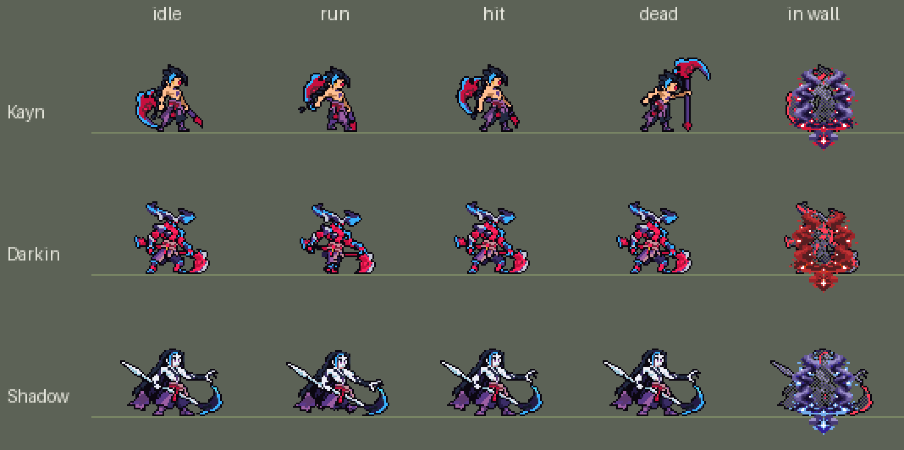

# 凯隐「暗裔魔镰」附加包（v0.2.0，可选）



**不装这个附加包，主包里的凯隐也是完整的**：两种形态（暗裔杀手、影流刺客）的外观、光环、出招动作和效果都在主包里。
主包是纯数据，有几件事做不到，这个附加包用原生代码补上：

| | 主包（纯数据） | 装了附加包（照英雄联盟） |
|---|---|---|
| 攒哪种形态 | 技能打中**身边**的英雄攒暗裔（2 次），W 只打中**远处**的英雄攒影流（1 次）——数据读不到目标是近战还是远程，按距离近似 | 打中**近战英雄**攒暗裔、打中**远程英雄**攒影流（普攻和技能都算，各 14 次），按英雄的攻击距离分 |
| 形态能留多久 | 这条命（数据的 buff 阵亡就清掉，复活后重攒） | **整局**：阵亡复活后光环和形态效果直接回来 |
| 变身后的样子 | 只有出招（普攻、Q、W、R 破体）是形态的动作，待机、跑步、受击、阵亡还是本体（游戏按名字自动播这几个，数据换不了） | **整个身体**都是形态的（只在游戏 0.6.2 上，别的版本退回左边那样） |
| 掠影步穿墙 | 无视地形的 buff 在，但寻路是预先算好、绕开墙的，实际不穿 | Q 转完的 2 秒里隔着墙有敌方英雄就**笔直穿过去**，人在墙里时是一团暗影（进墙、出墙各溅开一下） |

## 怎么做的

- `mod.override_info` 把主包的凯隐换成 `override/` 里的副本（`make_override.py` 从主包生成，主包的凯隐改了就重跑）：
  - 主包里四处攒能量的数据块（Q 旋转、W 近段、W 远段、R 破体，开头有 `league_kayn_mk_charge` 标记）换成「在打中的英雄身上挂
    `league_kayn_tag` 30 tick」，普攻打中英雄也挂；
  - 普攻第 1 tick 先看凯隐身上有没有本包给的准备标记（`league_kayn_ready_d` / `_s`），有就播主包的变身（动作、画面、声音、
    永久的形态 buff 和光环）并去掉标记；
  - `passive` 挂本包的被动 `league_kayn_form:orbs`（参数 `darkin_need` 14、`shadow_need` 14；试过 25、30、40，用户：「还是全部调成
    14次吧 不然打野太慢了」）；
  - 加上墙里的画面：`league_kayn_in_wall{,_d,_s}`（裹身的暗影雾，buff）和 `league_kayn_wall_burst{,_d,_s}`（进出墙溅开的暗影），
    图在主包的 `league_kayn_fx`（Codex 画的，`tools/art/import_kayn.py --wall`）。
- 被动 `orbs` 每 tick 看敌方英雄身上的标记（一层 = 一次命中），按英雄 id 查攻击距离（`src/ranges.rs`：原版英雄来自游戏数据，
  本包英雄来自各自的技能文件，`make_override.py` 生成），**35000 以上算远程**；查不到的英雄（别的 mod）按挂标记那一刻离凯隐
  多远猜（30000 以外算远程）。哪边先满就给凯隐挂准备标记，形态记在被动里（被动挂在玩家身上，阵亡不丢）：复活时、以及之后
  每 tick 发现凯隐身上没有形态 buff 也没有准备标记时，直接补上永久的形态 buff（变身动作只在第一次播）。
- **完整变身**（`src/view.rs`，只在游戏 0.6.2 上）：游戏画单位时用显示数据里的名字现拼精灵路径
  `asset/base/aseprite_resources/champions/{名字}`（拼路径的函数 rva 0x1fbaa80）。加载时核对这个函数开头的 20 个字节，对得上才给它
  装一个钩子，记下正在画的单位；客户端扩展每 0.1 秒把凯隐名字 `league_kayn` 的最后一个字母改成 `d`（暗裔）、`s`（影流），在墙里是
  `w` / `r` / `h`。`mod.override_info` 把这些名字送到主包的图集 `league_kayn_darkin` / `_shadow` / `_wall` / `_darkin_wall` /
  `_shadow_wall`（`tools/art/rig_kayn_forms.py` 用定稿的部件摆出两种形态的待机、跑步、受击、阵亡，`tools/art/import_native.py` 合成）。
  - **什么时候换**：游戏先在后台把整局算完，屏幕再回放（真实时间 8 秒里后台从 0:00 算到 7:38）。被动在画面那一侧的模拟里记下
    每次换样子的 tick，扩展读屏幕上的比赛时钟（`ingame.header.game_time.value`；死斗是记分板的倒数），走到那个 tick 才换；
    一秒以内按时钟跳动的快慢补上，倍速、暂停都跟得上。之前直接按后台换，屏幕上 2 级就变身了。
  - 画面那一侧自己的计数可能丢（门槛 40 时出现过整局不变身），所以形态以服务器那一侧（presim）定的为准，画面那一侧走到那个 tick 照着变。
- **掠影步穿墙**（`src/wall.rs`）：地图的墙是 30 × 30 的格子（同卡蜜尔附加包读的那份），Q 转完的 2 秒掠影步里，最近的敌方英雄在
  80000 以内、和凯隐之间隔着墙、离他 22000 以上时，用强制位移笔直穿过去（停在他前面 17600，即 22000 的 80%；落点在墙里就沿着这条线挪到墙的另一边）。只有
  这 2 秒里站在墙格上才算「在墙里」：平时贴着野区的墙走也会踩到墙格（格子很粗），第一版那样算，打野一两级就像变了身。
- 本包只换凯隐，别的英雄原样不动。原生代码只做判断（数标记、定形态、补 buff、挑穿墙的落点、换名字），画面、伤害、治疗都在数据里。

## 在游戏里测

1. 主包（League of Legends Heroes 0.52 以上）要装着并启用。
2. 把整个 `league_kayn_form` 文件夹放进 `<游戏目录>\mods\`，里面要有 `league_kayn_form.dll`、`mod.mod_info`、`mod.override_info`、
   `override\`、`text\`。
3. 进游戏，在 MOD 菜单里启用它（含代码的 mod 会弹一次确认），确认排在主包后面，重启游戏。
4. 看凯隐普攻的说明：「暗裔魔镰」后面写着「【附加包·照英雄联盟】」就说明副本生效了。
   （玩家装的是附加包合集 `league_addons`，见 [`../league_addons/README.md`](../league_addons/README.md)，凯隐的部分和这里一样。）
5. 日志在 `%APPDATA%\TeamSamoyed\TeamfightManager2\data\league_kayn_form.log`，每次启动游戏重写（上一次的留在 `.prev.log`）：
   - `DARKIN ready: darkin 14/14 shadow 6/14 (last hit #… fighter, range Some(23000))`：暗裔攒满，下一次普攻变身；
   - `SHADOW ready: …`：影流攒满；
   - `DARKIN form restored (respawn)`：复活后形态补回来；
   - 每行开头是加载后的秒数，`[view m=… s=…]` 是画面那一侧、`[presim …]` 是服务器那一侧，`t=… (6:43) … Lv8` 是比赛的 tick、时间和凯隐的等级；
   - `full transform on: drawing hook at …`：完整变身的钩子装上了（`off (…)` 就是游戏版本不对，只有出招是形态的）；
   - `screen clock 06:00 (ingame.header.game_time.value, 198 ticks a second)`：每分钟一行屏幕时钟和播放速度；
   - `on screen at 06:44: league_kayd` / `… drawn as league_kayd (Darkin)`：屏幕走到那里时换成的样子（`kayw` / `kayr` / `kayh` 是墙里）；
   - `shadow step through the wall: (…) -> (…), 34 ticks`：掠影步穿墙。

## 开发

在 `addons/` 里（长路径会让链接器报 LNK1104，目标目录放短路径）：

```
CARGO_TARGET_DIR=%LOCALAPPDATA%/Temp/<x>/target cargo test -p league_kayn_form
CARGO_TARGET_DIR=%LOCALAPPDATA%/Temp/<x>/target cargo build --release -p league_kayn_form
python addons/league_kayn_form/make_override.py      # 主包的凯隐或别的英雄的攻击距离改了就重跑
```

`src/view.rs`、`src/wall.rs` 的单元测试：只改凯隐的名字、形态和墙对应的字母、屏幕时钟取哪个时刻的样子、地图有 90 个墙格、
只在隔着墙时穿。`tests/wiring.rs` 走真实的导出入口跑被动：近战 / 远程分边、门槛、队友身上的标记不算、阵亡复活补回形态、准备标记过期也补、
查不到的英雄按距离猜。原生代码在 SDK 模拟里跑不了，平衡靠主包的数据部分和游戏日志。
